# learn-screenwriting-film-script-part-001.md

# Part 001 — Mental Model Naskah Film: Bukan Cerita, tapi Blueprint Pengalaman Audiovisual

> Seri: **Learn Screenwriting for Film Project — The First 20 Hours Approach**  
> Framework utama: **Josh Kaufman — The First 20 Hours**  
> Fokus part ini: membangun mental model dasar bahwa screenplay bukan prosa, bukan catatan ide, bukan novel pendek, melainkan **blueprint pengalaman audiovisual** yang akan dieksekusi oleh sutradara, aktor, kru, editor, dan akhirnya dipersepsi oleh penonton.

---

## Daftar Isi

1. [Tujuan Part 001](#1-tujuan-part-001)
2. [Hubungan Part Ini dengan Framework Josh Kaufman](#2-hubungan-part-ini-dengan-framework-josh-kaufman)
3. [Kesalahan Paling Awal: Mengira Naskah Film Sama dengan Cerita Tertulis](#3-kesalahan-paling-awal-mengira-naskah-film-sama-dengan-cerita-tertulis)
4. [Definisi Kerja: Apa Itu Naskah Film?](#4-definisi-kerja-apa-itu-naskah-film)
5. [Screenplay sebagai Blueprint, Bukan Produk Akhir](#5-screenplay-sebagai-blueprint-bukan-produk-akhir)
6. [Film sebagai Sistem Pengalaman Audiovisual](#6-film-sebagai-sistem-pengalaman-audiovisual)
7. [Perbedaan Cara Kerja Novel, Cerpen, Teater, dan Screenplay](#7-perbedaan-cara-kerja-novel-cerpen-teater-dan-screenplay)
8. [Mental Model Utama: Penonton Tidak Membaca Naskah, Penonton Mengalami Perubahan](#8-mental-model-utama-penonton-tidak-membaca-naskah-penonton-mengalami-perubahan)
9. [Scene sebagai Unit Eksekusi](#9-scene-sebagai-unit-eksekusi)
10. [Beat sebagai Unit Perubahan](#10-beat-sebagai-unit-perubahan)
11. [Karakter sebagai Sistem Keputusan](#11-karakter-sebagai-sistem-keputusan)
12. [Konflik sebagai Engine](#12-konflik-sebagai-engine)
13. [Aksi, Bukan Penjelasan: Apa yang Bisa Difilmkan?](#13-aksi-bukan-penjelasan-apa-yang-bisa-difilmkan)
14. [Subtext: Informasi yang Tidak Diucapkan tetapi Dirasakan](#14-subtext-informasi-yang-tidak-diucapkan-tetapi-dirasakan)
15. [Causal Chain: Karena Ini Terjadi, Maka Itu Terjadi](#15-causal-chain-karena-ini-terjadi-maka-itu-terjadi)
16. [State Machine Karakter: Cara Berpikir yang Cocok untuk Software Engineer](#16-state-machine-karakter-cara-berpikir-yang-cocok-untuk-software-engineer)
17. [Scene sebagai Function: Input, Process, Output, Side Effect](#17-scene-sebagai-function-input-process-output-side-effect)
18. [Plot sebagai Event Stream](#18-plot-sebagai-event-stream)
19. [Tema sebagai Invariant Makna](#19-tema-sebagai-invariant-makna)
20. [Audience sebagai Runtime Environment](#20-audience-sebagai-runtime-environment)
21. [Mengapa Cara Pikir Terlalu Deterministic Bisa Mengganggu Penulisan Film](#21-mengapa-cara-pikir-terlalu-deterministic-bisa-mengganggu-penulisan-film)
22. [Tetapi Cara Pikir Engineer Tetap Sangat Berguna](#22-tetapi-cara-pikir-engineer-tetap-sangat-berguna)
23. [Layering Naskah Film: Dari Ide ke Halaman](#23-layering-naskah-film-dari-ide-ke-halaman)
24. [Contoh Transformasi: Dari Narasi Prosa ke Screenplay](#24-contoh-transformasi-dari-narasi-prosa-ke-screenplay)
25. [Anti-Pattern Pemula](#25-anti-pattern-pemula)
26. [Checklist Mental Model Part 001](#26-checklist-mental-model-part-001)
27. [Latihan Praktik Part 001](#27-latihan-praktik-part-001)
28. [Template Kerja](#28-template-kerja)
29. [Output yang Harus Dihasilkan Setelah Part Ini](#29-output-yang-harus-dihasilkan-setelah-part-ini)
30. [Rangkuman](#30-rangkuman)
31. [Preview Part 002](#31-preview-part-002)
32. [Referensi Ringkas](#32-referensi-ringkas)

---

# 1. Tujuan Part 001

Part ini bertujuan membongkar asumsi awal tentang naskah film.

Banyak orang mulai menulis naskah film dengan membawa kebiasaan dari bentuk tulisan lain: cerpen, novel, puisi, artikel, atau bahkan dokumentasi teknis. Masalahnya, screenplay punya fungsi berbeda.

Screenplay bukan sekadar “cerita yang ditulis dalam format film”. Screenplay adalah **dokumen instruksi dramatik** yang menjelaskan:

1. apa yang terlihat,
2. apa yang terdengar,
3. siapa yang melakukan apa,
4. konflik apa yang terjadi,
5. perubahan apa yang muncul,
6. informasi apa yang diterima penonton,
7. emosi apa yang dipicu melalui aksi, suara, ritme, dan visual.

Part ini akan membangun mental model bahwa film bukan terutama “rangkaian informasi”, tetapi **rangkaian pengalaman**.

Setelah menyelesaikan part ini, targetnya Anda mampu:

- membedakan screenplay dari prosa;
- memahami bahwa scene adalah unit eksekusi dramatik;
- memahami beat sebagai unit perubahan;
- melihat karakter sebagai sistem keputusan, bukan biodata;
- melihat konflik sebagai engine, bukan dekorasi;
- mengevaluasi apakah sebuah kalimat bisa difilmkan atau hanya bisa dibaca;
- memakai analogi software engineering tanpa membuat cerita menjadi terlalu mekanis;
- mulai membaca film sebagai sistem input, state, event, transition, dan output emosional.

---

# 2. Hubungan Part Ini dengan Framework Josh Kaufman

Josh Kaufman dalam pendekatan **The First 20 Hours** menekankan bahwa skill besar perlu dipecah menjadi sub-skill kecil yang bisa dilatih secara sadar. Untuk screenwriting, kesalahan umum adalah menganggap skill-nya satu hal besar: “menulis naskah film”.

Padahal “menulis naskah film” terdiri dari banyak sub-skill:

- membuat premis;
- membuat logline;
- mendesain karakter;
- mendesain konflik;
- membuat struktur;
- membuat beat sheet;
- menulis scene;
- menulis action line;
- menulis dialog;
- membangun subtext;
- mengelola pacing;
- melakukan rewrite;
- menerima feedback;
- menyederhanakan naskah agar bisa diproduksi.

Part 001 adalah fondasi untuk tahap pertama Kaufman: **deconstruct the skill**.

Sebelum kita memecah skill menjadi latihan teknis, kita perlu tahu dulu objek yang sedang dilatih. Kita tidak sedang belajar “menulis bagus” secara umum. Kita sedang belajar membuat dokumen yang dapat berubah menjadi film.

Diagram hubungan Part 001 dengan framework Kaufman:

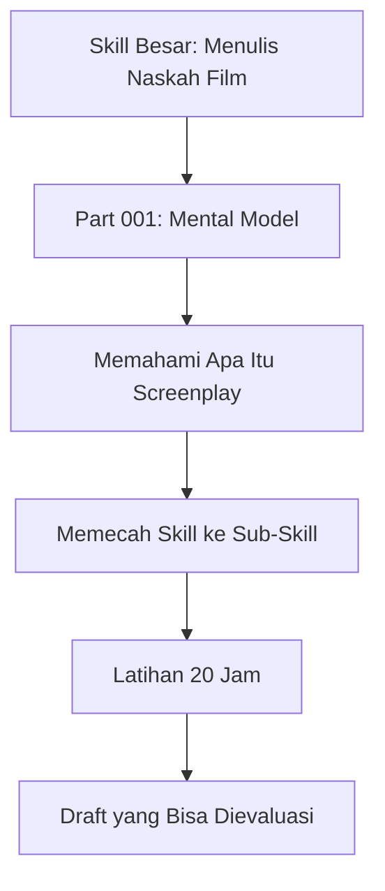

Part ini belum bertujuan membuat Anda langsung menulis naskah penuh. Part ini bertujuan membuat Anda **melihat naskah film dengan benar**.

Kalau mental model awal salah, latihan berikutnya akan boros. Anda bisa menulis banyak halaman, tetapi halaman itu tidak bergerak seperti film.

---

# 3. Kesalahan Paling Awal: Mengira Naskah Film Sama dengan Cerita Tertulis

Kesalahan paling umum pemula adalah menulis seperti ini:

```text
Raka merasa sangat bersalah atas kematian ayahnya. Ia selalu menyimpan trauma itu di dalam hatinya. Ia takut menjadi seperti ayahnya, tetapi juga tidak bisa melepaskan bayangan masa lalu.
```

Kalimat itu bisa bekerja dalam novel atau cerpen, karena pembaca menerima akses langsung ke pikiran karakter. Tetapi dalam film, penonton tidak melihat “rasa bersalah” sebagai kalimat. Penonton melihat:

- tubuh yang berhenti di depan pintu;
- tangan yang gemetar;
- benda lama yang tidak berani disentuh;
- foto yang dibalik;
- pesan suara yang diputar berulang;
- seseorang yang ingin bicara tetapi menelan kembali kalimatnya;
- pilihan yang salah karena rasa takut yang tidak ia akui.

Dalam screenplay, tugas penulis bukan menjelaskan emosi secara abstrak. Tugas penulis adalah **menciptakan kondisi visual dan perilaku** agar emosi itu bisa disimpulkan.

Bandingkan:

```text
Novelistik:
Raka sangat marah kepada ibunya, tetapi jauh di dalam hatinya ia masih mencintainya.
```

Lebih filmik:

```text
INT. DAPUR - MALAM

Raka meletakkan kantong obat di meja. Keras.

IBU
Kamu sudah makan?

Raka tidak menjawab. Ia membuka kulkas, mengambil air, lalu melihat piring makan yang sudah disiapkan untuknya.

Ia menutup kulkas.

RAKA
Aku cuma antar obat.

Raka berjalan keluar. Di ambang pintu, ia berhenti.

RAKA
Obat merah diminum setelah makan.

Ia pergi.
```

Versi kedua tidak berkata “marah tapi masih sayang”, tetapi perilakunya membuat penonton menangkap kontradiksi itu.

Inilah prinsip besar screenplay:

> **Jangan menulis apa yang karakter rasakan. Tulis kondisi, aksi, pilihan, suara, objek, gesture, dan konsekuensi yang membuat penonton merasakannya.**

---

# 4. Definisi Kerja: Apa Itu Naskah Film?

Untuk seri ini, kita pakai definisi kerja berikut:

> **Naskah film adalah blueprint dramatik-audiovisual yang menyusun aksi, dialog, konflik, perubahan, dan informasi dalam bentuk scene agar bisa diproduksi menjadi pengalaman film.**

Definisi ini punya beberapa implikasi penting.

## 4.1 Blueprint

Blueprint berarti naskah bukan produk akhir. Produk akhirnya adalah film.

Naskah akan dibaca oleh:

- sutradara;
- produser;
- aktor;
- sinematografer;
- editor;
- production designer;
- sound designer;
- composer;
- script supervisor;
- kru produksi;
- investor atau stakeholder project.

Masing-masing membaca naskah dengan kebutuhan berbeda.

Sutradara bertanya:

- Apa visi scene ini?
- Apa perubahan emosi yang harus terjadi?
- Bagaimana blocking dan visualnya?

Produser bertanya:

- Berapa lokasi?
- Berapa pemain?
- Apakah ada adegan mahal?
- Apakah ini feasible?

Aktor bertanya:

- Apa yang karakterku inginkan?
- Apa yang ia sembunyikan?
- Apa yang berubah dalam scene ini?

Editor bertanya:

- Apa ritme cerita?
- Apa titik masuk dan keluar scene?
- Apakah transisi antar-scene punya momentum?

Sound designer bertanya:

- Apa dunia suara film ini?
- Apakah ada keheningan, ambience, motif suara, atau kontras akustik?

Jadi naskah bukan hanya “teks untuk dibaca”. Naskah adalah **interface antar-departemen kreatif**.

## 4.2 Dramatik

Dramatik berarti naskah harus berisi tekanan, pilihan, konsekuensi, konflik, dan perubahan.

Scene yang hanya menyampaikan informasi biasanya lemah.

Contoh scene lemah:

```text
Dua karakter duduk dan menjelaskan latar belakang dunia selama lima halaman.
```

Scene lebih dramatik:

```text
Dua karakter harus memutuskan apakah mereka akan membuka rahasia lama di depan orang yang bisa menghancurkan keluarga mereka. Informasi masa lalu muncul karena salah satu dari mereka sedang menekan yang lain.
```

Informasi menjadi hidup ketika diberikan dalam tekanan.

## 4.3 Audiovisual

Audiovisual berarti film bekerja lewat:

- gambar;
- suara;
- dialog;
- gerak tubuh;
- ekspresi;
- ruang;
- objek;
- ritme;
- keheningan;
- musik;
- kontras visual;
- blocking;
- durasi shot;
- perpindahan scene.

Screenplay tidak harus mengatur semua aspek teknis kamera, tetapi harus menyediakan bahan dramatik yang bisa divisualkan dan didengar.

## 4.4 Scene-Based

Screenplay dibangun dari scene.

Scene biasanya punya:

- lokasi;
- waktu;
- karakter yang hadir;
- tujuan karakter;
- konflik;
- informasi baru;
- perubahan keadaan.

Jika tidak ada perubahan, scene patut dicurigai.

---

# 5. Screenplay sebagai Blueprint, Bukan Produk Akhir

Dalam software engineering, source code adalah artifact yang dieksekusi mesin. Dalam film, screenplay adalah artifact yang dieksekusi manusia dan alat produksi.

Analogi ini tidak sempurna, tetapi berguna.

| Software Engineering | Screenwriting |
|---|---|
| Source code | Screenplay |
| Runtime | Produksi dan penonton |
| Function | Scene |
| State | Kondisi karakter/cerita |
| Event | Plot beat |
| Side effect | Konsekuensi dramatik |
| Exception | Reversal / twist / kegagalan tak terduga |
| Integration test | Table read / feedback session |
| Refactor | Rewrite |
| Deployment | Shooting / production |
| Observability | Respons pembaca/penonton |

Tetapi ada perbedaan besar.

Program idealnya deterministic. Jika input sama, output harus sama.

Cerita tidak bekerja seperti itu.

Cerita bekerja lewat persepsi manusia. Penonton membawa:

- pengalaman pribadi;
- trauma;
- humor;
- budaya;
- ekspektasi genre;
- mood saat menonton;
- pemahaman bahasa;
- kesabaran;
- bias moral;
- kedekatan dengan isu tertentu.

Maka screenplay bukan mesin deterministik. Screenplay adalah **rancangan pengalaman yang probabilistik**.

Tugas penulis bukan memaksa semua penonton merasakan hal yang sama secara identik. Tugas penulis adalah meningkatkan probabilitas bahwa penonton mengalami arah emosi dan makna yang diinginkan.

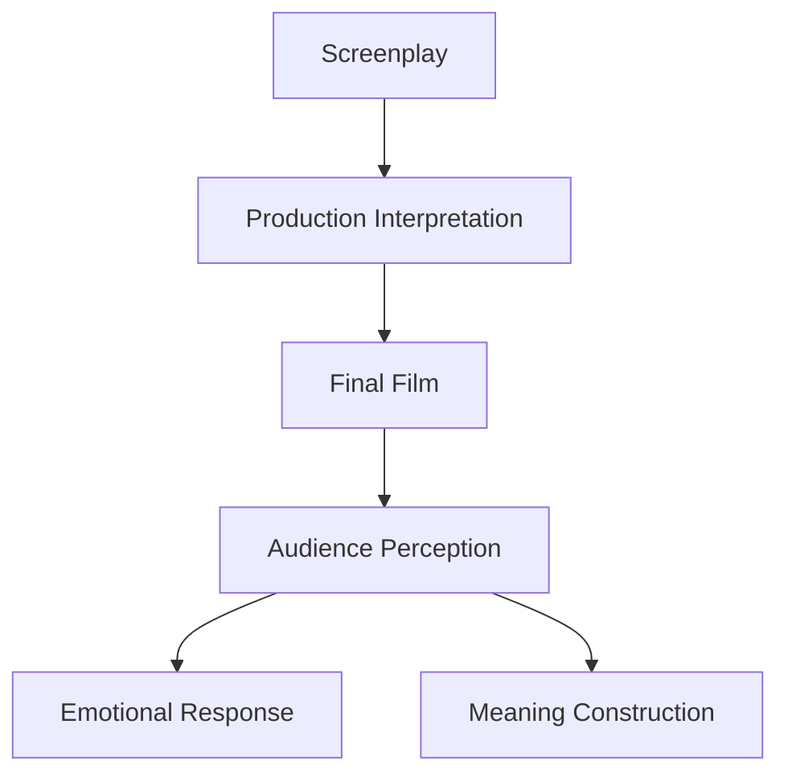

Implikasinya:

- naskah harus jelas, tetapi tidak boleh terlalu menjelaskan;
- naskah harus terstruktur, tetapi tidak boleh terasa mekanis;
- karakter harus logis, tetapi manusia tidak selalu rasional;
- konflik harus punya sebab-akibat, tetapi emosi bisa ambigu;
- ending harus terasa earned, bukan sekadar “benar secara diagram”.

---

# 6. Film sebagai Sistem Pengalaman Audiovisual

Film bukan hanya plot.

Film adalah sistem pengalaman yang terdiri dari beberapa layer:

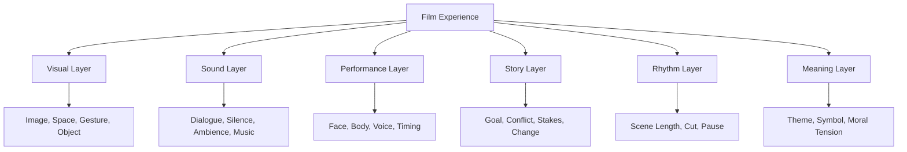

Screenplay tidak menulis semua layer secara final. Banyak layer akan diselesaikan oleh sutradara, aktor, DOP, editor, composer, dan sound designer. Tetapi screenplay harus menyediakan **struktur dramatik** agar layer-layer itu punya arah.

Contoh:

Jika naskah hanya menulis:

```text
Mereka bertengkar.
```

Itu terlalu kosong.

Jika naskah menulis:

```text
Raka dan Sinta bertengkar selama tiga menit dengan emosi yang sangat intens, kamera close-up ke mata Sinta, lalu cut ke tangan Raka yang gemetar.
```

Itu mungkin terlalu mengarahkan kamera, kecuali memang penulis juga sutradara atau format project mengizinkan.

Versi yang lebih screenplay-friendly:

```text
Sinta menaruh amplop cokelat di meja.

Raka melihat nama rumah sakit di sudut amplop itu. Wajahnya mengeras.

RAKA
Kamu buka?

SINTA
Aku yang bayar tagihannya.

Raka meraih amplop itu. Sinta menahannya.

Untuk pertama kalinya, Raka tidak bisa menatapnya.
```

Versi ini menyediakan:

- objek visual: amplop;
- informasi: rumah sakit;
- konflik: privasi vs tanggung jawab;
- power shift: Sinta menahan amplop;
- subtext: ada sesuatu yang disembunyikan;
- performable action: tidak bisa menatap.

---

# 7. Perbedaan Cara Kerja Novel, Cerpen, Teater, dan Screenplay

Agar mental model jelas, kita perlu membandingkan medium.

## 7.1 Novel

Novel punya akses besar ke interioritas.

Novel bisa menulis:

```text
Ia teringat masa kecilnya, ketika ayahnya memukul meja dengan cara yang sama. Sejak itu, suara kayu dipukul selalu membuat dadanya sesak.
```

Novel bisa masuk ke:

- pikiran;
- ingatan;
- asosiasi;
- refleksi;
- narasi subjektif;
- bahasa batin;
- komentar narrator.

## 7.2 Cerpen

Cerpen juga bisa masuk ke interioritas, tetapi lebih ekonomis. Cerpen sering bekerja lewat satu momen, satu perubahan, satu ironi, atau satu reveal.

Cerpen bisa sangat dekat dengan film pendek dalam scope, tetapi medium-nya tetap teks.

## 7.3 Teater

Teater lebih dekat ke film karena berbasis performance, tetapi berbeda karena:

- ruang panggung lebih terbatas;
- dialog sering lebih dominan;
- blocking terjadi dalam ruang live;
- transisi lokasi tidak sebebas film;
- penonton mengalami waktu secara langsung;
- bahasa bisa lebih retoris atau stylized.

## 7.4 Screenplay

Screenplay bekerja lewat sesuatu yang bisa ditangkap kamera dan mikrofon.

Screenplay harus bertanya:

- Apa yang terlihat?
- Apa yang terdengar?
- Apa yang dilakukan karakter?
- Apa yang berubah setelah scene ini?
- Apa yang penonton ketahui sekarang yang sebelumnya tidak?
- Apa yang karakter ketahui sekarang yang sebelumnya tidak?
- Apa yang menjadi lebih sulit?
- Apa yang menjadi tidak bisa dibatalkan?

Tabel perbandingan:

| Medium | Kekuatan Utama | Risiko Jika Dibawa ke Screenplay |
|---|---|---|
| Novel | Interioritas, refleksi, bahasa naratif | Terlalu banyak menjelaskan pikiran |
| Cerpen | Kepadatan momen, ironi, atmosfer | Terlalu literer, kurang aksi visual |
| Teater | Dialog, performance, konflik langsung | Terlalu banyak percakapan statis |
| Screenplay | Visual, suara, aksi, perubahan scene | Terlalu tipis jika hanya mengejar format |

Mental model penting:

> **Screenplay tidak melarang kedalaman batin. Screenplay hanya memaksa kedalaman batin diterjemahkan menjadi perilaku, gambar, suara, pilihan, dan konsekuensi.**

---

# 8. Mental Model Utama: Penonton Tidak Membaca Naskah, Penonton Mengalami Perubahan

Pembaca novel membaca kalimat.

Penonton film mengalami rangkaian stimulus:

- wajah aktor;
- suara napas;
- jeda;
- object detail;
- silence;
- framing;
- sound ambience;
- timing;
- konflik;
- musik;
- ekspresi;
- keputusan karakter;
- konsekuensi.

Karena itu, naskah film harus memikirkan **perubahan pengalaman**.

Setiap bagian film idealnya mengubah sesuatu, misalnya:

- penonton tahu informasi baru;
- karakter kehilangan kontrol;
- hubungan dua karakter berubah;
- risiko meningkat;
- pilihan semakin sempit;
- kebohongan mulai retak;
- tema diuji lebih keras;
- tujuan karakter berubah;
- penonton melihat karakter dengan cara baru.

Diagram sederhana:

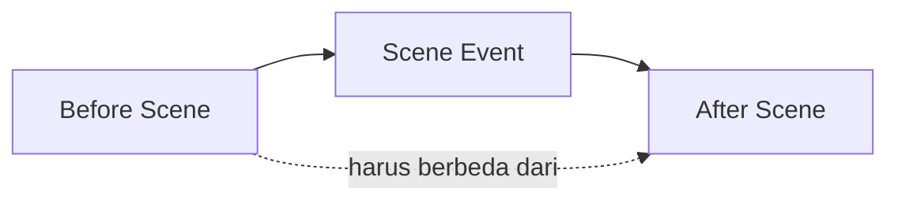

Jika **before** dan **after** scene sama, scene itu mungkin tidak diperlukan.

Contoh scene tanpa perubahan:

```text
Dua karakter bertemu di kafe. Mereka membicarakan pekerjaan. Setelah itu mereka pulang. Tidak ada informasi penting, tidak ada perubahan hubungan, tidak ada konflik, tidak ada keputusan.
```

Scene dengan perubahan:

```text
Dua karakter bertemu di kafe untuk membicarakan pekerjaan. Salah satu diam-diam merekam percakapan. Yang lain menyadari hal itu, tetapi pura-pura tidak tahu. Setelah scene, hubungan mereka berubah dari kerja sama menjadi perang dingin.
```

Perubahannya jelas:

- status hubungan berubah;
- ada informasi baru;
- ada ancaman;
- ada strategi tersembunyi;
- ada konflik berikutnya.

---

# 9. Scene sebagai Unit Eksekusi

Scene adalah unit dasar screenplay.

Secara sederhana:

> **Scene adalah satu unit dramatik yang terjadi dalam ruang dan waktu tertentu, berisi aksi yang menyebabkan perubahan.**

Scene biasanya dimulai dengan scene heading:

```text
INT. RUMAH RAKA - MALAM
```

atau:

```text
EXT. TERMINAL BUS - PAGI
```

Tetapi scene bukan hanya lokasi. Scene adalah unit perubahan.

## 9.1 Scene Bukan Sekadar Tempat Kejadian

Ini bukan scene yang kuat:

```text
INT. KAFE - SIANG

Raka dan Sinta duduk. Mereka ngobrol tentang masa lalu.
```

Pertanyaannya:

- Apa tujuan Raka?
- Apa tujuan Sinta?
- Apa yang mereka sembunyikan?
- Apa yang dipertaruhkan?
- Apa yang berubah?
- Kenapa scene ini harus ada?

Scene yang lebih jelas:

```text
INT. KAFE - SIANG

Raka datang untuk meminta Sinta menghapus rekaman pengakuannya.
Sinta datang untuk memastikan Raka menandatangani surat perjanjian.
Keduanya berpura-pura ini hanya reuni biasa.
```

Sekarang scene punya engine.

## 9.2 Komponen Scene

Minimal scene perlu punya:

| Komponen | Pertanyaan |
|---|---|
| Location/time | Di mana dan kapan? |
| Characters | Siapa yang hadir? |
| Scene goal | Apa yang diinginkan karakter utama di scene ini? |
| Obstacle | Apa yang menghalangi? |
| Tactic | Apa strategi karakter? |
| Turn | Perubahan apa yang terjadi? |
| Output | Kondisi baru setelah scene? |

## 9.3 Scene sebagai Eksekusi Perubahan

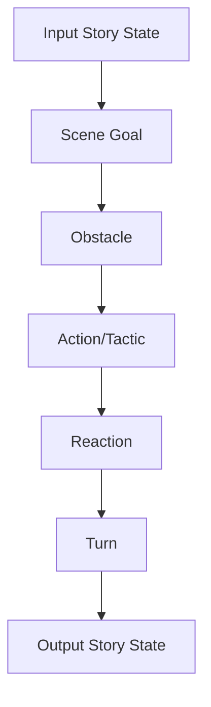

Contoh:

| Elemen | Isi |
|---|---|
| Input state | Raka percaya Sinta belum tahu rahasianya |
| Scene goal | Raka ingin mengambil amplop sebelum dibuka |
| Obstacle | Sinta sudah membaca isinya |
| Tactic | Raka berbohong dan mengalihkan perhatian |
| Turn | Sinta mengutip satu kalimat dari dokumen itu |
| Output state | Raka tahu ia sudah ketahuan |

Scene ini mengubah status informasi.

Sebelum scene:

```text
Raka merasa aman.
```

Sesudah scene:

```text
Raka terekspos.
```

Inilah perubahan.

---

# 10. Beat sebagai Unit Perubahan

Jika scene adalah function, beat adalah instruksi penting di dalam function.

Beat adalah unit kecil perubahan dalam scene atau cerita.

Beat bisa berupa:

- informasi baru;
- perubahan emosi;
- perubahan taktik;
- perubahan power;
- perubahan ritme;
- keputusan;
- reveal;
- reversal;
- pause yang bermakna;
- gesture yang mengubah interpretasi.

Contoh scene:

```text
INT. DAPUR - MALAM

Sinta mencuci piring. Raka masuk membawa amplop.

RAKA
Ini dari rumah sakit.

Sinta berhenti mencuci.

SINTA
Buang saja.

Raka tidak bergerak.

RAKA
Namamu ada di dalamnya.

Piring di tangan Sinta terlepas. Pecah.
```

Beat-nya:

1. Sinta berada dalam rutinitas normal.
2. Raka membawa amplop rumah sakit.
3. Sinta bereaksi defensif: “Buang saja.”
4. Raka menaikkan tekanan: namamu ada di dalamnya.
5. Sinta kehilangan kontrol: piring pecah.

Beat bukan hanya kejadian. Beat adalah perubahan.

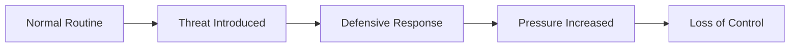

Dalam latihan 20 jam, kemampuan mendeteksi beat sangat penting karena membantu Anda:

- melihat apakah scene bergerak;
- memotong bagian yang datar;
- mengatur ritme;
- membedakan dialog kosong dari dialog yang mengubah situasi;
- membangun escalation.

---

# 11. Karakter sebagai Sistem Keputusan

Pemula sering membuat karakter sebagai biodata:

```text
Nama: Raka
Umur: 32
Pekerjaan: Arsitek
Sifat: pendiam, keras kepala, penyayang
Hobi: membaca
```

Biodata bisa berguna, tetapi tidak cukup untuk screenplay.

Dalam film, karakter paling terlihat melalui keputusan di bawah tekanan.

Definisi kerja:

> **Karakter adalah pola keputusan yang muncul ketika seseorang menginginkan sesuatu, dihalangi sesuatu, dan harus membayar harga tertentu untuk bertindak.**

Karakter bukan “orang baik” atau “orang jahat”. Karakter adalah:

- apa yang ia inginkan;
- kenapa ia menginginkannya;
- apa yang ia takutkan;
- strategi apa yang ia pakai;
- kebohongan apa yang ia percaya;
- apa yang ia sembunyikan;
- apa yang ia lakukan saat terdesak;
- apa yang ia korbankan;
- apa yang akhirnya berubah atau gagal berubah.

## 11.1 Want, Need, Flaw

Tiga konsep awal:

| Konsep | Arti | Contoh |
|---|---|---|
| Want | Keinginan sadar | Raka ingin menjual rumah lama keluarganya |
| Need | Kebutuhan batin yang belum diakui | Raka perlu memaafkan dirinya sendiri |
| Flaw | Pola salah yang menghambat | Raka selalu kabur dari percakapan emosional |

Konflik menarik muncul ketika want dan need tidak sejalan.

Contoh:

```text
Raka ingin menjual rumah agar bebas dari masa lalu.
Tetapi yang ia butuhkan adalah menghadapi masa lalu.
```

Maka plot bisa memaksa Raka masuk ke situasi yang membuat kabur tidak mungkin lagi.

## 11.2 Karakter Terlihat dari Pilihan

Jangan hanya menulis:

```text
Sinta adalah orang yang berani.
```

Tulis situasi yang memaksa keberanian:

```text
Di ruang rapat, semua orang menunduk setelah direktur menyalahkan staf magang.

Sinta mengangkat tangan.

SINTA
Yang approve saya.
```

Keberanian terlihat melalui pilihan yang punya biaya.

## 11.3 Karakter sebagai State Machine

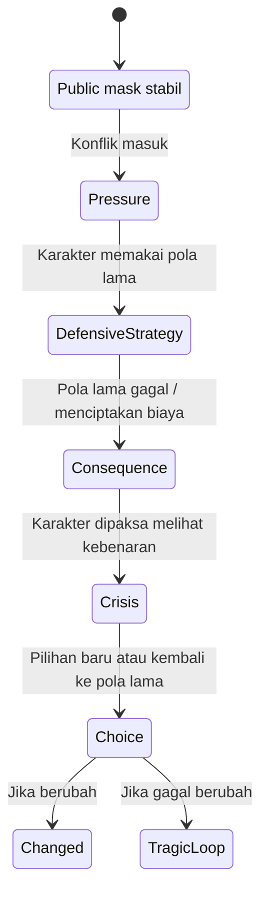

State ini tidak harus eksplisit di naskah, tetapi penulis perlu tahu.

Contoh:

| State | Deskripsi |
|---|---|
| MaskNormal | Raka terlihat rasional dan dingin |
| Pressure | Ibunya sakit, rumah harus dijual |
| DefensiveStrategy | Raka mengurus semuanya lewat pengacara |
| Consequence | Ibunya menolak tanda tangan |
| Crisis | Raka harus datang langsung ke rumah lama |
| Choice | Mengakui rasa bersalah atau tetap kabur |
| Changed/TragicLoop | Ia berubah atau kehilangan ibunya secara emosional |

---

# 12. Konflik sebagai Engine

Konflik bukan berarti teriakan, perkelahian, atau adegan besar. Konflik adalah benturan keinginan, nilai, kepentingan, atau kebutuhan yang tidak bisa diselesaikan tanpa biaya.

Definisi kerja:

> **Konflik terjadi ketika dua force saling menekan dan keduanya tidak bisa sama-sama menang tanpa perubahan.**

Force itu bisa berupa:

- karakter vs karakter;
- karakter vs dirinya sendiri;
- karakter vs institusi;
- karakter vs keluarga;
- karakter vs waktu;
- karakter vs alam;
- karakter vs norma sosial;
- karakter vs masa lalu;
- karakter vs rasa bersalah;
- karakter vs sistem ekonomi;
- karakter vs tubuhnya sendiri.

## 12.1 Konflik sebagai Mesin Scene

Tanpa konflik, scene mudah menjadi laporan.

```text
Raka memberi tahu Sinta bahwa ia akan pindah.
```

Ini informasi.

Beri konflik:

```text
Raka ingin memberi tahu Sinta bahwa ia akan pindah, tetapi Sinta baru saja menjual mobilnya agar mereka bisa membuka usaha bersama.
```

Sekarang informasi punya biaya.

## 12.2 Konflik Membutuhkan Ketidakcocokan

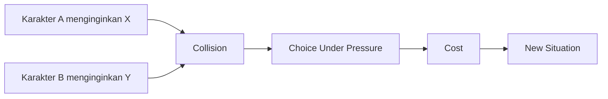

Contoh:

- Raka ingin merahasiakan penyakitnya.
- Sinta ingin transparansi sebelum menikah.
- Mereka saling mencintai.
- Kejujuran bisa menyelamatkan hubungan, tetapi juga bisa menghancurkannya.

Konflik kuat karena tidak ada pilihan tanpa biaya.

## 12.3 Konflik Internal dan Eksternal Harus Saling Mengunci

Konflik eksternal:

```text
Rumah keluarga harus dijual dalam 7 hari.
```

Konflik internal:

```text
Raka tidak sanggup masuk ke rumah itu karena trauma.
```

Jika keduanya dikunci, plot jadi kuat:

```text
Untuk menyelamatkan ibunya dari utang, Raka harus menjual rumah lama. Tetapi untuk menjualnya, ia harus masuk kembali ke tempat yang selama ini ia hindari.
```

Eksternal memaksa internal muncul.

---

# 13. Aksi, Bukan Penjelasan: Apa yang Bisa Difilmkan?

Screenplay harus menulis hal yang bisa dilihat atau didengar.

Ini bukan aturan absolut bahwa penulis tidak boleh punya kedalaman psikologis. Ini adalah disiplin translasi.

Pertanyaan utamanya:

> **Kalau kamera dan mikrofon ada di lokasi, apa yang bisa mereka tangkap?**

## 13.1 Tidak Filmable

```text
Raka merasa hidupnya gagal.
```

Kamera tidak bisa merekam “merasa hidupnya gagal” secara langsung.

## 13.2 Lebih Filmable

```text
Raka duduk di tepi ranjang. Di lantai: surat penolakan kerja, tagihan listrik, dan undangan reuni kampus.

Ia mengambil undangan itu. Foto teman-teman lamanya tersenyum dari kertas glossy.

Raka melipat undangan itu sampai wajahnya sendiri tertutup.
```

Sekarang kegagalan hidup dikomunikasikan lewat:

- objek;
- komposisi;
- tindakan;
- kontras sosial;
- gesture.

## 13.3 Kategori Kalimat Screenplay

| Kategori | Boleh? | Catatan |
|---|---|---|
| Aksi fisik | Ya | Sangat penting |
| Dialog | Ya | Harus punya fungsi dramatik |
| Suara | Ya | Ambience, suara objek, napas, musik diegetic |
| Emosi abstrak | Hati-hati | Terjemahkan ke perilaku |
| Pikiran batin | Hati-hati | Gunakan visual, aksi, V.O. jika memang device |
| Backstory panjang | Hati-hati | Reveal melalui konflik |
| Instruksi kamera detail | Hati-hati | Jangan over-directing kecuali perlu |
| Analisis penulis | Tidak ideal | Penonton tidak melihat analisis |

## 13.4 Tes Filmable

Untuk setiap kalimat action line, tanyakan:

1. Bisa dilihat?
2. Bisa didengar?
3. Bisa dimainkan aktor?
4. Bisa ditangkap oleh departemen produksi?
5. Apakah kalimat ini memberi aksi, bukan opini penulis?

Jika jawabannya tidak, ubah.

Contoh:

```text
Buruk:
Sinta merasa bahwa hubungannya dengan Raka sudah tidak punya masa depan.
```

```text
Lebih filmik:
Sinta melepas cincin dari jarinya. Bukan dibuang. Ia meletakkannya perlahan di sebelah kunci apartemen Raka.
```

---

# 14. Subtext: Informasi yang Tidak Diucapkan tetapi Dirasakan

Subtext adalah salah satu konsep paling penting dalam screenwriting.

Definisi kerja:

> **Subtext adalah maksud, emosi, atau konflik yang hadir di bawah permukaan dialog dan aksi.**

Orang jarang mengatakan semua hal secara langsung. Dalam hidup nyata, manusia menyembunyikan:

- rasa takut;
- rasa sayang;
- rasa malu;
- kecemburuan;
- niat manipulatif;
- kebutuhan validasi;
- rasa bersalah;
- keinginan untuk pergi;
- keinginan untuk ditahan.

Dialog yang terlalu literal terasa datar.

## 14.1 Dialog Literal

```text
SINTA
Aku marah karena kamu selalu menghindar dari masalah kita.

RAKA
Aku menghindar karena aku takut bicara jujur.
```

Ini jelas, tetapi kurang dramatik.

## 14.2 Dialog dengan Subtext

```text
SINTA
Kopimu dingin.

RAKA
Aku bisa bikin lagi.

SINTA
Bukan kopinya yang aku tunggu.
```

Surface:

- mereka bicara tentang kopi.

Subtext:

- Sinta menunggu kejujuran;
- Raka menghindar;
- hubungan mereka retak.

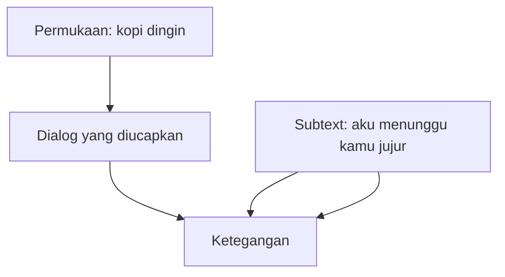

Subtext membuat penonton aktif. Penonton tidak hanya menerima informasi, tetapi menyimpulkan.

---

# 15. Causal Chain: Karena Ini Terjadi, Maka Itu Terjadi

Cerita kuat biasanya punya causal chain.

Bukan:

```text
Ini terjadi, lalu itu terjadi, lalu hal lain terjadi.
```

Tetapi:

```text
Karena ini terjadi, maka karakter melakukan itu. Karena ia melakukan itu, konsekuensi baru muncul. Karena konsekuensi itu, pilihan berikutnya menjadi lebih sulit.
```

## 15.1 Event List Lemah

```text
Raka bangun.
Raka pergi kerja.
Raka bertemu Sinta.
Raka pulang.
Raka mendapat telepon.
```

Ini hanya urutan kejadian.

## 15.2 Causal Chain Lebih Kuat

```text
Raka bangun terlambat karena semalaman menghindari telepon ibunya.
Karena terlambat, ia melewatkan presentasi penting.
Karena presentasi gagal, bosnya memberi ultimatum.
Karena ultimatum itu, Raka terpaksa menerima tawaran pulang ke rumah lama untuk mengurus penjualan aset keluarga.
```

Sekarang kejadian saling menyebabkan.

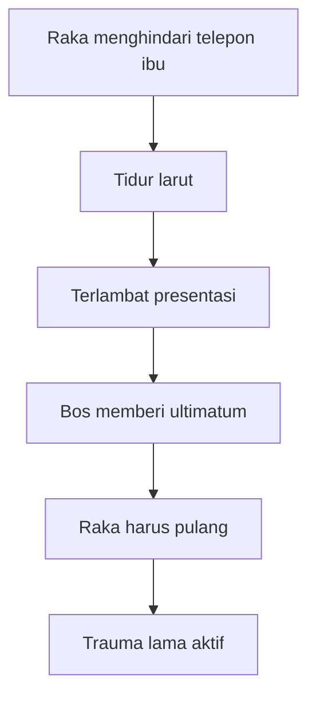

Causal chain penting karena membuat cerita terasa inevitable, bukan random.

Tetapi hati-hati: “inevitable” tidak berarti mudah ditebak. Cerita bagus sering terasa mengejutkan saat terjadi, tetapi masuk akal setelah dipikirkan.

---

# 16. State Machine Karakter: Cara Berpikir yang Cocok untuk Software Engineer

Sebagai software engineer, Anda bisa menggunakan state machine untuk memahami arc karakter.

Namun, jangan menyederhanakan manusia menjadi enum yang kaku. Gunakan state machine sebagai alat diagnosis, bukan sebagai formula mati.

## 16.1 State Awal

State awal karakter adalah kondisi psikologis dan sosial sebelum cerita memaksanya berubah.

Contoh:

```yaml
character: Raka
initial_state:
  public_mask: rasional, dingin, profesional
  private_fear: takut dianggap gagal sebagai anak
  false_belief: kalau aku tidak membicarakan masa lalu, aku bisa bebas
  coping_strategy: menghindar, delegasi, transaksi finansial
```

## 16.2 Event Pemicu

Event pemicu adalah sesuatu yang mengganggu state normal.

```yaml
inciting_event:
  event: ibu Raka menolak menjual rumah kecuali Raka datang langsung
  effect: strategi menghindar tidak bisa dipakai
```

## 16.3 Transition

Transition terjadi ketika karakter harus memilih.

```yaml
transition:
  from: avoidance
  pressure: deadline utang keluarga
  choice: pulang ke rumah lama atau membiarkan ibu kehilangan rumah
  cost: menghadapi trauma
```

## 16.4 State Baru

State baru muncul setelah keputusan dan konsekuensi.

```yaml
new_state:
  external: Raka kembali ke rumah lama
  internal: rasa bersalah yang ditekan mulai muncul
  relationship: hubungan dengan ibu semakin tegang
```

Diagram:

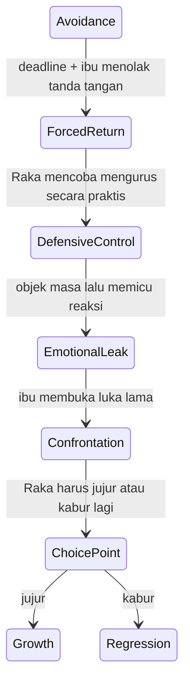

## 16.5 Invariant Karakter

Dalam sistem, invariant adalah kondisi yang harus tetap benar. Dalam karakter, invariant bisa berupa pertanyaan dramatik inti.

Contoh:

```text
Setiap kali Raka ditekan secara emosional, ia mencoba mengubah relasi menjadi transaksi praktis.
```

Ini pola.

Film kemudian menguji pola itu berkali-kali sampai pola tersebut:

- pecah,
- berubah,
- atau menghancurkan karakter.

---

# 17. Scene sebagai Function: Input, Process, Output, Side Effect

Ini adalah mental model yang sangat berguna untuk penulis dengan background engineering.

Bayangkan scene sebagai function:

```text
Scene(input_story_state) -> output_story_state + side_effects
```

Contoh:

```text
Scene: Raka datang ke rumah lama untuk mengambil sertifikat rumah.
```

Input:

```yaml
raka:
  wants: mengambil sertifikat cepat-cepat
  believes: ibu hanya emosional dan bisa dibujuk
  emotional_state: defensif
ibu:
  wants: Raka mengakui alasan sebenarnya ia tidak pernah pulang
  has_information: sertifikat tidak ada di lemari
relationship:
  status: dingin, penuh hal yang tidak dikatakan
```

Process:

```yaml
conflict:
  - Raka mencari sertifikat
  - ibu menolak memberi tahu lokasi
  - Raka menuduh ibu mempersulit
  - ibu menyebut nama ayah
  - Raka kehilangan kontrol
```

Output:

```yaml
raka:
  new_state: lebih emosional, kurang terkendali
information:
  reveal: sertifikat disimpan ayah sebelum meninggal
relationship:
  status: luka lama terbuka
plot:
  next_problem: Raka harus masuk kamar ayah
```

Side effect:

```yaml
side_effects:
  - penonton tahu hubungan Raka dan ayah bermasalah
  - ibu terlihat bukan sekadar obstacle, tetapi penjaga kebenaran
  - rumah lama menjadi ruang trauma, bukan hanya properti
```

Diagram:

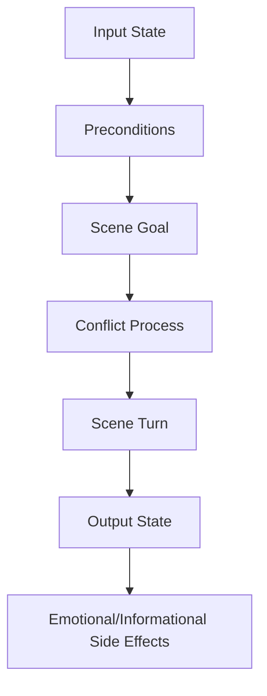

## 17.1 Scene Contract

Setiap scene sebaiknya punya contract:

```yaml
scene_contract:
  purpose: membuka konflik Raka dengan rumah lama
  protagonist_goal: mengambil sertifikat
  opposition: ibu menahan informasi
  emotional_turn: dari dingin menjadi marah
  information_turn: sertifikat terkait ayah
  story_output: Raka harus masuk kamar ayah
```

Jika Anda tidak bisa mengisi scene contract, scene itu mungkin belum jelas.

---

# 18. Plot sebagai Event Stream

Plot bisa dipahami sebagai stream of events yang mengubah state cerita.

Namun, tidak semua event adalah plot.

Event menjadi plot jika:

1. memaksa karakter bereaksi;
2. mengubah kondisi;
3. menaikkan stakes;
4. mempersempit pilihan;
5. membuka informasi baru;
6. membawa konsekuensi.

## 18.1 Event Tanpa Dampak

```text
Raka melihat hujan.
```

Bisa atmosferik, tetapi belum tentu plot.

## 18.2 Event dengan Dampak

```text
Raka melihat hujan mulai masuk dari atap rumah lama, tepat di atas kotak surat peninggalan ayahnya.
```

Sekarang hujan menjadi event karena memaksa aksi.

## 18.3 Event Stream

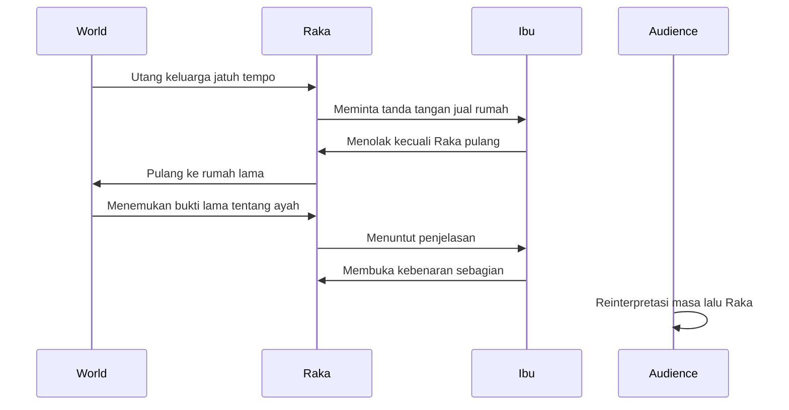

Event stream bukan hanya kejadian, tetapi perubahan pengetahuan dan tekanan.

---

# 19. Tema sebagai Invariant Makna

Tema sering disalahpahami sebagai pesan moral.

Contoh tema yang terlalu datar:

```text
Keluarga itu penting.
```

Itu bukan tema yang kuat. Itu slogan.

Tema yang lebih berguna:

```text
Apakah seseorang bisa benar-benar bebas dari keluarga jika ia belum berani menghadapi luka yang diwariskan keluarga itu?
```

Tema sebagai pertanyaan lebih produktif daripada tema sebagai jawaban.

## 19.1 Tema Mengikat Keputusan

Tema harus muncul lewat keputusan karakter.

Misalnya tema:

```text
Apakah kebenaran selalu lebih menyembuhkan daripada kebohongan yang menjaga keluarga tetap utuh?
```

Maka scene-scene harus menguji:

- kapan karakter berbohong demi melindungi;
- kapan kebenaran menyakiti;
- kapan diam menjadi bentuk kekerasan;
- kapan membuka rahasia justru membebaskan.

## 19.2 Tema sebagai Invariant

Dalam setiap layer cerita, tema bisa menjadi invariant makna.

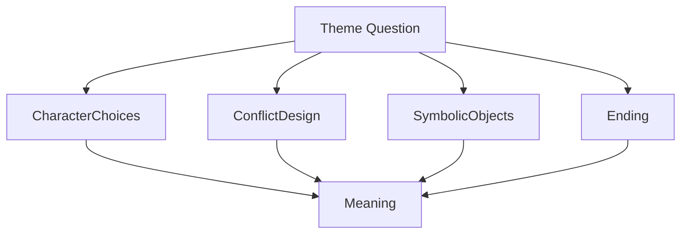

Jika tema Anda adalah “kebebasan vs ikatan keluarga”, maka:

- konflik properti rumah relevan;
- hubungan ibu-anak relevan;
- ruang rumah lama relevan;
- sertifikat rumah relevan;
- tindakan menjual rumah relevan;
- ending harus memberi posisi terhadap pertanyaan itu.

Tema bukan tempelan. Tema adalah gaya gravitasi cerita.

---

# 20. Audience sebagai Runtime Environment

Dalam software, runtime environment mempengaruhi eksekusi.

Dalam film, audience adalah runtime environment makna.

Naskah yang sama bisa dibaca berbeda oleh audience berbeda.

Faktor audience:

- usia;
- budaya;
- bahasa;
- pengalaman keluarga;
- genre expectation;
- toleransi terhadap ambiguitas;
- pengalaman visual;
- sensitivitas terhadap isu tertentu;
- mood;
- konteks sosial.

Karena itu, penulis harus sadar audience tanpa menjadi budak audience.

## 20.1 Audience Expectation

Jika Anda menulis thriller, audience mengharapkan:

- tension;
- informasi tersembunyi;
- ancaman;
- escalation;
- reversal;
- pacing yang relatif ketat.

Jika Anda menulis drama keluarga, audience mengharapkan:

- konflik relasional;
- luka batin;
- keputusan moral;
- detail perilaku;
- emosi yang earned.

Jika Anda menjanjikan genre tertentu tetapi tidak membayar janji itu, audience merasa dikhianati.

## 20.2 Audience Inference

Penonton suka menyimpulkan.

Jika semua dijelaskan, penonton pasif.

Jika terlalu sedikit diberikan, penonton bingung.

Tugas penulis adalah mengatur gap:

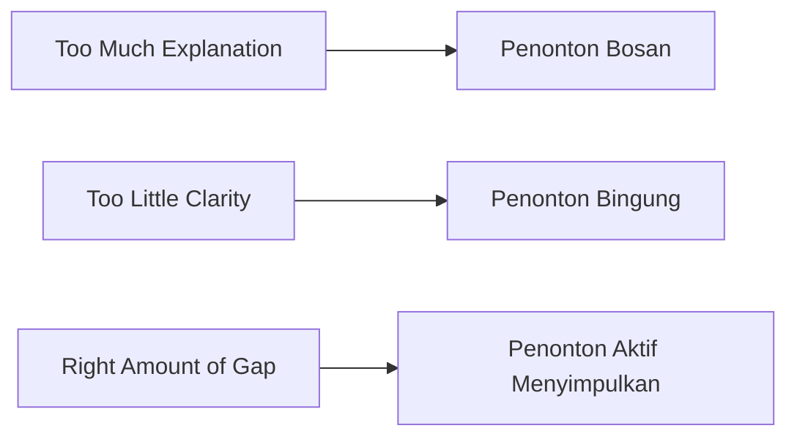

Screenwriting yang baik sering berada di tengah:

- cukup jelas untuk diikuti;
- cukup tersembunyi untuk menarik;
- cukup emosional untuk dirasakan;
- cukup logis untuk dipercaya.

---

# 21. Mengapa Cara Pikir Terlalu Deterministic Bisa Mengganggu Penulisan Film

Sebagai software engineer, Anda terbiasa dengan determinisme:

- input jelas;
- output jelas;
- edge case ditangani;
- ambiguity dikurangi;
- error state didefinisikan;
- behavior dibuat predictable;
- dokumentasi dibuat eksplisit.

Dalam screenwriting, sebagian kebiasaan itu membantu. Tetapi jika berlebihan, bisa merusak cerita.

## 21.1 Manusia Tidak Selalu Konsisten seperti Program

Karakter manusia bisa:

- ingin dua hal yang bertentangan;
- berkata A tetapi melakukan B;
- menyabotase dirinya sendiri;
- menolak hal yang ia butuhkan;
- mencintai orang yang ia benci;
- mengulang pola yang ia tahu merusak;
- membuat keputusan buruk saat takut;
- memakai logika untuk menutupi luka.

Jika karakter terlalu rasional, ia terasa seperti diagram, bukan manusia.

## 21.2 Ambiguitas Kadang Produktif

Dalam engineering, ambiguity sering dianggap risk.

Dalam film, ambiguity bisa menjadi kekuatan jika terkontrol.

Contoh ambiguity yang produktif:

```text
Apakah ibu Raka menahan sertifikat karena manipulatif, atau karena ia tahu Raka belum siap menghadapi kebenaran?
```

Pertanyaan ini membuat karakter lebih kaya.

Ambiguity yang buruk:

```text
Penonton tidak tahu tujuan cerita, karakter ingin apa, atau kenapa scene terjadi.
```

Jadi bukan semua ambiguity baik. Yang baik adalah ambiguity bermakna. Yang buruk adalah ketidakjelasan struktural.

## 21.3 Terlalu Menjelaskan Membunuh Emosi

Engineer sering ingin semua explicit.

Dalam cerita, terlalu explicit bisa membuat emosi mati.

Contoh terlalu explicit:

```text
RAKA
Aku marah karena masa kecilku membuatku tidak percaya kepada siapa pun, terutama ibu, karena ia tidak melindungiku dari ayah.
```

Lebih dramatik:

```text
IBU
Dia juga ayahmu.

Raka tertawa kecil. Hampir seperti batuk.

RAKA
Buat Ibu, mungkin.
```

Versi kedua menyisakan ruang bagi penonton.

---

# 22. Tetapi Cara Pikir Engineer Tetap Sangat Berguna

Jangan membuang cara pikir engineer. Gunakan dengan benar.

Cara pikir engineer sangat berguna untuk:

- memecah skill besar menjadi sub-skill;
- membuat workflow latihan;
- tracking progress;
- versioning draft;
- mendeteksi inconsistency;
- memetakan cause-effect;
- mendesain character arc;
- mengecek continuity;
- membuat dependency antar-scene;
- melakukan diagnosis rewrite;
- menyusun feedback menjadi backlog;
- menjaga constraint produksi.

## 22.1 Gunakan Determinisme untuk Struktur, Bukan untuk Menghilangkan Manusia

Struktur boleh sistematis.

Karakter tetap harus kompleks.

Plot boleh punya causal chain.

Emosi tetap boleh ambigu.

Workflow boleh measurable.

Proses kreatif tetap perlu eksplorasi.

## 22.2 Engineer-Friendly View

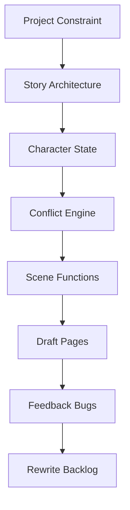

Tetapi tambahkan layer human behavior:

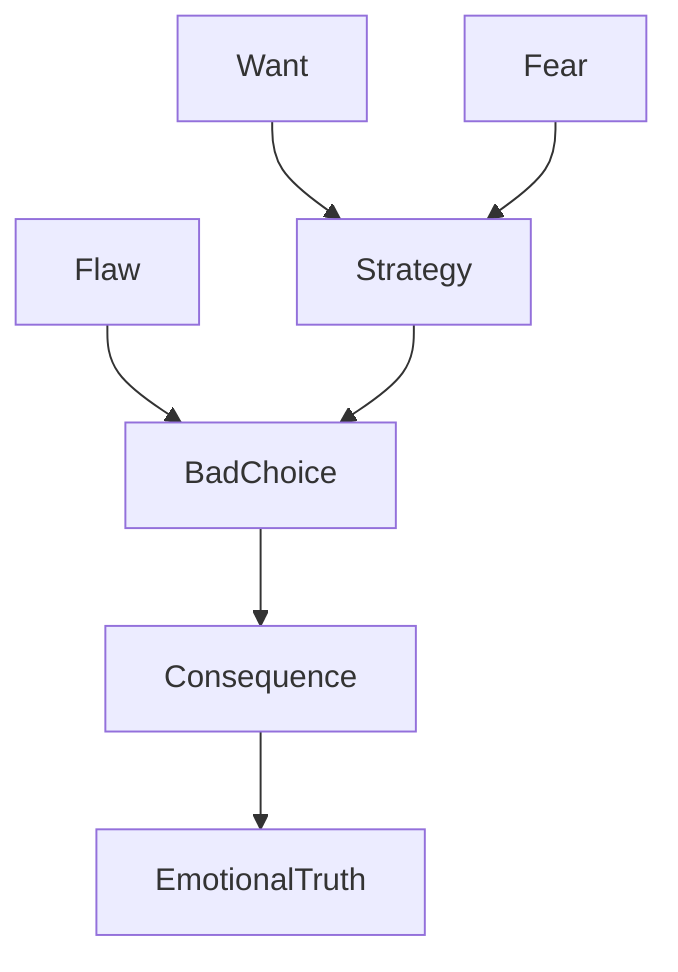

Karakter bukan hanya “mengambil keputusan optimal”. Karakter sering mengambil keputusan yang terasa perlu secara emosional, meskipun buruk secara rasional.

---

# 23. Layering Naskah Film: Dari Ide ke Halaman

Agar tidak tersesat, pikirkan naskah sebagai layer.

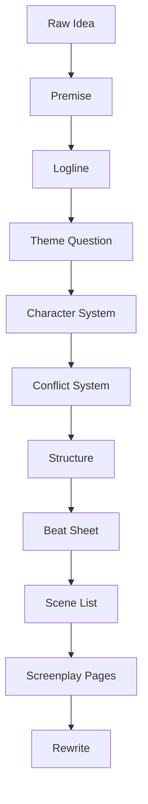

## 23.1 Raw Idea

Contoh:

```text
Seorang anak pulang ke rumah lama setelah bertahun-tahun menjauh.
```

Ini baru ide.

## 23.2 Premise

```text
Seorang arsitek yang selalu menghindari masa lalu harus pulang untuk menjual rumah keluarganya, tetapi ibunya menolak tanda tangan sampai ia membuka rahasia kematian ayahnya.
```

Ini sudah punya tekanan.

## 23.3 Logline

```text
Ketika utang keluarga mengancam rumah masa kecilnya, seorang arsitek yang dingin harus menghadapi ibunya yang menyimpan rahasia lama, sebelum rumah itu disita dan satu-satunya bukti tentang kematian ayahnya hilang selamanya.
```

Sudah ada:

- protagonist;
- problem;
- opposition;
- stakes;
- urgency;
- mystery.

## 23.4 Theme Question

```text
Bisakah seseorang benar-benar bebas dari masa lalu jika kebebasan itu dibangun dari penghindaran?
```

## 23.5 Character System

```yaml
raka:
  want: menjual rumah dan bebas dari urusan keluarga
  need: menghadapi rasa bersalah
  flaw: mengubah luka emosional menjadi transaksi praktis
  fear: jika ia membuka masa lalu, ia akan menemukan dirinya ikut bersalah
```

## 23.6 Conflict System

```yaml
external_conflict:
  - rumah akan disita
  - ibu menolak tanda tangan
  - dokumen ayah hilang
internal_conflict:
  - Raka takut mengingat malam kematian ayah
relational_conflict:
  - ibu merasa ditinggalkan
  - Raka merasa tidak dilindungi
```

## 23.7 Scene List

```text
1. Raka mengabaikan telepon ibu.
2. Raka gagal presentasi karena distraksi krisis keluarga.
3. Raka mendapat kabar rumah akan disita.
4. Raka pulang ke rumah lama.
5. Ibu menolak tanda tangan.
6. Raka menemukan kotak ayah.
...
```

## 23.8 Screenplay Pages

Barulah ditulis dalam format scene.

---

# 24. Contoh Transformasi: Dari Narasi Prosa ke Screenplay

Mari lihat transformasi konkret.

## 24.1 Versi Prosa

```text
Raka selalu membenci rumah itu. Baginya, rumah itu adalah tempat semua luka dimulai. Setiap sudutnya mengingatkan ia pada ayahnya yang keras dan ibunya yang diam. Ia ingin menjual rumah itu secepat mungkin agar bisa melanjutkan hidup.
```

Masalah jika langsung dimasukkan ke screenplay:

- terlalu menjelaskan;
- banyak interioritas;
- tidak ada aksi spesifik;
- tidak ada conflict moment;
- tidak menunjukkan perilaku.

## 24.2 Versi Screenplay yang Masih Lemah

```text
INT. RUMAH LAMA - SIANG

Raka masuk dan merasa benci pada rumah itu. Ia ingat ayahnya yang keras dan ibunya yang diam. Ia ingin menjual rumah itu.
```

Masih tidak filmik.

## 24.3 Versi Lebih Filmik

```text
INT. RUMAH LAMA - SIANG

Pintu depan terbuka setelah tiga kali didorong.

Raka masuk. Sepatunya berhenti tepat sebelum menyentuh garis retak di lantai.

Di dinding: foto keluarga lama. Ayahnya berdiri tegak. Ibunya duduk. Raka kecil di antara mereka, matanya tidak melihat kamera.

Raka membalik foto itu menghadap dinding.

Dari dapur, suara IBU:

IBU (O.S.)
Kamu masih ingat letak gelas?

Raka melihat lemari gelas. Gagangnya patah, masih sama.

RAKA
Aku cuma ambil berkas.
```

Apa yang terjadi?

- Rumah terasa sebagai ruang trauma.
- Foto keluarga memberi backstory visual.
- Raka membalik foto: aksi yang menunjukkan penolakan.
- Ibu bertanya hal domestik: hubungan lama muncul.
- Raka menjawab praktis: defensif.
- Konflik “rumah sebagai luka” muncul tanpa dijelaskan.

## 24.4 Breakdown Beat

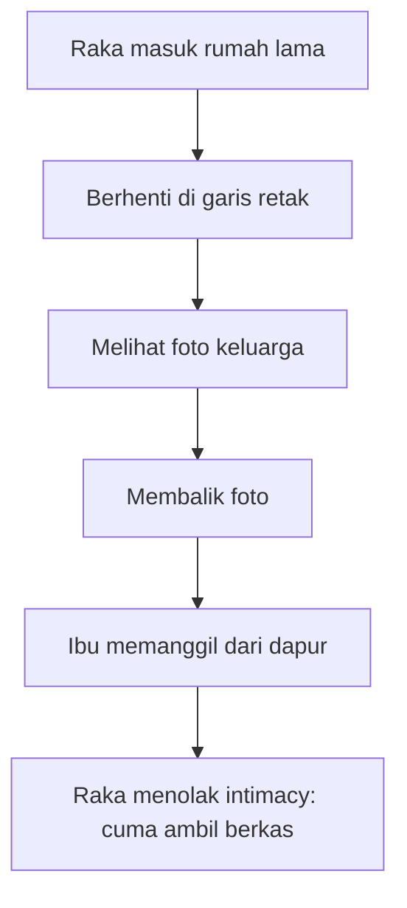

## 24.5 Lesson

Versi screenplay tidak mencoba menjelaskan semua luka. Ia memilih detail yang bisa menyampaikan luka.

Pilihan detail sangat penting.

Detail filmik yang baik biasanya:

- konkret;
- visible atau audible;
- punya hubungan dengan konflik;
- tidak sekadar dekorasi;
- membuka karakter;
- bisa dimainkan;
- bisa diproduksi.

---

# 25. Anti-Pattern Pemula

Berikut anti-pattern yang perlu dikenali sejak awal.

## 25.1 Novelistic Action Line

```text
Raka merasakan beban masa lalu yang begitu besar hingga ia hampir tidak sanggup bernapas.
```

Masalah:

- abstrak;
- batiniah;
- tidak spesifik secara visual.

Lebih baik:

```text
Raka mencoba membuka pintu kamar ayahnya. Tangannya berhenti di gagang pintu.

Ia menarik napas, tetapi tidak masuk.
```

## 25.2 Dialogue as Documentation

```text
SINTA
Seperti yang kamu tahu, lima tahun lalu ayahmu meninggal dalam kecelakaan, dan sejak itu kamu tidak pernah pulang karena kamu merasa bersalah.
```

Masalah:

- karakter mengatakan informasi yang sudah mereka tahu;
- dialog terasa untuk penonton, bukan untuk karakter;
- tidak ada subtext.

Lebih baik:

```text
SINTA
Lima tahun kamu nggak pulang.

RAKA
Aku kirim uang tiap bulan.

SINTA
Aku nggak tanya rekening.
```

## 25.3 Passive Protagonist

Karakter hanya menerima kejadian.

```text
Raka diberi tahu masalah. Raka dibawa ke rumah. Raka diberi dokumen. Raka diberi jawaban.
```

Lebih kuat jika Raka membuat pilihan:

```text
Raka memalsukan tanda tangan ibunya agar rumah bisa dijual cepat.
```

Sekarang ada tindakan, moral cost, dan konsekuensi.

## 25.4 Scene Tanpa Turn

Scene yang mulai dan berakhir dengan kondisi sama.

```text
Mereka marah sebelum scene. Mereka marah selama scene. Mereka masih marah setelah scene.
```

Harus ada perubahan:

```text
Mereka mulai sebagai dua orang yang saling menyalahkan. Mereka berakhir sebagai dua orang yang sadar bahwa mereka menyembunyikan luka yang sama.
```

## 25.5 Semua Informasi Diberikan Terlalu Awal

Pemula sering takut penonton bingung, lalu menjelaskan semua di awal.

Akibatnya:

- tidak ada mystery;
- tidak ada curiosity;
- tidak ada reveal;
- konflik terasa datar.

Informasi harus dikelola seperti resource.

## 25.6 Karakter Terlalu Konsisten

Manusia punya kontradiksi.

Karakter yang selalu baik, selalu logis, selalu benar, selalu menjelaskan dirinya, sering terasa mati.

Contoh kontradiksi menarik:

```text
Raka membenci ibunya karena diam saat ayahnya kasar, tetapi Raka sendiri selalu diam setiap kali Sinta meminta kejujuran.
```

Kontradiksi menciptakan kedalaman.

## 25.7 Over-Directing

```text
CAMERA PUSHES IN slowly to Raka's tearful eyes, then cuts to a high angle shot showing his loneliness.
```

Kecuali Anda menulis shooting script sebagai sutradara, terlalu banyak instruksi kamera bisa mengganggu. Lebih baik tulis aksi dan momen yang memberi ruang visual.

```text
Raka berdiri sendiri di tengah ruang tamu yang kosong. Di tangannya, kunci rumah lama.
```

## 25.8 Terlalu Banyak Karakter dan Lokasi

Untuk project awal, terutama film pendek, terlalu banyak karakter/lokasi akan membebani:

- produksi;
- blocking;
- continuity;
- konflik;
- fokus emosional;
- waktu shooting.

Lebih baik sedikit elemen tetapi dalam.

---

# 26. Checklist Mental Model Part 001

Gunakan checklist ini setelah membaca atau menulis scene.

## 26.1 Checklist Screenplay sebagai Blueprint

- [ ] Apakah scene ini bisa divisualkan?
- [ ] Apakah action line menulis hal yang bisa dilihat/didengar?
- [ ] Apakah scene memberi bahan untuk aktor?
- [ ] Apakah scene memberi arah konflik untuk sutradara?
- [ ] Apakah scene cukup jelas untuk diproduksi?
- [ ] Apakah scene tidak terlalu banyak menjelaskan pikiran batin?

## 26.2 Checklist Scene sebagai Unit Perubahan

- [ ] Apa input state scene ini?
- [ ] Apa output state scene ini?
- [ ] Apa yang berubah?
- [ ] Siapa yang menginginkan apa?
- [ ] Apa obstacle-nya?
- [ ] Apa turn utama scene?
- [ ] Apa konsekuensi setelah scene?

## 26.3 Checklist Karakter sebagai Sistem Keputusan

- [ ] Apa want karakter?
- [ ] Apa fear karakter?
- [ ] Apa flaw karakter?
- [ ] Apa strategi default karakter saat tertekan?
- [ ] Apa pilihan sulit dalam scene?
- [ ] Apa biaya pilihan itu?

## 26.4 Checklist Konflik

- [ ] Apakah ada benturan keinginan?
- [ ] Apakah konflik punya stakes?
- [ ] Apakah ada urgency?
- [ ] Apakah pilihan karakter punya biaya?
- [ ] Apakah konflik meningkat atau berubah?

## 26.5 Checklist Subtext

- [ ] Apakah karakter mengatakan semua secara literal?
- [ ] Apa yang tidak mereka katakan?
- [ ] Apa yang mereka inginkan di balik dialog?
- [ ] Apakah gesture/aksi memberi makna tambahan?
- [ ] Apakah penonton diberi ruang menyimpulkan?

---

# 27. Latihan Praktik Part 001

Latihan ini dirancang sesuai prinsip Kaufman: latihan kecil, cepat, bisa dievaluasi, dan langsung membangun kemampuan self-correction.

Total estimasi latihan part ini: **60–90 menit**.

## Latihan 1 — Filmable vs Not Filmable

Ambil 10 kalimat abstrak, lalu ubah menjadi aksi visual/auditori.

Contoh input:

```text
1. Ia merasa sendirian.
2. Ia membenci ayahnya.
3. Ia takut kehilangan istrinya.
4. Ia merasa gagal.
5. Ia masih mencintai mantannya.
```

Tugas:

Ubah setiap kalimat menjadi 2–5 baris action screenplay.

Contoh output:

```text
Di meja makan, tiga kursi kosong. Raka tetap menaruh piring di depan semuanya.

Ia makan sendirian. Tidak menyentuh piring-piring lain.
```

Ukuran keberhasilan:

- Tidak memakai kata abstrak seperti “sedih”, “sendirian”, “trauma”, “marah” secara langsung.
- Ada objek, aksi, gesture, suara, atau ruang.
- Penonton bisa menyimpulkan emosi.

## Latihan 2 — Scene Function Card

Pilih satu scene dari film yang Anda suka. Isi kartu ini:

```yaml
scene_title:
film:
location_time:
input_state:
protagonist_goal:
opposition:
tactics:
turn:
output_state:
new_information:
emotional_shift:
why_scene_exists:
```

Tujuan:

Melatih mata untuk melihat scene bukan sebagai “adegan bagus”, tetapi sebagai function dramatik.

## Latihan 3 — Beat Extraction

Tonton satu scene berdurasi 2–5 menit.

Pecah menjadi beat:

```text
Beat 1:
Beat 2:
Beat 3:
Beat 4:
Beat 5:
```

Setiap beat harus menjawab:

- apa yang berubah?
- siapa yang mendapat power?
- informasi apa yang muncul?
- emosi apa yang bergeser?

## Latihan 4 — Rewrite Dialog Literal menjadi Subtext

Input:

```text
A: Aku marah karena kamu tidak pernah mendengarkanku.
B: Aku tidak mendengarkan karena aku merasa kamu selalu menyalahkanku.
```

Tugas:

Rewrite menjadi dialog yang tidak menyebut langsung “marah”, “mendengarkan”, atau “menyalahkan”.

Contoh:

```text
A
Kamu bahkan belum lepas sepatu.

B
Aku baru masuk.

A
Iya. Itu biasanya bagian paling lama kamu di rumah.
```

## Latihan 5 — Character State Machine Mini

Buat satu karakter sederhana dan isi:

```yaml
name:
public_mask:
private_fear:
want:
need:
flaw:
default_strategy_under_pressure:
inciting_event:
first_bad_choice:
consequence:
possible_growth_choice:
```

Tujuan:

Melatih melihat karakter sebagai pola keputusan.

---

# 28. Template Kerja

## 28.1 Template Scene IO Card

```yaml
scene_id:
scene_title:
location:
time:
characters_present:

input_state:
  protagonist:
  antagonist_or_opposition:
  relationship:
  audience_knows:

scene_goal:
  protagonist_wants:
  opposition_wants:

conflict:
  obstacle:
  stakes:
  urgency:
  tactics_used:

turn:
  emotional_turn:
  information_turn:
  power_turn:

output_state:
  protagonist:
  opposition:
  relationship:
  audience_knows:
  next_pressure:

reason_scene_exists:
```

## 28.2 Template Character Decision System

```yaml
character_name:
role_in_story:

surface_identity:
  age:
  occupation:
  public_behavior:

inner_system:
  want:
  need:
  fear:
  flaw:
  wound:
  false_belief:
  shame:

behavior_under_pressure:
  default_strategy:
  defense_mechanism:
  moral_boundary:
  line_they_will_cross:

arc:
  starting_state:
  pressure_events:
  crisis_choice:
  final_state:
```

## 28.3 Template Filmable Rewrite

```text
Abstrak:
[Tulis kalimat emosi/pikiran abstrak]

Pertanyaan:
- Apa objek yang bisa membawa emosi ini?
- Gesture apa yang bisa menunjukkan emosi ini?
- Suara apa yang bisa mendukung emosi ini?
- Pilihan kecil apa yang bisa memperlihatkan konflik batin?

Versi Filmik:
[Tulis 3–8 baris action line]
```

## 28.4 Template Beat List

```yaml
scene:
  title:
  input_state:
  output_state:

beats:
  - beat_no: 1
    event:
    change:
  - beat_no: 2
    event:
    change:
  - beat_no: 3
    event:
    change:
```

---

# 29. Output yang Harus Dihasilkan Setelah Part Ini

Setelah Part 001, Anda sebaiknya punya 4 output kecil:

1. **10 kalimat abstrak yang sudah diubah menjadi aksi filmik.**
2. **1 Scene IO Card dari scene film yang Anda analisis.**
3. **1 beat list dari scene film.**
4. **1 character decision system sederhana.**

Output ini tidak harus sempurna. Tujuannya adalah membangun kemampuan melihat screenplay sebagai sistem perubahan.

Dalam konteks 20 jam, Part 001 menyumbang kemampuan dasar berikut:

| Sub-skill | Fungsi |
|---|---|
| Filmable thinking | Mengubah emosi abstrak menjadi visual/auditory action |
| Scene diagnosis | Melihat scene sebagai unit perubahan |
| Beat detection | Melihat perubahan kecil di dalam scene |
| Character decision thinking | Melihat karakter lewat pilihan di bawah tekanan |
| Conflict awareness | Memastikan scene punya engine |

---

# 30. Rangkuman

Part ini membangun fondasi mental model.

Poin terpenting:

1. Screenplay bukan novel yang diberi format film.
2. Screenplay adalah blueprint pengalaman audiovisual.
3. Film bekerja lewat gambar, suara, aksi, pilihan, konflik, ritme, dan perubahan.
4. Scene adalah unit eksekusi dramatik.
5. Beat adalah unit perubahan.
6. Karakter terlihat dari keputusan di bawah tekanan.
7. Konflik adalah engine yang membuat scene bergerak.
8. Action line harus menulis hal yang bisa dilihat/didengar.
9. Subtext membuat penonton aktif menyimpulkan.
10. Cara pikir engineer sangat berguna untuk struktur, diagnosis, causal chain, dan rewrite, tetapi tidak boleh membuat karakter menjadi terlalu mekanis.

Kalimat kunci part ini:

> **Naskah film tidak menjelaskan pengalaman. Naskah film merancang kondisi agar pengalaman itu terjadi.**

---

# 31. Preview Part 002

Part berikutnya:

# Part 002 — Framework Josh Kaufman untuk Screenwriting: Deconstruct, Self-Correct, Remove Barrier, Practice

Kita akan membedah skill “menulis naskah film” menjadi sub-skill konkret yang bisa dilatih dalam 20 jam pertama.

Fokus Part 002:

1. bagaimana menerapkan framework Kaufman secara spesifik ke screenwriting;
2. skill mana yang wajib dipelajari dulu;
3. skill mana yang sengaja ditunda;
4. cara membuat latihan 20 jam yang measurable;
5. cara menghindari over-researching;
6. cara membuat feedback loop;
7. cara menyusun practice environment agar konsisten.

---

# 32. Referensi Ringkas

Referensi ini dipakai sebagai konteks pendukung untuk fondasi Part 001:

1. Josh Kaufman — *The First 20 Hours*: prinsip deconstruct the skill, learn enough to self-correct, remove barriers, dan deliberate practice minimal 20 jam.
2. Final Draft — panduan elemen format screenplay seperti scene heading, action, character cue, dialogue, parenthetical, dan transition.
3. Fountain — sintaks plain-text untuk screenplay, termasuk scene heading, character, dialogue, dan action.
4. Prinsip umum master scene format: screenplay berisi scene heading, action lines, character name, parenthetical, dialogue, dan transition.

---

**Status seri:** Part 001 selesai.  
**Belum mencapai bagian terakhir.**  
**Lanjut berikutnya:** `learn-screenwriting-film-script-part-002.md`.
