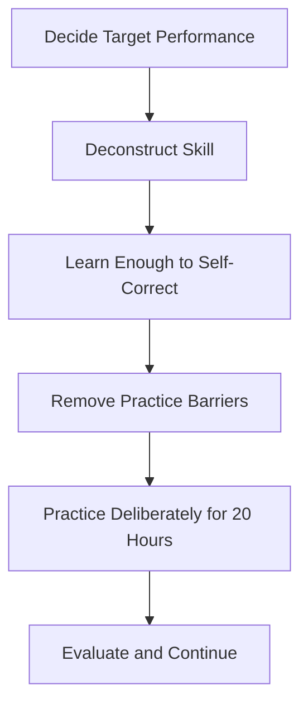
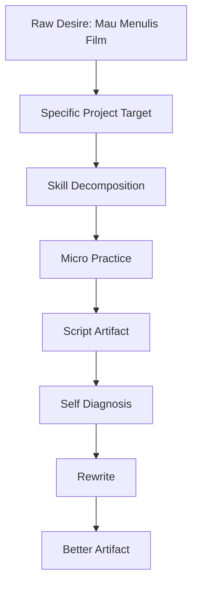
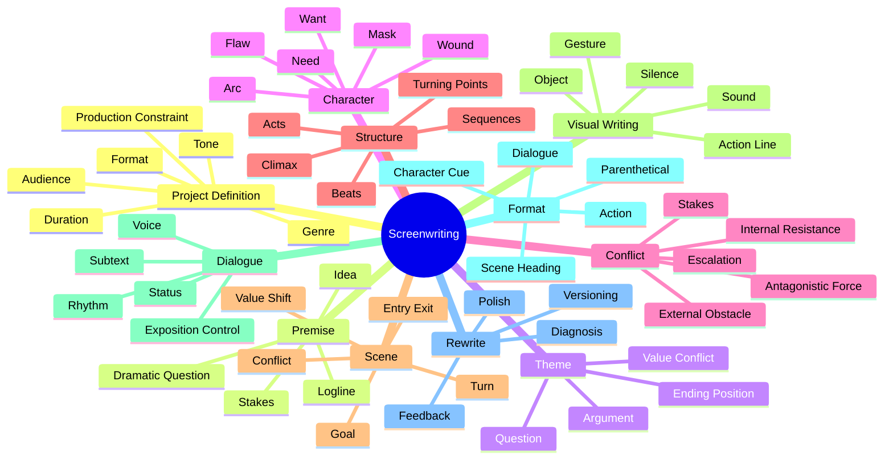
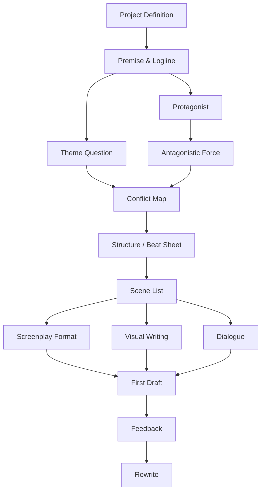
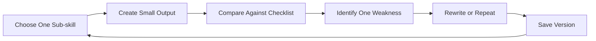
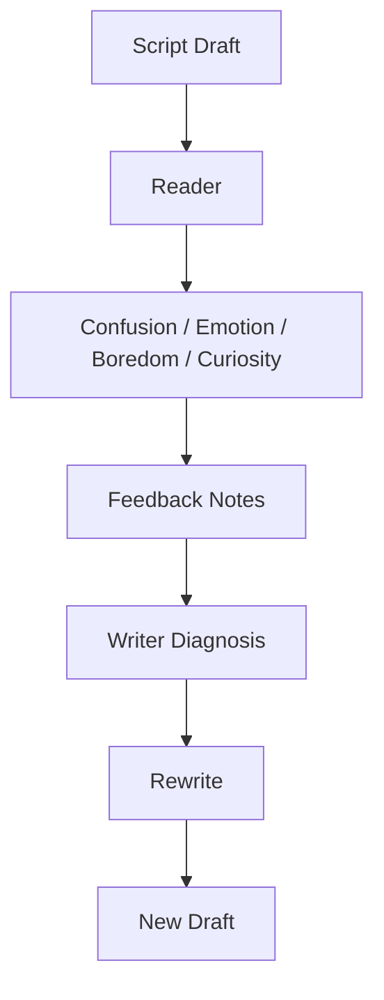
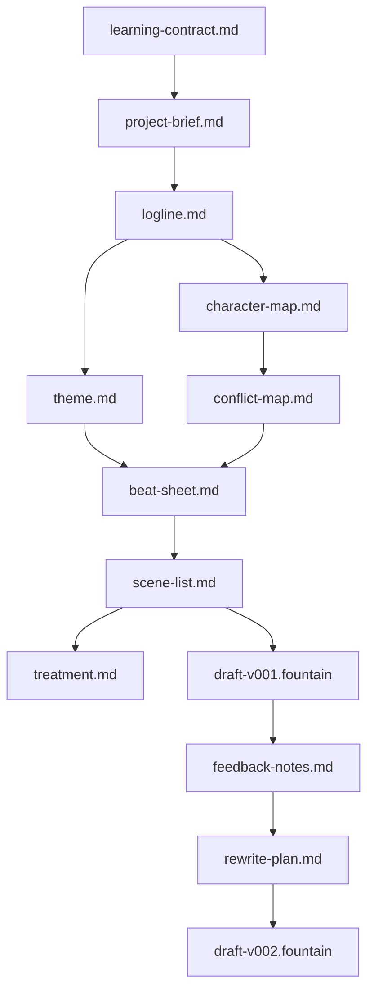
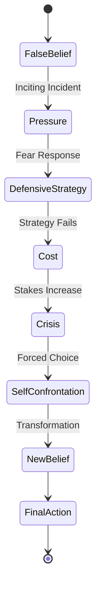

# learn-screenwriting-film-script-part-002.md

# Part 002 — Framework Josh Kaufman untuk Screenwriting: Deconstruct, Self-Correct, Remove Barrier, Practice

> Seri: **Learn Screenwriting for Film Project — The First 20 Hours Approach**  
> Fokus part ini: mengubah “belajar menulis naskah film” yang terlalu besar dan abstrak menjadi sistem latihan 20 jam yang konkret, terukur, dan menghasilkan output nyata.  
> Status seri: **belum selesai**. Ini adalah Part 002 dari 030.

---

## Daftar Isi

1. [Masalah Utama: “Belajar Screenwriting” Terlalu Besar](#1-masalah-utama-belajar-screenwriting-terlalu-besar)
2. [Inti Framework Josh Kaufman](#2-inti-framework-josh-kaufman)
3. [Menerjemahkan Framework Kaufman ke Screenwriting](#3-menerjemahkan-framework-kaufman-ke-screenwriting)
4. [Target Performa: Apa yang Harus Bisa Dilakukan Setelah 20 Jam?](#4-target-performa-apa-yang-harus-bisa-dilakukan-setelah-20-jam)
5. [Deconstruction: Membelah Skill Screenwriting Menjadi Sub-Skill](#5-deconstruction-membelah-skill-screenwriting-menjadi-sub-skill)
6. [Skill Dependency Graph: Urutan Belajar yang Masuk Akal](#6-skill-dependency-graph-urutan-belajar-yang-masuk-akal)
7. [Prioritas: Sub-Skill yang Paling Bernilai di 20 Jam Pertama](#7-prioritas-sub-skill-yang-paling-bernilai-di-20-jam-pertama)
8. [Learn Enough to Self-Correct: Belajar Secukupnya agar Bisa Mendeteksi Error](#8-learn-enough-to-self-correct-belajar-secukupnya-agar-bisa-mendeteksi-error)
9. [Remove Practice Barriers: Menghilangkan Hambatan Latihan](#9-remove-practice-barriers-menghilangkan-hambatan-latihan)
10. [Deliberate Practice: Latihan yang Menghasilkan Output, Bukan Ilusi Produktif](#10-deliberate-practice-latihan-yang-menghasilkan-output-bukan-ilusi-produktif)
11. [Feedback Loop: Cara Mengoreksi Naskah Seperti Debugging](#11-feedback-loop-cara-mengoreksi-naskah-seperti-debugging)
12. [Metrics: Cara Mengukur Kemajuan yang Tidak Menipu](#12-metrics-cara-mengukur-kemajuan-yang-tidak-menipu)
13. [Roadmap 20 Jam Versi Praktis](#13-roadmap-20-jam-versi-praktis)
14. [Output per Fase](#14-output-per-fase)
15. [Anti-Pattern Belajar Screenwriting](#15-anti-pattern-belajar-screenwriting)
16. [Cara Berpikir untuk Software Engineer](#16-cara-berpikir-untuk-software-engineer)
17. [Template Learning Contract](#17-template-learning-contract)
18. [Template Skill Inventory](#18-template-skill-inventory)
19. [Latihan Part 002](#19-latihan-part-002)
20. [Checklist Kelulusan Part 002](#20-checklist-kelulusan-part-002)
21. [Ringkasan](#21-ringkasan)
22. [Transisi ke Part 003](#22-transisi-ke-part-003)
23. [Rujukan Konseptual](#23-rujukan-konseptual)

---

## 1. Masalah Utama: “Belajar Screenwriting” Terlalu Besar

Kalimat “saya mau belajar menulis naskah film” terdengar sederhana, tetapi sebenarnya mengandung banyak skill berbeda.

Di dalamnya ada:

- memahami medium film,
- menemukan ide,
- merumuskan premis,
- membuat karakter,
- membangun konflik,
- menyusun struktur,
- mendesain scene,
- menulis visual action,
- menulis dialog,
- memahami format screenplay,
- menerima feedback,
- melakukan rewrite,
- sadar kebutuhan produksi,
- mempertahankan tone,
- memahami genre,
- mengatur pacing,
- dan menyelesaikan draft.

Masalahnya: kalau semua dipelajari sekaligus, otak akan memperlakukan semuanya sebagai kabut besar.

Untuk software engineer, analoginya seperti mengatakan:

> “Saya mau belajar membangun distributed system.”

Kalimat itu terlalu besar. Di dalamnya ada networking, consistency, concurrency, storage, observability, failure recovery, deployment, security, scaling, dan domain modelling.

Begitu juga screenwriting.

Kalau tidak didekonstruksi, Anda akan terjebak dalam tiga mode buruk:

1. **Over-researching**  
   Membaca teori, menonton video, mendengar podcast, tapi tidak menghasilkan halaman naskah.

2. **Premature drafting**  
   Langsung menulis script panjang tanpa logline, konflik, struktur, atau scene map. Akibatnya stuck di tengah.

3. **Template worship**  
   Mengira screenplay cukup mengikuti formula 3-act, Save the Cat, hero’s journey, atau beat sheet tertentu. Hasilnya mekanis, bukan hidup.

Framework Josh Kaufman berguna karena memaksa kita memperlakukan belajar sebagai proses akuisisi skill yang sempit, terukur, dan praktikal.

Bukan:

> “Saya mau menjadi penulis skenario hebat.”

Melainkan:

> “Dalam 20 jam pertama, saya mau bisa menghasilkan naskah film pendek atau blueprint film panjang yang bisa dibaca, didiagnosis, dan direvisi.”

Itu jauh lebih konkret.

---

## 2. Inti Framework Josh Kaufman

Dalam pendekatan **The First 20 Hours**, targetnya bukan mastery. Targetnya adalah **rapid skill acquisition**: mencapai level cukup kompeten untuk melakukan sesuatu secara nyata.

Untuk screenwriting, ini penting karena banyak pemula salah memasang ekspektasi.

Setelah 20 jam, Anda tidak realistis berharap menjadi penulis sekelas Charlie Kaufman, Bong Joon-ho, Aaron Sorkin, Greta Gerwig, Christopher Nolan, atau Asghar Farhadi. Tetapi Anda sangat mungkin mencapai kemampuan awal yang berguna:

- mampu menyusun ide menjadi premis,
- mampu membuat logline yang punya konflik,
- mampu membuat karakter dengan desire dan obstacle,
- mampu membuat beat sheet,
- mampu mendesain scene,
- mampu menulis beberapa halaman screenplay,
- mampu melihat problem dasar naskah sendiri,
- mampu meminta feedback yang tepat,
- mampu menyusun rencana rewrite.

Inti framework Kaufman bisa diringkas menjadi empat gerakan besar:



Dalam konteks kita, saya akan memakai lima lapis operasional:

| Lapis | Pertanyaan | Output |
|---|---|---|
| Target | Apa yang harus bisa saya lakukan setelah 20 jam? | Target performa |
| Deconstruct | Sub-skill apa saja yang membentuk screenwriting? | Skill map |
| Prioritize | Sub-skill mana yang paling berdampak dulu? | Learning backlog |
| Practice | Latihan apa yang menghasilkan output nyata? | Draft, beat sheet, scene |
| Feedback | Bagaimana saya tahu ini membaik? | Diagnosis dan rewrite plan |

Framework ini bukan jaminan bahwa setiap draft akan bagus. Tetapi framework ini mengurangi kemungkinan Anda tersesat.

---

## 3. Menerjemahkan Framework Kaufman ke Screenwriting

Framework Kaufman bersifat general. Kita perlu menerjemahkannya ke domain screenwriting.

Versi mentah:

1. Deconstruct the skill.
2. Learn enough to self-correct.
3. Remove barriers to practice.
4. Practice at least 20 hours.

Versi untuk naskah film:

1. **Tentukan project film yang spesifik.**  
   Jangan mulai dari “ingin menulis film”. Mulai dari format, durasi, genre, tone, jumlah karakter, jumlah lokasi, dan tujuan project.

2. **Pecah screenwriting menjadi sub-skill.**  
   Premis, karakter, konflik, struktur, scene, visual action, dialog, format, rewrite.

3. **Belajar secukupnya untuk mendeteksi kerusakan.**  
   Anda tidak perlu membaca 20 buku dulu. Anda perlu tahu tanda scene mati, karakter pasif, konflik lemah, dialog eksposisional, dan struktur bocor.

4. **Hilangkan hambatan mulai menulis.**  
   Siapkan template, folder, software, waktu latihan, referensi, dan batasan scope.

5. **Latihan dengan output konkret.**  
   Setiap sesi harus menghasilkan artefak: logline, beat, scene card, halaman draft, daftar masalah, atau versi rewrite.

6. **Gunakan feedback loop.**  
   Naskah tidak membaik karena dipikirkan terus. Naskah membaik karena ditulis, dibaca, didiagnosis, dan direvisi.

Diagram adaptasinya:



Ada satu prinsip keras di sini:

> Di 20 jam pertama, output lebih penting daripada identitas.

Jangan berusaha “merasa seperti penulis”. Berusahalah menghasilkan dokumen yang bisa diuji.

---

## 4. Target Performa: Apa yang Harus Bisa Dilakukan Setelah 20 Jam?

Sebelum latihan, Anda perlu mendefinisikan target performa.

Tanpa target performa, semua aktivitas terasa seperti belajar, padahal belum tentu membawa Anda ke kemampuan yang dibutuhkan.

### 4.1 Target buruk

Contoh target buruk:

- “Saya ingin bisa menulis naskah film.”
- “Saya ingin jadi screenwriter.”
- “Saya ingin punya cerita yang bagus.”
- “Saya ingin membuat film yang emosional.”
- “Saya ingin naskah saya keren.”

Target-target ini terlalu abstrak. Tidak ada acceptance criteria.

### 4.2 Target baik

Target yang lebih baik:

> “Dalam 20 jam, saya ingin menghasilkan naskah film pendek 8–12 halaman dengan 1 protagonis, maksimal 3 karakter, maksimal 3 lokasi, konflik utama jelas, ending memiliki konsekuensi, dan minimal 1 kali feedback + rewrite.”

Atau untuk film panjang:

> “Dalam 20 jam, saya ingin menghasilkan blueprint feature film: logline, theme question, character map, conflict map, 8-sequence outline, treatment 3–5 halaman, dan opening 5–10 halaman.”

### 4.3 Kenapa target harus dibatasi?

Karena screenwriting adalah skill dengan ruang solusi sangat luas.

Tanpa constraint, Anda akan terus bertanya:

- genrenya apa?
- panjangnya berapa?
- karakternya siapa?
- konfliknya besar atau kecil?
- ending-nya terbuka atau tertutup?
- ini film pendek atau panjang?
- ini untuk festival, YouTube, komunitas, produksi indie, atau pitch?

Pertanyaan-pertanyaan itu penting. Tetapi kalau tidak dijawab di awal, mereka menjadi sumber friction.

### 4.4 Target performa untuk seri ini

Dalam seri ini, default target kita adalah:

> Menghasilkan fondasi dan draft awal naskah film yang cukup jelas untuk dibaca, dikritik, dan direvisi dalam konteks project film nyata.

Ada dua jalur:

| Jalur | Cocok Jika | Output 20 Jam |
|---|---|---|
| Film pendek | Project harus segera diproduksi, resource terbatas | Script pendek 8–20 halaman |
| Film panjang | Project masih development | Blueprint feature + beberapa scene kunci |

Karena Anda menyebut “sebuah project film”, jalur default paling praktis adalah **film pendek / proof-of-concept** dulu, kecuali project Anda memang sudah feature.

---

## 5. Deconstruction: Membelah Skill Screenwriting Menjadi Sub-Skill

Screenwriting bukan satu skill. Ia adalah komposisi beberapa sub-skill.

Berikut peta skill inti:



Sub-skill ini tidak sama bobotnya di tahap awal.

Untuk 20 jam pertama, Anda tidak perlu mendalami semua secara sama rata. Kita akan memilih sub-skill yang paling memberi leverage.

### 5.1 Sub-skill fondasi

Sub-skill fondasi adalah yang jika salah, seluruh naskah ikut rusak.

| Sub-skill | Kenapa penting |
|---|---|
| Project definition | Menentukan scope dan constraint |
| Premise/logline | Menentukan engine cerita |
| Character desire | Menentukan arah tindakan karakter |
| Conflict | Menentukan energi dramatik |
| Structure/beat | Menentukan alur perubahan |
| Scene design | Menentukan unit eksekusi |

Kalau enam hal ini lemah, dialog sebagus apa pun tidak menyelamatkan naskah.

### 5.2 Sub-skill eksekusi

Sub-skill eksekusi membuat ide bisa dibaca sebagai film.

| Sub-skill | Fungsi |
|---|---|
| Visual action | Mengubah ide menjadi peristiwa yang terlihat |
| Dialogue | Membuat karakter berinteraksi secara dramatik |
| Format | Membuat naskah bisa dibaca sebagai screenplay |
| Pacing | Membuat pembaca tidak merasa stagnan |
| Tone | Menjaga rasa film tetap konsisten |

### 5.3 Sub-skill peningkatan

Sub-skill peningkatan membuat draft kasar menjadi lebih baik.

| Sub-skill | Fungsi |
|---|---|
| Feedback | Menemukan blind spot |
| Rewrite | Memperbaiki level struktur dan scene |
| Production awareness | Membuat script bisa diproduksi |
| Table read | Menguji dialog dan ritme |
| Coverage | Mendiagnosis naskah secara sistematis |

### 5.4 Sub-skill yang ditunda dulu

Di 20 jam pertama, beberapa hal sengaja tidak menjadi fokus utama:

- sejarah sinema lengkap,
- teori film akademik yang terlalu luas,
- analisis kamera detail,
- blocking sutradara,
- business pitching,
- agency/query letter,
- format shooting script lanjutan,
- legal contract,
- market analysis mendalam,
- festival strategy,
- genre taxonomy ekstrem detail.

Bukan karena tidak penting. Tetapi karena belum menjadi bottleneck pertama.

Bottleneck pertama pemula biasanya lebih sederhana:

> Ide belum punya konflik, karakter belum aktif, scene tidak mengubah apa-apa, dialog terlalu menjelaskan, dan draft tidak selesai.

---

## 6. Skill Dependency Graph: Urutan Belajar yang Masuk Akal

Dalam software engineering, urutan belajar matters. Anda tidak mulai dari distributed tracing sebelum paham request lifecycle.

Dalam screenwriting juga begitu.

Anda tidak sebaiknya mulai dari polish dialog sebelum tahu:

- siapa karakter,
- apa yang dia mau,
- siapa/apa yang menghalangi,
- apa konsekuensinya,
- dan apa perubahan scene.

Dependency graph dasar:



Urutan ini bukan hukum absolut, tetapi bagus sebagai default.

Kenapa?

Karena banyak masalah dialog sebenarnya bukan masalah dialog.

Contoh:

```text
Gejala:
Dialog terasa kaku.

Kemungkinan root cause:
- Karakter tidak punya desire berbeda.
- Scene tidak punya konflik.
- Informasi dipaksa keluar lewat percakapan.
- Tidak ada tekanan waktu.
- Tidak ada risiko sosial/emosional.
```

Kalau root cause-nya konflik lemah, memperbaiki pilihan kata hanya kosmetik.

Begitu juga scene yang terasa membosankan. Masalahnya sering bukan action line, tetapi:

- scene tidak punya tujuan,
- tidak ada perubahan state,
- karakter tidak membuat keputusan,
- tidak ada konsekuensi baru.

Maka dalam seri ini, kita akan bergerak dari root cause ke surface symptom.

---

## 7. Prioritas: Sub-Skill yang Paling Bernilai di 20 Jam Pertama

Karena waktu 20 jam terbatas, kita perlu prioritas.

Gunakan prinsip:

> Latih sub-skill yang jika membaik sedikit, kualitas seluruh naskah naik banyak.

### 7.1 Ranking prioritas awal

| Prioritas | Sub-skill | Alasan |
|---:|---|---|
| 1 | Premise/logline | Menentukan apakah cerita punya engine |
| 2 | Character desire | Membuat karakter aktif |
| 3 | Conflict/stakes | Membuat cerita punya tekanan |
| 4 | Scene design | Membuat setiap scene berfungsi |
| 5 | Beat sheet | Membuat alur perubahan terbaca |
| 6 | Visual action | Membuat naskah terasa filmik |
| 7 | Dialogue/subtext | Membuat interaksi hidup |
| 8 | Format | Membuat naskah readable dan profesional |
| 9 | Feedback/rewrite | Membuat draft berkembang |

### 7.2 Skill yang sering terlihat penting tapi belum prioritas

| Skill | Kenapa belum prioritas utama |
|---|---|
| Camera direction | Biasanya domain sutradara, bukan draft awal penulis |
| Lore detail | Bisa mengganggu jika konflik belum kuat |
| Bahasa puitis | Screenplay butuh keterbacaan visual, bukan prosa indah |
| Twist ending | Tidak berguna jika perjalanan ke ending tidak kuat |
| Dialog witty | Tidak menyelamatkan karakter pasif |
| Struktur rumit | Pemula lebih butuh struktur jelas dulu |

### 7.3 Prinsip 80/20 untuk screenwriting

Dalam 20 jam pertama, peningkatan terbesar biasanya datang dari lima hal:

1. Membuat karakter menginginkan sesuatu secara konkret.
2. Membuat obstacle yang benar-benar menghalangi.
3. Membuat stakes jika karakter gagal.
4. Membuat setiap scene mengubah keadaan.
5. Mengurangi dialog eksposisi dan menggantinya dengan tindakan.

Kalau lima hal ini membaik, naskah akan terasa jauh lebih hidup walaupun belum sempurna.

---

## 8. Learn Enough to Self-Correct: Belajar Secukupnya agar Bisa Mendeteksi Error

Salah satu prinsip penting Kaufman adalah belajar secukupnya untuk bisa mengoreksi diri.

Bukan belajar sebanyak mungkin.

Dalam screenwriting, ini berarti Anda perlu tahu tanda-tanda kerusakan umum.

### 8.1 Self-correction bukan self-judgment

Self-correction bukan berkata:

> “Naskah saya jelek.”

Itu tidak actionable.

Self-correction yang baik berbunyi:

> “Scene 3 tidak punya perubahan state. Karakter masuk dengan informasi A dan keluar tetap dengan informasi A. Tidak ada keputusan, tidak ada konsekuensi. Scene ini harus digabung, dihapus, atau diberi turn.”

Perbedaannya besar.

Yang pertama adalah penilaian identitas.

Yang kedua adalah diagnosis sistem.

### 8.2 Error taxonomy untuk naskah

Gunakan taxonomy berikut:

| Level | Error | Gejala | Pertanyaan diagnosis |
|---|---|---|---|
| Premise | Cerita tidak punya engine | Logline datar | Siapa mau apa, terhalang apa, taruhannya apa? |
| Character | Protagonis pasif | Karakter hanya bereaksi | Apa keputusan sulit yang dia buat? |
| Conflict | Tidak ada tekanan | Scene terasa aman | Apa yang tidak bisa koeksis? |
| Structure | Alur datar | Tidak ada escalation | Apa yang makin buruk/rumit? |
| Scene | Scene tidak berubah | Bisa dihapus tanpa efek | Apa state sebelum/sesudah scene? |
| Dialogue | Terlalu menjelaskan | Karakter bicara seperti penulis | Apa yang sebenarnya mereka inginkan? |
| Visual | Terlalu internal | Tidak bisa difilmkan | Apa yang bisa dilihat/didengar? |
| Format | Sulit dibaca | Tidak seperti screenplay | Apakah elemen format sudah benar? |

### 8.3 Debugging mindset

Saat membaca draft sendiri, jangan mulai dari rasa malu. Mulai dari bug report.

Contoh bug report naskah:

```text
Bug ID: SC-004
Severity: Major
Location: Scene 4, halaman 6-7
Symptom: Scene terasa datar dan hanya berisi informasi masa lalu.
Suspected Root Cause: Tidak ada conflict antara karakter A dan B. Keduanya hanya menjelaskan backstory.
Fix Option A: Buat A menyembunyikan informasi, B memaksa membongkar.
Fix Option B: Pindahkan informasi ke action/prop.
Fix Option C: Hapus scene dan sisipkan satu detail di Scene 5.
```

Dengan cara ini, rewrite menjadi proses engineering: diagnosis, hypothesis, patch, retest.

### 8.4 Minimal theory yang harus dipahami

Untuk 20 jam pertama, teori minimum yang perlu Anda pahami:

1. **Screenplay adalah dokumen visual-auditori.**  
   Tulis yang bisa dilihat dan didengar.

2. **Protagonis harus menginginkan sesuatu.**  
   Keinginan menciptakan arah.

3. **Konflik terjadi ketika dua keinginan/nilai tidak bisa koeksis.**  
   Konflik bukan sekadar orang marah.

4. **Scene harus mengubah sesuatu.**  
   Informasi, emosi, status, relasi, bahaya, rencana, atau keyakinan.

5. **Dialog adalah tindakan.**  
   Karakter tidak berbicara untuk memberi informasi kepada penonton; mereka berbicara untuk mendapatkan sesuatu.

6. **Struktur adalah peta perubahan.**  
   Bukan template mati, tetapi alat diagnosis.

7. **Rewrite adalah inti menulis.**  
   First draft hanya bahan mentah.

Jika tujuh prinsip ini tertanam, Anda sudah punya alat self-correction awal.

---

## 9. Remove Practice Barriers: Menghilangkan Hambatan Latihan

Hambatan belajar screenwriting sering bukan kurang ide. Hambatannya adalah friction.

Friction adalah energi tambahan yang membuat Anda tidak mulai.

Contoh friction:

- tidak tahu harus menulis di aplikasi apa,
- terlalu banyak pilihan ide,
- takut format salah,
- tidak punya template,
- bingung mulai dari scene atau outline,
- merasa semua harus bagus sejak awal,
- terlalu banyak referensi,
- takut dinilai,
- project terlalu besar,
- waktu latihan tidak jelas,
- file berantakan,
- draft lama hilang,
- tidak punya ritual mulai.

### 9.1 Prinsip friction removal

Untuk 20 jam pertama, target kita adalah membuat latihan menjadi semudah mungkin dimulai.

Sebelum latihan, siapkan:

```text
screenwriting-project/
  00-brief/
    project-brief.md
    learning-contract.md
  01-research/
    reference-films.md
    notes.md
  02-development/
    logline.md
    theme.md
    character-map.md
    conflict-map.md
    beat-sheet.md
    scene-list.md
    treatment.md
  03-drafts/
    draft-v001.fountain
    draft-v002.fountain
  04-feedback/
    feedback-notes.md
    issue-list.md
  05-rewrite/
    rewrite-plan.md
    changelog.md
```

### 9.2 Tooling minimal

Untuk 20 jam pertama, jangan membuat tooling menjadi proyek tersendiri.

Anda cukup perlu salah satu dari tiga opsi:

| Opsi | Cocok untuk | Catatan |
|---|---|---|
| Markdown + Fountain | Software engineer, plain text workflow | Ringan, bisa Git |
| WriterDuet / Arc Studio / Fade In | Ingin format otomatis | Kurangi friction format |
| Google Docs / Word | Kolaborasi cepat | Kurang ideal untuk screenplay final |

Rekomendasi default untuk Anda sebagai software engineer:

> Gunakan Markdown untuk development documents dan Fountain untuk draft screenplay.

Alasannya:

- plain text,
- versionable,
- mudah dicari,
- bisa dipakai di editor biasa,
- tidak mengunci ide ke software tertentu,
- cocok untuk iterative workflow.

### 9.3 Ritual mulai 5 menit

Agar tidak stuck, gunakan ritual singkat:

```text
1. Buka folder project.
2. Buka file sesi hari ini.
3. Tulis timestamp.
4. Tulis target sesi dalam 1 kalimat.
5. Tulis output minimum.
6. Mulai timer 25/45 menit.
7. Jangan edit sampai timer selesai.
```

Contoh:

```markdown
## Session 004 — 2026-06-25

Target: membuat 10 alternatif logline untuk film pendek.
Output minimum: 10 logline buruk tapi selesai.
Constraint: maksimal 2 karakter utama, 2 lokasi, genre drama-thriller.
```

### 9.4 Remove quality pressure

Hambatan terbesar penulis pemula adalah ingin draft pertama bagus.

Itu salah target.

First draft bukan produk akhir. First draft adalah data.

Lebih tepat berpikir:

> Draft buruk yang selesai lebih berguna daripada ide bagus yang tidak tertulis.

Dalam 20 jam pertama, Anda tidak sedang membuktikan bahwa Anda berbakat. Anda sedang membangun sistem latihan.

---

## 10. Deliberate Practice: Latihan yang Menghasilkan Output, Bukan Ilusi Produktif

Tidak semua aktivitas belajar sama nilainya.

Menonton film bisa membantu, tetapi kalau tidak diarahkan, itu hanya konsumsi. Membaca buku bisa membantu, tetapi kalau tidak menghasilkan keputusan penulisan, itu bisa menjadi procrastination.

Latihan yang kita butuhkan adalah latihan yang memenuhi empat syarat:

1. **Spesifik**  
   Fokus pada satu sub-skill.

2. **Output-oriented**  
   Menghasilkan artefak.

3. **Feedbackable**  
   Bisa diperiksa.

4. **Repeatable**  
   Bisa diulang dengan variasi.

### 10.1 Contoh latihan buruk

```text
Saya akan belajar dialog hari ini.
```

Terlalu umum.

### 10.2 Contoh latihan baik

```text
Saya akan menulis ulang satu scene dialog 3 kali:
- versi 1: karakter bicara langsung.
- versi 2: karakter menyembunyikan keinginan.
- versi 3: karakter saling menyerang lewat subtext.
Lalu saya bandingkan mana yang paling punya tension.
```

Ini jelas, output-nya ada, bisa dibandingkan.

### 10.3 Unit latihan screenwriting

Gunakan unit latihan berikut:

| Unit | Durasi | Output |
|---|---:|---|
| Logline sprint | 25 menit | 10 logline |
| Character decision drill | 30 menit | 5 keputusan sulit karakter |
| Conflict matrix | 45 menit | 1 peta konflik |
| Scene card | 20 menit | 1 scene card |
| Scene draft | 45–60 menit | 1–3 halaman |
| Dialogue rewrite | 30 menit | 2 versi dialog |
| Visual rewrite | 30 menit | action line lebih filmik |
| Self-diagnosis | 30 menit | issue list |

### 10.4 Latihan harus sempit

Jangan menulis dengan target:

> “Saya akan menulis film saya.”

Itu terlalu besar.

Gunakan target:

> “Saya akan menulis scene ketika protagonis pertama kali berbohong kepada orang yang ia sayangi, dan scene harus berakhir dengan relasi mereka memburuk.”

Itu konkret.

### 10.5 Practice loop



Setiap loop harus menambah artefak atau memperbaiki artefak.

---

## 11. Feedback Loop: Cara Mengoreksi Naskah Seperti Debugging

Naskah film tidak bisa sepenuhnya divalidasi sendiri. Anda perlu feedback, tetapi tidak semua feedback sama kualitasnya.

Feedback buruk:

- “Aku kurang suka.”
- “Kayaknya kurang greget.”
- “Bikin lebih keren.”
- “Dialognya kurang natural.”
- “Ending-nya aneh.”

Feedback seperti ini mungkin jujur, tetapi belum actionable.

Feedback baik:

- “Di halaman 4 aku tidak tahu apa yang karakter utama mau.”
- “Scene 2 dan 3 terasa punya fungsi yang sama.”
- “Aku baru paham hubungan mereka di akhir, jadi awalnya membingungkan.”
- “Dialog halaman 7 terasa menjelaskan backstory, bukan konflik.”
- “Ending-nya emosional, tapi setup objek gelang belum cukup kuat.”

Feedback baik menunjuk lokasi, gejala, dan efek pembacaan.

### 11.1 Feedback sebagai observability

Dalam software, observability membantu Anda melihat sistem dari gejala eksternal.

Dalam naskah, feedback membantu Anda melihat pengalaman pembaca/penonton.



### 11.2 Pertanyaan feedback yang tepat

Saat meminta feedback, jangan tanya:

> “Bagus nggak?”

Tanya:

1. Di bagian mana Anda mulai tertarik?
2. Di bagian mana Anda bingung?
3. Apa yang Anda pikir karakter utama inginkan?
4. Scene mana yang terasa bisa dihapus?
5. Dialog mana yang terasa tidak natural?
6. Apakah ending terasa earned?
7. Apakah ada momen yang terasa emosional?
8. Apakah ada informasi yang datang terlalu telat?
9. Apakah konflik terasa meningkat?
10. Setelah membaca, menurut Anda film ini tentang apa?

Pertanyaan terakhir sangat penting. Kalau pembaca menangkap tema yang jauh berbeda dari yang Anda maksud, mungkin naskah belum menyampaikan argumen emosionalnya.

### 11.3 Feedback triage

Jangan langsung menerapkan semua feedback.

Gunakan triage:

| Severity | Arti | Contoh | Tindakan |
|---|---|---|---|
| Blocker | Membuat cerita tidak bisa dipahami | Pembaca tidak tahu protagonis siapa | Perbaiki sebelum polish |
| Major | Mengurangi dampak besar | Midpoint tidak mengubah arah cerita | Masuk rewrite struktural |
| Minor | Mengganggu tapi tidak merusak | Dialog 1 scene kepanjangan | Perbaiki setelah struktur |
| Polish | Rasa/tekstur | Pilihan kata kurang tajam | Tahap akhir |

### 11.4 Jangan memperlakukan feedback sebagai command

Feedback adalah data, bukan instruksi absolut.

Pembaca sering benar soal gejala, tetapi belum tentu benar soal solusi.

Contoh:

```text
Feedback:
"Kayaknya perlu scene masa kecil supaya kita paham traumanya."

Kemungkinan gejala sebenarnya:
Pembaca belum merasakan luka karakter.

Solusi tidak harus flashback masa kecil.
Alternatif:
- tunjukkan karakter menghindari tempat tertentu,
- tunjukkan reaksi berlebihan terhadap kalimat tertentu,
- tunjukkan kebiasaan defensif,
- munculkan objek yang memicu rasa bersalah.
```

Ambil diagnosisnya, bukan selalu resepnya.

---

## 12. Metrics: Cara Mengukur Kemajuan yang Tidak Menipu

Dalam seni, tidak semua hal bisa dikuantifikasi. Tetapi bukan berarti semua harus kabur.

Kita bisa memakai metrics sebagai alat navigasi, bukan sebagai kebenaran absolut.

### 12.1 Metrics yang berguna

| Metric | Kenapa berguna |
|---|---|
| Jumlah logline ditulis | Melatih premise generation |
| Jumlah scene card | Memaksa scene punya fungsi |
| Jumlah halaman draft | Mengukur output nyata |
| Jumlah rewrite pass | Mengukur iterasi |
| Jumlah feedback note | Mengukur exposure ke pembaca |
| Clarity score | Mengukur keterpahaman |
| Conflict score | Mengukur tekanan dramatik |
| Visuality score | Mengukur apakah script filmik |
| Scene necessity score | Mengukur apakah scene bisa dihapus |

### 12.2 Metrics yang menipu

| Metric | Kenapa bisa menipu |
|---|---|
| Jumlah buku dibaca | Bisa jadi over-researching |
| Jumlah film ditonton | Bisa konsumsi pasif |
| Jumlah ide dikumpulkan | Ide tanpa draft tidak cukup |
| Jumlah jam berpikir | Sulit diverifikasi |
| Rasa “sudah paham” | Bisa ilusi kompetensi |
| Banyak istilah teori | Tidak sama dengan kemampuan menulis |

### 12.3 Rubrik sederhana per scene

Nilai setiap scene 1–5:

| Aspek | Pertanyaan |
|---|---|
| Goal | Apakah karakter punya tujuan di scene ini? |
| Conflict | Apakah ada hambatan/tekanan? |
| Turn | Apakah scene berubah arah? |
| Value Shift | Apakah keadaan emosional/informasi/status berubah? |
| Visuality | Apakah bisa dilihat/didengar? |
| Necessity | Jika scene dihapus, apakah cerita rusak? |

Scene yang totalnya rendah bukan otomatis dibuang. Tetapi harus didiagnosis.

### 12.4 Rubrik logline

Nilai logline 1–5:

| Aspek | Pertanyaan |
|---|---|
| Protagonist | Apakah jelas siapa pusat cerita? |
| Goal | Apakah jelas dia menginginkan apa? |
| Obstacle | Apakah jelas apa yang menghalangi? |
| Stakes | Apakah jelas risiko jika gagal? |
| Specificity | Apakah logline spesifik, bukan generik? |
| Irony/Hook | Apakah ada tegangan menarik? |

Contoh logline generik:

```text
Seorang pria harus menghadapi masa lalunya untuk menemukan arti cinta.
```

Masalah:

- pria siapa?
- masa lalu apa?
- menghadapi bagaimana?
- cinta kepada siapa?
- risiko gagal apa?

Contoh lebih spesifik:

```text
Seorang teknisi pemakaman yang selalu menghindari keluarga harus memalsukan kematian ayahnya sendiri demi menutup utang, tetapi rencananya runtuh ketika ibunya meminta upacara adat lengkap di rumah mereka.
```

Lebih kuat karena:

- karakter lebih spesifik,
- goal lebih konkret,
- obstacle lebih jelas,
- situasi punya ironi,
- konflik sosial/emosional muncul.

---

## 13. Roadmap 20 Jam Versi Praktis

Berikut roadmap latihan 20 jam yang akan menjadi peta awal.

```mermaid
gantt
    title Roadmap Praktik 20 Jam Screenwriting
    dateFormat  X
    axisFormat %s
    section Foundation
    Project Target & Constraints :0, 2
    Premise & Logline Sprint     :2, 2
    Character & Conflict         :4, 2
    section Architecture
    Theme & Structure            :6, 2
    Beat Sheet & Scene List      :8, 2
    section Drafting
    First Scene Drafts           :10, 2
    Main Draft Sprint            :12, 2
    Visual Rewrite               :14, 1
    Dialogue Rewrite             :15, 1
    section Feedback
    Self Diagnosis               :16, 1
    External Feedback            :17, 1
    Rewrite Plan                 :18, 1
    Polish & Handoff             :19, 1
```



### 13.1 Jam 0–2: Project target dan constraint

Output:

- format project,
- durasi,
- genre,
- tone,
- audience,
- jumlah karakter,
- jumlah lokasi,
- production constraints,
- reference films.

Goal:

> Mengurangi ruang kemungkinan agar proses menulis tidak liar.

### 13.2 Jam 2–4: Premise dan logline

Output:

- 10–20 logline,
- 3 kandidat terbaik,
- 1 logline dipilih,
- dramatic question.

Goal:

> Menemukan engine cerita.

### 13.3 Jam 4–6: Karakter dan konflik

Output:

- protagonist map,
- want/need/flaw,
- antagonistic force,
- stakes,
- conflict matrix.

Goal:

> Membuat karakter bergerak karena tekanan, bukan karena penulis memaksa plot.

### 13.4 Jam 6–8: Tema dan struktur

Output:

- theme question,
- value conflict,
- beginning/middle/end,
- turning points.

Goal:

> Mengetahui apa yang diuji oleh film dan bagaimana perjalanan berubah.

### 13.5 Jam 8–10: Beat sheet dan scene list

Output:

- 10–30 beat,
- scene list,
- fungsi tiap scene.

Goal:

> Mengubah ide menjadi rangkaian perubahan.

### 13.6 Jam 10–14: Drafting

Output:

- beberapa scene penuh,
- atau draft film pendek kasar,
- atau opening feature 5–10 halaman.

Goal:

> Menghasilkan halaman nyata.

### 13.7 Jam 14–16: Visual dan dialogue rewrite

Output:

- action line lebih filmik,
- dialog lebih subtextual,
- eksposisi dikurangi.

Goal:

> Mengubah draft dari “penjelasan cerita” menjadi “pengalaman film”.

### 13.8 Jam 16–18: Feedback dan diagnosis

Output:

- self-diagnosis,
- feedback minimal dari 1–2 pembaca,
- issue list.

Goal:

> Menemukan blind spot.

### 13.9 Jam 18–20: Rewrite plan dan polish

Output:

- draft revisi,
- rewrite plan,
- changelog,
- next steps.

Goal:

> Menghasilkan artefak yang bisa dipakai untuk tahap project berikutnya.

---

## 14. Output per Fase

Agar latihan tidak abstrak, setiap fase harus menghasilkan file.

| Fase | File | Isi |
|---|---|---|
| Project Definition | `project-brief.md` | format, durasi, genre, tone, constraint |
| Learning Contract | `learning-contract.md` | target 20 jam dan jadwal |
| Premise | `logline.md` | daftar logline dan pilihan final |
| Theme | `theme.md` | theme question, value conflict |
| Character | `character-map.md` | protagonist, antagonist, relationship |
| Conflict | `conflict-map.md` | obstacle, stakes, escalation |
| Structure | `beat-sheet.md` | beat utama |
| Scene Planning | `scene-list.md` | scene card |
| Treatment | `treatment.md` | cerita dalam prosa ringkas |
| Draft | `draft-v001.fountain` | screenplay draft |
| Feedback | `feedback-notes.md` | catatan pembaca |
| Rewrite | `rewrite-plan.md` | perbaikan prioritas |
| Changelog | `changelog.md` | perubahan antar versi |

### 14.1 Artifact dependency



Setiap dokumen punya fungsi. Jangan membuat dokumen hanya untuk merasa produktif.

---

## 15. Anti-Pattern Belajar Screenwriting

Berikut anti-pattern utama yang harus dihindari selama 20 jam pertama.

### 15.1 Research rabbit hole

Gejala:

- membaca banyak teori,
- menonton banyak video,
- menyimpan banyak referensi,
- belum menulis logline atau scene.

Akar masalah:

- takut menulis buruk,
- mencari rasa aman melalui pengetahuan,
- menganggap pemahaman sama dengan kemampuan.

Countermeasure:

```text
Setiap 30 menit riset harus menghasilkan keputusan atau artefak.
```

Contoh artefak:

- 5 logline,
- 1 scene card,
- 1 daftar constraint,
- 1 rewrite note.

### 15.2 Template worship

Gejala:

- terlalu patuh pada struktur tertentu,
- cerita terasa seperti mengisi formulir,
- karakter bergerak karena beat sheet, bukan keinginan.

Akar masalah:

- ingin certainty,
- takut ambiguity,
- mengira struktur adalah resep.

Countermeasure:

```text
Struktur dipakai untuk diagnosis, bukan untuk menggantikan keputusan dramatik.
```

### 15.3 Worldbuilding overflow

Gejala:

- banyak sejarah dunia,
- banyak aturan sosial,
- banyak lore,
- belum ada konflik scene.

Akar masalah:

- membangun dunia terasa lebih aman daripada membuat karakter menderita.

Countermeasure:

```text
Setiap detail dunia harus menekan pilihan karakter.
```

Kalau detail tidak mengubah tindakan karakter, tunda dulu.

### 15.4 Character biography trap

Gejala:

- biodata karakter panjang,
- zodiak, makanan favorit, latar sekolah,
- tetapi karakter tidak punya keputusan sulit.

Akar masalah:

- mengira detail sama dengan drama.

Countermeasure:

```text
Karakter didefinisikan oleh pilihan di bawah tekanan.
```

### 15.5 Dialogue as explanation

Gejala:

- karakter mengatakan semua yang penonton perlu tahu,
- dialog terdengar seperti ringkasan plot,
- semua orang terlalu sadar tema.

Akar masalah:

- penulis ingin memastikan pembaca paham.

Countermeasure:

```text
Informasi harus masuk melalui konflik, aksi, atau konsekuensi.
```

### 15.6 Endless first act

Gejala:

- setup terlalu lama,
- konflik utama terlambat,
- karakter terus diperkenalkan,
- tidak ada irreversible event.

Akar masalah:

- penulis belum percaya penonton bisa mengikuti cerita.

Countermeasure:

```text
Masukkan tekanan lebih cepat. Penonton belajar karakter dari keputusan, bukan dari penjelasan.
```

### 15.7 Polishing before architecture

Gejala:

- mempercantik kalimat,
- mengganti kata,
- mengedit dialog kecil,
- padahal struktur masih bocor.

Akar masalah:

- polish terasa lebih mudah daripada membongkar struktur.

Countermeasure:

```text
Urutan rewrite: struktur → karakter → scene → dialog → format → polish.
```

---

## 16. Cara Berpikir untuk Software Engineer

Sebagai software engineer, Anda punya keunggulan dan risiko.

### 16.1 Keunggulan

Anda mungkin sudah terbiasa dengan:

- decomposition,
- dependency graph,
- state transition,
- causal reasoning,
- debugging,
- versioning,
- feedback loop,
- testability,
- constraints,
- trade-off,
- architecture.

Semua ini berguna dalam screenwriting.

### 16.2 Risiko

Tetapi ada risiko besar:

- mencari formula terlalu deterministic,
- ingin jawaban benar/salah yang objektif,
- over-structuring,
- takut ambiguity,
- menganggap semua problem bisa diselesaikan dengan template,
- mengabaikan rasa, ritme, atmosfer, dan subtext.

Film tidak berjalan seperti program.

Program gagal jika tidak memenuhi spesifikasi. Film gagal jika penonton tidak merasakan, tidak peduli, tidak penasaran, atau tidak percaya.

Itu jenis failure yang lebih fuzzy.

### 16.3 Invariant dalam cerita

Walaupun seni tidak deterministic, ada invariant yang berguna.

| Invariant | Makna |
|---|---|
| Karakter harus menginginkan sesuatu | Tanpa desire, cerita kehilangan arah |
| Ada yang menghalangi | Tanpa obstacle, tidak ada drama |
| Ada konsekuensi | Tanpa stakes, penonton tidak peduli |
| Scene mengubah state | Tanpa perubahan, scene terasa filler |
| Ending membayar setup | Tanpa payoff, cerita terasa arbitrary |
| Dialog punya tujuan | Tanpa intention, dialog terasa kosong |
| Visual lebih kuat dari penjelasan | Film bekerja lewat aksi dan gambar |

Invariant ini bukan formula untuk membuat film bagus, tetapi guardrail agar naskah tidak runtuh.

### 16.4 Scene sebagai function

Untuk software engineer, scene bisa dipahami seperti function dengan side effect.

```text
Scene(input_state) -> output_state + irreversible_side_effect
```

Contoh:

```text
Input:
- Raka percaya kakaknya masih bisa dipercaya.
- Raka belum tahu kakaknya menjual rumah ibu mereka.

Scene:
- Raka menemukan surat jual beli.
- Kakak mencoba memanipulasi Raka.
- Raka memilih diam di depan ibu.

Output:
- Raka tahu kakaknya berkhianat.
- Raka menyembunyikan informasi dari ibu.
- Relasi Raka-kakak berubah menjadi perang dingin.
```

Scene bagus biasanya punya output state yang jelas.

Scene buruk sering punya output:

```text
Input state == Output state
```

Jika tidak ada perubahan, scene harus dicurigai.

### 16.5 Character arc sebagai state machine



Tetapi hati-hati: state machine ini hanya alat berpikir.

Karakter bukan objek mekanis. Ia harus terasa manusiawi:

- kontradiktif,
- defensif,
- kadang tidak sadar motifnya sendiri,
- ingin sesuatu tetapi takut konsekuensinya,
- berkata A tetapi melakukan B,
- berubah tidak linear.

### 16.6 Debugging naskah

Gunakan analogi debugging:

| Software Debugging | Script Debugging |
|---|---|
| Symptom | Pembaca bosan/bingung |
| Log | Feedback note |
| Stack trace | Scene sequence |
| Root cause | Premise/character/conflict problem |
| Patch | Rewrite |
| Regression | Scene lain rusak setelah rewrite |
| Test | Reread/table read |

Contoh:

```text
Symptom:
Pembaca tidak peduli saat karakter utama kehilangan pekerjaan.

Possible root cause:
- Kita belum tahu kenapa pekerjaan itu penting.
- Karakter belum punya desire yang kuat.
- Kehilangan pekerjaan tidak mengubah stakes.
- Scene kehilangan pekerjaan terjadi terlalu cepat tanpa setup.

Patch:
- Tambahkan setup bahwa pekerjaan itu satu-satunya cara membayar operasi adiknya.
- Tunjukkan karakter mengorbankan relasi untuk mempertahankan pekerjaan.
- Buat kehilangan pekerjaan memaksa keputusan moral.
```

---

## 17. Template Learning Contract

Gunakan template ini sebelum mulai latihan 20 jam.

```markdown
# Learning Contract — Screenwriting 20 Hours

## 1. Target Performa
Dalam 20 jam, saya ingin menghasilkan:
- [ ] naskah film pendek 8–20 halaman; atau
- [ ] blueprint film panjang + opening pages.

Target spesifik saya:
> ...

## 2. Format Project
- Jenis project:
- Durasi target:
- Genre:
- Tone:
- Audience:
- Tujuan project:

## 3. Constraint Produksi
- Maksimal karakter:
- Maksimal lokasi:
- Waktu cerita:
- Budget assumption:
- Hal yang harus dihindari:

## 4. Output Minimum
Setelah 20 jam, saya harus punya:
- [ ] project brief
- [ ] logline
- [ ] theme question
- [ ] character map
- [ ] conflict map
- [ ] beat sheet
- [ ] scene list
- [ ] draft/treatment
- [ ] feedback notes
- [ ] rewrite plan

## 5. Jadwal Latihan
- Total jam: 20
- Sesi per minggu:
- Durasi per sesi:
- Waktu latihan tetap:

## 6. Definition of Done
Project 20 jam dianggap selesai jika:
- [ ] semua output minimum ada
- [ ] minimal 1 draft/scene sequence selesai
- [ ] minimal 1 feedback eksternal diterima
- [ ] minimal 1 rewrite plan dibuat

## 7. Batasan Belajar
Saya tidak akan masuk terlalu dalam dulu ke:
- sejarah film lengkap
- bisnis pitching
- format shooting script detail
- teori kamera detail
- worldbuilding berlebihan

## 8. Komitmen
Saya menerima bahwa first draft akan buruk.
Tujuan saya bukan langsung bagus, tetapi membuat bahan yang bisa diperbaiki.
```

---

## 18. Template Skill Inventory

Sebelum latihan, isi inventory sederhana.

```markdown
# Screenwriting Skill Inventory

Skor:
1 = belum paham
2 = pernah dengar
3 = bisa mencoba
4 = cukup bisa dengan checklist
5 = kuat

| Skill | Skor Awal | Catatan | Target 20 Jam |
|---|---:|---|---:|
| Menulis logline |  |  |  |
| Menentukan genre/tone |  |  |  |
| Membuat karakter aktif |  |  |  |
| Membuat konflik |  |  |  |
| Membuat beat sheet |  |  |  |
| Mendesain scene |  |  |  |
| Menulis action line |  |  |  |
| Menulis dialog |  |  |  |
| Menggunakan format screenplay |  |  |  |
| Menerima feedback |  |  |  |
| Melakukan rewrite |  |  |  |
```

Setelah 20 jam, isi lagi.

Tujuannya bukan memberi nilai akademik, tetapi melihat area mana yang masih menjadi bottleneck.

---

## 19. Latihan Part 002

Part ini belum meminta Anda menulis naskah penuh. Fokusnya adalah mengatur sistem latihan.

### Latihan 1 — Definisikan target 20 jam

Tulis 1 target spesifik.

Gunakan format:

```text
Dalam 20 jam, saya ingin menghasilkan [jenis output] untuk [jenis project], dengan constraint [durasi/karakter/lokasi/genre], sehingga [tujuan praktis].
```

Contoh:

```text
Dalam 20 jam, saya ingin menghasilkan naskah film pendek 10 menit bergenre drama-thriller, maksimal 3 karakter dan 2 lokasi, sehingga bisa dibaca oleh calon sutradara dan dipakai sebagai bahan diskusi produksi.
```

### Latihan 2 — Pilih jalur project

Pilih satu:

```markdown
- [ ] Jalur A: Film pendek / proof-of-concept
- [ ] Jalur B: Blueprint feature film
```

Kalau ragu, pilih Jalur A.

Alasannya: film pendek memberi feedback lebih cepat dan memaksa disiplin scope.

### Latihan 3 — Isi skill inventory awal

Isi tabel Skill Inventory dari bagian sebelumnya.

Jangan menilai terlalu lama. Gunakan intuisi awal.

### Latihan 4 — Buat folder project

Buat struktur folder:

```text
screenwriting-project/
  00-brief/
  01-research/
  02-development/
  03-drafts/
  04-feedback/
  05-rewrite/
```

### Latihan 5 — Tentukan friction utama

Jawab:

```markdown
# Friction List

Hal yang kemungkinan menghambat saya mulai:
1.
2.
3.
4.
5.

Cara menghilangkan friction:
1.
2.
3.
4.
5.
```

Contoh:

```markdown
Friction: takut format screenplay salah.
Countermeasure: gunakan Fountain dan template dasar; format detail dipoles belakangan.

Friction: terlalu banyak ide.
Countermeasure: batasi 3 ide, pilih dengan scoring matrix di Part 004.

Friction: ingin draft langsung bagus.
Countermeasure: beri nama file draft-vomit-v001.fountain agar ekspektasi turun.
```

### Latihan 6 — Buat practice tracker

```markdown
# 20-Hour Practice Tracker

| Session | Date | Duration | Focus | Output | Problem Found | Next Action |
|---:|---|---:|---|---|---|---|
| 1 |  |  | Project definition |  |  |  |
| 2 |  |  | Logline |  |  |  |
| 3 |  |  | Character/conflict |  |  |  |
| 4 |  |  | Structure |  |  |  |
| 5 |  |  | Beat sheet |  |  |  |
| 6 |  |  | Scene list |  |  |  |
| 7 |  |  | Drafting |  |  |  |
| 8 |  |  | Drafting |  |  |  |
| 9 |  |  | Rewrite |  |  |  |
| 10 |  |  | Feedback |  |  |  |
```

---

## 20. Checklist Kelulusan Part 002

Anda siap lanjut ke Part 003 jika sudah bisa menjawab:

- [ ] Apa target performa 20 jam saya?
- [ ] Apakah saya menulis film pendek atau blueprint feature?
- [ ] Apa output minimum yang harus ada?
- [ ] Sub-skill screenwriting apa saja yang harus saya latih?
- [ ] Sub-skill mana yang paling penting dulu?
- [ ] Hambatan latihan apa yang harus saya hilangkan?
- [ ] Bagaimana saya akan mengukur progress?
- [ ] Bagaimana saya akan meminta feedback?
- [ ] Apa bedanya belajar teori dan deliberate practice?
- [ ] Kenapa first draft tidak harus bagus?

Kalau belum semua terjawab, tidak masalah. Tetapi jangan lanjut tanpa target performa.

Target performa adalah kompas.

---

## 21. Ringkasan

Part 002 membangun sistem belajar.

Intinya:

1. Screenwriting terlalu besar jika dipelajari sebagai satu skill.
2. Framework Kaufman membantu memecah skill menjadi bagian kecil yang bisa dilatih.
3. Target 20 jam bukan mastery, tetapi usable competence.
4. Untuk project film, output lebih penting daripada konsumsi teori.
5. Sub-skill prioritas awal adalah premise, character, conflict, structure, scene, visual writing, dialogue, format, dan rewrite.
6. Belajar secukupnya berarti belajar sampai bisa mendeteksi error.
7. Latihan harus menghasilkan artefak.
8. Feedback adalah observability untuk naskah.
9. Rewrite adalah debugging dan refactoring cerita.
10. Sebagai software engineer, Anda boleh memakai struktur, graph, state machine, dan issue tracking, tetapi jangan mengubah cerita menjadi mesin kaku tanpa rasa.

Kalimat kunci:

> Jangan belajar screenwriting sebagai kumpulan teori. Bangun pipeline yang menghasilkan draft, feedback, dan rewrite.

---

## 22. Transisi ke Part 003

Part berikutnya adalah:

# Part 003 — Definisi Project: Film Apa yang Sebenarnya Mau Ditulis?

Di sana kita akan menjawab pertanyaan paling penting sebelum menulis:

- film pendek atau panjang?
- durasi berapa?
- genre apa?
- tone seperti apa?
- untuk siapa?
- budget/scope seberapa besar?
- berapa karakter?
- berapa lokasi?
- apa batasan produksi?
- apa output realistis dari project ini?

Part 003 akan mengubah keinginan abstrak menjadi **project brief**.

Tanpa project brief, proses menulis cenderung melebar.

Dengan project brief, kreativitas punya pagar yang produktif.

---

## 23. Rujukan Konseptual

Rujukan berikut dipakai sebagai konteks konseptual, bukan sebagai aturan tunggal yang harus diikuti secara dogmatis.

1. Josh Kaufman — *The First 20 Hours: How to Learn Anything... Fast* dan TEDx talk “The First 20 Hours — How to Learn Anything”.  
   Fokus: deconstruct skill, learn enough to self-correct, remove barriers, practice at least 20 hours.

2. Final Draft — Screenplay Formatting and Elements.  
   Fokus: elemen dasar screenplay seperti scene heading, action, character, dialogue, parenthetical, dan transition.

3. Fountain — Plain text markup syntax for screenplays.  
   Fokus: workflow screenplay berbasis plain text yang cocok untuk penulis yang menyukai versioning dan editor sederhana.

---

## Status Seri

Part 002 selesai.  
Seri **belum mencapai bagian terakhir**.  
Lanjut berikutnya: `learn-screenwriting-film-script-part-003.md`.
