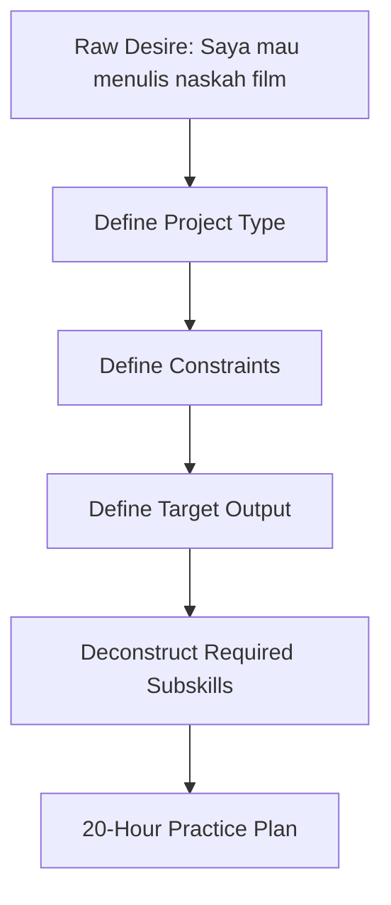
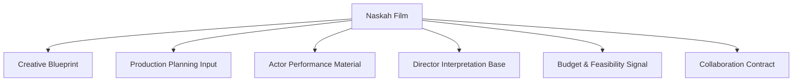
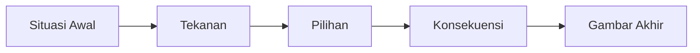
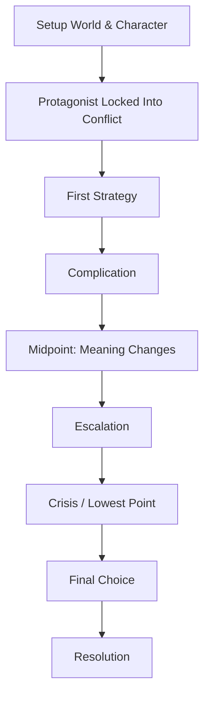
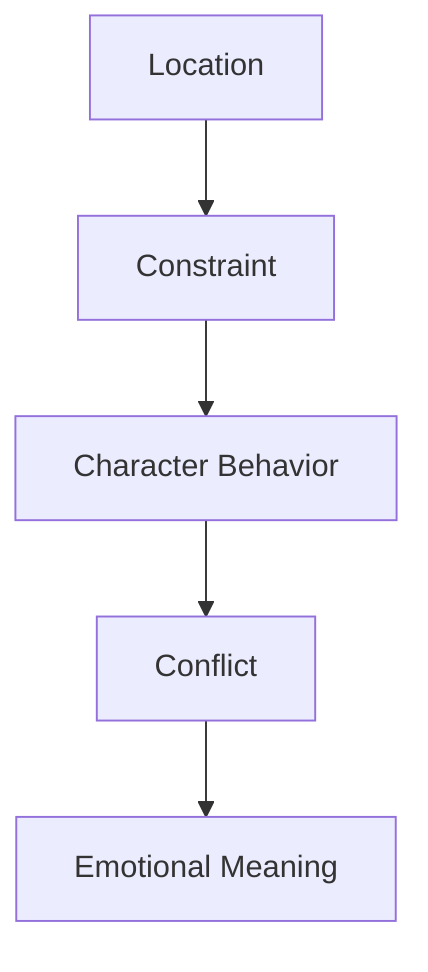
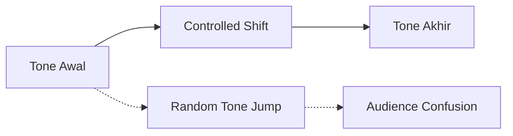
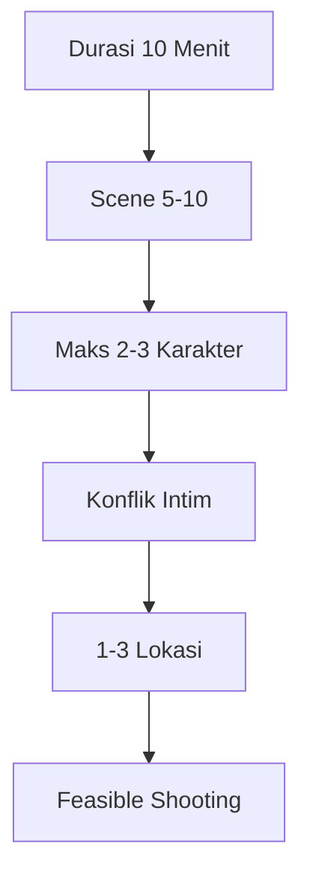
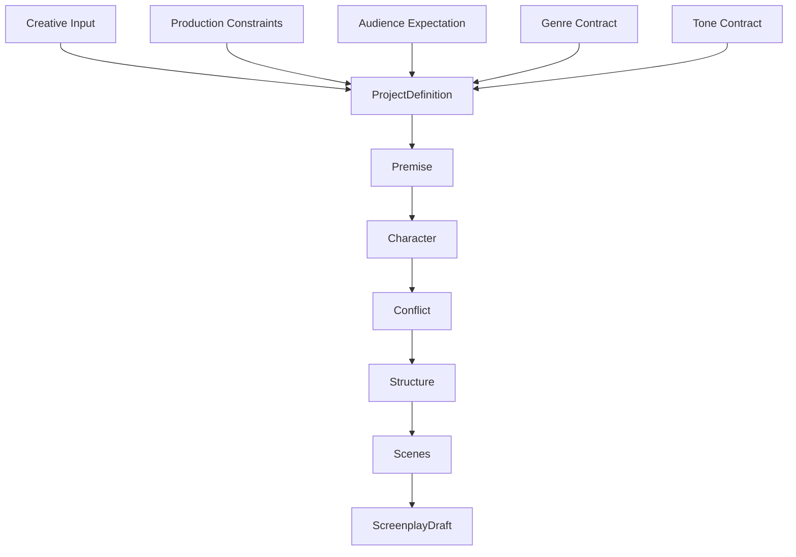
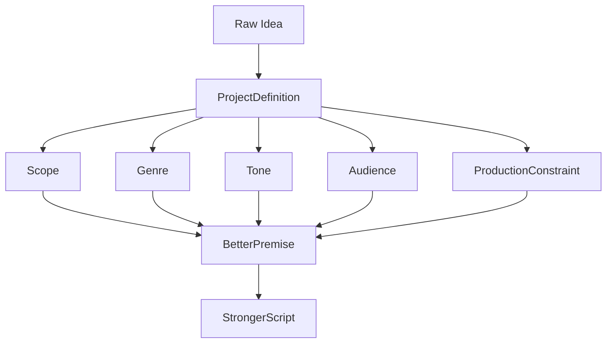

# learn-screenwriting-film-script-part-003.md

# Part 003 — Definisi Project: Film Apa yang Sebenarnya Mau Ditulis?

> Seri: **Learn Screenwriting for Film Project — The First 20 Hours Approach**  
> Fokus: **menentukan bentuk, batas, constraint, dan arah project film sebelum masuk ke premis dan logline**  
> Posisi dalam roadmap: setelah memahami mental model screenplay dan framework belajar 20 jam, sekarang kita mendefinisikan “produk” yang akan dibuat.

---

## 0. Tujuan Part Ini

Sebelum menulis naskah film, pertanyaan pertama bukan:

> “Ceritanya tentang apa?”

Pertanyaan yang lebih fundamental adalah:

> “Film seperti apa yang sebenarnya sedang saya buat, untuk siapa, dengan constraint apa, dan output naskah seperti apa yang dibutuhkan project ini?”

Ini penting karena **naskah film bukan hanya artefak kreatif**, tetapi juga **dokumen kerja produksi**.

Sebagai software engineer, bayangkan Anda tidak mungkin mulai coding sebelum jelas:

- sistem apa yang dibuat,
- user-nya siapa,
- environment-nya apa,
- constraint-nya apa,
- scope MVP-nya apa,
- dependency-nya apa,
- acceptance criteria-nya apa.

Screenwriting sama. Banyak penulis pemula langsung masuk ke adegan, dialog, atau mood, padahal belum tahu apakah mereka sedang menulis:

- film pendek 8 menit,
- film panjang 100 menit,
- proof-of-concept 5 menit,
- web film 20 menit,
- teaser,
- pitch sample,
- festival short,
- commercial narrative,
- microbudget film,
- atau episode pilot.

Akibatnya, script menjadi blur:

- konflik terlalu besar untuk durasi pendek,
- karakter terlalu banyak,
- lokasi tidak realistis,
- tone tidak stabil,
- genre tidak jelas,
- cerita terasa seperti sinopsis novel, bukan film,
- draft sulit diproduksi.

Part ini akan membantu Anda membuat **Project Definition Document** untuk naskah film.

Output akhir part ini:

1. Definisi format film.
2. Definisi durasi.
3. Definisi target audience.
4. Definisi genre dan tone.
5. Definisi constraint produksi.
6. Definisi output dokumen naskah.
7. Project brief siap pakai.
8. Decision matrix untuk memilih ide.
9. Risk register awal.
10. Acceptance criteria untuk draft pertama.

---

## 1. Hubungan Part Ini dengan Framework Josh Kaufman

Dalam framework *The First 20 Hours*, langkah pertama adalah **deconstruct the skill**: pecah skill besar menjadi komponen kecil yang bisa dilatih.

Namun sebelum deconstruction, kita harus tahu:

> Skill ini dipakai untuk menghasilkan apa?

“Menulis naskah film” terlalu luas. Skill yang dibutuhkan untuk menulis film pendek 10 menit berbeda dengan skill untuk menulis feature film 120 menit. Skill untuk menulis horror microbudget berbeda dengan sci-fi epic. Skill untuk membuat teaser berbeda dengan screenplay final yang siap shooting.

Maka part ini berfungsi sebagai tahap:



Tanpa definisi project, latihan 20 jam menjadi terlalu abstrak.

Dengan definisi project, latihan menjadi terarah:

- kalau project film pendek, kita fokus ke satu momen perubahan;
- kalau project film panjang, kita fokus ke struktur panjang dan sustained tension;
- kalau project microbudget, kita fokus ke sedikit lokasi dan karakter;
- kalau project festival, kita fokus ke singularity, voice, dan emotional aftertaste;
- kalau project proof-of-concept, kita fokus ke premise, tone, dan visual promise.

---

## 2. Core Question: Film Apa yang Sebenarnya Mau Ditulis?

Pertanyaan ini tampak sederhana, tapi sering dijawab terlalu dangkal.

Jawaban yang lemah:

> “Saya mau bikin film drama tentang keluarga.”

Masalahnya:

- drama seperti apa?
- panjang atau pendek?
- keluarga dalam konflik apa?
- siapa protagonisnya?
- audience-nya siapa?
- tone-nya hangat, tragis, satir, realistis, absurd, atau melodramatis?
- budget-nya seperti apa?
- lokasi berapa?
- perlu anak kecil, hewan, kendaraan, keramaian, atau efek khusus?
- ending-nya diharapkan memberi catharsis, shock, ambiguitas, atau ironi?

Jawaban yang lebih kuat:

> “Saya mau menulis film pendek drama keluarga 12 menit, microbudget, maksimal 3 karakter dan 2 lokasi, tentang seorang anak laki-laki dewasa yang harus memutuskan apakah ia akan menjual rumah warisan ibunya demi melunasi utang, dengan tone realistis-melankolis dan target festival lokal/komunitas film.”

Jawaban kedua langsung memberi batas.

Batas bukan musuh kreativitas. Dalam film, batas sering menjadi mesin kreativitas.

---

## 3. Naskah Film sebagai Artefak Project

Naskah film punya beberapa fungsi sekaligus:



Artinya, naskah tidak hanya harus “bagus dibaca”, tapi juga harus:

- bisa dibayangkan secara visual,
- bisa dimainkan aktor,
- bisa dipahami sutradara,
- bisa dihitung produser,
- bisa dipecah menjadi lokasi, cast, props, wardrobe, sound, schedule,
- bisa direvisi dengan feedback.

Jika Anda menulis naskah untuk project film sungguhan, Anda tidak sedang membuat karya privat. Anda sedang membuat dokumen yang akan memicu kerja banyak orang.

---

## 4. Perbedaan Project Film Berdasarkan Bentuk Output

### 4.1 Film Pendek

Film pendek biasanya berdurasi 1–30 menit, tetapi untuk latihan awal dan project kecil, rentang yang paling realistis adalah **5–15 menit**.

Karakteristik film pendek:

- fokus pada satu konflik utama;
- sedikit karakter;
- sedikit lokasi;
- perubahan karakter biasanya tajam dan terkonsentrasi;
- tidak punya ruang besar untuk subplot;
- sering bergantung pada satu situasi, satu dilema, satu twist, satu revelation, atau satu emotional turn.

Mental model:



Film pendek bukan versi mini dari film panjang. Film pendek lebih dekat ke **satu function yang harus punya side effect emosional kuat**.

Contoh scope yang cocok:

- seorang anak menunggu ayahnya datang ke wisuda, tapi yang datang hanya pesan suara;
- penjaga kos menemukan bahwa penghuni yang ia usir ternyata menyelamatkannya diam-diam;
- pasangan yang hendak bercerai harus pura-pura harmonis selama panggilan video dengan anaknya;
- seorang pegawai call center menerima telepon dari ibunya sendiri tanpa boleh mengaku.

Scope yang kurang cocok untuk film pendek 10 menit:

- perjalanan hidup seseorang dari kecil sampai tua;
- perang antar kerajaan;
- investigasi kriminal multi-layer;
- kisah cinta 10 tahun;
- reformasi politik satu negara;
- perjalanan spiritual lintas benua.

Bisa saja dibuat, tetapi biasanya akan menjadi sinopsis terburu-buru, bukan film yang hidup.

---

### 4.2 Film Panjang / Feature Film

Feature film umumnya berada di rentang sekitar 80–120 menit. Dalam format screenplay industri, satu halaman screenplay sering dipakai sebagai estimasi kasar satu menit durasi, walaupun tidak selalu presisi.

Karakteristik feature:

- butuh dramatic question yang bertahan lama;
- punya struktur panjang;
- punya midpoint;
- punya eskalasi;
- punya subplot;
- karakter punya arc lebih kompleks;
- konflik harus berevolusi;
- pacing menjadi masalah besar;
- dunia cerita perlu konsistensi.

Mental model:



Untuk 20 jam pertama, target feature film bukan final draft penuh. Target yang realistis:

- logline;
- premise;
- theme;
- character map;
- conflict engine;
- 8-sequence outline;
- treatment 3–10 halaman;
- opening 5–15 halaman;
- beberapa scene kunci.

Menulis feature full draft 90–120 halaman butuh waktu lebih dari 20 jam jika ingin hasilnya layak.

---

### 4.3 Web Film / Digital Short

Web film biasanya lebih fleksibel. Bisa 3 menit, 10 menit, 20 menit, atau episodik.

Karakteristik:

- attention span lebih ketat;
- opening harus cepat;
- visual hook penting;
- konsep harus mudah dikomunikasikan;
- sering lebih dekat ke “shareable story”;
- production constraint biasanya kecil;
- bisa lebih eksperimental.

Pertanyaan penting:

- ditonton di mana?
- YouTube?
- Instagram?
- TikTok?
- festival online?
- internal brand project?
- proof-of-concept untuk pendanaan?

Format distribusi memengaruhi naskah. Film 3 menit untuk vertical platform tidak ditulis dengan ritme yang sama seperti film pendek festival 15 menit.

---

### 4.4 Proof-of-Concept Film

Proof-of-concept bukan film final. Tujuannya membuktikan:

- tone bisa bekerja;
- dunia cerita menarik;
- karakter punya potensi;
- visual style menjanjikan;
- konsep layak dikembangkan.

Biasanya pendek, padat, dan lebih fokus pada **promise** daripada complete resolution.

Contoh:

> Anda ingin membuat feature supernatural thriller, tapi baru punya dana membuat short 7 menit yang menunjukkan aturan dunia, tone horor, dan karakter utama.

Naskah proof-of-concept harus menjawab:

- apa konsep uniknya?
- apa rasa filmnya?
- kenapa orang ingin melihat versi panjangnya?
- apa adegan yang paling menjual potensinya?

---

### 4.5 Teaser / Pitch Scene

Teaser bukan cerita lengkap. Ia adalah alat menjual rasa.

Karakteristik:

- pendek;
- atmosfer kuat;
- konflik belum tentu selesai;
- ending sering berupa hook;
- dialog minimal;
- visual/sound identity penting.

Teaser cocok jika project butuh:

- pitch ke produser;
- crowdfunding;
- mood test;
- lookbook video;
- investor deck;
- director sample.

Namun jangan bingung antara teaser dan film pendek. Film pendek butuh pengalaman lengkap. Teaser hanya butuh janji pengalaman.

---

### 4.6 Episode Pilot

Pilot adalah pembuka serial. Fokusnya bukan hanya menyelesaikan satu cerita, tetapi membuka engine cerita berulang.

Pertanyaan pilot:

- siapa karakter utama?
- apa world-nya?
- apa konflik berkelanjutan?
- kenapa cerita ini bisa berjalan banyak episode?
- apa “case of the week” atau “arc engine”-nya?
- apa cliffhanger atau open loop-nya?

Untuk seri ini, pilot tidak menjadi fokus utama, tetapi prinsip project definition tetap sama.

---

## 5. Durasi sebagai Constraint Dramatik

Durasi bukan angka teknis saja. Durasi menentukan kedalaman konflik.

### 5.1 Mapping Durasi ke Scope

| Durasi | Scope yang Cocok | Risiko Utama |
|---:|---|---|
| 1–3 menit | satu momen, satu joke, satu twist, satu image | terlalu tipis atau terasa seperti iklan |
| 4–7 menit | satu situasi sederhana dengan satu perubahan | konflik kurang berkembang |
| 8–15 menit | satu konflik utama dengan setup-payoff jelas | terlalu banyak karakter/lokasi |
| 16–30 menit | short kompleks, bisa punya mini-arc | pacing lambat atau seperti feature terpotong |
| 40–60 menit | medium-length / TV-like | struktur ambigu |
| 80–120 menit | feature | middle sag, subplot lemah, scope bengkak |

### 5.2 Durasi Membatasi Jumlah Scene

Estimasi kasar:

| Durasi | Jumlah Scene Realistis |
|---:|---:|
| 3 menit | 1–3 scene |
| 5 menit | 2–5 scene |
| 10 menit | 5–10 scene |
| 15 menit | 8–15 scene |
| 90 menit | 40–70 scene |
| 120 menit | 60–90 scene |

Ini bukan hukum. Tapi sebagai alat perencanaan, cukup berguna.

Jika Anda menulis film pendek 10 menit dengan 25 scene, kemungkinan besar:

- setiap scene terlalu pendek;
- emosi tidak sempat tumbuh;
- shooting terlalu rumit;
- script terasa seperti montage panjang.

Jika Anda menulis feature 100 menit dengan hanya 12 scene, kemungkinan:

- scene terlalu panjang;
- pacing berat;
- banyak dialogue dump;
- visual variation rendah.

---

## 6. Budget sebagai Constraint Kreatif

Dalam project nyata, budget akan memengaruhi naskah.

Hal-hal yang membuat produksi lebih mahal:

- banyak lokasi;
- lokasi publik;
- lokasi dengan izin sulit;
- malam hari;
- hujan;
- kendaraan;
- anak kecil;
- hewan;
- crowd;
- stunt;
- fight scene;
- VFX;
- period setting;
- kostum khusus;
- properti mahal;
- musik lisensi;
- underwater;
- api;
- senjata;
- rumah sakit, kantor polisi, bandara, sekolah dengan izin rumit;
- scene perjalanan jauh.

Untuk penulis pemula, constraint yang baik:

```text
Film pendek 8–12 menit
Maksimal 3 karakter utama
Maksimal 2–3 lokasi
Tanpa VFX berat
Tanpa crowd
Tanpa stunt kompleks
Konflik emosional jelas
Ending kuat
```

Ini bukan berarti film harus kecil secara rasa. Film bisa kecil secara produksi tapi besar secara emosi.

Contoh:

> Dua saudara bertengkar di dapur rumah lama sebelum menjual rumah warisan ibu mereka.

Produksi sederhana:

- 2 karakter,
- 1 lokasi utama,
- konflik emosional kuat,
- stakes jelas,
- production feasible.

---

## 7. Lokasi sebagai Container Drama

Lokasi dalam film bukan hanya tempat. Lokasi adalah container konflik.

Pertanyaan lokasi:

- apakah lokasi menekan karakter?
- apakah lokasi punya makna emosional?
- apakah lokasi menciptakan constraint?
- apakah lokasi bisa divisualkan menarik?
- apakah lokasi feasible untuk shooting?
- apakah lokasi membantu atau menghambat pacing?

Contoh lokasi lemah:

> Mereka bicara di kafe.

Bisa saja, tapi terlalu generik jika tidak ada fungsi dramatik.

Contoh lokasi lebih kuat:

> Mereka bicara di ruang tunggu rumah sakit, sementara nama ibu mereka belum juga dipanggil.

Lokasi langsung memberi:

- urgency,
- anxiety,
- stakes,
- sound design,
- visual tension,
- social pressure.

### 7.1 Lokasi sebagai State



Lokasi yang baik mengubah perilaku karakter.

Contoh:

- Di rumah sendiri, karakter bisa meledak.
- Di kantor, ia harus menahan diri.
- Di rumah sakit, ia tidak boleh membuat keributan.
- Di masjid/gereja/ritual keluarga, ia terikat norma.
- Di lift, ia tidak bisa kabur.
- Di mobil, ia terjebak dengan orang yang ingin ia hindari.

---

## 8. Jumlah Karakter sebagai Complexity Multiplier

Setiap karakter menambah kompleksitas.

Dalam software, setiap dependency baru menambah surface area. Dalam naskah, setiap karakter baru menambah:

- motivasi,
- dialog,
- relationship,
- screen time,
- casting,
- blocking,
- wardrobe,
- continuity,
- production cost.

### 8.1 Rekomendasi Jumlah Karakter

| Format | Karakter Utama Ideal | Catatan |
|---|---:|---|
| Micro short 1–3 menit | 1–2 | fokus pada satu situasi |
| Short 5–10 menit | 2–3 | cukup untuk konflik interpersonal |
| Short 10–15 menit | 2–4 | masih feasible |
| Feature microbudget | 3–8 | tergantung genre |
| Feature ensemble | 8+ | butuh skill tinggi |

Untuk 20 jam pertama, pilih:

```text
1 protagonist
1 primary opposition
0–2 supporting character
```

### 8.2 Karakter Harus Punya Fungsi

Jangan membuat karakter hanya karena “di dunia nyata pasti ada orang itu”.

Setiap karakter sebaiknya punya fungsi:

- mendorong konflik,
- mengungkap sisi karakter utama,
- membawa tekanan sosial,
- menjadi mirror,
- menjadi temptation,
- menjadi obstacle,
- menjadi emotional anchor,
- memberi informasi melalui konflik,
- memaksa keputusan.

Jika karakter bisa dihapus tanpa mengubah cerita, ia mungkin belum punya fungsi.

---

## 9. Genre sebagai Kontrak Ekspektasi

Genre bukan sekadar label rak katalog. Genre adalah kontrak dengan penonton.

Ketika Anda berkata “horror”, penonton berharap:

- ketegangan,
- ancaman,
- ketidakamanan,
- rasa takut,
- reveal,
- atmosphere,
- kemungkinan bahaya.

Ketika Anda berkata “romance”, penonton berharap:

- hubungan,
- longing,
- obstacle to love,
- intimacy,
- emotional vulnerability,
- kemungkinan union atau separation.

Ketika Anda berkata “thriller”, penonton berharap:

- urgency,
- danger,
- suspense,
- pursuit,
- hidden information,
- escalating stakes.

Genre membantu Anda membuat keputusan.

### 9.1 Genre Menentukan Pertanyaan Utama

| Genre | Pertanyaan Dramatik Umum |
|---|---|
| Drama | apakah karakter bisa menghadapi luka/kebenaran hidupnya? |
| Romance | apakah dua orang ini bisa/harus bersama? |
| Horror | apakah karakter bisa selamat dari ancaman? |
| Thriller | apakah karakter bisa menghentikan bahaya sebelum terlambat? |
| Mystery | apa kebenaran tersembunyi di balik kejadian ini? |
| Comedy | bagaimana karakter menghadapi absurditas/kekurangan dirinya? |
| Action | apakah karakter bisa mengalahkan ancaman eksternal? |
| Coming-of-age | apakah karakter bisa melewati ambang kedewasaan? |
| Satire | kebusukan sistem apa yang sedang dibongkar melalui ironi? |

### 9.2 Genre sebagai Constraint

Jika Anda memilih horror microbudget, Anda bisa menghemat produksi karena rasa takut bisa dibangun lewat:

- sound,
- darkness,
- offscreen space,
- silence,
- restricted location,
- object,
- implication.

Jika Anda memilih action perang futuristik, budget naik drastis.

Jadi genre bukan hanya rasa. Genre adalah keputusan produksi.

---

## 10. Tone sebagai Kontrak Emosi

Genre menjawab “jenis cerita apa ini?”

Tone menjawab:

> “Bagaimana rasanya menonton cerita ini?”

Contoh tone:

- realistis,
- satir,
- gelap,
- hangat,
- absurd,
- tragis,
- melancholic,
- lyrical,
- brutal,
- comedic,
- deadpan,
- dreamy,
- gritty,
- intimate,
- operatic,
- spiritual,
- cynical.

Dua film bisa sama-sama drama keluarga, tapi tone-nya berbeda:

| Premis | Tone A | Tone B |
|---|---|---|
| Anak pulang ke rumah setelah lama pergi | hangat, rekonsiliatif | dingin, penuh dendam |
| Pasangan bercerai | komedi pahit | tragedi realistis |
| Pegawai kecil melawan sistem | satir absurd | thriller sosial |

Tone menentukan:

- panjang dialog,
- ritme scene,
- pilihan visual,
- ending,
- musik,
- humor,
- kekerasan,
- intensitas akting,
- cara karakter bicara.

### 10.1 Tone Drift

Tone drift terjadi ketika film terasa tidak konsisten tanpa kontrol.

Contoh:

- opening realistis berat,
- tengah tiba-tiba komedi slapstick,
- akhir menjadi melodrama berlebihan.

Bukan berarti tone tidak boleh berubah. Tone boleh berubah jika ada transisi dan alasan dramatik.



---

## 11. Audience sebagai Runtime Environment

Dalam software, runtime environment memengaruhi bagaimana program berjalan.

Dalam film, audience adalah runtime emosional dan kognitif.

Pertanyaan audience:

- mereka siapa?
- mereka menonton untuk apa?
- mereka punya referensi genre apa?
- mereka sabar dengan slow cinema atau tidak?
- mereka butuh plot cepat atau atmosfer?
- mereka lokal atau internasional?
- mereka festival programmer, komunitas, penonton bioskop, YouTube audience, atau investor?
- mereka butuh konteks budaya dijelaskan atau bisa infer sendiri?

### 11.1 Tipe Audience

| Audience | Implikasi Naskah |
|---|---|
| Festival | voice kuat, visual specificity, emotional aftertaste, tidak harus terlalu konvensional |
| Commercial | hook jelas, pacing kuat, genre promise terpenuhi |
| Komunitas lokal | konteks sosial bisa lebih spesifik |
| Online short | opening cepat, konsep mudah ditangkap, durasi ketat |
| Investor/produser | feasibility, market positioning, clarity |
| Aktor/sutradara | karakter playable, scene punya intention |
| Internal brand/social campaign | pesan jelas tapi jangan propaganda kaku |

### 11.2 Jangan Menulis untuk “Semua Orang”

“Untuk semua orang” biasanya berarti tidak tajam.

Lebih baik:

> Film pendek drama keluarga untuk penonton dewasa muda Indonesia yang pernah mengalami tekanan ekonomi keluarga, dengan tone realistis-melankolis.

Daripada:

> Film untuk semua umur tentang kehidupan.

Target audience bukan berarti membatasi dampak. Justru membuat cerita lebih spesifik.

---

## 12. Project Constraint sebagai Design Input

Project constraint adalah input desain, bukan penghalang.

Contoh constraint:

```text
Durasi: 10 menit
Karakter: maksimal 3
Lokasi: rumah dan warung
Budget: microbudget
Genre: drama thriller
Tone: intimate, tense, realistic
Audience: festival lokal
Production: 2 hari shooting
```

Dari constraint itu, ide cerita akan terbentuk berbeda dibanding:

```text
Durasi: 100 menit
Karakter: 12
Lokasi: 20
Budget: medium
Genre: action crime
Tone: gritty, fast-paced
Audience: commercial streaming
Production: 30 hari shooting
```

### 12.1 Constraint Propagation

Dalam naskah, satu constraint akan merambat ke banyak keputusan.



Jika Anda menentukan durasi 10 menit tetapi membuat cerita dengan 15 karakter dan 12 lokasi, constraint tidak konsisten.

---

## 13. Definisi Output Naskah

Sebelum menulis, tentukan output yang dibutuhkan.

### 13.1 Output untuk Tahap Ide

Cocok jika project masih eksplorasi:

- idea list,
- premise statement,
- logline,
- theme question,
- mood reference,
- genre statement.

### 13.2 Output untuk Development

Cocok jika project mulai dikembangkan:

- logline,
- synopsis 1 paragraf,
- synopsis 1 halaman,
- character brief,
- treatment,
- beat sheet,
- scene list.

### 13.3 Output untuk Drafting

Cocok jika mulai menulis screenplay:

- first draft,
- revised draft,
- table read draft,
- director draft,
- production draft,
- shooting draft.

### 13.4 Output untuk Pitch

Cocok jika ingin menjual/mengomunikasikan project:

- logline,
- synopsis,
- treatment,
- pitch deck,
- lookbook,
- proof-of-concept script,
- sample scene,
- character sheet.

Untuk 20 jam pertama, target minimal yang disarankan:

**Film pendek:**

```text
Project brief
Logline
Theme question
Character map
Conflict map
Beat sheet
Scene list
First draft
Feedback notes
Rewrite plan
```

**Film panjang:**

```text
Project brief
Logline
Theme question
Character map
Conflict map
8-sequence outline
Treatment
Opening 5-15 pages
Feedback notes
Development roadmap
```

---

## 14. Ide Cerita vs Project Film

Ide cerita biasanya berbentuk:

> “Ada orang yang pulang kampung dan menemukan rahasia keluarganya.”

Project film berbentuk:

> “Film pendek drama mystery 12 menit, maksimal 3 karakter, 2 lokasi, tentang seorang anak yang pulang ke rumah ibunya untuk mengambil akta tanah, tetapi menemukan bahwa ibunya sudah lama menjual tanah itu untuk membiayai hidupnya diam-diam; tone intimate, bitter, realistis, untuk festival lokal.”

Perbedaannya:

| Aspek | Ide Cerita | Project Film |
|---|---|---|
| Bentuk | samar | spesifik |
| Durasi | belum jelas | jelas |
| Genre | belum tentu | jelas |
| Tone | belum tentu | jelas |
| Karakter | belum terdefinisi | dibatasi |
| Produksi | tidak dipikirkan | masuk perhitungan |
| Output | inspirasi | dokumen kerja |

---

## 15. Decision Matrix untuk Memilih Ide

Jika Anda punya banyak ide, jangan pilih hanya berdasarkan “yang paling keren”. Pilih ide yang paling cocok dengan project, constraint, dan target belajar.

### 15.1 Kriteria Penilaian

Gunakan skala 1–5.

| Kriteria | Pertanyaan |
|---|---|
| Clarity | apakah idenya bisa dijelaskan dalam 1–2 kalimat? |
| Conflict | apakah ada konflik jelas? |
| Visuality | apakah bisa divisualkan tanpa banyak penjelasan? |
| Emotional Weight | apakah punya beban emosi? |
| Feasibility | apakah bisa diproduksi sesuai resource? |
| Scope Fit | apakah cocok dengan durasi? |
| Character Potential | apakah karakter punya pilihan sulit? |
| Genre Promise | apakah memenuhi janji genre? |
| Original Angle | apakah punya sudut pandang menarik? |
| Personal Urgency | apakah Anda punya alasan kuat menulisnya? |

### 15.2 Template Matrix

| Ide | Clarity | Conflict | Visual | Emotion | Feasible | Scope | Character | Genre | Original | Personal | Total |
|---|---:|---:|---:|---:|---:|---:|---:|---:|---:|---:|---:|
| Ide A |  |  |  |  |  |  |  |  |  |  |  |
| Ide B |  |  |  |  |  |  |  |  |  |  |  |
| Ide C |  |  |  |  |  |  |  |  |  |  |  |

Namun hati-hati: skor bukan segalanya. Matrix membantu melihat kelemahan. Keputusan akhir tetap memakai intuisi kreatif.

Sebagai software engineer, anggap matrix ini seperti architectural trade-off analysis. Bukan otomatisasi keputusan, tetapi alat memperjelas konsekuensi.

---

## 16. Scope Trap: Kesalahan Paling Umum

### 16.1 Terlalu Banyak Cerita untuk Durasi Pendek

Gejala:

- harus menjelaskan masa lalu panjang;
- banyak flashback;
- banyak karakter;
- ending terasa dipaksa;
- scene hanya jadi rangkuman;
- tidak ada momen yang sempat bernapas.

Solusi:

- pilih satu momen paling penting;
- jadikan masa lalu sebagai tekanan, bukan rangkaian scene;
- kurangi karakter;
- kurangi lokasi;
- fokus pada satu keputusan.

### 16.2 Terlalu Banyak Tema

Contoh:

> Film ini tentang kapitalisme, trauma keluarga, korupsi, agama, cinta, teknologi, kematian, dan alienasi modern.

Bisa saja, tetapi untuk 20 jam pertama terlalu luas.

Solusi:

- pilih satu theme question utama;
- tema lain boleh muncul sebagai layer, bukan pusat.

### 16.3 Premis Tidak Punya Konflik

Contoh:

> Seorang pemuda merenungkan hidupnya di kota.

Ini mood, bukan konflik.

Lebih kuat:

> Seorang pemuda yang hendak meninggalkan kota harus menghabiskan malam terakhir bersama adiknya yang tidak tahu bahwa ia pergi untuk selamanya.

Sekarang ada:

- waktu,
- hubungan,
- rahasia,
- konflik emosional,
- stakes.

### 16.4 Terlalu Mahal untuk Diproduksi

Contoh untuk pemula:

> Film pendek 10 menit tentang invasi alien di Jakarta dengan kerusuhan massal, ledakan, dan kejar-kejaran mobil.

Bisa ditulis, tapi tidak cocok jika project nyata microbudget.

Solusi:

> Seorang operator CCTV malam melihat sesuatu jatuh dari langit, lalu menyadari hanya ia yang bisa memperingatkan gedung sebelum listrik padam.

Masih genre, tapi lebih feasible.

---

## 17. Project Definition Canvas

Gunakan canvas berikut sebelum masuk ke logline.

```text
PROJECT DEFINITION CANVAS

1. Working Title:
2. Format:
3. Estimated Duration:
4. Target Output:
5. Genre:
6. Tone:
7. Target Audience:
8. Core Situation:
9. Protagonist:
10. Main Desire:
11. Main Obstacle:
12. Stakes:
13. Theme Question:
14. Production Scale:
15. Character Limit:
16. Location Limit:
17. Time Span of Story:
18. Visual/Sonic Identity:
19. Comparable References:
20. Non-Negotiables:
21. Things to Avoid:
22. Success Criteria:
```

### 17.1 Contoh Pengisian

```text
1. Working Title:
   Rumah yang Tidak Dijual

2. Format:
   Film pendek

3. Estimated Duration:
   12 menit

4. Target Output:
   First draft screenplay 12 halaman + treatment 1 halaman

5. Genre:
   Drama keluarga

6. Tone:
   Realistis, intimate, pahit, melankolis

7. Target Audience:
   Dewasa muda Indonesia, komunitas film, festival lokal

8. Core Situation:
   Dua saudara bertemu untuk menjual rumah warisan ibu mereka, tetapi salah satu menyembunyikan alasan sebenarnya.

9. Protagonist:
   Anak sulung, 32 tahun, rasional, merasa paling bertanggung jawab.

10. Main Desire:
   Menjual rumah untuk melunasi utang.

11. Main Obstacle:
   Adiknya menolak karena rumah itu satu-satunya sisa hubungan dengan ibu mereka.

12. Stakes:
   Jika rumah tidak dijual, utang menekan keluarga. Jika dijual, ikatan terakhir dengan ibu hilang.

13. Theme Question:
   Apakah tanggung jawab berarti menyelamatkan yang hidup atau menjaga yang sudah pergi?

14. Production Scale:
   Microbudget

15. Character Limit:
   2 karakter utama, 1 suara telepon opsional

16. Location Limit:
   1 rumah

17. Time Span of Story:
   Satu sore menjelang magrib

18. Visual/Sonic Identity:
   Rumah kosong, suara kipas tua, cahaya senja, kardus pindahan, lantai berdebu.

19. Comparable References:
   Drama keluarga minimalis, chamber drama, slow-burn intimate conflict.

20. Non-Negotiables:
   Harus terasa manusiawi, tidak melodrama berlebihan.

21. Things to Avoid:
   Flashback panjang, dialog menjelaskan masa lalu secara kaku.

22. Success Criteria:
   Pembaca memahami konflik dalam 2 halaman pertama, merasakan tekanan emosional, dan melihat ending sebagai pilihan yang menyakitkan tapi inevitable.
```

---

## 18. Film Project sebagai Sistem

Sebagai software engineer, Anda bisa memodelkan project film seperti sistem dengan constraint dan output.



Jika project definition salah, semua downstream artefact akan ikut kabur.

---

## 19. Acceptance Criteria untuk Project Film

Acceptance criteria membantu menentukan apakah draft sudah memenuhi tujuan awal.

Contoh acceptance criteria untuk film pendek:

```text
Draft dianggap memenuhi target awal jika:

1. Durasi estimasi 8–12 halaman.
2. Maksimal 3 karakter berbicara.
3. Maksimal 3 lokasi.
4. Konflik utama muncul sebelum halaman 3.
5. Protagonist punya keinginan jelas.
6. Ada obstacle yang aktif.
7. Setiap scene mengubah situasi.
8. Ending membayar setup awal.
9. Tidak ada dialog eksposisi lebih dari 4 baris berturut-turut tanpa tension.
10. Naskah bisa dibaca dalam format screenplay standar.
```

Acceptance criteria untuk feature blueprint:

```text
Blueprint dianggap memenuhi target awal jika:

1. Logline jelas.
2. Theme question jelas.
3. Protagonist punya want, need, flaw.
4. Antagonistic force jelas.
5. 8-sequence outline tersedia.
6. Midpoint mengubah arah cerita.
7. Ending merupakan konsekuensi dari pilihan karakter.
8. Treatment minimal 3 halaman.
9. Opening 5-15 halaman menunjukkan tone dan konflik.
10. Project scope masuk akal untuk target produksi.
```

---

## 20. Risk Register Awal

Naskah film punya risiko seperti project software.

### 20.1 Template Risk Register

| Risiko | Gejala | Dampak | Mitigasi |
|---|---|---|---|
| Scope terlalu besar | terlalu banyak karakter/lokasi | draft tidak selesai/mahal | batasi durasi, lokasi, karakter |
| Konflik tidak jelas | scene terasa datar | penonton tidak peduli | definisikan want vs obstacle |
| Tone tidak stabil | genre terasa campur aduk | audience bingung | buat tone statement |
| Karakter pasif | karakter hanya bereaksi | arc lemah | beri desire dan decision point |
| Terlalu banyak eksposisi | dialog menjelaskan semua | script membosankan | ubah info jadi konflik |
| Tidak production-aware | lokasi/adegan mahal | project tidak jalan | constraint sejak awal |
| Tema terlalu preachy | karakter jadi corong pesan | film terasa ceramah | jadikan tema sebagai pertanyaan |
| Ending tidak membayar setup | terasa random | emotional payoff gagal | setup-payoff tracking |

### 20.2 Risk Register untuk Project Anda

```text
RISK REGISTER

1. Risiko utama project:
2. Kenapa risiko ini mungkin terjadi:
3. Gejala awal:
4. Dampak ke naskah:
5. Dampak ke produksi:
6. Mitigasi:
7. Keputusan scope:
```

---

## 21. Latihan Part 003

### Latihan 1 — Tentukan Format

Jawab cepat:

```text
Saya sedang menulis:
[ ] film pendek
[ ] feature film
[ ] web film
[ ] proof-of-concept
[ ] teaser
[ ] pilot
[ ] belum tahu
```

Jika jawabannya “belum tahu”, pilih film pendek 8–12 menit untuk latihan 20 jam pertama. Ini bentuk paling efektif untuk belajar lengkap dari ide sampai draft.

---

### Latihan 2 — Batasi Durasi

Isi:

```text
Durasi target:
Minimum:
Maksimum:
Alasan memilih durasi:
Jumlah scene realistis:
```

Contoh:

```text
Durasi target:
10 menit

Minimum:
8 menit

Maksimum:
12 menit

Alasan:
Cukup untuk satu konflik emosional dan feasible untuk produksi pendek.

Jumlah scene realistis:
6-10 scene
```

---

### Latihan 3 — Batasi Karakter

Isi:

```text
Protagonist:
Primary opposition:
Supporting character 1:
Supporting character 2:
Karakter yang sengaja tidak dimasukkan:
```

Aturan:

> Jika karakter tidak memberi tekanan, pilihan, informasi konflik, atau konsekuensi, hapus dulu.

---

### Latihan 4 — Batasi Lokasi

Isi:

```text
Lokasi utama:
Lokasi kedua:
Lokasi ketiga:
Lokasi yang ingin dipakai tapi terlalu mahal/rumit:
Cara menggantinya:
```

Contoh:

```text
Lokasi rumit:
Bandara.

Cara mengganti:
Ruang tunggu travel, depan layar jadwal keberangkatan, atau kamar dengan suara pengumuman bandara dari TV/ponsel.
```

---

### Latihan 5 — Genre dan Tone

Isi:

```text
Genre utama:
Genre sekunder jika ada:
Tone utama:
Tone yang harus dihindari:
Emosi dominan yang ingin tertinggal setelah film selesai:
```

Contoh:

```text
Genre utama:
Drama thriller

Genre sekunder:
Mystery

Tone utama:
Intimate, tense, realistis

Tone yang harus dihindari:
Komedi slapstick, melodrama sinetron

Emosi akhir:
Sesak, pahit, tapi manusiawi
```

---

### Latihan 6 — Project Definition Canvas

Isi canvas ini dengan serius. Jangan lanjut ke Part 004 sebelum minimal 70% terisi.

```text
PROJECT DEFINITION CANVAS

1. Working Title:
2. Format:
3. Estimated Duration:
4. Target Output:
5. Genre:
6. Tone:
7. Target Audience:
8. Core Situation:
9. Protagonist:
10. Main Desire:
11. Main Obstacle:
12. Stakes:
13. Theme Question:
14. Production Scale:
15. Character Limit:
16. Location Limit:
17. Time Span of Story:
18. Visual/Sonic Identity:
19. Comparable References:
20. Non-Negotiables:
21. Things to Avoid:
22. Success Criteria:
```

---

## 22. Checklist Sebelum Lanjut ke Part 004

Sebelum masuk ke premis dan logline, pastikan Anda bisa menjawab:

```text
[ ] Saya tahu format project saya.
[ ] Saya tahu durasi target.
[ ] Saya tahu output dokumen yang ingin dibuat.
[ ] Saya tahu genre utama.
[ ] Saya tahu tone utama.
[ ] Saya tahu target audience.
[ ] Saya tahu batas jumlah karakter.
[ ] Saya tahu batas jumlah lokasi.
[ ] Saya tahu production scale.
[ ] Saya tahu core situation.
[ ] Saya tahu protagonist awal.
[ ] Saya tahu obstacle awal.
[ ] Saya tahu stakes awal.
[ ] Saya tahu risiko scope terbesar.
[ ] Saya punya success criteria draft.
```

Jika banyak yang belum jelas, jangan panik. Ini normal. Tapi jangan langsung menulis draft panjang. Mulai dari memperjelas project definition.

---

## 23. Kesalahan Cara Pikir Software Engineer yang Perlu Diwaspadai

Sebagai software engineer, Anda punya keunggulan:

- mampu memecah sistem kompleks,
- peka terhadap dependency,
- terbiasa dengan state transition,
- nyaman dengan iterative development,
- kuat dalam debugging.

Namun ada jebakan:

### 23.1 Menganggap Cerita Harus Logis Dulu Baru Emosional

Cerita memang butuh logika, tetapi film pertama-tama dialami sebagai emosi.

Penonton bisa memaafkan sedikit ketidaksempurnaan logika jika emosi kuat. Tapi penonton sulit peduli pada logika sempurna jika tidak ada rasa.

Prinsip:

```text
Logic supports emotion.
Logic does not replace emotion.
```

### 23.2 Terlalu Cepat Membuat Framework

Anda mungkin tergoda membuat template besar sebelum punya satu scene hidup.

Framework membantu, tapi jangan menjadi pelarian dari menulis.

Gunakan struktur untuk memperjelas, bukan untuk menghindari risiko kreatif.

### 23.3 Over-Engineering Premis

Premis yang baik tidak harus kompleks.

Contoh kuat:

> Seorang ayah harus memilih antara menghadiri wawancara kerja terakhirnya atau menjemput anaknya yang ketakutan di sekolah.

Sederhana, tapi punya konflik.

### 23.4 Menghindari Ambiguitas

Software buruk jika ambigu. Seni kadang membutuhkan ambiguitas yang terkontrol.

Bedakan:

| Jenis Ambiguitas | Status |
|---|---|
| Penulis tidak tahu ceritanya apa | buruk |
| Penonton diberi ruang menafsirkan akhir | bisa baik |
| Motivasi karakter tidak jelas karena malas ditulis | buruk |
| Karakter punya kontradiksi manusiawi | baik |

---

## 24. Prinsip “Small Enough to Finish, Deep Enough to Matter”

Untuk 20 jam pertama, project harus:

```text
small enough to finish
deep enough to matter
```

Jika terlalu kecil:

- tidak ada konflik,
- hanya sketsa,
- tidak menantang.

Jika terlalu besar:

- tidak selesai,
- penuh rangkuman,
- sulit diproduksi.

Target terbaik:

> satu konflik manusia yang jelas, dalam constraint produksi sederhana, dengan ending yang mengubah makna awal.

---

## 25. Contoh Project Definition dalam Berbagai Genre

### 25.1 Drama Keluarga

```text
Format:
Film pendek 12 menit

Genre:
Drama keluarga

Tone:
Realistis, intimate, pahit

Core Situation:
Dua saudara harus mengosongkan rumah ibu mereka sehari sebelum rumah itu dijual.

Conflict:
Kakak ingin menjual cepat karena utang; adik menolak karena merasa kakaknya tidak pernah merawat ibu.

Production:
1 rumah, 2 karakter, 1 hari cerita.
```

### 25.2 Horror Microbudget

```text
Format:
Film pendek 8 menit

Genre:
Horror psikologis

Tone:
Sunyi, paranoid, claustrophobic

Core Situation:
Seorang penjaga kos mendengar suara bayi menangis dari kamar kosong yang sudah disegel.

Conflict:
Ia harus memilih membuka kamar yang dilarang pemilik kos atau mengabaikan suara yang makin mirip anaknya.

Production:
1 lorong kos, 1 kamar, 1 karakter utama, sound-heavy.
```

### 25.3 Thriller Sosial

```text
Format:
Film pendek 15 menit

Genre:
Thriller sosial

Tone:
Tense, realistis, urgent

Core Situation:
Seorang pegawai admin menemukan bahwa dokumen yang ia proses akan menggusur rumah keluarganya sendiri.

Conflict:
Ia punya 30 menit sebelum dokumen dikirim ke sistem pusat.

Production:
1 kantor, 1 ruang arsip, 3 karakter.
```

### 25.4 Romance Tragis

```text
Format:
Film pendek 10 menit

Genre:
Romance drama

Tone:
Melankolis, restrained, intimate

Core Situation:
Dua mantan kekasih bertemu untuk mengembalikan satu koper sebelum salah satunya pindah negara.

Conflict:
Mereka harus memutuskan apakah akan mengatakan alasan sebenarnya mereka berpisah.

Production:
1 halte bus, 1 kamar kos, 2 karakter.
```

### 25.5 Satire Politik Halus

```text
Format:
Film pendek 10-12 menit

Genre:
Satire drama

Tone:
Ironis, dingin, absurd terkendali

Core Situation:
Seorang petugas protokol menyiapkan ruang kedatangan pejabat yang selalu bepergian, sementara keluarganya sendiri menunggu bantuan yang tak pernah datang.

Conflict:
Ia harus membacakan pidato kosong yang bertentangan dengan realitas hidupnya.

Production:
1 ruang tunggu, 1 rumah sederhana, 3 karakter.
```

---

## 26. Project Definition sebagai Anti-Blank Page Tool

Blank page sering menakutkan karena terlalu banyak kemungkinan.

Project definition mengurangi kemungkinan menjadi jalur kerja.

Tanpa definisi:

```text
Saya bisa menulis apa saja.
```

Dengan definisi:

```text
Saya harus menulis film pendek 10 menit, 2 karakter, 1 lokasi, drama thriller, tentang seseorang yang menyembunyikan rahasia dalam satu malam.
```

Sekarang otak punya constraint. Constraint membuat keputusan lebih mudah.

---

## 27. Output Part Ini

Setelah menyelesaikan Part 003, Anda harus punya file atau catatan bernama:

```text
project-definition.md
```

Minimal berisi:

```text
# Project Definition

## Working Title

## Format

## Duration

## Target Output

## Genre

## Tone

## Target Audience

## Core Situation

## Protagonist

## Main Desire

## Main Obstacle

## Stakes

## Theme Question

## Production Constraints

## Character Limit

## Location Limit

## Time Span

## Visual/Sonic Identity

## Comparable References

## Non-Negotiables

## Things to Avoid

## Success Criteria

## Risk Register
```

Ini akan menjadi input untuk Part 004: Premis, Logline, dan Dramatic Question.

---

## 28. Ringkasan Mental Model Part 003

Naskah film yang baik tidak dimulai dari halaman pertama. Ia dimulai dari definisi project.



Prinsip yang harus diingat:

1. Film bukan hanya cerita, tetapi project.
2. Durasi menentukan scope.
3. Budget menentukan strategi kreatif.
4. Genre memberi kontrak ekspektasi.
5. Tone memberi kontrak emosi.
6. Audience memengaruhi cara informasi disampaikan.
7. Jumlah karakter dan lokasi adalah complexity multiplier.
8. Constraint bukan musuh; constraint adalah alat desain.
9. Project definition mencegah naskah melebar tanpa arah.
10. Untuk 20 jam pertama, pilih project yang kecil cukup untuk selesai dan dalam cukup untuk berarti.

---

## 29. Tugas Praktik Sebelum Lanjut

Sebelum lanjut ke Part 004, kerjakan ini:

### Tugas A — Buat 3 Opsi Project

Buat 3 project definition singkat:

```text
Project A:
Format:
Durasi:
Genre:
Tone:
Core situation:
Karakter:
Lokasi:
Kenapa menarik:
Kenapa feasible:

Project B:
Format:
Durasi:
Genre:
Tone:
Core situation:
Karakter:
Lokasi:
Kenapa menarik:
Kenapa feasible:

Project C:
Format:
Durasi:
Genre:
Tone:
Core situation:
Karakter:
Lokasi:
Kenapa menarik:
Kenapa feasible:
```

### Tugas B — Beri Skor

Gunakan matrix:

| Ide | Clarity | Conflict | Visual | Emotion | Feasible | Scope | Total |
|---|---:|---:|---:|---:|---:|---:|---:|
| A |  |  |  |  |  |  |  |
| B |  |  |  |  |  |  |  |
| C |  |  |  |  |  |  |  |

### Tugas C — Pilih 1 Project

Pilih bukan hanya yang paling keren, tetapi yang:

```text
paling mungkin selesai,
paling punya konflik,
paling bisa diproduksi,
paling punya alasan personal untuk ditulis.
```

---

## 30. Preview Part Berikutnya

Part berikutnya:

```text
learn-screenwriting-film-script-part-004.md
```

Judul:

```text
Part 004 — Premis, Logline, dan Dramatic Question
```

Kita akan membahas:

- bedanya ide, premis, logline, dan plot;
- formula logline yang tidak terasa template;
- cara menemukan protagonist, want, obstacle, stakes, dan irony;
- cara membuat dramatic question;
- cara membuat 20 variasi logline;
- cara memilih logline yang paling kuat;
- cara menghindari premis yang hanya mood tanpa konflik.

Part 003 belum membuat cerita menjadi tajam sepenuhnya. Ia baru membuat **container**. Part 004 akan mengisi container itu dengan **dramatic engine**.

---

# Status Seri

- Part 000: selesai.
- Part 001: selesai.
- Part 002: selesai.
- Part 003: selesai.
- Part terakhir seri: Part 030.

Seri belum selesai.
