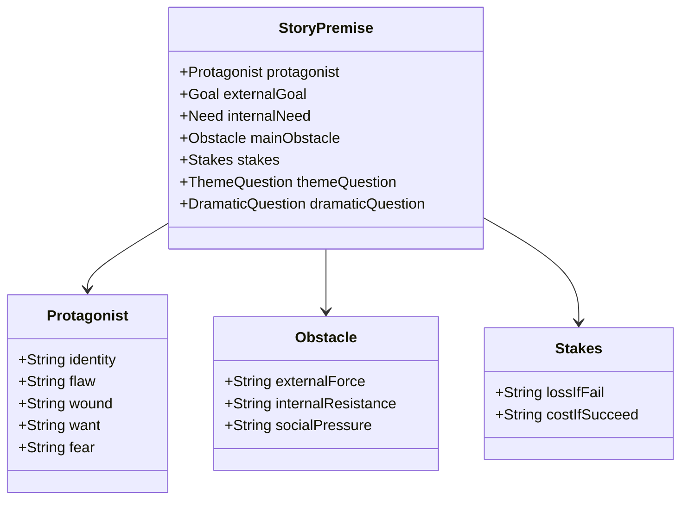
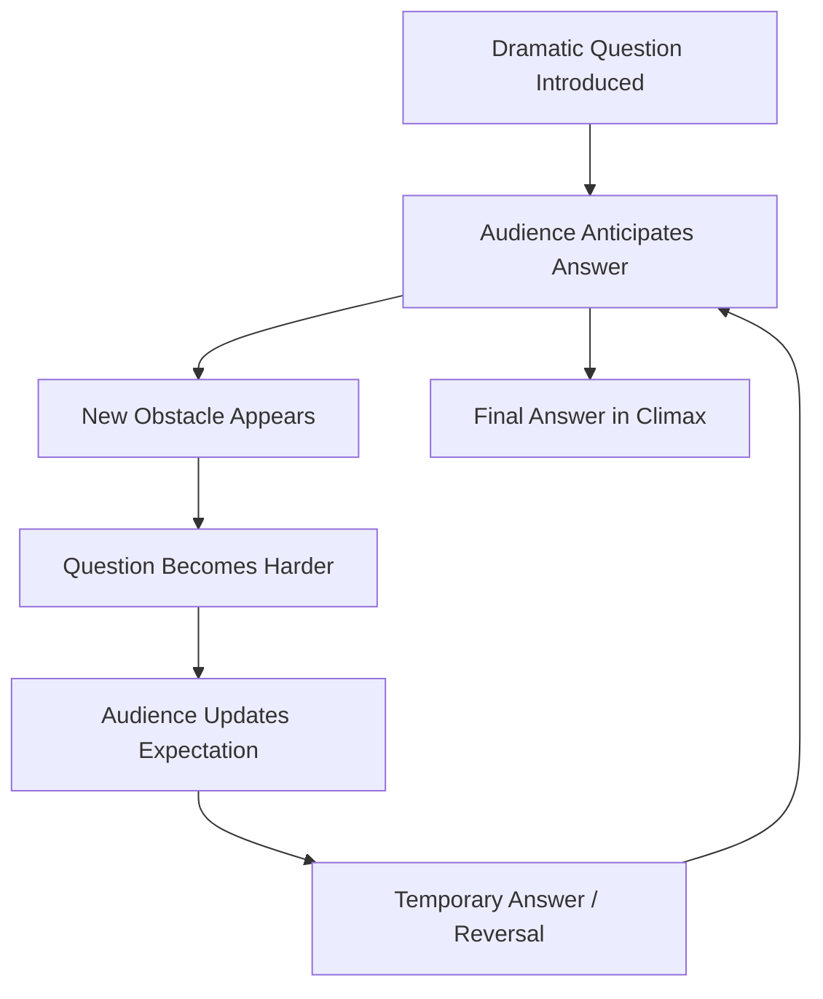
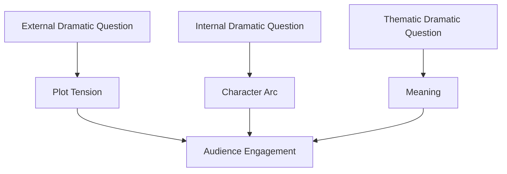
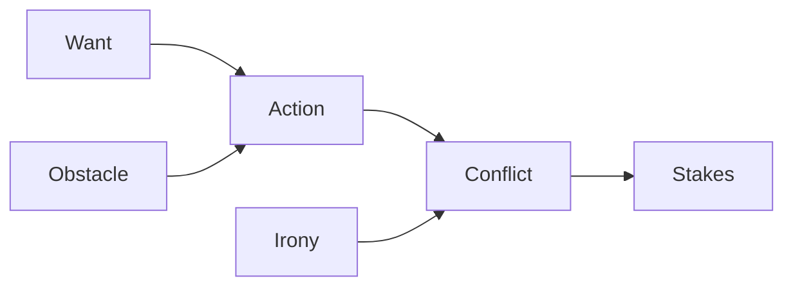
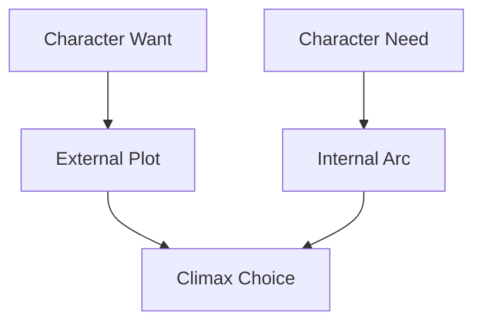

# learn-screenwriting-film-script-part-004.md

# Part 004 — Premis, Logline, dan Dramatic Question  
## Mengubah Ide Mentah Menjadi Mesin Cerita yang Bisa Diuji

> Seri: **Learn Screenwriting for Film Project — The First 20 Hours Approach**  
> Framework utama: **Josh Kaufman — The First 20 Hours**  
> Target seri: mampu menulis naskah film yang cukup solid untuk project film, dengan pendekatan bertahap, terukur, dan production-aware.  
> Status: **Part 004 dari 030**  
> Bagian terakhir seri: **belum**

---

## Daftar Isi

1. Posisi Part 004 dalam roadmap 20 jam
2. Kenapa premis dan logline sangat penting
3. Perbedaan ide, tema, premis, logline, plot, dan dramatic question
4. Mental model untuk software engineer
5. Premis sebagai seed system
6. Logline sebagai API contract cerita
7. Dramatic question sebagai event loop penonton
8. Komponen logline yang kuat
9. Formula logline yang fleksibel
10. Want, obstacle, stakes, dan irony
11. Cara membedakan premis aktif dan premis pasif
12. Cara menguji apakah premis punya energi dramatik
13. Scoring matrix untuk memilih ide
14. Latihan membuat 20 variasi logline
15. Debugging logline yang lemah
16. Contoh transformasi dari ide mentah menjadi logline
17. Checklist self-correction
18. Practice plan 60–90 menit
19. Deliverable Part 004
20. Kesalahan umum pemula
21. Persiapan menuju Part 005

---

# 1. Posisi Part 004 dalam Roadmap 20 Jam

Sebelumnya:

- **Part 000** menetapkan kontrak belajar 20 jam.
- **Part 001** membangun mental model screenplay sebagai blueprint audiovisual.
- **Part 002** memetakan metode Josh Kaufman untuk screenwriting.
- **Part 003** mendefinisikan project film: format, durasi, genre, tone, audience, dan production constraint.

Sekarang, **Part 004** masuk ke inti pertama dari cerita:

> Dari semua kemungkinan ide, mana yang benar-benar punya mesin dramatik?

Di tahap ini, kita belum menulis scene. Kita belum menulis dialog. Kita belum membuat outline panjang.

Kita sedang membuat **kernel cerita**.

Kalau analoginya software:

- Part 003 = menentukan requirement dan constraint project.
- Part 004 = mendefinisikan core use case.
- Part 005 = mendefinisikan thematic architecture.
- Part 006–008 = mendefinisikan domain model karakter dan konflik.
- Part 009–011 = mendesain control flow cerita.

Part 004 adalah tempat kita menjawab:

```text
Film ini sebenarnya tentang siapa,
dia menginginkan apa,
apa yang menghalanginya,
apa risikonya,
dan pertanyaan apa yang membuat penonton ingin terus menonton?
```

---

# 2. Kenapa Premis dan Logline Sangat Penting

Banyak naskah gagal bukan karena kurang adegan bagus, tetapi karena **premisnya tidak punya tekanan dramatik**.

Gejala umum:

- ide terasa menarik sebagai konsep, tetapi tidak menghasilkan konflik,
- tokoh utama tidak punya tujuan,
- cerita hanya berisi suasana,
- scene terasa seperti kumpulan momen tanpa arah,
- penonton tidak tahu harus menunggu apa,
- ending terasa arbitrer,
- revisi menjadi kacau karena tidak ada pusat gravitasi.

Premis dan logline berfungsi sebagai pusat gravitasi itu.

## 2.1 Premis sebagai filter keputusan

Saat menulis, Anda akan menghadapi ratusan keputusan:

- scene mana yang perlu?
- karakter mana yang harus dipertahankan?
- konflik mana yang utama?
- ending mana yang paling tepat?
- dialog mana yang berlebihan?
- apakah subplot ini perlu?
- apakah adegan ini memperkuat cerita atau hanya keren?

Tanpa premis yang jelas, semua keputusan terasa subjektif.

Dengan premis yang jelas, Anda punya filter:

> Apakah elemen ini memperkuat cerita inti?

## 2.2 Logline sebagai stress test

Logline bukan hanya alat pitching. Logline adalah alat diagnosis.

Kalau cerita tidak bisa diringkas dalam satu kalimat yang punya tokoh, tujuan, konflik, dan stakes, biasanya ceritanya belum cukup terdefinisi.

Bukan berarti semua film harus formulaik. Tetapi bahkan film yang puitis, lambat, eksperimental, atau atmosferik tetap perlu punya **tension object**: sesuatu yang ditunggu, dikhawatirkan, dicari, atau dipertaruhkan.

---

# 3. Perbedaan Ide, Tema, Premis, Logline, Plot, dan Dramatic Question

Sebelum lanjut, kita harus membedakan beberapa istilah yang sering tercampur.

| Istilah | Pertanyaan yang Dijawab | Contoh Sederhana |
|---|---|---|
| Ide | “Bagaimana kalau…?” | Bagaimana kalau seorang penjaga makam mendengar suara dari kuburan baru? |
| Tema | “Apa yang diperdebatkan?” | Apakah rasa bersalah bisa ditebus dengan pengakuan? |
| Premis | “Cerita dasarnya apa?” | Penjaga makam yang menyembunyikan dosa masa lalu harus menghadapi suara dari makam korban yang pernah ia tinggalkan. |
| Logline | “Versi satu kalimat yang menjual konflik?” | Saat suara dari makam baru mulai memanggil namanya, seorang penjaga makam tua harus membongkar rahasia pembunuhan lama sebelum warga desa mengubur kebenaran untuk selamanya. |
| Plot | “Apa urutan kejadian?” | Ia mendengar suara, menyelidiki, menemukan kaitan masa lalu, ditolak warga, dst. |
| Dramatic Question | “Apa yang membuat penonton bertahan?” | Akankah ia mengungkap kebenaran sebelum rahasia itu dikubur selamanya? |

## 3.1 Ide belum tentu cerita

Ide bisa sangat menarik, tetapi belum tentu punya cerita.

Contoh ide:

```text
Seorang pria tinggal sendirian di apartemen yang setiap malam berubah bentuk.
```

Menarik, tetapi belum cukup.

Pertanyaan lanjut:

- Siapa pria itu?
- Apa yang dia inginkan?
- Kenapa apartemen berubah?
- Apa bahayanya?
- Apa yang terjadi kalau dia gagal?
- Apa keputusan sulitnya?

Tanpa jawaban itu, ide hanya atmosfer.

## 3.2 Tema bukan plot

Tema:

```text
Kesepian membuat manusia lebih takut pada kedekatan daripada kehilangan.
```

Itu menarik. Tapi belum bisa langsung difilmkan.

Supaya menjadi film, tema perlu diwujudkan lewat karakter, konflik, pilihan, dan konsekuensi.

## 3.3 Premis adalah ide yang sudah punya arah konflik

Premis yang lebih kuat:

```text
Seorang arsitek penyendiri yang takut disentuh harus bekerja sama dengan tetangga barunya ketika apartemen mereka mulai menyatu setiap malam, memaksa mereka mengungkap rahasia yang selama ini mereka sembunyikan.
```

Sekarang ada:

- karakter,
- masalah,
- tekanan,
- relasi,
- potensi visual,
- potensi emosional.

---

# 4. Mental Model untuk Software Engineer

Sebagai software engineer, Anda mungkin terbiasa berpikir:

- input jelas,
- output jelas,
- state transition deterministic,
- bug bisa direproduksi,
- solusi ideal bisa dioptimasi.

Screenwriting berbeda.

Cerita tidak hanya bekerja lewat logika, tetapi lewat:

- curiosity,
- empathy,
- dread,
- anticipation,
- contradiction,
- rhythm,
- surprise,
- emotional payoff.

Tetapi cara pikir sistem tetap sangat berguna jika digunakan dengan benar.

## 4.1 Premis sebagai root object

Dalam domain model cerita:



Premis yang baik menyimpan dependency utama cerita.

Jika premis berubah, hampir semua turunannya ikut berubah:

- karakter,
- struktur,
- scene,
- konflik,
- ending,
- tone.

## 4.2 Logline sebagai interface

Logline adalah public interface cerita.

Ia tidak memuat semua implementasi, tetapi cukup untuk mengetahui:

- apa use case utama,
- siapa actor utama,
- apa goal,
- apa blocker,
- apa consequence.

Contoh interface buruk:

```text
Film tentang cinta, kehilangan, dan kehidupan.
```

Itu seperti API tanpa contract.

Contoh interface lebih baik:

```text
Seorang duda yang menolak menjual rumah penuh kenangan istrinya harus menerima penyewa muda yang ternyata menyimpan rahasia tentang malam kecelakaan istrinya.
```

Ini punya contract:

- tokoh,
- luka,
- konflik,
- relasi,
- rahasia,
- potensi perubahan.

## 4.3 Dramatic question sebagai event loop

Dramatic question membuat penonton terus memproses cerita.



Contoh:

```text
Akankah ia membuktikan dirinya tidak bersalah?
Akankah mereka bertahan bersama?
Akankah desa itu menerima kebenaran?
Akankah ia memilih keselamatan anaknya atau keadilan?
```

Dramatic question bukan hanya pertanyaan plot. Ia adalah mekanisme perhatian.

---

# 5. Premis sebagai Seed System

Premis adalah bentuk cerita yang masih kecil, tetapi sudah mengandung DNA lengkap.

Premis yang baik biasanya memuat minimal:

1. **Subjek cerita**: siapa tokoh atau pusat cerita.
2. **Situasi pemicu**: apa yang mengganggu dunia normal.
3. **Tujuan**: apa yang harus dicapai tokoh.
4. **Hambatan**: apa yang membuat tujuan sulit.
5. **Stakes**: apa yang hilang jika gagal.
6. **Potensi perubahan**: apa yang harus berubah dalam diri tokoh.
7. **Kontras/ironi**: kenapa situasi ini menarik.

## 5.1 Bentuk premis dasar

Template sederhana:

```text
Ketika [pemicu], seorang [tokoh dengan flaw/kondisi] harus [tujuan konkret] sebelum [konsekuensi buruk], tetapi [hambatan utama] memaksanya menghadapi [kebutuhan internal/tema].
```

Contoh:

```text
Ketika ayahnya dituduh membunuh kepala desa, seorang anak yang selama ini malu pada keluarganya harus membuktikan kebenaran sebelum eksekusi adat dilakukan, tetapi penyelidikannya memaksanya menghadapi fakta bahwa keluarganya memang menyimpan dosa lama.
```

Perhatikan: premis ini tidak hanya memberi plot. Ia memberi tekanan moral.

## 5.2 Premis yang hanya suasana

Contoh lemah:

```text
Seorang perempuan merasa kesepian di kota besar.
```

Masalah:

- tidak ada tujuan,
- tidak ada hambatan,
- tidak ada urgency,
- tidak ada konsekuensi,
- tidak ada perubahan yang terarah.

Bisa diperkuat:

```text
Setelah ibunya meninggal, seorang operator call center yang selalu menjadi suara bagi orang asing harus menemukan penelepon anonim terakhir ibunya sebelum nomor itu terputus selamanya.
```

Sekarang ada:

- profesi filmik,
- kesepian tetap ada,
- ada tujuan,
- ada deadline,
- ada misteri,
- ada emosi personal.

## 5.3 Premis sebagai generator scene

Premis kuat secara natural menghasilkan scene.

Contoh:

```text
Seorang guru honorer yang takut kehilangan pekerjaannya harus melindungi murid yang menuduh kepala sekolah melakukan kekerasan, sementara seluruh sekolah menekan mereka untuk diam.
```

Scene yang langsung muncul:

- murid datang dengan luka,
- guru ragu melapor,
- kepala sekolah memberi ancaman halus,
- wali murid menyalahkan korban,
- guru mencari bukti,
- guru mendapat surat pemutusan kontrak,
- murid menarik pengakuan,
- guru harus bicara di rapat sekolah.

Itu tanda premis punya mesin.

---

# 6. Logline sebagai API Contract Cerita

Logline adalah satu kalimat yang merangkum mesin cerita.

Fungsi logline:

1. Menguji apakah cerita punya arah.
2. Mengomunikasikan film kepada orang lain.
3. Menjaga writer tetap fokus.
4. Membantu produser/sutradara memahami scope.
5. Membantu memilih scene yang relevan.
6. Membantu mendiagnosis struktur.

## 6.1 Logline bukan sinopsis

Sinopsis menceritakan ringkasan cerita.

Logline mengunci konflik inti.

Sinopsis:

```text
Rina adalah seorang bidan desa yang hidup bersama ibunya. Suatu hari, ia menemukan bayi di depan kliniknya. Ia mencoba mencari ibu bayi itu, tetapi warga desa menyembunyikan sesuatu. Rina akhirnya mengetahui bahwa bayi itu terkait dengan kasus lama...
```

Logline:

```text
Ketika bayi tanpa identitas ditinggalkan di kliniknya, seorang bidan desa yang takut melawan adat harus menemukan ibu bayi itu sebelum warga mengubur rahasia yang dapat menghancurkan keluarganya sendiri.
```

Logline lebih ringkas, tetapi lebih kuat.

## 6.2 Logline bukan tagline

Tagline adalah kalimat promosi.

Tagline:

```text
Tidak semua yang dikubur benar-benar mati.
```

Logline:

```text
Saat suara dari makam baru memanggil namanya, seorang penjaga makam tua harus mengungkap kematian seorang gadis sebelum desa yang pernah ia lindungi mengubur rahasia itu untuk selamanya.
```

Tagline menjual rasa. Logline menjual cerita.

## 6.3 Logline bukan tema

Tema:

```text
Kebenaran yang ditunda akan kembali sebagai kutukan.
```

Logline:

```text
Seorang pejabat desa yang dulu memalsukan laporan kematian harus membantu anak korban menemukan jasad ibunya sebelum pemilihan desa menghapus semua bukti.
```

Tema memberi lapisan makna. Logline memberi konflik operasional.

---

# 7. Dramatic Question sebagai Event Loop Penonton

Dramatic question adalah pertanyaan utama yang ditanamkan pada penonton.

Ia biasanya muncul dari logline.

Contoh logline:

```text
Ketika satu-satunya saksi pembunuhan adalah anaknya yang bisu, seorang ibu harus menerjemahkan gambar-gambar anak itu sebelum pembunuhnya kembali untuk menghapus bukti terakhir.
```

Dramatic question:

```text
Akankah sang ibu memahami kesaksian anaknya sebelum pembunuh kembali?
```

Namun dramatic question yang lebih dalam:

```text
Akankah sang ibu akhirnya percaya pada anak yang selama ini ia anggap tidak mampu memahami dunia?
```

Ada dua level:

| Level | Pertanyaan |
|---|---|
| External dramatic question | Apakah tujuan plot tercapai? |
| Internal dramatic question | Apakah karakter berubah? |
| Thematic dramatic question | Nilai apa yang akhirnya dibuktikan film? |

## 7.1 Dramatic question eksternal

Contoh:

- Akankah ia menemukan pembunuhnya?
- Akankah mereka keluar dari rumah itu?
- Akankah ia memenangkan sidang?
- Akankah ia menghentikan pernikahan itu?
- Akankah ia pulang sebelum ayahnya meninggal?

Ini menarik karena jelas.

## 7.2 Dramatic question internal

Contoh:

- Akankah ia berani percaya lagi?
- Akankah ia mengakui kesalahannya?
- Akankah ia berhenti bersembunyi di balik statusnya?
- Akankah ia memilih kebenaran di atas kenyamanan?

Ini memberi kedalaman.

## 7.3 Dramatic question tematik

Contoh:

- Apakah keluarga harus selalu dilindungi meski salah?
- Apakah keadilan masih berarti jika menghancurkan orang yang kita cintai?
- Apakah cinta tanpa kejujuran masih bisa disebut cinta?
- Apakah manusia berubah karena sadar atau karena dipaksa kehilangan?

Ini memberi resonansi.

## 7.4 Hubungan ketiganya



Film yang kuat biasanya punya ketiganya.

---

# 8. Komponen Logline yang Kuat

Logline tidak harus selalu mengikuti formula kaku, tetapi biasanya memuat komponen berikut.

## 8.1 Protagonist

Tokoh utama harus cukup spesifik.

Lemah:

```text
Seorang pria...
```

Lebih kuat:

```text
Seorang petugas pemulasaraan jenazah yang takut menyentuh orang hidup...
```

Lebih spesifik = lebih banyak potensi cerita.

Pertanyaan:

- Apa identitas tokoh?
- Apa profesinya?
- Apa kontradiksinya?
- Apa luka atau kelemahannya?
- Kenapa dia tokoh paling tepat untuk cerita ini?

## 8.2 Trigger / inciting situation

Apa yang mengganggu dunia normal?

Contoh:

- ketika anaknya hilang,
- ketika ia menerima surat dari orang mati,
- ketika desa menolak mengubur jasad ibunya,
- ketika video lamanya viral,
- ketika ia ditunjuk menjadi wali murid yang membencinya,
- ketika ia menemukan bukti bahwa suaminya masih hidup.

Trigger harus memaksa cerita bergerak.

## 8.3 Goal / want

Apa yang ingin dicapai?

Goal harus bisa dilihat.

Kurang filmik:

```text
Ia ingin menemukan makna hidup.
```

Lebih filmik:

```text
Ia harus mengantarkan abu ayahnya ke desa yang melarang keluarganya pulang.
```

Makna hidup bisa muncul sebagai lapisan, tetapi goal eksternal harus konkret.

## 8.4 Obstacle

Apa yang menghalangi?

Obstacle kuat biasanya berlapis:

- external obstacle,
- interpersonal obstacle,
- institutional obstacle,
- internal flaw,
- time pressure,
- moral dilemma.

Contoh:

```text
...tetapi polisi yang menangani kasus itu adalah kakaknya sendiri, orang yang paling diuntungkan jika kebenaran tidak pernah terbuka.
```

## 8.5 Stakes

Apa yang hilang jika gagal?

Stakes tidak harus selalu nyawa. Bisa:

- reputasi,
- keluarga,
- cinta,
- rumah,
- identitas,
- kebebasan,
- iman,
- kesempatan terakhir,
- ingatan,
- martabat,
- masa depan anak.

Stakes harus terasa personal.

## 8.6 Irony / contrast

Irony membuat logline lebih hidup.

Contoh:

```text
Seorang konsultan pernikahan yang diam-diam sedang bercerai...
```

```text
Seorang polisi yang tidak pernah percaya takhayul...
```

```text
Seorang guru agama yang kehilangan iman...
```

```text
Seorang hacker anti-sosial yang harus menyelamatkan kampungnya lewat musyawarah warga...
```

Irony menciptakan tekanan karena tokoh dipaksa masuk ke area yang paling tidak nyaman baginya.

---

# 9. Formula Logline yang Fleksibel

Jangan memperlakukan formula sebagai template mati. Formula hanya scaffolding.

## 9.1 Formula dasar

```text
Ketika [trigger], seorang [protagonist spesifik] harus [goal konkret] sebelum [stakes/deadline], tetapi [obstacle utama] memaksanya menghadapi [konflik internal/tema].
```

Contoh:

```text
Ketika rekaman CCTV menunjukkan dirinya berada di lokasi pembunuhan yang tidak ia ingat, seorang sopir ambulans insomnia harus membuktikan bahwa ia bukan pembunuh sebelum polisi menangkapnya, tetapi penyelidikannya membuka kemungkinan bahwa ia memang menyelamatkan orang yang salah.
```

## 9.2 Formula karakter-ironi

```text
Seorang [tokoh yang bertentangan dengan situasi] harus [melakukan hal yang paling tidak ia kuasai] untuk [stakes], sebelum [konsekuensi].
```

Contoh:

```text
Seorang mediator konflik yang tidak pernah berani melawan ayahnya harus menghentikan perang warisan keluarganya sebelum rumah masa kecil mereka dijual ke orang yang dulu menghancurkan ibunya.
```

## 9.3 Formula thriller/mystery

```text
Saat [kejadian misterius], seorang [tokoh dengan keterbatasan] harus menemukan [kebenaran] sebelum [ancaman], tetapi setiap petunjuk justru mengarah pada [orang/rahasia yang paling personal].
```

Contoh:

```text
Saat pasien terakhir ibunya meninggal dengan pesan yang hanya ia pahami, seorang dokter muda harus mengungkap eksperimen ilegal di klinik keluarganya sebelum semua rekam medis dimusnahkan.
```

## 9.4 Formula drama keluarga

```text
Ketika [krisis keluarga], seorang [anggota keluarga dengan luka tertentu] harus [tindakan konkret] meski [konflik relasional] mengancam [nilai/relasi paling penting].
```

Contoh:

```text
Ketika adiknya menolak pulang untuk pemakaman ayah mereka, seorang anak sulung yang hidup dari validasi keluarga harus menjemputnya sendiri, meski perjalanan itu memaksanya mengakui bahwa ia juga ingin kabur.
```

## 9.5 Formula film pendek

Untuk film pendek, logline sebaiknya lebih sederhana:

```text
Seorang [tokoh] harus [tindakan konkret] sebelum [momen final], tetapi [hambatan] membuatnya harus memilih antara [dua hal].
```

Contoh:

```text
Seorang kasir minimarket harus menyembunyikan anak kecil yang mencuri susu sebelum manajernya datang, tetapi anak itu ternyata membawa surat untuk orang yang dulu ia tinggalkan.
```

Film pendek biasanya paling kuat ketika fokus pada:

- satu situasi,
- satu keputusan,
- satu perubahan,
- satu konsekuensi.

---

# 10. Want, Obstacle, Stakes, dan Irony

Empat elemen ini adalah core engine logline.



## 10.1 Want

Want adalah tujuan sadar tokoh.

Contoh:

- ingin menyelamatkan anaknya,
- ingin membuktikan dirinya tidak bersalah,
- ingin menjual rumah,
- ingin mendapatkan tanda tangan,
- ingin keluar dari desa,
- ingin memenangkan lomba,
- ingin menemukan orang hilang.

Want harus membuat tokoh melakukan aksi.

## 10.2 Need

Need adalah perubahan internal yang sebenarnya dibutuhkan tokoh.

Contoh:

- perlu belajar percaya,
- perlu mengakui kesalahan,
- perlu melepaskan kontrol,
- perlu berhenti bersembunyi,
- perlu menerima kehilangan,
- perlu memilih kebenaran.

Want dan need sering bertentangan.



Contoh:

```text
Want: membuktikan ayahnya tidak bersalah.
Need: menerima bahwa mencintai keluarga tidak berarti menutupi kesalahan mereka.
```

Ini lebih kuat daripada sekadar “mencari bukti”.

## 10.3 Obstacle

Obstacle bukan sekadar halangan acak.

Obstacle idealnya memaksa tokoh menghadapi flaw.

Contoh:

Tokoh: pengacara yang selalu menang dengan manipulasi.  
Obstacle: saksi utama adalah anaknya sendiri yang tidak mau berbohong.

Obstacle ini menyerang strategi lama tokoh.

## 10.4 Stakes

Stakes menjawab:

```text
Kenapa sekarang?
Kenapa penting?
Apa yang hilang?
Apa harga keberhasilan?
```

Stakes yang baik punya dua sisi:

| Jenis | Pertanyaan |
|---|---|
| Loss if fail | Apa yang hilang jika gagal? |
| Cost if succeed | Apa yang harus dikorbankan jika berhasil? |

Contoh:

```text
Jika gagal, ia kehilangan hak asuh anaknya.
Jika berhasil, ia harus membongkar kebohongan yang selama ini melindungi keluarganya.
```

Stakes seperti ini menciptakan dilema, bukan sekadar target.

## 10.5 Irony

Irony bukan harus lucu. Irony adalah ketegangan antara siapa tokoh dan apa yang harus ia lakukan.

Contoh:

- dokter yang takut darah,
- pembawa acara keluarga yang tidak punya keluarga harmonis,
- penjaga makam yang takut kematian,
- ustaz yang kehilangan iman,
- aktivis anti-korupsi yang menemukan ayahnya korup,
- ahli keamanan yang tidak bisa melindungi rumahnya sendiri.

Irony memperkuat premise karena membuat cerita terasa “tepat”.

---

# 11. Cara Membedakan Premis Aktif dan Premis Pasif

## 11.1 Premis pasif

Premis pasif biasanya berbunyi:

```text
Seorang tokoh mengalami...
Seorang tokoh merasa...
Seorang tokoh menyaksikan...
Seorang tokoh hidup di...
```

Contoh:

```text
Seorang remaja merasa asing di sekolah barunya.
```

Ini bisa menjadi film, tetapi belum ada engine.

## 11.2 Premis aktif

Premis aktif biasanya berbunyi:

```text
Seorang tokoh harus...
Seorang tokoh mencoba...
Seorang tokoh berusaha...
Seorang tokoh dipaksa memilih...
```

Contoh:

```text
Seorang remaja pendiam harus memenangkan pemilihan ketua kelas agar adiknya tidak dikeluarkan dari sekolah, tetapi kampanyenya membuat kebohongan keluarganya terbongkar.
```

Sekarang ada:

- goal,
- stakes,
- obstacle,
- aksi,
- perubahan sosial,
- potensi scene.

## 11.3 Tes kata kerja

Lihat kata kerja utama di premis.

Lemah:

- merasa,
- mengalami,
- menyadari,
- mengenang,
- memikirkan,
- hidup dengan.

Lebih aktif:

- mencari,
- menyelamatkan,
- membuktikan,
- menyembunyikan,
- mengungkap,
- melawan,
- membawa,
- menjemput,
- menukar,
- memilih,
- mengkhianati,
- mengaku.

Bukan berarti emosi tidak penting. Tetapi dalam film, emosi harus dimaterialkan menjadi tindakan.

---

# 12. Cara Menguji Apakah Premis Punya Energi Dramatik

Gunakan pertanyaan diagnosis berikut.

## 12.1 Apakah tokoh utama jelas?

Buruk:

```text
Cerita tentang sebuah desa yang penuh rahasia.
```

Lebih baik:

```text
Seorang bidan muda...
```

Cerita bisa punya ensemble, tetapi untuk 20 jam pertama, pilih satu pusat emosi yang jelas.

## 12.2 Apakah goal jelas?

Buruk:

```text
Ia harus menghadapi masa lalunya.
```

Lebih baik:

```text
Ia harus menemukan surat pengakuan ayahnya sebelum rumah keluarga dibongkar.
```

Masa lalu adalah layer. Surat adalah object.

## 12.3 Apakah obstacle spesifik?

Buruk:

```text
Banyak masalah menghadangnya.
```

Lebih baik:

```text
Satu-satunya orang yang tahu kebenaran adalah ibunya yang mulai kehilangan ingatan.
```

Obstacle spesifik lebih filmik.

## 12.4 Apakah stakes terasa personal?

Buruk:

```text
Jika gagal, semuanya akan buruk.
```

Lebih baik:

```text
Jika gagal, adiknya akan dipenjara atas kejahatan yang ia sendiri lakukan.
```

Stakes harus menusuk tokoh.

## 12.5 Apakah ada deadline atau pressure?

Deadline tidak harus jam literal. Bisa berupa:

- upacara pemakaman,
- hari pernikahan,
- kapal terakhir,
- masa sewa habis,
- pemilu desa,
- operasi besok pagi,
- surat keputusan,
- malam sebelum penggusuran,
- sebelum hujan menghapus jejak,
- sebelum anaknya diambil dinas sosial.

Deadline membuat cerita tidak bisa ditunda.

## 12.6 Apakah premis menghasilkan scene?

Coba sebutkan 10 scene potensial dalam 5 menit.

Jika sulit, premis mungkin terlalu abstrak.

## 12.7 Apakah ada pilihan sulit?

Film kuat sering bukan tentang pilihan mudah antara baik dan buruk, tetapi pilihan sulit antara dua nilai.

Contoh:

- melindungi keluarga atau mengungkap kebenaran,
- menyelamatkan anak atau menyelamatkan banyak orang,
- mempertahankan rumah atau melepaskan masa lalu,
- membalas dendam atau menyelamatkan diri dari menjadi seperti musuh,
- menjaga nama baik atau mengakui dosa.

---

# 13. Scoring Matrix untuk Memilih Ide

Karena Anda datang dari latar software engineering, gunakan scoring matrix, tetapi jangan biarkan angka menggantikan intuisi. Angka hanya alat diskusi dengan diri sendiri.

Skor 1–5.

| Kriteria | Pertanyaan | Skor |
|---|---|---:|
| Clarity | Apakah cerita bisa dijelaskan dalam 1 kalimat? | 1–5 |
| Conflict | Apakah ada pertentangan yang kuat? | 1–5 |
| Character Potential | Apakah tokoh bisa berubah? | 1–5 |
| Visual Potential | Apakah cerita bisa divisualkan? | 1–5 |
| Stakes | Apakah risiko kegagalan terasa penting? | 1–5 |
| Original Angle | Apakah ada sudut pandang segar? | 1–5 |
| Production Feasibility | Apakah bisa diproduksi sesuai constraint? | 1–5 |
| Personal Energy | Apakah Anda masih tertarik menulis ini setelah 20 jam? | 1–5 |

Total maksimal: 40.

Interpretasi:

| Total | Makna |
|---:|---|
| 32–40 | Sangat layak dikembangkan |
| 25–31 | Layak, tetapi perlu diperkuat |
| 18–24 | Ide menarik tapi engine belum kuat |
| <18 | Simpan dulu; jangan jadi project utama |

## 13.1 Bobot untuk project film pendek

Untuk film pendek, beri bobot lebih pada:

- clarity,
- production feasibility,
- visual potential,
- conflict,
- ending potential.

Film pendek tidak punya ruang untuk worldbuilding besar.

## 13.2 Bobot untuk feature film

Untuk feature, beri bobot lebih pada:

- character potential,
- escalation,
- subplot potential,
- thematic depth,
- sustained conflict.

Feature membutuhkan mesin yang bisa berjalan lama.

---

# 14. Latihan Membuat 20 Variasi Logline

Dalam metode Josh Kaufman, kita tidak perlu membaca 20 buku teori dulu. Kita perlu belajar cukup untuk mulai latihan dan mengoreksi diri.

Latihan utama Part 004:

> Buat 20 logline dari satu ide dasar.

Kenapa 20?

Karena logline pertama biasanya hanya ide mentah. Variasi ke-5 mulai menemukan konflik. Variasi ke-10 mulai menemukan ironi. Variasi ke-15 mulai menemukan tema. Variasi ke-20 biasanya lebih tajam.

## 14.1 Template latihan

Ambil satu ide:

```text
Ide dasar:
Seorang anak pulang ke desa setelah lama pergi.
```

Buat 20 variasi:

```text
1. Seorang anak pulang ke desa setelah ayahnya meninggal.
2. Seorang anak yang membenci desa asalnya pulang untuk menjual rumah ayahnya.
3. Seorang anak yang ingin menjual rumah ayahnya harus menghadiri tujuh hari ritual kematian yang dulu membuatnya kabur.
4. Ketika warga desa menolak mengubur ayahnya, seorang anak yang lama kabur harus mencari tahu dosa apa yang membuat keluarganya dikucilkan.
5. Seorang anak yang ingin menghapus masa lalunya harus membuktikan ayahnya tidak bersalah sebelum tanah keluarga disita oleh warga desa.
...
```

Setiap variasi harus mengubah minimal satu elemen:

- protagonist,
- goal,
- obstacle,
- stakes,
- deadline,
- antagonist,
- genre,
- tone,
- secret,
- setting,
- moral dilemma.

## 14.2 Variasi berdasarkan genre

Ide dasar:

```text
Seorang anak pulang ke desa setelah ayahnya meninggal.
```

Drama:

```text
Seorang anak sulung yang kabur dari keluarganya harus memimpin pemakaman ayahnya, tetapi setiap ritual memaksanya menghadapi adik yang ia tinggalkan.
```

Mystery:

```text
Saat ayahnya meninggal tanpa jasad, seorang anak yang lama kabur harus membuktikan kematian itu nyata sebelum warisan keluarga jatuh ke orang yang paling ia curigai.
```

Horror:

```text
Seorang anak yang pulang untuk mengubur ayahnya harus bertahan selama tujuh malam di rumah keluarga ketika suara ayahnya mulai memanggil dari kamar yang terkunci.
```

Thriller:

```text
Setelah ayahnya meninggal secara mencurigakan, seorang anak yang dulu menjadi informan polisi harus menemukan dokumen terakhir ayahnya sebelum warga desa membungkamnya.
```

Dark comedy:

```text
Seorang anak yang hanya pulang untuk menjual rumah ayahnya terpaksa berpura-pura menjadi kepala keluarga saat seluruh desa datang menagih utang, janji, dan kutukan lama.
```

Romance:

```text
Seorang anak yang pulang untuk menjual rumah ayahnya harus bekerja sama dengan mantan kekasihnya, satu-satunya orang yang tahu kenapa ia dulu meninggalkan desa.
```

## 14.3 Variasi berdasarkan obstacle

Ide dasar sama, obstacle berbeda:

| Obstacle | Logline |
|---|---|
| Keluarga | Seorang anak yang ingin menjual rumah ayahnya harus melawan adiknya yang ingin mempertahankan satu-satunya peninggalan keluarga. |
| Institusi | Seorang anak yang pulang untuk mengurus kematian ayahnya menemukan bahwa dokumen tanah keluarga dipalsukan oleh kantor desa. |
| Waktu | Seorang anak harus membuktikan hak keluarganya atas rumah warisan sebelum alat berat datang pagi berikutnya. |
| Diri sendiri | Seorang anak yang takut mengakui kesalahan masa lalu harus bicara di depan warga yang dulu ia rugikan. |
| Alam | Seorang anak harus membawa jasad ayahnya menyeberangi sungai banjir sebelum makam keluarga ditutup selamanya. |
| Moral | Seorang anak menemukan bahwa menyelamatkan nama ayahnya berarti menghancurkan hidup ibunya. |

---

# 15. Debugging Logline yang Lemah

Gunakan pendekatan seperti debugging.

## 15.1 Symptom: logline terasa datar

Contoh:

```text
Seorang pria mencari kebahagiaan setelah kehilangan pekerjaannya.
```

Kemungkinan bug:

- goal terlalu abstrak,
- obstacle tidak jelas,
- stakes tidak ada,
- tokoh terlalu generik.

Patch:

```text
Setelah dipecat menjelang kelahiran anak pertamanya, seorang teknisi bioskop tua harus mempertahankan satu-satunya bioskop kampung sebelum gedung itu dijual, tetapi film terakhir yang ia putar membuka rahasia tentang istrinya.
```

## 15.2 Symptom: logline terlalu panjang

Contoh:

```text
Seorang perempuan muda yang tinggal di kota kecil dan punya hubungan buruk dengan ibunya sejak ayahnya meninggal harus kembali ke rumah setelah mendapat kabar bahwa ibunya sakit, lalu bertemu dengan teman lamanya, menemukan rahasia lama, dan mencoba memahami hidupnya.
```

Bug:

- terlalu banyak detail,
- tidak ada pusat konflik,
- kejadian disusun seperti sinopsis.

Patch:

```text
Ketika ibunya sekarat menolak menyebut nama ayah kandungnya, seorang perempuan yang membenci kampung halamannya harus menemukan pria itu sebelum pemakaman mengubur satu-satunya kebenaran tentang dirinya.
```

## 15.3 Symptom: logline terlalu formulaik

Contoh:

```text
Ketika X terjadi, seorang Y harus melakukan Z sebelum A, tetapi B.
```

Formula terlihat, tetapi tidak hidup.

Bug:

- tokoh tidak spesifik,
- tidak ada emosi,
- tidak ada ironi,
- stakes generik.

Patch dengan specificity:

```text
Ketika boneka ventriloquist peninggalan ayahnya mulai bicara dengan suara ibunya yang hilang, seorang komedian gagal harus tampil di panggung terakhirnya untuk memancing pelaku lama keluar dari penonton.
```

## 15.4 Symptom: tidak ada protagonis aktif

Contoh:

```text
Sebuah desa diteror oleh kejadian aneh setelah pemakaman.
```

Bug:

- desa bukan protagonist yang actionable,
- tidak ada orang yang membuat keputusan.

Patch:

```text
Setelah pemakaman kepala desa memicu teror berantai, seorang penggali kubur yang tahu jasad itu bukan orang yang benar harus mengungkap identitas mayat sebelum warga membakar rumahnya sebagai tumbal.
```

## 15.5 Symptom: tidak ada stakes

Contoh:

```text
Seorang fotografer mencoba menemukan kamera lamanya.
```

Patch:

```text
Seorang fotografer pernikahan harus menemukan kamera lamanya sebelum foto terakhir dari pengantin yang hilang tersebar, tetapi kamera itu menyimpan bukti bahwa ia pernah berada di lokasi kejadian.
```

---

# 16. Contoh Transformasi dari Ide Mentah Menjadi Logline

## 16.1 Ide mentah

```text
Saya ingin membuat film tentang seseorang yang kehilangan ingatan.
```

Masalah:

- terlalu umum,
- banyak film sudah memakai konsep ini,
- tidak ada specificity,
- belum ada stakes.

## 16.2 Tambahkan karakter spesifik

```text
Seorang hakim kehilangan ingatan.
```

Lebih menarik, karena hakim berkaitan dengan keputusan, kebenaran, dan keadilan.

## 16.3 Tambahkan situasi pemicu

```text
Seorang hakim kehilangan ingatan setelah menjatuhkan vonis mati.
```

Sekarang ada tekanan moral.

## 16.4 Tambahkan goal

```text
Seorang hakim yang kehilangan ingatan harus mencari tahu apakah vonis mati terakhirnya benar.
```

Sudah ada arah.

## 16.5 Tambahkan deadline/stakes

```text
Seorang hakim yang kehilangan ingatan harus membuktikan apakah vonis mati terakhirnya benar sebelum eksekusi dilakukan.
```

Sekarang urgent.

## 16.6 Tambahkan obstacle personal

```text
Seorang hakim yang kehilangan ingatan harus membuktikan apakah vonis mati terakhirnya benar sebelum eksekusi dilakukan, tetapi semua catatan yang ia tinggalkan justru menunjukkan bahwa ia sengaja mengabaikan bukti.
```

Sekarang ada konflik internal/moral.

## 16.7 Logline final sementara

```text
Setelah kecelakaan menghapus ingatannya, seorang hakim terkenal harus membuktikan apakah vonis mati terakhirnya benar sebelum eksekusi dilakukan, tetapi penyelidikannya mengarah pada kemungkinan bahwa ia sengaja mengubur bukti demi melindungi keluarganya sendiri.
```

Komponen:

| Elemen | Isi |
|---|---|
| Protagonist | hakim terkenal |
| Trigger | kecelakaan menghapus ingatan |
| Goal | membuktikan vonis mati benar atau tidak |
| Deadline | sebelum eksekusi |
| Obstacle | bukti mengarah pada kesalahannya sendiri |
| Stakes | nyawa terdakwa, reputasi, keluarga, keadilan |
| Theme | apakah keadilan tetap berarti jika menghancurkan keluarga sendiri? |

## 16.8 Dramatic questions

External:

```text
Akankah ia menemukan kebenaran sebelum eksekusi?
```

Internal:

```text
Akankah ia berani menerima bahwa dirinya mungkin bukan orang seadil yang ia percaya?
```

Thematic:

```text
Apakah kebenaran masih harus ditegakkan ketika yang harus dihukum adalah diri sendiri?
```

---

# 17. Checklist Self-Correction

Saat membuat logline, gunakan checklist ini.

## 17.1 Checklist minimal

Sebuah logline minimal harus menjawab:

- [ ] Siapa tokoh utamanya?
- [ ] Apa kondisi spesifik tokoh?
- [ ] Apa peristiwa pemicunya?
- [ ] Apa yang dia inginkan?
- [ ] Apa yang menghalanginya?
- [ ] Apa yang terjadi jika gagal?
- [ ] Kenapa harus sekarang?
- [ ] Apa yang membuat ini menarik secara visual?
- [ ] Apa konflik emosionalnya?
- [ ] Apakah ada pilihan sulit?

## 17.2 Checklist kualitas

- [ ] Tokoh tidak generik.
- [ ] Goal bisa divisualkan.
- [ ] Obstacle bukan random.
- [ ] Stakes personal.
- [ ] Ada potensi eskalasi.
- [ ] Ada potensi scene.
- [ ] Ada potensi ending kuat.
- [ ] Ada tension antara want dan need.
- [ ] Ada sudut pandang yang tidak terlalu klise.
- [ ] Bisa dijelaskan dalam satu napas.

## 17.3 Checklist film pendek

Untuk film pendek:

- [ ] Konflik bisa terjadi dalam waktu singkat.
- [ ] Lokasi tidak terlalu banyak.
- [ ] Karakter utama maksimal 1–3.
- [ ] Goal sederhana tapi emosional.
- [ ] Ending bisa tajam.
- [ ] Tidak butuh exposition panjang.
- [ ] Bisa difilmkan dengan resource yang tersedia.

## 17.4 Checklist feature

Untuk feature:

- [ ] Konflik cukup kuat untuk 90–120 menit.
- [ ] Ada eskalasi bertahap.
- [ ] Ada midpoint yang bisa mengubah arah cerita.
- [ ] Ada character arc.
- [ ] Ada potensi subplot.
- [ ] Ada dunia cerita yang cukup kaya.
- [ ] Ada antagonistic force yang sustain.
- [ ] Ada pertanyaan tematik yang cukup dalam.

---

# 18. Practice Plan 60–90 Menit

Bagian ini dirancang untuk langsung dipraktikkan.

## 18.1 Setup

Waktu: 60–90 menit.  
Output: minimal 20 logline + 1 logline terpilih + 3 dramatic question.

Aturan:

- Jangan menilai terlalu cepat.
- Jangan polish kalimat terlalu dini.
- Fokus pada variasi konflik.
- Setiap logline harus punya tokoh, goal, obstacle, dan stakes.
- Setelah selesai baru scoring.

## 18.2 Alokasi waktu

| Waktu | Aktivitas | Output |
|---:|---|---|
| 0–10 menit | Pilih 3 ide mentah | 3 raw ideas |
| 10–25 menit | Buat 5 logline untuk ide pertama | 5 logline |
| 25–40 menit | Buat 5 logline untuk ide kedua | 5 logline |
| 40–55 menit | Buat 5 logline untuk ide ketiga | 5 logline |
| 55–70 menit | Buat 5 variasi terbaik dari semua ide | 5 refined logline |
| 70–80 menit | Scoring matrix | ranking |
| 80–90 menit | Pilih 1 logline dan buat dramatic question | selected premise |

Jika hanya punya 60 menit, kurangi jumlah ide menjadi 2.

## 18.3 Format worksheet

```markdown
# Premise & Logline Worksheet

## Raw Idea
...

## Genre
...

## Tone
...

## Production Constraint
- Duration:
- Max characters:
- Max locations:
- Budget level:
- Special limitations:

## Logline Variations
1. ...
2. ...
3. ...
...
20. ...

## Top 3 Logline
1. ...
2. ...
3. ...

## Scoring Matrix
| Logline | Clarity | Conflict | Character | Visual | Stakes | Originality | Feasible | Personal Energy | Total |
|---|---:|---:|---:|---:|---:|---:|---:|---:|---:|
| A | | | | | | | | | |
| B | | | | | | | | | |
| C | | | | | | | | | |

## Selected Logline
...

## External Dramatic Question
...

## Internal Dramatic Question
...

## Thematic Dramatic Question
...
```

---

# 19. Deliverable Part 004

Setelah menyelesaikan Part 004, Anda harus punya:

1. **Minimal 3 ide mentah**.
2. **Minimal 20 variasi logline**.
3. **Top 3 logline**.
4. **1 selected logline**.
5. **External dramatic question**.
6. **Internal dramatic question**.
7. **Thematic dramatic question**.
8. **Scoring matrix**.
9. **Catatan kenapa logline terpilih layak dikembangkan**.
10. **Catatan risiko premis**.

## 19.1 Template deliverable

```markdown
# Part 004 Deliverable — Premise, Logline, Dramatic Question

## Selected Logline
...

## Why This Logline?
...

## External Dramatic Question
...

## Internal Dramatic Question
...

## Thematic Dramatic Question
...

## Core Conflict
...

## Main Stakes
...

## Production Fit
...

## Biggest Risk
...

## Next Question for Part 005
Tema apa yang sebenarnya diperdebatkan oleh cerita ini?
```

---

# 20. Kesalahan Umum Pemula

## 20.1 Mengira ide sama dengan cerita

Ide:

```text
Film tentang orang kesepian.
```

Cerita:

```text
Seorang operator hotline bunuh diri yang diam-diam ingin mati harus menyelamatkan penelepon terakhirnya sebelum shift malam berakhir, tetapi suara penelepon itu terdengar seperti dirinya sendiri.
```

## 20.2 Membuat tokoh terlalu generik

Generik:

```text
Seorang pria muda...
```

Spesifik:

```text
Seorang teknisi lift yang takut ketinggian...
```

Spesifik membuka scene.

## 20.3 Tidak punya goal eksternal

Batin penting, tetapi film membutuhkan object/action.

Kurang filmik:

```text
Ia ingin berdamai dengan masa lalu.
```

Lebih filmik:

```text
Ia harus mengembalikan cincin ibunya ke rumah yang dulu ia bakar.
```

## 20.4 Tidak ada urgency

Tanpa urgency, cerita bisa ditunda.

Tambahkan:

- deadline,
- ancaman,
- kesempatan terakhir,
- kondisi yang memburuk,
- orang lain yang bergerak lebih cepat,
- resource yang menipis.

## 20.5 Stakes terlalu abstrak

Abstrak:

```text
Ia akan kehilangan dirinya sendiri.
```

Konkret:

```text
Ia akan kehilangan hak asuh anaknya.
```

Boleh punya stakes abstrak, tetapi perlu jangkar konkret.

## 20.6 Terlalu banyak cerita dalam satu logline

Contoh masalah:

```text
Seorang polisi menyelidiki pembunuhan, tetapi juga harus memperbaiki hubungan dengan istrinya, menghadapi trauma masa kecil, mengurus anaknya, melawan geng, dan menemukan korupsi politik.
```

Untuk awal, pilih pusat konflik.

## 20.7 Tidak ada ironi

Tokoh dan situasi terlalu cocok, sehingga kurang tekanan.

Kurang ironis:

```text
Seorang detektif menyelidiki pembunuhan.
```

Lebih ironis:

```text
Seorang detektif yang kehilangan kemampuan mengenali wajah harus menemukan pembunuh yang selalu muncul sebagai orang berbeda dalam ingatannya.
```

## 20.8 Premis terlalu mahal untuk project

Jika project film pendek indie dengan resource terbatas, hindari logline yang membutuhkan:

- perang besar,
- banyak lokasi internasional,
- crowd scene,
- ledakan,
- VFX kompleks,
- hewan sulit,
- anak-anak banyak,
- kendaraan mahal,
- periode sejarah detail.

Constraint bukan musuh. Constraint bisa membuat premis lebih tajam.

---

# 21. Persiapan Menuju Part 005

Part berikutnya adalah:

> **Part 005 — Tema: Apa yang Sebenarnya Diperdebatkan Film Ini?**

Sebelum masuk ke Part 005, Anda perlu membawa:

1. Selected logline.
2. External dramatic question.
3. Internal dramatic question.
4. Thematic dramatic question sementara.
5. Catatan tentang want dan need protagonist.
6. Catatan tentang konflik nilai.

Pertanyaan transisi:

```text
Jika logline adalah mesin plot,
tema adalah pertanyaan moral yang membuat mesin itu punya makna.
```

Contoh:

Logline:

```text
Setelah kecelakaan menghapus ingatannya, seorang hakim terkenal harus membuktikan apakah vonis mati terakhirnya benar sebelum eksekusi dilakukan, tetapi penyelidikannya mengarah pada kemungkinan bahwa ia sengaja mengubur bukti demi melindungi keluarganya sendiri.
```

Pertanyaan tema:

```text
Apakah keadilan masih berarti jika menuntut kita menghukum orang yang kita cintai?
```

Itulah jembatan menuju Part 005.

---

# Ringkasan Part 004

Premis, logline, dan dramatic question adalah fondasi awal naskah film.

Premis menjawab:

```text
Cerita ini sebenarnya tentang situasi dramatik apa?
```

Logline menjawab:

```text
Siapa tokoh utama, apa yang dia inginkan, apa yang menghalangi, dan apa risikonya?
```

Dramatic question menjawab:

```text
Pertanyaan apa yang membuat penonton terus menonton sampai akhir?
```

Untuk 20 jam pertama, jangan mulai dari menulis scene panjang. Mulai dari menguji mesin cerita.

Sebuah naskah yang baik tidak lahir dari satu ide yang langsung sempurna. Ia lahir dari banyak variasi, diagnosis, seleksi, dan penajaman.

---

# Status Akhir Part 004

- Bagian ini selesai.
- Seri belum selesai.
- Bagian berikutnya: **Part 005 — Tema: Apa yang Sebenarnya Diperdebatkan Film Ini?**
