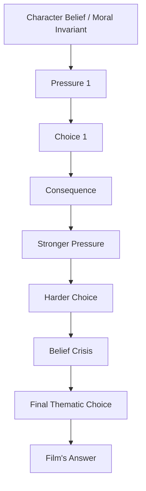
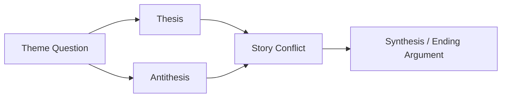
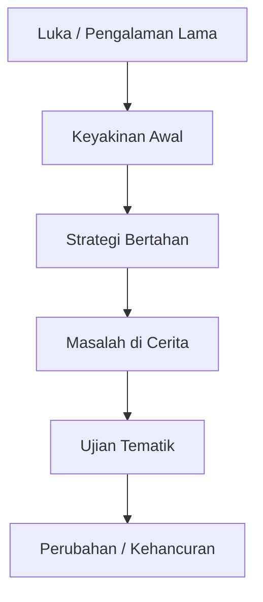
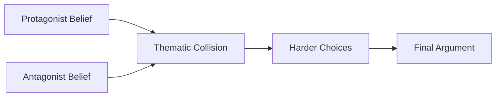
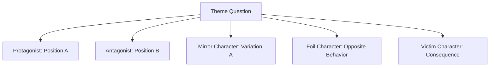
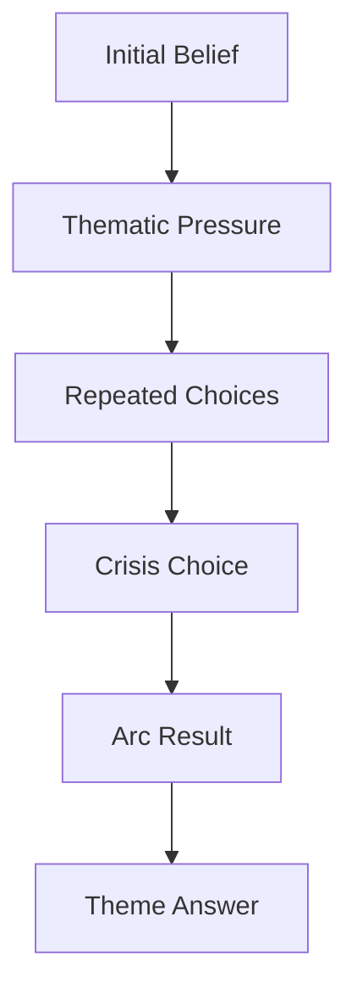
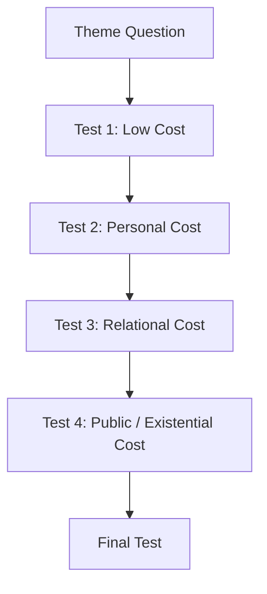
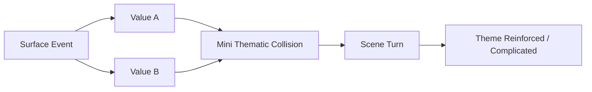
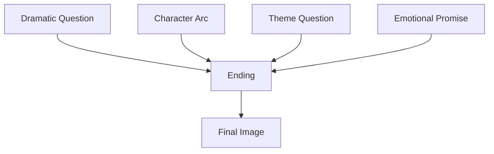
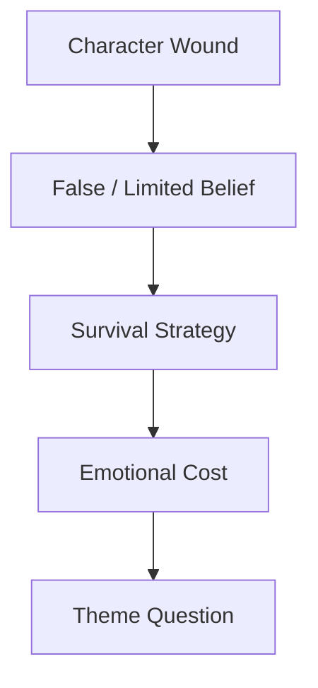

# learn-screenwriting-film-script-part-005.md

# Part 005 — Tema: Apa yang Sebenarnya Diperdebatkan Film Ini?  
## Mengubah Cerita dari “Rangkaian Kejadian” Menjadi Pertarungan Nilai

> Seri: **Learn Screenwriting for Film Project — The First 20 Hours Approach**  
> Framework utama: **Josh Kaufman — The First 20 Hours**  
> Target seri: mampu menulis naskah film yang cukup solid untuk project film, dengan pendekatan bertahap, terukur, dan production-aware.  
> Status: **Part 005 dari 030**  
> Bagian terakhir seri: **belum**

---

## Daftar Isi

1. Posisi Part 005 dalam roadmap 20 jam
2. Kenapa tema penting dalam naskah film
3. Salah kaprah umum tentang tema
4. Tema sebagai pertanyaan, bukan ceramah
5. Tema sebagai konflik nilai
6. Mental model untuk software engineer
7. Theme question, thesis, antithesis, dan synthesis
8. Hubungan tema dengan protagonist
9. Hubungan tema dengan antagonis
10. Hubungan tema dengan supporting character
11. Tema dan character arc
12. Tema dan plot: kejadian sebagai ujian nilai
13. Tema dan scene: setiap scene sebagai mini-debate
14. Tema dan ending: jawaban final film
15. Cara membuat tema tidak preachy
16. Cara menemukan tema dari premis
17. Cara menemukan tema dari karakter
18. Cara menemukan tema dari konflik
19. Cara menemukan tema dari ending
20. Theme design canvas
21. Contoh transformasi ide menjadi tema
22. Debugging tema yang lemah
23. Latihan 20 jam: theme sprint 60–90 menit
24. Checklist self-correction
25. Deliverable Part 005
26. Kesalahan umum pemula
27. Persiapan menuju Part 006

---

# 1. Posisi Part 005 dalam Roadmap 20 Jam

Sebelumnya:

- **Part 000** menetapkan kontrak belajar dan target 20 jam.
- **Part 001** menjelaskan screenplay sebagai blueprint audiovisual.
- **Part 002** memetakan framework Josh Kaufman ke screenwriting.
- **Part 003** mendefinisikan project film: format, durasi, genre, tone, audience, dan constraint produksi.
- **Part 004** membangun premis, logline, dan dramatic question.

Sekarang kita masuk ke pertanyaan yang lebih dalam:

```text
Film ini sebenarnya sedang memperdebatkan apa?
```

Part 004 menjawab:

```text
Siapa ingin apa, apa penghalangnya, dan apa risikonya?
```

Part 005 menjawab:

```text
Di balik konflik itu, nilai apa yang sedang diuji?
```

Contoh:

```text
Premis:
Seorang jaksa muda harus menuntut ayahnya sendiri dalam kasus korupsi besar.

Dramatic question:
Apakah ia akan memilih keadilan publik atau loyalitas keluarga?

Tema:
Apakah keadilan masih bernilai jika harus mengorbankan ikatan darah?
```

Tema bukan dekorasi. Tema adalah **lapisan makna** yang membuat cerita terasa lebih besar daripada kejadian-kejadiannya.

Kalau analoginya software:

- Premis = core use case.
- Plot = execution flow.
- Karakter = domain entity dengan state dan decision rule.
- Konflik = constraint dan competing process.
- Tema = business invariant / moral invariant yang diuji oleh seluruh sistem.

Tanpa tema, naskah sering menjadi:

```text
kejadian -> kejadian -> kejadian -> ending
```

Dengan tema, naskah menjadi:

```text
nilai diuji -> karakter memilih -> konsekuensi muncul -> nilai diuji lebih keras -> karakter berubah atau hancur
```

---

# 2. Kenapa Tema Penting dalam Naskah Film

Tema penting karena film bukan hanya “apa yang terjadi”. Film adalah “apa arti kejadian itu bagi manusia”.

Penonton bisa lupa detail plot, tetapi sering mengingat rasa dan pertanyaan moralnya.

Mereka mungkin lupa urutan adegan, tetapi ingat:

- rasa bersalah tokoh utama,
- pilihan yang tidak mungkin,
- harga dari ambisi,
- luka keluarga,
- ironi kekuasaan,
- kehancuran karena kebohongan,
- keberanian kecil di tengah sistem besar.

Tema memberi naskah **arah makna**.

Tanpa tema:

```text
Tokoh melakukan banyak hal, tetapi tidak jelas mengapa semua itu penting.
```

Dengan tema:

```text
Setiap kejadian menekan tokoh untuk menjawab pertanyaan nilai yang sama dengan cara yang semakin mahal.
```

Tema membantu penulis mengambil keputusan:

- scene mana yang perlu,
- dialog mana yang berlebihan,
- konflik mana yang relevan,
- ending mana yang tepat,
- karakter pendukung mana yang berguna,
- subplot mana yang memperkuat cerita,
- simbol visual mana yang bisa diulang,
- pilihan protagonist mana yang terasa bermakna.

Dalam project film, tema juga membantu komunikasi dengan tim.

Sutradara bisa bertanya:

```text
Secara visual, apa bahasa utama film ini?
```

Aktor bisa bertanya:

```text
Apa yang sebenarnya sedang dipertaruhkan karakter ini secara batin?
```

Produser bisa bertanya:

```text
Apa hook emosional film ini untuk audience?
```

Penulis bisa menjawab lebih baik jika temanya jelas.

---

# 3. Salah Kaprah Umum tentang Tema

Banyak penulis pemula menghindari tema karena mengira tema berarti ceramah moral.

Ini salah.

Tema yang baik bukan berarti film berkata:

```text
Jangan korupsi.
Keluarga itu penting.
Cinta mengalahkan segalanya.
Ambisi itu buruk.
Kejujuran adalah segalanya.
```

Kalimat seperti itu terlalu datar. Ia terdengar seperti poster motivasi, bukan drama.

Tema film yang lebih kuat biasanya berbentuk pertanyaan atau kontradiksi:

```text
Apakah kejujuran tetap benar jika menghancurkan orang yang tidak siap menerima kebenaran?

Apakah keluarga harus dilindungi ketika keluarga itu sendiri menjadi sumber kerusakan?

Apakah ambisi selalu buruk, atau hanya buruk ketika manusia mengorbankan jiwanya demi pengakuan?

Apakah cinta masih cinta jika seseorang harus menghapus dirinya sendiri agar hubungan tetap hidup?
```

Tema menjadi dramatik ketika tidak mudah dijawab.

Kalau jawabannya terlalu jelas, drama melemah.

Bandingkan:

```text
Tema lemah:
Korupsi itu buruk.
```

Semua orang sudah tahu. Tidak ada perdebatan dramatik.

Lebih kuat:

```text
Apakah seseorang berhak menghancurkan keluarganya sendiri demi membongkar kebenaran publik?
```

Di sini ada tension:

- keadilan publik,
- loyalitas keluarga,
- rasa malu,
- harga sosial,
- konsekuensi hukum,
- luka personal,
- pengkhianatan,
- kebenaran.

Tema kuat bukan slogan. Tema kuat adalah **dilema**.

---

# 4. Tema sebagai Pertanyaan, Bukan Ceramah

Untuk 20 jam pertama, bentuk paling aman untuk tema adalah **theme question**.

Bukan:

```text
Film ini bertema pengkhianatan.
```

Tapi:

```text
Apakah pengkhianatan selalu salah jika dilakukan untuk menyelamatkan orang yang lebih banyak?
```

Bukan:

```text
Film ini bertema keluarga.
```

Tapi:

```text
Apakah seseorang wajib tetap setia kepada keluarga yang terus melukainya?
```

Bukan:

```text
Film ini bertema ambisi.
```

Tapi:

```text
Berapa banyak bagian dari diri sendiri yang boleh dikorbankan demi menjadi seseorang?
```

Bentuk pertanyaan membuat tema hidup karena:

1. Ada ruang konflik.
2. Ada posisi yang bisa diperdebatkan.
3. Ada karakter yang bisa mewakili sisi berbeda.
4. Ada ending yang bisa menjadi jawaban.
5. Ada scene yang bisa menjadi ujian.

Formula awal:

```text
Apakah [nilai A] masih benar ketika [tekanan/kondisi ekstrem]?
```

Contoh:

```text
Apakah kejujuran masih benar ketika kebenaran menghancurkan keluarga?

Apakah cinta masih bernilai ketika menuntut seseorang mengorbankan harga dirinya?

Apakah keamanan masih layak dipertahankan ketika membuat manusia hidup tanpa kebebasan?

Apakah kesetiaan masih mulia ketika pemimpin yang diikuti sudah rusak?
```

Formula lain:

```text
Mana yang lebih manusiawi: [nilai A] atau [nilai B] ketika [situasi konflik]?
```

Contoh:

```text
Mana yang lebih manusiawi: memaafkan pelaku, atau menghukumnya agar korban lain tidak muncul?
```

Formula lain:

```text
Apa harga dari [nilai/keinginan] ketika [konsekuensi]?
```

Contoh:

```text
Apa harga dari ambisi ketika satu-satunya cara untuk menang adalah menjadi seperti orang yang dulu kita benci?
```

---

# 5. Tema sebagai Konflik Nilai

Tema menjadi kuat ketika berbentuk konflik antara dua nilai yang sama-sama punya alasan.

Bukan:

```text
baik vs jahat
```

Tetapi:

```text
keadilan vs belas kasih
kebebasan vs keamanan
cinta vs harga diri
loyalitas vs kebenaran
ambisi vs integritas
tradisi vs pembebasan
keluarga vs diri sendiri
keselamatan vs martabat
stabilitas vs perubahan
```

Konflik nilai membuat film terasa lebih dewasa karena penonton tidak hanya menunggu “siapa menang”, tetapi ikut bertanya:

```text
Kalau aku ada di posisi itu, apa yang akan kupilih?
```

Contoh konflik nilai:

| Nilai A | Nilai B | Pertanyaan Tematik |
|---|---|---|
| Keadilan | Loyalitas keluarga | Apakah benar menghukum keluarga sendiri demi hukum? |
| Cinta | Harga diri | Apakah cinta masih cinta jika membuat seseorang kehilangan dirinya? |
| Keamanan | Kebebasan | Apakah hidup aman tanpa kebebasan masih layak disebut hidup? |
| Ambisi | Integritas | Apakah sukses berarti sesuatu jika dicapai dengan mengkhianati diri sendiri? |
| Kebenaran | Kedamaian | Apakah semua kebenaran harus dibuka jika menghancurkan hidup banyak orang? |
| Belas kasih | Akuntabilitas | Apakah memaafkan pelaku berarti mengkhianati korban? |

Tema bukan “topik”. Tema adalah **nilai yang dipaksa bertarung**.

Topik:

```text
keluarga
```

Tema:

```text
Apakah keluarga tetap wajib dilindungi ketika ia menjadi sumber ketidakadilan?
```

Topik:

```text
balas dendam
```

Tema:

```text
Apakah balas dendam bisa menyembuhkan luka, atau hanya memindahkan luka ke orang lain?
```

Topik:

```text
kesuksesan
```

Tema:

```text
Apakah kesuksesan yang menuntut kita memalsukan diri sendiri masih pantas dikejar?
```

---

# 6. Mental Model untuk Software Engineer

Sebagai software engineer, Anda mungkin terbiasa berpikir:

```text
input valid -> proses benar -> output benar
```

Dalam cerita, model itu kurang cukup.

Cerita bukan hanya tentang output benar. Cerita tentang manusia yang sering:

- tahu keputusan yang benar tetapi tidak mampu melakukannya,
- mengejar hal yang salah karena luka lama,
- merasionalisasi tindakan buruk,
- berubah hanya setelah konsekuensi cukup menyakitkan,
- memilih sesuatu yang secara logika tidak efisien tetapi secara emosional masuk akal.

Untuk memahami tema, kita bisa memakai analogi **invariant yang diuji di bawah tekanan**.

Dalam software:

```text
Invariant: account balance cannot be negative.
```

Sistem diuji oleh:

- concurrent transaction,
- partial failure,
- race condition,
- invalid input,
- retry storm,
- network partition.

Dalam cerita:

```text
Invariant awal karakter: Aku harus selalu melindungi keluargaku.
```

Cerita mengujinya dengan:

- keluarga melakukan kesalahan besar,
- korban menuntut keadilan,
- publik membutuhkan kebenaran,
- karakter kehilangan reputasi,
- pilihan netral tidak tersedia.

Tema muncul ketika invariant karakter diuji sampai retak.

Diagram:



Cara berpikir ini berguna karena tema tidak diperlakukan sebagai hiasan.

Tema menjadi:

```text
nilai yang diuji oleh plot,
dijalankan lewat keputusan karakter,
dan dibuktikan lewat konsekuensi.
```

---

# 7. Theme Question, Thesis, Antithesis, dan Synthesis

Agar tema tidak abstrak, gunakan empat lapisan:

```text
Theme Question
Thesis
Antithesis
Synthesis / Final Answer
```

## 7.1 Theme Question

Pertanyaan utama yang diperdebatkan film.

Contoh:

```text
Apakah seseorang harus mengungkap kebenaran jika kebenaran itu menghancurkan keluarganya sendiri?
```

## 7.2 Thesis

Posisi awal yang diyakini protagonist, dunia, atau film pada awal cerita.

Contoh:

```text
Keluarga harus dilindungi apa pun yang terjadi.
```

## 7.3 Antithesis

Posisi lawan yang menantang thesis.

Contoh:

```text
Kebenaran publik lebih penting daripada perlindungan keluarga.
```

## 7.4 Synthesis / Final Answer

Jawaban akhir yang muncul setelah konflik diuji.

Contoh:

```text
Keluarga layak dicintai, tetapi cinta tidak boleh menjadi tempat persembunyian bagi ketidakadilan.
```

Synthesis tidak harus kompromi tengah. Ia bisa keras, tragis, ambigu, ironis, atau radikal.

Yang penting: ending terasa seperti jawaban terhadap pertanyaan yang sudah dibangun.

Diagram:



Contoh lain:

| Theme Question | Thesis | Antithesis | Final Answer |
|---|---|---|---|
| Apakah ambisi pantas dikejar jika menghancurkan diri? | Menjadi besar butuh pengorbanan apa pun. | Tidak ada sukses yang layak jika membuat jiwa kosong. | Ambisi tanpa batas bukan jalan menjadi besar, tetapi cara kehilangan diri. |
| Apakah memaafkan selalu baik? | Memaafkan adalah bukti kedewasaan. | Beberapa pelaku memakai maaf sebagai ruang untuk mengulang kekerasan. | Maaf tanpa batas dan tanpa akuntabilitas bukan kebaikan, melainkan penyangkalan. |
| Apakah keamanan lebih penting dari kebebasan? | Manusia butuh sistem kuat agar aman. | Sistem kuat bisa menjadi penjara jika tidak bisa dipertanyakan. | Keamanan yang menghapus pilihan manusia berubah menjadi kontrol. |

---

# 8. Hubungan Tema dengan Protagonist

Protagonist adalah tempat tema diuji paling keras.

Tema tidak cukup hanya dibicarakan. Ia harus menghancurkan, menggoda, memaksa, atau mengubah protagonist.

Pertanyaan penting:

```text
Apa keyakinan awal protagonist yang akan diuji oleh cerita?
```

Contoh:

```text
Protagonist belief:
Aku hanya bisa aman jika tidak mempercayai siapa pun.

Theme question:
Apakah melindungi diri dari luka juga berarti menutup diri dari cinta?
```

Atau:

```text
Protagonist belief:
Aku harus menang agar hidupku berarti.

Theme question:
Apakah nilai hidup manusia ditentukan oleh kemenangan?
```

Atau:

```text
Protagonist belief:
Kebenaran selalu harus dikatakan.

Theme question:
Apakah kebenaran tanpa belas kasih tetap sebuah kebaikan?
```

Protagonist yang kuat biasanya punya belief yang:

1. Bisa dimengerti.
2. Terbentuk oleh luka atau pengalaman.
3. Berguna di masa lalu.
4. Menjadi masalah di masa kini.
5. Harus berubah, dipertahankan, atau dibayar mahal di ending.

Ini penting.

Flaw karakter tidak harus “sifat buruk” yang random. Flaw sering adalah **strategi bertahan hidup yang dulu berguna tetapi sekarang merusak**.

Contoh:

| Luka Masa Lalu | Belief | Strategi Bertahan | Masalah Cerita |
|---|---|---|---|
| Pernah dikhianati | Jangan percaya siapa pun | Mengontrol semua hubungan | Tidak bisa bekerja sama saat krisis |
| Pernah miskin | Uang adalah satu-satunya keamanan | Mengejar status tanpa batas | Mengorbankan keluarga dan integritas |
| Pernah gagal melindungi orang | Aku harus menyelamatkan semua orang | Mengambil semua beban sendiri | Menjadi manipulatif dan hancur |
| Pernah dipermalukan | Jangan pernah terlihat lemah | Memakai topeng kuat | Tidak bisa meminta bantuan |

Tema muncul dari benturan:

```text
belief karakter vs realitas cerita
```

Diagram:



---

# 9. Hubungan Tema dengan Antagonis

Antagonis yang kuat bukan sekadar penghalang fisik. Antagonis sering membawa posisi tematik yang berlawanan.

Jika protagonist percaya:

```text
Manusia harus mempertahankan integritas meski kalah.
```

Antagonis bisa percaya:

```text
Integritas adalah kemewahan orang yang belum pernah benar-benar terancam.
```

Jika protagonist percaya:

```text
Keluarga harus dilindungi.
```

Antagonis bisa percaya:

```text
Keluarga sering dipakai sebagai alasan untuk menyembunyikan kerusakan.
```

Jika protagonist percaya:

```text
Kebenaran akan membebaskan.
```

Antagonis bisa percaya:

```text
Tidak semua orang mampu hidup setelah kebenaran dibuka.
```

Antagonis yang baik membuat penonton tidak bisa menjawab tema terlalu mudah.

Antagonis bertugas:

1. Menyerang belief protagonist.
2. Memaksa protagonist membuktikan nilainya.
3. Menawarkan solusi yang menggoda.
4. Membuat jalan buruk terlihat rasional.
5. Menjadi cermin gelap protagonist.

Antagonis lemah:

```text
Aku jahat karena aku jahat.
```

Antagonis kuat:

```text
Aku melakukan ini karena dunia hanya menghormati orang yang cukup kuat untuk mengambil apa yang ia butuhkan.
```

Atau:

```text
Aku berbohong karena kebenaran akan membakar semua orang, termasuk orang yang kau bilang ingin kau lindungi.
```

Diagram:



---

# 10. Hubungan Tema dengan Supporting Character

Supporting character bukan hanya “teman tokoh utama”. Mereka bisa menjadi variasi jawaban terhadap theme question.

Misalnya theme question:

```text
Apakah seseorang harus mengorbankan dirinya demi keluarga?
```

Supporting character bisa mewakili beberapa posisi:

| Karakter | Posisi Tematik |
|---|---|
| Protagonist | Aku harus berkorban agar keluarga tetap utuh. |
| Adik | Keluarga yang menuntut korban terus-menerus bukan keluarga sehat. |
| Ibu | Pengorbanan diam-diam adalah bentuk cinta tertinggi. |
| Kekasih | Cinta yang sehat tidak meminta seseorang menghilang. |
| Antagonis | Keluarga hanyalah struktur kontrol emosional. |

Dengan cara ini, film menjadi debat hidup.

Bukan karena karakter berdiri dan menyampaikan opini, tetapi karena mereka:

- memilih secara berbeda,
- menyakiti secara berbeda,
- mencintai secara berbeda,
- gagal secara berbeda,
- membayar harga yang berbeda.

Supporting character bisa berfungsi sebagai:

1. **Mirror** — menunjukkan versi lain dari protagonist.
2. **Foil** — kontras tajam terhadap protagonist.
3. **Temptation** — menawarkan jalan mudah.
4. **Warning** — menunjukkan masa depan buruk jika protagonist tidak berubah.
5. **Proof** — menunjukkan bahwa nilai tertentu bisa dijalankan.
6. **Victim** — menunjukkan dampak belief protagonist kepada orang lain.

Diagram:



Jika supporting character tidak punya relasi dengan tema, kemungkinan ia hanya memenuhi ruang.

Pertanyaan debugging:

```text
Apakah karakter ini memperjelas, menantang, memperburuk, atau membayar tema?
```

Jika jawabannya tidak, karakter itu perlu:

- digabung,
- dipotong,
- diberi fungsi tematik,
- atau dipindahkan ke background.

---

# 11. Tema dan Character Arc

Character arc adalah perubahan posisi karakter terhadap theme question.

Bukan sekadar:

```text
awal sedih -> akhir bahagia
```

Melainkan:

```text
awal percaya X -> diuji -> mempertanyakan X -> memilih Y / membayar X / gagal meninggalkan X
```

Ada beberapa tipe arc.

## 11.1 Positive Change Arc

Karakter memulai dengan belief yang salah atau terbatas, lalu berubah.

Contoh pola:

```text
Awal:
Aku harus mengontrol semua orang agar tidak terluka.

Akhir:
Aku tidak bisa mencintai tanpa memberi ruang bagi orang lain untuk memilih.
```

## 11.2 Negative Arc

Karakter gagal berubah, atau berubah ke arah lebih buruk.

Contoh:

```text
Awal:
Aku hanya ingin dihormati.

Akhir:
Aku lebih memilih ditakuti daripada dicintai.
```

## 11.3 Flat Arc

Karakter tidak banyak berubah, tetapi mengubah dunia di sekitarnya karena memegang nilai yang benar.

Contoh:

```text
Awal:
Aku percaya manusia tetap harus jujur di sistem busuk.

Akhir:
Ia tetap jujur, dan pilihan itu memaksa orang lain berubah.
```

Flat arc bukan berarti karakter datar. Ia tetap diuji keras. Bedanya, yang berubah terutama dunia/karakter sekitar, bukan keyakinan intinya.

## 11.4 Tragic Arc

Karakter memahami kebenaran terlalu lambat, atau memilih salah meski tahu konsekuensinya.

Contoh:

```text
Ia sadar bahwa ambisinya menghancurkan keluarganya, tetapi saat kesempatan terakhir datang, ia tetap memilih ambisi.
```

Character arc dan tema terhubung seperti ini:



Pertanyaan penting:

```text
Apa yang dipercaya karakter di awal yang tidak mungkin tetap sama setelah ending?
```

Jika jawabannya tidak ada, tema belum menempel pada karakter.

---

# 12. Tema dan Plot: Kejadian sebagai Ujian Nilai

Plot bukan daftar kejadian. Plot adalah rangkaian ujian.

Setiap kejadian besar sebaiknya menekan theme question dari sudut yang lebih sulit.

Misalnya theme question:

```text
Apakah kejujuran selalu membebaskan?
```

Plot bisa menguji dengan escalation:

| Tahap | Ujian Plot | Tekanan Tematik |
|---|---|---|
| Awal | Tokoh menyembunyikan kebohongan kecil | Bohong demi menjaga perasaan |
| Inciting Incident | Kebohongan kecil memicu masalah besar | Kebenaran mulai punya harga |
| Midpoint | Tokoh tahu kebenaran akan menyakiti orang tak bersalah | Apakah kebenaran tetap wajib? |
| Crisis | Tokoh bisa menyelamatkan diri dengan menutup kebenaran | Integritas vs survival |
| Climax | Tokoh harus membuka kebenaran di depan publik | Kebenaran sebagai pembebasan atau kehancuran |

Jika plot tidak menguji tema, plot terasa episodik.

Contoh plot episodik:

```text
Tokoh bertemu A, lalu terjadi B, lalu pergi ke C, lalu ada masalah D.
```

Contoh plot tematik:

```text
Setiap kejadian memaksa tokoh memilih antara kebenaran dan kedamaian palsu, dengan harga yang makin mahal.
```

Diagram:



Untuk 20 jam pertama, gunakan aturan sederhana:

```text
Setiap major beat harus membuat theme question lebih sulit dijawab.
```

---

# 13. Tema dan Scene: Setiap Scene sebagai Mini-Debate

Tidak semua scene harus menyebut tema secara eksplisit. Justru sebaiknya tidak.

Tetapi scene yang kuat sering mengandung versi kecil dari pertanyaan besar film.

Misalnya theme question film:

```text
Apakah melindungi seseorang berarti berhak mengontrol hidupnya?
```

Scene kecil:

```text
Seorang ayah diam-diam membatalkan audisi anaknya karena takut anaknya gagal.
```

Secara permukaan, scene tentang audisi.

Secara tematik, scene tentang:

```text
perlindungan vs kontrol
```

Scene design tematik bisa memakai format:

```text
Dalam scene ini, karakter A percaya [nilai A], karakter B percaya [nilai B], dan konflik memaksa salah satu pihak membayar harga.
```

Contoh:

```text
Dalam scene ini, ibu percaya bahwa diam adalah cara menjaga keluarga, sedangkan anak percaya bahwa diam adalah cara keluarga membusuk. Konflik memaksa anak memilih antara membuka luka lama atau tetap menjadi anak baik.
```

Mini-debate tidak selalu dialog. Bisa lewat aksi.

Contoh tanpa dialog:

```text
Seorang pria menutup pintu kamar ayahnya yang sakit agar tamu tidak melihat. Ia lalu merapikan jasnya dan tersenyum kepada wartawan di ruang tamu.
```

Tema yang tersirat:

```text
citra publik vs kebenaran rumah tangga
```

Scene tematik biasanya punya:

1. Dua nilai yang bertabrakan.
2. Pilihan konkret.
3. Konsekuensi terlihat.
4. Perubahan state.
5. Hubungan dengan pertanyaan besar film.

Diagram:



---

# 14. Tema dan Ending: Jawaban Final Film

Ending adalah tempat film memberi jawaban terhadap pertanyaan tematik.

Jawaban itu bisa:

- jelas,
- ambigu,
- tragis,
- ironis,
- pahit,
- optimistis,
- terbuka,
- paradoksal.

Tapi ending tidak boleh terasa tidak berhubungan dengan tema.

Theme question:

```text
Apakah seseorang bisa bebas tanpa memaafkan masa lalunya?
```

Ending yang menjawab:

```text
Tokoh tidak memaafkan pelaku, tetapi berhenti membiarkan pelaku menentukan hidupnya.
```

Theme question:

```text
Apakah kemenangan berarti sesuatu jika harus mengorbankan integritas?
```

Ending yang menjawab:

```text
Tokoh menang secara publik, tetapi sendirian di ruangan kosong, menyadari ia telah menjadi orang yang ia benci.
```

Theme question:

```text
Apakah kebenaran lebih penting dari kedamaian?
```

Ending yang menjawab:

```text
Kebenaran terbuka. Kedamaian palsu hancur. Tetapi untuk pertama kali, semua orang bisa mulai hidup tanpa kebohongan.
```

Ending bukan sekadar menyelesaikan plot.

Ending harus menyelesaikan:

1. Dramatic question.
2. Character arc.
3. Thematic question.
4. Emotional promise.

Diagram:



Salah satu alat yang sangat kuat adalah **final image**.

Opening image menunjukkan dunia/karakter sebelum transformasi.

Final image menunjukkan harga atau hasil transformasi.

Contoh:

```text
Opening image:
Tokoh duduk sendiri di meja makan keluarga, sibuk bekerja, tidak menatap siapa pun.

Final image:
Tokoh duduk sendiri di meja yang sama. Kali ini laptopnya tertutup. Ia menunggu, tetapi kursi lain sudah kosong selamanya.
```

Tema:

```text
Ambisi yang selalu ditunda pembayarannya akhirnya menagih manusia lewat kehilangan yang tidak bisa diperbaiki.
```

---

# 15. Cara Membuat Tema Tidak Preachy

Tema menjadi preachy ketika penulis memaksa penonton menerima pesan lewat dialog langsung, bukan lewat konflik dan konsekuensi.

Contoh preachy:

```text
Kamu tahu, keluarga adalah hal terpenting dalam hidup. Kalau kita mengejar uang terus, kita akan kehilangan kasih sayang yang sebenarnya.
```

Kalimat ini bisa benar, tetapi sebagai dialog sering terasa seperti ceramah.

Versi lebih dramatik:

```text
Ayah datang terlambat ke acara kelulusan anaknya. Ia membawa hadiah mahal. Anak itu tidak membukanya.

ANAK
Aku cuma butuh kamu duduk di kursi itu.
```

Di sini tema muncul lewat:

- keterlambatan,
- hadiah sebagai kompensasi palsu,
- kursi kosong,
- dialog pendek,
- rasa kehilangan.

Prinsip agar tema tidak preachy:

## 15.1 Jangan Biarkan Karakter Menjelaskan Tema Terlalu Rapi

Manusia jarang berbicara dalam bentuk esai moral.

Mereka:

- menyangkal,
- menyerang,
- menghindar,
- menyindir,
- bercanda,
- diam,
- mengganti topik,
- berkata setengah benar.

## 15.2 Beri Antithesis yang Kuat

Jika posisi lawan terlalu bodoh, tema terasa manipulatif.

Contoh buruk:

```text
Protagonist: Keadilan itu penting.
Antagonis: Aku suka kejahatan.
```

Contoh lebih kuat:

```text
Protagonist: Keadilan itu penting.
Antagonis: Keadilan siapa? Orang kaya punya pengacara, orang miskin punya penjara.
```

## 15.3 Tunjukkan Harga dari Nilai yang Dianggap Benar

Kalau kejujuran adalah nilai utama, tunjukkan juga sakitnya jujur.

Kalau memaafkan adalah nilai utama, tunjukkan juga risiko memaafkan terlalu cepat.

Kalau kebebasan adalah nilai utama, tunjukkan juga ketakutan dan chaos yang datang bersama kebebasan.

Nilai yang tidak punya harga terasa murah.

## 15.4 Biarkan Penonton Menyimpulkan

Film bekerja kuat ketika penonton merasa menemukan makna, bukan diberi instruksi.

Gunakan:

- aksi,
- pilihan,
- konsekuensi,
- visual motif,
- silence,
- contrast,
- irony.

## 15.5 Gunakan Subtext

Surface dialogue:

```text
Kamu pulang jam berapa?
```

Subtext:

```text
Aku tidak percaya kamu lagi.
```

Surface action:

```text
Ia menghapus nama seseorang dari daftar undangan.
```

Subtext:

```text
Ia memilih harga diri daripada rekonsiliasi.
```

---

# 16. Cara Menemukan Tema dari Premis

Jika Anda sudah punya premis dari Part 004, tema bisa ditemukan dengan bertanya:

```text
Di dalam premis ini, nilai apa yang bertabrakan?
```

Contoh 1:

```text
Premis:
Seorang dokter di daerah terpencil harus memilih antara menyelamatkan pejabat korup yang bisa membawa bantuan medis atau anak miskin yang datang lebih dulu.
```

Nilai yang bertabrakan:

- keadilan prosedural,
- dampak sosial,
- nyawa individu,
- utilitarian calculation,
- kemarahan moral.

Theme question:

```text
Apakah satu nyawa boleh diprioritaskan karena ia bisa menyelamatkan lebih banyak nyawa lain?
```

Contoh 2:

```text
Premis:
Seorang perempuan kembali ke kampung untuk menjual rumah ibunya, tetapi menemukan bahwa rumah itu menjadi tempat berlindung bagi anak-anak yang tidak punya tempat pulang.
```

Nilai yang bertabrakan:

- hak pribadi,
- warisan keluarga,
- tanggung jawab sosial,
- luka masa lalu,
- kebutuhan orang lain.

Theme question:

```text
Apakah sesuatu tetap milik kita sepenuhnya jika hidup orang lain sudah bergantung padanya?
```

Contoh 3:

```text
Premis:
Seorang pegawai kecil menemukan bukti skandal besar di kantornya, tetapi membongkarnya berarti menghancurkan kesempatan sekolah anaknya.
```

Nilai yang bertabrakan:

- integritas,
- survival keluarga,
- ketakutan ekonomi,
- tanggung jawab publik.

Theme question:

```text
Apakah integritas masih wajib ketika harga yang dibayar ditanggung oleh keluarga yang tidak bersalah?
```

Template:

```text
Premis saya:
[isi premis]

Nilai A:
[isi nilai]

Nilai B:
[isi nilai]

Tekanan ekstrem:
[isi tekanan]

Theme question:
Apakah [nilai A] masih benar ketika [tekanan ekstrem / nilai B]?
```

---

# 17. Cara Menemukan Tema dari Karakter

Kadang Anda belum tahu tema, tetapi sudah tahu karakter.

Mulai dari belief karakter.

Pertanyaan:

```text
Apa kebohongan yang dipercaya karakter agar ia bisa bertahan hidup?
```

Bukan kebohongan faktual, tetapi kebohongan emosional.

Contoh:

```text
Aku tidak boleh membutuhkan siapa pun.
```

Theme question:

```text
Apakah menjadi kuat berarti tidak membutuhkan orang lain?
```

Contoh:

```text
Kalau aku sukses, semua luka masa lalu akan terbayar.
```

Theme question:

```text
Apakah kesuksesan bisa menyembuhkan rasa tidak berharga?
```

Contoh:

```text
Aku harus menjaga semua orang tetap bahagia agar tidak ditinggalkan.
```

Theme question:

```text
Apakah cinta yang dibeli dengan menghapus diri sendiri masih cinta?
```

Gunakan tabel ini:

| Elemen Karakter | Pertanyaan | Contoh |
|---|---|---|
| Wound | Luka lama apa yang membentuknya? | Ditinggalkan ayah |
| Belief | Apa kesimpulan salah yang ia tarik? | Orang yang kucintai akan pergi |
| Strategy | Bagaimana ia melindungi diri? | Menjadi terlalu patuh dan menyenangkan semua orang |
| Cost | Apa harga strategi itu? | Kehilangan identitas |
| Theme Question | Nilai apa yang diuji? | Apakah dicintai berarti harus selalu menyenangkan orang lain? |

Diagram:



---

# 18. Cara Menemukan Tema dari Konflik

Jika Anda punya konflik kuat, tema bisa ditemukan dengan bertanya:

```text
Konflik ini sebenarnya mengadu cara hidup apa melawan cara hidup apa?
```

Contoh konflik:

```text
Anak ingin menjual tanah warisan. Ayah ingin mempertahankannya.
```

Di permukaan:

```text
jual tanah vs pertahankan tanah
```

Secara tematik:

```text
masa depan vs akar keluarga
pragmatisme vs identitas
mobilitas sosial vs kesetiaan pada asal
```

Theme question:

```text
Apakah meninggalkan asal-usul adalah pengkhianatan, atau syarat untuk bertahan hidup?
```

Contoh konflik:

```text
Seorang polisi harus menangkap teman masa kecilnya.
```

Di permukaan:

```text
polisi vs kriminal
```

Secara tematik:

```text
hukum vs loyalitas
masa lalu vs tanggung jawab sekarang
identitas pribadi vs peran sosial
```

Theme question:

```text
Apakah kita masih berutang kesetiaan kepada masa lalu ketika masa lalu itu merusak masa kini?
```

Gunakan conflict-to-theme map:

| Konflik Permukaan | Nilai Tersembunyi A | Nilai Tersembunyi B | Theme Question |
|---|---|---|---|
| Anak menjual rumah, ibu menolak | kemandirian | memori keluarga | Apakah bertumbuh berarti harus meninggalkan rumah? |
| Wartawan membuka aib korban | kebenaran publik | martabat pribadi | Apakah publik berhak atas semua kebenaran? |
| Kakak melindungi adik pelaku kejahatan | keluarga | akuntabilitas | Apakah cinta keluarga boleh melampaui keadilan? |
| Guru memalsukan nilai murid miskin | belas kasih | integritas sistem | Apakah aturan adil jika menghukum orang yang sudah tertinggal? |

---

# 19. Cara Menemukan Tema dari Ending

Kadang ending muncul lebih dulu.

Anda membayangkan final image:

```text
Seorang anak berdiri sendirian di rumah yang akhirnya ia berhasil pertahankan, tetapi semua orang yang ia cintai sudah pergi.
```

Dari ending itu, tanyakan:

```text
Apa yang dibayar karakter?
Apa yang ia dapat?
Apa yang hilang?
Nilai apa yang terbukti?
Nilai apa yang runtuh?
```

Kemungkinan tema:

```text
Memenangkan warisan fisik tidak berarti mempertahankan keluarga.
```

Theme question:

```text
Apakah menjaga rumah berarti apa-apa jika kita kehilangan orang-orang yang membuatnya menjadi rumah?
```

Contoh lain:

```text
Ending:
Tokoh akhirnya tampil di panggung besar, tetapi ketika tepuk tangan datang, ia mencari satu wajah di kursi penonton yang sudah kosong.
```

Tema:

```text
Ambisi yang tidak tahu kapan berhenti akan mengubah kemenangan menjadi ruang kosong.
```

Theme question:

```text
Apa arti diakui semua orang jika orang yang paling ingin kita bahagiakan sudah tidak ada?
```

Ending sering mengungkap tema sebenarnya, bahkan ketika penulis belum sadar.

Jika ending yang Anda bayangkan terasa kuat, jangan abaikan. Gunakan sebagai kompas.

---

# 20. Theme Design Canvas

Gunakan canvas berikut untuk Part 005.

```text
PROJECT TITLE:

PREMISE:

DRAMATIC QUESTION:

TOPIC:

THEME QUESTION:

VALUE A:

VALUE B:

PROTAGONIST INITIAL BELIEF:

WHY PROTAGONIST BELIEVES THIS:

ANTAGONIST / OPPOSING FORCE BELIEF:

SUPPORTING CHARACTER VARIATIONS:
1.
2.
3.

WHAT DOES THE STORY TEST FIRST?

WHAT DOES THE STORY TEST HARDER?

WHAT IS THE CRISIS TEST?

WHAT FINAL CHOICE ANSWERS THE THEME?

ENDING ARGUMENT:

OPENING IMAGE:

FINAL IMAGE:

WHAT WOULD MAKE THIS THEME PREACHY?

HOW WILL THE FILM SHOW THE THEME VISUALLY?
```

Versi ringkas:

```text
Film ini mempertanyakan apakah [nilai A] masih benar ketika [nilai B / tekanan ekstrem].
Tokoh utama awalnya percaya [belief awal].
Lawan/oposisi percaya [belief lawan].
Cerita menguji pertanyaan ini melalui [konflik utama].
Ending menjawab bahwa [jawaban final].
```

Contoh:

```text
Film ini mempertanyakan apakah loyalitas keluarga masih benar ketika keluarga menjadi sumber ketidakadilan.
Tokoh utama awalnya percaya keluarga harus dilindungi apa pun yang terjadi.
Oposisi percaya kebenaran publik lebih penting daripada ikatan darah.
Cerita menguji pertanyaan ini melalui kasus hukum yang menyeret ayah tokoh utama.
Ending menjawab bahwa cinta kepada keluarga tidak boleh menjadi tempat persembunyian bagi kerusakan.
```

---

# 21. Contoh Transformasi Ide Menjadi Tema

## 21.1 Ide Mentah

```text
Seorang pria pulang kampung setelah ibunya meninggal.
```

Ini masih situasi, belum tema.

## 21.2 Tambahkan Konflik

```text
Seorang pria pulang kampung setelah ibunya meninggal dan menemukan bahwa rumah warisan harus dijual untuk membayar utang keluarga, sementara adiknya ingin mempertahankan rumah itu sebagai satu-satunya sisa memori ibu mereka.
```

Sekarang ada konflik.

## 21.3 Temukan Nilai Bertabrakan

```text
Nilai A: survival ekonomi
Nilai B: memori keluarga
Nilai C: rasa bersalah anak yang pergi
Nilai D: hak untuk memulai hidup baru
```

## 21.4 Theme Question

```text
Apakah menjaga peninggalan orang yang kita cintai berarti mempertahankan bendanya, atau menghadapi luka yang kita hindari selama mereka hidup?
```

## 21.5 Protagonist Belief

```text
Aku sudah membayar kewajibanku dengan mengirim uang; aku tidak perlu kembali secara emosional.
```

## 21.6 Antithesis

```text
Uang tidak pernah menggantikan kehadiran.
```

## 21.7 Ending Argument

```text
Rumah bisa dijual, tetapi pelarian emosional harus berhenti. Yang harus dipertahankan bukan bangunannya, melainkan keberanian untuk mengakui cinta dan rasa bersalah.
```

## 21.8 Visual Motif

```text
Kunci rumah.
Meja makan kosong.
Foto keluarga yang tidak pernah lengkap.
Suara pompa air lama.
```

## 21.9 Scene Tematik

```text
Kakak menghitung harga rumah dengan kalkulator.
Adik membersihkan noda di meja tempat ibu biasa makan.
Keduanya tidak saling menatap.
```

Surface conflict:

```text
jual rumah atau tidak
```

Hidden theme:

```text
apakah rumah adalah aset, beban, atau bentuk terakhir dari cinta yang belum selesai?
```

---

# 22. Debugging Tema yang Lemah

Tema bisa error seperti sistem.

Gunakan debugging berikut.

## 22.1 Tema Terlalu Umum

Gejala:

```text
Film ini tentang cinta.
Film ini tentang keluarga.
Film ini tentang perjuangan.
```

Masalah:

```text
Topiknya ada, tetapi konflik nilainya belum ada.
```

Perbaikan:

```text
Cinta macam apa?
Keluarga dalam kondisi apa?
Perjuangan melawan siapa dan dengan harga apa?
```

Contoh:

```text
Lemah:
Film ini tentang keluarga.

Lebih kuat:
Apakah seseorang tetap wajib setia kepada keluarga yang terus memanfaatkannya?
```

## 22.2 Tema Terlalu Menggurui

Gejala:

```text
Film ini ingin mengajarkan bahwa kita harus selalu jujur.
```

Masalah:

```text
Jawaban sudah diputuskan terlalu awal, tidak ada perdebatan.
```

Perbaikan:

```text
Uji nilai itu dalam kondisi ekstrem.
```

Contoh:

```text
Apakah seseorang harus tetap jujur jika kebenaran itu membuat orang tak bersalah menderita?
```

## 22.3 Tema Tidak Terhubung ke Plot

Gejala:

```text
Penulis berkata film bertema pengampunan, tetapi plotnya hanya tentang kabur dari pembunuh.
```

Masalah:

```text
Tema tidak diuji oleh kejadian.
```

Perbaikan:

```text
Buat setiap major beat memaksa karakter memilih antara dendam dan pengampunan.
```

## 22.4 Tema Tidak Terhubung ke Karakter

Gejala:

```text
Tema ada di sinopsis, tetapi protagonist tidak punya belief yang diuji.
```

Perbaikan:

```text
Tentukan belief awal protagonist yang salah/terbatas/mahal.
```

## 22.5 Antagonis Tidak Punya Posisi Tematik

Gejala:

```text
Antagonis hanya menghalangi secara fisik.
```

Perbaikan:

```text
Beri antagonis worldview yang menantang protagonist.
```

## 22.6 Ending Tidak Menjawab Theme Question

Gejala:

```text
Cerita berakhir karena masalah plot selesai, tetapi pertanyaan batin tidak selesai.
```

Perbaikan:

```text
Pastikan final choice protagonist adalah jawaban terhadap theme question.
```

---

# 23. Latihan 20 Jam: Theme Sprint 60–90 Menit

Part 005 idealnya dilatih selama 60–90 menit.

Tujuan latihan:

```text
Menghasilkan theme question yang cukup kuat untuk menjadi kompas draft.
```

## 23.1 Persiapan 5 Menit

Buka dokumen Part 003 dan Part 004.

Ambil:

- project format,
- genre,
- tone,
- audience,
- production constraint,
- premis,
- logline,
- dramatic question.

## 23.2 Generate Topik 10 Menit

Tulis 10 topik yang mungkin ada di cerita Anda.

Contoh:

```text
keluarga
ambisi
pengkhianatan
keadilan
utang
rasa bersalah
kesepian
warisan
kebenaran
pengampunan
```

Jangan berhenti di topik. Ini hanya bahan mentah.

## 23.3 Temukan Konflik Nilai 15 Menit

Untuk setiap topik, cari pasangan nilai.

Contoh:

```text
keluarga -> loyalitas vs kebebasan diri
keadilan -> hukum vs belas kasih
ambisi -> sukses vs integritas
kebenaran -> keterbukaan vs perlindungan
warisan -> memori vs survival ekonomi
```

Pilih 3 konflik nilai paling kuat.

## 23.4 Buat 10 Theme Question 20 Menit

Gunakan formula:

```text
Apakah [nilai A] masih benar ketika [nilai B / tekanan ekstrem]?
```

Atau:

```text
Apa harga dari [nilai] ketika [konsekuensi]?
```

Contoh:

```text
Apakah keluarga masih harus dilindungi ketika keluarga menjadi alasan orang lain terluka?

Apakah kebenaran masih membebaskan jika menghancurkan orang yang tidak siap menerimanya?

Apakah ambisi bisa menyembuhkan rasa tidak berharga, atau hanya memperdalamnya?
```

## 23.5 Pilih 1 Theme Question 10 Menit

Gunakan scoring:

| Kriteria | Skor 1–5 | Catatan |
|---|---:|---|
| Relevan dengan premis |  |  |
| Menekan protagonist |  |  |
| Bisa diuji dalam scene |  |  |
| Punya dua sisi yang kuat |  |  |
| Tidak terlalu preachy |  |  |
| Cocok dengan genre/tone |  |  |
| Bisa dijawab oleh ending |  |  |

Pilih skor tertinggi.

## 23.6 Isi Theme Design Canvas 20 Menit

Isi minimal:

```text
Theme question:
Value A:
Value B:
Protagonist initial belief:
Antagonist/opposition belief:
First test:
Harder test:
Crisis test:
Ending argument:
Opening image:
Final image:
```

## 23.7 Self-Correction 10 Menit

Tanyakan:

```text
Apakah theme question ini bisa diperdebatkan?
Apakah protagonist punya belief yang diuji?
Apakah antagonis punya posisi masuk akal?
Apakah ending bisa menjawabnya?
Apakah tema ini bisa muncul lewat aksi, bukan ceramah?
```

---

# 24. Checklist Self-Correction

Gunakan checklist ini sebelum lanjut ke Part 006.

## 24.1 Theme Question Checklist

Theme question Anda kuat jika:

- berbentuk pertanyaan, bukan slogan,
- mengandung konflik nilai,
- tidak punya jawaban terlalu mudah,
- relevan dengan premis,
- bisa diuji oleh plot,
- bisa diwujudkan dalam scene,
- menekan protagonist secara personal,
- bisa dijawab oleh ending.

## 24.2 Character Connection Checklist

Tema sudah menempel ke karakter jika:

- protagonist punya belief awal,
- belief itu masuk akal karena pengalaman/luka,
- belief itu membantu dia bertahan di masa lalu,
- belief itu menjadi masalah di cerita sekarang,
- plot memaksa belief itu diuji,
- final choice menunjukkan perubahan atau kegagalan berubah.

## 24.3 Antagonist Connection Checklist

Tema sudah menempel ke oposisi jika:

- antagonis/oposisi punya worldview,
- worldview itu tidak bodoh,
- worldview itu menantang protagonist,
- antagonis bisa membuat penonton sedikit ragu,
- konflik bukan hanya fisik tetapi juga nilai.

## 24.4 Scene Potential Checklist

Tema bisa difilmkan jika:

- bisa muncul lewat keputusan,
- bisa muncul lewat gesture,
- bisa muncul lewat objek,
- bisa muncul lewat silence,
- bisa muncul lewat konflik relasi,
- tidak perlu dijelaskan panjang lewat dialog.

## 24.5 Ending Checklist

Ending tematik kuat jika:

- final choice protagonist menjawab theme question,
- ada harga yang dibayar,
- ada perubahan state,
- opening image dan final image bisa kontras,
- penonton bisa merasakan makna tanpa perlu karakter menjelaskan semuanya.

---

# 25. Deliverable Part 005

Setelah menyelesaikan Part 005, Anda harus punya dokumen berikut:

```text
01-theme-design.md
```

Isi minimal:

```text
# Theme Design

## Premise

## Dramatic Question

## Topic Candidates

## Value Conflict Candidates

## Selected Theme Question

## Thesis

## Antithesis

## Protagonist Initial Belief

## Why Protagonist Believes This

## Antagonist / Opposing Force Belief

## Supporting Character Variations

## Thematic Tests

### First Test

### Harder Test

### Crisis Test

## Ending Argument

## Opening Image

## Final Image

## How to Avoid Preachiness

## Visual / Behavioral Expression of Theme
```

Contoh isi ringkas:

```text
# Theme Design

## Premise
Seorang jaksa muda harus menuntut ayahnya sendiri dalam kasus korupsi besar.

## Dramatic Question
Apakah ia akan memilih keadilan publik atau loyalitas keluarga?

## Selected Theme Question
Apakah cinta kepada keluarga masih benar ketika keluarga menjadi tempat persembunyian bagi ketidakadilan?

## Thesis
Keluarga harus dilindungi apa pun yang terjadi.

## Antithesis
Kebenaran publik lebih penting daripada ikatan darah.

## Protagonist Initial Belief
Anak yang baik tidak mempermalukan keluarganya.

## Why Protagonist Believes This
Ia tumbuh dalam keluarga yang menganggap reputasi sebagai bentuk keselamatan.

## Antagonist / Opposing Force Belief
Sistem hanya berubah jika seseorang berani mengorbankan kenyamanan pribadinya.

## Ending Argument
Cinta kepada keluarga tidak boleh menjadi alasan untuk melindungi kerusakan yang menyakiti orang lain.

## Opening Image
Tokoh merapikan foto keluarga di meja kerjanya sebelum sidang.

## Final Image
Foto keluarga itu tetap ada, tetapi bingkainya retak. Ia tidak membuangnya; ia membiarkannya terlihat.
```

---

# 26. Kesalahan Umum Pemula

## 26.1 Menganggap Tema Harus Besar dan Berat

Tema tidak harus tentang perang, negara, kematian, atau krisis besar.

Tema bisa sangat kecil:

```text
Apakah meminta maaf berarti cukup jika kita tidak berubah?
```

Atau:

```text
Apakah seseorang benar-benar pulang jika ia masih menghindari percakapan yang sama?
```

Yang penting bukan skala topik, tetapi kedalaman konflik nilai.

## 26.2 Menyamakan Tema dengan Genre

Salah:

```text
Tema film ini horror.
```

Horror adalah genre.

Tema dalam horror bisa:

```text
Apakah trauma yang disangkal akan kembali sebagai sesuatu yang lebih mengerikan?
```

Atau:

```text
Apakah keluarga yang tampak harmonis sebenarnya bisa menjadi rumah paling berbahaya?
```

## 26.3 Menyamakan Tema dengan Mood

Salah:

```text
Tema film ini kesepian dan gelap.
```

Itu tone/mood.

Tema bisa:

```text
Apakah seseorang bisa diselamatkan dari kesepian jika ia sendiri menolak terlihat oleh orang lain?
```

## 26.4 Menentukan Tema Terlalu Cepat dan Tidak Mengujinya

Tema awal boleh berubah.

Kadang saat menulis, Anda sadar cerita sebenarnya bukan tentang “ambisi”, tetapi tentang “rasa tidak layak”.

Itu normal.

Tema bukan borgol. Tema adalah kompas.

Jika kompas menunjukkan arah yang salah setelah medan terlihat lebih jelas, kalibrasi ulang.

## 26.5 Membuat Semua Karakter Mengatakan Hal yang Sama

Jika semua karakter setuju dengan tema, tidak ada drama.

Beri karakter posisi berbeda.

```text
Protagonist: Aku harus menjaga keluarga.
Antagonis: Keluarga adalah alasan orang lemah menyembunyikan dosa.
Supporting A: Keluarga bisa salah, tetapi tetap satu-satunya tempat pulang.
Supporting B: Tidak semua rumah pantas disebut rumah.
```

## 26.6 Menulis Dialog Tematik Terlalu Langsung

Hindari dialog seperti:

```text
Kamu harus belajar bahwa kejujuran adalah hal paling penting dalam hidup.
```

Lebih baik:

```text
Ia menaruh amplop bukti di meja.

AYAH
Kalau kau buka itu, ibumu tidak akan keluar rumah lagi.

Anak itu menatap amplop. Tangannya tidak bergerak.
```

Tema muncul dari pilihan, bukan pidato.

## 26.7 Ending Tidak Membayar Tema

Jika film sepanjang cerita memperdebatkan “kebebasan vs keamanan”, ending tidak boleh hanya menyelesaikan “penjahat tertangkap” tanpa menunjukkan apa arti kebebasan atau keamanan bagi protagonist.

Ending harus menjawab lapisan makna, bukan hanya plot mechanics.

---

# 27. Persiapan Menuju Part 006

Part 006 akan membahas:

```text
Karakter sebagai State Machine: Desire, Need, Flaw, Wound, Mask
```

Sebelum lanjut, pastikan Anda sudah punya:

1. Premis dari Part 004.
2. Logline dari Part 004.
3. Dramatic question dari Part 004.
4. Theme question dari Part 005.
5. Value conflict utama.
6. Protagonist initial belief.
7. Antagonist/opposition belief.
8. Ending argument sementara.

Kenapa ini penting?

Karakter yang baik tidak dibuat dari biodata acak.

Bukan:

```text
Nama: Raka
Umur: 32
Pekerjaan: pengacara
Hobi: kopi
Makanan favorit: nasi goreng
```

Itu bisa berguna nanti, tetapi bukan inti dramatik.

Karakter film perlu dibangun dari:

```text
apa yang dia inginkan,
apa yang dia butuhkan,
apa yang dia takutkan,
apa luka lamanya,
apa kebohongan yang ia percaya,
apa topeng sosialnya,
dan pilihan apa yang akan membuktikan siapa dirinya.
```

Part 006 akan mengubah tema menjadi mesin karakter.

---

# Ringkasan Part 005

Tema adalah pertanyaan nilai yang diperdebatkan oleh film.

Tema bukan topik.

```text
Topik: keluarga
Tema: Apakah seseorang tetap wajib setia kepada keluarga yang terus melukainya?
```

Tema bukan slogan.

```text
Slogan: Kejujuran itu penting.
Tema: Apakah kejujuran tetap benar ketika kebenaran menghancurkan orang yang tidak siap menerimanya?
```

Tema bukan ceramah.

Tema harus muncul lewat:

- pilihan karakter,
- konflik,
- konsekuensi,
- scene,
- visual,
- silence,
- ending.

Untuk 20 jam pertama, gunakan bentuk:

```text
Apakah [nilai A] masih benar ketika [nilai B / tekanan ekstrem]?
```

Bangun empat lapisan:

```text
Theme Question -> Thesis -> Antithesis -> Final Answer
```

Hubungkan tema ke:

1. Protagonist belief.
2. Antagonist belief.
3. Supporting character variation.
4. Plot escalation.
5. Scene design.
6. Ending.

Tema yang kuat membuat cerita terasa bukan hanya berjalan, tetapi berarti.

---

# Status Akhir Part 005

- Bagian ini selesai.
- Seri belum selesai.
- Bagian berikutnya: **Part 006 — Karakter sebagai State Machine: Desire, Need, Flaw, Wound, Mask**
