# learn-screenwriting-film-script-part-006.md

# Part 006 — Karakter sebagai State Machine: Desire, Need, Flaw, Wound, Mask

> Seri: **Learn Screenwriting for Film Project — The First 20 Hours Approach**  
> Fokus: **membangun karakter film yang dapat bergerak, memilih, gagal, berubah, dan menghasilkan konflik**  
> Kerangka utama: **The First 20 Hours — Josh Kaufman**  
> Status seri: **belum selesai**  
> Part sebelumnya: `learn-screenwriting-film-script-part-005.md` — Tema  
> Part berikutnya: `learn-screenwriting-film-script-part-007.md` — Antagonis, Oposisi, dan Sistem Tekanan

---

## 0. Tujuan Bagian Ini

Bagian ini membahas karakter bukan sebagai daftar biodata, tetapi sebagai **sistem keputusan**.

Dalam banyak naskah pemula, karakter sering dibuat dengan cara seperti ini:

```text
Nama: Raka
Umur: 32
Pekerjaan: fotografer
Sifat: pendiam, keras kepala, trauma masa lalu
Hobi: memotret jalanan
Masalah: tidak bisa move on dari mantan
```

Informasi seperti itu tidak salah, tetapi belum cukup untuk menulis film. Film tidak menampilkan file biodata. Film menampilkan orang yang:

1. menginginkan sesuatu,
2. terhalang sesuatu,
3. mengambil keputusan,
4. membayar konsekuensi,
5. mengulang pola salah,
6. ditekan sampai pola itu pecah,
7. lalu berubah atau gagal berubah.

Karakter film yang kuat bukan karakter yang punya banyak detail, tetapi karakter yang punya **mekanisme dramatik**.

Dalam bahasa software engineer:

```text
Karakter bukan object statis.
Karakter adalah stateful decision system.
```

Karakter punya state awal, event pemicu, transition rule, constraint, hidden dependency, failure mode, dan kemungkinan state akhir.

Tujuan bagian ini adalah membuat Anda mampu:

1. membedakan karakter sebagai biodata vs karakter sebagai sistem dramatik,
2. memahami komponen inti karakter: want, need, flaw, wound, mask, fear, belief, value,
3. memodelkan character arc sebagai state transition,
4. membuat karakter yang aktif, bukan hanya terdampak plot,
5. mendesain flaw yang menghasilkan konflik berulang,
6. membuat wound yang relevan tanpa menjadi eksposisi murahan,
7. membuat mask yang terlihat secara visual,
8. menulis keputusan karakter yang terasa manusiawi tetapi tetap dramatik,
9. membuat template karakter yang langsung bisa dipakai untuk project film,
10. melakukan self-correction terhadap karakter yang lemah.

---

## 1. Hubungan dengan Framework Josh Kaufman

Dalam pendekatan **The First 20 Hours**, skill besar harus dipecah menjadi sub-skill kecil yang bisa dilatih dan dikoreksi. Untuk screenwriting, “membuat karakter bagus” terlalu abstrak. Maka kita pecah menjadi sub-skill yang lebih operasional.

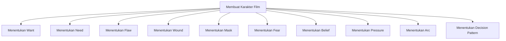

Dalam 20 jam pertama, Anda tidak perlu menjadi psikolog karakter yang sempurna. Targetnya lebih sederhana:

> Anda harus mampu membuat satu karakter utama yang punya keinginan eksternal jelas, kebutuhan internal jelas, kelemahan yang terlihat, luka yang relevan, topeng sosial yang bisa difilmkan, dan pola keputusan yang berubah sepanjang cerita.

Ini cukup untuk mulai menulis naskah yang hidup.

---

## 2. Core Premise: Karakter Terungkap lewat Pilihan di Bawah Tekanan

Prinsip dasar:

> Karakter bukan apa yang ia katakan tentang dirinya. Karakter adalah apa yang ia pilih ketika ada tekanan, biaya, dan risiko.

Kalau seseorang berkata:

```text
“Aku orang yang jujur.”
```

Itu belum membuktikan karakter.

Karakter baru terbaca ketika ia berada dalam situasi seperti ini:

```text
Ia menemukan bukti yang bisa menyelamatkan dirinya, tetapi bukti itu akan menghancurkan orang yang ia cintai.
```

Di sana, pilihan menjadi informasi.

Dalam film, karakter idealnya tidak dijelaskan sebagai atribut, tetapi diuji melalui situasi.

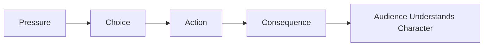

Contoh:

| Klaim Karakter | Tes Dramatik | Informasi yang Terungkap |
|---|---|---|
| Dia setia | Ia harus memilih antara karier dan pasangan | Prioritas nilai |
| Dia pemberani | Ia bisa kabur, tetapi anak kecil tertinggal | Level keberanian |
| Dia dingin | Ia melihat seseorang terluka dan tetap diam | Mekanisme pertahanan |
| Dia religius | Ia harus memilih antara belas kasih dan aturan | Konflik nilai |
| Dia ambisius | Ia bisa menang dengan cara curang | Batas moral |

Karakter yang kuat memiliki **decision signature**: pola khas dalam mengambil keputusan.

---

## 3. Karakter sebagai State Machine

Dalam software, state machine membantu kita memahami perilaku sistem berdasarkan state dan event.

Dalam storytelling, character arc juga bisa dimodelkan seperti state machine:

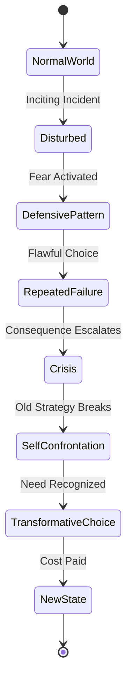

State awal karakter bukan hanya “dia sedang hidup seperti biasa”. State awal adalah **mode operasi lama**.

Misalnya:

```text
State awal:
Raka menghindari konflik dengan menyenangkan semua orang.

Event:
Ia harus memilih antara menutupi kesalahan atasannya atau menyelamatkan temannya.

Default transition:
Ia berusaha membuat semua pihak senang.

Failure:
Keputusannya justru membuat temannya dikorbankan.

Crisis:
Ia sadar bahwa netralitasnya adalah bentuk kepengecutan.

New transition:
Ia memilih berkata benar walau kehilangan posisi.

State akhir:
Ia tidak lagi hidup untuk diterima semua orang.
```

Perhatikan: arc bukan sekadar “Raka berubah menjadi lebih baik”. Arc harus terlihat sebagai perubahan **rule pengambilan keputusan**.

---

## 4. Data Model Karakter

Sebelum masuk detail, kita buat model dasar.

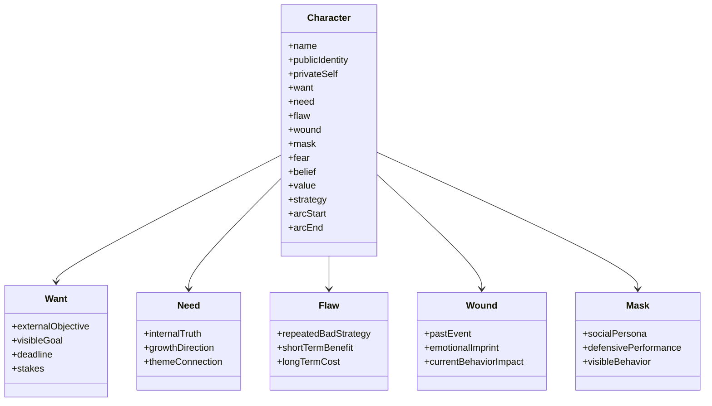

Model ini bukan untuk membuat karakter menjadi kaku. Justru sebaliknya: model ini membantu Anda menulis karakter yang **konsisten tetapi tidak datar**.

---

## 5. Komponen Inti Karakter

### 5.1 Want — Apa yang Karakter Kejar secara Eksternal

**Want** adalah tujuan yang bisa dilihat dari luar.

Contoh want:

- memenangkan kompetisi,
- menyelamatkan anak,
- mendapatkan pekerjaan,
- membuktikan ayahnya salah,
- kabur dari kota,
- mengembalikan uang yang hilang,
- membongkar korupsi,
- menikahi seseorang,
- menyelesaikan film,
- mencapai bandara sebelum pesawat berangkat.

Want harus cukup konkret supaya plot bisa bergerak.

Want yang lemah:

```text
Dia ingin bahagia.
```

Masalahnya: “bahagia” tidak memiliki aksi jelas. Apa yang harus dilakukan kamera untuk menunjukkan pursuit of happiness?

Want yang lebih filmik:

```text
Dia ingin mendapatkan kembali rumah ibunya sebelum dilelang Jumat sore.
```

Sekarang ada:

- objek konkret: rumah,
- urgency: Jumat sore,
- stakes: kehilangan warisan/keluarga/memori,
- action path: mencari uang, bernegosiasi, melawan pihak tertentu.

#### Want sebagai Plot Driver

Want menciptakan arah.

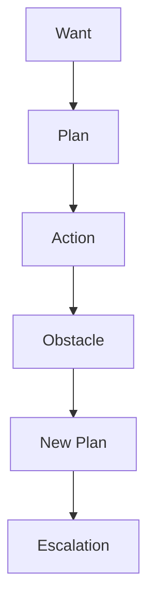

Tanpa want, karakter hanya bereaksi. Jika karakter hanya bereaksi, plot terasa seperti rangkaian kejadian yang menimpa seseorang, bukan cerita tentang seseorang yang mengejar sesuatu.

#### Checklist Want

Want yang baik harus:

- terlihat dari luar,
- bisa diuji keberhasilannya,
- punya deadline atau tekanan waktu,
- punya stakes,
- menciptakan aksi,
- berlawanan dengan obstacle,
- cukup personal bagi karakter.

Contoh self-correction:

```text
Want awal:
Karakter ingin hidup lebih baik.

Pertanyaan debugging:
Apa bukti visual bahwa hidupnya lebih baik?
Apa yang ia kejar secara konkret?
Apa deadline-nya?
Apa yang hilang jika gagal?

Want revisi:
Karakter harus mendapatkan izin usaha dalam 48 jam agar warung ayahnya tidak disegel.
```

---

### 5.2 Need — Apa yang Sebenarnya Harus Dipelajari atau Diterima Karakter

**Need** adalah kebutuhan internal karakter. Biasanya karakter tidak sadar bahwa ia membutuhkannya.

Want bergerak di permukaan plot. Need bergerak di bawah permukaan tema.

| Elemen | Fungsi |
|---|---|
| Want | Mendorong plot eksternal |
| Need | Mendorong perubahan internal |
| Want | Apa yang karakter pikir akan menyelamatkannya |
| Need | Apa yang sebenarnya menyelamatkan atau membebaskannya |
| Want | Bisa dicapai secara objektif |
| Need | Harus disadari, diterima, atau diwujudkan |

Contoh:

```text
Want:
Seorang pengacara ingin memenangkan kasus besar.

Need:
Ia harus berhenti melihat manusia sebagai alat untuk menang.
```

```text
Want:
Seorang anak ingin masuk sekolah musik.

Need:
Ia harus berani memainkan musiknya sendiri, bukan hanya meniru ayahnya.
```

```text
Want:
Seorang ibu ingin menemukan anaknya yang hilang.

Need:
Ia harus mengakui bahwa kontrol berlebihan tidak sama dengan cinta.
```

Need yang baik biasanya berhubungan dengan tema.

Jika tema film adalah:

```text
Apakah keamanan layak dibeli dengan kebohongan?
```

Need karakter mungkin:

```text
Ia harus belajar bahwa hidup tanpa konflik bukan berarti hidup benar.
```

#### Need Bukan Nasihat Moral Generik

Need yang lemah:

```text
Dia harus menjadi orang yang lebih baik.
```

Terlalu umum.

Need yang lebih tajam:

```text
Dia harus berhenti menggunakan kebaikan sebagai cara menghindari keberanian.
```

Ini lebih dramatik karena spesifik, paradoksal, dan bisa diuji.

---

### 5.3 Flaw — Strategi Salah yang Memberi Keuntungan Jangka Pendek dan Kerugian Jangka Panjang

Flaw bukan sekadar sifat buruk.

Flaw yang buruk sebagai desain:

```text
Dia pemarah.
```

Itu label.

Flaw yang lebih berguna:

```text
Setiap kali merasa tidak berdaya, ia menyerang duluan agar tidak terlihat lemah.
```

Sekarang flaw menjadi pattern.

Flaw harus punya tiga hal:

1. **trigger** — kapan flaw aktif,
2. **short-term benefit** — kenapa karakter terus memakainya,
3. **long-term cost** — kenapa flaw itu merusak hidupnya.

Contoh:

| Flaw | Trigger | Keuntungan Jangka Pendek | Biaya Jangka Panjang |
|---|---|---|---|
| Mengontrol semua orang | Ketika merasa ditinggalkan | Merasa aman | Orang lain menjauh |
| Berbohong untuk menjaga damai | Ketika konflik muncul | Situasi cepat tenang | Kepercayaan hancur |
| Menghina lebih dulu | Ketika merasa inferior | Tidak terlihat lemah | Tidak bisa dekat dengan siapa pun |
| Menunda keputusan | Ketika risiko tinggi | Tidak perlu bertanggung jawab | Kesempatan hilang |
| Menyelamatkan semua orang | Ketika melihat orang menderita | Merasa berguna | Mengabaikan hidup sendiri |

Flaw yang kuat membuat karakter gagal secara konsisten dengan cara yang masuk akal.

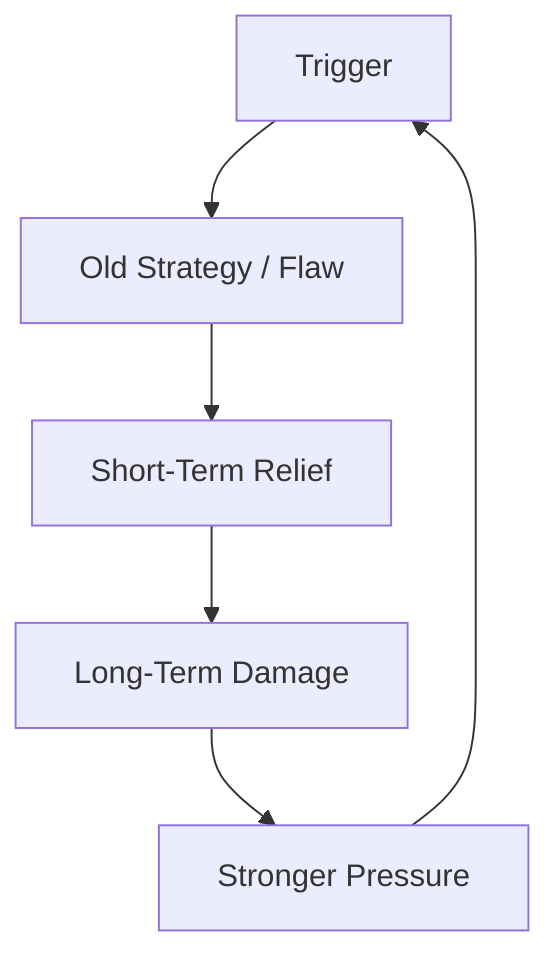

#### Flaw sebagai Bug yang Pernah Berguna

Dalam desain karakter yang matang, flaw jarang muncul dari kekosongan. Flaw biasanya adalah strategi adaptif yang dulu berguna, tetapi sekarang merusak.

Contoh:

```text
Masa kecil:
Karakter tumbuh di rumah yang penuh ledakan emosi. Diam membuatnya aman.

Dewasa:
Ia tetap diam dalam hubungan, pekerjaan, dan konflik moral.

Dulu:
Diam menyelamatkan.

Sekarang:
Diam menghancurkan.
```

Ini membuat flaw terasa manusiawi, bukan random.

---

### 5.4 Wound — Luka yang Membentuk Sistem Pertahanan

**Wound** adalah pengalaman masa lalu yang meninggalkan imprint emosional dan membentuk strategi bertahan hidup karakter.

Wound bukan wajib berupa trauma ekstrem. Bisa kecil tetapi menentukan.

Contoh wound:

- pernah ditertawakan saat jujur,
- ditinggal orang tua tanpa penjelasan,
- gagal menyelamatkan seseorang,
- dihukum ketika menunjukkan emosi,
- tumbuh sebagai anak yang hanya dipuji saat berprestasi,
- pernah dikhianati oleh mentor,
- pernah miskin dan dipermalukan,
- pernah mencintai seseorang tetapi dianggap beban.

Yang penting bukan seberapa besar wound-nya, tetapi bagaimana wound itu memengaruhi keputusan sekarang.

#### Wound Harus Relevan dengan Flaw

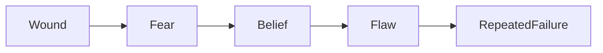

Contoh:

```text
Wound:
Saat kecil, ia dipermalukan di depan kelas karena salah bernyanyi.

Fear:
Takut terlihat bodoh.

Belief:
Kalau aku tidak sempurna, aku tidak layak dihargai.

Flaw:
Ia mengontrol semua detail dan tidak memberi ruang improvisasi.

Repeated failure:
Dalam project film, ia menghancurkan kolaborasi karena tidak bisa mempercayai tim.
```

Wound yang buruk:

```text
Dia punya trauma masa lalu.
```

Terlalu umum dan melodramatik.

Wound yang lebih berguna:

```text
Pada usia 12 tahun, ia membaca surat cerai orang tuanya dan menyadari bahwa semua orang dewasa di rumah sudah berbohong selama berbulan-bulan. Sejak itu, ia membaca setiap tanda kecil sebagai potensi pengkhianatan.
```

Sekarang wound punya efek behavioral.

#### Wound Tidak Harus Dijelaskan Semua

Dalam screenplay, Anda tidak wajib menulis semua backstory sebagai dialog. Penonton cukup melihat efeknya.

Misalnya:

```text
Ayu selalu memeriksa pintu tiga kali sebelum tidur.
Ia tidak pernah duduk membelakangi pintu restoran.
Ketika seseorang berkata “percaya saja”, wajahnya mengeras.
```

Tanpa menjelaskan luka, penonton merasakan adanya sistem pertahanan.

---

### 5.5 Mask — Interface Sosial yang Dipakai Karakter untuk Bertahan

**Mask** adalah persona yang karakter tampilkan ke dunia.

Mask bukan kebohongan sederhana. Mask adalah public interface.

Dalam bahasa software:

```text
Private state != public interface.
```

Contoh:

| Private Self | Mask |
|---|---|
| Takut ditolak | Lucu, selalu bercanda |
| Merasa tidak berharga | Perfeksionis, paling sibuk |
| Kesepian | Dingin, sinis |
| Penuh rasa bersalah | Sangat religius, moralistik |
| Takut miskin | Terlihat sukses, boros |
| Takut tidak dibutuhkan | Selalu menolong orang |

Mask penting karena film membutuhkan perilaku terlihat.

Jika Anda menulis:

```text
Dia merasa tidak aman.
```

Itu internal.

Jika Anda menulis:

```text
Ia tertawa paling keras di ruangan, tapi berhenti saat tidak ada yang melihat.
```

Itu mask yang bisa difilmkan.

#### Mask Harus Retak

Cerita menjadi menarik ketika mask tidak lagi cukup.

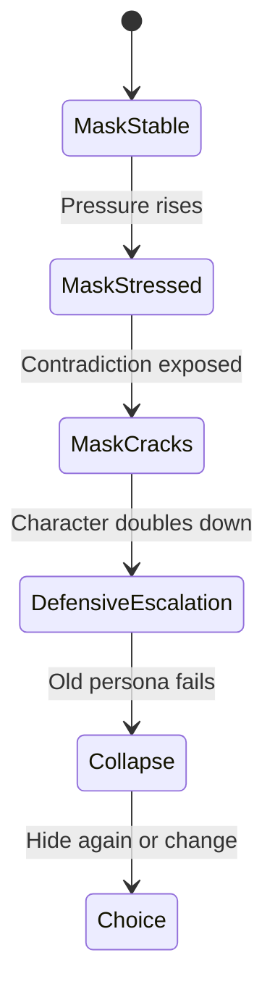

Contoh:

```text
Mask:
Seorang produser selalu terlihat tenang dan profesional.

Pressure:
Dana film hilang, aktor utama mundur, dan kru mulai panik.

Crack:
Ia memaki asisten di depan semua orang.

Meaning:
Ketenangannya bukan kedewasaan, tetapi kontrol yang rapuh.
```

Mask memberi dimensi karena karakter punya lapisan.

---

### 5.6 Fear — Guard Clause Emosional

Fear adalah kondisi yang paling dihindari karakter.

Fear sering menjadi guard clause yang mencegah karakter masuk ke state tertentu.

Contoh:

```text
if situation == emotional_intimacy:
    character.escape()
```

Atau:

```text
if risk == public_failure:
    character.overprepare()
```

Fear bukan hanya “takut hantu” atau “takut mati”. Fear dramatik sering lebih dalam:

- takut tidak dibutuhkan,
- takut terlihat miskin,
- takut dicintai lalu ditinggalkan,
- takut biasa-biasa saja,
- takut kehilangan kontrol,
- takut menjadi seperti ayahnya,
- takut bahwa hidupnya tidak berarti,
- takut bahwa ia sebenarnya salah.

Fear membuat karakter menghindari need.

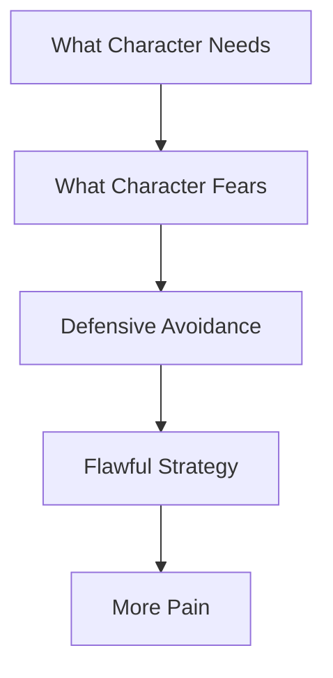

---

### 5.7 Belief atau Lie — Aturan Hidup yang Salah tetapi Dipercaya

Banyak character arc bergerak dari lie menuju truth.

**Lie** adalah keyakinan salah yang mengatur hidup karakter.

Contoh:

| Lie | Truth |
|---|---|
| Kalau aku tidak sempurna, aku tidak layak dicintai | Aku bisa dicintai tanpa harus sempurna |
| Konflik selalu menghancurkan hubungan | Konflik jujur bisa menyelamatkan hubungan |
| Orang hanya menghormati kekuatan | Kerentanan juga bisa menciptakan kepercayaan |
| Uang adalah satu-satunya keamanan | Keamanan tanpa makna tetap kosong |
| Menyelamatkan orang berarti mengontrol mereka | Cinta juga berarti membiarkan orang memilih |

Lie harus aktif di plot. Jangan hanya menjadi quote filosofis.

Contoh:

```text
Lie:
Aku hanya aman kalau semua orang menyukaiku.

Scene impact:
Ia setuju membantu dua pihak yang saling bertentangan.
Ia berbohong kecil kepada masing-masing pihak.
Ia menunda keputusan karena takut mengecewakan.
Akhirnya semua orang merasa dikhianati.
```

Lie menghasilkan action pattern.

---

### 5.8 Value — Apa yang Tidak Rela Dikorbankan Karakter

Value adalah hal yang karakter anggap penting.

Value bisa baik, buruk, kontradiktif, atau berubah.

Contoh value:

- keluarga,
- reputasi,
- kebebasan,
- stabilitas,
- keadilan,
- iman,
- kontrol,
- uang,
- prestasi,
- cinta,
- kebenaran,
- status,
- keselamatan.

Konflik menjadi kuat ketika value bertabrakan.

```text
Karakter tidak hanya memilih antara baik dan buruk.
Karakter memilih antara dua hal yang sama-sama penting.
```

Contoh:

```text
Ia harus memilih antara menyelamatkan kariernya atau berkata jujur demi sahabatnya.
```

Di sini konflik bukan hanya eksternal. Konflik nilai.

---

## 6. Want vs Need: Mesin Plot dan Mesin Arc

Want dan need sering membingungkan. Ini tabel ringkasnya.

| Pertanyaan | Want | Need |
|---|---|---|
| Apa bentuknya? | Tujuan eksternal | Transformasi internal |
| Apakah karakter sadar? | Biasanya sadar | Biasanya tidak sadar |
| Terlihat di kamera? | Ya, melalui aksi | Terlihat lewat perubahan pilihan |
| Fungsi | Menggerakkan plot | Menggerakkan arc |
| Bisa gagal/berhasil objektif? | Ya | Lebih interpretatif tetapi harus dramatik |
| Hubungan dengan tema | Tidak selalu langsung | Sangat langsung |

Contoh lengkap:

```text
Premis:
Seorang sound recordist yang perfeksionis harus merekam suara terakhir hutan sebelum area itu digusur untuk proyek resort.

Want:
Mendapatkan rekaman suara hutan yang sempurna sebelum alat berat masuk.

Need:
Belajar menerima bahwa hidup tidak bisa disimpan secara sempurna; sebagian hal harus dilindungi dengan tindakan, bukan hanya direkam.

Flaw:
Ia bersembunyi di balik observasi dan dokumentasi agar tidak perlu terlibat.

Wound:
Dulu ia gagal menyelamatkan adiknya dalam kecelakaan; sejak itu ia hanya berani menjadi pengamat.

Mask:
Profesional, tenang, objektif, “hanya merekam”.

Arc:
Dari pengamat pasif menjadi seseorang yang mengambil risiko untuk bersaksi.
```

Perhatikan: want memberi plot konkret. Need memberi perubahan moral/emosional.

---

## 7. Karakter Aktif vs Karakter Pasif

Karakter aktif bukan berarti selalu agresif atau kuat. Karakter aktif berarti ia **membuat pilihan yang mengubah arah cerita**.

Karakter pasif:

```text
Semua kejadian menimpanya.
Ia hanya sedih, bingung, dan mengikuti arus.
```

Karakter aktif:

```text
Ia memilih sesuatu.
Pilihan itu salah atau benar.
Pilihan itu menghasilkan konsekuensi.
Konsekuensi itu memaksa pilihan berikutnya.
```

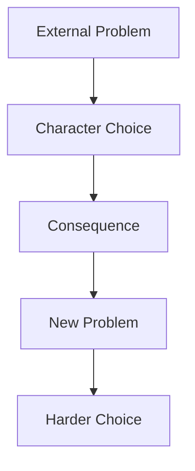

Karakter bisa lemah secara psikologis tetapi tetap aktif secara dramatik.

Contoh:

```text
Karakter pemalu bisa aktif jika ia memilih berbohong, kabur, menyembunyikan bukti, mengirim pesan, mengunci pintu, atau menolak permintaan.
```

Masalahnya bukan karakter pemalu. Masalahnya jika karakter tidak pernah memilih.

---

## 8. Character Arc sebagai Perubahan Rule, Bukan Perubahan Mood

Arc yang lemah:

```text
Awalnya sedih, akhirnya bahagia.
```

Itu perubahan mood.

Arc yang lebih kuat:

```text
Awalnya ia percaya bahwa meminta bantuan adalah kelemahan.
Akhirnya ia memilih meminta bantuan di depan orang yang paling ingin ia buktikan salah.
```

Itu perubahan rule.

### 8.1 Positive Arc

Karakter mulai dari lie, lalu bergerak menuju truth.

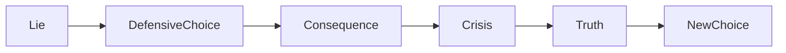

Contoh:

```text
Lie:
Aku harus mengontrol semua orang agar tidak ditinggalkan.

Truth:
Aku tidak bisa mencintai seseorang dengan cara mengurungnya.
```

### 8.2 Negative Arc

Karakter mulai dengan peluang untuk berubah, tetapi akhirnya makin tenggelam dalam lie.

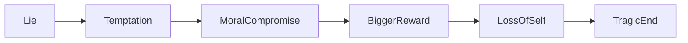

Contoh:

```text
Awalnya ia ingin melindungi keluarganya.
Akhirnya ia menggunakan keluarga sebagai alasan untuk menghancurkan orang lain.
```

### 8.3 Flat Arc

Karakter tidak berubah banyak, tetapi ia mengubah dunia di sekelilingnya.

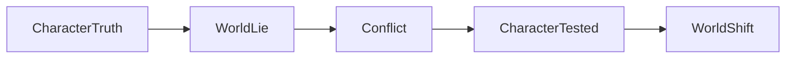

Contoh:

```text
Seorang guru tetap percaya bahwa anak bermasalah bukan anak gagal.
Sepanjang film, keyakinannya diuji oleh sekolah, orang tua, dan sistem.
Akhirnya bukan dia yang berubah besar, tetapi lingkungan yang mulai retak.
```

Flat arc bukan berarti datar. Karakter tetap diuji.

---

## 9. Character State Table

Gunakan tabel ini untuk mendesain arc secara konkret.

| Stage | State Karakter | Belief | Strategy | Pressure | Choice | Consequence |
|---|---|---|---|---|---|---|
| Opening | Mode lama stabil | Lie aktif | Strategi lama | Rendah | Pilihan default | Masalah kecil |
| Inciting | Mode terganggu | Lie terancam | Menghindar | Sedang | Menolak/meremehkan | Masalah tumbuh |
| Act 2 Early | Strategi lama dipakai | Lie makin aktif | Memaksa kontrol | Naik | Pilihan salah | Kerusakan relasi |
| Midpoint | Realitas berubah | Lie retak | Adaptasi setengah hati | Tinggi | Pilihan besar | Kemenangan/kejatuhan palsu |
| Crisis | Strategi lama gagal | Lie hampir runtuh | Panik/menyerah | Sangat tinggi | Pilihan terburuk/terjujur | Kehilangan besar |
| Climax | Truth diuji | Truth tersedia | Strategi baru | Maksimum | Pilihan final | Arc terbukti |
| Ending | State baru | Truth/lie final | Cara hidup baru | Stabil baru | Aftermath | Makna final |

Untuk film pendek, tabel ini bisa dipadatkan menjadi:

| Stage | Fungsi |
|---|---|
| Opening | Tunjukkan mask dan flaw |
| Pressure | Paksa karakter memilih |
| Failure | Flaw menciptakan konsekuensi |
| Crisis | Mask retak |
| Final Choice | Karakter berubah atau gagal berubah |
| Final Image | State akhir terlihat |

---

## 10. Decision Trace: Cara Membuat Karakter Konsisten tapi Tidak Mudah Ditebak

Karakter yang konsisten bukan berarti selalu melakukan hal yang sama. Karakter konsisten berarti setiap pilihan punya logic internal.

Gunakan decision trace:

```text
Event:
Apa yang terjadi?

Perception:
Bagaimana karakter menafsirkan event itu?

Fear:
Apa yang terancam?

Want:
Apa yang ia kejar saat itu?

Flaw:
Strategi lama apa yang aktif?

Choice:
Apa yang ia lakukan?

Cost:
Apa konsekuensinya?

New State:
Apa yang berubah setelah itu?
```

Contoh:

```text
Event:
Sutradara menolak ide Ayu di rapat produksi.

Perception:
Ayu tidak mendengar kritik kreatif; ia mendengar penghinaan.

Fear:
Takut terlihat bodoh di depan tim.

Want:
Ingin mempertahankan otoritas.

Flaw:
Menyerang sebelum diserang.

Choice:
Ia mempermalukan sutradara dengan menyebut kekurangan budget di depan crew.

Cost:
Tim melihatnya tidak aman secara emosional. Sutradara berhenti percaya padanya.

New State:
Kolaborasi rusak; Ayu makin sendirian.
```

Decision trace membuat scene tidak random.

---

## 11. Relationship as Character Pressure

Karakter tidak hidup sendirian. Hubungan adalah sistem tekanan.

Setiap karakter pendukung sebaiknya menekan protagonist dari arah berbeda.

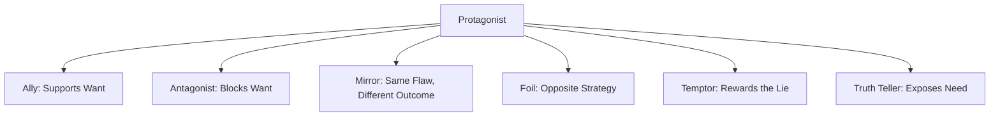

Fungsi karakter pendukung:

| Role | Fungsi |
|---|---|
| Ally | Membantu protagonist mengejar want |
| Antagonist | Menghalangi want |
| Mirror | Menunjukkan versi lain dari protagonist |
| Foil | Mengontraskan value/strategy protagonist |
| Temptor | Menggoda protagonist untuk tetap memakai flaw |
| Truth teller | Mengatakan atau menunjukkan kebenaran yang dihindari |
| Victim of flaw | Menanggung akibat kelemahan protagonist |

Contoh:

```text
Protagonist:
Seorang produser film yang perfeksionis.

Ally:
Asisten yang loyal tetapi mulai kelelahan.

Antagonist:
Investor yang menuntut perubahan cerita murahan.

Mirror:
Sutradara tua yang dulu juga perfeksionis dan kehilangan semua relasi.

Foil:
Aktor muda yang spontan dan jujur.

Temptor:
Manajer produksi yang berkata, “Yang penting selesai, kualitas urusan nanti.”

Truth teller:
Editor yang menunjukkan bahwa filmnya mati bukan karena kurang kontrol, tetapi karena tidak ada napas.
```

Hubungan membuat arc lebih tajam karena karakter dipantulkan oleh orang lain.

---

## 12. Cara Mendesain Protagonist untuk Film Pendek

Film pendek punya ruang terbatas. Jangan membuat karakter terlalu banyak layer yang tidak sempat diuji.

Untuk film pendek 8–12 menit, cukup gunakan model ini:

```text
Protagonist = Want + Flaw + Pressure + Final Choice
```

Need boleh ada, tetapi harus sangat sederhana.

Contoh:

```text
Karakter:
Seorang anak ingin menyembunyikan nilai rapornya sebelum ibunya pulang.

Want:
Menyembunyikan rapor.

Flaw:
Selalu berbohong untuk menghindari hukuman.

Pressure:
Ibunya pulang lebih cepat; adiknya melihat rapor itu.

Need:
Berani jujur sebelum kebohongan kecil menjadi luka besar.

Final choice:
Ia menyerahkan rapor itu sendiri.
```

Struktur short:

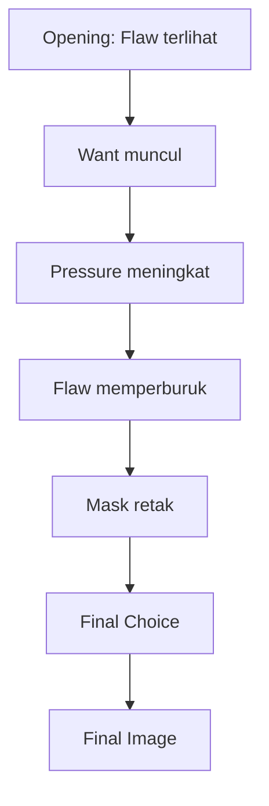

Untuk film pendek, satu perubahan kecil yang jujur lebih kuat daripada arc besar yang dipaksakan.

---

## 13. Cara Mendesain Protagonist untuk Feature Film

Film panjang membutuhkan arc yang lebih tahan lama.

Model feature:

```text
Protagonist = Want + Need + Flaw + Wound + Mask + Relationship Web + Escalation Path
```

Karakter harus bisa menghasilkan konflik sepanjang 90–120 menit.

Artinya:

1. want harus cukup besar,
2. obstacle harus berlapis,
3. flaw harus berulang dalam bentuk berbeda,
4. relationship harus menekan dari banyak arah,
5. midpoint harus mengubah pemahaman karakter,
6. crisis harus memaksa self-confrontation,
7. climax harus membuktikan perubahan melalui pilihan.

Feature character arc biasanya memiliki beberapa fase:

| Fase | Fungsi |
|---|---|
| Setup | Menunjukkan mode hidup lama |
| Disruption | Want muncul atau dipaksa muncul |
| Resistance | Karakter memakai strategi lama |
| Adaptation | Karakter mulai belajar tetapi belum berubah |
| Revelation | Karakter melihat kebenaran sebagian |
| Collapse | Strategi lama gagal total |
| Choice | Karakter memilih truth atau lie |
| Aftermath | Dunia baru terlihat |

---

## 14. Karakter dan Tema

Part 005 membahas tema. Sekarang kita hubungkan tema dengan karakter.

Tema tidak boleh hanya muncul dalam dialog. Tema harus diuji melalui karakter.

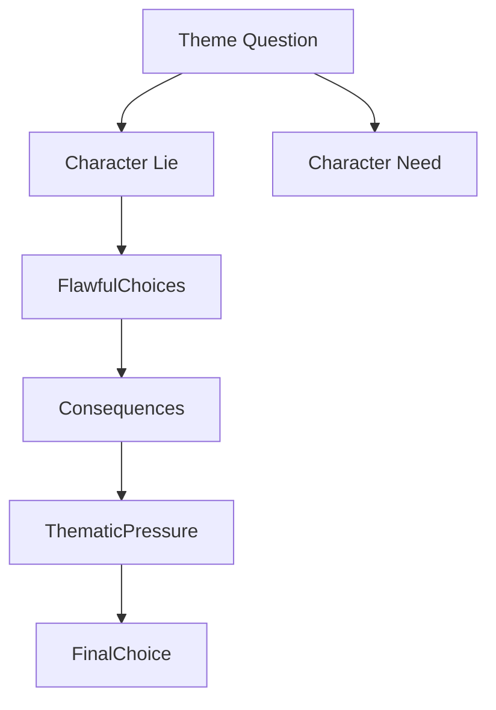

Contoh:

```text
Theme question:
Apakah kebenaran tetap berharga jika menghancurkan hidup orang yang kita cintai?

Protagonist lie:
Kebohongan yang melindungi orang tercinta adalah bentuk cinta.

Need:
Ia harus belajar bahwa cinta tanpa kejujuran berubah menjadi kontrol.

Final choice:
Ia membuka fakta yang menyakitkan, bukan untuk menghukum, tetapi untuk membebaskan semua pihak dari manipulasi.
```

Karakter adalah tempat tema mengalami tekanan.

---

## 15. Karakter dan Scene

Setiap scene penting sebaiknya menampilkan setidaknya satu dari hal berikut:

1. want karakter dikejar,
2. flaw karakter aktif,
3. mask karakter dipertahankan,
4. fear karakter disentuh,
5. relationship berubah,
6. belief karakter diuji,
7. cost meningkat,
8. state karakter berubah.

Scene tanpa hubungan ke karakter sering terasa filler.

### Template Scene Berbasis Karakter

```text
Scene:
Lokasi:
Karakter yang hadir:

Input state protagonist:

Scene want:

Obstacle:

Flaw yang aktif:

Mask yang terlihat:

Choice:

Cost:

Output state:

Apa yang berubah setelah scene ini?
```

Contoh singkat:

```text
Scene:
Ruang editing malam hari.

Input state:
Ayu masih percaya bahwa film hanya bisa selamat jika semua keputusan lewat dirinya.

Scene want:
Ia ingin editor mengganti cut sesuai instruksinya.

Obstacle:
Editor menunjukkan versi yang lebih emosional tetapi menyimpang dari storyboard Ayu.

Flaw:
Mengontrol ketika merasa tidak aman.

Mask:
Profesional, teknis, dingin.

Choice:
Ia menghapus file cut editor tanpa diskusi.

Cost:
Editor keluar dari project.

Output state:
Ayu menang secara kontrol, kalah secara kolaborasi.
```

---

## 16. Karakter dan Dialog

Dialog karakter harus muncul dari:

- want,
- fear,
- status,
- mask,
- subtext,
- relationship history.

Dua karakter tidak boleh terdengar sama kecuali itu disengaja.

### 16.1 Voice Bukan Sekadar Gaya Bicara

Voice karakter bukan hanya:

```text
Dia sering memakai bahasa gaul.
```

Voice adalah gabungan dari:

1. apa yang ia perhatikan,
2. apa yang ia hindari,
3. seberapa langsung ia bicara,
4. seberapa banyak ia menyembunyikan,
5. status yang ia ingin tampilkan,
6. ritme emosi,
7. pilihan metafora,
8. level kontrol.

Contoh:

```text
Karakter A — perfeksionis:
“Aku cuma bilang, kalau kita mau hancur, setidaknya hancur dengan urutan shot yang benar.”

Karakter B — spontan:
“Kadang film kelihatan hidup justru karena dia hampir jatuh.”
```

Mereka tidak hanya berbeda kosakata. Mereka berbeda worldview.

### 16.2 Dialog sebagai Strategi

Dalam scene, dialog adalah action.

Karakter bicara untuk:

- mendapatkan sesuatu,
- menyembunyikan sesuatu,
- menyerang,
- menguji,
- menggoda,
- mengalihkan,
- menenangkan,
- mengontrol,
- meminta tolong tanpa terlihat meminta,
- mengucapkan selamat tinggal tanpa mengaku sedih.

Jika dialog tidak punya tujuan, biasanya dialog itu lemah.

---

## 17. Karakter dan Visual Behavior

Karena film adalah medium visual, karakter harus punya perilaku yang bisa dilihat.

Ubah atribut internal menjadi behavior.

| Internal | Behavior Filmik |
|---|---|
| Cemas | Merapikan benda yang sudah rapi |
| Merasa bersalah | Menghindari kursi kosong seseorang |
| Kesepian | Menyalakan TV hanya untuk mendengar suara |
| Takut miskin | Menyimpan struk belanja sangat rapi |
| Tidak percaya orang | Duduk menghadap pintu |
| Ingin terlihat kuat | Menolak payung saat hujan deras |
| Ingin dicintai | Mengingat detail kecil semua orang |

Latihan penting:

```text
Jangan tulis “dia sedih”.
Tulis apa yang ia lakukan agar tidak terlihat sedih.
```

Mask sering lebih filmik daripada emosi langsung.

---

## 18. Invariant Karakter yang Baik

Gunakan invariant berikut sebagai alat diagnosis.

### Invariant 1 — Karakter Harus Menginginkan Sesuatu

Tanpa want, tidak ada arah.

### Invariant 2 — Karakter Harus Terhalang

Tanpa obstacle, tidak ada drama.

### Invariant 3 — Karakter Harus Memilih

Tanpa pilihan, karakter hanya objek plot.

### Invariant 4 — Pilihan Harus Memiliki Biaya

Tanpa cost, pilihan tidak berarti.

### Invariant 5 — Flaw Harus Terlihat dalam Aksi

Jika flaw hanya disebutkan tetapi tidak pernah menghasilkan tindakan, flaw itu dekorasi.

### Invariant 6 — Arc Harus Terbukti di Climax

Perubahan tidak boleh hanya dikatakan. Perubahan harus diuji.

### Invariant 7 — Wound Menjelaskan Pola, Bukan Menggantikan Plot

Backstory tidak boleh menjadi alasan untuk scene sekarang tidak bergerak.

### Invariant 8 — Mask Harus Bisa Retak

Jika karakter selalu sama dari awal sampai akhir tanpa tekanan pada persona, ia mudah terasa datar.

---

## 19. Anti-Pattern Karakter Pemula

### 19.1 Biodata Banyak, Drama Sedikit

Gejala:

```text
Penulis tahu zodiak, makanan favorit, dan warna kesukaan karakter,
tetapi tidak tahu apa yang karakter pilih ketika harus mengkhianati seseorang.
```

Perbaikan:

Fokus pada decision pattern.

---

### 19.2 Trauma Dump

Gejala:

```text
Karakter punya masa lalu tragis panjang yang diceritakan dalam dialog,
tetapi tidak memengaruhi tindakan sekarang secara spesifik.
```

Perbaikan:

Hubungkan wound ke fear, belief, flaw, dan choice.

---

### 19.3 Flaw sebagai Label

Gejala:

```text
Dia egois.
Dia pemarah.
Dia dingin.
```

Perbaikan:

Tulis pattern:

```text
Ketika merasa tidak dihargai, ia mengambil keputusan sepihak untuk membuktikan dirinya paling tahu.
```

---

### 19.4 Karakter Pasif

Gejala:

```text
Karakter hanya mengalami kejadian.
Plot bergerak karena orang lain.
```

Perbaikan:

Pastikan setiap major beat berisi pilihan protagonist.

---

### 19.5 Arc Instan

Gejala:

```text
Karakter berubah setelah satu nasihat.
```

Perbaikan:

Perubahan harus dibayar dengan kehilangan, pengakuan, keberanian, atau tindakan final.

---

### 19.6 Need Terlalu Generik

Gejala:

```text
Dia harus belajar mencintai.
Dia harus menjadi lebih baik.
Dia harus percaya diri.
```

Perbaikan:

Buat lebih spesifik:

```text
Dia harus berhenti menganggap cinta sebagai kontrak yang harus ia menangkan.
```

---

### 19.7 Karakter Tidak Punya Kontradiksi

Manusia jarang satu warna. Karakter yang menarik sering punya kontradiksi.

Contoh:

```text
Ia penyayang tetapi manipulatif.
Ia religius tetapi pendendam.
Ia lucu tetapi kejam pada dirinya sendiri.
Ia pemberani di tempat kerja tetapi pengecut di rumah.
Ia jujur dalam bisnis tetapi berbohong pada anaknya.
```

Kontradiksi membuat karakter punya dimensi.

---

## 20. Character Kernel Template

Gunakan template ini untuk semua karakter penting.

```markdown
# Character Kernel

## 1. Identitas Dasar
- Nama:
- Usia:
- Peran dalam cerita:
- Fungsi dramatik:

## 2. Public Identity
- Bagaimana dunia melihat dia?
- Bagaimana dia ingin dilihat?
- Apa reputasinya?

## 3. Private Self
- Apa yang ia sembunyikan?
- Apa yang ia takut orang lain lihat?
- Apa rasa malu terdalamnya?

## 4. Want
- Apa tujuan eksternal yang ia kejar?
- Apa bukti objektif bahwa ia berhasil?
- Apa deadline-nya?
- Apa stakes jika gagal?

## 5. Need
- Apa yang sebenarnya harus ia pelajari/terima/lakukan?
- Bagaimana need ini berhubungan dengan tema?
- Apa bentuk pilihan final yang membuktikan need?

## 6. Flaw
- Apa strategi salah yang terus ia ulangi?
- Trigger-nya apa?
- Apa keuntungan jangka pendeknya?
- Apa biaya jangka panjangnya?

## 7. Wound
- Peristiwa atau pengalaman apa yang membentuk flaw?
- Apa imprint emosionalnya?
- Bagaimana wound itu terlihat dalam behavior sekarang?

## 8. Mask
- Persona apa yang ia tampilkan?
- Gesture/perilaku apa yang menunjukkan mask itu?
- Kapan mask mulai retak?

## 9. Fear
- Apa yang paling ia hindari?
- Apa yang ia lakukan untuk menghindarinya?

## 10. Belief / Lie
- Apa keyakinan salah yang mengatur hidupnya?
- Apa truth yang harus ia hadapi?

## 11. Value
- Apa yang paling ia lindungi?
- Apa value yang bertabrakan dalam cerita?

## 12. Arc
- State awal:
- State tengah:
- State krisis:
- State akhir:

## 13. Decision Pattern
- Ketika tertekan, ia biasanya:
- Ketika takut, ia biasanya:
- Ketika mencintai, ia biasanya:
- Ketika kehilangan kontrol, ia biasanya:

## 14. Visual Behavior
- Gesture khas:
- Object/prop khas:
- Kebiasaan kecil:
- Cara diam:
- Cara marah:

## 15. Voice
- Cara bicara:
- Hal yang sering ia hindari dalam percakapan:
- Kata/frasa khas:
- Ritme dialog:
```

---

## 21. Character Arc Contract

Sebelum menulis draft, buat kontrak arc.

```markdown
# Character Arc Contract

Karakter utama saya memulai cerita dengan percaya bahwa:

> ...

Karena keyakinan itu, ia biasanya melakukan:

> ...

Ia mengejar:

> ...

Tetapi yang sebenarnya ia butuhkan adalah:

> ...

Cerita akan menekan dia dengan:

> ...

Strategi lamanya akan gagal ketika:

> ...

Di climax, ia harus memilih antara:

> ...

Jika ia berubah, pilihannya akan terlihat sebagai:

> ...

Jika ia gagal berubah, pilihannya akan terlihat sebagai:

> ...

Final image yang menunjukkan state akhir:

> ...
```

Contoh terisi:

```markdown
Karakter utama saya memulai cerita dengan percaya bahwa:

> Tidak ada orang yang akan menghormatinya kecuali ia selalu terlihat paling kompeten.

Karena keyakinan itu, ia biasanya melakukan:

> Mengontrol semua keputusan dan menyembunyikan ketidaktahuannya.

Ia mengejar:

> Menyelesaikan film pendek pertamanya agar diterima festival.

Tetapi yang sebenarnya ia butuhkan adalah:

> Mengakui bahwa kolaborasi bukan ancaman terhadap identitas kreatifnya.

Cerita akan menekan dia dengan:

> Jadwal produksi rusak, aktor keluar, dan crew mulai mengambil inisiatif sendiri.

Strategi lamanya akan gagal ketika:

> Ia memecat satu-satunya orang yang sebenarnya memahami cerita.

Di climax, ia harus memilih antara:

> Mempertahankan kontrol penuh atau membiarkan tim menyelamatkan adegan terakhir dengan cara yang bukan idenya.

Jika ia berubah, pilihannya akan terlihat sebagai:

> Ia diam, menurunkan storyboard-nya, dan berkata, “Oke. Tunjukkan versimu.”

Final image:

> Ia duduk di belakang monitor, tidak memberi instruksi, hanya mendengar napas seluruh crew saat take terakhir selesai.
```

---

## 22. Practice: Character Sprint 90 Menit

Latihan ini dirancang sesuai prinsip Kaufman: cukup belajar, langsung praktik, lalu self-correct.

### Tujuan

Membuat protagonist usable untuk project film.

### Durasi

90 menit.

### Langkah

#### Menit 0–10 — Pilih Premis

Ambil satu logline dari Part 004.

Tulis:

```text
Film ini tentang siapa?
Apa yang ia kejar?
Apa yang menghalangi?
Kenapa ini penting sekarang?
```

#### Menit 10–25 — Want

Jawab:

```text
Apa tujuan eksternalnya?
Apa bentuk keberhasilannya?
Apa deadline-nya?
Apa stakes jika gagal?
```

#### Menit 25–40 — Need dan Theme

Jawab:

```text
Apa yang ia pikir ia butuhkan?
Apa yang sebenarnya ia butuhkan?
Apa hubungan need dengan tema?
```

#### Menit 40–55 — Flaw

Jawab:

```text
Ketika tertekan, strategi salah apa yang ia pakai?
Kenapa strategi itu terasa berguna?
Apa kerusakannya?
```

#### Menit 55–65 — Wound

Jawab:

```text
Pengalaman apa yang membuat strategi itu masuk akal?
Bagaimana efeknya terlihat sekarang?
```

#### Menit 65–75 — Mask

Jawab:

```text
Persona apa yang ia tampilkan?
Gesture/perilaku apa yang menunjukkan mask itu?
Kapan mask retak?
```

#### Menit 75–85 — Arc

Isi:

```text
State awal:
State krisis:
State akhir:
Final choice:
```

#### Menit 85–90 — Self-Correction

Cek:

```text
Apakah want terlihat?
Apakah need spesifik?
Apakah flaw berupa pattern, bukan label?
Apakah wound memengaruhi tindakan sekarang?
Apakah mask bisa difilmkan?
Apakah final choice membuktikan arc?
```

---

## 23. Practice: Flaw-Driven Scene

Latihan berikutnya: tulis satu scene 1–2 halaman yang menunjukkan flaw karakter tanpa menjelaskannya.

### Constraint

- Maksimal 2 karakter.
- Satu lokasi.
- Tidak boleh ada dialog yang menyebut flaw secara langsung.
- Scene harus berakhir dengan konsekuensi kecil.

### Prompt

```text
Karakter ingin mendapatkan sesuatu dari orang lain.
Orang lain menolak atau menghalangi.
Karakter menggunakan flaw sebagai strategi.
Strategi itu memberi kemenangan kecil tetapi menciptakan kerusakan relasi.
```

### Contoh Setup

```text
Karakter:
Ayu, produser perfeksionis.

Want scene:
Meyakinkan editor mengikuti cut versinya.

Obstacle:
Editor percaya versi Ayu membunuh emosi film.

Flaw:
Mengontrol ketika merasa tidak aman.

Consequence:
Editor menyerah, tetapi diam-diam mengirim pesan ke sutradara bahwa ia ingin keluar.
```

---

## 24. Practice: Mask Crack Scene

Tulis scene singkat ketika mask karakter retak.

### Prompt

```text
Karakter sedang menjaga persona tertentu.
Situasi menekan titik takutnya.
Ia berusaha mempertahankan persona.
Satu gesture kecil membocorkan private self.
```

Contoh:

```text
Mask:
Tenang, profesional.

Fear:
Takut dianggap gagal.

Pressure:
Investor bertanya kenapa jadwal produksi mundur.

Crack:
Ia menjawab dengan suara stabil, tetapi tangannya meremas gelas plastik sampai air tumpah ke meja.
```

Dalam film, retakan kecil sering lebih kuat daripada ledakan besar.

---

## 25. Self-Correction Checklist

Gunakan checklist ini setelah membuat karakter.

### Want

- [ ] Apakah karakter punya tujuan eksternal yang jelas?
- [ ] Apakah tujuan itu bisa terlihat di kamera?
- [ ] Apakah ada stakes jika gagal?
- [ ] Apakah ada urgency?

### Need

- [ ] Apakah need lebih spesifik daripada “jadi lebih baik”?
- [ ] Apakah need berhubungan dengan tema?
- [ ] Apakah need diuji di climax?

### Flaw

- [ ] Apakah flaw berupa pola tindakan, bukan label?
- [ ] Apakah flaw punya trigger?
- [ ] Apakah flaw memberi keuntungan jangka pendek?
- [ ] Apakah flaw punya biaya jangka panjang?

### Wound

- [ ] Apakah wound menjelaskan pola sekarang?
- [ ] Apakah wound tidak hanya menjadi dekorasi tragis?
- [ ] Apakah wound bisa disiratkan lewat behavior?

### Mask

- [ ] Apakah mask terlihat secara visual?
- [ ] Apakah mask berbeda dari private self?
- [ ] Apakah mask retak di bawah tekanan?

### Arc

- [ ] Apakah karakter berubah dalam cara mengambil keputusan?
- [ ] Apakah perubahan dibayar dengan cost?
- [ ] Apakah final image menunjukkan state akhir?

---

## 26. Debugging Karakter Lemah

### Masalah: Karakter terasa datar

Kemungkinan penyebab:

- tidak ada kontradiksi,
- tidak ada private self,
- tidak ada fear,
- tidak ada mask,
- tidak ada decision pressure.

Perbaikan:

```text
Tambahkan sesuatu yang ia tampilkan ke dunia dan sesuatu yang ia sembunyikan.
```

---

### Masalah: Karakter terasa tidak konsisten

Kemungkinan penyebab:

- penulis belum tahu belief karakter,
- pilihan dibuat demi plot, bukan demi logic internal,
- wound/flaw tidak terhubung,
- pressure tidak cukup jelas.

Perbaikan:

```text
Buat decision trace untuk setiap major scene.
```

---

### Masalah: Karakter tidak menarik

Kemungkinan penyebab:

- want terlalu lemah,
- stakes terlalu rendah,
- tidak ada konflik nilai,
- karakter terlalu benar sejak awal,
- tidak ada vulnerability.

Perbaikan:

```text
Beri karakter pilihan antara dua hal yang sama-sama penting.
```

---

### Masalah: Arc terasa dipaksakan

Kemungkinan penyebab:

- perubahan tidak dibangun bertahap,
- tidak ada konsekuensi dari flaw,
- tidak ada crisis,
- final choice tidak menguji need.

Perbaikan:

```text
Pastikan strategi lama gagal total sebelum karakter memilih strategi baru.
```

---

## 27. Acceptance Criteria Part 006

Anda dianggap memahami Part 006 jika bisa melakukan hal berikut tanpa melihat teori:

1. Menjelaskan want, need, flaw, wound, dan mask dengan contoh.
2. Membuat character kernel untuk protagonist project Anda.
3. Membuat flaw sebagai pattern, bukan label.
4. Menjelaskan hubungan wound → fear → belief → flaw → failure.
5. Membuat state table untuk arc karakter.
6. Menulis satu scene yang menunjukkan flaw tanpa menjelaskan flaw.
7. Menulis satu scene di mana mask karakter retak.
8. Menentukan final choice yang membuktikan arc.
9. Mendiagnosis karakter pasif.
10. Memperbaiki karakter yang hanya berupa biodata.

---

## 28. Mini Assignment Sebelum Lanjut ke Part 007

Sebelum lanjut ke antagonis dan oposisi, buat protagonist untuk project film Anda.

### Deliverable

Buat dokumen singkat:

```markdown
# Protagonist Draft v1

## Logline Project
...

## Character Kernel
- Nama:
- Public identity:
- Private self:
- Want:
- Need:
- Flaw:
- Wound:
- Mask:
- Fear:
- Belief/Lie:
- Truth:
- Value:

## State Table
| Stage | State | Choice | Consequence |
|---|---|---|---|
| Opening | ... | ... | ... |
| Pressure | ... | ... | ... |
| Crisis | ... | ... | ... |
| Climax | ... | ... | ... |
| Ending | ... | ... | ... |

## Final Choice
...

## Final Image
...
```

### Rule

Jangan membuat lebih dari satu protagonist dulu. Fokus pada satu karakter sampai sistem dramatiknya jelas.

---

## 29. Ringkasan Inti

Karakter film yang kuat bukan karakter dengan biodata paling lengkap. Karakter film yang kuat adalah karakter yang:

1. menginginkan sesuatu secara konkret,
2. membutuhkan sesuatu secara internal,
3. punya flaw sebagai strategi salah yang berulang,
4. punya wound yang membuat flaw itu masuk akal,
5. memakai mask untuk bertahan di dunia sosial,
6. punya fear yang membuatnya menghindari perubahan,
7. percaya pada lie yang diuji oleh cerita,
8. ditekan oleh plot sampai strategi lamanya gagal,
9. membuat pilihan final yang membuktikan apakah ia berubah atau tidak.

Dalam model software engineer:

```text
Character = stateful decision system under escalating pressure.
Arc = transition from old decision rule to new decision rule.
Flaw = old strategy that once worked but now causes failure.
Need = internal requirement for stable new state.
Mask = public interface hiding private state.
Wound = historical event that initialized defensive configuration.
```

Kalau Anda bisa memodelkan karakter seperti ini, Anda tidak lagi hanya bertanya:

```text
“Karakter ini sifatnya apa?”
```

Anda mulai bertanya:

```text
“Di bawah tekanan tertentu, karakter ini akan memilih apa, kenapa, dan apa akibatnya?”
```

Pertanyaan kedua jauh lebih berguna untuk menulis film.

---

## 30. Koneksi ke Part Berikutnya

Part 006 membangun protagonist sebagai sistem keputusan.

Part 007 akan membangun dunia tekanan yang menguji sistem itu:

> **Antagonis, Oposisi, dan Sistem Tekanan**

Kita akan membahas kenapa antagonis bukan hanya “orang jahat”, tetapi force yang memaksa protagonist menghadapi flaw, fear, lie, dan need-nya.

Jika protagonist adalah stateful system, maka antagonis adalah **stress test**.

---

# Status Seri

Belum mencapai bagian terakhir.  
Lanjut ke: `learn-screenwriting-film-script-part-007.md`
