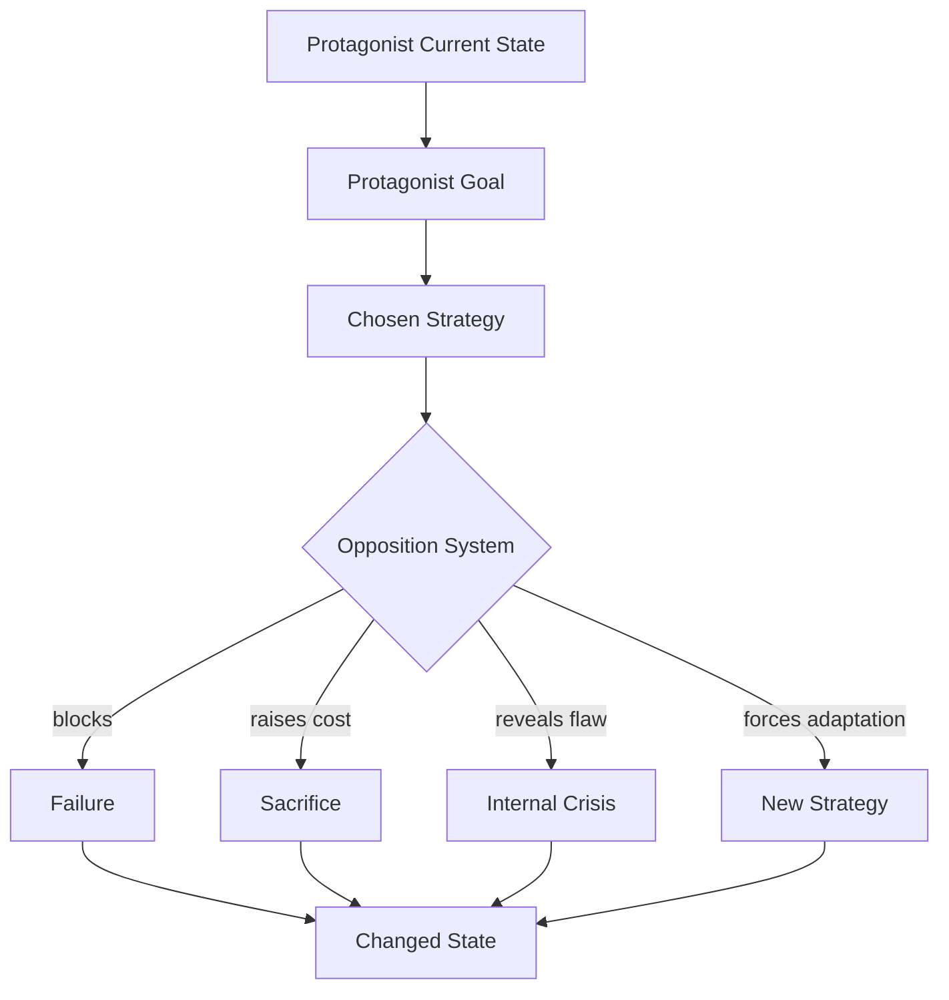
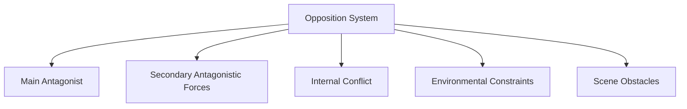
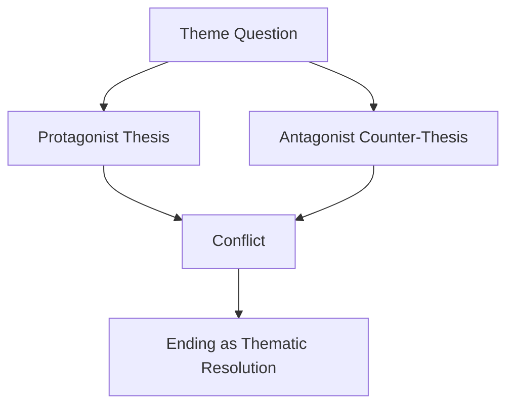
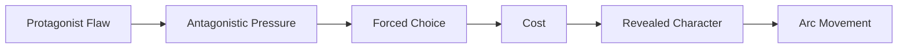
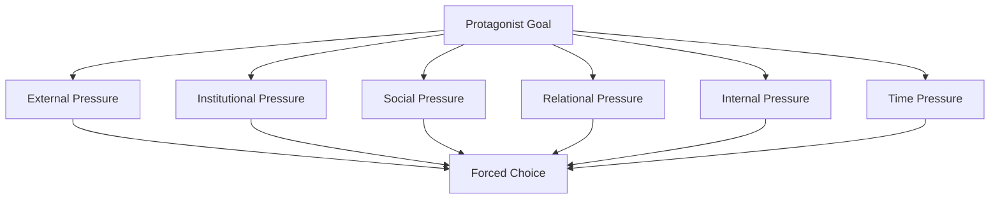
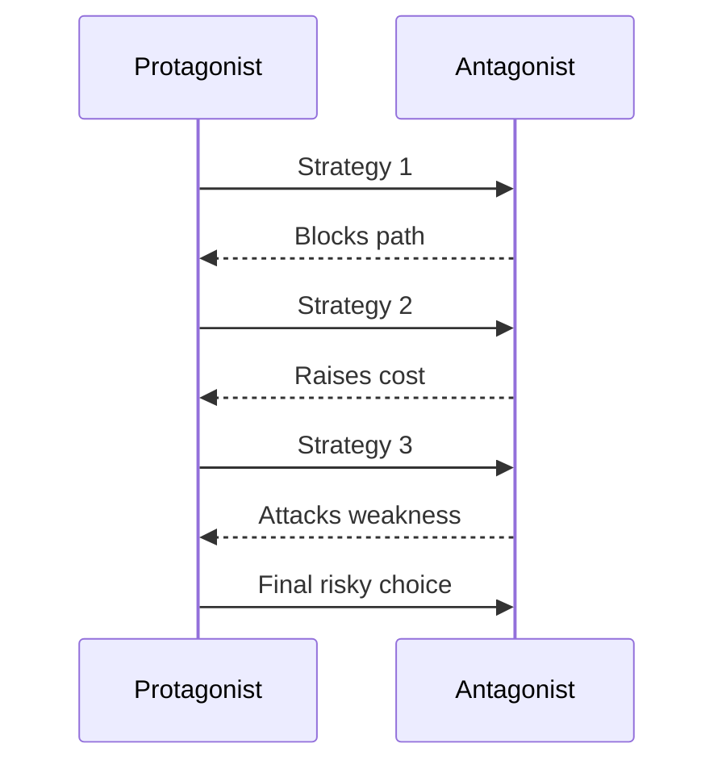
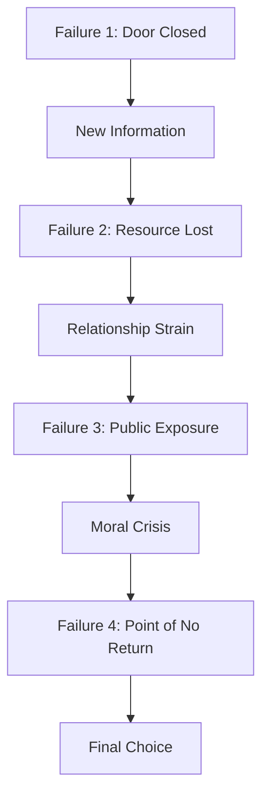
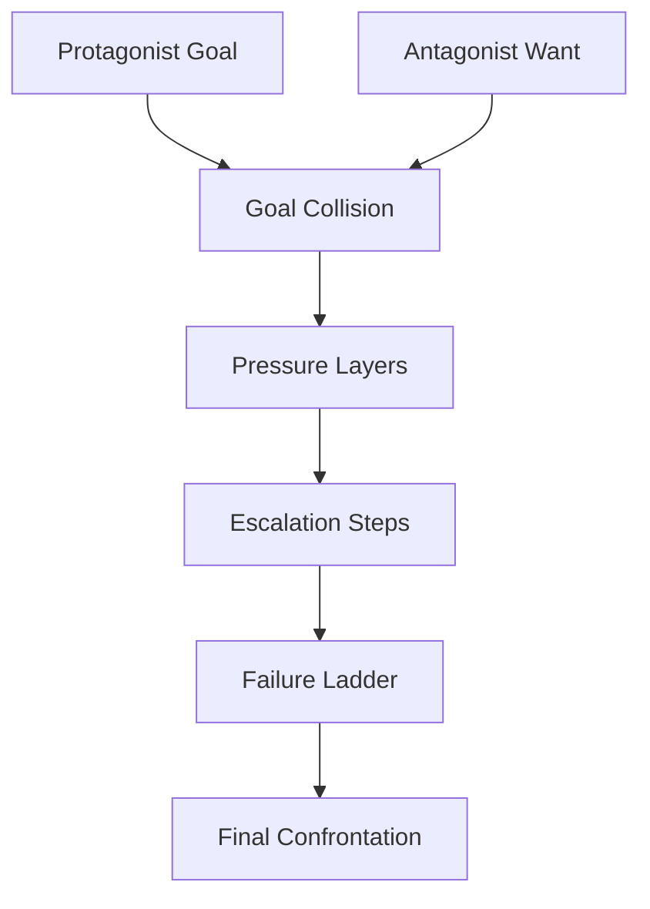
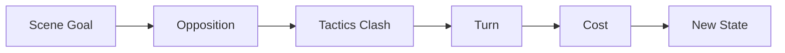
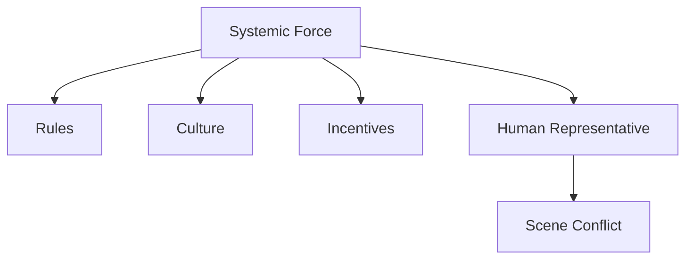

# learn-screenwriting-film-script-part-007.md

# Part 007 — Antagonis, Oposisi, dan Sistem Tekanan

> Seri: **Learn Screenwriting for Film Project — The First 20 Hours Approach**  
> Fokus: membangun antagonis dan sistem oposisi yang membuat cerita bergerak, karakter teruji, konflik meningkat, dan tema diperdebatkan secara dramatik.  
> Posisi dalam roadmap: setelah karakter utama didesain sebagai sistem keputusan, sekarang kita mendesain tekanan yang akan memaksa sistem itu berubah.

---

## Daftar Isi

1. [Tujuan Part Ini](#1-tujuan-part-ini)
2. [Hubungan Part Ini dengan Framework Josh Kaufman](#2-hubungan-part-ini-dengan-framework-josh-kaufman)
3. [Core Idea: Antagonis Bukan Sekadar Villain](#3-core-idea-antagonis-bukan-sekadar-villain)
4. [Mental Model untuk Software Engineer: Opposition System](#4-mental-model-untuk-software-engineer-opposition-system)
5. [Antagonis vs Oposisi vs Obstacle](#5-antagonis-vs-oposisi-vs-obstacle)
6. [Fungsi Antagonis dalam Naskah Film](#6-fungsi-antagonis-dalam-naskah-film)
7. [Jenis-Jenis Oposisi](#7-jenis-jenis-oposisi)
8. [Antagonis sebagai Pemegang Counter-Thesis](#8-antagonis-sebagai-pemegang-counter-thesis)
9. [Mendesain Antagonis yang Percaya Dirinya Benar](#9-mendesain-antagonis-yang-percaya-dirinya-benar)
10. [Antagonis sebagai Stress Test Protagonist](#10-antagonis-sebagai-stress-test-protagonist)
11. [Pressure Stack: Lapisan Tekanan Cerita](#11-pressure-stack-lapisan-tekanan-cerita)
12. [Escalation Model: Tekanan Harus Naik](#12-escalation-model-tekanan-harus-naik)
13. [Failure Ladder: Tangga Kegagalan yang Membentuk Cerita](#13-failure-ladder-tangga-kegagalan-yang-membentuk-cerita)
14. [Opposition Map: Memetakan Semua Force yang Melawan Tokoh Utama](#14-opposition-map-memetakan-semua-force-yang-melawan-tokoh-utama)
15. [Scene-Level Opposition: Setiap Scene Perlu Friksi](#15-scene-level-opposition-setiap-scene-perlu-friksi)
16. [Antagonis Langsung vs Antagonis Sistemik](#16-antagonis-langsung-vs-antagonis-sistemik)
17. [Antagonis Lembut: Lawan yang Tidak Terlihat Jahat](#17-antagonis-lembut-lawan-yang-tidak-terlihat-jahat)
18. [Antagonis Internal: Ketakutan, Rasa Bersalah, Trauma, Ego](#18-antagonis-internal-ketakutan-rasa-bersalah-trauma-ego)
19. [Relationship Antagonism: Ketika Orang Terdekat Menjadi Tekanan](#19-relationship-antagonism-ketika-orang-terdekat-menjadi-tekanan)
20. [Antagonis dan Genre](#20-antagonis-dan-genre)
21. [Budget-Aware Antagonism untuk Project Film](#21-budget-aware-antagonism-untuk-project-film)
22. [Antagonist Design Canvas](#22-antagonist-design-canvas)
23. [Opposition Test Suite](#23-opposition-test-suite)
24. [Anti-Pattern Antagonis Pemula](#24-anti-pattern-antagonis-pemula)
25. [Latihan 90 Menit: Mendesain Sistem Oposisi](#25-latihan-90-menit-mendesain-sistem-oposisi)
26. [Deliverable Part Ini](#26-deliverable-part-ini)
27. [Checklist Self-Correction](#27-checklist-self-correction)
28. [Kesimpulan](#28-kesimpulan)
29. [Preview Part Berikutnya](#29-preview-part-berikutnya)

---

# 1. Tujuan Part Ini

Di Part 006, kita memodelkan karakter sebagai **stateful decision system**:

- apa yang dia inginkan,
- apa yang dia butuhkan,
- apa flaw-nya,
- apa wound-nya,
- apa mask-nya,
- bagaimana dia berubah ketika ditekan.

Tetapi karakter tidak berubah hanya karena penulis ingin dia berubah.

Karakter berubah karena ada tekanan.

Tekanan itu datang dari:

- orang lain,
- institusi,
- lingkungan,
- waktu,
- uang,
- keluarga,
- rasa bersalah,
- cinta,
- penyakit,
- kekuasaan,
- hukum,
- tradisi,
- rahasia,
- ketakutan,
- atau dirinya sendiri.

Dalam screenwriting, tekanan itu kita sebut sebagai **oposisi**. Salah satu bentuknya adalah **antagonis**.

Target part ini adalah membuat Anda mampu mendesain antagonis dan sistem oposisi yang:

1. bukan sekadar “orang jahat”,
2. benar-benar menghalangi goal protagonist,
3. memaksa protagonist membuat keputusan sulit,
4. menguji flaw dan wound protagonist,
5. menaikkan konflik secara bertahap,
6. memperjelas tema cerita,
7. tetap feasible untuk project film,
8. dan membuat setiap scene punya friksi.

Setelah part ini, Anda harus punya dokumen kerja bernama:

```text
opposition-map.md
```

atau bagian khusus dalam project brief:

```text
## Opposition System
```

---

# 2. Hubungan Part Ini dengan Framework Josh Kaufman

Dalam pendekatan **The First 20 Hours**, kita tidak belajar screenwriting dengan cara membaca semua teori cerita sekaligus. Kita pecah skill besar menjadi sub-skill kecil yang paling berdampak.

Untuk menulis naskah film awal, salah satu sub-skill paling penting adalah:

> kemampuan menciptakan tekanan dramatik yang membuat karakter harus bertindak.

Tanpa oposisi, cerita menjadi datar.

Tanpa antagonisme, scene menjadi percakapan biasa.

Tanpa tekanan, karakter tidak punya alasan untuk berubah.

Dalam kerangka Kaufman:

| Elemen Kaufman | Penerapan di Part Ini |
|---|---|
| Deconstruct the skill | Memecah antagonisme menjadi goal collision, obstacle, pressure, stakes, escalation, dan counter-thesis |
| Learn enough to self-correct | Membuat test suite untuk mengecek apakah antagonis benar-benar bekerja |
| Remove practice barriers | Menyediakan template opposition map dan antagonist canvas |
| Practice deliberately | Latihan 90 menit membuat sistem oposisi untuk project film Anda |

Tujuan praktisnya bukan memahami semua tipe villain dalam sejarah sinema, tetapi cukup mampu menjawab:

```text
Siapa atau apa yang membuat perjalanan karakter utama menjadi sulit, mahal, memalukan, berbahaya, atau tidak mungkin?
```

---

# 3. Core Idea: Antagonis Bukan Sekadar Villain

Banyak penulis pemula menyamakan antagonis dengan villain.

Itu terlalu sempit.

**Villain** adalah karakter jahat atau destruktif.  
**Antagonis** adalah force yang menghalangi protagonist mencapai tujuannya.  
**Oposisi** adalah keseluruhan sistem tekanan yang melawan, membatasi, menguji, atau menggoda protagonist.

Artinya:

- Ibu yang protektif bisa menjadi antagonis.
- Sahabat yang benar tapi menyakitkan bisa menjadi antagonis.
- Kemiskinan bisa menjadi antagonis.
- Birokrasi bisa menjadi antagonis.
- Rasa bersalah bisa menjadi antagonis.
- Waktu bisa menjadi antagonis.
- Tradisi keluarga bisa menjadi antagonis.
- Cinta lama bisa menjadi antagonis.
- Ambisi protagonist sendiri bisa menjadi antagonis.

Antagonis tidak harus jahat.

Antagonis hanya perlu menciptakan **friksi terhadap goal protagonist**.

Contoh sederhana:

```text
Protagonist ingin kabur dari rumah.
Ayahnya ingin dia tetap tinggal.

Ayah tidak harus jahat.
Namun selama goal ayah bertabrakan dengan goal protagonist,
ayah berfungsi sebagai antagonistic force.
```

Core invariant:

```text
Jika tidak ada sesuatu yang secara aktif melawan keinginan protagonist,
cerita kehilangan mesin dramatiknya.
```

---

# 4. Mental Model untuk Software Engineer: Opposition System

Sebagai software engineer, Anda bisa membayangkan cerita sebagai sistem yang punya:

- actor,
- state,
- goal,
- constraint,
- event,
- transition,
- failure mode,
- side effect,
- feedback loop.

Protagonist adalah sistem yang mencoba mencapai target state.

Antagonis/oposisi adalah sistem lain yang:

- membatasi action space protagonist,
- mengubah cost dari pilihan protagonist,
- menutup jalan yang mudah,
- memaksa strategi baru,
- mengekspos bug internal protagonist,
- menaikkan stakes,
- dan menghasilkan state transition.

Diagram dasarnya:



Dalam software, test yang bagus bukan hanya memvalidasi happy path.

Test yang bagus memaksa sistem menghadapi:

- invalid input,
- race condition,
- timeout,
- permission error,
- partial failure,
- corrupted state,
- dependency outage.

Dalam cerita, antagonis yang bagus melakukan hal serupa.

Ia bukan hanya “mengganggu”. Ia melakukan stress test terhadap:

- keyakinan protagonist,
- moral protagonist,
- hubungan protagonist,
- rasa takut protagonist,
- strategi protagonist,
- identitas protagonist.

Dengan kata lain:

```text
Antagonis = chaos engineering untuk karakter.
```

---

# 5. Antagonis vs Oposisi vs Obstacle

Kita perlu membedakan tiga level konsep.

## 5.1 Antagonis

Antagonis adalah entitas atau force utama yang secara berulang dan signifikan melawan goal protagonist.

Bisa berupa:

- manusia,
- kelompok,
- institusi,
- kondisi sosial,
- bencana,
- monster,
- penyakit,
- waktu,
- atau konflik internal.

Contoh abstrak:

```text
Protagonist ingin mengungkap korupsi.
Antagonis: pejabat yang menjaga sistem korup itu tetap tertutup.
```

## 5.2 Oposisi

Oposisi adalah seluruh ekosistem tekanan yang menghalangi protagonist.

Oposisi bisa mencakup:

- antagonis utama,
- sekutu antagonis,
- aturan sistem,
- stigma sosial,
- keterbatasan resource,
- trauma internal,
- deadline,
- kelemahan protagonist,
- orang terdekat yang punya kepentingan berbeda.

Contoh:

```text
Goal: tokoh ingin membawa ibunya ke rumah sakit.
Oposisi:
- jalan banjir,
- ambulans tidak datang,
- uang kurang,
- adiknya menyalahkan dia,
- ibunya menolak dirawat,
- tokoh takut kembali ke rumah sakit karena trauma lama.
```

## 5.3 Obstacle

Obstacle adalah hambatan spesifik dalam satu fase cerita atau satu scene.

Contoh:

```text
Scene goal: tokoh ingin mengambil rekam medis.
Obstacle: petugas hanya memberi akses kepada keluarga resmi.
```

Relasinya:



Aturan praktis:

```text
Antagonis = lawan besar.
Oposisi = ekosistem tekanan.
Obstacle = hambatan lokal.
```

---

# 6. Fungsi Antagonis dalam Naskah Film

Antagonis punya beberapa fungsi dramatik.

## 6.1 Menghalangi Goal Protagonist

Fungsi paling dasar:

```text
Protagonist ingin X.
Antagonis membuat X sulit, mahal, memalukan, berbahaya, atau mustahil.
```

Jika protagonist bisa mendapatkan X tanpa hambatan, tidak ada drama.

## 6.2 Memaksa Protagonist Bertindak

Antagonis yang kuat tidak hanya menunggu.

Ia menciptakan tekanan sehingga protagonist tidak bisa diam.

Contoh:

```text
Buruk:
Tokoh ingin jujur kepada istrinya, tapi terus menunda.

Lebih kuat:
Orang yang tahu rahasianya memberi ultimatum: malam ini dia harus mengaku, atau rahasianya akan dibongkar di depan keluarga.
```

## 6.3 Menguji Flaw Protagonist

Antagonis harus menyerang titik lemah protagonist.

Jika protagonist punya flaw “selalu menghindari konflik”, maka oposisi harus menciptakan kondisi di mana menghindar justru membuat masalah lebih besar.

Jika protagonist punya flaw “ingin mengontrol semua hal”, maka oposisi harus membuat situasi yang tidak bisa dikontrol.

Jika protagonist punya flaw “tidak percaya siapa pun”, maka oposisi harus membuatnya hanya bisa selamat jika mempercayai seseorang.

## 6.4 Memperjelas Tema

Antagonis sering membawa worldview yang berlawanan dengan protagonist.

Contoh:

```text
Tema: apakah kebenaran lebih penting daripada keselamatan keluarga?

Protagonist: kebenaran harus dibuka.
Antagonis: keluarga harus dilindungi, bahkan dengan kebohongan.
```

Jika dua sisi sama-sama punya alasan manusiawi, cerita menjadi lebih kaya.

## 6.5 Meningkatkan Stakes

Antagonis menaikkan harga dari setiap pilihan protagonist.

Awalnya protagonist hanya bisa kehilangan pekerjaan.

Lalu kehilangan reputasi.

Lalu kehilangan keluarga.

Lalu kehilangan identitas moralnya.

## 6.6 Menutup Jalan Mudah

Cerita menjadi menarik ketika jalan mudah ditutup.

Antagonis yang bagus terus memaksa protagonist mengambil jalan yang lebih sulit.

```text
Protagonist ingin bicara baik-baik.
Antagonis menolak bertemu.

Protagonist ingin minta bantuan polisi.
Polisi ternyata bagian dari sistem.

Protagonist ingin kabur.
Adiknya ditahan sebagai leverage.
```

---

# 7. Jenis-Jenis Oposisi

Oposisi bisa datang dari banyak sumber.

## 7.1 Person Antagonist

Ini bentuk paling mudah dikenali.

Seseorang secara aktif menghalangi protagonist.

Contoh fungsi:

- mengejar,
- memanipulasi,
- mengancam,
- menyembunyikan informasi,
- menguji moral protagonist,
- merebut resource,
- memutus hubungan protagonist.

Pertanyaan desain:

```text
Apa yang dia inginkan?
Kenapa goal dia bertabrakan dengan protagonist?
Apa yang akan hilang jika dia gagal?
Kenapa dia percaya tindakannya masuk akal?
```

## 7.2 Institutional Antagonist

Antagonis berupa sistem:

- kantor,
- sekolah,
- pemerintah,
- rumah sakit,
- perusahaan,
- hukum,
- birokrasi,
- agama institusional,
- militer,
- keluarga besar,
- sistem kasta/kelas.

Kekuatan institutional antagonist adalah ia tidak bergantung pada satu orang.

Jika satu petugas baik, aturan tetap buruk.

Jika satu pegawai simpati, sistem tetap menolak.

Pertanyaan desain:

```text
Aturan apa yang membuat protagonist tidak bisa bergerak bebas?
Siapa wajah manusia dari sistem itu?
Apa konsekuensi melanggar sistem?
Apa yang membuat sistem itu sulit dilawan?
```

## 7.3 Environmental Antagonist

Oposisi berupa lingkungan:

- badai,
- banjir,
- gunung,
- laut,
- hutan,
- kota asing,
- ruang sempit,
- rumah tua,
- malam,
- panas ekstrem,
- dingin ekstrem.

Lingkungan menjadi antagonis ketika ia secara aktif membatasi pilihan protagonist.

Contoh:

```text
Tokoh ingin membawa bayi ke klinik.
Tetapi banjir membuat jalan utama tertutup,
listrik mati,
sinyal hilang,
dan tetangga sudah evakuasi.
```

## 7.4 Time Antagonist

Waktu adalah bentuk oposisi yang sangat kuat.

Contoh:

- deadline sidang,
- kereta terakhir,
- operasi sebelum jam tertentu,
- bom waktu,
- pernikahan besok pagi,
- pasien hanya punya beberapa jam,
- kesempatan hanya datang sekali.

Time pressure memperjelas urgency.

```text
Tanpa deadline: tokoh bisa menunda.
Dengan deadline: tokoh harus memilih sekarang.
```

## 7.5 Social Antagonist

Oposisi berasal dari norma sosial:

- malu,
- reputasi,
- gosip,
- ekspektasi keluarga,
- kelas sosial,
- stigma,
- gender role,
- tradisi,
- kewajiban agama/budaya,
- tekanan komunitas.

Social antagonist kuat untuk drama realistis karena sering tidak terlihat seperti musuh, tetapi dampaknya nyata.

## 7.6 Internal Antagonist

Lawan terbesar protagonist bisa berasal dari dalam:

- rasa takut,
- rasa bersalah,
- trauma,
- ego,
- addiction,
- self-loathing,
- denial,
- kebutuhan untuk disukai,
- kebutuhan mengontrol,
- ketidakmampuan percaya.

Internal antagonist tidak cukup hanya disebut. Ia harus tampak dalam keputusan konkret.

Buruk:

```text
Raka takut gagal.
```

Lebih filmik:

```text
Raka menghapus email pendaftaran kompetisi.
Lima detik kemudian, ia membuka trash.
Kursor berhenti di tombol Restore.
Ia menutup laptop.
```

## 7.7 Moral Antagonist

Oposisi berupa dilema nilai.

Contoh:

```text
Jika protagonist jujur, ibunya masuk penjara.
Jika protagonist berbohong, korban tidak mendapat keadilan.
```

Tidak ada pilihan bersih.

Ini jenis oposisi yang sangat berguna untuk cerita dewasa.

## 7.8 Supernatural / Monster Antagonist

Dalam horror, fantasy, sci-fi, atau supernatural thriller, antagonis bisa berupa:

- hantu,
- kutukan,
- alien,
- monster,
- entitas kosmik,
- teknologi otonom,
- makhluk misterius.

Tetapi tetap berlaku prinsip dasar:

```text
Monster yang baik bukan hanya menakutkan.
Monster harus menekan flaw, guilt, desire, atau moral wound protagonist.
```

---

# 8. Antagonis sebagai Pemegang Counter-Thesis

Di Part 005, kita membahas tema sebagai pertanyaan dramatik.

Antagonis sering menjadi pembawa jawaban berlawanan terhadap pertanyaan itu.

Contoh:

```text
Theme question:
Apakah kebenaran harus selalu dibuka?

Protagonist:
Ya, karena tanpa kebenaran tidak ada keadilan.

Antagonis:
Tidak, karena beberapa kebenaran hanya menghancurkan orang yang masih hidup.
```

Jika antagonist hanya jahat, tema menjadi dangkal.

Jika antagonist punya argument yang kuat, penonton dipaksa berpikir.

Diagram:



Antagonis yang kuat punya worldview.

Worldview itu menjawab:

```text
Menurut dia, dunia bekerja seperti apa?
Apa yang menurut dia benar?
Apa yang menurut dia lemah, bodoh, atau berbahaya dari protagonist?
Apa yang dia lindungi?
Apa yang dia takutkan?
```

Contoh worldview antagonis:

```text
Orang jujur hanya berguna sampai mereka membahayakan keluarga.
```

atau:

```text
Hukum tidak diciptakan untuk kebenaran; hukum diciptakan untuk menjaga ketertiban.
```

atau:

```text
Cinta adalah kemewahan untuk orang yang tidak punya tanggungan.
```

Worldview seperti ini membuat antagonis lebih dari sekadar hambatan mekanis.

Ia menjadi lawan ideologis.

---

# 9. Mendesain Antagonis yang Percaya Dirinya Benar

Antagonis yang dangkal berpikir:

```text
Aku jahat karena cerita butuh penjahat.
```

Antagonis yang kuat berpikir:

```text
Aku melakukan hal yang harus dilakukan, meskipun orang lain terlalu lemah untuk mengakuinya.
```

Ini bukan berarti penulis harus membenarkan tindakan antagonis. Tetapi penulis harus memahami logika internalnya.

## 9.1 Antagonis Butuh Want

Antagonis harus menginginkan sesuatu.

Bukan hanya:

```text
Dia ingin mengganggu protagonist.
```

Tetapi:

```text
Dia ingin mempertahankan rahasia keluarga.
Dia ingin menjaga jabatannya.
Dia ingin membuktikan bahwa caranya benar.
Dia ingin anaknya tetap aman.
Dia ingin sistem tetap stabil.
Dia ingin membalas penghinaan lama.
```

Want antagonis harus aktif.

## 9.2 Antagonis Butuh Stakes

Apa yang hilang jika antagonis gagal?

- uang,
- status,
- keselamatan,
- keluarga,
- nama baik,
- kontrol,
- iman,
- identitas,
- rasa benar,
- legacy.

Jika antagonis tidak punya sesuatu untuk dipertaruhkan, dia terasa seperti alat plot.

## 9.3 Antagonis Butuh Strategi

Antagonis yang kuat punya cara kerja.

Strateginya bisa:

- frontal,
- manipulatif,
- legalistik,
- emosional,
- pasif-agresif,
- sistemik,
- spiritual,
- teknologis,
- finansial,
- seksual,
- sosial.

Contoh:

```text
Antagonis bukan hanya “mengancam”.
Dia memotong akses protagonist ke uang,
menyebar rumor,
memakai aturan kantor,
dan membuat teman-teman protagonist takut membantu.
```

## 9.4 Antagonis Butuh Boundary

Antagonis yang menarik punya batas.

Ia mungkin tega berbohong, tetapi tidak tega membunuh.

Ia mungkin tega menghancurkan karier orang lain, tetapi tetap sayang pada anaknya.

Ia mungkin dingin di kantor, tetapi hancur ketika sendirian.

Boundary membuat antagonis terasa manusiawi.

Pertanyaan:

```text
Hal apa yang tidak akan dilakukan antagonis?
Apa yang akan membuat dia melewati batas itu?
```

---

# 10. Antagonis sebagai Stress Test Protagonist

Antagonis ideal bukan sembarang lawan.

Antagonis ideal adalah lawan yang paling tepat untuk protagonist tertentu.

Jika protagonist punya flaw A, antagonis harus menyerang A.

Jika protagonist punya wound B, antagonis harus menyentuh B.

Jika protagonist percaya lie C, antagonis harus membuat C terlihat masuk akal sekaligus berbahaya.

Contoh:

| Protagonist Flaw | Antagonistic Pressure yang Tepat |
|---|---|
| Menghindari konflik | Lawan yang terus memaksa konfrontasi publik |
| Ingin mengontrol semua | Situasi yang chaotic dan tidak bisa diprediksi |
| Tidak percaya orang | Misi yang hanya berhasil jika dia percaya partner |
| Terlalu ingin disukai | Komunitas yang menghukum kejujuran sosial |
| Perfeksionis | Deadline yang memaksa imperfect action |
| Terjebak masa lalu | Lawan yang membawa kembali orang/rahasia lama |
| Takut miskin | Pilihan moral yang membuatnya kehilangan uang |
| Haus pengakuan | Lawan yang menawarkan validasi dengan harga moral |

Diagram:



Pertanyaan kunci:

```text
Apa tekanan paling menyakitkan yang bisa diberikan kepada karakter ini,
tanpa terasa random dan tanpa mengkhianati genre/tone?
```

---

# 11. Pressure Stack: Lapisan Tekanan Cerita

Cerita yang kuat jarang hanya punya satu tekanan.

Biasanya tekanan datang berlapis.

Misalnya protagonist ingin membongkar kebenaran.

Pressure stack-nya bisa seperti ini:

```text
External pressure:
Antagonis mengejar dia.

Institutional pressure:
Polisi tidak mau menerima laporan.

Social pressure:
Keluarga menyuruh diam demi nama baik.

Economic pressure:
Dia bisa kehilangan pekerjaan.

Relational pressure:
Pasangannya takut ikut hancur.

Internal pressure:
Dia sendiri ragu apakah kebenaran ini layak dibuka.

Time pressure:
Besok dokumen bukti akan dimusnahkan.
```

Semakin banyak lapisan tekanan yang saling terkait, semakin kuat konflik.

Namun hati-hati: terlalu banyak tekanan yang tidak terhubung membuat cerita terasa berantakan.

Pressure stack harus punya satu pusat gravitasi:

```text
Semua tekanan harus berhubungan dengan goal utama atau tema utama.
```

Diagram:



---

# 12. Escalation Model: Tekanan Harus Naik

Konflik yang tidak meningkat akan terasa repetitif.

Banyak naskah pemula punya masalah seperti ini:

```text
Scene 1: tokoh berdebat.
Scene 2: tokoh berdebat lagi.
Scene 3: tokoh berdebat lagi.
Scene 4: tokoh berdebat lagi.
```

Masalahnya bukan debatnya.

Masalahnya tidak ada escalation.

Escalation berarti:

- risiko makin besar,
- pilihan makin sedikit,
- hubungan makin retak,
- informasi makin berbahaya,
- waktu makin sempit,
- protagonist makin terdesak,
- antagonis makin dekat menang,
- harga moral makin mahal.

## 12.1 Escalation by Stakes

Awalnya protagonist bisa kehilangan kenyamanan.

Lalu pekerjaan.

Lalu keluarga.

Lalu keselamatan.

Lalu jiwanya sendiri.

## 12.2 Escalation by Irreversibility

Awalnya keputusan masih bisa dibatalkan.

Lalu protagonist melakukan sesuatu yang tidak bisa ditarik kembali.

Contoh:

```text
Dia hanya membaca dokumen rahasia.
Lalu dia menyalinnya.
Lalu dia mengirimnya ke jurnalis.
Lalu dia muncul di video publik.
```

## 12.3 Escalation by Exposure

Rahasia makin dekat terbongkar.

Awalnya hanya satu orang tahu.

Lalu dua orang.

Lalu komunitas.

Lalu publik.

## 12.4 Escalation by Moral Cost

Awalnya protagonist hanya perlu berbohong kecil.

Lalu memfitnah.

Lalu mengkhianati teman.

Lalu mengorbankan orang tidak bersalah.

## 12.5 Escalation by Antagonist Adaptation

Antagonis tidak boleh statis.

Saat protagonist mengubah strategi, antagonis juga harus merespons.



---

# 13. Failure Ladder: Tangga Kegagalan yang Membentuk Cerita

Failure ladder adalah daftar kegagalan protagonist yang makin berat.

Kegagalan penting karena:

- membuat protagonist belajar,
- menaikkan stakes,
- menunjukkan kekuatan oposisi,
- membuat kemenangan akhir lebih berarti,
- memaksa protagonist meninggalkan strategi lama.

Contoh failure ladder:

```text
Goal utama:
Rani ingin menyelamatkan adiknya dari panti ilegal.

Failure 1:
Rani datang baik-baik, ditolak petugas.

Failure 2:
Rani membawa surat lama, ternyata tidak sah.

Failure 3:
Rani minta bantuan polisi, polisi mengenal pemilik panti.

Failure 4:
Rani menyusup malam hari, tertangkap kamera.

Failure 5:
Adiknya dipindahkan ke lokasi lain.

Failure 6:
Rani harus memilih: lapor media dan membahayakan adiknya, atau diam dan kehilangan jejak.
```

Setiap failure harus mengubah state cerita.

Buruk:

```text
Gagal, lalu mencoba lagi dengan cara sama.
```

Baik:

```text
Gagal, kehilangan resource, mendapatkan informasi baru, hubungan retak, strategi berubah.
```

Diagram:



---

# 14. Opposition Map: Memetakan Semua Force yang Melawan Tokoh Utama

Opposition map membantu Anda melihat cerita sebagai sistem tekanan, bukan daftar scene acak.

Template dasar:

```text
# Opposition Map

## Protagonist Goal
Apa yang ingin dicapai protagonist secara konkret?

## Main Antagonistic Force
Siapa/apa force utama yang melawan goal itu?

## Antagonist Want
Apa yang diinginkan antagonis?

## Goal Collision
Kenapa goal protagonist dan antagonis tidak bisa sama-sama berhasil?

## Stakes for Protagonist
Apa yang hilang jika protagonist gagal?

## Stakes for Antagonist
Apa yang hilang jika antagonis gagal?

## Pressure Layers
- External:
- Institutional:
- Social:
- Relational:
- Internal:
- Time:
- Economic:
- Moral:

## Escalation Steps
1.
2.
3.
4.
5.

## Failure Ladder
1.
2.
3.
4.
5.

## Final Confrontation
Apa bentuk benturan akhir antara protagonist dan oposisi?
```

Diagram opposition map:



---

# 15. Scene-Level Opposition: Setiap Scene Perlu Friksi

Tidak semua scene perlu antagonis utama muncul.

Tetapi hampir setiap scene perlu friksi.

Friksi bisa kecil:

- karakter tidak mau menjawab,
- pintu terkunci,
- sinyal hilang,
- orang lain mendengar,
- waktu hampir habis,
- satu karakter menyembunyikan informasi,
- karakter ingin pergi tapi ditahan,
- karakter ingin diam tapi dipaksa bicara.

Untuk setiap scene, tanyakan:

```text
Apa goal karakter di scene ini?
Apa yang menghalangi?
Apa yang berubah di akhir scene?
```

Jika jawabannya kosong, scene kemungkinan lemah.

## 15.1 Scene Opposition Template

```text
Scene:
Location:
Characters:

Scene Goal:
Opposition:
Tactic Protagonist:
Tactic Opposition:
Turn/Reversal:
Cost:
New State:
```

Contoh:

```text
Scene:
Ruang administrasi rumah sakit.

Scene Goal:
Dina ingin mendapatkan data pasien ayahnya.

Opposition:
Petugas menolak karena Dina bukan wali resmi.

Tactic Protagonist:
Memohon dan menunjukkan foto keluarga.

Tactic Opposition:
Bersembunyi di balik aturan.

Turn:
Petugas hampir luluh, tapi supervisor datang.

Cost:
Dina menyadari jalur resmi tidak akan berhasil.

New State:
Dina memutuskan mencari cara ilegal.
```

Diagram scene opposition:



---

# 16. Antagonis Langsung vs Antagonis Sistemik

## 16.1 Antagonis Langsung

Antagonis langsung punya wajah jelas.

Contoh:

```text
Seorang debt collector mengejar tokoh.
Seorang kepala sekolah menutup kasus.
Seorang mantan kekasih menyimpan rahasia.
Seorang polisi korup menghalangi laporan.
```

Kelebihan:

- mudah dipahami,
- konflik personal kuat,
- scene konfrontasi jelas,
- dialog bisa intens.

Risiko:

- menjadi karikatural,
- terlalu jahat tanpa alasan,
- semua masalah terasa bergantung pada satu orang.

## 16.2 Antagonis Sistemik

Antagonis sistemik adalah struktur yang membuat protagonist kalah bahkan tanpa satu villain besar.

Contoh:

```text
Sistem rumah sakit yang mahal.
Budaya keluarga yang menutup aib.
Industri kerja yang mengeksploitasi fresh graduate.
Birokrasi hukum yang lambat.
Kota yang tidak memberi ruang bagi orang miskin.
```

Kelebihan:

- terasa realistis,
- cocok untuk drama sosial,
- punya kedalaman tema,
- tidak hitam-putih.

Risiko:

- terlalu abstrak,
- kurang cinematic,
- tidak punya wajah untuk dikonfrontasi.

Solusinya:

```text
Berikan sistem itu wajah manusia.
```

Misalnya:

- petugas loket,
- kepala keluarga,
- HR manager,
- dokter,
- guru,
- tetangga,
- aparat,
- pemuka agama,
- jurnalis,
- admin kantor.

Diagram:



---

# 17. Antagonis Lembut: Lawan yang Tidak Terlihat Jahat

Tidak semua antagonis harus kasar, brutal, atau kejam.

Dalam banyak drama, antagonis paling menyakitkan justru orang yang tampak baik.

Contoh:

```text
Ibu yang berkata:
“Ibu cuma ingin kamu aman.”

Pasangan yang berkata:
“Aku dukung kamu, tapi jangan sampai keluarga kita hancur.”

Sahabat yang berkata:
“Jangan sok jadi pahlawan. Kamu tidak akan menang.”
```

Mereka tidak jahat.

Tetapi mereka menahan protagonist dari perubahan.

Antagonis lembut bekerja melalui:

- rasa bersalah,
- kasih sayang,
- nostalgia,
- kewajiban,
- ketergantungan,
- janji lama,
- rasa takut kehilangan.

Ini sering lebih kuat daripada villain yang terang-terangan jahat.

Karena protagonist tidak bisa sekadar “mengalahkan” mereka.

Dia harus memilih:

```text
menjadi dirinya sendiri
atau tetap menjaga kenyamanan relasi lama.
```

---

# 18. Antagonis Internal: Ketakutan, Rasa Bersalah, Trauma, Ego

Internal antagonist sangat penting untuk character arc.

Namun ada jebakan:

```text
Internal conflict tidak boleh hanya berada di kepala.
```

Film butuh manifestasi eksternal.

## 18.1 Fear as Antagonist

Contoh:

```text
Tokoh takut ditinggalkan.
```

Manifestasi filmik:

```text
Dia membaca pesan pasangannya, mengetik “kamu di mana?”, lalu menghapusnya.
Ia membuka lokasi live-sharing. Off.
Ia menatap pintu sampai lampu lorong mati.
```

## 18.2 Guilt as Antagonist

Rasa bersalah membuat tokoh:

- menghindari tempat tertentu,
- menolak kesempatan,
- menghukum diri sendiri,
- gagal menerima cinta,
- menyabotase keberhasilan.

## 18.3 Ego as Antagonist

Ego membuat tokoh:

- tidak mau minta maaf,
- tidak mau belajar,
- tidak mau minta bantuan,
- menolak bukti,
- menganggap semua orang salah.

## 18.4 Denial as Antagonist

Denial membuat tokoh:

- pura-pura tidak tahu,
- meminimalkan masalah,
- menyalahkan korban,
- menunda keputusan,
- hidup dalam versi cerita yang palsu.

Internal antagonist yang kuat biasanya dikawinkan dengan external antagonist.

Contoh:

```text
External antagonist:
Bos korup yang mengancam protagonist.

Internal antagonist:
Protagonist takut kehilangan status dan kembali miskin.

Akibat:
Bos bukan hanya berbahaya secara eksternal,
tetapi juga menggoda flaw internal protagonist.
```

---

# 19. Relationship Antagonism: Ketika Orang Terdekat Menjadi Tekanan

Relasi adalah sumber konflik paling kuat karena stakes-nya emosional.

Orang terdekat bisa menjadi oposisi karena:

- punya goal berbeda,
- takut protagonist berubah,
- bergantung pada protagonist,
- tahu kelemahan protagonist,
- menyimpan rahasia,
- punya luka lama,
- mewakili masa lalu protagonist.

Contoh relationship antagonism:

```text
Protagonist ingin pergi mengejar impian.
Adiknya ingin dia tetap tinggal karena hanya dia yang menjaga keluarga.

Tidak ada yang jahat.
Keduanya punya alasan valid.
Konflik menjadi hidup karena kedua pihak benar dari sudut pandangnya masing-masing.
```

Pertanyaan penting:

```text
Apa yang akan rusak dalam hubungan ini jika protagonist berubah?
```

Karena character arc sering mengancam sistem relasi lama.

Jika protagonist yang dulu selalu patuh mulai berkata tidak, orang yang terbiasa diuntungkan oleh kepatuhannya akan merasa diserang.

Itulah sumber drama.

---

# 20. Antagonis dan Genre

Jenis antagonis sangat dipengaruhi genre.

## 20.1 Drama

Antagonis sering berupa:

- keluarga,
- trauma,
- status sosial,
- masa lalu,
- penyakit,
- moral dilemma,
- institusi kecil.

Tekanan utama biasanya emosional.

## 20.2 Thriller

Antagonis harus aktif dan berbahaya.

Ciri:

- mengejar,
- menyembunyikan informasi,
- mengancam,
- membuat protagonist paranoid,
- menutup jalan keluar.

Tekanan utama: bahaya + waktu + informasi.

## 20.3 Horror

Antagonis bisa supernatural atau manusia, tetapi harus menyerang rasa aman.

Tekanan utama:

- fear,
- isolation,
- unknown,
- violation of normal world,
- guilt/curse/past sin.

## 20.4 Romance

Antagonis sering bukan orang ketiga jahat.

Oposisi bisa berupa:

- pride,
- timing,
- class difference,
- family expectation,
- emotional unavailability,
- fear of intimacy,
- past heartbreak.

Tekanan utama: vulnerability.

## 20.5 Comedy

Antagonisme sering berupa:

- embarrassment,
- social mismatch,
- misunderstanding,
- status game,
- escalating lies,
- rigid social rule.

Tekanan utama: loss of dignity.

## 20.6 Action

Antagonis biasanya punya:

- power,
- resource,
- army,
- weapon,
- plan,
- ticking clock.

Tekanan utama: physical danger + tactical escalation.

## 20.7 Mystery

Antagonis mengontrol informasi.

Oposisi utama:

- clue hidden,
- suspect lies,
- false lead,
- unreliable memory,
- institutional cover-up,
- time before evidence disappears.

Tekanan utama: epistemic uncertainty.

---

# 21. Budget-Aware Antagonism untuk Project Film

Karena target Anda adalah menulis naskah untuk project film, bukan hanya latihan teori, antagonis juga harus feasible.

Antagonis mahal:

- perang besar,
- ledakan,
- banyak figuran,
- monster CGI,
- kejar-kejaran mobil,
- lokasi publik ramai,
- banyak polisi/militer,
- crowd panic,
- bencana besar.

Antagonis murah tapi kuat:

- deadline,
- rahasia,
- hubungan keluarga,
- telepon ancaman,
- pintu terkunci,
- kontrak kerja,
- chat yang terbaca,
- rekaman suara,
- tetangga yang mendengar,
- satu petugas loket,
- satu meja makan,
- satu kamar rumah sakit,
- satu ruangan interogasi,
- satu orang yang menolak pergi.

Production-aware principle:

```text
Tekanan dramatik tidak harus mahal.
Tekanan harus spesifik, personal, dan irreversible.
```

Contoh transformasi murah:

```text
Versi mahal:
Tokoh dikejar polisi di jalan raya.

Versi lebih murah:
Tokoh bersembunyi di kamar mandi kantor.
Di luar, dua satpam memeriksa satu per satu ruangan.
Ponselnya bergetar: panggilan dari ibunya.
```

Keduanya menciptakan tekanan.

Yang kedua jauh lebih feasible untuk produksi kecil.

---

# 22. Antagonist Design Canvas

Gunakan canvas ini untuk antagonis utama.

```text
# Antagonist Design Canvas

## 1. Nama / Bentuk Antagonis
Siapa atau apa antagonis utama?

## 2. Role dalam Cerita
Apa fungsi antagonis terhadap protagonist?

## 3. Want
Apa yang antagonis inginkan secara konkret?

## 4. Need / Wound / Fear
Apa kebutuhan, luka, atau ketakutan antagonis?

## 5. Worldview
Apa keyakinan antagonis tentang dunia?

## 6. Counter-Thesis
Apa argumen antagonis yang berlawanan dengan protagonist?

## 7. Goal Collision
Kenapa goal antagonis dan protagonist tidak bisa sama-sama menang?

## 8. Resource / Power
Apa kekuatan antagonis?
- uang?
- status?
- informasi?
- hukum?
- kedekatan emosional?
- kekerasan?
- teknologi?
- jaringan sosial?

## 9. Tactic
Bagaimana cara antagonis menekan protagonist?

## 10. Boundary
Hal apa yang tidak akan dilakukan antagonis?
Apa yang bisa membuat dia melewati batas itu?

## 11. Escalation
Bagaimana tekanan dari antagonis meningkat?

## 12. Final Confrontation
Dalam bentuk apa benturan akhir terjadi?

## 13. Humanizing Detail
Detail apa yang membuat antagonis tidak satu dimensi?

## 14. Production Feasibility
Apakah antagonis ini bisa diwujudkan dengan budget, lokasi, dan aktor yang tersedia?
```

---

# 23. Opposition Test Suite

Sebagai software engineer, pikirkan ini seperti unit test untuk desain oposisi Anda.

## Test 1 — Goal Collision Test

```text
Apakah protagonist dan antagonis punya goal yang benar-benar bertabrakan?
```

Jika tidak, konflik akan terasa dipaksakan.

## Test 2 — Active Pressure Test

```text
Apakah antagonis/oposisi melakukan sesuatu yang membuat protagonist harus bereaksi?
```

Jika tidak, antagonis terlalu pasif.

## Test 3 — Personal Vulnerability Test

```text
Apakah tekanan antagonis menyentuh flaw, wound, fear, atau need protagonist?
```

Jika tidak, konflik hanya eksternal.

## Test 4 — Escalation Test

```text
Apakah tekanan meningkat dari awal ke akhir?
```

Jika tidak, cerita repetitif.

## Test 5 — Stakes Test

```text
Apakah jelas apa yang hilang jika protagonist gagal?
Apakah jelas apa yang hilang jika antagonis gagal?
```

Jika tidak, konflik terasa ringan.

## Test 6 — Thematic Test

```text
Apakah antagonis membawa pandangan dunia yang menantang tema cerita?
```

Jika tidak, antagonis hanya hambatan plot.

## Test 7 — Scene Utility Test

```text
Bisakah antagonis/oposisi menghasilkan scene konkret, bukan hanya ide abstrak?
```

Jika tidak, antagonis belum filmik.

## Test 8 — Feasibility Test

```text
Bisakah oposisi ini diproduksi dengan resource project film Anda?
```

Jika tidak, desain perlu disederhanakan.

---

# 24. Anti-Pattern Antagonis Pemula

## 24.1 Evil Because Evil

Antagonis jahat tanpa alasan internal.

Gejala:

- suka menyiksa karena plot butuh,
- tidak punya want,
- tidak punya stakes,
- tidak punya worldview.

Perbaikan:

```text
Berikan dia sesuatu yang dia lindungi,
sesuatu yang dia takut kehilangan,
dan argumen yang menurut dia benar.
```

## 24.2 Antagonis Pasif

Antagonis hanya muncul di awal dan akhir.

Gejala:

- protagonist bergerak tanpa tekanan,
- konflik tidak meningkat,
- antagonis terasa seperti simbol.

Perbaikan:

```text
Buat antagonis mengambil tindakan baru setiap kali protagonist maju.
```

## 24.3 Obstacle Random

Hambatan muncul tidak terhubung dengan tema atau goal.

Gejala:

```text
Tokoh mau ke rumah sakit.
Tiba-tiba dompet hilang.
Tiba-tiba hujan.
Tiba-tiba mantan datang.
Tiba-tiba polisi mengejar.
```

Semua bisa saja dipakai, tapi jika tidak terhubung, terasa acak.

Perbaikan:

```text
Semua obstacle harus berasal dari sistem tekanan yang sama
atau memperdalam konflik utama.
```

## 24.4 Antagonis Terlalu Bodoh

Antagonis membuat keputusan bodoh agar protagonist bisa menang.

Gejala:

- tidak memanfaatkan kekuatan sendiri,
- selalu menjelaskan rencana,
- membiarkan protagonist lolos tanpa alasan,
- tidak belajar dari kegagalan.

Perbaikan:

```text
Tulis antagonis sebagai orang yang juga ingin menang.
```

## 24.5 Antagonis Terlalu Kuat Tanpa Celah

Antagonis terlalu powerful sehingga kemenangan protagonist terasa mustahil atau deus ex machina.

Perbaikan:

```text
Berikan antagonis blind spot, boundary, flaw, atau dependency.
```

## 24.6 Antagonis Tidak Personal

Antagonis menghalangi protagonist, tetapi tidak menyentuh luka atau flaw protagonist.

Perbaikan:

```text
Hubungkan strategi antagonis dengan titik lemah protagonist.
```

## 24.7 Antagonis Hanya Menjelaskan Tema

Antagonis sering berkata panjang tentang filosofi, tetapi tidak menekan protagonist melalui tindakan.

Perbaikan:

```text
Biarkan worldview antagonis tampak melalui keputusan,
bukan pidato.
```

---

# 25. Latihan 90 Menit: Mendesain Sistem Oposisi

Latihan ini adalah deliberate practice untuk Part 007.

Jangan menunggu inspirasi sempurna. Gunakan project film Anda saat ini.

## 25.1 Menit 0–10 — Tulis Goal Protagonist

Jawab:

```text
Protagonist saya ingin...
Jika gagal, dia akan kehilangan...
Dia harus mencapainya sebelum...
```

Contoh:

```text
Dina ingin membuktikan bahwa ayahnya tidak bunuh diri.
Jika gagal, nama ayahnya hancur dan ibunya kehilangan rumah.
Dia harus membuktikannya sebelum pemakaman besok siang.
```

## 25.2 Menit 10–20 — Tentukan Main Antagonistic Force

Jawab:

```text
Force utama yang melawan protagonist adalah...
Force ini ingin...
Force ini melawan protagonist karena...
```

## 25.3 Menit 20–35 — Buat Goal Collision

Lengkapi:

```text
Protagonist menang jika...
Antagonis menang jika...
Keduanya tidak bisa menang bersamaan karena...
```

Contoh:

```text
Dina menang jika rekaman CCTV dibuka.
Kepala pabrik menang jika rekaman itu hilang.
Keduanya tidak bisa menang bersamaan karena rekaman itu menunjukkan kelalaian pabrik.
```

## 25.4 Menit 35–50 — Buat Pressure Stack

Isi minimal 5 lapisan:

```text
External pressure:
Institutional pressure:
Social pressure:
Relational pressure:
Internal pressure:
Time pressure:
Economic pressure:
Moral pressure:
```

Tidak harus semua ada, tetapi minimal 4 yang kuat.

## 25.5 Menit 50–65 — Buat Failure Ladder

Tulis 5 kegagalan yang makin berat:

```text
Failure 1:
Failure 2:
Failure 3:
Failure 4:
Failure 5:
```

Pastikan setiap failure mengubah state.

## 25.6 Menit 65–80 — Buat Antagonist Canvas Ringkas

Jawab:

```text
Want antagonis:
Fear antagonis:
Worldview antagonis:
Resource antagonis:
Tactic antagonis:
Boundary antagonis:
Humanizing detail:
```

## 25.7 Menit 80–90 — Jalankan Opposition Test Suite

Beri skor 1–5:

| Test | Skor |
|---|---:|
| Goal collision jelas |  |
| Antagonis aktif |  |
| Tekanan menyentuh flaw protagonist |  |
| Stakes jelas |  |
| Escalation terasa naik |  |
| Ada counter-thesis |  |
| Bisa menghasilkan scene konkret |  |
| Feasible diproduksi |  |

Jika skor total di bawah 28 dari 40, desain oposisi masih perlu diperbaiki.

---

# 26. Deliverable Part Ini

Setelah menyelesaikan Part 007, Anda harus punya:

```text
01_project-brief.md
02_logline.md
03_theme.md
04_character-kernel.md
05_opposition-map.md
```

Isi minimal `05_opposition-map.md`:

```text
# Opposition Map

## Protagonist Goal

## Main Antagonistic Force

## Antagonist Want

## Goal Collision

## Stakes

## Pressure Stack

## Escalation Steps

## Failure Ladder

## Final Confrontation

## Opposition Test Score
```

---

# 27. Checklist Self-Correction

Gunakan checklist ini sebelum lanjut ke Part 008.

## 27.1 Antagonis Utama

- [ ] Saya tahu siapa/apa antagonistic force utama.
- [ ] Antagonis tidak hanya “jahat”, tetapi punya want.
- [ ] Antagonis punya sesuatu yang dipertaruhkan.
- [ ] Antagonis punya worldview.
- [ ] Antagonis punya strategi/taktik.
- [ ] Antagonis punya batas atau blind spot.

## 27.2 Goal Collision

- [ ] Goal protagonist jelas.
- [ ] Goal antagonis jelas.
- [ ] Keduanya tidak bisa menang bersamaan.
- [ ] Benturan goal tidak terasa dipaksakan.

## 27.3 Tekanan

- [ ] Ada tekanan eksternal.
- [ ] Ada tekanan internal.
- [ ] Ada tekanan relasional atau sosial.
- [ ] Ada urgency atau time pressure.
- [ ] Tekanan menyentuh flaw/wound protagonist.

## 27.4 Escalation

- [ ] Hambatan tidak repetitif.
- [ ] Setiap kegagalan mengubah state cerita.
- [ ] Stakes naik.
- [ ] Pilihan protagonist makin sulit.
- [ ] Ada point of no return.

## 27.5 Scene Potential

- [ ] Oposisi bisa menghasilkan scene konkret.
- [ ] Tidak semua konflik hanya dijelaskan dalam dialog.
- [ ] Ada konfrontasi visual atau tindakan.
- [ ] Ada scene di mana protagonist kalah.
- [ ] Ada scene di mana protagonist dipaksa memilih.

## 27.6 Feasibility

- [ ] Oposisi bisa diwujudkan dengan resource project.
- [ ] Tidak bergantung pada set-piece mahal kecuali memang tersedia.
- [ ] Jumlah karakter/lokasi masih masuk akal.
- [ ] Tekanan dramatik tetap kuat walau produksi sederhana.

---

# 28. Kesimpulan

Antagonis bukan sekadar orang jahat.

Antagonis adalah bagian dari sistem tekanan yang membuat cerita bergerak.

Dalam naskah film, oposisi yang baik harus:

- bertabrakan dengan goal protagonist,
- aktif menekan,
- menyentuh flaw/wound protagonist,
- menaikkan stakes,
- menciptakan failure ladder,
- memaksa pilihan sulit,
- memperjelas tema,
- dan menghasilkan scene konkret.

Untuk cara pikir software engineer, pahami antagonis sebagai:

```text
stress test untuk character system.
```

Jika karakter adalah state machine, antagonis adalah rangkaian event, constraint, dan fault injection yang memaksa state transition.

Cerita menjadi menarik bukan karena protagonist ingin sesuatu saja.

Cerita menjadi menarik karena sesuatu yang kuat, spesifik, dan bermakna menghalanginya.

---

# 29. Preview Part Berikutnya

Part berikutnya:

```text
learn-screenwriting-film-script-part-008.md
```

Judul:

```text
Part 008 — Konflik: Engine Utama Naskah Film
```

Kita akan masuk lebih dalam ke konflik sebagai mesin utama cerita:

- conflict vs argument,
- conflict vs activity,
- internal conflict,
- interpersonal conflict,
- situational conflict,
- moral conflict,
- stakes,
- urgency,
- irreversibility,
- escalation,
- dan cara mendeteksi scene tanpa konflik.

Part 007 belum bagian terakhir. Seri masih berlanjut.
