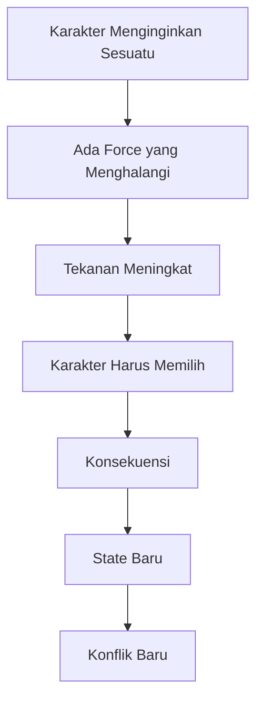
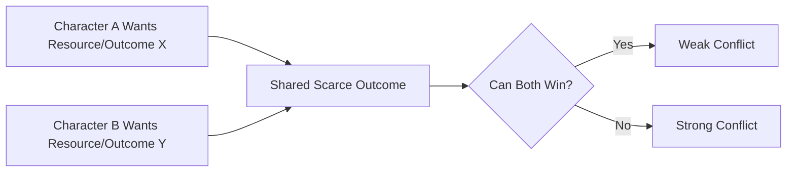
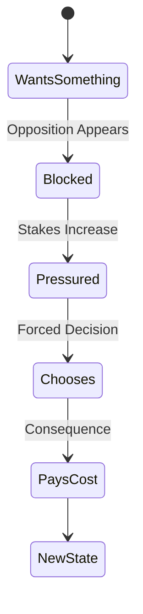
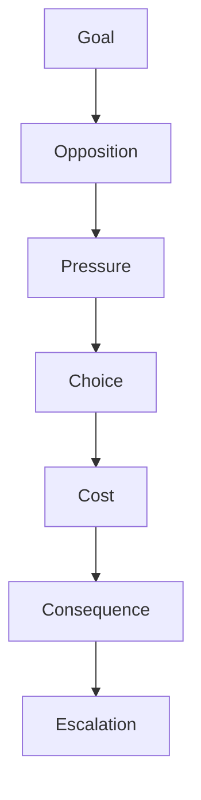
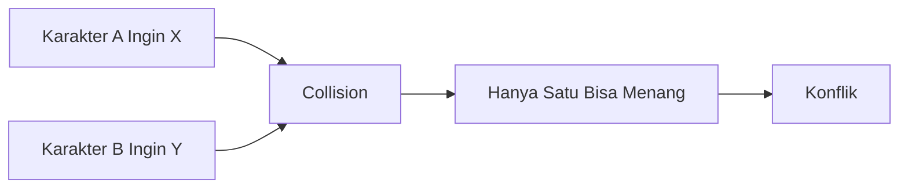
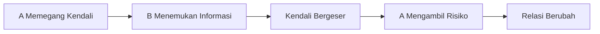
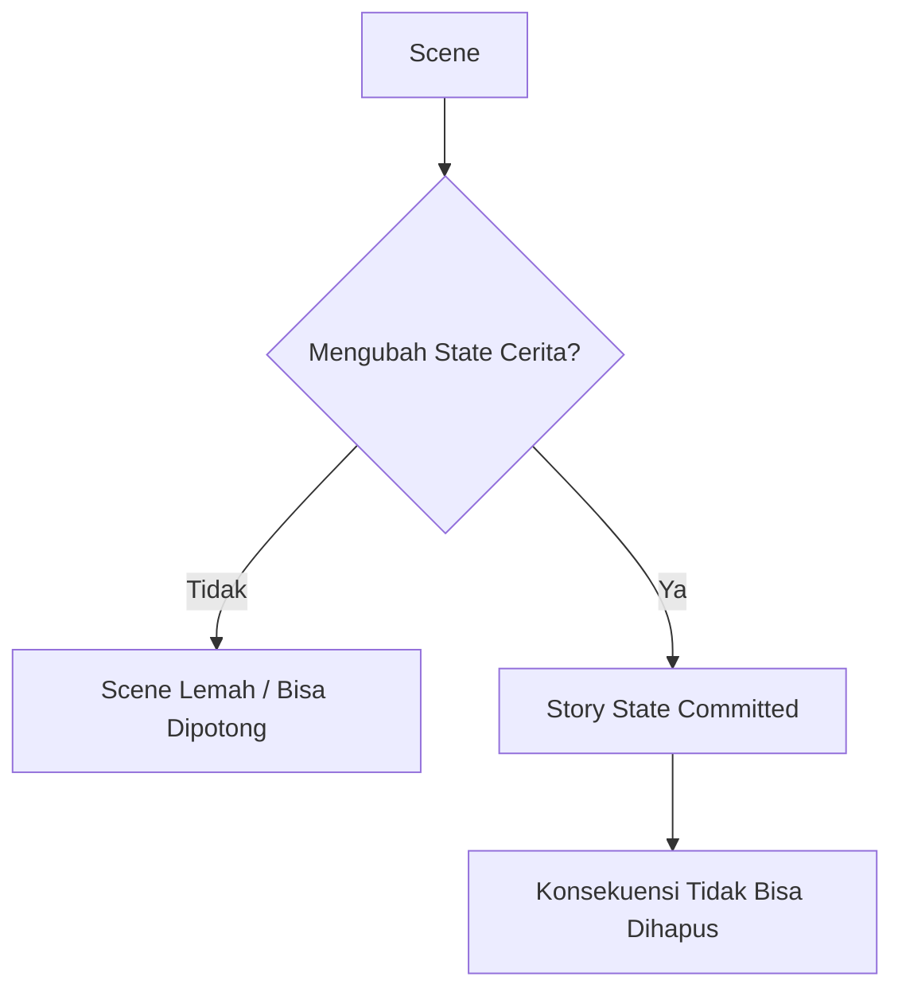
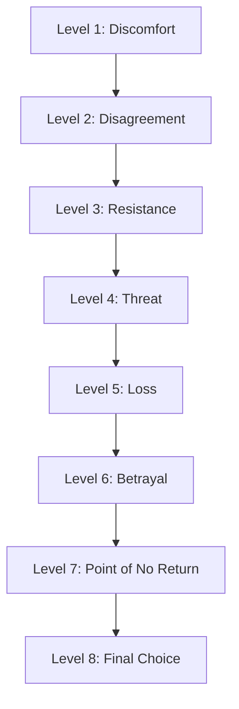
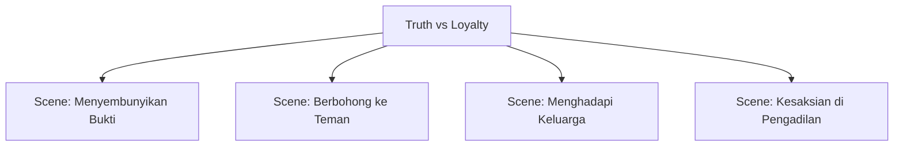
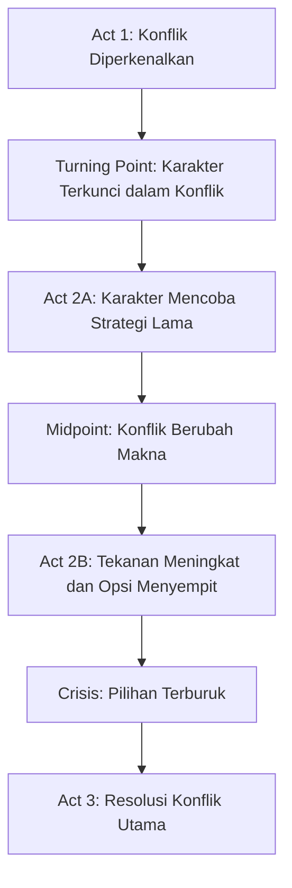

# learn-screenwriting-film-script-part-008.md

# Part 008 — Konflik: Engine Utama Naskah Film

> Seri: **Learn Screenwriting for Film Project — The First 20 Hours Approach**  
> Framework utama: **The First 20 Hours — Josh Kaufman**  
> Fokus part ini: memahami, mendesain, menguji, dan memperbaiki konflik sebagai mesin utama naskah film.

---

## Daftar Isi

1. [Tujuan Part 008](#1-tujuan-part-008)
2. [Kenapa Konflik Adalah Engine, Bukan Ornamen](#2-kenapa-konflik-adalah-engine-bukan-ornamen)
3. [Definisi Konflik yang Lebih Presisi](#3-definisi-konflik-yang-lebih-presisi)
4. [Mental Model untuk Software Engineer](#4-mental-model-untuk-software-engineer)
5. [Conflict vs Problem vs Obstacle vs Argument vs Action](#5-conflict-vs-problem-vs-obstacle-vs-argument-vs-action)
6. [Anatomi Konflik Dramatis](#6-anatomi-konflik-dramatis)
7. [Jenis-Jenis Konflik dalam Film](#7-jenis-jenis-konflik-dalam-film)
8. [Want Collision: Dua Keinginan yang Tidak Bisa Sama-Sama Menang](#8-want-collision-dua-keinginan-yang-tidak-bisa-sama-sama-menang)
9. [Value Conflict: Benturan Nilai, Bukan Sekadar Benturan Tindakan](#9-value-conflict-benturan-nilai-bukan-sekadar-benturan-tindakan)
10. [Internal Conflict: Konflik di Dalam Diri Karakter](#10-internal-conflict-konflik-di-dalam-diri-karakter)
11. [Interpersonal Conflict: Konflik Antar-Karakter](#11-interpersonal-conflict-konflik-antar-karakter)
12. [Situational Conflict: Karakter Melawan Kondisi](#12-situational-conflict-karakter-melawan-kondisi)
13. [Moral Conflict: Ketika Semua Pilihan Punya Dosa](#13-moral-conflict-ketika-semua-pilihan-punya-dosa)
14. [Systemic Conflict: Karakter Melawan Sistem](#14-systemic-conflict-karakter-melawan-sistem)
15. [Stakes: Kenapa Konflik Ini Penting](#15-stakes-kenapa-konflik-ini-penting)
16. [Urgency: Kenapa Harus Sekarang](#16-urgency-kenapa-harus-sekarang)
17. [Irreversibility: Kenapa Pilihan Tidak Bisa Ditarik Lagi](#17-irreversibility-kenapa-pilihan-tidak-bisa-ditarik-lagi)
18. [Escalation: Kenapa Konflik Harus Naik](#18-escalation-kenapa-konflik-harus-naik)
19. [Conflict Ladder: Tangga Eskalasi Konflik](#19-conflict-ladder-tangga-eskalasi-konflik)
20. [Conflict Matrix: Alat Mendesain Benturan](#20-conflict-matrix-alat-mendesain-benturan)
21. [Scene Conflict: Konflik pada Level Adegan](#21-scene-conflict-konflik-pada-level-adegan)
22. [Story Conflict: Konflik pada Level Cerita Utuh](#22-story-conflict-konflik-pada-level-cerita-utuh)
23. [Subtext Conflict: Konflik yang Tidak Diucapkan](#23-subtext-conflict-konflik-yang-tidak-diucapkan)
24. [Konflik dan Genre](#24-konflik-dan-genre)
25. [Konflik dan Karakter Pasif](#25-konflik-dan-karakter-pasif)
26. [Konflik dan Tema](#26-konflik-dan-tema)
27. [Konflik dan Struktur](#27-konflik-dan-struktur)
28. [Debugging Konflik Lemah](#28-debugging-konflik-lemah)
29. [Anti-Pattern Konflik Pemula](#29-anti-pattern-konflik-pemula)
30. [Latihan 20 Jam — Conflict Sprint](#30-latihan-20-jam--conflict-sprint)
31. [Template Conflict Design Canvas](#31-template-conflict-design-canvas)
32. [Checklist Self-Correction](#32-checklist-self-correction)
33. [Ringkasan Part 008](#33-ringkasan-part-008)
34. [Output yang Harus Dihasilkan](#34-output-yang-harus-dihasilkan)
35. [Transisi ke Part 009](#35-transisi-ke-part-009)

---

# 1. Tujuan Part 008

Tujuan bagian ini adalah membuat kamu memahami bahwa **konflik adalah mesin eksekusi cerita**.

Bukan sekadar:

- tokoh bertengkar,
- ada masalah,
- ada musuh,
- ada kejadian buruk,
- ada adegan dramatis,
- ada tangisan,
- ada aksi kejar-kejaran.

Konflik yang kuat berarti:

> Ada dua atau lebih force yang saling bertentangan, sama-sama punya alasan untuk bertahan, dan tidak bisa diselesaikan tanpa biaya.

Dalam naskah film, konflik adalah mekanisme yang membuat karakter:

1. menginginkan sesuatu,
2. terhalang,
3. mengambil keputusan,
4. membayar konsekuensi,
5. berubah atau gagal berubah.

Part ini akan membantu kamu mendesain konflik dari level **premis**, **karakter**, **scene**, sampai **struktur cerita**.

Setelah menyelesaikan part ini, kamu harus mampu:

- membedakan konflik asli dan masalah palsu,
- mendesain konflik internal, interpersonal, situasional, moral, dan sistemik,
- menaikkan stakes dan urgency,
- menghindari scene datar,
- membuat conflict matrix,
- memperbaiki naskah yang terasa lambat, hambar, atau tidak punya tekanan.

---

# 2. Kenapa Konflik Adalah Engine, Bukan Ornamen

Banyak penulis pemula menganggap konflik sebagai “bumbu”.

Mereka menulis cerita seperti ini:

```text
Ada karakter menarik.
Ada dunia menarik.
Ada masa lalu sedih.
Ada dialog puitis.
Ada ending emosional.
```

Tapi ketika dibaca, naskahnya terasa datar.

Kenapa?

Karena tidak ada force yang menekan karakter untuk bergerak.

Film butuh gerak. Gerak dalam film bukan hanya gerak fisik, tetapi gerak dramatik:

- informasi berubah,
- hubungan berubah,
- pilihan berubah,
- posisi kekuasaan berubah,
- risiko berubah,
- keyakinan berubah,
- masa depan karakter berubah.

Konflik adalah engine karena konflik menciptakan **tekanan**.

Tekanan menciptakan **pilihan**.

Pilihan menciptakan **konsekuensi**.

Konsekuensi menciptakan **cerita**.



Tanpa konflik, scene hanya menjadi laporan.

Dengan konflik, scene menjadi peristiwa.

---

# 3. Definisi Konflik yang Lebih Presisi

Definisi sederhana:

> Konflik adalah benturan antara dua keinginan, nilai, kebutuhan, atau force yang tidak bisa sama-sama terpenuhi.

Definisi lebih teknis:

> Konflik terjadi ketika sebuah karakter memiliki tujuan, tetapi ada force aktif yang mencegah tujuan itu tercapai, sehingga karakter harus membuat keputusan berbiaya.

Komponen wajib konflik:

| Komponen | Pertanyaan |
|---|---|
| Desire | Apa yang karakter inginkan? |
| Opposition | Siapa/apa yang menghalangi? |
| Incompatibility | Kenapa dua sisi ini tidak bisa sama-sama menang? |
| Stakes | Apa yang hilang kalau gagal? |
| Urgency | Kenapa harus diselesaikan sekarang? |
| Choice | Keputusan sulit apa yang harus diambil? |
| Cost | Harga apa yang harus dibayar? |
| Consequence | Apa yang berubah setelah konflik? |

Konflik bukan hanya:

```text
A marah kepada B.
```

Konflik yang lebih kuat:

```text
A ingin B jujur malam ini sebelum sidang besok pagi,
tetapi B tahu kejujuran itu akan menghancurkan keluarga mereka.
```

Di sini ada:

- desire A: kebenaran,
- desire B: perlindungan keluarga,
- urgency: sidang besok,
- stakes: keluarga/hukum/reputasi,
- incompatibility: kebenaran dan perlindungan tidak bisa berjalan bersamaan,
- cost: siapa pun bicara, ada yang hancur.

---

# 4. Mental Model untuk Software Engineer

Sebagai software engineer, kamu bisa memodelkan konflik seperti **contention dalam distributed system**.

Beberapa entitas mengakses resource terbatas.

Masing-masing punya tujuan.

Tidak semua tujuan bisa disatisfy sekaligus.

Perlu arbitration.

Dalam cerita, arbitration itu bukan scheduler; arbitration terjadi lewat pilihan karakter, tekanan moral, dan konsekuensi.

## 4.1 Konflik sebagai Resource Contention



Contoh:

```text
Dua saudara ingin menjual rumah warisan.
```

Belum tentu konflik.

Lebih kuat:

```text
Kakak ingin menjual rumah warisan untuk membayar operasi anaknya.
Adik ingin mempertahankan rumah itu karena di sanalah bukti kematian ibu mereka tersembunyi.
```

Resource-nya bukan hanya rumah.

Resource dramatiknya:

- uang,
- masa lalu,
- kebenaran,
- keluarga,
- keselamatan anak,
- identitas.

## 4.2 Konflik sebagai State Transition

Karakter masuk ke scene dengan state tertentu dan keluar dengan state berubah.



Kalau scene tidak mengubah state, kemungkinan scene itu lemah.

## 4.3 Konflik sebagai Failed Happy Path

Dalam software, happy path adalah flow ideal.

Dalam film, happy path biasanya harus gagal.

```text
Karakter ingin X.
Ia mencoba cara A.
Cara A gagal.
Ia mencoba cara B.
Cara B membuat masalah lebih besar.
Ia mencoba cara C.
Cara C memaksanya mengorbankan sesuatu.
```

Konflik membuat cerita keluar dari happy path.

---

# 5. Conflict vs Problem vs Obstacle vs Argument vs Action

Istilah ini sering bercampur. Kita perlu bedakan.

## 5.1 Problem

Problem adalah kondisi tidak ideal.

Contoh:

```text
Rina kehilangan pekerjaan.
```

Itu problem, belum tentu konflik.

Menjadi konflik jika:

```text
Rina harus mendapatkan pekerjaan baru dalam 24 jam agar hak asuh anaknya tidak jatuh ke mantan suaminya.
```

Sekarang ada:

- deadline,
- stakes,
- opposing force,
- consequence.

## 5.2 Obstacle

Obstacle adalah penghalang.

Contoh:

```text
Jalan ditutup banjir.
```

Obstacle menjadi konflik jika karakter punya tujuan yang terancam:

```text
Jalan ditutup banjir, sementara dokter desa harus membawa vaksin terakhir sebelum listrik klinik mati.
```

## 5.3 Argument

Argument adalah pertukaran pendapat.

Bukan semua argument adalah konflik dramatis.

Buruk:

```text
A dan B berdebat tentang politik selama 5 halaman.
```

Lebih kuat:

```text
A harus meyakinkan B untuk membuka pintu perlindungan warga.
B menolak karena kalau pintu dibuka, anaknya yang terinfeksi akan dibunuh massa.
```

Argument menjadi konflik ketika ada objective, stakes, dan perubahan posisi.

## 5.4 Action

Action bukan otomatis konflik.

Kejar-kejaran bisa membosankan jika tidak ada stakes emosional.

Contoh lemah:

```text
Polisi mengejar pencuri.
```

Contoh lebih kuat:

```text
Polisi mengejar anaknya sendiri yang mencuri obat ilegal untuk menyelamatkan ibunya.
```

Action menjadi konflik ketika ada dilema, biaya, dan relasi.

## 5.5 Conflict

Conflict adalah benturan aktif yang memaksa pilihan.

```text
A ingin menyelamatkan X.
B ingin mencegah A karena menyelamatkan X akan menghancurkan Y.
Tidak ada solusi bersih.
```

---

# 6. Anatomi Konflik Dramatis

Konflik dramatik punya anatomi seperti ini:



Mari kita bedah.

## 6.1 Goal

Karakter harus menginginkan sesuatu yang spesifik.

Lemah:

```text
Ia ingin bahagia.
```

Lebih kuat:

```text
Ia ingin mendapatkan tanda tangan ayahnya malam ini agar bisa menjual tanah keluarga besok pagi.
```

Goal yang kuat biasanya:

- konkret,
- observable,
- punya deadline,
- bisa gagal,
- punya konsekuensi.

## 6.2 Opposition

Opposition harus aktif atau setidaknya memberi resistensi nyata.

Lemah:

```text
Ia ingin pergi, tapi sedih.
```

Lebih kuat:

```text
Ia ingin pergi, tapi ibunya menyembunyikan paspornya karena takut ditinggalkan.
```

## 6.3 Pressure

Pressure adalah meningkatnya biaya kalau konflik tidak diselesaikan.

Contoh:

```text
Semakin lama ia menunggu, semakin dekat pesawatnya berangkat.
```

## 6.4 Choice

Konflik memuncak ketika karakter harus memilih.

Pilihan kuat biasanya bukan antara baik dan buruk, tapi antara:

- benar vs setia,
- aman vs jujur,
- cinta vs martabat,
- keluarga vs prinsip,
- hidup vs identitas,
- masa depan vs masa lalu.

## 6.5 Cost

Jika pilihan tidak punya cost, konflik terasa ringan.

Cost bisa berupa:

- kehilangan uang,
- kehilangan relasi,
- kehilangan reputasi,
- kehilangan kesempatan,
- kehilangan keselamatan,
- kehilangan ilusi tentang diri sendiri.

## 6.6 Consequence

Konflik harus meninggalkan jejak.

Kalau setelah scene semua kembali sama, scene terasa disposable.

Pertanyaan wajib:

> Setelah konflik ini, apa yang tidak bisa kembali seperti semula?

---

# 7. Jenis-Jenis Konflik dalam Film

Konflik bisa muncul pada beberapa level.

| Jenis Konflik | Bentuk | Contoh Pertanyaan |
|---|---|---|
| Internal | Karakter vs dirinya sendiri | Apa yang ia inginkan tetapi takut akui? |
| Interpersonal | Karakter vs karakter lain | Siapa yang menghalangi keinginannya? |
| Situational | Karakter vs kondisi | Situasi apa yang membuat pilihan sulit? |
| Moral | Karakter vs nilai | Prinsip mana yang harus dikorbankan? |
| Systemic | Karakter vs institusi/sistem | Sistem apa yang membuat jalan benar menjadi mustahil? |
| Environmental | Karakter vs alam/ruang | Lingkungan apa yang menekan tubuh dan keputusan? |
| Temporal | Karakter vs waktu | Apa deadline-nya? |
| Social | Karakter vs ekspektasi sosial | Norma apa yang menghukum karakter? |

Film yang kuat sering menggabungkan beberapa level konflik sekaligus.

Contoh:

```text
Seorang dokter desa harus menyelamatkan pasien kriminal yang pernah membunuh adiknya,
sementara warga mengepung klinik dan polisi terlambat datang.
```

Konflik:

- internal: dendam vs sumpah dokter,
- interpersonal: dokter vs pasien,
- social: dokter vs warga,
- systemic: polisi tidak hadir,
- temporal: pasien akan mati,
- moral: menyelamatkan orang jahat atau membiarkan mati.

---

# 8. Want Collision: Dua Keinginan yang Tidak Bisa Sama-Sama Menang

Konflik paling dasar adalah collision antar-want.



## 8.1 Contoh Lemah

```text
A ingin pergi.
B tidak ingin A pergi.
```

Ini masih umum.

## 8.2 Contoh Lebih Kuat

```text
A ingin pergi malam ini untuk mengikuti audisi terakhir hidupnya.
B, ibunya, tidak ingin A pergi karena hasil lab menunjukkan ayah A mungkin tidak bertahan sampai pagi.
```

Kenapa lebih kuat?

Karena dua keinginan itu legitimate.

A tidak egois sepenuhnya.

B tidak jahat sepenuhnya.

Keduanya benar dari posisi masing-masing.

## 8.3 Kunci Want Collision

Konflik lebih kuat ketika:

1. kedua sisi punya alasan benar,
2. kedua sisi punya risiko nyata,
3. kompromi tidak mudah,
4. deadline mendekat,
5. pilihan akan mengubah relasi.

## 8.4 Pola Want Collision

```text
A wants X because P.
B wants Y because Q.
X and Y cannot both happen because R.
If A loses, cost A.
If B loses, cost B.
```

Contoh:

```text
Maya ingin menjual rumah karena butuh uang operasi anaknya.
Dimas ingin mempertahankan rumah karena ayah mereka dikubur diam-diam di halaman belakang.
Rumah tidak bisa dijual tanpa membongkar rahasia keluarga.
Jika Maya kalah, anaknya terancam.
Jika Dimas kalah, rahasia pembunuhan terbuka.
```

---

# 9. Value Conflict: Benturan Nilai, Bukan Sekadar Benturan Tindakan

Konflik luar sering terasa dangkal jika tidak berakar pada konflik nilai.

Contoh tindakan:

```text
A ingin membuka pintu.
B ingin menutup pintu.
```

Masih datar.

Tambahkan nilai:

```text
A ingin membuka pintu karena percaya manusia harus ditolong meski berisiko.
B ingin menutup pintu karena percaya keluarga harus dilindungi lebih dulu.
```

Sekarang konflik bukan tentang pintu.

Konfliknya tentang:

- compassion vs protection,
- risk vs safety,
- public duty vs private loyalty.

## 9.1 Value Pair yang Sering Kuat

| Nilai A | Nilai B |
|---|---|
| Kebenaran | Kesetiaan |
| Kebebasan | Keamanan |
| Cinta | Martabat |
| Ambisi | Keluarga |
| Keadilan | Pengampunan |
| Tradisi | Perubahan |
| Bertahan hidup | Integritas |
| Individualitas | Penerimaan sosial |
| Iman | Bukti |
| Balas dendam | Penyembuhan |

## 9.2 Cara Menemukan Value Conflict

Tanya:

1. Karakter percaya apa?
2. Lawannya percaya apa?
3. Kenapa keduanya masuk akal?
4. Apa yang terjadi jika salah satu nilai menang?
5. Apa yang harus dikorbankan?

## 9.3 Value Conflict Membuat Antagonis Lebih Kuat

Antagonis buruk:

```text
Dia jahat karena ingin kekuasaan.
```

Antagonis lebih kuat:

```text
Dia percaya kekuasaan terpusat adalah satu-satunya cara mencegah masyarakat saling membunuh.
```

Kita tidak harus setuju, tapi kita paham logikanya.

---

# 10. Internal Conflict: Konflik di Dalam Diri Karakter

Internal conflict terjadi ketika karakter memiliki dua force bertentangan di dalam dirinya.

Contoh:

```text
Ia ingin dicintai, tapi takut terlihat membutuhkan.
```

Atau:

```text
Ia ingin membongkar kebenaran, tapi kebenaran itu akan membuktikan bahwa ayahnya bukan korban.
```

## 10.1 Komponen Internal Conflict

| Komponen | Penjelasan |
|---|---|
| Want | Keinginan sadar |
| Need | Kebutuhan transformasional |
| Fear | Hal yang dihindari |
| Lie | Keyakinan salah yang dipegang |
| Wound | Luka masa lalu |
| Mask | Perilaku defensif |
| Trigger | Situasi yang membuka luka |
| Choice | Pilihan yang menguji diri |

## 10.2 Contoh Internal Conflict

```text
Karakter: Surya, mantan jaksa.
Want: membuktikan kasus terakhirnya benar.
Need: mengakui bahwa ia pernah menghukum orang tak bersalah.
Fear: kehilangan identitas sebagai orang benar.
Lie: kalau aku salah sekali, seluruh hidupku tidak berarti.
Conflict: semakin ia mencari kebenaran, semakin ia harus menghancurkan reputasinya sendiri.
```

Konflik ini kuat karena musuh terbesarnya bukan hanya orang luar, tetapi self-image.

## 10.3 Internal Conflict Harus Terlihat

Film tidak bisa hanya menulis:

```text
Surya merasa bersalah.
```

Harus dibuat terlihat:

```text
Surya menatap map kasus lama. Tangannya hendak membukanya, tapi berhenti. Ia memasukkan map itu ke laci, mengunci, lalu menyimpan kuncinya di saku jas seperti menyimpan senjata.
```

Internal conflict diekspresikan melalui:

- gesture,
- keputusan,
- avoidance,
- repetition,
- silence,
- contradiction,
- tindakan kecil yang berlebihan.

---

# 11. Interpersonal Conflict: Konflik Antar-Karakter

Interpersonal conflict terjadi ketika dua karakter punya objective yang bertabrakan.

## 11.1 Interpersonal Conflict Bukan Sekadar Bertengkar

Dua orang bisa saling berteriak tanpa konflik dramatik.

Dua orang bisa berbicara pelan dengan konflik sangat tinggi.

Contoh:

```text
Istri menyajikan makan malam.
Suami tahu makanan itu mengandung racun.
Istri tahu suami tahu.
Anak mereka duduk di meja yang sama.
Tidak ada yang berteriak.
```

Konfliknya tinggi karena:

- objective tersembunyi,
- stakes hidup/mati,
- relasi intim,
- subtext,
- pilihan terbatas.

## 11.2 Objective dalam Scene

Setiap karakter utama dalam scene idealnya punya objective.

Contoh:

| Karakter | Objective Terlihat | Objective Tersembunyi |
|---|---|---|
| Ibu | Menyuruh anak makan | Memastikan anak tidak pergi malam itu |
| Anak | Menyelesaikan makan cepat | Menyembunyikan tiket kabur |
| Ayah | Menjaga suasana tenang | Mengulur waktu sampai polisi datang |

Konflik muncul karena objective tidak sejajar.

## 11.3 Power Shift

Scene interpersonal kuat sering punya perubahan power.



Pertanyaan scene:

1. Siapa masuk scene dengan power?
2. Siapa keluar scene dengan power?
3. Apa yang menyebabkan shift?
4. Apa yang hilang dari pihak yang kalah?

---

# 12. Situational Conflict: Karakter Melawan Kondisi

Situational conflict muncul ketika keadaan membuat pilihan karakter sulit.

Contoh:

```text
Lift macet.
Telepon mati.
Orang di sebelahnya adalah saksi yang akan memberatkannya di pengadilan.
Sidang dimulai 30 menit lagi.
```

Situasi bukan hanya background.

Situasi menjadi pressure cooker.

## 12.1 Elemen Situational Conflict

| Elemen | Fungsi |
|---|---|
| Constraint ruang | Membatasi gerak |
| Constraint waktu | Membatasi opsi |
| Constraint informasi | Membuat keputusan tidak pasti |
| Constraint sosial | Membatasi ekspresi |
| Constraint fisik | Membatasi kemampuan |
| Constraint moral | Membuat solusi bersih mustahil |

## 12.2 Situasi Harus Mengungkap Karakter

Situasi kuat bukan hanya membuat hidup karakter susah.

Situasi kuat memaksa karakter menunjukkan siapa dirinya.

Contoh:

```text
Saat banjir, seorang pejabat harus memilih naik perahu evakuasi terakhir atau memberikan tempatnya kepada warga yang selama ini ia abaikan.
```

Situasi menguji tema dan karakter.

---

# 13. Moral Conflict: Ketika Semua Pilihan Punya Dosa

Moral conflict terjadi ketika karakter harus memilih antara dua hal yang sama-sama punya konsekuensi etis.

Contoh:

```text
Seorang dokter hanya punya satu dosis obat.
Pasien A adalah anak kecil.
Pasien B adalah ilmuwan yang tahu cara menghentikan wabah.
```

Tidak ada pilihan bersih.

## 13.1 Moral Conflict Lebih Kuat dari Problem Biasa

Problem biasa:

```text
Tidak ada cukup obat.
```

Moral conflict:

```text
Tidak ada cukup obat, dan karakter harus memilih siapa yang hidup.
```

## 13.2 Jenis Moral Conflict

| Jenis | Contoh |
|---|---|
| Duty vs love | Menangkap saudara sendiri |
| Truth vs protection | Mengungkap rahasia yang menghancurkan keluarga |
| Justice vs mercy | Menghukum orang yang sudah bertobat |
| Survival vs dignity | Hidup dengan mengkhianati prinsip |
| Individual vs many | Mengorbankan satu orang untuk menyelamatkan banyak orang |
| Law vs conscience | Melanggar hukum untuk melakukan hal benar |

## 13.3 Moral Conflict Tidak Boleh Manipulatif Murah

Moral conflict lemah jika penulis membuat satu pilihan jelas benar dan satu jelas salah.

Kuat jika:

- kedua pilihan bisa dibela,
- karakter punya alasan personal,
- konsekuensi terasa nyata,
- penonton bisa berbeda pendapat,
- ending membayar pilihan itu.

---

# 14. Systemic Conflict: Karakter Melawan Sistem

Systemic conflict terjadi ketika lawan karakter bukan satu orang saja, tetapi mekanisme besar.

Contoh sistem:

- birokrasi,
- hukum,
- adat,
- pasar,
- keluarga besar,
- sekolah,
- rumah sakit,
- negara,
- perusahaan,
- agama/institusi,
- media,
- algoritma,
- sistem kasta/status.

## 14.1 Sistem sebagai Antagonis

Sistem kuat karena:

- tidak punya wajah tunggal,
- bisa terasa “normal”,
- pelakunya merasa hanya menjalankan aturan,
- karakter sulit menyerang langsung,
- kemenangan sering parsial.

## 14.2 Contoh Systemic Conflict

```text
Seorang guru ingin melaporkan kekerasan di sekolah,
tetapi sistem sekolah, orang tua, yayasan, dan dinas pendidikan sama-sama punya insentif untuk menutup kasus.
```

Konflik bukan hanya guru vs kepala sekolah.

Konflik adalah guru vs ekosistem kepentingan.

## 14.3 Membuat Sistem Terlihat di Film

Karena sistem abstrak, screenplay harus membuatnya terlihat melalui:

- petugas loket,
- formulir,
- rapat,
- aturan absurd,
- tanda tangan,
- kamera pengawas,
- prosedur,
- bahasa institusional,
- orang baik yang tetap melakukan hal buruk karena sistem.

Contoh action line:

```text
Di depan loket, Ibu Sari menyerahkan map merah. Petugas bahkan tidak melihat wajahnya. Ia menunjuk kertas kecil bertuliskan: BERKAS KURANG SATU.
```

---

# 15. Stakes: Kenapa Konflik Ini Penting

Stakes adalah hal yang dipertaruhkan.

Tanpa stakes, konflik terasa tidak penting.

Pertanyaan utama:

> Apa yang hilang jika karakter gagal?

## 15.1 Jenis Stakes

| Jenis Stakes | Contoh |
|---|---|
| Physical | hidup, tubuh, keselamatan |
| Emotional | cinta, rasa percaya, closure |
| Relational | keluarga, pasangan, sahabat |
| Social | reputasi, status, komunitas |
| Professional | pekerjaan, karier, misi |
| Moral | integritas, rasa benar |
| Psychological | identitas, sanity, self-worth |
| Spiritual | iman, makna hidup |
| Legal | kebebasan, hukuman, hak asuh |
| Financial | rumah, hutang, biaya hidup |

## 15.2 Stakes Harus Spesifik

Lemah:

```text
Kalau gagal, hidupnya hancur.
```

Lebih kuat:

```text
Kalau gagal mendapatkan uang sebelum jam 5 sore, rumah ibunya disita dan ibunya harus pindah ke panti yang ia benci.
```

Spesifik membuat stakes bisa dirasakan.

## 15.3 Personal Stakes dan Public Stakes

Film sering kuat jika punya dua level stakes:

| Level | Contoh |
|---|---|
| Public stakes | Kota akan tenggelam |
| Personal stakes | Anak tokoh utama terjebak di rumah yang akan tenggelam |

Public stakes memberi skala.

Personal stakes memberi emosi.

## 15.4 Stakes Harus Berhubungan dengan Karakter

Stakes yang besar tapi tidak personal bisa terasa kosong.

Contoh:

```text
Dunia akan kiamat.
```

Besar, tapi bisa abstrak.

Lebih personal:

```text
Dunia akan kiamat, dan satu-satunya orang yang tahu cara menghentikannya adalah anak yang selama ini tidak pernah ia percaya.
```

---

# 16. Urgency: Kenapa Harus Sekarang

Urgency menjawab:

> Kenapa konflik ini tidak bisa ditunda?

Tanpa urgency, karakter bisa menunggu, berpikir, atau menghindar.

Film butuh tekanan waktu atau tekanan momentum.

## 16.1 Bentuk Urgency

| Bentuk | Contoh |
|---|---|
| Deadline eksplisit | Sidang dimulai besok pagi |
| Countdown fisik | Bom meledak dalam 10 menit |
| Kesempatan terakhir | Audisi terakhir malam ini |
| Penyakit memburuk | Obat harus diberikan sebelum demam naik |
| Orang akan pergi | Kekasih naik pesawat malam ini |
| Bukti akan hilang | Rekaman CCTV terhapus otomatis |
| Rahasia akan terbuka | Media akan menerbitkan berita jam 6 |
| Musuh mendekat | Pembunuh sudah masuk gedung |

## 16.2 Urgency Tidak Harus Selalu Countdown

Urgency juga bisa emosional.

Contoh:

```text
Malam ini adalah makan malam terakhir sebelum anaknya pindah agama, pindah negara, atau menikah dengan orang yang tidak disetujui keluarga.
```

Tidak ada bom.

Tapi ada batas emosional.

## 16.3 Urgency yang Buruk

Urgency palsu terjadi ketika deadline bisa diabaikan tanpa konsekuensi.

Contoh:

```text
Dia harus memilih malam ini.
```

Kenapa?

Kalau tidak jelas, urgency tidak bekerja.

Lebih baik:

```text
Dia harus memilih malam ini karena besok pagi surat perwalian anaknya akan disahkan pengadilan.
```

---

# 17. Irreversibility: Kenapa Pilihan Tidak Bisa Ditarik Lagi

Irreversibility berarti setelah karakter bertindak, sesuatu tidak bisa kembali seperti semula.

Ini sangat penting untuk film.

Tanpa irreversibility, konflik terasa seperti simulasi tanpa commit.

## 17.1 Analogi Software

Dalam software, ada operasi read-only dan operasi write.

Scene lemah sering seperti read-only:

```text
Karakter ngobrol, tahu info, tapi tidak ada yang berubah.
```

Scene kuat seperti write transaction:

```text
Karakter membuat keputusan yang mengubah database cerita.
```



## 17.2 Bentuk Irreversibility

| Bentuk | Contoh |
|---|---|
| Informasi terbuka | Rahasia sudah diketahui orang lain |
| Relasi rusak | Seseorang merasa dikhianati |
| Kesempatan hilang | Pesawat sudah berangkat |
| Tubuh terluka | Karakter cacat/cedera |
| Hukum bergerak | Surat sudah ditandatangani |
| Uang habis | Tabungan sudah dipakai |
| Moral rusak | Karakter sudah membunuh/berbohong |
| Identitas berubah | Karakter mengaku siapa dirinya |

## 17.3 Pertanyaan Irreversibility

Untuk setiap konflik besar, tanya:

1. Apa point of no return-nya?
2. Setelah scene ini, apa yang tidak bisa dibatalkan?
3. Siapa yang tahu sesuatu yang sebelumnya tidak tahu?
4. Relasi mana yang berubah?
5. Kesempatan apa yang tertutup?

---

# 18. Escalation: Kenapa Konflik Harus Naik

Escalation adalah peningkatan tekanan.

Bukan berarti setiap scene harus lebih meledak secara fisik.

Escalation bisa berarti:

- stakes lebih besar,
- waktu lebih sempit,
- opsi lebih sedikit,
- lawan lebih kuat,
- konsekuensi lebih personal,
- rahasia lebih dekat terbongkar,
- karakter lebih terpaksa jujur,
- tindakan lebih irreversible.

## 18.1 Konflik Datar

```text
Scene 1: Tokoh bertengkar dengan ayah.
Scene 2: Tokoh bertengkar dengan ibu.
Scene 3: Tokoh bertengkar dengan kakak.
Scene 4: Tokoh bertengkar dengan pacar.
```

Banyak pertengkaran, tapi belum tentu escalating.

## 18.2 Konflik Naik

```text
Scene 1: Tokoh menyembunyikan rencana pergi.
Scene 2: Ayah menemukan tiketnya.
Scene 3: Ibu pura-pura sakit untuk menahannya.
Scene 4: Kakak mengungkap bahwa ayah menjual barang tokoh untuk membayar hutang.
Scene 5: Tokoh harus memilih pergi atau menyelamatkan keluarga dari penagih hutang malam itu.
```

Tekanan naik karena informasi, relasi, dan pilihan makin berat.

## 18.3 Escalation Harus Berbeda Jenis

Jangan hanya menambah volume.

Lemah:

```text
Marah.
Lebih marah.
Sangat marah.
Teriak.
Pukul.
```

Lebih kuat:

```text
Menghindar.
Berbohong.
Ketahuan.
Mengancam.
Mengorbankan orang lain.
Mengaku kebenaran.
```

---

# 19. Conflict Ladder: Tangga Eskalasi Konflik

Conflict ladder membantu kamu membuat konflik naik secara bertahap.



## 19.1 Level 1 — Discomfort

Ada ketidaknyamanan awal.

```text
Karakter merasa ada yang salah, tapi belum bertindak.
```

## 19.2 Level 2 — Disagreement

Perbedaan posisi mulai muncul.

```text
Dua karakter tidak setuju.
```

## 19.3 Level 3 — Resistance

Salah satu mulai aktif menghalangi.

```text
Dokumen disembunyikan.
Pintu dikunci.
Telepon tidak dijawab.
```

## 19.4 Level 4 — Threat

Ada ancaman eksplisit atau implisit.

```text
Kalau kamu pergi, jangan kembali.
```

## 19.5 Level 5 — Loss

Karakter mulai kehilangan sesuatu.

```text
Ia kehilangan pekerjaan, uang, kepercayaan, atau kesempatan.
```

## 19.6 Level 6 — Betrayal

Relasi berubah karena pengkhianatan.

```text
Orang yang dipercaya ternyata bekerja untuk lawan.
```

## 19.7 Level 7 — Point of No Return

Tidak ada jalan kembali.

```text
Rahasia terbuka.
Kontrak ditandatangani.
Seseorang mati.
Karakter memilih pihak.
```

## 19.8 Level 8 — Final Choice

Karakter harus memilih siapa dirinya.

```text
Ia memilih kebenaran dengan harga kehilangan keluarga.
Atau memilih keluarga dengan harga mengubur kebenaran.
```

---

# 20. Conflict Matrix: Alat Mendesain Benturan

Conflict matrix adalah alat praktis untuk melihat siapa berbenturan dengan siapa, tentang apa, dan kenapa.

## 20.1 Format Dasar

| Karakter/Force | Want | Fear | Value | Resource Diperebutkan | Taktik | Cost Jika Kalah |
|---|---|---|---|---|---|---|
| Protagonist |  |  |  |  |  |  |
| Antagonist |  |  |  |  |  |  |
| Ally |  |  |  |  |  |  |
| System |  |  |  |  |  |  |

## 20.2 Contoh

Premis:

```text
Seorang bidan desa harus menyelamatkan bayi dari keluarga berpengaruh yang ingin menyembunyikan kelahiran itu karena skandal politik.
```

Matrix:

| Karakter/Force | Want | Fear | Value | Resource Diperebutkan | Taktik | Cost Jika Kalah |
|---|---|---|---|---|---|---|
| Bidan | Menyelamatkan bayi | Gagal sebagai penjaga hidup | Nyawa manusia | Bayi, rekam medis | Melarikan bayi | Kehilangan izin, ditangkap |
| Keluarga berpengaruh | Menutup skandal | Kekuasaan runtuh | Nama baik | Kontrol narasi | Suap, ancaman | Karier politik hancur |
| Ibu bayi | Melindungi anak | Dibuang keluarga | Cinta anak | Hak atas anak | Diam lalu memberontak | Kehilangan anak/keluarga |
| Polisi lokal | Menjaga stabilitas | Konflik dengan elite | Ketertiban | Prosedur hukum | Menunda laporan | Karier rusak |

Matrix seperti ini membuat konflik tidak random.

Setiap tindakan muncul dari want dan fear.

---

# 21. Scene Conflict: Konflik pada Level Adegan

Setiap scene idealnya punya konflik.

Tapi konflik scene tidak harus besar.

Yang penting ada perubahan.

## 21.1 Pertanyaan Scene Conflict

Untuk setiap scene, jawab:

1. Siapa karakter utama dalam scene ini?
2. Apa objective-nya?
3. Siapa/apa yang menghalangi?
4. Apa stakes kecil di scene ini?
5. Apa taktik pertama karakter?
6. Taktik itu gagal atau berhasil dengan cost apa?
7. Apa scene turn-nya?
8. Apa state yang berubah?

## 21.2 Scene Tanpa Konflik

```text
Dina datang ke kantor.
Ia bicara dengan temannya tentang masa lalunya.
Temannya memberi nasihat.
Dina pulang.
```

Scene ini mungkin informatif, tapi datar.

## 21.3 Scene dengan Konflik

```text
Dina datang ke kantor untuk mencuri file sebelum audit dimulai.
Temannya, yang curiga, terus mengajaknya bicara agar Dina tidak masuk ruang arsip.
Dina harus memilih: mempertahankan penyamaran atau mengkhianati satu-satunya teman yang masih percaya padanya.
```

Sekarang ada:

- objective,
- obstacle,
- stakes,
- urgency,
- choice,
- cost.

## 21.4 Scene Conflict Template

```text
Dalam scene ini, [KARAKTER] ingin [OBJECTIVE],
tetapi [OPPOSITION] menghalangi dengan [TACTIC],
sehingga [KARAKTER] harus [CHOICE],
yang menyebabkan [CONSEQUENCE].
```

Contoh:

```text
Dalam scene ini, Dina ingin mencuri file audit,
tetapi sahabatnya menghalangi dengan terus menemaninya,
sehingga Dina harus membuat sahabatnya percaya bahwa ia sakit,
yang menyebabkan sahabatnya memanggil dokter kantor dan membuat situasi makin sulit.
```

---

# 22. Story Conflict: Konflik pada Level Cerita Utuh

Scene conflict adalah konflik lokal.

Story conflict adalah konflik global.

Story conflict menjawab:

> Apa benturan utama yang membuat film ini ada?

## 22.1 Bentuk Story Conflict

```text
Protagonist wants X.
Opposing force wants Y.
X and Y cannot coexist.
The story ends when this conflict is resolved through irreversible choice.
```

## 22.2 Contoh Story Conflict

```text
Seorang anak ingin membawa ibunya keluar dari desa yang percaya bahwa ibunya penyihir,
tetapi kepala adat ingin mempertahankan ritual penghakiman untuk menjaga otoritasnya.
Anak tidak bisa menyelamatkan ibunya tanpa menghancurkan struktur sosial yang selama ini membesarkannya.
```

Story conflict jelas:

- anak vs kepala adat,
- kasih anak vs otoritas tradisi,
- menyelamatkan ibu vs menghancurkan desa,
- personal stakes + systemic stakes.

## 22.3 Konflik Global Harus Tercermin di Scene

Jika konflik global adalah truth vs loyalty, maka scene-scene harus menguji truth vs loyalty dalam variasi berbeda.



---

# 23. Subtext Conflict: Konflik yang Tidak Diucapkan

Subtext conflict terjadi ketika konflik sebenarnya berbeda dari kata-kata yang diucapkan.

Contoh dialog permukaan:

```text
Kamu sudah makan?
```

Subtext:

```text
Aku tahu kamu baru pulang dari tempat dia.
Aku ingin kamu mengaku tanpa aku harus menuduh.
```

## 23.1 Kenapa Subtext Penting

Manusia jarang mengatakan langsung apa yang paling mereka takutkan.

Apalagi dalam situasi:

- malu,
- cinta,
- kuasa tidak seimbang,
- rahasia,
- status sosial,
- keluarga,
- ancaman.

Subtext membuat dialog lebih hidup.

## 23.2 Surface vs Underlying Conflict

| Surface | Underlying Conflict |
|---|---|
| Bicara soal makanan | Bicara soal perselingkuhan |
| Bicara soal uang belanja | Bicara soal kontrol keluarga |
| Bicara soal cuaca | Bicara soal takut ditinggal |
| Bicara soal pekerjaan | Bicara soal harga diri |
| Bicara soal kunci rumah | Bicara soal kepercayaan |

## 23.3 Contoh Scene Subtext

```text
INT. DAPUR - MALAM

RANI mencuci piring terlalu lama. ARMAN berdiri di pintu dapur.

                    ARMAN
          Nasinya masih ada?

Rani tidak menoleh.

                    RANI
          Ada. Tapi lauknya sudah dingin.

                    ARMAN
          Aku bisa panaskan sendiri.

                    RANI
          Iya. Kamu memang bisa semuanya sendiri.
```

Surface: makan malam.

Subtext: jarak emosional, kekecewaan, mungkin pengkhianatan.

Konflik tidak diteriakkan, tapi terasa.

---

# 24. Konflik dan Genre

Genre menentukan bentuk konflik yang diharapkan penonton.

| Genre | Bentuk Konflik Dominan |
|---|---|
| Drama | konflik relasi, moral, internal |
| Thriller | konflik informasi, ancaman, waktu |
| Horror | konflik survival, trauma, unknown force |
| Romance | konflik desire, fear of intimacy, social barrier |
| Comedy | konflik status, misunderstanding, desire absurd |
| Action | konflik fisik, misi, survival, loyalty |
| Mystery | konflik informasi, deception, truth-seeking |
| Crime | konflik hukum, moral, power, betrayal |
| Political drama | konflik nilai, sistem, kekuasaan, kompromi |
| Family drama | konflik generasi, luka, kewajiban, identitas |

## 24.1 Genre sebagai Filter Konflik

Premis sama bisa berubah genre dengan mengubah konflik utama.

Premis dasar:

```text
Seorang pria pulang ke rumah lama setelah ayahnya meninggal.
```

Drama:

```text
Ia harus berdamai dengan saudara yang ia tinggalkan.
```

Horror:

```text
Rumah itu dihuni sesuatu yang meniru suara ayahnya.
```

Thriller:

```text
Ia menemukan bukti bahwa kematian ayahnya bukan kecelakaan.
```

Comedy:

```text
Ia harus pura-pura menjadi ayahnya agar warisan tidak jatuh ke keluarga lain.
```

Romance:

```text
Ia bertemu mantan kekasih yang kini mengurus pemakaman ayahnya.
```

## 24.2 Genre Promise

Konflik harus membayar janji genre.

Jika kamu menulis thriller, konflik harus punya:

- ancaman,
- informasi tersembunyi,
- pressure,
- reversal,
- urgency.

Jika kamu menulis romance, konflik harus punya:

- attraction,
- vulnerability,
- fear,
- intimacy barrier,
- choice of love.

---

# 25. Konflik dan Karakter Pasif

Karakter pasif sering muncul ketika konflik didesain sebagai kejadian yang menimpa karakter, bukan tekanan yang memaksa karakter bertindak.

## 25.1 Tanda Karakter Pasif

- karakter hanya bereaksi,
- karakter tidak punya objective,
- karakter tidak membuat keputusan penting,
- konflik diselesaikan oleh orang lain,
- karakter tidak membayar cost,
- karakter tidak punya taktik.

## 25.2 Mengaktifkan Karakter

Ubah:

```text
Masalah terjadi kepada karakter.
```

Menjadi:

```text
Karakter menginginkan sesuatu, lalu masalah menghalangi keinginannya.
```

Contoh lemah:

```text
Raka dituduh mencuri.
```

Lebih aktif:

```text
Raka sengaja membiarkan dirinya dituduh mencuri agar bisa masuk tahanan dan bertemu saksi yang disembunyikan polisi.
```

Sekarang karakter punya agency.

## 25.3 Agency Tidak Berarti Selalu Menang

Karakter aktif bukan berarti selalu kuat.

Karakter aktif berarti:

- punya objective,
- memilih taktik,
- membuat kesalahan,
- menerima konsekuensi.

Bahkan karakter lemah pun bisa aktif jika ia mencoba sesuatu.

---

# 26. Konflik dan Tema

Konflik adalah cara tema diuji.

Tema tidak boleh hanya disebut dalam dialog.

Tema harus dipaksa melalui pilihan.

## 26.1 Dari Tema ke Konflik

Tema:

```text
Apakah kebenaran lebih penting daripada keluarga?
```

Konflik:

```text
Seorang anak menemukan bukti bahwa ayahnya membunuh orang tak bersalah,
tepat saat ayahnya mencalonkan diri sebagai pemimpin yang akan menyelamatkan desa.
```

Tema menjadi konkret karena ada pilihan.

## 26.2 Konflik Tematik dalam Scene

Setiap scene penting bisa menguji tema dari sudut berbeda.

| Scene | Bentuk Konflik Tematik |
|---|---|
| Anak menemukan bukti | Truth vs denial |
| Ibu meminta diam | Truth vs family loyalty |
| Korban meminta kesaksian | Truth vs safety |
| Ayah mengaku sebagian | Truth vs manipulation |
| Sidang publik | Truth vs social order |

## 26.3 Ending sebagai Keputusan Tematik

Ending adalah posisi final film terhadap konflik nilai.

Bukan berarti ending harus memberi jawaban moral sederhana.

Tapi ending harus menunjukkan:

- karakter memilih nilai apa,
- harga dari pilihan itu,
- dunia berubah atau tidak,
- penonton merasakan akibatnya.

---

# 27. Konflik dan Struktur

Struktur cerita adalah arsitektur eskalasi konflik.

Bukan sekadar urutan halaman.

## 27.1 Konflik dalam Struktur Tiga Babak



## 27.2 Inciting Incident

Inciting incident memperkenalkan konflik yang mengganggu normal state.

Pertanyaan:

> Peristiwa apa yang membuat karakter tidak bisa kembali ke hidup lamanya?

## 27.3 First Turning Point

Karakter masuk ke konflik utama secara irreversible.

Pertanyaan:

> Apa keputusan atau kejadian yang mengunci karakter dalam cerita?

## 27.4 Midpoint

Konflik berubah makna.

Contoh:

- dari mencari orang hilang menjadi menyadari orang itu sengaja menghilang,
- dari menyelamatkan keluarga menjadi membongkar kejahatan keluarga,
- dari mengejar cinta menjadi mempertanyakan identitas diri.

## 27.5 Crisis

Karakter menghadapi pilihan paling sulit.

Crisis bukan sekadar situasi buruk.

Crisis adalah pilihan yang menguji inti karakter.

## 27.6 Climax

Climax adalah eksekusi pilihan final.

Konflik utama harus diselesaikan melalui tindakan karakter, bukan kebetulan.

---

# 28. Debugging Konflik Lemah

Jika naskah terasa datar, jangan langsung memperindah dialog.

Debug konfliknya.

## 28.1 Symptom: Scene Terasa Membosankan

Kemungkinan penyebab:

- tidak ada objective,
- tidak ada obstacle,
- tidak ada stakes,
- tidak ada turn,
- karakter hanya menjelaskan informasi.

Fix:

```text
Tambahkan objective tersembunyi.
Tambahkan lawan yang menginginkan hal berbeda.
Buat informasi hanya bisa keluar lewat tekanan.
```

## 28.2 Symptom: Karakter Terasa Pasif

Penyebab:

- karakter tidak memilih,
- konflik menimpa karakter,
- orang lain menyelesaikan masalah.

Fix:

```text
Beri karakter taktik.
Buat taktik gagal.
Paksa karakter memilih cara lebih berisiko.
```

## 28.3 Symptom: Konflik Terasa Dipaksakan

Penyebab:

- karakter bisa menyelesaikan masalah dengan komunikasi sederhana,
- opposition tidak punya alasan kuat,
- stakes tidak jelas.

Fix:

```text
Buat kedua pihak punya alasan valid.
Buat kompromi punya cost.
Buat informasi tidak bisa diungkap tanpa risiko.
```

## 28.4 Symptom: Banyak Pertengkaran tapi Tidak Dramatis

Penyebab:

- hanya volume emosi,
- tidak ada perubahan power,
- tidak ada keputusan.

Fix:

```text
Tentukan objective masing-masing karakter.
Masukkan informasi yang mengubah power.
Akhiri scene dengan konsekuensi.
```

## 28.5 Symptom: Stakes Terasa Kecil

Penyebab:

- tidak jelas apa yang hilang,
- konsekuensi abstrak,
- tidak personal.

Fix:

```text
Spesifikkan kerugian.
Hubungkan stakes dengan luka/need karakter.
Tambahkan deadline.
```

---

# 29. Anti-Pattern Konflik Pemula

## 29.1 Konflik Karena Karakter Bodoh

Masalah terjadi hanya karena karakter tidak melakukan hal logis.

Contoh:

```text
Ia tidak menelepon polisi tanpa alasan.
```

Fix:

```text
Beri alasan kenapa polisi tidak bisa dipercaya, sinyal mati, atau menelepon polisi justru membahayakan seseorang.
```

## 29.2 Konflik yang Bisa Selesai dengan Satu Kalimat

Contoh:

```text
Dua karakter salah paham selama 90 menit, padahal bisa selesai jika mereka bicara jujur 10 detik.
```

Fix:

Buat kejujuran punya cost besar.

## 29.3 Antagonis Jahat Tanpa Alasan

Contoh:

```text
Ia menghalangi karena ia jahat.
```

Fix:

Buat antagonis punya value dan fear.

## 29.4 Stakes Abstrak

Contoh:

```text
Kalau gagal, semuanya berakhir.
```

Fix:

Tentukan apa yang benar-benar hilang.

## 29.5 Konflik Tidak Meningkat

Contoh:

```text
Setiap scene berisi masalah dengan intensitas sama.
```

Fix:

Naikkan cost, urgency, irreversibility, dan personal exposure.

## 29.6 Konflik Eksternal Tidak Terhubung dengan Internal

Contoh:

```text
Karakter melawan monster, tapi monster tidak menguji flaw atau fear karakter.
```

Fix:

Buat external threat memaksa karakter menghadapi internal lie.

## 29.7 Konflik Tanpa Konsekuensi

Contoh:

```text
Karakter berbohong, ketahuan, lalu scene berikutnya semua normal.
```

Fix:

Pastikan setiap konflik penting mengubah relasi, informasi, atau opsi.

---

# 30. Latihan 20 Jam — Conflict Sprint

Bagian ini adalah latihan praktis sesuai pendekatan Kaufman: pecah skill, latihan sub-skill penting, self-correction cepat.

Total latihan untuk part ini: **90–120 menit**.

## 30.1 Latihan 1 — Want Collision, 20 Menit

Ambil 5 ide cerita.

Untuk masing-masing, tulis:

```text
A ingin X.
B ingin Y.
X dan Y tidak bisa sama-sama terjadi karena Z.
Jika A kalah, cost-nya ____.
Jika B kalah, cost-nya ____.
```

Target:

- minimal 5 collision,
- pilih 1 yang paling kuat.

## 30.2 Latihan 2 — Stakes Upgrade, 20 Menit

Ambil konflik lemah.

Naikkan stakes dalam 5 layer:

1. physical,
2. emotional,
3. relational,
4. social,
5. moral.

Contoh:

```text
Konflik awal:
Raka harus datang ke pesta.

Physical:
Jika tidak datang, ia dipukuli debt collector.

Emotional:
Pesta itu mempertemukannya dengan ibu yang ia hindari.

Relational:
Adiknya akan menganggap ia mengkhianati keluarga.

Social:
Seluruh kampung akan tahu keluarganya bangkrut.

Moral:
Untuk menyelamatkan keluarga, ia harus berbohong tentang kematian ayahnya.
```

## 30.3 Latihan 3 — Scene Conflict Rewrite, 30 Menit

Tulis scene datar 1 halaman.

Lalu rewrite dengan format:

```text
Character wants ____.
Opposition wants ____.
They cannot both win because ____.
The scene turns when ____.
The cost is ____.
```

Bandingkan sebelum/sesudah.

## 30.4 Latihan 4 — Conflict Ladder, 20 Menit

Buat tangga eskalasi 8 level untuk cerita kamu.

Format:

| Level | Konflik | Cost | State Baru |
|---|---|---|---|
| 1 |  |  |  |
| 2 |  |  |  |
| 3 |  |  |  |
| 4 |  |  |  |
| 5 |  |  |  |
| 6 |  |  |  |
| 7 |  |  |  |
| 8 |  |  |  |

## 30.5 Latihan 5 — Moral Dilemma, 20 Menit

Buat 3 dilema moral untuk protagonist.

Gunakan format:

```text
Karakter harus memilih antara A dan B.
A benar karena ____.
B benar karena ____.
Jika memilih A, ia kehilangan ____.
Jika memilih B, ia kehilangan ____.
```

---

# 31. Template Conflict Design Canvas

Gunakan template ini untuk project film kamu.

```markdown
# Conflict Design Canvas

## 1. Main Story Conflict

Protagonist wants:

Opposing force wants:

Why both cannot win:

Main dramatic question:

What ends the conflict:

---

## 2. Protagonist Conflict

External want:

Internal need:

Fear:

Lie/belief:

What pressure exposes the flaw:

What choice forces change:

---

## 3. Opposition

Antagonist/opposing force:

Their want:

Their value:

Their fear:

Why they believe they are right:

How they escalate pressure:

---

## 4. Stakes

Physical stakes:

Emotional stakes:

Relational stakes:

Social stakes:

Moral stakes:

Professional/financial/legal stakes:

---

## 5. Urgency

Deadline:

Why now:

What happens if delayed:

---

## 6. Irreversibility

Point of no return:

What cannot be undone:

Who knows what after this:

What relationship changes:

---

## 7. Conflict Ladder

Level 1:
Level 2:
Level 3:
Level 4:
Level 5:
Level 6:
Level 7:
Level 8:

---

## 8. Scene-Level Conflict Test

Scene:

Character objective:

Opposition:

Stakes:

Tactic:

Turn:

Cost:

New state:
```

---

# 32. Checklist Self-Correction

Gunakan checklist ini saat mengevaluasi konflik.

## 32.1 Checklist Konflik Global

- [ ] Apakah protagonist punya goal yang spesifik?
- [ ] Apakah opposing force aktif?
- [ ] Apakah goal protagonist dan opposing force tidak bisa sama-sama menang?
- [ ] Apakah stakes jelas dan spesifik?
- [ ] Apakah ada urgency?
- [ ] Apakah ada point of no return?
- [ ] Apakah konflik meningkat dari awal ke akhir?
- [ ] Apakah konflik eksternal menguji konflik internal?
- [ ] Apakah konflik terkait tema?
- [ ] Apakah climax menyelesaikan konflik utama melalui pilihan karakter?

## 32.2 Checklist Konflik Scene

- [ ] Apakah karakter masuk scene dengan objective?
- [ ] Apakah ada obstacle/opposition?
- [ ] Apakah karakter memakai taktik?
- [ ] Apakah taktik mendapat resistensi?
- [ ] Apakah ada scene turn?
- [ ] Apakah ada perubahan informasi, relasi, atau power?
- [ ] Apakah scene keluar dengan state baru?
- [ ] Apakah scene bisa dipotong tanpa mengubah cerita? Jika ya, scene lemah.

## 32.3 Checklist Konflik Dialog

- [ ] Apakah tiap karakter menginginkan sesuatu dari lawan bicara?
- [ ] Apakah ada subtext?
- [ ] Apakah dialog bukan sekadar menjelaskan informasi?
- [ ] Apakah ada power shift?
- [ ] Apakah silence/avoidance dipakai?
- [ ] Apakah konflik bisa terasa tanpa karakter harus berteriak?

---

# 33. Ringkasan Part 008

Konflik adalah engine utama naskah film.

Konflik bukan sekadar masalah, pertengkaran, atau action.

Konflik adalah benturan antara keinginan, nilai, kebutuhan, atau force yang tidak bisa sama-sama menang.

Konflik kuat memiliki:

1. goal,
2. opposition,
3. incompatibility,
4. stakes,
5. urgency,
6. choice,
7. cost,
8. consequence,
9. escalation,
10. irreversibility.

Untuk software engineer, konflik bisa dipahami sebagai:

- resource contention,
- state transition,
- failed happy path,
- write transaction terhadap state cerita,
- pressure-driven decision system.

Scene yang kuat bukan scene yang paling ramai, tetapi scene yang mengubah sesuatu.

Dialog yang kuat bukan dialog yang paling panjang, tetapi dialog yang membawa objective, subtext, dan power shift.

Cerita yang kuat bukan cerita yang bebas masalah, tetapi cerita yang setiap masalahnya memaksa karakter menghadapi siapa dirinya.

---

# 34. Output yang Harus Dihasilkan

Setelah part ini, kamu harus menghasilkan minimal:

1. **Main Story Conflict Statement**

```text
[Protagonist] wants [X],
but [Opposing Force] wants [Y],
and both cannot win because [Z].
```

2. **Conflict Matrix** untuk protagonist, antagonist/opposition, ally, dan system.

3. **Stakes Stack** minimal 5 jenis stakes.

4. **Urgency Statement**.

```text
Konflik ini harus terjadi sekarang karena ____.
Jika ditunda, ____ akan terjadi.
```

5. **Point of No Return**.

```text
Setelah karakter melakukan ____, ia tidak bisa kembali karena ____.
```

6. **Conflict Ladder** 8 level.

7. **Scene Conflict Template** untuk minimal 3 scene.

Jika semua output ini belum bisa diisi, berarti ide cerita masih terlalu abstrak atau karakter belum cukup punya tekanan dramatik.

---

# 35. Transisi ke Part 009

Part 008 membahas konflik sebagai engine.

Part berikutnya akan membahas **struktur cerita**.

Struktur bukan formula kosong.

Struktur adalah cara mengatur konflik agar tekanan meningkat, pilihan makin sulit, dan perubahan karakter terasa inevitable tapi tetap mengejutkan.

Kita akan masuk ke:

> **Part 009 — Struktur Cerita: Dari Three-Act sampai Sequence Approach**

Fokus berikutnya:

- struktur sebagai alat diagnosis,
- setup/confrontation/resolution,
- inciting incident,
- turning point,
- midpoint,
- crisis,
- climax,
- resolution,
- struktur film pendek,
- struktur film panjang,
- kapan struktur boleh dilanggar.

---

## Status Seri

Part selesai: **Part 008 dari 030**  
Belum mencapai bagian terakhir.

