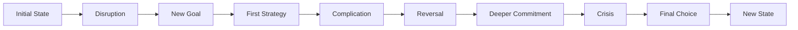
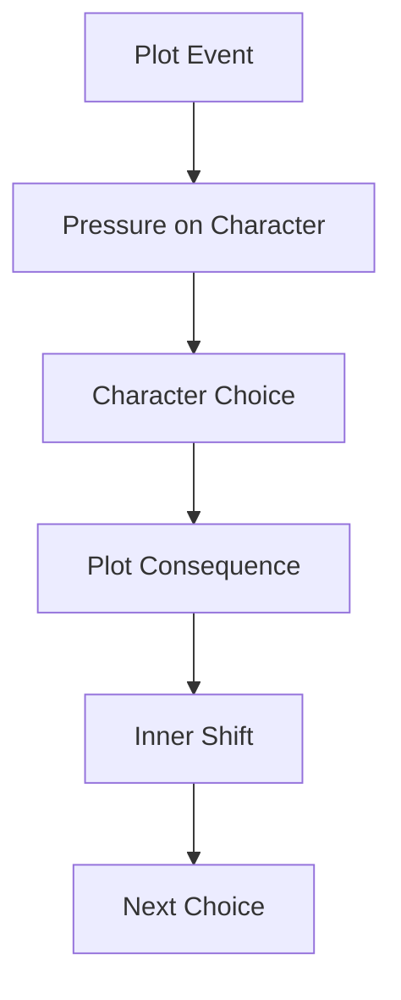
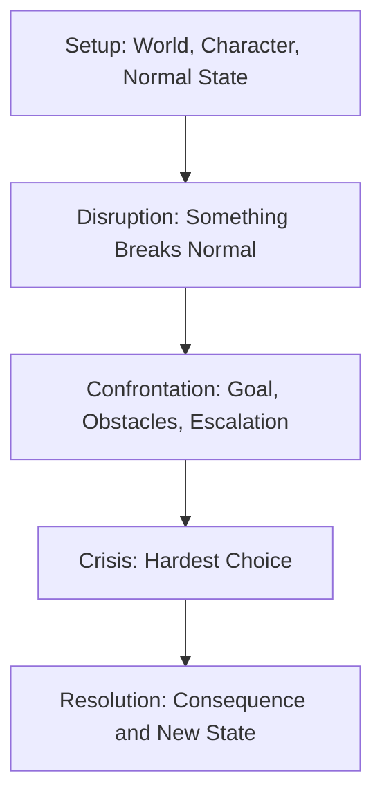
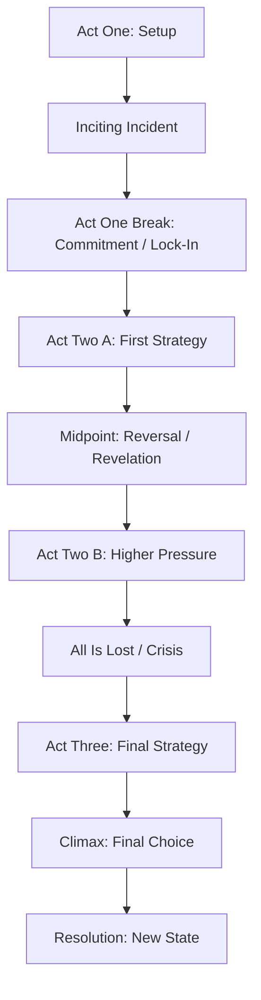
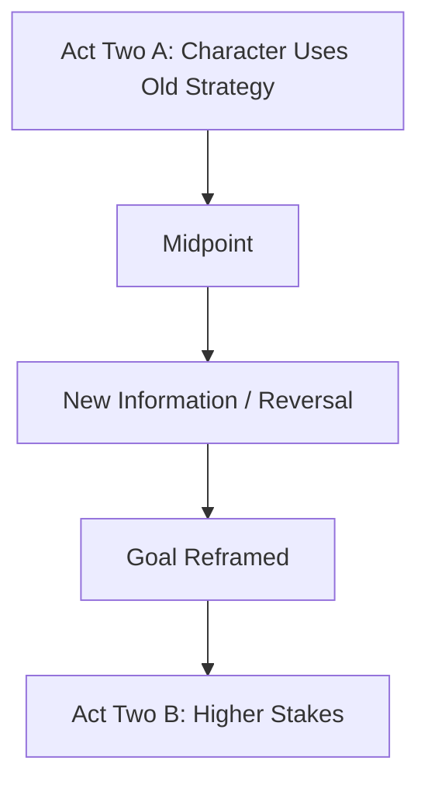
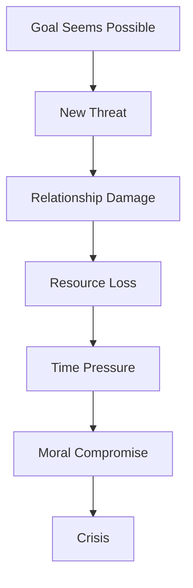
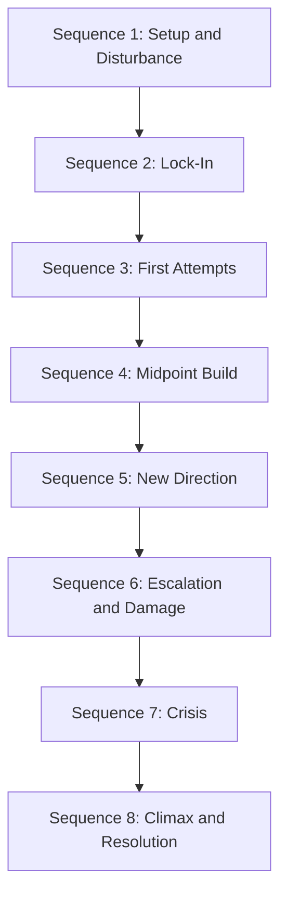
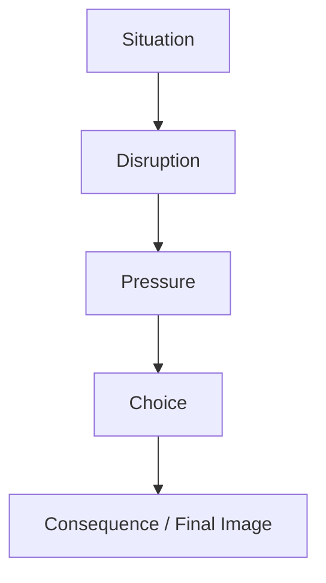
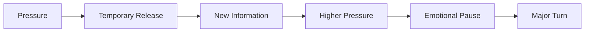
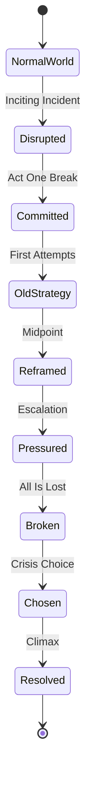

# learn-screenwriting-film-script-part-009.md

# Part 009 — Struktur Cerita: Dari Three-Act sampai Sequence Approach

> Seri: Learn Screenwriting for Film Project  
> Pendekatan: *The First 20 Hours* — Josh Kaufman  
> Fokus bagian ini: memahami struktur cerita film sebagai alat navigasi, diagnosis, dan desain tekanan dramatik.  
> Target praktis: mampu membuat rangka struktur cerita yang jelas untuk film pendek atau film panjang tanpa terjebak formula kosong.

---

## 0. Posisi Part Ini dalam Roadmap

Pada part sebelumnya kita sudah membangun komponen fundamental:

1. **Part 003** — project film didefinisikan.
2. **Part 004** — premis, logline, dan dramatic question dibuat.
3. **Part 005** — tema sebagai konflik nilai dibangun.
4. **Part 006** — karakter utama dipahami sebagai sistem keputusan.
5. **Part 007** — antagonis/oposisi dirancang sebagai sistem tekanan.
6. **Part 008** — konflik dipahami sebagai engine cerita.

Sekarang kita masuk ke pertanyaan besar:

> Bagaimana semua komponen itu disusun menjadi perjalanan dramatik yang bisa diikuti, dirasakan, dan dibayar secara emosional oleh penonton?

Jawabannya: **struktur cerita**.

Struktur bukan berarti film harus terasa generik. Struktur adalah cara kita memastikan bahwa:

- cerita tidak berjalan acak,
- konflik meningkat,
- karakter berubah atau gagal berubah,
- penonton tahu apa yang sedang dipertaruhkan,
- setiap bagian punya fungsi,
- ending terasa earned, bukan tempelan.

Untuk software engineer, struktur cerita bisa dianalogikan seperti **architecture flow** sebuah sistem:

| Software Engineering | Screenwriting |
|---|---|
| Request lifecycle | Story journey |
| State transition | Character arc |
| Critical path | Main plot |
| Failure path | Reversal / crisis |
| Milestone | Turning point |
| Regression test | Structural diagnosis |
| Architecture smell | Story structure problem |
| Dependency graph | Cause-effect chain |
| Runtime event | Plot beat |
| System invariant | Thematic/dramatic invariant |

Namun ada batas analogi: cerita bukan sekadar sistem logis. Cerita juga harus punya **emosi, ritme, kejutan, rasa kehilangan, harapan, dan tekanan psikologis**.

---

## 1. Prinsip Kaufman dalam Part Ini

Josh Kaufman menyarankan agar skill besar dipecah menjadi sub-skill kecil yang paling penting untuk performa awal. Dalam screenwriting, “struktur cerita” adalah salah satu sub-skill bernilai tertinggi.

Tapi kita tidak akan belajar struktur sebagai hafalan template.

Kita akan belajar struktur sebagai kemampuan untuk menjawab:

1. Apa kondisi awal karakter?
2. Peristiwa apa yang mengganggu kondisi itu?
3. Apa tujuan karakter setelah gangguan terjadi?
4. Apa strategi karakter?
5. Mengapa strategi itu gagal atau tidak cukup?
6. Apa yang dipertaruhkan?
7. Di titik mana karakter tidak bisa kembali?
8. Di titik mana makna cerita berubah?
9. Apa krisis terbesarnya?
10. Pilihan final apa yang membuktikan siapa karakter sebenarnya?
11. Apa konsekuensi finalnya?

Dalam 20 jam pertama, targetnya bukan menguasai semua teori struktur. Targetnya adalah cukup mampu membuat struktur kerja yang:

- bisa dipakai untuk menulis draft,
- bisa didiagnosis,
- bisa direvisi,
- tidak kehilangan konflik,
- tidak kehilangan arah karakter,
- tidak kehilangan dramatic question.

---

## 2. Mental Model: Struktur Bukan Formula, tapi Sistem Perubahan

Banyak pemula salah paham terhadap struktur. Mereka mengira struktur adalah urutan kejadian seperti:

```text
Awal → Tengah → Akhir
```

Itu terlalu dangkal.

Struktur cerita yang hidup adalah urutan **perubahan tekanan dan perubahan state**:



Setiap bagian cerita harus menjawab:

> Apa yang berubah?

Jika tidak ada yang berubah, bagian itu kemungkinan besar hanya informasi, bukan drama.

---

## 3. Struktur dalam Film: Fungsi, Bukan Hiasan

Struktur film punya beberapa fungsi utama.

### 3.1 Memberi orientasi kepada penonton

Penonton tidak harus tahu formula cerita. Tapi mereka butuh merasa bahwa cerita punya arah.

Mereka secara bawah sadar bertanya:

- Siapa tokoh utama?
- Apa yang dia inginkan?
- Apa yang menghalangi?
- Kenapa ini penting?
- Apa yang akan terjadi jika dia gagal?
- Apa yang belum selesai?

Jika terlalu banyak pertanyaan dasar tidak terjawab, penonton bingung.  
Jika semua pertanyaan terjawab terlalu cepat, penonton bosan.

Struktur mengatur keseimbangan antara **clarity** dan **curiosity**.

---

### 3.2 Mengatur eskalasi konflik

Cerita tidak cukup hanya punya konflik. Konflik harus berubah intensitas.

Contoh buruk:

```text
Scene 1: Karakter bertengkar.
Scene 2: Karakter bertengkar lagi.
Scene 3: Karakter bertengkar lagi.
Scene 4: Karakter bertengkar lagi.
```

Itu repetisi, bukan eskalasi.

Contoh lebih kuat:

```text
Scene 1: Karakter menyembunyikan masalah.
Scene 2: Kebohongannya mulai terancam.
Scene 3: Ia menyalahkan orang lain untuk menutupinya.
Scene 4: Orang yang ia salahkan menuntut balik.
Scene 5: Kebohongan terbuka di depan orang yang paling ia takut kecewakan.
```

Perubahannya bukan sekadar “lebih ribut”, tapi:

- risiko naik,
- pilihan makin sempit,
- konsekuensi makin personal,
- karakter makin terungkap.

---

### 3.3 Menghubungkan plot dan character arc

Plot adalah apa yang terjadi.  
Character arc adalah bagaimana karakter berubah karena apa yang terjadi.

Struktur yang kuat membuat keduanya saling mengikat.



Jika plot bisa berjalan tanpa karakter berubah atau memilih, maka karakter kemungkinan hanya “penumpang cerita”.

Jika karakter berubah tanpa tekanan plot yang cukup, arc terasa tidak earned.

---

### 3.4 Membuat ending terasa layak

Ending yang kuat bukan ending yang hanya mengejutkan. Ending kuat adalah ending yang terasa sebagai konsekuensi dari seluruh sistem cerita.

Ending harus membayar:

- premis,
- tema,
- konflik,
- karakter,
- setup,
- dramatic question,
- emotional promise.

Jika ending terasa acak, biasanya masalahnya bukan hanya di ending. Sering kali masalahnya ada di struktur awal dan tengah.

---

## 4. Struktur Dasar: Setup, Confrontation, Resolution

Sebelum masuk ke istilah three-act, midpoint, sequence, dan lainnya, kita mulai dari struktur paling dasar:

```text
Setup → Confrontation → Resolution
```

Atau:

```text
Keadaan awal → Tekanan utama → Konsekuensi akhir
```

Dalam bahasa yang lebih dramatik:

| Bagian | Fungsi | Pertanyaan Utama |
|---|---|---|
| Setup | Membangun dunia, karakter, masalah, dan janji cerita | Siapa ini dan apa yang mulai terganggu? |
| Confrontation | Menguji karakter melalui konflik yang meningkat | Apa yang dia lakukan saat tekanan makin buruk? |
| Resolution | Membayar konflik dan pilihan karakter | Siapa dia setelah semua ini? |

Diagram:



---

## 5. Three-Act Structure

Three-act structure adalah salah satu model paling umum untuk memahami cerita film. Tapi jangan menghafalnya sebagai template mati. Pahami fungsi dramatiknya.

### 5.1 Act One — Setup

Act One memperkenalkan:

- dunia cerita,
- karakter utama,
- kondisi normal,
- kekurangan/masalah karakter,
- keinginan awal,
- gangguan besar,
- arah cerita,
- stakes awal.

Fungsi utamanya:

> Membuat penonton tahu film ini tentang siapa, apa masalahnya, dan kenapa mereka harus peduli.

Act One biasanya berakhir ketika karakter masuk ke situasi baru yang tidak mudah ditinggalkan.

---

### 5.2 Act Two — Confrontation

Act Two adalah bagian terpanjang dan paling berbahaya. Banyak naskah pemula gagal di sini.

Act Two berisi:

- usaha karakter mengejar tujuan,
- konflik yang meningkat,
- strategi yang gagal,
- hubungan yang diuji,
- informasi baru,
- midpoint,
- konsekuensi yang makin besar,
- tekanan internal dan eksternal.

Fungsi utamanya:

> Membuktikan bahwa tujuan karakter sulit, mahal, dan memaksa perubahan.

Act Two bukan sekadar “banyak kejadian”. Act Two adalah laboratorium tekanan.

---

### 5.3 Act Three — Resolution

Act Three berisi:

- krisis final,
- pilihan final,
- klimaks,
- pembayaran konflik,
- konsekuensi,
- new equilibrium.

Fungsi utamanya:

> Menunjukkan siapa karakter sebenarnya ketika tidak ada lagi jalan mudah.

Act Three bukan tempat menjelaskan semua hal. Act Three adalah tempat karakter membayar atau gagal membayar perjalanan yang sudah dibangun.

---

## 6. Diagram Three-Act Structure



---

## 7. Elemen Kunci dalam Struktur Cerita

Sekarang kita bedah titik-titik penting yang sering muncul dalam struktur film.

---

## 8. Opening Image

Opening image adalah kesan awal yang diberikan film.

Bukan sekadar shot pertama. Opening image adalah sinyal:

- tone,
- dunia,
- luka,
- konflik,
- tema,
- kondisi awal karakter.

Contoh fungsi opening image:

| Jenis Opening | Fungsi |
|---|---|
| Karakter sendirian di ruang ramai | Menunjukkan isolasi |
| Rumah berantakan | Menunjukkan kekacauan internal/keluarga |
| Ritual kerja yang repetitif | Menunjukkan stagnasi |
| Kejar-kejaran langsung | Menunjukkan dunia berbahaya |
| Anak menunggu orang tua pulang | Menunjukkan abandonment atau longing |

Opening image yang baik biasanya akan berpasangan dengan final image.

```text
Opening image = siapa karakter sebelum perjalanan.
Final image = siapa karakter setelah perjalanan.
```

---

## 9. Normal World

Normal world adalah kondisi awal karakter sebelum cerita benar-benar mengguncang hidupnya.

Normal world bukan berarti dunia damai. Normal world berarti:

> kondisi default karakter sebelum dramatic disruption.

Normal world harus menunjukkan:

1. Rutinitas karakter.
2. Kekurangan atau luka yang tersembunyi.
3. Relasi penting.
4. Keinginan awal.
5. Sistem tekanan yang sudah ada.
6. Kerapuhan yang akan dieksploitasi cerita.

Kesalahan umum:

- opening terlalu lama tanpa konflik,
- terlalu banyak eksposisi,
- karakter belum punya desire,
- dunia dijelaskan tapi tidak didramatisasi,
- tidak ada tanda bahwa sesuatu harus berubah.

---

## 10. Inciting Incident

Inciting incident adalah peristiwa yang mengganggu keseimbangan awal dan membuka arah cerita.

Ciri inciting incident:

- mengganggu status quo,
- tidak bisa diabaikan sepenuhnya,
- memunculkan problem/opportunity,
- menekan karakter untuk merespons,
- membuat dramatic question mulai aktif.

Contoh abstrak:

```text
Seorang pegawai yang selalu menghindari konflik menerima surat bahwa ayahnya yang ia benci meninggal dan mewariskan utang besar kepadanya.
```

Dramatic question:

```text
Apakah ia akan terus lari dari masa lalunya, atau menghadapi keluarga dan luka lamanya?
```

Inciting incident tidak selalu ledakan besar. Bisa saja:

- pesan singkat,
- tamu tak diundang,
- diagnosis,
- kehilangan barang,
- tawaran pekerjaan,
- pengkhianatan kecil,
- tatapan yang mengungkap rahasia.

Yang penting bukan ukuran peristiwanya, tetapi dampaknya terhadap sistem hidup karakter.

---

## 11. Debate / Refusal / Hesitation

Setelah inciting incident, karakter sering tidak langsung masuk ke perjalanan utama. Ada fase ragu.

Fase ini penting karena menunjukkan:

- ketakutan karakter,
- risiko yang ia pahami,
- alasan ia tidak mau berubah,
- inner resistance,
- stakes personal.

Dalam cerita pendek, fase ini bisa sangat singkat. Dalam film panjang, fase ini bisa beberapa scene.

Kesalahan umum:

- karakter terlalu cepat setuju tanpa resistance,
- refusal terlalu panjang sehingga cerita lambat,
- refusal tidak berakar pada flaw/wound,
- karakter pasif tanpa tekanan.

---

## 12. Act One Break / Lock-In

Act One Break adalah titik ketika karakter masuk ke arah cerita utama.

Fungsinya:

> Mengunci karakter ke konflik utama sehingga cerita tidak bisa kembali ke status quo lama.

Ciri Act One Break:

- karakter membuat keputusan,
- karakter terdorong masuk ke dunia/situasi baru,
- goal lebih jelas,
- risiko lebih nyata,
- jalan mundur makin sulit.

Contoh:

```text
Bukan sekadar “ia menerima masalah”.
Lebih kuat: “ia memilih tindakan yang membuatnya tidak bisa lagi pura-pura tidak terlibat.”
```

Act One Break yang kuat biasanya punya unsur **commitment**.

---

## 13. First Strategy

Di awal Act Two, karakter biasanya menjalankan strategi pertamanya.

Strategi ini sering didasarkan pada flaw lama.

Contoh:

| Flaw Karakter | First Strategy |
|---|---|
| Selalu mengontrol | Mencoba mengatur semua orang |
| Takut jujur | Berbohong untuk menyelesaikan masalah |
| Ingin diterima | Mengorbankan prinsip |
| Menghindari konflik | Menunda keputusan |
| Sinis terhadap cinta | Menolak bantuan tulus |

Ini penting karena Act Two bukan hanya external obstacle. Act Two memperlihatkan bahwa cara lama karakter tidak cukup.

---

## 14. Fun and Games / Promise of the Premise

Istilah ini sering dipakai untuk bagian ketika film memenuhi janji premisnya.

Jika premisnya tentang:

- detektif memecahkan kasus aneh,
- pasangan pura-pura menikah,
- orang biasa masuk dunia kriminal,
- anak desa mengikuti kompetisi besar,
- tokoh pengecut dipaksa jadi pahlawan,

maka bagian ini memperlihatkan “rasa utama” dari premis itu.

Tapi jangan salah: ini bukan berarti semua harus menyenangkan. Dalam thriller atau horror, “fun” berarti penonton mendapat jenis ketegangan yang dijanjikan.

Pertanyaan diagnosis:

> Apakah bagian tengah awal film benar-benar memenuhi alasan kenapa premis ini menarik?

---

## 15. Midpoint

Midpoint adalah titik tengah besar yang mengubah pemahaman cerita.

Midpoint bisa berupa:

- revelation,
- reversal,
- false victory,
- false defeat,
- escalation,
- change of goal,
- exposure of deeper truth.

Fungsi midpoint:

> Mengubah cerita dari “apa yang karakter kira sedang terjadi” menjadi “apa yang sebenarnya sedang terjadi”.

Diagram:



Contoh abstrak:

```text
Sebelum midpoint:
Tokoh utama mengira ia sedang mencari orang hilang.

Midpoint:
Ia menemukan bahwa orang itu sengaja menghilang untuk melindunginya.

Setelah midpoint:
Cerita bukan lagi tentang pencarian, tetapi tentang pilihan: membongkar kebenaran atau menjaga rahasia.
```

Midpoint yang kuat membuat penonton merasa:

> “Oh, ternyata cerita ini lebih besar/lebih dalam/lebih berbahaya dari yang kukira.”

---

## 16. Bad Guys Close In / Escalating Pressure

Setelah midpoint, tekanan meningkat.

Yang penting:

- antagonis makin dekat,
- risiko makin personal,
- hubungan mulai rusak,
- strategi lama makin gagal,
- karakter makin terpojok,
- waktu makin sempit,
- pilihan makin mahal.

Ini bukan sekadar “lebih banyak masalah”. Ini adalah proses mempersempit ruang gerak karakter.



---

## 17. All Is Lost

All Is Lost adalah titik ketika karakter mengalami kehilangan besar atau merasa tujuan utama tidak mungkin lagi dicapai.

Kehilangan ini bisa:

- fisik,
- emosional,
- relasional,
- moral,
- reputasional,
- spiritual,
- identitas.

All Is Lost bukan harus berarti semua benar-benar hilang. Yang penting karakter merasa sistem kepercayaan lamanya runtuh.

Contoh:

```text
Ia tidak hanya kehilangan pekerjaan.
Ia sadar bahwa seluruh hidupnya dibangun di atas kebohongan bahwa ia dibutuhkan.
```

All Is Lost yang baik memukul external goal dan internal wound sekaligus.

---

## 18. Dark Night of the Soul

Ini fase setelah All Is Lost, ketika karakter menghadapi konsekuensi terdalam.

Fungsinya:

- memaksa karakter berhenti memakai strategi lama,
- menghadapkan karakter pada flaw,
- menguji tema,
- membuka kemungkinan pilihan baru.

Untuk film pendek, fase ini bisa berupa satu momen diam.

Untuk film panjang, bisa beberapa scene.

Pertanyaan penting:

> Apa kebenaran yang selama ini karakter hindari?

---

## 19. Crisis

Crisis adalah titik pilihan paling sulit sebelum klimaks.

Bedakan crisis dan climax:

| Elemen | Fungsi |
|---|---|
| Crisis | Pilihan sulit |
| Climax | Eksekusi pilihan itu |
| Resolution | Konsekuensi setelah pilihan |

Crisis yang kuat punya dua opsi yang sama-sama mahal.

Contoh lemah:

```text
Apakah ia akan melakukan hal benar atau hal salah?
```

Contoh lebih kuat:

```text
Apakah ia akan menyelamatkan adiknya dan membiarkan kebenaran terkubur, atau membongkar kebenaran dan menghancurkan satu-satunya keluarga yang tersisa?
```

Crisis harus menguji tema.

---

## 20. Climax

Climax adalah titik benturan final.

Ciri climax:

- konflik utama mencapai puncak,
- karakter membuat tindakan final,
- pilihan internal menjadi aksi eksternal,
- antagonisme dihadapi,
- dramatic question dijawab.

Climax yang kuat bukan hanya besar secara visual. Ia harus besar secara moral/emosional.

Contoh:

```text
Bukan hanya karakter menang duel.
Tapi karakter menang karena untuk pertama kalinya ia memilih jujur meskipun kejujuran itu membuatnya kehilangan status.
```

---

## 21. Resolution

Resolution menunjukkan konsekuensi setelah climax.

Tidak harus panjang. Tapi harus cukup untuk memberi rasa:

- apa yang berubah,
- apa yang hilang,
- apa yang tersisa,
- siapa karakter sekarang,
- apa posisi final film terhadap tema.

Resolution terlalu panjang bisa melemahkan impact.  
Resolution terlalu pendek bisa membuat ending terasa abrupt.

---

## 22. Final Image

Final image adalah pasangan opening image.

Jika opening image menunjukkan state awal, final image menunjukkan state akhir.

Contoh:

| Opening Image | Final Image |
|---|---|
| Karakter makan sendiri di meja besar | Karakter makan sederhana bersama orang yang dulu ia hindari |
| Karakter menutup semua jendela | Karakter membuka jendela meski hujan masuk |
| Karakter menghapus pesan suara ibunya | Karakter merekam pesan suara untuk anaknya |
| Karakter berjalan cepat menghindari orang | Karakter berhenti dan menunggu seseorang |

Final image tidak harus menjelaskan. Sering kali justru lebih kuat jika ia menunjukkan perubahan secara visual.

---

## 23. Structural Spine

Sebelum membuat outline panjang, buat dulu **structural spine**.

Template:

```text
1. Opening Image:
2. Normal World:
3. Protagonist Want:
4. Protagonist Flaw:
5. Inciting Incident:
6. Initial Resistance:
7. Act One Break / Lock-In:
8. First Strategy:
9. Midpoint Reversal:
10. Escalating Pressure:
11. All Is Lost:
12. Crisis Choice:
13. Climax Action:
14. Resolution:
15. Final Image:
```

Contoh abstrak:

```text
1. Opening Image:
   Seorang guru musik tua mengajar di kelas kosong.

2. Normal World:
   Ia merasa hidupnya tidak berarti sejak murid terbaiknya meninggal.

3. Protagonist Want:
   Ia ingin pensiun diam-diam tanpa terlibat dengan siapa pun.

4. Protagonist Flaw:
   Ia percaya mencintai murid berarti siap kehilangan, jadi lebih baik tidak peduli.

5. Inciting Incident:
   Seorang murid baru memalsukan tanda tangan orang tua agar bisa ikut audisi.

6. Initial Resistance:
   Guru itu menolak membimbingnya.

7. Act One Break:
   Ia melihat murid itu memainkan lagu milik murid lamanya dan akhirnya setuju melatih.

8. First Strategy:
   Ia mengajar dengan dingin dan teknis, tanpa kedekatan emosional.

9. Midpoint:
   Ia sadar murid itu bukan mengejar kemenangan, tetapi ingin didengar sebelum pindah ke kota lain.

10. Escalating Pressure:
   Sekolah membatalkan audisi, orang tua murid melarang, kesehatan guru memburuk.

11. All Is Lost:
   Murid itu pergi setelah guru mengatakan musik tidak menyelamatkan siapa pun.

12. Crisis:
   Guru harus memilih tetap aman dalam kepahitan atau mengejar murid itu dan mengakui ia takut kehilangan lagi.

13. Climax:
   Ia memainkan lagu di stasiun, memanggil murid itu kembali.

14. Resolution:
   Murid tetap pergi, tapi guru membuka kelas musik lagi.

15. Final Image:
   Guru itu mengajar di kelas kecil yang penuh suara anak-anak fals.
```

Perhatikan: tidak ada detail berlebihan. Tapi tulang cerita sudah terasa.

---

## 24. Sequence Approach

Three-act structure berguna, tapi Act Two sering terlalu besar. Sequence approach memecah cerita menjadi beberapa unit lebih kecil.

Untuk film panjang, salah satu model umum adalah 8 sequence:



Sequence approach membantu karena setiap sequence punya mini-goal, mini-conflict, dan mini-turn.

---

## 25. Delapan Sequence dalam Film Panjang

### 25.1 Sequence 1 — Setup and Disturbance

Fungsi:

- memperkenalkan karakter,
- memperkenalkan dunia,
- menunjukkan flaw,
- memunculkan gangguan awal.

Pertanyaan:

> Apa status quo karakter dan apa yang mulai mengganggunya?

---

### 25.2 Sequence 2 — Lock-In

Fungsi:

- memperjelas goal,
- menaikkan stakes,
- mengunci karakter masuk ke konflik utama.

Pertanyaan:

> Apa keputusan atau peristiwa yang membuat karakter tidak bisa kembali seperti semula?

---

### 25.3 Sequence 3 — First Attempts

Fungsi:

- karakter mencoba strategi awal,
- dunia konflik mulai dieksplorasi,
- oposisi mulai terlihat.

Pertanyaan:

> Bagaimana karakter mencoba menang dengan cara lamanya?

---

### 25.4 Sequence 4 — Midpoint Build

Fungsi:

- komplikasi meningkat,
- relasi diuji,
- informasi baru mendekatkan kita ke midpoint.

Pertanyaan:

> Apa yang membuat tujuan terlihat mungkin, tetapi juga makin berbahaya?

---

### 25.5 Sequence 5 — New Direction

Fungsi:

- setelah midpoint, goal/strategi berubah,
- stakes naik,
- karakter mulai lebih aktif atau lebih terdesak.

Pertanyaan:

> Setelah kebenaran baru muncul, apa strategi baru karakter?

---

### 25.6 Sequence 6 — Escalation and Damage

Fungsi:

- antagonisme makin kuat,
- konsekuensi menghancurkan,
- karakter kehilangan resources atau relasi.

Pertanyaan:

> Apa harga yang harus dibayar karakter karena terus mengejar tujuan?

---

### 25.7 Sequence 7 — Crisis

Fungsi:

- karakter mencapai titik terendah,
- flaw tidak bisa lagi dipertahankan,
- pilihan final terbentuk.

Pertanyaan:

> Kebenaran apa yang harus dihadapi karakter sebelum klimaks?

---

### 25.8 Sequence 8 — Climax and Resolution

Fungsi:

- final action,
- jawaban dramatic question,
- pembayaran tema,
- new state.

Pertanyaan:

> Apa pilihan final karakter, dan apa konsekuensinya?

---

## 26. Sequence Card Template

Gunakan template ini untuk setiap sequence:

```text
Sequence Number:
Approx Page/Minute:
Main Goal:
Main Obstacle:
Character Strategy:
Escalation:
New Information:
Emotional Turn:
Sequence Ending:
Question Pulled into Next Sequence:
```

Contoh:

```text
Sequence Number:
3

Approx Page/Minute:
25–37

Main Goal:
Raka ingin membuktikan bahwa ia bisa menyelesaikan masalah utang ayahnya tanpa melibatkan keluarga.

Main Obstacle:
Dokumen warisan tidak lengkap dan penagih mulai mendekati ibunya.

Character Strategy:
Ia berbohong kepada ibunya dan mencari jalan pintas lewat mantan rekan ayahnya.

Escalation:
Ia menemukan bahwa ayahnya pernah mengorbankan orang lain demi menyelamatkan keluarga.

New Information:
Utang itu bukan utang bisnis biasa, tetapi hasil keputusan moral yang buruk.

Emotional Turn:
Raka mulai melihat bahwa kemarahannya kepada ayah lebih rumit dari yang ia kira.

Sequence Ending:
Ia menerima telepon bahwa rumah ibunya akan disita dalam 48 jam.

Question Pulled into Next Sequence:
Apakah Raka akan tetap menyembunyikan kebenaran dari ibunya?
```

---

## 27. Struktur Film Pendek

Film pendek tidak harus memakai three-act secara lengkap. Tapi film pendek tetap butuh struktur.

Struktur sederhana film pendek:



Atau:

```text
1. Situation
2. Complication
3. Turn
4. Choice
5. Aftermath
```

Film pendek sering paling kuat ketika fokus pada:

- satu karakter utama,
- satu konflik utama,
- satu perubahan utama,
- satu momen keputusan,
- satu image akhir yang tajam.

---

## 28. Struktur 5 Scene untuk Film Pendek

Template:

| Scene | Fungsi |
|---|---|
| Scene 1 | Establish normal world + hidden tension |
| Scene 2 | Disruption / inciting incident |
| Scene 3 | Escalation / failed strategy |
| Scene 4 | Crisis / hard choice |
| Scene 5 | Consequence / final image |

Contoh abstrak:

```text
Scene 1:
Seorang anak menunggu ayahnya di halte setiap sore.

Scene 2:
Hari itu ayahnya tidak datang, tapi seorang kurir membawa koper tua.

Scene 3:
Anak itu membuka koper dan menemukan kaset berisi suara ayahnya.

Scene 4:
Ia harus memilih membawa koper itu pulang ke ibunya atau membuangnya karena isi kaset membongkar rahasia keluarga.

Scene 5:
Ia pulang tanpa koper, tapi menyimpan satu kaset di sakunya.
```

---

## 29. Struktur 8 Scene untuk Film Pendek

Untuk film pendek 8–15 menit, struktur 8 scene bisa dipakai.

| Scene | Fungsi |
|---|---|
| 1 | Opening image + normal world |
| 2 | Inciting incident |
| 3 | First response |
| 4 | Complication |
| 5 | Midpoint/revelation |
| 6 | Escalation |
| 7 | Crisis/climax |
| 8 | Resolution/final image |

Ini cukup fleksibel untuk drama, thriller, horror, romance, atau satire.

---

## 30. Struktur Feature Film dengan 8 Sequence

Untuk film panjang, struktur kerja awal:

| Sequence | Approx Function | Approx Page Range |
|---|---|---|
| 1 | Setup and disturbance | 1–12 |
| 2 | Lock-in | 12–25 |
| 3 | First attempts | 25–37 |
| 4 | Midpoint build | 37–50 |
| 5 | New direction | 50–62 |
| 6 | Escalation and damage | 62–75 |
| 7 | Crisis | 75–90 |
| 8 | Climax and resolution | 90–110 |

Catatan penting:

- Page range bukan hukum.
- Film berbeda punya ritme berbeda.
- Gunakan ini sebagai alat diagnosis, bukan template absolut.

---

## 31. Struktur Sebagai Cause-Effect Chain

Cerita yang kuat terasa seperti rangkaian sebab-akibat.

Buruk:

```text
A terjadi.
Lalu B terjadi.
Lalu C terjadi.
Lalu D terjadi.
```

Lebih kuat:

```text
A terjadi, karena itu B.
Karena B, karakter memilih C.
Akibat C, D menjadi lebih buruk.
Karena D, karakter dipaksa memilih E.
```

Gunakan prinsip:

```text
But / Therefore
```

Bukan:

```text
And then
```

Contoh lemah:

```text
Raka kehilangan pekerjaan.
Lalu ia pulang ke kampung.
Lalu ia bertemu mantannya.
Lalu ia membuka usaha kopi.
```

Contoh lebih kuat:

```text
Raka kehilangan pekerjaan, karena itu ia terpaksa pulang ke kampung.
Tapi rumah keluarganya hampir disita.
Karena itu ia mencoba menjual tanah warisan.
Tapi mantannya mengungkap bahwa tanah itu satu-satunya akses air warga.
Karena itu Raka harus memilih antara menyelamatkan keluarganya atau mengkhianati desa yang dulu ia tinggalkan.
```

Yang kedua punya struktur sebab-akibat dan konflik nilai.

---

## 32. Plot Point Harus Mengubah Arah

Plot point bukan sekadar kejadian besar. Plot point adalah kejadian yang mengubah arah cerita.

Pertanyaan diagnosis:

1. Apakah setelah plot point ini tujuan karakter berubah?
2. Apakah stakes berubah?
3. Apakah informasi penting berubah?
4. Apakah relasi berubah?
5. Apakah pilihan karakter makin sempit?
6. Apakah penonton melihat cerita dengan cara baru?

Jika jawabannya tidak, mungkin itu bukan plot point. Mungkin hanya event.

---

## 33. Turning Point

Turning point adalah momen ketika cerita berbelok.

Jenis turning point:

| Jenis | Dampak |
|---|---|
| Goal turn | Tujuan berubah |
| Strategy turn | Cara mengejar tujuan berubah |
| Relationship turn | Relasi berubah |
| Moral turn | Nilai karakter diuji |
| Information turn | Informasi baru mengubah pemahaman |
| Power turn | Status/power antar karakter berubah |
| Emotional turn | Rasa adegan berubah |

Setiap sequence idealnya punya turning point.

---

## 34. Pacing

Pacing bukan sekadar cepat atau lambat. Pacing adalah pengalaman ritme tekanan, informasi, emosi, dan perubahan.

Film bisa lambat tapi gripping jika tension jelas.  
Film bisa cepat tapi membosankan jika semua kejadian terasa kosong.

Pacing dipengaruhi oleh:

- panjang scene,
- kepadatan konflik,
- variasi emosi,
- frekuensi revelation,
- clarity of goal,
- urgency,
- visual movement,
- dialog density,
- silence,
- escalation.

---

## 35. Rhythm: Tekanan dan Pelepasan

Cerita butuh variasi.

Jika semua scene tegang, penonton mati rasa.  
Jika semua scene tenang, penonton kehilangan energi.

Gunakan pola:

```text
Pressure → Release → New Pressure → Reversal → Silence → Explosion
```

Diagram:



Release bukan berarti konflik hilang. Release adalah ruang bagi penonton untuk memproses, sebelum tekanan berikutnya lebih dalam.

---

## 36. Structural Invariant

Dalam struktur cerita, ada beberapa invariant yang harus dijaga.

### 36.1 Protagonist punya arah

Penonton harus bisa memahami apa yang sedang dikejar atau dihindari karakter.

### 36.2 Oposisi aktif

Jika tidak ada force yang menekan, cerita melemah.

### 36.3 Stakes meningkat

Jika risiko tidak berubah, cerita terasa datar.

### 36.4 Setiap bagian mengubah sesuatu

Scene, beat, sequence, act — semuanya harus punya perubahan.

### 36.5 Ending membayar setup

Ending harus terasa sebagai konsekuensi dari awal dan tengah.

### 36.6 Tema diuji melalui pilihan

Tema tidak boleh hanya dinyatakan lewat dialog.

---

## 37. Structural Smell

Seperti code smell, naskah punya structural smell.

| Smell | Gejala | Kemungkinan Penyebab |
|---|---|---|
| Opening lambat | Banyak setup tanpa tekanan | Inciting incident terlambat |
| Tengah membosankan | Banyak event tanpa perubahan | Goal/obstacle tidak jelas |
| Karakter pasif | Tokoh hanya bereaksi | Want lemah |
| Ending random | Klimaks tidak terasa earned | Setup/payoff lemah |
| Midpoint hambar | Tidak ada reversal | Informasi baru tidak mengubah arah |
| Stakes datar | Konflik terasa sama terus | Eskalasi kurang |
| Scene terasa bisa ditukar | Urutan tidak kausal | Cause-effect chain lemah |
| Dialog menjelaskan plot | Exposition overload | Struktur informasi buruk |

---

## 38. Debugging Struktur Naskah

Gunakan pertanyaan ini untuk mendiagnosis struktur:

### 38.1 Level Premis

1. Apakah premis punya konflik?
2. Apakah dramatic question jelas?
3. Apakah protagonist punya goal?
4. Apakah obstacle cukup kuat?
5. Apakah stakes terasa penting?

### 38.2 Level Act

1. Apakah Act One mengunci arah cerita?
2. Apakah Act Two meningkatkan tekanan?
3. Apakah Act Three membayar konflik?

### 38.3 Level Sequence

1. Apakah setiap sequence punya goal?
2. Apakah setiap sequence berakhir dengan perubahan?
3. Apakah setiap sequence menarik pertanyaan baru?

### 38.4 Level Scene

1. Apakah scene punya input dan output state berbeda?
2. Apakah ada konflik?
3. Apakah ada turn?
4. Apakah scene bisa dihapus tanpa efek? Jika ya, kenapa ada?

---

## 39. Struktur untuk Software Engineer: Story Architecture View

Bayangkan cerita sebagai sistem dengan state.



Tetapi ingat: state ini bukan hanya plot state, melainkan juga emotional state.

| Story State | Emotional Meaning |
|---|---|
| NormalWorld | Karakter hidup dalam pola lama |
| Disrupted | Pola lama terganggu |
| Committed | Karakter terikat pada konflik |
| OldStrategy | Karakter memakai cara lama |
| Reframed | Karakter melihat kebenaran baru |
| Pressured | Harga makin tinggi |
| Broken | Cara lama runtuh |
| Chosen | Karakter memilih nilai final |
| Resolved | Dunia/karakter mencapai state baru |

---

## 40. Structural Data Model

Jika ingin memodelkan cerita secara teknis:

```text
Story {
  premise
  dramaticQuestion
  protagonist
  antagonistSystem
  themeQuestion
  acts[]
}

Act {
  function
  startState
  endState
  sequences[]
}

Sequence {
  goal
  obstacle
  escalation
  turn
  emotionalOutput
  scenes[]
}

Scene {
  location
  time
  characters[]
  inputState
  goal
  conflict
  turn
  outputState
}
```

Model ini bukan untuk membuat cerita kaku, tetapi untuk memeriksa apakah cerita punya dependency yang sehat.

---

## 41. Kapan Struktur Boleh Dilanggar?

Struktur boleh dilanggar jika penulis paham fungsi yang sedang diganti.

Masalah pemula biasanya bukan “melanggar struktur”, tapi belum membangun struktur apa pun.

Contoh:

- film episodik tetap butuh emotional progression,
- film nonlinear tetap butuh cause-effect yang bisa dipahami,
- film slow cinema tetap butuh tension atau perubahan persepsi,
- film eksperimental tetap butuh pengalaman yang dirancang.

Prinsipnya:

> Boleh membuang template, tapi jangan membuang kebutuhan penonton akan orientasi, ketegangan, dan makna.

---

## 42. Nonlinear Structure

Struktur nonlinear tidak berarti acak.

Nonlinear structure sering tetap punya:

- emotional logic,
- thematic progression,
- mystery progression,
- revelation order,
- character understanding curve.

Pertanyaan utama nonlinear bukan:

```text
Apa urutan kejadian sebenarnya?
```

Tapi:

```text
Dalam urutan apa informasi harus diberikan agar pengalaman emosional paling kuat?
```

Untuk 20 jam pertama, sebaiknya jangan mulai dari struktur nonlinear kecuali memang sangat penting bagi konsep film.

---

## 43. Multiple Protagonist Structure

Beberapa film punya banyak karakter utama. Ini lebih sulit.

Risikonya:

- dramatic question kabur,
- screen time terbagi,
- arc dangkal,
- ending tidak fokus.

Untuk pemula, lebih aman:

- satu protagonist utama,
- supporting character yang jelas fungsinya,
- subplot terbatas,
- emotional center tunggal.

Jika harus multi-protagonist, pastikan ada:

1. thematic unity,
2. shared event,
3. intersecting conflict,
4. clear emotional anchor,
5. converging climax.

---

## 44. Subplot

Subplot adalah jalur cerita pendukung yang memperkaya main plot.

Subplot tidak boleh hanya tempelan.

Fungsi subplot:

- menguji tema dari sudut lain,
- memberi tekanan tambahan,
- memperlihatkan sisi lain karakter,
- menciptakan contrast,
- menyiapkan payoff,
- memperdalam dunia.

Contoh:

```text
Main plot:
Seorang jaksa mengejar kasus korupsi.

Subplot buruk:
Ia juga punya tetangga lucu yang tidak berhubungan dengan apa pun.

Subplot lebih kuat:
Anaknya masuk sekolah mahal yang diam-diam didanai oleh jaringan yang sedang ia selidiki.
```

Subplot yang kuat menekan main character secara moral.

---

## 45. Struktur dan Tema

Struktur adalah cara tema diuji.

Misalnya tema film:

```text
Apakah kebenaran tetap bernilai jika menghancurkan orang yang kita cintai?
```

Maka struktur harus memberi karakter pilihan-pilihan yang makin sulit terkait kebenaran.

| Struktur | Ujian Tema |
|---|---|
| Inciting Incident | Karakter menemukan kebohongan |
| Act One Break | Karakter memilih menyelidiki |
| Midpoint | Kebenaran ternyata melukai orang tak bersalah |
| All Is Lost | Karakter kehilangan orang tercinta karena kebenaran |
| Crisis | Karakter harus memilih membongkar semua atau menyelamatkan keluarga |
| Climax | Karakter mengambil posisi final terhadap tema |

Tema tidak hidup jika tidak diuji secara struktural.

---

## 46. Struktur dan Karakter

Setiap structural beat harus menekan flaw karakter.

Contoh flaw:

```text
Karakter percaya bahwa meminta bantuan adalah kelemahan.
```

Struktur bisa menekannya seperti ini:

| Beat | Tekanan terhadap Flaw |
|---|---|
| Opening | Ia bekerja sendiri dan terlihat kompeten |
| Inciting Incident | Masalah terlalu besar untuk ditangani sendiri |
| Act One Break | Ia menolak bantuan dan mengambil risiko |
| Midpoint | Ia gagal karena tidak percaya orang lain |
| All Is Lost | Orang yang ingin membantunya terluka |
| Crisis | Ia harus memilih mempercayai orang lain atau kehilangan segalanya |
| Climax | Ia meminta bantuan secara sadar |

Inilah struktur yang menyatu dengan arc.

---

## 47. Struktur dan Antagonis

Antagonis bukan muncul hanya di akhir. Antagonistic force harus berkembang sepanjang struktur.

| Beat | Fungsi Antagonis |
|---|---|
| Setup | Bayangan ancaman atau sistem tekanan |
| Inciting Incident | Mengganggu status quo |
| Act One Break | Mengunci protagonist ke konflik |
| Midpoint | Mengungkap kekuatan/niat lebih besar |
| Escalation | Mengambil resources protagonist |
| All Is Lost | Membuat protagonist runtuh |
| Climax | Memaksa pilihan final |

Jika antagonis pasif, struktur kehilangan tekanan.

---

## 48. Struktur dan Informasi

Cerita bukan hanya mengatur kejadian. Cerita juga mengatur informasi.

Informasi harus diberikan dalam urutan yang menciptakan:

- curiosity,
- surprise,
- suspense,
- dread,
- revelation,
- emotional impact.

Bedakan:

| Mode | Penonton Tahu? | Karakter Tahu? | Efek |
|---|---|---|---|
| Mystery | Tidak | Tidak | Curiosity |
| Suspense | Ya | Tidak | Tension |
| Dramatic irony | Ya | Tidak | Anticipation |
| Revelation | Baru tahu | Baru tahu/atau tidak | Reframe |
| Secret | Tidak semua tahu | Sebagian tahu | Power imbalance |

Struktur yang baik mengatur kapan informasi dibuka.

---

## 49. Latihan 1 — Structural Spine 30 Menit

Ambil satu ide film dari part sebelumnya. Isi template ini tanpa berhenti terlalu lama.

```text
Judul sementara:
Format:
Durasi:
Genre:
Tone:

Opening Image:
Normal World:
Protagonist Want:
Protagonist Flaw:
Inciting Incident:
Resistance:
Act One Break:
First Strategy:
Midpoint:
Escalating Pressure:
All Is Lost:
Crisis:
Climax:
Resolution:
Final Image:
```

Aturan:

- Jangan menulis dialog dulu.
- Jangan menulis scene detail dulu.
- Fokus pada perubahan besar.
- Jika tidak tahu, tulis placeholder.
- Selesaikan dalam 30 menit.

Tujuan latihan bukan sempurna. Tujuannya membuat struktur kasar yang bisa diuji.

---

## 50. Latihan 2 — Cause-Effect Rewrite

Ambil outline kasar 10 kejadian. Ubah setiap “lalu” menjadi “karena itu” atau “tapi”.

Contoh awal:

```text
1. Rina kehilangan pekerjaannya.
2. Rina pulang ke rumah ibu.
3. Ia menemukan surat lama.
4. Ia bertemu mantan gurunya.
5. Ia ikut lomba memasak.
```

Rewrite:

```text
1. Rina kehilangan pekerjaannya, karena itu ia terpaksa pulang ke rumah ibu yang selama ini ia hindari.
2. Tapi ibunya menolak membantunya kecuali ia membereskan warung keluarga.
3. Karena membereskan warung, Rina menemukan surat lama dari ayahnya.
4. Tapi surat itu membuktikan bahwa ibunya pernah berbohong tentang alasan ayah pergi.
5. Karena marah dan ingin membuktikan dirinya, Rina mendaftar lomba memasak yang dulu menghancurkan reputasi keluarganya.
```

Tujuan:

- memperkuat kausalitas,
- mengurangi event acak,
- menemukan konflik yang lebih tajam.

---

## 51. Latihan 3 — Midpoint Reframe

Buat 5 kemungkinan midpoint untuk premis Anda.

Template:

```text
Sebelum midpoint, karakter mengira:
Pada midpoint, karakter menemukan:
Setelah midpoint, goal berubah menjadi:
Stakes baru:
Tekanan emosional baru:
```

Contoh:

```text
Sebelum midpoint, karakter mengira:
Ia harus memenangkan kompetisi untuk menyelamatkan bisnis keluarga.

Pada midpoint, karakter menemukan:
Bisnis keluarga sengaja dibuat bangkrut oleh ayahnya sendiri untuk menghindari utang kriminal.

Setelah midpoint, goal berubah menjadi:
Bukan hanya menyelamatkan bisnis, tetapi memutus warisan kebohongan keluarga.

Stakes baru:
Jika ia menang, ia mungkin menyelamatkan bisnis tapi membuka rahasia yang menghancurkan ibunya.

Tekanan emosional baru:
Ia harus memilih antara loyalitas keluarga dan kebenaran.
```

---

## 52. Latihan 4 — Short Film 5 Scene Structure

Buat struktur film pendek 5 scene.

```text
Scene 1 — Situation:
Scene 2 — Disruption:
Scene 3 — Escalation:
Scene 4 — Crisis/Choice:
Scene 5 — Consequence/Final Image:
```

Checklist:

- Apakah ada satu konflik utama?
- Apakah karakter membuat pilihan?
- Apakah ending mengubah makna awal?
- Apakah bisa diproduksi dengan sedikit lokasi?
- Apakah ada final image yang kuat?

---

## 53. Latihan 5 — Sequence Map untuk Feature

Jika project Anda film panjang, buat 8 sequence.

```text
Sequence 1:
Goal:
Obstacle:
Turn:

Sequence 2:
Goal:
Obstacle:
Turn:

Sequence 3:
Goal:
Obstacle:
Turn:

Sequence 4:
Goal:
Obstacle:
Turn:

Sequence 5:
Goal:
Obstacle:
Turn:

Sequence 6:
Goal:
Obstacle:
Turn:

Sequence 7:
Goal:
Obstacle:
Turn:

Sequence 8:
Goal:
Obstacle:
Turn:
```

Jangan menulis terlalu panjang. Maksimal 5 kalimat per sequence.

---

## 54. Practice Plan 90 Menit

Untuk part ini, latihan minimal:

| Durasi | Aktivitas |
|---:|---|
| 10 menit | Baca ulang logline, tema, karakter, konflik |
| 30 menit | Isi structural spine |
| 20 menit | Ubah outline menjadi cause-effect chain |
| 15 menit | Buat 3 alternatif midpoint |
| 15 menit | Buat crisis dan climax yang menguji tema |

Output:

- structural spine,
- cause-effect chain,
- midpoint candidates,
- crisis/climax pair.

---

## 55. Self-Correction Checklist

Gunakan checklist ini setelah membuat struktur.

### 55.1 Setup

- [ ] Apakah protagonist jelas?
- [ ] Apakah normal world menunjukkan flaw?
- [ ] Apakah opening image punya rasa/tone?
- [ ] Apakah inciting incident mengganggu status quo?
- [ ] Apakah dramatic question muncul?

### 55.2 Act One Break

- [ ] Apakah karakter masuk ke konflik utama?
- [ ] Apakah ada commitment atau lock-in?
- [ ] Apakah goal lebih jelas setelah titik ini?
- [ ] Apakah risiko meningkat?

### 55.3 Act Two

- [ ] Apakah karakter aktif mencoba sesuatu?
- [ ] Apakah obstacle meningkat?
- [ ] Apakah strategi lama karakter gagal?
- [ ] Apakah midpoint mengubah pemahaman cerita?
- [ ] Apakah stakes lebih tinggi setelah midpoint?

### 55.4 Crisis dan Climax

- [ ] Apakah All Is Lost memukul karakter secara emosional?
- [ ] Apakah crisis adalah pilihan sulit, bukan sekadar bahaya?
- [ ] Apakah climax mengeksekusi pilihan itu?
- [ ] Apakah pilihan final menguji tema?

### 55.5 Resolution

- [ ] Apakah dramatic question terjawab?
- [ ] Apakah final image menunjukkan perubahan?
- [ ] Apakah ending terasa earned?
- [ ] Apakah ada setup yang belum dibayar?
- [ ] Apakah ada subplot yang tidak selesai?

---

## 56. Structural Refactor

Jika struktur terasa lemah, jangan langsung menulis ulang semua. Refactor secara bertahap.

### 56.1 Jika opening lambat

Coba:

- pindahkan inciting incident lebih awal,
- mulai dengan konflik visual,
- hapus eksposisi,
- tunjukkan flaw lewat tindakan,
- buat opening image lebih tajam.

### 56.2 Jika Act Two membosankan

Coba:

- tambahkan goal per sequence,
- perkuat antagonis,
- buat midpoint lebih besar,
- naikkan stakes,
- rusak relasi penting,
- hilangkan scene yang tidak mengubah state.

### 56.3 Jika ending lemah

Coba:

- periksa crisis,
- hubungkan climax ke flaw,
- bayar setup awal,
- buat final choice lebih mahal,
- buat final image lebih visual.

### 56.4 Jika karakter pasif

Coba:

- beri goal eksplisit,
- beri deadline,
- buat konsekuensi jika tidak bertindak,
- paksa karakter memilih,
- buat pilihan salah menghasilkan masalah baru.

---

## 57. Anti-Pattern Struktur

### 57.1 Template tanpa nyawa

Gejala:

- semua beat ada,
- tapi tidak ada emosi,
- karakter tidak terasa hidup.

Penyebab:

- mengikuti formula tanpa memahami fungsi.

Solusi:

- tanyakan “apa yang berubah?” di setiap beat.

---

### 57.2 Event banyak, cerita sedikit

Gejala:

- banyak kejadian,
- tidak ada arah,
- penonton lelah.

Penyebab:

- kejadian tidak kausal.

Solusi:

- ubah “and then” menjadi “but/therefore”.

---

### 57.3 Midpoint tidak mengubah apa-apa

Gejala:

- titik tengah terasa seperti scene biasa.

Penyebab:

- revelation tidak mengubah goal/stakes.

Solusi:

- midpoint harus membuat karakter dan penonton memahami cerita dengan cara baru.

---

### 57.4 Act Two hanya berisi filler

Gejala:

- bagian tengah bisa dipotong tanpa efek besar.

Penyebab:

- sequence tidak punya mini-goal dan mini-turn.

Solusi:

- buat setiap sequence punya goal, obstacle, dan turn.

---

### 57.5 Climax hanya aksi fisik

Gejala:

- ending ramai tapi kosong.

Penyebab:

- climax tidak menguji flaw/tema.

Solusi:

- final action harus menjadi ekspresi final dari pilihan internal.

---

## 58. Struktur Minimal untuk Draft Pertama

Sebelum menulis draft pertama, minimal Anda harus punya:

```text
1. Logline
2. Theme question
3. Protagonist want
4. Protagonist flaw
5. Antagonistic force
6. Inciting incident
7. Act One Break
8. Midpoint
9. All Is Lost
10. Crisis
11. Climax
12. Final Image
```

Kalau 12 item ini belum jelas, Anda masih boleh menulis, tapi kemungkinan draft akan cepat tersesat.

---

## 59. Contoh Template Structural Spine Kosong

Salin dan isi:

```text
# Structural Spine

## Basic Identity
Working Title:
Format:
Duration:
Genre:
Tone:
Audience:

## Core Dramatic Engine
Protagonist:
Want:
Need:
Flaw:
Wound:
Antagonistic Force:
Theme Question:
Dramatic Question:

## Structure
Opening Image:
Normal World:
Inciting Incident:
Resistance / Debate:
Act One Break / Lock-In:

First Strategy:
First Major Obstacle:
Midpoint Reversal:
New Goal or Reframed Goal:
Escalating Pressure:
All Is Lost:
Dark Night of the Soul:
Crisis Choice:
Climax Action:
Resolution:
Final Image:

## Diagnosis
What changes externally?
What changes internally?
What is the biggest irreversible choice?
What does the ending argue thematically?
What setup is paid off?
```

---

## 60. Output yang Harus Dibawa ke Part Berikutnya

Sebelum lanjut ke Part 010, Anda sebaiknya punya:

1. **Structural spine** kasar.
2. **Cause-effect chain** minimal 10 event.
3. **Midpoint candidate** minimal 3 opsi.
4. **Crisis/climax pair** minimal 1 versi.
5. **Short film 5-scene structure** atau **feature 8-sequence map**.

Part berikutnya akan masuk lebih granular:

> **Part 010 — Beat Sheet: Mengubah Cerita Menjadi Rangkaian Perubahan**

Di Part 010, struktur besar akan dipecah menjadi beat-beat kecil yang bisa langsung menjadi bahan scene list dan drafting.

---

## 61. Ringkasan Part Ini

Struktur cerita bukan formula mati. Struktur adalah cara mengatur perubahan.

Hal terpenting:

1. Setup memperkenalkan karakter, dunia, flaw, dan gangguan.
2. Inciting incident mengaktifkan dramatic question.
3. Act One Break mengunci karakter ke konflik utama.
4. Act Two menguji karakter melalui strategi lama, komplikasi, dan eskalasi.
5. Midpoint mengubah pemahaman cerita.
6. All Is Lost menghancurkan ilusi karakter.
7. Crisis memaksa pilihan sulit.
8. Climax mengeksekusi pilihan final.
9. Resolution menunjukkan konsekuensi.
10. Final image membayar opening image.

Untuk 20 jam pertama, cukup kuasai ini:

```text
Opening → Disruption → Commitment → Attempts → Reversal → Escalation → Crisis → Final Choice → Consequence
```

Jika struktur ini jelas, Anda punya peta cukup kuat untuk mulai membuat beat sheet dan scene list.

---

## 62. Status Seri

- Part 000: selesai.
- Part 001: selesai.
- Part 002: selesai.
- Part 003: selesai.
- Part 004: selesai.
- Part 005: selesai.
- Part 006: selesai.
- Part 007: selesai.
- Part 008: selesai.
- Part 009: selesai.
- Part 010: berikutnya.

Seri **belum selesai**. Bagian berikutnya adalah:

> **Part 010 — Beat Sheet: Mengubah Cerita Menjadi Rangkaian Perubahan**
