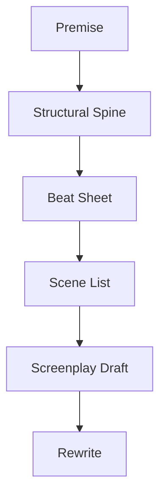
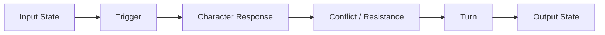
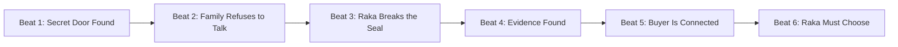
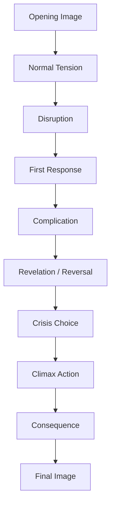
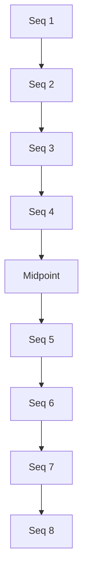
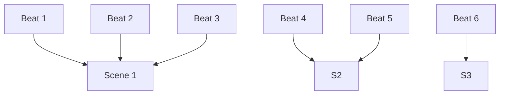
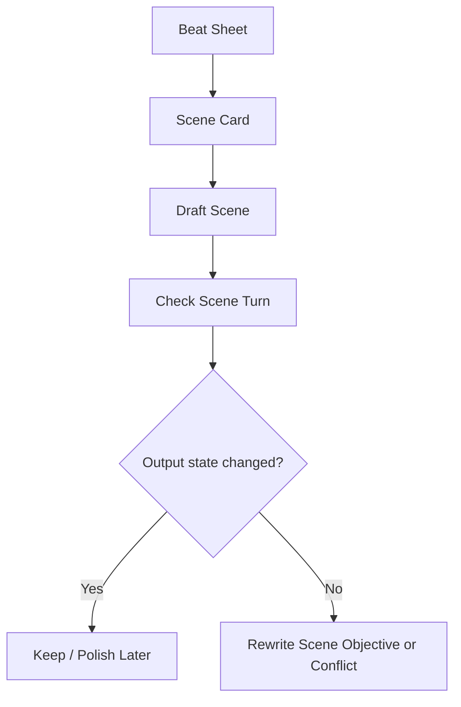
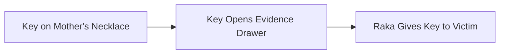

# learn-screenwriting-film-script-part-010.md

# Part 010 — Beat Sheet: Mengubah Cerita Menjadi Rangkaian Perubahan

> Seri: Learn Screenwriting for Film Project  
> Pendekatan: *The First 20 Hours* — Josh Kaufman  
> Fokus bagian ini: mengubah struktur besar menjadi beat-beat dramatik yang bisa dieksekusi menjadi scene, sequence, dan draft screenplay.  
> Target praktis: mampu membuat beat sheet untuk film pendek atau film panjang, memahami fungsi setiap beat, dan menggunakan beat sheet sebagai alat desain, diagnosis, serta rewrite.

---

## 0. Posisi Part Ini dalam Roadmap

Pada Part 009 kita membahas struktur cerita:

```text
Opening → Disruption → Commitment → Attempts → Reversal → Escalation → Crisis → Final Choice → Consequence
```

Struktur itu masih level besar. Ia memberi peta makro.

Sekarang kita masuk ke unit yang lebih kecil: **beat**.

Jika struktur adalah arsitektur sistem, maka beat adalah perubahan state yang terjadi di dalam lifecycle cerita.

Untuk software engineer:

| Screenwriting | Software Engineering Analogy |
|---|---|
| Story structure | System architecture |
| Act | Major subsystem phase |
| Sequence | Workflow stage |
| Scene | Function / transaction boundary |
| Beat | State mutation / event transition |
| Scene turn | Meaningful output change |
| Beat sheet | Execution plan / state transition map |
| Rewrite | Refactor and bug fixing |
| Payoff | Resolved dependency / fulfilled contract |

Beat sheet adalah jembatan antara:

```text
Ide besar → Struktur → Scene list → Draft screenplay
```

Diagram:



Part ini sangat penting karena banyak penulis pemula melompat dari ide langsung ke scene. Akibatnya draft sering:

- kehilangan arah,
- banyak scene filler,
- konflik tidak meningkat,
- midpoint tidak terasa,
- ending tidak earned,
- karakter berubah terlalu tiba-tiba,
- dialog dipakai untuk menambal struktur yang kosong.

Beat sheet membantu mencegah itu.

---

## 1. Prinsip Kaufman dalam Part Ini

Dalam kerangka Josh Kaufman, kita sedang melakukan **deconstruction** dan **deliberate practice**.

Skill besar:

```text
Menulis naskah film
```

dipecah menjadi sub-skill:

```text
Mendesain beat perubahan
```

Target 20 jam pertama bukan membuat beat sheet sempurna. Targetnya:

1. Bisa membedakan event vs beat.
2. Bisa membuat beat yang mengubah sesuatu.
3. Bisa menyusun beat secara sebab-akibat.
4. Bisa menghubungkan beat dengan want, conflict, stakes, dan theme.
5. Bisa mengubah beat sheet menjadi scene list.
6. Bisa mendeteksi beat yang filler.
7. Bisa memperbaiki struktur sebelum menulis draft panjang.

Beat sheet adalah alat untuk **self-correction**. Setelah membuatnya, Anda bisa melihat lubang cerita sebelum membuang banyak energi menulis halaman.

---

## 2. Apa Itu Beat?

Beat adalah unit perubahan dramatik.

Beat bukan sekadar kejadian. Beat adalah momen ketika ada perubahan dalam:

- informasi,
- emosi,
- power,
- keputusan,
- hubungan,
- strategi,
- stakes,
- tujuan,
- keyakinan,
- ancaman,
- arah cerita.

Definisi kerja:

> Beat adalah titik perubahan bermakna yang membuat cerita tidak bisa sepenuhnya kembali ke state sebelumnya.

Contoh event:

```text
Raka masuk ke kantor polisi.
```

Itu belum tentu beat.

Contoh beat:

```text
Raka masuk ke kantor polisi untuk melapor, tetapi melihat foto ayahnya di papan tersangka.
```

Di sini ada perubahan:

- informasi berubah,
- tujuan berubah,
- risiko berubah,
- relasi terhadap ayah berubah,
- dramatic question makin dalam.

---

## 3. Event vs Beat

Ini perbedaan mendasar.

| Event | Beat |
|---|---|
| Sesuatu terjadi | Sesuatu berubah |
| Bisa hanya aktivitas | Punya dampak dramatik |
| Bisa dihapus tanpa mengubah cerita | Jika dihapus, chain cerita rusak |
| Fokus pada kejadian | Fokus pada perubahan state |
| “Apa yang terjadi?” | “Apa yang berubah karena itu?” |

Contoh:

```text
Event:
Mira menelepon ibunya.

Beat:
Mira menelepon ibunya untuk meminta maaf, tetapi ibunya mengira ia menelepon hanya karena butuh uang.
```

Perubahan:

- niat Mira gagal diterima,
- relasi makin retak,
- Mira terdorong memilih cara lain,
- konflik emosional meningkat.

---

## 4. Beat sebagai State Transition

Karena Anda punya background software engineering, gunakan model ini:



Template beat:

```text
Input State:
Trigger:
Character Response:
Resistance:
Turn:
Output State:
```

Contoh:

```text
Input State:
Raka percaya ayahnya hanya korban bisnis gagal.

Trigger:
Ia menemukan kuitansi pembayaran kepada pejabat korup.

Character Response:
Ia mencoba menyembunyikan bukti dari ibunya.

Resistance:
Adiknya sudah memotret dokumen itu dan mengirimkannya ke pengacara.

Turn:
Raka sadar ia bukan satu-satunya yang mengendalikan informasi.

Output State:
Raka kehilangan kontrol dan konflik keluarga mulai terbuka.
```

Beat ini kuat karena output state berbeda dari input state.

---

## 5. Mengapa Beat Sheet Penting?

Beat sheet berguna untuk:

1. Menurunkan struktur besar menjadi langkah eksekusi.
2. Menjaga cerita tetap kausal.
3. Menghindari scene filler.
4. Melihat ritme eskalasi.
5. Mengetahui kapan informasi dibuka.
6. Menjaga character arc tidak loncat.
7. Membantu kolaborasi dengan sutradara/produser.
8. Memudahkan rewrite.
9. Menghemat waktu drafting.
10. Mengurangi ketergantungan pada “mood menulis”.

Beat sheet adalah alat desain. Ia bukan karya final.

Jika beat sheet terasa kaku, bukan berarti alatnya salah. Biasanya beat-nya terlalu abstrak atau terlalu formulaik.

---

## 6. Beat Sheet Bukan Outline yang Sama dengan Scene List

Beat sheet, outline, dan scene list sering tertukar.

| Dokumen | Fokus | Level Detail |
|---|---|---|
| Structural spine | Titik besar cerita | Sangat makro |
| Beat sheet | Perubahan dramatik berurutan | Menengah |
| Scene list | Scene konkret dengan lokasi dan fungsi | Lebih operasional |
| Treatment | Cerita dalam bentuk prosa development | Naratif |
| Screenplay | Format film final/draft | Eksekusi halaman |

Beat sheet menjawab:

```text
Perubahan apa saja yang harus terjadi?
```

Scene list menjawab:

```text
Perubahan itu terjadi dalam scene apa, di lokasi mana, dengan karakter siapa?
```

Satu scene bisa punya banyak beat.  
Satu beat besar bisa dipecah menjadi beberapa scene.  
Dalam film pendek, sering satu beat = satu scene.  
Dalam feature, tidak selalu.

---

## 7. Jenis-Jenis Beat

Beat bisa dibedakan berdasarkan fungsi perubahan.

---

## 8. Story Beat

Story beat adalah perubahan pada plot utama.

Contoh:

```text
Detektif menemukan bahwa korban terakhir masih hidup.
```

Dampak:

- arah penyelidikan berubah,
- antagonis tampak lebih berbahaya,
- dramatic question berubah,
- stakes naik.

Story beat sering menjadi tulang utama beat sheet.

---

## 9. Character Beat

Character beat adalah perubahan dalam diri karakter atau cara penonton memahami karakter.

Contoh:

```text
Untuk pertama kalinya, Rina menolak permintaan ibunya tanpa meminta maaf.
```

Dampak:

- Rina mulai keluar dari pola lama,
- hubungan ibu-anak berubah,
- arc bergerak.

Character beat tidak harus besar. Kadang hanya gesture kecil.

---

## 10. Emotional Beat

Emotional beat adalah perubahan rasa.

Contoh:

```text
Percakapan yang awalnya canggung berubah menjadi intim, lalu retak setelah satu kalimat yang salah.
```

Dalam satu scene, emotional beat bisa berubah beberapa kali:

```text
Curious → Comfortable → Vulnerable → Hurt → Defensive
```

Beat emosional penting untuk dialog dan performance.

---

## 11. Information Beat

Information beat adalah perubahan informasi yang diketahui karakter atau penonton.

Contoh:

```text
Penonton tahu bahwa koper itu kosong, tetapi karakter belum tahu.
```

Atau:

```text
Karakter menemukan bahwa surat itu ditulis bukan oleh ayahnya, tetapi oleh ibunya.
```

Information beat bisa menciptakan:

- mystery,
- suspense,
- dramatic irony,
- revelation,
- reversal.

---

## 12. Decision Beat

Decision beat adalah momen karakter memilih.

Contoh:

```text
Ia memilih berbohong untuk melindungi adiknya.
```

Decision beat sangat penting karena karakter didefinisikan oleh pilihan di bawah tekanan.

Decision beat yang kuat memiliki:

- alternatif yang jelas,
- biaya,
- risiko,
- konsekuensi,
- hubungan dengan flaw/need/theme.

---

## 13. Reversal Beat

Reversal beat adalah momen ketika arah scene atau cerita berbalik.

Contoh:

```text
Raka datang untuk mengancam saksi, tetapi saksi justru menunjukkan bukti bahwa Raka sendiri terlibat.
```

Reversal membuat cerita hidup karena penonton merasa arah tidak statis.

Jenis reversal:

| Jenis | Contoh |
|---|---|
| Power reversal | Yang lemah tiba-tiba memegang bukti |
| Information reversal | Fakta baru membalik asumsi |
| Emotional reversal | Cinta berubah menjadi jijik |
| Moral reversal | Pilihan benar ternyata melukai orang |
| Goal reversal | Tujuan lama menjadi tidak relevan |
| Threat reversal | Ancaman datang dari sumber tak terduga |

---

## 14. Relationship Beat

Relationship beat adalah perubahan hubungan antar karakter.

Contoh:

```text
Dua saudara yang saling menyalahkan akhirnya bekerja sama, tetapi hanya karena mereka sama-sama takut pada ibu mereka.
```

Perubahan bisa berupa:

- trust naik,
- trust turun,
- status berubah,
- rahasia terbuka,
- dependency muncul,
- betrayal terjadi,
- intimacy meningkat,
- distance terbentuk.

Relationship beat sering menjadi inti drama.

---

## 15. Theme Beat

Theme beat adalah momen ketika ide utama film diuji secara konkret.

Misalnya theme question:

```text
Apakah kebenaran tetap bernilai jika menghancurkan orang yang kita cintai?
```

Theme beat:

```text
Tokoh utama menemukan bukti yang bisa menyelamatkan korban, tetapi bukti itu akan menghancurkan ibunya.
```

Theme beat bukan karakter bicara:

```text
"Kebenaran itu penting."
```

Theme beat adalah situasi yang memaksa karakter membayar harga dari nilai tertentu.

---

## 16. Visual Beat

Visual beat adalah perubahan yang disampaikan lewat gambar/tindakan visual.

Contoh:

```text
Awalnya ia menyembunyikan cincin di laci.
Akhirnya ia meletakkan cincin itu di meja makan, terlihat oleh semua orang.
```

Visual beat sangat penting karena film bukan esai. Banyak perubahan terbaik terjadi tanpa dialog.

---

## 17. Beat sebagai Kontrak Perubahan

Setiap beat idealnya bisa ditulis dalam bentuk:

```text
Sebelum beat:
Sesudah beat:
Yang menyebabkan perubahan:
Konsekuensi:
```

Contoh:

```text
Sebelum beat:
Mira percaya kakaknya mengkhianati keluarga.

Sesudah beat:
Mira tahu kakaknya dulu berbohong untuk melindunginya.

Yang menyebabkan perubahan:
Ia menemukan rekaman lama dari malam kecelakaan.

Konsekuensi:
Mira harus meminta bantuan orang yang paling ia benci.
```

Jika Anda tidak bisa menjawab “sebelum” dan “sesudah”, kemungkinan beat itu belum jelas.

---

## 18. Beat Sheet Minimal

Untuk 20 jam pertama, gunakan beat sheet minimal dulu. Jangan langsung membuat 80 beat kompleks.

Template minimal:

```text
Beat Number:
Beat Name:
Story Function:
Before:
Event/Trigger:
Character Action:
Conflict/Opposition:
Turn:
After:
Stakes Change:
Next Question:
```

Penjelasan:

| Field | Fungsi |
|---|---|
| Beat Number | Urutan |
| Beat Name | Nama singkat agar mudah direferensikan |
| Story Function | Fungsi dalam struktur |
| Before | State sebelum beat |
| Event/Trigger | Pemicu |
| Character Action | Apa yang dilakukan karakter |
| Conflict/Opposition | Apa yang menahan/menekan |
| Turn | Perubahan utama |
| After | State setelah beat |
| Stakes Change | Risiko berubah bagaimana |
| Next Question | Pertanyaan yang menarik penonton lanjut |

---

## 19. Contoh Beat Sheet Minimal

Premis:

```text
Seorang anak muda yang ingin menjual rumah warisan ayahnya menemukan bahwa rumah itu menyimpan bukti kejahatan yang bisa menghancurkan keluarganya.
```

Beat contoh:

```text
Beat Number:
01

Beat Name:
Rumah yang Ingin Dijual

Story Function:
Opening / Normal World

Before:
Raka percaya rumah ayahnya hanyalah beban finansial.

Event/Trigger:
Ia datang ke rumah lama untuk menandatangani dokumen penjualan.

Character Action:
Ia memotret kondisi rumah dan menghubungi agen properti.

Conflict/Opposition:
Ibunya menolak masuk ke rumah dan adiknya marah karena rumah itu ingin dijual.

Turn:
Raka menemukan pintu ruang kerja ayahnya disegel dari dalam.

After:
Rumah berubah dari aset mati menjadi tempat yang menyimpan rahasia.

Stakes Change:
Penjualan tidak lagi sekadar transaksi, tetapi bisa membuka masa lalu keluarga.

Next Question:
Apa yang disembunyikan ayah di ruang kerja itu?
```

Beat ini memberi arah ke beat berikutnya.

---

## 20. Beat Chain

Beat tidak berdiri sendiri. Beat harus membentuk chain.



Setiap beat harus mengandung energi menuju beat berikutnya.

Gunakan formula:

```text
Karena beat A, beat B menjadi perlu.
Tapi beat B membuat beat C lebih buruk.
Karena beat C, karakter memilih D.
```

---

## 21. “And Then” vs “But / Therefore”

Ini salah satu prinsip paling berguna dalam desain beat.

Beat lemah:

```text
Raka datang ke rumah.
Lalu ia membuka pintu.
Lalu ia menemukan surat.
Lalu ia menelepon ibunya.
Lalu ia pergi ke kantor polisi.
```

Beat lebih kuat:

```text
Raka datang ke rumah untuk menjualnya.
Tapi ia menemukan pintu ruang kerja ayah disegel.
Karena itu ia membukanya secara paksa.
Tapi di dalamnya ada surat yang menunjukkan ibunya tahu rahasia ayah.
Karena itu ia menelepon ibunya.
Tapi ibunya memperingatkan: jika Raka melapor, adiknya akan ikut terseret.
```

Kata “tapi” dan “karena itu” memaksa cerita menjadi kausal dan konfliktual.

---

## 22. Beat dan Dramatic Question

Setiap beat harus berhubungan dengan dramatic question besar atau sub-question kecil.

Dramatic question besar:

```text
Apakah Raka akan membongkar kebenaran ayahnya atau melindungi keluarganya?
```

Sub-question beat:

| Beat | Sub-question |
|---|---|
| Menemukan ruang tersegel | Apa yang disembunyikan ayah? |
| Ibu melarang masuk | Kenapa ibu takut? |
| Bukti ditemukan | Siapa yang akan terdampak? |
| Adik terseret | Apakah kebenaran terlalu mahal? |
| Buyer mengancam | Apakah Raka bisa keluar dari sistem ini? |

Beat sheet yang baik menjaga penonton terus punya pertanyaan.

---

## 23. Beat dan Stakes

Setiap beberapa beat, stakes harus berubah.

Stakes bukan selalu “mati atau hidup”. Stakes bisa:

- kehilangan cinta,
- kehilangan rumah,
- kehilangan harga diri,
- kehilangan kepercayaan,
- kehilangan masa depan,
- mengkhianati keluarga,
- membiarkan korban tidak mendapat keadilan,
- menjadi seperti orang yang dibenci.

Stakes progression contoh:

```text
Beat 1:
Raka hanya ingin menjual rumah.

Beat 4:
Raka tahu rumah itu menyimpan bukti.

Beat 8:
Bukti itu bisa menghancurkan nama ayahnya.

Beat 12:
Bukti itu juga bisa menjerat ibunya.

Beat 16:
Jika bukti tidak dibuka, korban lain akan disalahkan.

Beat 20:
Raka harus memilih keluarga atau kebenaran.
```

Stakes naik karena makin personal dan makin moral.

---

## 24. Beat dan Character Arc

Beat harus memperlihatkan perubahan karakter secara bertahap.

Contoh flaw:

```text
Raka selalu menghindari konflik keluarga.
```

Arc beat progression:

| Beat | Manifestasi Flaw/Arc |
|---|---|
| Beat 1 | Ia ingin menjual rumah cepat agar tidak bicara masa lalu |
| Beat 3 | Ia berbohong kepada ibunya |
| Beat 6 | Ia menyalahkan adiknya |
| Beat 9 | Ia mencoba menyuap saksi agar diam |
| Beat 12 | Ia melihat dampak kebohongan ayah |
| Beat 15 | Ia mengaku kepada adiknya bahwa ia takut menjadi seperti ayah |
| Beat 18 | Ia memilih membuka bukti meski keluarga hancur |
| Beat 20 | Ia menghadapi konsekuensi tanpa kabur |

Arc bukan satu momen mendadak. Arc adalah chain pilihan.

---

## 25. Beat dan Theme

Tema harus diuji dalam beat-beat penting.

Theme question:

```text
Apakah melindungi keluarga tetap benar jika perlindungan itu dibangun di atas kebohongan?
```

Beat tematik:

| Beat | Ujian Tema |
|---|---|
| Raka menjual rumah | Keluarga sebagai beban |
| Ibu melarang membuka ruang | Perlindungan lewat diam |
| Bukti ditemukan | Kebenaran sebagai ancaman |
| Adik terseret | Cinta sebagai alasan manipulasi |
| Korban muncul | Kebohongan punya korban nyata |
| Crisis | Pilih keluarga atau kebenaran |
| Climax | Menentukan definisi cinta yang baru |

Jika tema tidak muncul dalam beat, tema akan terasa seperti tempelan.

---

## 26. Beat dan Oposisi

Beat tanpa oposisi sering datar.

Oposisi bisa datang dari:

- antagonis,
- orang terdekat,
- sistem,
- waktu,
- ruang,
- aturan,
- rahasia,
- rasa takut karakter,
- kebutuhan fisik,
- moral dilemma.

Template:

```text
Karakter ingin:
Oposisi:
Tekanan:
Pilihan:
Konsekuensi:
```

Contoh:

```text
Karakter ingin:
Membawa bukti ke polisi.

Oposisi:
Ibunya mengatakan bukti itu akan membuat adiknya dipenjara.

Tekanan:
Polisi akan datang dalam satu jam.

Pilihan:
Serahkan bukti atau hancurkan.

Konsekuensi:
Apa pun pilihannya, ia kehilangan sebagian keluarganya.
```

---

## 27. Beat dan Reversal

Setiap beat tidak harus punya reversal besar. Tapi beat sheet yang datar biasanya kekurangan turn.

Pertanyaan:

1. Apa asumsi karakter sebelum beat?
2. Bagaimana beat membalik, memperumit, atau memperdalam asumsi itu?
3. Apa yang sekarang tidak bisa dilakukan karakter seperti sebelumnya?

Contoh:

```text
Asumsi:
Raka mengira agen properti hanya ingin membeli rumah.

Reversal:
Agen itu ternyata anak korban lama ayahnya.

Dampak:
Transaksi properti berubah menjadi tuntutan moral.
```

---

## 28. Beat dan Pacing

Beat sheet membantu melihat pacing.

Jika terlalu banyak beat dengan fungsi sama, cerita terasa repetitif.

Contoh beat repetitif:

```text
1. Karakter takut bicara.
2. Karakter menghindari bicara.
3. Karakter tidak menjawab telepon.
4. Karakter pergi saat ditanya.
5. Karakter diam di meja makan.
```

Semua menunjukkan avoidance. Setelah dua kali, penonton sudah paham.

Lebih baik progression:

```text
1. Karakter menghindari pertanyaan.
2. Penghindaran membuat orang lain curiga.
3. Ia berbohong untuk menutupinya.
4. Kebohongan menyakiti orang terdekat.
5. Ia dipaksa memilih antara mengaku atau kehilangan relasi.
```

Ini bukan repetisi. Ini eskalasi.

---

## 29. Beat Density

Beat density adalah kepadatan perubahan dalam durasi tertentu.

Film pendek biasanya butuh beat density lebih tinggi karena durasi pendek.

Feature bisa memberi lebih banyak ruang, tetapi tetap butuh perubahan berkala.

Panduan kasar:

| Format | Jumlah Beat Kerja Awal |
|---|---:|
| Film pendek 3–5 menit | 5–8 beat |
| Film pendek 8–12 menit | 10–18 beat |
| Film pendek 15–20 menit | 18–30 beat |
| Feature 90–110 menit | 40–80 beat kerja |
| Opening 10 halaman feature | 8–15 beat |

Catatan:

- Ini bukan aturan absolut.
- Beat kecil bisa digabung.
- Beat emosional bisa terjadi dalam scene yang sama.
- Gunakan sebagai alat perencanaan, bukan hukum.

---

## 30. Beat Sheet untuk Film Pendek

Film pendek butuh efisiensi.

Struktur beat sederhana:

```text
1. Opening image
2. Normal tension
3. Disruption
4. First response
5. Complication
6. Revelation or reversal
7. Crisis choice
8. Climax action
9. Consequence
10. Final image
```

Diagram:



Film pendek yang kuat sering tidak punya banyak subplot. Energinya terkonsentrasi.

---

## 31. Template Beat Sheet Film Pendek

```text
# Short Film Beat Sheet

Working Title:
Duration:
Genre:
Tone:
Theme Question:
Dramatic Question:

Beat 01 — Opening Image
Before:
Event:
After:
Function:

Beat 02 — Normal Tension
Before:
Event:
After:
Function:

Beat 03 — Disruption
Before:
Event:
After:
Function:

Beat 04 — First Response
Before:
Event:
After:
Function:

Beat 05 — Complication
Before:
Event:
After:
Function:

Beat 06 — Revelation / Reversal
Before:
Event:
After:
Function:

Beat 07 — Crisis Choice
Before:
Event:
After:
Function:

Beat 08 — Climax Action
Before:
Event:
After:
Function:

Beat 09 — Consequence
Before:
Event:
After:
Function:

Beat 10 — Final Image
Before:
Event:
After:
Function:
```

---

## 32. Contoh Beat Sheet Film Pendek

Premis:

```text
Seorang perempuan yang hendak meninggalkan kota menerima paket terakhir dari ayahnya yang sudah meninggal: rekaman suara yang membongkar bahwa ia selama ini salah membenci ibunya.
```

Beat sheet:

```text
Beat 01 — Opening Image
Before:
Naya berdiri di terminal bus dengan koper kecil, siap pergi.

Event:
Ia menolak telepon dari ibunya.

After:
Penonton melihat Naya ingin memutus hubungan dengan rumah.

Function:
Establish character state and emotional distance.

Beat 02 — Normal Tension
Before:
Naya merasa pergi adalah satu-satunya cara bebas.

Event:
Kurir datang membawa paket atas nama ayahnya.

After:
Kepergiannya tertunda oleh masa lalu.

Function:
Introduce unresolved emotional hook.

Beat 03 — Disruption
Before:
Naya mengira paket itu barang sentimental biasa.

Event:
Ia menemukan kaset rekaman bertuliskan “untuk hari ketika kamu pergi”.

After:
Ayah yang sudah mati seolah kembali masuk ke hidupnya.

Function:
Activate dramatic question.

Beat 04 — First Response
Before:
Naya penasaran tapi marah.

Event:
Ia hampir membuang kaset, lalu memutarnya di ruang tunggu.

After:
Ia mendengar suara ayah meminta maaf.

Function:
Force engagement.

Beat 05 — Complication
Before:
Naya percaya ibunya penyebab ayah pergi.

Event:
Rekaman menyebut bahwa ayah pergi karena malu atas kesalahannya sendiri.

After:
Keyakinan Naya mulai retak.

Function:
Information reversal.

Beat 06 — Revelation
Before:
Naya masih ingin menyalahkan seseorang.

Event:
Ayah mengaku ibunya menanggung kebencian Naya agar Naya tetap punya figur ayah.

After:
Naya sadar ibunya melindungi kenangan ayah dengan mengorbankan diri.

Function:
Theme beat: cinta sebagai pengorbanan yang tidak terlihat.

Beat 07 — Crisis Choice
Before:
Bus akan berangkat.

Event:
Ibunya menelepon lagi.

After:
Naya harus memilih pergi seperti rencana atau menjawab.

Function:
Hard choice.

Beat 08 — Climax Action
Before:
Naya masih bisa kabur dari percakapan.

Event:
Ia menjawab telepon tetapi tidak langsung bicara.

After:
Untuk pertama kalinya ia membiarkan ibunya mendengar tangisnya.

Function:
Emotional climax.

Beat 09 — Consequence
Before:
Hubungan ibu-anak beku.

Event:
Naya berkata, “Bu, aku ketinggalan bus.”

After:
Itu bukan kegagalan, tetapi keputusan untuk tinggal sebentar.

Function:
Resolve dramatic question.

Beat 10 — Final Image
Before:
Naya siap pergi sendiri.

Event:
Ia duduk di terminal, koper di samping, telepon tetap menempel di telinga.

After:
Kepergian berubah menjadi kemungkinan pulang.

Function:
Final image mirrors opening.
```

Perhatikan bahwa film pendek ini tidak butuh banyak lokasi. Beat-nya terkonsentrasi pada satu keputusan emosional.

---

## 33. Beat Sheet untuk Feature Film

Untuk feature, beat sheet bisa mengikuti 8 sequence.

Struktur kerja:

```text
Sequence 1: Setup and disturbance
Sequence 2: Lock-in
Sequence 3: First attempts
Sequence 4: Midpoint build
Sequence 5: New direction
Sequence 6: Escalation and damage
Sequence 7: Crisis
Sequence 8: Climax and resolution
```

Setiap sequence bisa punya 5–10 beat kerja.

Diagram:



---

## 34. Template Beat Sheet Feature

```text
# Feature Beat Sheet

Working Title:
Genre:
Tone:
Target Length:
Theme Question:
Dramatic Question:
Protagonist:
Antagonistic Force:

## Sequence 1 — Setup and Disturbance
Function:
Sequence Goal:
Sequence Turn:
Beats:
1.
2.
3.
4.
5.

## Sequence 2 — Lock-In
Function:
Sequence Goal:
Sequence Turn:
Beats:
1.
2.
3.
4.
5.

## Sequence 3 — First Attempts
Function:
Sequence Goal:
Sequence Turn:
Beats:
1.
2.
3.
4.
5.

## Sequence 4 — Midpoint Build
Function:
Sequence Goal:
Sequence Turn:
Beats:
1.
2.
3.
4.
5.

## Midpoint
Reversal/Revelation:
What changes:

## Sequence 5 — New Direction
Function:
Sequence Goal:
Sequence Turn:
Beats:
1.
2.
3.
4.
5.

## Sequence 6 — Escalation and Damage
Function:
Sequence Goal:
Sequence Turn:
Beats:
1.
2.
3.
4.
5.

## Sequence 7 — Crisis
Function:
Sequence Goal:
Sequence Turn:
Beats:
1.
2.
3.
4.
5.

## Sequence 8 — Climax and Resolution
Function:
Sequence Goal:
Sequence Turn:
Beats:
1.
2.
3.
4.
5.
```

---

## 35. Beat Naming

Beri nama beat agar mudah didiskusikan.

Nama buruk:

```text
Beat 14
```

Nama lebih berguna:

```text
Beat 14 — Ibu Mengaku Berbohong
Beat 15 — Raka Membakar Dokumen yang Salah
Beat 16 — Korban Datang ke Rumah
```

Nama beat harus cukup spesifik untuk mengingat fungsi perubahan.

Gunakan pola:

```text
[Karakter] + [Aksi/Perubahan]
```

Atau:

```text
[Revelation/Decision] + [Konsekuensi]
```

---

## 36. Beat Function Label

Selain nama, beri label fungsi.

Contoh label:

- Opening Image
- Inciting Incident
- Debate
- Lock-In
- First Attempt
- First Failure
- Relationship Turn
- Information Reveal
- Midpoint
- Reversal
- Escalation
- Betrayal
- False Victory
- False Defeat
- All Is Lost
- Crisis
- Climax
- Resolution
- Final Image

Ini membantu melihat apakah beat sheet terlalu berat di satu fungsi.

Misalnya terlalu banyak:

```text
Information Reveal
Information Reveal
Information Reveal
Information Reveal
```

Maka film bisa terasa seperti investigasi eksposisi tanpa tindakan emosional.

---

## 37. Beat Sheet sebagai Debugging Tool

Beat sheet bisa didiagnosis seperti sequence log.

Pertanyaan:

1. Apakah beat 1 menyebabkan beat 2?
2. Apakah beat 2 meningkatkan tekanan?
3. Apakah protagonist aktif memilih?
4. Apakah oposisi merespons?
5. Apakah stakes berubah?
6. Apakah ada reversal?
7. Apakah character arc bergerak?
8. Apakah tema diuji?
9. Apakah beat bisa dihapus?
10. Apakah ending membayar beat awal?

Jika beat sheet tidak kuat, draft biasanya juga tidak kuat.

---

## 38. Common Beat Problems

### 38.1 Beat hanya aktivitas

Contoh:

```text
Raka naik bus.
Raka makan.
Raka tidur.
Raka berjalan.
```

Solusi:

Tambahkan perubahan:

```text
Raka naik bus untuk kabur, tetapi di kursi belakang ia melihat ibunya diam-diam mengikutinya.
```

---

### 38.2 Beat tidak punya konsekuensi

Jika beat terjadi tetapi tidak memengaruhi beat berikutnya, beat itu lemah.

Pertanyaan:

```text
Apa yang menjadi mustahil setelah beat ini?
Apa yang menjadi perlu setelah beat ini?
Apa yang menjadi lebih mahal setelah beat ini?
```

---

### 38.3 Beat terlalu abstrak

Contoh:

```text
Raka menghadapi masa lalu.
```

Ini terlalu abstrak.

Lebih konkret:

```text
Raka membuka ruang kerja ayahnya dan menemukan seragam lama yang masih berbau asap kebakaran.
```

---

### 38.4 Beat menjelaskan tema

Contoh:

```text
Raka menyadari bahwa kebenaran itu penting.
```

Lebih dramatik:

```text
Raka menghapus rekaman yang bisa menyelamatkan dirinya, lalu melihat adiknya ditangkap karena bukti itu hilang.
```

---

### 38.5 Beat tidak punya konflik

Contoh:

```text
Mira meminta maaf dan ibunya memaafkan.
```

Bisa saja ini terjadi, tetapi jika terlalu mudah, drama hilang.

Lebih kuat:

```text
Mira meminta maaf, tetapi ibunya berkata ia sudah terlalu lelah untuk menerima maaf yang datang setiap kali Mira butuh pulang.
```

---

## 39. Beat Sheet dan Scene List

Setelah beat sheet dibuat, langkah berikutnya adalah mengelompokkan beat menjadi scene.

Contoh:

| Beat | Bisa Menjadi Scene? |
|---|---|
| Raka datang ke rumah | Scene 1 |
| Ibu menolak masuk | Scene 1 |
| Pintu ruang kerja ditemukan | Scene 1 |
| Raka membuka ruang kerja | Scene 2 |
| Dokumen ditemukan | Scene 2 |
| Adik memotret dokumen | Scene 2 |
| Agen properti datang | Scene 3 |

Satu scene bisa memuat 2–5 beat, selama masih dalam satu location/time unit dan punya turn yang jelas.

Diagram:



---

## 40. Beat Granularity

Granularity terlalu besar:

```text
Raka menemukan rahasia keluarga.
```

Masalah: tidak actionable.

Granularity terlalu kecil:

```text
Raka mengangkat tangan.
Raka menyentuh gagang pintu.
Raka menarik napas.
Raka memutar gagang pintu.
```

Masalah: terlalu mikro untuk beat sheet awal.

Granularity tepat:

```text
Raka membuka pintu ruang kerja ayah meski ibunya melarang, dan menemukan dokumen yang membuat penjualan rumah mustahil.
```

Beat sheet kerja harus berada di level perubahan dramatik, bukan blocking detail.

---

## 41. Beat Sheet dan Drafting

Saat menulis draft, beat sheet bukan borgol. Ia adalah peta.

Gunakan beat sheet untuk memastikan scene punya arah, tetapi tetap izinkan discovery saat menulis.

Workflow:



Saat drafting, pertanyaan utama:

```text
Beat apa yang harus berubah di scene ini?
```

Bukan:

```text
Apa dialog keren yang bisa dimasukkan?
```

---

## 42. Beat Sheet dan Rewrite

Saat draft selesai, beat sheet bisa dipakai untuk rewrite.

Tandai setiap beat:

- KEEP
- CUT
- COMBINE
- MOVE
- SPLIT
- ESCALATE
- CLARIFY
- VISUALIZE
- MAKE COSTLY
- MAKE ACTIVE

Contoh diagnosis:

```text
Beat 07 — Raka bertanya kepada ibu tentang ayah
Status: WEAK
Problem: ibu menjawab terlalu mudah
Fix: ibu berbohong, tetapi adik menangkap kebohongan itu
Result: conflict naik dan relationship beat muncul
```

Rewrite menjadi lebih terarah.

---

## 43. Beat Severity

Mirip bug severity, masalah beat punya tingkat.

| Severity | Masalah | Dampak |
|---|---|---|
| Blocker | Beat kunci tidak ada | Struktur runtuh |
| Major | Beat ada tapi tidak mengubah arah | Cerita datar |
| Medium | Beat terlalu abstrak | Draft sulit dieksekusi |
| Minor | Beat kurang visual | Bisa diperbaiki saat scene writing |
| Polish | Beat sudah fungsi, butuh ritme | Dialog/action polish |

Contoh blocker:

```text
Tidak ada crisis choice sebelum climax.
```

Contoh major:

```text
Midpoint ada, tetapi tidak mengubah goal/stakes.
```

Contoh medium:

```text
Beat tertulis “karakter berubah”.
```

---

## 44. Beat Dependency

Beberapa beat membutuhkan setup.

Contoh payoff:

```text
Beat 03:
Raka melihat ibunya selalu menyimpan kunci kecil di kalung.

Beat 17:
Raka sadar kunci itu membuka laci bukti ayahnya.

Beat 22:
Raka memilih memberikan kunci itu kepada korban, bukan menyimpannya untuk keluarga.
```

Dependency:



Payoff terasa earned karena sudah ada setup.

---

## 45. Setup dan Payoff dalam Beat Sheet

Beat sheet harus menandai setup dan payoff.

Template:

```text
Setup Beat:
What is planted:
Expected payoff:
Actual payoff:
Emotional meaning:
```

Contoh:

```text
Setup Beat:
Beat 02

What is planted:
Ibu selalu melarang siapa pun masuk ruang kerja ayah.

Expected payoff:
Ruang itu menyimpan rahasia.

Actual payoff:
Ruang itu bukan menyimpan bukti kejahatan ayah, tetapi bukti bahwa ibu ikut menutupinya.

Emotional meaning:
Larangan ibu bukan hanya perlindungan, tapi rasa bersalah.
```

---

## 46. Beat Sheet dan Repetition with Variation

Pengulangan bisa kuat jika berubah makna.

Contoh:

Beat awal:

```text
Raka menolak menjawab telepon ibunya.
```

Beat tengah:

```text
Raka menjawab telepon ibunya, tetapi berbohong.
```

Beat akhir:

```text
Raka menelepon ibunya lebih dulu dan mengatakan kebenaran.
```

Ini repetition with variation.

Diagram:


Pengulangan menunjukkan arc.

---

## 47. Beat Sheet dan Visual Motif

Beat sheet bisa menandai motif visual.

Contoh motif: pintu terkunci.

| Beat | Motif | Makna |
|---|---|---|
| Beat 01 | Raka mengunci pintu rumah lama | Menghindari masa lalu |
| Beat 05 | Ia membuka ruang kerja ayah | Memasuki rahasia |
| Beat 14 | Ibu mengunci pintu dari dalam | Menolak kebenaran |
| Beat 20 | Raka meninggalkan pintu terbuka | Menerima konsekuensi |

Motif membuat beat lebih filmik.

---

## 48. Beat Sheet dan Emotional Rhythm

Beat sheet bukan hanya plot. Tandai emotional rhythm.

Contoh:

```text
Beat 01: Detached
Beat 02: Irritated
Beat 03: Curious
Beat 04: Afraid
Beat 05: Defensive
Beat 06: Angry
Beat 07: Guilty
Beat 08: Determined
```

Jika semua beat punya emosi sama, film terasa datar.

Pertanyaan:

```text
Apakah emosi berubah?
Apakah perubahan emosi dipicu oleh konflik?
Apakah emosi berikutnya lebih dalam, bukan sekadar lebih keras?
```

---

## 49. Beat Sheet dan Character Agency

Cek apakah karakter aktif.

Beat pasif:

```text
Raka diberi tahu bahwa ayahnya bersalah.
Raka diberi tahu bahwa ibunya berbohong.
Raka diberi tahu bahwa rumah itu berbahaya.
```

Beat aktif:

```text
Raka mencuri dokumen.
Raka memaksa ibunya bicara.
Raka menjebak agen properti.
Raka memilih menyembunyikan bukti.
```

Agency bukan berarti karakter selalu menang. Agency berarti karakter membuat pilihan yang menyebabkan konsekuensi.

---

## 50. Beat Sheet dan Conflict Escalation

Gunakan escalation ladder.

```text
1. Discomfort
2. Disagreement
3. Resistance
4. Threat
5. Loss
6. Betrayal
7. Moral compromise
8. Irreversible choice
```

Contoh progression:

| Beat | Escalation |
|---|---|
| Beat 02 | Ibu tidak nyaman bicara ayah |
| Beat 04 | Ibu melarang masuk ruang kerja |
| Beat 06 | Ibu mengancam tidak mengakui Raka |
| Beat 09 | Adik kehilangan pekerjaan karena kasus terbuka |
| Beat 12 | Saksi lama muncul menuntut |
| Beat 16 | Raka memalsukan dokumen |
| Beat 19 | Raka harus menyerahkan ibunya atau membiarkan korban dihukum |

Eskalasi harus membuat pilihan makin sempit.

---

## 51. Beat Sheet dan Genre

Genre memengaruhi jenis beat.

### 51.1 Drama

Beat utama:

- emotional revelation,
- relationship turn,
- moral choice,
- internal contradiction,
- reconciliation or rupture.

### 51.2 Thriller

Beat utama:

- clue,
- threat,
- pursuit,
- reversal,
- trap,
- reveal,
- ticking clock.

### 51.3 Horror

Beat utama:

- disturbance,
- denial,
- warning,
- first manifestation,
- false explanation,
- escalation,
- isolation,
- confrontation.

### 51.4 Romance

Beat utama:

- meet/collision,
- attraction,
- resistance,
- vulnerability,
- misunderstanding,
- separation,
- choice,
- reunion or mature goodbye.

### 51.5 Comedy

Beat utama:

- comic premise,
- social pressure,
- lie escalation,
- embarrassment,
- reversal,
- exposure,
- emotional correction.

### 51.6 Mystery

Beat utama:

- question,
- clue,
- false lead,
- contradiction,
- suspect shift,
- revelation,
- reframe,
- solution.

Genre bukan formula kaku, tetapi membantu memastikan beat memenuhi janji pengalaman.

---

## 52. Beat Sheet untuk Genre Hybrid

Jika genre hybrid, tentukan primary beat engine.

Contoh:

```text
Romantic thriller
```

Mana engine utama?

- Jika romance utama: thriller menguji hubungan.
- Jika thriller utama: romance menaikkan stakes emosional.

Jangan biarkan dua genre saling berebut struktur.

Template:

```text
Primary Genre:
Primary Beat Engine:
Secondary Genre:
Secondary Beat Function:
Where they merge:
Where they conflict:
Final genre promise:
```

---

## 53. Beat Sheet dan Tone

Tone juga memengaruhi beat.

Beat yang sama bisa punya tone berbeda.

Premis:

```text
Seorang pria menemukan koper misterius di bandara.
```

Drama:

```text
Koper itu milik ayah yang meninggalkannya.
```

Thriller:

```text
Koper itu berisi bukti pembunuhan dan pelacak aktif.
```

Comedy:

```text
Koper itu tertukar dengan koper pejabat, dan semua orang mengira dia mata-mata.
```

Romance tragic:

```text
Koper itu berisi gaun pengantin perempuan yang meninggalkannya.
```

Beat sheet harus sesuai tone. Jika tone gelap, beat tidak boleh terlalu mudah menyelesaikan konflik. Jika tone komedi, beat harus punya surprise sosial/psikologis.

---

## 54. Beat Sheet dan Production Constraint

Karena target Anda adalah project film, beat sheet harus sadar produksi.

Tandai:

- lokasi,
- jumlah karakter,
- night/day,
- crowd,
- vehicle,
- stunt,
- VFX,
- special props,
- sound requirement.

Beat mahal bisa diganti tanpa kehilangan fungsi.

Contoh beat mahal:

```text
Raka mengejar agen properti di jalan raya saat hujan, menyebabkan tabrakan beruntun.
```

Fungsi beat:

```text
Raka kehilangan bukti dan sadar lawannya lebih kuat.
```

Versi lebih feasible:

```text
Di ruang arsip sempit, lampu mati. Saat menyala, map bukti di tangan Raka sudah tertukar.
```

Fungsi tetap, biaya turun.

---

## 55. Beat Cost Matrix

Gunakan matrix:

| Beat | Dramatic Value | Production Cost | Keep/Modify |
|---|---:|---:|---|
| Kejar-kejaran mobil | 7 | 10 | Modify |
| Konfrontasi di ruang arsip | 8 | 3 | Keep |
| Crowd protest | 6 | 9 | Modify |
| Rekaman suara ayah | 8 | 2 | Keep |
| Rumah terbakar | 7 | 10 | Replace |

Prinsip:

```text
Pertahankan fungsi dramatik, ubah bentuk eksekusi jika terlalu mahal.
```

---

## 56. Beat Review dengan Tim

Beat sheet bisa dipakai sebelum draft untuk diskusi dengan tim.

Pertanyaan ke sutradara:

```text
Beat mana yang paling visual?
Beat mana yang paling sulit dieksekusi?
Beat mana yang punya potensi blocking menarik?
```

Pertanyaan ke produser:

```text
Beat mana yang mahal?
Beat mana yang bisa digabung lokasi?
Beat mana yang butuh izin khusus?
```

Pertanyaan ke aktor:

```text
Beat mana yang playable?
Beat mana yang motivasinya belum jelas?
Beat mana yang perubahan emosinya terlalu mendadak?
```

Beat sheet mempercepat feedback karena belum terlalu mahal secara waktu.

---

## 57. Latihan 1 — Event ke Beat

Ubah event berikut menjadi beat.

Event:

```text
Karakter pulang ke rumah.
```

Pertanyaan:

1. Pulang untuk apa?
2. Apa yang dia harapkan?
3. Apa yang dia temukan?
4. Apa yang berubah?
5. Apa konsekuensinya?

Contoh jawaban:

```text
Karakter pulang ke rumah untuk mengambil akta kelahiran, tetapi menemukan kamar lamanya sudah disewakan kepada orang asing. Ia sadar keluarganya sudah menghapus ruang untuknya bahkan sebelum ia benar-benar pergi.
```

Latihan:

Ubah 10 event ini menjadi beat:

```text
1. Karakter menerima pesan.
2. Karakter bertemu teman lama.
3. Karakter membuka lemari.
4. Karakter menunggu bus.
5. Karakter makan malam.
6. Karakter kehilangan dompet.
7. Karakter membaca surat.
8. Karakter melihat foto.
9. Karakter mematikan lampu.
10. Karakter menutup pintu.
```

---

## 58. Latihan 2 — Beat Before/After

Untuk setiap beat, isi:

```text
Beat:
Before:
After:
What changed:
Why it matters:
```

Contoh:

```text
Beat:
Mira melihat ibunya memakai kalung milik ayah.

Before:
Mira percaya ibunya membenci ayah.

After:
Mira sadar ibunya masih menyimpan cinta atau rasa bersalah.

What changed:
Pemahaman Mira tentang relasi orang tuanya.

Why it matters:
Kebencian Mira kepada ibunya mulai tidak stabil.
```

Buat minimal 15 beat.

---

## 59. Latihan 3 — Beat Causality Chain

Ambil 10 beat dan hubungkan dengan:

- karena itu,
- tapi,
- sehingga,
- akibatnya,
- namun.

Contoh:

```text
Beat 01:
Raka menemukan ruang tersegel.

Karena itu:
Ia membukanya.

Tapi:
Ibunya melihat dan mengancam akan memutus hubungan.

Sehingga:
Raka membuka ruang itu diam-diam malam hari.

Akibatnya:
Adiknya curiga dan mengikutinya.

Namun:
Adiknya justru menemukan bukti lebih dulu.
```

Tujuan: menghapus beat acak.

---

## 60. Latihan 4 — Beat Escalation

Buat 8 beat eskalasi dari konflik sederhana.

Konflik:

```text
Anak ingin pergi dari rumah, ibu ingin ia tinggal.
```

Beat escalation:

```text
1. Anak diam-diam membeli tiket.
2. Ibu menemukan tiket tapi pura-pura tidak tahu.
3. Ibu meminta anak mengantar ke rumah sakit pada hari keberangkatan.
4. Anak tahu jadwal rumah sakit itu palsu.
5. Ibu mengaku takut mati sendirian.
6. Anak marah karena merasa dimanipulasi.
7. Ibu jatuh sungguhan saat anak hendak pergi.
8. Anak harus memilih naik bus terakhir atau membawa ibu ke rumah sakit.
```

Perhatikan: konflik naik dari taktik kecil ke pilihan emosional.

---

## 61. Latihan 5 — Beat Sheet Film Pendek 10 Beat

Buat beat sheet film pendek dengan template:

```text
Title:
Duration:
Genre:
Tone:
Theme Question:
Dramatic Question:

Beat 01:
Before:
Event:
After:
Function:

Beat 02:
Before:
Event:
After:
Function:

Beat 03:
Before:
Event:
After:
Function:

Beat 04:
Before:
Event:
After:
Function:

Beat 05:
Before:
Event:
After:
Function:

Beat 06:
Before:
Event:
After:
Function:

Beat 07:
Before:
Event:
After:
Function:

Beat 08:
Before:
Event:
After:
Function:

Beat 09:
Before:
Event:
After:
Function:

Beat 10:
Before:
Event:
After:
Function:
```

Target:

- selesai dalam 45 menit,
- jangan edit terlalu lama,
- fokus pada perubahan,
- pastikan beat 07 adalah crisis,
- pastikan beat 10 adalah final image.

---

## 62. Latihan 6 — Beat Sheet Opening Feature 10 Halaman

Untuk feature, jangan langsung 80 beat. Mulai dari opening 10 halaman.

Buat 12 beat:

```text
1. Opening image
2. Protagonist routine
3. Hidden flaw
4. Relationship pressure
5. World pressure
6. Small disruption
7. Protagonist avoids
8. Bigger disruption
9. First choice
10. Consequence
11. Dramatic question activated
12. Hook into next sequence
```

Tujuan:

- opening tidak hanya eksposisi,
- flaw terlihat lewat tindakan,
- dunia terasa,
- konflik mulai aktif.

---

## 63. Practice Plan 90 Menit

Gunakan latihan berikut untuk part ini.

| Durasi | Aktivitas | Output |
|---:|---|---|
| 10 menit | Baca ulang structural spine Part 009 | Pemanasan konteks |
| 15 menit | Tulis 20 event kasar | Raw event list |
| 20 menit | Ubah event menjadi beat before/after | Beat candidate |
| 20 menit | Susun beat dengan but/therefore | Causality chain |
| 15 menit | Tandai function label | Beat function map |
| 10 menit | Hapus/gabung beat lemah | Beat sheet v0.1 |

Aturan:

- Jangan menulis scene panjang.
- Jangan polish dialog.
- Jangan terlalu cepat mencari referensi.
- Fokus pada perubahan state.

---

## 64. Beat Sheet Review Checklist

Gunakan checklist ini.

### 64.1 Clarity

- [ ] Apakah setiap beat punya nama jelas?
- [ ] Apakah before/after terlihat?
- [ ] Apakah fungsi beat jelas?
- [ ] Apakah protagonist terlibat aktif?
- [ ] Apakah opposition terlihat?

### 64.2 Causality

- [ ] Apakah beat saling menyebabkan?
- [ ] Apakah terlalu banyak “lalu”?
- [ ] Apakah ada beat yang bisa ditukar urutannya tanpa efek?
- [ ] Apakah setiap beat menarik pertanyaan berikutnya?

### 64.3 Escalation

- [ ] Apakah stakes naik?
- [ ] Apakah konflik makin personal?
- [ ] Apakah pilihan makin sempit?
- [ ] Apakah midpoint/reversal mengubah arah?
- [ ] Apakah crisis benar-benar pilihan sulit?

### 64.4 Character

- [ ] Apakah flaw muncul dalam tindakan?
- [ ] Apakah karakter belajar atau makin tenggelam?
- [ ] Apakah arc bertahap?
- [ ] Apakah perubahan final earned?

### 64.5 Theme

- [ ] Apakah tema diuji lewat pilihan?
- [ ] Apakah antagonis membawa counter-value?
- [ ] Apakah ending membayar theme question?

### 64.6 Filmic Quality

- [ ] Apakah beat bisa divisualkan?
- [ ] Apakah terlalu banyak beat berupa “menyadari”?
- [ ] Apakah ada gesture, object, silence, atau visual motif?
- [ ] Apakah beat terlalu mahal untuk produksi?

---

## 65. Beat Anti-Pattern

### 65.1 Beat “Menyadari”

```text
Karakter menyadari bahwa ia mencintai ibunya.
```

Masalah:

- internal,
- tidak filmik,
- tidak ada aksi.

Perbaiki:

```text
Karakter yang selalu menolak masakan ibunya diam-diam membungkus sisa makanan itu sebelum pergi.
```

---

### 65.2 Beat “Membicarakan Plot”

```text
Dua karakter duduk dan menjelaskan masa lalu.
```

Perbaiki:

```text
Dua karakter berebut membuang barang peninggalan masa lalu; setiap barang membuka versi berbeda dari kejadian yang sama.
```

---

### 65.3 Beat Tanpa Harga

```text
Karakter memilih jujur, semua orang menerima.
```

Perbaiki:

```text
Karakter memilih jujur dan kehilangan satu-satunya orang yang selama ini ia coba lindungi.
```

---

### 65.4 Beat Random

```text
Tiba-tiba ada kebakaran.
```

Perbaiki:

```text
Karena karakter menyembunyikan bukti di dapur tua, kompor bocor yang sejak awal diperlihatkan akhirnya memicu kebakaran kecil yang menghancurkan bukti palsu, bukan bukti asli.
```

---

### 65.5 Beat Terlalu Nyaman

```text
Karakter ingin sesuatu, lalu mendapatkannya.
```

Perbaiki:

```text
Karakter mendapatkan yang ia inginkan, tetapi dalam bentuk yang membuatnya harus mengorbankan sesuatu yang lebih penting.
```

---

## 66. Beat Sheet as Test Suite

Anggap beat sheet seperti test suite cerita.

Test utama:

```text
Given karakter punya flaw tertentu,
When tekanan tertentu terjadi,
Then karakter memilih strategi tertentu,
And konsekuensinya mendorong cerita ke tekanan berikutnya.
```

Contoh:

```text
Given Raka selalu menghindari konflik keluarga,
When ia menemukan bukti kejahatan ayah,
Then ia menyembunyikan bukti dari ibunya,
And konsekuensinya adiknya kehilangan kepercayaan padanya.
```

Jika “Then” tidak berakar pada flaw, karakter terasa generik.  
Jika “And” tidak memicu beat berikutnya, cerita kehilangan chain.

---

## 67. Beat Sheet Versioning

Gunakan versi.

```text
beat-sheet-v0.1.md — raw beat dump
beat-sheet-v0.2.md — causality pass
beat-sheet-v0.3.md — escalation pass
beat-sheet-v0.4.md — character/theme pass
beat-sheet-v1.0.md — ready for scene list
```

Jangan menunggu sempurna. Beat sheet adalah dokumen kerja.

---

## 68. Suggested Folder Structure

```text
film-project/
  00-brief/
    project-brief.md
    logline.md
    theme.md
  01-character/
    protagonist.md
    antagonist.md
    relationship-map.md
  02-structure/
    structural-spine.md
    beat-sheet-v0.1.md
    beat-sheet-v0.2.md
    beat-sheet-v1.0.md
  03-scenes/
    scene-list.md
    scene-cards/
  04-drafts/
    draft-v1.fountain
    draft-v2.fountain
  05-feedback/
    feedback-round-1.md
    rewrite-plan.md
```

---

## 69. Deliverable Part Ini

Setelah menyelesaikan Part 010, Anda harus punya minimal:

### Jika project film pendek

```text
1. 10–18 beat film pendek
2. Setiap beat punya before/after
3. Beat 1 opening image
4. Beat 3 atau 4 disruption
5. Beat 6 atau 7 revelation/reversal
6. Beat 8 atau 9 crisis/climax
7. Beat terakhir final image
```

### Jika project feature

```text
1. 8 sequence map
2. 5 beat per sequence minimal
3. Midpoint jelas
4. All Is Lost jelas
5. Crisis choice jelas
6. Climax action jelas
7. Opening 10 halaman punya 8–12 beat
```

---

## 70. Output yang Harus Dibawa ke Part Berikutnya

Part berikutnya adalah:

> **Part 011 — Scene Design: Setiap Scene Harus Mengubah Sesuatu**

Sebelum lanjut, bawa:

1. Beat sheet v0.1.
2. Beat yang sudah diberi function label.
3. Beat yang sudah punya before/after.
4. Beat yang sudah disusun dengan cause-effect.
5. Beat yang dipilih untuk menjadi scene.

Di Part 011, kita akan mengubah beat menjadi scene:

```text
Beat → Scene Objective → Conflict → Turn → Scene Output
```

---

## 71. Ringkasan Part Ini

Beat sheet adalah peta perubahan dramatik.

Hal paling penting:

1. Beat bukan kejadian, tetapi perubahan.
2. Setiap beat harus punya before dan after.
3. Beat harus saling terhubung secara kausal.
4. Gunakan “but/therefore”, bukan “and then”.
5. Beat harus meningkatkan stakes, konflik, atau pemahaman.
6. Karakter harus membuat pilihan, bukan hanya menerima informasi.
7. Tema harus diuji lewat beat, bukan dijelaskan.
8. Beat sheet membantu menghemat waktu draft dan rewrite.
9. Beat sheet harus sadar produksi.
10. Beat sheet adalah dokumen kerja, bukan karya final.

Formula inti:

```text
Before → Trigger → Action → Opposition → Turn → After
```

Jika Anda bisa membuat 10–20 beat yang jelas untuk film pendek, atau 40–80 beat kerja untuk feature, Anda sudah punya fondasi kuat untuk masuk ke scene design.

---

## 72. Status Seri

- Part 000: selesai.
- Part 001: selesai.
- Part 002: selesai.
- Part 003: selesai.
- Part 004: selesai.
- Part 005: selesai.
- Part 006: selesai.
- Part 007: selesai.
- Part 008: selesai.
- Part 009: selesai.
- Part 010: selesai.
- Part 011: berikutnya.

Seri **belum selesai**. Bagian berikutnya adalah:

> **Part 011 — Scene Design: Setiap Scene Harus Mengubah Sesuatu**
