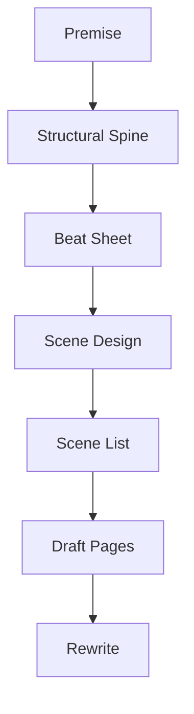
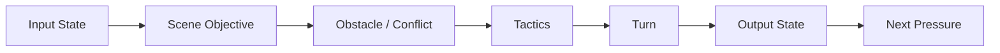
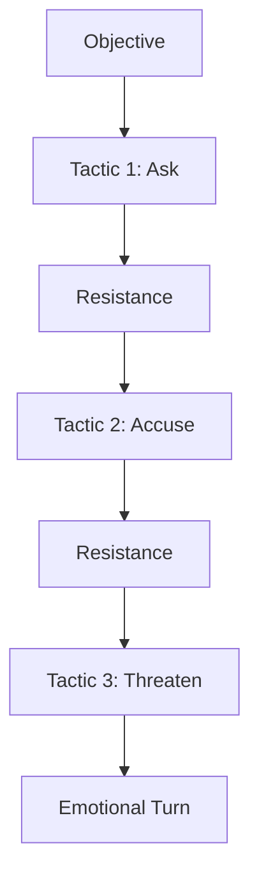
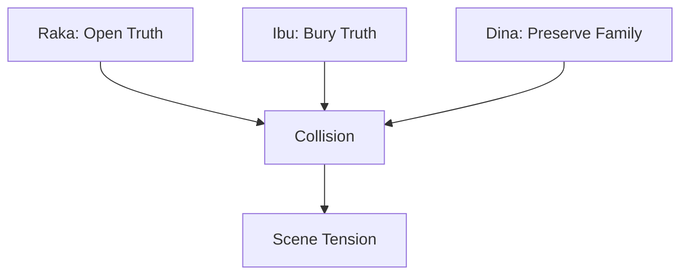
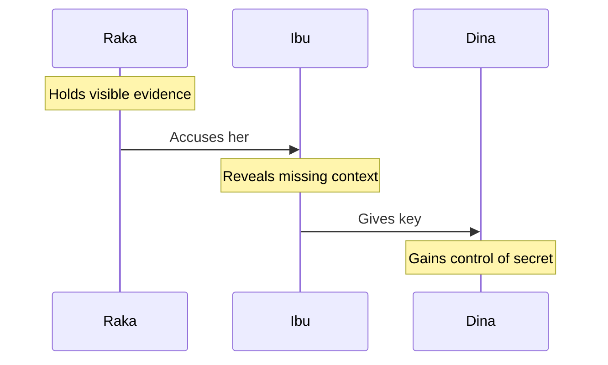
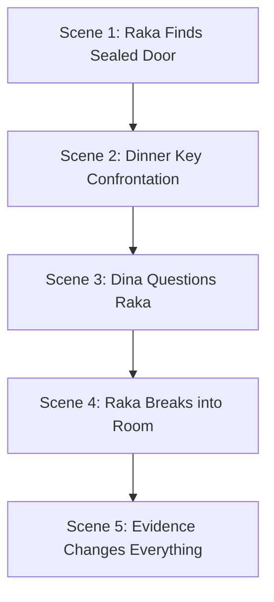
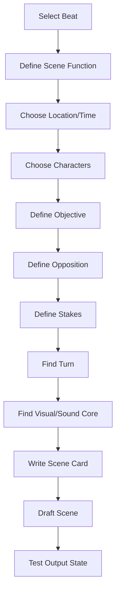
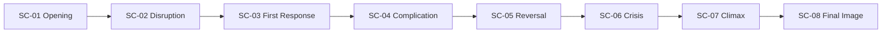
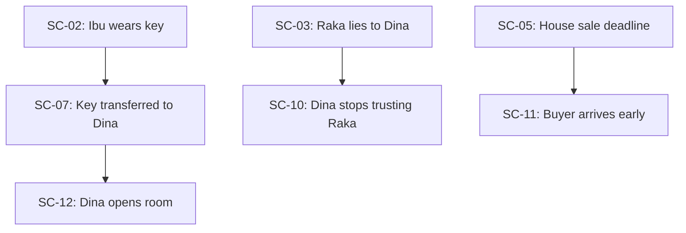

# learn-screenwriting-film-script-part-011.md

# Part 011 — Scene Design: Setiap Scene Harus Mengubah Sesuatu

> Seri: Learn Screenwriting for Film Project  
> Pendekatan: *The First 20 Hours* — Josh Kaufman  
> Fokus bagian ini: mendesain scene sebagai unit eksekusi dramatik yang punya input state, objective, konflik, turn, dan output state.  
> Target praktis: mampu mengubah beat sheet menjadi scene list dan scene card yang siap ditulis dalam format screenplay.

---

## 0. Posisi Part Ini dalam Roadmap

Pada Part 010 kita sudah membahas **beat sheet**: rangkaian perubahan dramatik.

Sekarang kita masuk ke unit eksekusi utama dalam screenplay: **scene**.

Hubungannya:

```text
Premise → Structure → Beat Sheet → Scene Design → Screenplay Pages
```

Diagram:



Beat menjawab:

```text
Perubahan apa yang harus terjadi?
```

Scene menjawab:

```text
Di mana perubahan itu terjadi, siapa yang terlibat, apa tujuan mereka, apa konfliknya, dan bagaimana state cerita berubah setelah scene selesai?
```

Banyak naskah pemula gagal bukan karena idenya buruk, tetapi karena scene-scene-nya tidak punya fungsi dramatik. Scene terasa seperti:

- karakter ngobrol,
- karakter menjelaskan plot,
- karakter berpindah tempat,
- karakter merasa sedih,
- karakter melakukan aktivitas,
- tetapi tidak ada perubahan bermakna.

Part ini akan mengajarkan cara mendesain scene yang bekerja.

---

## 1. Prinsip Kaufman dalam Part Ini

Menurut pendekatan *The First 20 Hours*, kita harus:

1. Memecah skill menjadi sub-skill kecil.
2. Belajar cukup untuk bisa mengoreksi diri.
3. Menghilangkan hambatan latihan.
4. Melatih sub-skill paling penting.

Dalam screenwriting, **scene design** adalah sub-skill paling penting setelah premise, character, conflict, structure, dan beat.

Kenapa?

Karena naskah film bukan hanya ide besar. Naskah film adalah kumpulan scene.

Jika scene lemah, film lemah.

Target 20 jam pertama bukan menjadi master scene writer. Target realistis:

- bisa membedakan scene hidup vs scene mati,
- bisa membuat scene punya objective,
- bisa membuat konflik masuk ke scene,
- bisa membuat scene turn,
- bisa memastikan output state berubah,
- bisa menghapus atau menggabungkan scene yang tidak perlu,
- bisa menulis scene card sebelum drafting.

---

## 2. Apa Itu Scene?

Scene adalah unit dramatik yang biasanya terjadi dalam satu ruang/waktu kontinu.

Secara format screenplay, scene sering ditandai dengan **scene heading**:

```text
INT. RUMAH RAKA - RUANG MAKAN - MALAM
```

Namun secara dramatik, scene bukan hanya “lokasi dan waktu”. Scene adalah unit perubahan.

Definisi kerja:

> Scene adalah unit eksekusi filmik tempat karakter mengejar sesuatu, menghadapi resistensi, dan menghasilkan perubahan state cerita.

Scene yang kuat memiliki:

1. **Context** — kenapa scene ini terjadi sekarang.
2. **Objective** — apa yang diinginkan karakter.
3. **Conflict** — apa/siapa yang menghalangi.
4. **Tactic** — bagaimana karakter mencoba mendapatkan tujuannya.
5. **Turn** — perubahan arah/makna/power/informasi/emosi.
6. **Output State** — kondisi baru setelah scene.
7. **Hook** — energi yang menarik ke scene berikutnya.

Diagram:



---

## 3. Scene sebagai Function

Untuk cara pikir software engineer, scene bisa dianalogikan seperti function yang mengubah state.

```text
Scene(inputState, characters, pressure) -> outputState
```

Tapi scene bukan pure function. Scene punya side effect:

- informasi berubah,
- relasi berubah,
- stakes berubah,
- emosi berubah,
- power berubah,
- pilihan berubah,
- konflik meningkat.

Pseudo-model:

```text
Scene {
  id
  location
  time
  characters[]
  inputState
  protagonistObjective
  opposition
  tactics[]
  turn
  outputState
  nextQuestion
}
```

Jika function tidak mengubah apa pun, kemungkinan function itu tidak perlu.

Begitu juga scene.

Pertanyaan brutal:

```text
Jika scene ini dihapus, apakah cerita tetap bisa dipahami dan emosinya tetap sama?
```

Jika jawabannya ya, scene itu kandidat untuk dihapus, digabung, atau diubah fungsinya.

---

## 4. Scene Bukan Sekadar Informasi

Kesalahan umum pemula:

```text
Scene ini ada supaya penonton tahu masa lalu karakter.
```

Itu belum cukup.

Informasi harus diberikan melalui konflik, keputusan, visual, atau konsekuensi.

Scene eksposisi lemah:

```text
Dua karakter duduk dan menjelaskan masa lalu keluarga.
```

Scene lebih kuat:

```text
Dua saudara berebut membuang koper lama ayah mereka. Setiap benda yang mereka tarik keluar membuka versi berbeda tentang malam ayah pergi.
```

Informasi yang sama bisa muncul, tapi sekarang ada:

- aksi visual,
- konflik,
- objek,
- relasi,
- subtext,
- perubahan emosi.

---

## 5. Komponen Inti Scene

Setiap scene minimal harus punya komponen berikut.

---

## 6. Input State

Input state adalah kondisi cerita sebelum scene dimulai.

Contoh:

```text
Raka percaya ibunya tidak tahu apa pun tentang kejahatan ayah.
```

Input state harus jelas karena kita perlu tahu apa yang berubah.

Pertanyaan:

1. Apa yang karakter percaya sebelum scene?
2. Apa tujuan karakter sebelum scene?
3. Apa status hubungan sebelum scene?
4. Apa informasi yang dimiliki penonton?
5. Apa tekanan yang sedang aktif?
6. Apa konsekuensi dari scene sebelumnya?

Jika input state kabur, scene akan terasa mengambang.

---

## 7. Scene Objective

Scene objective adalah apa yang diinginkan karakter dalam scene.

Objective harus konkret.

Buruk:

```text
Raka ingin bicara.
```

Lebih kuat:

```text
Raka ingin memaksa ibunya mengakui bahwa ia tahu isi ruang kerja ayah.
```

Buruk:

```text
Mira ingin damai.
```

Lebih kuat:

```text
Mira ingin mendapatkan tanda tangan ibunya untuk menjual rumah sebelum bus terakhir berangkat.
```

Objective yang baik:

- bisa dilihat dari tindakan,
- punya target,
- punya tekanan,
- bisa gagal,
- menimbulkan konflik.

Template:

```text
Dalam scene ini, karakter ingin [hasil konkret] dari/terhadap [orang/sistem/objek] sebelum/karena [tekanan].
```

Contoh:

```text
Dalam scene ini, Raka ingin mengambil kunci ruang kerja dari ibunya sebelum agen properti datang untuk inspeksi.
```

---

## 8. Opposition

Opposition adalah force yang menghalangi objective.

Bentuk opposition:

- karakter lain,
- aturan,
- rahasia,
- waktu,
- lokasi,
- kondisi fisik,
- moral dilemma,
- rasa takut internal,
- keterbatasan informasi,
- sistem sosial,
- teknologi,
- cuaca,
- kebetulan yang dipersiapkan.

Scene tanpa opposition sering terasa datar.

Objective:

```text
Raka ingin mengambil kunci ruang kerja.
```

Opposition lemah:

```text
Kunci ada di meja. Raka mengambilnya.
```

Opposition lebih kuat:

```text
Kunci tergantung di leher ibunya yang sedang pura-pura tidur di sofa, sementara agen properti menunggu di luar.
```

Sekarang scene punya tekanan.

---

## 9. Stakes Scene

Stakes scene menjawab:

```text
Apa yang hilang jika karakter gagal dalam scene ini?
```

Stakes bisa kecil tapi harus terasa.

Contoh:

```text
Jika Raka gagal mengambil kunci, agen properti akan melihat ruang kerja tersegel dan membatalkan transaksi.
```

Atau lebih emosional:

```text
Jika Raka memaksa ibunya bicara, ia mungkin menghancurkan satu-satunya versi ayah yang masih dipercaya adiknya.
```

Stakes memberi energi pada objective.

---

## 10. Tactic

Tactic adalah cara karakter mencoba mencapai objective.

Karakter yang menarik sering mengubah tactic saat opposition muncul.

Contoh scene:

Objective:

```text
Raka ingin ibunya mengakui kebenaran.
```

Tactic progression:

1. Bertanya baik-baik.
2. Menunjukkan dokumen.
3. Menuduh ibu.
4. Mengancam akan melapor.
5. Memohon sebagai anak.
6. Diam dan menunggu ibu runtuh.

Setiap tactic mengungkap karakter.

Diagram:



Scene menjadi hidup ketika tactic berubah akibat resistance.

---

## 11. Conflict

Conflict adalah collision antara objective dan opposition.

Conflict tidak harus pertengkaran.

Conflict bisa berupa:

- seseorang ingin bicara, orang lain ingin diam,
- seseorang ingin pergi, orang lain butuh dia tinggal,
- seseorang ingin kebenaran, orang lain ingin perlindungan,
- seseorang ingin terlihat kuat, tubuhnya mulai lemah,
- seseorang ingin menyembunyikan bukti, ruangan terlalu ramai,
- seseorang ingin memaafkan, tapi luka belum selesai.

Conflict yang baik sering punya dua sisi yang sama-sama bisa dipahami.

Contoh:

```text
Raka ingin membuka kebenaran.
Ibu ingin menutupinya karena kebenaran akan menghancurkan adiknya.
```

Keduanya punya alasan. Scene jadi lebih kuat.

---

## 12. Turn

Turn adalah perubahan utama dalam scene.

Turn bisa berupa:

- informasi baru,
- perubahan power,
- perubahan emosi,
- perubahan relasi,
- keputusan,
- kegagalan,
- kemenangan yang mahal,
- reversal,
- pengakuan,
- pengkhianatan,
- penemuan visual,
- perubahan tujuan.

Scene tanpa turn biasanya terasa seperti filler.

Template:

```text
Scene dimulai dengan [state A], tetapi berakhir dengan [state B].
```

Contoh:

```text
Scene dimulai dengan Raka mengira ia memegang kendali atas ibunya, tetapi berakhir dengan ibunya menunjukkan bahwa ia tahu rahasia yang lebih besar tentang Raka.
```

Turn membuat scene layak ada.

---

## 13. Output State

Output state adalah kondisi baru setelah scene.

Contoh:

```text
Sebelum scene:
Raka percaya ibunya hanya takut pada masa lalu.

Sesudah scene:
Raka tahu ibunya aktif menutupi bukti dan mungkin melibatkan adiknya.
```

Output state harus mendorong scene berikutnya.

Pertanyaan:

1. Apa yang sekarang diketahui karakter?
2. Apa yang sekarang diketahui penonton?
3. Apa yang berubah dalam relasi?
4. Apa yang menjadi lebih berbahaya?
5. Apa pilihan baru yang muncul?
6. Apa pilihan lama yang tertutup?
7. Apa pertanyaan berikutnya?

---

## 14. Scene Hook

Scene hook adalah energi yang menarik ke scene berikutnya.

Hook bisa berupa:

- pertanyaan,
- ancaman,
- deadline,
- keputusan,
- rahasia baru,
- emosi yang belum selesai,
- objek yang berpindah tangan,
- janji,
- kebohongan,
- panggilan masuk,
- pintu terbuka,
- seseorang melihat sesuatu.

Contoh:

```text
Raka akhirnya mendapatkan kunci, tetapi saat ia membuka ruang kerja, adiknya berdiri di belakangnya sambil merekam.
```

Hook:

```text
Apa yang akan dilakukan adiknya dengan rekaman itu?
```

---

## 15. Scene Card

Scene card adalah dokumen kecil sebelum menulis scene.

Template:

```text
Scene ID:
Scene Heading:
Approx Duration/Page:
Characters:
Location:
Time:

Input State:
Scene Objective:
Opposition:
Stakes:
Tactics:
Turn:
Output State:
Next Hook:

Visual Core:
Sound Core:
Subtext:
Production Notes:
```

Scene card membantu Anda tidak menulis secara buta.

---

## 16. Contoh Scene Card

```text
Scene ID:
SC-07

Scene Heading:
INT. RUMAH LAMA - RUANG MAKAN - MALAM

Approx Duration/Page:
3 halaman

Characters:
Raka, Ibu, Dina

Location:
Ruang makan rumah lama

Time:
Malam

Input State:
Raka baru menemukan pintu ruang kerja ayah disegel. Ia curiga ibu tahu sesuatu.

Scene Objective:
Raka ingin mengambil kunci ruang kerja dari ibu tanpa membuat Dina curiga.

Opposition:
Ibu memakai kunci itu sebagai liontin. Dina terus memperhatikan. Agen properti akan datang pagi.

Stakes:
Jika Raka gagal, ia tidak bisa membuka ruang kerja sebelum inspeksi. Jika ia terlalu agresif, Dina akan tahu keluarga menyembunyikan rahasia.

Tactics:
1. Raka bertanya santai tentang liontin.
2. Ia mencoba menyentuhnya sambil membantu ibu berdiri.
3. Ia menyindir soal ayah.
4. Ia menekan ibu dengan ancaman penjualan rumah.
5. Ia pura-pura menyerah.

Turn:
Ibu melepas liontin, tetapi bukan untuk menyerah. Ia memberikannya kepada Dina dan berkata, “Jaga ini dari kakakmu.”

Output State:
Raka tidak hanya gagal mendapat kunci; Dina kini menjadi penjaga rahasia.

Next Hook:
Raka harus menghadapi Dina, bukan hanya ibunya.

Visual Core:
Kunci kecil di leher ibu berpindah ke tangan Dina.

Sound Core:
Dentang sendok, hujan di genteng, kunci menyentuh meja.

Subtext:
Ibu sedang menunjuk Raka sebagai ancaman keluarga.

Production Notes:
Satu lokasi, tiga karakter, no VFX, high performance scene.
```

Scene ini punya objective, opposition, turn, dan output state.

---

## 17. Scene Value Shift

Salah satu cara sederhana menguji scene:

```text
Value scene berubah dari apa ke apa?
```

Contoh value shift:

| Awal | Akhir |
|---|---|
| Aman | Terancam |
| Percaya | Curiga |
| Dekat | Jauh |
| Berkuasa | Terkendali |
| Tidak tahu | Tahu |
| Harapan | Putus asa |
| Bohong | Terbuka |
| Bebas | Terjebak |

Scene yang baik biasanya punya value shift.

Contoh:

```text
Scene dimulai dengan Raka merasa berkuasa karena memegang dokumen.
Scene berakhir dengan Raka tidak berdaya karena dokumen itu justru bisa menjerat adiknya.
```

Value shift:

```text
Control → Vulnerability
```

---

## 18. Positive/Negative Turn

Scene bisa bergerak:

- positif ke negatif,
- negatif ke positif,
- positif ke lebih positif,
- negatif ke lebih negatif,
- netral ke tekanan,
- tekanan ke false relief.

Contoh:

```text
Positive → Negative:
Mira mengira ibunya akan memaafkan, tetapi ibunya mengembalikan semua surat Mira yang tidak pernah dibuka.

Negative → Positive:
Raka mengira bukti hilang, tetapi adiknya ternyata menyimpan salinan.

Positive → More Positive:
Detektif mendapat saksi, lalu saksi memberi clue tambahan.

Negative → More Negative:
Karakter kehilangan bukti, lalu dituduh sebagai pelaku.
```

Hati-hati dengan scene yang tidak bergerak.

---

## 19. Scene Polarity Map

Gunakan polarity untuk setiap scene.

Template:

```text
Scene:
Starting Polarity:
Ending Polarity:
Shift:
Meaning:
```

Contoh:

```text
Scene:
SC-07 Ruang Makan

Starting Polarity:
Raka punya harapan mengambil kunci.

Ending Polarity:
Raka gagal dan Dina menjadi penjaga kunci.

Shift:
Positive → Negative

Meaning:
Raka kehilangan kontrol; konflik keluarga melebar.
```

Jika 5 scene berurutan memiliki polarity sama tanpa variasi, pacing bisa terasa monoton.

---

## 20. Scene Objective Harus Bertabrakan

Scene kuat sering punya objective berbeda antar karakter.

Contoh:

```text
Raka ingin membuka rahasia.
Ibu ingin menutup rahasia.
Dina ingin menjaga keluarga tetap utuh.
```

Tiga objective ini bertabrakan.

Diagram:



Jika semua karakter menginginkan hal yang sama, cari sumber konflik lain:

- waktu,
- tempat,
- risiko,
- keterbatasan informasi,
- moral cost,
- social pressure.

---

## 21. Multi-Character Scene

Scene dengan banyak karakter lebih sulit karena objective bisa kabur.

Untuk setiap karakter penting, isi:

```text
Character:
Wants:
Hides:
Fears:
Tactic:
Power Position:
```

Contoh:

```text
Raka:
Wants: mengambil kunci
Hides: ia sudah membuka sebagian segel ruang kerja
Fears: Dina tahu ia berbohong
Tactic: manipulasi santai
Power Position: tampak percaya diri, sebenarnya terdesak

Ibu:
Wants: mencegah Raka membuka ruang kerja
Hides: ia tahu isi ruangan
Fears: Dina tahu peran keluarga
Tactic: guilt dan silence
Power Position: fisik lemah, moral kuat

Dina:
Wants: memahami kenapa semua orang tegang
Hides: ia sudah memotret segel pintu
Fears: keluarga pecah
Tactic: observasi dan pertanyaan polos
Power Position: dianggap anak kecil, sebenarnya memegang informasi
```

Setelah ini, scene lebih mudah ditulis.

---

## 22. Power Dynamics

Scene hidup ketika power berubah.

Power bisa berasal dari:

- informasi,
- status sosial,
- uang,
- usia,
- rasa bersalah,
- posisi fisik,
- hukum,
- akses ke objek,
- ancaman,
- kedekatan emosional,
- ketergantungan.

Power shift contoh:

```text
Awal:
Raka punya dokumen, jadi ia merasa kuat.

Tengah:
Ibu tahu dokumen itu tidak lengkap.

Akhir:
Dina punya foto dokumen lengkap di ponselnya.
```

Power berpindah dari Raka → Ibu → Dina.

Diagram:



---

## 23. Scene sebagai Negotiation

Banyak scene dramatik pada dasarnya adalah negotiation.

Karakter tidak harus duduk bernegosiasi. Tapi mereka saling menekan untuk mendapatkan sesuatu.

Template negotiation:

```text
A wants X.
B wants Y.
A offers/threatens Z.
B resists with W.
A changes tactic.
B reveals cost.
A chooses compromise/escalation.
```

Contoh:

```text
Raka ingin kunci.
Ibu ingin Raka berhenti.
Raka mengancam menjual rumah tanpa izin.
Ibu mengungkap bahwa rumah itu bukan miliknya sendiri.
Raka menekan Dina.
Ibu memberi kunci kepada Dina.
Raka kehilangan leverage.
```

Scene menjadi dinamis karena setiap langkah mengubah bargaining position.

---

## 24. Scene Entry: Late In

Prinsip:

```text
Masuk scene setelat mungkin.
```

Artinya jangan mulai terlalu awal.

Buruk:

```text
Raka parkir motor.
Raka turun.
Raka membuka pagar.
Raka melepas sepatu.
Raka masuk rumah.
Raka menyapa ibu.
Baru konflik mulai.
```

Lebih kuat:

```text
Raka sudah berdiri di ruang makan, memegang liontin ibu.

IBU
Lepaskan.
```

Langsung ke tension.

Late in berarti mulai ketika tekanan sudah dekat.

---

## 25. Scene Exit: Early Out

Prinsip:

```text
Keluar scene secepat mungkin setelah turn terjadi.
```

Buruk:

```text
Setelah ibu memberi kunci ke Dina, mereka masih membahas hal yang sama selama dua halaman.
```

Lebih kuat:

```text
Ibu menjatuhkan kunci ke telapak tangan Dina.

IBU
Jaga ini dari kakakmu.

Raka melihat Dina menutup genggamannya.

CUT TO:
```

Scene selesai saat output state jelas.

Early out menjaga momentum.

---

## 26. Scene Start/End Test

Untuk setiap scene, tulis:

```text
Scene starts when:
Scene ends when:
```

Contoh:

```text
Scene starts when:
Raka melihat kunci di leher ibu.

Scene ends when:
Kunci berpindah ke tangan Dina.
```

Jika start/end tidak jelas, scene biasanya melebar.

---

## 27. Scene Length

Panjang scene tergantung fungsi, genre, tempo, dan emosi.

Panduan kasar:

| Jenis Scene | Panjang Umum |
|---|---:|
| Quick beat scene | 1/4–1 halaman |
| Standard dramatic scene | 2–4 halaman |
| Major confrontation | 4–8 halaman |
| Montage | bervariasi |
| Silent visual scene | bisa pendek/panjang tergantung ritme |

Untuk pemula, jika scene lebih dari 5 halaman, tanyakan:

1. Apakah ada beberapa scene dalam satu scene?
2. Apakah conflict berubah?
3. Apakah turn sudah terjadi lebih awal?
4. Apakah dialog mengulang?
5. Apakah scene bisa dipotong atau dipecah?

---

## 28. Scene Density

Scene density adalah jumlah perubahan bermakna dalam scene.

Scene terlalu tipis:

```text
2 halaman hanya untuk karakter mendapat satu informasi sederhana.
```

Scene terlalu padat:

```text
Dalam 2 halaman, karakter putus cinta, menemukan pembunuh, berdamai dengan ibu, dan memutuskan pindah negara.
```

Cari keseimbangan.

Untuk scene utama, idealnya ada:

- satu objective utama,
- satu conflict utama,
- satu turn besar,
- beberapa emotional beat kecil.

---

## 29. Scene dan Subtext

Scene buruk sering mengatakan semuanya secara langsung.

Contoh direct:

```text
Raka:
Aku marah karena Ibu menyembunyikan rahasia Ayah.
```

Subtext lebih kuat:

```text
Raka melihat liontin kunci di leher Ibu.

RAKA
Masih dipakai juga.

IBU
Yang hilang tidak harus dibuang.

RAKA
Yang busuk biasanya dikubur.
```

Mereka tidak mengatakan “rahasia ayah”, tapi konflik terasa.

Subtext muncul ketika:

- karakter tidak bisa mengatakan yang sebenarnya,
- karakter tidak mau mengaku,
- ada risiko sosial/emosional,
- ada power imbalance,
- ada sejarah relasi,
- objective tersembunyi.

---

## 30. Scene dan Visual Core

Sebelum menulis scene, cari visual core.

Visual core adalah gambar/tindakan/objek yang mewakili konflik scene.

Contoh:

```text
Kunci di leher ibu.
Koper yang tidak mau dibuka.
Piring retak yang tetap dipakai.
Jendela yang selalu tertutup.
Sepatu anak yang masih di depan pintu.
Surat yang basah karena hujan.
```

Visual core membuat scene lebih filmik.

Template:

```text
Scene conflict:
Visual object/action that embodies it:
How visual changes by the end:
```

Contoh:

```text
Scene conflict:
Raka ingin membuka rahasia, ibu ingin menjaga rahasia.

Visual object:
Kunci sebagai liontin.

Visual change:
Kunci berpindah dari ibu ke Dina.
```

Perubahan visual = perubahan dramatik.

---

## 31. Scene dan Sound Core

Film bukan hanya visual. Sound bisa menjadi core scene.

Sound core bisa berupa:

- suara jam,
- hujan,
- napas,
- azan jauh,
- mesin bandara,
- lift,
- suara piring,
- telepon bergetar,
- radio,
- kaset,
- suara pintu,
- silence.

Contoh:

```text
Scene:
Raka mencoba memaksa ibu bicara.

Sound core:
Sendok ibu mengetuk mangkuk pelan, makin cepat ketika Raka mendekati rahasia.

Turn:
Saat ibu mengatakan nama korban, sendok berhenti.
```

Sound bisa menandai perubahan emosi.

---

## 32. Scene dan Blocking

Blocking adalah posisi dan gerak karakter dalam ruang.

Penulis screenplay tidak perlu mengarahkan blocking terlalu detail, tetapi harus memahami potensi dramatiknya.

Contoh:

```text
Awal:
Raka berdiri, ibu duduk, Dina di antara mereka.

Tengah:
Raka mendekati ibu, Dina berdiri menghalangi.

Akhir:
Dina berdiri di belakang ibu dengan kunci di tangan.
```

Blocking menunjukkan power.

Jangan tulis blocking berlebihan seperti sutradara, tapi desain konflik ruangnya.

---

## 33. Scene dan Location

Location bukan background netral. Location harus memberi tekanan.

Contoh objective sama, lokasi berbeda:

Objective:

```text
Raka ingin ibunya mengaku.
```

Di ruang makan:

- konflik keluarga,
- nostalgia,
- benda masa lalu.

Di rumah sakit:

- tubuh lemah,
- urgency,
- rasa bersalah.

Di kantor polisi:

- risiko hukum,
- formal pressure,
- tidak bisa bicara bebas.

Di pesta keluarga:

- social mask,
- semua harus pura-pura normal.

Pilih location yang memperkuat conflict.

---

## 34. Scene dan Time Pressure

Deadline kecil bisa menghidupkan scene.

Contoh:

```text
Agen properti tiba dalam 10 menit.
Bus terakhir berangkat pukul 21.00.
Ibu harus masuk ruang operasi.
Polisi sudah di depan kompleks.
Adik akan pulang sebentar lagi.
```

Time pressure membuat objective lebih tajam.

Namun jangan pakai deadline palsu tanpa payoff.

---

## 35. Scene dan Secret

Secret adalah bahan bakar scene.

Jenis secret:

| Jenis | Efek |
|---|---|
| Character secret | Satu karakter menyembunyikan informasi |
| Audience secret | Penonton belum tahu sesuatu |
| Dramatic irony | Penonton tahu, karakter tidak |
| Shared secret | Beberapa karakter tahu, satu tidak |
| False secret | Karakter mengira tahu, ternyata salah |

Scene dengan secret biasanya punya subtext kuat.

Contoh:

```text
Dina tahu Raka sudah membuka ruang kerja.
Raka tidak tahu Dina tahu.
Ibu tahu keduanya berbohong.
```

Makan malam sederhana bisa jadi penuh tension.

---

## 36. Scene dan Dramatic Irony

Dramatic irony terjadi ketika penonton tahu sesuatu yang karakter tidak tahu.

Contoh:

```text
Penonton tahu ibu menyembunyikan kunci di liontin.
Raka menghabiskan scene mencari kunci di laci.
```

Efek:

- tension,
- anticipation,
- frustration,
- humor,
- dread.

Dramatic irony kuat jika penonton menunggu karakter menyadari sesuatu.

---

## 37. Scene dan Reveal

Reveal harus mengubah state.

Reveal lemah:

```text
Ternyata ayah pernah bekerja di kantor itu.
```

Reveal kuat:

```text
Ternyata ayah bukan korban kantor itu; ia membantu menutup kasus yang menghancurkan keluarga korban.
```

Pertanyaan reveal:

1. Apa asumsi sebelum reveal?
2. Apa yang dibalik?
3. Siapa yang terkena dampak?
4. Apa pilihan baru setelah reveal?
5. Apa pilihan lama yang tidak mungkin lagi?

---

## 38. Scene dan Reversal

Reversal adalah turn yang membalik arah.

Contoh:

```text
Raka datang untuk menuduh ibu.
Ibu justru menunjukkan bukti bahwa Raka pernah menandatangani dokumen tanpa membaca.
```

Sekarang penyerang menjadi terdakwa.

Reversal sering bekerja lewat:

- informasi,
- power,
- moral guilt,
- object,
- witness,
- timing,
- betrayal.

---

## 39. Scene dan Moral Pressure

Scene paling kuat sering bukan hanya “bisa atau tidak”, tetapi “boleh atau tidak”.

Contoh:

```text
Raka bisa mengambil kunci dari ibu yang tidur.
Tapi itu berarti ia menggunakan kelemahan fisik ibunya untuk membongkar rahasia yang mungkin melindungi adiknya.
```

Moral pressure membuat scene lebih dewasa.

---

## 40. Scene dan Character Flaw

Setiap scene penting sebaiknya menekan flaw karakter.

Flaw:

```text
Raka selalu mengontrol semua hal agar tidak perlu merasa bersalah.
```

Scene pressure:

```text
Ia masuk ke situasi di mana semakin ia mengontrol, semakin orang lain terluka.
```

Scene objective:

```text
Ia ingin mengambil kunci diam-diam.
```

Scene turn:

```text
Kunci berpindah ke Dina karena ibu melihat niat kontrol Raka.
```

Output:

```text
Flaw Raka memperburuk situasi.
```

Ini scene yang terhubung dengan arc.

---

## 41. Scene dan Need

Want adalah tujuan scene. Need adalah pelajaran/transformasi yang lebih dalam.

Contoh:

```text
Scene want:
Raka ingin kunci.

Character need:
Raka perlu belajar bahwa kebenaran tidak bisa dicuri diam-diam; ia harus menghadapi relasi secara jujur.
```

Pada awal cerita, want dan need sering bertentangan.

Scene kuat membuat karakter mengejar want dengan cara yang menunjukkan ia belum memahami need.

---

## 42. Scene dan Antagonistic Force

Antagonistic force harus terasa di scene, tidak harus selalu hadir fisik.

Contoh antagonis tidak hadir:

```text
Raka dan ibu makan malam, tetapi setiap kali nama ayah disebut, lampu rumah berkedip karena ruang kerja ayah menyedot listrik dari sambungan ilegal yang belum dicabut.
```

Antagonistic force bisa berupa bayangan masa lalu yang hadir lewat ruang, objek, suara, atau konsekuensi.

---

## 43. Scene dan Exposition

Jika scene harus menyampaikan informasi, pastikan informasi punya fungsi dramatik.

Teknik:

1. Informasi sebagai senjata.
2. Informasi sebagai rahasia yang bocor.
3. Informasi sebagai kesalahan.
4. Informasi sebagai bukti visual.
5. Informasi sebagai transaksi.
6. Informasi sebagai ancaman.
7. Informasi sebagai pengakuan yang terlambat.

Contoh:

```text
Buruk:
Ibu menjelaskan semua masa lalu kepada Raka.

Lebih kuat:
Raka membaca dokumen keras-keras untuk memaksa ibu membantah. Ibu hanya membetulkan satu tanggal. Dari situ Raka sadar ibu ada di sana malam itu.
```

Informasi muncul melalui konflik.

---

## 44. Scene dan Dialogue

Dialog scene harus terkait objective dan tactic.

Setiap line idealnya melakukan salah satu fungsi:

- menyerang,
- bertahan,
- menghindar,
- menggoda,
- menutupi,
- mengalihkan,
- menguji,
- memohon,
- mengancam,
- membuka,
- menutup,
- memutarbalikkan,
- memancing.

Jika line hanya menjelaskan, pertimbangkan untuk memotong.

Test dialog:

```text
Apa yang karakter coba lakukan dengan kalimat ini?
```

Bukan:

```text
Apa informasi yang penulis ingin sampaikan?
```

---

## 45. Scene dan Silence

Silence bukan kosong. Silence bisa menjadi beat.

Contoh:

```text
Raka:
Ibu tahu, kan?

Ibu tidak menjawab. Ia mengangkat mangkuk Dina yang kosong, mengisinya lagi, tapi tangannya gemetar.

Dina melihat tangan itu.
```

Silence mengungkap lebih banyak daripada penjelasan.

Gunakan silence ketika:

- karakter takut berkata benar,
- power terlalu besar,
- emosi terlalu penuh,
- jawaban akan mengubah relasi,
- penonton sudah bisa memahami subtext.

---

## 46. Scene dan Object Work

Object work adalah penggunaan objek untuk mengekspresikan konflik.

Contoh objek:

- kunci,
- koper,
- surat,
- foto,
- piring retak,
- cincin,
- kaset,
- sepatu,
- kartu identitas,
- obat,
- ponsel,
- map dokumen.

Objek bisa menjadi:

- evidence,
- memory,
- weapon,
- lie,
- promise,
- burden,
- status,
- temptation,
- boundary.

Contoh:

```text
Raka tidak berkata ia membenci ayahnya.
Ia memakai mug ayah sebagai asbak.
```

Itu visual, character, dan theme beat sekaligus.

---

## 47. Scene dan Prop Transition

Prop transition bisa menjadi output state.

Contoh:

```text
Awal scene:
Kunci ada di leher ibu.

Akhir scene:
Kunci ada di tangan Dina.

Makna:
Penjaga rahasia berpindah generasi.
```

Prop berpindah = power berpindah.

Gunakan tracking:

```text
Prop:
Owner at start:
Owner at end:
Meaning shift:
Future payoff:
```

---

## 48. Scene List

Setelah membuat scene card, susun scene list.

Template scene list:

```text
Scene No:
Scene Heading:
Core Beat(s):
Characters:
Objective:
Conflict:
Turn:
Output State:
Estimated Pages:
Production Cost:
```

Contoh:

```text
Scene No:
07

Scene Heading:
INT. RUMAH LAMA - RUANG MAKAN - MALAM

Core Beat(s):
Kunci berpindah dari ibu ke Dina.

Characters:
Raka, Ibu, Dina

Objective:
Raka ingin mengambil kunci ruang kerja.

Conflict:
Ibu tahu niat Raka; Dina mulai curiga.

Turn:
Ibu memberi kunci kepada Dina.

Output State:
Dina menjadi penjaga rahasia; Raka kehilangan kontrol.

Estimated Pages:
3

Production Cost:
Low
```

Scene list adalah jembatan langsung ke drafting.

---

## 49. Scene Sequence

Scene tidak berdiri sendiri. Scene harus membentuk sequence.

Sequence contoh:



Cek sequence:

1. Apakah scene pertama memicu scene kedua?
2. Apakah tekanan naik?
3. Apakah objective berubah?
4. Apakah informasi berkembang?
5. Apakah sequence punya turn akhir?

---

## 50. Scene Transition

Scene transition bukan hanya “CUT TO”. Secara dramatik, transition adalah cara energi scene sebelumnya masuk ke scene berikutnya.

Jenis transition:

| Jenis | Contoh |
|---|---|
| Causal transition | Karena kunci hilang, Raka menemui Dina |
| Emotional transition | Raka marah → scene berikutnya ia menekan saksi |
| Visual transition | Kunci jatuh → pintu ruang kerja |
| Sound transition | Suara kaset ayah berlanjut ke flashback audio |
| Contrast transition | Rumah gaduh → kamar mandi sunyi |
| Time pressure transition | Jam menunjukkan 21.00 → bus mulai jalan |

Transition yang baik membuat film terasa mengalir.

---

## 51. Scene Economy

Scene economy berarti satu scene melakukan beberapa fungsi sekaligus tanpa terasa padat.

Scene kuat bisa sekaligus:

- menggerakkan plot,
- mengungkap karakter,
- menaikkan stakes,
- menguji tema,
- mengubah relasi,
- menyiapkan payoff,
- memberi visual motif.

Contoh scene ruang makan:

1. Plot: kunci berpindah.
2. Character: Raka manipulatif.
3. Relationship: Dina mulai tidak percaya Raka.
4. Theme: perlindungan keluarga vs kebenaran.
5. Visual motif: kunci.
6. Future payoff: Dina punya akses.

Scene ini ekonomis.

---

## 52. Scene Compression

Jika dua scene punya fungsi berdekatan, gabungkan.

Scene A:

```text
Raka bertanya ke ibu tentang ayah.
```

Scene B:

```text
Raka mencoba mengambil kunci.
```

Scene C:

```text
Dina curiga.
```

Bisa digabung:

```text
Saat makan malam, Raka bertanya tentang ayah sambil mencoba mengambil kunci dari leher ibu, dan Dina melihat taktiknya.
```

Satu scene, tiga fungsi.

Compression membuat naskah lebih tajam.

---

## 53. Scene Splitting

Kadang satu scene terlalu banyak fungsi dan perlu dipecah.

Gejala scene perlu dipecah:

- lokasi berubah signifikan,
- waktu melompat,
- objective berubah total,
- konflik berubah total,
- scene terlalu panjang,
- ada dua climax dalam satu scene,
- emotional turn terlalu cepat.

Contoh:

```text
Scene 12 berisi Raka bertengkar dengan ibu, menemukan dokumen, mengejar saksi, lalu berdamai dengan adik.
```

Terlalu banyak. Pecah menjadi beberapa scene agar emosi earned.

---

## 54. Scene Ordering

Urutan scene menentukan pengalaman.

Pertanyaan:

1. Apa yang penonton tahu sebelum scene ini?
2. Apa yang karakter tahu sebelum scene ini?
3. Apakah scene ini lebih kuat jika informasi ditunda?
4. Apakah scene ini lebih kuat jika dipindahkan lebih awal?
5. Apakah scene ini membayar setup sebelumnya?
6. Apakah scene ini menyiapkan payoff nanti?

Urutan bukan hanya kronologi. Urutan adalah desain emosi dan informasi.

---

## 55. Scene dan Mystery/Suspense

Bedakan:

### Mystery

Penonton dan karakter tidak tahu.

```text
Apa isi ruang kerja ayah?
```

### Suspense

Penonton tahu bahaya, karakter belum.

```text
Penonton melihat ibu menyembunyikan pisau di laci sebelum Raka masuk.
```

### Dramatic Irony

Penonton tahu kebenaran yang karakter salah pahami.

```text
Penonton tahu Dina sudah membaca surat, tetapi Raka masih berbohong kepadanya.
```

Scene design harus sadar mode informasi ini.

---

## 56. Scene dan Genre

Genre memengaruhi desain scene.

### Drama

Scene berpusat pada:

- relasi,
- pilihan emosional,
- subtext,
- luka,
- moral consequence.

### Thriller

Scene berpusat pada:

- objective tajam,
- threat,
- clue,
- deception,
- time pressure,
- reversal.

### Horror

Scene berpusat pada:

- dread,
- denial,
- manifestation,
- isolation,
- unknown threat,
- sensory detail.

### Comedy

Scene berpusat pada:

- mismatch objective,
- social embarrassment,
- escalation of lie,
- reversal of status,
- timing.

### Romance

Scene berpusat pada:

- attraction/resistance,
- vulnerability,
- misunderstanding,
- intimacy,
- fear of exposure.

Scene harus memenuhi janji genre.

---

## 57. Scene dan Tone

Tone menentukan cara scene dieksekusi.

Contoh objective sama:

```text
Karakter ingin mengambil koper yang bukan miliknya.
```

Tone thriller:

```text
Ia membuka koper di toilet bandara, menemukan paspor palsu dan pistol berperedam.
```

Tone tragic romance:

```text
Ia membuka koper dan menemukan gaun yang seharusnya dipakai perempuan yang meninggalkannya.
```

Tone comedy:

```text
Ia membuka koper dan menemukan kostum badut, uang palsu, dan surat cinta untuk orang bernama sama.
```

Tone harus konsisten dengan scene choice.

---

## 58. Scene dan Production Awareness

Karena target Anda adalah project film, scene design harus mempertimbangkan feasibility.

Tandai:

```text
Location count:
Cast count:
Crowd:
Night shoot:
Vehicle:
Animal:
Child actor:
VFX:
Stunt:
Water/fire:
Special sound:
Permit risk:
```

Scene mahal belum tentu salah. Tapi harus punya dramatic value tinggi.

Pertanyaan:

```text
Apakah fungsi dramatik scene ini bisa dicapai dengan cara lebih murah?
```

Contoh:

Scene mahal:

```text
Raka mengejar mobil di jalan tol.
```

Fungsi dramatik:

```text
Raka kehilangan bukti dan sadar lawannya punya kuasa.
```

Scene alternatif:

```text
Di ruang fotokopi kantor kelurahan, listrik mati. Saat menyala, map bukti sudah tertukar dengan map kosong berstempel resmi.
```

Lebih murah, tetap tegang.

---

## 59. Scene Cost/Value Matrix

Gunakan matrix:

| Scene | Dramatic Value | Production Cost | Risk | Decision |
|---|---:|---:|---:|---|
| Ruang makan kunci berpindah | 9 | 2 | 2 | Keep |
| Kejar-kejaran mobil | 7 | 10 | 9 | Replace |
| Terminal bus final call | 8 | 4 | 3 | Keep |
| Crowd protest | 6 | 9 | 8 | Compress |
| Rumah terbakar | 7 | 10 | 10 | Redesign |

Rule sederhana:

```text
High value + low cost = keep.
High value + high cost = justify or redesign.
Low value + high cost = cut.
Low value + low cost = combine or cut.
```

---

## 60. Scene Test Suite

Gunakan test suite ini untuk setiap scene.

```text
Given:
Input state scene.

When:
Karakter mengejar objective.

And:
Opposition menekan.

Then:
Karakter membuat pilihan/tactic.

Result:
Output state berubah.
```

Contoh:

```text
Given:
Raka butuh kunci ruang kerja sebelum inspeksi rumah.

When:
Ia mencoba mengambil kunci dari ibu saat makan malam.

And:
Ibu mengetahui niatnya dan Dina mulai curiga.

Then:
Raka menekan ibu dengan ancaman penjualan.

Result:
Ibu memberi kunci kepada Dina, membuat Raka kehilangan kontrol.
```

Jika scene tidak bisa dijelaskan seperti ini, scene belum jelas.

---

## 61. Scene Smell

Seperti code smell, scene punya smell.

| Smell | Gejala | Kemungkinan Penyebab | Fix |
|---|---|---|---|
| Scene datar | Tidak ada perubahan | Objective/turn lemah | Tentukan before/after |
| Scene eksposisi | Karakter menjelaskan | Informasi tidak didramatisasi | Jadikan informasi senjata |
| Scene pasif | Karakter hanya menerima | Agency lemah | Beri pilihan aktif |
| Scene repetitif | Konflik sama seperti scene sebelumnya | Tidak ada escalation | Naikkan stakes |
| Scene terlalu panjang | Banyak dialog berputar | Exit terlambat | Early out |
| Scene terlalu awal | Banyak setup sebelum konflik | Entry terlalu cepat | Late in |
| Scene random | Tidak memicu scene berikutnya | Kausalitas lemah | Hubungkan dengan consequence |
| Scene mahal tapi lemah | Banyak produksi, sedikit fungsi | Spectacle kosong | Cari fungsi dramatik |

---

## 62. Debugging Scene

### 62.1 Jika scene terasa membosankan

Cek:

1. Objective konkret?
2. Opposition kuat?
3. Stakes terasa?
4. Ada time pressure?
5. Ada secret?
6. Ada turn?
7. Ada visual core?
8. Ada subtext?
9. Scene masuk terlalu awal?
10. Scene keluar terlalu lambat?

---

### 62.2 Jika scene terasa terlalu eksposisi

Cek:

1. Siapa yang butuh informasi?
2. Siapa yang menyembunyikan informasi?
3. Apa harga informasi itu?
4. Bisa diberikan lewat objek?
5. Bisa diberikan lewat konflik?
6. Bisa diberikan lewat kesalahan karakter?
7. Bisa ditunda?

---

### 62.3 Jika scene terasa melodramatis

Cek:

1. Apakah karakter mengatakan emosi terlalu langsung?
2. Apakah konflik terlalu mudah meledak?
3. Apakah tidak ada subtext?
4. Apakah stakes belum dibangun?
5. Apakah reaksi terlalu besar untuk trigger kecil?

Solusi:

- kurangi deklarasi,
- tambah restraint,
- beri karakter alasan untuk tidak mengatakan semuanya,
- gunakan gesture,
- biarkan penonton menyimpulkan.

---

### 62.4 Jika scene terasa tidak penting

Cek:

1. Jika dihapus, apa yang hilang?
2. Apa output state-nya?
3. Apa setup/payoff-nya?
4. Apakah fungsi scene bisa digabung?
5. Apakah scene hanya mengulang informasi?
6. Apakah ada conflict baru?

Jika tidak ada jawaban, cut.

---

## 63. Scene Rewrite Pass

Lakukan rewrite scene berlapis.

### Pass 1 — Function

```text
Scene ini ada untuk apa?
```

### Pass 2 — Objective

```text
Apa yang karakter inginkan?
```

### Pass 3 — Conflict

```text
Apa yang menghalangi?
```

### Pass 4 — Turn

```text
Apa yang berubah?
```

### Pass 5 — Visual

```text
Apa yang bisa dilihat?
```

### Pass 6 — Subtext

```text
Apa yang tidak dikatakan?
```

### Pass 7 — Economy

```text
Apa yang bisa dipotong?
```

---

## 64. Scene Design Workflow

Workflow praktis:



---

## 65. Dari Beat ke Scene

Ambil beat:

```text
Beat:
Raka kehilangan kontrol atas kunci karena ibu memberikannya kepada Dina.
```

Ubah menjadi scene card:

```text
Scene:
Ruang makan malam.

Objective:
Raka ingin mengambil kunci dari ibu.

Opposition:
Ibu tahu niat Raka. Dina hadir.

Conflict:
Raka harus mengambil kunci tanpa membuat Dina curiga.

Turn:
Ibu memberi kunci kepada Dina.

Output:
Dina menjadi penjaga rahasia.
```

Sekarang beat punya bentuk filmik.

---

## 66. Contoh Transformasi Beat ke Scene

Beat abstrak:

```text
Mira sadar ibunya masih mencintai ayah.
```

Scene buruk:

```text
Ibu berkata, “Aku masih mencintai ayahmu.”
```

Scene lebih filmik:

```text
INT. DAPUR - SUBUH

Mira membuka tempat sampah. Di atas tumpukan kulit bawang, ada bunga plastik tua yang patah.

Ia mengambilnya.

Di meja dapur, Ibu membekukan diri.

MIRA
Ini dari Ayah?

Ibu menyambar bunga itu.

IBU
Sampah.

Tapi ia tidak membuangnya lagi. Ia mencucinya di bawah keran. Pelan. Seperti membersihkan luka.
```

Perubahan:

```text
Before:
Mira percaya ibu membenci ayah.

After:
Mira melihat cinta ibu masih tersisa dalam bentuk yang rusak.

Turn:
Ibu menyebut bunga itu sampah tetapi merawatnya.

Visual core:
Bunga plastik patah.

Subtext:
Cinta yang dipermalukan.
```

---

## 67. Scene Design untuk Film Pendek

Film pendek membutuhkan scene yang sangat efisien.

Untuk film pendek 8–12 menit, idealnya:

- 5–10 scene,
- sedikit lokasi,
- sedikit karakter,
- setiap scene punya turn kuat,
- tidak ada scene setup panjang,
- final image kuat.

Template 5 scene:

```text
Scene 1:
Normal tension + opening image

Scene 2:
Disruption

Scene 3:
Escalation / failed strategy

Scene 4:
Crisis / climax

Scene 5:
Consequence / final image
```

Setiap scene harus punya output state yang jelas.

---

## 68. Scene Design untuk Feature

Feature butuh lebih banyak variasi scene.

Pastikan ada campuran:

- plot scene,
- character scene,
- relationship scene,
- visual transition scene,
- suspense scene,
- confrontation scene,
- aftermath scene,
- revelation scene,
- decision scene,
- set-piece scene.

Tapi setiap scene tetap harus mengubah sesuatu.

Feature scene list bisa dikelompokkan per sequence:

```text
Sequence 1:
SC-01
SC-02
SC-03
SC-04

Sequence 2:
SC-05
SC-06
SC-07
SC-08
```

Setiap sequence punya turn besar.

---

## 69. Scene Index Card Method

Metode kartu:

Satu scene = satu kartu.

Isi kartu:

```text
Front:
Scene No
Scene Heading
One-line function

Back:
Objective
Conflict
Turn
Output
```

Contoh:

```text
Front:
SC-07
INT. RUMAH LAMA - RUANG MAKAN - MALAM
Kunci berpindah ke Dina.

Back:
Raka ingin kunci.
Ibu tahu niatnya.
Dina mulai curiga.
Ibu memberi kunci ke Dina.
Raka kehilangan kontrol.
```

Kartu memudahkan reorder, cut, combine.

---

## 70. Scene Board

Scene board membantu melihat struktur.



Untuk setiap scene, tandai:

- polarity,
- location,
- character,
- cost,
- function,
- output.

Ini membantu melihat masalah pacing dan produksi.

---

## 71. Scene Color Coding

Secara manual, Anda bisa memberi label:

```text
PLOT
CHARACTER
RELATIONSHIP
THEME
ACTION
REVEAL
AFTERMATH
SETUP
PAYOFF
```

Jika terlalu banyak scene dengan label sama berurutan, cek pacing.

Contoh:

```text
SC-01 CHARACTER
SC-02 CHARACTER
SC-03 CHARACTER
SC-04 CHARACTER
```

Mungkin terlalu internal.

Atau:

```text
SC-01 REVEAL
SC-02 REVEAL
SC-03 REVEAL
```

Mungkin terlalu eksposisi.

---

## 72. Scene Dependency Graph

Beberapa scene adalah setup/payoff.



Dependency graph membantu memastikan payoff tidak muncul tiba-tiba.

---

## 73. Scene dan Emotional Continuity

Pastikan emosi scene sebelumnya terbawa atau sengaja dikontraskan.

Buruk:

```text
Scene 5:
Raka menangis setelah mengetahui ayahnya bersalah.

Scene 6:
Raka bercanda ringan tanpa transisi.
```

Bisa saja jika ada alasan tonal, tapi harus sadar.

Emotional continuity:

```text
Scene 6:
Raka mencoba bercanda di depan Dina, tapi tangannya gemetar saat menuang teh.
```

Emosi sebelumnya masih ada.

---

## 74. Scene dan Character Continuity

Karakter boleh berubah, tapi harus ada proses.

Jika karakter tiba-tiba berani setelah 10 scene pengecut, butuh beat transisi.

Cek:

```text
Apa scene yang membuat perubahan ini mungkin?
Apa harga perubahan itu?
Apa bukti visual bahwa perubahan itu belum sempurna?
```

Arc yang baik sering tidak lurus. Karakter bisa mundur.

---

## 75. Scene dan Information Continuity

Jangan lupa siapa tahu apa.

Buat table:

| Character | Knows Secret A? | Knows Secret B? | Believes Lie C? |
|---|---|---|---|
| Raka | Ya | Tidak | Ya |
| Ibu | Ya | Ya | Tidak |
| Dina | Tidak | Sebagian | Ya |
| Penonton | Ya | Tidak | Sebagian |

Scene tension sering lahir dari information asymmetry.

---

## 76. Scene dan Time Continuity

Pastikan waktu jelas.

Untuk project kecil, continuity error bisa terjadi:

- malam tiba-tiba siang,
- deadline dilupakan,
- karakter pindah tempat terlalu cepat,
- hujan muncul/hilang tanpa alasan,
- luka/props tidak konsisten.

Scene list harus mencatat:

```text
Day:
Time:
Previous scene relation:
Elapsed time:
```

---

## 77. Scene dan Production Continuity

Catat objek penting:

```text
Prop:
Who has it:
Scene acquired:
Scene lost:
Scene payoff:
```

Contoh:

```text
Kunci ruang kerja:
SC-02: terlihat di leher ibu.
SC-07: berpindah ke Dina.
SC-12: Dina membuka ruang.
SC-18: Raka menyerahkan kunci ke korban.
```

Ini membantu script breakdown dan continuity.

---

## 78. Latihan 1 — Scene Function

Ambil 10 beat dari Part 010. Untuk setiap beat, isi:

```text
Beat:
Potential Scene:
Scene Function:
Why must this scene exist?
What changes?
```

Contoh:

```text
Beat:
Ibu memberi kunci kepada Dina.

Potential Scene:
Ruang makan malam.

Scene Function:
Memindahkan power dari ibu ke Dina dan membuat Raka kehilangan kontrol.

Why must this scene exist?
Karena setelah ini konflik Raka bukan hanya dengan ibu, tetapi juga dengan adik.

What changes?
Dina menjadi penjaga rahasia.
```

---

## 79. Latihan 2 — Objective/Opposition

Pilih 5 scene. Isi:

```text
Scene:
Character:
Objective:
Opposition:
Stakes:
Tactic 1:
Tactic 2:
Tactic 3:
Turn:
```

Pastikan objective bukan “ingin bicara”, tetapi hasil konkret.

---

## 80. Latihan 3 — Late In / Early Out

Ambil scene yang sudah Anda bayangkan. Tulis:

```text
Original start:
Better late-in start:
Original ending:
Better early-out ending:
```

Contoh:

```text
Original start:
Raka pulang, membuka pagar, masuk rumah, menyapa ibu.

Better late-in start:
Raka sudah memegang liontin ibu saat ibu berkata, “Lepaskan.”

Original ending:
Mereka terus membahas kunci setelah ibu memberikannya ke Dina.

Better early-out ending:
Kunci jatuh ke telapak tangan Dina. Raka menatap genggaman adiknya. Cut.
```

---

## 81. Latihan 4 — Visual Core

Untuk 5 scene, isi:

```text
Scene:
Conflict:
Visual core:
Visual state at start:
Visual state at end:
Meaning:
```

Contoh:

```text
Scene:
Ruang makan kunci.

Conflict:
Raka ingin membuka rahasia, ibu ingin menjaga rahasia.

Visual core:
Kunci liontin.

Visual state at start:
Kunci di leher ibu.

Visual state at end:
Kunci di genggaman Dina.

Meaning:
Rahasia berpindah ke generasi berikutnya.
```

---

## 82. Latihan 5 — Scene Card Sprint

Buat 8 scene card dalam 60 menit.

Aturan:

- 7 menit per scene.
- Jangan tulis dialog dulu.
- Fokus objective/conflict/turn/output.
- Gunakan placeholder jika perlu.
- Setelah selesai, review scene yang tidak punya turn.

Template cepat:

```text
SC-__:
Heading:
Characters:
Objective:
Opposition:
Turn:
Output:
Visual:
```

---

## 83. Latihan 6 — Scene Delete Test

Ambil scene list Anda. Untuk setiap scene, jawab:

```text
Jika scene ini dihapus:
Plot kehilangan apa?
Karakter kehilangan apa?
Relasi kehilangan apa?
Tema kehilangan apa?
Setup/payoff kehilangan apa?
```

Jika semua jawabannya “tidak banyak”, scene itu harus:

- dihapus,
- digabung,
- atau diberi fungsi baru.

---

## 84. Practice Plan 90 Menit

Gunakan jadwal ini:

| Durasi | Aktivitas | Output |
|---:|---|---|
| 10 menit | Pilih 8–10 beat dari beat sheet | Beat candidates |
| 20 menit | Ubah menjadi scene function | Function map |
| 20 menit | Isi objective/opposition/turn/output | Scene card v0 |
| 15 menit | Cari visual core tiap scene | Visual layer |
| 15 menit | Late in / early out pass | Tighter scene entry/exit |
| 10 menit | Delete/combine test | Scene list v0.1 |

Output minimal:

- 8 scene card,
- setiap scene punya objective,
- setiap scene punya opposition,
- setiap scene punya turn,
- setiap scene punya output state.

---

## 85. Scene Design Checklist

### 85.1 Basic Function

- [ ] Scene punya alasan ada.
- [ ] Scene mengubah sesuatu.
- [ ] Scene tidak hanya memberi informasi.
- [ ] Scene tidak hanya transisi lokasi.
- [ ] Scene terkait beat sheet.

### 85.2 Character

- [ ] Karakter punya objective konkret.
- [ ] Objective bisa gagal.
- [ ] Karakter memakai tactic.
- [ ] Tactic berubah saat resistance muncul.
- [ ] Flaw/need karakter tersentuh.

### 85.3 Conflict

- [ ] Ada opposition.
- [ ] Ada stakes.
- [ ] Ada tekanan waktu/emosi/sosial/moral.
- [ ] Ada collision antar keinginan.
- [ ] Konflik tidak repetitif.

### 85.4 Turn

- [ ] Scene punya turn.
- [ ] Power/informasi/emosi/relasi berubah.
- [ ] Output state jelas.
- [ ] Scene berikutnya terdorong oleh output ini.

### 85.5 Filmic Quality

- [ ] Ada visual core.
- [ ] Ada potensi sound/silence.
- [ ] Emosi bisa dilihat lewat tindakan.
- [ ] Tidak terlalu bergantung pada dialog.
- [ ] Location memperkuat konflik.

### 85.6 Production Awareness

- [ ] Lokasi feasible.
- [ ] Jumlah karakter masuk akal.
- [ ] Tidak ada cost besar tanpa dramatic value.
- [ ] Props penting terlacak.
- [ ] Scene bisa dibreakdown produksi.

---

## 86. Anti-Pattern Scene

### 86.1 Scene “Ngobrol Informasi”

Gejala:

```text
Karakter duduk dan menjelaskan semua hal yang penonton perlu tahu.
```

Fix:

```text
Buat informasi menjadi sesuatu yang satu karakter tidak mau berikan dan karakter lain butuh sekarang.
```

---

### 86.2 Scene “Mood Tanpa Perubahan”

Gejala:

```text
Scene indah, atmosfer kuat, tapi cerita tidak berubah.
```

Fix:

```text
Pertahankan mood, tambahkan objective dan turn.
```

---

### 86.3 Scene “Karakter Menunggu Plot”

Gejala:

```text
Karakter hanya menerima telepon, menerima kabar, diberi tahu.
```

Fix:

```text
Buat karakter mengejar sesuatu, lalu informasi muncul sebagai hambatan atau konsekuensi.
```

---

### 86.4 Scene “Konflik Terlalu Mudah”

Gejala:

```text
Karakter minta sesuatu, langsung diberi.
```

Fix:

```text
Tambahkan harga, syarat, kebohongan, atau konsekuensi.
```

---

### 86.5 Scene “Semua Dikatakan”

Gejala:

```text
Karakter mengatakan perasaan, tema, dan motivasi secara eksplisit.
```

Fix:

```text
Ubah sebagian menjadi gesture, object, silence, atau subtext.
```

---

## 87. Output yang Harus Dibawa ke Part Berikutnya

Part berikutnya adalah:

> **Part 012 — Visual Storytelling: Menulis yang Bisa Dilihat dan Didengar**

Sebelum lanjut, sebaiknya Anda sudah punya:

1. Scene list v0.1.
2. Minimal 8 scene card.
3. Setiap scene punya:
   - objective,
   - opposition,
   - stakes,
   - turn,
   - output state.
4. Setiap scene punya visual core.
5. Scene yang tidak punya fungsi sudah ditandai cut/combine/rework.

Part 012 akan memperdalam cara menulis scene agar benar-benar filmik:

```text
Internal emotion → external action
Abstract thought → visible behavior
Backstory → object/gesture/conflict
Theme → choice/image
```

---

## 88. Ringkasan Part Ini

Scene adalah unit eksekusi dramatik.

Hal paling penting:

1. Scene bukan hanya lokasi dan waktu.
2. Scene harus mengubah state cerita.
3. Scene butuh objective konkret.
4. Scene butuh opposition.
5. Scene butuh stakes.
6. Scene butuh tactic.
7. Scene butuh turn.
8. Scene butuh output state.
9. Scene sebaiknya punya visual/sound core.
10. Scene harus masuk setelat mungkin dan keluar secepat mungkin.
11. Scene harus sadar produksi.
12. Scene yang bisa dihapus tanpa efek besar harus digabung, diubah, atau dibuang.

Formula inti:

```text
Input State → Objective → Opposition → Tactics → Turn → Output State
```

Jika Anda bisa mendesain scene dengan formula ini, Anda sudah bergerak dari “punya ide cerita” menuju “punya screenplay yang bisa ditulis dan diproduksi”.

---

## 89. Status Seri

- Part 000: selesai.
- Part 001: selesai.
- Part 002: selesai.
- Part 003: selesai.
- Part 004: selesai.
- Part 005: selesai.
- Part 006: selesai.
- Part 007: selesai.
- Part 008: selesai.
- Part 009: selesai.
- Part 010: selesai.
- Part 011: selesai.
- Part 012: berikutnya.

Seri **belum selesai**. Bagian berikutnya adalah:

> **Part 012 — Visual Storytelling: Menulis yang Bisa Dilihat dan Didengar**
