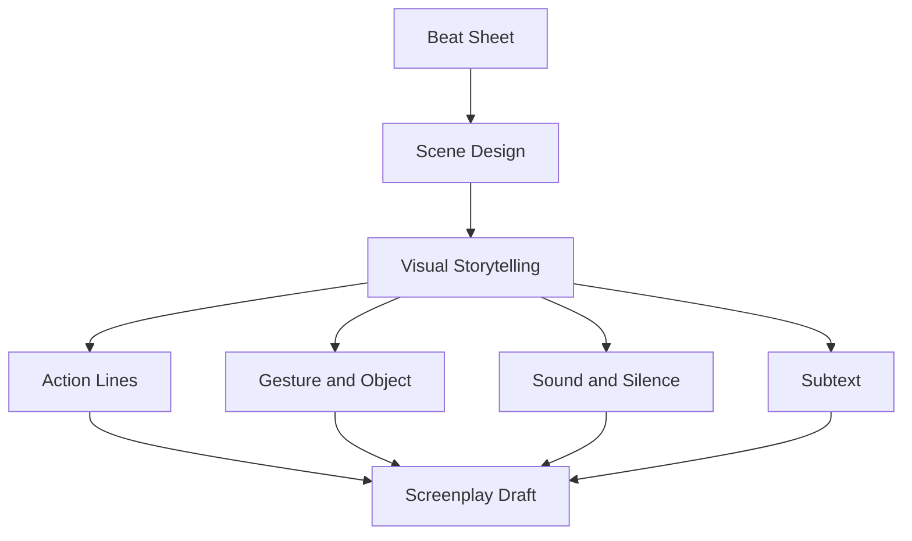
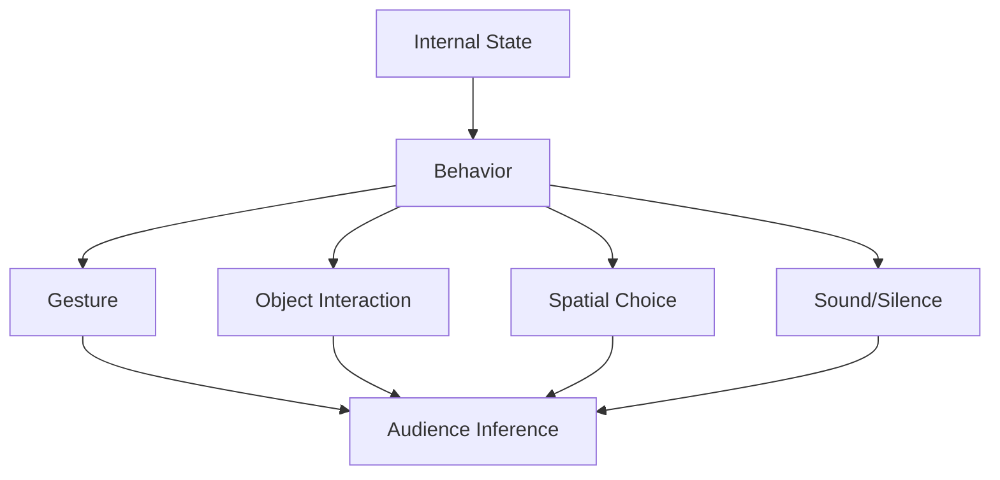
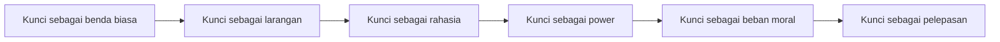
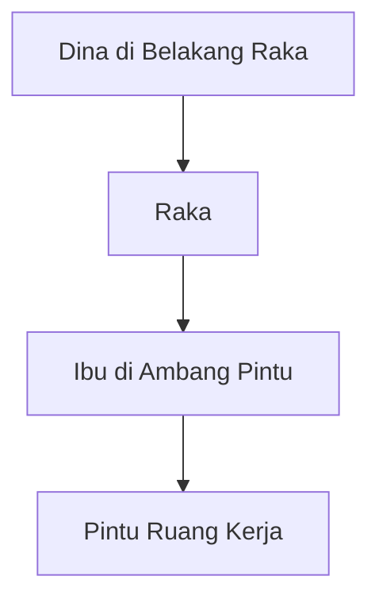
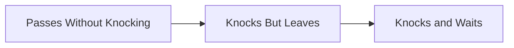

# learn-screenwriting-film-script-part-012.md

# Part 012 — Visual Storytelling: Menulis yang Bisa Dilihat dan Didengar

> Seri: Learn Screenwriting for Film Project  
> Pendekatan: *The First 20 Hours* — Josh Kaufman  
> Fokus bagian ini: mengubah emosi, pikiran, tema, relasi, konflik, dan backstory menjadi tindakan visual-auditori yang bisa difilmkan.  
> Target praktis: mampu menulis action line dan scene beat yang filmik, konkret, playable, dan tidak bergantung pada narasi internal atau dialog eksposisi.

---

## 0. Posisi Part Ini dalam Roadmap

Pada Part 011 kita membahas **scene design**:

```text
Input State → Objective → Opposition → Tactics → Turn → Output State
```

Sekarang kita masuk ke kemampuan yang membedakan screenplay dari prosa: **visual storytelling**.

Naskah film bukan tempat utama untuk menjelaskan isi kepala karakter. Naskah film harus membuat pembaca, sutradara, aktor, sinematografer, editor, dan sound designer bisa memahami apa yang harus dialami penonton melalui hal-hal yang bisa:

- dilihat,
- didengar,
- dimainkan aktor,
- ditangkap kamera,
- dirancang dalam ruang,
- dibentuk lewat blocking,
- diberi ritme melalui editing,
- diperkuat dengan sound.

Diagram posisi:



Jika Part 011 menjawab:

```text
Apa fungsi scene ini?
```

Part 012 menjawab:

```text
Bagaimana fungsi itu terlihat dan terdengar di layar?
```

---

## 1. Prinsip Kaufman dalam Part Ini

Dalam pendekatan *The First 20 Hours*, kita tidak mencoba menguasai semua teori sinema. Kita fokus pada sub-skill bernilai tinggi.

Untuk 20 jam pertama, visual storytelling berarti mampu melakukan transformasi ini:

```text
Internal → External
Abstract → Concrete
Explained → Dramatized
Backstory → Behavior
Theme → Choice/Image
Emotion → Gesture/Action
Relationship → Blocking/Object/Distance
```

Targetnya bukan langsung menulis seperti penulis film top. Target awal yang realistis:

1. Tidak menulis hal yang tidak bisa difilmkan.
2. Bisa mengubah kalimat batin menjadi tindakan visual.
3. Bisa menulis action line yang ringkas dan tajam.
4. Bisa memakai objek untuk membawa makna.
5. Bisa memakai silence dan sound sebagai beat.
6. Bisa menunjukkan relasi melalui jarak, posisi, sentuhan, dan avoidance.
7. Bisa mengurangi dialog eksposisi.
8. Bisa membuat pembaca “melihat filmnya” saat membaca naskah.

---

## 2. Masalah Utama Penulis Pemula

Banyak penulis pemula menulis screenplay seperti novel yang dipaksa memakai format script.

Contoh buruk:

```text
Raka merasa bersalah karena selama ini ia mengabaikan ibunya. Ia tahu bahwa ia seharusnya pulang lebih cepat, tetapi egonya membuatnya terus menjauh.
```

Masalah:

- kamera tidak bisa merekam “merasa bersalah” secara langsung,
- aktor butuh tindakan playable,
- sutradara butuh gambar,
- penonton butuh inferensi,
- kalimat itu menjelaskan, bukan mendramatisasi.

Versi lebih filmik:

```text
Raka berdiri di depan pintu kamar ibunya. Di tangannya, kantong obat yang belum dibuka.

Ia mengetuk sekali.

Tidak menunggu jawaban.

Kantong obat itu ia gantung di gagang pintu, lalu pergi.

Dari dalam kamar, batuk ibunya tertahan.

Raka berhenti. Tidak berbalik.
```

Sekarang rasa bersalah muncul lewat:

- objek: kantong obat,
- tindakan: mengetuk tapi tidak masuk,
- suara: batuk ibu,
- blocking: berhenti tapi tidak berbalik,
- subtext: ingin peduli tapi belum sanggup hadir.

---

## 3. Film Berpikir dengan Gambar, Suara, dan Tindakan

Film tidak terutama berpikir dengan penjelasan. Film berpikir melalui:

1. **Image** — apa yang terlihat.
2. **Action** — apa yang dilakukan karakter.
3. **Gesture** — tindakan kecil yang mengungkap keadaan internal.
4. **Object** — benda yang membawa memori, status, rahasia, atau konflik.
5. **Space** — jarak, ruangan, pintu, batas, akses.
6. **Sound** — suara yang memberi tekanan atau makna.
7. **Silence** — ketiadaan suara sebagai tekanan.
8. **Rhythm** — panjang-pendek beat, pause, repetition.
9. **Contrast** — perbedaan antara yang dikatakan dan yang terjadi.
10. **Change** — transformasi visual dari awal ke akhir scene.

Visual storytelling bukan berarti semua harus indah. Visual storytelling berarti cerita dapat dipahami melalui pengalaman filmik.

---

## 4. Prinsip “Show, Don’t Tell” yang Sering Disalahpahami

“Show, don’t tell” bukan berarti karakter tidak boleh bicara.

Yang benar:

> Jangan menjelaskan sesuatu jika bisa didramatisasi melalui tindakan, konflik, pilihan, gesture, objek, atau konsekuensi.

Dialog tetap boleh. Tetapi dialog harus menjadi tindakan, bukan catatan penulis.

Buruk:

```text
DINA
Aku tidak percaya padamu lagi karena kamu selalu berbohong padaku sejak Ayah meninggal.
```

Lebih filmik:

```text
Raka mengulurkan kunci mobil.

Dina tidak mengambilnya.

DINA
Naik taksi aja.

RAKA
Din.

Dina memasukkan tasnya ke bagasi taksi online yang baru berhenti.

DINA
Setidaknya dia nggak pernah bilang akan jemput.
```

Makna yang sama:

- Dina tidak percaya Raka,
- ada riwayat janji yang gagal,
- relasi retak,
- tapi tidak dieja secara langsung.

---

## 5. Apa yang Boleh dan Tidak Boleh Ditulis dalam Screenplay

Screenplay idealnya menulis hal yang bisa ditangkap secara filmik.

| Hindari Menulis Langsung | Ubah Menjadi |
|---|---|
| Ia merasa sedih | Ia melipat baju anaknya yang sudah kekecilan |
| Ia mengingat masa lalu | Ia berhenti di depan bekas tinggi badan yang ditandai di tembok |
| Ia membenci ayahnya | Ia memakai mug ayahnya sebagai asbak |
| Ia takut bicara | Ia mengetik pesan panjang, lalu menghapusnya |
| Ia rindu rumah | Ia mencium bau bantal lama, lalu cepat-cepat menutup lemari |
| Ia merasa bersalah | Ia membayar tagihan rumah sakit tanpa menulis nama |
| Ia tidak percaya | Ia mengunci pintu dua kali setelah orang itu pergi |
| Ia merasa kecil | Ia duduk di kursi paling ujung, jaket masih dipakai |

Prinsip:

```text
Jangan tulis kesimpulan psikologis.
Tulis bukti perilaku yang membuat penonton menyimpulkan psikologi itu.
```

---

## 6. Kamera Tidak Bisa Membaca Pikiran, Tapi Bisa Membaca Jejak

Kamera tidak bisa merekam pikiran abstrak, tetapi bisa merekam **jejak pikiran**.

Contoh pikiran:

```text
Mira belum bisa memaafkan ibunya.
```

Jejak yang bisa direkam:

```text
Ibu menyodorkan piring.

Mira mengambilnya tanpa menyentuh tangan ibu.
```

Atau:

```text
Mira menulis kontak “Ibu” di ponsel.

Ia menghapus huruf I.

Tersisa: “Bu”.

Ia menatapnya lama, lalu mengunci layar.
```

Film sering bekerja melalui jejak kecil seperti ini.

---

## 7. Mental Model: Externalization Pipeline

Gunakan pipeline ini setiap kali Anda menulis sesuatu yang abstrak.



Template:

```text
Internal state:
Apa tanda perilakunya?
Objek apa yang bisa membawa makna?
Gesture apa yang tidak terlalu eksplisit?
Ruang/jarak apa yang bisa menunjukkan relasi?
Suara/silence apa yang bisa memperkuat tekanan?
Apa yang harus disimpulkan penonton?
```

---

## 8. Action Line: Tulang Visual Screenplay

Action line adalah bagian naskah yang menjelaskan apa yang terlihat dan terdengar.

Contoh:

```text
Raka membuka amplop itu. Di dalamnya, satu foto lama: ayahnya berdiri di depan rumah yang sama, memegang kunci yang kini tergantung di leher Ibu.
```

Action line yang baik:

- konkret,
- ringkas,
- aktif,
- visual,
- playable,
- tidak menjelaskan berlebihan,
- punya ritme,
- memberi ruang interpretasi,
- hanya menulis yang penting untuk cerita.

Action line bukan novel mini. Ia harus membuat pembaca melihat film bergerak.

---

## 9. Action Line Buruk vs Kuat

### 9.1 Terlalu internal

Buruk:

```text
Raka merasa hatinya hancur ketika melihat foto itu, karena ia sadar semua kebenciannya kepada ayah mungkin salah arah.
```

Lebih kuat:

```text
Raka melihat foto itu.

Jarinya menutup wajah ayahnya.

Lalu, perlahan, ia menutup wajah ibunya.
```

---

### 9.2 Terlalu novelistik

Buruk:

```text
Malam itu terasa seperti malam-malam yang selalu ia benci, malam yang membuatnya sadar bahwa hidup hanyalah rangkaian kehilangan yang tidak pernah benar-benar selesai.
```

Lebih kuat:

```text
Lampu dapur berkedip.

Di meja, tiga piring. Dua bersih. Satu masih penuh.

Mira mematikan lampu sebelum menyentuh makanannya.
```

---

### 9.3 Terlalu directing

Buruk:

```text
CAMERA PUSHES IN slowly to Raka’s trembling hand as the lens shifts focus to the old key in the background.
```

Lebih aman untuk screenplay spekulatif:

```text
Tangan Raka gemetar di dekat kunci tua itu.
```

Catatan:

- Penulis boleh memberi sinyal visual penting.
- Tapi hindari mengatur kamera terlalu teknis kecuali memang shooting script atau Anda juga sutradara.
- Tulis apa yang harus terasa dan terlihat, bukan selalu instruksi kamera.

---

## 10. Kata Kerja Lebih Penting dari Kata Sifat

Screenplay hidup dari tindakan.

Lemah:

```text
Raka sangat marah.
```

Lebih kuat:

```text
Raka melipat surat itu sampai sobek di lipatannya.
```

Lemah:

```text
Ibu terlihat sedih.
```

Lebih kuat:

```text
Ibu merapikan sandal Raka di depan pintu. Sepasang. Sejajar. Seperti ia masih anak kecil.
```

Kata sifat sering memberi kesimpulan. Kata kerja memberi bukti.

---

## 11. Tindakan Kecil Bisa Lebih Kuat dari Tindakan Besar

Pemula sering mengira emosi besar harus ditulis dengan tindakan besar:

- menangis keras,
- membanting barang,
- berteriak,
- memukul dinding.

Kadang itu tepat. Tapi sering kali tindakan kecil lebih tajam.

Contoh:

```text
Raka tidak menangis.

Ia hanya menghapus nama “Ayah” dari kontak darurat.
```

Atau:

```text
Mira menerima surat cerai ibunya.

Ia membaca satu halaman.

Lalu menaruhnya di bawah piring panas, agar kertas itu melengkung pelan.
```

Tindakan kecil memberi ruang pada penonton untuk merasa.

---

## 12. Gesture sebagai Interface Emosi

Gesture adalah aksi kecil yang mengungkap keadaan internal.

Contoh gesture:

- merapikan benda yang sudah rapi,
- menahan napas,
- menghindari kontak mata,
- menyentuh bekas luka,
- menghapus pesan,
- menyimpan barang rusak,
- mengganti topik sambil mencuci gelas,
- tertawa terlalu cepat,
- berhenti di ambang pintu,
- menutup pintu pelan padahal marah.

Gesture kuat jika spesifik untuk karakter.

Contoh:

```text
Karakter A kalau cemas menggigit kuku.
```

Itu umum.

Lebih spesifik:

```text
Setiap cemas, Raka mengecek apakah dompetnya masih ada. Bukan karena takut kehilangan uang, tapi karena dulu ayahnya pergi hanya membawa dompet.
```

Gesture bisa membawa backstory tanpa dialog.

---

## 13. Object sebagai Carrier Makna

Objek dalam film bisa membawa makna besar.

Objek bisa menjadi:

| Fungsi Objek | Contoh |
|---|---|
| Memory | Foto, kaset, baju lama |
| Secret | Kunci, amplop, ponsel terkunci |
| Guilt | Tagihan rumah sakit, obat, surat tak terkirim |
| Power | Sertifikat rumah, kartu akses, stempel |
| Love | Bekal, payung, cincin, helm cadangan |
| Betrayal | Tiket satu arah, nota hotel, chat tersembunyi |
| Identity | Seragam, kartu nama, ijazah |
| Boundary | Pintu, pagar, koper, garis lantai |
| Time | Jam mati, kalender, tiket expired |
| Promise | Benda yang disimpan meski rusak |

Objek yang baik berubah makna sepanjang cerita.

---

## 14. Object Arc

Object arc adalah perjalanan makna sebuah objek.

Contoh objek: kunci ruang kerja ayah.



Tracking:

```text
Objek:
Makna awal:
Siapa pemilik awal:
Bagaimana objek berpindah:
Makna baru:
Payoff final:
```

Contoh:

```text
Objek:
Kunci ruang kerja.

Makna awal:
Akses ke ruang terkunci.

Pemilik awal:
Ibu.

Perpindahan:
Ibu → Dina → Raka → korban lama.

Makna baru:
Dari kontrol keluarga menjadi pembukaan kebenaran.

Payoff final:
Raka menyerahkan kunci kepada korban, bukan kepada polisi atau keluarganya.
```

Objek menjadi struktur emosi.

---

## 15. Space: Ruang Sebagai Konflik

Ruang bukan hanya tempat. Ruang bisa menjadi tekanan.

Contoh ruang:

- pintu tertutup,
- meja makan panjang,
- kamar yang terlalu sempit,
- ruang tunggu rumah sakit,
- terminal bus,
- kantor polisi,
- lift,
- dapur,
- lorong sekolah,
- kamar lama,
- rumah kosong.

Ruang bisa mengekspresikan:

- isolasi,
- hierarchy,
- intimacy,
- confinement,
- exposure,
- shame,
- memory,
- surveillance,
- class difference,
- emotional distance.

Contoh:

```text
Raka dan Ibu bicara dari dua sisi meja makan yang terlalu panjang untuk rumah sekecil itu.
```

Ruang menunjukkan jarak emosional.

---

## 16. Blocking sebagai Cerita

Blocking adalah posisi dan gerakan karakter dalam ruang.

Screenwriter tidak perlu mengatur semua blocking secara teknis, tetapi bisa menulis tindakan yang memberi dramaturgi ruang.

Contoh:

```text
Ibu berdiri di ambang pintu ruang kerja.

Raka tidak bisa masuk tanpa menyentuhnya.
```

Ini bukan hanya posisi. Ini konflik.

Blocking bisa menunjukkan:

- siapa menghalangi siapa,
- siapa mendekati,
- siapa menjauh,
- siapa menguasai ruang,
- siapa terpojok,
- siapa punya akses,
- siapa berada di antara dua pihak.

Diagram:



Konflik ruang: Raka ingin masuk, Ibu menjadi boundary hidup, Dina menjadi saksi.

---

## 17. Distance sebagai Relasi

Jarak antar karakter bisa bercerita.

Contoh:

```text
Awal film:
Raka bicara dengan Ibu dari seberang ruangan.

Tengah film:
Raka berdiri di belakang Ibu, tidak tahu harus menyentuh bahunya atau tidak.

Akhir film:
Raka duduk di lantai, bersandar ke kaki kursi Ibu. Tidak bicara.
```

Jarak berubah = relasi berubah.

Gunakan distance arc:

```text
Far → Near but blocked → Touch avoided → Touch accepted → Separation chosen
```

Atau sebaliknya.

---

## 18. Door, Window, Threshold

Pintu dan jendela sangat berguna dalam visual storytelling karena mereka membawa konsep:

- akses,
- larangan,
- transisi,
- pilihan,
- rahasia,
- boundary,
- escape,
- exposure,
- vulnerability.

Contoh:

```text
Raka berdiri di depan pintu kamar Ibu. Ia membawa kabar buruk.

Pintu itu terbuka sedikit.

Ia menutupnya lagi dari luar.
```

Makna:

- kesempatan bicara ada,
- Raka memilih menutupnya,
- avoidance terlihat.

Threshold sering cocok untuk momen karakter belum siap berubah.

---

## 19. Environment sebagai Ekspresi Internal

Lingkungan bisa mencerminkan atau melawan kondisi karakter.

Contoh direct mirror:

```text
Kamar Raka rapi secara obsesif, kecuali satu laci penuh surat yang tidak pernah dibuka.
```

Contoh contrast:

```text
Di pesta ulang tahun yang riuh, Mira berdiri di dapur gelap, mencuci piring sendirian.
```

Environment bukan harus selalu simbolik. Tapi lingkungan yang spesifik membuat scene lebih hidup.

---

## 20. Production Design dalam Naskah

Screenwriter tidak mendesain semua detail artistik, tapi boleh memberi detail penting yang punya fungsi cerita.

Buruk:

```text
Ruang tamu itu sangat cantik, dengan sofa modern, lampu estetik, warna dinding pastel yang harmonis, dan dekorasi yang Instagrammable.
```

Lebih berguna:

```text
Ruang tamu itu terlalu rapi untuk rumah yang masih ditinggali. Semua foto keluarga menghadap ke dinding.
```

Detail kedua memberi:

- tone,
- misteri,
- karakter,
- konflik,
- visual hook.

---

## 21. Sound sebagai Cerita

Film bukan medium visual saja. Film adalah audiovisual.

Sound bisa menjadi:

- tekanan,
- memori,
- ancaman,
- ironi,
- transisi,
- motif,
- inner state eksternal,
- rhythm,
- worldbuilding.

Contoh sound:

```text
Dari kamar Ibu, suara mesin nebulizer berdengung.

Setiap Raka berbohong, ia menunggu dengung itu menutupi suaranya.
```

Sound menjadi taktik karakter.

---

## 22. Sound Motif

Sound motif adalah suara yang berulang dengan makna berubah.

Contoh: suara koper beroda di bandara.

| Muncul | Makna |
|---|---|
| Awal | Kepergian, mobilitas, jarak |
| Tengah | Penghindaran, kebohongan |
| Akhir | Kepulangan yang tidak selesai |

Contoh dalam naskah:

```text
Roda koper Raka berderak di lantai terminal.

Suara yang sama nanti muncul di lorong rumah sakit, saat ia menyeret koper berisi baju Ibu.
```

Sound motif membuat cerita punya memori sensorik.

---

## 23. Silence sebagai Beat

Silence bukan ketiadaan cerita. Silence bisa menjadi tekanan.

Contoh:

```text
RAKA
Ibu tanda tangan atau rumah ini hilang.

Ibu terus mengupas bawang.

Pisau kecil itu berhenti tepat di ibu jarinya.

Setetes darah.

Dina melihat.
```

Tidak ada jawaban. Tapi silence menjawab.

Silence efektif ketika:

- penonton tahu apa yang tidak diucapkan,
- karakter punya alasan untuk diam,
- gesture menggantikan kata,
- silence mengubah power,
- silence menambah tekanan.

---

## 24. Contrast antara Kata dan Tindakan

Subtext sering muncul dari contrast.

Contoh:

```text
IBU
Pergi saja kalau mau.

Tapi tangannya merapikan bekal ke dalam tas Raka.
```

Kata: silakan pergi.  
Tindakan: aku masih merawatmu.

Atau:

```text
RAKA
Aku nggak peduli.

Ia mengambil payung sebelum keluar, lalu meletakkannya di dekat pintu kamar Ibu.
```

Contrast membuat karakter terasa manusiawi.

---

## 25. Subtext Visual

Subtext bukan hanya dalam dialog. Subtext bisa visual.

Contoh:

```text
Di meja makan, tiga kursi.

Ibu duduk di kursi kanan.
Dina di kiri.
Kursi tengah kosong.

Raka berdiri. Tidak ada yang menawarkan kursi.
```

Subtext:

- Raka tidak punya tempat,
- ayah/masa lalu mungkin menempati kursi kosong,
- keluarga tidak lengkap,
- posisi Raka ambigu.

---

## 26. Visual Irony

Visual irony terjadi ketika gambar bertentangan dengan makna permukaan.

Contoh:

```text
Spanduk besar: SELAMAT DATANG KELUARGA BESAR.

Di bawahnya, Raka duduk sendirian, memegang surat pengusiran.
```

Atau:

```text
Foto keluarga bahagia di dinding.

Di bawahnya, Ibu dan Dina makan tanpa bicara. Piring Raka tidak disiapkan.
```

Visual irony bisa lebih tajam daripada dialog sinis.

---

## 27. Repetition with Variation

Pengulangan visual bisa menunjukkan perubahan.

Contoh:

```text
Scene awal:
Raka melewati kamar Ibu tanpa mengetuk.

Scene tengah:
Raka mengetuk, tapi pergi sebelum dijawab.

Scene akhir:
Raka mengetuk, menunggu, lalu duduk di lantai saat tidak ada jawaban.
```

Tindakan sama, makna berubah.

Diagram:



Repetition with variation membuat arc terasa tanpa perlu penjelasan.

---

## 28. Setup dan Payoff Visual

Setup/payoff tidak harus berupa plot twist. Bisa berupa gambar.

Contoh:

```text
Setup:
Dina selalu menyembunyikan tangannya di saku saat keluarga bertengkar.

Payoff:
Di klimaks, ia mengeluarkan tangan dari saku dan meletakkan kunci di meja.
```

Makna:

- Dina berhenti pasif,
- rahasia keluar,
- gesture membayar character arc.

Template:

```text
Visual setup:
Meaning at first appearance:
Repetition:
Payoff image:
Meaning at payoff:
```

---

## 29. Final Image sebagai Pernyataan Cerita

Final image sering lebih kuat daripada pidato penutup.

Contoh tema:

```text
Melindungi keluarga dengan kebohongan hanya mewariskan luka.
```

Final image lemah:

```text
Raka berkata bahwa ia tidak mau berbohong lagi.
```

Final image lebih kuat:

```text
Raka meninggalkan kunci ruang kerja di meja makan.

Pintu ruang itu terbuka.

Tidak ada yang masuk.

Untuk pertama kalinya, rumah itu tidak mengunci siapa pun.
```

Gambar menyampaikan posisi akhir film.

---

## 30. Menulis Emosi Tanpa Menyebut Emosi

Latihan penting: larang diri memakai kata emosi langsung.

Kata yang sering terlalu mudah:

```text
sedih, marah, takut, kecewa, malu, bahagia, rindu, cemas, bersalah, hancur, lega
```

Bukan berarti kata ini tidak boleh selamanya. Tapi dalam latihan 20 jam pertama, hindari dulu agar otot visual storytelling berkembang.

Contoh transformasi:

| Emosi | Visualisasi |
|---|---|
| Sedih | Karakter menyetrika baju orang yang sudah tidak pulang |
| Marah | Karakter mencuci gelas terlalu lama sampai retak |
| Takut | Karakter menaruh kursi di balik pintu, lalu menyingkirkannya sebelum orang lain lihat |
| Malu | Karakter melepas name tag sebelum masuk rumah |
| Rindu | Karakter menekan tombol lift lantai lama, lalu membatalkannya |
| Bersalah | Karakter membayar tagihan tanpa masuk kamar pasien |
| Lega | Karakter membuka jendela yang selama ini selalu tertutup |

---

## 31. Backstory Tanpa Flashback Eksposisi

Backstory sering perlu. Tapi jangan selalu dijelaskan.

Cara menyampaikan backstory secara filmik:

1. Objek lama.
2. Reaksi terhadap tempat.
3. Kebiasaan karakter.
4. Larangan keluarga.
5. Foto yang dimodifikasi.
6. Nama yang tidak boleh disebut.
7. Ruang yang tidak pernah dibuka.
8. Suara rekaman.
9. Dokumen tidak lengkap.
10. Gesture yang dipelajari dari orang lain.

Contoh:

```text
Raka masuk ke rumah lama.

Semua foto ayah masih ada.

Wajah Raka di setiap foto sudah digunting rapi.
```

Backstory muncul:

- ada konflik keluarga lama,
- penghapusan identitas,
- tindakan dilakukan dengan sengaja,
- tidak perlu penjelasan panjang.

---

## 32. Flashback: Kapan Perlu?

Flashback bisa dipakai, tetapi jangan menjadi default.

Flashback berguna jika:

- informasi masa lalu harus dialami, bukan dijelaskan,
- masa lalu punya struktur dramatik sendiri,
- flashback mengubah makna masa kini,
- penonton mendapat perspektif baru,
- flashback tidak hanya mengulang hal yang sudah diketahui.

Flashback lemah:

```text
Flashback hanya menunjukkan apa yang baru saja diceritakan karakter.
```

Flashback kuat:

```text
Karakter menceritakan versi A. Flashback menunjukkan versi B yang membuat kita curiga ia berbohong.
```

Atau:

```text
Flashback awal tampak seperti kenangan bahagia. Setelah reveal, flashback yang sama muncul dengan detail baru: tangan ibu gemetar di luar frame.
```

---

## 33. Visual Point of View

Film bisa memberi pengalaman subjektif tanpa narasi batin.

Teknik:

- apa yang karakter perhatikan,
- apa yang karakter abaikan,
- suara yang terdengar lebih keras,
- detail yang diisolasi,
- ruang yang terasa sempit,
- gesture orang lain yang disalahartikan,
- objek yang memicu reaksi.

Contoh:

```text
Di ruang makan, semua orang bicara.

Raka hanya melihat cincin di jari Ibu. Cincin ayah. Dipakai terbalik.
```

Kita masuk ke POV Raka karena naskah memilih detail yang ia perhatikan.

---

## 34. Detail yang Dipilih Adalah Makna

Screenplay tidak bisa menulis semua detail. Setiap detail yang dipilih memberi sinyal.

Buruk:

```text
Ruang itu berisi meja, kursi, lemari, televisi, karpet, kalender, lampu, sofa, vas bunga, jam dinding, dan beberapa foto.
```

Lebih kuat:

```text
Ruang itu rapi. Terlalu rapi.

Hanya satu bingkai foto yang berdebu: Raka saat umur tujuh tahun.
```

Detail yang dipilih memberi arah interpretasi.

---

## 35. Specificity Mengalahkan Generality

General:

```text
Ia melihat barang-barang lama.
```

Specific:

```text
Ia menemukan sepatu sekolahnya, masih berlumpur merah dari hari ayah pergi.
```

General:

```text
Ibu memasak.
```

Specific:

```text
Ibu menggoreng telur dadar tipis, lalu membaginya menjadi tiga bagian seperti dulu. Piring ketiga tetap kosong.
```

Spesifik membuat emosi terasa nyata.

---

## 36. Menulis Action Line dengan Ritme

Action line bukan hanya informasi. Ia punya ritme baca.

Bandingkan:

```text
Raka membuka pintu dan melihat ruang kerja ayahnya yang gelap, penuh debu, dengan meja tua, lemari besi, dan banyak dokumen berserakan yang membuatnya terkejut dan takut.
```

Versi dengan ritme:

```text
Raka membuka pintu.

Gelap.

Bau kertas lembap.

Di tengah ruang, meja ayahnya.

Di atasnya: dokumen berserakan. Baru. Tidak berdebu.
```

Ritme pendek bisa menciptakan suspense.

Gunakan paragraf pendek untuk beat penting.

---

## 37. White Space

White space di screenplay membantu pembaca merasakan tempo.

Padat:

```text
Raka membuka lemari dan menemukan koper tua yang terkunci, lalu ia menariknya keluar, membersihkan debu, mencoba membukanya dengan paksa, tetapi gagal, kemudian ia melihat ada label nama ibunya di bagian bawah koper itu.
```

Lebih filmik:

```text
Raka membuka lemari.

Sebuah koper tua.

Ia menariknya keluar. Debu pecah di lantai.

Terkunci.

Ia mencongkel pengaitnya. Gagal.

Lalu ia melihat label di bagian bawah.

Nama Ibu.
```

White space memberi penekanan.

---

## 38. Jangan Menulis Kamera Jika Tidak Perlu

Dalam spec script, biasanya lebih baik menghindari instruksi kamera eksplisit berlebihan.

Hindari:

```text
CAMERA ZOOMS IN on the letter.
```

Gunakan:

```text
Di sudut surat, satu nama yang tidak seharusnya ada: DINA.
```

Hindari:

```text
We pan across the room to reveal...
```

Gunakan:

```text
Di balik pintu, koper Raka sudah terbuka.
```

Fokus pada **apa yang penting terlihat**, bukan selalu cara kamera melihatnya.

Namun jika Anda juga sutradara atau menulis shooting draft internal project, instruksi teknis bisa lebih diterima. Tetap pastikan tidak mengganggu baca.

---

## 39. Visualizing Thought: Cara Mengubah Pikiran ke Aksi

Gunakan mapping:

```text
Pikiran → Pilihan → Tindakan → Konsekuensi visual
```

Contoh:

```text
Pikiran:
Raka curiga ibunya berbohong.

Pilihan:
Ia menguji ibunya tanpa menuduh langsung.

Tindakan:
Ia sengaja menyebut tanggal yang salah.

Konsekuensi visual:
Ibu langsung membetulkan tanggal itu, lalu sadar ia terpancing.
```

Scene:

```text
RAKA
Waktu Ayah pergi... itu tanggal dua belas, kan?

IBU
Sebelas.

Hening.

Ibu menurunkan gelasnya.

Raka tidak perlu bertanya lagi.
```

Curiga menjadi tindakan test.

---

## 40. Visualizing Relationship

Relasi bukan hanya disebut. Relasi terlihat dari pola tindakan.

Contoh relasi ibu-anak retak:

```text
Ibu menaruh lauk di piring Raka.

Raka memindahkannya ke piring Dina tanpa melihat Ibu.
```

Relasi kakak-adik:

```text
Dina menyodorkan helm.

Raka mengambilnya.

Dina menarik lagi.

DINA
Yang ini helm Ayah.
```

Relasi lama muncul melalui benda dan habit.

---

## 41. Visualizing Status

Status/power bisa ditunjukkan tanpa dialog.

Contoh:

```text
Semua orang berdiri saat Pak Wirya masuk.

Kecuali Ibu.

Pak Wirya melihatnya. Tersenyum.

Ia yang duduk lebih dulu.
```

Atau:

```text
Di kantor kelurahan, Raka bicara keras.

Petugas tidak menatapnya. Hanya mengetuk stempel di meja.

TOK. TOK. TOK.

Raka mengecilkan suara.
```

Status terlihat dari respons ruang dan orang.

---

## 42. Visualizing Moral Conflict

Moral conflict harus menjadi pilihan visual.

Abstrak:

```text
Raka harus memilih antara keluarga dan kebenaran.
```

Visual:

```text
Di meja, dua amplop.

Satu untuk polisi.
Satu untuk Ibu.

Raka memasukkan dokumen asli ke amplop polisi.

Berhenti.

Ia mengambil foto Dina dari dompet.

Amplop polisi terbuka lagi.
```

Penonton melihat tarik-menarik nilai.

---

## 43. Visualizing Theme

Tema tidak perlu diucapkan jika bisa diwujudkan dalam pattern visual.

Tema:

```text
Kebohongan yang dimaksudkan untuk melindungi akan menjadi warisan yang meracuni generasi berikutnya.
```

Pattern visual:

- Ibu menyimpan kunci.
- Ibu memberi kunci kepada Dina.
- Dina menyembunyikan kunci dari Raka.
- Raka merebut kunci.
- Raka akhirnya meletakkan kunci di meja terbuka.

Theme menjadi object arc.

---

## 44. Visual Metaphor

Visual metaphor adalah gambar yang membawa makna tambahan.

Contoh:

```text
Rumah keluarga bocor setiap hujan.

Setiap orang menaruh ember di tempat berbeda.

Tidak ada yang memperbaiki atap.
```

Makna:

- keluarga mengelola gejala, bukan akar masalah.
- semua tahu ada masalah, tidak ada yang menyelesaikan.

Hati-hati: visual metaphor jangan terlalu memaksa.

Buruk:

```text
Cermin pecah tepat saat karakter menyadari hidupnya juga pecah.
```

Bisa terasa terlalu obvious jika tidak dibangun.

---

## 45. Symbol vs Motif

Simbol adalah objek/gambar yang punya makna.  
Motif adalah pola berulang yang mengembangkan makna.

Contoh simbol:

```text
Kunci = rahasia/akses/kontrol.
```

Contoh motif:

```text
Pintu selalu dikunci dari dalam.
Kamar Ibu terkunci.
Ruang kerja Ayah terkunci.
Koper Raka terkunci.
Akhirnya satu pintu dibiarkan terbuka.
```

Motif lebih kuat karena berubah sepanjang cerita.

---

## 46. Avoid Over-Symbolism

Jangan membuat semua benda menjadi simbol. Penonton bisa merasa dimanipulasi.

Terlalu berat:

```text
Kunci melambangkan kebenaran, bunga melambangkan cinta, jam melambangkan waktu, hujan melambangkan kesedihan, burung melambangkan kebebasan, cermin melambangkan identitas.
```

Lebih baik:

- pilih 1–3 motif utama,
- ulang dengan variasi,
- hubungkan ke konflik,
- buat makna muncul lewat tindakan,
- jangan menjelaskan simbol lewat dialog.

---

## 47. Visual Storytelling dan Genre

Genre memengaruhi cara visual storytelling bekerja.

### 47.1 Drama

Fokus:

- gesture kecil,
- ruang domestik,
- object memory,
- silence,
- relasi tubuh,
- avoidance.

Contoh:

```text
Ibu menyisakan lauk untuk Raka meski ia bilang tidak menunggu.
```

### 47.2 Thriller

Fokus:

- clue,
- surveillance,
- object transfer,
- hidden threat,
- timing,
- restricted space.

Contoh:

```text
Raka memfotokopi dokumen. Di kaca mesin fotokopi, bayangan seseorang berdiri di belakangnya.
```

### 47.3 Horror

Fokus:

- negative space,
- sound anomaly,
- ritual,
- object displacement,
- body reaction,
- dread.

Contoh:

```text
Setiap pagi, kursi Ayah bergeser satu sentimeter mendekati meja makan.
```

### 47.4 Romance

Fokus:

- proximity,
- touch avoidance,
- shared object,
- timing,
- ritual kecil,
- vulnerability.

Contoh:

```text
Mereka berebut payung yang sama, lalu sama-sama memilih kehujanan.
```

### 47.5 Comedy

Fokus:

- visual mismatch,
- status reversal,
- object misunderstanding,
- timing,
- escalation.

Contoh:

```text
Raka menyembunyikan amplop bukti di rice cooker. Ibu menekan tombol COOK.
```

---

## 48. Visual Storytelling dan Tone

Tone menentukan jenis gambar.

Premis sama:

```text
Karakter menemukan koper lama.
```

Tone melancholic:

```text
Koper itu penuh baju anak kecil yang masih wangi kamper.
```

Tone sinister:

```text
Koper itu kosong, kecuali satu gigi di kantong plastik.
```

Tone absurd comedy:

```text
Koper itu berisi dua belas piala karaoke atas nama yang sama dengannya.
```

Tone political satire:

```text
Koper itu berisi plakat penghargaan, semua masih terbungkus plastik, semua untuk proyek yang tidak pernah dibangun.
```

Visual choice harus konsisten dengan rasa film.

---

## 49. Visual Storytelling dan Budget

Visual storytelling yang baik tidak selalu mahal.

Banyak momen kuat justru murah:

- kunci berpindah tangan,
- kursi kosong,
- pesan yang dihapus,
- piring ketiga,
- sepatu di depan pintu,
- lampu yang tidak dinyalakan,
- pintu yang tidak dibuka,
- foto yang dibalik,
- obat yang tidak diminum,
- koper yang ditinggalkan.

Untuk project film dengan constraint, cari gambar yang:

```text
low cost, high meaning
```

Matrix:

| Visual Idea | Cost | Meaning | Decision |
|---|---:|---:|---|
| Rumah terbakar | 10 | 7 | Redesign |
| Kunci ditaruh di meja | 1 | 9 | Keep |
| Crowd demonstrasi | 9 | 6 | Compress |
| Pintu terbuka setelah lama terkunci | 1 | 8 | Keep |
| Mobil tabrakan | 10 | 5 | Replace |
| Piring ketiga kosong | 1 | 8 | Keep |

---

## 50. Production-Aware Visual Rewrite

Contoh scene mahal:

```text
Raka melihat gudang besar terbakar, semua dokumen keluarga hangus, dan puluhan warga berteriak di luar.
```

Fungsi dramatik:

```text
Bukti hilang. Raka merasa terlambat. Banyak orang terdampak.
```

Versi murah:

```text
Raka membuka lemari besi.

Kosong.

Di dasar lemari, abu tipis.

Ia menyentuhnya.

Jarinya hitam.

Dari luar rumah, satu warga tua menunggu di pagar, memegang map yang sama.
```

Fungsi tetap:

- bukti hilang,
- keterlambatan,
- korban nyata,
- tanpa kebakaran besar.

---

## 51. Visual Storytelling untuk Karakter Pasif

Jika karakter terasa pasif, beri tindakan visual kecil yang menunjukkan pilihan.

Pasif:

```text
Dina mendengar Raka dan Ibu bertengkar.
```

Lebih aktif:

```text
Dina mendengar Raka dan Ibu bertengkar.

Ia menyalakan blender.

Suara mesin menelan kata-kata mereka.

Lalu ia mematikan blender tepat saat Raka menyebut nama Ayah.
```

Dina tidak hanya mendengar. Ia mengontrol apa yang ingin/tidak ingin didengar.

---

## 52. Visual Storytelling untuk Dialog Berat

Jika scene terlalu banyak dialog, cari visual counterpoint.

Dialog berat:

```text
Raka dan Ibu membahas rumah yang akan dijual.
```

Tambahkan aktivitas:

```text
Mereka membahas penjualan rumah sambil membungkus piring-piring lama dengan koran.

Setiap kali Raka menyebut harga, Ibu membungkus satu piring lebih kencang.

Piring terakhir retak di tangannya.
```

Aktivitas memberi:

- visual rhythm,
- subtext,
- tension,
- object metaphor,
- action for actors.

---

## 53. Visual Storytelling untuk Exposition

Eksposisi harus punya tekanan.

Buruk:

```text
IBU
Ayahmu dulu bekerja dengan Pak Wirya. Mereka menutup kasus kebakaran pasar tahun 2001. Banyak korban, tapi dokumennya hilang.
```

Lebih filmik:

```text
Ibu membuka kaleng biskuit lama.

Bukan biskuit.

Potongan koran. Hitam di tepinya, seperti pernah terbakar.

Raka menarik satu.

Headline: KEBAKARAN PASAR 2001.

Di foto kecil, Ayah berdiri di belakang Pak Wirya.

Raka mencari tanggal.

IBU
Jangan baca keras-keras.
```

Informasi muncul sebagai benda, larangan, dan reaksi.

---

## 54. Visual Storytelling untuk Inner Conflict

Inner conflict sering sulit karena terjadi di dalam.

Gunakan physicalized choice.

Contoh:

```text
Raka harus memilih menyerahkan bukti atau melindungi keluarga.
```

Visual:

```text
Raka berdiri di depan kotak pos polisi.

Amplop bukti setengah masuk.

Ponselnya bergetar.

DINA CALLING.

Amplop itu tidak bergerak.
```

Inner conflict terlihat melalui tubuh, objek, dan timing.

---

## 55. Visual Storytelling untuk Character Arc

Arc harus terlihat sebagai perubahan perilaku.

Flaw awal:

```text
Raka selalu menghindari konflik.
```

Visual arc:

| Tahap | Visual Behavior |
|---|---|
| Awal | Menghapus pesan sebelum terkirim |
| Awal-tengah | Mengetuk pintu tapi pergi |
| Tengah | Bicara, tapi dari balik pintu |
| Akhir-tengah | Masuk kamar dan berdiri jauh |
| Akhir | Duduk di samping Ibu dan mengatakan kebenaran |

Arc tidak perlu dijelaskan. Perilaku berubah.

---

## 56. Visual Storytelling untuk Relationship Arc

Relationship arc juga bisa visual.

Contoh Raka-Dina:

| Tahap | Visual |
|---|---|
| Awal | Dina memberi helm; Raka tidak mengambil |
| Tengah | Raka memberi kunci; Dina menolak |
| Krisis | Dina melempar kunci ke lantai antara mereka |
| Akhir | Raka meletakkan kunci di meja; Dina mengambil tanpa bicara |

Objek yang sama menandai perubahan relasi.

---

## 57. Writing Action Lines: Practical Rules

Gunakan aturan berikut.

### 57.1 Tulis yang terlihat/terdengar

```text
Bukan: Ia merasa dikhianati.
Tulis: Ia menghapus foto mereka dari dinding, tapi menyisakan bekas selotipnya.
```

### 57.2 Gunakan kata kerja aktif

```text
Bukan: Surat itu ada di meja.
Tulis: Surat itu menunggu di tengah meja, ditindih gelas Ibu.
```

### 57.3 Hindari penjelasan psikologis berlebihan

```text
Bukan: Ia melakukan itu karena trauma masa kecil.
Tulis: Ketika pintu dibanting, tubuhnya langsung menunduk sebelum ia sempat berpikir.
```

### 57.4 Pilih detail yang punya fungsi

```text
Jangan mendeskripsikan semua benda. Pilih benda yang membawa cerita.
```

### 57.5 Biarkan pembaca menyimpulkan

```text
Jangan terlalu cepat memberi kesimpulan moral.
```

---

## 58. Action Line Compression

Ambil action line panjang, lalu padatkan.

Versi panjang:

```text
Raka berjalan perlahan menuju lemari tua di sudut ruangan karena ia merasa takut dan penasaran tentang apa yang mungkin disembunyikan ayahnya di sana selama bertahun-tahun.
```

Versi padat:

```text
Raka mendekati lemari tua itu.

Setiap langkah lebih pelan dari sebelumnya.
```

Makna takut dan penasaran muncul lewat ritme.

---

## 59. Action Line Specificity Pass

Checklist:

- Apakah benda spesifik?
- Apakah tindakan spesifik?
- Apakah lokasi memberi tekanan?
- Apakah visual berubah?
- Apakah ada suara?
- Apakah ada pilihan karakter?
- Apakah kalimat terlalu menjelaskan?

Contoh rewrite:

Buruk:

```text
Dina sedih melihat rumahnya berantakan.
```

Lebih spesifik:

```text
Dina memungut bingkai foto dari lantai.

Kacanya pecah tepat di wajahnya sendiri.
```

---

## 60. Visual Beat Template

Gunakan template ini untuk setiap beat penting.

```text
Beat:
Internal meaning:
Visible action:
Object/space involved:
Sound/silence:
Before image:
After image:
Audience inference:
```

Contoh:

```text
Beat:
Raka tidak sanggup meminta maaf.

Internal meaning:
Ia ingin kembali, tapi egonya belum runtuh.

Visible action:
Ia menaruh obat di gagang pintu Ibu lalu pergi.

Object/space involved:
Obat, pintu kamar.

Sound/silence:
Batuk Ibu dari dalam.

Before image:
Raka berdiri di luar kamar.

After image:
Obat menggantung di pintu, Raka menghilang di lorong.

Audience inference:
Ia peduli, tapi belum mampu hadir.
```

---

## 61. Scene Visual Design Template

```text
Scene ID:
Scene Function:
Emotional Core:
Conflict:
Visual Core:
Object(s):
Spatial Relationship:
Sound Motif:
Silence Moment:
Opening Image of Scene:
Turning Image:
Closing Image:
What should audience infer?
What should not be said in dialogue?
```

Contoh:

```text
Scene ID:
SC-07

Scene Function:
Memindahkan kunci dari Ibu ke Dina.

Emotional Core:
Raka kehilangan kontrol dalam keluarga yang ia kira bisa ia atur.

Conflict:
Raka ingin mengambil kunci; Ibu ingin mencegah; Dina mulai sadar ada rahasia.

Visual Core:
Kunci sebagai liontin.

Object(s):
Kunci, mangkuk, meja makan.

Spatial Relationship:
Raka berdiri; Ibu duduk; Dina di antara mereka.

Sound Motif:
Sendok menyentuh mangkuk.

Silence Moment:
Saat Ibu melepas kunci.

Opening Image of Scene:
Kunci di leher Ibu.

Turning Image:
Ibu meletakkan kunci di tangan Dina.

Closing Image:
Genggaman Dina tertutup.

Audience inference:
Rahasia berpindah penjaga.

What should not be said in dialogue?
“Ibu tidak percaya kamu, Raka.”
```

---

## 62. Latihan 1 — Internal ke External

Ubah kalimat internal berikut menjadi tindakan visual.

```text
1. Ia merasa bersalah.
2. Ia membenci ayahnya.
3. Ia takut pulang.
4. Ia rindu ibunya.
5. Ia tidak percaya kakaknya.
6. Ia malu pada pekerjaannya.
7. Ia ingin dimaafkan.
8. Ia cemas kehilangan rumah.
9. Ia masih mencintai mantannya.
10. Ia tahu ia sedang berbohong kepada dirinya sendiri.
```

Template jawaban:

```text
Internal:
Visible action:
Object/space:
Sound/silence:
Audience inference:
```

Contoh:

```text
Internal:
Ia takut pulang.

Visible action:
Ia berdiri di depan pagar rumah, menekan bel, lalu cepat-cepat mematikan bel sebelum berbunyi penuh.

Object/space:
Pagar, bel rumah.

Sound/silence:
Bunyi bel terpotong.

Audience inference:
Ia ingin masuk, tapi takut konsekuensinya.
```

---

## 63. Latihan 2 — Rewrite Action Line

Rewrite versi buruk ini menjadi lebih filmik.

### Soal 1

```text
Raka sedih karena ibunya sakit dan ia merasa bersalah karena tidak pernah pulang.
```

### Soal 2

```text
Dina marah kepada Raka karena ia selalu menghilang saat keluarga butuh dia.
```

### Soal 3

```text
Ibu masih mencintai ayah meskipun ayah pernah menghancurkan keluarga mereka.
```

### Soal 4

```text
Raka merasa rumah itu penuh kenangan buruk.
```

### Soal 5

```text
Mira menyadari bahwa selama ini ia salah memahami ibunya.
```

Aturan:

- Jangan pakai kata sedih, marah, cinta, sadar, merasa.
- Pakai objek, gesture, ruang, suara.
- Maksimal 6 baris per jawaban.

---

## 64. Latihan 3 — Object Arc

Pilih satu objek penting dari cerita Anda.

Isi:

```text
Object:
First appearance:
Meaning at first appearance:
Who controls it:
Scene where meaning changes:
New meaning:
Final appearance:
Final meaning:
```

Contoh:

```text
Object:
Koper Raka.

First appearance:
Terminal bus, di samping kaki Raka.

Meaning at first appearance:
Kepergian.

Who controls it:
Raka.

Scene where meaning changes:
Ia menemukan baju Ibu di dalamnya, dimasukkan Dina diam-diam.

New meaning:
Bukan hanya alat pergi, tapi beban keluarga yang ia bawa.

Final appearance:
Koper ditinggalkan di depan pintu rumah.

Final meaning:
Kepergian ditunda; pulang menjadi pilihan sadar.
```

---

## 65. Latihan 4 — Visual Motif

Buat motif visual dengan 3–5 kemunculan.

Template:

```text
Motif:
Appearance 1:
Meaning:
Appearance 2:
Meaning shift:
Appearance 3:
Meaning shift:
Final appearance:
Final meaning:
```

Contoh:

```text
Motif:
Pintu yang tidak dibuka.

Appearance 1:
Raka melewati kamar Ibu tanpa mengetuk.
Meaning:
Avoidance.

Appearance 2:
Raka mengetuk ruang kerja Ayah meski tahu tidak ada orang.
Meaning shift:
Ia lebih siap menghadapi orang mati daripada orang hidup.

Appearance 3:
Ibu mengunci pintu kamar dari dalam.
Meaning shift:
Avoidance diwariskan.

Final appearance:
Raka duduk di depan pintu kamar Ibu yang terbuka.
Final meaning:
Ia tidak memaksa masuk, tapi tidak pergi.
```

---

## 66. Latihan 5 — Sound Motif

Buat satu sound motif.

Template:

```text
Sound:
First use:
Meaning:
Second use:
Meaning shift:
Third use:
Meaning shift:
Final use:
Final meaning:
```

Contoh:

```text
Sound:
Suara roda koper.

First use:
Raka menyeret koper di terminal.
Meaning:
Kepergian.

Second use:
Raka menyeret koper di lorong rumah lama.
Meaning shift:
Ia membawa kepergian masuk ke rumah.

Third use:
Dina menyeret koper itu keluar kamar Raka.
Meaning shift:
Keluarga menolak ditinggalkan diam-diam.

Final use:
Roda koper berhenti di depan pintu rumah.
Final meaning:
Kepergian berubah menjadi penundaan yang sadar.
```

---

## 67. Latihan 6 — Scene Tanpa Dialog

Ambil satu scene konflik keluarga. Tulis versi tanpa dialog.

Aturan:

- Maksimal 1 halaman.
- Harus ada objective.
- Harus ada opposition.
- Harus ada turn.
- Harus ada output state.
- Tidak boleh ada dialog.

Contoh setup:

```text
Raka ingin mengambil kunci dari meja.
Ibu ingin mencegahnya.
Dina tidak tahu apa arti kunci itu.
```

Tulis hanya dengan:

- gerak tangan,
- posisi tubuh,
- objek,
- suara,
- blocking,
- silence.

Latihan ini sangat efektif untuk membangun otot visual storytelling.

---

## 68. Latihan 7 — Dialog ke Visual

Ambil dialog eksposisi ini:

```text
RAKA
Aku tahu Ibu menyembunyikan sesuatu tentang Ayah.

IBU
Ibu hanya ingin melindungi kamu dan Dina.

RAKA
Melindungi kami atau melindungi diri Ibu sendiri?
```

Ubah menjadi scene dengan maksimal 2 kalimat dialog. Sisanya visual.

Tujuan:

- mempertahankan konflik,
- mengurangi verbal exposition,
- menaikkan subtext.

---

## 69. Practice Plan 90 Menit

Gunakan jadwal latihan ini.

| Durasi | Aktivitas | Output |
|---:|---|---|
| 10 menit | Pilih 5 scene card dari Part 011 | Scene target |
| 15 menit | Tentukan visual core tiap scene | Visual core list |
| 15 menit | Ubah internal emotion menjadi visible action | Externalization pass |
| 15 menit | Tambahkan object/sound/silence | Audiovisual layer |
| 15 menit | Rewrite action lines agar lebih konkret | Action rewrite |
| 10 menit | Hapus dialog eksposisi yang bisa divisualkan | Lean scene pass |
| 10 menit | Cek before/after image tiap scene | Visual state check |

Output minimal:

1. 5 scene dengan visual core.
2. 5 object/gesture detail.
3. 1 sound motif.
4. 1 visual motif.
5. 1 scene tanpa dialog.

---

## 70. Visual Storytelling Checklist

### 70.1 Filmability

- [ ] Apakah yang ditulis bisa dilihat atau didengar?
- [ ] Apakah ada kalimat internal yang belum dieksternalisasi?
- [ ] Apakah emosi ditunjukkan lewat tindakan?
- [ ] Apakah backstory muncul lewat jejak, bukan ceramah?

### 70.2 Specificity

- [ ] Apakah objek spesifik?
- [ ] Apakah gesture spesifik?
- [ ] Apakah lokasi memberi tekanan?
- [ ] Apakah detail yang dipilih punya fungsi?

### 70.3 Action Line

- [ ] Apakah action line ringkas?
- [ ] Apakah kata kerja aktif?
- [ ] Apakah terlalu banyak kata sifat?
- [ ] Apakah terlalu mengarahkan kamera?
- [ ] Apakah ada white space untuk beat penting?

### 70.4 Object and Motif

- [ ] Apakah ada objek bermakna?
- [ ] Apakah objek berubah makna?
- [ ] Apakah motif tidak terlalu banyak?
- [ ] Apakah setup/payoff visual jelas?

### 70.5 Sound and Silence

- [ ] Apakah scene punya potensi sound?
- [ ] Apakah silence dipakai sebagai tekanan?
- [ ] Apakah sound motif bisa mendukung emosi?
- [ ] Apakah suara memberi informasi atau rasa?

### 70.6 Production Awareness

- [ ] Apakah visual moment feasible?
- [ ] Apakah ada alternatif lebih murah dengan makna sama?
- [ ] Apakah scene mahal punya value dramatik tinggi?

---

## 71. Anti-Pattern Visual Storytelling

### 71.1 Menulis Psikologi, Bukan Perilaku

Gejala:

```text
Ia merasa bersalah, sedih, dan takut kehilangan ibunya.
```

Fix:

```text
Cari tindakan kecil yang membuat penonton menyimpulkan rasa itu.
```

---

### 71.2 Dialog Menjelaskan Semua

Gejala:

```text
Karakter mengatakan motivasi, sejarah, tema, dan luka secara langsung.
```

Fix:

```text
Ubah sebagian menjadi objek, gesture, silence, atau konflik.
```

---

### 71.3 Simbol Terlalu Obvious

Gejala:

```text
Cermin pecah saat hidup karakter pecah.
Hujan turun saat karakter sedih.
Bunga layu saat cinta mati.
```

Fix:

```text
Buat simbol lebih spesifik, lebih terhubung ke aksi, dan berubah makna sepanjang cerita.
```

---

### 71.4 Detail Dekoratif Tanpa Fungsi

Gejala:

```text
Deskripsi ruangan panjang tapi tidak mengubah pemahaman cerita.
```

Fix:

```text
Pilih 1–3 detail yang memberi karakter, konflik, atau tone.
```

---

### 71.5 Visual Mahal Tapi Kosong

Gejala:

```text
Ledakan, kerumunan, hujan besar, kejar-kejaran, tapi tidak ada perubahan karakter/stakes.
```

Fix:

```text
Cari fungsi dramatiknya. Jika fungsi bisa dicapai lebih murah, redesign.
```

---

### 71.6 Semua Emosi Terlalu Besar

Gejala:

```text
Karakter sering menangis, berteriak, membanting, memukul.
```

Fix:

```text
Gunakan restraint. Tindakan kecil sering lebih menyakitkan.
```

---

## 72. Debugging Visual Storytelling

### 72.1 Jika scene terasa seperti novel

Cek:

1. Apakah banyak kalimat “ia merasa/ia sadar/ia berpikir”?
2. Apakah ada tindakan visual?
3. Apakah objek punya fungsi?
4. Apakah dialog terlalu menjelaskan?
5. Apakah pembaca bisa membayangkan shot tanpa instruksi kamera?

### 72.2 Jika scene terasa datar

Cek:

1. Apakah visual berubah dari awal ke akhir?
2. Apakah ada object/space transition?
3. Apakah sound/silence bisa memberi tekanan?
4. Apakah gesture terlalu generik?
5. Apakah scene punya turn visual?

### 72.3 Jika scene terasa terlalu simbolik

Cek:

1. Apakah simbol muncul terlalu jelas?
2. Apakah karakter berinteraksi dengan simbol secara natural?
3. Apakah simbol punya fungsi plot/relasi?
4. Apakah makna simbol berubah?
5. Apakah ada terlalu banyak motif?

### 72.4 Jika scene terasa terlalu mahal

Cek:

1. Apa fungsi dramatik scene?
2. Apakah bisa dicapai dengan objek kecil?
3. Apakah bisa dicapai dalam satu lokasi?
4. Apakah crowd bisa diganti dengan satu saksi?
5. Apakah kehancuran besar bisa diganti dengan bukti kecil yang lebih personal?

---

## 73. Visual Rewrite Pass

Lakukan rewrite scene berlapis:

### Pass 1 — Remove Internal Explanation

Cari:

```text
merasa, sadar, berpikir, mengingat, memahami, menyadari, terluka, kecewa
```

Ubah menjadi tindakan.

### Pass 2 — Object Layer

Tanya:

```text
Objek apa yang membawa konflik scene?
```

### Pass 3 — Gesture Layer

Tanya:

```text
Gesture apa yang mengungkap emosi tanpa menyebutnya?
```

### Pass 4 — Space Layer

Tanya:

```text
Jarak, pintu, posisi, atau akses apa yang bisa menambah konflik?
```

### Pass 5 — Sound/Silence Layer

Tanya:

```text
Suara apa yang memberi tekanan? Di mana silence lebih kuat daripada dialog?
```

### Pass 6 — Compression

Tanya:

```text
Kalimat apa yang hanya menjelaskan hal yang sudah bisa dilihat?
```

Potong.

---

## 74. Example: Full Visual Rewrite

### 74.1 Draft awal yang lemah

```text
Raka merasa sangat marah kepada ibunya karena ia tahu bahwa ibunya telah berbohong tentang ayahnya selama bertahun-tahun. Ia juga merasa sedih karena ternyata semua kenangan masa kecilnya mungkin palsu. Ibu merasa bersalah tetapi tidak tahu bagaimana menjelaskan semuanya kepada Raka.
```

Masalah:

- semua internal,
- tidak ada aksi,
- tidak ada scene,
- tidak ada objek,
- tidak bisa dimainkan langsung.

### 74.2 Versi lebih filmik

```text
INT. RUMAH LAMA - RUANG MAKAN - MALAM

Raka meletakkan foto lama di meja.

Di foto itu: Ayah, Ibu, dan Pak Wirya. Tertawa di depan pasar yang belum terbakar.

Ibu tidak melihat foto itu.

Ia terus mengelap meja yang sudah kering.

RAKA
Ibu kenal dia.

Lap di tangan Ibu berhenti.

RAKA
Selama ini Ibu bilang nggak.

Ibu melipat lap itu. Rapi. Terlalu rapi.

Raka mengambil bingkai foto keluarga dari dinding.

Ia membuka belakangnya.

Foto yang sama. Dipotong kecil. Disembunyikan di balik foto keluarga.

Raka menatap Ibu.

Ibu akhirnya melihat foto itu.

Bukan pada Ayah.

Pada dirinya sendiri.
```

Apa yang terjadi:

- kemarahan Raka muncul lewat foto dan tindakan membuka bingkai,
- rasa bersalah Ibu muncul lewat avoidance dan lap,
- backstory muncul lewat foto tersembunyi,
- tema kebohongan keluarga muncul sebagai gambar,
- tidak perlu menjelaskan “Raka merasa marah”.

---

## 75. Output yang Harus Dibawa ke Part Berikutnya

Part berikutnya adalah:

> **Part 013 — Format Screenplay: Scene Heading, Action, Character, Dialogue, Parenthetical**

Sebelum lanjut, Anda sebaiknya punya:

1. 5 scene card dari Part 011.
2. Visual core untuk tiap scene.
3. Minimal 1 object arc.
4. Minimal 1 visual motif.
5. Minimal 1 sound motif.
6. 1 scene tanpa dialog.
7. 5 action line yang sudah direwrite dari internal menjadi external.

Part 013 akan membuat semua ini masuk ke format screenplay yang benar:

```text
Scene Heading
Action
Character Cue
Dialogue
Parenthetical
Extension
Transition
```

---

## 76. Ringkasan Part Ini

Visual storytelling adalah kemampuan mengubah hal abstrak menjadi pengalaman audiovisual.

Hal paling penting:

1. Film tidak bisa merekam pikiran, tetapi bisa merekam jejak pikiran.
2. Jangan tulis kesimpulan emosi; tulis bukti perilaku.
3. Action line harus konkret, aktif, ringkas, dan filmik.
4. Objek bisa membawa memori, rahasia, power, cinta, dan rasa bersalah.
5. Ruang, jarak, pintu, dan blocking bisa menunjukkan relasi.
6. Sound dan silence adalah bagian dari cerita.
7. Subtext sering muncul dari perbedaan kata dan tindakan.
8. Visual motif harus berubah makna, bukan sekadar simbol tempelan.
9. Detail yang dipilih adalah makna.
10. Visual storytelling yang kuat tidak harus mahal.
11. Scene yang baik punya before image dan after image.
12. Penonton harus menyimpulkan, bukan selalu diberi tahu.

Formula inti:

```text
Internal State → Visible Behavior → Object/Space/Sound → Audience Inference
```

Jika Anda bisa melakukan transformasi ini, screenplay Anda akan mulai terasa seperti film, bukan novel yang dipotong-potong menjadi dialog.

---

## 77. Status Seri

- Part 000: selesai.
- Part 001: selesai.
- Part 002: selesai.
- Part 003: selesai.
- Part 004: selesai.
- Part 005: selesai.
- Part 006: selesai.
- Part 007: selesai.
- Part 008: selesai.
- Part 009: selesai.
- Part 010: selesai.
- Part 011: selesai.
- Part 012: selesai.
- Part 013: berikutnya.

Seri **belum selesai**. Bagian berikutnya adalah:

> **Part 013 — Format Screenplay: Scene Heading, Action, Character, Dialogue, Parenthetical**
