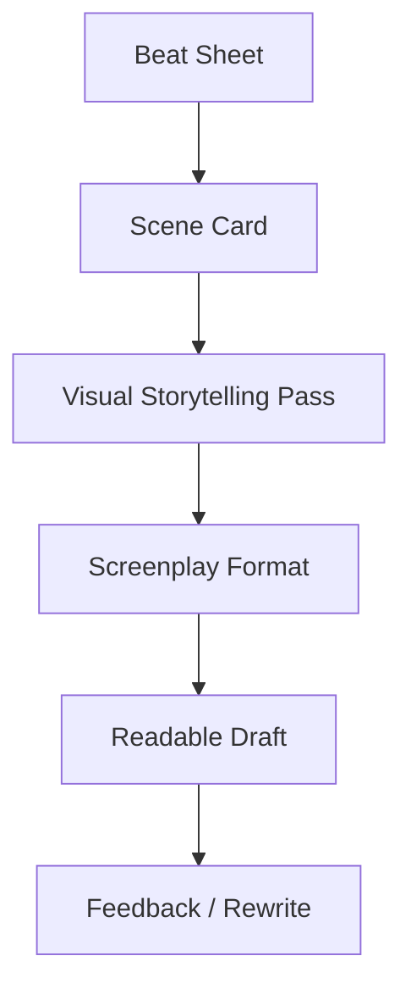
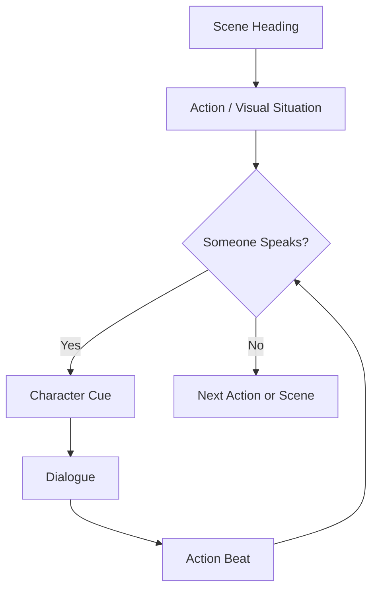

# learn-screenwriting-film-script-part-013.md

# Part 013 — Format Screenplay: Scene Heading, Action, Character, Dialogue, Parenthetical

> Seri: Learn Screenwriting for Film Project  
> Pendekatan: *The First 20 Hours* — Josh Kaufman  
> Fokus bagian ini: memahami format screenplay sebagai protokol komunikasi film, bukan sekadar aturan kosmetik.  
> Target praktis: mampu menulis scene dalam format screenplay dasar yang jelas, terbaca, filmik, dan cukup layak dipakai untuk draft project film.

---

## 0. Posisi Part Ini dalam Roadmap

Pada Part 011 dan Part 012 kita sudah membahas:

1. **Scene design** — scene sebagai unit perubahan.
2. **Visual storytelling** — cara mengubah emosi, tema, dan konflik menjadi gambar/suara/tindakan.

Sekarang kita masuk ke format.

Urutan pipeline kita:

```text
Beat Sheet → Scene Card → Visual/Sound Core → Screenplay Format → Draft Pages
```

Diagram:



Format screenplay penting karena screenplay bukan hanya tulisan pribadi. Ia adalah dokumen kerja untuk:

- sutradara,
- produser,
- aktor,
- DOP,
- editor,
- sound designer,
- production designer,
- assistant director,
- script supervisor,
- investor,
- festival reader,
- reviewer,
- collaborator.

Format adalah cara membuat cerita bisa dibaca sebagai film.

Untuk software engineer, format screenplay bisa dianalogikan seperti **interface contract**.

Jika interface contract kacau, consumer bingung.

Jika screenplay format kacau, pembaca tidak tahu:

- scene terjadi di mana,
- waktunya kapan,
- siapa bicara,
- apa yang terlihat,
- apa yang terdengar,
- mana action,
- mana dialog,
- mana instruksi transisi,
- mana suara off-screen,
- mana voice-over,
- mana informasi produksi.

---

## 1. Prinsip Kaufman dalam Part Ini

Dalam kerangka *The First 20 Hours*, kita tidak perlu menguasai semua detail format industri di awal. Kita perlu belajar **cukup untuk self-correction**.

Target 20 jam pertama:

1. Bisa menulis scene heading dengan benar.
2. Bisa menulis action line yang filmik.
3. Bisa menulis character cue.
4. Bisa menulis dialog.
5. Bisa memakai parenthetical secara hemat.
6. Bisa membedakan V.O., O.S., dan O.C.
7. Bisa menulis montage sederhana.
8. Bisa menulis intercut sederhana.
9. Bisa menghindari camera direction berlebihan.
10. Bisa memakai format untuk membantu pembaca, bukan memamerkan teknis.

Yang belum perlu dikejar di awal:

- shooting script penuh,
- scene numbering produksi,
- revision color pages,
- locked pages,
- camera lens detail,
- shot list lengkap,
- AD breakdown profesional,
- format TV multi-cam khusus,
- format stage play,
- legal release package.

Kita fokus pada **spec/working draft screenplay** yang jelas dan bisa dibaca.

---

## 2. Mental Model: Format adalah Protokol, Bukan Hiasan

Screenplay format bukan sekadar estetika. Ia menjawab beberapa pertanyaan dasar:

| Pertanyaan Produksi | Elemen Format |
|---|---|
| Scene terjadi di mana? | Scene Heading |
| Apa yang terlihat/didengar? | Action |
| Siapa bicara? | Character Cue |
| Apa yang dikatakan? | Dialogue |
| Bagaimana kalimat diucapkan jika penting? | Parenthetical |
| Suara dari mana? | V.O., O.S., O.C. |
| Ada perpindahan scene khusus? | Transition |
| Ada rangkaian cepat? | Montage |
| Adegan berjalan paralel? | Intercut |
| Ada teks di layar? | SUPER / TITLE |
| Ada suara spesifik? | Sound in Action |

Diagram dasar:



---

## 3. Format Dasar Screenplay

Elemen screenplay dasar:

1. **Title Page**
2. **Scene Heading / Slugline**
3. **Action**
4. **Character Cue**
5. **Parenthetical**
6. **Dialogue**
7. **Extension**
8. **Transition**
9. **Shot / Special Formatting**
10. **Montage**
11. **Intercut**
12. **Flashback**
13. **Superimposed Text**
14. **Sound / Music Cue**

Kita bahas satu per satu.

---

## 4. Title Page

Title page adalah halaman judul. Untuk project latihan, tidak perlu rumit.

Template:

```text
JUDUL FILM

Written by
Nama Penulis

Draft 1
Tanggal
Kontak optional
```

Contoh:

```text
RUMAH YANG TIDAK DIJUAL

Written by
Fajar Abdi Nugraha

Draft 1
25 June 2026
```

Catatan:

- Jangan taruh sinopsis panjang di title page.
- Jangan taruh quote motivasi kecuali memang bagian dari konsep.
- Jangan taruh desain visual berlebihan untuk draft kerja.
- Jika untuk pitch formal, title page bisa disesuaikan dengan standar pihak penerima.

---

## 5. Scene Heading / Slugline

Scene heading memberi tahu pembaca:

1. **Interior atau exterior**
2. **Lokasi**
3. **Waktu**

Format umum:

```text
INT. LOKASI - WAKTU
EXT. LOKASI - WAKTU
```

Contoh:

```text
INT. RUMAH LAMA - RUANG MAKAN - MALAM
EXT. TERMINAL BUS - SORE
INT./EXT. MOBIL RAKA - JALAN KAMPUNG - MALAM
```

Penjelasan:

| Elemen | Arti |
|---|---|
| INT. | Interior, di dalam ruangan/kendaraan |
| EXT. | Exterior, di luar |
| INT./EXT. | Bisa terlihat dalam dan luar, sering untuk kendaraan |
| Lokasi utama | Tempat besar |
| Sub-lokasi | Ruang spesifik |
| Waktu | DAY/NIGHT atau variasi seperti MORNING, EVENING |

---

## 6. INT. dan EXT.

Gunakan:

```text
INT.
```

untuk adegan di dalam ruang:

```text
INT. KANTOR KECAMATAN - RUANG ARSIP - SIANG
```

Gunakan:

```text
EXT.
```

untuk adegan di luar:

```text
EXT. DEPAN RUMAH LAMA - HUJAN - MALAM
```

Gunakan:

```text
INT./EXT.
```

untuk situasi seperti mobil, bus, kereta, atau ruang yang kamera bisa berpindah antara dalam dan luar.

```text
INT./EXT. TAKSI ONLINE - JALAN TOL - MALAM
```

Namun jangan terlalu teknis. Untuk draft awal, cukup jelas bagi pembaca.

---

## 7. Lokasi dalam Scene Heading

Lokasi harus spesifik tetapi tidak terlalu panjang.

Buruk:

```text
INT. SEBUAH RUMAH TUA WARISAN AYAH RAKA YANG TERLETAK DI PINGGIR KOTA DAN SUDAH LAMA TIDAK DIHUNI - MALAM
```

Lebih baik:

```text
INT. RUMAH LAMA - RUANG MAKAN - MALAM
```

Deskripsi detail rumah masuk ke action line, bukan scene heading.

Scene heading adalah label navigasi, bukan tempat prosa.

---

## 8. Waktu dalam Scene Heading

Waktu umum:

```text
PAGI
SIANG
SORE
MALAM
```

Dalam format Inggris sering:

```text
DAY
NIGHT
MORNING
EVENING
DAWN
DUSK
LATER
CONTINUOUS
MOMENTS LATER
```

Dalam bahasa Indonesia, Anda boleh memakai:

```text
PAGI
SIANG
SORE
MALAM
SUBUH
SENJA
BEBERAPA SAAT KEMUDIAN
BERLANJUT
```

Yang penting konsisten.

Contoh:

```text
INT. RUMAH LAMA - RUANG MAKAN - MALAM
INT. RUMAH LAMA - KORIDOR - BERLANJUT
```

`BERLANJUT` berarti scene berikutnya terjadi langsung setelah scene sebelumnya dalam kontinuitas waktu.

---

## 9. Master Scene Heading

Dalam screenplay modern, scene heading biasanya berupa master scene heading, bukan shot-by-shot.

Contoh:

```text
INT. RUMAH LAMA - RUANG MAKAN - MALAM
```

Lalu action line menjelaskan apa yang terjadi.

Jangan terlalu sering menulis:

```text
CLOSE UP:
MEDIUM SHOT:
CAMERA PANS:
DOLLY IN:
```

Kecuali benar-benar penting untuk storytelling.

Dalam draft penulis, fokus pada apa yang harus terlihat/didengar, bukan cara kamera merekamnya.

---

## 10. Action Line

Action line menjelaskan apa yang terlihat dan terdengar.

Action line bukan tempat menjelaskan pikiran tersembunyi yang tidak bisa difilmkan.

Buruk:

```text
Raka merasa bersalah karena selama bertahun-tahun ia mengabaikan ibunya dan kini ia sadar hidupnya kosong.
```

Lebih filmik:

```text
Raka berdiri di depan pintu kamar Ibu. Di tangannya, obat yang belum pernah ia belikan sendiri.

Ia mengetuk.

Tidak masuk.

Obat itu ia letakkan di lantai, lalu pergi.
```

Action line harus:

- visual,
- konkret,
- ekonomis,
- present tense,
- bisa direkam,
- punya ritme baca,
- tidak terlalu novelistik.

---

## 11. Present Tense

Screenplay ditulis dalam present tense karena film terjadi sekarang di depan pembaca.

Gunakan:

```text
Raka membuka pintu.
Ibu menatapnya.
Hujan menghantam genteng.
```

Bukan:

```text
Raka membuka pintu itu tadi.
Ibu telah menatapnya sejak lama.
Hujan sudah menghantam genteng.
```

Kecuali dalam dialog atau konteks tertentu.

---

## 12. Action Line: Prinsip Ekonomi

Action line harus cukup jelas, tidak berlebihan.

Buruk:

```text
Raka berjalan dengan sangat perlahan sekali menuju meja makan yang terlihat tua, penuh dengan berbagai macam noda bekas makanan dari masa lalu yang menunjukkan bahwa keluarga itu memiliki sejarah panjang dan penuh luka.
```

Lebih baik:

```text
Raka mendekati meja makan tua. Satu kursinya patah, tapi tetap disandarkan rapi.

Di tengah meja: piring retak, masih dipakai.
```

Pembaca bisa menyimpulkan sejarah/luka dari objek.

---

## 13. Action Line: Paragraph Length

Jangan membuat blok action terlalu panjang.

Buruk:

```text
Raka masuk ke rumah lama itu dan melihat seluruh ruangan yang berdebu dengan foto-foto keluarga yang masih tergantung di dinding, meja makan yang sudah lapuk, kursi patah, koran lama, kunci-kunci berkarat, lemari yang sedikit terbuka, dan semua itu membuatnya merasa sangat sedih karena ia teringat masa kecilnya yang tidak bahagia bersama ayahnya yang keras dan ibunya yang diam.
```

Lebih baik:

```text
Raka masuk.

Debu bergerak di bawah cahaya sore.

Foto keluarga masih tergantung di dinding. Ayah tersenyum paling lebar. Kaca fotonya retak tepat di wajah Raka kecil.

Raka membalik foto itu menghadap dinding.
```

Paragraf pendek memberi ritme visual.

---

## 14. Action Line dan White Space

White space penting karena screenplay dibaca cepat.

Gunakan paragraf pendek untuk:

- perubahan fokus visual,
- beat emosional,
- objek penting,
- tindakan penting,
- silence,
- reversal.

Contoh:

```text
Ibu melepas liontin dari lehernya.

Raka menahan napas.

Ibu tidak memberikannya kepada Raka.

Ia menjatuhkan kunci kecil itu ke telapak tangan Dina.
```

White space membuat turn terasa.

---

## 15. Capitalization dalam Action

Dalam beberapa tradisi screenplay, huruf kapital dipakai untuk:

- kemunculan pertama karakter,
- sound penting,
- object penting kadang,
- emphasis terbatas.

Contoh:

```text
RAKA (29) berdiri di depan rumah lama, kemejanya terlalu rapi untuk tempat sekotor itu.

Dari dalam rumah, suara PINTU DIBANTING.
```

Jangan terlalu banyak kapital.

Buruk:

```text
RAKA MEMBUKA PINTU dan MELIHAT MEJA TUA dengan Piring RETAK sementara HUJAN berbunyi KERAS.
```

Terlalu ramai.

Gunakan kapital sebagai sinyal, bukan dekorasi.

---

## 16. Memperkenalkan Karakter

Saat karakter pertama kali muncul, biasanya nama ditulis kapital, disertai usia kasar dan deskripsi singkat yang playable.

Contoh:

```text
RAKA (29), kemeja rapi, mata kurang tidur, berdiri di depan pagar rumah lama.
```

Deskripsi bagus bukan CV.

Buruk:

```text
RAKA (29), seorang software engineer lulusan universitas ternama yang pintar, ambisius, punya trauma masa kecil, dan sebenarnya sangat mencintai keluarganya.
```

Terlalu abstrak.

Lebih filmik:

```text
RAKA (29), kemeja rapi, sepatu mahal yang takut lumpur, berdiri di depan pagar rumah lama.
```

Dari sini kita tahu kelas, kontrol, ketidaknyamanan.

---

## 17. Deskripsi Karakter yang Playable

Deskripsi karakter harus memberi bahan bagi aktor, bukan biografi lengkap.

Pertanyaan:

1. Apa yang terlihat?
2. Apa kontradiksi yang menarik?
3. Apa energi pertama karakter?
4. Apa detail yang membedakan?
5. Apa yang bisa dimainkan aktor?

Contoh:

```text
IBU SARI (61), tubuh ringkih, mata yang masih bisa membuat orang dewasa merasa seperti anak kecil.
```

Atau:

```text
DINA (17), terlalu tenang untuk anak yang seharusnya tidak tahu apa-apa.
```

Deskripsi ini memberi rasa.

---

## 18. Character Cue

Character cue adalah nama karakter di atas dialog.

Contoh:

```text
RAKA
Ibu masih simpan kuncinya?
```

Biasanya ditulis kapital dan berada di tengah halaman dalam screenplay software.

Dalam markdown/plain text, kita bisa tulis sederhana:

```text
RAKA
Ibu masih simpan kuncinya?
```

Jangan menulis:

```text
Raka berkata:
```

dalam format screenplay.

---

## 19. Dialogue

Dialogue adalah apa yang dikatakan karakter.

Contoh:

```text
RAKA
Rumah ini harus dijual minggu ini.

IBU
Rumah tidak pernah buru-buru meninggalkan pemiliknya.
```

Dialog dalam screenplay harus:

- singkat,
- punya tujuan,
- terdengar seperti karakter,
- mengandung subtext,
- tidak hanya menjelaskan informasi,
- punya konflik atau tekanan,
- memberi ritme.

Dialog bukan percakapan realistis mentah. Dialog adalah tindakan verbal yang dipadatkan.

---

## 20. Dialogue sebagai Action

Setiap dialog harus melakukan sesuatu.

Dialog bisa:

- menyerang,
- menghindar,
- menggoda,
- mengancam,
- memohon,
- menguji,
- memanipulasi,
- menyembunyikan,
- membuka,
- menutup,
- mengalihkan,
- mempermalukan,
- menyelamatkan muka,
- membalik power.

Contoh:

```text
RAKA
Ibu masih simpan kuncinya?
```

Surface: bertanya.  
Action: memancing.  
Subtext: “Aku tahu Ibu menyembunyikan sesuatu.”

```text
IBU
Kamu masih suka membuka yang bukan hakmu?
```

Surface: menjawab dengan pertanyaan.  
Action: menyerang balik.  
Subtext: “Aku tahu niatmu, dan kamu bukan korban.”

---

## 21. Parenthetical

Parenthetical adalah instruksi pendek di bawah character cue dan sebelum dialog.

Contoh:

```text
RAKA
(pelan)
Dina jangan tahu.
```

Gunakan hemat.

Parenthetical berguna jika:

- cara mengucapkan bertentangan dengan teks,
- target bicara tidak jelas,
- action kecil penting,
- dialog bisa disalahpahami.

Jangan pakai parenthetical untuk mengarahkan akting berlebihan.

Buruk:

```text
RAKA
(sangat sedih, marah, kecewa, trauma, menangis dengan suara tertahan tapi juga berusaha terlihat kuat)
Aku pulang.
```

Lebih baik:

```text
Raka melihat piring retak di meja. Tangannya berhenti di sandaran kursi.

RAKA
Aku pulang.
```

Aksi memberi emosi. Parenthetical tidak perlu.

---

## 22. Parenthetical yang Baik

Contoh penggunaan tepat:

```text
DINA
(kepada Ibu)
Kakak nyari apa?
```

Karena target dialog penting.

```text
RAKA
(bukan pertanyaan)
Ibu tahu.
```

Karena cara kalimat harus dipahami.

```text
IBU
(tersenyum)
Ayahmu juga begitu.
```

Jika senyum mengubah makna kalimat.

Namun tetap hemat. Jika bisa ditulis sebagai action beat, sering lebih baik.

---

## 23. Action Beat di Tengah Dialog

Action beat bisa memecah dialog dan memberi subtext.

Contoh:

```text
RAKA
Rumah ini harus kosong besok.

Ibu menyendok nasi ke piring Dina. Terlalu banyak. Tumpah ke meja.

IBU
Besok itu cepat untuk orang yang baru ingat jalan pulang.
```

Action beat:

- memberi ritme,
- menunjukkan emosi,
- menghindari parenthetical,
- membuat scene filmik,
- memberi ruang aktor.

---

## 24. Extension: V.O., O.S., O.C.

Extension adalah keterangan setelah character cue.

Contoh:

```text
AYAH (V.O.)
Kalau kamu dengar ini, berarti kamu sudah pergi.
```

Jenis umum:

| Extension | Arti |
|---|---|
| V.O. | Voice Over, suara narasi/rekaman/inner voice di luar ruang scene |
| O.S. | Off Screen, karakter ada di lokasi scene tapi tidak terlihat kamera |
| O.C. | Off Camera, mirip O.S.; karakter ada tapi tidak terlihat frame |
| CONT'D | Dialog karakter berlanjut setelah terpotong action |
| PRE-LAP | Suara dari scene berikutnya masuk sebelum visual pindah |

---

## 25. V.O. — Voice Over

V.O. dipakai untuk suara yang tidak berasal langsung dari karakter yang terlihat bicara di scene.

Contoh:

```text
INT. TERMINAL BUS - MALAM

Naya menekan tombol play pada tape recorder.

AYAH (V.O.)
Kalau kamu sudah di terminal, berarti rumah kalah lagi.
```

V.O. bisa berupa:

- narasi,
- rekaman,
- surat dibaca,
- pesan suara,
- ingatan audio,
- inner monologue.

Hati-hati: V.O. sering jadi jalan pintas eksposisi.

Gunakan V.O. jika punya fungsi filmik, bukan karena malas memvisualkan.

---

## 26. O.S. — Off Screen

O.S. berarti suara karakter terdengar dari dalam lokasi scene, tetapi karakter tidak terlihat.

Contoh:

```text
INT. RUMAH LAMA - RUANG MAKAN - MALAM

Raka membuka laci meja.

DINA (O.S.)
Kakak bohong lagi?
```

Dina ada di scene/location, tapi belum terlihat.

Efek:

- surprise,
- tension,
- spatial awareness.

---

## 27. O.C. — Off Camera

O.C. mirip O.S., sering berarti karakter ada di lokasi tetapi kamera tidak sedang menampilkan dia.

Dalam praktik, O.S. lebih umum untuk penulis. Untuk 20 jam pertama, cukup kuasai O.S.

Jangan terlalu terobsesi membedakan O.S. dan O.C. pada draft awal. Yang penting pembaca paham sumber suara.

---

## 28. CONT'D dan MORE

Screenwriting software biasanya otomatis menambahkan:

```text
RAKA (CONT'D)
```

jika dialog karakter berlanjut setelah action kecil.

Contoh:

```text
RAKA
Aku tidak datang untuk bertengkar.

Ia melihat kunci di leher Ibu.

RAKA (CONT'D)
Aku cuma mau yang Ayah tinggalkan.
```

Dalam draft manual, Anda tidak harus terlalu memikirkan ini. Software akan membantu.

`MORE` biasanya otomatis muncul jika dialog terpotong pergantian halaman.

Untuk pemula: jangan tulis manual kecuali perlu.

---

## 29. Transition

Transition menunjukkan perpindahan khusus antar scene.

Contoh:

```text
CUT TO:
FADE IN:
FADE OUT.
MATCH CUT TO:
SMASH CUT TO:
DISSOLVE TO:
```

Dalam spec screenplay modern, transition sering sangat hemat. Jangan menulis `CUT TO:` setiap scene.

Default film adalah cut. Tidak perlu selalu ditulis.

Gunakan transition jika efeknya penting.

Contoh:

```text
Raka meniup debu dari foto ayah.

MATCH CUT TO:

EXT. PEMAKAMAN - SIANG

Abu rokok jatuh ke tanah basah.
```

Transition punya fungsi visual/emosional.

---

## 30. FADE IN dan FADE OUT

Banyak screenplay dibuka dengan:

```text
FADE IN:
```

dan diakhiri dengan:

```text
FADE OUT.
```

Untuk draft latihan, boleh digunakan.

Contoh:

```text
FADE IN:

EXT. RUMAH LAMA - SORE

...
```

Akhir:

```text
FADE OUT.

THE END
```

Namun jangan terlalu banyak memakai fade/dissolve di tengah naskah kecuali punya alasan.

---

## 31. Montage

Montage adalah rangkaian potongan gambar/aksi yang merangkum proses, waktu, atau variasi.

Contoh:

```text
MONTAGE - RAKA MEMBERSIHKAN RUMAH

-- Raka membuka jendela. Debu terbang seperti kabut.

-- Ia mengangkat kursi patah. Satu kaki kursi tertinggal.

-- Dina menemukan foto lama, menyembunyikannya di saku.

-- Ibu berdiri di ambang pintu, tidak masuk.

END MONTAGE
```

Montage berguna untuk:

- merangkum waktu,
- menunjukkan proses,
- menunjukkan perubahan bertahap,
- membandingkan beberapa aksi,
- membangun ritme.

Jangan pakai montage untuk menghindari scene dramatik penting. Jika konflik utama terjadi, tulis scene penuh.

---

## 32. Montage yang Buruk vs Baik

Buruk:

```text
MONTAGE - RAKA MENJADI DEWASA DAN MEMAHAMI SEMUA KESALAHANNYA
```

Terlalu abstrak.

Lebih baik:

```text
MONTAGE - RAKA BELAJAR TINGGAL DI RUMAH LAMA

-- Raka mencoba tidur di kamar masa kecilnya. Lampu tidak mau mati.

-- Ia menutup lubang atap dengan map kantor.

-- Ia makan mi instan di meja makan, memakai piring retak yang dulu ia benci.

-- Ia menghapus nomor agen properti, lalu mengetiknya lagi.

-- Ia berhenti. Tidak jadi menekan call.
```

Perubahan terlihat lewat tindakan.

---

## 33. Intercut

Intercut digunakan ketika dua lokasi/aksi berjalan paralel, sering dalam telepon atau ketegangan simultan.

Contoh:

```text
INTERCUT - RAKA / DINA

INT. RUMAH LAMA - RUANG KERJA - MALAM

Raka membuka laci ayah.

INT. TERMINAL BUS - MALAM

Dina menunggu di antara koper-koper.

RAKA
Kamu bawa kuncinya?

DINA
Kakak dulu yang jawab. Ibu tahu dari kapan?
```

Atau format sederhana:

```text
INT. RUMAH LAMA - RUANG KERJA - MALAM

Raka menelepon.

INTERCUT WITH:

EXT. TERMINAL BUS - MALAM

Dina mengangkat.
```

Gunakan intercut untuk menjaga ritme tanpa scene heading berulang-ulang.

---

## 34. Flashback

Flashback menunjukkan kejadian masa lalu.

Gunakan jika perlu dan jelas.

Format sederhana:

```text
FLASHBACK - INT. RUMAH LAMA - RUANG MAKAN - MALAM

Raka kecil duduk di bawah meja. Di atasnya, suara piring pecah.

AYAH (O.S.)
Jangan keluar.

END FLASHBACK.
```

Atau:

```text
INT. RUMAH LAMA - RUANG MAKAN - MALAM - FLASHBACK
```

Konsistensi lebih penting daripada variasi.

Hati-hati: flashback bisa melemahkan cerita jika hanya menjelaskan. Flashback harus punya fungsi dramatik:

- mengubah pemahaman,
- memperdalam luka,
- membalik asumsi,
- memberi payoff,
- menciptakan irony.

---

## 35. Flashback vs Memory Image

Kadang tidak perlu full flashback. Cukup memory image.

Contoh:

```text
Raka menyentuh bekas luka di meja.

SEKILAS:

Tangan kecilnya bersembunyi di bawah meja yang sama. Piring pecah di lantai.

KEMBALI KE:
```

Ini lebih cepat dan sensorial.

Gunakan jika ingin memberi trauma fragment, bukan scene masa lalu penuh.

---

## 36. SUPER / TITLE / Text on Screen

Gunakan untuk teks di layar.

Contoh:

```text
SUPER: Jakarta, 2003.
```

Atau:

```text
TITLE CARD: TIGA HARI SEBELUM RUMAH DIJUAL
```

Untuk pesan ponsel:

```text
ON PHONE SCREEN:

DINA: Kak, jangan buka ruang itu.
```

Jangan overuse. Jika semua informasi diberikan lewat teks layar, film terasa malas.

---

## 37. Phone / Chat Message Formatting

Untuk project modern, pesan ponsel sering muncul.

Format sederhana:

```text
Ponsel Raka bergetar.

ON SCREEN:

AGEN PROPERTI
Besok jam 9 saya datang dengan pembeli.
Pastikan rumah kosong.
```

Atau:

```text
INSERT - PHONE SCREEN

DINA: Ibu tahu kamu bohong.
```

Jika pesan penting secara dramatik, tulis jelas.

Jika tidak penting, cukup:

```text
Ponsel Raka bergetar. Ia melihat nama Dina. Menolak panggilan.
```

---

## 38. Sound dalam Screenplay

Sound ditulis dalam action line.

Contoh:

```text
Dari ruang kerja, suara KETUKAN pelan.

Raka membeku.

KETUKAN itu terdengar lagi. Tiga kali. Sama seperti dulu.
```

Sound bisa dikapitalisasi jika penting.

Gunakan sound untuk:

- membangun dread,
- memberi motif,
- menghubungkan scene,
- menunjukkan off-screen action,
- menandai emosi,
- menciptakan rhythm.

---

## 39. Music Cue

Untuk spec draft, jangan terlalu banyak menulis lagu spesifik kecuali memang penting dan haknya jelas.

Buruk:

```text
Lagu terkenal X diputar penuh.
```

Lebih aman:

```text
Sebuah lagu dangdut tua dari radio dapur, suaranya pecah dan terlalu ceria untuk ruangan itu.
```

Jika lagu original bagian dari cerita, boleh lebih spesifik secara fungsi:

```text
Dina menyenandungkan melodi yang sama dari rekaman ayah.
```

Music harus punya fungsi dramatik, bukan hanya mood tempelan.

---

## 40. Camera Direction

Secara umum, hindari camera direction berlebihan di draft penulis.

Buruk:

```text
CAMERA DOLLIES IN slowly toward Raka's face, then PANS LEFT to the key, then CUTS TO CLOSE UP of Ibu's eye.
```

Lebih screenplay-friendly:

```text
Raka melihat kunci di leher Ibu.

Untuk pertama kalinya malam itu, Ibu menutup kerah bajunya.
```

Kita memberi gambar yang perlu dilihat, bukan mengatur kamera secara teknis.

Namun camera direction boleh dipakai jika bentuk visualnya esensial.

Contoh:

```text
WE STAY ON the closed door as the argument behind it turns into silence.
```

Ini bukan sekadar teknis; ini mengatur pengalaman penonton.

Gunakan hemat.

---

## 41. Shot Heading

Kadang screenplay memakai shot heading singkat:

```text
CLOSE ON:
THE KEY
Raka's fingers almost touch it.
```

Atau:

```text
UNDER THE TABLE

Dina's phone records everything.
```

Gunakan ketika perlu mengarahkan fokus pembaca pada informasi visual penting.

Jangan tiap paragraf menjadi shot list.

---

## 42. INSERT

INSERT dipakai untuk objek/informasi visual penting.

Contoh:

```text
INSERT - DOCUMENT

Nama ayah Raka tercetak di bawah kolom: SAKSI.

BACK TO SCENE
```

Gunakan untuk:

- dokumen,
- pesan,
- foto,
- headline,
- bukti,
- detail visual penting.

Jangan overuse. Jika bisa ditulis di action line biasa, tidak perlu INSERT.

---

## 43. Beat dalam Format

Action beat dalam screenplay:

```text
RAKA
Kuncinya.

Ibu tidak bergerak.

Dina menatap liontin di leher Ibu.

IBU
Kamu dengar kakakmu.
```

Setiap action beat memecah dialog dan mengubah tension.

Format membantu ritme baca.

---

## 44. Dual Dialogue

Dual dialogue berarti dua karakter bicara bersamaan.

Dalam software screenplay, ada fitur khusus. Untuk draft manual, bisa tulis sederhana jika perlu:

```text
RAKA
Ibu, dengarkan--

DINA
Jangan bohong lagi--
```

Atau:

```text
Raka dan Dina bicara bersamaan.

RAKA
Aku cuma mau--

DINA
Kakak selalu begitu!
```

Jangan terlalu sering. Overlapping dialogue sulit dibaca jika berlebihan.

---

## 45. Bahasa dalam Screenplay Indonesia

Anda bisa menulis screenplay dalam bahasa Indonesia dengan format internasional yang disesuaikan.

Contoh:

```text
INT. RUMAH LAMA - RUANG MAKAN - MALAM

Raka berdiri di ambang pintu. Kemejanya basah hujan, tapi sepatunya masih bersih.

Ibu duduk di meja makan. Di lehernya, kunci kecil sebagai liontin.

RAKA
Rumah ini harus kosong besok.

IBU
Rumah tidak kosong hanya karena orangnya pergi.
```

Elemen `INT./EXT.` bisa tetap dipakai karena lazim. Waktu bisa pakai bahasa Indonesia.

---

## 46. Format Fountain

Fountain adalah format screenplay plain text. Cocok untuk orang teknis karena bisa ditulis di text editor, versioned di Git, dan dikonversi ke PDF screenplay dengan tool yang mendukung.

Contoh Fountain:

```text
Title: Rumah yang Tidak Dijual
Credit: Written by
Author: Fajar Abdi Nugraha
Draft date: 25 June 2026

INT. RUMAH LAMA - RUANG MAKAN - MALAM

RAKA (29) berdiri di ambang pintu. Kemejanya basah hujan, tapi sepatunya masih bersih.

Di leher IBU SARI (61), kunci kecil tergantung sebagai liontin.

RAKA
Rumah ini harus kosong besok.

IBU
Rumah tidak kosong hanya karena orangnya pergi.
```

Fountain mendeteksi scene heading, character cue, dialogue, dan action dari pola teks.

---

## 47. Fountain: Elemen Dasar

Contoh:

```text
INT. TERMINAL BUS - MALAM

NAYA menunggu di bangku plastik. Koper kecil di bawah kakinya.

Ponselnya bergetar.

ON SCREEN:

IBU
Angkat, Nak.

Naya menolak panggilan.

AYAH (V.O.)
Kalau kamu dengar ini, berarti kamu sudah pergi.
```

Fountain cocok jika Anda ingin workflow seperti:

```text
Plain text → Git versioning → Export PDF
```

---

## 48. Markdown vs Fountain vs Screenwriting Software

| Opsi | Kelebihan | Kekurangan |
|---|---|---|
| Markdown | Mudah, fleksibel, bagus untuk materi/outline | Tidak otomatis format screenplay |
| Fountain | Plain text, versionable, screenplay-aware | Butuh converter/editor |
| Final Draft/Fade In/WriterDuet | Format otomatis, industri, kolaborasi | Bisa berbayar/berat |
| Google Docs | Kolaboratif | Format screenplay manual sulit |
| Celtx/Arc Studio | Development workflow | Bergantung platform |

Untuk latihan 20 jam:

- gunakan apa pun yang mengurangi friction,
- jangan biarkan software menjadi alasan tidak menulis,
- format manual sederhana cukup untuk belajar.

Untuk project serius, gunakan software yang bisa export PDF screenplay dengan benar.

---

## 49. Page Count dan Durasi

Aturan kasar industri: satu halaman screenplay kira-kira satu menit layar, tetapi ini hanya estimasi.

Scene dengan banyak dialog cepat bisa lebih pendek di layar.  
Scene dengan visual/silence bisa lebih panjang di layar.  
Action sequence bisa berbeda jauh.

Untuk belajar:

| Target | Perkiraan Halaman |
|---|---:|
| Film pendek 3 menit | 3–5 halaman |
| Film pendek 10 menit | 8–12 halaman |
| Film pendek 15 menit | 12–18 halaman |
| Feature | 90–120 halaman |
| Proof-of-concept teaser | 2–5 halaman |

Jangan jadikan page count sebagai hukum absolut, tapi gunakan untuk mengontrol scope.

---

## 50. Spec Script vs Shooting Script

**Spec script / reading draft**:

- fokus pada cerita,
- tidak banyak nomor scene,
- tidak banyak camera direction,
- mudah dibaca,
- belum locked untuk produksi.

**Shooting script**:

- bisa punya scene numbers,
- revision marks,
- shot/technical notes lebih banyak,
- dipakai oleh produksi,
- biasanya setelah script locked.

Untuk tahap belajar dan development, tulis seperti spec/working draft.

Jangan terlalu cepat membuat shooting script.

---

## 51. Scene Numbering

Pada draft awal, jangan perlu nomor scene kecuali untuk internal scene list.

Dalam screenplay final produksi, scene number bisa ditambahkan setelah script locked.

Untuk folder kerja, Anda boleh punya scene ID di scene list:

```text
SC-01
SC-02
SC-03
```

Tapi dalam draft screenplay, scene numbering formal bisa ditunda.

---

## 52. Writing Action Without Directing Camera

Daripada menulis:

```text
CLOSE UP on Raka's trembling hand.
```

Anda bisa menulis:

```text
Tangan Raka gemetar di atas kunci.
```

Pembaca tahu fokus visualnya.

Daripada:

```text
CAMERA PANS to the broken plate.
```

Tulis:

```text
Di ujung meja, piring retak itu masih dipakai.
```

Daripada:

```text
TRACKING SHOT follows Dina.
```

Tulis:

```text
Dina menyusuri koridor gelap, satu tangan menutup senter ponselnya.
```

Fokus pada pengalaman visual, bukan perangkat kamera.

---

## 53. Menulis yang Tidak Bisa Difilmkan

Hindari:

```text
Raka ingat bahwa masa kecilnya penuh kekecewaan.
```

Ubah:

```text
Raka membuka lemari. Seragam SD-nya masih tergantung, lengkap dengan name tag yang salah eja.

Ia tidak memperbaikinya.
```

Hindari:

```text
Dina merasa bahwa kakaknya tidak pernah benar-benar pulang.
```

Ubah:

```text
Dina meletakkan piring untuk Raka, lalu mengambilnya lagi sebelum nasi disendok.
```

Format screenplay memaksa kita menulis film, bukan esai psikologis.

---

## 54. Internal Thought

Jika harus menyampaikan pikiran internal, cari bentuk eksternal.

Internal:

```text
Raka takut menjadi seperti ayahnya.
```

Eksternal:

```text
Raka hampir membentak Dina.

Ia berhenti.

Di dinding, foto ayahnya: mulut terbuka, tangan menunjuk.

Raka menurunkan tangannya sendiri.
```

Penonton melihat ketakutan tanpa dijelaskan.

---

## 55. Backstory dalam Format

Backstory jangan ditumpahkan dalam action line panjang.

Buruk:

```text
Raka masuk ke rumah tempat ia tumbuh bersama ayah yang keras, ibu yang diam, dan adik yang selalu ia lindungi sejak kecil. Di rumah itu banyak kenangan buruk yang membuatnya pergi selama bertahun-tahun.
```

Lebih filmik:

```text
Raka masuk.

Di dinding, tinggi badan dua anak ditandai dengan pensil.

DINA - 7 TAHUN
DINA - 8 TAHUN
DINA - 9 TAHUN

Di sebelahnya, hanya satu tanda untuk Raka.

RAKA - 12 TAHUN

Setelah itu, kosong.
```

Backstory muncul lewat visual evidence.

---

## 56. Format Scene Contoh Lengkap

Berikut contoh scene pendek dalam format screenplay sederhana.

```text
INT. RUMAH LAMA - RUANG MAKAN - MALAM

Hujan menghantam genteng.

RAKA (29) berdiri di ambang pintu, kemejanya basah, sepatunya masih bersih.

Di meja makan, IBU SARI (61) menyendok nasi ke piring DINA (17). Terlalu banyak. Nasi tumpah ke meja.

Di leher Ibu, KUNCI KECIL menggantung sebagai liontin.

RAKA
Rumah ini harus kosong besok.

IBU
Rumah tidak kosong hanya karena orangnya pergi.

Raka melihat kunci itu.

RAKA
Ibu masih simpan?

Dina mengikuti tatapan Raka.

IBU
Kamu masih suka membuka yang bukan hakmu?

RAKA
Aku cuma mau bereskan warisan Ayah.

Sendok Ibu berhenti.

IBU
Ayahmu tidak meninggalkan warisan.

Raka mendekat. Dina menegang.

RAKA
Kalau begitu, kasih kuncinya.

Ibu melepas liontin dari lehernya.

Raka menahan napas.

Ibu menjatuhkan kunci itu ke telapak tangan Dina.

IBU
Jaga ini dari kakakmu.

Dina menutup genggamannya.

Raka kehilangan kata-kata.
```

Analisis:

| Elemen | Contoh |
|---|---|
| Scene heading | INT. RUMAH LAMA - RUANG MAKAN - MALAM |
| Action visual | Hujan, nasi tumpah, kunci liontin |
| Character intro | RAKA, IBU SARI, DINA |
| Dialogue | Raka/Ibu |
| Subtext | Rumah, warisan, hak |
| Turn | Kunci diberikan ke Dina |
| Output state | Raka kehilangan kontrol |

---

## 57. Format yang Mendukung Subtext

Perhatikan bagaimana action beat memengaruhi dialog.

```text
RAKA
Aku cuma mau bereskan warisan Ayah.

Sendok Ibu berhenti.

IBU
Ayahmu tidak meninggalkan warisan.
```

Jika action beat dihapus:

```text
RAKA
Aku cuma mau bereskan warisan Ayah.

IBU
Ayahmu tidak meninggalkan warisan.
```

Masih bisa, tapi kurang tension.

Action beat memberi ruang bagi reaksi.

---

## 58. Formatting Silence

Silence bisa ditulis sederhana.

```text
RAKA
Ibu tahu dari awal?

Ibu tidak menjawab.

Hanya hujan. Dan sendok Dina yang pelan-pelan berhenti.
```

Atau:

```text
Raka menunggu jawaban.

Tidak ada.

Itu jawabannya.
```

Hati-hati dengan kalimat “itu jawabannya”. Ini agak literer, tapi bisa dipakai hemat jika tone mendukung.

Lebih filmik:

```text
Ibu menunduk.

Di bawah meja, tangannya menggenggam kunci sampai buku jarinya memutih.
```

---

## 59. Formatting Long Dialogue

Jika karakter bicara panjang, pastikan ada alasan dramatik.

Monolog boleh, tapi harus punya:

- tekanan,
- perubahan,
- audience dalam scene,
- risiko,
- rhythm,
- subtext,
- consequence.

Buruk:

```text
IBU
Dulu ayahmu bekerja di kantor itu, lalu dia bertemu seseorang yang membuatnya melakukan kesalahan besar, dan sejak saat itu hidup kami berubah...
```

Lebih baik pecah dengan action, resistance, dan reveal bertahap.

```text
IBU
Ayahmu bukan korban.

RAKA
Jangan mulai lagi.

IBU
Dia yang buka pintunya.

Raka membeku.

IBU (CONT'D)
Malam itu. Untuk mereka.
```

Sedikit, tapi lebih berdampak.

---

## 60. Formatting Argument

Argument bukan saling berteriak terus.

Argument yang baik punya taktik.

Contoh progression:

```text
RAKA
Kasih kuncinya.

IBU
Tidak.

RAKA
Ini bukan rumah Ibu.

IBU
Bukan rumahmu juga.

RAKA
Aku ahli waris.

IBU
Kamu tamu yang membawa map.
```

Power bergerak. Dialog menyerang status.

---

## 61. Formatting Phone Call

Ada beberapa cara.

### 61.1 Hanya satu sisi terdengar

```text
INT. RUMAH LAMA - KORIDOR - MALAM

Raka berbisik ke ponsel.

RAKA
Dina, buka pintunya.

Ia mendengar sesuatu dari seberang.

RAKA (CONT'D)
Dina?

Di balik pintu, ponsel Dina bergetar di lantai.
```

### 61.2 Intercut

```text
INTERCUT - RAKA / DINA

INT. RUMAH LAMA - KORIDOR - MALAM

Raka menempelkan telinga ke pintu.

EXT. TERMINAL BUS - MALAM

Dina berdiri di antara penumpang.

RAKA
Kamu di mana?

DINA
Tempat orang pergi beneran.
```

Pilih berdasarkan efek.

---

## 62. Formatting Text Messages

Contoh:

```text
Ponsel Raka menyala.

ON SCREEN:

DINA
Jangan buka ruang itu.

Raka mengetik:

RAKA
Kamu tahu apa?

Sebelum terkirim, pesan baru masuk.

DINA
Lebih banyak dari Kakak.
```

Jangan terlalu banyak menulis bubble chat jika tidak penting. Fokus pada dampak karakter.

---

## 63. Formatting Dream

Dream sequence harus jelas.

```text
DREAM - INT. RUMAH LAMA - RUANG MAKAN - MALAM

Meja makan memanjang tanpa akhir.

Raka kecil duduk di satu ujung. Ayah di ujung lain, wajahnya tertutup asap.

Setiap kali Raka membuka mulut, suara kunci jatuh dari tenggorokannya.

END DREAM.
```

Pastikan dream punya fungsi, bukan sekadar estetika.

---

## 64. Formatting Memory Fragment

```text
FLASH OF MEMORY:

-- Piring pecah.

-- Tangan ayah menunjuk.

-- Dina kecil menangis tanpa suara.

BACK TO SCENE.
```

Memory fragment cocok untuk trauma, clue, atau sensory recall.

Gunakan hemat agar tidak melodramatis.

---

## 65. Formatting Time Jump

```text
EXT. RUMAH LAMA - PAGI

Matahari baru naik.

SUPER: TIGA HARI KEMUDIAN
```

Atau:

```text
THREE DAYS LATER
```

Jika screenplay bahasa Indonesia:

```text
SUPER: TIGA HARI KEMUDIAN
```

Konsisten.

---

## 66. Formatting Series of Shots

Series of shots mirip montage, biasanya lebih pendek.

```text
SERANGKAIAN GAMBAR:

-- Kunci masuk ke lubang pintu.

-- Debu jatuh dari kusen.

-- Tangan Raka gemetar.

-- Dina menahan napas.

Pintu terbuka.
```

Gunakan untuk memadatkan momen visual.

---

## 67. Formatting Split Screen

Jarang diperlukan dalam spec draft, tapi bisa jika konsep penting.

```text
SPLIT SCREEN:

KIRI - Raka membuka laci ayah.

KANAN - Dina membuka koper di terminal.

Keduanya menemukan foto yang sama.
```

Gunakan hanya jika split screen memang bagian dari pengalaman film, bukan karena penulis ingin terlihat stylish.

---

## 68. Formatting News / TV / Radio

Contoh TV:

```text
DI TELEVISI

Seorang pembaca berita tersenyum terlalu tenang.

PEMBACA BERITA
Kasus lama yang melibatkan pejabat daerah kembali dibuka...
```

Contoh radio:

```text
RADIO DAPUR (V.O.)
...hujan diperkirakan turun hingga tengah malam.

Ibu mematikan radio sebelum berita berikutnya dimulai.
```

Media dalam scene bisa memberi informasi, tetapi jangan jadi dumping ground eksposisi.

---

## 69. Formatting Crowd / Background

Jika background penting:

```text
EXT. TERMINAL BUS - MALAM

Penumpang berdesakan. Sopir berteriak tujuan. Anak kecil menangis di dekat mesin tiket rusak.

Naya berdiri diam di tengah arus itu, satu-satunya orang yang tidak bergerak.
```

Jangan menulis crowd detail terlalu banyak jika tidak relevan.

---

## 70. Formatting Props Penting

Jika prop penting, beri fokus.

```text
Di meja: MAP COKELAT tua, pinggirnya terbakar.

Raka menyentuhnya seperti menyentuh luka.
```

Prop penting harus dilacak dalam scene berikutnya.

---

## 71. Formatting Violence

Tulis violence secara jelas tapi tidak perlu eksploitasi.

Buruk:

```text
Ia memukulnya dengan sangat brutal berkali-kali sampai darah muncrat ke mana-mana secara mengerikan.
```

Lebih efektif:

```text
Satu pukulan.

Dina jatuh.

Yang paling keras bukan tubuhnya menghantam lantai, tapi kunci yang terlepas dari genggamannya.
```

Fokus pada consequence dan story meaning.

---

## 72. Formatting Intimacy

Jika ada adegan intim, tulis dengan respect dan relevansi dramatik.

Buruk:

```text
Deskripsi sensual panjang yang tidak punya fungsi cerita.
```

Lebih tepat:

```text
Raka dan Mira hampir berciuman.

Tapi saat Mira menyentuh bekas luka di tangan Raka, Raka mundur.

Momen itu hilang.
```

Adegan intim harus mengubah relasi, bukan hanya dekorasi.

---

## 73. Formatting Comedy

Comedy membutuhkan rhythm dan surprise.

Contoh:

```text
Raka membuka koper.

Bukan dokumen.

Kostum badut. Lengkap dengan hidung merah.

Ia menutup koper.

Koper itu BERBUNYI.

Raka membukanya lagi. Hidung merah itu berkedip.
```

White space membantu timing komedi.

---

## 74. Formatting Horror / Suspense

Horror membutuhkan sensory control.

```text
INT. RUMAH LAMA - KORIDOR - MALAM

Lampu koridor berkedip.

Raka berhenti.

Dari balik pintu ruang kerja: suara kuku menggaruk kayu.

Sekali.

Lalu diam.

Raka mendekat.

Kali ini, garukan datang dari sisi pintu tempat ia berdiri.
```

Hindari menjelaskan “Raka sangat takut”. Tunjukkan lewat tindakan, suara, dan ritme.

---

## 75. Formatting Drama

Drama sering hidup lewat restraint.

```text
IBU
Kamu makan dulu.

RAKA
Aku tidak lapar.

Ibu tetap mengambil piring. Meletakkan nasi. Lauk. Sambal.

Porsi yang sama seperti waktu Raka kecil.

Raka duduk.
```

Tidak ada deklarasi cinta. Tapi relasi terasa.

---

## 76. Formatting Action

Action harus jelas dan mudah dibaca.

Buruk:

```text
Raka berlari cepat sekali sambil menghindari banyak orang, lalu belok ke kanan, kemudian ke kiri, naik tangga, turun lagi, melompati pagar, dan akhirnya hampir tertangkap.
```

Lebih baik:

```text
Raka menabrak arus penumpang.

Di belakangnya, pria berjaket hitam mendekat.

Raka naik tangga darurat.

Terkunci.

Ia menoleh.

Pria itu sudah di anak tangga pertama.
```

Action bagus adalah sequence of pressure.

---

## 77. Formatting Scene with No Dialogue

Scene tanpa dialog tetap harus punya perubahan.

Contoh:

```text
INT. KAMAR RAKA - SUBUH

Raka membuka koper.

Kemeja kantor. Sepatu mahal. Map penjualan rumah.

Di dasar koper: foto kecil Dina waktu SD.

Raka mengambil foto itu.

Mencari tempat menyimpannya.

Tidak ada.

Ia menyelipkannya di dompet, menutup koper, lalu mengeluarkan map penjualan.

Map itu ia tinggalkan di meja.
```

Output state:

```text
Raka mulai memilih relasi daripada transaksi.
```

Tidak ada dialog, tapi cerita bergerak.

---

## 78. Formatting Scene Headings untuk Lokasi Sama

Jika masih di lokasi utama tapi pindah ruang:

```text
INT. RUMAH LAMA - RUANG MAKAN - MALAM

...

INT. RUMAH LAMA - KORIDOR - BERLANJUT

...

INT. RUMAH LAMA - RUANG KERJA - BERLANJUT
```

Ini jelas dan mudah dibreakdown.

Jika perpindahan sangat kecil dan kontinu, bisa ditulis dalam action:

```text
Raka keluar dari ruang makan menuju koridor.
```

Namun jika scene dramatik berubah, scene heading baru membantu.

---

## 79. Formatting Mini-Slugs

Mini-slug adalah heading kecil dalam scene untuk memindahkan fokus ke area lain tanpa full scene heading.

Contoh:

```text
DAPUR

Ibu mencuci piring yang sudah bersih.

KORIDOR

Raka membuka pintu ruang kerja.
```

Gunakan jika masih dalam lokasi besar yang sama dan ingin ritme cepat.

Jangan overuse di draft awal.

---

## 80. Formatting Parallel Action

Contoh:

```text
INT. RUMAH LAMA - RUANG KERJA - MALAM

Raka menarik laci.

INT. TERMINAL BUS - LOKET - MALAM

Dina menyerahkan tiket.

INT. RUMAH LAMA - RUANG KERJA - MALAM

Laci terbuka.

INT. TERMINAL BUS - LOKET - MALAM

Petugas mengembalikan tiket.

PETUGAS
Bus terakhir batal.
```

Jika terlalu sering bolak-balik, gunakan INTERCUT.

---

## 81. Format dan Readability

Readability adalah prioritas.

Pembaca screenplay sering membaca cepat. Mereka perlu:

- tahu siapa,
- tahu di mana,
- tahu apa yang berubah,
- tidak tersesat dalam paragraf panjang,
- tidak disuruh membaca pikiran penulis,
- tidak terganggu instruksi kamera berlebihan.

Pertanyaan:

```text
Apakah halaman ini bisa dibaca cepat dan dibayangkan sebagai film?
```

---

## 82. Format sebagai Pacing

Format memengaruhi ritme.

Contoh cepat:

```text
Kunci jatuh.

Dina menangkapnya.

Raka terlambat.
```

Contoh lambat:

```text
Kunci itu terlepas dari tangan Ibu, berputar sekali di udara, menangkap pantulan lampu ruang makan yang redup, sebelum akhirnya jatuh ke telapak tangan Dina yang sejak tadi terbuka seperti sudah menunggu.
```

Keduanya bisa benar tergantung efek.

Gunakan format untuk mengatur napas pembaca.

---

## 83. Format dan Emphasis

Jangan jelaskan “ini penting”. Buat format memberi fokus.

Kurang efektif:

```text
Ini adalah momen yang sangat penting karena Raka akhirnya sadar Dina memegang rahasia.
```

Lebih efektif:

```text
Dina membuka genggamannya.

Kunci itu ada di sana.

Raka mundur setengah langkah.
```

White space memberi emphasis.

---

## 84. Format dan Subtext

Subtext sering muncul dari gap antara dialog dan action.

Contoh:

```text
IBU
Ibu tidak menyembunyikan apa-apa.

Di bawah meja, kakinya menahan pintu laci agar tetap tertutup.
```

Dialog berkata A. Action berkata B. Penonton membaca ketegangan.

---

## 85. Format dan Actor-Friendly Writing

Aktor butuh playable intention.

Tulis action/dialog yang memberi aktor tujuan, bukan instruksi emosi.

Kurang playable:

```text
Raka sangat sedih dan penuh konflik batin.
```

Lebih playable:

```text
Raka ingin memeluk Dina.

Tangannya naik sedikit.

Dina tidak melihat.

Raka memasukkan tangan itu ke saku.
```

Aktor bisa memainkan keinginan yang ditahan.

---

## 86. Format dan Director-Friendly Writing

Sutradara butuh ruang interpretasi. Jangan over-direct.

Kurang baik:

```text
Kamera close up ke mata Raka selama 3 detik, lalu tilt down ke kunci, lalu rack focus ke ibu.
```

Lebih baik:

```text
Raka melihat kunci di leher Ibu.

Ibu menutup kerah bajunya.
```

Sutradara bisa memilih shot, tetapi fokus dramatik jelas.

---

## 87. Format dan Producer-Friendly Writing

Produser membaca feasibility.

Format yang jelas membantu mereka melihat:

- lokasi,
- waktu,
- karakter,
- props,
- crowd,
- special requirement.

Scene heading kacau membuat breakdown kacau.

Contoh jelas:

```text
EXT. TERMINAL BUS - MALAM
```

langsung memberi sinyal lokasi publik, malam, izin, extras, sound, lighting.

Jangan menyembunyikan kebutuhan produksi dalam paragraf samar.

---

## 88. Format dan Editor-Friendly Writing

Editor membaca rhythm dan transition.

Jika scene punya turn jelas, editor punya material kuat.

Action line yang terlalu panjang tanpa beat bisa membuat ritme kabur.

Contoh readable:

```text
Raka membuka pintu.

Gelap.

Ia menyalakan korek.

Ruang kerja ayah tidak kosong.

Dina berdiri di dalam.
```

Ini punya cut rhythm.

---

## 89. Common Formatting Mistakes

### 89.1 Menulis seperti novel

```text
Raka merasa seluruh masa lalunya runtuh di hadapannya.
```

Fix:

```text
Raka menatap foto ayah.

Ia membalik foto itu menghadap dinding.
```

### 89.2 Action block terlalu panjang

Fix:

- pecah paragraf,
- fokus visual,
- hilangkan backstory internal.

### 89.3 Terlalu banyak parenthetical

Fix:

- ubah ke action beat,
- percaya aktor,
- tulis hanya jika mengubah makna.

### 89.4 Camera direction berlebihan

Fix:

- tulis apa yang terlihat,
- bukan bagaimana kamera harus bergerak.

### 89.5 Dialog menjelaskan semua

Fix:

- beri objective,
- beri conflict,
- gunakan subtext,
- pecah dengan action.

### 89.6 Scene heading tidak konsisten

Fix:

- gunakan pola tetap,
- catat lokasi dalam scene list.

### 89.7 Karakter belum diperkenalkan jelas

Fix:

- kapital pada first appearance,
- beri deskripsi visual singkat.

### 89.8 V.O. dipakai untuk dumping

Fix:

- ubah informasi ke visual/conflict/object.

---

## 90. Screenplay Format Checklist

Sebelum menganggap scene draft cukup rapi, cek:

### 90.1 Scene Heading

- [ ] Ada INT./EXT.
- [ ] Lokasi jelas.
- [ ] Waktu jelas.
- [ ] Konsisten dengan scene list.
- [ ] Tidak terlalu panjang.

### 90.2 Action

- [ ] Present tense.
- [ ] Bisa dilihat/didengar.
- [ ] Paragraf tidak terlalu panjang.
- [ ] Ada white space untuk beat penting.
- [ ] Tidak menjelaskan pikiran internal secara mentah.

### 90.3 Character

- [ ] First appearance jelas.
- [ ] Nama konsisten.
- [ ] Character cue jelas.
- [ ] Tidak terlalu banyak karakter baru tanpa fungsi.

### 90.4 Dialogue

- [ ] Setiap dialog punya tujuan.
- [ ] Tidak hanya eksposisi.
- [ ] Voice karakter berbeda.
- [ ] Ada subtext.
- [ ] Tidak terlalu panjang tanpa tekanan.

### 90.5 Parenthetical

- [ ] Dipakai hemat.
- [ ] Hanya jika perlu.
- [ ] Tidak menggantikan action/acting.

### 90.6 Extension

- [ ] V.O. dipakai tepat.
- [ ] O.S. dipakai tepat.
- [ ] Sumber suara jelas.

### 90.7 Special Format

- [ ] Montage jelas.
- [ ] Flashback jelas.
- [ ] Intercut jelas.
- [ ] SUPER/ON SCREEN tidak berlebihan.

---

## 91. Screenplay Formatting Anti-Pattern

### 91.1 “Director Cosplay”

Penulis terlalu sibuk mengatur kamera.

Gejala:

```text
CAMERA MOVES, ZOOMS, PANS, TRACKS...
```

Masalah:

- mengganggu pembaca,
- mengambil ruang sutradara,
- sering menutupi scene yang lemah.

Solusi:

```text
Tulis fokus visual dan perubahan dramatik.
```

---

### 91.2 “Novel Disguised as Screenplay”

Gejala:

```text
Banyak kalimat batin, sejarah, perasaan abstrak.
```

Solusi:

```text
Ubah menjadi tindakan, objek, gesture, silence.
```

---

### 91.3 “Dialogue Transcript”

Gejala:

```text
Dialog terasa seperti rekaman obrolan asli tanpa tekanan dramatik.
```

Solusi:

```text
Setiap dialog harus menjadi tactic.
```

---

### 91.4 “Parenthetical Abuse”

Gejala:

```text
Setiap dialog punya instruksi emosi.
```

Solusi:

```text
Biarkan action dan konteks membawa emosi.
```

---

### 91.5 “Fancy Formatting Without Function”

Gejala:

```text
Montage, split screen, jump cut, flashback dipakai untuk gaya.
```

Solusi:

```text
Gunakan format khusus hanya jika meningkatkan cerita.
```

---

## 92. Latihan 1 — Format Scene Dasar

Ambil satu scene card dari Part 011.

Tulis dalam format screenplay:

```text
INT./EXT. LOKASI - WAKTU

Action pembuka.

CHARACTER
Dialog.

Action beat.

CHARACTER 2
Dialog.

Turn visual.

Output state.
```

Aturan:

- maksimal 2 halaman,
- minimal 1 visual object,
- minimal 1 action beat,
- maksimal 2 parenthetical,
- tidak boleh menulis pikiran internal mentah.

---

## 93. Latihan 2 — Novel ke Screenplay

Ubah paragraf ini:

```text
Raka merasa bersalah karena ia sadar selama ini ia hanya pulang ketika membutuhkan sesuatu dari ibunya. Ia ingin meminta maaf, tetapi harga dirinya menghalanginya. Di saat yang sama, ia takut jika ibunya benar-benar tidak membutuhkannya lagi.
```

Menjadi action screenplay.

Contoh jawaban:

```text
INT. RUMAH LAMA - DAPUR - SUBUH

Ibu mencuci dua piring.

Raka berdiri di belakangnya, memegang amplop uang.

Ia hampir meletakkan amplop itu di meja.

Di rak piring, hanya ada satu gelas yang disiapkan.

Raka memasukkan amplop itu kembali ke saku.

RAKA
Ibu butuh apa dari kota?
```

Makna tetap ada, tapi menjadi filmik.

---

## 94. Latihan 3 — Parenthetical Reduction

Tulis dialog dengan banyak parenthetical, lalu kurangi.

Versi buruk:

```text
RAKA
(marah tapi sedih dan merasa bersalah)
Ibu bohong.

IBU
(terluka tapi mencoba kuat)
Ibu melindungi kamu.

RAKA
(sangat kecewa)
Dari apa?
```

Rewrite:

```text
RAKA
Ibu bohong.

Ibu melipat serbet. Sudutnya tidak pernah rata.

IBU
Ibu melindungi kamu.

RAKA
Dari apa?
```

Lebih bersih.

Latihan: buat 5 dialog dan kurangi parenthetical-nya.

---

## 95. Latihan 4 — Action Line Compression

Ubah action line panjang menjadi lebih tajam.

Buruk:

```text
Dina berjalan perlahan memasuki kamar Raka yang sudah lama tidak ditempati dan melihat banyak barang lama yang membuatnya teringat masa kecil mereka berdua serta hubungan mereka yang dulu dekat tetapi sekarang sudah sangat jauh.
```

Rewrite:

```text
Dina masuk ke kamar Raka.

Tempat tidur rapi. Terlalu rapi untuk kamar anak.

Di meja, foto mereka berdua masih menghadap dinding.
```

Latihan: kompres 10 action line panjang.

---

## 96. Latihan 5 — Format V.O., O.S., ON SCREEN

Buat 3 mini-scene:

1. Scene dengan rekaman suara memakai V.O.
2. Scene dengan karakter bicara dari luar ruangan memakai O.S.
3. Scene dengan pesan ponsel memakai ON SCREEN.

Template:

```text
INT. / EXT. LOCATION - TIME

Action.

CHARACTER (V.O./O.S.)
Dialogue.
```

Pastikan extension punya fungsi dramatik.

---

## 97. Latihan 6 — Montage

Buat montage 5 beat yang menunjukkan perubahan karakter tanpa menjelaskan.

Tema:

```text
Karakter yang awalnya ingin menjual rumah mulai tidak tega meninggalkannya.
```

Contoh:

```text
MONTAGE - RAKA MULAI TINGGAL

-- Raka menutup lubang atap dengan map penjualan rumah.

-- Ia mencuci piring retak, lalu memilih memakainya.

-- Ia menghapus foto rumah dari listing properti.

-- Agen properti menelepon. Raka membiarkan ponsel berdering.

-- Ia membuka jendela yang dulu selalu tertutup.

END MONTAGE
```

---

## 98. Latihan 7 — Format Flashback Hemat

Buat flashback maksimal 8 baris.

Tujuan:

- memberi informasi masa lalu,
- membalik asumsi,
- tidak menjelaskan semua,
- punya visual kuat.

Template:

```text
FLASHBACK - INT. LOCATION - TIME

Visual 1.

Visual 2.

A line of dialogue or sound.

Visual turn.

END FLASHBACK.
```

---

## 99. Practice Plan 90 Menit

Gunakan jadwal ini:

| Durasi | Aktivitas | Output |
|---:|---|---|
| 10 menit | Pilih 1 scene card dari Part 011 | Scene target |
| 15 menit | Tulis scene heading + action pembuka | Draft awal |
| 20 menit | Tulis dialog dengan action beat | Scene draft |
| 15 menit | Revisi action line agar visual | Visual pass |
| 10 menit | Kurangi parenthetical dan camera direction | Format cleanup |
| 10 menit | Tambah sound/prop jika relevan | Filmic layer |
| 10 menit | Checklist format | Scene v0.2 |

Output:

```text
1 scene screenplay 1–3 halaman
```

---

## 100. Format Test Suite

Gunakan test berikut:

```text
Given:
Scene card punya objective/conflict/turn.

When:
Scene ditulis dalam format screenplay.

Then:
Pembaca bisa tahu lokasi, waktu, karakter, action, dialog, dan perubahan scene tanpa penjelasan tambahan.

And:
Semua yang tertulis bisa dibayangkan sebagai gambar/suara.
```

Jika tidak, revisi.

---

## 101. Debugging Format

### 101.1 Jika pembaca bingung lokasi

Perbaiki scene heading.

```text
INT. RUMAH LAMA - RUANG MAKAN - MALAM
```

Jangan hanya:

```text
DI RUMAH
```

### 101.2 Jika scene terasa seperti novel

Cari kalimat internal, ubah ke action.

### 101.3 Jika dialog terasa datar

Tentukan objective dan tactic setiap line.

### 101.4 Jika action terasa berat

Pecah paragraf. Hapus detail non-filmik.

### 101.5 Jika format terlalu teknis

Hapus camera direction yang tidak perlu.

### 101.6 Jika parenthetical terlalu banyak

Ubah menjadi action beat atau hilangkan.

---

## 102. Template Screenplay Dasar

Salin template ini:

```text
FADE IN:

EXT. LOCATION - TIME

Action line introducing visual situation.

CHARACTER NAME
Dialogue line.

Action beat.

CHARACTER TWO
Dialogue line.

A visual turn changes the scene.

CUT TO:

INT. NEXT LOCATION - TIME

Action continues.

FADE OUT.

THE END
```

Untuk latihan, cukup.

---

## 103. Template Scene Draft dari Scene Card

```text
# Scene Card to Screenplay

Scene Card:
- Scene Heading:
- Characters:
- Objective:
- Opposition:
- Turn:
- Output:
- Visual Core:
- Sound Core:

Screenplay Draft:

INT./EXT. LOCATION - TIME

[Opening action image.]

[Character action toward objective.]

CHARACTER
[Dialogue as tactic.]

[Opposition response through action/dialogue.]

CHARACTER TWO
[Dialogue as counter-tactic.]

[Action beat / visual core changes.]

CHARACTER
[Line that forces turn.]

[Turn happens.]

[Output state image.]
```

---

## 104. Contoh Before/After Format Rewrite

### 104.1 Draft Lemah

```text
INT. RUMAH - MALAM

Raka merasa sangat marah kepada ibunya karena ia tahu ibunya menyembunyikan banyak hal tentang ayahnya. Ia lalu bertanya kepada ibunya tentang kunci ruang kerja ayah, dan ibunya mengatakan bahwa ia tidak tahu. Raka merasa ibunya berbohong.
```

Masalah:

- seperti sinopsis,
- banyak perasaan internal,
- tidak ada dialog nyata,
- tidak ada visual core,
- tidak ada turn.

### 104.2 Draft Lebih Screenplay

```text
INT. RUMAH LAMA - RUANG MAKAN - MALAM

Kunci kecil tergantung di leher Ibu.

Raka tidak melihat wajah Ibu. Hanya kunci itu.

RAKA
Ruang kerja Ayah masih dikunci?

IBU
Sudah lama tidak ada yang perlu dibuka.

Raka mendekat.

RAKA
Berarti Ibu masih simpan.

Ibu menutup kerah bajunya.

IBU
Kamu datang untuk rumah, atau untuk membongkar kuburan?
```

Lebih baik karena:

- visual,
- dialog sebagai tactic,
- subtext,
- object,
- conflict.

---

## 105. Output yang Harus Dibawa ke Part Berikutnya

Part berikutnya adalah:

> **Part 014 — Dialog: Bukan Percakapan Realistis, tapi Percakapan Dramatis**

Sebelum lanjut, Anda sebaiknya punya:

1. Minimal 1 scene ditulis dalam format screenplay.
2. Scene heading jelas.
3. Action line visual.
4. Dialog dasar.
5. Minimal 1 action beat.
6. Parenthetical tidak berlebihan.
7. Tidak ada camera direction berlebihan.
8. Scene punya turn.
9. Scene punya output state.

Part 014 akan memperdalam dialog:

```text
Dialogue as tactic
Subtext
Voice
Status
Power
Silence
Rhythm
Exposition avoidance
```

---

## 106. Ringkasan Part Ini

Format screenplay adalah protokol komunikasi film.

Hal paling penting:

1. Scene heading memberi lokasi dan waktu.
2. Action line menulis yang bisa dilihat dan didengar.
3. Character cue menunjukkan siapa bicara.
4. Dialogue adalah tindakan verbal, bukan transkrip obrolan.
5. Parenthetical dipakai hemat.
6. V.O., O.S., O.C. menjelaskan sumber suara.
7. Montage merangkum proses visual.
8. Intercut mengatur aksi paralel.
9. Flashback harus punya fungsi dramatik.
10. Camera direction jangan berlebihan.
11. White space memengaruhi ritme.
12. Format harus membantu pembaca membayangkan film.

Formula sederhana:

```text
INT./EXT. LOCATION - TIME

Visible action.

CHARACTER
Dialogue as tactic.

Action beat.

CHARACTER TWO
Counter-tactic.

Turn.

Output image.
```

Jika Anda bisa menulis satu scene dengan format ini, Anda sudah bisa mulai membuat draft screenplay yang layak dibaca.

---

## 107. Status Seri

- Part 000: selesai.
- Part 001: selesai.
- Part 002: selesai.
- Part 003: selesai.
- Part 004: selesai.
- Part 005: selesai.
- Part 006: selesai.
- Part 007: selesai.
- Part 008: selesai.
- Part 009: selesai.
- Part 010: selesai.
- Part 011: selesai.
- Part 012: selesai.
- Part 013: selesai.
- Part 014: berikutnya.

Seri **belum selesai**. Bagian berikutnya adalah:

> **Part 014 — Dialog: Bukan Percakapan Realistis, tapi Percakapan Dramatis**
