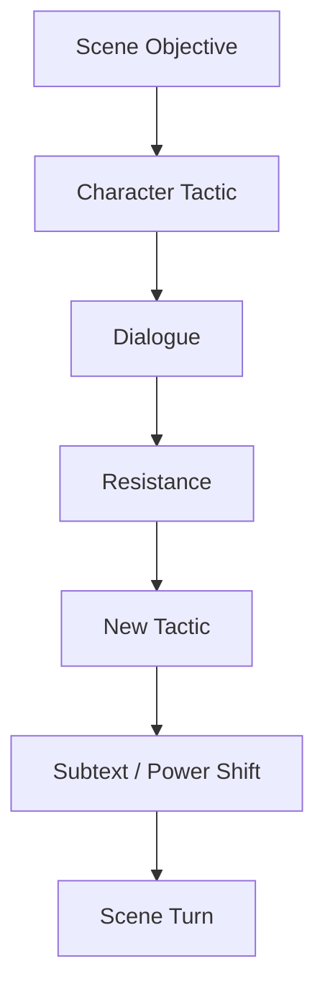
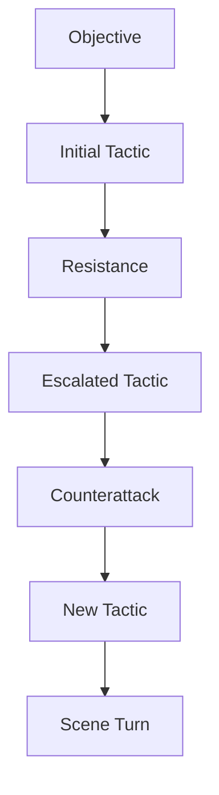
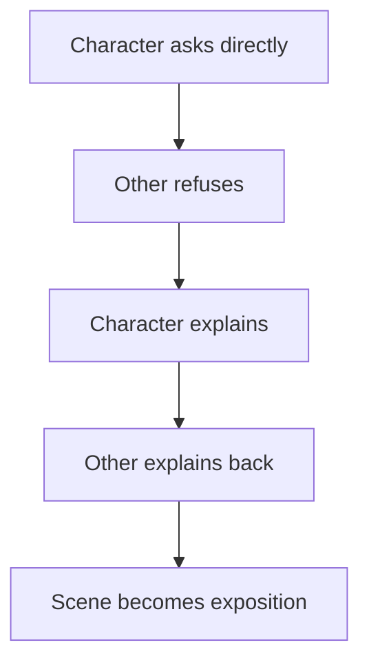
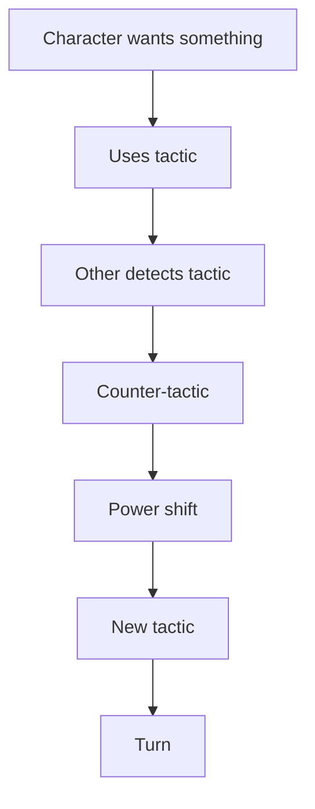

# learn-screenwriting-film-script-part-014.md

# Part 014 — Dialog: Bukan Percakapan Realistis, tapi Percakapan Dramatis

> Seri: Learn Screenwriting for Film Project  
> Pendekatan: *The First 20 Hours* — Josh Kaufman  
> Fokus bagian ini: memahami dialog film sebagai tindakan dramatik, bukan sekadar obrolan natural.  
> Target praktis: mampu menulis dialog yang punya tujuan, subtext, konflik, voice karakter, ritme, dan fungsi scene.

---

## 0. Posisi Part Ini dalam Roadmap

Pada Part 013 kita sudah membahas format screenplay:

```text
Scene Heading → Action → Character Cue → Dialogue → Action Beat → Turn
```

Sekarang kita masuk ke salah satu area yang paling sering membuat naskah pemula terasa amatir: **dialog**.

Dialog yang buruk biasanya membuat pembaca merasa:

- karakter terdengar sama semua,
- dialog menjelaskan plot terlalu terang,
- percakapan terasa panjang tapi tidak bergerak,
- karakter mengatakan perasaan secara literal,
- scene terasa seperti ceramah,
- subtext tidak ada,
- konflik terlalu mudah,
- joke atau emosi terasa dipaksakan,
- informasi keluar bukan karena kebutuhan karakter, tetapi karena penulis ingin menjelaskan.

Dialog yang baik bukan berarti “persis seperti orang bicara sehari-hari”. Dialog film adalah percakapan yang sudah dipadatkan, diarahkan, diberi tekanan, dan punya fungsi dramatik.

Dalam film, dialog harus bekerja bersama:

- visual,
- gesture,
- silence,
- object,
- blocking,
- sound,
- scene objective,
- character flaw,
- relationship history,
- conflict,
- theme.

Diagram posisi dialog dalam scene:



---

## 1. Prinsip Kaufman dalam Part Ini

Mengikuti framework *The First 20 Hours*, kita tidak akan mencoba langsung menjadi penulis dialog top-level. Kita akan memecah skill dialog menjadi sub-skill kecil.

Sub-skill dialog paling penting untuk 20 jam pertama:

1. Memahami dialog sebagai tindakan.
2. Membedakan surface text dan subtext.
3. Menulis dialog berdasarkan objective.
4. Menulis voice yang berbeda antar karakter.
5. Memakai status dan power.
6. Menghindari eksposisi mentah.
7. Menggunakan silence dan action beat.
8. Memotong dialog berlebihan.
9. Mengubah dialog literal menjadi dialog dramatik.
10. Menguji apakah dialog menggerakkan scene.

Target praktis:

```text
Mampu menulis scene dialog 2–4 halaman yang tidak hanya menjelaskan informasi, tetapi memunculkan konflik, subtext, dan perubahan relasi.
```

---

## 2. Mental Model: Dialog adalah Action

Kesalahan paling umum:

```text
Dialog = karakter berbicara.
```

Mental model yang lebih tepat:

```text
Dialog = karakter melakukan sesuatu dengan kata-kata.
```

Setiap line dialog sebaiknya punya action verb.

Karakter bisa memakai dialog untuk:

- menyerang,
- menghindar,
- menggoda,
- menyembunyikan,
- memancing,
- mengancam,
- memohon,
- menawar,
- mempermalukan,
- menguji,
- menolak,
- menguasai,
- menenangkan,
- memanipulasi,
- mengalihkan,
- merayu,
- menyalahkan,
- meminta validasi,
- menjaga muka,
- membuka luka,
- menutup luka.

Jika sebuah line tidak melakukan apa pun, kemungkinan bisa dipotong.

Contoh:

```text
RAKA
Ibu masih simpan kuncinya?
```

Surface meaning:

```text
Raka menanyakan kunci.
```

Action meaning:

```text
Raka memancing Ibu untuk mengakui bahwa ia menyembunyikan sesuatu.
```

Subtext:

```text
Aku tahu Ibu berbohong.
```

---

## 3. Dialog Bukan Percakapan Realistis Mentah

Percakapan asli penuh dengan:

- “eh”,
- “anu”,
- repetisi,
- basa-basi,
- kalimat tidak selesai,
- topik lompat,
- filler,
- informasi tidak relevan.

Film bisa memakai ini secara selektif, tetapi dialog film biasanya lebih padat.

Realistis mentah:

```text
RAKA
Eh, Bu, jadi gini, aku tadi tuh sebenarnya mau nanya soal itu lho, yang kemarin sempat aku lihat, yang kayak kunci kecil itu, yang Ibu pakai di leher, itu masih ada nggak ya?
```

Lebih dramatik:

```text
RAKA
Kuncinya masih Ibu pakai.
```

Atau:

```text
RAKA
Lucu ya. Rumah mau dijual, tapi kuncinya masih Ibu kalungkan.
```

Dialog film tidak harus pendek selalu. Tapi setiap kata harus punya tekanan.

---

## 4. Natural vs Dramatic

Dialog natural membuat karakter terdengar manusia.  
Dialog dramatic membuat scene bergerak.

Kita butuh keduanya.

| Dialog Natural Saja | Dialog Dramatic |
|---|---|
| Terdengar seperti obrolan asli | Terdengar seperti tindakan dalam konflik |
| Banyak filler | Dipadatkan |
| Bisa berputar-putar | Punya arah |
| Tidak selalu punya tujuan | Setiap line punya fungsi |
| Realistis tapi bisa membosankan | Terasa hidup karena ada tekanan |

Tujuan:

```text
Natural enough to believe.
Dramatic enough to matter.
```

---

## 5. Dialog sebagai Tactic

Dalam scene, karakter punya objective. Dialog adalah salah satu tactic untuk mencapai objective.

Contoh scene objective:

```text
Raka ingin mengambil kunci ruang kerja dari Ibu.
```

Tactic dialog:

| Tactic | Contoh Dialog |
|---|---|
| Bertanya santai | “Kunci itu masih muat di leher Ibu?” |
| Menyindir | “Ayah mati pun masih Ibu jaga ruangannya.” |
| Mengancam | “Kalau Ibu tidak kasih, besok pembeli yang buka.” |
| Memohon | “Bu, sekali ini saja jangan tutup pintu.” |
| Mempermalukan | “Dina harus tahu Ibu sembunyikan apa.” |
| Menyerah palsu | “Ya sudah. Simpan saja. Seperti biasa.” |

Dialog menjadi dinamis jika tactic berubah saat resistance muncul.

---

## 6. Scene Objective → Dialogue Strategy

Workflow:

```text
1. Tentukan objective scene.
2. Tentukan opposition.
3. Tentukan power position.
4. Tentukan tactic awal karakter.
5. Tentukan resistance.
6. Ubah tactic.
7. Biarkan dialog lahir dari tactic.
```

Diagram:



Contoh:

```text
Objective:
Raka ingin Ibu mengaku.

Tactic 1:
Raka bertanya santai.

Resistance:
Ibu menghindar.

Tactic 2:
Raka menyindir.

Resistance:
Ibu menyerang balik.

Tactic 3:
Raka mengancam.

Resistance:
Ibu mengungkap rahasia tentang Dina.

Turn:
Raka kehilangan posisi moral.
```

Dialog akan terasa hidup karena setiap line muncul dari perubahan taktik.

---

## 7. Surface Text vs Subtext

Surface text adalah apa yang dikatakan.

Subtext adalah apa yang sebenarnya dimaksud, diinginkan, disembunyikan, atau ditakuti.

Contoh:

```text
IBU
Kamu sudah makan?
```

Surface:

```text
Ibu bertanya soal makan.
```

Subtext bisa berbeda-beda tergantung konteks:

1. “Ibu masih peduli.”
2. “Jangan mulai bertengkar.”
3. “Ibu tidak mau membahas ayah.”
4. “Kamu terlihat lemah.”
5. “Ibu tahu kamu datang bukan untuk makan.”
6. “Ibu ingin menunda percakapan.”

Subtext lahir dari konteks, bukan dari kata saja.

---

## 8. Subtext Membuat Dialog Hidup

Dialog literal:

```text
RAKA
Aku marah karena Ibu menyembunyikan rahasia Ayah.
```

Dialog dengan subtext:

```text
RAKA
Ayah mati saja masih punya kamar yang lebih dijaga dari anaknya.
```

Yang kedua lebih hidup karena:

- ada luka,
- ada sindiran,
- ada perbandingan,
- ada sejarah,
- tidak menyebut emosi secara mentah.

---

## 9. Cara Membuat Subtext

Subtext muncul ketika karakter punya alasan untuk tidak mengatakan langsung.

Alasan karakter tidak jujur:

1. Takut ditolak.
2. Takut kehilangan status.
3. Takut menyakiti.
4. Takut terlihat lemah.
5. Sedang memanipulasi.
6. Sedang menguji orang lain.
7. Sedang menjaga rahasia.
8. Tidak memahami perasaannya sendiri.
9. Tidak punya bahasa untuk lukanya.
10. Ada orang ketiga mendengar.
11. Ada norma sosial.
12. Ada sejarah hubungan.

Template subtext:

```text
Yang ingin dikatakan karakter:
Kenapa tidak bisa dikatakan langsung:
Kalimat pengganti:
Action/gesture pendukung:
```

Contoh:

```text
Yang ingin dikatakan:
Aku takut kamu pergi lagi.

Kenapa tidak bisa langsung:
Karakter terlalu bangga dan hubungan sudah dingin.

Kalimat pengganti:
Makan dulu. Bus malam sering telat.

Action:
Ibu menambah nasi ke piring Raka tanpa menatapnya.
```

---

## 10. Dialog dan Character Voice

Character voice adalah cara unik karakter berbicara berdasarkan:

- latar belakang,
- usia,
- pendidikan,
- kelas sosial,
- profesi,
- nilai,
- luka,
- relasi,
- status,
- emosi,
- tujuan,
- kebiasaan,
- worldview.

Namun character voice bukan hanya aksen atau slang. Voice lebih dalam dari pilihan kata.

Pertanyaan voice:

1. Apakah karakter bicara langsung atau berputar?
2. Apakah ia memakai humor untuk menghindar?
3. Apakah ia memakai logika untuk menutup emosi?
4. Apakah ia banyak bertanya?
5. Apakah ia memerintah?
6. Apakah ia meminta izin?
7. Apakah ia memakai metafora?
8. Apakah ia singkat?
9. Apakah ia cerewet saat gugup?
10. Apakah ia selalu mengoreksi kata orang?
11. Apakah ia menghindari kata tertentu?
12. Apakah ia berkata kasar hanya pada orang tertentu?

---

## 11. Voice Berdasarkan Worldview

Dua karakter bisa mengatakan maksud sama dengan cara berbeda.

Maksud:

```text
Jangan pergi.
```

Ibu yang menahan emosi:

```text
Makanannya belum habis.
```

Adik yang marah:

```text
Kakak memang paling jago pergi pas rumah mulai berisik.
```

Kekasih yang sarkastik:

```text
Bagus. Kabur sebelum hujan. Biar dramatisnya tidak kebasahan.
```

Atasan formal:

```text
Keputusanmu untuk meninggalkan posisi ini akan dicatat sebagai pengunduran diri sukarela.
```

Anak kecil:

```text
Kalau pergi, kursimu boleh aku pakai?
```

Semua punya subtext “jangan pergi”, tapi voice berbeda.

---

## 12. Character Voice Matrix

Gunakan matrix:

```text
Character:
Default speech length:
Vocabulary:
Rhythm:
Direct/indirect:
Emotional defense:
Favorite tactic:
Avoided words:
Power style:
Humor style:
Silence style:
```

Contoh:

```text
Character:
Raka

Default speech length:
Pendek, terkontrol.

Vocabulary:
Praktis, legal, transaksi, efisiensi.

Rhythm:
Tajam, cepat saat terdesak.

Direct/indirect:
Terlihat direct, sebenarnya menghindari emosi.

Emotional defense:
Rasionalisasi.

Favorite tactic:
Membingkai masalah sebagai urusan teknis.

Avoided words:
Maaf, takut, rindu.

Power style:
Dokumen, deadline, fakta.

Humor style:
Kering, menyindir.

Silence style:
Diam ketika merasa bersalah.
```

Voice ini akan memengaruhi dialog.

---

## 13. Contoh Voice Raka

Konteks: Raka ingin menjual rumah lama.

Voice generik:

```text
RAKA
Aku tidak bisa tinggal di sini lagi. Rumah ini terlalu menyakitkan.
```

Voice Raka yang rasionalisasi:

```text
RAKA
Rumah kosong itu biaya. Pajak, perawatan, listrik. Kita cuma menunda rugi.
```

Subtext:

```text
Aku tidak sanggup menghadapi rumah ini.
```

Karakter tidak mengatakan luka; ia memakai bahasa biaya.

---

## 14. Contoh Voice Ibu

Voice matrix:

```text
Character:
Ibu Sari

Default speech length:
Pendek, tidak terburu-buru.

Vocabulary:
Rumah, makan, pulang, ayah, doa, benda sehari-hari.

Rhythm:
Pelan, menusuk.

Direct/indirect:
Tidak langsung, tapi tepat sasaran.

Emotional defense:
Diam, merawat, mengalihkan ke kebutuhan fisik.

Favorite tactic:
Membuat lawan bicara merasa seperti anak kecil.

Avoided words:
Salah, takut, bersalah.

Power style:
Moral guilt dan sejarah keluarga.

Humor style:
Tipis, pahit.

Silence style:
Jawaban utama.
```

Dialog:

```text
IBU
Kamu selalu bisa menghitung harga rumah. Tidak pernah bisa menghitung siapa yang menunggu di dalamnya.
```

---

## 15. Contoh Voice Dina

Voice matrix:

```text
Character:
Dina

Default speech length:
Pendek tapi tajam.

Vocabulary:
Langsung, observasional, kadang sinis.

Rhythm:
Cepat saat marah, lambat saat kecewa.

Direct/indirect:
Lebih langsung dari Ibu.

Emotional defense:
Sarkasme.

Favorite tactic:
Membuka kemunafikan orang dewasa.

Avoided words:
Butuh, takut.

Power style:
Informasi yang diam-diam ia kumpulkan.

Humor style:
Gelap, remaja, menyayat.

Silence style:
Menatap terlalu lama.
```

Dialog:

```text
DINA
Kakak pulang bawa map. Aku kira bawa kangen.
```

Subtext:

```text
Kamu datang untuk urusan, bukan keluarga.
```

---

## 16. Dialog dan Status

Status adalah posisi power relatif antar karakter.

Status bisa tinggi/rendah karena:

- umur,
- uang,
- jabatan,
- informasi,
- rasa bersalah,
- kebutuhan,
- lokasi,
- hubungan,
- moral position,
- akses ke objek,
- sejarah.

Dialog berubah tergantung status.

Contoh:

```text
Raka memegang dokumen.
Ibu memegang kunci.
Dina memegang rahasia.
```

Masing-masing punya power berbeda.

---

## 17. High Status vs Low Status Speech

High status speech:

- sedikit kata,
- tidak menjelaskan diri,
- memberi perintah,
- membuat orang lain menunggu,
- mengubah topik,
- bertanya untuk mengontrol,
- tidak buru-buru mengisi silence.

Low status speech:

- banyak menjelaskan,
- meminta validasi,
- mengoreksi diri,
- tertawa gugup,
- meminta izin,
- menjawab terlalu cepat,
- menghindari silence.

Contoh:

```text
RAKA
Kuncinya.

IBU
Makan dulu.
```

Ibu high status karena tidak menjawab permintaan Raka. Ia mengatur agenda.

---

## 18. Status Shift

Scene hidup ketika status berubah.

Contoh:

```text
Awal:
Raka high status karena membawa dokumen penjualan.

Tengah:
Ibu high status karena tahu dokumen itu tidak sah.

Akhir:
Dina high status karena memegang kunci.
```

Dialog harus merefleksikan perubahan ini.

Awal:

```text
RAKA
Tanda tangan Ibu cukup. Sisanya aku urus.
```

Tengah:

```text
IBU
Kamu bahkan tidak tahu rumah ini atas nama siapa.
```

Akhir:

```text
DINA
Mau minta baik-baik, atau mau pura-pura jadi orang dewasa lagi?
```

Power berpindah.

---

## 19. Dialog dan Power Play

Power play adalah strategi verbal untuk menguasai scene.

Jenis power play:

| Power Play | Contoh |
|---|---|
| Mengabaikan pertanyaan | “Makan dulu.” |
| Menjawab dengan pertanyaan | “Menurutmu kenapa?” |
| Mengganti topik | “Dina sudah pulang?” |
| Memperbaiki kata | “Bukan dijual. Dibuang.” |
| Menggunakan nama lengkap | “Raka Pradipta.” |
| Menggunakan masa lalu | “Dulu kamu juga begitu.” |
| Mengancam lembut | “Kalau pintu itu terbuka, rumah ini tidak punya anak lagi.” |
| Diam | Tidak menjawab sama sekali |
| Memberi detail kecil | “Jam sembilan, pembeli datang. Kamu selalu telat.” |
| Memanggil saksi | “Dina, dengar kakakmu.” |

Dialog jadi menarik ketika karakter saling memakai power play.

---

## 20. Dialog dan Relationship History

Orang yang punya sejarah tidak bicara seperti orang asing.

Mereka punya:

- inside joke,
- luka lama,
- kata yang dihindari,
- panggilan khusus,
- pola pertengkaran,
- ritual,
- trigger,
- kebiasaan memotong kalimat,
- hal yang tidak perlu dijelaskan,
- hal yang selalu disalahpahami.

Contoh generik:

```text
RAKA
Ibu selalu menyembunyikan sesuatu dariku.
```

Dengan history:

```text
RAKA
Laci ketiga lagi?
```

Jika sebelumnya diketahui Ibu selalu menyimpan rahasia di laci ketiga, kalimat ini lebih kaya.

History membuat dialog ekonomis.

---

## 21. Dialog dan Relational Shortcut

Karakter dekat tidak perlu menjelaskan semua.

Contoh:

```text
DINA
Kakak pakai suara kantor.

RAKA
Apa?

DINA
Suara yang Kakak pakai kalau mau bohong rapi.
```

Dalam dua line, kita tahu:

- Raka punya persona profesional,
- Dina mengenalnya,
- Raka sering bohong secara rapi,
- relasi mereka punya observasi lama.

---

## 22. Dialog dan Conflict

Dialog tanpa conflict sering terasa mati.

Conflict bisa berupa:

- disagreement,
- hidden agenda,
- withheld information,
- different goal,
- status contest,
- moral accusation,
- emotional avoidance,
- time pressure,
- public/private tension.

Dialog datar:

```text
RAKA
Aku mau jual rumah.

IBU
Baik, Ibu setuju.
```

Dialog konflik:

```text
RAKA
Aku mau jual rumah.

IBU
Rumah ini tidak minta pendapat orang yang pulang bawa pembeli.
```

Ada penolakan dan luka.

---

## 23. Dialog dan Indirect Conflict

Tidak semua konflik perlu frontal.

Contoh:

```text
RAKA
Besok pembeli datang.

IBU
Ibu masak lodeh.

RAKA
Aku tidak makan malam di sini.

IBU
Ibu tahu. Makanya Ibu masak yang cepat basi.
```

Surface: makanan.  
Subtext: kamu tidak tinggal, semua yang Ibu siapkan akan sia-sia.

Indirect conflict sering lebih kuat dari teriakan.

---

## 24. Dialog dan Moral Conflict

Dialog paling kuat sering terjadi ketika dua karakter sama-sama punya alasan benar.

Contoh:

```text
RAKA
Kalau bukti itu kita simpan, orang lain yang dihukum.

IBU
Kalau bukti itu kamu buka, adikmu yang hancur.

RAKA
Jadi Ibu pilih bohong?

IBU
Ibu pilih anak yang masih hidup.
```

Tidak ada pihak yang sepenuhnya bodoh. Konflik nilai jelas.

---

## 25. Dialog dan Exposition

Exposition adalah informasi yang perlu diketahui penonton.

Masalahnya: penulis sering membuat karakter mengatakan hal yang sudah mereka tahu hanya untuk penonton.

Buruk:

```text
RAKA
Seperti yang Ibu tahu, Ayah meninggal lima tahun lalu setelah kasus korupsi yang membuat keluarga kita hancur.
```

Ibu pasti tahu. Kalimat ini palsu.

Lebih baik:

```text
RAKA
Lima tahun Ibu suruh kita diam.

IBU
Dan lima tahun kamu masih hidup karena itu.
```

Informasi muncul lewat konflik.

---

## 26. Teknik Exposition dalam Dialog

### 26.1 Information as Weapon

Informasi dipakai untuk menyerang.

```text
RAKA
Tanda tangan Ayah ada di laporan itu.

IBU
Tanda tanganmu juga ada di surat kuasa.
```

### 26.2 Information as Bargain

Informasi dipakai sebagai transaksi.

```text
SAKSI
Saya kasih nama pejabatnya. Kamu kasih saya surat rumah itu.
```

### 26.3 Information as Mistake

Informasi bocor karena karakter salah bicara.

```text
DINA
Aku tidak bilang ruang itu kosong.

RAKA
Kamu bilang “ruang itu”.
```

### 26.4 Information as Denial

Informasi muncul dari apa yang ditolak.

```text
IBU
Tidak ada kebakaran malam itu.

RAKA
Aku belum bilang kebakaran.
```

### 26.5 Information as Correction

Satu detail dikoreksi, membuka banyak hal.

```text
RAKA
Ayah pulang jam sepuluh.

IBU
Setengah sebelas.
```

Raka sadar Ibu ada di sana.

---

## 27. Exposition Rule

Gunakan prinsip:

```text
Jangan beri informasi sampai karakter membutuhkannya, menyembunyikannya, salah memahaminya, atau menggunakannya untuk menekan orang lain.
```

Jika informasi tidak punya tekanan, tunda atau visualkan.

---

## 28. Dialog dan Silence

Silence adalah dialog tanpa kata.

Silence bisa berarti:

- menolak menjawab,
- tidak sanggup menjawab,
- menghukum,
- memberi ruang,
- menahan tangis,
- menyembunyikan kebohongan,
- mengakui tanpa kata,
- membuat lawan bicara mengisi kekosongan.

Contoh:

```text
RAKA
Ibu tahu Ayah bersalah?

Ibu tetap mengupas bawang.

Kulit bawang menumpuk.

RAKA (CONT'D)
Bu.

Pisau berhenti.

Tidak ada jawaban.

Raka mendapat jawabannya.
```

Silence sering lebih kuat daripada pengakuan literal.

---

## 29. Dialog dan Action Beat

Action beat memecah dialog dan memberi makna.

Contoh:

```text
DINA
Kakak kangen rumah ini?

Raka melihat sekeliling. Foto ayah. Piring retak. Jam mati.

RAKA
Aku kangen cepat selesai.
```

Action beat menunjukkan apa yang dihindari Raka.

---

## 30. Dialog dan Gesture

Gesture bisa menggantikan dialog.

Literal:

```text
IBU
Ibu masih sayang kamu.
```

Gesture:

```text
Ibu mengambil cabai dari piring Raka sebelum Raka duduk.

RAKA
Aku sudah bisa makan pedas.

IBU
Ibu tahu.
```

Subtext:

```text
Ibu masih merawat, tapi juga masih melihat Raka sebagai anak.
```

---

## 31. Dialog dan Object

Objek bisa membuat dialog lebih kaya.

Contoh:

```text
Raka meletakkan map penjualan rumah di meja.

Ibu meletakkan piring nasi di atasnya.

RAKA
Itu dokumen.

IBU
Ini meja makan.
```

Conflict:

- Raka melihat rumah sebagai aset.
- Ibu melihat rumah sebagai ruang hidup.

Dialog sederhana, tapi objek memperjelas tema.

---

## 32. Dialog dan Blocking

Posisi karakter memengaruhi dialog.

Contoh:

```text
Raka berdiri di pintu.
Ibu duduk di meja.
Dina di antara mereka.

RAKA
Aku cuma mau bicara.

DINA
Kalau cuma bicara, kenapa berdirinya di jalan keluar?
```

Blocking menjadi subtext.

---

## 33. Dialog dan Setting

Lokasi memberi tekanan pada dialog.

Kalimat “jangan pergi” berbeda jika terjadi di:

- terminal bus,
- rumah sakit,
- meja makan,
- kantor polisi,
- pemakaman,
- lift,
- panggung pernikahan,
- ruang tunggu bandara.

Contoh terminal:

```text
IBU
Bus malam suka mogok.

NAYA
Yang di rumah juga.
```

Setting memberi metafora alami.

---

## 34. Dialog dan Genre

Genre memengaruhi dialog.

### 34.1 Drama

Dialog cenderung:

- restrained,
- subtextual,
- emotional,
- relational.

Contoh:

```text
IBU
Ibu sisakan kamar kamu.

RAKA
Kamar atau hukuman?
```

### 34.2 Thriller

Dialog cenderung:

- urgent,
- information-pressure,
- threat,
- deception.

```text
SAKSI
Kalau kamu baca halaman terakhir, kamu sudah terlambat.
```

### 34.3 Horror

Dialog cenderung:

- denial,
- dread,
- sensory uncertainty,
- whispered fear.

```text
DINA
Kak, pintunya tadi di luar.
```

### 34.4 Comedy

Dialog cenderung:

- misdirection,
- escalation,
- status reversal,
- timing.

```text
RAKA
Itu bukan mayat.

DINA
Kalau begitu dia sangat komitmen tidur.
```

### 34.5 Romance

Dialog cenderung:

- attraction/resistance,
- vulnerability,
- teasing,
- fear of exposure.

```text
MIRA
Kamu selalu datang telat.

RAKA
Biar kamu punya alasan nunggu.
```

---

## 35. Dialog dan Tone

Dialog harus sesuai tone.

Premis:

```text
Seorang anak pulang untuk menjual rumah warisan.
```

Tone drama:

```text
IBU
Rumah ini tidak mahal. Cuma kamu yang tidak sanggup bayar pulangnya.
```

Tone dark comedy:

```text
DINA
Kalau rumah ini dijual, hantunya ikut split bill?
```

Tone thriller:

```text
IBU
Pembeli yang kamu bawa itu dulu mengubur ayahmu hidup-hidup di atas kertas.
```

Tone tragic romance:

```text
IBU
Ada rumah yang dijual. Ada yang ditinggalkan pelan-pelan sampai lupa caranya menunggu.
```

Tone memengaruhi diksi, rhythm, dan intensitas.

---

## 36. Dialog dan Rhythm

Rhythm adalah musik dalam dialog.

Perhatikan:

- panjang kalimat,
- jeda,
- repetisi,
- potongan,
- interruption,
- silence,
- beat action,
- perubahan tempo.

Contoh rhythm lambat:

```text
IBU
Kamu mau jual rumah.

RAKA
Iya.

IBU
Besok.

RAKA
Iya.

IBU
Cepat sekali kamu belajar pulang dan pergi di hari yang sama.
```

Contoh rhythm cepat:

```text
DINA
Kakak buka?

RAKA
Tidak.

DINA
Bohong.

RAKA
Dina--

DINA
Kuncinya di mana?
```

Rhythm harus sesuai tekanan scene.

---

## 37. Repetition dalam Dialog

Repetition bisa kuat jika maknanya berubah.

Contoh:

Awal:

```text
IBU
Makan dulu.
```

Makna: menghindari konflik.

Tengah:

```text
IBU
Makan dulu.
```

Makna: memohon agar Raka tinggal.

Akhir:

```text
RAKA
Makan dulu, Bu.
```

Makna: Raka mengambil alih perawatan.

Repetition with variation menunjukkan arc.

---

## 38. Interruption

Interruption menunjukkan power, urgency, dan emosi.

Contoh:

```text
RAKA
Aku cuma mau--

DINA
Jual.

RAKA
Dina--

DINA
Kakak selalu pakai kata panjang untuk hal pendek.
```

Interruption membuat dialog terasa hidup.

Gunakan dengan jelas. Jangan terlalu banyak sehingga sulit dibaca.

---

## 39. Overlap dan Cutting Off

Dalam screenplay, cutting off bisa ditulis dengan dash.

```text
RAKA
Kalau Ibu dari awal bilang--

IBU
Kamu dari awal tidak pernah tanya.
```

Atau:

```text
DINA
Aku tahu yang Kakak buka--

RAKA
Cukup.
```

Dash menunjukkan kalimat terpotong.

---

## 40. Ellipsis

Ellipsis menunjukkan trailing off, hesitation, atau pikiran yang menggantung.

```text
IBU
Ayahmu tidak pernah...
```

Gunakan hemat. Terlalu banyak ellipsis membuat dialog lemah atau melodramatis.

Dash untuk dipotong.  
Ellipsis untuk menghilang/pelan-pelan berhenti.

---

## 41. Dialog dan Profesi

Profesi bisa memengaruhi cara bicara, tapi jangan jadi stereotip.

Software engineer mungkin:

- mengurai masalah,
- memakai istilah sistem,
- mencari root cause,
- tidak nyaman dengan ambiguitas,
- ingin definisi jelas,
- memakai logika untuk menahan emosi.

Tapi karakter bukan profesi. Profesi hanyalah layer.

Contoh karakter software engineer dalam drama keluarga:

```text
RAKA
Masalahnya bukan rumah. Masalahnya ownership-nya tidak pernah jelas.

DINA
Keluarga bukan repository, Kak.
```

Jika terlalu banyak jargon, dialog terasa gimmick.

---

## 42. Dialog dan Kelas Sosial

Kelas sosial bisa memengaruhi:

- pilihan kata,
- directness,
- humor,
- cara meminta,
- cara menolak,
- topik tabu,
- relasi dengan uang,
- relasi dengan otoritas.

Namun hindari karikatur.

Lebih baik gunakan detail spesifik daripada stereotip.

Contoh:

```text
RAKA
Aku transfer bulanan.

IBU
Ibu tidak bisa makan bukti transfer.
```

Uang dan relasi bertabrakan.

---

## 43. Dialog dan Usia

Usia memengaruhi rhythm dan worldview.

Anak muda mungkin:

- lebih langsung,
- lebih sarkastik,
- lebih cepat memotong,
- lebih sadar absurditas,
- lebih sedikit ritual sopan.

Orang tua mungkin:

- lebih tidak langsung,
- memakai benda sehari-hari,
- memakai ingatan,
- menghindari kata-kata eksplisit,
- mengontrol lewat ritual.

Tapi jangan jadikan aturan kaku.

---

## 44. Dialog dan Budaya

Dalam konteks Indonesia, banyak dialog relasional terjadi secara tidak langsung.

Contoh:

```text
Sudah makan?
```

bisa berarti:

- aku peduli,
- jangan pergi,
- aku tidak tahu cara minta maaf,
- aku belum siap membahas masalah,
- aku masih ibumu.

Kekuatan dialog Indonesia sering ada di:

- sindiran halus,
- panggilan keluarga,
- basa-basi yang menyembunyikan konflik,
- rasa sungkan,
- hierarki usia,
- diam,
- ritual makan,
- penggunaan “pulang” sebagai kata emosional,
- perbedaan bahasa formal/informal,
- campuran bahasa daerah/Indonesia jika relevan.

Gunakan ini secara sadar, bukan tempelan.

---

## 45. Dialog dan Panggilan

Panggilan bisa menunjukkan relasi.

Contoh:

| Panggilan | Efek |
|---|---|
| Bu | normal/intim |
| Ibu | formal/berjarak |
| Ma | modern/intim |
| Sari | melewati batas |
| Kak | relasi saudara |
| Mas | hormat/intim/regional |
| Pak | formal/status |
| Raka Pradipta | teguran/otoritas |
| Nak | kasih/kuasa |
| Kamu | langsung |
| Anda | jarak/formal |

Perubahan panggilan bisa menjadi beat.

Contoh:

```text
DINA
Kak.

Raka berhenti.

DINA (CONT'D)
Raka.
```

Relasi berubah.

---

## 46. Dialog dan Code-Switching

Karakter bisa berganti bahasa/register:

- Indonesia formal,
- Indonesia sehari-hari,
- bahasa daerah,
- Inggris teknis,
- slang,
- religi,
- birokratis.

Gunakan ketika punya fungsi.

Contoh:

```text
RAKA
Secara legal, rumah ini--

IBU
Jangan pakai bahasa kantor di meja makan.
```

Code-switching menjadi konflik identitas.

---

## 47. Dialog dan Humor

Humor bukan hanya joke. Humor bisa menjadi defense mechanism.

Jenis humor:

- sarcasm,
- self-deprecation,
- understatement,
- misdirection,
- dark humor,
- wordplay,
- status reversal,
- deadpan,
- absurdity,
- callback.

Contoh dark humor:

```text
DINA
Kalau Ayah bangkit dari kubur, bilang ya. Aku mau tanya password Wi-Fi lama.
```

Humor ini bisa menutup luka.

Hati-hati: humor harus sesuai tone dan karakter.

---

## 48. Dialog dan Sarcasm

Sarcasm sering dipakai karakter yang tidak mau rentan.

Contoh:

```text
DINA
Wah, Kakak pulang. Kalender harus dikasih tanggal merah.
```

Subtext:

```text
Kamu jarang pulang dan aku terluka.
```

Terlalu banyak sarcasm bisa membuat karakter terasa satu nada. Beri momen ketika sarcasm gagal.

---

## 49. Dialog dan Vulnerability

Vulnerability sering lebih kuat jika tidak terlalu rapi.

Contoh literal:

```text
RAKA
Aku takut Ibu tidak mencintaiku lagi.
```

Bisa terlalu on-the-nose jika belum earned.

Versi lebih subtextual:

```text
RAKA
Ibu masih masak buat dua orang?

IBU
Tergantung siapa yang pulang.
```

Atau setelah banyak tekanan, literal bisa kuat:

```text
RAKA
Aku tidak tahu cara pulang tanpa minta sesuatu.
```

Literal boleh jika earned.

---

## 50. On-the-Nose Dialogue

On-the-nose berarti karakter mengatakan persis apa yang mereka rasakan/maksudkan tanpa lapisan.

Contoh:

```text
RAKA
Aku merasa bersalah karena meninggalkan keluarga.
```

Kadang on-the-nose bisa dipakai, tapi jika semua dialog seperti itu, scene terasa dangkal.

Ubah menjadi:

```text
RAKA
Aku masih hafal letak gelas, tapi lupa Ibu minum obat jam berapa.
```

Subtext: aku dekat dengan benda, jauh dari orang.

---

## 51. Kapan Dialog Literal Boleh?

Dialog literal boleh jika:

1. Karakter akhirnya tidak bisa lagi bersembunyi.
2. Scene adalah confession yang earned.
3. Ada harga besar setelah kalimat itu.
4. Karakter biasanya tidak pernah berkata begitu.
5. Kejujuran itu mengubah relasi.
6. Kalimat pendek dan spesifik.

Contoh:

```text
RAKA
Aku pulang karena butuh tanda tangan.

Ibu menatapnya.

RAKA (CONT'D)
Tapi aku duduk karena takut Ibu kasih.
```

Literal, tapi punya twist emosional.

---

## 52. Dialog dan Theme

Jangan membuat karakter berpidato tema.

Buruk:

```text
RAKA
Kebenaran adalah hal yang paling penting, meskipun itu menyakitkan keluarga kita.
```

Lebih baik:

```text
RAKA
Kalau kita diam, mereka yang bayar.

IBU
Kalau kamu bicara, adikmu yang bayar.
```

Tema diuji lewat konflik, bukan slogan.

---

## 53. Dialog sebagai Thematic Argument

Dialog bisa membawa thesis dan antithesis.

Theme question:

```text
Apakah keluarga harus dilindungi meski dengan kebohongan?
```

Raka:

```text
Keluarga yang butuh bohong untuk utuh memang sudah pecah.
```

Ibu:

```text
Keluarga yang hidup masih bisa minta maaf. Yang mati cuma bisa benar.
```

Keduanya punya worldview.

---

## 54. Dialog dan Antagonis

Antagonis yang kuat tidak berkata:

```text
Aku jahat.
```

Ia membenarkan dirinya.

Contoh:

```text
PEMBELI
Saya tidak mengambil rumah kalian. Saya membeli sesuatu yang kalian tinggalkan membusuk.
```

Subtext:

```text
Kelemahan kalian memberi saya hak.
```

Antagonis harus punya logika moral.

---

## 55. Dialog dan Lie

Karakter sering berbohong.

Lie menarik jika:

- penonton tahu,
- karakter lain hampir tahu,
- kebohongan punya detail,
- kebohongan melindungi sesuatu,
- kebohongan menciptakan konsekuensi,
- kebohongan mengungkap karakter.

Contoh:

```text
DINA
Kakak sudah buka ruang kerja?

RAKA
Kuncinya saja tidak ada.

DINA
Aku tanya sudah buka atau belum.
```

Raka menjawab teknis, menghindari kebenaran.

---

## 56. Dialog dan Evasion

Evasion adalah menghindari jawaban.

Teknik evasion:

- menjawab pertanyaan lain,
- menyerang balik,
- bercanda,
- memberi fakta tidak relevan,
- memperbaiki istilah,
- diam,
- mengalihkan ke kebutuhan fisik,
- bertanya balik,
- berpura-pura tidak dengar.

Contoh:

```text
RAKA
Ibu tahu isi ruangan itu?

IBU
Kamu basah. Ganti baju dulu.
```

Evasion membuat subtext.

---

## 57. Dialog dan Specificity

Dialog generik:

```text
RAKA
Aku punya banyak masalah.
```

Specific:

```text
RAKA
Aku punya tiga hari sebelum bank ambil apartemenku.
```

Specificity memberi stakes.

Dialog generik:

```text
DINA
Kakak tidak pernah peduli.
```

Specific:

```text
DINA
Waktu Ibu operasi, Kakak kirim emoji jempol.
```

Specific detail lebih menyakitkan.

---

## 58. Dialog dan Metafora

Metafora bisa kuat jika berasal dari dunia karakter.

Ibu yang hidup di rumah:

```text
Rumah tidak marah kalau ditinggal. Dia cuma pelan-pelan lupa bentuk kaki kita.
```

Raka yang teknis:

```text
Kita tidak bisa terus patch rumah yang fondasinya salah.
```

Dina yang sarkastik:

```text
Keluarga ini grup chat yang semua orang mute.
```

Metafora harus sesuai voice.

---

## 59. Dialog dan Compression

Dialog draft awal biasanya terlalu panjang.

Prinsip compression:

1. Potong pembukaan.
2. Potong penjelasan yang sudah terlihat.
3. Potong line yang mengulang.
4. Potong jawaban lengkap.
5. Biarkan karakter tidak menyelesaikan kalimat.
6. Biarkan action menjawab.
7. Mulai dari konflik.
8. Akhiri setelah turn.

Contoh panjang:

```text
RAKA
Aku datang ke sini karena aku pikir kita harus membicarakan rumah ini, karena kalau tidak, masalahnya akan semakin besar dan aku tidak tahu lagi harus bagaimana.
```

Compressed:

```text
RAKA
Besok pembeli datang.
```

Lebih kuat karena konkret dan menekan.

---

## 60. Dialog Rewrite Pass

Lakukan pass berikut:

### Pass 1 — Objective

Untuk setiap line:

```text
Apa yang karakter mau?
```

### Pass 2 — Tactic

```text
Line ini menyerang, bertahan, menghindar, atau memancing?
```

### Pass 3 — Subtext

```text
Apa yang tidak dikatakan?
```

### Pass 4 — Voice

```text
Apakah hanya karakter ini yang bisa mengatakan line ini?
```

### Pass 5 — Compression

```text
Bisa dipotong 30%?
```

### Pass 6 — Rhythm

```text
Apakah panjang/pendek line punya variasi?
```

### Pass 7 — Visual Support

```text
Apakah sebagian bisa diganti action/gesture?
```

---

## 61. Dialog Checklist per Line

Untuk setiap line penting, tanya:

- [ ] Apa objective karakter?
- [ ] Apa tactic line ini?
- [ ] Apa subtext-nya?
- [ ] Apakah line ini bisa dipotong?
- [ ] Apakah line ini mengulang informasi?
- [ ] Apakah line ini terdengar seperti karakter tersebut?
- [ ] Apakah line ini mengubah power?
- [ ] Apakah line ini memberi tekanan ke lawan bicara?
- [ ] Apakah line ini terlalu literal?
- [ ] Bisakah line ini diganti gesture?

---

## 62. Dialog Checklist per Scene

Untuk scene dialog, tanya:

- [ ] Apakah setiap karakter punya objective?
- [ ] Apakah objective mereka bertabrakan?
- [ ] Apakah ada status shift?
- [ ] Apakah ada subtext?
- [ ] Apakah ada informasi yang disembunyikan?
- [ ] Apakah dialog menggerakkan turn?
- [ ] Apakah ada action beat?
- [ ] Apakah ada silence?
- [ ] Apakah dialog tidak hanya menjelaskan plot?
- [ ] Apakah scene keluar setelah turn?

---

## 63. Dialog Anti-Pattern

### 63.1 “As You Know”

Karakter menjelaskan hal yang sudah diketahui karakter lain.

```text
Seperti yang kamu tahu, kita adalah kakak adik yang sudah lama tidak bertemu sejak Ayah meninggal.
```

Fix:

```text
DINA
Kakak masih ingat jalan ke dapur?

RAKA
Masih.

DINA
Hebat. Lima tahun cuma hilang di kalender.
```

---

### 63.2 “Therapy Speak”

Karakter menganalisis diri terlalu rapi.

```text
Aku menghindar karena traumaku terhadap Ayah membuatku tidak mampu membangun kedekatan emosional.
```

Fix:

```text
RAKA
Aku tidak tahu cara duduk di rumah ini tanpa mencari pintu keluar.
```

---

### 63.3 “Plot Delivery Service”

Karakter hanya mengantar informasi.

```text
Aku baru mendapat telepon dari polisi bahwa dokumen yang kita cari ada di kantor notaris.
```

Fix:

```text
Dina masuk, pucat.

DINA
Kak.

RAKA
Apa?

DINA
Notaris itu baru telepon Ibu. Bukan kamu.
```

Informasi + conflict.

---

### 63.4 “Everyone Sounds the Same”

Semua karakter memakai diksi, rhythm, dan worldview yang sama.

Fix:

- buat voice matrix,
- tentukan defense mechanism,
- tentukan kata yang dihindari,
- tentukan tactic favorit.

---

### 63.5 “Too Clever”

Semua line terlalu witty, tidak ada manusia nyata.

Fix:

- beri momen gagal,
- beri silence,
- beri vulnerability,
- kurangi punchline,
- biarkan karakter salah bicara.

---

### 63.6 “Emotional Announcement”

Karakter mengumumkan emosi.

```text
Aku sangat sedih dan kecewa.
```

Fix:

```text
DINA
Aku simpan kue ulang tahun Kakak di freezer.

RAKA
Dina--

DINA
Tiga tahun. Rasanya pasti sudah kayak Kakak. Beku dan tidak bisa dimakan.
```

---

### 63.7 “No Resistance”

Karakter bertanya, karakter lain menjawab.

Fix:

- buat karakter menyembunyikan,
- buat jawaban punya harga,
- buat informasi keluar karena tekanan.

---

## 64. Dialogue Debugging

### 64.1 Jika dialog terasa kaku

Cek:

1. Apakah dialog hanya menyampaikan informasi?
2. Apakah character objective jelas?
3. Apakah ada subtext?
4. Apakah line terlalu formal?
5. Apakah semua kalimat terlalu lengkap?
6. Apakah tidak ada interruption?
7. Apakah tidak ada action beat?

Solusi:

- buat line menjadi tactic,
- potong penjelasan,
- tambahkan resistance,
- ubah sebagian ke gesture.

---

### 64.2 Jika dialog terasa terlalu panjang

Cek:

1. Apakah ada pembukaan yang bisa dipotong?
2. Apakah karakter menjawab terlalu lengkap?
3. Apakah dua line punya fungsi sama?
4. Apakah emosi sudah terlihat lewat action?
5. Apakah scene sudah mencapai turn lebih awal?

Solusi:

- potong 30%,
- cari line terakhir yang benar-benar mengubah scene,
- keluar scene setelah itu.

---

### 64.3 Jika dialog terasa terlalu on-the-nose

Cek:

1. Apa yang karakter sebenarnya mau?
2. Kenapa dia tidak bisa mengatakannya?
3. Apa topik permukaan yang bisa dipakai?
4. Objek apa yang bisa membawa emosi?
5. Gesture apa yang bisa menggantikan kalimat?

Solusi:

- tulis literal version dulu,
- tulis alasan karakter menyembunyikan,
- ubah ke indirect version.

---

### 64.4 Jika karakter terdengar sama

Cek:

1. Siapa yang paling direct?
2. Siapa yang menghindar?
3. Siapa yang memakai humor?
4. Siapa yang memakai fakta?
5. Siapa yang memakai rasa bersalah?
6. Siapa yang banyak diam?
7. Siapa yang memotong?
8. Siapa yang bertanya?

Buat voice matrix.

---

## 65. Dialog dari Literal ke Subtext

Langkah:

```text
1. Tulis versi literal.
2. Tentukan apa yang karakter tidak mau akui.
3. Tentukan objective.
4. Pilih tactic.
5. Pilih topik permukaan.
6. Tulis ulang.
7. Tambahkan action beat.
8. Potong 30%.
```

Contoh literal:

```text
RAKA
Aku takut kalau aku membuka rahasia Ayah, keluarga kita akan hancur.
```

Analisis:

```text
Tidak mau akui:
Ia masih butuh keluarga.

Objective:
Minta Ibu menghentikannya tanpa ia harus mengaku takut.

Tactic:
Menguji Ibu.

Topik permukaan:
Kunci.
```

Rewrite:

```text
RAKA
Kalau pintu itu kebuka, masih ada yang bisa ditutup?
```

Ibu:

```text
IBU
Pintu tidak pernah salah. Yang salah orang yang datang terlambat bawa kunci.
```

---

## 66. Dialog dalam Scene Contoh: Draft 1

Scene objective:

```text
Raka ingin kunci ruang kerja.
Ibu ingin mencegah Raka membuka ruang itu.
Dina ingin tahu kenapa mereka berbohong.
```

Draft lemah:

```text
RAKA
Ibu, aku ingin kunci ruang kerja Ayah karena aku merasa ada rahasia yang Ibu sembunyikan dariku.

IBU
Ibu tidak ingin kamu membuka ruang itu karena ada hal yang bisa menyakiti keluarga kita.

DINA
Aku merasa kalian berdua tidak jujur dan aku ingin tahu apa yang sebenarnya terjadi.
```

Masalah:

- terlalu literal,
- semua orang menjelaskan objective,
- tidak ada subtext,
- tidak ada power play,
- tidak ada voice.

---

## 67. Dialog dalam Scene Contoh: Draft 2

Rewrite:

```text
INT. RUMAH LAMA - RUANG MAKAN - MALAM

Kunci kecil tergantung di leher Ibu.

Raka menaruh map penjualan rumah di meja.

RAKA
Besok pembeli datang.

IBU
Besok Ibu masak lodeh.

RAKA
Aku tidak makan di sini.

IBU
Ibu tahu. Lodeh cepat basi.

Dina menatap keduanya.

DINA
Kalian lagi ngomong rumah atau aku harus keluar dulu?

Raka menunjuk kunci di leher Ibu.

RAKA
Itu ikut dijual?

Ibu menutup kerah bajunya.

IBU
Yang bukan milikmu tidak bisa masuk harga.

RAKA
Ayah meninggalkan rumah ini.

IBU
Ayahmu meninggalkan banyak hal. Kamu cuma pilih yang bisa dijual.
```

Analisis:

- Raka memakai bahasa transaksi.
- Ibu memakai makanan dan rumah sebagai subtext.
- Dina melihat pola komunikasi.
- Kunci menjadi object conflict.
- Informasi muncul melalui serangan.

---

## 68. Dialog dalam Scene Contoh: Escalation

Lanjutkan:

```text
RAKA
Kasih kuncinya, Bu.

IBU
Makan dulu.

RAKA
Aku tidak minta makan.

IBU
Ibu juga tidak minta kamu pulang bawa map.

DINA
Kunci apa?

Tidak ada yang menjawab.

DINA (CONT'D)
Oh. Yang itu.

Dina melihat leher Ibu.

RAKA
Dina, masuk kamar.

DINA
Kenapa? Biar Kakak bisa bohong lebih rapi?

Raka menoleh tajam.

RAKA
Jaga mulut.

DINA
Kakak jaga pintu. Dari tadi lihatnya ke situ terus.
```

Fungsi:

- Dina masuk sebagai pressure baru.
- Raka kehilangan kontrol.
- Ibu tidak perlu menjelaskan.
- Dialog bergerak ke turn.

---

## 69. Dialog dalam Scene Contoh: Turn

```text
Ibu melepas liontin.

Raka menahan napas.

IBU
Kamu mau kunci?

RAKA
Iya.

IBU
Bagus.

Ibu menjatuhkan kunci itu ke telapak tangan Dina.

IBU (CONT'D)
Jaga dari orang yang selalu pulang dengan alasan.

Dina menutup genggamannya.

RAKA
Dina.

DINA
Iya, Kak?

Beat.

DINA (CONT'D)
Mau minta, atau mau nyuruh?
```

Turn:

```text
Power berpindah dari Ibu ke Dina.
Raka tidak lagi bisa memakai status kakak tanpa diuji.
```

---

## 70. Dialog dan Ending Line

Line terakhir scene sering menentukan rasa output.

Contoh output line lemah:

```text
RAKA
Baiklah, aku akan mencari cara lain.
```

Terlalu informatif.

Lebih kuat:

```text
DINA
Mau minta, atau mau nyuruh?
```

Kenapa kuat:

- menantang status Raka,
- menunjukkan Dina punya power,
- memaksa scene berikutnya,
- punya subtext relasi kakak-adik,
- tidak menjelaskan plot.

---

## 71. Dialog dan First Line

First line karakter bisa memberi kesan kuat.

Contoh first line Raka:

```text
RAKA
Berapa lama listrik rumah ini mati?
```

Kesan:

- praktis,
- problem-solving,
- tidak menyapa dulu.

First line Ibu:

```text
IBU
Sepatumu bersih.
```

Kesan:

- observasional,
- menyindir,
- “kamu tidak benar-benar masuk ke hidup kami.”

First line Dina:

```text
DINA
Kakak parkirnya di luar pagar. Takut rumahnya nular?
```

Kesan:

- sarkastik,
- terluka,
- tajam.

First line adalah entry point voice.

---

## 72. Dialog dan Last Line Karakter

Line terakhir karakter dalam film bisa menjadi payoff arc.

Awal film Raka:

```text
RAKA
Rumah ini harus dijual.
```

Akhir film Raka:

```text
RAKA
Kuncinya jangan dikasih aku dulu.
```

Perubahan:

- dari kontrol/transaksi,
- ke kesadaran bahwa ia belum layak memegang kuasa.

Atau:

```text
RAKA
Aku bisa pulang tanpa membawa apa-apa?
```

Tergantung arc.

---

## 73. Dialog dan Callback

Callback adalah pengulangan line dari awal dengan makna baru.

Awal:

```text
IBU
Makan dulu.
```

Tengah:

```text
IBU
Makan dulu.
```

Akhir:

```text
RAKA
Makan dulu, Bu.
```

Callback memberi emotional payoff.

Jangan terlalu obvious. Callback harus earned.

---

## 74. Dialog dan Scene Turn

Pastikan dialog mengarah ke turn.

Scene tanpa turn:

```text
Mereka bertengkar soal kunci, lalu selesai.
```

Scene dengan turn:

```text
Mereka bertengkar soal kunci, lalu Ibu memberi kunci kepada Dina, mengubah konflik dari Raka vs Ibu menjadi Raka vs Dina.
```

Dialog harus membantu turn terjadi.

---

## 75. Dialog dan Hidden Agenda

Setiap karakter bisa punya agenda tersembunyi.

Scene makan malam:

```text
Raka:
Agenda terlihat: bicara rumah.
Agenda tersembunyi: mengambil kunci.

Ibu:
Agenda terlihat: makan malam.
Agenda tersembunyi: menjaga ruang kerja tetap tertutup.

Dina:
Agenda terlihat: ikut makan.
Agenda tersembunyi: mencari tahu kenapa semua orang berbohong.
```

Dialog menjadi kaya karena setiap line punya layer.

---

## 76. Dialog dan Misdirection

Misdirection membuat dialog menarik.

Contoh:

```text
RAKA
Aku mau bicara soal Ayah.

IBU
Ayamnya kurang garam?
```

Ibu mengalihkan, tapi juga menunjukkan ia menolak topik.

Misdirection bisa lucu, pahit, atau tegang.

---

## 77. Dialog dan Question

Pertanyaan dalam dialog punya fungsi.

Jenis pertanyaan:

| Jenis | Fungsi |
|---|---|
| Genuine question | Mencari informasi |
| Accusation question | Menuduh |
| Trap question | Memancing kebohongan |
| Deflection question | Menghindar |
| Status question | Menguji posisi |
| Emotional question | Meminta validasi |
| Rhetorical question | Menyerang |

Contoh:

```text
RAKA
Ibu tahu isi ruang itu?
```

Bisa genuine atau trap.

```text
IBU
Kamu datang sebagai anak atau pembeli?
```

Status/moral question.

---

## 78. Dialog dan Answer Avoidance

Jawaban tidak langsung sering lebih dramatik.

Pertanyaan:

```text
RAKA
Ibu tahu Ayah bersalah?
```

Jawaban literal:

```text
IBU
Ya, Ibu tahu.
```

Jawaban subtextual:

```text
IBU
Ibu tahu kamu masih hidup.
```

Makna:

```text
Ya, dan diamnya Ibu mungkin menyelamatkanmu.
```

Jawaban tidak langsung membuka konflik moral.

---

## 79. Dialog dan Accusation

Accusation harus spesifik.

Lemah:

```text
Kamu jahat.
```

Kuat:

```text
Waktu Ayah dikubur, Ibu masih sempat kunci ruang kerjanya sebelum peluk Dina.
```

Specific accusation lebih tajam.

---

## 80. Dialog dan Apology

Permintaan maaf yang baik dalam film jarang langsung menyelesaikan masalah.

Generik:

```text
Maafkan aku.
```

Lebih spesifik:

```text
Aku minta maaf karena pulang cuma kalau butuh tanda tangan.
```

Lebih subtextual:

```text
Aku tidak bawa map hari ini.
```

Apology bisa berupa tindakan, bukan kata.

---

## 81. Dialog dan Confession

Confession harus punya harga.

Buruk:

```text
Aku yang menyembunyikan dokumen itu.
```

Jika tidak ada konsekuensi, lemah.

Lebih kuat:

```text
IBU
Dokumen itu tidak hilang.

RAKA
Di mana?

Ibu membuka laci meja makan.

IBU
Di tempat kamu makan tiap kali pulang dan pura-pura tidak lapar.
```

Confession + visual + guilt.

---

## 82. Dialog dan Threat

Threat lebih kuat jika spesifik dan personal.

Generik:

```text
Aku akan menghancurkanmu.
```

Spesifik:

```text
Besok jam sembilan, pembeli itu akan tahu rumah ini tidak pernah benar-benar milik ayahmu.
```

Atau:

```text
Kalau kamu buka pintu itu, Dina tidak akan punya siapa-siapa yang bisa ia banggakan.
```

Threat harus menyentuh stakes.

---

## 83. Dialog dan Persuasion

Karakter yang membujuk harus memakai argument sesuai target.

Jika membujuk Raka yang rasional:

```text
Kalau rumah ini dijual sekarang, pajaknya makan setengah harga.
```

Jika membujuk Ibu yang emosional:

```text
Kalau rumah ini tetap berdiri, Dina tidak akan pernah pergi dari malam itu.
```

Persuasion efektif mengenal kelemahan target.

---

## 84. Dialog dan Negotiation Example

```text
RAKA
Tanda tangan hari ini. Uang masuk minggu depan.

IBU
Uang tidak bisa membeli orang yang kamu buat pergi.

RAKA
Bisa bayar rumah sakit Ibu.

IBU
Rumah sakit tidak menerima anak sebagai cicilan.

RAKA
Ibu mau apa?

IBU
Kamu tanya itu lima tahun terlambat.
```

Setiap line mengubah pressure.

---

## 85. Dialog dan Emotional Logic

Dialog harus mengikuti emotional logic, bukan hanya plot logic.

Plot logic:

```text
Karakter harus memberi informasi agar penonton tahu.
```

Emotional logic:

```text
Karakter hanya memberi informasi jika ia terdorong, terjebak, atau memilih membayar harga.
```

Jangan biarkan plot memaksa karakter bicara di luar psikologinya.

---

## 86. Dialog dan Trust

Orang bicara berbeda tergantung trust.

Dengan orang asing:

```text
RAKA
Urusan keluarga.
```

Dengan Dina:

```text
RAKA
Aku tidak tahu harus mulai dari mana.
```

Dengan Ibu:

```text
RAKA
Ibu mulai dulu. Ibu yang paling lama diam.
```

Trust level menentukan keterbukaan.

---

## 87. Dialog dan Public vs Private

Karakter bicara berbeda di ruang publik dan privat.

Di ruang publik:

```text
IBU
Nanti saja.
```

Di ruang privat:

```text
IBU
Kalau kamu sebut nama ayahmu sekali lagi di depan Dina, Ibu kunci kamu di luar seperti dulu.
```

Gunakan public/private tension untuk subtext.

---

## 88. Dialog dan Third Person Pressure

Kehadiran orang ketiga mengubah dialog.

Contoh:

```text
Raka dan Ibu tidak bisa bicara jujur karena Dina ada.
```

Dialog menjadi coded:

```text
RAKA
Ruang belakang masih bocor?

IBU
Tidak kalau tidak ada yang memaksa buka atapnya.

DINA
Kalian lagi ngomong genteng atau bohong?
```

Orang ketiga bisa membuka subtext.

---

## 89. Dialog dan Lies of Omission

Karakter tidak harus berbohong langsung. Ia bisa menghilangkan bagian penting.

```text
DINA
Kakak sudah ketemu notaris?

RAKA
Aku sudah ke kantornya.

DINA
Ketemu?

RAKA
Kantornya buka.
```

Raka menjawab seolah informatif, tapi menghindari inti.

---

## 90. Dialog dan Reversal

Reversal dialog:

```text
RAKA
Aku tahu Ibu sembunyikan dokumen.

IBU
Dokumen itu Ibu simpan karena kamu yang tanda tangan.
```

Arah tuduhan berbalik.

Reversal kuat karena:

- informasi baru,
- power shift,
- moral shift.

---

## 91. Dialog dan Button

Button adalah line atau action akhir yang memberi punch pada scene.

Drama button:

```text
IBU
Kamu tidak kehilangan rumah, Rak. Kamu kehilangan alamat.
```

Comedy button:

```text
DINA
Tenang, Kak. Hantu Ayah juga pasti males ikut pindahan.
```

Thriller button:

```text
SAKSI
Saya tidak takut kamu lapor polisi. Saya takut polisi sudah tahu kamu di sini.
```

Button harus sesuai tone.

---

## 92. Dialog dan Page Economy

Dalam screenplay, satu halaman bisa cepat habis oleh dialog.

Jika dialog panjang:

- apakah semua line perlu?
- apakah ada action beat?
- apakah conflict naik?
- apakah scene turn tertunda?
- apakah voice berbeda?
- apakah informasi bisa divisualkan?

Gunakan dialog hanya ketika kata-kata adalah medium terbaik untuk konflik itu.

---

## 93. Dialog untuk Aktor

Dialog bagus memberi aktor ruang memainkan:

- niat,
- kebohongan,
- tekanan,
- penahanan emosi,
- perubahan status,
- relasi,
- subtext.

Dialog buruk memberi aktor instruksi terlalu eksplisit.

Buruk:

```text
Aku sedih, kecewa, dan merasa dikhianati.
```

Lebih playable:

```text
Aku simpan kursimu.

Beat.

Tidak tahu kenapa.
```

Aktor bisa memainkan rasa yang tidak selesai.

---

## 94. Dialog dan Read-Aloud Test

Dialog harus dibaca keras.

Saat membaca keras, cek:

1. Apakah line terlalu panjang?
2. Apakah terdengar manusia?
3. Apakah semua karakter terdengar sama?
4. Apakah aktor bisa bernapas?
5. Apakah rhythm datar?
6. Apakah ada kata yang sulit secara mulut?
7. Apakah emosi terlalu diumumkan?
8. Apakah subtext masih terasa?

Dialog yang terlihat bagus di halaman bisa mati saat diucapkan.

---

## 95. Table Read untuk Dialog

Saat table read:

Catat:

- line yang terdengar kaku,
- line yang aktor sulit ucapkan,
- joke yang tidak kena,
- informasi yang membingungkan,
- bagian yang terlalu panjang,
- bagian yang emosinya tidak earned,
- line yang membuat ruangan terasa hidup,
- silence yang bekerja.

Jangan hanya mendengar kata. Perhatikan energi ruangan.

---

## 96. Dialog Revision Marking

Saat rewrite, tandai line:

```text
KEEP — bekerja
CUT — tidak perlu
CLARIFY — membingungkan
SUBTEXT — terlalu literal
VOICE — tidak khas karakter
COMPRESS — terlalu panjang
VISUALIZE — bisa diganti action
ESCALATE — kurang konflik
```

Contoh:

```text
RAKA
Aku merasa Ibu selalu menyembunyikan sesuatu dariku.
[SUBTEXT / COMPRESS]

Rewrite:
RAKA
Laci ketiga lagi?
```

---

## 97. Dialog Practice: 20-Hour Context

Dalam 20 jam pertama, jangan mencoba menulis dialog sempurna.

Latihan prioritas:

1. Tulis versi literal.
2. Tulis objective.
3. Tentukan kenapa karakter tidak bisa jujur.
4. Tulis versi subtext.
5. Tambah action beat.
6. Potong 30%.
7. Baca keras.
8. Revisi voice.

Ini cukup untuk membuat progress cepat.

---

## 98. Latihan 1 — Dialogue as Tactic

Buat satu objective:

```text
Karakter A ingin karakter B memberikan kunci.
```

Tulis 5 line dengan tactic berbeda:

```text
1. Meminta baik-baik:
2. Menyindir:
3. Mengancam:
4. Memohon:
5. Menyerah palsu:
```

Contoh:

```text
Meminta baik-baik:
Bu, pinjam kuncinya sebentar.

Menyindir:
Kunci itu berat ya, Bu? Sampai lima tahun tidak pernah lepas.

Mengancam:
Kalau Ibu tidak kasih, besok pembeli yang bongkar.

Memohon:
Bu, sekali ini saja jangan buat aku nebak-nebak.

Menyerah palsu:
Ya sudah. Simpan saja. Memang cuma Ibu yang boleh punya masa lalu.
```

---

## 99. Latihan 2 — Literal ke Subtext

Ubah kalimat literal menjadi subtext.

Literal:

```text
Aku takut kamu meninggalkanku.
```

Buat 10 versi karakter berbeda:

1. Ibu.
2. Anak.
3. Kekasih.
4. Sahabat.
5. Bos.
6. Antagonis.
7. Orang yang sarkastik.
8. Orang yang religius.
9. Orang teknis/logis.
10. Orang yang tidak biasa bicara emosi.

Contoh:

```text
Ibu:
Makan dulu. Jalan malam suka kosong.

Orang teknis:
Kalau kamu pergi sekarang, semua rencana cadangan jadi asumsi.
```

---

## 100. Latihan 3 — Voice Matrix

Buat voice matrix untuk 3 karakter utama.

Template:

```text
Character:
Default speech length:
Vocabulary:
Rhythm:
Direct/indirect:
Emotional defense:
Favorite tactic:
Avoided words:
Power style:
Humor style:
Silence style:
Example line when angry:
Example line when afraid:
Example line when wanting love:
```

Tujuan:

```text
Setiap karakter terdengar berbeda bukan karena gimmick, tapi karena worldview.
```

---

## 101. Latihan 4 — Exposition as Conflict

Informasi yang harus keluar:

```text
Ayah pernah menandatangani dokumen palsu.
```

Tulis 3 versi:

1. Informasi sebagai senjata.
2. Informasi sebagai kesalahan bicara.
3. Informasi sebagai bargain.

Contoh:

```text
Sebagai senjata:
IBU
Tanda tangan ayahmu palsu.

RAKA
Siapa yang palsukan?

IBU
Kamu. Waktu kamu pikir itu cuma surat sekolah.
```

---

## 102. Latihan 5 — Status Shift Scene

Tulis scene 1 halaman dengan status shift:

```text
Awal:
Karakter A high status.

Akhir:
Karakter B high status.
```

Gunakan objek atau informasi sebagai sumber power.

Template:

```text
A punya:
B tidak punya:
B mendapatkan:
A kehilangan:
Line terakhir:
```

---

## 103. Latihan 6 — Silence Rewrite

Ambil scene dialog 1 halaman. Hapus 30% dialog dan ganti dengan:

- gesture,
- object,
- silence,
- look,
- blocking,
- sound.

Target:

```text
Emosi makin jelas meski kata berkurang.
```

---

## 104. Latihan 7 — Argument Without Saying the Topic

Tulis scene pertengkaran tentang rumah yang akan dijual, tapi karakter tidak boleh menyebut:

- rumah,
- jual,
- uang,
- warisan.

Mereka hanya boleh bicara tentang makan malam.

Tujuan:

```text
Melatih subtext.
```

Contoh:

```text
RAKA
Piringnya terlalu banyak.

IBU
Ibu tidak tahu siapa yang masih ingat makan di sini.

RAKA
Kalau tidak dipakai, buat apa disimpan?

IBU
Kamu juga jarang dipakai. Ibu tetap simpan kursimu.
```

---

## 105. Latihan 8 — Read-Aloud Compression

Tulis dialog 2 halaman. Baca keras. Lalu potong:

- semua salam yang tidak punya fungsi,
- semua jawaban lengkap,
- semua line yang mengulang,
- semua penjelasan emosi,
- semua kalimat yang bisa diganti action.

Target:

```text
Potong minimal 25–30%.
```

---

## 106. Practice Plan 90 Menit

Gunakan jadwal ini:

| Durasi | Aktivitas | Output |
|---:|---|---|
| 10 menit | Pilih scene card dengan konflik kuat | Scene target |
| 10 menit | Tulis objective tiap karakter | Objective map |
| 10 menit | Tulis voice matrix singkat | Voice guide |
| 15 menit | Tulis dialog literal tanpa sensor | Draft literal |
| 15 menit | Rewrite menjadi tactic/subtext | Draft dramatik |
| 10 menit | Tambahkan action beat/silence | Filmic layer |
| 10 menit | Potong 30% | Compressed draft |
| 10 menit | Read-aloud dan revisi | Dialogue v0.2 |

Output:

```text
1 scene dialog 2–4 halaman yang punya objective, conflict, subtext, dan turn.
```

---

## 107. Dialogue Test Suite

Gunakan model ini:

```text
Given:
Karakter punya objective dan sesuatu yang disembunyikan.

When:
Ia bicara kepada karakter lain yang punya objective berbeda.

Then:
Setiap line menjadi tactic untuk mendapatkan sesuatu atau menghindari sesuatu.

And:
Scene menghasilkan power shift, information shift, emotional shift, atau decision.
```

Jika line tidak masuk model ini, cek apakah bisa dipotong.

---

## 108. Template Dialogue Scene

```text
Scene:
Characters:
Scene objective:
Character A wants:
Character B wants:
Hidden information:
Power at start:
Power at end:
Scene turn:

Dialogue draft:

A:
[tactic 1]

B:
[counter-tactic]

A:
[new tactic]

Action beat:
[visual/subtext]

B:
[reveal/attack/evasion]

A:
[pressure rises]

Turn:
[power/information/emotion changes]

Button line:
[line/action that closes scene]
```

---

## 109. Contoh Template Terisi

```text
Scene:
Ruang makan malam.

Characters:
Raka, Ibu, Dina.

Scene objective:
Raka ingin mengambil kunci ruang kerja.

Character A wants:
Raka ingin kunci dan kontrol.

Character B wants:
Ibu ingin menjaga rahasia.

Character C wants:
Dina ingin tahu kebenaran.

Hidden information:
Ibu tahu ruang kerja berisi dokumen yang bisa menjerat keluarga.
Dina sudah curiga Raka membuka segel.

Power at start:
Raka punya dokumen penjualan.

Power at end:
Dina punya kunci.

Scene turn:
Ibu memberi kunci kepada Dina.

Button line:
Dina: “Mau minta, atau mau nyuruh?”
```

---

## 110. Dialog untuk Software Engineer: Jangan Over-Systematize

Karena Anda terbiasa dengan cara pikir deterministic, ada risiko dialog menjadi terlalu “benar secara logika” tapi kurang manusia.

Manusia dalam konflik sering:

- tidak menjawab pertanyaan,
- menyerang hal samping,
- menghindari inti,
- menyalahkan orang lain,
- berubah topik,
- bicara terlalu kasar,
- diam saat harus bicara,
- bicara saat seharusnya diam,
- mengatakan hal yang berlawanan dengan kebutuhan,
- ingin dipahami tapi menolak jujur,
- memakai fakta untuk menyembunyikan luka.

Dialog yang hidup sering berasal dari ketidaksempurnaan ini.

Jangan menulis semua karakter seperti mereka sedang debugging incident report.

Kecuali memang karakter itu memakai debugging sebagai defense mechanism.

---

## 111. Dialog dan Emotional Race Condition

Dalam scene konflik, karakter sering punya beberapa proses emosional berjalan bersamaan.

Contoh Raka:

```text
Thread 1:
Ingin menjual rumah.

Thread 2:
Takut membuka rahasia ayah.

Thread 3:
Ingin terlihat dewasa di depan Dina.

Thread 4:
Masih ingin diakui Ibu.

Thread 5:
Marah karena merasa ditinggalkan.
```

Dialog yang menarik bisa memunculkan race condition antar thread itu.

Contoh:

```text
RAKA
Aku tidak butuh Ibu setuju.

Beat.

RAKA (CONT'D)
Cuma tanda tangan.
```

Line pertama mencoba high status.  
Line kedua membuka kebutuhan.  
Retak kecil.

---

## 112. Dialog dan Failure Mode

Dialog scene bisa gagal dengan pola:



Perbaikan:



Dialog bukan exchange informasi. Dialog adalah tactical exchange.

---

## 113. Dialog Minimal untuk Draft Pertama

Saat menulis first draft, jangan terlalu perfeksionis.

Cukup pastikan:

1. Setiap scene punya objective.
2. Setiap karakter punya tactic.
3. Ada subtext minimal.
4. Tidak semua informasi dijelaskan langsung.
5. Ada action beat.
6. Ada turn.
7. Tidak semua karakter terdengar identik.
8. Line terburuk bisa diperbaiki di rewrite.

First draft boleh kasar. Dialog sering membaik drastis di rewrite dan table read.

---

## 114. Output yang Harus Dibawa ke Part Berikutnya

Part berikutnya adalah:

> **Part 015 — Exposition: Cara Memberi Informasi Tanpa Membunuh Drama**

Sebelum lanjut, Anda sebaiknya punya:

1. Satu scene dialog 2–4 halaman.
2. Objective tiap karakter.
3. Voice matrix minimal 3 karakter.
4. Draft literal dan draft subtext.
5. Dialog sudah dipotong minimal 25–30%.
6. Minimal 3 action beat.
7. Minimal 1 silence bermakna.
8. Scene punya turn.
9. Line yang terlalu on-the-nose sudah ditandai.
10. Informasi yang terasa eksposisi sudah ditandai untuk Part 015.

---

## 115. Ringkasan Part Ini

Dialog film bukan percakapan realistis mentah. Dialog adalah tindakan verbal dalam konflik.

Hal paling penting:

1. Setiap line harus melakukan sesuatu.
2. Dialog lahir dari objective dan tactic.
3. Subtext membuat dialog hidup.
4. Karakter tidak selalu mengatakan yang sebenarnya.
5. Voice lahir dari worldview, bukan hanya slang.
6. Status dan power menentukan cara bicara.
7. Exposition harus keluar melalui tekanan.
8. Silence dan gesture sering lebih kuat daripada kalimat.
9. Dialog harus punya rhythm.
10. Dialog harus dipotong dan dibaca keras.
11. On-the-nose boleh hanya jika earned.
12. Dialog harus membantu scene mencapai turn.

Formula inti:

```text
Objective → Tactic → Resistance → New Tactic → Subtext → Power Shift → Turn
```

Jika dialog Anda bisa menunjukkan apa yang karakter inginkan, apa yang mereka sembunyikan, dan bagaimana power berubah, maka dialog itu sudah mulai bekerja sebagai dialog film.

---

## 116. Status Seri

- Part 000: selesai.
- Part 001: selesai.
- Part 002: selesai.
- Part 003: selesai.
- Part 004: selesai.
- Part 005: selesai.
- Part 006: selesai.
- Part 007: selesai.
- Part 008: selesai.
- Part 009: selesai.
- Part 010: selesai.
- Part 011: selesai.
- Part 012: selesai.
- Part 013: selesai.
- Part 014: selesai.
- Part 015: berikutnya.

Seri **belum selesai**. Bagian berikutnya adalah:

> **Part 015 — Exposition: Cara Memberi Informasi Tanpa Membunuh Drama**
