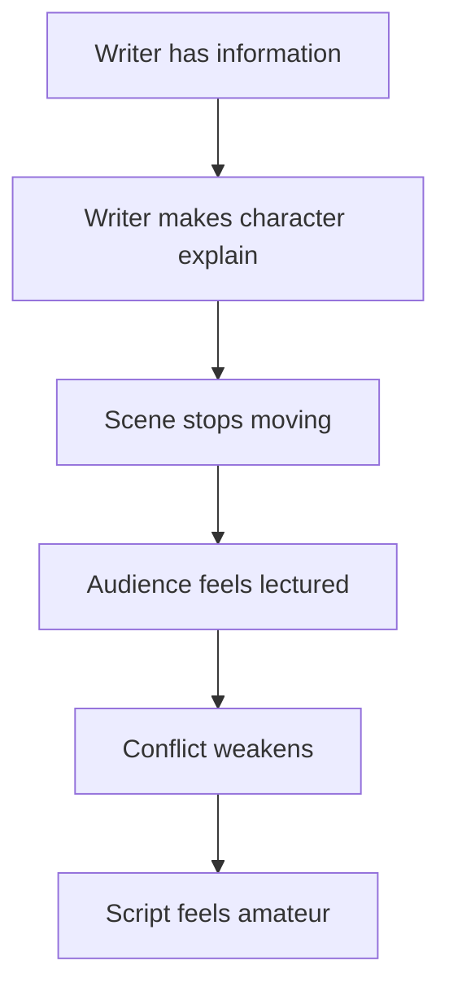
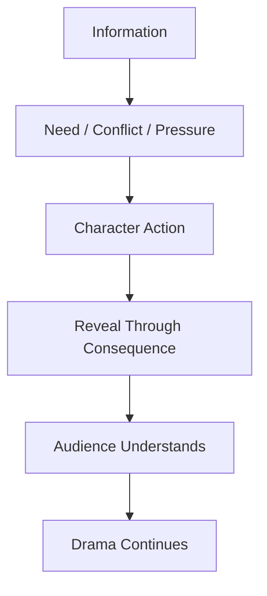
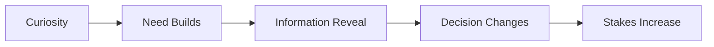
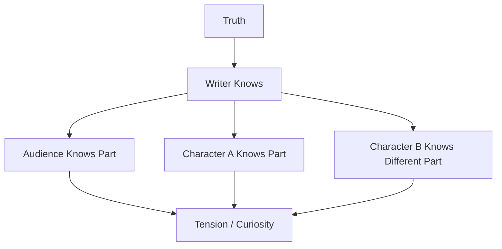
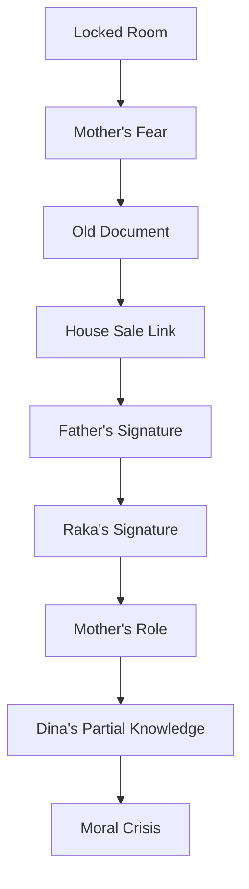

# learn-screenwriting-film-script-part-015.md

# Part 015 — Exposition: Cara Memberi Informasi Tanpa Membunuh Drama

> Seri: Learn Screenwriting for Film Project  
> Pendekatan: *The First 20 Hours* — Josh Kaufman  
> Fokus bagian ini: menyampaikan informasi penting kepada penonton tanpa membuat naskah terasa menjelaskan, menggurui, atau berhenti bergerak.  
> Target praktis: mampu mengubah backstory, world rules, relasi, rahasia, dan konteks plot menjadi informasi dramatik yang keluar lewat konflik, tindakan, objek, visual, dan konsekuensi.

---

## 0. Posisi Part Ini dalam Roadmap

Pada part sebelumnya kita sudah membahas:

1. **Part 011** — scene design.
2. **Part 012** — visual storytelling.
3. **Part 013** — format screenplay.
4. **Part 014** — dialog sebagai tindakan dramatik.

Sekarang kita masuk ke salah satu masalah terbesar dalam naskah film: **exposition**.

Exposition adalah informasi yang perlu diketahui penonton agar mereka bisa memahami:

- siapa karakter,
- apa masa lalu mereka,
- apa konflik yang sedang terjadi,
- apa aturan dunia cerita,
- apa stakes,
- apa relasi antar karakter,
- apa rahasia yang tersembunyi,
- apa sistem sosial/hukum/politik/keluarga yang menekan karakter,
- kenapa pilihan tertentu penting,
- kenapa ending punya makna.

Masalahnya: informasi sering membunuh drama jika diberikan secara mentah.

Diagram masalah umum:



Target part ini adalah membalik pola itu:



---

## 1. Prinsip Kaufman dalam Part Ini

Dalam pendekatan *The First 20 Hours*, kita perlu memecah skill “menulis exposition” menjadi sub-skill kecil yang bisa dilatih.

Sub-skill utama:

1. Membedakan informasi yang penulis tahu vs informasi yang penonton perlu tahu.
2. Menentukan kapan informasi perlu diberikan.
3. Menentukan siapa yang punya informasi.
4. Menentukan siapa yang membutuhkan informasi.
5. Menentukan siapa yang ingin menyembunyikan informasi.
6. Menyampaikan informasi lewat konflik.
7. Menyampaikan informasi lewat visual/object.
8. Menyampaikan informasi lewat action/consequence.
9. Menyampaikan informasi lewat dialogue tanpa “as you know”.
10. Menunda informasi agar curiosity/suspense bekerja.
11. Membuat reveal mengubah state cerita.
12. Menghapus informasi yang tidak diperlukan.

Target 20 jam pertama bukan menjadi master mystery writer. Target praktisnya:

```text
Mampu menulis scene yang memberi informasi penting tanpa karakter terasa sedang membaca dokumen penulis.
```

---

## 2. Apa Itu Exposition?

Exposition adalah informasi latar atau konteks yang dibutuhkan penonton untuk memahami cerita.

Jenis exposition:

| Jenis | Contoh |
|---|---|
| Backstory | Ayah Raka pernah terlibat kasus palsu |
| Relationship history | Raka meninggalkan rumah selama lima tahun |
| World rule | Rumah tidak bisa dijual tanpa tanda tangan Ibu |
| Plot context | Pembeli datang besok pukul sembilan |
| Character wound | Raka pernah menyaksikan ayahnya ditangkap |
| Social system | Warga kampung bergantung pada sumur rumah itu |
| Legal context | Sertifikat rumah bukan atas nama ayah |
| Genre rule | Hantu hanya muncul saat pintu ruang kerja dibuka |
| Mystery clue | Tanggal di surat tidak cocok dengan alibi |
| Theme context | Keluarga ini selalu memilih diam daripada kebenaran |

Exposition tidak buruk. Yang buruk adalah exposition yang diberikan tanpa drama.

---

## 3. Exposition Bukan Musuh

Banyak penulis pemula mendengar nasihat:

```text
Jangan exposition.
```

Itu keliru.

Film butuh exposition. Penonton perlu informasi untuk peduli.

Masalahnya bukan keberadaan informasi. Masalahnya adalah **cara informasi diberikan**.

Exposition buruk:

```text
Karakter menjelaskan hal yang sudah mereka tahu kepada karakter lain hanya agar penonton tahu.
```

Exposition baik:

```text
Informasi keluar karena karakter membutuhkan, menyembunyikan, menyalahgunakan, menemukan, membayar, atau salah memahami informasi itu.
```

Kuncinya:

```text
Information must be dramatized.
```

---

## 4. The Exposition Paradox

Penonton butuh informasi, tetapi tidak mau merasa sedang diberi informasi.

Mereka ingin:

- menemukan,
- menebak,
- menyadari,
- curiga,
- takut lebih dulu,
- menghubungkan clue,
- melihat konsekuensi,
- menangkap subtext.

Penonton tidak ingin:

- diberi kuliah,
- mendengar karakter menjelaskan masa lalu panjang,
- diberi dialog “seperti yang kamu tahu”,
- diberi aturan dunia sekaligus,
- diberi biografi lengkap karakter sebelum konflik aktif.

Paradox-nya:

```text
Informasi harus cukup jelas agar penonton tidak bingung,
tetapi cukup tersembunyi dalam drama agar penonton tetap aktif.
```

---

## 5. Information Architecture

Sebagai software engineer, pikirkan exposition seperti **information architecture**.

Jangan dump seluruh database ke user.

Berikan informasi:

- saat user membutuhkan,
- dalam format yang bisa diproses,
- dengan progressive disclosure,
- berdasarkan context,
- sesuai permission,
- dengan error handling jika salah paham.

Analogi:

| Software UX | Screenwriting |
|---|---|
| Progressive disclosure | Reveal bertahap |
| Need-to-know | Audience need-to-know |
| Permission/access control | Siapa tahu rahasia |
| Event-driven update | Informasi muncul karena event |
| Error state | Karakter salah memahami |
| Audit trail | Backstory/clue |
| Hidden dependency | Secret relationship |
| State sync issue | Dramatic irony |
| Debug trace | Investigation plot |
| Data leak | Accidental reveal |

Screenwriting exposition bukan `SELECT * FROM backstory`.

Lebih tepat:

```text
Expose only the field needed to make the next decision emotionally meaningful.
```

---

## 6. Writer Knowledge vs Audience Knowledge

Penulis tahu jauh lebih banyak daripada penonton.

Masalah muncul ketika penulis mencoba memindahkan semua pengetahuan itu ke halaman terlalu cepat.

Bedakan:

```text
Writer must know.
Audience must know now.
Audience can infer.
Audience should not know yet.
Audience may never need to know.
```

Tabel:

| Kategori | Perlakuan |
|---|---|
| Penulis harus tahu | Simpan di notes/backstory |
| Penonton harus tahu sekarang | Dramatize dalam scene |
| Penonton bisa infer | Beri clue visual/subtext |
| Penonton belum boleh tahu | Tunda/reveal nanti |
| Penonton tidak perlu tahu | Hapus dari script |

Contoh:

```text
Penulis tahu:
Ayah Raka pernah memalsukan dokumen untuk menyelamatkan keluarga.

Penonton perlu tahu di awal:
Raka tidak nyaman membicarakan ayah.

Penonton bisa infer:
Ada ruang kerja ayah yang dikunci.

Penonton belum boleh tahu:
Ibu ikut menutup bukti.

Penonton tidak perlu tahu:
Nama lengkap semua rekan bisnis ayah jika tidak berdampak cerita.
```

---

## 7. Audience Need-to-Know

Pertanyaan utama:

```text
Apa informasi minimum yang penonton butuhkan agar scene berikutnya bekerja?
```

Bukan:

```text
Apa semua informasi yang penulis sudah siapkan?
```

Contoh:

Scene Raka ingin menjual rumah.

Penonton perlu tahu sekarang:

- Raka ingin rumah dijual.
- Ibu menolak atau menghambat.
- Ada sesuatu yang disembunyikan.
- Penjualan punya deadline.

Penonton belum perlu tahu:

- sejarah lengkap sertifikat rumah,
- semua konflik ayah dengan pejabat,
- semua trauma masa kecil Raka,
- semua alasan Ibu diam.

Jika informasi belum memengaruhi pilihan scene, kemungkinan bisa ditunda.

---

## 8. Exposition Timing

Informasi punya waktu.

Terlalu cepat:

```text
Penonton belum peduli, informasi terasa berat.
```

Terlalu lambat:

```text
Penonton bingung dan tidak bisa mengikuti stakes.
```

Timing baik:

```text
Informasi muncul tepat saat ia mengubah keputusan, risiko, atau makna.
```

Diagram:



Pertanyaan timing:

1. Apakah informasi ini dibutuhkan untuk memahami objective?
2. Apakah informasi ini menaikkan stakes?
3. Apakah informasi ini membalik asumsi?
4. Apakah informasi ini mengubah relasi?
5. Apakah informasi ini memicu pilihan baru?
6. Apakah jika ditunda, scene menjadi lebih menarik?
7. Apakah jika dipercepat, penonton lebih peduli?

---

## 9. Exposition dan Curiosity

Curiosity bekerja ketika penonton tahu ada sesuatu yang belum diketahui.

Contoh:

```text
Ruang kerja ayah selalu dikunci.
Ibu melarang membukanya.
Dina takut saat mendengar gagang pintunya bergerak.
```

Penonton bertanya:

```text
Apa isi ruang itu?
```

Anda belum perlu menjelaskan. Anda cukup memberi sinyal bahwa ada informasi penting.

Curiosity membutuhkan:

- clue,
- gap,
- emotional charge,
- consequence,
- promise of reveal.

---

## 10. Exposition dan Suspense

Suspense berbeda dari mystery.

Mystery:

```text
Penonton tidak tahu apa isi ruang kerja.
```

Suspense:

```text
Penonton tahu ruang kerja berisi bukti, tetapi Raka belum tahu bahwa Dina sedang menuju ke sana.
```

Dramatic irony:

```text
Penonton tahu Ibu berbohong, Raka percaya Ibu.
```

Tabel informasi:

| Mode | Penonton Tahu? | Karakter Tahu? | Efek |
|---|---|---|---|
| Mystery | Tidak | Tidak | Curiosity |
| Suspense | Ya | Tidak / sebagian | Tension |
| Dramatic irony | Ya | Tidak | Anticipation |
| Reveal | Baru tahu | Baru tahu | Reframe |
| Secret | Sebagian tahu | Sebagian tidak | Power imbalance |

Exposition bukan hanya informasi. Exposition adalah desain siapa tahu apa, kapan.

---

## 11. Information Gap

Information gap adalah jarak antara:

- apa yang diketahui penonton,
- apa yang diketahui karakter,
- apa yang sebenarnya benar.

Diagram:



Semakin strategis gap-nya, semakin kuat tension.

Contoh:

```text
Truth:
Ibu ikut menandatangani dokumen palsu.

Raka believes:
Ayah satu-satunya yang bersalah.

Dina knows:
Ibu pernah menangis di ruang kerja.

Audience knows:
Ibu bereaksi aneh setiap dokumen disebut.

Tension:
Penonton menunggu kapan Raka menyadari ibu tidak hanya korban.
```

---

## 12. Exposition dan State Change

Informasi yang baik mengubah state.

Reveal lemah:

```text
Ayah dulu bekerja sebagai akuntan.
```

Jika tidak mengubah apa pun, lemah.

Reveal kuat:

```text
Ayah bukan akuntan biasa; ia yang memalsukan audit yang membuat rumah itu bisa dibeli murah.
```

Mengubah:

- moral image ayah,
- alasan rumah penting,
- stakes penjualan,
- relasi Raka dengan warisan,
- theme tentang keluarga dan kebenaran.

Pertanyaan:

```text
Setelah informasi ini keluar, apa yang tidak bisa kembali seperti sebelumnya?
```

Jika tidak ada, mungkin informasi itu belum perlu.

---

## 13. Exposition Delivery Modes

Ada banyak cara menyampaikan informasi.

| Mode | Contoh |
|---|---|
| Dialogue conflict | Karakter memakai informasi untuk menyerang |
| Visual evidence | Foto, luka, ruang kosong |
| Object | Kunci, surat, piring retak |
| Action | Karakter menghindari pintu tertentu |
| Consequence | Rumah hampir disita |
| Behavior | Ibu berhenti makan saat nama ayah disebut |
| Sound | Rekaman suara ayah |
| Setting | Tanda tinggi badan anak di dinding |
| Costume | Seragam lama masih tergantung |
| Document | Sertifikat, surat, headline |
| Ritual | Ibu selalu menyiapkan piring untuk orang yang tidak pulang |
| Absence | Kursi kosong, foto dibalik |
| Contradiction | Karakter berkata A, tindakan menunjukkan B |
| Public pressure | Orang kampung menyebut nama lama keluarga |
| Discovery | Karakter menemukan clue |
| Mistake | Karakter salah menyebut tanggal |
| Transaction | Informasi ditukar dengan sesuatu |
| Threat | Informasi dipakai sebagai ancaman |

Jangan default ke dialog. Pilih mode sesuai scene.

---

## 14. Exposition as Conflict

Ini teknik utama.

Informasi paling hidup ketika ia diperebutkan.

Template:

```text
Character A wants information.
Character B wants to hide information.
Character A applies pressure.
Character B leaks partial truth.
A misinterprets / escalates.
B reveals something costly or weaponizes truth.
```

Contoh:

```text
RAKA
Siapa yang tanda tangan surat itu?

IBU
Orang yang sudah mati tidak perlu kamu sidang.

RAKA
Aku tanya siapa.

IBU
Kamu tanya lima tahun terlambat.

RAKA
Ibu tahu.

IBU
Ibu yang pegang tangannya.
```

Informasi keluar karena tekanan, bukan penjelasan.

---

## 15. Exposition as Weapon

Informasi dipakai untuk menyerang.

Contoh:

```text
RAKA
Ayah tanda tangan laporan itu.

IBU
Kamu juga.

Raka terdiam.

IBU (CONT'D)
Kamu pikir surat kuasa yang kamu tanda tangani waktu umur tujuh belas itu buat rekening sekolah?
```

Informasi:

- Raka pernah menandatangani sesuatu.
- Ia tidak tahu konsekuensinya.
- Ibu tahu.
- Raka tidak sepenuhnya di luar sistem.

Informasi ini punya daya ledak karena digunakan sebagai senjata.

---

## 16. Exposition as Bargain

Informasi ditukar dengan sesuatu.

Contoh:

```text
SAKSI
Saya punya nama pembeli pertama rumah itu.

RAKA
Berapa?

SAKSI
Bukan uang.

RAKA
Lalu?

SAKSI
Kunci ruang kerja ayahmu.
```

Informasi punya harga. Penonton langsung tahu:

- saksi tahu sesuatu,
- kunci penting,
- ruang kerja punya nilai,
- Raka harus memilih.

---

## 17. Exposition as Threat

Informasi menjadi ancaman.

Contoh:

```text
PEMBELI
Besok saya datang dengan notaris.

RAKA
Rumahnya belum siap.

PEMBELI
Saya tidak datang untuk rumahnya.

Beat.

PEMBELI (CONT'D)
Saya datang untuk memastikan ibumu ingat tanda tangannya.
```

Exposition:

- pembeli tahu Ibu.
- Ada tanda tangan lama.
- Transaksi bukan sekadar jual rumah.

Ancaman membuat informasi terasa dramatik.

---

## 18. Exposition as Mistake

Informasi bocor karena kesalahan.

Contoh:

```text
DINA
Kakak jangan buka laci bawah.

RAKA
Laci bawah?

Dina sadar.

RAKA (CONT'D)
Kamu bilang belum pernah masuk.
```

Informasi keluar tanpa karakter ingin memberi.

Ini membuat scene hidup karena karakter memperbaiki kebocoran.

---

## 19. Exposition as Denial

Penolakan bisa membuka informasi.

Contoh:

```text
RAKA
Ibu yang bakar dokumennya?

IBU
Tidak ada api malam itu.

RAKA
Aku belum bilang malam.
```

Denial terlalu spesifik membuka fakta.

Teknik ini sangat berguna untuk mystery/thriller/drama keluarga.

---

## 20. Exposition as Correction

Satu koreksi kecil bisa mengungkap backstory.

Contoh:

```text
RAKA
Ayah pergi jam sembilan.

IBU
Setengah sepuluh.

Beat.

RAKA
Ibu bilang Ibu tidur.
```

Ibu mengoreksi karena kebiasaan, tetapi koreksi membuka kebohongan.

---

## 21. Exposition as Contradiction

Karakter berkata A, dunia menunjukkan B.

Contoh:

```text
IBU
Ibu sudah buang semua barang ayahmu.

Di dapur, mug ayah masih di rak paling depan. Bersih. Dipakai.
```

Penonton memahami:

- Ibu berbohong,
- atau Ibu tidak bisa melepas,
- atau “buang” punya arti lain.

Contradiction lebih kuat daripada penjelasan.

---

## 22. Exposition Through Object

Objek bisa membawa banyak informasi.

Contoh objek:

```text
Kunci kecil sebagai liontin.
```

Informasi yang mungkin:

- ada ruang yang dikunci,
- Ibu menjaga sesuatu,
- rahasia dekat dengan tubuhnya,
- kunci menjadi simbol kuasa,
- rumah punya area tabu.

Contoh:

```text
Raka melihat kunci di leher Ibu.

RAKA
Masih dipakai?

IBU
Ada pintu yang tidak percaya laci.
```

Objek + dialog subtext.

---

## 23. Object Information Stack

Satu objek bisa punya beberapa lapisan.

Contoh: piring retak.

| Lapisan | Informasi |
|---|---|
| Visual | Piring retak masih dipakai |
| Character | Ibu mempertahankan yang rusak |
| Relationship | Raka tahu piring itu dari masa kecil |
| Theme | Keluarga rusak tapi dipaksa tetap berfungsi |
| Plot | Piring bisa menyembunyikan clue di bawahnya |
| Emotional | Raka pernah memecahkan piring itu saat ayah marah |

Jangan jelaskan semua lapisan. Biarkan beberapa muncul bertahap.

---

## 24. Exposition Through Setting

Setting bisa memberi informasi tanpa dialog.

Contoh:

```text
INT. KAMAR RAKA - SORE

Tempat tidur rapi. Terlalu rapi.

Di dinding, bekas poster yang sudah dicabut. Hanya sisa lakban.

Di meja: piala lomba matematika berdebu. Nama RAKA salah eja.
```

Informasi:

- kamar lama tidak berubah banyak,
- Raka tidak benar-benar “dipelihara” dengan hangat,
- prestasinya pernah ada tapi terabaikan,
- nama salah eja menunjukkan jarak/ketidakpedulian.

Tidak perlu menulis:

```text
Raka merasa keluarganya tidak pernah benar-benar melihat dirinya.
```

---

## 25. Exposition Through Absence

Kadang yang tidak ada lebih informatif daripada yang ada.

Contoh:

```text
Di meja makan, Ibu menyiapkan tiga piring.

Tidak ada piring untuk Raka.
```

Informasi:

- Raka tidak dianggap akan makan,
- ia jarang pulang,
- atau Ibu sedang menghukumnya.

Atau:

```text
Di dinding keluarga, foto Raka berhenti pada usia dua belas.
```

Absence menciptakan pertanyaan.

---

## 26. Exposition Through Ritual

Ritual menunjukkan sejarah dan nilai.

Contoh:

```text
Setiap malam, Ibu mengunci ruang kerja ayah, mencium kunci, lalu menggantungnya kembali di leher.
```

Informasi:

- ritual sudah lama,
- ruang itu sakral/berbahaya,
- Ibu punya hubungan emosional dengan kunci,
- ini bukan kunci biasa.

Ritual lebih kuat daripada penjelasan.

---

## 27. Exposition Through Behavior

Perilaku karakter bisa membawa informasi.

Contoh:

```text
Begitu nama ayah disebut, Ibu mengambil gelas Dina yang masih penuh dan mencucinya.
```

Informasi:

- Ibu menghindari topik,
- ia mengalihkan anxiety ke pekerjaan domestik,
- Dina mungkin sudah terbiasa dengan pola ini.

Perilaku berulang bisa menjadi exposition.

---

## 28. Exposition Through Consequence

Jangan jelaskan aturan. Tunjukkan konsekuensinya.

Buruk:

```text
Di kota ini, siapa pun yang membuka ruang kerja orang mati akan mendapat kutukan.
```

Lebih dramatik:

```text
Raka membuka pintu ruang kerja.

Keesokan paginya, semua foto keluarga di rumah menghadap dinding.
```

Atau drama realistis:

Buruk:

```text
Rumah tidak bisa dijual tanpa tanda tangan Ibu.
```

Lebih dramatik:

```text
Notaris menutup map.

NOTARIS
Tanpa tanda tangan Ibu Sari, rumah ini cuma cerita keluarga. Bukan aset.
```

Lebih baik lagi jika konsekuensi langsung menekan scene.

---

## 29. Exposition Through Public Reaction

Orang lain bisa memberi informasi lewat reaksi.

Contoh:

```text
Raka masuk warung kampung.

Obrolan berhenti.

Pemilik warung melihat wajahnya, lalu menurunkan foto ayah Raka dari dinding.
```

Informasi:

- keluarga Raka punya sejarah publik,
- ayahnya dikenal,
- ada luka sosial,
- Raka membawa stigma.

Tanpa satu kalimat penjelasan panjang.

---

## 30. Exposition Through Nickname

Nama/panggilan bisa membawa sejarah.

Contoh:

```text
WARGA
Anaknya Pak Segel pulang.
```

Raka berhenti.

Informasi:

- ayah punya julukan,
- julukan terkait tindakan “menyegel”,
- warga punya memori kolektif,
- Raka mewarisi stigma.

Panggilan bisa menjadi exposition yang tajam.

---

## 31. Exposition Through Work/Procedure

Untuk cerita hukum, medis, investigasi, birokrasi, atau teknis, prosedur bisa menjelaskan dunia.

Namun jangan jadikan prosedur sebagai manual.

Buruk:

```text
Untuk menjual rumah warisan, kita membutuhkan dokumen A, B, C, D, dan tanda tangan semua ahli waris sesuai peraturan...
```

Lebih dramatik:

```text
NOTARIS
Ini tanda tangan Raka. Ini Dina.

Ia menunjuk kolom terakhir. Kosong.

NOTARIS (CONT'D)
Dan ini alasan pembeli belum punya rumah.
```

Informasi prosedural keluar sebagai obstacle.

---

## 32. Exposition Through Document

Dokumen bisa efektif, tapi jangan terlalu banyak membaca dokumen.

Contoh:

```text
INSERT - SERTIFIKAT RUMAH

Nama pemilik:
SARI WIDJAJA

Bukan nama ayah.
```

Raka menatap Ibu.

```text
RAKA
Ayah tidak pernah punya rumah ini.
```

Dokumen memberi reveal visual.

Jangan membuat karakter membaca tiga halaman dokumen keras-keras kecuali scene-nya tentang itu dan ada tekanan.

---

## 33. Exposition Through Media

TV, radio, berita, podcast, chat, voice note, CCTV bisa memberi info.

Tetapi hati-hati: ini sering menjadi dumping device.

Buruk:

```text
TV menjelaskan seluruh kasus masa lalu.
```

Lebih baik:

```text
Di TV warung, berita lama diputar ulang tanpa suara.

Hanya subtitle:
KASUS SERTIFIKAT PALSU DIBUKA KEMBALI

Pemilik warung mematikan TV saat Raka masuk.
```

Informasi + reaksi sosial + tension.

---

## 34. Exposition Through Voice Recording

Rekaman suara bisa kuat jika:

- punya keterbatasan,
- mengandung emosi,
- tidak menjelaskan semua,
- diputar pada waktu yang salah,
- didengar oleh orang yang salah,
- sebagian rusak,
- memicu pilihan.

Contoh:

```text
AYAH (V.O.)
Kalau kamu dengar ini, berarti ibumu akhirnya berhenti melindungi saya.

Rekaman berdesis.

AYAH (V.O.) (CONT'D)
Jangan percaya tanggal di surat--
```

Tape berhenti.

Informasi tidak lengkap menciptakan dramatic question.

---

## 35. Exposition Through Conflict of Versions

Dua karakter punya versi masa lalu yang berbeda.

Contoh:

```text
RAKA
Ayah pergi karena Ibu usir.

IBU
Ayah pergi karena kamu masih tidur.

RAKA
Apa hubungannya?

IBU
Semua.
```

Konflik versi menciptakan mystery dan emotional stakes.

Teknik ini sangat kuat untuk drama keluarga, thriller, mystery.

---

## 36. Exposition Through False Belief

Penonton diberi informasi melalui keyakinan salah karakter.

Contoh:

```text
Raka percaya ayahnya korban.
```

Scene-scene awal mendukung belief itu sebagian.

Lalu reveal:

```text
Ayah bukan korban. Ia membuat korban lain.
```

False belief membuat exposition lebih aktif karena penonton ikut membangun asumsi.

---

## 37. Exposition and Misdirection

Misdirection adalah memberi informasi yang benar tetapi mengarah ke asumsi salah.

Contoh:

```text
Ibu selalu berkata:
"Jangan buka ruang itu. Ayahmu bisa keluar."
```

Penonton mungkin mengira horror/supernatural.  
Ternyata:

```text
"Ayahmu" berarti reputasi/kejahatan ayah akan keluar ke publik.
```

Misdirection harus fair. Setelah reveal, penonton harus merasa:

```text
Oh, petunjuknya sudah ada.
```

Bukan:

```text
Penulis menipu tanpa setup.
```

---

## 38. Exposition and Reveal

Reveal adalah pembukaan informasi penting.

Reveal yang baik:

1. Membayar setup.
2. Mengubah pemahaman.
3. Menaikkan stakes.
4. Mengubah keputusan karakter.
5. Memiliki konsekuensi.
6. Tidak hanya mengejutkan, tapi bermakna.

Template reveal:

```text
Assumption before:
Clue setup:
Reveal:
What changes:
Immediate consequence:
Emotional meaning:
```

Contoh:

```text
Assumption before:
Ayah pemilik rumah.

Clue setup:
Ibu selalu menolak bicara sertifikat.

Reveal:
Sertifikat atas nama Ibu.

What changes:
Raka tidak punya hak moral/legal seperti yang ia kira.

Immediate consequence:
Penjualan berhenti.

Emotional meaning:
Ibu bukan hanya penjaga rumah; ia pusat rahasia.
```

---

## 39. Exposition and Payoff

Informasi harus ditanam dan dibayar.

Setup:

```text
Dina selalu memotret dokumen diam-diam.
```

Payoff:

```text
Saat bukti asli dibakar, Dina punya salinannya.
```

Setup:

```text
Ibu selalu mengoreksi waktu kejadian.
```

Payoff:

```text
Raka sadar Ibu hadir di malam yang katanya tidak ia lihat.
```

Exposition yang baik sering terlihat seperti detail kecil sebelum menjadi penting.

---

## 40. Exposition Ladder

Jangan buka semua sekaligus. Gunakan tangga.

Contoh rahasia ayah:

```text
Step 1:
Ruang kerja ayah dikunci.

Step 2:
Ibu takut jika pintu dibuka.

Step 3:
Ada dokumen lama.

Step 4:
Dokumen terkait penjualan rumah.

Step 5:
Ayah menandatangani sesuatu.

Step 6:
Tanda tangan Raka juga ada.

Step 7:
Ibu membantu menutupinya.

Step 8:
Dina tahu sebagian.

Step 9:
Membuka kebenaran akan menjerat keluarga sekaligus menyelamatkan korban lain.
```

Diagram:



Setiap step mengubah stakes.

---

## 41. Progressive Disclosure

Progressive disclosure berarti memberi informasi secara bertahap sesuai kebutuhan dramatik.

Prinsip:

```text
Reveal enough to make the next choice meaningful.
Hide enough to keep tension alive.
```

Contoh:

Scene 1:

```text
Ada kunci.
```

Scene 3:

```text
Kunci membuka ruang kerja.
```

Scene 6:

```text
Ruang kerja berisi dokumen.
```

Scene 9:

```text
Dokumen mencantumkan nama ayah.
```

Scene 12:

```text
Dokumen juga mencantumkan nama Raka.
```

Scene 15:

```text
Ibu tahu dan melindunginya.
```

Penonton tidak overload.

---

## 42. Exposition and Pacing

Terlalu banyak informasi dalam satu scene memperlambat pacing.

Tanda overload:

- karakter menjelaskan lebih dari satu topik besar,
- dialog panjang tanpa resistance,
- informasi tidak mengubah keputusan saat itu,
- scene terasa seperti briefing,
- penonton harus mengingat terlalu banyak nama/aturan,
- emotional thread hilang.

Solusi:

1. Pecah informasi menjadi beberapa beat.
2. Jadikan tiap informasi punya consequence.
3. Tunda yang belum perlu.
4. Visualkan sebagian.
5. Hapus detail yang tidak memengaruhi pilihan.

---

## 43. Exposition Chunking

Jangan beri informasi sebagai blok besar. Pecah menjadi chunk.

Blok buruk:

```text
Ayahmu dulu bekerja dengan Pak Darma, lalu mereka membuat sertifikat palsu, lalu Ibu tahu, lalu kamu menandatangani surat, lalu Dina hampir kehilangan hak, dan rumah ini sebenarnya bukan warisan ayah.
```

Chunk lebih baik:

Scene 1:

```text
Sertifikat bukan atas nama ayah.
```

Scene 2:

```text
Pak Darma pernah datang ke rumah.
```

Scene 3:

```text
Surat kuasa lama punya tanda tangan Raka.
```

Scene 4:

```text
Ibu yang menyimpan surat itu.
```

Scene 5:

```text
Dina hampir menjadi korban legal.
```

Setiap chunk menjadi beat.

---

## 44. The “As You Know” Problem

“As you know” terjadi ketika karakter menjelaskan hal yang seharusnya sudah diketahui lawan bicara.

Contoh:

```text
RAKA
Seperti yang Ibu tahu, Ayah meninggal lima tahun lalu setelah kasus sertifikat palsu yang membuat keluarga kita hancur.
```

Masalah:

- tidak natural,
- transparan sebagai info dump,
- scene berhenti,
- karakter terdengar seperti penulis.

Fix:

```text
RAKA
Lima tahun Ibu suruh kita diam.

IBU
Dan lima tahun kamu masih hidup karena itu.
```

Informasi:

- sudah lima tahun,
- ada rahasia,
- diam punya fungsi perlindungan.

Lebih dramatik.

---

## 45. “Maid and Butler Dialogue”

Istilah ini menggambarkan dua karakter yang saling menjelaskan hal yang mereka sudah tahu, seperti pelayan di drama lama yang menjelaskan plot untuk penonton.

Contoh:

```text
PELAYAN A
Tuan kita sangat sedih sejak istrinya meninggal tiga tahun lalu.

PELAYAN B
Ya, terutama karena putrinya kabur setelah pertengkaran besar di ruang makan.
```

Versi modernnya juga sering muncul:

```text
DINA
Kak, sejak Ayah meninggal lima tahun lalu dan Kakak pergi ke Jakarta, Ibu selalu sendiri di rumah ini.
```

Padahal Raka dan Dina sama-sama tahu.

Fix dengan konflik:

```text
DINA
Ibu belajar tidur dengan TV nyala.

RAKA
Aku transfer tiap bulan.

DINA
TV-nya yang jawab kalau Ibu batuk jam tiga pagi?
```

Informasi keluar lewat serangan.

---

## 46. Exposition in Dialogue: Rules

Jika harus memberi exposition lewat dialog, ikuti aturan:

1. Karakter tidak boleh memberi informasi secara gratis.
2. Informasi harus punya tujuan bagi pembicara.
3. Ada resistance.
4. Ada subtext.
5. Ada emotional cost.
6. Ada consequence.
7. Jangan menjawab terlalu lengkap.
8. Biarkan sebagian informasi terpotong.
9. Gunakan detail spesifik, bukan rangkuman.
10. Beri informasi saat dibutuhkan untuk keputusan.

---

## 47. Dialogue Exposition: Good Patterns

### 47.1 Accusation

```text
DINA
Waktu Ibu operasi, Kakak kirim emoji jempol.
```

Informasi + luka.

### 47.2 Threat

```text
PEMBELI
Saya punya salinan surat yang kamu kira ikut terbakar.
```

Informasi + stakes.

### 47.3 Correction

```text
IBU
Bukan dijual. Diserahkan.
```

Informasi + reframe.

### 47.4 Joke

```text
DINA
Kakak pulang setahun sekali. Kayak pajak bumi bangunan, tapi lebih telat.
```

Informasi + voice.

### 47.5 Refusal

```text
IBU
Nama itu tidak disebut di meja makan.
```

Informasi + taboo.

### 47.6 Bargain

```text
SAKSI
Saya kasih tanggal malam itu. Kamu kasih saya kunci.
```

Informasi + transaction.

---

## 48. Exposition Through Argument

Argument efektif karena karakter saling menekan.

Contoh:

```text
RAKA
Rumah ini atas nama Ayah.

IBU
Baca lagi.

RAKA
Aku sudah baca.

IBU
Makanya kamu cuma lihat nama yang kamu butuhkan.

Raka membuka sertifikat.

Nama pemilik: SARI WIDJAJA.
```

Exposition:

- sertifikat atas nama Ibu,
- Raka salah asumsi,
- Ibu tahu,
- konflik power berubah.

Informasi keluar melalui argument dan document reveal.

---

## 49. Exposition Through Question Trap

Pertanyaan bisa menjadi perang informasi.

Contoh:

```text
RAKA
Malam itu Ibu di mana?

IBU
Di rumah.

RAKA
Di ruang mana?

IBU
Kamar.

RAKA
Lampu kamar mati dari jam delapan.

IBU
Kamu tidak tahu itu.

RAKA
Dina tahu.
```

Informasi keluar bertahap dan penuh pressure.

---

## 50. Exposition Through Interview/Interrogation

Interview/interrogation bisa jadi alat exposition, tapi harus punya power dynamics.

Buruk:

```text
Detektif bertanya, saksi menjelaskan semua.
```

Lebih kuat:

- saksi ingin menyembunyikan,
- detektif punya clue,
- saksi memberi sebagian,
- detektif salah paham,
- saksi memanfaatkan salah paham,
- reveal mengubah power.

Template:

```text
Interrogator wants:
Subject wants:
Hidden truth:
Known clue:
False lead:
Pressure tactic:
Reveal:
Consequence:
```

---

## 51. Exposition Through Investigation

Investigation plot secara alami membutuhkan exposition. Tapi tetap harus dramatik.

Setiap clue harus:

1. Ditemukan melalui tindakan.
2. Memiliki resistance.
3. Mengubah pertanyaan.
4. Mengarah ke clue berikutnya.
5. Meningkatkan risiko.

Clue lemah:

```text
Karakter menemukan dokumen yang menjelaskan semuanya.
```

Clue kuat:

```text
Karakter menemukan dokumen setengah terbakar yang hanya menyisakan tanda tangan dirinya sendiri.
```

Penonton mendapat informasi, tapi juga pertanyaan.

---

## 52. Exposition Through World Rules

Jika film punya dunia khusus, aturan harus dijelaskan secara dramatik.

Buruk:

```text
Di dunia ini, semua orang harus memakai gelang identitas untuk masuk ke zona aman.
```

Lebih baik:

```text
Seorang anak kecil berlari ke gerbang zona aman.

Petugas melihat pergelangan tangannya. Kosong.

Gerbang ditutup.

Di belakang anak itu, sirene mulai berbunyi.
```

Rule terlihat lewat consequence.

Untuk drama realistis:

Buruk:

```text
Tanpa tanda tangan semua ahli waris, rumah tidak bisa dijual.
```

Lebih baik:

```text
Notaris mendorong map kembali ke Raka.

NOTARIS
Rumah ini belum punya izin untuk meninggalkan keluargamu.
```

Rule + voice + theme.

---

## 53. Exposition Through Stakes

Stakes adalah exposition yang paling penting.

Jangan hanya bilang:

```text
Ini berbahaya.
```

Tunjukkan bahaya:

```text
Ibu menaruh dokumen di atas kompor.

RAKA
Apa yang Ibu lakukan?

IBU
Menyelamatkan Dina.

Ia menyalakan api.
```

Penonton langsung tahu:

- dokumen berbahaya,
- Ibu rela menghancurkan bukti,
- Dina terkait,
- stakes personal.

---

## 54. Exposition Through Deadline

Deadline memberi konteks cepat.

Contoh:

```text
AGEN PROPERTI
Besok jam sembilan saya datang dengan pembeli.

RAKA
Besok terlalu cepat.

AGEN PROPERTI
Utang kamu juga begitu.
```

Informasi:

- pembeli datang besok,
- Raka punya utang,
- urgency tinggi,
- agen tahu tekanan Raka.

Deadline membuat exposition bergerak.

---

## 55. Exposition Through Choice

Informasi paling kuat muncul tepat sebelum pilihan.

Contoh:

```text
Raka siap menyerahkan dokumen ke polisi.

Ibu:
Kalau kamu kasih itu, tanda tangan Dina ikut terbaca sebagai saksi palsu.

Raka berhenti.
```

Informasi ini penting karena mengubah pilihan.

Jika informasi yang sama diberikan 30 menit sebelumnya tanpa pilihan, dampaknya lebih kecil.

---

## 56. Exposition Through Failure

Karakter mencoba sesuatu, gagal, dan dari kegagalan itu penonton belajar aturan.

Contoh:

```text
Raka mencoba menjual rumah tanpa Ibu.

Notaris menolak.

Penonton belajar:
Ibu punya legal power.
```

Lebih baik daripada karakter menjelaskan dari awal.

Failure adalah guru exposition.

---

## 57. Exposition Through Cost

Informasi punya cost ketika mendapatkannya membuat karakter kehilangan sesuatu.

Contoh:

```text
Raka memaksa Dina memberi salinan foto dokumen.

Dina memberikannya.

DINA
Sekarang Kakak tahu.

Beat.

DINA (CONT'D)
Sekarang aku tahu Kakak tetap milih dokumen daripada aku.
```

Informasi diperoleh, relasi rusak.

Cost membuat exposition punya emosi.

---

## 58. Exposition Through Emotional Reaction

Kadang informasi tidak perlu lengkap. Reaksi karakter cukup.

Contoh:

```text
Raka menyebut nama "Darma".

Ibu menjatuhkan gelas.

Dina melihat Ibu, bukan Raka.
```

Penonton tahu nama itu penting.

Belum perlu dijelaskan siapa Darma. Reaction menciptakan curiosity.

---

## 59. Exposition Through Physical Trace

Trace adalah jejak masa lalu.

Contoh:

```text
Di balik lukisan, dinding lebih bersih membentuk bekas bingkai lain.

Raka mengangkat lukisan.

Di bawahnya: noda hitam bekas api.
```

Informasi:

- ada sesuatu yang ditutupi,
- pernah ada kebakaran,
- lukisan baru menyembunyikan bekas lama.

Trace memberi backstory visual.

---

## 60. Exposition Through Repetition

Informasi bisa diberikan lewat pola berulang.

Contoh:

```text
Setiap kali pintu ruang kerja diketuk, Ibu menyentuh liontin.
```

Setelah beberapa kali, penonton memahami:

- liontin/kunci terkait ruang kerja,
- Ibu punya trauma,
- pintu itu trigger.

Repetition with variation:

1. Ibu menyentuh kunci saat nama ayah disebut.
2. Ibu menyentuh kunci saat pembeli datang.
3. Ibu melepas kunci saat Dina bertanya.
4. Kunci pindah tangan saat rahasia mulai bocor.

---

## 61. Exposition Through Contrast

Contrast memberi informasi melalui perbedaan.

Contoh:

```text
Rumah Raka di kota: bersih, minimalis, tidak ada foto.

Rumah lama: berdebu, terlalu banyak foto, semua wajah ayah masih ada.
```

Informasi:

- Raka menghapus memori,
- rumah lama memelihara memori,
- konflik identity.

Contrast bisa lebih kuat daripada dialog.

---

## 62. Exposition Through Symbolic Action

Symbolic action menunjukkan makna tanpa menjelaskan.

Contoh:

```text
Raka menandatangani dokumen penjualan di atas foto keluarga.
```

Informasi:

- ia memilih transaksi di atas relasi,
- atau mencoba menutup masa lalu dengan legalitas.

Later payoff:

```text
Ia membalik dokumen itu dan menulis surat untuk Dina di belakangnya.
```

Simbol berubah.

---

## 63. Exposition Through Subtext

Karakter bicara tentang A, tapi informasi tentang B muncul.

Contoh:

```text
IBU
Nasi di rumah ini selalu cukup untuk orang yang pulang.

RAKA
Aku tidak lapar.

IBU
Ibu tidak bilang kamu.
```

Subtext:

- ada orang lain yang tidak pulang,
- Ibu masih menunggu,
- mungkin ayah/anak lain/masa lalu.

Informasi muncul dari gap.

---

## 64. Exposition Through Taboo

Hal yang tidak boleh dibicarakan memberi informasi.

Contoh:

```text
DINA
Kenapa kamar Ayah--

Sendok Ibu menghantam piring.

IBU
Makan.
```

Penonton tahu:

- kamar ayah adalah taboo,
- Ibu punya power,
- Dina pernah mencoba bertanya,
- Raka melihat pola lama.

Taboo sering lebih kuat dari penjelasan.

---

## 65. Exposition Through Social Rules

Aturan sosial bisa memberi konteks.

Contoh:

```text
Di pemakaman, semua orang menyalami Ibu.

Tidak ada yang menyalami Raka.

Seorang paman akhirnya mendekat.

PAMAN
Kamu pulang juga. Berani.
```

Informasi:

- Raka dipandang bersalah/pengecut,
- keluarga punya luka publik,
- pulang adalah tindakan sosial, bukan hanya fisik.

---

## 66. Exposition Through Production Design

Benda di frame bisa bercerita.

Contoh:

```text
Ruang kerja ayah:
- kalender berhenti di tanggal tertentu,
- asbak penuh tapi tidak berdebu,
- map-map diberi label warna,
- foto keluarga disobek hanya bagian wajah Ibu,
- kipas masih menghadap kursi kosong.
```

Setiap detail bisa memberi clue.

Namun jangan overload. Pilih detail yang punya fungsi.

---

## 67. Exposition Through Costume

Costume bisa memberi informasi.

Contoh:

```text
Raka datang dengan kemeja kantor, sepatu bersih.

Dina memakai kaos lama Raka, terlalu besar, penuh noda cat.
```

Informasi:

- Raka menjaga jarak dan image,
- Dina masih memakai peninggalannya,
- hubungan mereka rumit,
- rumah menyimpan orang yang pergi.

Costume sebagai exposition harus spesifik.

---

## 68. Exposition Through Body

Tubuh membawa sejarah.

Contoh:

```text
Setiap kali pintu ruang kerja berderit, bahu Ibu naik sedikit.
```

Informasi:

- suara itu trigger,
- Ibu punya memori fisik,
- trauma tidak perlu dijelaskan.

Atau:

```text
Raka otomatis menunduk saat suara piring pecah.
```

Backstory kekerasan bisa disiratkan tanpa flashback.

---

## 69. Exposition Through Space

Posisi karakter di ruang memberi informasi relasi.

Contoh:

```text
Raka selalu berdiri dekat pintu.
Dina selalu duduk di kursi yang menghalangi jalan keluar.
Ibu selalu duduk membelakangi ruang kerja.
```

Informasi:

- Raka ingin kabur,
- Dina ingin menahan,
- Ibu tidak sanggup melihat ruang kerja.

Space menjadi exposition.

---

## 70. Exposition Through Food

Dalam konteks keluarga Indonesia, makanan bisa sangat kuat.

Contoh:

```text
Ibu memasak makanan kesukaan Raka, tapi tidak menyebutnya.

Raka tidak makan.

Dina mengambil lauk itu.

DINA
Kalau Kakak tidak mau masa kecilnya, aku boleh?
```

Informasi:

- makanan = memori,
- Raka menolak rumah,
- Dina merasa mengambil sisa perhatian.

Food exposition terasa natural karena terkait ritual.

---

## 71. Exposition Through Bureaucracy

Untuk project film dengan tema hukum/regulasi/kasus, birokrasi bisa menjadi drama.

Buruk:

```text
Ada banyak prosedur legal yang rumit.
```

Lebih baik:

```text
Petugas loket mendorong formulir kembali.

PETUGAS
Kolom ayah tidak boleh kosong.

RAKA
Dia mati.

PETUGAS
Di sistem belum.
```

Informasi:

- sistem tidak sinkron dengan realitas emosional,
- legal identity bermasalah,
- bureaucracy sebagai antagonistic force.

---

## 72. Exposition in Genre

Setiap genre punya cara exposition berbeda.

### 72.1 Drama

Exposition muncul lewat:

- relasi,
- ritual,
- benda,
- gesture,
- luka lama,
- percakapan tidak langsung.

### 72.2 Thriller

Exposition muncul lewat:

- clue,
- threat,
- deadline,
- contradiction,
- surveillance,
- document,
- interrogation.

### 72.3 Horror

Exposition muncul lewat:

- warning,
- taboo,
- ritual,
- local myth,
- sensory anomaly,
- repeated pattern,
- consequence.

### 72.4 Romance

Exposition muncul lewat:

- memory,
- object,
- inside joke,
- failed intimacy,
- contrast past/present,
- missed opportunity.

### 72.5 Comedy

Exposition muncul lewat:

- embarrassment,
- misunderstanding,
- social contradiction,
- over-specific lie,
- joke revealing truth.

### 72.6 Mystery

Exposition muncul lewat:

- clue,
- false lead,
- witness contradiction,
- hidden motive,
- timeline inconsistency.

---

## 73. Exposition and Tone

Informasi yang sama bisa diberikan dengan tone berbeda.

Informasi:

```text
Ayah pernah memalsukan dokumen.
```

Drama:

```text
IBU
Ayahmu menulis nama orang mati supaya kita bisa tetap tinggal.
```

Thriller:

```text
SAKSI
Tanda tangan ayahmu muncul di tiga sertifikat. Dua pemiliknya hilang.
```

Comedy gelap:

```text
DINA
Ayah ternyata bukan cuma jago tanda tangan rapor kosong.
```

Tragic romance:

```text
IBU
Ayahmu memalsukan satu nama agar nama kita tetap di pintu rumah.
```

Tone mengubah rasa exposition.

---

## 74. Exposition and Theme

Informasi harus mendukung tema.

Theme question:

```text
Apakah keluarga boleh dilindungi dengan kebohongan?
```

Maka exposition sebaiknya mengungkap:

- kebohongan pernah menyelamatkan keluarga,
- kebohongan juga menyakiti korban,
- setiap karakter punya definisi “melindungi” yang berbeda.

Jangan memberi exposition yang hanya trivia.

Contoh trivia:

```text
Ayah suka kopi hitam.
```

Bisa penting jika:

```text
Ibu masih membuat kopi hitam setiap malam untuk orang yang sudah mati.
```

Sekarang menjadi theme/character exposition.

---

## 75. Exposition and Character Arc

Informasi harus menekan arc karakter.

Flaw Raka:

```text
Menghindari emosi dengan logika transaksi.
```

Maka exposition harus menantang logika itu:

```text
Sertifikat rumah atas nama Ibu.
Dokumen legal yang Raka percaya tidak cukup menjelaskan moral rumah.
Tanda tangan Raka ada dalam surat yang dulu ia tidak baca.
```

Informasi menyerang defense mechanism karakter.

---

## 76. Exposition and Antagonist

Antagonis bisa menjadi sumber informasi, tetapi jangan menjadikannya “explainer”.

Antagonis yang baik memberi informasi untuk mengontrol.

Contoh:

```text
PEMBELI
Ayahmu menjual rumah ini dua kali.

RAKA
Bohong.

PEMBELI
Tiga, kalau kamu hitung yang ke ibumu.
```

Informasi + humiliation + power.

---

## 77. Exposition and Supporting Characters

Supporting character bisa membawa informasi karena mereka punya sudut pandang berbeda.

Namun hindari karakter yang hanya menjadi “info dispenser”.

Supporting character yang baik punya:

- objective sendiri,
- bias,
- informasi parsial,
- agenda,
- luka,
- ketakutan,
- harga yang diminta.

Contoh:

```text
SAKSI
Saya bisa cerita malam itu.

RAKA
Ceritakan.

SAKSI
Kamu minta seperti anaknya. Saya jawab sebagai korbannya.
```

Informasi dibingkai oleh luka saksi.

---

## 78. Exposition and Bias

Informasi tidak harus netral. Karakter bisa bias.

Contoh:

```text
Ibu:
Ayah melakukan itu untuk keluarga.

Saksi:
Ayah melakukan itu untuk uang.

Dina:
Ayah melakukan itu karena semua orang dewasa pengecut.

Raka:
Ayah tidak mungkin melakukan itu.
```

Penonton menyusun kebenaran dari versi-versi bias.

Bias membuat exposition hidup.

---

## 79. Exposition and Unreliable Narration

Jika karakter menceritakan masa lalu, ia bisa salah, bohong, lupa, atau melindungi diri.

Gunakan ini dengan fair.

Contoh:

```text
Ibu menceritakan bahwa ayah pulang malam itu.

Flash image menunjukkan sepatu ayah sudah di rumah sejak sore.
```

Narration dan visual bertentangan.

Ini menciptakan tension.

---

## 80. Exposition and Flashback

Flashback adalah alat exposition yang kuat tapi berisiko.

Gunakan flashback jika:

1. Masa lalu harus dialami, bukan hanya diketahui.
2. Flashback membalik asumsi.
3. Flashback memberi emotional proof.
4. Flashback muncul karena trigger.
5. Flashback tidak menjelaskan semua.
6. Flashback punya konflik sendiri.

Flashback buruk:

```text
Menjelaskan seluruh sejarah keluarga secara kronologis.
```

Flashback baik:

```text
Menunjukkan satu momen spesifik yang mengubah makna present.
```

Contoh:

```text
Present:
Raka yakin Ibu tidak pernah melindunginya.

Flashback:
Ibu berdiri di depan pintu, menerima tamparan yang seharusnya mengenai Raka kecil.
```

Informasi ini mengubah relasi.

---

## 81. Exposition and Memory Fragment

Memory fragment lebih hemat daripada flashback penuh.

Contoh:

```text
Raka mendengar piring pecah.

FLASH:

-- Tangan ayah.
-- Piring putih di lantai.
-- Dina kecil di bawah meja.
-- Ibu berbisik: Jangan keluar.

BACK TO SCENE.
```

Informasi:

- ada trauma,
- Dina ada,
- Ibu pernah melindungi,
- piring pecah sebagai trigger.

Tidak perlu full scene.

---

## 82. Exposition and Voice Over

Voice over bisa bekerja jika punya fungsi.

V.O. buruk:

```text
RAKA (V.O.)
Aku pulang ke rumah lama setelah lima tahun pergi karena trauma pada ayahku.
```

V.O. lebih baik jika:

- ironis,
- terbatas,
- bertentangan dengan visual,
- berasal dari rekaman/surat,
- punya voice kuat,
- tidak menjelaskan semua.

Contoh:

```text
AYAH (V.O.)
Kalau rumah ini masih berdiri, berarti ibumu menang.

Visual:
Raka melihat atap rumah bocor, dinding retak, Ibu tidur di kursi.

AYAH (V.O.) (CONT'D)
Atau kita semua kalah pelan-pelan.
```

V.O. + visual membuat makna.

---

## 83. Exposition Through Silence

Informasi bisa muncul dari siapa yang tidak menjawab.

Contoh:

```text
RAKA
Dina anak Ayah?

Ibu tidak menatap Dina.

Dina menatap Ibu.

Tidak ada yang menatap Raka.
```

Silence mengungkap lebih dari jawaban.

Jika pertanyaan cukup kuat, silence adalah exposition.

---

## 84. Exposition Through Scene Order

Urutan scene bisa mengungkap informasi.

Contoh:

Scene A:

```text
Ibu berkata tidak pernah masuk ruang kerja.
```

Scene B:

```text
Ibu sendirian masuk ruang kerja tanpa menyalakan lampu, tahu persis letak saklar rusak.
```

Penonton mengerti Ibu berbohong.

Tidak perlu dialog tambahan.

---

## 85. Exposition Through Cross-Cutting

Cross-cutting bisa memberi informasi paralel.

Contoh:

```text
Raka di notaris mendengar rumah tidak bisa dijual tanpa tanda tangan Ibu.

Cross-cut:
Ibu di rumah membakar surat yang berisi tanda tangan itu.

Raka bertanya:
"Surat aslinya di mana?"
```

Penonton tahu lebih dari Raka, menciptakan suspense.

---

## 86. Exposition Through Montage

Montage bisa memberi informasi proses.

Contoh:

```text
MONTAGE - RAKA MENELUSURI JEJAK SERTIFIKAT

-- Raka memotret arsip lama.

-- Nama ayah muncul di satu halaman, dicoret.

-- Di kantor kelurahan, petugas menutup map saat melihat alamat rumah.

-- Dina mengirim foto kunci.

-- Raka menempel timeline di dinding. Satu tanggal kosong.

END MONTAGE
```

Montage memberi informasi, tapi tetap visual dan bergerak.

---

## 87. Exposition Through Compression

Beberapa informasi bisa digabung dalam satu scene konflik.

Misal harus menyampaikan:

1. Rumah tidak bisa dijual tanpa Ibu.
2. Raka punya utang.
3. Pembeli datang besok.
4. Ibu menyembunyikan kunci.
5. Dina curiga.

Scene gabungan:

```text
Makan malam.
Agen properti menelepon Raka.
Raka menolak panggilan, tapi Dina melihat nama pembeli.
Ibu menaruh piring di atas map penjualan.
Raka meminta tanda tangan.
Ibu menutup kunci di leher.
Dina bertanya siapa yang datang besok.
```

Satu scene, banyak informasi, tetapi semuanya dalam konflik.

---

## 88. Exposition and Scene Objective

Setiap exposition scene harus tetap punya objective.

Buruk objective:

```text
Memberi tahu penonton sejarah keluarga.
```

Baik objective:

```text
Raka ingin mendapatkan tanda tangan Ibu.
```

Exposition muncul karena:

- Ibu menolak,
- Raka menekan,
- Dina bertanya,
- dokumen dibuka,
- kunci terlihat.

Scene tetap bergerak.

---

## 89. Exposition and Scene Turn

Informasi harus membantu turn.

Contoh turn:

```text
Raka datang dengan keyakinan ia punya hak menjual rumah.
Scene berakhir dengan ia tahu rumah atas nama Ibu.
```

Exposition:

```text
Nama di sertifikat.
```

Turn:

```text
Power legal pindah ke Ibu.
```

Jika exposition tidak menciptakan turn, scene mungkin terasa datar.

---

## 90. Exposition Audit

Untuk setiap informasi dalam script, buat audit.

Template:

```text
Information:
Who knows it?
Who needs it?
Who hides it?
When does audience learn it?
How is it revealed?
What changes after reveal?
Can it be delayed?
Can it be visual?
Can it be conflict?
Can it be cut?
```

Contoh:

```text
Information:
Rumah atas nama Ibu.

Who knows it?
Ibu, notaris, pembeli.

Who needs it?
Raka.

Who hides it?
Ibu.

When does audience learn it?
Saat Raka mencoba memproses penjualan.

How is it revealed?
Notaris menolak dokumen dan menunjukkan kolom nama pemilik.

What changes after reveal?
Raka kehilangan legal leverage.

Can it be delayed?
Ya, sampai Raka merasa hampir berhasil menjual.

Can it be visual?
Ya, insert sertifikat.

Can it be conflict?
Ya, notaris/ibu menggunakan informasi itu melawan Raka.

Can it be cut?
Tidak, karena mengubah power.
```

---

## 91. Information Map

Buat map siapa tahu apa.

| Informasi | Raka | Ibu | Dina | Pembeli | Penonton |
|---|---|---|---|---|---|
| Rumah atas nama Ibu | Tidak | Ya | Tidak | Ya | Belum |
| Ruang kerja berisi dokumen | Tidak | Ya | Sebagian | Ya | Curiga |
| Tanda tangan Raka ada | Tidak | Ya | Tidak | Ya | Belum |
| Dina memotret kunci | Tidak | Tidak | Ya | Tidak | Ya |
| Pembeli terkait korban lama | Tidak | Ya | Tidak | Ya | Belum |

Information map membantu menghindari inconsistency.

---

## 92. Reveal Schedule

Jadwalkan reveal.

```text
Reveal 1:
Ruang kerja dikunci.

Reveal 2:
Kunci ada di Ibu.

Reveal 3:
Rumah atas nama Ibu.

Reveal 4:
Pembeli tahu masa lalu ayah.

Reveal 5:
Dokumen menyebut tanda tangan Raka.

Reveal 6:
Ibu menyimpan dokumen untuk melindungi Raka.

Reveal 7:
Dina sudah tahu lebih lama dari yang Raka kira.

Reveal 8:
Membuka kebenaran menyelamatkan korban, tapi menghancurkan keluarga.
```

Setiap reveal harus punya fungsi dramatik.

---

## 93. Exposition Severity

Masalah exposition bisa dinilai seperti bug.

| Severity | Gejala | Dampak |
|---|---|---|
| Blocker | Informasi penting tidak pernah diberikan | Penonton bingung |
| Major | Informasi diberikan terlalu mentah | Scene mati |
| Major | Reveal tidak mengubah apa-apa | Struktur lemah |
| Medium | Info terlalu cepat | Mystery/suspense hilang |
| Medium | Info terlalu lambat | Penonton frustrasi |
| Minor | Detail berlebihan | Pacing lambat |
| Polish | Info bekerja tapi bisa lebih visual | Rewrite visual |

---

## 94. Exposition Smell

| Smell | Gejala | Fix |
|---|---|---|
| As-you-know | Karakter menjelaskan hal yang sudah diketahui | Jadikan konflik/accusation |
| Lore dump | Aturan dunia dijelaskan sekaligus | Tunjukkan lewat consequence |
| Backstory block | Masa lalu panjang di action/dialog | Pecah jadi clue/trace |
| Document reading | Karakter membaca dokumen panjang | Tampilkan detail kunci |
| Voice-over dumping | Narasi menjelaskan semua | Buat V.O. ironic/limited |
| Convenient confession | Karakter mengaku tanpa tekanan | Tambah cost/resistance |
| Info without turn | Informasi tidak mengubah scene | Tunda/cut/rewrite |
| Too many names | Banyak nama tanpa fungsi | Fokus pada nama yang berdampak |
| Procedural lecture | Penjelasan aturan teknis | Jadikan obstacle |
| Mystery starvation | Terlalu sedikit info | Beri clue/anchor |

---

## 95. Debugging Exposition

### 95.1 Jika scene terasa seperti ceramah

Cek:

1. Siapa yang ingin sesuatu?
2. Siapa yang menolak?
3. Informasi dipakai untuk apa?
4. Apa konsekuensi jika informasi keluar?
5. Apa yang bisa divisualkan?
6. Apa yang bisa dipotong?
7. Apa informasi yang bisa ditunda?

---

### 95.2 Jika penonton bingung

Cek:

1. Apakah dramatic question jelas?
2. Apakah objective scene jelas?
3. Apakah stakes cukup dijelaskan?
4. Apakah terlalu banyak informasi disembunyikan?
5. Apakah informasi penting hanya tersirat terlalu halus?
6. Apakah ada anchor visual/emosional?

Solusi:

- beri clue lebih jelas,
- gunakan reaksi karakter,
- buat informasi berdampak langsung,
- jangan hanya mengandalkan subtext samar.

---

### 95.3 Jika reveal terasa tiba-tiba

Cek:

1. Apakah ada setup?
2. Apakah ada clue?
3. Apakah karakter punya alasan tidak tahu?
4. Apakah penonton bisa melihat ulang dan merasa fair?
5. Apakah reveal mengubah state?

Solusi:

- tanam clue lebih awal,
- buat clue tampak punya fungsi lain,
- gunakan repetition with variation.

---

### 95.4 Jika exposition terlalu teknis

Cek:

1. Apa dampaknya ke karakter?
2. Apa pilihan yang berubah?
3. Apa konsekuensi emosional?
4. Bisakah aturan teknis menjadi obstacle?
5. Bisakah satu detail teknis saja mewakili sistem?

Contoh:

Daripada menjelaskan semua hukum sertifikat, cukup:

```text
NOTARIS
Satu kolom kosong. Satu rumah berhenti.
```

---

## 96. Exposition Rewrite Pass

Lakukan pass berikut:

### Pass 1 — Inventory

Daftar semua informasi yang script berikan.

### Pass 2 — Need

Tandai informasi:

```text
NEED NOW / NEED LATER / OPTIONAL / CUT
```

### Pass 3 — Delivery Mode

Tandai mode:

```text
Dialogue / Visual / Object / Action / Consequence / Document / Silence / Ritual
```

### Pass 4 — Conflict

Tanya:

```text
Bisakah informasi ini keluar lewat konflik?
```

### Pass 5 — Timing

Tanya:

```text
Apakah informasi ini muncul terlalu cepat/lambat?
```

### Pass 6 — Turn

Tanya:

```text
Apa yang berubah setelah informasi keluar?
```

### Pass 7 — Compression

Potong detail yang tidak mengubah pilihan, stakes, atau emosi.

---

## 97. Exposition Rewrite Example

### 97.1 Draft Lemah

```text
RAKA
Ibu, aku tahu bahwa Ayah dulu terlibat dalam kasus sertifikat palsu yang membuat banyak warga kehilangan rumah, dan aku juga tahu bahwa rumah ini sebenarnya tidak bisa dijual karena ada dokumen lama yang Ibu sembunyikan di ruang kerja Ayah.
```

Masalah:

- terlalu banyak informasi,
- tidak natural,
- Raka tahu terlalu banyak,
- tidak ada conflict,
- tidak ada discovery.

### 97.2 Draft Lebih Baik

```text
INT. RUMAH LAMA - RUANG MAKAN - MALAM

Raka meletakkan sertifikat di meja.

RAKA
Nama Ayah tidak ada.

Ibu tetap menyendok nasi.

RAKA (CONT'D)
Kenapa nama Ibu ada?

IBU
Karena ada yang harus tetap punya alamat setelah ayahmu selesai jadi orang baik.

Raka membuka halaman kedua.

Di sana, tanda tangan Raka. Usia tujuh belas.

RAKA
Ini bukan tanda tanganku.

IBU
Itu yang kamu bilang juga waktu pertama kali pulang mabuk.
```

Informasi keluar bertahap:

- nama ayah tidak ada,
- nama Ibu ada,
- ayah punya moral contradiction,
- tanda tangan Raka ada,
- masa lalu Raka terkait,
- Ibu tahu lebih banyak.

---

## 98. Exposition Rewrite Example: Visual

### 98.1 Draft Lemah

```text
Dina merasa Raka sudah lama meninggalkan keluarga dan hanya pulang untuk menjual rumah.
```

### 98.2 Draft Visual

```text
INT. KAMAR RAKA - SORE

Dina membuka lemari.

Baju Raka masih tergantung dalam plastik laundry. Nota laundry tertanggal lima tahun lalu.

Di meja, amplop-amplop transfer bulanan tersusun rapi. Tidak pernah dibuka.

Dina menaruh map penjualan rumah di atasnya.
```

Informasi:

- Raka lama tidak tinggal,
- ia mengirim uang,
- keluarga tidak membuka transfer,
- penjualan rumah masuk di atas pola relasi transaksional.

Tanpa dialog.

---

## 99. Exposition Rewrite Example: Comedy

Informasi:

```text
Raka jarang pulang.
```

Versi datar:

```text
DINA
Kakak jarang pulang.
```

Versi comedy/sarcasm:

```text
DINA
Kakak mau kopi?

RAKA
Ada?

DINA
Ada. Terakhir Kakak pulang, kopi ini masih bisa diminum.
```

Informasi + humor + luka.

---

## 100. Exposition Rewrite Example: Thriller

Informasi:

```text
Pembeli rumah terkait kasus lama ayah.
```

Versi datar:

```text
SAKSI
Pembeli itu adalah orang yang dulu bekerja dengan ayahmu dalam kasus sertifikat palsu.
```

Versi thriller:

```text
SAKSI
Pembelinya siapa?

RAKA
Darma.

Saksi tertawa sekali. Pendek. Tanpa senang.

SAKSI
Ayahmu dulu juga mulai dengan menjual ke Darma.

Beat.

SAKSI (CONT'D)
Tidak ada yang menjual dua kali kalau pembeli pertamanya masih hidup.
```

Informasi + ancaman + mystery.

---

## 101. Exposition in First 10 Pages

Opening harus memberi cukup info, tapi jangan semua.

Dalam 10 halaman awal, biasanya perlu:

1. Siapa protagonist.
2. Apa kondisi normalnya.
3. Apa flaw/defense-nya.
4. Apa dunia/setting dasar.
5. Apa gangguan awal.
6. Apa tone/genre.
7. Apa dramatic question awal.
8. Apa stakes awal.

Tidak perlu:

- semua backstory,
- semua aturan dunia,
- semua karakter masa lalu,
- semua twist,
- semua motif antagonis,
- semua trauma.

Opening exposition harus seperti kail, bukan ensiklopedia.

---

## 102. Exposition in Short Film

Film pendek sangat sensitif terhadap exposition.

Karena durasi pendek, jangan membangun dunia terlalu luas.

Prinsip film pendek:

```text
Satu konflik utama.
Satu informasi besar.
Satu perubahan utama.
```

Gunakan:

- visual object,
- ritual,
- satu kalimat spesifik,
- behavior,
- final reveal.

Contoh:

```text
Seorang perempuan menunggu bus sambil membawa koper.

Di koper: label bagasi bertanggal lima tahun lalu.

Ia tidak pergi hari ini untuk pertama kali. Ia mencoba pergi lagi.
```

Satu detail memberi backstory.

---

## 103. Exposition in Feature Film

Feature memberi ruang lebih banyak, tetapi tetap harus terstruktur.

Gunakan reveal ladder:

| Sequence | Exposition Function |
|---|---|
| 1 | Setup dunia, karakter, gap |
| 2 | Lock-in dan stakes |
| 3 | First layer of truth |
| 4 | Complication toward midpoint |
| Midpoint | Major reframe |
| 5 | New truth changes goal |
| 6 | Cost and hidden connection |
| 7 | Deepest truth / crisis |
| 8 | Truth paid through action |

Feature exposition harus berkembang, bukan hanya bertambah.

---

## 104. Exposition and Emotional Anchoring

Informasi sulit diproses jika tidak punya anchor emosional.

Contoh info legal:

```text
Rumah atas nama Ibu.
```

Anchor emosional:

```text
Raka selama ini mengira ayah meninggalkan rumah untuknya, ternyata rumah itu milik Ibu yang ia abaikan.
```

Info teknis menjadi emosional karena mengubah relasi.

Selalu tanya:

```text
Kenapa informasi ini menyakitkan, menggoda, mengancam, atau membebaskan karakter?
```

---

## 105. Exposition and Specific Detail

Detail spesifik lebih kuat daripada generalisasi.

Generik:

```text
Ayah kasar.
```

Spesifik:

```text
Raka masih mengupas mangga dengan pisau roti karena dulu pisau dapur disembunyikan setiap Ayah pulang.
```

Generik:

```text
Ibu menunggu Raka.
```

Spesifik:

```text
Ibu selalu memasukkan satu porsi nasi ke magic jar kecil, bukan piring. Biar bisa dipanaskan kalau Raka tiba tengah malam.
```

Specificity membuat exposition terasa hidup.

---

## 106. Exposition and Restraint

Jangan jelaskan 100% jika 70% sudah cukup dan 30% bisa dirasakan.

Contoh:

```text
Raka melihat bekas tanda tinggi badan di dinding. Setelah umur dua belas, tidak ada lagi.
```

Jangan langsung tulis:

```text
Ini menunjukkan bahwa setelah umur dua belas, Raka pergi dan keluarganya berhenti mencatat pertumbuhannya.
```

Percaya penonton.

Namun jangan terlalu samar sampai tidak terbaca. Restraint bukan kabur.

---

## 107. Exposition and Clarity

Subtlety penting, tapi clarity lebih penting.

Penonton boleh bertanya:

```text
Apa yang sebenarnya terjadi?
```

Penonton jangan bertanya:

```text
Aku sedang menonton apa?
Siapa ini?
Kenapa aku harus peduli?
Apa tujuan scene?
```

Jaga anchor:

- protagonist jelas,
- objective jelas,
- emotional stakes jelas,
- konflik aktif jelas,
- informasi mystery boleh belum jelas.

---

## 108. Exposition Design Canvas

Gunakan canvas ini.

```text
# Exposition Design Canvas

Information:
Why audience needs it:
When audience needs it:
Who knows it:
Who hides it:
Who needs it:
Who misunderstands it:
Best delivery mode:
Visual/object possibility:
Conflict possibility:
Consequence after reveal:
Can it be delayed:
Can it be cut:
Setup needed:
Payoff:
```

---

## 109. Contoh Canvas Terisi

```text
Information:
Tanda tangan Raka ada di dokumen palsu.

Why audience needs it:
Untuk membuat Raka tidak hanya menjadi penyelidik luar, tetapi terlibat moral/legal.

When audience needs it:
Setelah Raka mulai merasa superior terhadap ayah dan ibu.

Who knows it:
Ibu, pembeli, mungkin notaris.

Who hides it:
Ibu.

Who needs it:
Raka.

Who misunderstands it:
Raka mengira ia korban keluarga, bukan bagian dari masalah.

Best delivery mode:
Document reveal + argument.

Visual/object possibility:
Surat kuasa lama dengan tanda tangan remaja Raka.

Conflict possibility:
Ibu menggunakan surat itu untuk menghentikan Raka melapor.

Consequence after reveal:
Raka kehilangan posisi moral dan harus memilih antara self-preservation dan truth.

Can it be delayed:
Ya, sampai midpoint atau menjelang midpoint.

Can it be cut:
Tidak.

Setup needed:
Raka sering menandatangani dokumen tanpa membaca; Ibu menyimpan map lama.

Payoff:
Raka akhirnya mengakui keterlibatannya dan tetap membuka kebenaran.
```

---

## 110. Latihan 1 — Information Inventory

Buat daftar 20 informasi yang Anda tahu tentang cerita Anda.

Pisahkan:

```text
A. Must know now
B. Must know later
C. Can infer
D. Writer-only
E. Cut
```

Template:

```text
Information:
Category:
Reason:
Potential delivery:
```

Tujuan:

```text
Menghindari dumping semua backstory.
```

---

## 111. Latihan 2 — Exposition Mode Swap

Ambil satu informasi.

Contoh:

```text
Raka sudah lima tahun tidak pulang.
```

Tulis dalam 5 mode:

1. Dialogue conflict.
2. Visual object.
3. Setting/absence.
4. Joke/sarcasm.
5. Action/ritual.

Contoh:

```text
Dialogue conflict:
DINA
Kakak masih ingat saklar dapur?
```

```text
Visual object:
Kalender di kamar Raka berhenti lima tahun lalu.
```

```text
Absence:
Tidak ada sandal Raka di rak, hanya bekas debu berbentuk sandal.
```

```text
Joke:
DINA
Kakak pulang lebih jarang dari meteran listrik rusak.
```

```text
Ritual:
Ibu tetap menyimpan satu gelas bersih di rak paling atas. Tidak pernah dipakai.
```

---

## 112. Latihan 3 — As-You-Know Rewrite

Rewrite dialog buruk ini:

```text
DINA
Kak, sejak Ayah meninggal lima tahun lalu dan Kakak pergi ke Jakarta, Ibu selalu tinggal sendiri di rumah ini dan menunggu Kakak pulang, tapi Kakak tidak pernah peduli.
```

Tujuan rewrite:

- jangan sebut semua informasi langsung,
- gunakan konflik,
- gunakan detail spesifik,
- biarkan emosi muncul.

Contoh:

```text
DINA
Kakak tahu suara TV Ibu jam tiga pagi?

RAKA
Apa?

DINA
Tentu tidak. Di Jakarta channel-nya beda.
```

Informasi:

- Ibu sering sendiri malam hari,
- Raka jauh,
- Dina menyaksikan,
- luka muncul.

---

## 113. Latihan 4 — Reveal Ladder

Ambil satu rahasia besar. Buat 8 step reveal.

Template:

```text
Secret:
Step 1 clue:
Step 2 clue:
Step 3 contradiction:
Step 4 partial reveal:
Step 5 wrong interpretation:
Step 6 major reveal:
Step 7 emotional consequence:
Step 8 final truth:
```

Pastikan setiap step mengubah stakes.

---

## 114. Latihan 5 — Exposition Through Object

Pilih satu objek penting.

Template:

```text
Object:
Owner at start:
Visible detail:
Hidden meaning:
First appearance:
Second appearance:
Reversal:
Payoff:
```

Contoh:

```text
Object:
Kunci liontin.

Owner at start:
Ibu.

Visible detail:
Dipakai di leher, bahkan saat tidur.

Hidden meaning:
Ibu menjaga ruang kerja dan rasa bersalah.

First appearance:
Raka melihatnya saat makan malam.

Second appearance:
Ibu menyentuhnya saat nama ayah disebut.

Reversal:
Ibu memberi kunci kepada Dina.

Payoff:
Dina memakai kunci untuk membuka ruang saat Raka memilih tidak memaksa.
```

---

## 115. Latihan 6 — Exposition Through Conflict Scene

Tulis scene 2 halaman dengan informasi berikut:

```text
Rumah tidak bisa dijual tanpa tanda tangan Ibu.
```

Larangan:

- tidak boleh ada karakter menjelaskan aturan secara panjang,
- tidak boleh memakai kalimat “secara hukum” lebih dari sekali,
- harus ada objective,
- harus ada opposition,
- harus ada turn.

Objective contoh:

```text
Raka ingin notaris memproses penjualan hari ini.
```

Turn contoh:

```text
Notaris menunjukkan rumah atas nama Ibu, bukan ayah.
```

---

## 116. Latihan 7 — Silent Exposition

Tulis scene tanpa dialog yang menyampaikan:

```text
Karakter sudah lama tidak pulang, tapi seseorang masih menunggunya.
```

Gunakan:

- ruang,
- benda,
- makanan,
- cahaya,
- suara,
- absence.

Maksimal 1 halaman.

---

## 117. Latihan 8 — Information Map

Buat tabel:

```text
Information | Character A | Character B | Character C | Audience | Reveal Scene
```

Isi minimal 10 informasi penting.

Tujuan:

- menghindari plot hole,
- menjaga dramatic irony,
- mengatur reveal.

---

## 118. Practice Plan 90 Menit

Gunakan jadwal:

| Durasi | Aktivitas | Output |
|---:|---|---|
| 10 menit | Buat inventory 15 informasi cerita | Info list |
| 15 menit | Kategorikan need now/later/infer/cut | Info priority |
| 15 menit | Pilih 5 info dan buat delivery mode | Mode map |
| 20 menit | Buat reveal ladder untuk 1 rahasia | Reveal ladder |
| 20 menit | Rewrite 1 dialog exposition buruk | Scene rewrite |
| 10 menit | Audit apakah reveal mengubah state | Self-correction |

Output minimal:

```text
1. Information inventory
2. Reveal ladder
3. Exposition scene rewrite
4. Information map awal
```

---

## 119. Exposition Checklist

### 119.1 Need

- [ ] Apakah informasi ini perlu diketahui penonton?
- [ ] Apakah perlu sekarang?
- [ ] Apakah bisa ditunda?
- [ ] Apakah bisa dihapus?
- [ ] Apakah hanya penulis yang perlu tahu?

### 119.2 Delivery

- [ ] Apakah informasi keluar lewat konflik?
- [ ] Apakah bisa divisualkan?
- [ ] Apakah bisa lewat object?
- [ ] Apakah bisa lewat behavior?
- [ ] Apakah bisa lewat consequence?
- [ ] Apakah dialognya tidak “as you know”?

### 119.3 Drama

- [ ] Apakah informasi mengubah objective?
- [ ] Apakah informasi menaikkan stakes?
- [ ] Apakah informasi mengubah power?
- [ ] Apakah informasi mengubah relasi?
- [ ] Apakah informasi memicu pilihan?

### 119.4 Clarity

- [ ] Apakah penonton punya anchor cukup?
- [ ] Apakah clue tidak terlalu samar?
- [ ] Apakah terlalu banyak nama/aturan?
- [ ] Apakah reveal fair?
- [ ] Apakah informasi tidak kontradiktif tanpa maksud?

### 119.5 Economy

- [ ] Apakah detail berlebihan sudah dipotong?
- [ ] Apakah beberapa info bisa digabung dalam satu scene?
- [ ] Apakah info penting punya setup/payoff?
- [ ] Apakah exposition tidak menghentikan pacing?

---

## 120. Anti-Pattern Exposition

### 120.1 “Database Dump”

Penulis menuangkan semua backstory sekaligus.

Fix:

```text
Pecah menjadi reveal ladder dan berikan hanya ketika mengubah pilihan.
```

### 120.2 “Character Explains the Movie”

Karakter menjelaskan tema, plot, dan relasi.

Fix:

```text
Buat informasi keluar karena karakter ingin menang dalam scene.
```

### 120.3 “Secret Without Clue”

Twist muncul tanpa setup.

Fix:

```text
Tanam clue yang tampak seperti detail biasa.
```

### 120.4 “Too Subtle to Work”

Semua informasi terlalu tersirat.

Fix:

```text
Beri anchor konkret: object, reaction, consequence, atau line spesifik.
```

### 120.5 “Lore Before Care”

Penonton diberi dunia/aturan sebelum peduli pada karakter.

Fix:

```text
Mulai dari karakter dalam tekanan, lalu aturan muncul sebagai obstacle.
```

### 120.6 “Procedural Lecture”

Penjelasan hukum/teknis terlalu panjang.

Fix:

```text
Tunjukkan satu aturan melalui kegagalan karakter.
```

### 120.7 “Convenient Confession”

Karakter mengaku hanya karena plot butuh.

Fix:

```text
Tambahkan pressure, cost, dan resistance.
```

### 120.8 “Info with No Consequence”

Informasi keluar tapi tidak mengubah apa pun.

Fix:

```text
Hubungkan reveal ke decision, stakes, atau power shift.
```

---

## 121. Exposition for Software Engineer Mindset

Sebagai software engineer, Anda mungkin tergoda membuat worldbuilding dan backstory sangat lengkap.

Itu bagus untuk internal consistency, tetapi jangan semuanya masuk ke script.

Anggap notes Anda sebagai backend.

Screenplay adalah UI.

User/penonton tidak perlu melihat seluruh database, hanya interaksi yang relevan.

Prinsip:

```text
Internal model can be complex.
External experience must be clear and emotionally actionable.
```

Gunakan internal model untuk memastikan:

- aturan konsisten,
- timeline masuk akal,
- motivasi tidak random,
- reveal fair,
- character knowledge tidak bocor.

Tetapi di halaman, berikan informasi sebagai pengalaman.

---

## 122. Exposition as API Response

Analogi teknis:

Buruk:

```json
{
  "fatherHistory": "...",
  "motherSecret": "...",
  "houseLegalStatus": "...",
  "rakaTrauma": "...",
  "dinaKnowledge": "...",
  "buyerMotive": "..."
}
```

Terlalu banyak sekaligus.

Lebih baik:

```json
{
  "currentObstacle": "Mother's signature required",
  "emotionalPayload": "Raka has no control over the house he thought was his",
  "nextQuestion": "Why did mother hide ownership?"
}
```

Dalam scene, berikan response sesuai request dramatik.

---

## 123. Minimal Exposition for First Draft

Untuk first draft, cukup pastikan:

1. Penonton tahu siapa protagonist.
2. Penonton tahu apa yang protagonist inginkan.
3. Penonton tahu apa yang menghalangi.
4. Penonton tahu kenapa itu penting.
5. Rahasia punya clue.
6. Reveal besar punya setup.
7. Informasi penting keluar sebelum keputusan yang membutuhkannya.
8. Tidak ada dialog “as you know” yang mencolok.
9. Backstory tidak menghentikan scene.
10. Setiap exposition utama mengubah state.

Detail bisa diperbaiki di rewrite.

---

## 124. Output yang Harus Dibawa ke Part Berikutnya

Part berikutnya adalah:

> **Part 016 — Genre, Tone, dan Audience Expectation**

Sebelum lanjut, Anda sebaiknya punya:

1. Information inventory.
2. Information map siapa tahu apa.
3. Reveal ladder untuk rahasia utama.
4. Minimal 1 scene exposition yang sudah di-rewrite.
5. Daftar exposition yang bisa:
   - divisualkan,
   - dijadikan konflik,
   - ditunda,
   - dipotong.
6. Clue setup untuk reveal besar.
7. Exposition checklist diterapkan ke 3 scene.

Part 016 akan membahas bagaimana genre dan tone menentukan jenis informasi yang perlu diberikan, cara reveal bekerja, dan ekspektasi penonton terhadap pengalaman film.

---

## 125. Ringkasan Part Ini

Exposition bukan musuh. Exposition adalah informasi yang harus didramatisasi.

Hal paling penting:

1. Jangan dump semua informasi.
2. Bedakan writer knowledge dan audience need-to-know.
3. Beri informasi saat ia mengubah pilihan, stakes, atau power.
4. Gunakan progressive disclosure.
5. Jadikan informasi sebagai konflik, senjata, ancaman, bargain, mistake, atau consequence.
6. Visualkan informasi lewat object, setting, absence, ritual, behavior, dan trace.
7. Hindari “as you know” dialogue.
8. Reveal harus punya setup dan payoff.
9. Mystery/suspense bergantung pada siapa tahu apa.
10. Exposition yang baik membuat scene bergerak, bukan berhenti.

Formula inti:

```text
Information + Pressure + Conflict + Consequence = Dramatic Exposition
```

Jika informasi keluar karena karakter menginginkan sesuatu, menyembunyikan sesuatu, atau membayar harga untuk mengetahui sesuatu, exposition akan terasa seperti drama, bukan penjelasan.

---

## 126. Status Seri

- Part 000: selesai.
- Part 001: selesai.
- Part 002: selesai.
- Part 003: selesai.
- Part 004: selesai.
- Part 005: selesai.
- Part 006: selesai.
- Part 007: selesai.
- Part 008: selesai.
- Part 009: selesai.
- Part 010: selesai.
- Part 011: selesai.
- Part 012: selesai.
- Part 013: selesai.
- Part 014: selesai.
- Part 015: selesai.
- Part 016: berikutnya.

Seri **belum selesai**. Bagian berikutnya adalah:

> **Part 016 — Genre, Tone, dan Audience Expectation**
