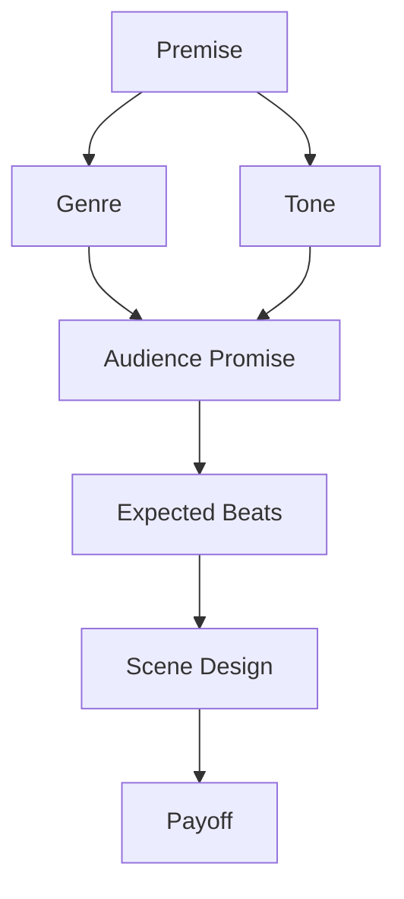
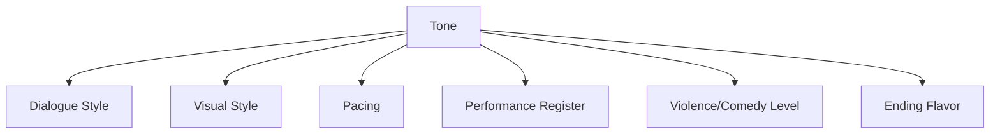
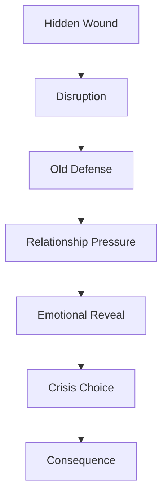
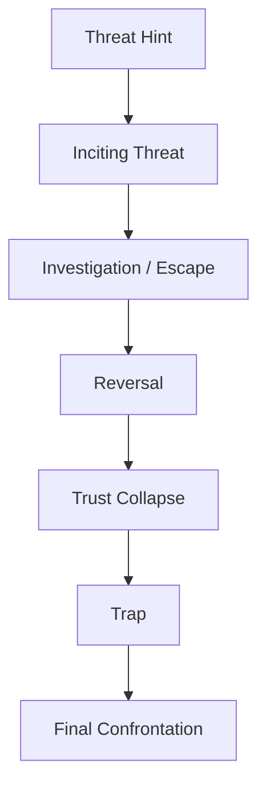
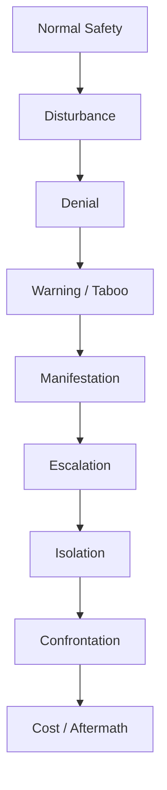
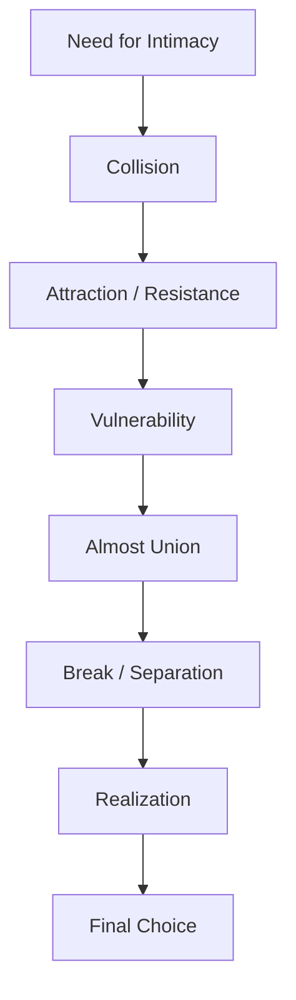
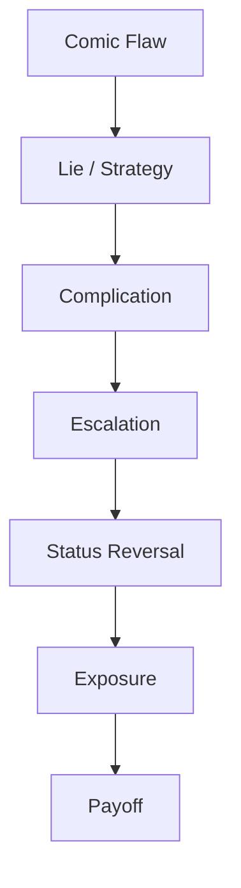
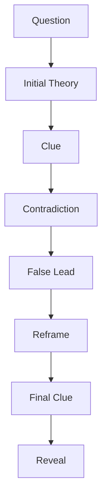
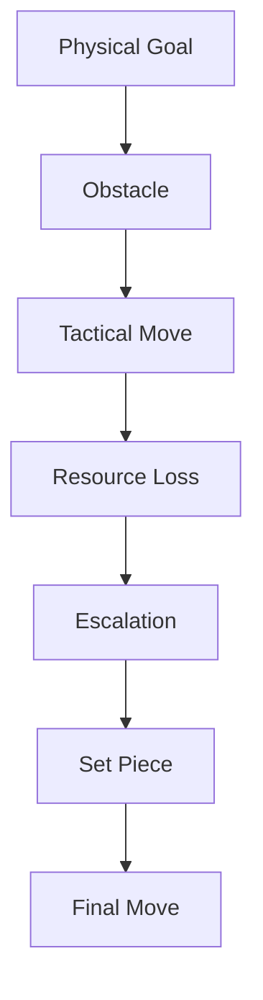

# learn-screenwriting-film-script-part-016.md

# Part 016 — Genre, Tone, dan Audience Expectation

> Seri: Learn Screenwriting for Film Project  
> Pendekatan: *The First 20 Hours* — Josh Kaufman  
> Fokus bagian ini: memahami genre dan tone sebagai kontrak pengalaman dengan penonton, bukan sekadar label cerita.  
> Target praktis: mampu memilih genre/tone yang tepat untuk project film, memahami beat yang dijanjikan genre, menjaga konsistensi pengalaman, dan mendesain naskah agar memenuhi ekspektasi penonton tanpa menjadi formula kosong.

---

## 0. Posisi Part Ini dalam Roadmap

Pada part sebelumnya kita sudah membangun fondasi inti screenplay:

1. **Premis dan logline** — cerita tentang apa.
2. **Tema** — konflik nilai apa yang diperdebatkan.
3. **Karakter** — siapa yang mengejar sesuatu dan perlu berubah.
4. **Antagonis/oposisi** — force apa yang menekan.
5. **Konflik** — engine cerita.
6. **Struktur** — arsitektur perjalanan.
7. **Beat sheet** — rangkaian perubahan.
8. **Scene design** — unit eksekusi.
9. **Visual storytelling** — cara berpikir filmik.
10. **Format screenplay** — protokol penulisan.
11. **Dialog** — tindakan verbal.
12. **Exposition** — informasi dramatik.

Sekarang kita masuk ke lapisan yang sering dianggap “label” padahal sebenarnya sangat menentukan desain cerita: **genre dan tone**.

Genre menjawab:

```text
Pengalaman jenis apa yang dijanjikan film ini kepada penonton?
```

Tone menjawab:

```text
Dengan rasa emosional seperti apa pengalaman itu diberikan?
```

Audience expectation menjawab:

```text
Apa yang secara sadar atau bawah sadar penonton harapkan dari pengalaman tersebut?
```

Diagram:



---

## 1. Prinsip Kaufman dalam Part Ini

Dalam kerangka *The First 20 Hours*, genre/tone harus dipahami sebagai sub-skill praktis.

Kita tidak perlu menguasai seluruh sejarah genre film. Kita perlu belajar cukup untuk:

1. Memilih genre utama.
2. Memahami janji genre.
3. Menghindari genre yang terlalu luas untuk project.
4. Mengidentifikasi beat wajib genre.
5. Menjaga tone tetap konsisten.
6. Membuat variasi tanpa mengkhianati audience promise.
7. Menggunakan genre untuk membantu struktur, bukan mengurung kreativitas.
8. Menentukan jenis konflik dan payoff yang tepat.
9. Menyesuaikan genre dengan budget dan kapasitas produksi.
10. Membaca apakah naskah memenuhi ekspektasi penonton.

Target 20 jam pertama:

```text
Mampu menentukan genre/tone project film dan membuat genre promise map yang membantu menulis beat, scene, dialog, visual, dan ending.
```

---

## 2. Mental Model: Genre adalah Contract

Genre bukan hanya kategori seperti:

```text
drama, horror, thriller, comedy, romance, action
```

Genre adalah **kontrak pengalaman**.

Ketika penonton mendengar “horror”, mereka mengharapkan:

- ancaman,
- rasa takut,
- ketidakpastian,
- escalation,
- reveal,
- confrontation dengan sesuatu yang mengganggu rasa aman.

Ketika mendengar “romance”, mereka mengharapkan:

- dua atau lebih orang dengan tarikan emosional,
- hambatan intimacy,
- vulnerability,
- misunderstanding atau incompatibility,
- pilihan cinta,
- union atau separation yang bermakna.

Ketika mendengar “thriller”, mereka mengharapkan:

- threat,
- urgency,
- deception,
- clue,
- reversals,
- pressure,
- kemungkinan bahaya meningkat.

Genre adalah promise.

Jika promise tidak dipenuhi, penonton merasa kecewa meskipun film “bagus” secara teknis.

---

## 3. Genre sebagai Interface

Untuk cara pikir software engineer:

```text
Genre = interface contract antara film dan penonton.
```

Contoh:

```text
interface HorrorFilm {
  createDread();
  escalateThreat();
  revealRuleOrMonster();
  isolateCharacters();
  forceConfrontation();
  deliverFearPayoff();
}
```

Atau:

```text
interface RomanceFilm {
  createAttraction();
  createObstacleToUnion();
  increaseVulnerability();
  testCompatibility();
  forceEmotionalChoice();
  deliverUnionOrMeaningfulSeparation();
}
```

Jika Anda menulis film “horror” tetapi tidak ada dread, threat, escalation, atau payoff rasa takut, maka implementasinya tidak memenuhi interface.

Namun interface bukan formula kaku. Implementasinya bisa sangat unik.

---

## 4. Genre vs Setting

Kesalahan umum:

```text
Setting dikira genre.
```

Contoh:

| Setting | Belum Tentu Genre |
|---|---|
| Rumah tua | Bisa horror, drama keluarga, mystery, romance, comedy |
| Kantor polisi | Bisa thriller, procedural drama, comedy, corruption drama |
| Bandara | Bisa romance, thriller, satire, family drama |
| Desa | Bisa drama sosial, horror folklor, comedy, coming-of-age |
| Sekolah | Bisa romance, coming-of-age, thriller, satire |
| Masa depan | Bisa sci-fi, romance, political allegory, survival drama |

Genre ditentukan oleh **engine konflik dan experience promise**, bukan hanya tempat.

Contoh satu setting: rumah lama.

```text
Drama:
Rumah lama menjadi tempat konflik keluarga dan luka masa lalu.

Horror:
Rumah lama menyimpan kehadiran yang mengganggu batas hidup-mati.

Thriller:
Rumah lama menyimpan bukti kejahatan dan orang berbahaya ingin mengambilnya.

Comedy:
Rumah lama harus dijual, tapi semua calon pembeli kabur karena keluarga terlalu absurd.

Romance:
Dua mantan kekasih terpaksa merenovasi rumah lama sebelum dijual.

Mystery:
Ruang terkunci di rumah lama menyimpan petunjuk hilangnya ayah.
```

Setting sama. Genre berbeda.

---

## 5. Genre vs Tone

Genre dan tone sering tercampur.

Genre:

```text
Jenis pengalaman cerita.
```

Tone:

```text
Rasa emosional dan sikap film terhadap pengalaman itu.
```

Contoh:

| Genre | Tone Bisa |
|---|---|
| Romance | ringan, pahit, tragis, komedi, kontemplatif |
| Thriller | gritty, elegan, paranoid, satir, slow-burn |
| Horror | gothic, brutal, folkloric, psychological, comedic |
| Drama | realistis, melodramatic, poetic, restrained, dark |
| Comedy | absurd, satirical, warm, cynical, slapstick |
| Action | heroic, grounded, operatic, gritty, comedic |

Satu genre bisa punya banyak tone.

Contoh:

```text
Romance ringan:
Dua orang bertemu karena koper tertukar di bandara.

Romance tragis:
Dua orang bertemu karena koper tertukar; satu koper berisi gaun pernikahan untuk orang yang tidak pernah datang.
```

Genre: romance.  
Tone: berbeda total.

---

## 6. Tone sebagai Emotional Operating System

Tone adalah operating system emosi film.

Tone menentukan:

- seberapa serius konsekuensi dirasakan,
- seberapa realistis dunia,
- seberapa keras dialog,
- seberapa gelap humor,
- seberapa eksplisit kekerasan,
- seberapa cepat pacing,
- seberapa stylized visual,
- seberapa dramatis musik,
- seberapa “besar” akting,
- seberapa literal ending,
- seberapa banyak coincidence bisa diterima.

Tone memberi aturan rasa.

Diagram:



---

## 7. Audience Expectation

Penonton datang membawa ekspektasi.

Ekspektasi bisa berasal dari:

- genre,
- poster,
- judul,
- opening scene,
- aktor,
- musik,
- pacing awal,
- sinopsis,
- visual style,
- budaya film yang mereka kenal,
- marketing,
- festival context,
- platform,
- durasi.

Jika opening Anda seperti thriller, penonton menunggu ancaman.

Jika opening seperti drama keluarga slow-burn, penonton menunggu luka relasional.

Jika opening seperti comedy, penonton memberi izin pada absurditas.

Naskah harus sadar terhadap ekspektasi yang dibangunnya sendiri.

---

## 8. Audience Promise

Setiap film membuat promise.

Contoh promise:

```text
Film ini akan membuatmu takut.
Film ini akan membuatmu tertawa.
Film ini akan membuatmu berharap dua orang bersatu.
Film ini akan membuatmu menebak kebenaran.
Film ini akan membuatmu melihat karakter hancur dan berubah.
Film ini akan membawamu melalui tekanan moral.
Film ini akan memberi pengalaman dunia yang aneh dan indah.
```

Promise harus dipenuhi, dibalik secara sadar, atau dikomplikasi.

Jangan membuat promise yang tidak ingin Anda bayar.

Contoh:

Opening film menunjukkan sosok misterius membunuh seseorang secara sadis.  
Penonton akan mengharapkan thriller/horror payoff.

Jika setelah itu film menjadi drama keluarga tanpa hubungan dengan pembunuhan, penonton merasa dikhianati.

---

## 9. Genre Promise Map

Template:

```text
Primary Genre:
Secondary Genre:
Tone:
Audience Promise:
Core Emotion:
Core Fear/Desire:
Expected Beats:
Forbidden Moves:
Fresh Angle:
Budget Implication:
Ending Promise:
```

Contoh:

```text
Primary Genre:
Family drama

Secondary Genre:
Mystery

Tone:
Melankolis, tegang, restrained, realistis

Audience Promise:
Penonton akan menyaksikan rahasia keluarga terbuka bertahap dan memaksa karakter memilih antara kebenaran dan perlindungan keluarga.

Core Emotion:
Rasa bersalah, rindu, kecurigaan, kehilangan.

Core Fear/Desire:
Takut rumah/keluarga ternyata dibangun di atas kebohongan.

Expected Beats:
Pulang ke rumah lama, konflik keluarga, ruang/objek rahasia, reveal bertahap, konfrontasi moral, pilihan final.

Forbidden Moves:
Monster supernatural tiba-tiba, comedy slapstick ekstrem, ending twist tanpa setup, eksposisi legal terlalu panjang.

Fresh Angle:
Rumah sebagai “arsip emosional” keluarga; kunci sebagai perpindahan kuasa antar generasi.

Budget Implication:
Sedikit lokasi, performance-heavy, object-driven mystery.

Ending Promise:
Kebenaran terbuka sebagian/sepenuhnya dengan harga emosional.
```

---

## 10. Primary Genre

Primary genre adalah engine utama cerita.

Pertanyaan:

```text
Jika hanya boleh memilih satu, pengalaman utama film ini apa?
```

Contoh:

```text
Film tentang rumah lama dengan rahasia keluarga.
```

Bisa menjadi:

- drama,
- mystery,
- horror,
- thriller,
- dark comedy.

Pilih primary genre berdasarkan:

1. Konflik utama.
2. Pertanyaan dramatik utama.
3. Emosi utama yang ingin ditinggalkan.
4. Jenis ending yang Anda inginkan.
5. Jenis scene paling penting.
6. Target audience.
7. Budget/produksi.

Jika primary genre tidak jelas, script bisa terasa tidak fokus.

---

## 11. Secondary Genre

Secondary genre memperkaya, bukan mengambil alih.

Contoh:

```text
Primary:
Family drama

Secondary:
Mystery
```

Artinya mystery digunakan untuk membuka luka keluarga.

Bukan sebaliknya.

Jika primary:

```text
Mystery thriller
```

Maka drama keluarga digunakan untuk menaikkan stakes penyelidikan.

Perbedaan prioritas:

| Primary | Secondary | Dampak |
|---|---|---|
| Family drama | Mystery | Reveal penting karena mengubah relasi |
| Mystery | Family drama | Relasi penting karena memengaruhi pencarian kebenaran |
| Romance | Comedy | Humor menguji intimacy |
| Comedy | Romance | Romance memberi emotional grounding pada komedi |
| Horror | Drama | Ketakutan memanifestasikan luka |
| Drama | Horror | Horror menjadi metafora tekanan batin |

Tentukan siapa yang menjadi engine.

---

## 12. Genre Hybrid

Genre hybrid menarik, tetapi berbahaya jika tidak punya hierarki.

Contoh:

```text
Romantic horror comedy family political thriller
```

Terlalu banyak jika semua ingin jadi engine utama.

Gunakan hierarchy:

```text
Primary Genre:
Horror

Secondary Genre:
Family drama

Flavor:
Dark comedy

Political layer:
Subtext, bukan engine utama
```

Genre hybrid harus menjawab:

```text
Genre mana yang menggerakkan struktur?
Genre mana yang memberi rasa tambahan?
Genre mana yang hanya layer tema?
```

---

## 13. Genre Stack

Template genre stack:

```text
Primary Engine:
Secondary Engine:
Tone Layer:
Theme Layer:
Setting Layer:
Style Layer:
```

Contoh:

```text
Primary Engine:
Thriller — karakter dikejar deadline dan ancaman pembeli.

Secondary Engine:
Family drama — setiap clue merusak/menyembuhkan relasi.

Tone Layer:
Melancholic, restrained, paranoid.

Theme Layer:
Kebenaran vs perlindungan keluarga.

Setting Layer:
Rumah lama dan kantor birokrasi kecil.

Style Layer:
Slow-burn, object-focused, sound of rain/doors/keys.
```

Ini membantu mencegah cerita melebar.

---

## 14. Genre Beat

Genre beat adalah momen yang secara umum diharapkan penonton dalam genre tertentu.

Genre beat bukan formula wajib, tetapi komponen pengalaman.

Contoh horror:

- warning,
- denial,
- first disturbance,
- rule hinted,
- first manifestation,
- failed explanation,
- isolation,
- escalation,
- false safety,
- confrontation,
- cost.

Contoh romance:

- encounter/collision,
- attraction,
- resistance,
- shared vulnerability,
- misunderstanding,
- separation,
- realization,
- final choice,
- union/separation.

Jika genre beat hilang tanpa pengganti, penonton bisa merasa film tidak memenuhi promise.

---

## 15. Genre Beat vs Story Beat

Story beat:

```text
Raka menemukan kunci di leher Ibu.
```

Genre beat family mystery:

```text
Object clue suggests hidden family secret.
```

Genre beat drama:

```text
A domestic object reveals emotional distance.
```

Beat yang sama bisa punya fungsi genre berbeda.

Selalu tanya:

```text
Beat ini memenuhi promise genre apa?
```

---

## 16. Drama

Drama adalah genre yang berpusat pada konflik manusia, perubahan emosional, pilihan moral, dan konsekuensi relasional.

Core engine:

```text
Karakter menghadapi luka, konflik nilai, atau relasi yang tidak bisa lagi dihindari.
```

Audience promise:

- emosi yang earned,
- karakter yang terasa manusia,
- konflik relasional/moral,
- perubahan atau kegagalan berubah,
- ending yang bermakna secara emosional.

Drama tidak berarti “tidak ada plot”. Drama tetap butuh objective, conflict, stakes, escalation.

---

## 17. Drama Beat

Beat umum drama:

1. Normal life dengan tension tersembunyi.
2. Gangguan yang memaksa luka muncul.
3. Karakter mencoba mempertahankan pola lama.
4. Relasi penting diuji.
5. Rahasia/kebenaran emosional muncul.
6. Strategi lama merusak orang lain.
7. Titik retak atau pengakuan.
8. Pilihan moral/emosional.
9. Konsekuensi.
10. New emotional state.

Diagram:



---

## 18. Drama Anti-Pattern

### 18.1 Mood tanpa konflik

Film terasa sedih, tapi tidak ada objective/pressure.

Fix:

```text
Beri karakter sesuatu yang harus dipilih, bukan hanya dirasakan.
```

### 18.2 Dialog terapi

Karakter menjelaskan luka terlalu rapi.

Fix:

```text
Tunjukkan luka lewat tindakan, ritual, object, atau konflik.
```

### 18.3 Ending emosional tapi tidak earned

Karakter berubah tiba-tiba.

Fix:

```text
Buat arc melalui pilihan kecil yang meningkat.
```

### 18.4 Semua orang menderita, tidak ada arah

Fix:

```text
Tentukan dramatic question dan stakes relasional.
```

---

## 19. Thriller

Thriller berpusat pada tekanan, ancaman, deception, dan urgency.

Core engine:

```text
Karakter harus bertindak di bawah ancaman yang meningkat sementara informasi tidak lengkap atau berbahaya.
```

Audience promise:

- tension,
- reversals,
- threat,
- uncertainty,
- escalation,
- time pressure,
- clever danger,
- payoff yang menjawab ancaman.

Thriller tidak harus penuh aksi. Bisa slow-burn, procedural, psychological, conspiracy, domestic, legal.

---

## 20. Thriller Beat

Beat umum thriller:

1. Normal world dengan tanda bahaya.
2. Inciting threat.
3. Karakter meremehkan atau salah membaca ancaman.
4. Clue pertama.
5. Threat mendekat.
6. Karakter mencoba strategi.
7. Reversal: ancaman lebih besar.
8. Trust problem.
9. Deadline.
10. Trap/ambush.
11. False victory.
12. Deep reveal.
13. Final confrontation.
14. Escape/defeat/cost.

Diagram:



---

## 21. Thriller Anti-Pattern

### 21.1 Threat pasif

Ancaman hanya dibicarakan, tidak bergerak.

Fix:

```text
Biarkan antagonistic force mengambil sesuatu, mengubah deadline, atau merusak resource.
```

### 21.2 Clue terlalu mudah

Karakter menemukan semua informasi tanpa cost.

Fix:

```text
Setiap clue harus punya resistance dan consequence.
```

### 21.3 Reversal tanpa setup

Twist terasa curang.

Fix:

```text
Tanam clue yang bisa terbaca ulang.
```

### 21.4 Pacing cepat tapi kosong

Banyak kejar-kejaran tanpa decision moral.

Fix:

```text
Hubungkan threat ke karakter dan stakes emosional.
```

---

## 22. Horror

Horror berpusat pada rasa takut, violation, dread, unknown, dan confrontation dengan sesuatu yang mengganggu rasa aman.

Core engine:

```text
Karakter menghadapi ancaman yang merusak batas aman dunia mereka: tubuh, rumah, keluarga, iman, akal, identitas, atau realitas.
```

Audience promise:

- dread,
- disturbance,
- escalation,
- sensory unease,
- rules of threat,
- vulnerability,
- confrontation,
- fear payoff.

Horror tidak selalu monster. Bisa psychological, supernatural, folk horror, body horror, domestic horror, social horror.

---

## 23. Horror Beat

Beat umum horror:

1. Normal safety.
2. Disturbance kecil.
3. Denial/rationalization.
4. Warning/taboo.
5. First manifestation.
6. Attempt to explain.
7. Rule hinted.
8. Escalation.
9. Isolation.
10. False safety.
11. Full reveal/attack.
12. Confrontation.
13. Survival/cost/contamination.

Diagram:



---

## 24. Horror Anti-Pattern

### 24.1 Tidak ada dread

Hanya jumpscare, tidak ada rasa ancaman.

Fix:

```text
Bangun pola, ruang, suara, dan anticipation.
```

### 24.2 Monster tidak punya rule

Ancaman terasa random.

Fix:

```text
Beri rule yang bisa dipelajari, dilanggar, dan dibayar.
```

### 24.3 Karakter terlalu bodoh

Penonton frustrasi.

Fix:

```text
Buat karakter punya alasan masuk bahaya: love, guilt, necessity, ignorance yang masuk akal.
```

### 24.4 Horror tidak terkait tema

Menakutkan tapi kosong.

Fix:

```text
Jadikan ancaman sebagai eksternalisasi luka, dosa, tekanan sosial, atau moral conflict.
```

---

## 25. Romance

Romance berpusat pada tarikan emosional, intimacy, hambatan, vulnerability, dan pilihan untuk bersatu atau berpisah secara bermakna.

Core engine:

```text
Karakter ingin dicintai/dilihat/dipilih, tetapi hambatan internal/eksternal membuat intimacy berisiko.
```

Audience promise:

- chemistry,
- longing,
- emotional obstacle,
- vulnerability,
- misunderstanding,
- choice,
- union atau separation yang meaningful.

Romance bukan hanya dua orang saling suka. Romance adalah pertanyaan:

```text
Apa yang harus berubah agar cinta mungkin, atau kenapa cinta tidak bisa menyelamatkan mereka?
```

---

## 26. Romance Beat

Beat umum romance:

1. Need for love/intimacy terlihat.
2. Meet/collision.
3. Attraction/resistance.
4. Forced proximity/shared goal.
5. Glimpse of vulnerability.
6. Fun/intimacy rise.
7. Difference/secret creates tension.
8. Almost union.
9. Misunderstanding/betrayal/fear.
10. Separation.
11. Realization.
12. Final choice.
13. Union, mature goodbye, or tragic loss.

Diagram:



---

## 27. Romance Anti-Pattern

### 27.1 Chemistry hanya dibilang, tidak terlihat

Fix:

```text
Buat dua karakter saling mengubah perilaku, bukan hanya saling memuji.
```

### 27.2 Hambatan palsu

Misunderstanding bisa selesai dengan satu chat.

Fix:

```text
Hambatan harus berakar pada flaw, value, timing, status, atau wound.
```

### 27.3 Love interest tidak punya agency

Fix:

```text
Berikan objective, fear, dan arc kepada kedua pihak.
```

### 27.4 Ending union tanpa cost

Fix:

```text
Final choice harus mengorbankan defense lama.
```

---

## 28. Comedy

Comedy berpusat pada incongruity, status reversal, embarrassment, escalation, dan truth exposed through absurdity.

Core engine:

```text
Karakter mencoba mempertahankan image, lie, desire, atau status dalam situasi yang semakin absurd dan menelanjangi kebenaran.
```

Audience promise:

- surprise,
- laughter,
- escalation,
- social exposure,
- rhythm,
- payoff/callback.

Comedy bisa warm, absurd, satirical, dark, slapstick, cringe, romantic, workplace, family.

---

## 29. Comedy Beat

Beat umum comedy:

1. Comic flaw/image.
2. Situation exposes flaw.
3. Lie or strategy begins.
4. Complication.
5. Bigger lie.
6. Social pressure.
7. Status reversal.
8. Public exposure.
9. Collapse.
10. Truth accepted or doubled down.
11. Comic payoff/callback.

Diagram:



---

## 30. Comedy Anti-Pattern

### 30.1 Joke tanpa karakter

Line lucu tapi siapa pun bisa mengatakannya.

Fix:

```text
Humor harus lahir dari worldview dan defense mechanism karakter.
```

### 30.2 Absurdity tanpa escalation

Situasi aneh tapi tidak meningkat.

Fix:

```text
Setiap beat membuat kebohongan/situasi makin sulit dipertahankan.
```

### 30.3 Semua karakter witty

Tidak ada realitas emosional.

Fix:

```text
Beri straight character, silence, dan cost.
```

### 30.4 Comedy menghancurkan stakes

Penonton tidak peduli karena semua hanya bercanda.

Fix:

```text
Jaga consequence emosional meski bentuknya lucu.
```

---

## 31. Mystery

Mystery berpusat pada pertanyaan, clue, false lead, deduction, contradiction, dan reveal.

Core engine:

```text
Ada kebenaran tersembunyi yang harus ditemukan, dan setiap clue mengubah pemahaman tentang apa yang terjadi.
```

Audience promise:

- curiosity,
- clue,
- suspect,
- misdirection,
- pattern,
- reveal,
- fair payoff.

Mystery bukan hanya “ada rahasia”. Mystery butuh desain informasi.

---

## 32. Mystery Beat

Beat umum mystery:

1. Question/event aneh.
2. Initial theory.
3. First clue.
4. Witness/suspect.
5. Contradiction.
6. False lead.
7. New clue reframes old clue.
8. Personal stakes rise.
9. Hidden connection.
10. Wrong solution.
11. Final clue.
12. Reveal.
13. Consequence.

Diagram:



---

## 33. Mystery Anti-Pattern

### 33.1 Clue tidak fair

Reveal tidak bisa ditebak karena clue tidak ada.

Fix:

```text
Tanam clue yang bisa dipahami setelah reveal.
```

### 33.2 Clue terlalu obvious

Penonton terlalu cepat tahu.

Fix:

```text
Buat clue punya arti palsu sebelum arti sebenarnya.
```

### 33.3 Detektif pasif

Kebenaran diberikan, bukan ditemukan.

Fix:

```text
Protagonist harus memilih, mencari, menekan, salah, dan membayar cost.
```

### 33.4 Reveal hanya fakta

Tidak mengubah emosi.

Fix:

```text
Reveal harus mengubah relasi, moral position, atau pilihan karakter.
```

---

## 34. Action

Action berpusat pada physical objective, danger, pursuit, combat, spectacle, tactical problem, dan heroic/anti-heroic choice.

Core engine:

```text
Karakter mengejar atau melindungi sesuatu melalui konflik fisik yang meningkat dan menuntut keputusan cepat.
```

Audience promise:

- movement,
- danger,
- clarity of goal,
- escalation,
- set-piece,
- competence,
- physical stakes,
- decisive payoff.

Action tidak berarti hanya ledakan. Action bagus punya geography, objective, reversals, dan consequence.

---

## 35. Action Beat

Beat umum action:

1. Immediate threat.
2. Clear physical objective.
3. First obstacle.
4. Tactical adaptation.
5. Resource loss.
6. Bigger threat.
7. Set-piece escalation.
8. Physical/moral choice.
9. Final confrontation.
10. Cost/survival/victory.

Diagram:



---

## 36. Action Anti-Pattern

### 36.1 Aksi tanpa objective

Karakter berlari/berkelahi tanpa tujuan jelas.

Fix:

```text
Tentukan apa yang harus dicapai: mengambil kunci, menyelamatkan seseorang, keluar ruangan, menghentikan pesan terkirim.
```

### 36.2 Geography membingungkan

Penonton tidak tahu posisi/ruang.

Fix:

```text
Buat ruang, jarak, pintu, objek, dan escape route jelas.
```

### 36.3 Tidak ada reversal

Aksi hanya panjang.

Fix:

```text
Tambahkan perubahan taktik, resource hilang, ancaman baru.
```

### 36.4 Spectacle tanpa emosi

Fix:

```text
Hubungkan aksi ke relasi, flaw, atau choice.
```

---

## 37. Coming-of-Age

Coming-of-age berpusat pada transisi identitas, kehilangan innocence, self-definition, dan benturan antara dunia lama dan dunia baru.

Core engine:

```text
Karakter muda menghadapi pengalaman yang memaksa mereka mendefinisikan diri di luar perlindungan/aturan lama.
```

Audience promise:

- discovery,
- first wound,
- first agency,
- identity shift,
- bittersweet growth.

Beat umum:

1. Comfortable/limited world.
2. Desire for freedom/belonging.
3. New influence/event.
4. Rule breaking.
5. First taste of adulthood.
6. Consequence.
7. Betrayal/disillusionment.
8. Choice of self.
9. Loss and growth.
10. New identity.

---

## 38. Satire

Satire berpusat pada kritik sosial melalui exaggeration, irony, contradiction, dan exposure of hypocrisy.

Core engine:

```text
Sistem/kelompok/ideologi menunjukkan absurditasnya sendiri ketika karakter mencoba bertahan atau berhasil di dalamnya.
```

Audience promise:

- recognition,
- discomfort,
- irony,
- laughter with bite,
- exposure,
- moral/intellectual payoff.

Satire harus punya target jelas.

Pertanyaan satire:

1. Apa yang dikritik?
2. Apa kontradiksi sistemnya?
3. Siapa yang diuntungkan?
4. Siapa yang membayar harga?
5. Bagaimana karakter menjadi cermin absurditas?
6. Apakah film hanya marah, atau punya bentuk dramatik?

---

## 39. Satire Anti-Pattern

### 39.1 Terlalu preachy

Film menjadi pidato.

Fix:

```text
Biarkan sistem mempermalukan dirinya sendiri lewat tindakan dan konsekuensi.
```

### 39.2 Target terlalu kabur

Penonton tidak tahu apa yang dikritik.

Fix:

```text
Tentukan hypocrisy utama.
```

### 39.3 Karakter hanya mouthpiece

Fix:

```text
Beri karakter want, fear, contradiction, dan cost.
```

### 39.4 Tidak lucu dan tidak menyakitkan

Satire harus punya bite.

Fix:

```text
Cari ironi konkret, bukan slogan.
```

---

## 40. Genre dan Budget

Genre punya implikasi produksi.

| Genre | Cost Risk | Low-Budget Strategy |
|---|---|---|
| Drama | Rendah-menengah | Performance, location terbatas |
| Thriller | Menengah | Contained threat, time pressure |
| Horror | Rendah-menengah | Sound, shadow, unseen threat |
| Romance | Rendah | Chemistry, strong locations |
| Comedy | Rendah-menengah | Dialogue, situation, timing |
| Action | Tinggi | Contained action, tactical stakes |
| Sci-fi | Tinggi | Conceptual sci-fi, limited VFX |
| Fantasy | Tinggi | Magical realism, implication over spectacle |
| Mystery | Rendah-menengah | Clue/object-driven |
| Satire | Rendah-menengah | System detail, irony, dialogue |

Untuk project film pertama, genre yang cocok sering:

- drama contained,
- mystery contained,
- psychological thriller,
- horror satu lokasi,
- romance dua karakter,
- dark comedy satu situasi,
- satire ruang terbatas.

Action besar, sci-fi besar, fantasy besar bisa sangat mahal kecuali dibuat konseptual.

---

## 41. Contained Genre

Contained genre adalah cerita dengan scope produksi terbatas tetapi tension tinggi.

Contoh:

```text
Satu rumah.
Satu kantor.
Satu mobil.
Satu ruang tunggu.
Satu terminal.
Satu malam.
Sedikit karakter.
Deadline jelas.
```

Genre yang cocok untuk contained:

- thriller,
- horror,
- family drama,
- mystery,
- courtroom-like drama,
- dark comedy,
- romance,
- survival.

Contained bukan berarti kecil secara emosi.

Contoh contained premise:

```text
Dalam satu malam sebelum rumah dijual, tiga anggota keluarga harus membuka ruang kerja ayah yang terkunci, tetapi setiap dokumen yang mereka temukan membuat salah satu dari mereka terlihat bersalah.
```

Genre: family mystery thriller.  
Lokasi: rumah.  
Budget: manageable.  
Tension: tinggi.

---

## 42. Genre dan Durasi

Durasi memengaruhi genre delivery.

### Film pendek

Genre harus sangat fokus.

Contoh:

- horror pendek: satu disturbance dan payoff.
- romance pendek: satu missed/earned connection.
- drama pendek: satu pilihan emosional.
- comedy pendek: satu escalating situation.
- mystery pendek: satu question dan reveal.

### Feature

Genre bisa berkembang lebih kompleks:

- subplot,
- reversals,
- multiple sequences,
- deeper arc,
- larger world.

Jangan memaksa film pendek membawa semua beat feature.

---

## 43. Genre Film Pendek

Film pendek paling kuat jika genre promise sederhana.

Template:

```text
A [character] must [goal] before [deadline], but [genre obstacle] forces [choice].
```

Drama pendek:

```text
Seorang anak harus meminta tanda tangan ibunya sebelum bus terakhir, tetapi makan malam terakhir mereka membuka fakta bahwa ia tidak benar-benar ingin pergi.
```

Horror pendek:

```text
Seorang penjaga rumah harus mengunci satu pintu setiap malam, tetapi malam ini kunci itu ada di tangan anak yang tidak percaya aturan rumah.
```

Comedy pendek:

```text
Seorang pria ingin menjual rumah kosong, tetapi setiap calon pembeli dikira keluarga sebagai tamu lebaran.
```

Thriller pendek:

```text
Seorang perempuan menerima koper yang salah di terminal, lalu pesan di dalamnya memberinya 10 menit untuk memilih menyerahkan koper atau membuka rahasia keluarganya.
```

---

## 44. Genre Feature

Feature butuh genre promise yang bisa bertahan 90–110 menit.

Pertanyaan:

1. Apakah conflict cukup luas untuk sustain durasi?
2. Apakah genre beat bisa berkembang?
3. Apakah ada midpoint reframe?
4. Apakah stakes bisa naik?
5. Apakah character arc cukup panjang?
6. Apakah secondary genre memperkaya?
7. Apakah ending membayar promise?

Premis yang cukup untuk short belum tentu cukup untuk feature.

Short:

```text
Seorang anak menjawab telepon ibunya sebelum bus berangkat.
```

Feature:

```text
Seorang anak yang ingin menjual rumah warisan harus menelusuri rahasia legal dan moral ayahnya, sementara setiap kebenaran baru mengancam ibu dan adiknya.
```

Feature butuh engine lebih panjang.

---

## 45. Tone Consistency

Tone consistency berarti film punya rasa yang bisa diikuti.

Bukan berarti semua scene rasanya sama. Tapi variasinya masih dalam dunia emosional yang sama.

Contoh tone konsisten:

```text
Melankolis, tegang, realistis, dengan humor pahit.
```

Maka humor boleh muncul, tapi bukan slapstick ekstrem.

Contoh line yang cocok:

```text
DINA
Keluarga ini kalau diam bisa dapat sertifikat.
```

Humor pahit, masih sesuai.

Contoh line yang merusak tone:

```text
DINA terpeleset kulit pisang lalu semua orang mengejar kunci sambil musik sirkus.
```

Mungkin lucu dalam komedi slapstick, tapi merusak drama misteri realistis.

---

## 46. Tone Shift

Tone shift boleh, tapi harus dikontrol.

Contoh shift yang umum:

- comedy ke tragedy,
- romance ke heartbreak,
- drama ke thriller,
- normal ke horror,
- satire ke horror sosial,
- light ke dark.

Tone shift berhasil jika:

1. Ada setup.
2. Secara tematik masuk akal.
3. Penonton diberi sinyal.
4. Shift tidak membatalkan promise awal.
5. Shift membawa film ke kedalaman baru.

Tone shift gagal jika terasa seperti film berubah genre tanpa alasan.

---

## 47. Controlled Tone Shift Example

Awal:

```text
Dark comedy tentang keluarga yang terlalu sopan saat membicarakan rumah warisan.
```

Tengah:

```text
Humor makin gelap saat dokumen palsu muncul.
```

Akhir:

```text
Comedy hampir hilang ketika mereka menyadari kebohongan itu menghancurkan korban lain.
```

Ini bisa berhasil karena humor sejak awal adalah defense mechanism. Saat defense runtuh, tone menjadi lebih serius.

Tone shift berbasis character psychology terasa earned.

---

## 48. Tone Break

Tone break adalah momen yang sengaja mematahkan tone untuk efek kuat.

Contoh:

Film sepanjang awal sangat tenang, penuh silence.

Tiba-tiba:

```text
Piring dibanting.
```

Jika dipersiapkan, itu mengejutkan dan kuat.

Tone break harus jarang dan bermakna.

Jika setiap scene mematahkan tone, tidak ada tone.

---

## 49. Tone dan Dialogue

Tone memengaruhi dialog.

Premis:

```text
Raka ingin kunci ruang kerja.
```

Drama restrained:

```text
RAKA
Kuncinya masih Ibu pakai.

IBU
Ada yang lebih aman di leher daripada di tanganmu.
```

Thriller:

```text
RAKA
Kasih kuncinya.

IBU
Kalau kamu buka pintu itu, tanda tanganmu ikut keluar.
```

Comedy gelap:

```text
RAKA
Kunci itu ikut sertifikat?

DINA
Kalau iya, kalung Ibu lebih mahal dari rumah.
```

Horror:

```text
RAKA
Kuncinya.

IBU
Jangan bilang keras-keras. Dia dengar.
```

Tone mengubah diksi, ritme, dan subtext.

---

## 50. Tone dan Visual

Tone juga memengaruhi visual.

Rumah lama dalam drama:

```text
Piring retak, foto keluarga dibalik, cahaya sore, suara sendok.
```

Rumah lama dalam horror:

```text
Koridor terlalu panjang, pintu bernapas pelan, jam mati pukul 03.17.
```

Rumah lama dalam comedy:

```text
Semua furnitur ditutup plastik kecuali satu kursi yang selalu diduduki paman yang tidak mau pergi.
```

Rumah lama dalam thriller:

```text
Map dokumen, CCTV rusak, kunci cadangan hilang, mobil asing berhenti di luar.
```

Visual harus mendukung genre/tone.

---

## 51. Tone dan Pacing

Tone memengaruhi pacing.

| Tone | Pacing Tendency |
|---|---|
| Slow-burn | Build-up lambat, tension halus |
| Urgent thriller | Cepat, deadline jelas |
| Melancholic drama | Ruang untuk silence dan aftermath |
| Screwball comedy | Cepat, overlapping, escalation |
| Horror dread | Lambat-cepat, anticipation, silence |
| Action | Kinetic, tactical, clear geography |
| Mystery | Clue/reveal rhythm |

Pacing bukan hanya kecepatan. Pacing adalah distribusi pressure.

---

## 52. Tone dan Ending

Ending harus membayar tone.

Drama melankolis:

```text
Tidak semua selesai, tapi karakter memahami sesuatu dan membayar harga.
```

Romance ringan:

```text
Union atau hopeful continuation.
```

Thriller gelap:

```text
Ancaman berhenti, tapi sistem mungkin tetap hidup.
```

Horror:

```text
Survival dengan cost, atau contamination.
```

Comedy:

```text
Truth exposed, status rebalanced, callback payoff.
```

Satire:

```text
Sistem terbuka absurdnya, sering dengan ironis.
```

Ending yang salah tone membuat penonton merasa film berbohong.

---

## 53. Audience Contract Violation

Contract violation terjadi ketika film membangun ekspektasi lalu tidak membayar.

Contoh:

1. Opening menjanjikan horror, tapi tidak ada threat.
2. Romance menjanjikan chemistry, tapi pasangan tidak punya scene vulnerability.
3. Mystery memberi clue, tapi reveal random.
4. Comedy berhenti lucu tanpa alasan.
5. Drama menjanjikan luka keluarga, tapi ending hanya menyelesaikan dokumen.
6. Thriller punya deadline, tapi deadline dilupakan.
7. Satire menjanjikan kritik, tapi targetnya kabur.

Violation tidak selalu buruk jika disengaja dan diganti dengan payoff lebih kuat. Tetapi jika tidak sadar, naskah terasa gagal.

---

## 54. Subverting Genre

Subversion berarti membalik ekspektasi genre.

Subversion berhasil jika:

1. Penulis paham ekspektasi genre.
2. Ekspektasi dibangun dengan fair.
3. Pembalikan punya makna.
4. Penonton mendapat payoff alternatif.
5. Subversion tidak hanya “anti-klimaks”.

Contoh subversion buruk:

```text
Film mystery tidak mengungkap apa-apa karena “hidup memang misteri”.
```

Bisa terasa malas.

Subversion lebih kuat:

```text
Mystery mengungkap bahwa pertanyaan “siapa pelaku” salah; seluruh keluarga selama ini menjaga sistem yang membuat pelaku tidak perlu satu orang.
```

Reveal membalik genre dari whodunit ke moral/systemic mystery.

---

## 55. Genre Expectation Matrix

Buat matrix:

| Genre | Expected Emotion | Expected Beat | Expected Payoff | Risk Jika Hilang |
|---|---|---|---|---|
| Drama | Empathy, pain | confrontation, choice | emotional consequence | terasa datar |
| Thriller | tension | threat, reversal | survival/truth | terasa lambat |
| Horror | fear/dread | disturbance, escalation | confrontation/cost | tidak menakutkan |
| Romance | longing | vulnerability, obstacle | union/separation | tidak romantis |
| Comedy | laughter | escalation, reversal | exposure/callback | tidak lucu |
| Mystery | curiosity | clue, false lead | reveal | tidak memuaskan |
| Action | adrenaline | physical objective | victory/cost | membosankan |
| Satire | recognition/irony | hypocrisy exposed | bitter laugh/truth | preachy |

Gunakan untuk audit naskah.

---

## 56. Genre dan Character Arc

Genre memengaruhi bentuk arc.

Drama:

```text
Arc emosional/moral.
```

Thriller:

```text
Arc trust/competence/fear.
```

Horror:

```text
Arc denial → recognition → confrontation.
```

Romance:

```text
Arc self-protection → vulnerability.
```

Comedy:

```text
Arc delusion/image → exposure/truth.
```

Mystery:

```text
Arc ignorance/false theory → understanding.
```

Action:

```text
Arc survival/mission → sacrifice/resolve.
```

Satire:

```text
Arc complicity → exposure, or corruption completed.
```

Jika genre dan arc tidak sinkron, film terasa tidak fokus.

---

## 57. Genre dan Protagonist

Pilih protagonist yang tepat untuk genre.

Horror:

```text
Karakter yang punya alasan tidak percaya ancaman sampai terlambat.
```

Thriller:

```text
Karakter yang punya sesuatu yang hilang jika ancaman terbuka.
```

Romance:

```text
Karakter yang butuh cinta tetapi punya defense terhadap intimacy.
```

Comedy:

```text
Karakter dengan flaw/image yang bisa diekspos.
```

Mystery:

```text
Karakter yang punya kebutuhan personal terhadap kebenaran.
```

Drama:

```text
Karakter dengan luka yang tidak bisa lagi ditunda.
```

Action:

```text
Karakter yang bisa/harus bertindak dalam tekanan fisik.
```

Genre tidak hanya membentuk plot. Genre membentuk karakter.

---

## 58. Genre dan Antagonis

Antagonis juga berbeda per genre.

Drama:

```text
Orang/sistem yang memaksa karakter menghadapi luka.
```

Thriller:

```text
Ancaman aktif yang mengejar atau menutup kebenaran.
```

Horror:

```text
Force yang melanggar rasa aman dan aturan realitas.
```

Romance:

```text
Hambatan intimacy: internal flaw, timing, status, secret, social rule.
```

Comedy:

```text
Pressure yang membuat flaw/image makin sulit dipertahankan.
```

Mystery:

```text
Kebenaran yang disembunyikan oleh pelaku/sistem/bias.
```

Satire:

```text
Sistem absurd yang mempertahankan dirinya.
```

Antagonis harus memenuhi genre engine.

---

## 59. Genre dan Stakes

Stakes berbeda per genre.

Drama:

- kehilangan relasi,
- kehilangan diri,
- kehilangan kesempatan berdamai,
- mengulang trauma.

Thriller:

- mati,
- ditangkap,
- kebenaran terkubur,
- orang terdekat terancam,
- waktu habis.

Horror:

- tubuh,
- jiwa,
- waras,
- rumah,
- keluarga,
- identitas,
- contamination.

Romance:

- kehilangan cinta,
- kehilangan kesempatan menjadi rentan,
- memilih aman tapi kesepian.

Comedy:

- malu,
- terbongkar,
- status jatuh,
- image runtuh,
- konsekuensi sosial.

Mystery:

- kebenaran salah,
- orang salah dihukum,
- pelaku lolos,
- protagonist salah memahami hidupnya.

Satire:

- sistem tetap menang,
- karakter menjadi bagian dari absurditas,
- kebenaran menjadi komoditas.

Stakes harus sesuai genre.

---

## 60. Genre dan Scene Design

Setiap scene harus tahu fungsi genre-nya.

Template:

```text
Scene:
Primary genre function:
Secondary genre function:
Tone:
Expected emotion:
What changes:
Payoff/setup:
```

Contoh:

```text
Scene:
Raka menemukan kunci di leher Ibu saat makan malam.

Primary genre function:
Family drama — konflik relasi dan power ibu-anak.

Secondary genre function:
Mystery — object clue terhadap ruang terkunci.

Tone:
Melankolis, tegang, domestik.

Expected emotion:
Curiosity + discomfort.

What changes:
Raka menyadari Ibu menyimpan akses ke rahasia.

Payoff/setup:
Kunci akan berpindah ke Dina.
```

---

## 61. Genre dan Beat Sheet

Tambahkan label genre pada beat sheet.

Contoh:

```text
Beat 01 — Opening Image
Genre Function: Drama — emotional distance; Mystery — locked space hinted.

Beat 02 — Raka brings sale document
Genre Function: Drama — transactional defense; Thriller — deadline introduced.

Beat 03 — Key seen on Mother's neck
Genre Function: Mystery — object clue; Drama — power object.

Beat 04 — Buyer calls
Genre Function: Thriller — external pressure.

Beat 05 — Dina jokes about Raka's absence
Genre Function: Drama/Comedy — relational wound through humor.
```

Ini membantu menjaga genre promise tetap hidup.

---

## 62. Genre Drift

Genre drift terjadi ketika naskah perlahan berubah genre tanpa desain.

Contoh:

Awal:

```text
Family mystery drama.
```

Tengah:

```text
Legal procedural panjang.
```

Akhir:

```text
Action chase dengan mafia.
```

Jika tidak dibangun, penonton merasa film berubah arah.

Genre drift bisa terjadi karena:

- penulis bosan dengan core conflict,
- terlalu banyak ide baru,
- antagonis tidak cukup kuat,
- exposition teknis mengambil alih,
- subplot jadi dominan,
- tone tidak dijaga.

Fix:

```text
Kembali ke primary engine.
```

Tanya:

```text
Genre utama film ini apa?
Scene ini memperkuat atau mengalihkan promise?
```

---

## 63. Tone Drift

Tone drift terjadi ketika rasa film berubah tanpa alasan.

Contoh:

Scene 1–5:

```text
Realistis, sunyi, melankolis.
```

Scene 6:

```text
Komedi slapstick.
```

Scene 7:

```text
Horror gore.
```

Scene 8:

```text
Romance melodrama.
```

Mungkin bisa jika film sangat stylized, tetapi biasanya membingungkan.

Fix:

- tentukan tone palette,
- tentukan batas humor,
- tentukan level realisme,
- tentukan level violence,
- tentukan level poetic language,
- tentukan emotional ceiling.

---

## 64. Tone Palette

Tone palette adalah daftar rasa yang boleh ada.

Contoh:

```text
Primary tone:
Melancholic realism.

Allowed tones:
Tense, intimate, bitterly funny, restrained anger, quiet dread.

Not allowed:
Slapstick, heroic action, broad parody, sentimental speech terlalu besar, supernatural literal.
```

Tone palette membantu rewrite.

Template:

```text
Primary Tone:
Secondary Tone:
Allowed Humor:
Allowed Violence:
Allowed Sentimentality:
Allowed Stylization:
Forbidden Tone:
Reference Feeling:
```

---

## 65. Emotional Range

Tone bukan hanya satu rasa. Film butuh range.

Contoh untuk family mystery drama:

| Emotional Mode | Fungsi |
|---|---|
| Quiet tension | Rumah terasa penuh rahasia |
| Bitter humor | Defense Dina |
| Melancholy | Luka masa lalu |
| Paranoia ringan | Mystery/thriller layer |
| Anger | Konfrontasi |
| Tenderness | Momen vulnerability |
| Moral dread | Menjelang reveal |
| Grief | Consequence |

Range membuat film hidup, tapi semua masih dalam palette.

---

## 66. Genre dan Opening

Opening harus memberi sinyal genre/tone.

Opening drama:

```text
Karakter dalam rutinitas emosional yang retak.
```

Opening thriller:

```text
Ancaman atau deadline muncul awal.
```

Opening horror:

```text
Disturbance atau taboo.
```

Opening romance:

```text
Need for love/intimacy atau collision.
```

Opening comedy:

```text
Comic flaw dan situasi absurd.
```

Opening mystery:

```text
Pertanyaan atau anomaly.
```

Opening satire:

```text
Absurdity sistem terlihat sebagai normal.
```

Opening membuat kontrak.

---

## 67. Opening Image dan Genre

Contoh satu opening image:

```text
Raka berdiri di depan rumah lama dengan map penjualan. Sepatunya bersih. Pagar rumah berlumpur.
```

Genre/tone reading:

Drama:

```text
Karakter berjarak dari rumah/keluarga.
```

Mystery:

```text
Rumah menyimpan sesuatu yang tidak ingin ia sentuh.
```

Satire:

```text
Modern professional mencoba mengarsipkan rumah sebagai aset.
```

Horror:

```text
Jika rumah terasa terlalu diam, bisa menjadi dread.
```

Tone ditentukan oleh detail lanjutan: suara, cahaya, rhythm, reaksi.

---

## 68. Genre dan Midpoint

Midpoint sering menjadi genre reframe.

Drama midpoint:

```text
Karakter menyadari luka bukan seperti yang ia kira.
```

Thriller midpoint:

```text
Ancaman lebih dekat/lebih besar dari dugaan.
```

Horror midpoint:

```text
Monster/rule lebih nyata.
```

Romance midpoint:

```text
Intimacy hampir tercapai atau hambatan inti terlihat.
```

Comedy midpoint:

```text
Kebohongan berhasil terlalu jauh.
```

Mystery midpoint:

```text
Teori awal salah.
```

Satire midpoint:

```text
Karakter sadar absurditas sistem justru menguntungkannya.
```

Midpoint harus sesuai genre.

---

## 69. Genre dan Climax

Climax membayar genre promise.

Drama climax:

```text
Pilihan emosional/moral.
```

Thriller climax:

```text
Confrontation dengan ancaman/deadline.
```

Horror climax:

```text
Confrontation dengan source of fear/rule.
```

Romance climax:

```text
Final vulnerability/choice.
```

Comedy climax:

```text
Public exposure/status collapse.
```

Mystery climax:

```text
Truth revealed and acted upon.
```

Action climax:

```text
Physical objective achieved/lost through final tactic.
```

Satire climax:

```text
System hypocrisy exposed or grotesquely reinforced.
```

Jika climax tidak membayar genre, penonton kecewa.

---

## 70. Genre dan Final Image

Final image harus sesuai genre/tone.

Drama:

```text
Karakter duduk di meja yang dulu ia hindari, tapi kursi kosong tetap ada.
```

Mystery:

```text
Kunci yang membuka rahasia kini digantung di tempat publik.
```

Horror:

```text
Pintu tertutup lagi, tapi kunci bergerak sendiri.
```

Romance:

```text
Dua karakter terpisah, tapi salah satu akhirnya memakai benda yang diberikan yang lain.
```

Comedy:

```text
Karakter mencoba hidup jujur, tapi kebohongan baru sudah mulai dari hal kecil.
```

Satire:

```text
Sistem mengganti nama skandal menjadi program penghargaan.
```

Final image adalah payoff experience.

---

## 71. Genre dan Reference Film

Reference film membantu tone alignment, tapi jangan meniru plot.

Gunakan referensi untuk:

- pacing,
- atmosphere,
- visual density,
- dialogue style,
- level realism,
- type of ending,
- genre blend,
- scope produksi.

Buat reference grid:

```text
Reference Title:
What to borrow:
What not to borrow:
Genre lesson:
Tone lesson:
Production lesson:
```

Contoh:

```text
Reference:
A slow-burn family mystery film.

What to borrow:
Rasa rumah sebagai karakter, reveal bertahap, silence.

What not to borrow:
Plot spesifik, twist, karakter.

Genre lesson:
Mystery bisa emotional, bukan hanya puzzle.

Tone lesson:
Tension bisa datang dari gesture kecil.

Production lesson:
Satu lokasi bisa kuat jika blocking dan object bekerja.
```

---

## 72. Genre dan Originality

Originality bukan berarti menghapus genre expectation.

Originality sering muncul dari:

- karakter spesifik,
- setting spesifik,
- konflik nilai spesifik,
- tone unik,
- detail budaya,
- object/motif,
- reversal terhadap convention,
- ending yang jujur,
- kombinasi genre yang terkontrol.

Genre memberi kerangka. Spesifisitas memberi hidup.

Contoh generik:

```text
Anak pulang ke rumah lama dan menemukan rahasia ayah.
```

Lebih spesifik:

```text
Seorang anak yang memandang semua hal sebagai aset pulang untuk menjual rumah ibunya, tetapi kunci ruang kerja ayah yang dipakai sebagai liontin membuatnya sadar bahwa warisan keluarga bukan properti, melainkan kebohongan yang masih berpindah tangan.
```

Genre: family mystery drama.  
Spesifisitas: aset, liontin, kunci, warisan sebagai kebohongan.

---

## 73. Genre Cliché

Cliché adalah convention yang dipakai tanpa pembaruan.

Contoh cliché horror:

- karakter masuk ruang gelap tanpa alasan,
- jumpscare kucing,
- orang tua memberi warning samar tanpa fungsi,
- monster muncul di cermin.

Cliché romance:

- misunderstanding yang bisa selesai dengan satu percakapan,
- love interest sempurna,
- airport confession tanpa setup.

Cliché thriller:

- villain menjelaskan rencana,
- hacker “menembus sistem” dalam 3 detik,
- polisi selalu bodoh.

Cliché drama:

- karakter menangis di hujan,
- monolog trauma yang terlalu rapi,
- orang sakit sebagai alat emosi.

Cliché bisa dipakai jika diberi twist spesifik, subversion, atau emotional truth baru.

---

## 74. Convention vs Cliché

Convention adalah elemen genre yang diharapkan.

Cliché adalah convention yang dieksekusi malas.

Contoh horror:

Convention:

```text
Ada ruang terlarang.
```

Cliché:

```text
Karakter membuka ruang terlarang karena bodoh.
```

Fresh execution:

```text
Karakter harus membuka ruang terlarang karena di dalamnya ada obat yang dibutuhkan ibunya, dan ia tahu membuka ruang itu akan membuat masa lalu keluar.
```

Convention tetap ada, tapi diberi moral pressure.

---

## 75. Genre Freshness Strategy

Untuk menyegarkan genre:

1. Ubah setting.
2. Ubah type protagonist.
3. Ubah source of stakes.
4. Ubah moral question.
5. Ubah object/motif.
6. Ubah scale.
7. Ubah tone.
8. Ubah point of view.
9. Ubah ending expectation.
10. Gabungkan secondary genre secara terkontrol.

Template:

```text
Genre convention:
Expected version:
My specific version:
Why it fits character/theme:
```

Contoh:

```text
Genre convention:
Locked room mystery.

Expected version:
Ada mayat/rahasia di ruang terkunci.

My specific version:
Ruang terkunci berisi dokumen yang membuat karakter utama sadar ia ikut menandatangani kebohongan keluarga.

Why it fits:
Mystery bukan tentang siapa pelaku saja, tapi siapa yang selama ini merasa tidak bersalah.
```

---

## 76. Audience Empathy by Genre

Empathy bekerja berbeda per genre.

Drama:

```text
Empathy terhadap luka dan pilihan.
```

Thriller:

```text
Empathy terhadap tekanan dan bahaya.
```

Horror:

```text
Empathy terhadap vulnerability dan fear.
```

Romance:

```text
Empathy terhadap longing dan risk of intimacy.
```

Comedy:

```text
Empathy terhadap flaw yang memalukan tapi manusiawi.
```

Mystery:

```text
Empathy terhadap curiosity dan need for truth.
```

Satire:

```text
Empathy bisa bercampur distance; penonton melihat karakter sebagai bagian dari kritik.
```

Desain karakter harus sesuai jenis empathy yang dibutuhkan genre.

---

## 77. Genre dan Moral Universe

Genre juga menentukan moral universe.

Action hero world:

```text
Keberanian dan tindakan langsung dihargai.
```

Noir thriller:

```text
Kebenaran mungkin ditemukan, tapi tidak membersihkan dunia.
```

Romantic comedy:

```text
Kejujuran emosional membuka kemungkinan cinta.
```

Horror:

```text
Pelanggaran taboo punya harga.
```

Satire:

```text
Sistem sering memberi reward pada absurditas.
```

Family drama:

```text
Cinta dan luka bisa hidup dalam tindakan yang sama.
```

Tentukan moral universe agar ending terasa konsisten.

---

## 78. Genre dan Realism Level

Tentukan level realisme.

Skala:

```text
1. Hyper-realistic
2. Naturalistic
3. Slightly heightened
4. Stylized
5. Mythic / surreal
6. Absurd
```

Contoh family drama naturalistic:

```text
Konflik muncul melalui makan malam, dokumen, silence.
```

Family drama heightened:

```text
Setiap ruangan rumah punya ritual simbolik yang lebih puitis.
```

Dark comedy absurd:

```text
Keluarga menggelar open house calon pembeli sambil menyembunyikan jenazah reputasi ayah secara literal/metaforis.
```

Level realisme harus konsisten.

---

## 79. Genre dan Violence Level

Tentukan level kekerasan.

| Level | Contoh |
|---|---|
| Implied | Kekerasan terjadi off-screen |
| Restrained | Satu pukulan, consequence jelas |
| Realistic | Brutal tapi tidak glamor |
| Stylized | Koreografi/estetika |
| Graphic | Detail eksplisit |
| Comic | Kekerasan dimainkan untuk humor |
| Psychological | Ancaman mental/emotional |

Untuk drama keluarga, kekerasan sering lebih kuat jika restrained.

Untuk thriller, violence harus punya stakes.

Untuk horror, violence harus mendukung fear, bukan sekadar shock.

---

## 80. Genre dan Sentimentality Level

Sentimentality adalah emosi yang terlalu dipaksa tanpa cukup foundation.

Drama/romance butuh emosi, tapi harus earned.

Tentukan level:

```text
Restrained:
Karakter jarang mengungkap langsung.

Openly emotional:
Karakter bisa menangis/berkata jujur setelah build-up.

Melodramatic:
Emosi besar, konflik besar, ekspresi tinggi.

Poetic:
Emosi lewat metafora dan image.
```

Tidak ada yang salah secara absolut. Yang penting sesuai tone.

---

## 81. Genre dan Humor Level

Humor bisa ada di hampir semua genre.

Tentukan humor:

```text
No humor
Dry humor
Bitter humor
Warm humor
Dark comedy
Absurd comedy
Slapstick
Satirical humor
Romantic banter
```

Untuk drama misteri keluarga:

```text
Allowed:
Bitter humor, sibling sarcasm, dry observation.

Avoid:
Broad slapstick, meme-like jokes, random absurdity.
```

Humor harus berasal dari karakter dan situasi.

---

## 82. Genre dan Music/Sound Expectation

Sound mendukung genre.

Drama:

- silence,
- domestic sound,
- breathing,
- rain,
- cutlery,
- room tone.

Thriller:

- ticking,
- phone vibration,
- distant engine,
- footsteps,
- low pulse.

Horror:

- creak,
- reversed familiar sounds,
- off-screen movement,
- sudden absence of sound.

Romance:

- motif melody,
- ambient city,
- intimate breath,
- remembered song.

Comedy:

- rhythm, abrupt cut, awkward silence.

Mystery:

- recurring sound clue,
- tape hiss,
- archive noise,
- typewriter/keyboard,
- door lock.

Sound bisa menjadi genre signal.

---

## 83. Genre dan Color/Light

Walau penulis bukan sinematografer, screenplay bisa memberi rasa visual melalui pilihan detail.

Drama realistis:

```text
Cahaya sore masuk dari jendela yang tidak pernah dibuka penuh.
```

Thriller:

```text
Lampu neon kantor kelurahan berkedip di atas map dokumen basah.
```

Horror:

```text
Koridor tidak gelap. Justru terlalu terang. Tidak ada bayangan, tapi pintu tetap bergerak.
```

Romance:

```text
Lampu warung menempel di wajah mereka seperti sisa siang yang tidak mau pergi.
```

Comedy:

```text
Lampu ruang tamu terlalu putih, membuat semua orang terlihat seperti sedang diinterogasi oleh keluarga sendiri.
```

Detail visual memberi tone.

---

## 84. Genre dan Symbol

Simbol harus sesuai genre/tone.

Kunci dalam drama:

```text
Kuasa, rahasia, trust.
```

Kunci dalam horror:

```text
Taboo, containment, release.
```

Kunci dalam romance:

```text
Access to vulnerability.
```

Kunci dalam comedy:

```text
Object of misunderstanding.
```

Kunci dalam thriller:

```text
Access to evidence/deadline.
```

Objek yang sama bisa punya fungsi berbeda.

---

## 85. Genre dan Theme

Genre adalah cara tema dialami.

Theme:

```text
Apakah kebenaran lebih penting dari melindungi keluarga?
```

Dalam drama:

```text
Tema diuji melalui relasi dan confession.
```

Dalam thriller:

```text
Tema diuji melalui ancaman dan deadline.
```

Dalam horror:

```text
Kebohongan keluarga menjadi hantu/curse/metafora.
```

Dalam satire:

```text
Keluarga sebagai miniatur sistem yang memutihkan kebohongan.
```

Dalam comedy:

```text
Semua orang berbohong demi “jaga muka” sampai kebohongan jadi absurd.
```

Genre mengubah tubuh tema.

---

## 86. Genre dan Dialogue Voice

Voice karakter harus cocok dengan genre/tone.

Drama:

```text
Subtext, restraint.
```

Thriller:

```text
Urgent, strategic, withholding.
```

Comedy:

```text
Timing, irony, status.
```

Romance:

```text
Banter, vulnerability, resistance.
```

Horror:

```text
Denial, whisper, sensory uncertainty.
```

Mystery:

```text
Questions, evasions, contradictions.
```

Satire:

```text
Polite language hiding grotesque logic.
```

Jika dialog tidak sesuai genre, tone pecah.

---

## 87. Genre dan Exposition

Part 015 membahas exposition. Genre menentukan cara exposition sebaiknya muncul.

Drama:

```text
Exposition lewat luka relasi, object, ritual.
```

Thriller:

```text
Exposition lewat clue, threat, document, deadline.
```

Horror:

```text
Exposition lewat warning, taboo, rule, consequence.
```

Romance:

```text
Exposition lewat shared memory, banter, avoided vulnerability.
```

Comedy:

```text
Exposition lewat embarrassment, joke, contradiction.
```

Mystery:

```text
Exposition lewat clue sequence dan reframe.
```

Satire:

```text
Exposition lewat absurd bureaucratic normality.
```

---

## 88. Genre dan Production Design

Genre/tone harus bisa diterjemahkan ke production design.

Family drama mystery:

- rumah terasa dihuni oleh masa lalu,
- objek domestik punya history,
- dokumen lama,
- pintu/lemari/laci,
- kursi kosong,
- piring retak.

Thriller:

- ruang sempit,
- CCTV,
- pintu keluar,
- map,
- layar ponsel,
- jam/deadline.

Horror:

- threshold,
- taboo space,
- sound source,
- distorted familiar object.

Romance:

- shared spaces,
- memory objects,
- contrast solitude/togetherness.

Comedy:

- awkward props,
- social spaces,
- objects yang salah fungsi.

Semua ini harus mulai dipikirkan sejak naskah.

---

## 89. Genre dan Casting Implication

Naskah genre tertentu menuntut performance style tertentu.

Drama restrained:

- aktor kuat dalam silence,
- micro-expression,
- subtext.

Comedy:

- timing,
- rhythm,
- willingness to look foolish.

Thriller:

- urgency,
- intelligence under pressure.

Horror:

- vulnerability,
- believable fear,
- physical reaction.

Romance:

- chemistry,
- restraint/vulnerability.

Jika project punya keterbatasan aktor, pilih genre/tone yang sesuai kapasitas performance.

---

## 90. Genre dan Audience Segment

Audience bukan semua orang.

Tentukan:

```text
Siapa penonton utama?
Apa pengalaman yang mereka cari?
Apa referensi emosi mereka?
Apa toleransi pacing mereka?
Apa genre literacy mereka?
Apa konteks budaya mereka?
```

Contoh:

```text
Audience:
Penonton festival/indie drama.

Mereka mungkin menerima:
Slow-burn, ambiguity, silence.

Mereka mungkin kurang mencari:
Plot twist cepat setiap 5 menit.

Audience:
Penonton thriller streaming.

Mereka mungkin mencari:
Hook cepat, stakes jelas, reversals.

Mereka mungkin kurang menerima:
Opening 20 menit tanpa threat.
```

Naskah harus sadar siapa yang diajak bicara.

---

## 91. Genre Literacy

Genre literacy adalah seberapa paham penonton terhadap convention genre.

Penonton horror berpengalaman akan cepat mengenali:

- ruang terlarang,
- jump scare palsu,
- warning orang tua,
- final girl trope.

Penonton mystery berpengalaman akan mencari:

- clue palsu,
- alibi,
- contradiction,
- unreliable witness.

Jika audience genre-literate, cliché lebih cepat terlihat.

Anda perlu:

- memenuhi expectation dasar,
- memberi twist spesifik,
- tidak malas.

---

## 92. Genre and Cultural Specificity

Genre menjadi segar ketika dikaitkan dengan budaya spesifik.

Contoh Indonesia:

Drama keluarga:

- makan bersama,
- pulang kampung,
- sungkan,
- warisan,
- kakak/adik hierarchy,
- “sudah makan?” sebagai love language,
- tetangga sebagai social surveillance.

Horror:

- ruang taboo,
- larangan keluarga,
- ritual lokal,
- suara adzan/ayam/jam malam jika relevan,
- konsep pamali.

Satire:

- birokrasi,
- stempel,
- surat pengantar,
- rapat,
- eufemisme resmi,
- bahasa formal yang menutupi kekerasan sistem.

Romance:

- restu keluarga,
- jarak kota/desa,
- kelas sosial,
- pernikahan sebagai sistem sosial.

Gunakan specificity dengan hormat dan fungsi dramatik.

---

## 93. Genre dan Locality

Lokasi bukan hanya tempat. Lokasi membawa genre.

Terminal bus:

- romance: perpisahan/pulang.
- thriller: koper, deadline, crowd, surveillance.
- comedy: salah bus, salah koper, keluarga mengejar.
- drama: pilihan pergi atau tinggal.
- satire: sistem transportasi sebagai metafora negara.
- horror: terminal kosong malam hari, pengumuman untuk orang mati.

Rumah lama:

- drama: memori keluarga.
- horror: haunted space.
- mystery: clue archive.
- comedy: calon pembeli vs keluarga absurd.
- thriller: contained evidence.
- romance: tempat dua mantan bertemu lagi.

Pilih lokasi yang memperkuat genre.

---

## 94. Genre dan Title

Judul memberi expectation.

Contoh:

```text
Rumah yang Tidak Dijual
```

Promise:

- drama,
- rumah sebagai simbol,
- konflik penjualan,
- mungkin mystery.

```text
Kunci di Leher Ibu
```

Promise:

- intimate mystery,
- family drama,
- object motif.

```text
Pintu yang Dilarang Dibuka
```

Promise:

- horror/mystery.

```text
Open House
```

Promise:

- comedy/satire/thriller tergantung tone.

Judul harus sinkron dengan genre/tone.

---

## 95. Genre dan Logline

Logline harus memberi genre signal.

Drama mystery:

```text
Seorang anak yang ingin menjual rumah warisan dipaksa menghadapi rahasia ayahnya ketika ibunya menolak melepas kunci ruang kerja yang tergantung di lehernya.
```

Thriller:

```text
Dengan pembeli datang esok pagi dan utang mengejar, seorang anak harus membuka ruang kerja ayahnya yang terkunci sebelum dokumen di dalamnya jatuh ke tangan orang yang pernah menghancurkan keluarganya.
```

Horror:

```text
Seorang anak pulang untuk menjual rumah warisan, tetapi ibunya memperingatkan bahwa ruang kerja ayah yang terkunci tidak boleh dibuka setelah matahari terbenam.
```

Comedy:

```text
Seorang anak yang ingin menjual rumah keluarga harus bertahan dari open house paling kacau ketika setiap calon pembeli disambut seperti musuh oleh ibunya yang menolak pindah.
```

Genre signal berbeda.

---

## 96. Genre dan Premise Testing

Uji premis dengan pertanyaan genre.

### Jika drama

```text
Apa luka utama?
Apa relasi yang diuji?
Apa pilihan emosional final?
```

### Jika thriller

```text
Apa ancaman?
Apa deadline?
Apa reversal utama?
```

### Jika horror

```text
Apa yang menakutkan?
Apa rule/taboo?
Apa cost melanggar rule?
```

### Jika romance

```text
Siapa saling tertarik?
Apa hambatan intimacy?
Apa final emotional choice?
```

### Jika comedy

```text
Apa flaw/image yang diekspos?
Apa situasi yang terus meningkat?
Apa public exposure?
```

### Jika mystery

```text
Apa pertanyaan utama?
Apa clue?
Apa reveal yang mengubah makna?
```

Jika premis tidak bisa menjawab pertanyaan genre, genre belum siap.

---

## 97. Genre Selection Matrix

Gunakan matrix untuk memilih genre project.

| Criteria | Drama | Thriller | Horror | Romance | Comedy | Mystery | Satire |
|---|---:|---:|---:|---:|---:|---:|---:|
| Cocok dengan ide |  |  |  |  |  |  |  |
| Cocok dengan budget |  |  |  |  |  |  |  |
| Cocok dengan aktor |  |  |  |  |  |  |  |
| Cocok dengan lokasi |  |  |  |  |  |  |  |
| Cocok dengan tema |  |  |  |  |  |  |  |
| Cocok dengan durasi |  |  |  |  |  |  |  |
| Freshness |  |  |  |  |  |  |  |
| Audience appeal |  |  |  |  |  |  |  |
| Total |  |  |  |  |  |  |  |

Skor 1–5.

Jangan pilih genre hanya karena keren. Pilih yang paling menguatkan project.

---

## 98. Tone Selection Matrix

| Tone | Fit dengan tema | Fit dengan genre | Fit dengan aktor | Fit dengan budget | Risiko | Total |
|---|---:|---:|---:|---:|---:|---:|
| Melancholic realism |  |  |  |  |  |  |
| Dark comedy |  |  |  |  |  |  |
| Psychological thriller |  |  |  |  |  |  |
| Poetic drama |  |  |  |  |  |  |
| Horror dread |  |  |  |  |  |  |
| Satirical realism |  |  |  |  |  |  |

Risiko tone:

- aktor tidak bisa memainkan,
- pacing terlalu lambat,
- comedy tidak kena,
- terlalu gelap untuk target audience,
- terlalu stylized untuk budget.

---

## 99. Genre Design Canvas

```text
# Genre Design Canvas

Working Title:
Primary Genre:
Secondary Genre:
Tone:
Audience Segment:
Core Emotion:
Core Question:
Audience Promise:
Genre Beats Required:
Genre Beats to Subvert:
Expected Payoff:
Fresh Angle:
Main Genre Risk:
Tone Risk:
Budget Risk:
Reference Feel:
Forbidden Elements:
Opening Genre Signal:
Midpoint Genre Reframe:
Climax Genre Payoff:
Final Image:
```

---

## 100. Contoh Genre Design Canvas

```text
Working Title:
Kunci di Leher Ibu

Primary Genre:
Family drama

Secondary Genre:
Mystery thriller

Tone:
Melancholic, restrained, tense, bitterly funny in sibling moments.

Audience Segment:
Penonton drama/mystery indie yang menyukai konflik keluarga, rahasia masa lalu, dan moral dilemma.

Core Emotion:
Rasa bersalah dan curiga.

Core Question:
Apakah keluarga masih layak dilindungi jika perlindungan itu dibangun dari kebohongan?

Audience Promise:
Penonton akan melihat rahasia keluarga terbuka lewat rumah, objek, dan dokumen; setiap reveal mengubah relasi dan memaksa pilihan moral.

Genre Beats Required:
Pulang ke rumah, object clue, ruang terkunci, family confrontation, reveal bertahap, midpoint reframe, moral crisis, final choice.

Genre Beats to Subvert:
Ruang terkunci bukan berisi mayat atau hantu, tetapi dokumen yang membuat protagonist ikut bersalah.

Expected Payoff:
Kebenaran terbuka dengan harga relasional.

Fresh Angle:
Kunci sebagai simbol transfer kuasa dan rahasia antar generasi.

Main Genre Risk:
Terlalu banyak exposition legal.

Tone Risk:
Terlalu muram tanpa relief.

Budget Risk:
Rendah-menengah, mostly contained.

Reference Feel:
Slow-burn family mystery, object-driven drama.

Forbidden Elements:
Slapstick, action chase besar, supernatural literal, monolog legal panjang.

Opening Genre Signal:
Raka datang membawa map penjualan; Ibu memakai kunci sebagai liontin.

Midpoint Genre Reframe:
Dokumen menunjukkan tanda tangan Raka.

Climax Genre Payoff:
Raka memilih membuka kebenaran meski dirinya ikut terdampak.

Final Image:
Kunci tidak lagi dipakai di leher siapa pun; digantung di pintu rumah yang terbuka.
```

---

## 101. Genre/Tone Checklist

### 101.1 Genre Clarity

- [ ] Primary genre jelas.
- [ ] Secondary genre jelas.
- [ ] Genre tidak terlalu banyak.
- [ ] Genre utama menggerakkan struktur.
- [ ] Genre sekunder memperkaya, bukan mengambil alih.

### 101.2 Audience Promise

- [ ] Film tahu pengalaman apa yang dijanjikan.
- [ ] Opening memberi sinyal genre/tone.
- [ ] Beat utama memenuhi promise.
- [ ] Ending membayar promise.
- [ ] Subversion punya payoff alternatif.

### 101.3 Tone

- [ ] Primary tone jelas.
- [ ] Humor level jelas.
- [ ] Violence level jelas.
- [ ] Sentimentality level jelas.
- [ ] Realism level jelas.
- [ ] Tone shift jika ada sudah disiapkan.

### 101.4 Character/Conflict Fit

- [ ] Protagonist cocok untuk genre.
- [ ] Antagonistic force cocok untuk genre.
- [ ] Stakes sesuai genre.
- [ ] Theme diperkuat oleh genre.
- [ ] Dialog sesuai tone.

### 101.5 Production Fit

- [ ] Genre feasible untuk budget.
- [ ] Lokasi mendukung genre.
- [ ] Aktor mampu memainkan tone.
- [ ] Set-piece sesuai kapasitas.
- [ ] Genre tidak menuntut elemen produksi yang tidak tersedia.

---

## 102. Genre Anti-Pattern

### 102.1 Genre sebagai label tempelan

Penulis menyebut “thriller”, tapi tidak ada threat.

Fix:

```text
Tentukan genre engine dan beat wajib.
```

### 102.2 Semua genre dimasukkan

Drama, horror, romance, comedy, satire, action semua ingin dominan.

Fix:

```text
Buat genre hierarchy.
```

### 102.3 Tone tidak stabil

Scene serius tiba-tiba slapstick tanpa setup.

Fix:

```text
Buat tone palette.
```

### 102.4 Ending tidak membayar genre

Mystery tanpa reveal, romance tanpa emotional choice, horror tanpa fear payoff.

Fix:

```text
Desain climax berdasarkan promise.
```

### 102.5 Genre cliché

Convention dieksekusi tanpa specificity.

Fix:

```text
Beri detail karakter, budaya, moral dilemma, dan fresh angle.
```

### 102.6 Genre mengalahkan karakter

Plot mengikuti beat genre, tapi karakter tidak hidup.

Fix:

```text
Setiap genre beat harus menekan flaw/want/need karakter.
```

---

## 103. Debugging Genre

Jika naskah terasa tidak fokus:

1. Tulis satu kalimat audience promise.
2. Identifikasi primary genre.
3. Tandai semua scene berdasarkan genre function.
4. Cari scene yang tidak mendukung promise.
5. Cek apakah secondary genre mengambil alih.
6. Cek midpoint dan climax: apakah membayar genre?
7. Cek tone: apakah dialog/visual/pacing konsisten?
8. Hapus atau ubah scene yang drift.

---

## 104. Debugging Tone

Jika tone terasa pecah:

1. Buat tone palette.
2. Tandai scene yang keluar dari palette.
3. Tanyakan apakah tone break disengaja.
4. Jika tidak, ubah:
   - dialog,
   - action,
   - humor,
   - violence,
   - pacing,
   - visual detail.
5. Jika disengaja, tambahkan setup agar shift earned.

---

## 105. Genre Rewrite Pass

Lakukan rewrite pass khusus genre:

### Pass 1 — Promise

```text
Apa yang dijanjikan film?
```

### Pass 2 — Opening Signal

```text
Apakah opening memberi sinyal promise itu?
```

### Pass 3 — Beat Audit

```text
Apakah beat utama genre ada?
```

### Pass 4 — Freshness

```text
Convention mana yang terlalu cliché?
```

### Pass 5 — Tone

```text
Apakah scene sesuai tone palette?
```

### Pass 6 — Payoff

```text
Apakah climax/final image membayar genre?
```

### Pass 7 — Budget

```text
Apakah genre demand feasible?
```

---

## 106. Latihan 1 — Genre Reframe

Ambil satu premis:

```text
Seorang anak pulang untuk menjual rumah lama, tetapi ibunya menolak memberikan kunci ruang kerja ayah.
```

Tulis ulang menjadi 6 genre berbeda:

1. Drama.
2. Thriller.
3. Horror.
4. Comedy.
5. Romance.
6. Mystery.

Template:

```text
Genre:
Logline:
Audience Promise:
Core Beat:
Ending Flavor:
```

Tujuan:

```text
Memahami bahwa genre mengubah engine cerita, bukan hanya dekorasi.
```

---

## 107. Latihan 2 — Tone Palette

Buat tone palette untuk project Anda.

```text
Primary Tone:
Secondary Tone:
Allowed Humor:
Allowed Violence:
Allowed Sentimentality:
Allowed Visual Stylization:
Allowed Dialogue Style:
Forbidden Tone:
Example Line That Fits:
Example Line That Does Not Fit:
```

Contoh:

```text
Primary Tone:
Melancholic realism.

Allowed Humor:
Sibling sarcasm yang pahit.

Example Line That Fits:
DINA
Kakak pulang bawa map. Aku kira bawa kangen.

Example Line That Does Not Fit:
DINA terpeleset di lantai, kunci mental ke sup ayam.
```

---

## 108. Latihan 3 — Genre Beat Audit

Ambil beat sheet Anda. Tambahkan kolom:

```text
Beat Number:
Beat:
Genre Function:
Tone:
Audience Emotion:
Keep / Change:
```

Contoh:

```text
Beat:
Ibu memberi kunci kepada Dina.

Genre Function:
Drama — power shift dalam keluarga.
Mystery — object clue berpindah.
Tone:
Tense, intimate.
Audience Emotion:
Curiosity + discomfort.
Keep / Change:
Keep.
```

---

## 109. Latihan 4 — Cliché Replacement

Pilih 5 convention genre.

Template:

```text
Genre convention:
Cliché version:
Specific version for my story:
Why it fits character/theme:
```

Contoh:

```text
Genre convention:
Ruang terkunci.

Cliché version:
Ruang berisi mayat/hantu.

Specific version:
Ruang berisi dokumen yang menunjukkan protagonist ikut menandatangani kebohongan keluarga.

Why it fits:
Tema film adalah perlindungan keluarga yang membuat semua orang ikut bersalah.
```

---

## 110. Latihan 5 — Opening Genre Signal

Tulis 3 versi opening image untuk genre berbeda.

Premis rumah lama.

Drama:

```text
Raka berdiri di depan pagar rumah lama. Ia membawa map dokumen, bukan bunga.
```

Horror:

```text
Pagar rumah lama terbuka sendiri sebelum Raka menyentuhnya.
```

Comedy:

```text
Raka memasang papan DIJUAL. Dari dalam rumah, Ibu memasang papan TIDAK.
```

Thriller:

```text
Raka tiba di rumah lama. Di ponselnya: BESOK 09.00. KALAU RUMAH BELUM KOSONG, KAMI BUKA SENDIRI.
```

Tujuan:

```text
Melatih genre signal sejak gambar pertama.
```

---

## 111. Latihan 6 — Climax by Genre

Ambil konflik utama Anda. Buat 5 versi climax berdasarkan genre.

Template:

```text
Genre:
Final confrontation:
Final choice:
Payoff:
Cost:
Final image:
```

Contoh drama:

```text
Final confrontation:
Raka, Ibu, Dina di ruang kerja.

Final choice:
Raka menyerahkan dokumen meski tanda tangannya ada.

Payoff:
Ia berhenti melihat dirinya sebagai korban murni.

Cost:
Keluarga hancur secara legal, tapi berhenti berbohong.

Final image:
Pintu ruang kerja terbuka saat pagi masuk.
```

Contoh horror:

```text
Final confrontation:
Raka membuka ruang kerja setelah melanggar larangan.

Final choice:
Ia harus mengunci dirinya di dalam agar “ayah” tidak keluar melalui Dina.

Payoff:
Rumah tetap berdiri, tapi Raka menjadi penjaganya.

Cost:
Ia menggantikan Ibu sebagai pemakai kunci.

Final image:
Kunci di leher Raka.
```

---

## 112. Latihan 7 — Tone Consistency Rewrite

Tulis satu scene pendek dalam tone yang salah, lalu rewrite.

Scene target:

```text
Raka meminta kunci kepada Ibu.
```

Versi terlalu melodramatis:

```text
RAKA
Ibu menghancurkan hidupku! Semua luka ini adalah darah keluarga kita!
```

Rewrite restrained drama:

```text
RAKA
Kuncinya, Bu.

IBU
Kamu bahkan tidak minta rumah ini dengan suara anak.
```

Tujuan:

```text
Menyesuaikan intensitas dialog dengan tone.
```

---

## 113. Latihan 8 — Genre Selection Matrix

Isi matrix untuk project Anda.

```text
Criteria:
- Fit dengan tema
- Fit dengan karakter
- Fit dengan budget
- Fit dengan aktor
- Fit dengan lokasi
- Fit dengan target penonton
- Freshness
- Personal interest

Genres:
Drama / Thriller / Horror / Romance / Comedy / Mystery / Satire

Score 1–5.
```

Pilih primary + secondary genre berdasarkan skor dan intuisi kreatif.

---

## 114. Practice Plan 90 Menit

Gunakan jadwal ini:

| Durasi | Aktivitas | Output |
|---:|---|---|
| 10 menit | Tulis ulang premis dalam 5 genre | Genre options |
| 15 menit | Pilih primary/secondary genre | Genre hierarchy |
| 15 menit | Buat audience promise | Promise statement |
| 15 menit | Buat tone palette | Tone guide |
| 15 menit | Audit 10 beat dengan genre function | Genre beat map |
| 10 menit | Tentukan opening genre signal | Opening image |
| 10 menit | Tentukan climax genre payoff | Climax direction |

Output minimal:

```text
1. Genre design canvas
2. Tone palette
3. Audience promise
4. Genre beat audit untuk 10 beat
5. Opening and climax genre signal
```

---

## 115. Genre Test Suite

Gunakan model:

```text
Given:
Film menjanjikan primary genre tertentu.

When:
Penonton membaca opening, midpoint, dan climax.

Then:
Mereka mendapat pengalaman emosional yang sesuai promise.

And:
Setiap subversion tetap memberi payoff yang lebih bermakna, bukan hanya menghindari expectation.
```

Jika tidak, genre belum bekerja.

---

## 116. Tone Test Suite

```text
Given:
Film punya tone palette.

When:
Scene dialog, visual, humor, violence, dan ending dibaca.

Then:
Semua terasa berasal dari dunia emosional yang sama.

And:
Tone shift jika ada terasa disiapkan dan bermakna.
```

---

## 117. Minimal Genre/Tone untuk First Draft

Sebelum draft pertama, minimal punya:

1. Primary genre.
2. Secondary genre jika ada.
3. Tone palette.
4. Audience promise.
5. Opening genre signal.
6. Midpoint genre reframe.
7. Climax genre payoff.
8. Forbidden tone/genre moves.
9. Budget implication.
10. 5–10 genre beats penting.

Ini cukup untuk mencegah naskah drift.

---

## 118. Output yang Harus Dibawa ke Part Berikutnya

Part berikutnya adalah:

> **Part 017 — Worldbuilding untuk Film: Secukupnya, Terlihat, dan Berfungsi**

Sebelum lanjut, Anda sebaiknya punya:

1. Genre design canvas.
2. Tone palette.
3. Audience promise.
4. Genre beat audit.
5. Opening genre signal.
6. Climax genre payoff.
7. Daftar genre convention yang akan dipenuhi.
8. Daftar genre convention yang akan di-subvert.
9. Catatan budget berdasarkan genre.
10. Reference feel tanpa meniru plot.

Part 017 akan membahas bagaimana membangun dunia cerita yang cukup kaya untuk film, tetapi tidak berubah menjadi lore dump.

---

## 119. Ringkasan Part Ini

Genre bukan label. Genre adalah kontrak pengalaman.

Tone bukan dekorasi. Tone adalah sistem rasa film.

Hal paling penting:

1. Tentukan primary genre.
2. Tentukan secondary genre hanya jika memperkaya.
3. Genre memberi audience promise.
4. Tone mengatur rasa emosional.
5. Opening harus memberi genre/tone signal.
6. Midpoint harus memperdalam atau mereframe genre.
7. Climax harus membayar genre promise.
8. Subversion hanya bekerja jika convention dipahami.
9. Genre harus sinkron dengan karakter, tema, konflik, dan budget.
10. Tone drift harus diawasi.
11. Genre cliché bisa diperbarui lewat specificity.
12. Audience expectation harus dipenuhi, dikomplikasi, atau dibayar dengan cara alternatif.

Formula inti:

```text
Genre = Promise
Tone = Emotional Operating System
Audience Expectation = Contract to Pay Off
```

Jika Anda memahami genre dan tone sejak awal, naskah akan lebih fokus, lebih sadar penonton, lebih mudah diproduksi, dan lebih kuat secara pengalaman.

---

## 120. Status Seri

- Part 000: selesai.
- Part 001: selesai.
- Part 002: selesai.
- Part 003: selesai.
- Part 004: selesai.
- Part 005: selesai.
- Part 006: selesai.
- Part 007: selesai.
- Part 008: selesai.
- Part 009: selesai.
- Part 010: selesai.
- Part 011: selesai.
- Part 012: selesai.
- Part 013: selesai.
- Part 014: selesai.
- Part 015: selesai.
- Part 016: selesai.
- Part 017: berikutnya.

Seri **belum selesai**. Bagian berikutnya adalah:

> **Part 017 — Worldbuilding untuk Film: Secukupnya, Terlihat, dan Berfungsi**
