# learn-screenwriting-film-script-part-017.md

# Part 017 — Worldbuilding untuk Film: Secukupnya, Terlihat, dan Berfungsi

> Seri: Learn Screenwriting for Film Project  
> Pendekatan: *The First 20 Hours* — Josh Kaufman  
> Fokus bagian ini: membangun dunia cerita film yang cukup kaya, terlihat, relevan, dan fungsional tanpa berubah menjadi lore dump.  
> Target praktis: mampu membuat worldbuilding minimal yang mendukung karakter, konflik, genre, tone, tema, dan produksi.

---

## 0. Posisi Part Ini dalam Roadmap

Pada Part 016 kita membahas:

```text
Genre = kontrak pengalaman
Tone = sistem rasa emosional
Audience expectation = janji yang harus dibayar
```

Sekarang kita masuk ke pertanyaan berikutnya:

> Di dunia seperti apa pengalaman itu terjadi?

Worldbuilding sering diasosiasikan dengan fantasy, sci-fi, superhero, atau dunia imajinatif besar. Padahal setiap film punya worldbuilding.

Film keluarga realistis pun punya dunia:

- rumah,
- meja makan,
- aturan keluarga,
- hierarki kakak-adik,
- cara ibu menghindari konflik,
- tetangga yang tahu terlalu banyak,
- birokrasi warisan,
- stigma sosial,
- ritual pulang,
- ekonomi rumah,
- benda-benda lama,
- suara ruang,
- norma tidak tertulis.

Worldbuilding bukan hanya “menciptakan dunia baru”. Worldbuilding adalah mendesain **lingkungan hidup cerita**.

Diagram posisi worldbuilding:

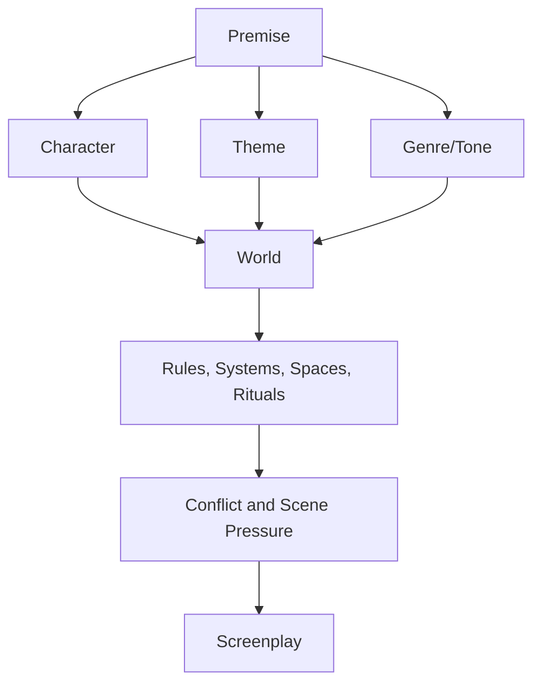

Part ini penting karena dunia cerita yang lemah membuat film terasa generik. Dunia cerita yang terlalu berat membuat film tenggelam dalam penjelasan.

Target kita:

```text
Worldbuilding yang cukup, terlihat, dan berfungsi.
```

---

## 1. Prinsip Kaufman dalam Part Ini

Dalam framework *The First 20 Hours*, kita harus menghindari dua ekstrem:

1. Belajar terlalu banyak teori worldbuilding sampai tidak menulis.
2. Menulis dunia tanpa sistem, sehingga cerita terasa random.

Sub-skill yang perlu dipelajari:

1. Menentukan jenis dunia cerita.
2. Menentukan aturan dunia yang relevan.
3. Membuat worldbuilding terlihat lewat scene.
4. Menghubungkan dunia dengan konflik.
5. Menghubungkan dunia dengan karakter.
6. Menghubungkan dunia dengan genre/tone.
7. Menghindari lore dump.
8. Menentukan batas detail.
9. Mendesain worldbuilding yang feasible secara produksi.
10. Membuat world bible minimal.

Target 20 jam pertama:

```text
Mampu membuat worldbuilding canvas 1–3 halaman yang langsung berguna untuk scene, bukan ensiklopedia 100 halaman.
```

---

## 2. Apa Itu Worldbuilding dalam Film?

Worldbuilding adalah proses mendesain dunia tempat cerita terjadi, termasuk:

- lokasi,
- aturan,
- budaya,
- sistem sosial,
- ekonomi,
- teknologi,
- sejarah,
- relasi kuasa,
- ritual,
- norma,
- bahasa,
- objek,
- suara,
- visual,
- kebiasaan,
- batasan,
- peluang,
- ancaman.

Definisi kerja:

> Worldbuilding film adalah desain lingkungan yang memengaruhi apa yang bisa dilakukan karakter, apa yang tidak bisa dilakukan, apa yang mereka percaya, apa yang mereka takutkan, dan bagaimana konflik terlihat di layar.

Worldbuilding bukan:

```text
Semua sejarah dunia yang penulis tahu.
```

Worldbuilding adalah:

```text
Bagian dunia yang penonton perlu rasakan agar konflik, karakter, dan pilihan menjadi bermakna.
```

---

## 3. Worldbuilding Bukan Lore Dump

Lore adalah informasi tentang dunia.

Worldbuilding adalah pengalaman dunia.

Lore dump:

```text
Di kota ini, sejak tahun 1978, keluarga Raka dikenal karena kasus sertifikat palsu yang melibatkan ayahnya, pejabat lokal, dan jaringan pembeli tanah...
```

Worldbuilding filmik:

```text
Raka masuk warung.

Obrolan berhenti.

Pemilik warung melihat wajahnya, lalu menurunkan foto ayah Raka dari dinding.
```

Informasi yang sama mulai terasa:

- sosial,
- visual,
- emosional,
- konflik.

Prinsip:

```text
Jangan jelaskan dunia. Buat dunia bereaksi.
```

---

## 4. Worldbuilding dalam Film vs Novel vs Game

Worldbuilding di film berbeda dari novel atau game.

| Medium | Worldbuilding Bisa Lewat | Risiko |
|---|---|---|
| Novel | Narasi internal, sejarah, deskripsi panjang | Terlalu banyak prosa |
| Game | Exploration, mechanics, item lore, map | Terlalu luas untuk film |
| Film | Gambar, suara, perilaku, konflik, ruang | Waktu terbatas |
| Series | Episode, subplot, gradual expansion | Bisa melebar |
| Short film | Satu situasi, objek, aturan kecil | Overbuilding |

Film punya durasi terbatas. Jadi dunia harus dirasakan cepat.

Untuk film:

```text
Dunia harus bisa dilihat, didengar, dan memengaruhi tindakan.
```

---

## 5. Prinsip Utama: Enough, Visible, Functional

Tiga prinsip worldbuilding film:

```text
Enough
Visible
Functional
```

### 5.1 Enough

Cukup untuk membuat cerita jelas dan kaya.

Bukan semua yang mungkin.

Pertanyaan:

```text
Apa minimum dunia yang harus diketahui/dirasakan penonton agar konflik bekerja?
```

### 5.2 Visible

Dunia harus terlihat atau terdengar.

Bukan hanya tertulis di notes.

Pertanyaan:

```text
Bagaimana aturan/norma/sejarah dunia ini muncul sebagai aksi, ruang, objek, suara, atau reaksi?
```

### 5.3 Functional

Setiap detail dunia harus punya fungsi.

Fungsi bisa:

- menekan karakter,
- memperjelas stakes,
- menunjukkan tema,
- membuat genre bekerja,
- menciptakan obstacle,
- memberi clue,
- memperkaya relasi,
- mendukung tone,
- membatasi produksi,
- membuat dunia spesifik.

Jika detail tidak punya fungsi, pertimbangkan hapus.

---

## 6. World as Constraint and Affordance

Dunia cerita memberi dua hal:

1. **Constraint** — hal yang membatasi karakter.
2. **Affordance** — hal yang memungkinkan tindakan.

Contoh dunia rumah lama:

| World Detail | Constraint | Affordance |
|---|---|---|
| Ruang kerja terkunci | Raka tidak bisa akses bukti | Kunci menjadi object conflict |
| Tetangga tahu sejarah keluarga | Raka tidak bisa sembunyi sosial | Tetangga bisa memberi clue |
| Rumah atas nama Ibu | Raka tidak bisa menjual sendiri | Ibu punya power |
| Banyak dokumen lama | Informasi berantakan | Mystery bisa dibangun |
| Dina tahu sudut rumah | Raka kalah knowledge lokal | Dina bisa mengakses ruang |
| Rumah bocor saat hujan | Waktu terbatas/kerusakan | Hujan bisa membuka trace |
| Warung dekat rumah | Stigma sosial terlihat | Public reaction exposition |

Worldbuilding bagus menciptakan constraints dan affordances.

Diagram:

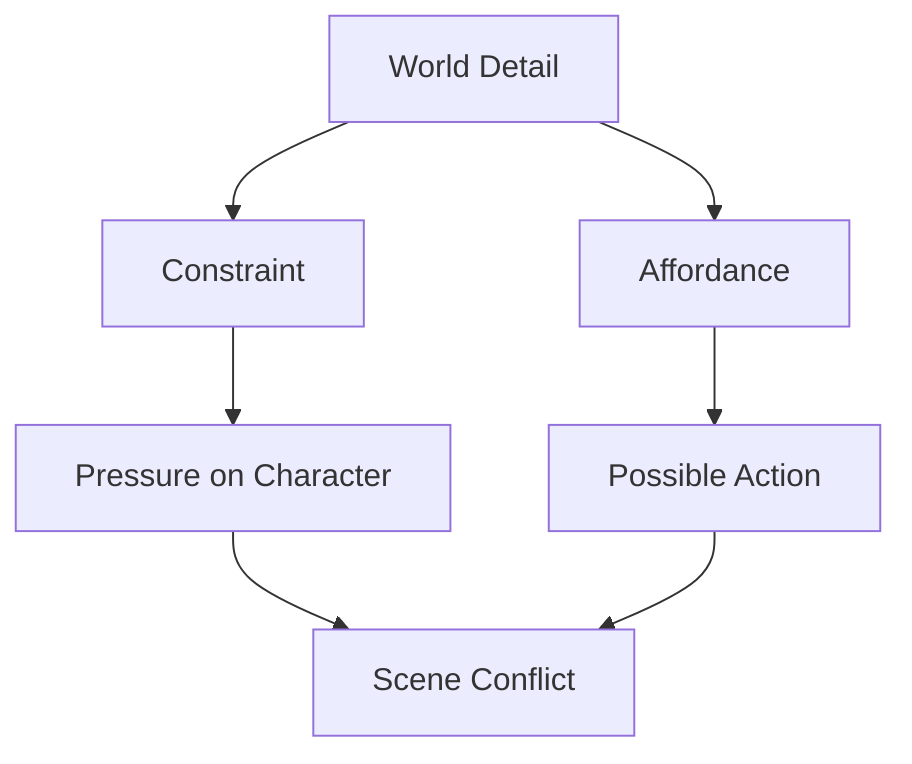

---

## 7. Worldbuilding Harus Menekan Karakter

Dunia bukan wallpaper. Dunia harus menekan karakter.

Contoh:

```text
Karakter: Raka, rasional, ingin menjual rumah cepat.
```

Dunia yang menekan:

- rumah tidak bisa dijual tanpa Ibu,
- warga mengingat dosa ayah,
- ruang kerja terkunci,
- dokumen lama tidak rapi,
- Ibu memakai kunci sebagai liontin,
- Dina memahami rumah lebih baik,
- pembeli tahu masa lalu keluarga,
- aturan sosial membuat konflik tidak bisa dibicarakan langsung.

Setiap elemen dunia menyerang defense Raka:

```text
Raka ingin kontrol teknis.
Dunia memaksanya menghadapi relasi, sejarah, dan rasa bersalah.
```

Ini worldbuilding yang bekerja.

---

## 8. Worldbuilding dan Character

Karakter tidak hidup di ruang netral. Dunia membentuk karakter.

Pertanyaan:

1. Bagaimana dunia ini membesarkan karakter?
2. Apa yang dunia ini ajarkan kepada karakter?
3. Apa yang dunia ini larang?
4. Apa yang dunia ini normalisasi?
5. Apa yang dunia ini buat karakter takuti?
6. Apa yang dunia ini beri sebagai privilege?
7. Apa yang dunia ini ambil dari karakter?
8. Bagaimana karakter menyesuaikan diri?
9. Bagaimana karakter memberontak?
10. Apa hubungan karakter dengan ruang utama?

Contoh:

```text
Raka tumbuh di rumah yang semua konflik dikunci, bukan dibicarakan.
```

Dampak karakter:

- ia menghindari emosi,
- ia memilih dokumen daripada percakapan,
- ia menganggap closure sebagai transaksi,
- ia pulang membawa map, bukan keberanian.

Worldbuilding membentuk flaw.

---

## 9. Character-World Fit

Karakter dan dunia harus saling menguji.

| Karakter | Dunia yang Menguji |
|---|---|
| Orang yang butuh kontrol | Dunia penuh rahasia dan aturan tidak tertulis |
| Orang yang takut intimacy | Dunia yang memaksa kontak keluarga |
| Orang yang menghindari masa lalu | Rumah penuh jejak masa lalu |
| Orang yang ingin kabur | Lokasi dengan deadline dan jalan keluar terbatas |
| Orang yang rasional | Sistem sosial penuh subtext |
| Orang yang sinis | Dunia yang menunjukkan cinta dalam bentuk tidak ideal |
| Orang yang idealis | Sistem kompromi moral |
| Orang yang pemalu | Dunia publik yang mempermalukan |
| Orang yang pembohong | Dunia dengan saksi/objek yang mengingat |

Desain dunia berdasarkan flaw karakter.

---

## 10. Worldbuilding dan Theme

Dunia harus menguji tema.

Theme question:

```text
Apakah keluarga boleh dilindungi dengan kebohongan?
```

Dunia yang cocok:

- rumah dengan banyak ruang terkunci,
- keluarga yang memakai silence sebagai norma,
- masyarakat yang tahu tapi pura-pura tidak tahu,
- dokumen legal yang menutupi moral truth,
- ritual makan yang mengganti percakapan,
- kunci sebagai simbol perlindungan/kontrol,
- birokrasi yang hanya peduli tanda tangan, bukan kebenaran.

Dunia menjadi argument.

Diagram:

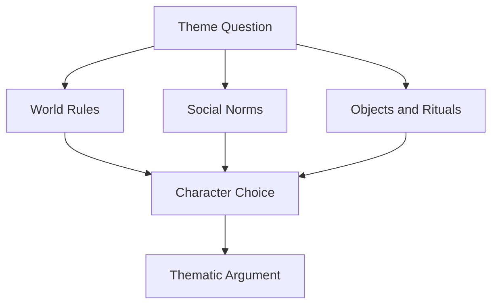

---

## 11. Worldbuilding dan Genre

Genre menentukan worldbuilding mana yang penting.

### Drama

Dunia harus memperlihatkan relasi, luka, rutinitas, dan sejarah emosional.

### Thriller

Dunia harus punya ancaman, sistem, deadline, jalur informasi, dan risiko.

### Horror

Dunia harus punya taboo, rule, threshold, disturbance, dan ruang rasa tidak aman.

### Romance

Dunia harus menciptakan peluang/intimacy sekaligus hambatan.

### Comedy

Dunia harus punya aturan sosial yang bisa dipelintir dan diekspos.

### Mystery

Dunia harus punya clue, hidden history, false surface, dan information hierarchy.

### Satire

Dunia harus punya sistem absurd yang terlihat normal bagi penghuninya.

Genre menentukan layer dunia mana yang harus ditonjolkan.

---

## 12. Worldbuilding dan Tone

Tone menentukan bagaimana dunia terasa.

Contoh rumah lama:

### Melancholic realism

```text
Kursi patah tetap disandarkan rapi. Tidak ada yang membuangnya, tidak ada yang memperbaikinya.
```

### Horror dread

```text
Kursi patah itu berpindah sedikit setiap kali lampu mati.
```

### Dark comedy

```text
Kursi patah diberi tulisan: JANGAN DIDUDUKI KECUALI TAMU YANG TANYA HARGA NEGO.
```

### Thriller

```text
Di bawah kursi patah, ada kamera kecil yang lampunya masih berkedip.
```

Objek sama, tone berbeda.

---

## 13. Worldbuilding Layer

Worldbuilding bisa dipecah menjadi layer.

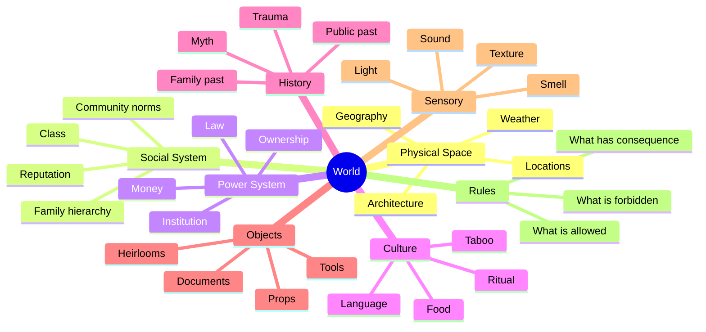

Tidak semua layer harus detail. Pilih layer yang mendukung cerita.

---

## 14. Physical World

Physical world adalah ruang konkret.

Pertanyaan:

1. Lokasi utama apa?
2. Ruang mana yang sering muncul?
3. Ruang mana yang dilarang?
4. Di mana karakter merasa aman?
5. Di mana karakter merasa diawasi?
6. Di mana konflik paling kuat terjadi?
7. Bagaimana cuaca/waktu memengaruhi scene?
8. Apa pintu, jendela, tangga, koridor, meja, kendaraan penting?
9. Apa lokasi yang mahal diproduksi?
10. Apa lokasi yang bisa digabung?

Contoh:

```text
Lokasi utama:
Rumah lama.

Sub-lokasi:
Ruang makan, koridor, ruang kerja ayah, dapur, kamar Raka, teras, halaman.

Forbidden space:
Ruang kerja ayah.

Public pressure space:
Warung depan rumah.

Institution space:
Kantor notaris/kelurahan.

Transit space:
Terminal bus.
```

---

## 15. Spatial Logic

Ruang harus punya logika.

Jika rumah penting, penulis harus tahu:

- pintu masuk,
- ruang makan,
- kamar,
- koridor,
- ruang kerja,
- dapur,
- halaman,
- jendela,
- tempat karakter bisa mendengar,
- tempat karakter bisa bersembunyi,
- tempat objek disimpan.

Tidak harus menjadi blueprint arsitektur detail, tetapi cukup agar scene konsisten.

Contoh simple map:

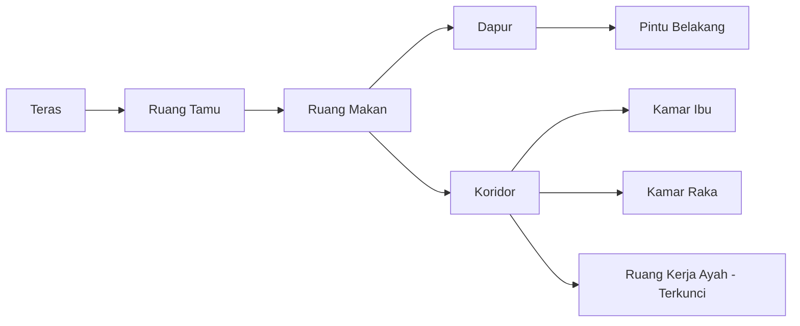

Spatial logic membantu:

- blocking,
- suspense,
- scene continuity,
- production planning.

---

## 16. Location as Character

Lokasi utama bisa berfungsi seperti karakter.

Pertanyaan:

1. Apa “want” lokasi ini secara metaforis?
2. Apa yang lokasi ini simpan?
3. Apa yang lokasi ini tolak?
4. Bagaimana lokasi berubah sepanjang film?
5. Bagaimana karakter berubah dalam relasi dengan lokasi?
6. Apa opening image lokasi?
7. Apa final image lokasi?

Contoh rumah:

```text
Opening:
Rumah tertutup, jendela berdebu, kunci di leher Ibu.

Midpoint:
Ruang kerja terbuka sebagian; rumah mulai “berbicara”.

Climax:
Semua masuk ruang kerja dan rahasia keluar.

Final:
Pintu depan terbuka, tapi tidak ada yang buru-buru pergi.
```

Lokasi punya arc.

---

## 17. Social World

Social world adalah hubungan manusia dan norma.

Pertanyaan:

1. Siapa yang dihormati?
2. Siapa yang dikucilkan?
3. Apa yang dianggap memalukan?
4. Apa yang tidak boleh dibicarakan?
5. Apa bahasa sopan yang menutupi konflik?
6. Apa reputasi keluarga?
7. Siapa yang mengawasi?
8. Siapa yang punya kuasa informal?
9. Apa ritual sosial?
10. Bagaimana orang luar melihat protagonist?

Contoh:

```text
Warga kampung tidak pernah menyebut kasus ayah secara langsung.
Mereka hanya memakai julukan: "rumah segel".
```

Social world memberi pressure.

---

## 18. Power System

Power system menjawab:

```text
Siapa bisa membuat siapa melakukan apa?
```

Power bisa berasal dari:

- uang,
- hukum,
- usia,
- gender,
- informasi,
- status keluarga,
- reputasi,
- dokumen,
- kepemilikan,
- kekerasan,
- rasa bersalah,
- akses ke ruang,
- akses ke teknologi,
- hubungan dengan pejabat,
- kontrol narasi.

Contoh rumah lama:

| Power Source | Pemegang | Dampak |
|---|---|---|
| Legal ownership | Ibu | Raka tidak bisa jual tanpa Ibu |
| Kunci ruang kerja | Ibu lalu Dina | Akses rahasia dikontrol |
| Uang/utang | Raka/pembeli | Deadline ekonomi |
| Informasi masa lalu | Ibu/pembeli | Moral pressure |
| Reputasi sosial | Warga | Shame pressure |
| Local knowledge | Dina | Raka kalah di rumah sendiri |
| Dokumen lama | Ruang kerja | Truth as threat |

Power map:

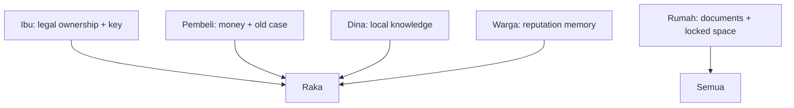

---

## 19. Economic World

Ekonomi sering menjadi pressure kuat.

Pertanyaan:

1. Siapa butuh uang?
2. Siapa punya aset?
3. Siapa punya utang?
4. Apa harga rumah/barang/status?
5. Apa yang bisa dibeli?
6. Apa yang tidak bisa dibeli?
7. Apa yang dijual karakter secara moral?
8. Apa sumber penghasilan?
9. Apa biaya diam?
10. Apa biaya kebenaran?

Contoh:

```text
Raka ingin menjual rumah bukan hanya karena benci masa lalu, tetapi karena apartemennya di kota hampir disita.
```

Ekonomi membuat conflict tangible.

Namun jangan membuat ekonomi hanya angka. Buat dampaknya terlihat.

```text
Raka tidak membayar obat Ibu, tetapi membayar appraisal rumah.
```

Itu worldbuilding ekonomi + karakter.

---

## 20. Legal/Bureaucratic World

Jika cerita melibatkan dokumen, warisan, tanah, institusi, buat sistemnya cukup jelas.

Pertanyaan:

1. Dokumen apa yang penting?
2. Siapa yang berwenang?
3. Apa proses yang menghambat?
4. Apa aturan minimum yang perlu diketahui penonton?
5. Apa konsekuensi jika aturan dilanggar?
6. Apa celah sistem?
7. Siapa yang memanfaatkan celah?
8. Apa simbol birokrasi: stempel, map, nomor antrean, tanda tangan?
9. Bagaimana bahasa birokrasi menutupi kekerasan emosional?
10. Bagaimana sistem legal bertabrakan dengan kebenaran moral?

Contoh scene:

```text
PETUGAS
Kolom ayah tidak boleh kosong.

RAKA
Dia mati.

PETUGAS
Di sistem belum.
```

Ini worldbuilding birokrasi yang dramatik.

---

## 21. Cultural World

Cultural world meliputi:

- bahasa,
- ritual,
- makanan,
- panggilan,
- sopan santun,
- tabu,
- agama/kepercayaan jika relevan,
- adat,
- keluarga,
- tetangga,
- rasa malu,
- konsep pulang/pergi,
- cara meminta maaf,
- cara menghindari konflik.

Dalam konteks Indonesia, banyak konflik kuat muncul dari:

```text
Tidak enak.
Sungkan.
Jaga nama keluarga.
Apa kata orang.
Yang tua harus dihormati.
Yang muda harus tahu diri.
Sudah makan?
Pulang dulu.
Jangan bahas di meja makan.
```

Gunakan budaya sebagai sistem tekanan, bukan dekorasi.

---

## 22. Language World

Bahasa dunia cerita meliputi:

- register formal/informal,
- campuran bahasa daerah,
- jargon profesi,
- eufemisme,
- istilah keluarga,
- panggilan,
- kata tabu,
- istilah sistem,
- bahasa resmi,
- bahasa pasar,
- bahasa rumah.

Contoh:

```text
Raka memakai bahasa legal:
"validasi", "sertifikat", "aset", "deadline".

Ibu memakai bahasa rumah:
"pulang", "makan", "kunci", "pintu".

Dina memakai bahasa luka:
"Kakak bawa map. Aku kira bawa kangen."
```

Worldbuilding bahasa membuat karakter dan dunia terasa spesifik.

---

## 23. Ritual World

Ritual adalah tindakan berulang yang menunjukkan aturan dunia.

Contoh ritual:

- Ibu mengunci ruang kerja setiap malam.
- Dina mengecek pintu belakang sebelum tidur.
- Warga menurunkan suara saat melewati rumah.
- Raka membersihkan sepatu sebelum masuk, tetapi tidak melepasnya.
- Ibu menyiapkan piring untuk orang yang tidak makan.
- Pembeli selalu menelepon jam sembilan.
- Notaris selalu menstempel sebelum membaca.

Ritual memberi worldbuilding tanpa exposition.

Template:

```text
Ritual:
Who performs it:
When:
Visible action:
Hidden meaning:
How it changes by the end:
```

---

## 24. Taboo

Taboo adalah hal yang tidak boleh dilakukan/dibicarakan.

Taboo menciptakan tension.

Contoh taboo:

- Jangan sebut nama ayah di meja makan.
- Jangan buka ruang kerja setelah magrib.
- Jangan duduk di kursi ayah.
- Jangan tanya sertifikat di depan Dina.
- Jangan bawa orang luar ke rumah.
- Jangan panggil Ibu dengan nama asli.
- Jangan buka laci ketiga.

Taboo harus punya konsekuensi.

Jika taboo dilanggar dan tidak terjadi apa-apa, penonton tidak percaya.

---

## 25. Rule and Consequence

World rules harus punya consequence.

Template rule:

```text
Rule:
Who believes it:
Who enforces it:
What happens if broken:
How audience learns:
How protagonist tests it:
How rule changes/reveals:
```

Contoh:

```text
Rule:
Ruang kerja ayah tidak boleh dibuka.

Who believes it:
Ibu, Dina sebagian.

Who enforces it:
Ibu melalui kunci dan rasa bersalah.

What happens if broken:
Dokumen lama keluar; reputasi dan legal risk terbuka.

How audience learns:
Raka melihat pintu tersegel dan Ibu bereaksi keras.

How protagonist tests it:
Raka mencoba mengambil kunci.

How rule changes/reveals:
Larangan bukan mistik, tetapi moral/legal containment.
```

Rule membuat dunia konsisten.

---

## 26. Worldbuilding dan Exposition

Worldbuilding harus disampaikan seperti Part 015:

- lewat konflik,
- lewat objek,
- lewat reaction,
- lewat consequence,
- lewat ritual,
- lewat setting,
- lewat absence,
- lewat language.

Jangan membuka film dengan world explanation panjang.

Buruk:

```text
Rumah keluarga Raka sudah lama menjadi simbol kebohongan yang disembunyikan oleh ibunya sejak kasus sertifikat palsu...
```

Lebih filmik:

```text
Raka memasang papan DIJUAL.

Dari dalam rumah, Ibu membuka jendela.

Ia tidak menatap Raka.

Ia menatap papan itu.

Lalu menutup jendela lagi.
```

Worldbuilding + conflict + character.

---

## 27. Worldbuilding dan Object System

Objek penting dalam dunia film:

- kunci,
- map dokumen,
- sertifikat,
- piring retak,
- foto keluarga,
- koper,
- sandal,
- kursi,
- jam mati,
- tape recorder,
- stempel,
- liontin,
- kartu identitas,
- obat,
- telepon,
- pintu,
- jendela.

Objek harus punya lifecycle.

Template:

```text
Object:
First appearance:
Owner:
Meaning at first:
Function:
Meaning change:
Conflict involving object:
Payoff:
Final state:
```

Contoh:

```text
Object:
Kunci ruang kerja.

First appearance:
Di leher Ibu sebagai liontin.

Owner:
Ibu.

Meaning at first:
Rahasia, kontrol, ritual.

Function:
Membatasi akses ke ruang kerja.

Meaning change:
Dari perlindungan menjadi beban; dari kuasa Ibu menjadi tanggung jawab Dina/Raka.

Conflict:
Raka ingin mengambil, Ibu menolak, Dina menjadi penjaga.

Payoff:
Kunci membuka ruang saat karakter siap menghadapi kebenaran.

Final state:
Digantung di pintu terbuka, bukan di leher siapa pun.
```

---

## 28. Object Network

Objek bisa saling terhubung.

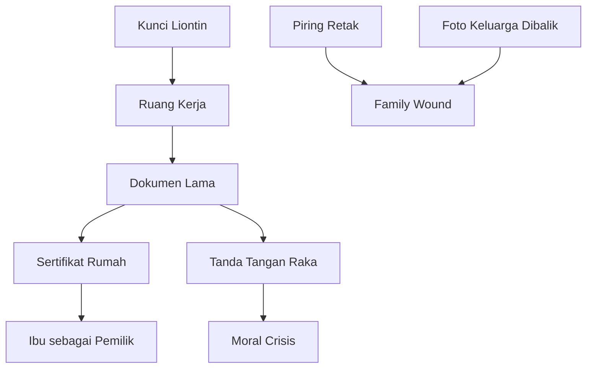

Object network membantu setup/payoff.

---

## 29. Sensory World

Film adalah pengalaman sensorik.

Pertanyaan:

1. Apa suara dunia ini?
2. Apa tekstur dunia ini?
3. Apa bau yang bisa diimplikasikan?
4. Apa cahaya khas?
5. Apa warna dominan?
6. Apa ritme ruang?
7. Apa suara yang membuat karakter tegang?
8. Apa silence yang penting?
9. Apa sound motif?
10. Apa visual motif?

Contoh rumah lama:

- suara genteng bocor,
- sendok di piring,
- kipas tua berdecit,
- pintu ruang kerja mengembang karena lembap,
- aroma obat gosok,
- radio tetangga,
- jam mati,
- hujan,
- kertas lembap,
- sandal diseret.

Sensory detail membuat dunia hidup.

---

## 30. Sound World

Sound world sangat penting untuk film.

Contoh sound motif:

```text
Kunci menyentuh piring.
Pintu ruang kerja berderit.
Hujan di genteng.
Telepon pembeli bergetar.
Radio dapur memutar berita lama.
Stempel notaris.
Sendok berhenti.
```

Sound bisa memberi worldbuilding:

- rumah tua,
- birokrasi,
- domestic pressure,
- time pressure,
- threat.

Template:

```text
Sound:
Source:
When appears:
Meaning:
Variation:
Payoff:
```

---

## 31. Visual World

Visual world mencakup:

- ruang,
- warna,
- cahaya,
- tekstur,
- kostum,
- properti,
- framing implication,
- benda berulang,
- tanda visual,
- keadaan lingkungan.

Contoh visual rules:

```text
Raka selalu terlihat dekat pintu.
Ibu selalu dekat meja makan.
Dina sering berada di koridor antara ruang makan dan ruang kerja.
Kunci selalu berada di tubuh seseorang, bukan di laci.
Dokumen selalu basah/lembap/terlipat, tidak pernah bersih.
```

Visual world membantu character blocking.

---

## 32. Costume World

Kostum mengungkap relasi dengan dunia.

Contoh:

```text
Raka:
Kemeja kantor, sepatu bersih, jam mahal, selalu terlihat seperti baru mampir.

Ibu:
Daster rapi, cardigan lama, kunci sebagai liontin, sandal rumah.

Dina:
Kaos lama Raka, celana pendek, noda cat, rambut diikat asal.

Pembeli:
Batik licin, sepatu yang tidak dilepas saat masuk rumah.
```

Kostum menunjukkan:

- status,
- belonging,
- jarak,
- power,
- disrespect,
- history.

---

## 33. Technology World

Dunia modern punya teknologi.

Pertanyaan:

1. Apakah karakter memakai chat?
2. Apakah ada CCTV?
3. Apakah dokumen digital?
4. Apakah arsip analog atau online?
5. Apakah sinyal buruk?
6. Apakah ponsel menjadi alat konflik?
7. Apakah voice note penting?
8. Apakah teknologi mempercepat atau menghambat?
9. Apakah protagonist terlalu bergantung pada teknologi?
10. Apakah dunia tua/baru bertabrakan?

Contoh:

```text
Raka ingin semua scan dokumen.
Ibu hanya percaya map fisik.
Dina memotret dokumen diam-diam.
Pembeli mengirim PDF kontrak jam 02.13.
```

Teknologi menjadi worldbuilding generasi.

---

## 34. Time World

Waktu dalam dunia cerita:

- musim,
- jam,
- deadline,
- hari besar,
- malam/pagi,
- jam makan,
- jam kantor,
- jam ibadah,
- jadwal bus,
- jadwal notaris,
- jam obat,
- tanggal kejadian lama.

Time world memberi pressure.

Contoh:

```text
Film terjadi dari sore hingga pagi sebelum pembeli datang.
```

Dampak:

- contained,
- urgent,
- hujan malam bisa menjadi motif,
- ritual makan malam/pagi bekerja,
- deadline jelas.

Time map:

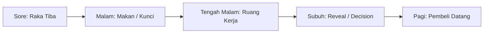

---

## 35. Historical World

Sejarah dunia cerita bisa:

- sejarah keluarga,
- sejarah rumah,
- sejarah kota,
- sejarah kasus,
- sejarah hubungan,
- sejarah trauma,
- sejarah institusi.

Namun tidak semua sejarah perlu diceritakan.

Gunakan **trace**.

Contoh:

```text
Bekas stiker partai di pagar.
Map tahun 2003.
Foto ayah dengan pejabat yang wajahnya dipotong.
Kalender berhenti di tanggal penangkapan.
```

Trace memberi sejarah visual.

---

## 36. Political/Systemic World

Jika cerita menyentuh sistem politik/sosial, worldbuilding harus spesifik tapi tidak ceramah.

Pertanyaan:

1. Sistem apa yang dikritik?
2. Bagaimana sistem hadir dalam kehidupan karakter?
3. Apa bahasa resmi sistem?
4. Apa eufemisme sistem?
5. Siapa korban sistem?
6. Siapa yang diuntungkan?
7. Bagaimana karakter menjadi bagian dari sistem?
8. Apa ritual sistem?
9. Apa dokumen/stempel/ruang sistem?
10. Apa ironi sistem?

Contoh satire birokrasi:

```text
Papan di kantor kelurahan:
PELAYANAN CEPAT, TEPAT, HUMANIS

Di bawahnya, warga tua tidur memegang nomor antrean 003.
Layar menunjukkan: 002.
```

Worldbuilding sistem lewat visual irony.

---

## 37. Institutional World

Institutional world bisa berupa:

- kantor,
- sekolah,
- rumah sakit,
- polisi,
- pengadilan,
- kantor kelurahan,
- perusahaan,
- pesantren,
- kampus,
- terminal,
- rumah produksi,
- bandara.

Setiap institusi punya:

- aturan,
- hierarki,
- bahasa,
- ruang,
- seragam,
- ritual,
- dokumen,
- gatekeeper,
- jam operasional,
- konsekuensi.

Jangan menulis institusi sebagai background generik. Pilih detail yang menekan cerita.

---

## 38. Family World

Untuk drama keluarga, keluarga adalah dunia.

Layer family world:

- struktur kuasa,
- panggilan,
- ritual makan,
- taboo,
- kamar/ruang,
- benda warisan,
- kebiasaan konflik,
- siapa bicara untuk siapa,
- siapa diam,
- siapa pergi,
- siapa menunggu,
- siapa menyimpan benda,
- siapa mengatur uang,
- siapa punya kunci,
- siapa tahu rahasia.

Template family world:

```text
Family Name:
Public Reputation:
Private Rule:
Taboo:
Ritual:
Power Holder:
Scapegoat:
Absent Presence:
Main Object:
Main Room:
Main Lie:
Main Wound:
What outsiders think:
What is actually true:
```

---

## 39. Micro-World

Film pendek sering lebih cocok dengan micro-world.

Micro-world adalah dunia kecil dengan aturan kuat.

Contoh:

- satu ruang tunggu terminal,
- satu meja makan,
- satu lift,
- satu mobil,
- satu warung,
- satu kamar rumah sakit,
- satu ruang arsip,
- satu backstage,
- satu dapur.

Micro-world harus punya:

- batas ruang,
- aturan sosial,
- objective,
- pressure,
- object,
- turning point.

Contoh micro-world:

```text
Meja makan keluarga.
Rule: nama ayah tidak disebut.
Object: kunci di leher Ibu.
Pressure: pembeli datang besok.
Taboo: ruang kerja.
Ritual: Ibu menyendok nasi untuk semua orang.
Conflict: Raka ingin kunci.
```

Satu meja makan bisa menjadi dunia lengkap.

---

## 40. Worldbuilding untuk Film Pendek

Film pendek tidak punya ruang untuk worldbuilding luas.

Prinsip:

```text
Satu dunia kecil.
Satu aturan utama.
Satu objek utama.
Satu taboo.
Satu pressure.
Satu reveal.
```

Template short film world:

```text
Main location:
Main rule:
Main object:
Main ritual:
Main taboo:
Main pressure:
What audience sees first:
What changes by final image:
```

Contoh:

```text
Main location:
Terminal bus malam.

Main rule:
Orang yang sudah naik bus tidak boleh turun setelah pintu ditutup.

Main object:
Koper kecil.

Main ritual:
Pengumuman keberangkatan terakhir.

Main taboo:
Jangan buka koper di terminal.

Main pressure:
Bus terakhir berangkat 10 menit lagi.

What audience sees first:
Perempuan duduk dengan koper yang bukan miliknya.

What changes by final image:
Ia membiarkan bus pergi dan membuka koper.
```

Cukup untuk short.

---

## 41. Worldbuilding untuk Feature

Feature butuh dunia lebih luas, tetapi tetap terkontrol.

Gunakan concentric world:

```text
Core world:
Rumah keluarga.

Secondary world:
Warung/tetangga.

Institution world:
Notaris/kelurahan.

External pressure world:
Pembeli/utang/kota.

Memory world:
Ruang kerja ayah/dokumen lama.
```

Diagram:

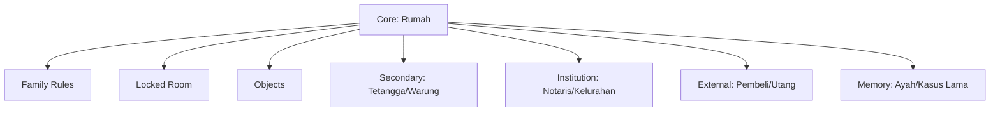

Setiap world layer harus terhubung ke core conflict.

---

## 42. World Scope

Scope menentukan seberapa luas dunia.

| Scope | Cocok untuk |
|---|---|
| Single room | short, contained drama, comedy, thriller |
| Single house | family drama, horror, mystery |
| Neighborhood | social drama, coming-of-age, satire |
| City slice | thriller, romance, ensemble |
| Institution | workplace, legal, medical, school |
| Country/system | political drama, satire, epic |
| Speculative world | sci-fi/fantasy |

Untuk project awal, pilih scope kecil dengan depth tinggi.

```text
Small world, deep pressure.
```

Lebih baik daripada:

```text
Huge world, shallow scenes.
```

---

## 43. World Detail Budget

Setiap detail dunia memakai “budget” perhatian penonton.

Jangan memperkenalkan terlalu banyak:

- nama tempat,
- aturan,
- sejarah,
- karakter sampingan,
- istilah,
- institusi,
- dokumen,
- konflik sosial.

Gunakan detail budget:

```text
1–2 lokasi utama.
1 taboo.
1 object utama.
1 social rule.
1 economic pressure.
1 institutional obstacle.
1 hidden history.
```

Untuk film pendek, lebih sedikit lagi.

---

## 44. Worldbuilding dan Production Budget

Worldbuilding harus bisa diproduksi.

Pertanyaan:

1. Berapa lokasi?
2. Lokasi mana sulit izin?
3. Perlu crowd?
4. Perlu kendaraan?
5. Perlu periode historis?
6. Perlu VFX?
7. Perlu properti khusus?
8. Perlu costume banyak?
9. Perlu set dressing kompleks?
10. Bisa diganti dengan detail murah tapi kuat?

Contoh mahal:

```text
Membuka dunia kasus tanah nasional dengan demonstrasi ribuan orang.
```

Versi contained:

```text
Satu warga tua datang ke rumah membawa sertifikat lusuh dan tidak mau duduk.
```

Fungsi sosial tetap ada, biaya turun.

---

## 45. Production-Aware Worldbuilding

Prinsip:

```text
Build the world through reusable locations, recurring objects, sound, and behavior.
```

Murah tapi kuat:

- satu rumah,
- satu kunci,
- satu map,
- satu piring retak,
- satu radio,
- satu panggilan telepon,
- satu warung,
- satu kantor kecil,
- satu hujan malam,
- satu final image.

Mahal:

- banyak lokasi publik,
- crowd besar,
- periode sejarah,
- kendaraan action,
- VFX dunia besar,
- set besar yang hanya dipakai sekali.

Worldbuilding yang baik sering bukan banyak, tapi konsisten.

---

## 46. Worldbuilding dan Set Dressing

Set dressing adalah detail fisik ruang.

Contoh rumah lama:

```text
- Foto keluarga dengan wajah ayah paling bersih.
- Kalender tua berhenti di bulan tertentu.
- Piring retak masih dipakai.
- Kursi tamu yang dilapisi plastik.
- Map dokumen di atas lemari.
- Kunci kecil di leher Ibu.
- Rak sepatu tanpa sandal Raka.
- Jam dinding mati.
- Pintu ruang kerja dengan bekas segel.
```

Setiap detail harus punya fungsi.

Jangan mengisi ruang dengan random vintage aesthetic.

---

## 47. Worldbuilding dan Props List

Buat props list dramatik, bukan hanya produksi.

| Prop | Function | Owner | First Appearance | Payoff |
|---|---|---|---|---|
| Kunci | Akses rahasia/power | Ibu/Dina | Makan malam | Membuka ruang kerja |
| Map penjualan | Raka sebagai transaksi | Raka | Opening | Ditolak/digunakan ulang |
| Piring retak | Keluarga rusak dipertahankan | Ibu | Ruang makan | Pecah/dirawat |
| Sertifikat | Legal truth | Ruang kerja | Midpoint | Moral crisis |
| Foto keluarga | Public memory | Rumah/warung | Early | Dibalik/dibuka |
| Obat Ibu | Care neglected | Ibu/Raka | Act 2 | Raka memilih merawat |
| Tape recorder | Voice of past | Ayah | Midpoint | Reveal incomplete |

Props = worldbuilding + plot + theme.

---

## 48. Worldbuilding dan Continuity

Worldbuilding harus konsisten.

Checklist continuity:

- Siapa punya kunci?
- Pintu mana terkunci?
- Dokumen ada di mana?
- Siapa tahu aturan apa?
- Jam berapa pembeli datang?
- Apakah hujan berlanjut?
- Piring retak masih ada?
- Apakah Raka melepas sepatu?
- Apakah Dina sudah tahu ruang kerja?
- Apakah Ibu sudah minum obat?
- Apakah warga tahu kasus?

Inconsistency membuat dunia terasa palsu.

---

## 49. World Bible Minimal

World bible adalah dokumen internal dunia cerita.

Untuk 20 jam pertama, cukup 3–5 halaman.

Isi minimal:

```text
1. World premise
2. Core locations
3. Key rules
4. Social norms
5. Power map
6. Key objects
7. Timeline/history
8. Sensory palette
9. Language/register
10. Production constraints
```

Jangan buat world bible 100 halaman sebelum punya cerita.

---

## 50. World Bible Template

```text
# World Bible Minimal

## 1. World Premise
Film ini terjadi di dunia seperti apa?

## 2. Genre/Tone World
Primary genre:
Tone:
World feeling:

## 3. Core Locations
Location 1:
Function:
Rules:
Visual details:
Sound details:
Conflict potential:

Location 2:
Function:
Rules:
Visual details:
Sound details:
Conflict potential:

## 4. Social Rules
Rule:
Who enforces it:
Consequence if broken:

## 5. Power Map
Who has legal power:
Who has money power:
Who has information power:
Who has emotional power:
Who has spatial power:

## 6. Key Objects
Object:
Owner:
Meaning:
Plot function:
Payoff:

## 7. History / Timeline
Public history:
Private history:
Hidden truth:
Trace visible in present:

## 8. Sensory Palette
Sounds:
Textures:
Colors:
Light:
Weather:
Repeated images:

## 9. Language
Formal register:
Home register:
Taboo words:
Repeated phrases:
Character-specific vocabulary:

## 10. Production Notes
Locations to limit:
Props needed:
Crowd risk:
Night shoot:
Special effects:
Low-cost alternatives:
```

---

## 51. Contoh World Bible Minimal: “Kunci di Leher Ibu”

```text
## 1. World Premise
Cerita terjadi di rumah lama keluarga Raka, satu malam sebelum rumah itu hendak dijual. Rumah bukan hanya properti; ia adalah arsip kebohongan keluarga.

## 2. Genre/Tone World
Primary genre:
Family drama.

Secondary genre:
Mystery thriller.

Tone:
Melankolis, restrained, tegang, dengan humor pahit dari Dina.

World feeling:
Rumah terasa terlalu penuh untuk tempat yang hampir kosong.

## 3. Core Locations
Rumah lama:
Function:
Core world, family wound, locked secrets.

Rules:
Nama ayah tidak disebut di meja makan.
Ruang kerja tidak dibuka.
Sepatu dilepas, kecuali pembeli.

Visual:
Piring retak, foto dibalik, kunci liontin, kalender mati.

Sound:
Hujan, sendok, pintu ruang kerja, radio dapur.

Conflict:
Raka ingin jual; Ibu ingin menjaga; Dina ingin tahu.

Warung depan:
Function:
Public memory/social pressure.

Rule:
Orang tidak menyebut kasus langsung.

Visual:
Foto ayah pernah tergantung tapi diturunkan saat Raka datang.

Notaris:
Function:
Institutional obstacle.

Rule:
Tanda tangan Ibu required.

Visual:
Stempel, map, nomor antrean, lampu neon.
```

---

## 52. Worldbuilding dan Timeline

Timeline membantu konsistensi.

Template:

```text
Tahun - Event - Who knows - Trace in present - Dramatic payoff
```

Contoh:

| Tahun | Event | Who Knows | Trace | Payoff |
|---|---|---|---|---|
| 2003 | Dokumen palsu dibuat | Ibu, ayah, pembeli | Map lama | Midpoint reveal |
| 2008 | Raka menandatangani surat tanpa tahu | Ibu, pembeli | Surat kuasa | Moral crisis |
| 2011 | Kasus ayah terbuka | Warga | Foto diturunkan | Public shame |
| 2016 | Raka pergi | Ibu, Dina | Kamar berhenti berubah | Character wound |
| Sekarang | Raka pulang jual rumah | Semua | Map penjualan | Main conflict |

Tidak semua masuk ke film. Timeline untuk penulis.

---

## 53. Public History vs Private History

Public history:

```text
Apa yang masyarakat tahu/percaya?
```

Private history:

```text
Apa yang keluarga tahu?
```

Hidden truth:

```text
Apa yang sebenarnya terjadi?
```

Contoh:

```text
Public history:
Ayah Raka terlibat kasus sertifikat palsu.

Private history:
Ibu menyimpan dokumen untuk melindungi anak-anak.

Hidden truth:
Raka pernah menandatangani surat yang membantu kasus itu, tanpa tahu akibatnya.
```

Konflik muncul dari perbedaan versi.

---

## 54. Myth vs Fact

Dalam beberapa genre, dunia punya myth.

Horror:

```text
Jangan buka ruang kerja setelah magrib.
```

Fact:

```text
Bukan hantu, tapi setiap malam pembeli mengirim ancaman karena tahu Ibu sendirian.
```

Atau supernatural:

```text
Ruang itu memang menyimpan kehadiran ayah.
```

Drama:

```text
Myth keluarga: Ayah berkorban untuk keluarga.
Fact: Ayah mengorbankan orang lain.
```

Mystery:

```text
Myth: Ibu korban.
Fact: Ibu pelindung dan pelaku pasif.
```

Myth memberi tension.

---

## 55. Worldbuilding dan Belief System

Dunia punya belief.

Pertanyaan:

1. Apa yang dianggap benar oleh dunia ini?
2. Apa yang dianggap memalukan?
3. Apa yang dianggap sukses?
4. Apa yang dianggap dosa?
5. Apa yang dianggap loyal?
6. Apa yang dianggap pengkhianatan?
7. Apa yang dianggap dewasa?
8. Apa yang dianggap pulang?
9. Apa yang dianggap keluarga?

Contoh belief family world:

```text
Keluarga yang baik tidak membuka aib ke luar.
```

Protagonist challenge:

```text
Apakah menutup aib berarti melindungi atau memperpanjang kejahatan?
```

Belief system menghidupkan tema.

---

## 56. Worldbuilding dan Norm Violation

Drama sering mulai ketika norma dunia dilanggar.

Contoh norms:

```text
Jangan jual rumah tanpa bicara Ibu.
Jangan sebut ayah di meja makan.
Jangan buka ruang kerja.
Jangan bawa orang luar.
Jangan tanya sertifikat.
```

Protagonist melanggar:

```text
Raka datang membawa pembeli.
```

Akibat:

- Ibu menolak,
- Dina curiga,
- warga bereaksi,
- ruang kerja menjadi penting.

Norm violation mengaktifkan plot.

---

## 57. Worldbuilding dan Threshold

Threshold adalah batas yang jika dilewati, dunia berubah.

Contoh threshold:

- pagar rumah,
- pintu ruang kerja,
- meja makan,
- kantor notaris,
- terminal bus,
- laci ketiga,
- jam sembilan,
- tanda tangan,
- kunci berpindah tangan.

Threshold punya kekuatan dramatik.

Template:

```text
Threshold:
What it separates:
Who can cross:
What happens when crossed:
First crossing:
Final crossing:
```

Contoh:

```text
Threshold:
Pintu ruang kerja ayah.

Separates:
Rumah sebagai tempat tinggal vs rumah sebagai arsip kejahatan.

Who can cross:
Ibu secara ritual, nanti Raka/Dina.

What happens:
Rahasia legal/moral keluar.

First crossing:
Raka mencoba tanpa izin.

Final crossing:
Keluarga masuk bersama dan memilih membuka kebenaran.
```

---

## 58. Worldbuilding dan Boundary Object

Boundary object adalah objek yang menghubungkan dunia berbeda.

Contoh:

```text
Map penjualan rumah.
```

Menghubungkan:

- dunia kota Raka,
- dunia legal,
- dunia rumah,
- dunia ekonomi,
- dunia keluarga.

```text
Kunci.
```

Menghubungkan:

- tubuh Ibu,
- ruang kerja ayah,
- rahasia,
- Dina,
- final truth.

Boundary object membuat world layer bertemu.

---

## 59. Worldbuilding dan Symbol System

Simbol muncul dari dunia, bukan ditempel.

Contoh symbol system:

```text
Pintu = batas bicara.
Kunci = kuasa menyimpan/membuka.
Piring = keluarga yang retak tapi dipakai.
Map = upaya mengubah luka menjadi transaksi.
Hujan = sesuatu yang bocor dari masa lalu.
Radio = dunia luar yang terus bicara saat keluarga diam.
```

Jangan terlalu eksplisit. Biarkan simbol bekerja melalui repetition.

---

## 60. Worldbuilding dan Repetition with Variation

Ulangi detail dunia dengan perubahan makna.

Contoh kunci:

1. Kunci di leher Ibu.
2. Raka melihat kunci.
3. Ibu menyentuh kunci saat takut.
4. Kunci berpindah ke Dina.
5. Dina menggunakan kunci.
6. Kunci digantung di pintu terbuka.

Setiap repetition menunjukkan perubahan power.

Contoh meja makan:

1. Meja sebagai tempat menghindari konflik.
2. Meja sebagai arena konfrontasi.
3. Meja sebagai tempat dokumen dibuka.
4. Meja sebagai tempat makan tanpa rahasia.

World detail punya arc.

---

## 61. Worldbuilding dan Scene

Setiap scene harus memakai dunia, bukan hanya terjadi di dunia.

Template scene-world:

```text
Scene:
Location:
World rule active:
Object active:
Social pressure:
Sensory detail:
How world pressures objective:
How scene changes world:
```

Contoh:

```text
Scene:
Raka meminta kunci.

Location:
Ruang makan.

World rule active:
Nama ayah tidak disebut di meja makan.

Object active:
Kunci liontin, map penjualan, piring retak.

Social pressure:
Dina hadir sebagai saksi keluarga.

Sensory detail:
Sendok berhenti, hujan, radio pelan.

How world pressures objective:
Raka tidak bisa bicara langsung tanpa melanggar taboo.

How scene changes world:
Kunci berpindah dari Ibu ke Dina.
```

---

## 62. Worldbuilding dan Scene Transition

Dunia bisa menghubungkan scene.

Contoh transition:

```text
Kunci jatuh ke tangan Dina.

CUT TO:

Stempel notaris jatuh ke kertas.
```

Makna:

- object/power di rumah terhubung dengan sistem legal.

Atau:

```text
Suara hujan di rumah.

MATCH TO:

Air menetes dari plafon kantor kelurahan.
```

Dunia terasa menyatu.

---

## 63. Worldbuilding dan Conflict Escalation

Dunia harus ikut berubah saat konflik naik.

Act/sequence progression:

| Phase | World State |
|---|---|
| Setup | Rumah tertutup, aturan diam bekerja |
| Disruption | Raka membawa map/pembeli |
| Act 2 early | Ruang, dokumen, warga mulai memberi clue |
| Midpoint | Legal truth membalik asumsi |
| Escalation | Dunia luar masuk ke rumah |
| Crisis | Rumah tidak bisa lagi menahan rahasia |
| Climax | Forbidden space dibuka |
| Resolution | Dunia punya aturan baru |

World state berubah bersama story state.

Diagram:

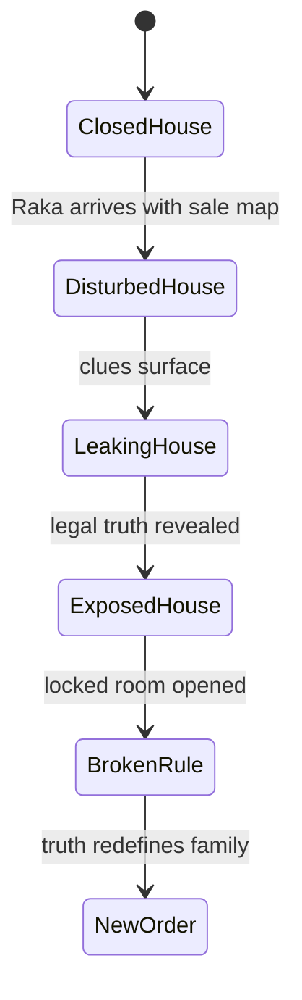

---

## 64. Worldbuilding dan Antagonistic System

World bisa menjadi antagonis.

Contoh:

```text
Bukan satu villain, tapi sistem:
- hukum warisan,
- reputasi kampung,
- utang kota,
- rahasia keluarga,
- pembeli lama,
- birokrasi,
- norma diam.
```

Setiap sistem menekan Raka dari arah berbeda.

Antagonistic system map:

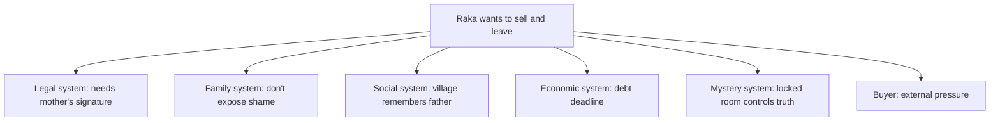

Worldbuilding menciptakan opposition network.

---

## 65. Worldbuilding dan Agency

World tidak boleh membuat karakter sepenuhnya pasif.

Jika dunia terlalu kuat dan karakter hanya dihantam, cerita lemah.

Karakter harus bisa:

- mencoba melanggar aturan,
- mencari celah,
- memakai objek,
- memanipulasi norma,
- membayar harga,
- mengubah relasi dengan dunia.

Contoh:

```text
Raka tidak bisa menjual tanpa Ibu.
```

Agency:

- ia mencoba notaris,
- mencoba mengambil kunci,
- mencoba membujuk Dina,
- mencoba mencari salinan dokumen,
- akhirnya memilih membuka kebenaran daripada transaksi.

World memberi constraint; karakter tetap bertindak.

---

## 66. Worldbuilding dan Mystery Logic

Jika dunia punya mystery, pastikan logic fair.

Pertanyaan:

1. Di mana clue berada?
2. Kenapa clue belum ditemukan?
3. Siapa tahu clue itu?
4. Kenapa mereka diam?
5. Apa false meaning clue?
6. Apa true meaning clue?
7. Kapan penonton melihat clue?
8. Kapan clue dibayar?
9. Apakah reveal bisa dipahami ulang?
10. Apakah world rules mendukung hiding?

Contoh:

```text
Kunci dipakai Ibu di leher karena laci pernah dibongkar.
```

Ini menjelaskan kenapa kunci tidak disimpan biasa.

---

## 67. Worldbuilding dan Horror Logic

Jika horror, rule harus konsisten.

Contoh rule supernatural:

```text
Ruang kerja tidak boleh dibuka setelah hujan berhenti.
```

Pertanyaan:

- kenapa hujan?
- siapa tahu rule?
- apa konsekuensi?
- bagaimana rule diuji?
- bagaimana protagonist salah memahami?
- bagaimana final confrontation memakai rule?

Rule random membuat horror lemah.

Rule yang punya theme lebih kuat:

```text
Hantu ayah hanya muncul ketika keluarga berbohong di meja makan.
```

Maka horror terkait tema.

---

## 68. Worldbuilding dan Comedy Logic

Comedy world punya logic absurd tapi konsisten.

Contoh:

```text
Keluarga Raka memperlakukan semua calon pembeli seperti tamu lamaran yang harus diuji.
```

Rules:

- pembeli harus makan dulu,
- tidak boleh bertanya harga sebelum memuji foto ayah,
- Ibu menjawab semua pertanyaan properti sebagai pertanyaan moral,
- Dina memberi tur rumah dengan komentar pahit.

Comedy muncul dari aturan sosial yang konsisten.

---

## 69. Worldbuilding dan Satire Logic

Satire world harus punya sistem absurd yang masuk akal dalam dirinya.

Contoh:

```text
Kantor kelurahan punya program "Rumah Bersih Sengketa", tetapi semua rumah bersengketa diberi stiker hijau agar terlihat selesai.
```

Rule:

- masalah dianggap selesai jika diberi label,
- dokumen lebih penting dari penghuni,
- bahasa resmi menutupi kekerasan,
- semua orang tahu sistem bohong tapi tetap ikut.

Satire kuat jika absurditas punya logika sistem.

---

## 70. Worldbuilding dan Romance Logic

Romance world harus memberi peluang intimacy dan hambatan.

Contoh:

```text
Dua mantan harus mengurus rumah lama bersama.
```

World elements:

- satu rumah,
- kamar yang menyimpan masa lalu,
- ruang yang memaksa proximity,
- tetangga yang mengira mereka masih pasangan,
- deadline penjualan,
- objek cinta lama,
- ruang yang tidak bisa dihindari.

World membuat intimacy unavoidable.

---

## 71. Worldbuilding dan Dialogue

Dunia masuk ke dialog melalui:

- istilah lokal,
- register,
- taboo,
- objek,
- ritual,
- humor,
- status,
- eufemisme,
- panggilan.

Contoh:

```text
RAKA
Rumah ini aset tidur.

IBU
Yang tidur jangan dijual. Dibangunkan.
```

Dunia ekonomi vs dunia rumah bertabrakan dalam bahasa.

Dialog generik bisa menjadi spesifik karena world.

---

## 72. Worldbuilding dan Exposition Control

Worldbuilding notes bisa besar, tapi script harus hemat.

Gunakan aturan:

```text
1 world detail per moment, not 10.
```

Contoh scene opening cukup:

- Raka membawa map.
- Rumah berlumpur.
- Ibu menutup jendela.
- Kunci terlihat.

Tidak perlu:

- sejarah kampung,
- semua kasus ayah,
- semua aturan warisan,
- semua relasi tetangga.

Biarkan detail berikutnya muncul saat dibutuhkan.

---

## 73. Worldbuilding dan Audience Orientation

Penonton butuh orientasi:

1. Di mana kita?
2. Dunia ini realistis atau stylized?
3. Apa norma dasar?
4. Apa yang aneh?
5. Siapa punya power?
6. Apa yang karakter inginkan?
7. Apa yang dilarang?
8. Apa yang dipertaruhkan?

Opening harus memberi anchor cukup.

Jangan terlalu samar demi misteri.

Misteri boleh:

```text
Apa isi ruang kerja?
```

Kebingungan jangan:

```text
Siapa karakter ini?
Kenapa ia di sini?
Genre apa ini?
Apa yang harus kupedulikan?
```

---

## 74. Worldbuilding dan Point of View

Dunia bisa dilihat lewat POV karakter.

Jika POV Raka:

- rumah terasa asing,
- ia tidak tahu aturan baru,
- penonton belajar bersama Raka,
- mystery bekerja.

Jika POV Dina:

- rumah terasa familiar,
- Raka terlihat outsider,
- penonton tahu lebih banyak tentang rumah,
- drama relasi berbeda.

Jika POV Ibu:

- rumah terasa sebagai beban dan perlindungan,
- kunci punya makna emosional,
- mystery lebih sedikit, tragedy lebih banyak.

Pilih POV untuk mengontrol informasi dunia.

---

## 75. Insider vs Outsider

Karakter outsider memudahkan audience belajar dunia.

Contoh:

```text
Raka pulang setelah lama pergi.
```

Ia insider secara biologis, outsider secara emosional dan sosial.

Ini kuat karena:

- ia tahu sebagian,
- tidak tahu perubahan terbaru,
- merasa punya hak,
- dunia menolak klaimnya.

Dina adalah insider. Ibu adalah gatekeeper. Raka adalah returning outsider.

Diagram:

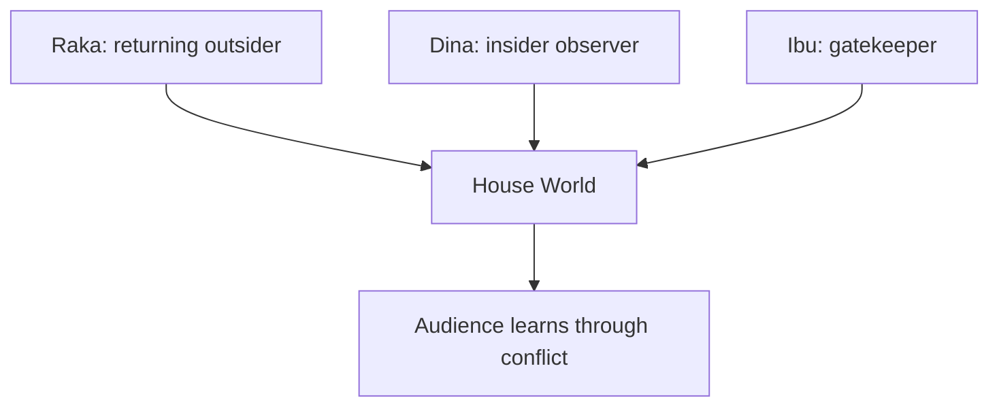

---

## 76. Worldbuilding dan Gatekeeper

Gatekeeper adalah karakter yang mengontrol akses ke dunia.

Contoh:

- Ibu mengontrol kunci/ruang kerja.
- Notaris mengontrol legal process.
- Warga tua mengontrol public memory.
- Dina mengontrol local knowledge.
- Pembeli mengontrol external pressure.

Gatekeeper tidak harus villain. Mereka menjaga aturan dunia.

Setiap gatekeeper punya:

```text
Access controlled:
Reason:
Price:
Weakness:
Scene where challenged:
```

---

## 77. Worldbuilding dan Map of Access

Buat access map.

| Resource | Who controls | Who wants | Price |
|---|---|---|---|
| Kunci ruang kerja | Ibu/Dina | Raka | Kejujuran/kepercayaan |
| Sertifikat | Ruang kerja/Ibu | Raka | Membuka masa lalu |
| Tanda tangan Ibu | Ibu | Raka | Pengakuan/minta maaf |
| Public truth | Warga/saksi | Raka | Menghadapi stigma |
| Pembeli | Uang/tekanan | Raka butuh | Moral compromise |
| Dina's trust | Dina | Raka | Tidak memanipulasi |

Access map membuat conflict jelas.

---

## 78. Worldbuilding dan Stakes

Dunia menentukan stakes.

Stakes bukan hanya personal. Bisa:

- social,
- economic,
- legal,
- spiritual,
- reputational,
- relational,
- physical,
- moral.

Contoh:

```text
Jika Raka membuka dokumen:
Legal stakes: dirinya bisa terseret.
Family stakes: Ibu kehilangan perlindungan.
Social stakes: keluarga dipermalukan lagi.
Moral stakes: korban lama mungkin mendapat keadilan.
Economic stakes: rumah tidak jadi dijual.
Emotional stakes: Raka tidak bisa lagi menyebut dirinya korban murni.
```

World membuat stakes multilayer.

---

## 79. Worldbuilding dan Moral Geography

Moral geography adalah makna moral tempat.

Contoh:

| Tempat | Makna Moral |
|---|---|
| Ruang makan | Tempat keluarga pura-pura utuh |
| Ruang kerja | Tempat kebenaran dikunci |
| Teras | Batas antara keluarga dan masyarakat |
| Warung | Pengadilan sosial informal |
| Notaris | Legal truth tanpa emotional truth |
| Terminal | Kemungkinan pergi |
| Dapur | Care dan evasion |
| Kamar Raka | Absence dan abandoned childhood |

Moral geography membantu scene placement.

Jangan taruh konfrontasi besar di lokasi random. Pilih lokasi yang memperkuat makna.

---

## 80. Worldbuilding dan Weather

Cuaca bisa menjadi world element.

Hujan:

- kebocoran masa lalu,
- isolasi,
- deadline,
- sound cover,
- physical decay,
- mood melankolis,
- obstacle produksi.

Panas:

- tekanan,
- irritability,
- ruang sempit,
- social exposure.

Angin:

- threshold,
- perubahan,
- ketidakstabilan.

Gelap:

- ignorance,
- threat,
- intimacy.

Gunakan cuaca sebagai pressure, bukan hanya mood.

Contoh:

```text
Hujan membuat atap bocor tepat di atas map penjualan, memaksa Raka memindahkan dokumen ke ruang kerja yang ingin ia hindari.
```

Cuaca memicu plot.

---

## 81. Worldbuilding dan Food

Food sangat kuat untuk drama keluarga.

Fungsi makanan:

- care,
- guilt,
- control,
- memory,
- class,
- ritual,
- refusal,
- intimacy,
- passive aggression.

Contoh:

```text
Ibu memasak makanan kesukaan Raka.
Raka bilang tidak lapar.
Dina memakan porsi itu sambil menatap Raka.
```

Worldbuilding food menunjukkan relasi tanpa exposition.

Food rule:

```text
Di rumah ini, konflik tidak dimulai sebelum nasi disendok.
```

Raka melanggar:

```text
Ia meletakkan map penjualan di atas meja sebelum makan.
```

Norm violation.

---

## 82. Worldbuilding dan Objects of Care

Objek yang dirawat menunjukkan nilai dunia.

Contoh:

- Ibu merawat piring retak.
- Dina merawat tanaman ayah.
- Raka merawat sepatu, bukan rumah.
- Pembeli merawat dokumen, bukan orang.
- Notaris merawat stempel.

Objek perawatan menunjukkan worldview.

Pertanyaan:

```text
Apa yang setiap karakter rawat?
Apa yang mereka biarkan rusak?
```

Jawabannya memperkaya dunia.

---

## 83. Worldbuilding dan Decay

Kerusakan fisik menunjukkan waktu dan konflik.

Contoh decay:

- cat mengelupas,
- atap bocor,
- jam mati,
- foto pudar,
- dokumen lembap,
- kursi patah,
- pagar berkarat,
- tanaman liar,
- lampu berkedip.

Decay harus bermakna.

```text
Rumah rusak bukan karena miskin saja, tetapi karena semua orang menunda memperbaiki sesuatu yang lebih dalam.
```

---

## 84. Worldbuilding dan Repair

Repair juga dramatik.

Contoh:

- Raka menambal atap dengan map penjualan.
- Dina memperbaiki kursi ayah.
- Ibu mencuci piring retak.
- Raka mengganti baterai jam mati.
- Kunci tidak lagi dipakai di leher, digantung di pintu.

Repair menunjukkan perubahan.

Jangan hanya simbolik kosong. Hubungkan ke action.

---

## 85. Worldbuilding dan Memory

Dunia menyimpan memori.

Pertanyaan:

1. Apa yang masih ada dari masa lalu?
2. Apa yang hilang?
3. Apa yang disembunyikan?
4. Apa yang salah tempat?
5. Apa yang terlalu terawat?
6. Apa yang sengaja rusak?
7. Apa yang tidak boleh disentuh?
8. Apa yang hanya satu karakter ingat?

Memory objects:

- tinggi badan di dinding,
- foto,
- kaset,
- bekas luka meja,
- kalender,
- pakaian,
- mainan,
- surat,
- suara radio,
- piring.

Memory membuat backstory filmik.

---

## 86. Worldbuilding dan Absence of Memory

Kadang dunia terasa karena memorinya hilang.

Contoh:

```text
Kamar Raka kosong. Bukan berdebu. Kosong total.

Dina:
Ibu buang semua waktu Kakak bilang tidak pulang lebaran.
```

Absence = action masa lalu.

Atau:

```text
Tidak ada foto ayah di rumah. Tapi semua kursi masih menghadap kursinya.
```

Absence bisa lebih haunting.

---

## 87. Worldbuilding dan Names

Nama tempat/orang bisa memberi dunia.

Contoh:

```text
Rumah Segel
Gang Belakang Notaris
Warung Bu Tiga Tanda Tangan
Ruang Bapak
Laci Ketiga
Kursi Ayah
Pintu Hujan
```

Nama informal menunjukkan social memory.

Jangan terlalu banyak nama unik. Pilih yang memorable dan fungsional.

---

## 88. Worldbuilding dan Reputasi

Reputasi adalah worldbuilding sosial.

Pertanyaan:

1. Apa reputasi protagonist?
2. Apa reputasi keluarga?
3. Apa reputasi rumah?
4. Apa reputasi ayah?
5. Apa reputasi ibu?
6. Apa reputasi lokasi?
7. Apa reputasi institusi?

Contoh:

```text
Raka dikenal sebagai anak yang berhasil di kota.
Di kampung, ia dikenal sebagai anak yang tidak pulang waktu Ibu operasi.
```

Dua reputasi bertabrakan.

---

## 89. Worldbuilding dan Community

Komunitas bisa hadir tanpa banyak karakter.

Cara murah:

- suara tetangga,
- tatapan,
- warung,
- grup chat,
- papan pengumuman,
- orang lewat yang berhenti,
- paman/tetangga representatif,
- komentar singkat,
- ritual sosial.

Contoh:

```text
Raka menurunkan papan DIJUAL.

Di seberang jalan, tiga ibu berhenti menyapu pada waktu yang sama.
```

Community world terlihat.

---

## 90. Worldbuilding dan Off-Screen World

Dunia di luar frame bisa terasa lewat:

- telepon,
- suara,
- berita,
- pesan,
- reaksi,
- barang datang,
- deadline,
- rumor,
- dokumen,
- orang yang tidak muncul tapi memengaruhi.

Contoh pembeli tidak muncul sampai akhir, tapi terasa:

- telepon jam sembilan,
- pesan ancaman,
- notaris menyebut namanya,
- warga bereaksi,
- mobil lewat rumah,
- Raka butuh uang darinya.

Off-screen world menghemat produksi.

---

## 91. Worldbuilding dan Scale Illusion

Anda bisa membuat dunia terasa luas dengan sedikit elemen.

Teknik:

1. Satu lokasi utama + satu suara luar.
2. Satu karakter representatif komunitas.
3. Satu dokumen yang menyebut sistem lebih besar.
4. Satu panggilan dari luar.
5. Satu berita radio.
6. Satu reaksi sosial.
7. Satu object dari masa lalu.
8. Satu deadline yang datang dari luar.

Contoh:

```text
Kita tidak perlu melihat semua korban kasus tanah.
Cukup satu warga tua datang membawa sertifikat rusak dan berkata:
"Nama ayahmu masih lebih kuat dari nama saya di kertas ini."
```

Dunia melebar lewat satu karakter.

---

## 92. Worldbuilding dan Minimalism

Minimalism bukan berarti dunia kosong.

Minimalism berarti detail dipilih ketat.

Contoh satu ruangan:

```text
Meja makan.
Piring retak.
Kunci di leher Ibu.
Map penjualan.
Kursi kosong.
Hujan.
```

Enam elemen ini sudah bisa membawa:

- keluarga,
- rahasia,
- transaksi,
- absence,
- tone,
- pressure.

Jangan takut sederhana jika setiap detail berfungsi.

---

## 93. Worldbuilding dan Maximalism

Jika dunia luas, tetap butuh fokus.

Maximalism cocok jika:

- feature/series,
- genre butuh world scale,
- budget mendukung,
- penonton butuh spectacle,
- cerita punya banyak institusi.

Namun untuk project awal, maximalism berisiko:

- exposition overload,
- budget meledak,
- karakter tenggelam,
- struktur melebar.

Jika ingin maximal, gunakan anchor kuat:

```text
Satu karakter.
Satu objective.
Satu core location.
Satu object.
```

---

## 94. Worldbuilding dan Research

Research penting untuk dunia realistis.

Contoh research:

- prosedur jual beli rumah,
- warisan,
- sertifikat,
- notaris,
- kantor kelurahan,
- budaya kampung tertentu,
- profesi karakter,
- terminal/bandara,
- rumah sakit,
- sekolah,
- polisi.

Namun research jangan menjadi dumping.

Gunakan research untuk:

- detail spesifik,
- conflict realistis,
- obstacle masuk akal,
- bahasa yang tepat,
- menghindari kesalahan besar,
- menemukan scene opportunity.

Research output harus menjadi drama.

---

## 95. Research-to-Scene Pipeline

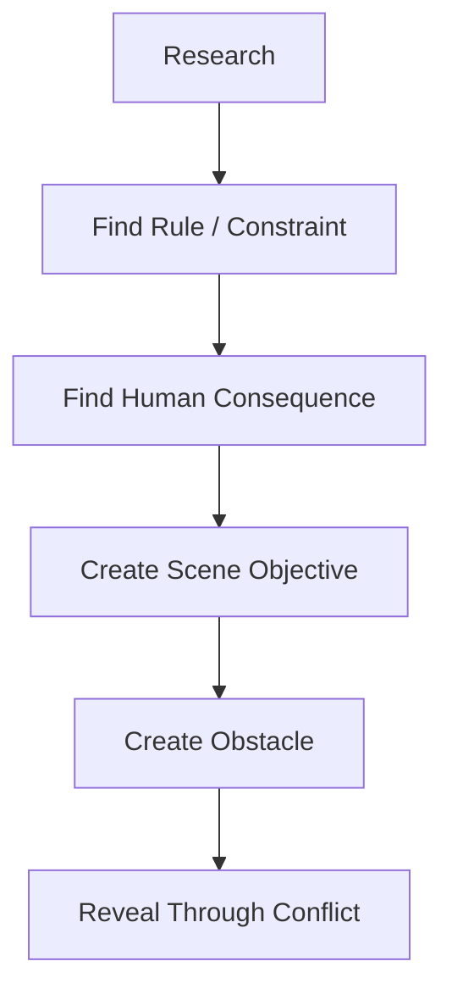

Contoh:

Research:

```text
Jual beli rumah perlu tanda tangan pihak berwenang/pemilik.
```

Rule:

```text
Raka tidak bisa menjual tanpa Ibu.
```

Human consequence:

```text
Raka harus bicara dengan orang yang ia hindari.
```

Scene:

```text
Raka menaruh dokumen di meja makan.
```

Obstacle:

```text
Ibu menaruh piring nasi di atas dokumen.
```

Drama.

---

## 96. Worldbuilding Questions: Essential 30

Gunakan pertanyaan ini:

1. Di mana cerita terjadi?
2. Mengapa harus terjadi di sana?
3. Apa aturan paling penting dunia ini?
4. Siapa yang membuat aturan?
5. Siapa yang melanggar aturan?
6. Apa konsekuensi melanggar aturan?
7. Apa lokasi paling penting?
8. Apa ruang terlarang?
9. Apa objek paling penting?
10. Siapa punya objek itu?
11. Apa sejarah publik dunia ini?
12. Apa sejarah privatnya?
13. Apa kebohongan utama dunia ini?
14. Apa ritual paling penting?
15. Apa taboo paling penting?
16. Apa sumber power?
17. Siapa punya power legal?
18. Siapa punya power emosional?
19. Siapa punya power informasi?
20. Apa tekanan ekonomi?
21. Apa tekanan sosial?
22. Apa bahasa/register khas?
23. Apa suara khas?
24. Apa visual motif?
25. Apa yang dunia ini anggap memalukan?
26. Apa yang dunia ini anggap loyal?
27. Bagaimana dunia menekan flaw protagonist?
28. Bagaimana protagonist bisa mengubah dunia?
29. Detail apa yang bisa diproduksi murah?
30. Detail apa yang harus dihapus karena tidak berfungsi?

---

## 97. Worldbuilding Canvas

```text
# Worldbuilding Canvas

## 1. World Premise
Dunia cerita ini adalah:

## 2. Core Conflict of World
Dunia ini menekan protagonist dengan cara:

## 3. Core Locations
Location A:
Function:
Rules:
Visual:
Sound:
Conflict:

Location B:
Function:
Rules:
Visual:
Sound:
Conflict:

## 4. Main Rule
Rule:
Enforcer:
Consequence:
How revealed:
How broken:
Payoff:

## 5. Main Taboo
Taboo:
Why exists:
Who protects it:
Who violates it:
Consequence:

## 6. Power System
Legal power:
Money power:
Information power:
Emotional power:
Social power:
Spatial power:

## 7. Social Norms
Norm 1:
Norm 2:
Norm 3:

## 8. Key Objects
Object:
Owner:
Meaning:
Function:
Payoff:

## 9. History
Public history:
Private history:
Hidden truth:
Visible trace:

## 10. Sensory Palette
Sound:
Light:
Texture:
Weather:
Smell implication:
Repeated image:

## 11. Language
Repeated phrases:
Taboo words:
Formal register:
Home register:
Jargon:

## 12. Production
Number of locations:
High-cost elements:
Low-cost alternatives:
Reusable props:
Contained strategy:
```

---

## 98. Contoh Worldbuilding Canvas Singkat

```text
## 1. World Premise
Rumah lama keluarga adalah arsip kebohongan yang secara legal, sosial, dan emosional tidak bisa begitu saja dijual.

## 2. Core Conflict of World
Dunia rumah menekan Raka karena semua hal yang ia anggap aset ternyata relasi, rahasia, dan konsekuensi moral.

## 3. Core Locations
Location A:
Ruang makan.

Function:
Arena konflik keluarga dan ritual penghindaran.

Rules:
Konflik tidak dibicarakan langsung sebelum makan.
Nama ayah tidak disebut.

Visual:
Piring retak, meja tua, kursi kosong.

Sound:
Sendok, hujan, radio dapur.

Conflict:
Raka membawa map penjualan ke meja makan.

Location B:
Ruang kerja ayah.

Function:
Forbidden archive.

Rules:
Terkunci, tidak dibuka tanpa Ibu.

Visual:
Pintu dengan bekas segel, kalender mati, map lembap.

Sound:
Kayu mengembang, kunci berputar.

Conflict:
Raka butuh akses, Ibu/Dina menahan.

## 4. Main Rule
Rule:
Ruang kerja tidak dibuka.

Enforcer:
Ibu.

Consequence:
Dokumen keluar dan keluarga kehilangan narasi lama.

How revealed:
Kunci di leher Ibu; reaksi saat Raka melihat pintu.

How broken:
Raka/Dina membuka saat deadline pembeli mendekat.

Payoff:
Kebenaran memaksa final choice.
```

---

## 99. Latihan 1 — Small World, Deep Pressure

Pilih satu lokasi utama.

Isi:

```text
Location:
Why this location:
Main rule:
Main taboo:
Main object:
Main sound:
Main visual:
Who controls it:
Who wants to leave:
Who wants to stay:
What changes by ending:
```

Tujuan:

```text
Membuat satu lokasi terasa seperti dunia.
```

---

## 100. Latihan 2 — Rule and Consequence

Buat 5 aturan dunia.

Template:

```text
Rule:
Who enforces it:
Who breaks it:
Consequence:
Scene where audience learns it:
Scene where it is paid off:
```

Contoh:

```text
Rule:
Nama ayah tidak disebut di meja makan.

Who enforces it:
Ibu.

Who breaks it:
Raka.

Consequence:
Ibu berhenti makan dan Dina sadar ada sesuatu yang lebih besar.

Scene audience learns:
Makan malam pertama.

Payoff:
Di climax, Raka menyebut nama ayah di ruang kerja dan tidak ada yang menghentikannya.
```

---

## 101. Latihan 3 — Object Arc

Pilih 3 objek.

Untuk setiap objek:

```text
Object:
Meaning at start:
Owner at start:
Conflict:
Meaning at midpoint:
Owner at end:
Meaning at end:
Final image possibility:
```

Tujuan:

```text
Membuat objek bukan dekorasi, tetapi pembawa story state.
```

---

## 102. Latihan 4 — Power Map

Buat power map untuk dunia cerita.

```text
Character/Force:
Power source:
What they control:
Who they pressure:
Weakness:
Scene where power shifts:
```

Contoh:

```text
Ibu:
Power source:
Legal ownership, kunci, guilt.

Controls:
Rumah dan ruang kerja.

Pressures:
Raka, Dina.

Weakness:
Takut kebenaran menyakiti anak.

Power shift:
Kunci berpindah ke Dina.
```

---

## 103. Latihan 5 — Sensory Palette

Buat sensory palette:

```text
5 sounds:
5 visual objects:
3 textures:
3 light conditions:
2 weather possibilities:
3 repeated images:
1 silence motif:
```

Lalu pilih mana yang benar-benar fungsi dramatik.

---

## 104. Latihan 6 — Social Norm Scene

Tulis scene 1 halaman di mana protagonist melanggar norma dunia tanpa ada karakter menjelaskan norma itu.

Contoh norma:

```text
Tidak boleh meletakkan dokumen di meja makan.
```

Scene:

```text
Raka meletakkan map di meja.

Semua orang berhenti makan.

Ibu mengambil piring nasi, menaruhnya tepat di atas map.
```

Penonton mengerti norma lewat reaksi.

---

## 105. Latihan 7 — Worldbuilding Without Dialogue

Tulis scene tanpa dialog yang menunjukkan:

```text
Rumah ini menyimpan rahasia dan seseorang masih menjaganya.
```

Gunakan:

- ruang,
- objek,
- suara,
- gesture,
- cahaya,
- absence.

Maksimal 1 halaman.

---

## 106. Latihan 8 — Production-Aware Redesign

Ambil worldbuilding mahal.

Contoh mahal:

```text
Demo warga besar di depan kantor pemerintah.
```

Ubah menjadi versi murah:

```text
Satu warga tua duduk di teras rumah membawa sertifikat lusuh. Ia tidak mau masuk.
```

Template:

```text
Expensive world detail:
Dramatic function:
Low-cost replacement:
What remains:
What changes:
```

---

## 107. Practice Plan 90 Menit

| Durasi | Aktivitas | Output |
|---:|---|---|
| 10 menit | Pilih core world dan lokasi utama | World premise |
| 15 menit | Isi core locations + rules | Location map |
| 15 menit | Buat power map | Power system |
| 15 menit | Buat object list + object arc | Object system |
| 10 menit | Buat sensory palette | Sensory guide |
| 10 menit | Buat timeline/history trace | History map |
| 10 menit | Production feasibility check | Production notes |
| 5 menit | Tulis 1 kalimat world promise | World promise |

Output minimal:

```text
1. Worldbuilding canvas
2. Spatial map sederhana
3. Power map
4. Object arc
5. Sensory palette
6. Production notes
```

---

## 108. Worldbuilding Checklist

### 108.1 Function

- [ ] Dunia menekan protagonist.
- [ ] Dunia mendukung theme.
- [ ] Dunia mendukung genre/tone.
- [ ] Dunia menciptakan conflict.
- [ ] Dunia memberi constraints dan affordances.
- [ ] Dunia bukan sekadar dekorasi.

### 108.2 Visibility

- [ ] Aturan dunia terlihat lewat action/consequence.
- [ ] Social norms terlihat lewat reaksi.
- [ ] History terlihat lewat trace.
- [ ] Objects punya fungsi.
- [ ] Sound/visual palette spesifik.
- [ ] Setting tidak generik.

### 108.3 Character

- [ ] Karakter punya relasi jelas dengan dunia.
- [ ] Protagonist diuji oleh dunia.
- [ ] Gatekeeper dunia jelas.
- [ ] Power map jelas.
- [ ] World rules memengaruhi pilihan karakter.

### 108.4 Story

- [ ] Worldbuilding tidak menghentikan pacing.
- [ ] Detail dunia muncul saat dibutuhkan.
- [ ] Reveal dunia punya setup/payoff.
- [ ] Tidak ada lore dump.
- [ ] World state berubah sepanjang cerita.

### 108.5 Production

- [ ] Jumlah lokasi realistis.
- [ ] Props utama teridentifikasi.
- [ ] Crowd/VFX/period risk dikontrol.
- [ ] Detail dunia bisa diwujudkan murah.
- [ ] Lokasi utama reusable.

---

## 109. Worldbuilding Anti-Pattern

### 109.1 Lore Dump

Penulis menjelaskan sejarah dunia panjang.

Fix:

```text
Ubah sejarah menjadi trace, ritual, conflict, dan reveal.
```

### 109.2 Wallpaper World

Dunia hanya latar visual, tidak menekan cerita.

Fix:

```text
Buat rules, power, taboo, dan consequence.
```

### 109.3 Overbuilding

Penulis membuat dunia terlalu luas untuk cerita.

Fix:

```text
Kembali ke audience need-to-know dan production scope.
```

### 109.4 Underbuilding

Dunia terasa generik.

Fix:

```text
Tambahkan detail spesifik yang berfungsi: object, ritual, language, norm.
```

### 109.5 Random Rules

Aturan muncul saat plot butuh.

Fix:

```text
Tanam rule sejak awal dan beri consequence konsisten.
```

### 109.6 Aesthetic Without Function

Detail cantik tapi tidak berarti.

Fix:

```text
Setiap detail harus mendukung conflict, character, theme, tone, atau payoff.
```

### 109.7 Production Blindness

Dunia terlalu mahal untuk diproduksi.

Fix:

```text
Cari low-cost replacement dengan fungsi dramatik sama.
```

### 109.8 Inconsistent Geography

Lokasi berubah tidak jelas.

Fix:

```text
Buat spatial map sederhana.
```

### 109.9 Culture as Decoration

Elemen budaya dipakai sebagai ornamen.

Fix:

```text
Jadikan budaya sebagai norma, pressure, ritual, language, dan consequence.
```

---

## 110. Debugging Worldbuilding

### 110.1 Jika dunia terasa generik

Cek:

1. Apa aturan spesifik dunia?
2. Apa ritualnya?
3. Apa objek khas?
4. Apa suara khas?
5. Apa taboo?
6. Apa sumber power?
7. Apa social pressure?
8. Apa detail lokal?
9. Apa yang hanya bisa terjadi di dunia ini?

---

### 110.2 Jika dunia terasa terlalu berat

Cek:

1. Berapa banyak informasi yang dijelaskan?
2. Detail mana yang tidak memengaruhi pilihan?
3. Apakah penonton perlu tahu sekarang?
4. Bisa ditunda?
5. Bisa visual?
6. Bisa digabung dengan conflict?
7. Bisa dipotong?

---

### 110.3 Jika world rules terasa random

Cek:

1. Kapan rule pertama kali ditanam?
2. Siapa yang percaya rule?
3. Siapa yang menegakkan?
4. Apa konsekuensi?
5. Apakah rule pernah diuji?
6. Apakah payoff konsisten?

---

### 110.4 Jika dunia tidak menekan karakter

Cek:

1. Apa flaw protagonist?
2. Apa rule dunia yang menyerang flaw itu?
3. Apa power system yang menghalangi want?
4. Apa lokasi yang membuat karakter tidak nyaman?
5. Apa objek yang memaksa karakter memilih?
6. Apa social norm yang membuat direct action sulit?

---

## 111. Worldbuilding Rewrite Pass

Lakukan pass berikut:

### Pass 1 — Relevance

```text
Detail dunia mana yang benar-benar memengaruhi cerita?
```

### Pass 2 — Visibility

```text
Apakah detail ini terlihat/terdengar?
```

### Pass 3 — Pressure

```text
Bagaimana detail ini menekan karakter?
```

### Pass 4 — Genre/Tone

```text
Apakah detail ini memperkuat promise genre/tone?
```

### Pass 5 — Theme

```text
Apakah detail ini menguji tema?
```

### Pass 6 — Production

```text
Apakah detail ini feasible?
```

### Pass 7 — Economy

```text
Bisa digabung dengan detail lain?
Bisa dihapus?
Bisa diubah menjadi object/ritual?
```

---

## 112. Worldbuilding Test Suite

Gunakan model:

```text
Given:
Protagonist punya flaw/want tertentu.

When:
Ia masuk ke dunia dengan rules, power system, dan taboo tertentu.

Then:
Dunia memaksa protagonist bertindak, gagal, belajar, atau membayar harga.

And:
Setiap detail dunia yang muncul di screen mendukung conflict, theme, genre, tone, atau payoff.
```

Jika tidak, detail itu perlu diubah atau dihapus.

---

## 113. Minimal Worldbuilding untuk First Draft

Sebelum drafting, minimal punya:

1. Satu world premise.
2. Satu lokasi utama.
3. Satu spatial map kasar.
4. Tiga aturan dunia.
5. Satu taboo.
6. Satu power map.
7. Tiga objek penting.
8. Satu sensory palette.
9. Satu public/private history.
10. Satu production constraint list.

Ini cukup untuk draft pertama.

Jangan menunggu dunia sempurna.

---

## 114. Output yang Harus Dibawa ke Part Berikutnya

Part berikutnya adalah:

> **Part 018 — Film Pendek: Struktur, Scope, dan Kekuatan Satu Momen**

Sebelum lanjut, Anda sebaiknya punya:

1. Worldbuilding canvas.
2. Spatial map sederhana.
3. Power map.
4. Key object list.
5. Rule/consequence list.
6. Taboo list.
7. Sensory palette.
8. Production feasibility notes.
9. World bible minimal 1–3 halaman.
10. Satu scene worldbuilding tanpa dialog.

Part 018 akan fokus pada film pendek, sehingga worldbuilding ini akan diperkecil menjadi:

```text
Satu lokasi.
Satu konflik.
Satu momen.
Satu pilihan.
Satu perubahan.
```

---

## 115. Ringkasan Part Ini

Worldbuilding dalam film bukan soal membuat lore sebanyak mungkin. Worldbuilding adalah mendesain dunia yang menekan karakter dan terlihat di layar.

Hal paling penting:

1. Semua film punya worldbuilding, termasuk drama realistis.
2. Worldbuilding harus enough, visible, functional.
3. Dunia memberi constraint dan affordance.
4. Dunia harus menekan flaw/want protagonist.
5. Dunia harus mendukung theme, genre, dan tone.
6. Aturan dunia harus punya consequence.
7. Detail dunia harus muncul lewat action, object, ritual, sound, setting, atau conflict.
8. Jangan lore dump.
9. Gunakan power map, object arc, spatial map, dan sensory palette.
10. Untuk project awal, pilih scope kecil dengan depth tinggi.
11. Worldbuilding harus sadar produksi.
12. World state harus berubah sepanjang cerita.

Formula inti:

```text
World Detail + Rule + Consequence + Character Pressure = Functional Worldbuilding
```

Jika dunia cerita Anda membuat karakter tidak bisa bertindak dengan cara mudah, memaksa mereka menghadapi luka/tema, dan bisa dilihat/didengar dalam scene, maka worldbuilding Anda bekerja.

---

## 116. Status Seri

- Part 000: selesai.
- Part 001: selesai.
- Part 002: selesai.
- Part 003: selesai.
- Part 004: selesai.
- Part 005: selesai.
- Part 006: selesai.
- Part 007: selesai.
- Part 008: selesai.
- Part 009: selesai.
- Part 010: selesai.
- Part 011: selesai.
- Part 012: selesai.
- Part 013: selesai.
- Part 014: selesai.
- Part 015: selesai.
- Part 016: selesai.
- Part 017: selesai.
- Part 018: berikutnya.

Seri **belum selesai**. Bagian berikutnya adalah:

> **Part 018 — Film Pendek: Struktur, Scope, dan Kekuatan Satu Momen**
