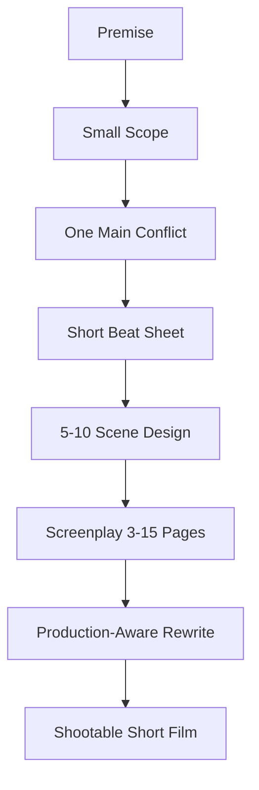
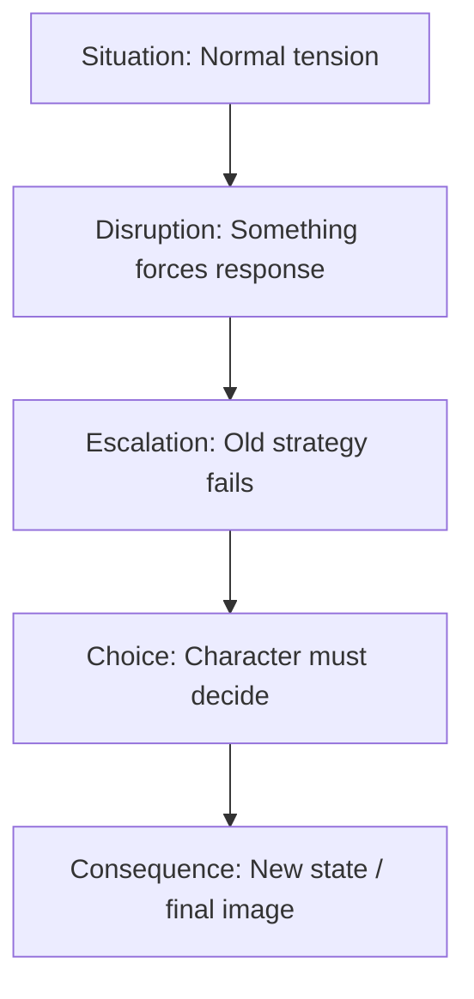
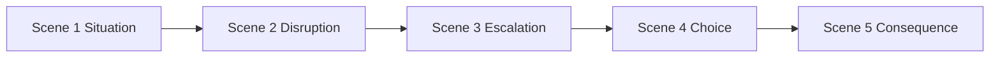
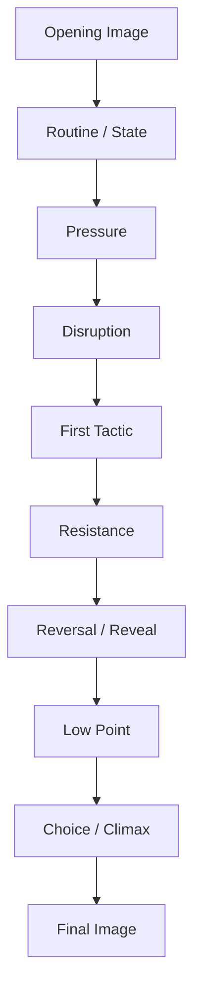
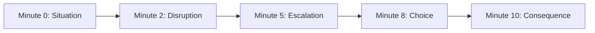
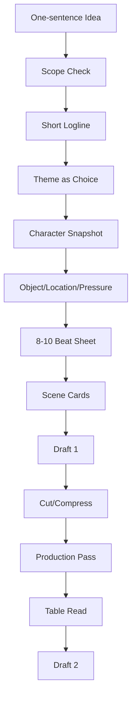

# learn-screenwriting-film-script-part-018.md

# Part 018 — Film Pendek: Struktur, Scope, dan Kekuatan Satu Momen

> Seri: Learn Screenwriting for Film Project  
> Pendekatan: *The First 20 Hours* — Josh Kaufman  
> Fokus bagian ini: memahami film pendek sebagai bentuk cerita tersendiri yang memaksimalkan satu momen dramatik, bukan sekadar versi mini dari film panjang.  
> Target praktis: mampu merancang, menulis, dan mengevaluasi naskah film pendek dengan scope kecil, konflik tajam, scene efisien, dan payoff emosional yang jelas.

---

## 0. Posisi Part Ini dalam Roadmap

Pada Part 017 kita membahas worldbuilding: bagaimana membangun dunia yang cukup, terlihat, dan berfungsi.

Sekarang kita masuk ke format cerita yang sangat penting untuk latihan, portofolio, festival, proof-of-concept, dan produksi pertama: **film pendek**.

Film pendek bukan sekadar “film panjang yang dipotong”.

Film pendek adalah bentuk cerita dengan logika sendiri:

```text
Satu situasi.
Satu tekanan.
Satu konflik utama.
Satu pilihan.
Satu perubahan.
Satu image akhir.
```

Film panjang punya ruang untuk:

- banyak sequence,
- subplot,
- arc bertahap,
- world expansion,
- banyak reversal,
- beberapa relasi,
- sustained tension 90 menit.

Film pendek tidak punya kemewahan itu.

Film pendek menang bukan karena luas, tetapi karena **presisi**.

Diagram posisi film pendek dalam pipeline belajar:



---

## 1. Prinsip Kaufman dalam Part Ini

Dalam pendekatan *The First 20 Hours*, film pendek adalah medium latihan yang sangat efisien karena:

1. Scope kecil.
2. Feedback cepat.
3. Bisa diproduksi lebih realistis.
4. Bisa selesai.
5. Bisa menguji skill inti screenwriting.
6. Bisa menjadi capstone project awal.
7. Bisa dipakai untuk belajar produksi, editing, directing, acting, sound, dan rewriting.

Sub-skill yang dilatih:

- membuat premis kecil tapi kuat,
- mengontrol scope,
- membuat satu konflik tajam,
- menulis scene efisien,
- membangun character change cepat,
- menghindari exposition berlebihan,
- membuat ending image kuat,
- menulis naskah yang bisa diproduksi.

Target praktis:

```text
Dalam 20 jam pertama, Anda sebaiknya bisa membuat naskah film pendek 5–10 halaman yang punya awal, tekanan, pilihan, dan konsekuensi.
```

Bukan sempurna. Tapi selesai dan bisa dievaluasi.

---

## 2. Film Pendek Bukan Film Panjang Mini

Kesalahan umum:

```text
Saya punya ide feature, lalu saya jadikan short dengan memotong banyak bagian.
```

Hasilnya sering terasa seperti:

- trailer,
- episode pertama,
- prolog,
- teaser,
- sinopsis visual,
- setup tanpa payoff,
- potongan dunia yang belum selesai.

Film pendek yang kuat biasanya bukan “bab pertama”. Ia adalah satu pengalaman lengkap.

Film pendek boleh menjadi proof-of-concept feature, tetapi tetap harus punya bentuk mandiri.

Perbedaan:

| Film Pendek Lemah | Film Pendek Kuat |
|---|---|
| Terasa seperti opening feature | Terasa seperti satu cerita lengkap |
| Terlalu banyak karakter | Fokus pada 1–3 karakter |
| Terlalu banyak worldbuilding | Dunia cukup lewat detail pilihan |
| Banyak setup, sedikit payoff | Setup cepat, payoff jelas |
| Konflik terlalu luas | Konflik spesifik |
| Ending hanya cliffhanger | Ending memberi perubahan/makna |
| Premis terlalu besar | Momen kecil dengan tekanan besar |
| Banyak exposition | Informasi muncul lewat tindakan |

---

## 3. Mental Model: Film Pendek adalah Unit Test Emosional

Untuk software engineer, film pendek bisa dianalogikan sebagai **unit test** untuk kemampuan storytelling.

Feature film adalah sistem besar.  
Short film adalah unit test yang memverifikasi satu perilaku dramatik.

Contoh:

```text
Given:
Karakter takut pulang.

When:
Ia dipaksa menjawab telepon ibunya di terminal.

Then:
Ia memilih tetap pergi atau mulai pulang secara emosional.

Expected:
Ada perubahan state emosional.
```

Film pendek yang baik menguji satu hal dengan jelas.

Bukan:

```text
Menguji semua tema kehidupan, semua konflik keluarga, semua sejarah politik, semua romance, semua trauma.
```

Cukup:

```text
Apakah satu orang bisa mengatakan satu kalimat yang selama ini ia hindari?
```

---

## 4. Film Pendek sebagai “One Dramatic Question”

Film pendek harus punya dramatic question yang sederhana dan tajam.

Contoh:

```text
Apakah Naya akan naik bus atau menjawab telepon ibunya?
```

```text
Apakah Raka akan membuka ruang kerja ayah atau menyerahkan kunci kembali?
```

```text
Apakah seorang anak akan membuang koper ayahnya atau membawanya pulang?
```

```text
Apakah seorang suami akan tetap berbohong di depan anaknya atau mengakui bahwa ia kehilangan pekerjaan?
```

Dramatic question pendek harus bisa dijawab dalam durasi singkat.

Jika dramatic question terlalu luas:

```text
Apakah Raka akan membongkar jaringan kejahatan tanah nasional dan menyembuhkan trauma keluarga lintas generasi?
```

Itu feature/series, bukan short.

---

## 5. Film Pendek adalah Satu Momen yang Diperbesar

Banyak film pendek kuat sebenarnya membesarkan satu momen:

- sebelum pergi,
- sebelum mengaku,
- sebelum membuka pintu,
- sebelum tanda tangan,
- sebelum memaafkan,
- sebelum membuang benda,
- sebelum menjawab telepon,
- sebelum menekan tombol kirim,
- sebelum seseorang datang,
- sebelum jam habis,
- setelah kebohongan kecil ketahuan.

Momen kecil bisa besar jika:

- karakter punya luka,
- ada deadline,
- ada pilihan,
- ada konsekuensi,
- ada konflik nilai,
- ada objek bermakna,
- ada relasi yang dipertaruhkan.

Formula:

```text
Small external action + large internal consequence = strong short film moment
```

Contoh:

```text
External action:
Menjawab telepon.

Internal consequence:
Mengakui bahwa ia masih butuh ibunya.
```

```text
External action:
Memberikan kunci.

Internal consequence:
Melepas kontrol atas rahasia keluarga.
```

```text
External action:
Tidak naik bus.

Internal consequence:
Untuk pertama kalinya memilih tinggal tanpa dipaksa.
```

---

## 6. Short Film Scope

Scope adalah batas cerita.

Scope meliputi:

- durasi,
- jumlah karakter,
- jumlah lokasi,
- rentang waktu,
- jenis konflik,
- worldbuilding,
- production demand,
- emotional arc,
- genre promise.

Film pendek perlu scope ketat.

Panduan:

| Durasi | Scope Ideal |
|---:|---|
| 1–3 menit | Satu gagasan, satu twist/image |
| 3–5 menit | Satu konflik mini, satu turn |
| 5–8 menit | Satu situasi, satu pilihan |
| 8–12 menit | Satu relasi, satu konflik, satu reveal |
| 12–15 menit | Satu arc kecil, beberapa scene |
| 15–20 menit | Bisa lebih kompleks, tapi tetap fokus |

Semakin pendek durasi, semakin sedikit hal yang bisa Anda bawa.

---

## 7. Scope Rule: One of Each

Untuk film pendek pertama, gunakan rule:

```text
1 protagonist
1 core relationship
1 main location
1 main object
1 main pressure
1 main choice
1 final image
```

Boleh melanggar, tetapi ini baseline aman.

Contoh:

```text
Protagonist:
Naya.

Core relationship:
Naya dan Ibu melalui telepon.

Main location:
Terminal bus.

Main object:
Koper kecil / kaset ayah.

Main pressure:
Bus terakhir berangkat 10 menit lagi.

Main choice:
Naik bus atau menjawab telepon.

Final image:
Naya tetap di terminal, telepon di telinga, koper belum dibuka semua.
```

Ini cukup untuk short.

---

## 8. Film Pendek dan Budget

Film pendek yang baik sering menulis dengan kesadaran produksi.

Batas produksi umum:

- lokasi sedikit,
- karakter sedikit,
- waktu syuting terbatas,
- sound harus manageable,
- crowd mahal,
- malam mahal,
- hujan mahal jika dibuat artificial,
- anak/animal sulit,
- kendaraan bergerak sulit,
- VFX sulit,
- period detail mahal,
- banyak extras mahal,
- action/stunt perlu safety.

Menulis short yang feasible bukan berarti tidak kreatif. Justru constraint memaksa kreativitas.

Prinsip:

```text
Production constraint is not enemy. It is design boundary.
```

---

## 9. Low-Budget High-Impact Strategy

Film pendek kuat bisa dibuat dengan:

- satu ruangan,
- dua aktor,
- satu objek,
- satu deadline,
- sound motif,
- konflik emosional,
- final choice.

Contoh:

```text
Satu meja makan.
Ibu, anak, adik.
Kunci di leher Ibu.
Pembeli datang besok.
Anak ingin kunci.
Ibu menolak.
Adik menjadi pemegang kunci.
```

Tidak mahal. Tapi dramatik.

High impact berasal dari:

- subtext,
- performance,
- object,
- stakes,
- turn,
- final image.

---

## 10. Film Pendek dan Genre

Genre film pendek harus fokus.

### Drama Pendek

Fokus pada satu keputusan emosional.

Contoh:

```text
Anak menjawab telepon ibu yang selama ini ia abaikan.
```

### Horror Pendek

Fokus pada satu rule, satu violation, satu payoff.

Contoh:

```text
Jangan buka pintu setelah suara ketiga. Karakter membuka setelah suara kedua karena mengira aman.
```

### Thriller Pendek

Fokus pada satu deadline dan satu threat.

Contoh:

```text
Karakter punya 10 menit untuk menghapus pesan sebelum orang yang salah membacanya.
```

### Comedy Pendek

Fokus pada satu premise absurd yang eskalatif.

Contoh:

```text
Satu keluarga mencoba terlihat normal saat calon pembeli rumah datang, tetapi semua barang di rumah punya sejarah memalukan.
```

### Romance Pendek

Fokus pada satu momen vulnerability.

Contoh:

```text
Dua mantan berbagi taksi terakhir dan salah satu harus turun lebih dulu.
```

### Mystery Pendek

Fokus pada satu pertanyaan dan satu reframe.

Contoh:

```text
Siapa yang mengirim koper ini? Ternyata karakter sendiri, bertahun-tahun lalu, dalam keadaan yang ia lupakan.
```

---

## 11. Film Pendek dan Tema

Tema film pendek sebaiknya bisa diuji dalam satu pilihan.

Theme question besar:

```text
Apakah keluarga boleh dilindungi dengan kebohongan?
```

Versi short:

```text
Apakah Raka akan menyimpan kunci agar rahasia tetap terkunci, atau memberikannya kepada Dina yang berhak tahu?
```

Atau:

```text
Apakah Naya akan tetap pergi dengan kebencian yang rapi, atau menjawab telepon yang mungkin menghancurkan keyakinannya tentang ibunya?
```

Tema harus menjadi choice, bukan pidato.

---

## 12. Film Pendek dan Karakter

Karakter film pendek tidak punya ruang untuk biografi luas.

Anda perlu **character snapshot**:

```text
Who they are now.
What they want now.
What they avoid now.
What this moment forces now.
What changes by the end.
```

Template:

```text
Character:
Current state:
Want:
Fear:
Defense:
Pressure:
Choice:
End state:
```

Contoh:

```text
Character:
Naya.

Current state:
Siap meninggalkan kota dan ibunya.

Want:
Naik bus tanpa percakapan terakhir.

Fear:
Jika bicara, ia akan ragu pergi.

Defense:
Menolak telepon, sibuk dengan jadwal.

Pressure:
Paket terakhir dari ayah memaksa ia mendengar versi lain masa lalu.

Choice:
Naik bus atau menjawab telepon.

End state:
Belum tentu pulang, tapi tidak lagi pergi dengan kebencian utuh.
```

---

## 13. Film Pendek dan Character Arc

Arc film pendek biasanya kecil tapi jelas.

Jangan mencoba:

```text
Karakter dari pengecut total menjadi pahlawan nasional dalam 8 menit.
```

Lebih masuk akal:

```text
Karakter dari menghindari satu telepon menjadi menjawabnya.
```

Atau:

```text
Karakter dari memegang kunci sebagai kontrol menjadi meletakkannya di meja.
```

Small action, meaningful shift.

Jenis short arc:

| Start | End |
|---|---|
| Avoidance | First contact |
| Denial | Recognition |
| Control | Surrender |
| Silence | One honest line |
| Escape | Pause |
| Shame | Admission |
| Anger | Curiosity |
| Certainty | Doubt |
| Isolation | Reaching out |
| Lie | Partial truth |

Arc kecil lebih believable.

---

## 14. Film Pendek dan Antagonis/Oposisi

Dalam short, antagonis tidak harus karakter villain.

Oposisi bisa berupa:

- waktu,
- telepon,
- bus,
- pintu,
- aturan rumah,
- ibu yang diam,
- kunci,
- hujan,
- rasa malu,
- rasa bersalah,
- orang ketiga,
- sistem sederhana,
- social pressure,
- object yang tidak bisa dibuang.

Contoh:

```text
Naya ingin naik bus.
Oposisi:
Telepon Ibu, rekaman ayah, bus terakhir, rasa ingin tahu.
```

```text
Raka ingin membuka ruang kerja.
Oposisi:
Ibu, Dina, kunci, taboo keluarga, waktu sebelum pembeli datang.
```

Short butuh oposisi yang cepat terbaca.

---

## 15. Film Pendek dan Stakes

Stakes short tidak harus besar secara dunia. Harus besar untuk karakter.

Buruk:

```text
Jika gagal, dunia hancur.
```

Sering terlalu besar untuk short.

Lebih kuat:

```text
Jika gagal menjawab telepon, ia mungkin pergi dengan kebencian yang salah seumur hidup.
```

```text
Jika membuka pintu, ia tidak bisa lagi melihat ibunya sebagai korban.
```

```text
Jika memberikan kunci, ia kehilangan kontrol tapi mungkin menyelamatkan relasi.
```

Stakes short sering:

- kesempatan terakhir,
- kalimat terakhir,
- relasi terakhir,
- benda terakhir,
- memori terakhir,
- pilihan sebelum pergi,
- keputusan yang tidak bisa ditarik.

---

## 16. Short Film Structure: 5-Part Model

Struktur dasar:

```text
1. Situation
2. Disruption
3. Escalation
4. Choice
5. Consequence
```

Diagram:



Ini struktur paling berguna untuk short.

---

## 17. Situation

Situation bukan setup panjang. Ini adalah kondisi awal dengan tension.

Harus menunjukkan:

- siapa karakter,
- apa yang sedang ia lakukan,
- apa yang ia inginkan,
- apa yang terasa tidak stabil,
- tone/genre,
- world rule sederhana.

Contoh:

```text
Naya menunggu bus terakhir, menolak telepon ibunya.
```

Dalam satu kalimat:

- karakter: Naya,
- location: terminal,
- want: pergi,
- conflict seed: ibu,
- pressure: bus terakhir,
- defense: menolak telepon.

Situation harus cepat.

---

## 18. Disruption

Disruption adalah gangguan yang membuat karakter tidak bisa terus dalam pola awal.

Contoh:

```text
Kurir membawa paket atas nama ayahnya yang sudah meninggal.
```

Atau:

```text
Ibu memberi kunci ruang kerja kepada Dina, bukan Raka.
```

Disruption harus:

- relevan dengan want,
- menekan flaw,
- memicu curiosity/action,
- mengubah immediate plan.

Disruption bukan random event. Ia harus menyerang state awal.

---

## 19. Escalation

Escalation adalah usaha karakter menghadapi disruption dengan strategi lama, lalu strategi itu gagal.

Contoh Naya:

1. Ia mencoba mengabaikan paket.
2. Ia mendengar suara ayah dari rekaman.
3. Rekaman menyebut ibunya.
4. Bus mulai boarding.
5. Ibu menelepon lagi.

Tekanan naik.

Contoh Raka:

1. Ia meminta kunci.
2. Ibu menghindar.
3. Raka menekan.
4. Dina mengetahui.
5. Kunci berpindah ke Dina.

Escalation harus mempersempit pilihan.

---

## 20. Choice

Choice adalah pusat short.

Pilihan harus:

- konkret,
- visible,
- irreversible atau setidaknya meaningful,
- berhubungan dengan want/need,
- punya cost,
- menjawab dramatic question.

Contoh:

```text
Naya memilih menjawab telepon atau naik bus.
```

```text
Raka memilih merebut kunci dari Dina atau meminta dengan jujur.
```

```text
Anak memilih membuang kaset ayah atau memutarnya di depan ibu.
```

Short tanpa pilihan sering terasa seperti vignette, bukan drama.

---

## 21. Consequence

Consequence menunjukkan state baru.

Tidak harus menjelaskan semua.

Contoh:

```text
Naya tidak naik bus. Tapi ia juga belum pulang. Ia duduk di terminal, telepon di telinga.
```

Consequence bagus memberi:

- emotional closure,
- image,
- ambiguity terkendali,
- sense of change,
- payoff terhadap opening.

Consequence buruk:

```text
TO BE CONTINUED.
```

Kecuali memang teaser, tapi untuk short mandiri biasanya lemah.

---

## 22. Struktur 5 Scene untuk Film Pendek

Model:

| Scene | Fungsi | Pertanyaan |
|---|---|---|
| Scene 1 | Situation | Apa kondisi awal dan tension? |
| Scene 2 | Disruption | Apa yang mengganggu pola? |
| Scene 3 | Escalation | Bagaimana strategi lama gagal? |
| Scene 4 | Choice/Climax | Apa pilihan sulit? |
| Scene 5 | Consequence | Apa state baru? |

Diagram:



Ini sangat cocok untuk short 5–10 menit.

---

## 23. Struktur 8 Beat untuk Film Pendek

Untuk short 8–12 menit:

```text
Beat 1 — Opening image
Beat 2 — Normal tension
Beat 3 — Disruption
Beat 4 — First response
Beat 5 — Complication
Beat 6 — Revelation / reversal
Beat 7 — Crisis choice
Beat 8 — Final image
```

Tabel:

| Beat | Fungsi |
|---|---|
| Opening image | State awal karakter |
| Normal tension | Want/avoidance terlihat |
| Disruption | Gangguan utama |
| First response | Strategi lama |
| Complication | Strategi gagal / stakes naik |
| Revelation | Makna berubah |
| Crisis choice | Pilihan final |
| Final image | State baru |

---

## 24. Struktur 10 Beat untuk Film Pendek

Untuk short 10–15 menit:

```text
1. Opening image
2. Routine / current state
3. Pressure introduced
4. Inciting disruption
5. First tactic
6. Resistance
7. Reversal / reveal
8. Low point / hesitation
9. Choice / climax
10. Consequence / final image
```

Diagram:



Gunakan ini jika story butuh sedikit lebih banyak build-up.

---

## 25. Short Film Beat Sheet Template

```text
# Short Film Beat Sheet

Title:
Duration:
Genre:
Tone:
Primary location:
Characters:
Main object:
Theme question:
Dramatic question:

Beat 1 — Opening Image
What we see:
What it tells us:
State:

Beat 2 — Normal Tension
Character wants:
Character avoids:
Pressure seed:

Beat 3 — Disruption
What interrupts:
Why it matters:

Beat 4 — First Response
What character does:
How it reveals flaw:

Beat 5 — Complication
What gets worse:
What becomes harder:

Beat 6 — Reversal / Reveal
What changes understanding:
Who gains/loses power:

Beat 7 — Crisis Choice
Choice A:
Cost A:
Choice B:
Cost B:

Beat 8 — Climax Action
Visible action:
Internal meaning:

Beat 9 — Consequence
What changed:
What remains unresolved:

Beat 10 — Final Image
Image:
How it mirrors opening:
```

---

## 26. Film Pendek dan Opening Image

Opening image short harus sangat efisien.

Ia harus memberi:

- karakter,
- tone,
- world,
- tension,
- possible theme.

Contoh opening lemah:

```text
Raka bangun pagi, mandi, sarapan, pergi.
```

Kecuali rutinitas itu punya twist, terlalu biasa.

Opening lebih kuat:

```text
Raka berdiri di depan rumah lama dengan papan DIJUAL. Ia mengetuk pintu.

Dari dalam, Ibu menempelkan kertas di jendela:

TIDAK.
```

Dalam satu image:

- konflik penjualan,
- ibu menolak,
- tone bisa drama/comedy,
- rumah sebagai arena,
- objective jelas.

---

## 27. Opening Late

Masuklah sedekat mungkin ke konflik.

Buruk:

```text
Naya packing di kamar, naik ojek, sampai terminal, beli tiket, duduk, lalu konflik mulai.
```

Lebih baik:

```text
Naya sudah duduk di terminal. Bus terakhir menyala. Ponselnya bergetar: IBU.
```

Atau:

```text
Raka sudah memegang gagang pintu ruang kerja ketika Ibu berkata dari belakang:
"Kalau kamu buka, jangan panggil Ibu lagi."
```

Short tidak punya waktu untuk pemanasan panjang.

---

## 28. Ending Early

Keluar setelah perubahan terjadi.

Buruk:

```text
Setelah Naya menjawab telepon, kita melihat ia pulang, berdamai dengan ibu, pindah kerja, menikah, dan hidup bahagia.
```

Terlalu banyak.

Lebih kuat:

```text
Naya menjawab telepon.

NAYA
Bu.

Bus terakhir pergi di belakangnya.

Ia tidak berbalik melihat bus.
```

Cukup. Penonton merasakan pilihan.

---

## 29. Final Image

Final image short sangat penting. Karena durasi pendek, final image sering menjadi tempat makna terkonsentrasi.

Final image harus:

- membayar opening,
- menunjukkan perubahan,
- tidak menjelaskan berlebihan,
- punya visual clarity,
- meninggalkan rasa.

Contoh:

Opening:

```text
Naya menolak telepon Ibu sambil menggenggam tiket bus.
```

Final:

```text
Tiket bus basah di bangku terminal. Naya memegang telepon dengan dua tangan.
```

Opening:

```text
Kunci di leher Ibu.
```

Final:

```text
Kunci tergantung di pintu yang terbuka.
```

Perubahan visual = perubahan makna.

---

## 30. Film Pendek dan Ending Ambiguity

Ending boleh ambigu, tetapi tidak boleh kosong.

Ambigu baik:

```text
Kita tidak tahu apakah Naya pulang, tetapi kita tahu ia berhenti kabur untuk satu percakapan.
```

Ambigu buruk:

```text
Kita tidak tahu apa yang terjadi, kenapa terjadi, atau apa yang berubah.
```

Prinsip:

```text
Ambiguity of future is okay.
Ambiguity of meaning is risky.
```

Penonton boleh bertanya:

```text
Apa yang akan ia lakukan setelah ini?
```

Tapi harus tahu:

```text
Apa yang berubah di momen ini?
```

---

## 31. Film Pendek vs Vignette

Vignette adalah potongan suasana/momen tanpa struktur dramatik kuat.

Vignette bisa indah, tapi jika target Anda belajar screenwriting dramatik, pastikan ada:

- want,
- conflict,
- pressure,
- turn,
- consequence.

Vignette:

```text
Seorang perempuan duduk di terminal memikirkan hidupnya.
```

Short dramatic:

```text
Seorang perempuan harus memutuskan naik bus terakhir atau menjawab telepon ibunya setelah menerima rekaman ayah yang mengubah alasan ia pergi.
```

Perbedaan: dramatic question.

---

## 32. Film Pendek dan Twist

Twist sering populer dalam short, tapi berisiko.

Twist buruk:

```text
Ternyata semua hanya mimpi.
```

Atau:

```text
Ternyata karakter sudah mati.
```

Jika tanpa setup, lemah.

Twist baik:

- membalik makna,
- punya clue,
- mengubah emosi,
- bukan sekadar trik,
- membuat penonton ingin menonton ulang,
- tetap punya karakter.

Contoh:

```text
Sepanjang film Naya mengira rekaman ayah ditujukan agar ia memaafkan ibu.
Twist:
Rekaman itu sebenarnya dibuat ibu, memakai suara ayah dari kaset lama, karena ibu tidak tahu cara meminta Naya tinggal.
```

Twist ini harus ditanam fair dan punya konsekuensi moral.

---

## 33. Reveal vs Twist

Reveal:

```text
Informasi penting terbuka.
```

Twist:

```text
Informasi terbuka dan membalik asumsi utama.
```

Short tidak wajib punya twist. Banyak short lebih kuat dengan reveal emosional sederhana.

Reveal emosional:

```text
Ibu tidak menolak menjual rumah karena mencintai rumah, tetapi karena rumah itu satu-satunya tempat Raka masih mungkin pulang.
```

Ini bisa lebih kuat dari twist gimmick.

---

## 34. Film Pendek dan Exposition

Exposition harus minimal.

Prinsip:

```text
No biography. Use evidence.
```

Buruk:

```text
RAKA
Sejak Ayah meninggal lima tahun lalu dan aku pergi ke kota karena trauma...
```

Lebih baik:

```text
Dina membuka lemari Raka.

Baju terakhirnya masih dalam plastik laundry.

Nota: 5 tahun lalu.
```

Short harus memberi informasi lewat:

- objek,
- action,
- setting,
- reaction,
- satu line spesifik,
- sound,
- absence.

---

## 35. Film Pendek dan Dialog

Dialog short harus hemat.

Setiap line harus:

- punya tactic,
- membawa subtext,
- mempercepat turn,
- tidak menjelaskan backstory panjang,
- punya voice.

Contoh:

```text
DINA
Kakak pulang bawa map. Aku kira bawa kangen.
```

Dalam satu line:

- Raka pulang,
- membawa dokumen,
- Dina terluka,
- tone pahit,
- relasi kakak-adik.

Short butuh line yang bekerja ganda.

---

## 36. Film Pendek dan Silent Storytelling

Short sangat cocok untuk visual/silent storytelling.

Contoh scene tanpa dialog:

```text
Ibu menyiapkan tiga piring.

Ia berhenti.

Mengambil piring keempat dari rak paling atas. Berdebu.

Membersihkannya dengan ujung daster.

Meletakkannya di meja.

Raka masuk membawa map penjualan.
```

Informasi:

- Raka jarang makan di rumah,
- Ibu masih menunggu,
- Raka datang dengan agenda,
- conflict siap.

Tanpa dialog.

---

## 37. Film Pendek dan Object-Driven Story

Object-driven short sering kuat karena objek memberi fokus.

Objek bisa:

- memicu konflik,
- membawa backstory,
- menjadi symbol,
- berpindah tangan,
- menentukan choice,
- menjadi final image.

Contoh objek:

- kunci,
- koper,
- kaset,
- piring,
- tiket,
- surat,
- foto,
- cincin,
- obat,
- stempel,
- kartu akses,
- payung,
- sandal,
- jam,
- helm.

Template:

```text
Object:
What character wants to do with it:
What it means:
Who controls it:
How it changes hands:
Final state:
```

---

## 38. Object Arc dalam Film Pendek

Contoh kunci:

```text
Start:
Kunci di leher Ibu.

Middle:
Raka mencoba mengambil.

Turn:
Ibu memberi ke Dina.

Choice:
Raka bisa merebut atau meminta.

End:
Kunci diletakkan di meja/pintu.
```

Diagram:


Object arc = story arc.

---

## 39. Film Pendek dan Location-Driven Story

Satu lokasi bisa menghasilkan film pendek kuat.

Lokasi harus punya:

- constraint,
- object,
- rule,
- pressure,
- visual identity,
- exit/threshold,
- social meaning.

Contoh terminal:

```text
Constraint:
Bus terakhir segera berangkat.

Object:
Tiket dan koper.

Rule:
Setelah boarding, tidak bisa turun.

Pressure:
Telepon Ibu dan rekaman ayah.

Threshold:
Pintu bus.
```

Contoh meja makan:

```text
Constraint:
Semua harus duduk sampai makan selesai.

Object:
Piring, kunci, map.

Rule:
Nama ayah tidak disebut.

Pressure:
Pembeli datang besok.

Threshold:
Ruang kerja di belakang koridor.
```

---

## 40. Film Pendek dan Time Pressure

Time pressure membantu short.

Jenis deadline:

- bus terakhir,
- pintu akan ditutup,
- telepon akan mati,
- pembeli datang,
- operasi dimulai,
- hujan berhenti,
- notaris tutup,
- ponsel baterai habis,
- pesan terkirim otomatis,
- tamu tiba,
- makanan selesai dimasak.

Deadline membuat cerita bergerak.

Namun deadline harus punya payoff.

Jika bus terakhir disebut, gunakan sebagai pressure atau final image.

---

## 41. Film Pendek dan Real-Time Structure

Short bisa terjadi hampir real-time.

Contoh:

```text
10 menit sebelum bus terakhir.
```

```text
5 menit sebelum pembeli datang.
```

```text
Satu makan malam.
```

```text
Satu panggilan telepon.
```

Real-time memberi urgency dan production simplicity.

Diagram:



Real-time juga memaksa scene tidak melebar.

---

## 42. Film Pendek dan Flashback

Flashback di short harus sangat hati-hati.

Risiko:

- memakan durasi,
- menambah lokasi/aktor,
- menjelaskan terlalu banyak,
- mengurangi tension present.

Jika perlu, gunakan:

- memory fragment,
- sound,
- object,
- satu image,
- rekaman,
- gesture triggered by present.

Contoh:

```text
Raka mendengar piring pecah.

FLASH:

Piring yang sama pecah di lantai. Kaki kecil Dina mundur.

BACK.
```

2–3 image cukup.

---

## 43. Film Pendek dan Voice Over

V.O. bisa dipakai, tetapi jangan menjadi crutch.

V.O. kuat jika:

- berasal dari rekaman/surat,
- bertentangan dengan visual,
- punya mystery,
- tidak menjelaskan semua,
- menjadi object dalam plot,
- memicu choice.

V.O. lemah:

```text
Aku selalu takut pulang ke rumah ini karena masa laluku...
```

V.O. kuat:

```text
AYAH (V.O.)
Kalau kamu dengar ini di terminal, berarti ibumu benar. Kamu selalu pergi sebelum kalimat terakhir.
```

V.O. memberi pressure.

---

## 44. Film Pendek dan Character Count

Untuk short pertama, batasi karakter.

Panduan:

| Durasi | Jumlah Karakter Ideal |
|---:|---:|
| 1–3 menit | 1–2 |
| 3–5 menit | 1–3 |
| 5–10 menit | 2–4 |
| 10–15 menit | 3–5 |
| 15–20 menit | 4–6 maksimal jika perlu |

Setiap karakter harus punya fungsi.

Jika karakter tidak:

- menekan protagonist,
- menciptakan choice,
- memberi contrast,
- membawa reveal,
- menjadi stakes,
- mengubah scene,

potong/gabung.

---

## 45. Film Pendek dan Supporting Character

Supporting character di short harus sangat efisien.

Jenis supporting function:

| Function | Contoh |
|---|---|
| Pressure | Ibu menolak kunci |
| Mirror | Dina menunjukkan Raka seperti ayah |
| Gatekeeper | Notaris menolak dokumen |
| Witness | Tetangga melihat kebohongan |
| Catalyst | Kurir membawa paket |
| Obstacle | Sopir bus menutup pintu |
| Emotional stakes | Anak/adik/orang tua |
| Voice of world | Pemilik warung |

Jangan membuat supporting character punya subplot besar.

---

## 46. Film Pendek dan Subplot

Hindari subplot kecuali sangat ringan.

Short tidak punya waktu untuk:

- romance sampingan,
- backstory panjang,
- konflik kerja terpisah,
- antagonis kompleks di luar frame,
- secondary arc penuh.

Jika ada subplot, ia harus langsung menekan main choice.

Contoh:

```text
Utang Raka bukan subplot panjang; cukup satu panggilan pembeli yang menjelaskan kenapa ia butuh rumah dijual.
```

Subplot menjadi pressure, bukan jalur cerita terpisah.

---

## 47. Film Pendek dan Worldbuilding

Part 017 sudah menekankan worldbuilding minimal.

Untuk short:

```text
Worldbuilding harus dipadatkan menjadi object + rule + space + reaction.
```

Contoh:

```text
Rule:
Nama ayah tidak disebut di meja.

How shown:
Raka menyebut "Ayah".
Sendok Ibu berhenti.
Dina menatap piring.
Tidak ada yang bicara selama lima detik.
```

Tidak perlu menjelaskan sejarah rule.

---

## 48. Film Pendek dan Production-Aware Writing

Short harus ditulis dengan produksi di kepala.

Checklist produksi:

- Berapa lokasi?
- Apakah bisa syuting dalam 1–2 hari?
- Apakah sound location aman?
- Apakah night shoot perlu?
- Apakah hujan perlu artificial?
- Apakah ada crowd?
- Apakah ada anak kecil?
- Apakah ada kendaraan bergerak?
- Apakah ada stunt?
- Apakah ada properti sulit?
- Apakah scene bisa dilakukan aktor yang tersedia?

Jika tujuan Anda project film nyata, scope adalah bagian dari writing skill.

---

## 49. One-Location Short

One-location short sangat cocok untuk latihan.

Kunci agar tidak membosankan:

1. Objective jelas.
2. Conflict meningkat.
3. Blocking berubah.
4. Object berpindah.
5. Power shift.
6. Information reveal.
7. Sound/visual variation.
8. Final image berbeda dari opening.

Contoh one-location:

```text
INT. RUANG MAKAN - MALAM

Awal:
Raka berdiri dekat pintu dengan map.

Tengah:
Ia duduk, map di bawah piring.

Turn:
Kunci berpindah ke Dina.

Akhir:
Raka duduk tanpa map, menatap pintu ruang kerja yang terbuka sedikit.
```

Ruang sama, state berubah.

---

## 50. Two-Location Short

Dua lokasi memberi contrast.

Contoh:

```text
Terminal bus dan rumah melalui telepon.
```

Atau:

```text
Ruang makan dan ruang kerja.
```

Atau:

```text
Kantor notaris dan rumah.
```

Gunakan dua lokasi jika:

- satu lokasi adalah pressure,
- satu lokasi adalah consequence,
- atau dua dunia karakter bertabrakan.

Jangan menambah lokasi hanya agar terlihat “lebih film”.

---

## 51. Short Film Premise Formula

Formula dasar:

```text
A [specific character] must [specific action] before [deadline/pressure], but [specific obstacle] forces them to [difficult choice].
```

Contoh:

```text
Seorang anak yang hendak menjual rumah keluarganya harus mendapatkan kunci ruang kerja ayah sebelum pembeli datang besok pagi, tetapi ibunya memberikan kunci itu kepada adiknya, memaksanya memilih antara merebut kontrol atau meminta kepercayaan.
```

Atau:

```text
Seorang perempuan harus naik bus terakhir untuk meninggalkan kota, tetapi paket berisi rekaman ayahnya membuat ia harus memilih antara pergi dengan kebencian lama atau menjawab telepon ibunya.
```

Formula ini menjaga short tetap actionable.

---

## 52. Short Film Logline Checklist

Logline short harus punya:

- protagonist,
- immediate goal,
- pressure/deadline,
- obstacle,
- choice atau irony,
- tone/genre signal.

Checklist:

```text
[ ] Siapa protagonis?
[ ] Apa yang ia mau sekarang?
[ ] Apa tekanan waktunya?
[ ] Apa yang menghalangi?
[ ] Apa pilihan sulitnya?
[ ] Apa genre/tone terasa?
[ ] Apakah scope terlihat kecil?
[ ] Apakah bisa dibayangkan dalam 5–15 menit?
```

---

## 53. Short Film Theme Compression

Tema feature bisa luas. Short perlu dikompresi.

Tema luas:

```text
Kebenaran, keluarga, dan pengkhianatan.
```

Tema short:

```text
Apakah meminta kunci lebih jujur daripada mencurinya?
```

Tema luas:

```text
Pulang dan pengampunan.
```

Tema short:

```text
Apakah menjawab telepon bisa menjadi bentuk pulang pertama?
```

Tema luas harus menjadi tindakan kecil.

---

## 54. Short Film Conflict Types

Konflik short yang cocok:

### 54.1 Object Conflict

Dua karakter menginginkan objek yang sama dengan alasan berbeda.

```text
Kunci, koper, surat, ponsel.
```

### 54.2 Deadline Conflict

Karakter harus memilih sebelum waktu habis.

```text
Bus, pembeli, operasi, baterai.
```

### 54.3 Conversation Conflict

Satu percakapan yang selama ini dihindari.

```text
Telepon ibu, makan malam, pengakuan.
```

### 54.4 Threshold Conflict

Karakter harus melewati atau tidak melewati batas.

```text
Pintu, bus, rumah, meja makan.
```

### 54.5 Secret Conflict

Satu rahasia hampir terbuka.

```text
Dokumen, voice note, foto.
```

### 54.6 Ritual Conflict

Ritual normal terganggu.

```text
Makan malam, doa, kunci pintu, ulang tahun.
```

---

## 55. Short Film Scene Design

Scene short harus punya:

```text
Input State
Objective
Opposition
Turn
Output State
```

Karena durasi pendek, scene tanpa turn hampir pasti harus dipotong.

Template scene short:

```text
Scene No:
Location:
Duration:
Input:
Objective:
Opposition:
Key object:
Turn:
Output:
Next pressure:
```

Contoh:

```text
Scene No:
03

Location:
Ruang makan.

Duration:
3 minutes.

Input:
Raka melihat kunci di leher Ibu.

Objective:
Raka ingin mendapatkan kunci tanpa membuat Dina curiga.

Opposition:
Ibu tahu niatnya; Dina hadir.

Key object:
Kunci liontin.

Turn:
Ibu memberikan kunci ke Dina.

Output:
Raka kehilangan kontrol; Dina masuk konflik.
```

---

## 56. Short Film Scene Economy

Satu scene short sebaiknya melakukan banyak fungsi.

Contoh scene ruang makan:

- memperkenalkan relasi,
- menunjukkan rule meja makan,
- memperkenalkan kunci,
- menunjukkan Raka sebagai transaksional,
- menunjukkan Ibu sebagai gatekeeper,
- membuat Dina curiga,
- memindahkan kunci,
- menaikkan stakes.

Scene ini ekonomis.

Pertanyaan:

```text
Bisakah satu scene melakukan 3 fungsi tanpa terasa penuh?
```

Jika tidak, scope mungkin terlalu besar.

---

## 57. Short Film Pacing

Pacing short biasanya lebih ketat.

Tapi bukan berarti semua cepat.

Pacing short butuh:

- hook cepat,
- pressure jelas,
- tidak terlalu banyak setup,
- escalation terukur,
- silence yang punya fungsi,
- ending tidak ditarik panjang.

Untuk drama pendek, silence boleh panjang jika tension jelas.

Untuk thriller pendek, delay harus meningkatkan threat.

Untuk comedy pendek, rhythm harus tajam.

---

## 58. Short Film Page Count

Estimasi kasar:

| Durasi Target | Page Count Draft |
|---:|---:|
| 3 menit | 2–4 halaman |
| 5 menit | 4–6 halaman |
| 8 menit | 7–9 halaman |
| 10 menit | 8–12 halaman |
| 15 menit | 12–18 halaman |
| 20 menit | 18–22 halaman |

Aturan 1 halaman ≈ 1 menit hanyalah estimasi. Scene visual/silent bisa berbeda.

Untuk latihan awal, target terbaik:

```text
5–10 halaman.
```

Cukup pendek untuk selesai, cukup panjang untuk latihan struktur.

---

## 59. Film Pendek 3 Menit

3 menit cocok untuk:

- twist image,
- satu pilihan kecil,
- satu joke,
- satu horror rule payoff,
- satu visual metaphor,
- proof-of-concept.

Struktur:

```text
0:00–0:30 Situation
0:30–1:15 Disruption
1:15–2:15 Escalation
2:15–2:45 Choice/turn
2:45–3:00 Final image
```

Tidak cocok untuk banyak backstory.

---

## 60. Film Pendek 5 Menit

5 menit cocok untuk:

- satu relasi,
- satu lokasi,
- satu object conflict,
- satu reveal.

Struktur:

```text
Minute 1: Setup tension
Minute 2: Disruption
Minute 3: Escalation
Minute 4: Choice
Minute 5: Consequence
```

Target latihan bagus.

---

## 61. Film Pendek 10 Menit

10 menit memberi ruang untuk:

- 2–4 scene,
- satu relationship dynamic,
- satu reveal,
- satu reversal,
- satu final choice.

Struktur:

```text
1. Opening image
2. Normal tension
3. Disruption
4. First tactic
5. Resistance
6. Reversal/reveal
7. Low point
8. Choice/climax
9. Final image
```

10 menit adalah sweet spot untuk banyak project latihan.

---

## 62. Film Pendek 15 Menit

15 menit bisa membawa:

- 4–8 scene,
- 2–4 karakter,
- lebih banyak world detail,
- relasi lebih kuat,
- midpoint kecil,
- ending lebih resonan.

Risiko:

- pacing melebar,
- exposition bertambah,
- ending tertunda,
- terlalu banyak subplot.

Gunakan 15 menit hanya jika cerita benar-benar butuh.

---

## 63. Short Film Development Workflow

Workflow:



Jangan langsung menulis dialog tanpa beat.

---

## 64. Short Film Ideation

Cari ide short dari:

- benda,
- lokasi,
- deadline,
- ritual,
- percakapan terakhir,
- kesalahan kecil,
- larangan,
- telepon,
- pintu,
- makanan,
- tiket,
- foto,
- kebohongan,
- kepulangan,
- keberangkatan,
- permintaan maaf,
- tanda tangan,
- kunci.

Template ide:

```text
What if [simple situation] forces [character] to choose between [want] and [need]?
```

Contoh:

```text
What if seorang anak yang ingin menjual rumah harus meminta kunci kepada adik yang dulu ia tinggalkan?
```

---

## 65. Short Film Idea Filter

Skor 1–5:

| Criteria | Score |
|---|---:|
| Bisa diproduksi dengan lokasi sedikit |  |
| Bisa dijelaskan dalam satu kalimat |  |
| Punya konflik visual/object |  |
| Punya pilihan final |  |
| Punya stakes emosional |  |
| Tidak butuh exposition panjang |  |
| Punya final image kuat |  |
| Genre/tone jelas |  |
| Menarik bagi aktor |  |
| Bisa selesai dalam 5–10 halaman |  |

Pilih ide dengan skor tinggi.

---

## 66. Short Film Scope Killers

Hal yang sering membunuh short:

1. Terlalu banyak karakter.
2. Terlalu banyak lokasi.
3. Terlalu banyak timeline.
4. Terlalu banyak backstory.
5. Terlalu banyak world rules.
6. Terlalu banyak genre.
7. Terlalu banyak twist.
8. Terlalu banyak tema.
9. Terlalu banyak dialog.
10. Terlalu banyak ending.

Jika short terasa berat, potong ke:

```text
one person, one place, one object, one choice.
```

---

## 67. Short Film “Too Big” Diagnosis

Gejala:

- harus menjelaskan banyak sebelum konflik dimulai,
- logline lebih dari 2 kalimat,
- ending hanya membuka masalah,
- karakter utama punya 3 tujuan,
- ada 5 nama penting,
- butuh 6 lokasi,
- reveal butuh sejarah 20 tahun,
- genre tidak jelas,
- produksi terasa mustahil.

Fix:

```text
Ambil satu momen dari ide besar.
```

Feature idea:

```text
Raka membongkar skandal sertifikat palsu keluarga.
```

Short extraction:

```text
Malam pertama Raka sadar tanda tangannya ada di dokumen itu.
```

Atau:

```text
Momen Raka memilih meminta kunci kepada Dina alih-alih merebutnya.
```

---

## 68. Extracting Short from Feature Idea

Jika Anda punya ide besar, cari short dengan pertanyaan:

1. Apa momen paling kecil yang mewakili tema?
2. Apa objek yang membawa konflik utama?
3. Apa pilihan awal yang mengubah protagonist?
4. Apa scene yang bisa berdiri sendiri?
5. Apa momen sebelum karakter tidak bisa kembali?
6. Apa ending image yang cukup kuat tanpa menjelaskan semua?
7. Apa satu relasi yang paling penting?

Contoh feature:

```text
Tentang keluarga, rumah, dokumen palsu, warisan, dan kebenaran.
```

Possible short:

```text
Raka datang meminta kunci ruang kerja pada malam sebelum rumah dijual.
```

Atau:

```text
Dina harus memutuskan apakah memberi Raka salinan foto dokumen yang bisa menghancurkan Ibu.
```

Atau:

```text
Ibu merekam pesan suara untuk anak yang tidak pernah menjawab telepon.
```

---

## 69. Short as Proof-of-Concept

Short bisa menjadi proof-of-concept feature jika:

- punya tone yang sama,
- memperlihatkan dunia,
- memperlihatkan core conflict,
- punya ending sendiri,
- tidak hanya teaser.

Proof-of-concept buruk:

```text
Karakter menemukan pintu misterius. Cut to black.
```

Proof-of-concept lebih baik:

```text
Karakter menemukan pintu, memilih membukanya, dan konsekuensi kecil tapi lengkap terjadi. Namun dunia lebih besar terasa.
```

Short harus memuaskan meski feature tidak pernah dibuat.

---

## 70. Short Film Ending Types

### 70.1 Resolution Ending

Konflik utama selesai.

```text
Naya menjawab telepon dan tidak naik bus.
```

### 70.2 Reversal Ending

Makna dibalik.

```text
Paket ayah ternyata dikirim Ibu.
```

### 70.3 Open Ending

Future terbuka, state berubah.

```text
Raka meletakkan kunci di meja, tapi tidak membuka pintu.
```

### 70.4 Circular Ending

Kembali ke opening dengan perubahan.

```text
Opening: Ibu menyiapkan piring untuk Raka.
Ending: Raka menyiapkan piring untuk Ibu.
```

### 70.5 Ironic Ending

Karakter mendapatkan want tapi kehilangan need.

```text
Raka mendapat tanda tangan, tapi Dina pergi.
```

### 70.6 Poetic Image Ending

Makna lewat gambar.

```text
Kunci tergantung di pintu terbuka, bergerak pelan oleh angin pagi.
```

Pilih sesuai genre/tone.

---

## 71. Short Film Opening/Ending Pair

Buat pasangan opening-final.

Template:

```text
Opening image:
What it means:
Final image:
What changed:
```

Contoh:

```text
Opening image:
Naya menolak telepon Ibu sambil menggenggam tiket.

Meaning:
Ia memilih pergi daripada bicara.

Final image:
Tiket tertinggal di bangku; telepon masih menyala di tangannya.

Changed:
Ia belum tentu pulang, tapi ia berhenti menghindar.
```

Contoh:

```text
Opening image:
Kunci di leher Ibu.

Meaning:
Ibu mengunci rahasia di tubuhnya.

Final image:
Kunci di pintu ruang kerja yang terbuka.

Changed:
Rahasia tidak lagi dijaga sebagai kepemilikan pribadi.
```

---

## 72. Short Film Character Relationship

Short sering kuat jika berpusat pada satu relasi.

Relasi bisa:

- ibu-anak,
- kakak-adik,
- mantan,
- guru-murid,
- sopir-penumpang,
- pasien-perawat,
- pembeli-penjual,
- atasan-bawahan,
- dua orang asing,
- pelaku-korban,
- anak-orang tua yang tidak hadir.

Relasi harus punya history yang terasa lewat behavior.

Template:

```text
Relationship:
What they want from each other:
What they refuse to say:
Old wound:
Current pressure:
Object between them:
How relationship changes:
```

---

## 73. Short Film with Absent Character

Karakter yang tidak hadir bisa tetap kuat.

Contoh:

- ayah lewat rekaman,
- ibu lewat telepon,
- pembeli lewat pesan,
- anak lewat mainan,
- korban lewat dokumen,
- mantan lewat koper.

Absent character bekerja jika:

- objek/suara mereka hadir,
- karakter lain bereaksi,
- mereka memengaruhi choice,
- absence terasa sebagai pressure.

Contoh:

```text
Ayah tidak muncul. Tapi suaranya di kaset membuat Naya memilih menjawab telepon Ibu.
```

---

## 74. Short Film dan Off-Screen Pressure

Off-screen pressure murah dan efektif.

Contoh:

- bus sudah boarding,
- pembeli menelepon,
- polisi di luar,
- notaris tutup,
- ibu di telepon,
- warga menunggu,
- hujan berhenti,
- lift naik,
- bayi menangis di kamar,
- pesan sedang terkirim.

Off-screen pressure memperluas dunia tanpa produksi besar.

---

## 75. Short Film dan Sound Motif

Sound motif bisa membantu short terasa utuh.

Contoh:

```text
Telepon bergetar.
Pengumuman bus.
Kunci berdenting.
Sendok berhenti.
Hujan.
Tape recorder berdesis.
Stempel notaris.
Pintu berderit.
```

Gunakan sound sebagai:

- pressure,
- memory,
- transition,
- final payoff.

Opening:

```text
Telepon bergetar, Naya menolak.
```

Final:

```text
Telepon bergetar lagi. Kali ini Naya menjawab sebelum dering kedua.
```

Sound arc.

---

## 76. Short Film dan Visual Motif

Visual motif harus sederhana.

Contoh:

- pintu,
- kunci,
- tiket,
- kursi kosong,
- piring,
- map,
- koper,
- lampu,
- jendela,
- tangan,
- sepatu,
- jam.

Motif harus berubah.

```text
Pintu tertutup → pintu dibuka.
Tiket digenggam → tiket ditinggalkan.
Kunci dipakai → kunci dilepas.
Piring kosong → piring diisi.
Map di atas meja → map dipakai menambal bocor.
```

Visual motif memberi cohesion.

---

## 77. Short Film dan Dialogue Economy

Dialog pendek harus bekerja keras.

Uji setiap line:

```text
Apakah line ini:
- memberi conflict?
- mengubah power?
- menunjukkan voice?
- membawa subtext?
- memicu turn?
- bisa diganti gesture?
```

Jika tidak, potong.

Short tidak punya ruang untuk warm-up dialog panjang.

---

## 78. Short Film dan Table Read

Short wajib dibaca keras.

Karena durasi pendek, masalah dialog/pacing cepat terlihat.

Saat table read, catat:

- apakah opening cepat mengikat?
- kapan pendengar mulai bosan?
- apakah dramatic question jelas?
- apakah pilihan final terasa?
- apakah ending terasa terlalu cepat/lambat?
- apakah dialog terdengar natural?
- apakah exposition terasa berat?
- apakah final image terbaca?

Table read 10 halaman hanya butuh waktu singkat, jadi lakukan.

---

## 79. Short Film Drafting Rule

Untuk draft pertama:

```text
Write fast. Finish.
```

Jangan berhenti terlalu lama di dialog.

Target:

1. Beat sheet selesai.
2. Scene card selesai.
3. Draft 1 selesai.
4. Baru rewrite.

Draft pertama short harus cepat selesai agar bisa dievaluasi sebagai whole.

---

## 80. Short Film Rewrite Priorities

Urutan rewrite:

1. Scope cut.
2. Dramatic question clarity.
3. Character want.
4. Conflict/opposition.
5. Scene turn.
6. Ending image.
7. Exposition reduction.
8. Dialog compression.
9. Visual/sound motif.
10. Production feasibility.

Jangan polish dialog sebelum structure bekerja.

---

## 81. Short Film Rewrite: Cut 30%

Draft short hampir selalu bisa dipotong.

Potong:

- opening sebelum konflik,
- salam dan basa-basi,
- exposition berulang,
- line yang menjelaskan emosi,
- scene transisi,
- karakter tambahan,
- lokasi tambahan,
- ending setelah makna selesai,
- voice-over yang menjelaskan visual,
- action line yang tidak filmik.

Prinsip:

```text
Short film improves when it becomes sharper, not when it becomes bigger.
```

---

## 82. Short Film Scene Delete Test

Untuk setiap scene:

```text
Jika scene ini dihapus:
Apakah dramatic question tetap jelas?
Apakah character choice tetap earned?
Apakah final image tetap bermakna?
Apakah informasi penting bisa dipindah ke scene lain?
```

Jika ya, hapus/gabung.

---

## 83. Short Film Production Pass

Setelah draft, lakukan production pass.

Checklist:

- [ ] Jumlah lokasi realistis.
- [ ] Cast realistis.
- [ ] Props bisa diperoleh.
- [ ] Sound location tidak mustahil.
- [ ] Night/rain/crowd/VFX dikontrol.
- [ ] Durasi syuting masuk akal.
- [ ] Scene bisa dilakukan aktor.
- [ ] Tidak ada action berisiko tanpa safety.
- [ ] Wardrobe sederhana.
- [ ] Continuity manageable.

Rewrite untuk produksi tanpa mengorbankan fungsi dramatik.

---

## 84. Short Film Continuity

Karena short singkat, continuity errors mudah terlihat.

Track:

- kunci di tangan siapa,
- tiket ada di mana,
- telepon baterai/posisi,
- piring/map/prop,
- hujan/basah,
- jam/deadline,
- posisi karakter,
- pintu terbuka/tertutup.

Buat prop continuity table.

```text
Prop:
Scene 1:
Scene 2:
Scene 3:
Final:
```

---

## 85. Short Film Example 1 — Terminal Call

### Premis

```text
Seorang perempuan yang hendak meninggalkan kota menerima rekaman terakhir dari ayahnya yang membuatnya harus memilih antara naik bus terakhir atau menjawab telepon ibunya.
```

### Genre/Tone

```text
Drama melankolis, restrained, intimate.
```

### Beat Sheet

```text
Beat 1 — Opening Image
Naya duduk di terminal, menolak telepon Ibu.

Beat 2 — Normal Tension
Bus terakhir menuju kota lain mulai boarding. Naya menggenggam tiket.

Beat 3 — Disruption
Kurir memberikan paket atas nama ayah yang sudah meninggal.

Beat 4 — First Response
Naya mencoba membuang paket, tapi mendengar suara ayah dari tape recorder.

Beat 5 — Complication
Rekaman menyebut bahwa Ibu tidak seperti yang Naya kira.

Beat 6 — Reveal
Ayah mengaku pergi bukan karena diusir Ibu, tetapi karena ia meminta Ibu menanggung kebencian Naya.

Beat 7 — Crisis Choice
Ponsel bergetar: Ibu. Sopir bus memanggil penumpang terakhir.

Beat 8 — Climax Action
Naya menjawab telepon.

Beat 9 — Consequence
Ia tidak mengatakan maaf. Hanya: “Bu.”

Beat 10 — Final Image
Bus pergi. Tiket tertinggal di bangku. Naya tetap mendengar.
```

### Kenapa bekerja?

- satu lokasi,
- satu object,
- satu relasi,
- satu choice,
- final image jelas.

---

## 86. Short Film Example 2 — Kunci di Meja Makan

### Premis

```text
Malam sebelum rumah keluarga dijual, seorang anak harus mendapatkan kunci ruang kerja ayah dari ibunya, tetapi kunci itu justru diberikan kepada adiknya yang paling ia kecewakan.
```

### Genre/Tone

```text
Family drama + mystery, tegang, domestik, humor pahit.
```

### Beat Sheet

```text
Beat 1 — Opening Image
Raka memasang papan DIJUAL di pagar rumah lama.

Beat 2 — Normal Tension
Ia masuk membawa map. Ibu menyiapkan makan malam, tidak menatap map.

Beat 3 — Disruption
Raka melihat kunci ruang kerja sebagai liontin di leher Ibu.

Beat 4 — First Response
Raka meminta kunci dengan bahasa transaksi.

Beat 5 — Complication
Ibu menghindar, Dina mulai curiga.

Beat 6 — Reversal
Ibu melepas kunci dan memberikannya kepada Dina.

Beat 7 — Crisis Choice
Raka bisa merebut kunci dari Dina atau meminta dengan jujur.

Beat 8 — Climax Action
Raka duduk. Untuk pertama kalinya ia berkata, “Dina, aku butuh bantuan.”

Beat 9 — Consequence
Dina tidak memberi kunci, tapi meletakkannya di meja antara mereka.

Beat 10 — Final Image
Kunci di tengah meja makan. Tidak di leher siapa pun, tidak di tangan siapa pun.
```

### Kenapa bekerja?

- konflik object-driven,
- family power shift,
- small arc Raka,
- final image membayar opening.

---

## 87. Short Film Example 3 — Komedi Open House

### Premis

```text
Seorang anak ingin menunjukkan rumah keluarga kepada calon pembeli, tetapi ibunya memperlakukan setiap calon pembeli seperti tamu lebaran yang harus makan dulu, membuat rahasia rumah makin sulit disembunyikan.
```

### Genre/Tone

```text
Dark family comedy / satire properti.
```

### Beat Sheet

```text
Beat 1:
Raka memasang papan OPEN HOUSE.

Beat 2:
Ibu memasang tikar dan menyiapkan kue nastar.

Beat 3:
Calon pembeli datang, Ibu memaksa mereka makan.

Beat 4:
Pembeli bertanya soal sertifikat; Ibu menjawab soal silsilah keluarga.

Beat 5:
Dina memberi tur rumah yang terlalu jujur.

Beat 6:
Pembeli menemukan pintu terkunci dan mengira itu bonus storage.

Beat 7:
Raka berusaha membuka pintu, Ibu mengatakan semua yang masuk ruang itu harus jadi keluarga dulu.

Beat 8:
Pembeli kabur saat semua anggota keluarga mulai berdebat soal siapa yang sebenarnya punya rumah.

Beat 9:
Raka marah, tapi Ibu tersenyum: “Tamu kenyang, rumah selamat.”

Beat 10:
Papan OPEN HOUSE berubah menjadi OPEN WOUND setelah Dina mencoret dengan spidol.
```

Comedy tetap punya family theme.

---

## 88. Short Film Example 4 — Horror Rule

### Premis

```text
Seorang anak pulang untuk mengambil sertifikat rumah, tetapi ibunya memperingatkan bahwa ruang kerja ayah tidak boleh dibuka setelah hujan berhenti.
```

### Genre/Tone

```text
Domestic horror, slow-burn, grief.
```

### Beat Sheet

```text
Beat 1:
Hujan deras. Raka tiba di rumah lama.

Beat 2:
Ibu berkata sertifikat ada di ruang kerja, tapi pintu hanya boleh dibuka selama hujan masih turun.

Beat 3:
Raka mengira itu takhayul.

Beat 4:
Ia mencari kunci; hujan mulai mereda.

Beat 5:
Dina menunjukkan bekas kuku di sisi dalam pintu.

Beat 6:
Raka membuka pintu tepat saat hujan berhenti.

Beat 7:
Ruang kerja kosong, kecuali suara ayah memanggil dari meja makan.

Beat 8:
Raka harus memilih masuk mengambil sertifikat atau menutup pintu dan kehilangan rumah.

Beat 9:
Ia menutup pintu, tapi menyelipkan tangannya lebih dulu mengambil map.

Beat 10:
Final image: di map, ada bekas jari basah dari sisi dalam.
```

Rule + consequence + object.

---

## 89. Short Film Example 5 — Satire Birokrasi

### Premis

```text
Seorang anak harus mendapatkan satu stempel agar rumah ibunya bisa dijual, tetapi di kantor kelurahan ia menemukan bahwa rumah itu dianggap “tidak bermasalah” karena semua sengketanya sudah diberi label selesai.
```

### Genre/Tone

```text
Satirical bureaucratic drama, absurd, pahit.
```

### Beat Sheet

```text
Beat 1:
Raka mengambil nomor antrean 404.

Beat 2:
Papan layanan: SEMUA MASALAH ADA SOLUSINYA.

Beat 3:
Petugas menolak dokumen karena kolom “masalah” kosong.

Beat 4:
Raka menjelaskan tidak ada masalah, hanya jual rumah.

Beat 5:
Petugas menunjukkan arsip: rumah itu punya 17 masalah, semua distempel SELESAI.

Beat 6:
Raka meminta membuka arsip.

Beat 7:
Petugas berkata arsip selesai tidak boleh dibuka, nanti menjadi masalah baru.

Beat 8:
Raka harus memilih: menerima stempel palsu agar rumah terjual, atau membuka masalah lama dan gagal menjual.

Beat 9:
Ia menolak stempel.

Beat 10:
Papan layanan berubah: MASALAH ANDA SEDANG DIPROSES MENJADI ARSIP.
```

Satire punya system logic.

---

## 90. Film Pendek dan Festival/Portfolio

Jika target festival atau portfolio:

Perhatikan:

- konsep jelas,
- durasi tidak terlalu panjang,
- sound baik,
- ending kuat,
- performance kuat,
- visual identity,
- tidak terlalu bergantung exposition,
- production quality terkendali,
- emotional specificity,
- originality dalam detail.

Festival sering melihat banyak short. Opening harus cepat memberi alasan untuk peduli.

Portfolio short harus menunjukkan kemampuan:

- menulis scene,
- directing potential,
- actor material,
- genre/tone control,
- production awareness.

---

## 91. Film Pendek dan Actor Material

Short yang baik memberi aktor playable moments.

Aktor suka scene dengan:

- objective jelas,
- subtext,
- status shift,
- emotional restraint,
- turning point,
- silence,
- contradiction,
- choice.

Contoh playable:

```text
Raka ingin meminta maaf, tapi hanya bisa meminta kunci.
```

Ini lebih menarik daripada:

```text
Raka menjelaskan semua perasaannya.
```

Tulis short yang memberi aktor ruang.

---

## 92. Film Pendek dan Director Material

Sutradara butuh visual opportunities.

Berikan:

- object arc,
- blocking potential,
- threshold,
- sound motif,
- spatial tension,
- final image,
- repeated action with variation.

Contoh:

```text
Kunci berpindah dari leher Ibu, ke tangan Dina, ke meja, ke pintu.
```

Ini bisa disutradarai secara visual.

---

## 93. Film Pendek dan Editor Material

Editor butuh:

- clear scene turns,
- visual transitions,
- sound bridges,
- reaction shots,
- object continuity,
- pacing variation,
- strong ending cut.

Screenplay harus memberi moments.

Contoh:

```text
Sendok Ibu berhenti.

CUT TO:

Stempel notaris berhenti di atas kertas.
```

Ini memberi transition idea.

---

## 94. Film Pendek dan Sound Design

Sound sering menjadi pembeda kualitas short.

Rancang sejak naskah:

- motif suara,
- silence,
- off-screen pressure,
- room tone,
- object sound,
- phone vibration,
- announcement,
- rain,
- breath,
- door,
- tape hiss.

Sound bisa murah tapi sangat kuat.

Contoh:

```text
Setiap kali Naya menolak telepon, pengumuman bus terdengar.
Saat ia akhirnya menjawab, terminal mendadak sunyi kecuali suara ibunya.
```

Sound mendukung choice.

---

## 95. Film Pendek dan Visual Design

Visual design short harus fokus.

Pilih 3–5 visual anchors:

```text
Tiket.
Koper.
Telepon.
Bangku terminal.
Lampu bus.
```

Atau:

```text
Kunci.
Map.
Piring.
Pintu.
Meja.
```

Jangan terlalu banyak motif. Short butuh clarity.

---

## 96. Film Pendek dan Title

Judul short harus memberi rasa.

Contoh:

```text
Kunci di Leher Ibu
```

Signal:

- family,
- object,
- mystery,
- intimacy.

```text
Bus Terakhir
```

Signal:

- deadline,
- departure,
- choice.

```text
Piring Keempat
```

Signal:

- family,
- absence,
- ritual.

```text
Open House
```

Signal:

- comedy/satire/properti,
- double meaning.

Judul short bisa berbasis object atau moment.

---

## 97. Short Film Pitch

Pitch short harus singkat.

Template:

```text
Title:
Duration:
Genre/Tone:
Logline:
Why now:
Core visual:
Production scope:
```

Contoh:

```text
Title:
Kunci di Leher Ibu

Duration:
10 menit

Genre/Tone:
Family mystery drama, restrained, tegang, humor pahit.

Logline:
Malam sebelum rumah keluarga dijual, seorang anak harus mendapatkan kunci ruang kerja ayah dari ibunya, tetapi kunci itu justru diberikan kepada adiknya, memaksanya memilih antara merebut kontrol atau meminta kepercayaan.

Why now:
Tentang keluarga yang menyimpan konflik sebagai warisan dan keberanian kecil untuk berhenti mewariskan diam.

Core visual:
Kunci kecil berpindah dari leher Ibu ke meja makan.

Production scope:
Satu rumah, tiga aktor, satu malam, props sederhana.
```

---

## 98. Short Film Treatment

Treatment short cukup 1–2 halaman.

Struktur treatment:

```text
Paragraph 1:
Opening situation.

Paragraph 2:
Disruption and escalation.

Paragraph 3:
Crisis choice.

Paragraph 4:
Climax and final image.
```

Jangan terlalu panjang.

---

## 99. Short Film Scene List Template

```text
# Short Film Scene List

Title:
Duration target:
Genre/Tone:
Dramatic question:
Final image:

Scene 1:
Heading:
Function:
Objective:
Conflict:
Turn:
Output:
Estimated pages:

Scene 2:
Heading:
Function:
Objective:
Conflict:
Turn:
Output:
Estimated pages:

Scene 3:
...

Production notes:
Locations:
Characters:
Props:
Sound:
Risk:
```

---

## 100. Short Film Script Checklist

### 100.1 Concept

- [ ] Bisa dijelaskan dalam satu kalimat.
- [ ] Scope kecil.
- [ ] Dramatic question jelas.
- [ ] Genre/tone jelas.
- [ ] Final image kuat.

### 100.2 Character

- [ ] Protagonist jelas.
- [ ] Want sekarang jelas.
- [ ] Fear/avoidance jelas.
- [ ] Choice final jelas.
- [ ] Perubahan kecil tapi meaningful.

### 100.3 Structure

- [ ] Situation cepat.
- [ ] Disruption jelas.
- [ ] Escalation ada.
- [ ] Choice punya cost.
- [ ] Consequence terlihat.
- [ ] Ending tidak terlalu panjang.

### 100.4 Scene

- [ ] Setiap scene punya turn.
- [ ] Tidak ada scene filler.
- [ ] Lokasi terbatas.
- [ ] Object/visual motif bekerja.
- [ ] Dialogue hemat.

### 100.5 Production

- [ ] Bisa diproduksi.
- [ ] Cast sedikit.
- [ ] Props jelas.
- [ ] Sound feasible.
- [ ] Tidak ada requirement mahal tanpa alasan.

---

## 101. Short Film Anti-Pattern

### 101.1 “Feature Opening Syndrome”

Short terasa seperti 10 menit pertama feature.

Fix:

```text
Beri choice dan consequence mandiri.
```

### 101.2 “Twist Only”

Semua bergantung pada twist, karakter kosong.

Fix:

```text
Buat twist mengubah emosi/relasi, bukan hanya informasi.
```

### 101.3 “Mood Piece Without Turn”

Atmosfer bagus, tidak ada perubahan.

Fix:

```text
Tambahkan objective, conflict, dan state change.
```

### 101.4 “Too Much Backstory”

Short tenggelam dalam penjelasan.

Fix:

```text
Gunakan object, trace, dan one-line specificity.
```

### 101.5 “Too Many Locations”

Produksi berat, cerita melebar.

Fix:

```text
Gabungkan scene ke satu lokasi dengan conflict lebih kuat.
```

### 101.6 “No Final Image”

Ending hanya dialog atau cut random.

Fix:

```text
Desain visual payoff dari opening/object.
```

### 101.7 “Cliffhanger as Ending”

Ending berhenti saat cerita baru mulai.

Fix:

```text
Jawab dramatic question short, meski dunia lebih besar tetap terasa.
```

### 101.8 “Overexplained Ending”

Setelah makna tercapai, film terus menjelaskan.

Fix:

```text
Early out setelah final change.
```

---

## 102. Debugging Film Pendek

### 102.1 Jika short terasa datar

Cek:

1. Apa dramatic question?
2. Apa want protagonist?
3. Apa opposition?
4. Apa deadline?
5. Apa choice final?
6. Apa turn terbesar?
7. Apa final image?

Jika tidak jelas, struktur belum bekerja.

---

### 102.2 Jika short terasa terlalu besar

Cek:

1. Berapa karakter?
2. Berapa lokasi?
3. Berapa rahasia?
4. Berapa timeline?
5. Berapa tema?
6. Berapa plotline?

Potong ke satu momen.

---

### 102.3 Jika ending tidak memuaskan

Cek:

1. Apakah opening punya promise?
2. Apakah final image membayar opening?
3. Apakah dramatic question terjawab?
4. Apakah karakter membuat pilihan?
5. Apakah consequence terlihat?
6. Apakah ending terlalu cepat atau terlalu panjang?

---

### 102.4 Jika exposition terlalu banyak

Cek:

1. Apa informasi minimum?
2. Apa yang bisa divisualkan?
3. Apa yang bisa menjadi object?
4. Apa yang bisa ditunda?
5. Apa yang bisa dihapus?
6. Apa yang bisa jadi conflict?

---

### 102.5 Jika produksi terasa sulit

Cek:

1. Bisakah lokasi digabung?
2. Bisakah crowd menjadi satu karakter?
3. Bisakah action besar menjadi object conflict?
4. Bisakah hujan menjadi sound, bukan visual?
5. Bisakah flashback menjadi object/voice?
6. Bisakah exterior malam menjadi interior?

---

## 103. Short Film Rewrite Pass

Lakukan pass berikut:

### Pass 1 — Scope

```text
Apakah cerita terlalu besar?
```

### Pass 2 — Dramatic Question

```text
Apakah pertanyaan utama jelas dan terjawab?
```

### Pass 3 — Choice

```text
Apakah protagonist memilih sesuatu?
```

### Pass 4 — Scene Turns

```text
Apakah setiap scene mengubah state?
```

### Pass 5 — Object/Image

```text
Apakah ada motif visual yang membayar ending?
```

### Pass 6 — Exposition

```text
Apa yang bisa dipotong/divisualkan?
```

### Pass 7 — Dialog

```text
Potong 30%.
```

### Pass 8 — Production

```text
Bisakah difilmkan dengan resource nyata?
```

### Pass 9 — Ending

```text
Apakah final image cukup?
```

---

## 104. Short Film Test Suite

Gunakan test:

```text
Given:
Protagonist berada dalam satu situasi dengan want, pressure, dan avoidance.

When:
Disruption memaksa protagonist merespons.

Then:
Strategi lama gagal, pilihan final muncul, dan protagonist melakukan aksi visible yang mengubah state.

And:
Final image membayar opening image.
```

Jika test gagal, short belum solid.

---

## 105. Latihan 1 — One Moment Extraction

Ambil ide besar Anda.

Isi:

```text
Feature/Big idea:
Theme:
Main conflict:
One small moment that represents it:
Object involved:
Location:
Choice:
Final image:
```

Contoh:

```text
Big idea:
Keluarga menyembunyikan kejahatan ayah.

Small moment:
Anak harus meminta kunci ruang kerja kepada adik yang ia tinggalkan.

Object:
Kunci.

Location:
Meja makan.

Choice:
Merebut atau meminta.

Final image:
Kunci di meja, bukan di tangan siapa pun.
```

---

## 106. Latihan 2 — 8 Beat Short

Buat 8 beat:

```text
1. Opening image:
2. Normal tension:
3. Disruption:
4. First response:
5. Complication:
6. Reversal/reveal:
7. Crisis choice:
8. Final image:
```

Aturan:

- maksimal 2 kalimat per beat,
- satu lokasi utama,
- maksimal 3 karakter,
- satu object.

---

## 107. Latihan 3 — Object-Driven Short

Pilih satu objek.

Isi:

```text
Object:
Who wants it:
Who has it:
What it means to A:
What it means to B:
How it changes hands:
Choice involving object:
Final state:
```

Lalu buat logline.

---

## 108. Latihan 4 — No-Dialogue Short

Tulis konsep film pendek tanpa dialog.

Template:

```text
Character:
Location:
Object:
Want:
Obstacle:
Action sequence:
Choice:
Final image:
```

Tujuan:

```text
Melatih visual storytelling dan mengurangi exposition.
```

---

## 109. Latihan 5 — One-Location Scene List

Buat 5 scene di satu lokasi.

```text
Location:
Rule:
Object:
Deadline:

Scene 1:
Input:
Turn:
Output:

Scene 2:
Input:
Turn:
Output:

Scene 3:
Input:
Turn:
Output:

Scene 4:
Input:
Turn:
Output:

Scene 5:
Input:
Turn:
Output:
```

Pastikan lokasi berubah makna, meskipun tempatnya sama.

---

## 110. Latihan 6 — Final Image Design

Buat 10 kemungkinan final image untuk ide Anda.

Template:

```text
Final image:
What changed:
What remains unresolved:
Opening image it mirrors:
```

Pilih yang paling kuat secara visual dan emosional.

---

## 111. Latihan 7 — Short Film Compression

Tulis sinopsis short 500 kata. Potong menjadi:

1. 250 kata.
2. 100 kata.
3. 1 kalimat.
4. 1 image.

Tujuan:

```text
Menemukan inti cerita.
```

---

## 112. Latihan 8 — Production Constraint Rewrite

Ambil ide short yang punya 5 lokasi.

Ubah menjadi:

- 2 lokasi,
- lalu 1 lokasi.

Pertahankan dramatic function.

Template:

```text
Original location:
Function:
Can merge with:
New location:
How function preserved:
```

---

## 113. Practice Plan 90 Menit

Gunakan jadwal ini:

| Durasi | Aktivitas | Output |
|---:|---|---|
| 10 menit | Pilih ide besar dan extract one moment | Core moment |
| 10 menit | Tulis short logline | Logline |
| 15 menit | Tentukan character snapshot + object | Character/object |
| 15 menit | Buat 8 beat short | Beat sheet |
| 15 menit | Buat 5 scene list | Scene list |
| 10 menit | Desain opening/final image | Image pair |
| 10 menit | Production feasibility pass | Scope notes |
| 5 menit | Pilih next action drafting | Draft plan |

Output:

```text
1. Logline film pendek
2. Character snapshot
3. Object arc
4. 8 beat sheet
5. 5 scene list
6. Opening/final image pair
7. Production constraints
```

---

## 114. Mini Template Lengkap Film Pendek

```text
# Short Film Development Sheet

## Identity
Title:
Duration:
Genre:
Tone:
Primary location:
Characters:
Main object:

## Core
Logline:
Dramatic question:
Theme as choice:
Opening image:
Final image:

## Character
Protagonist:
Current state:
Want:
Fear:
Defense:
Need:
Choice:
End state:

## Conflict
Opposition:
Deadline:
Stakes:
What gets worse:

## Object
Object:
Owner at start:
Meaning at start:
Conflict:
Owner/state at end:
Meaning at end:

## 8 Beats
1.
2.
3.
4.
5.
6.
7.
8.

## 5 Scenes
Scene 1:
Function:
Turn:

Scene 2:
Function:
Turn:

Scene 3:
Function:
Turn:

Scene 4:
Function:
Turn:

Scene 5:
Function:
Turn:

## Production
Locations:
Cast:
Props:
Sound:
Risks:
Simplifications:
```

---

## 115. Capstone Preview

Nanti di Part 028, capstone project akan meminta Anda menulis short film dari nol.

Part 018 ini adalah fondasinya.

Capstone short nanti akan membutuhkan:

1. Premis.
2. Logline.
3. Genre/tone.
4. Character snapshot.
5. Worldbuilding minimal.
6. Beat sheet.
7. Scene list.
8. Draft screenplay.
9. Rewrite pass.
10. Production feasibility.

Jadi jika sekarang Anda mulai mengisi template short, Anda sudah menyiapkan capstone.

---

## 116. Output yang Harus Dibawa ke Part Berikutnya

Part berikutnya adalah:

> **Part 019 — Feature Film: Scope, Arc, Sequence, dan Sustained Tension**

Sebelum lanjut, Anda sebaiknya punya:

1. Satu ide film pendek.
2. Logline pendek.
3. Dramatic question.
4. Theme as choice.
5. Character snapshot.
6. Main object.
7. Opening/final image pair.
8. 8 beat sheet.
9. 5 scene list.
10. Production constraint notes.

Part 019 akan membahas bentuk yang lebih panjang: feature film. Perbedaannya bukan hanya durasi, tetapi kemampuan menjaga tension, arc, sequence, subplot, world expansion, dan escalation selama 90+ menit.

---

## 117. Ringkasan Part Ini

Film pendek bukan film panjang mini. Film pendek adalah bentuk cerita yang mengandalkan presisi.

Hal paling penting:

1. Fokus pada satu momen dramatik.
2. Batasi scope.
3. Gunakan satu dramatic question.
4. Buat protagonist punya want sekarang.
5. Beri opposition yang cepat terbaca.
6. Buat satu choice final.
7. Gunakan object/location/deadline.
8. Jangan exposition berlebihan.
9. Masuk scene terlambat, keluar cepat.
10. Final image sangat penting.
11. Short harus punya payoff mandiri.
12. Production awareness adalah bagian dari writing.

Formula inti:

```text
One Character + One Pressure + One Object + One Choice + One Final Image = Strong Short Film Foundation
```

Jika Anda bisa menulis short 5–10 halaman yang punya satu perubahan emosional jelas, Anda sudah punya alat latihan terbaik untuk masuk ke tahap drafting dan produksi nyata.

---

## 118. Status Seri

- Part 000: selesai.
- Part 001: selesai.
- Part 002: selesai.
- Part 003: selesai.
- Part 004: selesai.
- Part 005: selesai.
- Part 006: selesai.
- Part 007: selesai.
- Part 008: selesai.
- Part 009: selesai.
- Part 010: selesai.
- Part 011: selesai.
- Part 012: selesai.
- Part 013: selesai.
- Part 014: selesai.
- Part 015: selesai.
- Part 016: selesai.
- Part 017: selesai.
- Part 018: selesai.
- Part 019: berikutnya.

Seri **belum selesai**. Bagian berikutnya adalah:

> **Part 019 — Feature Film: Scope, Arc, Sequence, dan Sustained Tension**
