# learn-screenwriting-film-script-part-019.md

# Part 019 — Feature Film: Scope, Arc, Sequence, dan Sustained Tension

> Seri: Learn Screenwriting for Film Project  
> Pendekatan: *The First 20 Hours* — Josh Kaufman  
> Fokus bagian ini: memahami film panjang sebagai sistem cerita yang harus menjaga tension, arc, escalation, dan emotional investment selama durasi panjang.  
> Target praktis: mampu merancang blueprint feature film dengan scope yang terkontrol, protagonist arc yang sustain, sequence yang jelas, subplot yang berfungsi, dan struktur tension yang tidak cepat habis.

---

## 0. Posisi Part Ini dalam Roadmap

Pada Part 018 kita membahas **film pendek**:

```text
Satu karakter / satu relasi
Satu lokasi dominan
Satu objek
Satu tekanan
Satu pilihan
Satu perubahan
Satu final image
```

Sekarang kita masuk ke bentuk yang lebih panjang: **feature film**.

Feature film bukan sekadar “film pendek yang diperpanjang”.

Feature film punya kebutuhan struktural yang berbeda:

- cerita harus sustain selama ±90–120 menit,
- character arc harus bertahap,
- konflik harus meningkat dalam beberapa fase,
- dunia cerita bisa melebar tetapi tetap terkontrol,
- subplot boleh ada tapi harus mendukung main line,
- midpoint harus mengubah arah,
- escalation harus punya variasi,
- ending harus membayar perjalanan panjang,
- penonton harus terus punya alasan emosional untuk mengikuti.

Diagram perbedaan short vs feature:

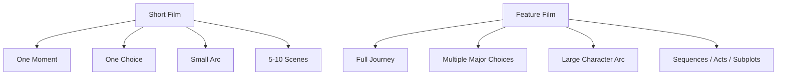

Feature film adalah sistem naratif panjang. Jika short adalah unit test emosional, feature adalah application architecture.

---

## 1. Prinsip Kaufman dalam Part Ini

Dalam pendekatan *The First 20 Hours*, kita tidak perlu langsung menulis feature sempurna. Kita perlu memahami bagian-bagian feature yang membuatnya “berjalan”.

Sub-skill penting feature film:

1. Mengontrol scope.
2. Mendesain protagonist journey.
3. Membuat central dramatic question yang sustain.
4. Membagi cerita menjadi acts dan sequences.
5. Mendesain escalation bertahap.
6. Menjaga tension tidak habis terlalu cepat.
7. Menggunakan subplot dengan fungsi.
8. Menjaga theme berkembang.
9. Mengelola world expansion.
10. Mendesain midpoint reframe.
11. Membuat climax yang membayar arc.
12. Menulis outline/treatment sebelum draft.
13. Menjaga produksi tetap feasible.

Target praktis:

```text
Mampu membuat blueprint feature film 8 sequence / 3 act / 40-60 beat yang bisa menjadi dasar treatment dan first draft.
```

Bukan langsung menulis 120 halaman.  
Kita mulai dari arsitektur.

---

## 2. Apa Itu Feature Film?

Feature film adalah film berdurasi panjang, umumnya sekitar 80–120 menit, yang membawa penonton melalui perjalanan dramatik lengkap.

Dalam konteks screenwriting praktis, feature film butuh:

- satu premise kuat,
- protagonist dengan want/need,
- central conflict,
- stakes yang meningkat,
- antagonistic force aktif,
- struktur yang menahan perhatian,
- beberapa turning point besar,
- sequence yang punya mini-objective,
- emotional arc,
- ending yang terasa earned.

Definisi kerja:

> Feature film adalah perjalanan dramatik panjang di mana protagonist mengejar want yang semakin mahal, menghadapi opposition yang semakin kuat, dan dipaksa berubah atau gagal berubah melalui rangkaian pilihan yang meningkat.

Feature bukan hanya plot panjang. Feature adalah **perubahan panjang**.

---

## 3. Feature Film sebagai Sistem

Untuk software engineer, feature film bisa dipikirkan sebagai sistem multi-layer:

```text
FeatureFilm {
  premise
  genrePromise
  themeQuestion
  protagonistArc
  centralDramaticQuestion
  actStructure
  sequences[]
  subplots[]
  worldExpansion
  escalationLadder
  payoffNetwork
}
```

Feature gagal jika layer-layer ini tidak sinkron.

Misalnya:

- plot bergerak, tetapi arc karakter tidak berubah,
- theme menarik, tetapi scene tidak dramatis,
- world luas, tetapi protagonist pasif,
- sequence banyak, tetapi stakes tidak naik,
- subplot menarik, tetapi tidak memengaruhi ending,
- ending spektakuler, tetapi tidak membayar setup emosional.

Feature membutuhkan integrasi.

Diagram:

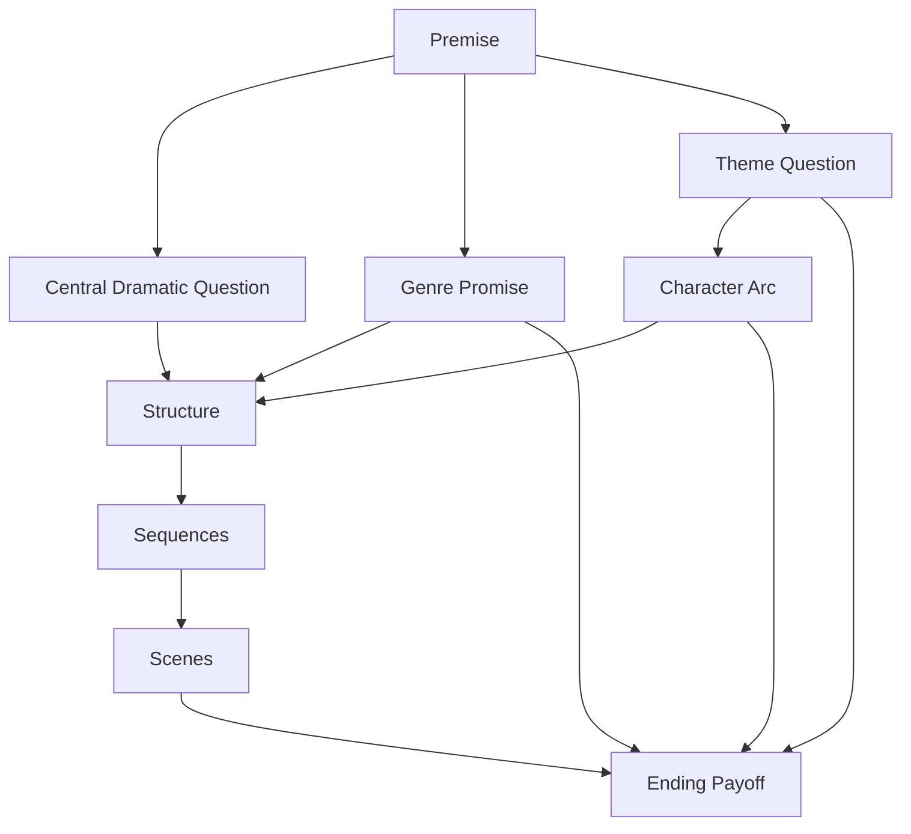

---

## 4. Feature Film Bukan Cerita yang “Banyak Kejadian”

Kejadian banyak tidak sama dengan cerita panjang yang kuat.

Feature lemah sering seperti:

```text
Terjadi ini.
Lalu itu.
Lalu karakter pergi ke tempat lain.
Lalu ada karakter baru.
Lalu ada flashback.
Lalu ada konflik lain.
Lalu ending.
```

Feature kuat terasa seperti:

```text
Karena kejadian A, protagonist memilih B.
Pilihan B menciptakan konsekuensi C.
Konsekuensi C memaksa strategi D.
Strategi D membuka truth E.
Truth E membuat old self tidak cukup lagi.
Akhirnya protagonist harus memilih F.
```

Feature membutuhkan causality dan escalation.

Bukan:

```text
And then...
And then...
And then...
```

Melainkan:

```text
Therefore...
But...
So...
Because...
Until...
```

---

## 5. Central Dramatic Question Feature

Film panjang butuh central dramatic question yang cukup kuat untuk sustain.

Short:

```text
Apakah Naya akan menjawab telepon?
```

Feature:

```text
Apakah Raka akan mengungkap kebenaran tentang rumah keluarganya meskipun kebenaran itu menghancurkan posisi moralnya sendiri?
```

Central dramatic question feature harus:

- punya scope cukup panjang,
- bisa berubah fase,
- punya stakes meningkat,
- terkait protagonist arc,
- terkait genre,
- punya ending yang bisa membayar.

Contoh CDQ feature:

```text
Apakah seorang anak yang pulang untuk menjual rumah warisan bisa membuka rahasia ayahnya tanpa menghancurkan ibu dan adiknya?
```

Atau lebih tajam:

```text
Apakah Raka akan tetap menjual rumah untuk menyelamatkan hidupnya sendiri, atau membuka dokumen yang membuktikan keluarganya ikut merampas hidup orang lain?
```

CDQ feature bukan hanya “apa yang terjadi”, tapi “apa yang dipilih karakter saat biaya kebenaran meningkat”.

---

## 6. Feature Scope

Scope feature lebih luas dari short, tetapi tetap harus terkontrol.

Scope mencakup:

- durasi,
- jumlah karakter,
- jumlah lokasi,
- rentang waktu,
- jumlah subplot,
- genre demand,
- worldbuilding,
- budget,
- timeline,
- emotional range,
- institutional scale.

Feature pemula sering gagal karena scope terlalu besar:

```text
Banyak kota.
Banyak periode waktu.
Banyak karakter.
Banyak twist.
Banyak institusi.
Banyak tema.
Banyak genre.
```

Rule:

```text
Feature boleh luas, tapi harus punya pusat gravitasi.
```

Pusat gravitasi bisa:

- protagonist,
- rumah,
- kasus,
- relasi,
- objek,
- perjalanan,
- institusi,
- satu moral question.

---

## 7. Scope Center

Tentukan center.

Template:

```text
Center of story:
Everything must orbit around:
What can expand:
What must stay contained:
```

Contoh:

```text
Center of story:
Rumah lama keluarga Raka.

Everything must orbit around:
Apakah rumah dijual, dibuka, atau dibiarkan menjadi arsip kebohongan.

What can expand:
Notaris, warga, pembeli, masa lalu ayah, korban lama.

What must stay contained:
Emotional core Raka-Ibu-Dina.
```

Ini mencegah feature melebar menjadi drama hukum nasional yang kehilangan keluarga.

---

## 8. Feature vs Short: Expansion yang Benar

Short version:

```text
Raka meminta kunci kepada Ibu/Dina dalam satu malam.
```

Feature version:

```text
Raka pulang untuk menjual rumah, menemukan bahwa rumah terkait kasus lama ayah, lalu setiap langkah legal untuk menjual rumah membuka lapisan kebohongan yang membuatnya memilih antara menyelamatkan dirinya atau membuka kebenaran.
```

Expansion yang benar bukan menambah random event.

Expansion harus menambah:

- phase conflict,
- deeper stakes,
- broader consequence,
- richer character arc,
- world pressure,
- moral complexity,
- stronger antagonist,
- payoff network.

---

## 9. Feature Structure Overview

Ada banyak model struktur:

- Three-Act Structure,
- Four-Act Structure,
- Sequence Approach,
- Save the Cat style beat sheet,
- Hero’s Journey,
- Mini-movie structure,
- Kishōtenketsu,
- episodic/ensemble structure,
- non-linear structure.

Untuk 20 jam pertama, paling praktis:

```text
Three-Act + Eight-Sequence Approach
```

Karena membantu mengelola durasi.

Diagram umum:

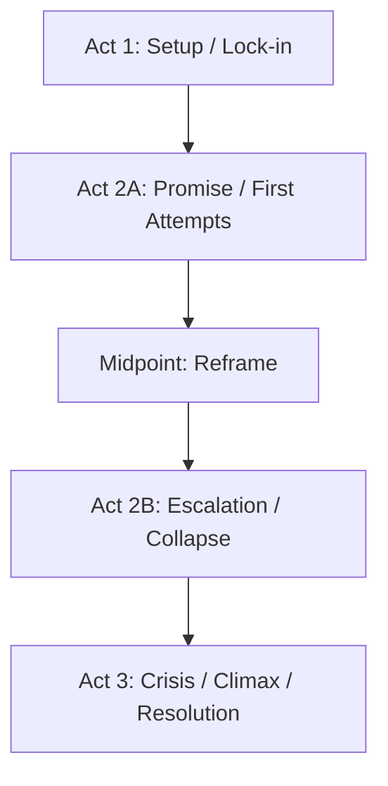

Eight sequence:

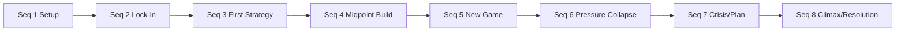

---

## 10. Three-Act Structure untuk Feature

### Act 1 — Setup and Commitment

Fungsi:

- memperkenalkan protagonist,
- menunjukkan current world,
- menunjukkan flaw/defense,
- memicu inciting incident,
- memperkenalkan central conflict,
- membawa protagonist ke point of no return.

Durasi kasar:

```text
±25% film
```

### Act 2 — Confrontation and Transformation Pressure

Fungsi:

- protagonist mencoba strategi lama,
- konflik melebar,
- stakes naik,
- antagonist/opposition menguat,
- midpoint mengubah pemahaman,
- protagonist kehilangan kontrol,
- old self runtuh.

Durasi kasar:

```text
±50% film
```

### Act 3 — Crisis, Choice, Climax, Resolution

Fungsi:

- protagonist menghadapi konsekuensi penuh,
- membuat pilihan final,
- confronts antagonist/system/self,
- theme dijawab melalui action,
- final image membayar journey.

Durasi kasar:

```text
±25% film
```

Three-act membantu, tapi terlalu besar. Karena itu sequence approach berguna.

---

## 11. Eight-Sequence Approach

Sequence adalah mini-film 10–15 menit dengan objective, conflict, escalation, dan turn sendiri.

Feature 90–120 menit sering bisa dibagi menjadi 8 sequence.

Setiap sequence punya:

```text
Mini-goal
Mini-conflict
Mini-turn
New story state
```

Tabel:

| Sequence | Approx Position | Function |
|---|---:|---|
| Seq 1 | 0–12 min | Setup world/protagonist/tension |
| Seq 2 | 12–25 min | Inciting pressure → lock-in |
| Seq 3 | 25–40 min | First attempts in new situation |
| Seq 4 | 40–55 min | Complication → midpoint reframe |
| Seq 5 | 55–70 min | New game after midpoint |
| Seq 6 | 70–85 min | Escalation/collapse/all is lost |
| Seq 7 | 85–100 min | Crisis, new plan, final preparation |
| Seq 8 | 100–115 min | Climax, resolution, final image |

Durasi fleksibel. Fungsi lebih penting daripada angka.

---

## 12. Sequence sebagai Service Module

Untuk software engineer:

```text
Sequence = module yang mengubah story state besar.
```

Pseudo:

```text
Sequence(inputStoryState) -> outputStoryState
```

Contoh:

```text
Seq 1 input:
Raka hidup di kota, menganggap rumah sebagai aset.

Seq 1 output:
Raka dipaksa pulang karena penjualan rumah membutuhkan kehadiran keluarga.
```

```text
Seq 4 input:
Raka mengira ayah satu-satunya pelaku masa lalu.

Seq 4 output:
Raka menemukan tanda tangannya sendiri di dokumen lama.
```

Setiap sequence harus menghasilkan perubahan besar.

---

## 13. Sequence Template

```text
# Sequence Template

Sequence Number:
Approx Pages:
Story Function:
Mini Dramatic Question:
Protagonist Goal:
Opposition:
Key Scenes:
Escalation:
Reveal/Turn:
Output State:
Setup/Payoff:
Genre Function:
Theme Pressure:
```

Contoh singkat:

```text
Sequence Number:
4

Story Function:
Membangun menuju midpoint reframe.

Mini Dramatic Question:
Bisakah Raka menemukan bukti bahwa ayahnya korban sebelum pembeli mengambil rumah?

Protagonist Goal:
Masuk ruang kerja dan menemukan dokumen pembela ayah.

Opposition:
Ibu menyembunyikan kunci; Dina tidak percaya Raka; pembeli menekan deadline.

Reveal/Turn:
Dokumen tidak membela ayah. Dokumen menunjukkan tanda tangan Raka.

Output State:
Raka kehilangan posisi moral sebagai outsider innocent.

Theme Pressure:
Kebenaran tidak hanya menyakitkan keluarga; ia juga menyeret protagonist.
```

---

## 14. Eight Sequence Blueprint Example

Untuk ide feature “Kunci di Leher Ibu”:

### Sequence 1 — Return to Asset

```text
Raka di kota hampir disita apartemennya. Ia memutuskan menjual rumah lama. Ia pulang dengan map penjualan, bukan niat berdamai.
```

Output:

```text
Raka tiba di rumah dan melihat rumah tidak tunduk pada logika transaksinya.
```

### Sequence 2 — The Locked House

```text
Raka tahu rumah tidak bisa dijual tanpa tanda tangan Ibu dan akses dokumen di ruang kerja ayah. Ibu menolak. Kunci terlihat di lehernya.
```

Output:

```text
Raka terkunci dalam konflik keluarga dan legal.
```

### Sequence 3 — First Strategy: Control

```text
Raka mencoba memakai notaris, pembeli, dan tekanan ekonomi. Dina mulai curiga. Warga memberi sinyal kasus ayah belum selesai.
```

Output:

```text
Strategi teknis Raka gagal; rumah punya sejarah sosial.
```

### Sequence 4 — Midpoint Build: Open the Room

```text
Raka akhirnya masuk ruang kerja dan menemukan dokumen yang ia harap akan membuktikan ayah korban.
```

Output:

```text
Midpoint: tanda tangan Raka sendiri ada di surat lama.
```

### Sequence 5 — New Game: Raka as Participant

```text
Raka mencoba memahami keterlibatannya. Ibu mengatakan ia melindunginya. Pembeli mengungkap ancaman lebih besar.
```

Output:

```text
Kebenaran bukan hanya tentang ayah; Raka harus memilih self-preservation atau accountability.
```

### Sequence 6 — Collapse: Family Break

```text
Dina tahu Raka hampir menutup bukti demi menyelamatkan dirinya. Ibu sakit/tertekan. Pembeli datang lebih cepat.
```

Output:

```text
Raka kehilangan kepercayaan Dina dan gagal menjual rumah dengan bersih.
```

### Sequence 7 — Crisis: What Is Home?

```text
Raka hampir pergi. Ia menemukan satu trace bahwa korban lama masih hidup/menunggu keadilan. Ia memutuskan kembali.
```

Output:

```text
Raka memilih membuka kebenaran meski dirinya ikut jatuh.
```

### Sequence 8 — Climax: Open House / Open Wound

```text
Di depan pembeli, notaris, keluarga, dan saksi, Raka membuka dokumen dan mengubah transaksi rumah menjadi pengakuan.
```

Output:

```text
Rumah tidak lagi dijual sebagai aset bersih; ia menjadi tempat kebenaran keluar. Final image membayar kunci/pintu/meja.
```

---

## 15. Feature Arc

Feature membutuhkan arc yang lebih panjang daripada short.

Short arc:

```text
Menghindari telepon → menjawab telepon.
```

Feature arc:

```text
Melihat rumah sebagai aset → melihat rumah sebagai arsip moral → memilih kebenaran daripada kontrol/transaksi.
```

Feature arc harus punya fase.

Contoh arc Raka:

| Phase | State |
|---|---|
| Start | Raka menghindari emosi lewat logika transaksi |
| Act 1 end | Ia dipaksa pulang dan menghadapi keluarga |
| Act 2A | Ia mencoba mengontrol lewat dokumen/uang |
| Midpoint | Ia sadar dirinya terkait kebohongan |
| Act 2B | Ia mencoba menyelamatkan diri dan kehilangan trust |
| Crisis | Ia harus memilih antara self-protection dan truth |
| Climax | Ia membuka kebenaran dengan cost |
| End | Ia tidak “sembuh total”, tapi berhenti memakai kontrol sebagai pelarian |

Arc feature = perubahan melalui beberapa pilihan, bukan satu pilihan.

---

## 16. Want, Need, Lie di Feature

Feature harus menjaga dinamika want/need/lie.

Template:

```text
Want:
Apa yang protagonist kejar secara eksternal.

Need:
Apa yang harus dipahami/dilakukan agar berubah.

Lie:
Keyakinan salah yang membuat protagonist mengejar want dengan cara merusak.
```

Contoh:

```text
Want:
Menjual rumah untuk menyelesaikan masalah uang dan menutup masa lalu.

Need:
Menghadapi kebenaran dan relasi tanpa mengubah semuanya menjadi transaksi.

Lie:
Jika semua dokumen selesai, luka keluarga juga selesai.
```

Feature menekan lie sampai pecah.

---

## 17. Arc Pressure Ladder

Arc harus diuji bertahap.

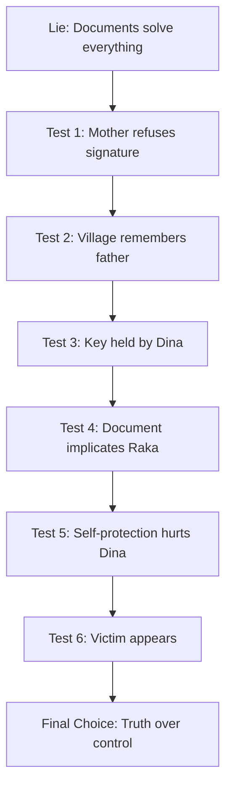

Setiap test harus lebih mahal.

---

## 18. External Plot vs Internal Arc

Feature kuat mengikat external plot dan internal arc.

External plot:

```text
Raka ingin menjual rumah dan menemukan dokumen.
```

Internal arc:

```text
Raka harus berhenti menghindari rasa bersalah lewat kontrol.
```

Keduanya harus saling memengaruhi.

Tabel:

| External Event | Internal Pressure |
|---|---|
| Ibu menolak tanda tangan | Raka harus bicara, bukan hanya proses dokumen |
| Kunci di leher Ibu | Raka tidak punya akses ke masa lalu |
| Dina memegang kunci | Raka harus meminta, bukan memerintah |
| Dokumen mencantumkan tanda tangan Raka | Raka tidak bisa lagi merasa innocent |
| Pembeli menekan deadline | Raka tergoda menutup truth |
| Korban lama muncul | Moral stakes mengalahkan family-only stakes |
| Climax pengakuan | Raka memilih accountability |

Jika external plot tidak menekan internal arc, cerita terasa mekanis.

---

## 19. Sustained Tension

Sustained tension adalah kemampuan cerita mempertahankan tekanan sepanjang feature.

Tension bukan hanya action cepat. Tension adalah gap aktif antara:

```text
What character wants
vs
What blocks them
vs
What will happen if they fail
vs
What they don't know yet
vs
What they are afraid to admit
```

Feature membutuhkan tension yang berubah bentuk.

Jenis tension:

- plot tension,
- emotional tension,
- moral tension,
- relationship tension,
- mystery tension,
- time tension,
- social tension,
- economic tension,
- physical danger,
- genre tension.

Jika hanya satu jenis tension, film bisa lelah.

---

## 20. Tension Stack

Tension harus bertumpuk.

Contoh:

```text
Plot:
Raka harus menjual rumah.

Economic:
Ia butuh uang.

Legal:
Ibu harus tanda tangan.

Family:
Ibu menolak karena rahasia.

Mystery:
Ruang kerja terkunci.

Social:
Warga tahu kasus lama.

Moral:
Raka mungkin ikut bersalah.

Time:
Pembeli datang besok.

Relationship:
Dina tidak percaya Raka.
```

Tension stack:

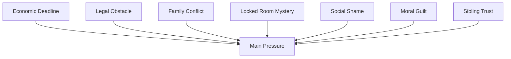

Feature sustain karena pressure datang dari banyak arah yang saling terkait.

---

## 21. Tension Progression

Tension harus berkembang.

Buruk:

```text
Raka ingin tanda tangan.
Ibu menolak.
Raka minta lagi.
Ibu menolak lagi.
Raka minta lagi.
Ibu menolak lagi.
```

Statis.

Lebih baik:

```text
Raka ingin tanda tangan.
Ibu menolak.
Raka mencari notaris.
Notaris menunjukkan legal obstacle.
Raka mencari kunci.
Kunci pindah ke Dina.
Raka masuk ruang kerja.
Dokumen implicates Raka.
Pembeli menggunakan informasi itu.
Dina mengetahui Raka hampir menutupinya.
```

Setiap step mengubah bentuk konflik.

---

## 22. Escalation

Escalation bukan hanya “lebih besar”. Escalation adalah “lebih mahal”.

Jenis escalation:

1. Stakes naik.
2. Pilihan mengecil.
3. Waktu menipis.
4. Informasi baru memperburuk.
5. Relasi rusak.
6. Power berpindah ke lawan.
7. Resource hilang.
8. Moral cost meningkat.
9. Public exposure meningkat.
10. Antagonis lebih dekat.
11. Strategi lama gagal.
12. Protagonist harus mengorbankan sesuatu.

Escalation feature harus bertahap dan variatif.

---

## 23. Escalation Ladder Feature

Contoh:

```text
Step 1:
Raka butuh tanda tangan.

Step 2:
Ibu menolak.

Step 3:
Dokumen ada di ruang terkunci.

Step 4:
Kunci dipegang Ibu.

Step 5:
Kunci diberikan ke Dina.

Step 6:
Warga menyebut kasus lama.

Step 7:
Notaris menunjukkan rumah atas nama Ibu.

Step 8:
Dokumen menunjukkan tanda tangan Raka.

Step 9:
Pembeli menggunakan ini untuk memeras.

Step 10:
Dina tahu Raka hampir menutup kebenaran.

Step 11:
Korban lama muncul.

Step 12:
Raka harus membuka bukti di depan semua orang.
```

Diagram:

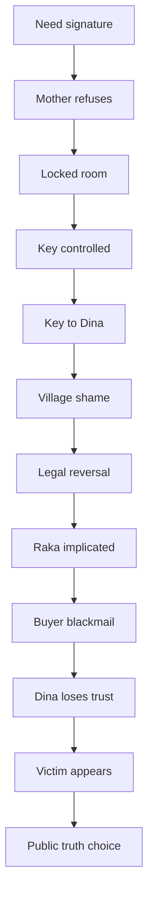

---

## 24. Rising Action vs Repetition

Rising action berarti setiap event mengubah keadaan.

Repetition berarti event sama diulang.

Cek:

```text
Apakah scene berikutnya hanya versi lain dari konflik sebelumnya?
```

Jika ya, ubah dengan:

- informasi baru,
- lokasi baru yang punya pressure berbeda,
- pihak ketiga,
- deadline,
- perubahan power,
- hidden agenda,
- object berpindah,
- konsekuensi lebih mahal.

Feature harus punya variation, bukan loop.

---

## 25. Midpoint

Midpoint adalah turning point besar di tengah film.

Fungsi midpoint:

- mengubah pemahaman,
- mengubah goal,
- menaikkan stakes,
- mengungkap truth penting,
- mengubah protagonist dari reactive ke active atau sebaliknya,
- membalik power,
- membuat film terasa memasuki “game baru”.

Midpoint bukan sekadar event besar. Midpoint adalah reframe.

Contoh midpoint lemah:

```text
Raka bertengkar lagi dengan Ibu.
```

Midpoint kuat:

```text
Raka menemukan tanda tangannya sendiri di dokumen yang ia kira akan membuktikan ayahnya korban.
```

Sebelum midpoint:

```text
Raka mencari kebenaran tentang ayah.
```

Setelah midpoint:

```text
Raka mencari cara menghadapi kebenaran tentang dirinya.
```

Game berubah.

---

## 26. Midpoint Types

Jenis midpoint:

| Type | Fungsi |
|---|---|
| False victory | Protagonist merasa menang, ternyata harga besar |
| False defeat | Protagonist kalah, tapi mendapat truth baru |
| Major reveal | Pemahaman cerita berubah |
| Commitment | Protagonist memilih masuk lebih dalam |
| Point of no return | Tidak bisa kembali ke status awal |
| Antagonist reveal | Lawan sebenarnya terlihat |
| Moral reversal | Protagonist tidak sebersih yang dikira |
| Relationship turn | Trust/intimacy berubah besar |

Untuk family mystery drama, midpoint “moral reversal” sangat kuat.

---

## 27. Act 2 Problem

Act 2 sering menjadi bagian paling sulit. Banyak script melemah di tengah.

Gejala Act 2 lemah:

- protagonist hanya bereaksi,
- scene terasa episodic,
- antagonist tidak aktif,
- stakes tidak naik,
- subplot random,
- midpoint tidak kuat,
- character arc stagnan,
- terlalu banyak exposition,
- konflik berulang.

Solusi:

```text
Gunakan sequence goals.
```

Setiap sequence Act 2 harus punya mini-objective.

Contoh:

```text
Seq 3 goal:
Raka mencoba menyelesaikan penjualan secara legal tanpa membuka ruang kerja.

Seq 4 goal:
Raka mencoba membuka ruang kerja untuk menemukan dokumen pembela ayah.

Seq 5 goal:
Setelah midpoint, Raka mencoba memahami/menutup keterlibatannya sendiri.

Seq 6 goal:
Raka mencoba menyelamatkan keluarga sekaligus dirinya, tapi kehilangan Dina.
```

Goals berubah. Act 2 hidup.

---

## 28. Sequence Goals

Setiap sequence butuh goal.

Template:

```text
In this sequence, protagonist tries to [goal] by [strategy], but [opposition], resulting in [turn].
```

Contoh:

```text
Seq 3:
Raka mencoba memproses penjualan melalui notaris dan pembeli tanpa melibatkan drama keluarga, tetapi legal ownership dan stigma warga memaksanya kembali ke Ibu, menghasilkan kesadaran bahwa rumah tidak bisa diproses seperti aset biasa.
```

Seq goals menjaga momentum.

---

## 29. Character Agency di Feature

Feature membutuhkan protagonist aktif.

Aktif bukan berarti selalu benar atau heroik. Aktif berarti ia membuat pilihan yang menimbulkan konsekuensi.

Protagonist pasif:

```text
Raka diberi info oleh Ibu, diberi info oleh notaris, diberi info oleh pembeli, lalu ending terjadi.
```

Protagonist aktif:

```text
Raka menekan Ibu, mencari notaris, mencoba mengambil kunci, membohongi Dina, membuka ruang, menyembunyikan dokumen, lalu akhirnya membuka kebenaran.
```

Bahkan pilihan salah tetap agency.

Feature lebih menarik ketika protagonist ikut menyebabkan masalah.

---

## 30. Protagonist Strategy Evolution

Feature harus menunjukkan strategi berubah.

Raka:

| Phase | Strategy | Why Fails |
|---|---|---|
| Act 1 | Treat house as asset | Family/legal/emotional reality blocks |
| Act 2A | Use documents/process | Documents reveal hidden truth |
| Midpoint | Find proof father innocent | Proof implicates Raka |
| Act 2B | Contain damage | Hurts Dina, empowers buyer |
| Crisis | Leave/escape | Cannot live with lie |
| Act 3 | Public truth/action | Costs him but completes arc |

Strategi adalah cara arc terlihat.

---

## 31. Antagonistic Force di Feature

Feature butuh opposition yang sustain.

Opposition bisa:

- villain,
- institution,
- family system,
- mystery,
- environment,
- time,
- self,
- economy,
- society.

Dalam feature, sebaiknya ada **opposition network**.

Contoh:

```text
Ibu:
Emotional gatekeeper.

Dina:
Trust obstacle and moral mirror.

Pembeli:
External antagonist with money and old secret.

Notaris/Legal system:
Institutional obstacle.

Warga/Korban:
Social/moral pressure.

Raka himself:
Internal antagonist through avoidance and control.
```

Setiap opposition punya fase.

---

## 32. Antagonist Escalation

Antagonis/oposisi harus juga bergerak.

Pembeli:

```text
Seq 1:
Hanya nama di telepon.

Seq 2:
Memberi deadline.

Seq 3:
Mengirim notaris/pesan.

Seq 4:
Tahu soal ruang kerja.

Seq 5:
Menggunakan dokumen implicating Raka.

Seq 6:
Datang lebih cepat / memeras.

Seq 7:
Menawarkan deal untuk menutup semuanya.

Seq 8:
Dikonfrontasi di ruang publik/rumah.
```

Antagonis tidak boleh diam sampai climax.

---

## 33. Subplot

Subplot adalah jalur cerita pendukung yang memperdalam main plot, theme, dan character arc.

Subplot buruk:

```text
Tambahan cerita yang tidak memengaruhi main conflict.
```

Subplot baik:

```text
Jalur pendukung yang menekan protagonist dari angle berbeda dan membayar theme.
```

Jenis subplot:

- relationship subplot,
- mentor/ally subplot,
- antagonist subplot,
- institutional subplot,
- romance subplot,
- moral mirror subplot,
- external pressure subplot,
- mystery clue subplot.

Feature bisa punya subplot, tetapi setiap subplot harus punya fungsi.

---

## 34. Subplot Function

Subplot harus melakukan minimal satu:

1. Menguji theme dari sudut lain.
2. Menekan flaw protagonist.
3. Menaikkan stakes main plot.
4. Memberi contrast/mirror.
5. Memberi emotional payoff.
6. Menyiapkan climax.
7. Menunjukkan consequence.
8. Membuka world.
9. Mengubah decision protagonist.
10. Menjadi setup/payoff.

Jika subplot tidak melakukan ini, potong.

---

## 35. Subplot Example

Main plot:

```text
Raka ingin menjual rumah dan membuka rahasia dokumen.
```

Potential subplot Dina:

```text
Dina ingin pergi dari rumah untuk kuliah/kerja, tetapi merasa harus menjaga Ibu.
```

Fungsi:

- mirror Raka: sama-sama ingin pergi,
- menekan guilt Raka,
- membuat kunci berpindah tangan,
- memberi emotional stakes,
- memaksa Raka melihat akibat kepergiannya.

Potential subplot Ibu:

```text
Ibu sakit/menyembunyikan obat karena tidak mau jadi alasan Raka tinggal.
```

Fungsi:

- care vs control,
- Raka belajar merawat bukan membeli solusi,
- time pressure emosional.

Potential subplot korban lama:

```text
Satu warga tua mencari pengakuan, bukan uang.
```

Fungsi:

- membuka stakes moral di luar keluarga,
- menghindari cerita hanya self-pity keluarga.

Subplot harus kembali ke main choice.

---

## 36. Subplot Arc

Subplot juga butuh mini-arc.

Template:

```text
Subplot:
Character:
Want:
Conflict:
First appearance:
Midpoint relation to main plot:
Crisis:
Payoff:
How it affects climax:
```

Contoh:

```text
Subplot:
Dina's trust.

Character:
Dina.

Want:
Tahu kebenaran dan tidak ditinggal lagi.

Conflict:
Ia tidak percaya Raka; Ibu menyembunyikan; Raka manipulatif.

First appearance:
Dina menyindir Raka pulang bawa map.

Midpoint:
Dina melihat Raka ikut terseret dokumen.

Crisis:
Dina tahu Raka hampir menutup bukti.

Payoff:
Dina memberi Raka salinan dokumen hanya setelah ia mengakui kesalahannya.

Affects climax:
Tanpa trust Dina, Raka tidak bisa membuka kebenaran.
```

---

## 37. Subplot Integration

Subplot tidak boleh jalan sendiri terlalu lama.

Cara integrasi:

- subplot scene juga memberi main plot info,
- subplot object menjadi clue,
- subplot relationship memengaruhi decision,
- subplot payoff dibutuhkan di climax,
- subplot mirror theme,
- subplot scene punya consequence main line.

Diagram:

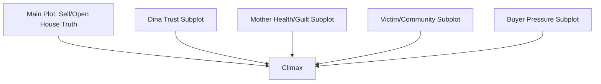

Semua jalan menuju climax.

---

## 38. Ensemble vs Single Protagonist

Feature bisa single protagonist atau ensemble.

Untuk belajar, lebih aman single protagonist.

Single protagonist:

```text
Raka adalah pusat keputusan.
```

Ensemble:

```text
Banyak karakter punya arc setara.
```

Ensemble jauh lebih sulit karena:

- banyak POV,
- banyak arc,
- struktur lebih kompleks,
- ending harus membayar banyak line,
- scope mudah melebar.

Untuk first feature blueprint, pilih protagonist utama yang jelas.

---

## 39. World Expansion di Feature

Feature bisa memperluas dunia lebih dari short, tetapi bertahap.

Contoh expansion:

| Phase | World Layer |
|---|---|
| Act 1 | Rumah keluarga |
| Act 2A | Warga/warung/notaris |
| Midpoint | Ruang kerja/dokumen masa lalu |
| Act 2B | Pembeli/korban/sistem |
| Act 3 | Rumah sebagai ruang publik kebenaran |

World expansion harus mengikuti story need.

Jangan buka dunia terlalu luas di awal.

---

## 40. Feature World Control

Gunakan concentric expansion:

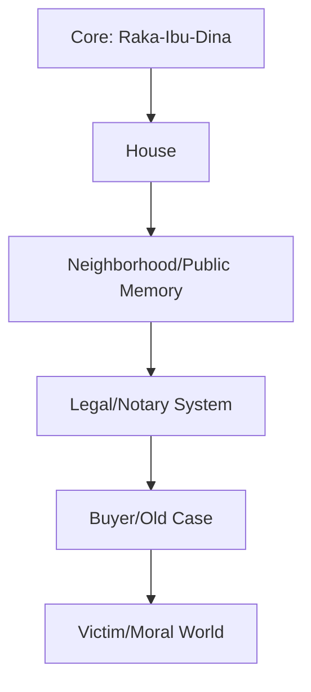

Setiap lingkaran harus tetap terhubung ke core.

Jika film keluar ke dunia besar tetapi lupa Raka-Ibu-Dina, emotional center hilang.

---

## 41. Theme Development Feature

Tema feature berkembang, bukan hanya disebut sekali.

Theme question:

```text
Apakah keluarga harus dilindungi meskipun dengan kebohongan?
```

Theme progression:

| Phase | Thematic Argument |
|---|---|
| Act 1 | Kebohongan sebagai cara keluarga bertahan |
| Act 2A | Kebohongan menghambat transaksi dan trust |
| Midpoint | Kebohongan juga melibatkan protagonist |
| Act 2B | Menutup kebohongan berarti mengorbankan orang lain |
| Crisis | Melindungi keluarga vs melindungi kebenaran tidak bisa dipisah |
| Climax | Keluarga yang layak diselamatkan harus berhenti mewariskan kebohongan |
| End | Kebenaran tidak memperbaiki semua, tapi membuka kemungkinan relasi baru |

Theme harus diuji lewat plot choices.

---

## 42. Thematic Characters

Feature bisa punya karakter yang mewakili jawaban berbeda terhadap theme.

Contoh:

| Character | Position |
|---|---|
| Raka | Kebenaran sebagai alat kontrol/transaksi, lalu accountability |
| Ibu | Kebohongan sebagai perlindungan |
| Dina | Kebenaran sebagai syarat trust |
| Pembeli | Kebohongan sebagai komoditas |
| Korban lama | Kebenaran sebagai pemulihan martabat |
| Notaris | Kebenaran legal, bukan moral |
| Warga | Kebenaran sosial yang dibisikkan |

Karakter bukan mouthpiece. Mereka hidup, tapi punya thematic pressure.

---

## 43. Feature Beat Density

Feature membutuhkan beat density yang cukup.

Jika 90 menit punya terlalu sedikit turning point, terasa lambat.

Jika terlalu banyak, terasa overplotted.

Panduan kasar:

- major turning point setiap 10–15 menit,
- scene turn hampir setiap scene,
- emotional beat kecil dalam scene,
- reveal besar beberapa kali,
- quiet aftermath setelah major turn.

Tension bukan nonstop. Butuh breath.

---

## 44. Breath dan Aftermath

Feature butuh aftermath.

Setelah reveal besar, beri ruang untuk:

- karakter memproses,
- relasi berubah,
- strategi baru,
- emotional consequence.

Tanpa aftermath, film terasa mekanis.

Contoh:

Midpoint reveal tanda tangan Raka.

Aftermath scene:

```text
Raka mencuci tangannya berulang-ulang di dapur.

Dina melihat dari pintu.

DINA
Tinta lama tidak keluar pakai sabun.
```

Ini aftermath + character + theme.

---

## 45. Rhythm Feature

Feature harus punya rhythm:

```text
Pressure → Reaction → New Plan → Complication → Reveal → Aftermath → New Pressure
```

Diagram:

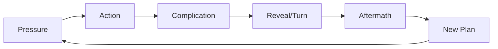

Jika hanya pressure tanpa aftermath, penonton lelah.

Jika hanya aftermath tanpa pressure, penonton bosan.

---

## 46. Act Breaks

Act break adalah titik perubahan besar.

### Act 1 Break

Protagonist tidak bisa kembali ke dunia lama.

Contoh:

```text
Raka tahu rumah tidak bisa dijual tanpa membuka ruang kerja dan menghadapi Ibu/Dina. Pembeli memberi deadline. Ia memutuskan tinggal semalam.
```

### Midpoint

Pemahaman cerita berubah.

```text
Dokumen menunjukkan tanda tangan Raka.
```

### Act 2 Break / All Is Lost

Strategi protagonist runtuh.

```text
Raka kehilangan trust Dina, Ibu collapse, pembeli memegang leverage, dan rumah hampir jatuh ke tangan salah.
```

### Act 3 Break

Protagonist memilih final action.

```text
Raka kembali membawa salinan dokumen untuk membuka kebenaran.
```

Act break harus mengubah arah cerita.

---

## 47. Inciting Incident

Inciting incident adalah kejadian yang mengganggu status quo.

Contoh:

```text
Raka mendapat notice bahwa apartemennya akan disita / utangnya jatuh tempo, sehingga ia memutuskan menjual rumah lama.
```

Atau:

```text
Pembeli lama menghubungi Raka dengan tawaran cepat untuk rumah keluarga.
```

Inciting incident harus:

- menekan protagonist,
- terkait want,
- membuka central conflict,
- memicu action.

Inciting incident bukan harus spektakuler. Harus efektif.

---

## 48. Lock-In

Lock-in adalah titik protagonist masuk ke cerita dan tidak mudah keluar.

Contoh:

```text
Raka pulang dan tahu:
1. Rumah tidak bisa dijual tanpa Ibu.
2. Dokumen utama ada di ruang kerja ayah.
3. Pembeli datang dalam 48 jam.
4. Dina menolak membantunya.
```

Sekarang ia harus tinggal dan bertindak.

Lock-in feature penting karena penonton bertanya:

```text
Kenapa ia tidak pergi saja?
```

Jawabannya harus kuat.

---

## 49. Point of No Return

Point of no return adalah pilihan yang membuat status lama tidak mungkin kembali.

Contoh:

```text
Raka mencuri/membuka kunci ruang kerja.
```

Atau:

```text
Raka berbohong kepada Dina untuk mendapat akses.
```

Atau:

```text
Raka menandatangani kesepakatan awal dengan pembeli.
```

Setelah itu, consequences aktif.

---

## 50. All Is Lost

All Is Lost adalah titik ketika strategi protagonist gagal total.

Contoh:

```text
Raka berhasil mendapatkan dokumen, tapi:
- dokumen implicates him,
- pembeli punya salinan,
- Dina merasa dikhianati,
- Ibu collapse,
- korban lama muncul,
- rumah tidak bisa dijual tanpa moral/legal disaster.
```

All Is Lost harus menyerang want dan need.

Want:

```text
Menjual rumah.
```

Need:

```text
Menghadapi kebenaran.
```

All is lost:

```text
Ia tidak bisa menjual rumah tanpa menutup kebenaran, dan ia tidak bisa membuka kebenaran tanpa menghancurkan dirinya.
```

---

## 51. Dark Night of the Soul

Setelah all is lost, character menghadapi dirinya.

Scene ini tidak harus melodramatis.

Contoh:

```text
Raka duduk di ruang kerja ayah.

Di meja: dokumen dengan tanda tangannya.

Ia mencoba menandatangani surat penjualan baru.

Tangannya berhenti di bentuk tanda tangan yang sama.

Untuk pertama kalinya, ia tidak bisa menyelesaikan tanda tangan.
```

Ini internal crisis visual.

Dark night menjawab:

```text
Siapa protagonist tanpa strategi lamanya?
```

---

## 52. Climax

Climax adalah tempat protagonist membuat pilihan final dan menghadapi opposition utama.

Climax harus membayar:

- central dramatic question,
- genre promise,
- character arc,
- theme,
- object arc,
- major setups,
- relationship stakes,
- antagonist conflict.

Contoh climax:

```text
Open house / notary meeting / family confrontation di rumah.
Raka bisa menutup dokumen dan menjual rumah, atau membuka kebenaran di depan semua orang.
Ia memilih membuka, meski tanda tangannya sendiri ada di sana.
```

Climax action visible:

```text
Raka menaruh dokumen di meja, bukan menyembunyikannya.
```

Internal meaning:

```text
Ia berhenti mengontrol narasi untuk menyelamatkan image.
```

---

## 53. Resolution

Resolution menunjukkan world/character state setelah climax.

Jangan terlalu panjang.

Resolution harus memberi:

- consequence,
- emotional closure,
- final image,
- new normal hint.

Contoh:

```text
Rumah tidak langsung bahagia.
Ibu duduk tanpa kunci di leher.
Dina membuka jendela ruang kerja.
Raka tidak membawa map penjualan saat pergi/atau tetap tinggal sebentar.
Kunci digantung di pintu, bukan di tubuh siapa pun.
```

Resolution tidak harus menyelesaikan semua legal detail. Harus menyelesaikan emotional/thematic arc.

---

## 54. Final Image Feature

Final image feature harus membayar opening.

Opening:

```text
Raka berdiri di luar pagar rumah dengan map penjualan, sepatu bersih, rumah tertutup.
```

Final:

```text
Raka di dalam rumah, tanpa sepatu, map tidak ada, pintu ruang kerja terbuka, kunci tergantung di pintu.
```

Perubahan:

- outsider → inside,
- asset → home/truth,
- control → accountability,
- closed → open.

Final image adalah proof of change.

---

## 55. Feature Treatment

Sebelum screenplay 100 halaman, buat treatment.

Treatment feature biasanya:

- 5–15 halaman untuk development awal,
- bisa lebih panjang untuk detail,
- ditulis prose present tense,
- fokus story flow,
- tidak perlu semua dialog,
- mencakup acts/sequences,
- menunjukkan arc dan ending.

Treatment membantu menemukan masalah sebelum menulis draft penuh.

---

## 56. Feature Outline

Outline lebih teknis dari treatment.

Outline bisa berupa:

```text
Act → Sequence → Scene → Beat
```

Template:

```text
ACT 1

Sequence 1:
Scene 1 — Opening image...
Scene 2 — Raka in city...
Scene 3 — Inciting pressure...
Turn: Raka decides to go home.

Sequence 2:
...
```

Outline membantu menulis draft.

Untuk feature pertama, jangan skip outline.

---

## 57. Feature Beat Sheet

Feature beat sheet bisa 40–60 beat.

Terlalu sedikit:

```text
Cerita masih kabur.
```

Terlalu banyak terlalu awal:

```text
Terjebak detail sebelum structure jelas.
```

Start dengan:

1. 8 sequence.
2. 5–7 beat per sequence.
3. Total 40–56 beat.
4. Lalu ubah beat menjadi scene list.

---

## 58. Feature Beat Sheet Template

```text
# Feature Beat Sheet

Title:
Genre:
Tone:
Central Dramatic Question:
Theme Question:
Protagonist Want:
Protagonist Need:
Main Opposition:
Ending:

## ACT 1

### Sequence 1 — Setup
1.
2.
3.
4.
5.
Turn:

### Sequence 2 — Lock-In
1.
2.
3.
4.
5.
Turn:

## ACT 2A

### Sequence 3 — First Strategy
1.
2.
3.
4.
5.
Turn:

### Sequence 4 — Midpoint Build
1.
2.
3.
4.
5.
Midpoint:

## ACT 2B

### Sequence 5 — New Game
1.
2.
3.
4.
5.
Turn:

### Sequence 6 — Collapse
1.
2.
3.
4.
5.
All Is Lost:

## ACT 3

### Sequence 7 — Crisis / Final Plan
1.
2.
3.
4.
5.
Turn:

### Sequence 8 — Climax / Resolution
1.
2.
3.
4.
5.
Final Image:
```

---

## 59. Feature Scene Count

Feature bisa punya 40–70 scenes, tergantung style.

Guideline kasar:

| Type | Scene Count |
|---|---:|
| Contained drama | 35–50 |
| Standard drama/thriller | 45–65 |
| Action/adventure | 60–90 |
| Slow-burn | 30–50 |
| Comedy | 45–70 |
| Mystery | 50–70 |

Lebih penting:

```text
Setiap scene mengubah state.
```

---

## 60. Page Count

Guideline kasar:

| Durasi | Pages |
|---:|---:|
| 80 min | 75–90 |
| 90 min | 85–100 |
| 100 min | 95–110 |
| 110 min | 105–120 |
| 120 min | 115–130 |

Untuk draft belajar, target:

```text
90–105 halaman.
```

Terlalu panjang untuk first feature sering tanda scope/exposition berlebihan.

---

## 61. Production-Aware Feature

Feature harus lebih sadar produksi karena durasi panjang memperbesar biaya.

Checklist scope:

- berapa lokasi utama?
- berapa lokasi sekunder?
- berapa karakter speaking?
- berapa extras?
- berapa malam?
- berapa kendaraan?
- berapa stunt?
- berapa VFX?
- berapa period detail?
- berapa company move?
- apakah bisa contained?

Untuk first feature low-budget, strategi:

```text
1–3 lokasi utama.
5–8 karakter speaking utama.
Sedikit extras.
Modern day.
Sedikit/no VFX.
Object-driven.
Performance-driven.
```

---

## 62. Contained Feature

Contained feature adalah feature dengan lokasi terbatas tetapi konflik panjang.

Cocok untuk:

- family drama,
- psychological thriller,
- horror,
- courtroom-like drama,
- hostage drama,
- mystery,
- survival,
- dark comedy.

Contained feature butuh:

- strong central conflict,
- spatial variation,
- relationship escalation,
- hidden information,
- strong object system,
- time pressure,
- power shifts.

Contoh contained feature:

```text
Satu rumah selama 48 jam sebelum dijual.
```

World bisa terasa luas lewat:

- telepon pembeli,
- warga yang datang,
- dokumen lama,
- rekaman ayah,
- notaris singkat,
- berita radio,
- satu korban lama.

---

## 63. Feature Location Strategy

Buat location hierarchy:

```text
Primary:
Rumah lama.

Secondary:
Warung depan, kantor notaris, terminal/kota.

Mentioned/off-screen:
Kota Raka, kantor pembeli, kasus lama, korban lain.
```

Setiap lokasi harus punya dramatic function.

Template:

```text
Location:
Function:
Scenes:
Production cost:
Can merge:
Can be off-screen:
```

---

## 64. Feature Character Roster

Buat roster.

```text
Protagonist:
Raka

Core:
Ibu, Dina

Antagonistic:
Pembeli/Darma

Institutional:
Notaris/Petugas

Social/moral:
Warga tua/Korban

Optional:
Agen properti, tetangga, debt collector via phone
```

Untuk feature pertama, hindari terlalu banyak named character.

Jika dua karakter punya fungsi sama, gabungkan.

---

## 65. Character Function Table

| Character | Story Function | Theme Function | Plot Function | Production Need |
|---|---|---|---|---|
| Raka | Protagonist | Accountability vs control | Drives investigation/sale | Main actor |
| Ibu | Gatekeeper | Protection through lies | Controls key/signature | Core actor |
| Dina | Moral mirror | Trust / next generation | Holds key/photos | Core actor |
| Pembeli | External antagonist | Truth as commodity | Deadline/blackmail | Can be limited scenes |
| Notaris | Institution | Legal vs moral truth | Blocks sale/reveals ownership | 1–2 scenes |
| Korban | Moral consequence | Outside family stakes | Forces final choice | 1–2 scenes |
| Warga | Social memory | Reputation/shame | Clue/public pressure | Optional/composite |

Ini membantu cut/gabung.

---

## 66. Feature Payoff Network

Feature butuh payoff dari setup awal.

Contoh setup/payoff:

| Setup | Payoff |
|---|---|
| Kunci di leher Ibu | Kunci digantung di pintu terbuka |
| Raka membawa map penjualan | Map dipakai membuka/menunjukkan truth |
| Dina memotret diam-diam | Salinan dokumen menyelamatkan climax |
| Piring retak | Piring pecah/diperbaiki saat truth keluar |
| Ibu berkata “makan dulu” | Raka mengucapkan line itu di akhir dengan makna baru |
| Warga menurunkan foto ayah | Foto dikembalikan/dibuka dengan konteks baru |
| Raka takut tanda tangan | Ia menandatangani pengakuan/laporan |
| Jam mati | Jam diperbaiki/ditinggalkan mati sebagai pilihan |

Payoff network membuat feature terasa terancang.

---

## 67. Setup-Payoff Diagram

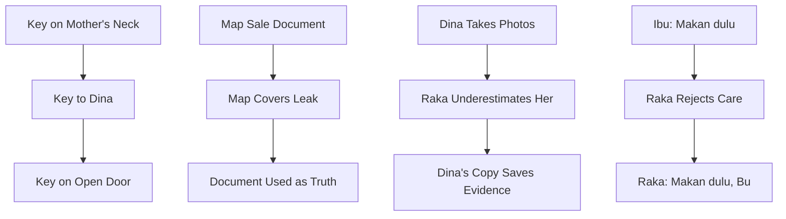

---

## 68. Mystery Architecture Feature

Jika feature punya mystery, rancang clue ladder.

Template:

```text
Mystery Question:
False Theory 1:
False Theory 2:
True Answer:
Clue 1:
Clue 2:
Clue 3:
Midpoint Reframe:
Final Clue:
Reveal:
Emotional Consequence:
```

Contoh:

```text
Mystery Question:
Apa isi ruang kerja ayah?

False Theory 1:
Bukti ayah korban.

False Theory 2:
Bukti Ibu pelaku utama.

True Answer:
Dokumen menunjukkan keluarga, termasuk Raka, mendapat perlindungan dari kejahatan ayah.

Midpoint Reframe:
Tanda tangan Raka.

Final Clue:
Korban lama menunjukkan akibat surat itu.

Reveal:
Raka bukan outsider; ia beneficiary dari kebohongan.

Consequence:
Ia harus memilih truth dengan cost personal.
```

Mystery harus emotional.

---

## 69. Information Release Schedule

Feature harus mengatur informasi.

Tabel:

| Info | Reveal Position | Function |
|---|---|---|
| Raka butuh uang | Act 1 | Motivasi jual rumah |
| Ibu punya kunci | Act 1 | Object conflict |
| Rumah atas nama Ibu | Early Act 2 | Legal reversal |
| Kasus ayah masih hidup sosial | Act 2A | World pressure |
| Dokumen di ruang kerja | Act 2A | Mystery goal |
| Tanda tangan Raka | Midpoint | Moral reframe |
| Pembeli tahu rahasia | Act 2B | External threat |
| Dina punya salinan | Late Act 2 / Act 3 | Trust/payoff |
| Korban lama terdampak | Act 2B / Act 3 | Moral stakes |
| Final truth | Climax | Theme payoff |

---

## 70. Feature Theme/Plot Grid

Gunakan grid:

| Beat/Sequence | Plot Event | Character Change | Theme Question | Genre Function |
|---|---|---|---|---|
| Seq 1 | Raka decides to sell | Avoidance | Rumah = aset? | Drama setup |
| Seq 2 | Key/signature blocked | Frustration | Siapa punya hak? | Mystery object |
| Seq 3 | Legal/social obstacles | Control fails | Legal vs moral truth | Thriller pressure |
| Seq 4 | Room opened | False theory breaks | Innocence questioned | Midpoint reveal |
| Seq 5 | Raka implicated | Self-protection | Protection vs lie | New game |
| Seq 6 | Dina rejects Raka | Loss | Cost of secrecy | Collapse |
| Seq 7 | Raka chooses truth | Accountability | What is family? | Crisis |
| Seq 8 | Public reveal | New state | Truth with cost | Climax |

Grid menjaga integrasi.

---

## 71. Feature Drafting Workflow

Jangan langsung draft page 1.

Workflow:

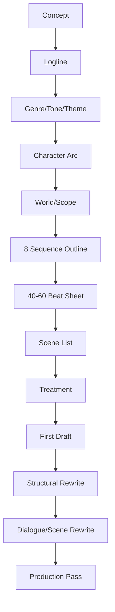

Untuk feature, outline menghemat banyak waktu.

---

## 72. First Feature Draft Strategy

Menulis first feature draft menakutkan karena panjang.

Strategi:

1. Jangan edit terlalu banyak saat draft 1.
2. Ikuti scene list.
3. Tulis placeholder jika perlu.
4. Fokus menyelesaikan.
5. Catat masalah di rewrite notes, jangan berhenti.
6. Target halaman per sequence.
7. Selesaikan draft buruk agar bisa didiagnosis.

Prinsip:

```text
A bad complete draft is more useful than a perfect Act 1.
```

---

## 73. Page Target per Sequence

Untuk 100 halaman:

| Sequence | Pages |
|---|---:|
| Seq 1 | 1–12 |
| Seq 2 | 13–25 |
| Seq 3 | 26–38 |
| Seq 4 | 39–50 |
| Seq 5 | 51–63 |
| Seq 6 | 64–78 |
| Seq 7 | 79–90 |
| Seq 8 | 91–100 |

Fleksibel, tapi membantu pacing.

---

## 74. Feature Rewrite Priorities

Urutan rewrite:

1. Central dramatic question.
2. Protagonist agency.
3. Act/sequence turns.
4. Midpoint.
5. All is lost/crisis.
6. Climax/final image.
7. Subplot integration.
8. Exposition control.
9. Scene function.
10. Dialogue.
11. Visual/sound motifs.
12. Production feasibility.

Jangan mulai dengan polish dialog jika structure rusak.

---

## 75. Feature Diagnostic Questions

Tanya:

1. Apa yang protagonist inginkan dari awal sampai akhir?
2. Apa yang berubah di Act 1 break?
3. Apa midpoint reframe?
4. Apa all is lost?
5. Apa final choice?
6. Apa theme answer?
7. Apa genre payoff?
8. Subplot mana yang tidak memengaruhi climax?
9. Scene mana yang bisa dihapus tanpa efek?
10. Apa yang terlalu banyak dijelaskan?
11. Apa stakes yang tidak terasa?
12. Apakah antagonist/opposition aktif?
13. Apakah protagonist berubah melalui pilihan?
14. Apakah final image membayar opening?

---

## 76. Common Feature Anti-Pattern

### 76.1 Act 1 terlalu panjang

Setup tidak selesai-selesai.

Fix:

```text
Masuk lebih dekat ke inciting incident dan lock-in.
```

### 76.2 Act 2 episodic

Banyak event tapi tidak saling menyebabkan.

Fix:

```text
Gunakan sequence goals dan turns.
```

### 76.3 Midpoint lemah

Tidak ada reframe.

Fix:

```text
Buat midpoint mengubah goal, truth, atau moral position.
```

### 76.4 Protagonist pasif

Informasi datang tanpa action.

Fix:

```text
Biarkan protagonist membuat pilihan salah yang menimbulkan konsekuensi.
```

### 76.5 Subplot random

Tidak memengaruhi climax.

Fix:

```text
Integrasikan, gabung, atau potong.
```

### 76.6 Ending hanya plot resolution

Arc emosional tidak dibayar.

Fix:

```text
Final action harus membuktikan perubahan protagonist.
```

### 76.7 Too much exposition

Feature terasa seperti laporan.

Fix:

```text
Jadikan exposition sebagai conflict/reveal/consequence.
```

### 76.8 Stakes plateau

Tension tidak naik.

Fix:

```text
Naikkan cost, ubah power, tambahkan deadline, buka truth baru.
```

---

## 77. Feature Debugging: Act 1

Jika Act 1 lemah:

Cek:

- protagonist diperkenalkan dengan action?
- want terlihat?
- flaw/lie terlihat?
- genre/tone signal jelas?
- inciting incident cukup menekan?
- world jelas tapi tidak overload?
- antagonistic force hadir?
- act break membuat protagonist committed?
- opening image kuat?

Act 1 harus membuat penonton tahu:

```text
Siapa ini?
Apa yang dia mau?
Apa masalahnya?
Mengapa sekarang?
Genre apa ini?
Kenapa aku peduli?
```

---

## 78. Feature Debugging: Act 2A

Jika Act 2A lemah:

Cek:

- protagonist punya strategi jelas?
- strategy lahir dari flaw?
- opposition aktif?
- world melebar sesuai kebutuhan?
- subplot mulai menekan?
- stakes naik?
- midpoint dibangun?
- scene tidak repetitif?

Act 2A adalah “promise of premise”. Penonton ingin melihat film melakukan hal yang dijanjikan logline.

---

## 79. Feature Debugging: Midpoint

Jika midpoint lemah:

Cek:

- apakah ada reveal/decision besar?
- apakah sebelum/sesudah midpoint terasa berbeda?
- apakah protagonist goal berubah?
- apakah stakes naik?
- apakah moral/emotional position berubah?
- apakah antagonist power berubah?
- apakah penonton memandang cerita berbeda?

Jika tidak, midpoint hanya scene biasa.

---

## 80. Feature Debugging: Act 2B

Jika Act 2B lemah:

Cek:

- apakah new game setelah midpoint jelas?
- apakah protagonist mencoba strategi baru?
- apakah konsekuensi midpoint mengejar?
- apakah relasi rusak?
- apakah all is lost dibangun?
- apakah antagonist menekan lebih keras?
- apakah protagonist semakin terpojok secara moral?

Act 2B harus terasa seperti harga dari pilihan sebelumnya.

---

## 81. Feature Debugging: Act 3

Jika Act 3 lemah:

Cek:

- final choice jelas?
- climax membayar theme?
- protagonist aktif?
- antagonist/opposition dihadapi?
- object/setup dibayar?
- subplot payoff masuk?
- resolution tidak terlalu panjang?
- final image kuat?

Act 3 bukan hanya “menyelesaikan plot”, tapi membuktikan transformasi.

---

## 82. Feature Checklist

### 82.1 Core

- [ ] Premise cukup kuat untuk feature.
- [ ] Central dramatic question sustain.
- [ ] Genre/tone jelas.
- [ ] Theme question jelas.
- [ ] Protagonist want/need/lie jelas.
- [ ] Antagonistic force sustain.
- [ ] Stakes meningkat.

### 82.2 Structure

- [ ] Act 1 setup dan lock-in jelas.
- [ ] Act 2A punya sequence goals.
- [ ] Midpoint mereframe cerita.
- [ ] Act 2B menunjukkan konsekuensi midpoint.
- [ ] All is lost kuat.
- [ ] Act 3 punya final choice.
- [ ] Climax membayar arc/theme/genre.
- [ ] Final image membayar opening.

### 82.3 Sequences

- [ ] 8 sequence punya mini-goal.
- [ ] Setiap sequence punya turn.
- [ ] Output state sequence jelas.
- [ ] Tidak ada sequence filler.
- [ ] Sequence saling menyebabkan.

### 82.4 Character

- [ ] Protagonist aktif.
- [ ] Arc bertahap.
- [ ] Strategy evolves.
- [ ] Flaw diuji.
- [ ] Supporting character punya fungsi.
- [ ] Subplot terintegrasi.

### 82.5 Craft

- [ ] Exposition tidak overload.
- [ ] Scene punya turn.
- [ ] Dialogue tidak hanya menjelaskan.
- [ ] Object/motif punya payoff.
- [ ] Tension bervariasi.
- [ ] Aftermath ada setelah reveal besar.

### 82.6 Production

- [ ] Scope feasible.
- [ ] Lokasi dikontrol.
- [ ] Cast dikontrol.
- [ ] Set-piece sesuai budget.
- [ ] Worldbuilding tidak terlalu mahal.
- [ ] Story bisa diproduksi dengan resource realistis.

---

## 83. Feature Design Canvas

```text
# Feature Film Design Canvas

## Identity
Title:
Genre:
Tone:
Target duration:
Audience promise:

## Core
Premise:
Logline:
Central dramatic question:
Theme question:
Ending answer:
Opening image:
Final image:

## Protagonist
Name:
Want:
Need:
Lie:
Flaw:
Wound:
Mask:
Start state:
End state:
Final choice:

## Opposition
Main antagonist/force:
Opposition network:
How opposition escalates:
What protagonist loses:

## World
Core world:
Scope center:
Locations:
Rules:
Objects:
Power system:
Production constraints:

## Structure
Act 1 break:
Midpoint:
All is lost:
Climax:
Resolution:

## Sequences
Seq 1:
Goal:
Turn:

Seq 2:
Goal:
Turn:

Seq 3:
Goal:
Turn:

Seq 4:
Goal:
Turn:

Seq 5:
Goal:
Turn:

Seq 6:
Goal:
Turn:

Seq 7:
Goal:
Turn:

Seq 8:
Goal:
Turn:

## Subplots
Subplot 1:
Function:
Payoff:

Subplot 2:
Function:
Payoff:

## Payoff Network
Setup:
Payoff:

## Risks
Scope risk:
Structure risk:
Production risk:
Tone risk:
Exposition risk:
```

---

## 84. Contoh Canvas Ringkas

```text
Title:
Kunci di Leher Ibu

Genre:
Family mystery drama

Tone:
Melancholic, restrained, tense, bitter humor.

Premise:
Seorang anak pulang untuk menjual rumah keluarga, tetapi kunci ruang kerja ayah yang dipakai ibunya sebagai liontin membuka rahasia bahwa warisan yang ingin ia jual dibangun dari kebohongan yang juga melibatkan dirinya.

Central dramatic question:
Apakah Raka akan membuka kebenaran tentang rumah keluarganya meski itu menghancurkan image dirinya sebagai korban?

Theme:
Keluarga tidak bisa diselamatkan dengan mewariskan kebohongan.

Opening image:
Raka di luar pagar dengan map penjualan, sepatu bersih.

Final image:
Kunci tergantung di pintu ruang kerja yang terbuka; Raka tanpa sepatu di dalam rumah.

Want:
Menjual rumah.

Need:
Menghadapi kebenaran dan relasi tanpa kontrol/transaksi.

Lie:
Dokumen yang selesai akan membuat masa lalu selesai.

Midpoint:
Tanda tangan Raka ada di dokumen lama.

All is lost:
Dina kehilangan trust, Ibu collapse, pembeli memegang leverage.

Climax:
Raka membuka dokumen di depan pembeli/keluarga/saksi, meski dirinya ikut terkena.
```

---

## 85. Latihan 1 — Feature Expansion dari Short

Ambil short idea dari Part 018.

Isi:

```text
Short core moment:
What feature question grows from it:
What happens before:
What happens after:
What world expands:
What moral stakes expand:
What antagonist expands:
What protagonist arc expands:
```

Contoh:

```text
Short core:
Raka meminta kunci pada Dina.

Feature question:
Apa yang terjadi jika kunci itu membuka dokumen yang membuat Raka ikut bersalah?

Before:
Raka butuh menjual rumah.

After:
Ia harus menghadapi pembeli, korban, dan keluarganya.

World expands:
Rumah → warga → notaris → pembeli → korban.

Moral stakes:
Dari trust keluarga menjadi accountability publik.
```

---

## 86. Latihan 2 — Central Dramatic Question

Tulis 10 versi CDQ.

Template:

```text
Apakah [protagonist] akan [external goal] meskipun [internal/moral cost]?
```

Contoh:

```text
Apakah Raka akan menjual rumah keluarganya meskipun penjualan itu menutup kejahatan yang membuatnya hidup nyaman?
```

Pilih yang paling kuat.

---

## 87. Latihan 3 — Eight Sequence Outline

Isi:

```text
Seq 1:
Input:
Goal:
Turn:
Output:

Seq 2:
Input:
Goal:
Turn:
Output:

...
Seq 8:
Input:
Goal:
Turn:
Output:
```

Pastikan output sequence menjadi input sequence berikutnya.

---

## 88. Latihan 4 — Midpoint Design

Buat 5 kemungkinan midpoint.

Template:

```text
Midpoint option:
What protagonist believes before:
What changes:
New goal after:
Stakes increase:
Why this is better/worse:
```

Pilih midpoint yang paling mengubah story.

---

## 89. Latihan 5 — Escalation Ladder

Buat 12 langkah escalation.

Aturan:

- setiap langkah harus lebih mahal,
- jangan mengulang conflict sama,
- campur plot, relasi, moral, time, social, economic.

Template:

```text
Step:
Pressure:
What changes:
Cost:
```

---

## 90. Latihan 6 — Subplot Audit

Buat daftar subplot.

```text
Subplot:
Character:
Function:
How it pressures protagonist:
How it pays off in climax:
Cut / Keep / Merge:
```

Jika tidak memengaruhi climax, potong/gabung.

---

## 91. Latihan 7 — Payoff Network

Buat 10 setup/payoff.

```text
Setup:
Where introduced:
Payoff:
Where paid:
Meaning:
```

Pastikan payoff bukan hanya plot, tapi emosi/theme.

---

## 92. Latihan 8 — Production Scope Audit

Isi:

```text
Locations:
Speaking characters:
Extras:
Night scenes:
Vehicles:
Stunts:
VFX:
Period details:
Special props:
Difficult sound locations:
Can reduce:
Must keep:
```

Pilih 3 penyederhanaan tanpa mengurangi core story.

---

## 93. Practice Plan 120 Menit

Feature lebih kompleks, jadi latihan 120 menit lebih realistis.

| Durasi | Aktivitas | Output |
|---:|---|---|
| 10 menit | Pilih premise feature | Premise |
| 10 menit | Tulis logline + CDQ | Core |
| 15 menit | Want/need/lie + arc start/end | Character arc |
| 15 menit | Genre/tone/theme | Promise |
| 20 menit | 8 sequence outline | Sequence map |
| 15 menit | Midpoint + all is lost + climax | Turning points |
| 15 menit | Escalation ladder | Pressure map |
| 10 menit | Subplot list | Subplot map |
| 10 menit | Production scope audit | Feasibility |
| 10 menit | Next drafting task | Plan |

Output minimal:

```text
1. Feature logline
2. Central dramatic question
3. Want/need/lie
4. 8 sequence outline
5. Midpoint/all-is-lost/climax
6. Escalation ladder
7. Subplot audit
8. Production scope notes
```

---

## 94. Minimal Feature Blueprint Sebelum Draft

Sebelum menulis page 1, minimal punya:

1. Working title.
2. Genre/tone.
3. Logline.
4. Central dramatic question.
5. Theme question.
6. Protagonist want/need/lie.
7. Main opposition.
8. Act 1 break.
9. Midpoint.
10. All is lost.
11. Climax.
12. Final image.
13. 8 sequence outline.
14. 40–60 beat sheet.
15. Scene list.
16. Production scope.
17. Subplot function.
18. Payoff network.

Ini terdengar banyak, tetapi jauh lebih ringan daripada tersesat di 100 halaman.

---

## 95. Output yang Harus Dibawa ke Part Berikutnya

Part berikutnya adalah:

> **Part 020 — Treatment dan Outline: Jembatan antara Ide dan Draft**

Sebelum lanjut, Anda sebaiknya punya:

1. Feature premise.
2. Feature logline.
3. Central dramatic question.
4. Want/need/lie protagonist.
5. Genre/tone/theme.
6. 8 sequence outline.
7. Midpoint.
8. All is lost.
9. Climax/final image.
10. Escalation ladder.
11. Subplot list.
12. Production scope audit.

Part 020 akan mengubah semua blueprint ini menjadi **treatment dan outline** yang siap dipakai untuk drafting.

---

## 96. Ringkasan Part Ini

Feature film bukan short yang diperpanjang. Feature adalah sistem cerita panjang yang harus sustain.

Hal paling penting:

1. Feature butuh central dramatic question yang kuat.
2. Scope harus punya pusat gravitasi.
3. Three-act structure membantu, tetapi sequence approach membuat cerita lebih manageable.
4. Setiap sequence harus punya goal, conflict, turn, dan output state.
5. Character arc harus berkembang melalui beberapa pilihan.
6. Midpoint harus mereframe cerita.
7. Act 2 harus punya evolving strategy, bukan repetisi.
8. Tension harus bertumpuk dan berubah bentuk.
9. Subplot harus mendukung main plot, theme, dan climax.
10. Antagonistic force harus aktif dan meningkat.
11. Feature butuh payoff network.
12. Ending harus membayar opening, theme, genre, dan arc.
13. Production scope harus dikontrol sejak outline.

Formula inti:

```text
Feature = Central Dramatic Question + Protagonist Arc + Sequence Escalation + Sustained Tension + Earned Payoff
```

Jika short adalah kekuatan satu momen, feature adalah kekuatan perjalanan yang terus berubah tetapi tetap menuju satu jawaban emosional utama.

---

## 97. Status Seri

- Part 000: selesai.
- Part 001: selesai.
- Part 002: selesai.
- Part 003: selesai.
- Part 004: selesai.
- Part 005: selesai.
- Part 006: selesai.
- Part 007: selesai.
- Part 008: selesai.
- Part 009: selesai.
- Part 010: selesai.
- Part 011: selesai.
- Part 012: selesai.
- Part 013: selesai.
- Part 014: selesai.
- Part 015: selesai.
- Part 016: selesai.
- Part 017: selesai.
- Part 018: selesai.
- Part 019: selesai.
- Part 020: berikutnya.

Seri **belum selesai**. Bagian berikutnya adalah:

> **Part 020 — Treatment dan Outline: Jembatan antara Ide dan Draft**
