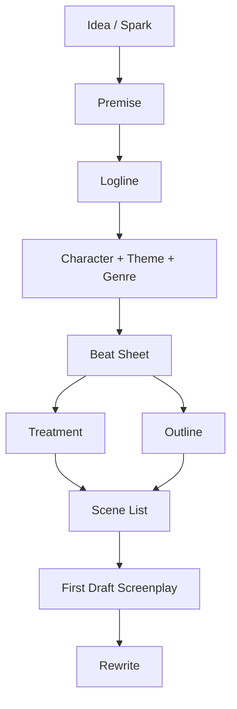
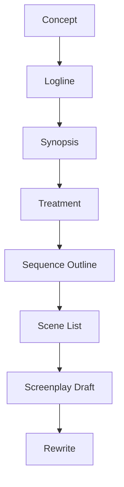
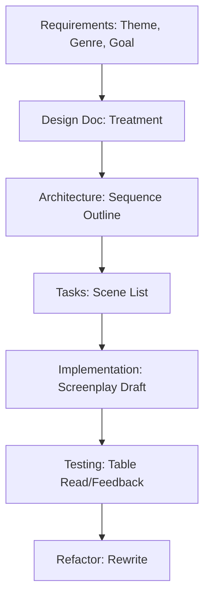
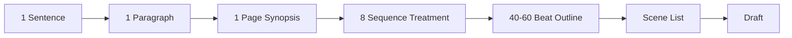
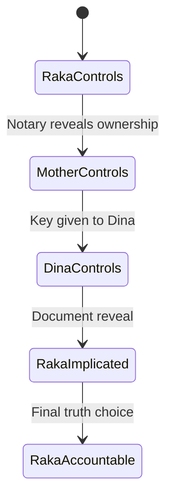

# learn-screenwriting-film-script-part-020.md

# Part 020 — Treatment dan Outline: Jembatan antara Ide dan Draft

> Seri: Learn Screenwriting for Film Project  
> Pendekatan: *The First 20 Hours* — Josh Kaufman  
> Fokus bagian ini: mengubah ide, logline, karakter, struktur, dan beat menjadi dokumen kerja yang siap memandu penulisan draft screenplay.  
> Target praktis: mampu membuat treatment, outline, scene list, dan drafting map untuk film pendek maupun feature film sebelum masuk ke halaman screenplay penuh.

---

## 0. Posisi Part Ini dalam Roadmap

Pada Part 018 kita membahas film pendek.  
Pada Part 019 kita membahas feature film.

Keduanya membutuhkan jembatan yang sama:

```text
Ide → Premis → Logline → Beat Sheet → Treatment/Outline → Draft Screenplay
```

Banyak penulis pemula langsung melompat dari ide ke draft screenplay.

Hasilnya sering:

- awal kuat, tengah tersesat,
- karakter berubah tanpa sebab,
- midpoint lemah,
- scene berulang,
- ending tidak membayar setup,
- exposition muncul terlalu banyak,
- naskah selesai secara halaman tapi tidak selesai secara cerita,
- writer stuck karena tidak tahu scene berikutnya.

Treatment dan outline dibuat untuk mengurangi risiko itu.

Diagram pipeline:



Part ini adalah tentang **pre-drafting architecture**.

Sebagai software engineer, bayangkan ini seperti:

```text
requirements → design doc → sequence diagram → task breakdown → implementation
```

Screenplay draft adalah implementation.  
Treatment/outline adalah design doc.

---

## 1. Prinsip Kaufman dalam Part Ini

Dalam framework *The First 20 Hours*, treatment dan outline adalah alat untuk mempercepat skill acquisition karena mereka membantu:

1. Memecah screenplay menjadi bagian kecil.
2. Mengurangi cognitive load saat drafting.
3. Membuat self-correction lebih cepat.
4. Menemukan bug story sebelum menulis 100 halaman.
5. Memisahkan keputusan struktur dari keputusan bahasa/dialog.
6. Mengurangi friction memulai draft.
7. Membuat feedback lebih mudah.
8. Membantu produksi memahami scope cerita.

Sub-skill yang kita latih:

- menulis logline operasional,
- membuat synopsis pendek,
- membuat treatment,
- membuat sequence outline,
- membuat scene outline,
- membuat beat-to-scene mapping,
- membuat outline yang cukup detail tetapi tidak terlalu kaku,
- menguji outline sebelum draft,
- merevisi struktur tanpa membongkar semua halaman screenplay.

Target praktis:

```text
Mampu membuat treatment 1–3 halaman untuk short film dan 5–15 halaman untuk feature film, lalu mengubahnya menjadi scene list yang siap ditulis sebagai screenplay.
```

---

## 2. Mengapa Tidak Langsung Draft?

Karena draft screenplay memaksa Anda memikirkan terlalu banyak hal sekaligus:

- format,
- scene heading,
- action line,
- dialog,
- subtext,
- blocking,
- visual,
- pacing,
- character voice,
- exposition,
- tone,
- structure,
- continuity,
- production scope.

Jika struktur belum jelas, otak akan overload.

Treatment dan outline memisahkan level keputusan:

```text
Level 1: Apa cerita ini?
Level 2: Apa perjalanan besarnya?
Level 3: Apa sequence/beat-nya?
Level 4: Scene apa saja?
Level 5: Bagaimana tiap scene ditulis?
Level 6: Bagaimana dialog/action line dipoles?
```

Jangan memecahkan semua level di halaman screenplay pertama.

Diagram level abstraction:



---

## 3. Treatment dan Outline Bukan Penjara

Sebagian penulis takut outline membuat tulisan kaku.

Masalahnya bukan outline. Masalahnya outline yang diperlakukan seperti hukum mati.

Treatment/outline seharusnya menjadi:

```text
map, not prison
```

Saat drafting, Anda tetap boleh menemukan hal baru. Tetapi tanpa map, Anda mudah tersesat.

Analogi:

```text
Outline = route plan.
Draft = actual journey.
Rewrite = rerouting after traffic, weather, and discoveries.
```

Rencana bisa berubah, tetapi rencana membuat Anda tahu kapan perubahan benar-benar improvement dan kapan hanya distraction.

---

## 4. Definisi Dokumen Development

Ada beberapa dokumen yang sering tertukar.

| Dokumen | Fungsi | Panjang Umum |
|---|---|---:|
| Premis | Ide inti cerita | 1 kalimat |
| Logline | Protagonist + goal + obstacle + stakes/irony | 1–2 kalimat |
| Synopsis pendek | Ringkasan cerita utama | 1 paragraf–1 halaman |
| Treatment | Cerita ditulis dalam prose present tense | 1–15+ halaman |
| Beat sheet | Daftar perubahan utama | 8–60 beat |
| Sequence outline | Cerita dibagi sequence dengan objective/turn | 4–8+ sequence |
| Scene list | Daftar scene berurutan | 5–70 scene |
| Step outline | Scene-by-scene detail dengan fungsi dramatik | 5–30+ halaman |
| Scriptment | Hybrid treatment + potongan dialog | Variatif |
| Screenplay | Draft naskah final dalam format screenplay | 5–120 halaman |

Kita akan bahas yang paling penting untuk latihan:

```text
logline → synopsis → treatment → outline → scene list
```

---

## 5. Logline sebagai Seed Contract

Logline adalah kompas.

Sebelum treatment/outline, logline harus cukup jelas.

Template:

```text
Ketika [inciting event], seorang [protagonist spesifik] harus [goal eksternal] sebelum/meskipun [pressure/obstacle], tetapi [irony/internal conflict/moral cost] memaksanya [choice/change].
```

Contoh short:

```text
Malam sebelum rumah keluarganya dijual, seorang anak yang selalu memandang rumah sebagai aset harus mendapatkan kunci ruang kerja ayah dari ibunya, tetapi kunci itu justru diberikan kepada adiknya, memaksanya memilih antara merebut kontrol atau meminta kepercayaan.
```

Contoh feature:

```text
Seorang anak yang pulang untuk menjual rumah keluarga demi menyelamatkan dirinya dari utang menemukan bahwa ruang kerja ayahnya menyimpan dokumen yang menghubungkan keluarganya dengan kasus lama, dan ia harus memilih antara menutup kebenaran agar rumah terjual atau membuka bukti yang juga menyeret dirinya.
```

Jika logline belum jelas, treatment akan melebar.

---

## 6. Logline Test Sebelum Treatment

Checklist logline:

- [ ] Protagonist jelas.
- [ ] Goal eksternal jelas.
- [ ] Conflict/obstacle jelas.
- [ ] Stakes terasa.
- [ ] Genre/tone terasa.
- [ ] Irony atau moral pressure terasa.
- [ ] Scope terasa.
- [ ] Bisa dibayangkan sebagai film.
- [ ] Tidak hanya tema abstrak.
- [ ] Tidak terlalu banyak nama/konsep.

Bug logline:

```text
Seorang pria menghadapi masa lalunya dan belajar arti keluarga.
```

Terlalu abstrak.

Lebih operasional:

```text
Seorang anak yang ingin menjual rumah warisan harus meminta kunci ruang kerja ayah dari ibu yang menolak membuka rahasia keluarga sebelum pembeli datang besok pagi.
```

Sekarang ada tindakan, waktu, obstacle, dan object.

---

## 7. Synopsis Pendek

Synopsis pendek adalah ringkasan cerita utama dalam 1 paragraf sampai 1 halaman.

Fungsi:

- menguji apakah cerita punya awal-tengah-akhir,
- membantu pitch,
- membantu melihat flow sebelum treatment detail,
- membantu membedakan mana main plot dan mana detail.

Template 1 paragraf:

```text
[Protagonist] hidup/berada dalam [situasi awal] ketika [inciting incident] memaksanya [goal]. Untuk mendapatkan goal itu, ia harus menghadapi [opposition/world/relationship]. Saat ia semakin dekat, [midpoint/reveal] mengubah pemahamannya. Setelah [collapse/crisis], ia harus memilih antara [choice A] dan [choice B]. Pada akhirnya, [climax action] menghasilkan [new state/final meaning].
```

Contoh:

```text
Raka, seorang profesional kota yang hampir kehilangan apartemennya, pulang untuk menjual rumah lama keluarganya. Ia mengira penjualan itu hanya urusan dokumen, tetapi ibunya menolak tanda tangan dan memakai kunci ruang kerja ayah sebagai liontin. Saat Raka mencoba menekan keluarga dan memproses penjualan lewat notaris, ia menemukan bahwa rumah itu terkait kasus sertifikat lama yang melibatkan ayahnya. Ketika ruang kerja akhirnya terbuka, dokumen di dalamnya tidak membuktikan ayahnya korban, melainkan menunjukkan tanda tangan Raka sendiri. Dengan pembeli lama menekan dan Dina kehilangan kepercayaan, Raka harus memilih menutup bukti demi menyelamatkan dirinya atau membuka kebenaran yang menghancurkan narasi keluarganya. Pada akhirnya, ia membuka dokumen di rumah yang hendak dijual, membuat rumah itu tidak lagi menjadi aset bersih, tetapi ruang pengakuan.
```

Ini synopsis, bukan treatment penuh.

---

## 8. Treatment

Treatment adalah versi cerita dalam bentuk prosa.

Ia biasanya ditulis:

- present tense,
- tanpa format screenplay penuh,
- fokus pada cerita, action, turning point, emosi,
- bisa memasukkan sedikit dialog kunci,
- lebih readable daripada outline teknis,
- lebih detail daripada synopsis.

Treatment menjawab:

```text
Jika film ini diceritakan sebagai cerita ringkas tetapi lengkap, bagaimana alurnya terasa?
```

Treatment bukan novel. Treatment tetap filmik.

Buruk:

```text
Raka merasa sangat bersalah dan mengalami konflik batin mendalam tentang masa lalu keluarganya.
```

Lebih treatment-filmik:

```text
Raka mencuci tangannya berulang-ulang setelah melihat tanda tangannya di dokumen lama. Tinta itu sudah belasan tahun kering, tapi ia menggosok telapak tangannya sampai merah.
```

Treatment harus membantu membayangkan film.

---

## 9. Fungsi Treatment

Treatment berguna untuk:

1. Menguji story flow.
2. Menemukan lubang struktur.
3. Mendapat feedback sebelum draft.
4. Mengembangkan tone.
5. Menjaga fokus theme.
6. Menjual/pitch ide.
7. Menyelaraskan collaborator.
8. Membuat writer tidak stuck saat draft.
9. Memisahkan plot dari format.
10. Mengetes ending.

Treatment yang baik membuat pembaca bisa berkata:

```text
Saya mengerti filmnya.
Saya tahu perjalanan emosionalnya.
Saya bisa melihat beberapa scene kunci.
Saya tahu ending-nya.
```

---

## 10. Treatment vs Outline

Treatment dan outline berbeda.

Treatment:

- prosa,
- readable,
- mengalir,
- fokus experience,
- cocok untuk pitch/feedback story.

Outline:

- structured list,
- teknis,
- scene/beat-based,
- fokus plan,
- cocok untuk drafting.

Perbandingan:

| Aspek | Treatment | Outline |
|---|---|---|
| Bentuk | Paragraf prosa | List / bullets / cards |
| Fokus | Flow cerita | Struktur eksekusi |
| Pembaca | Collaborator, produser, diri sendiri | Penulis, room, production prep |
| Detail scene | Menengah | Tinggi |
| Dialog | Sedikit, line penting saja | Bisa include intention/dialogue notes |
| Kegunaan | Memahami film | Menulis draft |

Keduanya saling melengkapi.

---

## 11. Outline

Outline adalah peta teknis cerita.

Outline bisa berbentuk:

```text
Act → Sequence → Beat → Scene
```

atau:

```text
Scene 1
Scene 2
Scene 3
...
```

Outline menjawab:

- scene apa saja,
- urutannya bagaimana,
- fungsi tiap scene,
- input/output state,
- turn tiap scene,
- apa informasi yang muncul,
- object apa aktif,
- karakter apa masuk,
- bagaimana escalation bergerak.

Outline adalah alat implementasi.

---

## 12. Treatment as Design Doc, Outline as Task Breakdown

Untuk software engineer:

```text
Treatment = design document / architecture narrative
Outline = task breakdown / implementation plan
Scene list = tickets
Screenplay draft = code
Rewrite = refactor + bug fixing
```

Jika Anda langsung code tanpa design, mungkin bisa untuk script kecil. Untuk feature 100 halaman, risikonya tinggi.

Diagram:



---

## 13. Level of Detail

Treatment/outline harus cukup detail, tetapi jangan terlalu detail terlalu awal.

Terlalu umum:

```text
Act 2: Raka mencari kebenaran dan menghadapi masa lalu.
```

Tidak cukup membantu draft.

Terlalu detail terlalu awal:

```text
Raka mengambil gelas dengan tangan kanan, menatap 2 detik, lalu mengucapkan dialog sepanjang 4 baris...
```

Bisa membunuh fleksibilitas.

Level ideal:

```text
Raka mencoba memproses penjualan di notaris tanpa Ibu. Notaris menolak karena rumah atas nama Ibu, bukan ayah. Raka pulang dengan keyakinan goyah: dokumen yang ia percaya ternyata bukan miliknya.
```

Cukup jelas untuk scene draft, belum terlalu rigid.

---

## 14. Abstraction Ladder

Gunakan ladder:

```text
1 sentence → 1 paragraph → 1 page → 8 sequences → 40 beats → scene list → screenplay
```

Jangan langsung dari 1 sentence ke 100 pages.

Diagram:



Setiap level harus memperbaiki masalah level sebelumnya.

---

## 15. Treatment untuk Film Pendek

Treatment short biasanya 1–3 halaman.

Fokus:

- opening image,
- situation,
- disruption,
- escalation,
- choice,
- final image.

Tidak perlu menjelaskan semua backstory.

Template short treatment:

```text
Title:
Genre/Tone:
Duration:
Logline:

Paragraph 1 — Opening/Situation
Paragraph 2 — Disruption
Paragraph 3 — Escalation
Paragraph 4 — Crisis Choice
Paragraph 5 — Consequence/Final Image
```

Atau jika sangat pendek, 3 paragraf cukup.

---

## 16. Contoh Treatment Short: “Kunci di Meja Makan”

### Identity

```text
Title:
Kunci di Meja Makan

Genre/Tone:
Family mystery drama, restrained, tegang, domestik.

Duration:
10 menit.
```

### Treatment

```text
Raka pulang ke rumah lama dengan map penjualan. Sepatunya masih bersih saat ia masuk ke ruang makan tempat Ibu sudah menyiapkan makan malam. Tidak ada sambutan panjang. Ibu hanya menambah satu piring, seolah Raka memang selalu akan datang, meskipun kursinya berdebu.

Raka mencoba menjelaskan bahwa pembeli datang besok pagi dan tanda tangan Ibu dibutuhkan malam ini. Ibu tidak menjawab soal tanda tangan. Ia menyendok nasi ke piring Raka dan menaruh piring itu tepat di atas map. Dina, adik Raka, menyindir bahwa Raka pulang membawa map, bukan kangen.

Saat Raka melihat kunci kecil tergantung di leher Ibu, percakapan berubah. Ia meminta kunci ruang kerja ayah dengan nada seolah itu hanya urusan dokumen. Ibu mengatakan ada pintu yang tidak boleh dibuka oleh orang yang hanya pulang untuk menjual. Raka menekan. Dina mulai sadar bahwa mereka tidak membicarakan rumah, tetapi sesuatu yang lebih lama dari rumah itu.

Ibu akhirnya melepas kunci. Raka mengira ia menang. Tetapi Ibu menjatuhkan kunci itu ke tangan Dina dan memintanya menjaga dari orang yang selalu pulang dengan alasan. Untuk pertama kalinya, Raka tidak bisa memerintah. Dina menggenggam kunci dan menantangnya: apakah Raka mau meminta atau menyuruh.

Raka duduk. Map penjualan masih tertindih piring. Ia menatap Dina, lalu berkata pelan bahwa ia butuh bantuan. Dina tidak langsung memberi kunci. Ia meletakkannya di tengah meja, di antara mereka semua. Kunci itu tidak lagi di leher Ibu, tidak juga di tangan Raka. Film berakhir pada kunci di meja makan, dengan suara hujan dan piring yang belum disentuh.
```

Analisis:

- 5 paragraf,
- semua scene terasa,
- tidak terlalu banyak dialog,
- ada beginning-middle-end,
- final image jelas.

---

## 17. Outline Short dari Treatment

Dari treatment di atas, buat outline:

```text
Scene 1 — INT. RUMAH LAMA - RUANG MAKAN - MALAM
Function: Situation.
Input: Raka pulang membawa map penjualan.
Turn: Ibu menaruh piring di atas map.
Output: Penjualan menjadi konflik keluarga, bukan administrasi.

Scene 2 — RUANG MAKAN - BERLANJUT
Function: Disruption.
Input: Raka meminta tanda tangan.
Turn: Ia melihat kunci di leher Ibu.
Output: Goal bergeser dari tanda tangan ke kunci.

Scene 3 — RUANG MAKAN - BERLANJUT
Function: Escalation.
Input: Raka meminta kunci.
Turn: Dina sadar ada rahasia.
Output: Konflik tidak bisa lagi hanya Raka vs Ibu.

Scene 4 — RUANG MAKAN - BERLANJUT
Function: Choice setup.
Input: Ibu melepas kunci.
Turn: Kunci diberikan ke Dina.
Output: Power berpindah; Raka harus mengubah tactic.

Scene 5 — RUANG MAKAN - BERLANJUT
Function: Choice/consequence.
Input: Raka bisa memerintah/merebut atau meminta.
Turn: Raka meminta bantuan.
Output: Dina meletakkan kunci di meja; trust belum pulih tapi kontrol pecah.
```

Outline ini siap menjadi screenplay 5–10 halaman.

---

## 18. Treatment untuk Feature Film

Treatment feature biasanya 5–15 halaman pada tahap development awal.

Bisa lebih panjang jika:

- dunia kompleks,
- genre mystery/thriller,
- banyak sequence,
- diminta produser/kolaborator.

Namun untuk belajar, 8–12 halaman sudah cukup.

Feature treatment harus menunjukkan:

1. Opening image.
2. Protagonist current state.
3. Inciting incident.
4. Act 1 break / lock-in.
5. Act 2A strategy.
6. Midpoint reframe.
7. Act 2B escalation/collapse.
8. All is lost.
9. Crisis.
10. Climax.
11. Resolution/final image.
12. Character arc.
13. Major subplot/payoff.
14. Genre/tone.

---

## 19. Treatment Feature: Struktur Paragraf

Format sederhana:

```text
Title / Genre / Tone / Logline

Paragraph 1–2:
Opening, protagonist, world, flaw.

Paragraph 3–4:
Inciting incident and Act 1 lock-in.

Paragraph 5–7:
Act 2A, first strategy, world expansion, rising conflict.

Paragraph 8:
Midpoint reframe.

Paragraph 9–11:
Act 2B, consequences, subplot pressure, collapse.

Paragraph 12:
All is lost / crisis.

Paragraph 13–14:
Final plan / climax.

Paragraph 15:
Resolution / final image.
```

Untuk 8 sequence, bisa 1–2 paragraf per sequence.

---

## 20. Eight-Sequence Treatment Format

Gunakan format:

```text
# Feature Treatment

## Sequence 1 — Title
Prose paragraphs.

## Sequence 2 — Title
Prose paragraphs.

...

## Sequence 8 — Title
Prose paragraphs.
```

Kelebihan:

- mudah melihat struktur,
- masih readable,
- setiap sequence punya fungsi,
- cocok sebelum outline detail.

---

## 21. Contoh Feature Treatment Skeleton

Berikut contoh treatment skeleton untuk “Kunci di Leher Ibu”. Ini bukan treatment final penuh, tetapi model bentuk.

### Sequence 1 — Return to Asset

```text
Raka hidup di kota dengan ritme terkontrol: apartemen bersih, jadwal padat, tagihan menumpuk. Ketika ia menerima notice bahwa apartemennya hampir disita, ia membuka map lama berisi dokumen rumah keluarga. Baginya, rumah itu bukan tempat pulang, melainkan aset tidur. Ia menghubungi pembeli lama yang bersedia membayar cepat, tetapi hanya jika semua dokumen beres dalam dua hari.

Raka pulang ke rumah lama setelah bertahun-tahun pergi. Rumah itu tidak menyambutnya sebagai properti. Pagar berkarat, sandal lamanya tidak ada, dan tetangga berhenti menyapu ketika melihat wajahnya. Di ruang makan, Ibu menyiapkan piring tambahan tanpa bertanya. Dina, adiknya, menyindir bahwa Raka pulang membawa map, bukan kangen.
```

### Sequence 2 — The Locked House

```text
Raka menjelaskan bahwa tanda tangan Ibu dibutuhkan agar penjualan bisa diproses. Ibu menolak membicarakan rumah sebelum makan. Ketika Raka menaruh map di meja, Ibu menaruh piring nasi di atasnya. Raka melihat kunci kecil di leher Ibu dan menyadari dokumen utama mungkin masih di ruang kerja ayah yang selama ini terkunci.

Di kantor notaris, Raka mencoba memproses penjualan tanpa drama keluarga. Notaris menolak: rumah tidak sesederhana yang ia kira. Nama ayah tidak menjadi pusat dokumen seperti yang selama ini Raka percaya. Raka pulang dengan lebih marah, tetapi juga lebih ragu. Untuk menjual rumah, ia harus membuka ruang yang paling dilarang di rumah itu.
```

### Sequence 3 — First Strategy: Control

```text
Raka mencoba menekan Ibu melalui deadline pembeli. Ia menghubungi agen, mengatur open house, dan berbicara tentang rumah seperti aset yang harus dikosongkan. Ibu membalas dengan ritual rumah: makan, obat, kunci, pintu yang tidak boleh dibuka. Dina melihat Raka mengulang pola ayah: memakai keputusan besar seolah semua orang lain hanya tanda tangan.

Di luar rumah, warga lama memberi sinyal bahwa kasus ayah belum selesai. Tidak ada yang berkata langsung, tetapi julukan dan tatapan cukup membuat Raka sadar rumah itu punya reputasi. Pembeli mulai mengirim pesan lebih personal daripada sekadar transaksi. Ia tahu nama Ibu, tahu ruang kerja, dan tahu bahwa Raka sedang butuh uang.
```

### Sequence 4 — Open the Room

```text
Raka akhirnya mendapat kesempatan membuka ruang kerja ketika Ibu sakit dan Dina lengah. Ia masuk berharap menemukan dokumen yang membuktikan ayahnya disalahkan. Ruang kerja itu bukan ruang hantu, melainkan arsip lembap: map, sertifikat, foto, surat kuasa, dan kalender yang berhenti pada tanggal lama.

Di tengah dokumen, Raka menemukan surat yang mengubah semua asumsi. Tanda tangan ayah memang ada, tetapi tanda tangan Raka juga ada. Ia masih remaja saat itu, tetapi dokumen itu cukup untuk menunjukkan bahwa ia bukan hanya anak korban. Ia bagian dari perlindungan yang membuat keluarga tetap aman. Midpoint: pencarian kebenaran tentang ayah berubah menjadi krisis kebenaran tentang dirinya sendiri.
```

### Sequence 5 — New Game: Participant

```text
Setelah midpoint, Raka tidak lagi mencari bukti untuk menjual rumah. Ia mencari cara agar dokumen itu tidak menghancurkannya. Ibu mengaku menyimpan ruang kerja bukan untuk melindungi ayah, tetapi untuk melindungi anak-anaknya. Raka marah karena perlindungan itu membuatnya hidup di atas sesuatu yang tidak ia pahami. Dina semakin curiga karena Raka tiba-tiba ingin menutup ruang yang sebelumnya ingin ia buka.

Pembeli memperlihatkan wajah aslinya: ia bukan hanya pembeli, tetapi bagian dari jaringan lama yang tahu nilai dokumen itu. Ia menawarkan jalan keluar cepat. Raka bisa menjual rumah, membayar utangnya, dan membiarkan masa lalu tetap terkunci. Syaratnya, dokumen tertentu harus hilang.
```

### Sequence 6 — Collapse

```text
Raka hampir menerima deal itu. Ia mencoba mengambil salinan foto dari ponsel Dina dan meyakinkannya bahwa ini demi Ibu. Dina melihat kebohongan itu. Untuknya, Raka bukan sedang menyelamatkan keluarga, tetapi mengulang alasan semua orang dewasa yang membuat rumah itu busuk. Kepercayaan Dina pecah.

Ibu jatuh sakit setelah mengetahui pembeli akan datang langsung. Raka membawa obat yang selama ini ia tidak pernah tahu jadwalnya. Di saat yang sama, seorang warga tua datang membawa sertifikat lusuh dan berkata bahwa nama ayah Raka masih lebih kuat di kertas daripada nama keluarganya sendiri. Untuk pertama kalinya, kasus lama punya wajah manusia, bukan hanya dokumen.
```

### Sequence 7 — Crisis

```text
Raka meninggalkan rumah dengan map dan dokumen. Ia hampir memilih kota, uang, dan keselamatan diri. Tetapi di terminal/kendaraan/perjalanan pulang, ia melihat satu detail yang menghubungkan tanda tangannya dengan kerugian warga tua itu. Ia sadar bahwa diamnya bukan netral. Diam berarti memilih pembeli.

Raka kembali ke rumah. Bukan sebagai anak yang membawa map penjualan, tetapi sebagai orang yang harus mengakui bahwa ia ikut mendapat manfaat dari kebohongan. Ia meminta Dina bukan untuk memberinya kunci, tetapi untuk memutuskan apakah ia masih layak diberi salinan dokumen. Dina tidak memaafkan, tetapi ia memberi satu kesempatan: jangan bicara seperti orang kantor. Bicara seperti orang yang ikut bersalah.
```

### Sequence 8 — Open House / Open Wound

```text
Pembeli datang bersama notaris/agen untuk menyelesaikan transaksi. Rumah yang seharusnya menjadi open house berubah menjadi ruang pengakuan. Di meja makan, Raka meletakkan dokumen yang membuktikan kasus lama. Ia bisa menutupnya dan mendapatkan uang, tetapi memilih membukanya, meskipun tanda tangannya sendiri terlihat jelas.

Konfrontasi tidak menyelesaikan semua. Ibu terluka karena perlindungannya runtuh. Dina belum sepenuhnya percaya. Pembeli kehilangan kontrol atas narasi, tetapi sistem yang lebih besar belum selesai. Namun rumah berubah. Ruang kerja tidak lagi terkunci. Kunci tidak lagi tergantung di leher Ibu. Di final image, kunci tergantung di pintu yang terbuka, sementara Raka berdiri di dalam rumah tanpa sepatu, tidak lagi sebagai pemilik aset, tetapi sebagai orang yang akhirnya masuk ke konsekuensi rumah itu.
```

Ini treatment skeleton. Outline berikutnya akan memecahnya menjadi scenes.

---

## 22. Dari Treatment ke Outline

Treatment masih prose. Outline harus menjadi daftar actionable.

Transformasi:

```text
Treatment paragraph → Beat → Scene → Scene card
```

Contoh treatment sentence:

```text
Raka mencoba memproses penjualan tanpa Ibu, tetapi notaris menolak karena rumah tidak sesederhana yang ia kira.
```

Outline scene:

```text
Scene 08 — INT. KANTOR NOTARIS - SIANG
Function: Legal obstacle / world expansion.
Input: Raka yakin penjualan bisa diproses teknis.
Objective: Meminta notaris memproses dokumen.
Opposition: Dokumen tidak lengkap; nama pemilik mengejutkan.
Turn: Notaris menunjukkan nama Ibu sebagai kunci legal.
Output: Raka kehilangan leverage; ia harus kembali ke Ibu.
Info revealed: Rumah bukan sepenuhnya warisan ayah.
Object: Sertifikat/map.
```

Outline membuat treatment executable.

---

## 23. Scene List

Scene list adalah daftar scene berurutan.

Minimal berisi:

- nomor scene,
- scene heading,
- fungsi,
- character,
- objective,
- turn,
- output.

Template:

```text
Scene No:
Heading:
Characters:
Function:
Input State:
Objective:
Opposition:
Key Event:
Turn:
Output State:
Notes:
```

Scene list adalah alat paling langsung sebelum drafting.

---

## 24. Scene List Singkat untuk Short

Contoh short “Kunci di Meja Makan”:

```text
01. INT. RUMAH LAMA - RUANG MAKAN - MALAM
Characters: Raka, Ibu
Function: Situation.
Input: Raka pulang membawa map.
Objective: Menyampaikan penjualan.
Opposition: Ibu mengubah urusan dokumen menjadi makan malam.
Turn: Ibu menaruh piring di atas map.
Output: Konflik transaksional menjadi domestik.

02. INT. RUMAH LAMA - RUANG MAKAN - BERLANJUT
Characters: Raka, Ibu, Dina
Function: Disruption.
Input: Raka meminta tanda tangan.
Objective: Mendapat persetujuan Ibu.
Opposition: Ibu menghindar, Dina menyindir.
Turn: Raka melihat kunci di leher Ibu.
Output: Goal berubah menjadi kunci.

03. INT. RUMAH LAMA - RUANG MAKAN - BERLANJUT
Characters: Raka, Ibu, Dina
Function: Escalation.
Input: Kunci terlihat.
Objective: Raka meminta kunci tanpa kehilangan muka.
Opposition: Ibu menolak, Dina membaca subtext.
Turn: Dina bertanya kunci apa.
Output: Rahasia mulai bocor ke Dina.

04. INT. RUMAH LAMA - RUANG MAKAN - BERLANJUT
Characters: Raka, Ibu, Dina
Function: Power shift.
Input: Raka menekan.
Objective: Raka memaksa Ibu menyerahkan kunci.
Opposition: Ibu memilih penerima lain.
Turn: Kunci diberikan kepada Dina.
Output: Raka harus menghadapi adik, bukan hanya Ibu.

05. INT. RUMAH LAMA - RUANG MAKAN - BERLANJUT
Characters: Raka, Dina, Ibu
Function: Choice/consequence.
Input: Dina memegang kunci.
Objective: Raka mendapatkan kunci.
Opposition: Harga moral: meminta vs memerintah.
Turn: Raka meminta bantuan.
Output: Dina meletakkan kunci di meja; kontrol retak.
```

Ini sudah sangat siap didraft.

---

## 25. Feature Scene List per Sequence

Feature scene list dibuat per sequence.

Contoh Sequence 1:

```text
SEQUENCE 1 — Return to Asset

01. INT. APARTEMEN RAKA - PAGI
Function: Opening image / character state.
Turn: Raka mengabaikan telepon Ibu tapi membuka tagihan bank.
Output: Ia memilih masalah uang, bukan relasi.

02. INT. APARTEMEN RAKA - MALAM
Function: Inciting pressure.
Turn: Notice penyitaan/utang memaksa ia mencari aset.
Output: Raka membuka map rumah lama.

03. PHONE / INT. APARTEMEN - MALAM
Function: External opportunity.
Turn: Pembeli menawarkan uang cepat jika dokumen selesai.
Output: Raka memutuskan pulang.

04. EXT. RUMAH LAMA - SORE
Function: Arrival/opening world.
Turn: Tetangga berhenti menyapu saat melihat Raka.
Output: Rumah punya social memory.

05. INT. RUMAH LAMA - RUANG MAKAN - MALAM
Function: Family re-entry.
Turn: Ibu menaruh piring di atas map.
Output: Raka sadar rumah tidak tunduk pada logika aset.

Sequence Turn:
Raka datang sebagai penjual, tetapi rumah menyambutnya sebagai anak yang belum selesai dengan keluarga.
```

Per sequence, 4–8 scene biasanya cukup.

---

## 26. Step Outline

Step outline adalah outline yang lebih detail scene-by-scene.

Ia bisa mencakup:

- event,
- emotional beat,
- dialogue note,
- reveal,
- setup/payoff,
- scene transition,
- production note.

Contoh:

```text
Scene 12 — INT. WARUNG DEPAN RUMAH - SIANG

Raka mencari rokok/kopi sambil menunggu agen. Begitu ia masuk, obrolan warga berhenti. Pemilik warung mengenal wajahnya sebelum Raka menyebut nama. Di dinding, ada bekas paku kosong di tempat foto ayahnya pernah tergantung. Raka mencoba bertanya soal rumah, tetapi warga menjawab dengan eufemisme. Seorang warga tua menyebut “rumah segel”. Raka pura-pura tidak mengerti.

Turn:
Raka sadar reputasi ayah bukan masa lalu privat. Rumah punya luka publik.

Output:
Raka pulang dengan social pressure baru dan mulai melihat penjualan sebagai sesuatu yang diawasi.
```

Step outline bisa menjadi jembatan sangat kuat ke draft.

---

## 27. Index Card Method

Metode index card:

```text
1 card = 1 scene atau 1 beat
```

Isi card:

```text
Scene:
Function:
Turn:
Characters:
Object:
Info:
```

Kelebihan:

- mudah dipindah,
- mudah melihat struktur,
- bagus untuk sequence,
- membantu menemukan repetisi,
- cocok untuk visual thinker.

Digital equivalent:

- Notion cards,
- Trello,
- spreadsheet,
- markdown list,
- index cards fisik,
- sticky notes,
- Scrivener corkboard,
- WriterDuet cards.

Untuk software engineer, bisa pakai markdown + git.

---

## 28. Spreadsheet Outline

Outline juga bisa dibuat seperti tabel.

Kolom:

| No | Act | Seq | Scene Heading | Function | Objective | Opposition | Turn | Output | Info | Props |
|---:|---|---|---|---|---|---|---|---|---|---|

Kelebihan:

- mudah difilter,
- mudah melihat durasi,
- mudah tracking setup/payoff,
- cocok untuk debugging.

Contoh:

| No | Seq | Scene | Function | Turn | Output |
|---:|---|---|---|---|---|
| 01 | 1 | Apartemen Raka | Character state | Tagihan memaksa action | Raka mencari aset |
| 02 | 1 | Telepon pembeli | Inciting pressure | Tawaran cepat | Raka pulang |
| 03 | 1 | Depan rumah | World arrival | Tetangga bereaksi | Rumah punya reputasi |
| 04 | 1 | Ruang makan | Family conflict | Piring di atas map | Asset menjadi family wound |

---

## 29. Outline sebagai State Machine

Setiap scene mengubah state.

Template state:

```text
Before scene:
After scene:
Delta:
```

Contoh:

```text
Before:
Raka yakin ia bisa menjual rumah dengan dokumen.

After:
Raka tahu rumah secara legal bergantung pada Ibu.

Delta:
Legal power berpindah dari Raka ke Ibu.
```

Jika scene tidak punya delta, pertanyakan.

Diagram:



Outline harus memetakan state changes.

---

## 30. Beat vs Scene

Beat dan scene tidak selalu sama.

Beat:

```text
Unit perubahan dramatik kecil.
```

Scene:

```text
Unit lokasi/waktu dramatik dalam screenplay.
```

Satu scene bisa punya beberapa beat.

Contoh scene makan malam:

Beat 1:
Raka menaruh map.

Beat 2:
Ibu menaruh piring di atas map.

Beat 3:
Dina menyindir.

Beat 4:
Raka melihat kunci.

Beat 5:
Ibu menutup kerah.

Beat 6:
Kunci berpindah ke Dina.

Beat 7:
Raka diminta memilih tactic.

Satu scene, banyak beat.

Outline bisa menyimpan keduanya.

---

## 31. Beat-to-Scene Mapping

Template:

```text
Beat:
Best scene/location:
Characters needed:
Object needed:
Can combine with:
Can cut:
```

Contoh:

```text
Beat:
Raka sadar rumah atas nama Ibu.

Best scene:
Kantor notaris.

Characters:
Raka, Notaris.

Object:
Sertifikat.

Can combine with:
Raka menerima deadline pembeli via telepon setelah keluar kantor.

Can cut:
Jika info bisa muncul di ruang makan? Mungkin, tapi notaris memberi institutional pressure.
```

Beat-to-scene mapping mencegah scene hanya menjadi tempat informasi.

---

## 32. Scene Combination

Outline membantu menggabungkan scene.

Jika dua scene punya fungsi kecil, gabungkan.

Contoh:

Scene A:

```text
Raka bertemu notaris, tahu dokumen kurang.
```

Scene B:

```text
Pembeli menelepon memberi deadline.
```

Bisa digabung:

```text
Raka keluar dari kantor notaris setelah penolakan. Ponselnya bergetar: pembeli. Deadline masuk tepat setelah legal obstacle.
```

Gabungan lebih efisien.

Pertanyaan:

```text
Bisakah dua tekanan datang dalam satu scene/moment?
```

---

## 33. Scene Splitting

Kadang satu scene terlalu berat.

Gejala:

- terlalu banyak reveal,
- terlalu banyak emosi,
- terlalu banyak karakter,
- terlalu banyak topik,
- pacing macet.

Split jika:

- informasi butuh aftermath,
- turn terlalu besar,
- scene berubah objective,
- lokasi/waktu berubah signifikan,
- emotional beat perlu ruang.

Contoh:

Satu scene memuat:

- notaris reveal,
- warga reveal,
- pembeli threat,
- Raka breakdown.

Mungkin terlalu banyak.

Pecah:

1. Notaris reveal.
2. Warung social pressure.
3. Pembeli threat via phone.
4. Aftermath di rumah.

---

## 34. Outline dan Pacing

Outline membantu melihat pacing.

Cek:

- berapa scene sebelum inciting incident?
- berapa scene sebelum lock-in?
- apakah midpoint terlalu terlambat?
- apakah Act 2 berulang?
- apakah climax terlalu cepat?
- apakah ending terlalu panjang?
- apakah ada terlalu banyak scene emosional tanpa plot movement?
- apakah ada terlalu banyak plot scene tanpa aftermath?

Pacing bukan hanya durasi, tapi distribusi perubahan.

---

## 35. Outline dan Exposition

Tandai exposition di outline.

Kolom:

```text
Info revealed:
Mode:
Needed now?
```

Contoh:

```text
Scene 08 Notaris
Info:
Rumah atas nama Ibu.

Mode:
Document + institutional refusal.

Needed now:
Ya, karena Raka harus kembali ke Ibu dan kehilangan leverage.
```

Jika info tidak dibutuhkan sekarang, pindah/tunda.

---

## 36. Outline dan Setup/Payoff

Buat setup/payoff table dari outline.

```text
Setup:
Scene:
Payoff:
Scene:
Meaning:
```

Contoh:

```text
Setup:
Dina diam-diam memotret dokumen.

Scene:
Seq 3 Scene 18.

Payoff:
Dina punya salinan ketika Raka hampir membakar/menghilangkan dokumen.

Scene:
Seq 7 Scene 49.

Meaning:
Dina bukan anak pasif; next generation refuses silence.
```

Pastikan payoff tidak muncul tanpa setup.

---

## 37. Outline dan Character Arc

Tandai state karakter per sequence.

Template:

```text
Sequence:
External goal:
Internal state:
Lie active:
Pressure:
Choice:
Arc movement:
```

Contoh:

```text
Sequence 4:
External goal:
Membuka ruang kerja.

Internal state:
Yakin ayah korban dan dirinya outsider.

Lie active:
Kebenaran akan membebaskan saya dari rumah.

Pressure:
Ibu/Dina/pintu/dokumen.

Choice:
Membuka ruang tanpa trust.

Arc movement:
Dari self-righteous menuju moral shock.

Turn:
Tanda tangan Raka.
```

Outline harus menunjukkan arc bergerak.

---

## 38. Outline dan Relationship Arc

Relasi juga punya arc.

Contoh Raka-Dina:

| Phase | Relational State |
|---|---|
| Start | Dina menyindir, Raka defensif |
| Act 1 | Dina melihat Raka sebagai outsider |
| Act 2A | Dina memegang kunci; Raka butuh dia |
| Midpoint | Dina melihat Raka vulnerable/implicated |
| Act 2B | Raka mencoba memanipulasi; trust pecah |
| Crisis | Raka meminta bukan memerintah |
| Climax | Dina memberi salinan dan menjadi partner truth |
| End | Belum pulih, tapi pola kuasa berubah |

Relationship arc harus masuk outline.

---

## 39. Outline dan Theme Track

Tandai bagaimana theme diuji.

Template:

```text
Scene/Sequence:
Thematic question being tested:
Character position:
Result:
```

Contoh:

```text
Seq 2:
Theme test:
Apakah melindungi keluarga berarti menutup pintu?

Ibu position:
Ya, kunci harus tetap di leher.

Raka position:
Tidak, kunci hanya akses dokumen.

Result:
Konflik value muncul melalui object.
```

Theme tidak cukup ditulis di notes; harus muncul dalam pilihan scene.

---

## 40. Outline dan Genre Track

Tandai genre function.

Untuk mystery drama:

```text
Scene 1: Drama — emotional distance.
Scene 4: Mystery — key object introduced.
Scene 8: Legal drama — institutional obstacle.
Scene 12: Social mystery — public memory clue.
Scene 20: Mystery — locked room opened.
Scene 21: Midpoint reveal.
```

Jika genre promise tidak muncul terlalu lama, penonton bisa lepas.

---

## 41. Outline dan Tone Control

Outline juga bisa menyimpan tone.

Kolom:

```text
Tone:
Emotional mode:
Humor? Tension? Silence?
```

Contoh:

```text
Scene:
Dina menyindir Raka saat makan.

Tone:
Bitter humor over pain.

Warning:
Jangan slapstick. Humor harus menyayat.
```

Tone notes membantu saat drafting dialog.

---

## 42. Outline dan Production Notes

Tambahkan production notes sejak outline.

Kolom:

```text
Location:
Cast:
Props:
Night/day:
Production risk:
Can simplify:
```

Contoh:

```text
Scene:
Warung warga.

Production risk:
Crowd/noise/location permit.

Simplify:
Gunakan satu pemilik warung + 2 extras silent, atau jadikan suara warga off-screen.
```

Production-aware outline mencegah rewrite mahal nanti.

---

## 43. Treatment Voice

Treatment harus punya tone tapi tidak berlebihan.

Prinsip:

- present tense,
- kalimat jelas,
- action-based,
- emotion through behavior,
- tidak terlalu novelistik,
- tidak terlalu teknis,
- tidak semua dialog ditulis,
- line penting boleh dimasukkan,
- tiap paragraf punya movement.

Buruk:

```text
Raka mengalami konflik batin yang sangat kompleks karena semua kenangan masa lalu dan tekanan ekonomi bercampur menjadi badai emosional yang membuatnya merasa asing.
```

Lebih baik:

```text
Raka berdiri di kamar lamanya. Semua barangnya hilang kecuali satu tanda tinggi badan di dinding. Setelah umur dua belas, garis itu berhenti. Ia menyentuhnya sekali, lalu membuka map penjualan di atas meja kosong.
```

Treatment harus filmik.

---

## 44. Treatment Present Tense

Gunakan present tense:

```text
Raka masuk.
Ibu menatap map.
Dina tertawa tanpa senang.
```

Bukan:

```text
Raka masuk ke rumah dan kemudian dia akan melihat...
```

Present tense membuat treatment terasa seperti film yang sedang terjadi.

---

## 45. Treatment dengan Dialog Kunci

Treatment boleh memasukkan dialog kunci, tapi hemat.

Contoh:

```text
Dina melihat map di tangan Raka dan berkata, “Kakak pulang bawa map. Aku kira bawa kangen.”
```

Line itu penting karena:

- menunjukkan voice Dina,
- membawa exposition,
- tone pahit,
- relasi.

Jangan memasukkan semua dialog di treatment. Itu nanti screenplay.

---

## 46. Scriptment

Scriptment adalah hybrid treatment dan screenplay.

Bentuk:

- prosa treatment,
- beberapa scene hampir screenplay,
- dialog penting,
- action moments,
- belum full format.

Scriptment berguna jika:

- dialog tertentu sudah jelas,
- tone scene ingin diuji,
- kolaborator butuh rasa lebih konkret,
- penulis ingin jembatan sebelum draft.

Risiko:

- terlalu panjang,
- terjebak polish sebelum struktur,
- membingungkan jika tidak jelas mana draft/mana outline.

Untuk belajar, gunakan scriptment hanya setelah treatment/outline cukup solid.

---

## 47. From Outline to Drafting Queue

Setelah scene list selesai, buat drafting queue.

Kolom:

```text
Scene No:
Difficulty:
Importance:
Can draft now:
Need research:
Need emotional clarity:
```

Strategi:

- Tulis linear jika ingin menjaga flow.
- Tulis scene kunci dulu jika butuh energi.
- Tulis difficult scene sebagai placeholder jika stuck.
- Jangan berhenti karena satu scene belum sempurna.

Drafting queue membantu mengurangi friction.

---

## 48. Outline Acceptance Criteria

Sebelum masuk draft, outline harus lulus acceptance criteria.

### Short Film

- [ ] Dramatic question jelas.
- [ ] 5–10 scene maksimal atau sesuai durasi.
- [ ] Setiap scene punya turn.
- [ ] Final image membayar opening.
- [ ] Production scope feasible.
- [ ] Protagonist membuat pilihan.
- [ ] Exposition minimal.

### Feature Film

- [ ] Central dramatic question sustain.
- [ ] Act breaks jelas.
- [ ] 8 sequence punya goal/turn.
- [ ] Midpoint kuat.
- [ ] All is lost kuat.
- [ ] Climax membayar arc.
- [ ] Subplot punya fungsi.
- [ ] Escalation tidak repetitif.
- [ ] Scene list cukup untuk draft.
- [ ] Production scope masuk akal.

---

## 49. Outline Review Method

Lakukan review dalam beberapa pass.

### Pass 1 — Story Logic

```text
Apakah sebab-akibat jelas?
```

### Pass 2 — Character Agency

```text
Apakah protagonist membuat keputusan?
```

### Pass 3 — Escalation

```text
Apakah tekanan naik?
```

### Pass 4 — Theme

```text
Apakah theme diuji, bukan diceramahkan?
```

### Pass 5 — Genre

```text
Apakah promise genre dibayar?
```

### Pass 6 — Pacing

```text
Apakah ada bagian datar?
```

### Pass 7 — Production

```text
Apakah feasible?
```

### Pass 8 — Emotional Payoff

```text
Apakah ending terasa earned?
```

---

## 50. Common Treatment Anti-Pattern

### 50.1 Treatment hanya sinopsis plot

Tidak ada rasa film, character, atau visual.

Fix:

```text
Tambahkan behavior, object, dan emotional turns.
```

### 50.2 Treatment seperti novel

Terlalu banyak internal monologue dan bahasa indah tanpa action.

Fix:

```text
Tulis apa yang terlihat/didengar.
```

### 50.3 Treatment terlalu abstrak

Banyak kata “menghadapi masa lalu”, “belajar menerima”.

Fix:

```text
Ubah menjadi scene/action konkret.
```

### 50.4 Treatment terlalu detail

Sudah seperti draft panjang tapi struktur belum diuji.

Fix:

```text
Naikkan level abstraction, fokus turn.
```

### 50.5 Tidak ada ending

Treatment berhenti di cliffhanger atau “mereka menghadapi konsekuensi”.

Fix:

```text
Tulis ending konkret dan final image.
```

---

## 51. Common Outline Anti-Pattern

### 51.1 Scene list tanpa turn

Scene hanya daftar kejadian.

Fix:

```text
Tambahkan input/output state dan turn.
```

### 51.2 Outline terlalu kaku

Penulis takut menemukan hal baru.

Fix:

```text
Treat outline as versioned plan.
```

### 51.3 Outline terlalu kosong

Tidak cukup untuk draft.

Fix:

```text
Tambah objective/opposition/output.
```

### 51.4 Outline tidak menguji theme

Plot berjalan tapi tidak punya makna.

Fix:

```text
Tambahkan theme track.
```

### 51.5 Subplot tidak terintegrasi

Jalur terpisah.

Fix:

```text
Pastikan subplot memengaruhi climax.
```

### 51.6 Midpoint hanya event

Tidak ada reframe.

Fix:

```text
Midpoint harus mengubah goal/truth/power.
```

---

## 52. Debugging Treatment

Jika treatment terasa lemah:

Tanya:

1. Apakah logline terlihat dalam treatment?
2. Apakah protagonist aktif?
3. Apakah opposition meningkat?
4. Apakah treatment punya gambar konkret?
5. Apakah midpoint terasa?
6. Apakah ending jelas?
7. Apakah terlalu banyak exposition?
8. Apakah tone terasa?
9. Apakah setiap paragraf mengubah keadaan?
10. Apakah pembaca bisa membayangkan film?

---

## 53. Debugging Outline

Jika outline terasa lemah:

Tanya:

1. Scene mana yang tidak punya turn?
2. Sequence mana yang tidak punya goal?
3. Apakah act break jelas?
4. Apakah midpoint reframe?
5. Apakah protagonist terlalu pasif?
6. Apakah scene hanya mengulang konflik yang sama?
7. Apakah informasi keluar terlalu mudah?
8. Apakah subplot bisa dipotong?
9. Apakah final choice dibangun?
10. Apakah final image membayar opening?

---

## 54. Treatment Rewrite Pass

Rewrite treatment dengan pass:

### Pass 1 — Clarity

```text
Apakah cerita bisa diikuti?
```

### Pass 2 — Character

```text
Apakah protagonist punya want dan berubah?
```

### Pass 3 — Visual

```text
Apakah treatment berisi gambar, object, action?
```

### Pass 4 — Escalation

```text
Apakah tekanan naik?
```

### Pass 5 — Economy

```text
Apakah ada paragraf yang hanya menjelaskan?
```

### Pass 6 — Ending

```text
Apakah final image kuat?
```

---

## 55. Outline Rewrite Pass

Rewrite outline dengan pass:

### Pass 1 — Turn per scene

Setiap scene harus punya turn.

### Pass 2 — Sequence output

Setiap sequence harus mengubah story state.

### Pass 3 — Cause-effect

Setiap scene harus muncul karena scene sebelumnya atau memicu scene berikutnya.

### Pass 4 — Agency

Protagonist harus membuat pilihan.

### Pass 5 — Setup/payoff

Track object, line, clue, motif.

### Pass 6 — Compression

Gabung scene dengan fungsi kecil.

### Pass 7 — Production

Sederhanakan lokasi/karakter tanpa mengurangi drama.

---

## 56. Treatment/Outline Versioning

Karena Anda software engineer, gunakan versioning.

Contoh file:

```text
project-title-logline-v001.md
project-title-treatment-v001.md
project-title-treatment-v002.md
project-title-outline-v001.md
project-title-scene-list-v001.md
project-title-draft-v001.fountain
```

Changelog:

```text
v002:
- Midpoint changed from mother reveal to Raka signature reveal.
- Dina subplot integrated with key transfer.
- Removed police station location.
- Added victim character as moral pressure.
```

Versioning membuat proses tidak kacau.

---

## 57. Markdown Workflow

Struktur folder:

```text
film-project/
  00-idea/
    premise.md
    references.md
  01-development/
    logline.md
    theme.md
    character.md
    world.md
  02-structure/
    beat-sheet.md
    treatment.md
    outline.md
    scene-list.md
  03-drafts/
    draft-001.fountain
    draft-002.fountain
  04-feedback/
    notes-table-read.md
    rewrite-plan.md
  05-production/
    props.md
    locations.md
    schedule-notes.md
```

Ini sangat cocok untuk cara kerja deterministic.

---

## 58. Outline Metadata

Tambahkan metadata di setiap scene.

Contoh:

```text
Scene ID: S02-05
Act: 2A
Sequence: 3
Location: Warung depan rumah
Characters: Raka, Pemilik Warung, Warga Tua
Function: Social pressure + clue
Genre: Mystery/Drama
Tone: Awkward, restrained, public shame
Props: Kopi, foto ayah missing, sertifikat lusuh
Info: Ayah punya reputasi publik
Turn: Raka sadar warga masih menyimpan kasus
Output: Rumah bukan masalah privat
Production Risk: Warung + extras
```

Metadata membantu debugging dan produksi.

---

## 59. Outline as Database

Jika sangat teknis, Anda bisa memperlakukan outline seperti database cerita.

Entities:

```text
Scene
Character
Location
Prop
Reveal
Setup
Payoff
ThemeBeat
ProductionRisk
```

Relationships:

```text
Scene has Characters
Scene uses Props
Scene reveals Info
Scene pays Setup
Scene changes CharacterState
```

Ini membantu menjaga consistency.

Namun jangan over-engineer sampai tidak menulis.

Prinsip:

```text
Use structure to write, not to avoid writing.
```

---

## 60. Treatment dan Feedback

Treatment bagus untuk meminta feedback awal.

Feedback yang berguna:

- Apakah premise menarik?
- Apakah protagonist jelas?
- Apakah stakes terasa?
- Apakah midpoint mengejutkan/earned?
- Apakah ending memuaskan?
- Apakah ada bagian membingungkan?
- Apakah scope terasa terlalu besar?
- Apakah genre/tone jelas?

Jangan minta feedback dialog jika belum ada draft.

Tanyakan sesuai level dokumen.

---

## 61. Outline dan Feedback

Untuk outline, feedback lebih teknis.

Pertanyaan:

1. Scene mana terasa tidak perlu?
2. Apakah causality jelas?
3. Apakah Act 2 melemah?
4. Apakah midpoint kuat?
5. Apakah ada repetition?
6. Apakah subplot membayar?
7. Apakah climax earned?
8. Apakah final image kuat?
9. Apakah produksi terlalu berat?
10. Apa scene paling menarik?
11. Apa scene paling membosankan?

---

## 62. Handling Feedback

Saat menerima feedback:

1. Jangan langsung membela.
2. Catat reaksi.
3. Pisahkan masalah dari solusi.
4. Cari pattern.
5. Jangan ikuti semua saran literal.
6. Prioritaskan masalah struktural.
7. Revisi treatment/outline dulu sebelum draft.
8. Simpan versi lama.

Contoh:

Feedback:

```text
Aku tidak peduli pada Raka.
```

Jangan langsung:

```text
Tambahkan monolog sedih.
```

Diagnosis:

- want tidak jelas?
- stakes tidak terasa?
- vulnerability kurang?
- terlalu dingin tanpa contrast?
- ia tidak aktif?
- moral position terlalu buruk terlalu cepat?

Cari root cause.

---

## 63. Treatment untuk Pitch vs Treatment untuk Diri Sendiri

Treatment untuk pitch:

- lebih readable,
- lebih ringkas,
- tone terasa,
- ending jelas atau sesuai kebutuhan pitch,
- tidak terlalu banyak metadata.

Treatment untuk diri sendiri:

- boleh lebih teknis,
- boleh ada notes,
- boleh ada TODO,
- boleh ada scene function,
- boleh ada alternatif.

Jangan campur jika tujuannya berbeda.

---

## 64. Outline untuk Draft vs Outline untuk Produksi

Outline untuk draft:

- story function,
- character arc,
- scene turn,
- dialogue notes,
- reveal.

Outline untuk produksi:

- lokasi,
- cast,
- props,
- day/night,
- special requirements.

Di awal, fokus draft.  
Setelah story cukup solid, production pass.

---

## 65. Treatment dan Tone Sample

Treatment harus memberi rasa tone.

Drama restrained:

```text
Ibu tidak menolak penjualan. Ia hanya menaruh piring di atas map dan bertanya apakah Raka masih makan tanpa sambal.
```

Thriller:

```text
Saat notaris menutup map, ponsel Raka menyala. Pembeli mengirim foto pintu ruang kerja ayah dari luar rumah.
```

Dark comedy:

```text
Calon pembeli memuji ventilasi rumah. Dina menjawab bahwa semua rahasia keluarga memang butuh sirkulasi.
```

Tone harus muncul lewat detail, bukan label.

---

## 66. Treatment dan Visual Anchor

Pastikan treatment punya visual anchor berulang.

Contoh:

- kunci,
- map,
- piring,
- pintu,
- hujan,
- tanda tangan,
- foto.

Di treatment, ulangi dengan variation.

```text
Awal:
Kunci di leher Ibu.

Tengah:
Kunci berpindah ke Dina.

Akhir:
Kunci tergantung di pintu terbuka.
```

Visual anchor membuat treatment terasa filmik.

---

## 67. Treatment dan Sound Anchor

Tambahkan sound anchor jika penting.

Contoh:

```text
Telepon pembeli selalu bergetar saat keluarga hampir jujur.
```

Atau:

```text
Setiap kali nama ayah mendekati meja makan, sendok Ibu berhenti.
```

Sound anchor membantu tone dan scene design.

---

## 68. Outline dan Page Estimate

Berikan page estimate per scene/sequence.

Short:

```text
Scene 1: 1 page
Scene 2: 1.5 pages
Scene 3: 2 pages
Scene 4: 2 pages
Scene 5: 1 page
Total: 7.5 pages
```

Feature:

```text
Seq 1: 12 pages
Seq 2: 13 pages
Seq 3: 12 pages
Seq 4: 13 pages
Seq 5: 12 pages
Seq 6: 15 pages
Seq 7: 12 pages
Seq 8: 13 pages
Total: 102 pages
```

Estimate membantu scope.

---

## 69. Outline dan Research Flags

Tandai scene yang butuh research.

Contoh:

```text
Scene:
Notaris menolak dokumen.

Research needed:
Prosedur legal dasar jual beli rumah/sertifikat/kuasa.

Risk:
Jangan terlalu teknis; cukup obstacle dramatik yang masuk akal.
```

Research flag mencegah Anda stuck saat drafting.

---

## 70. Outline dan Placeholder

Jika belum tahu detail, gunakan placeholder.

Contoh:

```text
[LEGAL OBSTACLE SPECIFIC DETAIL TBD]
```

Atau:

```text
[BETTER VISUAL PAYOFF FOR PILING DOCUMENTS]
```

Jangan berhenti karena satu detail belum final.

Namun tandai agar tidak lupa.

---

## 71. Treatment/Outline untuk Non-Linear Story

Jika cerita non-linear, treatment harus sangat jelas.

Pisahkan:

```text
Chronological order
Audience order
```

Template:

```text
Actual timeline:
1.
2.
3.

Film order:
1.
2.
3.

Why non-linear:
What audience knows when:
What emotional effect:
```

Jangan memakai non-linear hanya agar terlihat kompleks.

Non-linear harus punya fungsi:

- mystery,
- memory,
- trauma,
- irony,
- thematic contrast,
- reveal control.

Untuk 20 jam pertama, linear lebih aman.

---

## 72. Treatment/Outline untuk Multiple POV

Jika multiple POV:

- tentukan protagonist utama atau central question,
- setiap POV harus punya function,
- timeline harus jelas,
- handoff antar POV harus punya turn,
- ending harus membayar semua POV penting.

Template POV:

```text
POV Character:
What they know:
What they want:
What they hide:
How POV changes audience understanding:
Where POV intersects main plot:
```

Untuk first project, hindari terlalu banyak POV.

---

## 73. Treatment/Outline untuk Mystery

Mystery outline harus punya dua layer:

```text
Investigation path
Truth path
```

Investigation path:

```text
Apa yang protagonist temukan secara urut.
```

Truth path:

```text
Apa yang sebenarnya terjadi secara kronologis.
```

Template:

```text
Truth:
Event 1:
Event 2:
Event 3:

Audience reveal:
Clue 1:
False interpretation:
Clue 2:
Reframe:
Final reveal:
```

Tanpa truth path, mystery bisa bolong.

---

## 74. Treatment/Outline untuk Thriller

Thriller outline harus track:

- threat,
- deadline,
- antagonist movement,
- protagonist strategy,
- resource loss,
- reversals.

Template:

```text
Sequence:
Threat level:
Deadline status:
Protagonist strategy:
Antagonist move:
Resource lost/gained:
Turn:
```

Thriller lemah jika antagonist hanya menunggu.

---

## 75. Treatment/Outline untuk Drama

Drama outline harus track:

- relationship state,
- emotional avoidance,
- confrontation,
- vulnerability,
- choice,
- aftermath.

Template:

```text
Scene:
Relationship state before:
What is avoided:
What pressure forces:
What is said/unsaid:
Relationship state after:
```

Drama lemah jika hanya mood tanpa turn.

---

## 76. Treatment/Outline untuk Comedy

Comedy outline harus track:

- comic premise,
- lie/image,
- escalation,
- status reversal,
- public exposure,
- callback.

Template:

```text
Scene:
Comic situation:
Character image being protected:
Complication:
Escalation:
Status shift:
Callback/setup:
```

Comedy lemah jika joke tidak meningkat.

---

## 77. Treatment/Outline untuk Horror

Horror outline harus track:

- rule,
- disturbance,
- denial,
- manifestation,
- isolation,
- escalation,
- confrontation,
- cost.

Template:

```text
Scene:
Threat sign:
Rule hinted/tested:
Character denial:
Escalation:
Cost:
What audience learns:
```

Horror lemah jika rule random.

---

## 78. Treatment/Outline untuk Romance

Romance outline harus track:

- attraction,
- resistance,
- vulnerability,
- obstacle,
- misunderstanding/choice,
- separation,
- final vulnerability.

Template:

```text
Scene:
Attraction/resistance:
What each character wants:
What vulnerability appears:
What blocks intimacy:
Relationship state after:
```

Romance lemah jika chemistry tidak dibangun lewat action.

---

## 79. Treatment/Outline dan Moral Choice

Jika cerita punya moral dilemma, outline harus track cost.

Template:

```text
Choice:
Option A:
External benefit:
Internal/moral cost:

Option B:
External cost:
Internal/moral benefit:

Who is harmed:
Who is protected:
What lie is exposed:
```

Contoh:

```text
Choice:
Raka menutup dokumen atau membuka kebenaran.

Option A:
Menutup dokumen.
Benefit: rumah terjual, utang selesai.
Cost: korban lama tetap tidak diakui, Dina kehilangan trust, Raka mewarisi kebohongan.

Option B:
Membuka dokumen.
Cost: Raka ikut terseret, rumah tidak terjual.
Benefit: kebenaran keluar, pola keluarga berubah.
```

---

## 80. Treatment/Outline dan Ending First

Kadang lebih baik desain ending lebih awal.

Pertanyaan ending:

1. Apa final choice?
2. Apa final action?
3. Apa final image?
4. Apa yang berubah dari opening?
5. Apa harga yang dibayar?
6. Apa theme answer?
7. Apa object payoff?
8. Apa relationship state?
9. Apa genre payoff?

Jika ending tidak jelas, treatment sering melebar.

Ending first bukan berarti detail akhir tidak berubah. Ini berarti Anda tahu arah kompas.

---

## 81. Reverse Engineering dari Ending

Metode:

```text
Final image → final choice → all is lost → midpoint → act 1 setup
```

Contoh:

Final image:

```text
Kunci tergantung di pintu terbuka.
```

Berarti climax harus:

```text
Pintu dibuka bukan karena dicuri, tetapi karena rahasia akhirnya tidak lagi dimiliki satu orang.
```

Berarti all is lost:

```text
Kunci/rahasia hampir dipakai untuk menutup kebenaran.
```

Berarti midpoint:

```text
Dokumen di balik pintu mengubah moral position Raka.
```

Berarti act 1:

```text
Kunci harus diperkenalkan di tubuh Ibu sebagai simbol kontrol.
```

Reverse engineering membuat payoff kuat.

---

## 82. Treatment/Outline dan Causality Chain

Cek causality:

```text
Scene A causes Scene B.
Scene B complicates Scene C.
Scene C forces Scene D.
```

Buruk:

```text
Raka ke notaris.
Lalu ke warung.
Lalu ke rumah.
Lalu ke terminal.
```

Lebih baik:

```text
Notaris menolak dokumen → Raka mencari informasi di warung → warga memberi clue kasus lama → Raka kembali ke rumah untuk membuka ruang kerja.
```

Causality membuat outline solid.

---

## 83. “Therefore / But” Test

Untuk setiap beat:

```text
Because of this...
But...
Therefore...
```

Contoh:

```text
Raka butuh tanda tangan Ibu.
But Ibu menolak membicarakan rumah.
Therefore Raka mencoba jalur notaris.
But notaris mengungkap rumah atas nama Ibu.
Therefore Raka harus mendapatkan akses ke dokumen ruang kerja.
But kunci diberikan ke Dina.
Therefore Raka harus menghadapi adik yang ia tinggalkan.
```

Jika Anda hanya punya “and then”, struktur lemah.

---

## 84. Outline dan Emotional Logic

Causality plot harus cocok dengan emotional logic.

Contoh plot logic:

```text
Raka butuh dokumen, jadi ia mencuri kunci.
```

Emotional logic:

```text
Raka mencuri kunci karena ia masih percaya semua masalah bisa diselesaikan dengan akses/kontrol, bukan trust.
```

Outline harus menyimpan emotional reason.

Kolom:

```text
Why character does this emotionally:
```

Ini mencegah karakter terasa seperti pion plot.

---

## 85. Outline dan Scene Objective

Setiap scene outline harus punya objective.

Buruk:

```text
Scene: Raka dan Ibu bicara di dapur.
```

Lebih baik:

```text
Scene: Raka mencoba membuat Ibu mengakui bahwa ruang kerja menyimpan dokumen, tetapi Ibu mengalihkan dengan obat/makan, sehingga Raka menyadari Ibu lebih takut pada isi ruangan daripada pada penjualan rumah.
```

Objective membuat scene bisa didraft.

---

## 86. Outline dan Opposition

Jika scene objective ada, opposition harus ada.

Template:

```text
Character wants:
Opposition:
Tactic:
Counter-tactic:
Turn:
```

Contoh:

```text
Raka wants:
Kunci.

Opposition:
Ibu menolak menyerahkan.

Tactic:
Membingkai sebagai kebutuhan dokumen.

Counter-tactic:
Ibu membingkai sebagai hak moral.

Turn:
Kunci diberikan ke Dina.
```

Outline yang punya tactic/counter-tactic menghasilkan scene hidup.

---

## 87. Outline dan Scene Turn

Scene turn adalah perubahan.

Jenis turn:

- informasi berubah,
- power berubah,
- relationship berubah,
- goal berubah,
- stakes naik,
- object berpindah,
- lie terbuka,
- plan gagal,
- decision dibuat,
- danger masuk,
- trust pecah,
- hope muncul.

Jika scene tidak punya turn, mungkin bukan scene.

---

## 88. Outline dan Output State

Output state harus konkret.

Buruk:

```text
Raka merasa sedih.
```

Lebih baik:

```text
Raka tidak lagi punya legal leverage dan harus kembali meminta Ibu.
```

Atau:

```text
Dina sekarang memegang kunci, membuat Raka bergantung pada orang yang ia abaikan.
```

Output state harus memicu scene berikutnya.

---

## 89. Outline dan Alternative Paths

Kadang Anda punya beberapa opsi.

Catat alternatif:

```text
Option A:
Midpoint reveal = rumah atas nama Ibu.

Option B:
Midpoint reveal = tanda tangan Raka.

Option C:
Midpoint reveal = Dina sudah tahu.
```

Evaluate:

| Option | Changes Story? | Emotional Cost | Originality | Setup Needed | Best? |
|---|---|---|---|---|---|

Jangan buang ide terlalu cepat; bandingkan.

---

## 90. Outline Decision Log

Karena proses panjang, simpan decision log.

```text
Decision:
Midpoint changed to Raka signature reveal.

Reason:
More personal than legal ownership reveal; directly attacks protagonist moral position.

Impact:
Need setup that Raka signs things without reading / was used as teenager.
Need payoffs in climax.
```

Decision log mencegah Anda lupa alasan struktur.

---

## 91. Treatment dan Outline untuk Kolaborasi

Jika bekerja dengan sutradara/produser:

- treatment membantu menyamakan visi,
- outline membantu menyamakan struktur,
- scene list membantu menghitung produksi,
- notes membantu revisi.

Jangan hanya berkata:

```text
Saya punya feel-nya.
```

Tunjukkan:

```text
Logline.
Treatment.
Outline.
Scene list.
Key images.
Production scope.
```

Kolaborasi membutuhkan dokumen.

---

## 92. Treatment dan Outline untuk AI Tooling

Karena pengguna software engineer dan mungkin memakai AI, workflow bisa:

1. Buat logline sendiri.
2. Minta AI generate alternatif.
3. Pilih manual.
4. Buat treatment sendiri.
5. Minta AI critique structure.
6. Revisi manual.
7. Buat outline.
8. Minta AI cari scene yang repetitif.
9. Draft sendiri/bersama.
10. Rewrite dengan judgement sendiri.

Prompt berguna:

```text
Review outline ini. Cari:
1. scene tanpa turn,
2. midpoint yang lemah,
3. protagonist pasif,
4. exposition overload,
5. subplot yang tidak memengaruhi climax,
6. production scope risk.
Jangan rewrite dulu; diagnosis saja.
```

Gunakan AI untuk diagnosis, bukan menggantikan taste.

---

## 93. Treatment/Outline Prompt Template

Untuk menghasilkan diagnosis:

```text
Saya sedang mengembangkan naskah film [durasi] genre [genre] tone [tone].

Logline:
...

Theme question:
...

Treatment/Outline:
...

Tolong review dengan fokus:
1. Apakah central dramatic question jelas?
2. Apakah protagonist aktif?
3. Apakah escalation meningkat?
4. Apakah midpoint mereframe cerita?
5. Apakah ending membayar opening/theme?
6. Scene/beat mana yang repetitif?
7. Apa risiko produksi?
8. Apa 5 revisi prioritas?
Jangan menulis ulang seluruh cerita kecuali diminta.
```

---

## 94. Treatment/Outline Quality Bar

Treatment/outline bagus jika:

```text
Saya bisa mulai draft besok tanpa bertanya "scene berikutnya apa?"
```

Dan:

```text
Saya tahu kenapa setiap scene ada.
```

Dan:

```text
Saya tahu ending yang saya tuju.
```

Bukan berarti semua detail final, tetapi story spine jelas.

---

## 95. Minimal Short Pre-Draft Package

Untuk short, sebelum draft cukup:

```text
1. Logline
2. Theme as choice
3. Character snapshot
4. Main object
5. Opening/final image
6. 8 beat sheet
7. 5 scene list
8. Production scope
```

Ini bisa selesai dalam 1–2 jam jika ide jelas.

---

## 96. Minimal Feature Pre-Draft Package

Untuk feature:

```text
1. Logline
2. Synopsis 1 halaman
3. Feature treatment 5–10 halaman
4. 8 sequence outline
5. 40–60 beat sheet
6. Scene list
7. Character arc map
8. Subplot map
9. Setup/payoff table
10. Production scope audit
```

Ini lebih banyak, tetapi menghemat minggu/bulan saat draft.

---

## 97. Template: Short Treatment

```text
# Short Treatment

Title:
Genre:
Tone:
Duration:
Logline:
Theme as choice:
Opening image:
Final image:

Paragraph 1 — Situation:
[Character in current state, world, want, tension.]

Paragraph 2 — Disruption:
[Something interrupts current state.]

Paragraph 3 — Escalation:
[Character tries old tactic; opposition grows.]

Paragraph 4 — Choice:
[Character faces concrete choice with cost.]

Paragraph 5 — Consequence:
[Visible action and final image showing new state.]
```

---

## 98. Template: Feature Treatment

```text
# Feature Treatment

Title:
Genre:
Tone:
Target duration:
Logline:
Central dramatic question:
Theme question:
Opening image:
Final image:

## Sequence 1 — Setup
[Prose.]

## Sequence 2 — Lock-In
[Prose.]

## Sequence 3 — First Strategy
[Prose.]

## Sequence 4 — Midpoint Build
[Prose.]

## Sequence 5 — New Game
[Prose.]

## Sequence 6 — Collapse
[Prose.]

## Sequence 7 — Crisis / Final Plan
[Prose.]

## Sequence 8 — Climax / Resolution
[Prose.]
```

---

## 99. Template: Scene Outline

```text
# Scene Outline

Scene No:
Scene ID:
Act:
Sequence:
Heading:
Characters:
Location:
Time:
Function:
Input State:
Objective:
Opposition:
Tactic:
Counter-tactic:
Key Object:
Info Revealed:
Conflict:
Turn:
Output State:
Theme Function:
Genre Function:
Tone:
Setup/Payoff:
Production Notes:
Estimated Pages:
```

---

## 100. Template: Sequence Outline

```text
# Sequence Outline

Sequence Number:
Title:
Approx Pages:
Story Function:
Mini Dramatic Question:
Input State:
Protagonist Goal:
Strategy:
Opposition:
Key Scenes:
Key Object/Location:
Info Revealed:
Subplot Movement:
Escalation:
Sequence Turn:
Output State:
Theme Pressure:
Genre Promise:
Production Notes:
```

---

## 101. Template: Beat Sheet

```text
# Beat Sheet

Title:
Genre/Tone:
Central Dramatic Question:
Theme:
Protagonist Want/Need/Lie:

## Act 1
1. Opening Image:
2. Current State:
3. Inciting Pressure:
4. First Refusal/Defense:
5. Lock-In:

## Act 2A
6. First Strategy:
7. New World Pressure:
8. Relationship Complication:
9. Clue/Obstacle:
10. Sequence Turn:

## Midpoint
11. Midpoint Reframe:

## Act 2B
12. New Game:
13. Consequence:
14. Antagonist Move:
15. Trust Break:
16. All Is Lost:

## Act 3
17. Crisis:
18. New Choice:
19. Climax:
20. Resolution:
21. Final Image:
```

Untuk feature detail, expand menjadi 40–60 beat.

---

## 102. Latihan 1 — Logline ke Synopsis

Ambil logline Anda.

Tulis synopsis 1 paragraf menggunakan template:

```text
[Protagonist] berada dalam [situasi awal] ketika [inciting incident]. Ia mencoba [goal/strategy], tetapi [opposition]. Saat [midpoint/reveal], ia menyadari [new truth]. Setelah [collapse], ia harus memilih [choice]. Pada akhirnya, [final action] menghasilkan [new state/final image].
```

Batas:

```text
Maksimal 200 kata.
```

---

## 103. Latihan 2 — Synopsis ke Treatment Short

Jika project short:

1. Tulis 5 paragraf.
2. Setiap paragraf punya fungsi:
   - situation,
   - disruption,
   - escalation,
   - choice,
   - consequence.
3. Masukkan opening/final image.
4. Maksimal 800 kata.

Larangan:

- tidak boleh menjelaskan biografi panjang,
- tidak boleh ending “to be continued”,
- tidak boleh lebih dari 3 karakter utama.

---

## 104. Latihan 3 — Synopsis ke Treatment Feature

Jika project feature:

1. Buat 8 sequence title.
2. Tulis 1 paragraf per sequence.
3. Tambahkan midpoint di sequence 4.
4. Tambahkan all is lost di sequence 6.
5. Tambahkan climax di sequence 8.
6. Maksimal 2.000 kata untuk versi awal.

Output:

```text
Feature treatment v001.
```

---

## 105. Latihan 4 — Treatment ke Scene List

Ambil treatment short/feature.

Untuk setiap paragraf, pecah menjadi scene:

```text
Paragraph:
Scene candidates:
Which can combine:
Which must be separate:
Scene turn:
Output:
```

Tujuan:

```text
Mengubah prose menjadi executable scene plan.
```

---

## 106. Latihan 5 — Scene Turn Audit

Ambil scene list.

Untuk setiap scene, isi:

```text
Input:
Turn:
Output:
```

Jika tidak bisa mengisi, scene harus:

- digabung,
- dihapus,
- atau diberi konflik/turn.

---

## 107. Latihan 6 — Therefore/But Chain

Tulis seluruh outline sebagai chain:

```text
Raka wants...
BUT...
THEREFORE...
BUT...
THEREFORE...
```

Jika banyak “and then”, perbaiki causality.

---

## 108. Latihan 7 — Setup/Payoff Table

Buat minimal 10 setup/payoff.

```text
Setup:
Scene:
Payoff:
Scene:
Meaning:
```

Pastikan:

- key object punya payoff,
- line penting punya callback,
- clue punya reveal,
- flaw punya final test.

---

## 109. Latihan 8 — Production Scope Outline Pass

Untuk scene list, tandai:

```text
Location:
Cast:
Props:
Risk:
Can simplify:
```

Cari 5 simplifikasi.

Contoh:

```text
Scene warga banyak → diganti satu pemilik warung dan suara off-screen.
```

---

## 110. Practice Plan 120 Menit

Gunakan jadwal:

| Durasi | Aktivitas | Output |
|---:|---|---|
| 10 menit | Finalisasi logline | Logline |
| 10 menit | Tulis synopsis 1 paragraf | Synopsis |
| 20 menit | Buat treatment short 5 paragraf atau feature 8 sequence | Treatment v001 |
| 20 menit | Pecah treatment ke beat list | Beat list |
| 20 menit | Buat scene list dengan input/turn/output | Scene list |
| 15 menit | Audit causality therefore/but | Causality notes |
| 15 menit | Audit setup/payoff + exposition | Rewrite notes |
| 10 menit | Production scope pass | Feasibility notes |

Output minimal:

```text
1. Logline
2. Synopsis
3. Treatment
4. Beat list
5. Scene list
6. Rewrite notes
7. Production notes
```

---

## 111. Treatment/Outline Test Suite

Gunakan test:

```text
Given:
Premise, protagonist, genre, theme, and ending target.

When:
Treatment and outline are read from beginning to end.

Then:
The story has clear causality, escalating pressure, active protagonist choices, major turning points, and an earned final image.

And:
Each scene in the outline has an input state, objective, opposition, turn, and output state.

And:
The script can now be drafted scene by scene without needing to redesign the entire story on every page.
```

Jika test gagal, jangan masuk draft dulu kecuali Anda sadar risikonya.

---

## 112. Mini Assignment Sebelum Part 021

Sebelum masuk ke drafting workflow, buat salah satu paket:

### Jika Anda memilih short film

Buat:

1. Logline.
2. Short treatment 5 paragraf.
3. 8 beat sheet.
4. 5 scene list.
5. Opening/final image.
6. Production notes.

### Jika Anda memilih feature film

Buat:

1. Logline.
2. Synopsis 1 halaman.
3. 8 sequence treatment.
4. 40 beat awal.
5. Scene list Act 1.
6. Midpoint dan ending target.
7. Production scope audit.

Part 021 akan mulai membahas bagaimana mengubah outline itu menjadi **first draft screenplay**.

---

## 113. Output yang Harus Dibawa ke Part Berikutnya

Part berikutnya adalah:

> **Part 021 — Drafting Workflow: Dari Blank Page ke First Draft**

Sebelum lanjut, Anda sebaiknya punya:

1. Logline.
2. Treatment.
3. Outline.
4. Scene list.
5. Scene acceptance criteria.
6. Opening/final image.
7. Turning point utama.
8. Production notes.
9. Setup/payoff table.
10. Drafting queue.

Tanpa ini, drafting akan terasa seperti menatap halaman kosong.

Dengan ini, drafting menjadi:

```text
Ambil scene card → tulis scene → lanjut scene berikutnya → jangan polish berlebihan → selesai draft.
```

---

## 114. Ringkasan Part Ini

Treatment dan outline adalah jembatan antara ide dan draft.

Hal paling penting:

1. Jangan langsung lompat dari ide ke screenplay panjang.
2. Logline adalah seed contract.
3. Synopsis menguji awal-tengah-akhir.
4. Treatment membuat cerita terasa sebagai film dalam bentuk prosa.
5. Outline membuat cerita executable.
6. Scene list adalah tiket kerja untuk draft.
7. Setiap scene harus punya input, objective, opposition, turn, output.
8. Treatment harus filmik, bukan novelistik.
9. Outline harus cukup detail, bukan terlalu kosong.
10. Jangan perlakukan outline sebagai penjara.
11. Gunakan sequence untuk feature dan 5-part structure untuk short.
12. Audit causality dengan therefore/but.
13. Track setup/payoff, exposition, character arc, genre, tone, dan production scope.
14. Revisi struktur sebelum polish dialog.
15. Draft screenplay jauh lebih mudah jika treatment/outline solid.

Formula inti:

```text
Treatment = Story Flow
Outline = Execution Map
Scene List = Drafting Queue
```

Jika Anda bisa membuat treatment dan outline yang jelas, Anda sudah mengurangi salah satu hambatan terbesar screenwriting: tersesat sebelum cerita benar-benar dimulai.

---

## 115. Status Seri

- Part 000: selesai.
- Part 001: selesai.
- Part 002: selesai.
- Part 003: selesai.
- Part 004: selesai.
- Part 005: selesai.
- Part 006: selesai.
- Part 007: selesai.
- Part 008: selesai.
- Part 009: selesai.
- Part 010: selesai.
- Part 011: selesai.
- Part 012: selesai.
- Part 013: selesai.
- Part 014: selesai.
- Part 015: selesai.
- Part 016: selesai.
- Part 017: selesai.
- Part 018: selesai.
- Part 019: selesai.
- Part 020: selesai.
- Part 021: berikutnya.

Seri **belum selesai**. Bagian berikutnya adalah:

> **Part 021 — Drafting Workflow: Dari Blank Page ke First Draft**
