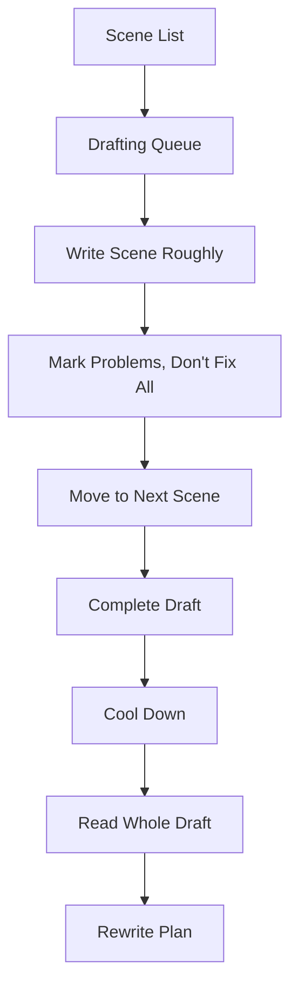
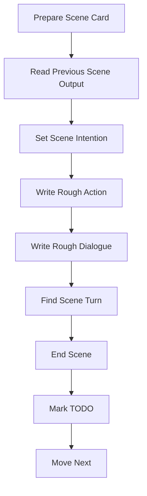

# learn-screenwriting-film-script-part-021.md

# Part 021 — Drafting Workflow: Dari Blank Page ke First Draft

> Seri: Learn Screenwriting for Film Project  
> Pendekatan: *The First 20 Hours* — Josh Kaufman  
> Fokus bagian ini: mengubah treatment, outline, dan scene list menjadi first draft screenplay yang selesai, bukan sempurna.  
> Target praktis: mampu menulis draft pertama film pendek atau feature dengan workflow yang jelas, ritme kerja realistis, dan prinsip “complete before perfect”.

---

## 0. Posisi Part Ini dalam Roadmap

Pada Part 020 kita membahas jembatan antara ide dan draft:

```text
Logline → Synopsis → Treatment → Outline → Scene List
```

Sekarang kita masuk ke fase yang paling nyata sekaligus paling menakutkan:

```text
Menulis halaman screenplay.
```

Banyak orang punya ide.  
Sebagian punya outline.  
Lebih sedikit yang menyelesaikan draft pertama.

Part ini membahas bagaimana menutup gap antara:

```text
Saya tahu ceritanya
```

dan:

```text
Saya punya draft lengkap yang bisa dibaca, dikritik, dan direvisi.
```

Draft pertama bukan final script. Draft pertama adalah material mentah untuk rewrite.

Mental model penting:

```text
First draft is not where the script becomes good.
First draft is where the script becomes real.
```

Diagram workflow:



Tujuan Part 021:

```text
Membuat Anda mampu menyelesaikan draft pertama tanpa tenggelam di scene 1.
```

---

## 1. Prinsip Kaufman dalam Part Ini

Dalam framework *The First 20 Hours*, skill drafting perlu dipecah.

Sub-skill drafting:

1. Menyiapkan drafting environment.
2. Menggunakan scene card.
3. Menulis action line kasar.
4. Menulis dialog kasar.
5. Menjaga scene objective.
6. Menyelesaikan scene walau belum bagus.
7. Menggunakan placeholder.
8. Menghindari rewrite prematur.
9. Mengatur sprint menulis.
10. Menjaga continuity minimal.
11. Menandai masalah untuk rewrite.
12. Menyelesaikan full pass.
13. Membaca draft sebagai keseluruhan.
14. Membuat rewrite plan.

Target 20 jam pertama:

```text
Mampu menyelesaikan draft pendek 5–10 halaman, atau minimal 10–20 halaman awal feature, dengan workflow yang bisa diulang.
```

Untuk feature, target pertama bukan langsung sempurna 100 halaman. Targetnya membangun sistem menulis yang sustain.

---

## 2. First Draft: Definisi yang Benar

First draft adalah versi lengkap pertama dari naskah.

Lengkap berarti:

- semua scene utama ada,
- awal-tengah-akhir ada,
- character journey terlihat,
- major turns ada,
- climax ada,
- final image ada,
- format dasar screenplay dipakai,
- walau dialog masih kasar,
- walau action line masih bisa dipoles,
- walau beberapa scene masih placeholder.

First draft bukan:

- final draft,
- shooting script,
- polished draft,
- script yang siap produksi,
- script yang bebas bug,
- script yang semua dialognya sudah indah.

Definisi kerja:

> First draft adalah proof bahwa cerita bisa berjalan dari opening image ke final image dalam bentuk screenplay.

---

## 3. Tujuan First Draft

Tujuan first draft bukan membuktikan Anda jenius.

Tujuan first draft:

1. Mengubah ide menjadi objek nyata.
2. Menguji struktur secara keseluruhan.
3. Menemukan masalah yang tidak terlihat di outline.
4. Menguji voice karakter.
5. Menguji pacing.
6. Menguji apakah scene benar-benar bisa ditulis.
7. Menguji apakah ending terasa earned.
8. Menyediakan bahan untuk feedback.
9. Menyediakan bahan untuk rewrite.

First draft menjawab:

```text
Apakah cerita ini hidup ketika berada di halaman?
```

Bukan:

```text
Apakah semua kalimat sudah sempurna?
```

---

## 4. Mindset: Drafting vs Rewriting

Drafting dan rewriting adalah mode kerja berbeda.

| Mode | Fokus | Bahaya jika tercampur |
|---|---|---|
| Drafting | Membuat material baru | Tidak selesai karena perfeksionisme |
| Rewriting | Memperbaiki material | Tidak bisa dilakukan jika material belum ada |

Saat drafting, Anda boleh mencatat masalah, tetapi jangan memperbaiki semua saat itu juga.

Contoh:

```text
[TODO: dialog Dina terlalu literal, fix later]
```

Lalu lanjut.

Jika setiap kali menemukan masalah Anda kembali ke halaman 1, draft tidak pernah selesai.

Prinsip:

```text
Write forward. Fix later.
```

---

## 5. Complete Before Perfect

Ini prinsip utama Part 021.

```text
Draft selesai yang buruk > scene pembuka sempurna yang tidak pernah berlanjut.
```

Kenapa?

Karena hanya draft lengkap yang bisa menunjukkan:

- apakah Act 2 bekerja,
- apakah midpoint benar,
- apakah ending membayar opening,
- apakah subplot perlu,
- apakah karakter berubah,
- apakah scope terlalu besar,
- apakah scene berulang.

Jika hanya scene 1 yang sempurna, Anda belum tahu filmnya bekerja.

Untuk software engineer:

```text
End-to-end failing integration test is more useful than a perfect isolated function with no app.
```

First draft adalah end-to-end run.

---

## 6. Drafting sebagai Implementation Pass

Dari Part 020:

```text
Treatment = Story Flow
Outline = Execution Map
Scene List = Drafting Queue
```

Sekarang:

```text
Screenplay Draft = Implementation
```

Tetapi seperti coding, implementation sering menemukan:

- requirement salah,
- edge case,
- dependency tidak jelas,
- naming problem,
- state transition hilang,
- function terlalu besar,
- modul perlu dipisah,
- hidden complexity.

Saat drafting screenplay, Anda mungkin menemukan:

- scene yang tampak bagus di outline ternyata tidak punya conflict,
- karakter tidak mau mengatakan dialog yang direncanakan,
- exposition terlalu berat,
- midpoint butuh setup tambahan,
- ending tidak terasa,
- scene perlu dipindah,
- object perlu muncul lebih awal.

Itu normal.

Catat. Jangan panik.

---

## 7. Drafting Pipeline

Pipeline dasar:



Per scene:

1. Baca scene card.
2. Tulis input state.
3. Tulis objective.
4. Tulis action pembuka.
5. Tulis dialog/action conflict.
6. Cari turn.
7. Keluar setelah output state tercapai.
8. Tandai masalah.
9. Lanjut.

Jangan mulai scene tanpa tahu:

```text
Apa yang berubah di scene ini?
```

---

## 8. Scene Card sebagai Unit Kerja

Scene card adalah tiket drafting.

Template minimal:

```text
Scene No:
Heading:
Characters:
Input State:
Objective:
Opposition:
Key Object:
Turn:
Output State:
Estimated Pages:
```

Contoh:

```text
Scene No:
05

Heading:
INT. RUMAH LAMA - RUANG MAKAN - MALAM

Characters:
Raka, Ibu, Dina

Input State:
Raka butuh tanda tangan dan mulai curiga pada kunci.

Objective:
Raka ingin mendapatkan kunci ruang kerja.

Opposition:
Ibu menolak, Dina hadir sebagai saksi.

Key Object:
Kunci liontin, map penjualan, piring.

Turn:
Ibu memberikan kunci ke Dina, bukan Raka.

Output State:
Power berpindah. Raka harus menghadapi Dina.
```

Dengan card seperti ini, drafting jauh lebih mudah.

---

## 9. Pre-Scene Ritual

Sebelum menulis scene, jawab 5 pertanyaan:

1. Siapa yang menginginkan apa?
2. Apa yang menghalangi?
3. Apa yang tersembunyi?
4. Apa yang berubah?
5. Bagaimana saya keluar scene secepat mungkin setelah perubahan terjadi?

Template cepat:

```text
Want:
Obstacle:
Subtext:
Turn:
Exit:
```

Contoh:

```text
Want:
Raka ingin kunci.

Obstacle:
Ibu tidak mau memberi; Dina melihat.

Subtext:
Raka tidak mau mengaku butuh trust.

Turn:
Kunci diberikan ke Dina.

Exit:
Setelah Dina menantang Raka untuk meminta atau memerintah.
```

---

## 10. Drafting Page dengan Anchor

Saat mulai scene, gunakan anchor:

- lokasi,
- object,
- action,
- sound,
- character posture,
- pressure.

Jangan mulai semua scene dengan karakter “duduk dan bicara”.

Contoh opening scene:

```text
INT. RUMAH LAMA - RUANG MAKAN - MALAM

Map penjualan rumah tergeletak di tengah meja.

Ibu meletakkan piring nasi tepat di atasnya.

Raka menatap piring itu.

DINA (O.S.)
Itu tanda tangan atau lauk?
```

Dalam beberapa baris:

- object aktif,
- conflict visual,
- tone pahit,
- Dina voice,
- scene hidup.

Anchor membantu masuk scene.

---

## 11. Drafting Action Line Kasar

Action line first draft tidak harus puitis.

Ia harus:

- jelas,
- filmik,
- bisa divisualkan,
- tidak terlalu panjang,
- menunjukkan action penting,
- tidak menjelaskan emosi secara mentah.

First draft acceptable:

```text
Raka melihat kunci di leher Ibu. Ia mencoba tidak terlihat terlalu tertarik.
```

Lebih polish nanti:

```text
Kunci kecil menggantung di leher Ibu.

Raka melihatnya terlalu lama.

Ibu menutup kerah bajunya.
```

Saat drafting, jangan berhenti 10 menit hanya untuk memperindah satu action line.

---

## 12. Drafting Dialog Kasar

Dialog first draft boleh on-the-nose dulu.

Strategi:

1. Tulis apa yang karakter sebenarnya maksud.
2. Lanjutkan scene.
3. Tandai line yang terlalu literal.
4. Rewrite nanti menjadi subtext.

Contoh first pass:

```text
RAKA
Ibu menyembunyikan sesuatu di ruang kerja Ayah.
```

Tandai:

```text
[TODO: too literal, make subtext/object-based]
```

Rewrite nanti:

```text
RAKA
Kunci itu berat ya, Bu? Sampai lima tahun tidak pernah lepas.
```

Jangan biarkan dialog kasar menghentikan draft.

---

## 13. Placeholder adalah Teman

Gunakan placeholder saat detail belum siap.

Contoh:

```text
[INSERT BETTER LEGAL OBSTACLE HERE]
```

```text
[DINA LINE - bitter joke about Raka bringing documents, not love]
```

```text
[NEED VISUAL SIGN THAT VILLAGE REMEMBERS FATHER]
```

```text
[CHECK: does notary procedure make sense?]
```

Placeholder menjaga momentum.

Aturan:

```text
Placeholder boleh di draft 1.
Placeholder tidak boleh dibiarkan di draft yang dikirim ke orang lain tanpa sadar.
```

Buat daftar TODO setelah draft.

---

## 14. Rough Draft Markup

Gunakan markup sederhana:

```text
[TODO]
[FIX]
[CHECK]
[RESEARCH]
[ALT]
[TOO ON THE NOSE]
[NEED BETTER IMAGE]
[CONTINUITY]
[CUT?]
```

Contoh:

```text
RAKA
Aku merasa bersalah karena meninggalkan keluarga.
[TOO ON THE NOSE - rewrite as action/object]
```

Atau:

```text
Ibu menunjukkan sertifikat rumah.
[RESEARCH: legal ownership detail]
```

Markup membantu Anda lanjut tanpa lupa problem.

---

## 15. Jangan Edit Format Berlebihan Saat Drafting

Format dasar penting, tetapi jangan polish terlalu dini.

Pastikan:

- scene heading benar,
- character cue jelas,
- dialog terbaca,
- action line tidak terlalu panjang,
- transition tidak berlebihan.

Tapi jangan berhenti untuk:

- mencari font perfect,
- spacing minor,
- transition fancy,
- nomor scene,
- camera direction,
- polish setiap parenthetical.

First draft harus readable, bukan final layout.

---

## 16. Drafting Tools

Pilihan tools:

### Fountain / Markdown-like

Cocok untuk software engineer.

Kelebihan:

- plain text,
- bisa pakai git,
- ringan,
- mudah diff,
- portable.

### WriterDuet / Fade In / Final Draft / Highland / Arc Studio

Kelebihan:

- format otomatis,
- collaboration,
- production features.

### Google Docs / Word

Bisa, tetapi formatting screenplay lebih repot.

Rekomendasi learning:

```text
Gunakan alat yang mengurangi friction.
```

Jangan habiskan energi memilih tool. Pilih satu dan tulis.

---

## 17. Folder Drafting

Struktur:

```text
screenplay-project/
  01-development/
    logline.md
    treatment.md
    outline.md
    scene-list.md
  02-draft/
    draft-001.fountain
    draft-001-notes.md
  03-rewrite/
    rewrite-plan-001.md
    draft-002.fountain
```

Simpan notes terpisah agar draft tidak terlalu berantakan.

---

## 18. Versioning Draft

Gunakan versi:

```text
draft-001
draft-002
draft-003
```

Jangan overwrite tanpa backup.

Changelog:

```text
draft-002:
- Reordered notary scene before warung scene.
- Moved key transfer earlier.
- Changed midpoint from ownership reveal to Raka signature reveal.
- Cut neighbor subplot.
```

Ini membantu belajar dari keputusan.

---

## 19. Drafting Sprint

Gunakan sprint pendek.

Untuk belajar, gunakan:

```text
25 menit writing
5 menit break
```

Atau:

```text
45 menit writing
10 menit break
```

Target sprint bukan halaman sempurna.

Target sprint:

- 1 rough scene,
- atau 2 halaman kasar,
- atau 500–800 kata action/dialog,
- atau 1 beat sulit.

Sprint template:

```text
Sprint Goal:
Scene:
Expected Turn:
Start time:
End time:
Result:
Problem notes:
Next action:
```

---

## 20. Daily Drafting Goal

Untuk short:

```text
1–2 scene per session
```

Untuk feature:

```text
3–5 pages per session
```

Atau lebih realistis:

```text
One scene completed roughly per day.
```

Feature 50 scenes:

```text
50 writing sessions = draft selesai.
```

Jika 5 sessions per week:

```text
10 weeks.
```

Jika 2 scenes per day:

```text
25 days.
```

Jangan terintimidasi 100 halaman. Pecah menjadi scene.

---

## 21. Drafting Metrics

Gunakan metric yang tepat.

Jangan hanya:

```text
Apakah bagus?
```

Saat drafting, metric:

- scene selesai,
- halaman bertambah,
- sequence selesai,
- draft lengkap,
- TODO tercatat,
- continuity tidak kacau total.

Metric first draft:

```text
Completion over polish.
```

Tabel tracking:

```text
Scene | Status | Pages | Problem | Next
01 | done rough | 2 | dialogue literal | rewrite later
02 | done rough | 1.5 | needs better visual | later
03 | not started | - | - | next
```

---

## 22. Drafting Progress Board

Status:

```text
TODO
DRAFTING
ROUGH DONE
NEEDS FIX
DONE FOR DRAFT 1
```

Scene board:

```text
S01 Opening — DONE FOR DRAFT 1
S02 Inciting call — ROUGH DONE
S03 Arrival home — TODO
S04 Dinner map/piring — DRAFTING
```

Ini memberi sense of progress.

---

## 23. Writing Forward

Saat drafting, jangan sering kembali ke halaman sebelumnya.

Aturan:

```text
Boleh membaca 1 scene sebelumnya untuk continuity.
Jangan membaca dari page 1 setiap hari.
```

Jika Anda membaca dari awal setiap sesi, Anda akan rewrite Act 1 terus.

Gunakan notes:

```text
Change needed in earlier scene:
- Add clue that Dina photographs documents.
- Introduce key sound earlier.
```

Lanjut ke depan.

---

## 24. Drafting Out of Order

Boleh menulis out of order jika:

- scene tertentu sangat jelas,
- Anda butuh momentum,
- climax sudah terasa,
- Anda stuck di scene transisi.

Namun hati-hati:

- continuity bisa kacau,
- emotional build bisa loncat,
- placeholder banyak.

Strategi aman:

```text
Tulis sequence by sequence.
```

Atau:

```text
Tulis scene kunci dulu, lalu isi jembatan.
```

Untuk short, sebaiknya linear.

Untuk feature, boleh kombinasi.

---

## 25. Skeleton Draft

Skeleton draft adalah draft dengan scene kasar dan placeholder besar.

Contoh:

```text
INT. KANTOR NOTARIS - SIANG

[Scene where Raka tries to process sale. Notary reveals mother's legal control. Need research.]

Raka exits, angry.

His phone BUZZES.

BUYER (TEXT)
Besok jam sembilan. Jangan bikin saya masuk lewat pintu lama.
```

Skeleton draft berguna untuk:

- menjaga alur,
- melihat page distribution,
- tidak stuck,
- menyelesaikan first pass cepat.

Nanti di fill-in.

---

## 26. Vomit Draft

Vomit draft adalah draft cepat tanpa self-censorship.

Kelebihan:

- cepat selesai,
- mengurangi perfeksionisme,
- menemukan suara karakter,
- membuka ide tak terduga.

Kekurangan:

- messy,
- banyak rewrite,
- struktur bisa kacau jika tanpa outline.

Gunakan vomit draft untuk scene/dialog, bukan untuk seluruh feature tanpa outline.

---

## 27. Discovery Draft

Discovery draft adalah menulis untuk menemukan cerita.

Boleh, tetapi untuk beginner sering membuat:

- Act 1 panjang,
- Act 2 hilang arah,
- ending tidak tahu,
- scope melebar.

Jika Anda suka discovery, tetap gunakan guardrails:

```text
Opening image
Midpoint target
Ending image
Character want
Theme question
```

Discovery tidak berarti tanpa kompas.

---

## 28. Drafting dengan Outline Fleksibel

Saat scene hidup berubah dari outline:

Tanya:

```text
Apakah perubahan ini membuat:
- conflict lebih kuat?
- character lebih jujur?
- theme lebih tajam?
- production lebih feasible?
- causality lebih baik?
```

Jika ya, terima perubahan dan update outline.

Jika hanya karena Anda bosan, hati-hati.

Maintain:

```text
draft-notes.md
```

Contoh:

```text
S05 changed: Dina asks about key earlier.
Impact: Need adjust S06 where Dina "discovers" key. She already knows.
```

---

## 29. Scene Entry

Masuk scene sedekat mungkin ke conflict.

Buruk:

```text
Raka masuk rumah, melepas sepatu, melihat-lihat, menyapa, duduk, minum, lalu setelah 3 halaman bicara penjualan.
```

Lebih baik:

```text
Raka meletakkan map penjualan di meja.

Ibu meletakkan piring nasi di atasnya.
```

Scene langsung konflik.

Pertanyaan entry:

```text
Apa momen paling terlambat saya bisa masuk tanpa membuat penonton bingung?
```

---

## 30. Scene Exit

Keluar setelah turn.

Buruk:

```text
Setelah kunci diberikan ke Dina, mereka masih membahas hal yang sama 2 halaman.
```

Lebih baik:

```text
DINA
Mau minta, atau mau nyuruh?

Cut.
```

Keluar saat pressure baru jelas.

Pertanyaan exit:

```text
Apa kalimat/action terakhir yang mengubah arah scene berikutnya?
```

---

## 31. Drafting Scene Middle

Bagian tengah scene sering melebar.

Gunakan tactic shift.

Template:

```text
Tactic 1:
Counter:
Tactic 2:
Counter:
Tactic 3:
Turn:
```

Contoh:

```text
Raka tactic 1:
Minta kunci sebagai urusan dokumen.

Ibu counter:
Alihkan ke makan.

Raka tactic 2:
Tekan deadline pembeli.

Ibu counter:
Serang moral pulangnya.

Raka tactic 3:
Menyebut ayah.

Ibu turn:
Memberi kunci ke Dina.
```

Tactic shift menjaga scene middle hidup.

---

## 32. Drafting Dialogue dengan Objective

Sebelum dialog, tulis:

```text
A wants:
B wants:
A hides:
B hides:
```

Contoh:

```text
Raka wants:
Kunci.

Ibu wants:
Menjaga ruang kerja tertutup.

Raka hides:
Ia takut isi ruang kerja membuktikan sesuatu tentang ayah.

Ibu hides:
Isi ruang kerja juga menyangkut Raka.

Dina wants:
Tahu kenapa semua orang bohong.
```

Dialog menjadi lebih tajam.

---

## 33. Drafting Subtext

Saat first draft, gunakan dua layer.

Layer 1 notes:

```text
What character means:
```

Layer 2 actual dialogue:

```text
What character says:
```

Contoh:

```text
Meaning:
Raka merasa ditolak sebagai anak.

Dialogue:
RAKA
Kalau kunci itu keluarga, kenapa cuma Ibu yang boleh pegang?
```

Jika sulit, tulis meaning dulu di notes, lalu ubah.

---

## 34. Drafting Action Beat

Action beat membantu dialog.

Fungsi action beat:

- memberi pause,
- menunjukkan subtext,
- mengganti line,
- mengubah power,
- memperjelas object,
- memberi aktor playable action.

Contoh:

```text
RAKA
Kuncinya.

Ibu tidak menjawab.

Ia mengambil sambal dari depan Raka dan memindahkannya ke dekat Dina.

IBU
Makan dulu.
```

Action beat menunjukkan Ibu mengontrol meja, bukan hanya kata.

---

## 35. Drafting Visual Information

Saat Anda perlu memberi informasi, cari visual dulu.

Informasi:

```text
Raka lama tidak pulang.
```

Visual:

```text
Sandal rumah untuk Raka tidak ada. Rak sepatu punya bekas debu berbentuk sandal lama.
```

Informasi:

```text
Ibu masih menunggu.
```

Visual:

```text
Piring keempat diambil dari rak paling atas, dicuci sebelum dipakai.
```

Gunakan dialog jika visual tidak cukup atau conflict membutuhkannya.

---

## 36. Drafting Exposition

Gunakan prinsip Part 015:

```text
Information + Pressure + Conflict + Consequence
```

Saat perlu exposition, tanya:

1. Siapa butuh informasi?
2. Siapa menyembunyikan?
3. Apa harga informasi?
4. Apa yang berubah setelah info keluar?
5. Bisa lewat object/document/reaction?

Contoh exposition buruk:

```text
IBU
Rumah ini atas nama Ibu sejak ayahmu terlibat kasus sertifikat palsu tahun 2003.
```

Draft lebih dramatik:

```text
Notaris membalik sertifikat.

NOTARIS
Yang mau menjual tidak ada di kolom pemilik.

Raka membaca nama itu.

SARI WIDJAJA.
```

---

## 37. Drafting Scene with Object

Objek membuat scene konkret.

Template:

```text
Object at start:
Who wants it:
Who controls it:
How it moves:
Meaning at end:
```

Contoh:

```text
Object:
Kunci.

Start:
Di leher Ibu.

Wants:
Raka.

Controls:
Ibu.

Moves:
Ibu melepas dan memberi ke Dina.

Meaning at end:
Raka tidak bisa mengakses truth lewat force; ia butuh trust.
```

Saat drafting, pastikan object terlihat dan bergerak jika penting.

---

## 38. Drafting Transitions

Transisi tidak harus fancy.

Gunakan:

- action consequence,
- sound bridge,
- object match,
- emotional contrast,
- time jump jelas.

Contoh:

```text
Kunci jatuh ke telapak tangan Dina.

CUT TO:

Stempel notaris jatuh ke kertas.
```

Atau tanpa “CUT TO”:

```text
Kunci jatuh ke telapak tangan Dina.

INT. KANTOR NOTARIS - SIANG

Stempel menghantam kertas.
```

Transisi membantu flow.

---

## 39. Drafting Sequence

Untuk feature, tulis per sequence.

Sebelum mulai sequence:

```text
Sequence goal:
Input state:
Output state:
Key turn:
Scenes:
```

Setelah selesai sequence, cek:

- apakah output tercapai?
- apakah protagonist strategy berubah?
- apakah pressure naik?
- apakah ada scene filler?
- apakah sequence turn jelas?

Jangan menunggu seluruh draft untuk mengecek sequence.

---

## 40. Drafting Act

Setiap act punya target.

### Act 1 Drafting Target

- opening image,
- protagonist state,
- inciting incident,
- world/tone,
- lock-in.

### Act 2A Drafting Target

- promise of premise,
- first strategy,
- world expansion,
- rising complications,
- midpoint setup.

### Act 2B Drafting Target

- consequences of midpoint,
- pressure collapse,
- trust damage,
- all is lost.

### Act 3 Drafting Target

- crisis choice,
- final plan,
- climax,
- resolution,
- final image.

Jika Anda tahu target act, drafting lebih fokus.

---

## 41. First Draft Quality Bar

First draft harus:

- lengkap,
- readable,
- punya scene heading,
- punya action/dialog dasar,
- punya ending,
- punya major turns,
- tidak harus indah.

First draft boleh:

- dialog literal,
- scene terlalu panjang,
- action line kasar,
- beberapa placeholder,
- pacing belum pas,
- character voice belum konsisten,
- exposition terlalu jelas,
- beberapa continuity issue.

First draft tidak boleh:

- tidak selesai,
- tidak punya ending,
- tidak punya midpoint/turn utama,
- tidak jelas siapa protagonist,
- tidak jelas goal,
- hanya outline dalam format screenplay tanpa scene,
- terlalu penuh placeholder hingga tidak bisa dibaca.

---

## 42. Drafting Short Film

Untuk short, workflow:

1. Baca 5 scene list.
2. Tulis opening image.
3. Tulis scene 1 sampai turn.
4. Lanjut scene 2.
5. Jangan polish line dulu.
6. Pastikan choice final tertulis.
7. Pastikan final image tertulis.
8. Baca sekali dari awal.
9. Potong 20–30%.

Short bisa didraft dalam 1–3 sesi jika outline jelas.

Target:

```text
5–10 halaman first draft.
```

---

## 43. Drafting Feature Film

Untuk feature, workflow:

1. Siapkan 8 sequence outline.
2. Siapkan scene list Act 1 lengkap.
3. Draft Act 1.
4. Review hanya untuk continuity besar, bukan polish.
5. Draft Act 2A.
6. Draft midpoint.
7. Draft Act 2B.
8. Draft Act 3.
9. Lengkapi placeholder besar.
10. Baru read-through.

Feature bisa butuh beberapa minggu/bulan.

Jangan menilai draft dari halaman 10 saja.

---

## 44. Drafting Feature dengan Milestone

Milestone:

```text
Milestone 1: Act 1 complete
Milestone 2: Act 2A complete
Milestone 3: Midpoint written
Milestone 4: Act 2B complete
Milestone 5: Climax written
Milestone 6: Full draft complete
Milestone 7: Read-through complete
Milestone 8: Rewrite plan complete
```

Rayakan milestone, bukan hanya final.

---

## 45. Drafting Schedule Example: Short

7 hari:

| Hari | Task |
|---:|---|
| 1 | Finalize scene list + opening/final image |
| 2 | Draft scenes 1–2 |
| 3 | Draft scenes 3–4 |
| 4 | Draft scene 5 + final image |
| 5 | Read-through + mark TODO |
| 6 | Quick rewrite structure/dialog |
| 7 | Table read draft |

Atau 1 hari intensif:

```text
Morning: beat + scene list
Afternoon: draft
Evening: read-through
```

---

## 46. Drafting Schedule Example: Feature

8 minggu:

| Minggu | Task |
|---:|---|
| 1 | Final outline + scene list |
| 2 | Draft Sequence 1 |
| 3 | Draft Sequence 2 |
| 4 | Draft Sequences 3–4 |
| 5 | Draft Sequences 5–6 |
| 6 | Draft Sequences 7–8 |
| 7 | Fill placeholders + continuity pass |
| 8 | Full read-through + rewrite plan |

Lebih cepat/lambat tergantung waktu.

Prinsip:

```text
Schedule harus realistis, bukan heroik.
```

---

## 47. Mengatasi Blank Page

Blank page muncul karena:

- scene objective tidak jelas,
- terlalu ingin bagus,
- takut salah,
- tidak tahu first image,
- tidak tahu dialog awal,
- terlalu banyak kemungkinan,
- outline terlalu kosong.

Solusi:

1. Tulis scene card.
2. Tulis action pertama yang konkret.
3. Tulis dialog literal dulu.
4. Gunakan placeholder.
5. Tulis versi buruk selama 10 menit.
6. Mulai dari middle conflict.
7. Tulis last line scene dulu.
8. Tulis objective/opposition di atas scene.

Template anti-blank:

```text
In this scene, [A] wants [X] from [B], but [B] wants [Y]. The scene turns when [Z].
```

Lalu tulis.

---

## 48. Mengatasi Perfeksionisme

Perfeksionisme drafting biasanya berkata:

```text
Kalimat ini belum cukup bagus.
Dialog ini belum natural.
Scene ini belum sempurna.
Saya harus research dulu.
Saya harus baca referensi lagi.
```

Jawaban:

```text
Bagus nanti. Selesai dulu.
```

Gunakan rule:

```text
No more than 5 minutes polishing any line in first draft.
```

Jika stuck:

```text
[MAKE THIS BETTER LATER]
```

Lanjut.

---

## 49. Mengatasi Research Trap

Research penting, tetapi bisa menjadi penghindaran.

Contoh:

```text
Saya belum tahu prosedur notaris, jadi tidak bisa menulis scene.
```

Solusi:

```text
Tulis versi dramatik dengan placeholder.
```

Draft:

```text
NOTARIS
[LEGAL REASON WHY RAKA CANNOT SELL WITHOUT MOTHER]
```

Lalu lanjut.

Research nanti memperbaiki detail.

Jangan biarkan satu detail menghentikan story.

---

## 50. Mengatasi “Scene Ini Jelek”

Saat scene terasa jelek:

1. Apakah turn-nya jelas?
2. Jika ya, biarkan kasar.
3. Tandai masalah.
4. Lanjut.

Jika turn tidak jelas:

- kembali ke scene card,
- tentukan objective/opposition/output,
- tulis ulang cepat.

Jangan polish scene tanpa turn.

---

## 51. Mengatasi Karakter Tidak Mau Bicara

Jika dialog macet, tanyakan:

```text
Apa yang karakter mau?
Apa yang ia takut katakan?
Apa tactic-nya?
Apa yang ia gunakan sebagai topik permukaan?
```

Jika masih macet, tulis monolog rahasia:

```text
RAKA PRIVATE:
Aku tidak tahu cara meminta bantuan karena kalau aku meminta, Dina akan tahu aku tidak punya kontrol.
```

Lalu ubah menjadi dialog:

```text
RAKA
Dina, kuncinya cuma sebentar.

DINA
Kakak selalu bilang sebentar untuk hal yang bikin orang lain nunggu lima tahun.
```

---

## 52. Mengatasi Scene Terlalu Panjang

Saat scene melebar:

1. Cari turn.
2. Potong sebelum dan sesudah.
3. Gabungkan line.
4. Ganti penjelasan dengan action.
5. Akhiri di button line/action.

Pertanyaan:

```text
Apa yang harus terjadi agar scene berikutnya mungkin?
```

Jika sudah terjadi, keluar.

---

## 53. Mengatasi Act 2 Stuck

Jika Act 2 macet:

- buat sequence goal,
- beri protagonist strategi baru,
- buat opposition bergerak,
- buka clue/reveal,
- pindahkan object,
- naikkan deadline,
- rusakkan relationship,
- hilangkan resource,
- ubah power.

Act 2 stuck biasanya karena protagonist tidak punya actionable goal.

---

## 54. Mengatasi Ending Stuck

Jika ending macet:

Tanya:

1. Apa final choice?
2. Apa final action visible?
3. Apa final image?
4. Apa object payoff?
5. Apa theme answer?
6. Apa yang berubah dari opening?

Jika tidak tahu ending, jangan polish Act 1 terus. Desain ending target dulu.

---

## 55. Drafting Continuity Minimal

Saat first draft, track minimal:

- waktu,
- lokasi,
- prop penting,
- siapa tahu apa,
- relationship state,
- injuries/physical state,
- deadlines,
- documents,
- clothing if relevant.

Continuity table:

```text
Scene | Time | Key Prop | Who Knows What | Relationship State
01 | Night | Map with Raka | Raka knows buyer deadline | Raka/Ibu cold
02 | Night | Key on Ibu | Dina notices tension | Dina suspicious
03 | Night | Key with Dina | Dina knows key matters | Raka dependent
```

Jangan overdo, tapi track essentials.

---

## 56. Drafting Emotional Continuity

Emotional continuity penting.

Jika scene sebelumnya Raka baru melihat tanda tangannya di dokumen, scene berikutnya jangan ia bercanda santai tanpa alasan.

Track:

```text
Character emotional state at output:
```

Contoh:

```text
Scene 22 output:
Raka morally shocked, defensive, ashamed.

Scene 23 input:
Raka tries to regain control by calling buyer, not because he is calm but because panic becomes control tactic.
```

Emosi harus mengalir.

---

## 57. Drafting Information Continuity

Track siapa tahu apa.

Contoh:

```text
Raka knows:
Need signature, key matters, house ownership, later his signature.

Dina knows:
Raka wants key, Ibu hides something, later Raka lied.

Ibu knows:
Full truth about document, Raka's signature, buyer connection.

Audience knows:
Depends on reveal schedule.
```

Jangan membuat karakter memakai informasi yang belum ia dapat.

---

## 58. Drafting Object Continuity

Untuk object penting:

```text
Kunci:
S1 leher Ibu
S5 tangan Dina
S10 meja
S20 membuka ruang
Final pintu

Map:
S1 tangan Raka
S5 tertindih piring
S8 notaris
S30 berisi dokumen
Final tidak lagi dipakai sebagai penjualan
```

Object continuity menjaga payoff.

---

## 59. Drafting dengan Theme di Belakang Kepala

Jangan menulis theme sebagai pidato.

Tapi saat drafting, ingat:

```text
Theme question:
Apakah keluarga bisa diselamatkan dengan kebohongan?
```

Setiap major scene bertanya:

```text
Karakter memilih perlindungan, kebenaran, kontrol, atau trust?
```

Theme menjadi decision filter.

---

## 60. Drafting dengan Genre Promise

Jika genre family mystery drama:

Pastikan draft punya:

- family conflict,
- object clue,
- locked truth,
- progressive reveal,
- emotional confrontation,
- moral choice.

Jika 20 halaman tidak ada mystery object/reveal, genre promise lemah.

Jika 20 halaman tidak ada family pressure, drama lemah.

Saat drafting, jaga genre signal.

---

## 61. Drafting dengan Tone

Tone first draft boleh belum sempurna, tetapi hindari tone-breaking besar.

Jika tone:

```text
Melankolis, restrained, humor pahit.
```

Maka hindari tiba-tiba:

- slapstick,
- monolog melodrama besar,
- thriller action besar tanpa setup,
- joke modern yang merusak dunia,
- horror literal jika tidak direncanakan.

Tandai:

```text
[TONE CHECK]
```

jika ragu.

---

## 62. Drafting Opening

Opening harus:

- memberi image,
- memperkenalkan protagonist state,
- memberi genre/tone,
- menunjukkan tension,
- memicu curiosity.

Draft opening jangan terlalu panjang.

Contoh opening feature:

```text
INT. APARTEMEN RAKA - PAGI

Tidak ada foto di apartemen Raka.

Hanya rak sepatu, laptop, map-map berlabel, dan tagihan yang disusun rapi.

Ponsel bergetar: IBU.

Raka membalik ponsel tanpa melihat.

Di bawahnya, amplop bank: FINAL NOTICE.
```

Dalam satu halaman:

- Raka kontrol,
- menghindari ibu,
- uang pressure,
- no emotional clutter,
- tone restrained.

---

## 63. Drafting Inciting Incident

Inciting incident harus memicu action.

Contoh:

```text
Pembeli memberi deadline cepat.
```

Draft:

```text
BUYER (PHONE)
Dua hari, Pak Raka. Rumah lama seperti luka. Kalau kelamaan dibuka, orang mulai tanya bau dari mana.
```

Atau lebih realistic:

```text
BUYER (PHONE)
Saya bayar tunai kalau semua beres Jumat. Lewat itu, saya beli dari orang yang lebih bisa tanda tangan.
```

Inciting incident harus membuat Raka bergerak pulang.

---

## 64. Drafting Midpoint

Midpoint harus ditulis sebagai scene/moment yang membalik game.

Contoh:

```text
Raka menemukan tanda tangannya.
```

Drafting tips:

- jangan terlalu cepat reveal,
- beri expectation false theory,
- biarkan object/document terlihat,
- tunjukkan reaction,
- jangan langsung jelaskan semua,
- beri aftermath.

Scene:

```text
Raka membuka map tua.

Nama ayah. Tanda tangan ayah.

Ia menghela napas, hampir lega.

Lalu melihat kolom saksi.

RAKA PRADIPTA.

Tanda tangannya sendiri.

Lebih muda. Lebih rapi. Lebih percaya.
```

Line terakhir bisa menjadi emotional hit.

---

## 65. Drafting All Is Lost

All Is Lost harus terasa sebagai collapse, bukan hanya bad news.

Gabungkan beberapa kegagalan:

- external goal gagal,
- relationship rusak,
- moral image runtuh,
- antagonist menang,
- time habis.

Contoh:

```text
Dina menolak memberi salinan.
Ibu masuk rumah sakit/pingsan.
Pembeli mengirim foto salinan dokumen.
Raka menyadari ia tidak bisa menjual, tidak bisa membuka, tidak bisa pergi tanpa memilih kebohongan.
```

Tulis dengan visual pressure, bukan hanya dialog.

---

## 66. Drafting Climax

Climax harus berupa action visible.

Bukan hanya:

```text
Raka akhirnya memahami kebenaran.
```

Melainkan:

```text
Raka meletakkan dokumen di meja di depan pembeli, notaris, Ibu, Dina, dan korban lama.
```

Atau:

```text
Raka menandatangani laporan yang membuat dirinya ikut diperiksa.
```

Internal change harus terlihat sebagai tindakan.

---

## 67. Drafting Resolution

Resolution jangan terlalu panjang.

Cukup tunjukkan:

- consequence,
- changed relationship,
- final image.

Contoh:

```text
Ruang kerja terbuka.

Kunci tergantung di pintunya.

Ibu duduk di meja makan tanpa liontin.

Raka melepas sepatu sebelum keluar ke teras.

Ia tidak membawa map penjualan.
```

No need menjelaskan semua hukum/masa depan.

---

## 68. First Read-Through

Setelah draft selesai, jangan langsung rewrite line-by-line.

Lakukan first read-through:

1. Cetak atau baca PDF/format nyaman.
2. Jangan edit saat membaca.
3. Catat reaksi di margin/notes.
4. Tandai:
   - bosan,
   - bingung,
   - emotionally engaged,
   - too long,
   - strong scene,
   - weak transition,
   - character inconsistency.
5. Baca sampai akhir.

Tujuan:

```text
Melihat draft sebagai film utuh.
```

---

## 69. Cooling Period

Jika bisa, beri jeda:

- short: 1 hari,
- feature: 3–7 hari.

Jeda membantu Anda membaca sebagai pembaca, bukan hanya penulis yang masih ingat semua niat.

Jika deadline ketat, minimal tidur satu malam.

---

## 70. Draft Notes After Read

Setelah baca, buat notes:

```text
Big Problems:
1.
2.
3.

Structural:
Character:
Scene:
Dialogue:
Exposition:
Production:
Questions:
```

Jangan langsung fix random line.

Cari root cause.

Contoh:

```text
Problem:
Dina terasa terlalu marah sejak awal.

Possible root:
Tidak ada scene yang menunjukkan bahwa ia masih ingin Raka peduli.

Fix:
Tambah micro-moment sebelum dinner: Dina menyimpan piring Raka tapi menyembunyikannya saat ia masuk.
```

---

## 71. Draft Completion Checklist

First draft selesai jika:

- [ ] Semua scene utama tertulis.
- [ ] Opening image ada.
- [ ] Inciting incident ada.
- [ ] Act/sequence turns ada.
- [ ] Midpoint ada.
- [ ] All is lost/crisis ada.
- [ ] Climax ada.
- [ ] Resolution/final image ada.
- [ ] Placeholder besar ditandai.
- [ ] TODO list dibuat.
- [ ] Draft bisa dibaca dari awal sampai akhir.

Bukan selesai jika:

```text
Saya punya 30 halaman awal yang polished.
```

---

## 72. Drafting Anti-Pattern

### 72.1 Rewrite Loop

Menulis scene 1–3 berulang, tidak pernah lanjut.

Fix:

```text
No major rewrite until full draft or sequence milestone.
```

### 72.2 Tool Obsession

Menghabiskan waktu memilih software.

Fix:

```text
Use any tool. Write.
```

### 72.3 Research Avoidance

Research dipakai untuk menunda halaman.

Fix:

```text
Placeholder and continue.
```

### 72.4 Perfect Dialogue First

Dialog dipoles sebelum scene turn jelas.

Fix:

```text
Scene function first, dialogue later.
```

### 72.5 Outline Abandonment

Begitu ada ide baru, semua outline ditinggal.

Fix:

```text
Update outline consciously, don't drift unconsciously.
```

### 72.6 No Ending Drafted

Berhenti sebelum ending karena takut.

Fix:

```text
Write bad ending. Rewrite later.
```

### 72.7 Too Much Placeholder

Draft penuh catatan, tidak punya scene actual.

Fix:

```text
Minimal playable version for every scene.
```

### 72.8 Polishing Action Lines Too Early

Menghabiskan energi memperindah kalimat.

Fix:

```text
Readable first. Beautiful later.
```

---

## 73. Debugging Drafting Process

Jika Anda tidak maju:

### 73.1 Tidak tahu scene berikutnya

Masalah outline.

Solusi:

```text
Buat scene card.
```

### 73.2 Tahu scene tapi tidak bisa mulai

Masalah entry.

Solusi:

```text
Mulai dari object/action/line konflik.
```

### 73.3 Scene terasa mati

Masalah objective/opposition.

Solusi:

```text
Tentukan want vs resistance.
```

### 73.4 Dialog terasa buruk

Normal.

Solusi:

```text
Tulis literal, tandai subtext later.
```

### 73.5 Draft terasa terlalu jelek

Normal.

Solusi:

```text
Complete before perfect.
```

### 73.6 Takut ending tidak berhasil

Tulis versi buruk.

Solusi:

```text
Ending can be rewritten only after it exists.
```

---

## 74. Drafting Checklist per Scene

Sebelum menulis:

- [ ] Scene heading jelas.
- [ ] Input state jelas.
- [ ] Objective jelas.
- [ ] Opposition jelas.
- [ ] Turn jelas.
- [ ] Output state jelas.
- [ ] Key object/info jelas.

Setelah menulis:

- [ ] Scene masuk dekat conflict.
- [ ] Scene keluar setelah turn.
- [ ] Tidak terlalu banyak exposition.
- [ ] Ada visual/action.
- [ ] Dialog tidak semua literal.
- [ ] Output memicu scene berikutnya.
- [ ] TODO ditandai.

---

## 75. Drafting Checklist per Session

Sebelum session:

- [ ] Pilih scene target.
- [ ] Baca scene card.
- [ ] Tentukan output session.
- [ ] Siapkan timer.
- [ ] Tutup distraction.

Setelah session:

- [ ] Simpan file.
- [ ] Catat progress.
- [ ] Catat TODO.
- [ ] Tentukan next scene.
- [ ] Jangan rewrite besar.

---

## 76. Drafting Template: Scene Header Notes

Sebelum actual scene, Anda bisa menulis notes sementara:

```text
<!--
Scene Goal: Raka wants key.
Opposition: Mother refuses, Dina witnesses.
Turn: Key goes to Dina.
Output: Raka dependent on Dina.
-->
```

Lalu tulis scene.

Saat draft akan dibagikan, hapus notes.

Ini cocok di Fountain/Markdown.

---

## 77. Drafting Template: Daily Log

```text
# Drafting Log

Date:
Session:
Scene(s):
Goal:
Pages written:
What worked:
Problems:
TODO:
Next session:
```

Contoh:

```text
Date:
2026-06-25

Scene:
S05 Dinner Key Transfer

Pages:
3 rough

What worked:
Dina's sarcasm and key transfer.

Problems:
Mother dialogue too poetic; Raka too angry too early.

TODO:
Rewrite Raka tactic to start polite/technical.

Next:
S06 Notary scene.
```

Log membantu consistency.

---

## 78. Drafting Template: TODO List

```text
# Draft 001 TODO

## Structural
- [ ] Setup Dina photographing documents earlier.
- [ ] Strengthen Act 1 lock-in.

## Character
- [ ] Make Raka less villainous in first dinner.
- [ ] Give Ibu one private moment before midpoint.

## Exposition
- [ ] Replace legal explanation in notary scene with visual document reveal.

## Dialogue
- [ ] Rewrite Raka/Ibu dinner dialogue for subtext.
- [ ] Reduce Dina sarcasm by 20%.

## Production
- [ ] Cut one exterior crowd scene.
```

TODO list mencegah anxiety.

---

## 79. Drafting Template: Placeholder Index

```text
# Placeholder Index

[LEGAL OBSTACLE]
Scene:
Need:
Research:

[BETTER DINA LINE]
Scene:
Need:
Tone:

[VISUAL PAYOFF KEY]
Scene:
Need:
Options:
```

Sebelum draft dibagikan, resolve placeholder.

---

## 80. Drafting Exercise 1 — Bad Scene Fast

Ambil satu scene card.

Tulis scene dalam 15 menit dengan tujuan:

```text
Make it bad but complete.
```

Larangan:

- tidak boleh menghapus,
- tidak boleh polish,
- tidak boleh research,
- boleh placeholder.

Setelah selesai, beri label:

```text
What is the turn?
What works?
What is worst?
What to fix later?
```

Tujuan:

```text
Melatih completion.
```

---

## 81. Drafting Exercise 2 — Literal to Draft

Tulis dialog literal dulu.

Contoh:

```text
RAKA
Aku merasa Ibu tidak mempercayaiku.

IBU
Ibu tidak percaya karena kamu hanya pulang saat butuh sesuatu.
```

Lalu ubah ke subtext:

```text
RAKA
Kunci itu bahkan tidur di kamar Ibu?

IBU
Ada barang yang lebih aman dekat orang yang tidak pergi.
```

Latihan ini membantu drafting dialog kasar.

---

## 82. Drafting Exercise 3 — Scene Entry Variations

Untuk satu scene, tulis 5 opening berbeda:

1. Object first.
2. Action first.
3. Dialogue first.
4. Sound first.
5. Visual contradiction first.

Contoh scene kunci:

Object first:

```text
Kunci kecil berdenting di leher Ibu setiap kali sendoknya menyentuh piring.
```

Dialogue first:

```text
RAKA
Kuncinya.
```

Sound first:

```text
Denting kunci mengalahkan suara hujan.
```

Pilih yang paling kuat.

---

## 83. Drafting Exercise 4 — Exit Line

Untuk satu scene, tulis 10 possible ending line/action.

Contoh:

```text
1. DINA: Mau minta, atau mau nyuruh?
2. Dina meletakkan kunci di gelas kosong Raka.
3. Ibu menutup lampu ruang makan.
4. Raka duduk untuk pertama kalinya.
5. Kunci jatuh ke meja. Tidak ada yang mengambil.
```

Pilih yang memberi strongest next pressure.

---

## 84. Drafting Exercise 5 — Placeholder Sprint

Tulis scene sulit dengan minimal 3 placeholder.

Tujuan:

```text
Melewati friction.
```

Contoh:

```text
NOTARIS
[LEGAL DETAIL THAT BLOCKS SALE]

Raka looks at the certificate.

[INSERT VISUAL OF NAME NOT FATHER]
```

Setelah draft selesai, kembali isi.

---

## 85. Drafting Exercise 6 — Sequence Sprint

Untuk feature:

1. Pilih satu sequence.
2. Tulis semua scene dalam bentuk rough/skeleton.
3. Jangan polish.
4. Pastikan sequence output tercapai.
5. Review hanya sequence turn.

Target:

```text
Satu sequence rough selesai.
```

---

## 86. Drafting Exercise 7 — No Backspace Sprint

Selama 20 menit:

- jangan hapus,
- jika salah, lanjut,
- jika stuck, tulis `[stuck]` lalu terus,
- fokus scene completion.

Ini melatih forward motion.

---

## 87. Drafting Exercise 8 — Read Aloud Scene

Setelah menulis scene:

1. Baca keras.
2. Tandai line yang sulit diucapkan.
3. Tandai line terlalu panjang.
4. Tandai line terlalu literal.
5. Jangan rewrite semua sekarang.
6. Catat untuk rewrite pass.

---

## 88. Practice Plan 90 Menit — Short Draft

| Durasi | Aktivitas | Output |
|---:|---|---|
| 10 menit | Review scene list | Draft map |
| 10 menit | Write scene 1 rough | Opening |
| 15 menit | Write scene 2 rough | Disruption |
| 20 menit | Write scene 3 rough | Escalation |
| 15 menit | Write scene 4 rough | Choice setup |
| 10 menit | Write scene 5 rough | Final image |
| 10 menit | Mark TODO, don't polish | Rewrite notes |

Output:

```text
Full rough short draft.
```

---

## 89. Practice Plan 120 Menit — Feature Sequence

| Durasi | Aktivitas | Output |
|---:|---|---|
| 10 menit | Review sequence card | Target |
| 15 menit | Draft scene 1 rough | Scene |
| 15 menit | Draft scene 2 rough | Scene |
| 20 menit | Draft scene 3 rough | Scene |
| 20 menit | Draft scene 4 rough | Scene |
| 15 menit | Draft scene 5 rough | Scene |
| 10 menit | Check sequence turn | Sequence output |
| 15 menit | Notes + next scene plan | TODO |

Output:

```text
One rough sequence or major sequence portion.
```

---

## 90. First Draft Review Template

Setelah draft selesai:

```text
# First Draft Review

Title:
Draft:
Date:

## One-sentence reaction
...

## What works
1.
2.
3.

## Biggest problems
1.
2.
3.

## Structure
Opening:
Inciting incident:
Act 1 break:
Midpoint:
All is lost:
Climax:
Final image:

## Character
Protagonist agency:
Want/need/lie:
Relationship arcs:
Voice issues:

## Scene
Scenes to cut:
Scenes to combine:
Scenes to expand:
Scenes missing:

## Exposition
Too much:
Too little:
Confusing:

## Dialogue
Strong voices:
Weak voices:
On-the-nose lines:

## Production
Expensive scenes:
Simplification options:

## Rewrite priorities
1.
2.
3.
```

---

## 91. Drafting Mini Case Study: Scene from Card to Draft

Scene card:

```text
Heading:
INT. RUMAH LAMA - RUANG MAKAN - MALAM

Objective:
Raka wants the key.

Opposition:
Ibu refuses and reframes as moral issue.

Turn:
Ibu gives key to Dina.

Output:
Raka loses power.
```

Rough draft:

```text
INT. RUMAH LAMA - RUANG MAKAN - MALAM

Map penjualan rumah tergeletak di meja.

Ibu meletakkan piring nasi tepat di atasnya.

RAKA
Bu, itu dokumen.

IBU
Ini meja makan.

Dina menahan senyum. Raka melihatnya, lalu kembali ke Ibu.

RAKA
Pembeli datang besok.

IBU
Berarti malam ini kamu masih anak.

RAKA
Aku butuh kunci ruang kerja.

Sendok Ibu berhenti.

DINA
Kunci apa?

Raka tidak menoleh.

RAKA
Sebentar saja.

IBU
Kamu selalu pulang dengan kata sebentar.

Raka melihat kunci kecil di leher Ibu.

RAKA
Ayah tidak akan keberatan.

Ibu melepas kunci itu.

Untuk sesaat, Raka mengira ia menang.

Ibu menjatuhkan kunci ke telapak tangan Dina.

IBU
Jaga dari orang yang menyebut ayah kalau butuh pintu.

Dina menggenggam kunci.

RAKA
Dina.

DINA
Mau minta, atau mau nyuruh?
```

Ini belum final, tapi scene bekerja:

- object,
- conflict,
- voice,
- turn,
- output.

---

## 92. Setelah First Draft: Jangan Kirim Terlalu Cepat

Setelah first draft, jangan langsung kirim ke semua orang.

Lakukan:

1. Cooling period.
2. Read-through.
3. Fix placeholder besar.
4. Buat draft 1.1 atau internal clean.
5. Baru minta feedback.

Kecuali Anda sengaja ingin feedback sangat awal.

Draft mentah yang terlalu berantakan bisa membuat feedback tidak berguna karena pembaca hanya melihat masalah yang sebenarnya sudah Anda tahu.

---

## 93. Draft Internal vs Draft for Feedback

Draft internal:

- boleh ada placeholder,
- boleh kasar,
- untuk diri sendiri.

Draft for feedback:

- placeholder besar dibersihkan,
- formatting cukup rapi,
- typo tidak terlalu mengganggu,
- scene lengkap,
- ending ada,
- catatan pertanyaan untuk pembaca jelas.

Jangan minta orang membaca sesuatu yang Anda sendiri belum baca sampai akhir.

---

## 94. Feedback Questions After Draft

Saat memberi draft ke pembaca, tanya:

```text
1. Di bagian mana kamu paling tertarik?
2. Di bagian mana kamu bosan?
3. Apakah kamu memahami apa yang Raka inginkan?
4. Apakah midpoint terasa mengubah cerita?
5. Apakah ending terasa earned?
6. Apakah ada karakter yang tidak jelas fungsinya?
7. Apakah ada bagian terlalu menjelaskan?
8. Apa image/line yang paling kamu ingat?
9. Apa yang membingungkan?
10. Jika harus potong 10%, bagian mana?
```

Jangan hanya tanya:

```text
Bagus nggak?
```

---

## 95. Drafting dan Emotional Endurance

Menulis draft panjang menguras energi karena Anda terus membuat keputusan.

Tips:

- jangan menilai diri dari satu sesi buruk,
- pisahkan writing dan evaluating,
- gunakan ritual kecil,
- gunakan target scene bukan target mood,
- berhenti saat tahu next action,
- catat next line sebelum berhenti.

Contoh stop note:

```text
Next:
Raka enters notary office. Start with stamp sound. Notary refuses because mother's name.
```

Besok lebih mudah mulai.

---

## 96. Stop Mid-Flow Strategy

Kadang berhenti di tengah scene justru membantu.

Jika Anda tahu next line, tulis catatan:

```text
NEXT LINE:
DINA: Kakak selalu pakai kata "sebentar" buat ninggalin orang.
```

Besok Anda mulai dengan momentum.

---

## 97. Drafting Ritual untuk Software Engineer

Karena Anda terbiasa deterministic, gunakan ritual:

```text
1. Open scene card.
2. Define input/output.
3. Set timer.
4. Draft rough.
5. Mark TODO.
6. Commit/save.
7. Log progress.
```

Git commit optional:

```text
git commit -m "draft: complete dinner key transfer scene"
```

Tapi jangan over-engineer.

Ritual membantu otak masuk mode drafting.

---

## 98. Jangan Menunggu Inspirasi

Inspirasi berguna, tetapi workflow lebih penting.

Drafting profesional sering seperti:

```text
Saya tahu scene ini harus mengubah A menjadi B.
Saya menulis versi kasar.
Saya perbaiki nanti.
```

Bukan:

```text
Saya menunggu dialog sempurna turun dari langit.
```

Kreativitas sering muncul setelah Anda mulai menulis, bukan sebelum.

---

## 99. Drafting Risk Register

Buat risk register.

| Risk | Severity | Mitigation |
|---|---|---|
| Act 2 stuck | High | Sequence goals before drafting |
| Legal detail unknown | Medium | Placeholder + research pass |
| Tone too melodramatic | Medium | Tone notes per scene |
| Raka unlikeable | High | Add vulnerability/action of care |
| Too many locations | High | Production pass |
| Dina voice repetitive | Medium | Voice matrix |
| Ending vague | High | Final image before drafting |

Risk register membuat masalah tidak terasa kabur.

---

## 100. Drafting Acceptance Criteria

### Short Draft Acceptance Criteria

- [ ] 5–15 halaman selesai.
- [ ] Opening image ada.
- [ ] Dramatic question jelas.
- [ ] Protagonist choice terlihat.
- [ ] Final image ada.
- [ ] Scope feasible.
- [ ] Scene utama tidak hanya outline.
- [ ] TODO besar tercatat.

### Feature Draft Acceptance Criteria

- [ ] 80–120 halaman kasar selesai.
- [ ] Act breaks ada.
- [ ] Midpoint ada.
- [ ] All is lost ada.
- [ ] Climax ada.
- [ ] Final image ada.
- [ ] Protagonist arc terlihat.
- [ ] Subplot utama punya payoff.
- [ ] Placeholder tidak terlalu banyak.
- [ ] Draft bisa dibaca end-to-end.

---

## 101. Minimum Viable Draft

Konsep:

```text
Minimum Viable Draft = versi paling sederhana yang masih memuat seluruh story spine.
```

Untuk short:

```text
5 scene rough + final image.
```

Untuk feature:

```text
8 sequence rough + major turns.
```

MVD membantu menghindari overbuilding.

Pertanyaan:

```text
Apa draft terkecil yang bisa membuktikan story ini bekerja?
```

---

## 102. Drafting with Constraints

Berikan constraint:

```text
Scene maksimal 3 halaman.
Dialog line maksimal 3 baris kecuali sengaja.
Setiap scene harus punya object/action.
Tidak ada flashback di draft 1 kecuali sangat perlu.
Maksimal 3 lokasi untuk short.
```

Constraint membantu fokus.

---

## 103. Drafting for Actors

Saat menulis scene, beri aktor:

- objective,
- subtext,
- playable action,
- silence,
- contradiction,
- turn.

Jangan hanya memberi:

```text
dialog yang menjelaskan plot.
```

Contoh playable:

```text
Ibu ingin menolak tanda tangan, tapi tetap menyendok nasi untuk Raka.
```

Aktor punya konflik action vs emotion.

---

## 104. Drafting for Director

Beri director:

- visual conflict,
- object movement,
- blocking possibility,
- sound motif,
- threshold,
- final image.

Contoh:

```text
Kunci bergerak dari leher Ibu ke tangan Dina ke meja ke pintu.
```

Itu directable.

---

## 105. Drafting for Editor

Beri editor:

- scene turns jelas,
- reaction moments,
- transitions,
- visual/sound anchors,
- clean exits.

Scene tanpa turn sulit diedit menjadi dramatis.

---

## 106. Drafting for Production

Jangan menulis dengan takut produksi, tapi sadar.

Jika draft first pass menulis:

```text
EXT. JALAN UTAMA - MALAM - HUJAN - RIBUAN WARGA DEMO
```

Tanya:

```text
Apakah fungsi dramatiknya bisa dicapai dengan satu warga tua di teras?
```

Tidak semua harus dipotong, tapi sadar cost.

---

## 107. Drafting Self-Correction

Setelah setiap session, tanya:

1. Apakah saya menulis maju?
2. Apakah scene punya turn?
3. Apakah saya terlalu lama polish?
4. Apa blocker utama?
5. Apa next action besok?

Self-correction kecil lebih baik daripada menunggu draft hancur.

---

## 108. Common Emotional Traps

### 108.1 “Ini tidak sebagus di kepala”

Normal. Di kepala, film tidak punya biaya, dialog buruk, atau pacing. Di halaman, semua terlihat.

Fix:

```text
Draft makes invisible problems visible.
```

### 108.2 “Saya harus mulai ulang”

Mungkin, tapi jangan sebelum selesai satu pass/sequence.

Fix:

```text
Write note. Continue.
```

### 108.3 “Saya bukan penulis”

Perasaan ini umum saat draft pertama.

Fix:

```text
Penulis adalah orang yang menulis dan merevisi, bukan orang yang draft pertamanya sempurna.
```

### 108.4 “Ide baru lebih menarik”

Bisa jadi distraction.

Fix:

```text
Simpan di idea parking lot. Selesaikan draft ini.
```

---

## 109. Idea Parking Lot

File:

```text
idea-parking-lot.md
```

Isi:

```text
Idea:
Where it came from:
Could improve current project? yes/no
Use later:
```

Jika ide baru tidak membantu current draft, parkir.

---

## 110. Drafting Completion Protocol

Saat draft selesai:

1. Simpan versi.
2. Export PDF jika pakai tool.
3. Buat backup.
4. Tulis tanggal selesai.
5. Jangan langsung rewrite 5 menit kemudian.
6. Tulis quick reflection:
   - apa yang berhasil,
   - apa yang paling bermasalah,
   - apa yang mengejutkan.
7. Istirahat.

Ritual completion penting. Anda butuh mengakui bahwa draft selesai.

---

## 111. What Comes After First Draft

Setelah first draft:

```text
Read → Diagnose → Rewrite Plan → Structural Rewrite → Scene Rewrite → Dialogue Polish → Feedback → Rewrite Again
```

Part 022 akan membahas rewrite.

Jangan berharap first draft langsung siap.

First draft adalah bahan mentah.

Rewrite adalah tempat naskah benar-benar lahir.

---

## 112. Mini Assignment Sebelum Part 022

Pilih salah satu:

### Opsi A — Short Film

1. Ambil short scene list dari Part 018/020.
2. Draft semua scene.
3. Target 5–10 halaman.
4. Tandai TODO, jangan polish.
5. Buat first draft review singkat.

### Opsi B — Feature

1. Ambil scene list Sequence 1.
2. Draft 5–8 scene pertama.
3. Target 8–12 halaman.
4. Tandai TODO.
5. Buat notes:
   - apakah opening bekerja?
   - apakah protagonist aktif?
   - apakah inciting pressure jelas?

### Opsi C — Scene Practice

1. Pilih satu scene kunci.
2. Tulis 3 versi:
   - literal,
   - subtext,
   - visual/object-heavy.
3. Bandingkan mana yang paling filmik.

---

## 113. Output yang Harus Dibawa ke Part Berikutnya

Part berikutnya adalah:

> **Part 022 — Rewrite: Naskah Sebenarnya Lahir di Revisi**

Sebelum lanjut, Anda sebaiknya punya:

1. Minimal satu scene draft kasar.
2. Idealnya satu short draft lengkap.
3. Drafting log.
4. TODO list.
5. Placeholder index.
6. First read-through notes.
7. Scene yang terasa lemah.
8. Scene yang terasa kuat.
9. Pertanyaan rewrite.
10. Kesadaran bahwa first draft memang belum final.

Part 022 akan mengubah mindset dari:

```text
Saya menulis buruk
```

menjadi:

```text
Saya sekarang punya material untuk direkayasa ulang.
```

---

## 114. Ringkasan Part Ini

Drafting adalah proses mengubah struktur menjadi halaman nyata.

Hal paling penting:

1. First draft tidak harus bagus; harus selesai.
2. Drafting dan rewriting adalah mode berbeda.
3. Gunakan scene card sebagai unit kerja.
4. Setiap scene perlu input, objective, opposition, turn, output.
5. Tulis maju, perbaiki nanti.
6. Placeholder boleh.
7. Jangan terjebak research/tool/perfection loop.
8. Masuk scene terlambat, keluar cepat.
9. Dialog kasar boleh, subtext diperbaiki di rewrite.
10. Track continuity minimal.
11. Untuk feature, draft per sequence.
12. Untuk short, target draft lengkap cepat.
13. Read-through dilakukan setelah draft selesai.
14. Rewrite plan dibuat setelah diagnosis, bukan saat panik.
15. Draft selesai adalah milestone besar.

Formula inti:

```text
Scene Card → Rough Scene → TODO → Next Scene → Complete Draft → Read → Rewrite Plan
```

Jika Part 020 adalah peta, Part 021 adalah berjalan dari titik ke titik, bahkan ketika jalannya berlumpur.

---

## 115. Status Seri

- Part 000: selesai.
- Part 001: selesai.
- Part 002: selesai.
- Part 003: selesai.
- Part 004: selesai.
- Part 005: selesai.
- Part 006: selesai.
- Part 007: selesai.
- Part 008: selesai.
- Part 009: selesai.
- Part 010: selesai.
- Part 011: selesai.
- Part 012: selesai.
- Part 013: selesai.
- Part 014: selesai.
- Part 015: selesai.
- Part 016: selesai.
- Part 017: selesai.
- Part 018: selesai.
- Part 019: selesai.
- Part 020: selesai.
- Part 021: selesai.
- Part 022: berikutnya.

Seri **belum selesai**. Bagian berikutnya adalah:

> **Part 022 — Rewrite: Naskah Sebenarnya Lahir di Revisi**
