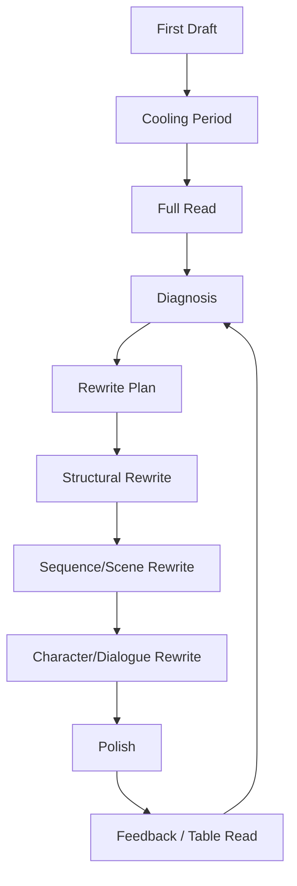
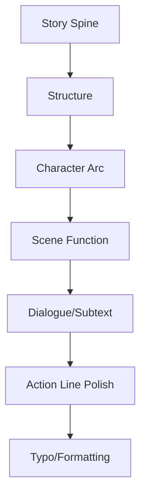
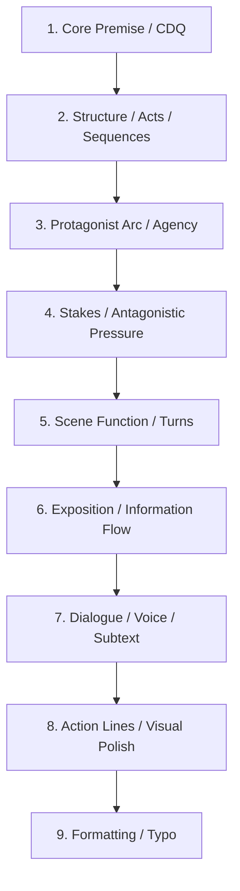
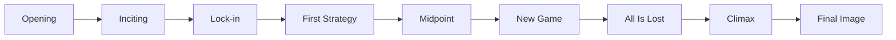
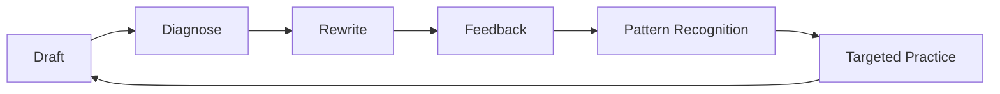

# learn-screenwriting-film-script-part-022.md

# Part 022 — Rewrite: Naskah Sebenarnya Lahir di Revisi

> Seri: Learn Screenwriting for Film Project  
> Pendekatan: *The First 20 Hours* — Josh Kaufman  
> Fokus bagian ini: memahami rewrite sebagai proses diagnosis, refactor, dan peningkatan sistem cerita, bukan sekadar mempercantik dialog.  
> Target praktis: mampu membaca first draft secara objektif, menemukan masalah prioritas, membuat rewrite plan, dan merevisi naskah dari level struktur sampai scene/dialog tanpa menghancurkan keseluruhan cerita.

---

## 0. Posisi Part Ini dalam Roadmap

Pada Part 021 kita membahas drafting workflow:

```text
Scene Card → Rough Scene → TODO → Next Scene → Complete Draft → Read → Rewrite Plan
```

Sekarang kita masuk ke fase yang sering menentukan kualitas akhir naskah:

```text
Rewrite.
```

Banyak penulis pemula mengira naskah yang bagus lahir dari inspirasi saat first draft. Realitanya, naskah yang bagus biasanya lahir dari revisi berlapis.

First draft membuat cerita menjadi nyata.  
Rewrite membuat cerita menjadi bekerja.

Draft pertama menjawab:

```text
Apakah ada material?
```

Rewrite menjawab:

```text
Apakah material ini menghasilkan pengalaman film yang kuat?
```

Diagram:



Rewrite bukan tanda kegagalan. Rewrite adalah proses normal pembuatan screenplay.

---

## 1. Prinsip Kaufman dalam Part Ini

Dalam framework *The First 20 Hours*, rewrite perlu dipecah menjadi sub-skill kecil.

Sub-skill rewrite:

1. Membaca draft tanpa langsung membela diri.
2. Memisahkan gejala dan akar masalah.
3. Mengurutkan prioritas revisi.
4. Membedakan structural rewrite dan polish.
5. Menganalisis central dramatic question.
6. Menganalisis protagonist agency.
7. Menganalisis act/sequence/scene turn.
8. Menganalisis exposition.
9. Menganalisis character arc.
10. Menganalisis dialogue dan subtext.
11. Menghapus scene yang tidak berfungsi.
12. Menggabungkan scene.
13. Memindahkan beat.
14. Memperkuat setup/payoff.
15. Melakukan rewrite pass bertahap.
16. Menggunakan feedback secara cerdas.
17. Menjaga versi dan tidak merusak draft lama.

Target praktis:

```text
Mampu membuat rewrite plan yang jelas dari sebuah draft dan melakukan revisi prioritas tanpa terjebak polish prematur.
```

---

## 2. Rewrite Bukan Copyediting

Kesalahan umum:

```text
Rewrite = memperbaiki kalimat, typo, dan dialog agar lebih indah.
```

Itu hanya polish.

Rewrite sejati bertanya:

- Apakah cerita bekerja?
- Apakah protagonist aktif?
- Apakah konflik meningkat?
- Apakah scene punya turn?
- Apakah ending earned?
- Apakah midpoint mereframe?
- Apakah character arc terasa?
- Apakah theme muncul lewat pilihan?
- Apakah genre promise dibayar?
- Apakah exposition membunuh drama?
- Apakah scene bisa dipotong?
- Apakah struktur butuh diubah?

Copyediting dilakukan nanti. Jangan mengecat rumah yang fondasinya miring.

Diagram prioritas:



Urutan ini penting.

---

## 3. Mental Model: Rewrite sebagai Refactor

Untuk software engineer, rewrite mirip refactor + debugging + redesign.

First draft seperti codebase awal:

- berjalan sebagian,
- banyak duplication,
- function terlalu panjang,
- dependency kacau,
- variable belum jelas,
- edge case belum ditangani,
- test gagal,
- naming buruk,
- performance lambat,
- beberapa module tidak perlu.

Rewrite bukan langsung rename variable.

Rewrite bertanya:

```text
Architecture-nya benar?
Data flow-nya jelas?
Module mana dead code?
State transition mana hilang?
Side effect mana tidak disengaja?
Integration test end-to-end lulus?
```

Dalam screenplay:

| Software | Screenplay |
|---|---|
| Architecture | Structure / acts / sequences |
| Module | Sequence / scene |
| Function | Beat / action |
| State transition | Character/story change |
| Dead code | Scene tanpa fungsi |
| Duplicate logic | Repetitive scene |
| Integration test | Full read / table read |
| Unit test | Scene objective-turn-output |
| Refactor | Rewrite scene/sequence |
| Regression | Perubahan yang merusak setup/payoff |
| Technical debt | Exposition patch, coincidence, weak motivation |

Rewrite adalah refactor cerita.

---

## 4. First Reaction Setelah Draft

Setelah first draft, biasanya muncul emosi:

- malu,
- kecewa,
- marah,
- ingin hapus semua,
- ingin mulai ide baru,
- merasa tidak berbakat,
- merasa semua jelek,
- ingin polish dialog agar terasa lebih baik,
- ingin kirim ke orang lain untuk validasi cepat.

Normal.

Jangan mengambil keputusan besar saat emosional.

Protokol:

1. Simpan draft.
2. Backup.
3. Istirahat.
4. Jangan rewrite langsung jika masih panas.
5. Baca ulang setelah cooling period.
6. Diagnosis sebelum operasi.

Rewrite butuh jarak.

---

## 5. Cooling Period

Cooling period memberi jarak antara penulis dan draft.

Rekomendasi:

| Jenis Draft | Cooling Period |
|---|---:|
| Scene pendek | beberapa jam–1 hari |
| Short film | 1–3 hari |
| Feature | 3–14 hari |
| Draft emosional berat | lebih lama jika memungkinkan |

Saat cooling period:

- jangan baca ulang terus,
- catat ide di notes jika muncul,
- jangan ubah file utama,
- lakukan hal lain,
- baca/lihat referensi secara terbatas jika perlu,
- jangan gunakan referensi untuk menghindari revisi.

Jarak membantu Anda melihat apa yang ada di halaman, bukan apa yang Anda maksud.

---

## 6. Full Read Sebelum Revisi

Sebelum edit, baca draft dari awal sampai akhir.

Aturan:

```text
Jangan rewrite saat membaca.
```

Boleh catat:

- bosan,
- bingung,
- kuat,
- lemah,
- terlalu panjang,
- tidak percaya,
- tertarik,
- kehilangan thread,
- line bagus,
- scene yang terasa mati.

Tujuan full read:

```text
Melihat draft sebagai pengalaman penonton.
```

Jika Anda edit halaman 3 sebelum membaca ending, Anda mungkin memperbaiki bagian yang nanti dipotong.

---

## 7. Cara Membaca Draft Sendiri

Gunakan tiga warna/catatan:

```text
? = membingungkan
! = bekerja / menarik
- = terasa lambat/lemah
```

Atau:

```text
BORING
CONFUSING
STRONG
TOO MUCH INFO
NO TURN
GOOD IMAGE
CUT?
```

Jangan terlalu analitis di first read. Tangkap reaksi.

Setelah selesai, baru buat diagnosis.

---

## 8. Diagnosis vs Solution

Feedback dan self-review sering mencampur masalah dan solusi.

Gejala:

```text
Act 2 membosankan.
```

Bukan solusi.

Kemungkinan akar:

- protagonist pasif,
- goal sequence tidak jelas,
- antagonist tidak bergerak,
- conflict repetitif,
- stakes tidak naik,
- midpoint terlalu lambat,
- exposition terlalu banyak,
- subplot tidak terkait.

Solusi tergantung akar.

Jangan langsung:

```text
Tambah adegan action.
```

Jika masalahnya emotional stakes, action tidak menyelesaikan.

Prinsip:

```text
Diagnose root cause before rewriting symptoms.
```

---

## 9. Rewrite Priority Pyramid

Urutan prioritas rewrite:



Jangan mulai dari bawah jika atas bermasalah.

Contoh:

Jika ending tidak earned, memperbaiki typo tidak membantu.

---

## 10. Rewrite Pass

Rewrite pass adalah revisi dengan fokus spesifik.

Jangan mencoba memperbaiki semua sekaligus.

Jenis pass:

1. Story spine pass.
2. Structure pass.
3. Character pass.
4. Stakes/conflict pass.
5. Scene turn pass.
6. Exposition pass.
7. Dialogue/subtext pass.
8. Visual/action line pass.
9. Production pass.
10. Polish pass.

Setiap pass punya pertanyaan dan target.

Ini mengurangi cognitive overload.

---

## 11. Story Spine Pass

Pertanyaan:

1. Siapa protagonist?
2. Apa want eksternal?
3. Apa need internal?
4. Apa lie/flaw?
5. Apa central dramatic question?
6. Apa opposition utama?
7. Apa stakes?
8. Apa final choice?
9. Apa final image?
10. Apakah ending menjawab opening?

Jika jawaban ini kabur, semua revisi lain akan kabur.

Template:

```text
Protagonist:
Want:
Need:
Lie:
CDQ:
Opposition:
Stakes:
Midpoint:
Final choice:
Ending answer:
Final image:
```

Contoh:

```text
Protagonist:
Raka.

Want:
Menjual rumah.

Need:
Menghadapi kebenaran dan relasi tanpa kontrol/transaksi.

Lie:
Jika dokumen selesai, masa lalu selesai.

CDQ:
Apakah Raka akan membuka kebenaran tentang rumah meski dirinya ikut terseret?

Final choice:
Menutup bukti demi menjual rumah atau membuka dokumen dengan cost personal.

Final image:
Kunci di pintu terbuka, bukan di leher Ibu.
```

---

## 12. Structure Pass

Structure pass melihat acts, sequences, dan turning points.

Untuk feature:

- Act 1 setup/lock-in jelas?
- Inciting incident cukup kuat?
- Act 1 break membuat protagonist committed?
- Act 2A punya strategy?
- Midpoint mereframe?
- Act 2B menunjukkan konsekuensi midpoint?
- All is lost menyerang want dan need?
- Act 3 punya final plan?
- Climax membayar arc/theme?
- Resolution tidak terlalu panjang?

Untuk short:

- situation jelas?
- disruption jelas?
- escalation naik?
- choice punya cost?
- consequence/final image jelas?

Diagram structure pass:



Jika salah satu node lemah, rewrite besar mungkin perlu.

---

## 13. Sequence Pass

Untuk feature, cek sequence satu per satu.

Template:

```text
Sequence:
Input state:
Goal:
Opposition:
Escalation:
Turn:
Output state:
Problem:
Rewrite action:
```

Contoh:

```text
Sequence 3:
Input:
Raka butuh kunci/dokumen.

Goal:
Mencoba menyelesaikan penjualan lewat jalur teknis.

Opposition:
Notaris, warga, Ibu.

Turn:
Raka sadar rumah punya luka publik.

Output:
Ia harus membuka ruang kerja.

Problem:
Draft terlalu banyak dialog legal.

Rewrite:
Ganti penjelasan notaris dengan document reveal + public reaction warung.
```

Sequence pass menghindari Act 2 menjadi lumpur.

---

## 14. Scene Turn Pass

Setiap scene harus mengubah sesuatu.

Cek:

```text
Input → Output
```

Jika tidak ada perubahan, scene mungkin:

- dipotong,
- digabung,
- diberi conflict,
- dipindahkan,
- diubah fungsinya.

Template:

```text
Scene:
Input state:
Output state:
Turn:
Can cut?
Can merge?
Rewrite need:
```

Contoh:

```text
Scene:
Raka dan Dina bicara di teras.

Input:
Dina tidak percaya Raka.

Output:
Dina tidak percaya Raka.

Turn:
Tidak ada.

Problem:
Scene hanya mengulang konflik.

Fix:
Tambahkan turn: Dina melihat Raka menyimpan dokumen, sehingga distrust berubah dari emotional suspicion menjadi concrete evidence.
```

---

## 15. Dead Scene Test

Scene mati jika:

- tidak ada objective,
- tidak ada opposition,
- tidak ada new information,
- tidak ada power shift,
- tidak ada emotional shift,
- tidak ada setup/payoff penting,
- hanya mengulang scene sebelumnya,
- hanya menjelaskan tema,
- hanya “suasana” tanpa fungsi.

Dead scene bukan berarti buruk secara kalimat. Bisa indah tapi tidak berfungsi.

Pertanyaan:

```text
Jika scene ini dihapus, apa yang hilang?
```

Jika jawabannya:

```text
Tidak banyak.
```

Potong/gabung.

---

## 16. Scene Merge Pass

Banyak draft awal punya dua scene yang bisa menjadi satu.

Contoh:

Scene A:

```text
Raka tahu rumah atas nama Ibu.
```

Scene B:

```text
Pembeli memberi deadline.
```

Gabung:

```text
Notaris menolak dokumen. Saat Raka keluar, pembeli menelepon dan memberi deadline.
```

Efek:

- pacing lebih cepat,
- tekanan bertumpuk,
- scene lebih kuat.

Template merge:

```text
Scene A function:
Scene B function:
Can same location/time handle both?
What is new combined turn?
```

---

## 17. Scene Split Pass

Sebaliknya, scene terlalu berat perlu dipecah.

Gejala:

- banyak reveal besar sekaligus,
- karakter berubah terlalu cepat,
- exposition numpuk,
- emotional beat tidak punya ruang,
- scene punya beberapa objective berbeda,
- lebih dari satu major turn yang saling mengalahkan.

Contoh:

Satu scene berisi:

- notaris reveal,
- Raka breakdown,
- pembeli threat,
- Dina betrayal,
- Ibu confession.

Terlalu banyak.

Split menjadi:

1. Notaris reveal.
2. Aftermath Raka.
3. Pembeli threat.
4. Dina finds Raka hiding info.
5. Ibu partial confession.

Split memberi rhythm.

---

## 18. Protagonist Agency Pass

Tanya:

1. Apakah protagonist membuat pilihan aktif?
2. Apakah ia menyebabkan konsekuensi?
3. Apakah ia hanya menerima informasi?
4. Apakah plot bergerak karena keputusan protagonist?
5. Apakah final action dilakukan protagonist?
6. Apakah kesalahan protagonist ikut memperburuk keadaan?

Protagonist pasif membuat naskah lemah.

Contoh pasif:

```text
Ibu memberi dokumen.
Pembeli mengancam.
Dina memberi salinan.
Raka hanya bereaksi.
```

Aktif:

```text
Raka menekan Ibu.
Raka mencoba notaris.
Raka mencuri/mencari kunci.
Raka berbohong pada Dina.
Raka hampir menutup bukti.
Raka akhirnya membuka kebenaran.
```

Agency tidak berarti selalu moral. Bahkan kesalahan aktif lebih baik daripada pasif.

---

## 19. Character Arc Pass

Cek start → end.

Template:

```text
Character:
Start state:
End state:
Key choices causing change:
Midpoint impact:
All is lost impact:
Final proof of change:
```

Contoh Raka:

```text
Start:
Mengubah relasi menjadi transaksi.

End:
Mengambil accountability walau merugikan dirinya.

Key choices:
Pulang untuk menjual.
Mencoba mengontrol Ibu.
Membuka ruang kerja tanpa trust.
Hampir menutup dokumen.
Memilih membuka kebenaran.

Final proof:
Meletakkan dokumen di meja dan mengakui tanda tangannya.
```

Jika final state tidak dibuktikan oleh action, arc belum bekerja.

---

## 20. Character Consistency vs Growth

Karakter harus konsisten, tetapi tidak statis.

Konsisten:

```text
Raka selalu memakai kontrol sebagai defense.
```

Growth:

```text
Ia makin sadar kontrolnya merusak, lalu memilih aksi tanpa kontrol penuh.
```

Inkonsisten buruk:

```text
Raka tiba-tiba menjadi hangat dan bijak tanpa tekanan.
```

Growth membutuhkan:

- pressure,
- failure,
- self-recognition,
- choice,
- cost.

Rewrite arc jika perubahan terlalu cepat atau tidak earned.

---

## 21. Supporting Character Pass

Setiap supporting character harus punya fungsi.

Template:

```text
Character:
Function in plot:
Function in theme:
Function in protagonist arc:
Scenes:
Can merge with another?
Payoff:
```

Contoh Dina:

```text
Function in plot:
Memegang kunci/salinan dokumen.

Function in theme:
Next generation refuses inherited silence.

Function in Raka arc:
Memaksa Raka meminta trust, bukan memerintah.

Scenes:
Dinner, corridor, document reveal aftermath, crisis, climax.

Can merge:
Tidak, karena fungsi unik.

Payoff:
Memberi salinan setelah Raka mengakui kesalahan.
```

Jika karakter tidak punya fungsi unik, gabung/hapus.

---

## 22. Antagonistic Pressure Pass

Cek apakah opposition aktif.

Pertanyaan:

1. Siapa/apa yang menghalangi protagonist?
2. Apakah opposition bergerak?
3. Apakah opposition meningkat?
4. Apakah protagonist kehilangan resource/power?
5. Apakah deadline terasa?
6. Apakah opposition menekan flaw?
7. Apakah antagonist punya tactic?
8. Apakah opposition terlalu mudah dikalahkan?

Opposition pasif:

```text
Pembeli hanya muncul di akhir.
```

Opposition aktif:

```text
Pembeli memberi deadline, tahu ruang kerja, menekan notaris, punya salinan, menawarkan deal, datang saat keluarga pecah.
```

---

## 23. Stakes Pass

Stakes harus terasa, bukan hanya disebut.

Tabel stakes:

| Layer | Stakes |
|---|---|
| External | Rumah terjual/tidak |
| Economic | Utang Raka |
| Legal | Dokumen menyeret Raka/Ibu |
| Family | Trust Dina/Ibu rusak |
| Social | Reputasi keluarga |
| Moral | Korban lama tetap tidak diakui |
| Internal | Raka tetap hidup sebagai beneficiary kebohongan |

Cek:

- Apakah stakes muncul di scene?
- Apakah stakes meningkat?
- Apakah stakes menjadi personal?
- Apakah stakes punya visible consequence?

Jika stakes hanya abstrak, dramatize.

---

## 24. Conflict Pass

Cek konflik scene:

```text
Want vs obstacle
Tactic vs counter-tactic
Value vs value
Truth vs lie
```

Scene lemah sering karena:

- karakter setuju terlalu cepat,
- informasi diberikan gratis,
- tidak ada objective,
- obstacle terlalu lemah,
- conflict hanya argument repetitif,
- tidak ada cost.

Rewrite conflict dengan menambahkan:

- hidden agenda,
- power imbalance,
- time pressure,
- object,
- third party,
- public setting,
- moral cost,
- contradiction.

---

## 25. Exposition Pass

Cari exposition berat.

Tanda:

- karakter menjelaskan masa lalu panjang,
- “seperti yang kamu tahu”,
- dialog terlalu informatif,
- dokumen dibacakan panjang,
- world rules dijelaskan sekaligus,
- scene berhenti bergerak.

Rewrite exposition dengan:

- conflict,
- object,
- document detail,
- behavior,
- consequence,
- reaction,
- reveal ladder,
- partial information.

Template:

```text
Info:
Current delivery:
Problem:
Can be visual?
Can be conflict?
Can be delayed?
New delivery:
```

Contoh:

```text
Info:
Rumah atas nama Ibu.

Current:
Ibu menjelaskan sejarah sertifikat.

Problem:
Info dump.

New delivery:
Notaris menolak map; insert nama pemilik; Raka pulang marah.
```

---

## 26. Information Flow Pass

Track siapa tahu apa dan kapan.

Tabel:

| Info | Audience | Raka | Ibu | Dina | Reveal Scene |
|---|---|---|---|---|---|
| Kunci penting | early | early | yes | maybe | dinner |
| Rumah atas nama Ibu | notary | notary | yes | maybe | act 2 |
| Raka signature | midpoint | midpoint | yes | no | room |
| Dina has copy | later | no | no | yes | act 3 |
| Pembeli old link | act 2 | act 2 | yes | no | phone/warung |

Jika karakter tahu informasi terlalu cepat/lambat tanpa alasan, rewrite.

---

## 27. Setup/Payoff Pass

Cek semua payoff besar.

Payoff tanpa setup terasa curang.  
Setup tanpa payoff terasa sia-sia.

Template:

```text
Setup:
Where:
Payoff:
Where:
Is payoff stronger than setup?
Need earlier setup?
Need later payoff?
```

Contoh:

```text
Setup:
Dina memotret dokumen diam-diam.

Payoff:
Dina punya salinan saat Raka hampir menghilangkan dokumen.

Problem:
Jika setup belum ada, payoff terasa convenient.

Fix:
Tambahkan scene Dina memakai ponsel saat Raka/Ibu bertengkar; Raka mengabaikannya.
```

---

## 28. Object Pass

Objek penting harus punya arc.

Cek:

```text
Object:
First appearance:
Meaning:
Conflict:
Movement:
Payoff:
Final state:
```

Contoh kunci:

- muncul di leher Ibu,
- menjadi target Raka,
- berpindah ke Dina,
- membuka ruang,
- akhirnya digantung di pintu.

Jika objek hanya muncul saat dibutuhkan, tanam lebih awal.

---

## 29. Theme Pass

Theme harus muncul sebagai pilihan, bukan pidato.

Cek:

1. Apa theme question?
2. Karakter mana mewakili posisi berbeda?
3. Scene mana menguji theme?
4. Apakah climax menjawab theme lewat action?
5. Apakah dialog terlalu preachy?
6. Apakah theme berubah menjadi slogan?

Contoh theme:

```text
Apakah keluarga boleh dilindungi dengan kebohongan?
```

Scene test:

- Ibu mengunci ruang kerja demi melindungi.
- Raka ingin menjual dan menutup.
- Dina ingin tahu.
- Korban lama ingin pengakuan.
- Climax: Raka memilih membuka truth dengan cost.

Theme bekerja karena menjadi keputusan.

---

## 30. Genre Pass

Cek apakah genre promise dipenuhi.

Family mystery drama:

- family conflict cukup kuat?
- mystery cukup jelas?
- clue/reveal bertahap?
- emotional stakes ada?
- ending membayar family + mystery?
- tone konsisten?

Thriller:

- threat aktif?
- deadline terasa?
- reversals ada?

Horror:

- dread, rule, manifestation, payoff?

Comedy:

- escalation, status reversal, payoff/callback?

Romance:

- vulnerability, obstacle, choice?

Jika genre promise tidak dibayar, penonton kecewa.

---

## 31. Tone Pass

Tandai scene yang keluar dari tone palette.

Tone palette contoh:

```text
Melancholic realism + restrained tension + bitter sibling humor.
```

Problem:

- dialog terlalu melodramatic,
- joke terlalu modern/slapstick,
- violence terlalu ekstrem,
- scene terlalu sentimental,
- thriller suddenly too action-heavy.

Tone pass bertanya:

```text
Apakah scene ini terasa berasal dari film yang sama?
```

Jika tidak, ubah register dialog, pacing, action, atau detail visual.

---

## 32. Dialogue Pass

Dialogue pass dilakukan setelah struktur/scene cukup solid.

Cek:

- apakah dialog punya objective?
- apakah terlalu on-the-nose?
- apakah semua karakter terdengar sama?
- apakah line terlalu panjang?
- apakah exposition masuk dialog?
- apakah subtext ada?
- apakah silence bisa mengganti line?
- apakah humor sesuai tone?
- apakah ada line yang terlalu “penulis”?

Rewrite dialog dengan:

- compression,
- interruption,
- subtext,
- tactic,
- status,
- character-specific vocabulary,
- action beats.

---

## 33. Voice Pass

Setiap karakter harus punya cara bicara.

Template voice:

```text
Character:
Vocabulary:
Sentence length:
Avoids:
Weaponizes:
Humor style:
Emotional leak:
Repeated phrase:
```

Contoh:

```text
Raka:
Vocabulary: dokumen, proses, aset, deadline.
Sentence: pendek, teknis.
Avoids: kata rindu, maaf.
Weaponizes: logic.
Emotional leak: jadi terlalu formal saat panik.

Ibu:
Vocabulary: makan, rumah, pintu, kunci.
Sentence: sederhana, tidak langsung.
Avoids: nama ayah.
Weaponizes: care/domestic ritual.
Emotional leak: perintah rumah tangga makin keras saat takut.

Dina:
Vocabulary: sehari-hari, tajam, sarkas.
Sentence: lebih spontan.
Avoids: meminta langsung.
Weaponizes: humor pahit.
Emotional leak: joke berhenti saat benar-benar terluka.
```

Voice pass membuat dialog hidup.

---

## 34. Subtext Pass

Cari line yang mengatakan maksud langsung.

On-the-nose:

```text
RAKA
Aku merasa Ibu tidak percaya padaku.
```

Subtext:

```text
RAKA
Kunci itu bahkan Ibu bawa tidur?
```

On-the-nose:

```text
DINA
Kakak meninggalkan aku dan Ibu selama lima tahun.
```

Subtext:

```text
DINA
Kakak masih ingat saklar dapur di sebelah mana?
```

Subtext pass tidak berarti semua harus kabur. Clarity tetap penting. Pilih momen jujur dengan sengaja.

---

## 35. Visual Pass

Cari bagian yang bisa dibuat lebih filmik.

Ubah:

```text
Raka merasa bersalah.
```

Menjadi:

```text
Raka mencoba menandatangani kertas baru.

Tangannya berhenti saat bentuk tanda tangannya menyerupai tanda tangan lama di dokumen.
```

Visual pass bertanya:

- Apa yang bisa dilihat?
- Apa yang bisa didengar?
- Apa object/action yang membawa emosi?
- Apa final image?
- Apa motif berulang?

---

## 36. Action Line Pass

Polish action line setelah scene bekerja.

Prinsip:

- singkat,
- spesifik,
- present tense,
- filmik,
- tidak menjelaskan terlalu banyak,
- gunakan paragraf pendek,
- highlight important object/action,
- jangan directing berlebihan.

Before:

```text
Raka merasa sangat terkejut dan bersalah ketika ia menyadari bahwa tanda tangannya ada di dokumen itu dan hal itu membuatnya sadar bahwa ia juga terlibat.
```

After:

```text
Kolom saksi.

RAKA PRADIPTA.

Tanda tangan remaja. Rapi. Percaya.

Raka menutup map.

Membukanya lagi.

Namanya tetap di sana.
```

---

## 37. Pacing Pass

Pacing pass melihat ritme.

Cek:

- opening terlalu lama?
- Act 1 terlalu panjang?
- Act 2 berulang?
- midpoint terlambat?
- climax terburu-buru?
- ending terlalu panjang?
- terlalu banyak scene bicara berturut-turut?
- terlalu banyak tension tanpa aftermath?
- terlalu banyak aftermath tanpa new pressure?

Gunakan page/scene map.

Contoh:

```text
Pages 1–15: setup
Pages 16–25: lock-in
Pages 26–50: Act 2A
Page 52: midpoint
Pages 53–80: escalation/collapse
Pages 81–100: Act 3
```

Jika midpoint muncul page 75 untuk 100-page script, mungkin terlalu lambat kecuali struktur khusus.

---

## 38. Compression Pass

Potong 10–30%.

Cari:

- scene transisi,
- salam/basa-basi,
- line yang menjelaskan emosi,
- exposition berulang,
- karakter duplicate,
- lokasi duplicate,
- action line panjang,
- ending setelah makna selesai,
- flashback tidak perlu,
- subplots tidak membayar.

Prinsip:

```text
Compression increases force.
```

Namun jangan potong aftermath penting hanya karena ingin cepat. Potong yang tidak mengubah state.

---

## 39. Expansion Pass

Kadang draft terlalu cepat.

Perlu expand jika:

- character change tidak earned,
- reveal tidak punya setup,
- relationship tidak cukup dibangun,
- climax terasa tiba-tiba,
- stakes tidak terasa,
- audience bingung,
- emotional aftermath hilang.

Expansion bukan menambah filler. Expansion menambah missing step.

Contoh:

Jika Dina terlalu cepat memberi salinan dokumen, tambahkan:

- scene ia melihat Raka berbohong,
- scene Raka mengakui kesalahan,
- moment Dina memilih memberi kesempatan.

---

## 40. Reorder Pass

Kadang scene benar, urutan salah.

Reorder jika:

- informasi muncul terlalu cepat/lambat,
- character reaction tidak masuk akal,
- tension turun terlalu lama,
- reveal butuh setup lebih awal,
- conflict lebih kuat jika scene dipindah.

Contoh:

Jika warung social pressure setelah midpoint terasa terlambat, pindahkan sebelum midpoint agar rumah punya reputasi publik lebih awal.

Tapi cek regression:

- apakah character tahu info terlalu cepat?
- apakah setup/payoff berubah?
- apakah timeline masuk akal?

---

## 41. Rewrite Plan

Sebelum menulis ulang, buat rewrite plan.

Template:

```text
# Rewrite Plan

Draft:
Date:

## Main Diagnosis
1.
2.
3.

## Rewrite Goals
1.
2.
3.

## Do Not Change
1.
2.
3.

## Structural Changes
- ...

## Character Changes
- ...

## Scene Changes
- Cut:
- Merge:
- Add:
- Move:
- Expand:
- Compress:

## Exposition Changes
- ...

## Dialogue/Voice Changes
- ...

## Production Changes
- ...

## Priority Order
1.
2.
3.

## Success Criteria
- ...
```

Rewrite plan mencegah revisi chaos.

---

## 42. Do Not Change List

Penting: catat hal yang bekerja.

Jika tidak, rewrite bisa merusak yang bagus.

Contoh:

```text
Do Not Change:
- Kunci sebagai object arc.
- Dina's bitter humor.
- Final image kunci di pintu.
- Midpoint Raka signature reveal.
- Dinner scene as core family conflict.
```

Rewrite bukan menghancurkan semua.

---

## 43. Cut List

Buat cut list.

```text
Scene:
Reason:
Can info move elsewhere?
Risk if cut:
Decision:
```

Contoh:

```text
Scene:
Raka meets old school friend.

Reason:
Only repeats that Raka left town.

Can info move:
Yes, Dina line + room visual.

Risk:
Less social world, but warung scene covers it.

Decision:
Cut.
```

Potong dengan sadar.

---

## 44. Add List

Buat add list.

```text
Missing function:
New scene/beat:
Where:
Purpose:
Risk:
```

Contoh:

```text
Missing function:
Setup Dina as observant with phone/camera.

New beat:
Dina photographs documents while pretending to scroll.

Where:
Early Act 2 dinner aftermath.

Purpose:
Payoff salinan dokumen in Act 3.

Risk:
Make it subtle, not obvious.
```

Add scene hanya jika fungsi jelas.

---

## 45. Move List

```text
Scene/Beat:
Current position:
New position:
Reason:
Dependencies:
```

Contoh:

```text
Beat:
Warga calls house "rumah segel".

Current:
After midpoint.

New:
Before locked room sequence.

Reason:
Need public history before Raka enters private archive.

Dependencies:
Raka must have reason to visit warung.
```

---

## 46. Rewrite Execution Order

Umumnya:

1. Duplikasi draft lama.
2. Buat draft baru.
3. Terapkan structural changes.
4. Reorder/cut/add scene.
5. Rewrite affected transitions.
6. Rewrite character arc scenes.
7. Rewrite exposition.
8. Rewrite dialogue.
9. Polish.

Jangan edit file lama tanpa backup.

---

## 47. Page One Rewrite vs Surgical Rewrite

Ada dua jenis rewrite besar:

### Page One Rewrite

Menulis ulang dari awal dengan struktur baru.

Gunakan jika:

- premise berubah,
- protagonist berubah,
- structure runtuh,
- draft lama terlalu jauh,
- character goal salah.

### Surgical Rewrite

Mengubah bagian tertentu.

Gunakan jika:

- core works,
- major turns works,
- masalah di scene/sequence,
- dialogue/exposition perlu perbaikan.

Jangan page one rewrite karena panik. Jangan surgical rewrite jika fondasi salah.

---

## 48. Structural Rewrite

Structural rewrite bisa melibatkan:

- mengubah inciting incident,
- mempercepat lock-in,
- mengganti midpoint,
- memotong subplot,
- memindahkan reveal,
- mengubah ending,
- menggabungkan karakter,
- mengubah order sequence.

Structural rewrite berat, tapi dilakukan sebelum polish.

Contoh:

Draft problem:

```text
Midpoint hanya ownership reveal; kurang personal.
```

Structural rewrite:

```text
Ownership reveal dipindah ke early Act 2.
Midpoint menjadi Raka signature reveal.
```

Dampak:

- Act 2A berubah,
- Ibu motivation perlu setup,
- Raka arc lebih kuat,
- climax lebih personal.

---

## 49. Scene Rewrite

Scene rewrite fokus satu scene.

Template:

```text
Scene:
Current function:
Problem:
New function:
New objective:
New opposition:
New turn:
Keep:
Cut:
Rewrite:
```

Contoh:

```text
Scene:
Dinner key scene.

Problem:
Raka terlalu marah sejak awal; escalation tidak punya tangga.

New objective:
Raka mulai teknis/polite, lalu makin personal saat Ibu menolak.

New turn:
Kunci ke Dina.

Keep:
Piring di atas map, Dina line.

Cut:
Raka monolog tentang ayah.
```

---

## 50. Dialogue Rewrite

Dialogue rewrite dilakukan setelah scene objective jelas.

Pass:

1. Remove exposition.
2. Clarify tactic.
3. Add subtext.
4. Differentiate voice.
5. Compress.
6. Add interruption/silence.
7. Read aloud.

Before:

```text
RAKA
Aku butuh kunci itu untuk membuka ruang kerja karena aku yakin ada dokumen yang bisa menyelesaikan masalah rumah ini.
```

After:

```text
RAKA
Kuncinya, Bu.

IBU
Kamu bahkan belum cuci tangan.

RAKA
Dokumen tidak nunggu tangan bersih.
```

Lebih hidup.

---

## 51. Rewrite dengan Table Read

Table read adalah alat rewrite sangat kuat.

Untuk short:

- baca dengan 2–5 orang,
- catat timing,
- catat line yang tidak natural,
- catat scene yang kehilangan energi.

Untuk feature:

- baca per act/sequence jika full read sulit,
- atau full table read jika memungkinkan.

Jangan menjelaskan sebelum pembacaan. Biarkan naskah bekerja sendiri.

Catat:

- kapan pendengar tertawa/diam,
- kapan mereka bingung,
- kapan line terasa panjang,
- kapan scene hidup,
- kapan energi turun.

---

## 52. Feedback Pass

Setelah feedback, jangan langsung mengubah semua.

Kategorikan:

```text
Clarity issue
Engagement issue
Character issue
Structure issue
Tone issue
Production issue
Taste preference
```

Jika 3 pembaca bingung di tempat sama, itu masalah.

Jika 1 pembaca tidak suka genre/tone yang memang Anda pilih, mungkin taste mismatch.

Feedback adalah data, bukan perintah.

---

## 53. Note Behind the Note

Pembaca sering memberi solusi yang salah untuk masalah yang benar.

Feedback:

```text
Harus ada flashback ayah.
```

Mungkin masalah sebenarnya:

```text
Hubungan Raka dengan ayah tidak terasa.
```

Solusi alternatif:

- object ayah lebih kuat,
- voice recording,
- photo,
- line Ibu,
- behavior Raka,
- ruang kerja detail.

Cari note behind the note.

---

## 54. Rewrite dan Regression

Setiap perubahan bisa merusak bagian lain.

Contoh:

Anda memindahkan reveal tanda tangan Raka lebih awal.

Regression risk:

- midpoint kehilangan kekuatan,
- Dina reaction berubah,
- pembeli leverage berubah,
- climax perlu setup baru.

Gunakan regression checklist:

```text
If I change this, what scenes depend on it?
Who knows what now?
What setup/payoff breaks?
What character motivation changes?
What timeline changes?
```

---

## 55. Continuity Rewrite

Setelah structural changes, cek continuity:

- timeline,
- prop,
- knowledge,
- emotional state,
- location,
- character availability,
- injuries,
- costume,
- weather,
- deadlines.

Continuity bug bisa muncul setelah reorder.

Template:

```text
Change:
Affected scenes:
Continuity risk:
Fix:
```

---

## 56. Character Knowledge Rewrite

Track who knows what after rewrite.

Jika Dina mengetahui kunci penting lebih awal, semua scene setelahnya harus reflect.

Bug:

```text
Dina bertanya “kunci apa?” di scene 20 padahal scene 8 ia sudah melihat konflik kunci.
```

Fix:

```text
Ubah pertanyaan menjadi lebih spesifik:
DINA
Kunci itu buka apa sampai semua orang lupa makan?
```

---

## 57. Production Rewrite

Production rewrite bertanya:

```text
Bisakah fungsi dramatik sama dicapai lebih feasible?
```

Contoh:

Mahal:

```text
Flashback kasus ayah dengan kantor, pejabat, crowd, period costume.
```

Murah:

```text
Raka mendengar rekaman lama ayah di ruang kerja; foto dengan pejabat wajahnya dipotong; warga tua membawa sertifikat.
```

Fungsi tetap:

- masa lalu terasa,
- sistem lebih besar terasa,
- moral stakes muncul.

Production rewrite bukan menurunkan kualitas; sering meningkatkan fokus.

---

## 58. Budget-Aware Scene Rewrite

Template:

```text
Expensive scene:
Dramatic function:
What must audience feel/learn:
Low-cost alternative:
What changes:
What improves:
```

Contoh:

```text
Expensive:
Demo warga di depan kantor.

Function:
Menunjukkan kasus berdampak publik.

Low-cost:
Satu warga tua datang ke rumah dengan sertifikat lusuh dan tidak mau masuk.

Improves:
Lebih personal, lebih contained, lebih emotional.
```

---

## 59. Rewrite for Actors

Cek apakah scene playable.

Aktor butuh:

- objective,
- obstacle,
- subtext,
- contradiction,
- emotional turn,
- action.

Scene tidak playable jika karakter hanya memberi informasi.

Rewrite:

```text
Ibu tidak menjelaskan masa lalu.
Ibu mencoba membuat Raka makan agar tidak membahas masa lalu.
```

Aktor punya action: menghindar dengan care.

---

## 60. Rewrite for Director

Cek visual/directing opportunities:

- object movement,
- blocking shift,
- threshold,
- silence,
- gesture,
- sound cue,
- final image.

Jika scene hanya dialog statis, tambahkan physical behavior yang punya meaning.

Contoh:

```text
Raka berdiri dekat pintu sepanjang scene.
Saat ia akhirnya meminta bantuan, ia duduk.
```

Blocking = arc kecil.

---

## 61. Rewrite for Editor

Editor membutuhkan:

- clean turns,
- reaction beats,
- visual anchors,
- entrances/exits,
- rhythm,
- transition options.

Rewrite scene agar turn jelas.

Button line/action:

```text
DINA
Mau minta, atau mau nyuruh?
```

Cut point jelas.

---

## 62. Polish Pass

Polish dilakukan setelah story bekerja.

Polish mencakup:

- typo,
- formatting,
- action line rhythm,
- dialogue punctuation,
- remove redundant parentheticals,
- page length,
- scene heading consistency,
- character cue consistency,
- line breaks,
- slugline clarity.

Polish penting, tetapi jangan dilakukan terlalu awal.

---

## 63. Formatting Polish

Cek:

- scene headings konsisten,
- INT./EXT. benar,
- DAY/NIGHT konsisten,
- character names konsisten,
- dialogue alignment benar,
- parenthetical tidak berlebihan,
- transitions minimal,
- action paragraphs tidak terlalu panjang,
- typos,
- page numbers jika perlu.

Naskah yang rapi membuat pembaca tidak terganggu.

---

## 64. Rewrite Cycles

Umumnya:

```text
Draft 1: make it exist.
Draft 2: make it work structurally.
Draft 3: make characters/scenes work.
Draft 4: make dialogue/visuals strong.
Draft 5: polish/production.
```

Tidak selalu harus 5. Tapi mental model ini membantu.

Draft 2 tidak harus menyelesaikan dialog. Draft 2 mungkin hanya membongkar struktur.

---

## 65. Draft 2 Goals

Draft 2 biasanya structural.

Fokus:

- central dramatic question,
- act breaks,
- midpoint,
- protagonist agency,
- scene order,
- cuts/adds,
- ending.

Jangan habiskan Draft 2 hanya memperbaiki line.

---

## 66. Draft 3 Goals

Draft 3 biasanya character/scene.

Fokus:

- relationship arc,
- scene objectives,
- conflict,
- exposition,
- emotional continuity,
- supporting characters,
- subplot integration.

---

## 67. Draft 4 Goals

Draft 4 biasanya dialogue/voice/visual.

Fokus:

- subtext,
- character voice,
- action line,
- motif,
- rhythm,
- scene entry/exit,
- transitions.

---

## 68. Draft 5 Goals

Draft 5 biasanya polish/production.

Fokus:

- typos,
- formatting,
- page count,
- production feasibility,
- final read,
- table read fixes.

---

## 69. Rewrite Board

Gunakan board:

```text
BACKLOG
TO REWRITE
REWRITING
DONE
VERIFY
```

Task rewrite:

```text
- Move ownership reveal to Seq 2.
- Rewrite midpoint scene.
- Cut old friend scene.
- Add Dina photo setup.
- Compress dinner dialogue.
- Strengthen final image.
```

Rewrite seperti issue tracker.

---

## 70. Rewrite Task Template

```text
Task:
Reason:
Affected scenes:
Priority:
Acceptance criteria:
Status:
```

Contoh:

```text
Task:
Move ownership reveal earlier.

Reason:
Midpoint needs to be more personal; ownership reveal is legal but not emotional enough.

Affected scenes:
S08 Notary, S15 Dinner, S22 Midpoint.

Priority:
High.

Acceptance criteria:
By midpoint, audience already knows Ibu owns house; midpoint reveals Raka signature instead.
```

---

## 71. Acceptance Criteria untuk Revisi

Setiap revisi besar harus punya acceptance criteria.

Buruk:

```text
Bikin Act 2 lebih bagus.
```

Lebih baik:

```text
Act 2A harus:
- punya goal sequence jelas,
- membuat Raka aktif mencari akses ruang kerja,
- memperkenalkan public shame lewat warung,
- setup Dina sebagai observer,
- berakhir dengan decision membuka ruang kerja.
```

Acceptance criteria membuat rewrite terukur.

---

## 72. Rewrite Timebox

Rewrite bisa tak berujung.

Gunakan timebox:

```text
Structural diagnosis: 1 session.
Rewrite plan: 1 session.
Structural rewrite: 3–5 sessions.
Scene/dialog pass: 3–5 sessions.
Polish: 1–2 sessions.
```

Untuk short:

```text
Rewrite draft 2 dalam 1–3 hari.
```

Untuk feature:

```text
Rewrite draft 2 bisa 2–8 minggu.
```

Timebox bukan memaksa kualitas rendah, tapi mencegah revisi tanpa akhir.

---

## 73. Knowing When to Stop

Naskah tidak pernah sempurna.

Stop ketika:

- story spine jelas,
- major feedback patterns resolved,
- genre promise works,
- protagonist arc earned,
- scenes punya turn,
- ending works,
- dialogue readable,
- production feasible,
- pembaca target memahami dan merasakan,
- perubahan baru hanya memberi improvement kecil dengan risiko besar.

Jika setiap revisi hanya mengubah rasa minor, mungkin saatnya move ke production/feedback berikutnya.

---

## 74. Rewrite Anti-Pattern

### 74.1 Polish Before Structure

Memperindah dialog saat midpoint rusak.

Fix:

```text
Structure first.
```

### 74.2 Endless Page One Rewrite

Selalu mulai ulang dari halaman 1.

Fix:

```text
Diagnose. Decide page-one only if necessary.
```

### 74.3 Feedback Obedience

Mengikuti semua saran pembaca.

Fix:

```text
Cari pattern dan root cause.
```

### 74.4 Defensive Rewrite

Tidak mengubah masalah karena “pembaca tidak mengerti maksud saya”.

Fix:

```text
Yang penting bukan maksud, tapi halaman.
```

### 74.5 Random Improvement

Mengubah scene tanpa rewrite plan.

Fix:

```text
Work from priority list.
```

### 74.6 Overcutting

Memotong aftermath/emotion demi cepat.

Fix:

```text
Potong dead space, bukan necessary breath.
```

### 74.7 Overexplaining

Menambah dialog untuk menjawab setiap feedback bingung.

Fix:

```text
Clarify through action/setup, not necessarily explanation.
```

### 74.8 Losing What Works

Rewrite merusak scene kuat.

Fix:

```text
Do Not Change list.
```

---

## 75. Rewrite Checklist

### 75.1 Core

- [ ] Protagonist jelas.
- [ ] Want jelas.
- [ ] Need jelas.
- [ ] Lie/flaw jelas.
- [ ] CDQ jelas.
- [ ] Stakes jelas.
- [ ] Final choice jelas.

### 75.2 Structure

- [ ] Opening works.
- [ ] Inciting incident works.
- [ ] Lock-in works.
- [ ] Midpoint reframe works.
- [ ] All is lost works.
- [ ] Climax works.
- [ ] Final image works.

### 75.3 Scene

- [ ] Scene punya objective.
- [ ] Scene punya opposition.
- [ ] Scene punya turn.
- [ ] Scene output memicu berikutnya.
- [ ] Scene tidak mengulang tanpa perubahan.

### 75.4 Character

- [ ] Protagonist aktif.
- [ ] Supporting characters punya fungsi.
- [ ] Relationship arcs bergerak.
- [ ] Character voice berbeda.
- [ ] Change earned.

### 75.5 Exposition

- [ ] Info tidak dumping.
- [ ] Reveal bertahap.
- [ ] Audience tidak bingung.
- [ ] Mystery fair.
- [ ] Who-knows-what konsisten.

### 75.6 Craft

- [ ] Dialogue punya subtext.
- [ ] Action line filmik.
- [ ] Tone konsisten.
- [ ] Genre promise dibayar.
- [ ] Setup/payoff bekerja.
- [ ] Page count masuk akal.

### 75.7 Production

- [ ] Lokasi feasible.
- [ ] Cast feasible.
- [ ] Props jelas.
- [ ] Scene mahal punya alasan.
- [ ] Bisa disederhanakan tanpa kehilangan fungsi.

---

## 76. Rewrite Exercise 1 — Draft Diagnosis

Ambil satu draft/scene.

Isi:

```text
What works:
1.
2.
3.

What does not work:
1.
2.
3.

Root cause hypothesis:
1.
2.
3.

Rewrite priority:
1.
2.
3.
```

Jangan rewrite dulu. Diagnosis saja.

---

## 77. Rewrite Exercise 2 — Scene Turn Audit

Ambil 10 scene.

Buat tabel:

```text
Scene | Input | Turn | Output | Keep/Cut/Merge/Rewrite
```

Jika turn tidak jelas, tandai rewrite.

---

## 78. Rewrite Exercise 3 — Cut 20%

Ambil scene 3 halaman. Potong menjadi 2.4 halaman atau kurang.

Aturan:

- jangan hilangkan turn,
- jangan hilangkan objective,
- potong line yang menjelaskan,
- gabung action,
- gunakan silence/object.

Bandingkan energi scene.

---

## 79. Rewrite Exercise 4 — Exposition Conversion

Ambil dialog exposition.

Ubah menjadi:

1. Conflict version.
2. Object/document version.
3. Behavior/silence version.

Contoh info:

```text
Raka sudah lima tahun tidak pulang.
```

Conflict:

```text
DINA
Kakak masih ingat bau rumah ini, atau perlu Ibu kirim PDF?
```

Object:

```text
Baju Raka masih dalam plastik laundry bertanggal lima tahun lalu.
```

Behavior:

```text
Ibu mencari sandal untuk Raka. Tidak ada. Ia memberi sandal tamu.
```

---

## 80. Rewrite Exercise 5 — Dialogue Subtext

Ambil 10 line on-the-nose.

Untuk setiap line:

```text
What character means:
What character says instead:
Action beat:
```

Contoh:

```text
Means:
Aku takut kamu pergi lagi.

Says:
Piringnya Ibu cuci nanti. Jangan buru-buru berdiri.
```

---

## 81. Rewrite Exercise 6 — Midpoint Upgrade

Buat 3 alternatif midpoint.

Template:

```text
Current midpoint:
Problem:
Alternative midpoint:
What changes before:
What changes after:
Why stronger:
```

Pilih yang paling mengubah protagonist.

---

## 82. Rewrite Exercise 7 — Final Image Upgrade

Ambil final image.

Tanya:

1. Apakah membayar opening?
2. Apakah menunjukkan perubahan?
3. Apakah visual?
4. Apakah tidak menjelaskan berlebihan?
5. Apakah object/theme terbayar?

Buat 5 alternatif final image.

---

## 83. Rewrite Exercise 8 — Feedback Triage

Ambil 10 feedback.

Kategorikan:

```text
Feedback:
Category:
Symptom:
Possible root cause:
Action:
Priority:
```

Latih membedakan note dan solution.

---

## 84. Practice Plan 120 Menit — Rewrite Short

| Durasi | Aktivitas | Output |
|---:|---|---|
| 15 menit | Read full short draft | Reaction notes |
| 15 menit | Story spine diagnosis | Core diagnosis |
| 20 menit | Scene turn audit | Keep/cut/rewrite list |
| 15 menit | Exposition/dialogue issue list | Craft notes |
| 15 menit | Rewrite plan | Plan |
| 30 menit | Rewrite highest priority scenes | Draft 2 partial |
| 10 menit | Read revised scenes | Quick check |

Output:

```text
Rewrite plan + revised key scenes.
```

---

## 85. Practice Plan 180 Menit — Rewrite Feature Act/Sequence

| Durasi | Aktivitas | Output |
|---:|---|---|
| 20 menit | Read one act/sequence | Reaction notes |
| 20 menit | Sequence diagnosis | Input/goal/turn/output |
| 20 menit | Scene turn audit | Scene table |
| 20 menit | Character/agency pass | Character notes |
| 20 menit | Stakes/exposition pass | Pressure notes |
| 20 menit | Rewrite plan | Task list |
| 60 menit | Rewrite 2–3 key scenes or restructure outline | Revised material |

Output:

```text
Sequence rewrite plan + revised key material.
```

---

## 86. Template: Rewrite Plan Lengkap

```text
# Rewrite Plan

Project:
Draft:
Date:

## 1. Core Diagnosis
What is the draft about now?
What should it be about?
Main gap:

## 2. What Works
- 
- 
- 

## 3. Biggest Problems
1.
2.
3.

## 4. Story Spine
Protagonist:
Want:
Need:
Lie:
CDQ:
Stakes:
Final choice:
Final image:

## 5. Structural Notes
Opening:
Inciting:
Lock-in:
Midpoint:
All is lost:
Climax:
Resolution:

## 6. Scene Operations
Cut:
Merge:
Move:
Add:
Expand:
Compress:

## 7. Character Operations
Protagonist:
Supporting:
Antagonist:
Relationship arcs:

## 8. Exposition / Information
Too early:
Too late:
Too much:
Missing:
New reveal order:

## 9. Dialogue / Voice
Voice issues:
On-the-nose:
Compression:
Subtext:

## 10. Production
High-cost scenes:
Simplifications:

## 11. Priority Rewrite Tasks
Task 1:
Reason:
Affected scenes:
Acceptance criteria:

Task 2:
...

## 12. Do Not Change
- 
- 
- 

## 13. Next Draft Success Criteria
- 
- 
- 
```

---

## 87. Template: Scene Rewrite Card

```text
# Scene Rewrite Card

Scene:
Current pages:
Current function:
Should function be:

Problem:
Root cause:

Input state:
Objective:
Opposition:
Tactic:
Counter-tactic:
Turn:
Output state:

Keep:
Cut:
Add:
Change:

Exposition:
Object:
Theme:
Tone:

New ending line/action:
Acceptance criteria:
```

---

## 88. Template: Feedback Triage

```text
# Feedback Triage

Feedback source:
Draft:
Date:

## Note 1
Raw note:
Category:
Symptom:
Possible root cause:
Do I agree?
Action:
Priority:

## Note 2
...
```

---

## 89. Template: Setup/Payoff Audit

```text
# Setup / Payoff Audit

Setup:
Scene:
Audience notices? yes/no
Payoff:
Scene:
Meaning:
Problem:
Fix:
```

---

## 90. Template: Character Arc Audit

```text
# Character Arc Audit

Character:
Start state:
End state:
Lie:
Need:
Key pressure 1:
Key pressure 2:
Key pressure 3:
Midpoint effect:
All is lost effect:
Final choice:
Proof of change:
Weak link:
Fix:
```

---

## 91. Rewrite Case Study: Dinner Scene

### Draft Problem

Scene dinner draft terasa terlalu literal.

Original:

```text
RAKA
Aku butuh kunci ruang kerja karena aku yakin Ibu menyembunyikan dokumen penting tentang Ayah.

IBU
Ibu menyembunyikan itu karena kamu belum siap mengetahui masa lalu keluarga ini.

DINA
Aku tidak suka kalian berdua selalu menyembunyikan rahasia dariku.
```

Masalah:

- exposition langsung,
- semua karakter mengatakan maksud,
- tidak ada object action,
- tidak ada subtext,
- power shift kurang.

### Diagnosis

Function scene:

```text
Raka wants key.
Ibu refuses.
Dina gets drawn into secret.
Key transfers to Dina.
```

Need:

- kunci terlihat,
- Raka mulai teknis,
- Ibu menghindar lewat ritual makan,
- Dina menyindir,
- turn: kunci ke Dina.

### Rewrite

```text
Map penjualan rumah tergeletak di meja.

Ibu meletakkan piring nasi tepat di atasnya.

RAKA
Bu.

IBU
Nasinya panas.

RAKA
Itu dokumen.

IBU
Makanya Ibu tutup. Biar tidak dingin.

Dina tertawa pendek. Raka menatapnya.

DINA
Kakak pulang bawa map. Aku kira bawa kangen.

Raka melihat kunci kecil di leher Ibu.

RAKA
Kunci ruang kerja masih Ibu pakai?

Ibu menyentuh kunci itu. Tidak sadar. Lalu sadar.

IBU
Ada pintu yang lebih aman kalau orang lupa jalan pulang.

RAKA
Aku cuma perlu lihat dokumen.

IBU
Kamu selalu bilang cuma sebelum mengambil lebih.

DINA
Kunci apa?

Raka tidak menjawab.

Ibu melepas kunci.

Raka menahan napas.

Ibu meletakkannya di telapak tangan Dina.

IBU
Kalau dia minta seperti kakak, pikirkan.
Kalau dia nyuruh seperti pembeli, simpan.

Dina menggenggam kunci.

RAKA
Dina.

DINA
Mau minta, atau mau nyuruh?
```

Hasil:

- exposition lebih dramatik,
- object bergerak,
- Dina masuk konflik,
- power shift jelas,
- scene punya button.

---

## 92. Rewrite Case Study: Midpoint

### Draft Problem

Midpoint awal:

```text
Raka menemukan rumah atas nama Ibu.
```

Masalah:

- penting secara plot,
- tetapi lebih legal daripada personal,
- tidak cukup menghancurkan moral self-image Raka.

### Rewrite Strategy

Pindahkan ownership reveal lebih awal ke notaris.

Midpoint baru:

```text
Raka menemukan tanda tangannya sendiri di dokumen lama.
```

Dampak:

- Raka tidak lagi outsider,
- moral stakes naik,
- theme lebih tajam,
- Act 2B punya new game,
- climax lebih personal.

### Required Setup

- Raka sebagai orang yang menandatangani tanpa membaca.
- Ibu menyimpan dokumen.
- Raka percaya ayah satu-satunya sumber dosa.
- Dokumen lama pernah disebut.
- Dina melihat Raka terlalu percaya pada map.

### Required Payoff

- Raka harus mengakui tanda tangan itu di climax.
- Dina harus melihat ia berhenti menyangkal.
- Ibu harus menjelaskan perlindungan.
- Pembeli bisa menggunakan dokumen sebagai leverage.

Ini contoh rewrite struktural.

---

## 93. Rewrite Case Study: Ending

### Ending Lemah

```text
Raka berhasil menjual rumah tetapi merasa sedih.
```

Masalah:

- want tercapai,
- need tidak jelas,
- theme tidak terjawab,
- final image lemah.

### Ending Lebih Kuat

```text
Raka membuka dokumen di depan pembeli dan keluarga. Penjualan batal/tertunda. Ia tidak menyelamatkan dirinya secara ekonomi, tetapi menghentikan pola diam.

Final image:
Kunci ruang kerja tergantung di pintu yang terbuka. Ibu duduk tanpa liontin. Raka melepas sepatu sebelum masuk kembali ke ruang makan.
```

Mengapa lebih kuat:

- want external berubah,
- need terbayar,
- object arc selesai,
- theme dijawab,
- final image membayar opening.

---

## 94. Rewrite dan Learning Loop

Setiap rewrite adalah data.

Setelah rewrite, catat:

```text
What did I learn?
What bug keeps recurring?
What craft area needs practice?
```

Contoh:

```text
Recurring bug:
Saya sering membuat karakter menjelaskan tema.

Practice:
Rewrite exposition into object/conflict.
```

Learning loop:



---

## 95. Rewrite sebagai Deliberate Practice

Untuk 20 jam pertama, jangan hanya rewrite seluruh script tanpa fokus.

Latih satu skill:

- rewrite exposition,
- rewrite scene turn,
- rewrite dialogue subtext,
- rewrite midpoint,
- rewrite final image,
- rewrite character voice.

Contoh deliberate practice:

```text
Ambil 5 line on-the-nose.
Ubah menjadi subtext.
Baca keras.
Bandingkan.
```

Atau:

```text
Ambil 5 scene tanpa turn.
Berikan turn.
```

Ini lebih efektif daripada “revisi semuanya” tanpa arah.

---

## 96. Rewrite and Taste

Taste berkembang lewat:

- membaca script,
- menonton film dengan analisis,
- table read,
- feedback,
- rewrite,
- membandingkan draft lama dan baru.

Jangan berharap taste langsung sempurna.

Setelah beberapa rewrite, Anda mulai melihat:

- scene terlalu panjang,
- line terlalu literal,
- reveal terlalu cepat,
- ending tidak earned,
- konflik tidak meningkat.

Taste adalah skill diagnostik.

---

## 97. Rewrite and Confidence

Rewrite bisa membuat percaya diri naik turun.

Saat memotong banyak halaman, terasa seperti mundur.

Padahal:

```text
Cutting weak pages is progress.
```

Saat menemukan masalah besar, itu bukan gagal.

```text
A found bug is better than a hidden bug.
```

Rewrite membuat masalah terlihat sehingga bisa diperbaiki.

---

## 98. Kapan Minta Feedback Lagi?

Minta feedback setelah:

- rewrite plan diterapkan,
- masalah besar yang Anda tahu sudah diperbaiki,
- draft bisa dibaca,
- pertanyaan feedback jelas.

Jangan minta feedback untuk setiap perubahan kecil.

Gunakan batch.

Feedback request:

```text
Saya ingin feedback khusus:
1. Apakah Raka aktif?
2. Apakah midpoint terasa?
3. Apakah ending earned?
4. Apakah exposition notaris terlalu berat?
```

Semakin spesifik, semakin berguna.

---

## 99. Rewrite untuk Short vs Feature

### Short

Rewrite lebih cepat dan tajam.

Fokus:

- satu dramatic question,
- one choice,
- final image,
- scene compression,
- production feasibility.

Short rewrite sering:

- potong opening,
- potong exposition,
- perkuat final image,
- perbaiki satu scene kunci.

### Feature

Rewrite lebih sistemik.

Fokus:

- structure,
- sequence,
- midpoint,
- subplot,
- character arc,
- tension,
- payoff network.

Feature rewrite sering butuh outline update.

---

## 100. Rewrite Minimum untuk Short

Untuk short, lakukan minimal:

1. Full read.
2. Scene turn audit.
3. Cut 20%.
4. Exposition pass.
5. Final image pass.
6. Table read.
7. Polish.

Ini cukup untuk draft yang jauh lebih kuat.

---

## 101. Rewrite Minimum untuk Feature

Untuk feature, lakukan minimal:

1. Full read.
2. Story spine diagnosis.
3. Act/sequence map.
4. Midpoint/all-is-lost/climax audit.
5. Protagonist agency pass.
6. Subplot audit.
7. Scene turn audit.
8. Exposition pass.
9. Rewrite plan.
10. Draft 2 structural rewrite.

Jangan hanya polish dialogue.

---

## 102. Rewrite Deliverables

Setelah Part 022, deliverable ideal:

```text
1. First draft read notes
2. Rewrite plan
3. Scene turn audit
4. Cut/add/move list
5. Character arc audit
6. Setup/payoff audit
7. Revised key scene
8. Draft 2 task list
```

Ini akan dipakai di Part 023 tentang feedback/table read/script diagnosis.

---

## 103. Mini Assignment Sebelum Part 023

Pilih satu:

### Opsi A — Short Rewrite

1. Ambil draft short.
2. Buat scene turn audit.
3. Potong minimal 15%.
4. Rewrite scene terlemah.
5. Perkuat final image.
6. Siapkan untuk table read.

### Opsi B — Feature Rewrite

1. Ambil Act 1 atau satu sequence.
2. Buat sequence diagnosis.
3. Tandai scene keep/cut/merge/rewrite.
4. Rewrite 2 scene kunci.
5. Buat rewrite plan untuk sequence berikutnya.

### Opsi C — Scene Rewrite Practice

1. Ambil satu scene.
2. Tulis problem diagnosis.
3. Rewrite dengan:
   - stronger objective,
   - clearer opposition,
   - better turn,
   - less exposition,
   - stronger final beat.

---

## 104. Output yang Harus Dibawa ke Part Berikutnya

Part berikutnya adalah:

> **Part 023 — Feedback, Table Read, dan Script Diagnosis**

Sebelum lanjut, Anda sebaiknya punya:

1. Draft kasar.
2. Rewrite plan.
3. Scene turn audit.
4. Minimal satu scene yang sudah direwrite.
5. Daftar pertanyaan feedback.
6. Daftar hal yang menurut Anda masih bermasalah.
7. Daftar hal yang menurut Anda bekerja.
8. Versi draft yang cukup rapi untuk dibaca orang.
9. Kesediaan mendengar reaksi tanpa langsung membela.
10. Catatan target feedback.

Part 023 akan membahas bagaimana meminta, menerima, memilah, dan menggunakan feedback tanpa kehilangan visi cerita.

---

## 105. Ringkasan Part Ini

Rewrite adalah tempat naskah benar-benar mulai lahir.

Hal paling penting:

1. First draft membuat cerita nyata; rewrite membuatnya bekerja.
2. Jangan polish sebelum structure.
3. Diagnosis sebelum solusi.
4. Pisahkan gejala dan akar masalah.
5. Gunakan rewrite pass bertahap.
6. Prioritaskan story spine, structure, character, stakes, scene turn, exposition, baru dialogue/polish.
7. Setiap scene harus punya input, objective, opposition, turn, output.
8. Potong scene yang tidak mengubah state.
9. Gabung scene yang punya fungsi kecil.
10. Pecah scene yang terlalu berat.
11. Track setup/payoff.
12. Cari note behind the note dari feedback.
13. Jaga versi dan do-not-change list.
14. Rewrite adalah refactor cerita.
15. Naskah bagus biasanya hasil banyak revisi, bukan first draft ajaib.

Formula inti:

```text
Read → Diagnose → Prioritize → Rewrite Pass → Verify → Feedback → Repeat
```

Jika drafting adalah membangun rumah pertama kali, rewrite adalah memastikan fondasi, ruangan, pintu, cahaya, dan jalan masuknya benar-benar membuat orang bisa tinggal di dalamnya.

---

## 106. Status Seri

- Part 000: selesai.
- Part 001: selesai.
- Part 002: selesai.
- Part 003: selesai.
- Part 004: selesai.
- Part 005: selesai.
- Part 006: selesai.
- Part 007: selesai.
- Part 008: selesai.
- Part 009: selesai.
- Part 010: selesai.
- Part 011: selesai.
- Part 012: selesai.
- Part 013: selesai.
- Part 014: selesai.
- Part 015: selesai.
- Part 016: selesai.
- Part 017: selesai.
- Part 018: selesai.
- Part 019: selesai.
- Part 020: selesai.
- Part 021: selesai.
- Part 022: selesai.
- Part 023: berikutnya.

Seri **belum selesai**. Bagian berikutnya adalah:

> **Part 023 — Feedback, Table Read, dan Script Diagnosis**
