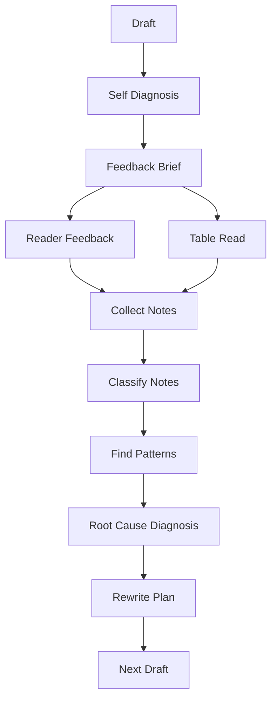
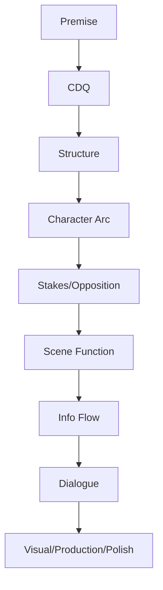
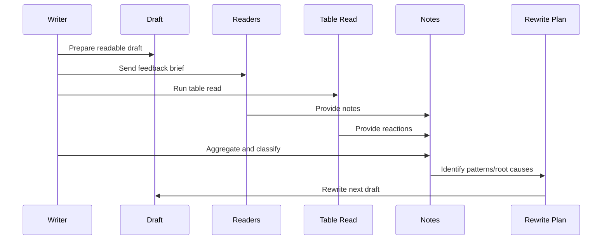

# learn-screenwriting-film-script-part-023.md

# Part 023 — Feedback, Table Read, dan Script Diagnosis

> Seri: Learn Screenwriting for Film Project  
> Pendekatan: *The First 20 Hours* — Josh Kaufman  
> Fokus bagian ini: meminta, menerima, memilah, dan menggunakan feedback untuk mendiagnosis naskah secara sistematis.  
> Target praktis: mampu menjalankan feedback loop dan table read sederhana, lalu mengubah reaksi pembaca/pendengar menjadi rewrite plan yang jelas.

---

## 0. Posisi Part Ini dalam Roadmap

Pada Part 022 kita membahas rewrite:

```text
Read → Diagnose → Prioritize → Rewrite Pass → Verify → Feedback → Repeat
```

Sekarang kita masuk ke salah satu tahap paling penting dan paling rentan secara emosional:

```text
Membuka naskah kepada orang lain.
```

Screenplay bukan hanya teks pribadi. Screenplay adalah blueprint pengalaman audiovisual yang harus dipahami oleh:

- pembaca,
- aktor,
- sutradara,
- produser,
- editor,
- kru,
- penonton,
- dan diri Anda sendiri ketika sudah tidak lagi ingat semua niat awal.

Karena itu, feedback bukan aksesori. Feedback adalah bagian dari sistem produksi kualitas.

Namun feedback bisa berbahaya jika:

- diminta terlalu dini,
- diminta ke orang yang salah,
- pertanyaannya terlalu kabur,
- diterima secara defensif,
- diikuti secara literal tanpa diagnosis,
- mengubah naskah menjadi campuran selera semua orang,
- membuat penulis kehilangan visi,
- atau membuat penulis berhenti.

Part ini membahas cara membuat feedback menjadi **data**, bukan badai opini.

Diagram besar:



---

## 1. Prinsip Kaufman dalam Part Ini

Dalam kerangka *The First 20 Hours*, feedback mempercepat pembelajaran karena memberi self-correction yang lebih tajam.

Namun feedback hanya berguna jika kita tahu:

1. Apa yang ingin diuji.
2. Siapa yang tepat membaca.
3. Kapan draft siap dibaca.
4. Bagaimana meminta catatan.
5. Bagaimana mendengar tanpa defensif.
6. Bagaimana memilah note.
7. Bagaimana mencari root cause.
8. Bagaimana membuat rewrite plan.
9. Bagaimana menguji revisi berikutnya.
10. Bagaimana menjaga visi.

Target praktis:

```text
Mampu melakukan feedback cycle sederhana: kirim draft dengan pertanyaan spesifik, kumpulkan notes, kategorikan, temukan pattern, lalu buat rewrite plan.
```

Untuk short film, ini bisa dilakukan sangat cepat.  
Untuk feature, prosesnya lebih besar tetapi prinsipnya sama.

---

## 2. Feedback Bukan Validasi Diri

Kesalahan umum:

```text
Saya minta feedback agar orang bilang naskah saya bagus.
```

Jika itu motivasinya, feedback akan menyakitkan.

Feedback yang sehat bertanya:

```text
Bagian mana yang bekerja?
Bagian mana yang tidak bekerja?
Apa yang pembaca pahami?
Apa yang pembaca rasakan?
Di mana mereka bingung?
Di mana mereka bosan?
Apa yang mereka ingat?
Apa yang tidak mereka percaya?
```

Feedback bukan ujian harga diri. Feedback adalah observability.

Untuk software engineer:

```text
Feedback = logs, metrics, traces, failing tests.
```

Kalau log menunjukkan error, bukan berarti developer bodoh. Itu berarti sistem memberi informasi.

---

## 3. Feedback sebagai Observability

Dalam engineering, sistem yang tidak terobservasi sulit diperbaiki.

Dalam screenwriting, naskah yang hanya dibaca penulis sendiri punya blind spot besar.

Observability naskah:

| Observability Signal | Dalam Screenwriting |
|---|---|
| Logs | Komentar pembaca |
| Metrics | Timing, boredom points, confusion points |
| Traces | Emotional journey pembaca |
| Error report | Scene yang tidak dipahami |
| Performance bottleneck | Scene yang terlalu lambat |
| Regression | Revisi merusak hal yang sebelumnya bekerja |
| User behavior | Reaksi penonton/table read |

Feedback membantu melihat runtime experience naskah.

---

## 4. Jenis Feedback

Tidak semua feedback sama.

Jenis utama:

1. Self feedback.
2. Peer feedback.
3. Reader feedback.
4. Actor feedback.
5. Director feedback.
6. Producer feedback.
7. Genre audience feedback.
8. Table read feedback.
9. Coverage-style feedback.
10. Production feedback.
11. Mentor/professional feedback.

Setiap jenis punya fungsi berbeda.

Jangan memakai feedback produser untuk mengganti feedback aktor. Jangan memakai feedback teman non-genre untuk menilai genre promise sepenuhnya.

---

## 5. Self Feedback

Self feedback adalah diagnosis pribadi setelah cooling period.

Kelebihan:

- cepat,
- murah,
- tahu niat penulis,
- bisa dilakukan berulang.

Kekurangan:

- bias,
- blind spot,
- terlalu tahu backstory,
- sulit membaca seperti penonton,
- emosional.

Self feedback harus dilakukan sebelum external feedback.

Jangan kirim draft yang bahkan belum Anda baca sendiri sampai selesai.

Template self feedback:

```text
What I think works:
What I think fails:
What I am unsure about:
Questions for readers:
Do not focus on yet:
```

---

## 6. Peer Feedback

Peer feedback berasal dari sesama penulis/filmmaker.

Kelebihan:

- paham craft,
- bisa memberi diagnosis teknis,
- paham structure,
- bisa memberi solusi alternatif.

Kekurangan:

- bisa terlalu craft-heavy,
- bisa membawa selera pribadi,
- bisa terlalu ingin menulis ulang naskah Anda,
- bisa overanalyze.

Gunakan peer feedback untuk:

- struktur,
- scene function,
- character arc,
- exposition,
- genre mechanics,
- rewrite priority.

---

## 7. Reader Feedback

Reader feedback dari orang yang bukan penulis tetapi target audience.

Kelebihan:

- reaksi lebih dekat ke penonton,
- bisa melihat engagement,
- bisa memberi emotional truth,
- tidak terlalu teknis.

Kekurangan:

- sering tidak bisa menjelaskan root cause,
- solusi yang diberi bisa salah,
- mungkin tidak paham format screenplay,
- bisa bingung oleh draft kasar.

Gunakan reader feedback untuk:

- apakah cerita menarik,
- apakah karakter dipedulikan,
- apakah bingung,
- apakah ending terasa,
- apakah tone diterima.

---

## 8. Actor Feedback

Actor feedback sangat berguna untuk:

- dialog,
- motivation,
- playable action,
- emotional transitions,
- subtext,
- scene clarity,
- character consistency.

Aktor sering tahu jika line tidak bisa dimainkan.

Catatan aktor yang berguna:

```text
Saya tidak tahu apa yang karakter saya mau di scene ini.
```

```text
Perubahan emosi dari marah ke memaafkan terlalu cepat.
```

```text
Line ini menjelaskan, tapi saya tidak punya action.
```

Jangan minta aktor menilai struktur feature secara penuh kecuali mereka juga pembaca kuat. Gunakan mereka untuk character/scene performance.

---

## 9. Director Feedback

Director feedback berguna untuk:

- visual storytelling,
- blocking,
- scene transitions,
- production feasibility,
- tone,
- scene length,
- visual clarity,
- object/motif,
- location function.

Sutradara mungkin bertanya:

```text
Apa yang harus saya filmkan di scene ini selain dua orang bicara?
```

Ini pertanyaan penting.

Jika banyak scene tidak punya visual action, rewrite visual pass.

---

## 10. Producer Feedback

Producer feedback berguna untuk:

- scope,
- budget,
- audience,
- market/positioning,
- production risk,
- cast/location feasibility,
- schedule,
- legal/sensitivity risk,
- clarity pitch.

Producer mungkin berkata:

```text
Scene ini mahal tapi fungsinya sama dengan scene yang lebih kecil.
```

Atau:

```text
Ending terlalu ambigu untuk target platform ini.
```

Anda tidak harus selalu mengikuti, tetapi harus memahami constraint.

---

## 11. Genre Audience Feedback

Jika menulis genre tertentu, cari pembaca yang paham genre itu.

Horror fan tahu jika horror tidak menakutkan.  
Mystery fan tahu jika reveal tidak fair.  
Romance reader tahu jika chemistry tidak terasa.  
Comedy audience tahu jika joke tidak bekerja.

Tanya:

```text
Apakah promise genre terpenuhi?
Apa beat genre yang terasa hilang?
Apa cliché yang terlalu obvious?
Apa momen paling genre-satisfying?
```

Genre feedback penting karena audience expectation berbeda.

---

## 12. Coverage-Style Feedback

Script coverage biasanya berisi:

- logline,
- synopsis,
- comments,
- strengths,
- weaknesses,
- character notes,
- structure notes,
- market/production notes,
- recommendation.

Anda bisa membuat coverage sendiri atau meminta orang lain.

Coverage berguna untuk melihat naskah secara industri/development.

Namun coverage bukan kebenaran absolut. Itu salah satu pembacaan.

---

## 13. Production Feedback

Production feedback datang dari orang yang berpikir shootability:

- produser,
- line producer,
- AD,
- DP,
- sound,
- art,
- location manager,
- editor.

Mereka mungkin menandai:

- lokasi terlalu banyak,
- night shoot berat,
- crowd mahal,
- sound location buruk,
- prop continuity sulit,
- scene tidak punya coverage,
- action berisiko,
- anak/animal/vehicle issue,
- VFX tidak realistis.

Production feedback penting setelah story cukup solid.

Jangan biarkan production feedback membunuh cerita terlalu awal, tetapi jangan abaikan jika project ingin diproduksi.

---

## 14. Kapan Meminta Feedback?

Terlalu cepat:

- draft belum selesai,
- ending belum ada,
- placeholder banyak,
- pertanyaan belum jelas,
- penulis hanya ingin validasi,
- penulis belum self-review.

Terlalu lambat:

- sudah terlalu attached,
- rewrite besar jadi mahal,
- produksi sudah dekat,
- masalah struktur terlambat ditemukan.

Panduan:

### Untuk short

Minta feedback setelah:

- draft lengkap,
- Anda sudah baca sendiri,
- placeholder besar bersih,
- final image ada.

### Untuk feature

Minta feedback bertahap:

1. Logline.
2. Treatment.
3. Outline.
4. Act 1/sequence.
5. Full draft.
6. Rewrite draft.

Jangan menunggu 120 halaman jika logline belum jelas.

---

## 15. Draft Readiness for Feedback

Checklist:

- [ ] Draft punya awal-tengah-akhir.
- [ ] File rapi dan bisa dibaca.
- [ ] Placeholder besar dihapus/ditandai jelas.
- [ ] Anda sudah membaca sendiri.
- [ ] Anda tahu pertanyaan feedback.
- [ ] Anda tahu level feedback yang diminta.
- [ ] Anda siap tidak membela setiap catatan.
- [ ] Anda punya versi backup.
- [ ] Anda tidak mengirim ke terlalu banyak orang sekaligus.
- [ ] Anda memberi deadline wajar.

Jangan kirim draft mentah tanpa konteks, lalu berharap catatan tajam.

---

## 16. Feedback Brief

Feedback brief adalah instruksi kepada pembaca.

Tanpa brief, pembaca memberi catatan random.

Template:

```text
Halo, saya sedang mengembangkan naskah [short/feature] genre [genre] tone [tone].

Saat ini draft masih [draft stage].
Saya terutama ingin feedback tentang:
1.
2.
3.

Mohon jangan fokus dulu pada:
1.
2.

Pertanyaan utama:
1.
2.
3.

Target pembaca:
Apakah cerita ini jelas, menarik, dan ending-nya terasa earned?

Deadline feedback:
...
```

Brief membantu pembaca memberi data berguna.

---

## 17. Contoh Feedback Brief untuk Short

```text
Halo, saya minta feedback untuk naskah short 10 halaman berjudul “Kunci di Meja Makan”.

Genre/tone:
Family mystery drama, tegang, restrained, dengan humor pahit.

Stage:
Draft 1.5. Struktur utama sudah ada, tapi dialog/action line belum final.

Saya ingin feedback terutama tentang:
1. Apakah konflik Raka-Ibu-Dina jelas?
2. Apakah kunci sebagai objek terasa kuat?
3. Apakah pilihan Raka di ending terasa earned?
4. Apakah ada bagian yang membosankan atau terlalu menjelaskan?

Mohon jangan fokus dulu pada typo/format minor.

Setelah baca, tolong jawab:
- Scene mana paling kuat?
- Scene mana paling lemah?
- Apakah final image bekerja?
- Apa yang membingungkan?
```

---

## 18. Contoh Feedback Brief untuk Feature Treatment

```text
Halo, saya minta feedback untuk treatment feature 8 sequence.

Genre/tone:
Family mystery drama dengan elemen thriller ringan.

Stage:
Treatment v001, belum screenplay. Saya ingin menguji struktur sebelum draft.

Fokus feedback:
1. Apakah central dramatic question sustain untuk feature?
2. Apakah midpoint tanda tangan Raka cukup kuat?
3. Apakah Act 2 terasa meningkat atau repetitif?
4. Apakah ending membayar tema keluarga/kebohongan?
5. Subplot mana yang terasa tidak perlu?

Mohon jangan fokus pada dialog karena belum draft screenplay.
```

---

## 19. Feedback Questions yang Baik

Pertanyaan baik menghasilkan data.

Contoh:

```text
Di halaman/scene mana kamu mulai tertarik?
Di mana kamu mulai bosan?
Apa yang kamu pikir Raka inginkan?
Apa yang kamu pikir Ibu sembunyikan?
Apakah kamu percaya Dina memberi kunci/salinan?
Apakah reveal midpoint terasa earned?
Apa yang kamu rasakan di final image?
Apa yang paling kamu ingat setelah selesai?
Apa yang membingungkan?
Apa yang terasa terlalu dijelaskan?
```

Pertanyaan buruk:

```text
Bagus nggak?
Kamu suka?
Ada saran?
```

Terlalu umum.

---

## 20. Reader Questionnaire

Template:

```text
# Reader Questionnaire

Title:
Draft:
Reader:
Date:

## Immediate Reaction
1. Dalam satu kalimat, film ini tentang apa menurutmu?
2. Apa emosi utama yang kamu rasakan?
3. Apa image/scene/line yang paling kamu ingat?

## Clarity
4. Apa yang Raka/protagonist inginkan?
5. Apa hambatan utamanya?
6. Apa yang membingungkan?
7. Apakah ada informasi yang terlambat/terlalu cepat?

## Engagement
8. Di bagian mana kamu paling tertarik?
9. Di bagian mana kamu bosan?
10. Apakah kamu ingin tahu apa yang terjadi selanjutnya?

## Character
11. Apakah protagonist terasa aktif?
12. Apakah kamu memahami pilihan protagonist?
13. Karakter mana paling hidup?
14. Karakter mana paling lemah/tidak jelas?

## Structure
15. Apakah turning point utama terasa?
16. Apakah midpoint/reveal bekerja?
17. Apakah ending terasa earned?

## Dialogue/Scene
18. Dialog mana terasa natural/kuat?
19. Dialog mana terasa menjelaskan?
20. Scene mana bisa dipotong?

## Final
21. Apa satu hal yang paling perlu diperbaiki?
22. Apa satu hal yang sebaiknya dipertahankan?
```

---

## 21. Jangan Minta Semua Orang Memberi Solusi

Pembaca sering lebih akurat dalam reaksi daripada solusi.

Mereka tahu:

```text
Saya bosan di scene ini.
Saya tidak percaya karakter ini.
Saya bingung di reveal ini.
Saya tidak peduli ending.
```

Mereka belum tentu tahu:

```text
Tambahkan flashback.
Ubah karakter jadi polisi.
Buat ending happy.
Tambahkan romance.
```

Tugas penulis:

```text
Ambil reaksi, cari akar, pilih solusi.
```

Jangan abaikan solusi otomatis, tetapi jangan ikuti literal tanpa diagnosis.

---

## 22. Cara Menerima Feedback

Saat menerima feedback langsung:

1. Dengarkan.
2. Catat.
3. Jangan membela.
4. Jangan menjelaskan maksud scene.
5. Jangan argue.
6. Tanya klarifikasi.
7. Ucapkan terima kasih.
8. Analisis nanti.

Kalimat berguna:

```text
Menarik. Di bagian mana tepatnya kamu merasa begitu?
```

```text
Kapan kamu mulai bingung?
```

```text
Apa yang kamu kira sedang terjadi saat itu?
```

```text
Scene mana yang membuat kamu merasa karakter itu pasif?
```

Jangan:

```text
Sebenarnya maksud saya...
```

Jika harus menjelaskan maksud, berarti halaman belum menyampaikan.

---

## 23. Feedback Defensive Trap

Defensive thought:

```text
Mereka tidak mengerti.
Mereka bukan target audience.
Mereka salah baca.
Kalau mereka tahu backstory-nya, mereka akan paham.
Mereka terlalu fokus detail.
Mereka ingin menulis cerita saya.
```

Kadang benar. Tapi jangan mulai dari sana.

Mulai dari:

```text
Apa yang di halaman membuat mereka bereaksi begitu?
```

Jika 3 orang salah paham hal yang sama, draft memberi sinyal yang salah.

---

## 24. Note Taking Saat Feedback

Catat raw feedback tanpa mengedit.

Format:

```text
Raw note:
Context:
Reader type:
My immediate emotion:
Potential issue:
Need check? yes/no
```

Contoh:

```text
Raw note:
"Aku merasa Raka jahat banget dari awal."

Context:
Reader 2, after dinner scene.

Reader type:
General audience.

Immediate emotion:
Defensive, karena Raka memang flawed.

Potential issue:
Mungkin vulnerability Raka kurang sebelum ia menekan Ibu.

Need check:
Yes, compare with other notes.
```

Pisahkan emosi dari diagnosis.

---

## 25. Feedback Triage

Setelah mengumpulkan notes, kategorikan.

Kategori:

- clarity,
- engagement,
- character,
- structure,
- scene,
- dialogue,
- exposition,
- tone,
- genre,
- production,
- taste preference,
- solution suggestion.

Template:

```text
Note:
Category:
Severity:
Repeated?:
Root cause hypothesis:
Action:
```

Severity:

```text
Low = minor polish
Medium = scene-level issue
High = structure/character issue
Critical = premise/ending/CDQ issue
```

---

## 26. Pattern Recognition

Satu note bisa noise. Pattern adalah sinyal.

Jika banyak pembaca berkata:

```text
Act 2 terasa lambat.
```

Itu pattern.

Jika hanya satu pembaca berkata:

```text
Aku ingin ada alien.
```

Mungkin taste/noise, kecuali genre Anda memang sci-fi tersembunyi.

Pattern types:

| Pattern | Kemungkinan Root |
|---|---|
| Banyak bingung di scene sama | Information flow / clarity issue |
| Banyak bosan di bagian sama | Pacing / weak conflict |
| Banyak tidak suka protagonist | Agency / empathy / moral framing |
| Banyak tidak percaya ending | Setup/arc/payoff issue |
| Banyak tidak ingat karakter tertentu | Function/voice issue |
| Banyak merasa tone aneh | Tone consistency |
| Banyak ingin tahu lebih banyak | Underdeveloped world/relationship |
| Banyak merasa terlalu menjelaskan | Exposition issue |

---

## 27. Note Behind the Note

Contoh:

Feedback:

```text
Harus ada flashback masa kecil Raka.
```

Note behind note mungkin:

```text
Pembaca tidak merasakan luka Raka.
```

Solusi alternatif:

- tambahkan object masa kecil,
- scene kamar kosong,
- line Dina,
- gesture Ibu,
- foto hilang,
- behavior Raka saat melihat tanda tinggi badan.

Feedback:

```text
Ending harus lebih happy.
```

Note behind note mungkin:

```text
Ending sekarang terasa nihil/tidak memberi emotional payoff.
```

Solusi alternatif:

- bukan happy ending, tetapi final image yang memberi perubahan jelas.

Cari problem, bukan hanya solusi literal.

---

## 28. Contradictory Feedback

Feedback sering bertentangan.

Reader A:

```text
Raka terlalu dingin.
```

Reader B:

```text
Raka terlalu emosional.
```

Kemungkinan:

- tone tidak konsisten,
- scene berbeda memberi sinyal berbeda,
- pembaca punya selera berbeda,
- character arc tidak gradual,
- emotional register meloncat.

Tanya:

```text
Di scene mana masing-masing merasa begitu?
```

Jika A bicara Act 1 dan B bicara Act 3, mungkin arc terlalu mendadak.

Jika mereka bicara scene sama, mungkin behavior/dialog ambigu.

---

## 29. Feedback Weighting

Tidak semua feedback punya bobot sama.

Bobot dipengaruhi:

- apakah pembaca target audience,
- apakah pembaca paham genre,
- apakah pembaca paham screenplay,
- apakah note spesifik,
- apakah note berulang,
- apakah note sesuai tujuan draft,
- apakah note menunjuk masalah nyata,
- apakah note hanya preferensi.

Matrix:

| Note Source | Weight |
|---|---|
| 3+ pembaca bingung di titik sama | Tinggi |
| Genre expert melihat genre promise gagal | Tinggi |
| Aktor tidak tahu objective scene | Tinggi |
| Produser menandai scene impossible | Medium-High |
| Satu teman tidak suka genre | Rendah |
| Solusi random tanpa problem jelas | Rendah-Medium |
| Reader hanya typo saat minta struktur | Rendah untuk tahap itu |

---

## 30. Feedback Decision Matrix

Template:

```text
Feedback:
Pattern?:
Matches my goal?:
Root cause clear?:
Risk if ignored:
Risk if followed:
Decision:
```

Contoh:

```text
Feedback:
Raka terasa terlalu jahat dari awal.

Pattern:
3 readers.

Matches goal:
Ya, Raka harus flawed tapi masih worth following.

Root cause:
Tidak ada vulnerability/care sebelum dinner aggression.

Risk if ignored:
Audience disengage.

Risk if followed literally:
Membuat Raka terlalu nice dan arc lemah.

Decision:
Tambah early moment Raka menghindari telepon Ibu tapi tetap menyimpan obat lama / atau menunjukkan ia butuh uang bukan karena greed saja. Recalibrate dinner tactic mulai polite.
```

---

## 31. Table Read

Table read adalah pembacaan naskah dengan suara, biasanya oleh aktor/teman, untuk mendengar bagaimana script hidup.

Table read membantu menemukan:

- dialog yang tidak natural,
- scene terlalu panjang,
- pacing,
- confusion,
- character voice,
- emotional transition,
- comedic timing,
- exposition berat,
- scene yang mati,
- line yang sulit dimainkan,
- ending yang tidak terasa.

Screenplay adalah blueprint audiovisual. Membacanya keras membuka bug yang tidak terlihat saat silent reading.

---

## 32. Mengapa Table Read Penting?

Karena dialog di kepala penulis sering terdengar lebih bagus daripada di mulut manusia.

Table read menunjukkan:

```text
Apakah line bisa diucapkan?
Apakah karakter punya objective?
Apakah scene punya rhythm?
Apakah exposition terasa seperti pidato?
Apakah humor bekerja?
Apakah silence/beat dibutuhkan?
Apakah konflik terdengar?
```

Untuk short, table read bisa dilakukan cepat dan sangat berguna.

Untuk feature, table read bisa dilakukan per sequence/act jika full read sulit.

---

## 33. Jenis Table Read

### 33.1 Informal Read

Teman membaca peran di ruang kecil/online.

Kelebihan:

- cepat,
- murah,
- mudah.

### 33.2 Actor Table Read

Aktor membaca peran.

Kelebihan:

- dialog/character lebih akurat diuji.

### 33.3 Director/Producer Read

Tim kreatif hadir.

Kelebihan:

- structure + production feedback.

### 33.4 Private Read-Aloud

Penulis membaca sendiri keras.

Kelebihan:

- paling mudah,
- bagus sebelum external read.

### 33.5 Recorded Read

Pembacaan direkam audio/video untuk diputar ulang.

Kelebihan:

- bisa mendengar pacing,
- mencatat lebih objektif.

---

## 34. Table Read untuk Short

Short table read sangat praktis.

Checklist:

- 2–5 pembaca,
- narrator/action reader,
- timer,
- script PDF,
- note taker,
- feedback questions,
- rekam audio jika semua setuju,
- diskusi 20–40 menit setelah read.

Durasi:

```text
Short 10 halaman ≈ 10–15 menit read + 30 menit diskusi.
```

Ini salah satu feedback loop tercepat.

---

## 35. Table Read untuk Feature

Feature table read lebih besar.

Opsi:

1. Full read 90–120 menit + break.
2. Per act.
3. Per sequence.
4. Hanya key scenes.
5. Internal read dengan 3–5 orang multi-role.

Untuk feature awal, per sequence sering lebih efektif.

Contoh:

```text
Table read Act 1:
Target: opening, inciting, lock-in.
Questions: apakah Raka jelas, apakah rumah menarik, apakah lock-in terasa?
```

Jangan tunggu full production-style table read jika belum siap.

---

## 36. Persiapan Table Read

Sebelum table read:

1. Pastikan draft bersih cukup.
2. Export PDF.
3. Beri nomor halaman.
4. Siapkan cast list.
5. Tentukan narrator/action reader.
6. Kirim script sebelumnya jika bisa.
7. Beri konteks genre/tone.
8. Jelaskan tujuan read.
9. Jelaskan aturan feedback.
10. Siapkan feedback form.
11. Siapkan timer.
12. Siapkan note taker.

Jangan improvisasi tanpa struktur jika ingin data.

---

## 37. Casting Table Read

Pilih pembaca berdasarkan fungsi.

Untuk short 3 karakter:

```text
Reader 1: Raka
Reader 2: Ibu
Reader 3: Dina
Reader 4: Action/narrator
```

Jika orang terbatas:

- satu orang bisa baca multiple minor roles,
- action/narration bisa dibaca penulis,
- hindari penulis membaca protagonist jika ingin mendengar objektif.

Jika penulis membaca semua, sulit mencatat reaksi.

---

## 38. Role of Moderator

Moderator menjaga proses.

Tugas:

- membuka sesi,
- menjelaskan tujuan,
- menjaga waktu,
- memastikan semua baca,
- mencegah diskusi saat read,
- memimpin feedback,
- menjaga penulis tidak defensif,
- mengumpulkan notes.

Jika Anda penulis, idealnya ada orang lain sebagai moderator. Jika tidak ada, siapkan aturan tertulis.

---

## 39. Table Read Ground Rules

Aturan:

1. Tidak ada diskusi saat membaca.
2. Jangan berhenti memperbaiki line.
3. Baca sesuai halaman.
4. Tidak perlu acting berlebihan kecuali disepakati.
5. Setelah read, mulai dengan reaksi umum.
6. Penulis mendengar dulu.
7. Feedback spesifik scene/page jika mungkin.
8. Solusi boleh, tapi masalah lebih penting.
9. Semua catatan dikumpulkan.
10. Tidak ada serangan personal.

Ground rules membuat sesi aman.

---

## 40. Acting Level dalam Table Read

Ada dua pendekatan:

### Flat Read

Baca jelas, tidak terlalu performatif.

Kelebihan:

- menguji teks,
- tidak tertolong acting kuat.

### Performed Read

Aktor memberi emosi/performa.

Kelebihan:

- menguji playable moment,
- mendengar rhythm lebih hidup.

Untuk draft awal, flat-to-moderate read cukup.  
Untuk draft lebih matang, performed read berguna.

Jika aktor bagus membuat line buruk terdengar bagus, hati-hati. Catat tetap.

---

## 41. Action Reader

Action reader membaca action lines.

Kualitas action reader memengaruhi pacing.

Tips:

- baca jelas,
- jangan terlalu lambat,
- jangan overperform,
- jangan baca scene number metadata,
- baca action yang diperlukan,
- jangan menjelaskan.

Jika action line terlalu panjang, table read akan terasa lambat. Itu data.

---

## 42. Timing Table Read

Catat waktu:

```text
Start page:
End page:
Total read time:
Slow sections:
Fast sections:
```

Jika short 10 halaman terbaca 18 menit, mungkin action/dialog terlalu padat.

Jika comedy timing mati, mungkin line panjang atau setup/payoff kurang.

Jika drama terasa cepat tapi tidak emosional, mungkin aftermath kurang.

Timing bukan hukum, tetapi sinyal.

---

## 43. Observer Sheet

Siapkan observer sheet.

```text
# Table Read Observer Sheet

Title:
Draft:
Observer:
Date:

## During Read
Page/Scene:
Reaction:
Bored/confused/engaged:
Line/scene note:

## Strong Moments
1.
2.
3.

## Weak Moments
1.
2.
3.

## Confusion Points
1.
2.
3.

## Dialogue Notes
Natural:
Unnatural:
Too long:

## Character Notes
Clear:
Unclear:
Motivation issue:

## Structure/Pacing
Where energy dropped:
Where story turned:
Ending reaction:

## Final Questions
What is the film about?
What do you remember most?
What should be fixed first?
What must remain?
```

---

## 44. Saat Table Read Berlangsung

Penulis sebaiknya:

- mendengar,
- menandai halaman,
- mencatat reaksi tubuh,
- tidak menghentikan,
- tidak menjelaskan,
- tidak tertawa untuk menutupi malu,
- tidak meminta ulang line terus,
- tidak mengarahkan aktor terlalu banyak.

Catat:

```text
Page 6: audience laughed at Dina line.
Page 8: silence, possible confusion.
Page 10: Raka line sounds too formal.
Page 12: ending image landed? uncertain.
```

---

## 45. Reaksi Tubuh Penting

Saat table read, perhatikan:

- orang melihat jam,
- orang tertawa,
- orang bingung melihat halaman,
- aktor kesulitan line,
- energi turun,
- orang condong maju,
- orang berhenti mencatat,
- hening setelah ending,
- tawa tidak disengaja pada scene serius.

Reaksi nonverbal adalah data.

Tapi jangan overinterpret satu reaksi kecil. Cari pattern.

---

## 46. Diskusi Setelah Table Read

Urutan diskusi:

1. Reaksi umum.
2. Apa yang bekerja.
3. Apa yang membingungkan.
4. Character notes.
5. Structure/pacing notes.
6. Dialogue notes.
7. Ending.
8. Production/visual notes jika relevan.
9. Pertanyaan spesifik penulis.
10. Closing: satu hal dipertahankan, satu hal diperbaiki.

Jangan mulai dengan kritik brutal tanpa menyebut apa yang bekerja. Penulis butuh tahu apa yang jangan dirusak.

---

## 47. Pertanyaan Setelah Table Read

Gunakan pertanyaan:

```text
Dalam satu kalimat, menurut kalian film ini tentang apa?
Kapan kalian mulai tertarik?
Kapan energi turun?
Apa pilihan utama protagonist?
Apakah ending terasa earned?
Line mana terdengar tidak natural?
Scene mana paling hidup saat dibaca?
Scene mana terasa hanya informasi?
Karakter mana paling jelas?
Karakter mana tidak punya objective?
Apa image yang paling kalian ingat?
```

Untuk actor:

```text
Di scene mana kamu tidak tahu objective karaktermu?
Line mana sulit dimainkan?
Emotional transition mana terlalu cepat?
```

---

## 48. Jangan Menjelaskan Setelah Read

Jika pembaca berkata:

```text
Aku tidak paham kenapa Raka kembali.
```

Jangan jawab:

```text
Sebenarnya karena di scene sebelumnya dia merasa...
```

Tanya:

```text
Di bagian mana motivasi itu hilang?
Apa yang kamu pikir dia rasakan saat meninggalkan rumah?
Apa action yang bisa membuat itu lebih jelas?
```

Jika perlu dijelaskan di luar naskah, rewrite.

---

## 49. Reading Aloud Sendiri

Sebelum table read eksternal, baca sendiri keras.

Manfaat:

- menemukan line panjang,
- mendengar rhythm,
- menemukan action line terlalu novelistik,
- menemukan dialog yang sama,
- memeriksa scene length,
- merasakan pacing.

Aturan:

```text
Baca seperti pembaca, bukan dalam kepala.
```

Jika Anda malu membaca line sendiri, aktor mungkin juga sulit memainkannya.

---

## 50. Script Diagnosis

Script diagnosis adalah proses sistematis mengidentifikasi masalah naskah.

Diagnosis berbeda dari feedback mentah.

Input:

- self read,
- reader notes,
- table read notes,
- coverage,
- production notes.

Output:

```text
Problem list + root cause + rewrite priorities.
```

Diagnosis yang baik menjawab:

```text
Apa 3 masalah terbesar naskah ini saat ini?
Apa yang harus direvisi dulu?
Apa yang tidak boleh diganggu?
```

---

## 51. Diagnosis Layer

Gunakan layer:

1. Premise/logline.
2. Central dramatic question.
3. Genre/tone.
4. Structure.
5. Protagonist/arc.
6. Antagonistic pressure.
7. Stakes.
8. Scene function.
9. Exposition/info flow.
10. Dialogue/voice.
11. Visual/sound.
12. Production feasibility.
13. Polish.

Diagram:



Diagnosis dimulai dari atas.

---

## 52. Diagnosis Severity

Klasifikasi masalah:

### Critical

Masalah di premise, protagonist, CDQ, ending, genre promise.

Contoh:

```text
Tidak jelas film ini tentang apa.
Protagonist tidak punya goal.
Ending tidak menjawab konflik.
```

### High

Masalah struktur/arc.

```text
Act 2 repetitif.
Midpoint tidak mengubah cerita.
Protagonist pasif.
```

### Medium

Masalah scene/relationship/exposition.

```text
Dinner scene terlalu panjang.
Notary exposition berat.
Dina motivation kurang jelas.
```

### Low

Polish/dialog minor/format.

```text
Line bisa dipadatkan.
Typo.
Scene heading consistency.
```

Prioritas berdasarkan severity.

---

## 53. Diagnosis Matrix

Template:

```text
Issue:
Evidence:
Severity:
Layer:
Likely root cause:
Possible fixes:
Priority:
Decision:
```

Contoh:

```text
Issue:
Raka terasa terlalu unlikeable sejak awal.

Evidence:
4 pembaca menyebut tidak peduli pada Raka sebelum midpoint.

Severity:
High.

Layer:
Character empathy / opening calibration.

Likely root cause:
Draft langsung menunjukkan Raka menekan keluarga tanpa memperlihatkan pressure/fragility/need yang manusiawi.

Possible fixes:
- Perkuat economic pressure opening.
- Tambahkan small care action.
- Mulai dinner tactic lebih polite/technical, escalate gradually.
- Tunjukkan Raka menghindari telepon Ibu dengan guilt, bukan coldness murni.

Priority:
1.
```

---

## 54. Script Diagnosis Report

Buat report singkat.

```text
# Script Diagnosis Report

Project:
Draft:
Date:

## Overall Diagnosis
Naskah saat ini paling kuat dalam:
...
Naskah saat ini paling lemah dalam:
...

## Top 3 Issues
1.
2.
3.

## What Works
1.
2.
3.

## Structure
...

## Character
...

## Scene/Pacing
...

## Exposition
...

## Dialogue
...

## Production
...

## Recommended Rewrite Priorities
1.
2.
3.

## Do Not Change
1.
2.
3.
```

Report ini menjadi dasar rewrite plan.

---

## 55. Feedback to Rewrite Plan

Transformasi:

```text
Raw Notes → Patterns → Diagnosis → Rewrite Tasks
```

Contoh:

Raw notes:

```text
Reader 1: Raka too harsh.
Reader 2: I don't care about Raka.
Actor Raka: I don't know why he pushes so hard.
Reader 3: He seems like villain.
```

Pattern:

```text
Protagonist empathy issue.
```

Diagnosis:

```text
Opening does not establish enough pressure/vulnerability. Dinner escalation too aggressive too early.
```

Rewrite tasks:

```text
1. Strengthen economic/personal pressure opening.
2. Add small vulnerability or care action.
3. Rewrite dinner scene with escalation ladder.
4. Adjust Dina sarcasm so Raka can still be flawed but human.
```

---

## 56. Feedback Dashboard

Buat dashboard sederhana.

| Issue | Count | Severity | Layer | Priority |
|---|---:|---|---|---|
| Raka unlikeable | 4 | High | Character | P1 |
| Act 2 slow | 3 | High | Structure | P1 |
| Notary exposition heavy | 3 | Medium | Exposition | P2 |
| Dina voice strong | 4 positive | Keep | Character | Protect |
| Final image strong | 3 positive | Keep | Ending | Protect |
| Legal detail confusing | 2 | Medium | Clarity | P2 |

Ini membuat feedback tidak terasa chaotic.

---

## 57. Positive Feedback Juga Data

Jangan hanya mengumpulkan kritik.

Catat hal yang bekerja:

- scene kuat,
- line memorable,
- character disukai,
- image kuat,
- ending terasa,
- tension bekerja,
- humor kena,
- object/motif diingat.

Positive feedback memberi:

```text
Do Not Change list.
```

Jika semua orang mengingat kunci di meja, pertahankan object arc itu.

Jika semua orang suka Dina, hati-hati jangan rewrite hingga suaranya hilang.

---

## 58. Protect the Core

Setelah feedback, Anda mungkin tergoda mengubah terlalu banyak.

Tentukan core:

```text
Apa yang harus tetap menjadi film ini?
```

Contoh core:

- rumah sebagai arsip kebohongan,
- kunci sebagai object arc,
- Raka sebagai orang yang mengubah transaksi menjadi accountability,
- Ibu sebagai gatekeeper yang melindungi lewat silence,
- Dina sebagai generasi yang menolak diam,
- final image kunci di pintu terbuka.

Feedback boleh mengubah cara. Jangan mudah menghilangkan core tanpa alasan kuat.

---

## 59. Feedback dan Visi

Visi bukan berarti menolak feedback.

Visi berarti tahu:

```text
Pengalaman apa yang ingin saya buat?
```

Feedback membantu melihat apakah pengalaman itu sampai.

Jika pembaca tidak menangkap visi, ada dua kemungkinan:

1. Draft belum menyampaikan visi.
2. Visi belum cukup jelas/kuat.

Jangan langsung menyalahkan pembaca.

---

## 60. Feedback dari Orang yang Salah

Tidak semua orang cocok menjadi reader.

Reader tidak cocok jika:

- membenci genre Anda,
- hanya ingin cerita sesuai seleranya,
- tidak bisa spesifik,
- merendahkan bukan mengkritik,
- tidak menghormati draft stage,
- memberi solusi ekstrem tanpa membaca benar,
- membuat Anda kehilangan motivasi tanpa data.

Tetap sopan, tapi jangan beri bobot besar.

---

## 61. Reader Selection

Cari kombinasi:

1. Satu pembaca craft/penulis.
2. Satu pembaca target audience.
3. Satu aktor/performer jika dialog penting.
4. Satu orang production-minded jika akan difilmkan.
5. Satu pembaca genre.

Untuk short, 3–5 orang cukup.

Untuk feature, 5–8 feedback berkualitas bisa lebih berguna daripada 30 opini acak.

---

## 62. Feedback Batch Size

Jangan kirim ke terlalu banyak orang sekaligus.

Batch 1:

```text
2–3 trusted readers.
```

Perbaiki masalah besar.

Batch 2:

```text
3–5 broader readers/table read.
```

Perbaiki clarity/engagement.

Batch 3:

```text
target/production readers.
```

Feedback bertahap menghindari overload.

---

## 63. Managing Feedback Emotionally

Setelah feedback:

1. Jangan rewrite langsung malam itu jika emosional.
2. Simpan notes.
3. Tandai perasaan, tapi jangan jadikan keputusan.
4. Cari pattern keesokan hari.
5. Mulai dari top 3 issues.
6. Ingat positive feedback.

Kalimat internal:

```text
Catatan ini bukan vonis. Ini data untuk draft berikutnya.
```

---

## 64. Feedback Burnout

Gejala:

- semua note terasa benar,
- semua note terasa salah,
- ingin mengganti semua,
- tidak tahu film ini tentang apa,
- takut menulis,
- membenci draft.

Solusi:

- kembali ke logline,
- tulis do-not-change list,
- pilih 3 prioritas saja,
- abaikan polish sementara,
- bicara dengan satu collaborator tepercaya,
- istirahat.

Feedback terlalu banyak tanpa triage bisa merusak.

---

## 65. Table Read Diagnosis: Dialogue

Tanda dialog bermasalah saat read:

- aktor tersandung,
- line terlalu panjang,
- semua karakter terdengar sama,
- orang tertawa di momen serius,
- exposition terdengar seperti laporan,
- actor bertanya “maksudnya apa?”,
- emotional transition tidak bisa dimainkan.

Diagnosis:

```text
Line issue?
Voice issue?
Objective issue?
Scene issue?
Exposition issue?
```

Jangan langsung polish line jika scene objective tidak jelas.

---

## 66. Table Read Diagnosis: Pacing

Tanda pacing bermasalah:

- energi turun di scene tertentu,
- action reader membaca paragraf panjang,
- aktor menunggu line terlalu lama,
- scene terasa selesai tapi masih lanjut,
- climax lewat terlalu cepat,
- opening terlalu lambat.

Fix:

- cut entry,
- early exit,
- split/merge,
- remove repeated beats,
- add pressure,
- add aftermath if too fast,
- compress action lines.

---

## 67. Table Read Diagnosis: Character

Tanda character issue:

- aktor tidak tahu objective,
- pembaca tidak tahu kenapa karakter melakukan action,
- character voice tidak khas,
- emotional jump terlalu besar,
- supporting character terasa sama,
- protagonist tidak aktif.

Fix:

- clarify scene objective,
- add playable action,
- strengthen want/fear,
- adjust scene order,
- add/remove beat,
- differentiate voice.

---

## 68. Table Read Diagnosis: Ending

Ending bermasalah jika:

- hening bingung, bukan hening emosional,
- orang bertanya “jadi maksudnya apa?”,
- final choice tidak terbaca,
- ending terasa tiba-tiba,
- ending terasa terlalu dijelaskan,
- penonton tidak melihat perubahan dari opening.

Fix:

- strengthen final choice,
- clarify final action,
- setup final image earlier,
- cut explanation after image,
- add missing emotional step before climax.

---

## 69. Short Film Feedback Loop

Untuk short, feedback loop ideal:

```text
Draft 1 → self read → rewrite quick → table read → rewrite → production pass → final read
```

Karena short pendek, loop bisa cepat.

Jangan overdevelop short sampai kehilangan energi. Tetapi minimal lakukan table read jika dialog penting.

---

## 70. Feature Feedback Loop

Untuk feature:

```text
Logline feedback
Treatment feedback
Outline feedback
Act/sequence feedback
Full draft feedback
Table read selected scenes/full
Rewrite
Coverage/production feedback
```

Feature terlalu mahal untuk menunggu full draft sebelum tahu premise lemah.

Gunakan checkpoint.

---

## 71. Feedback pada Level Dokumen

| Dokumen | Feedback Fokus |
|---|---|
| Logline | clarity, hook, protagonist, goal, stakes |
| Synopsis | beginning-middle-end, CDQ, ending |
| Treatment | structure, arc, theme, genre |
| Outline | scene function, sequence, pacing |
| Draft | dialogue, pacing, character, scene execution |
| Rewrite draft | whether issues resolved |
| Production draft | feasibility, clarity, polish |

Jangan minta typo feedback untuk logline. Jangan minta structure feedback setelah locked production draft kecuali siap membongkar.

---

## 72. Script Coverage Mini

Anda bisa membuat coverage mini sendiri.

Template:

```text
Title:
Genre:
Format:
Pages:
Logline:
Synopsis:
Strengths:
Weaknesses:
Character:
Structure:
Dialogue:
Production:
Recommendation:
Top rewrite notes:
```

Recommendation tidak harus “pass/consider/recommend” formal. Bisa:

```text
Ready for table read?
Ready for rewrite?
Ready for production pass?
```

---

## 73. Coverage Bias

Coverage bisa bias karena:

- pembaca lelah,
- tidak suka genre,
- membaca cepat,
- punya preferensi industri tertentu,
- tidak memahami budaya lokal,
- tidak sesuai target audience.

Gunakan coverage sebagai input, bukan hukum.

---

## 74. Cultural Feedback

Jika cerita punya elemen budaya lokal, pilih pembaca yang memahami konteks.

Mereka bisa menilai:

- bahasa,
- norma,
- ritual,
- tabu,
- kelas sosial,
- detail keluarga,
- setting,
- authenticity,
- stereotype risk.

Tanya:

```text
Apakah perilaku karakter terasa benar dalam konteks budaya?
Apakah ada detail yang terasa tempelan?
Apakah bahasa terdengar hidup?
Apakah konflik sosial masuk akal?
```

---

## 75. Sensitivity Feedback

Jika cerita menyentuh trauma, komunitas, profesi, agama, politik, hukum, atau kelompok tertentu, pertimbangkan pembaca relevan.

Tujuannya bukan membuat cerita steril, tetapi menghindari:

- simplifikasi berbahaya,
- stereotype malas,
- factual error besar,
- representasi dangkal,
- tone deafness.

Tetap jaga drama, tetapi tulis dengan tanggung jawab.

---

## 76. Professional Notes vs Personal Taste

Professional note biasanya:

- spesifik,
- terkait tujuan,
- memberi alasan,
- menunjukkan dampak,
- memahami draft stage.

Taste note:

```text
Aku pribadi lebih suka ending happy.
```

Tidak salah, tetapi bobotnya tergantung tujuan.

Professional-style note:

```text
Ending sekarang terlalu ambigu karena final action Raka tidak terlihat; jika ingin bittersweet, berikan satu tindakan konkret yang menunjukkan ia memilih truth meski masa depan legal belum jelas.
```

Lebih actionable.

---

## 77. Feedback dan Genre Contract

Mintalah feedback spesifik genre.

Untuk mystery:

```text
Apakah clue fair?
Apakah reveal bisa ditebak terlalu cepat?
Apakah final reveal mengubah emosi?
```

Untuk horror:

```text
Apakah dread bekerja?
Apakah rule jelas?
Apakah payoff menakutkan?
```

Untuk romance:

```text
Apakah chemistry terasa?
Apakah obstacle meaningful?
Apakah final choice earned?
```

Untuk comedy:

```text
Di mana kamu tertawa?
Joke mana tidak kena?
Apakah escalation meningkat?
```

Untuk drama:

```text
Apakah konflik emosional terasa?
Apakah character change earned?
Apakah ada scene yang hanya mood?
```

---

## 78. Feedback dan Tone

Tanya:

```text
Menurutmu tone film ini apa?
Apakah ada scene yang terasa dari film lain?
Apakah humor/gelap/sentimentalnya pas?
Apakah ending sesuai tone awal?
```

Jika pembaca memberi tone berbeda dari yang Anda maksud, opening atau scene awal mungkin memberi sinyal salah.

---

## 79. Feedback dan Theme

Jangan bertanya:

```text
Apakah tema saya tentang keluarga dan kebohongan tersampaikan?
```

Karena terlalu leading.

Tanya:

```text
Menurutmu film ini sebenarnya memperdebatkan apa?
Apa pilihan moral utama?
Menurutmu film berpihak ke siapa/apa?
Apa yang kamu pikir berubah di akhir?
```

Jika jawaban mereka jauh dari theme Anda, cek apakah theme muncul sebagai action/choice.

---

## 80. Feedback dan Character Empathy

Tanya:

```text
Kapan kamu mulai peduli pada protagonist?
Kapan kamu kehilangan simpati?
Apakah kamu memahami kenapa ia melakukan pilihan buruk?
Apakah kamu ingin dia berubah?
Apa yang membuatnya manusia?
```

Empathy bukan berarti karakter harus baik.

Karakter flawed tetap bisa diikuti jika:

- want jelas,
- pressure jelas,
- vulnerability ada,
- agency ada,
- consequence terasa,
- moral complexity menarik.

---

## 81. Feedback dan Clarity

Clarity questions:

```text
Apa yang kamu pikir terjadi di scene ini?
Apa yang kamu pikir karakter tahu?
Apa yang kamu pikir karakter inginkan?
Apa hubungan karakter A dan B?
Apa arti object ini menurutmu?
Apa yang berubah setelah midpoint?
```

Clarity bukan berarti semua dijelaskan. Clarity berarti pembaca punya pegangan yang cukup.

---

## 82. Feedback dan Boredom

Boredom adalah data penting.

Tanya:

```text
Di mana perhatianmu turun?
Apa yang kamu tunggu tapi tidak terjadi?
Apakah scene terasa mengulang?
Apakah stakes terasa berhenti?
Apakah kamu tahu outcome scene terlalu cepat?
```

Boredom sering berarti:

- no conflict,
- no new info,
- no turn,
- no stakes,
- repetition,
- unclear want,
- no escalation.

---

## 83. Feedback dan Confusion

Confusion bisa baik atau buruk.

Good confusion:

```text
Saya penasaran apa isi ruang kerja.
```

Bad confusion:

```text
Saya tidak tahu kenapa Raka di rumah ini.
```

Good mystery:

```text
What happened?
```

Bad clarity:

```text
What is happening?
```

Diagnosis harus membedakan.

---

## 84. Feedback dan Surprise

Surprise bekerja jika:

- setup ada,
- reveal mengubah makna,
- emosi ikut berubah,
- bukan random,
- penonton merasa “oh, masuk akal”.

Tanya:

```text
Apakah reveal mengejutkan?
Apakah terasa fair?
Setelah reveal, apakah scene sebelumnya terasa punya makna baru?
```

Jika reveal random, tambahkan setup. Jika terlalu obvious, tambahkan false meaning.

---

## 85. Feedback dan Ending

Ending questions:

```text
Apa yang berubah di akhir?
Apakah protagonist membuat pilihan?
Apakah kamu percaya pilihan itu?
Apakah final image melekat?
Apakah ending terlalu cepat/lambat?
Apakah kamu merasa diberi closure yang sesuai?
Apa yang masih unresolved dan apakah itu mengganggu?
```

Ending tidak harus menyelesaikan semua, tetapi harus membayar core dramatic question.

---

## 86. Feedback dan Production

Production feedback questions:

```text
Scene mana terasa mahal?
Apakah ada lokasi yang bisa digabung?
Apakah ada karakter yang bisa digabung?
Apakah ada action yang sulit diproduksi?
Apakah sound location bermasalah?
Apakah props utama jelas?
Apakah cerita bisa tetap kuat jika scope diperkecil?
```

Gunakan setelah story core cukup kuat.

---

## 87. Feedback Template untuk Aktor

```text
# Actor Feedback Form

Character:
Scenes read:

1. Apa objective karakter di tiap scene jelas?
2. Di mana kamu tidak tahu kenapa karakter berkata/berbuat sesuatu?
3. Line mana sulit diucapkan?
4. Line mana terasa tidak sesuai karakter?
5. Emotional transition mana terlalu cepat?
6. Apa action yang bisa dimainkan?
7. Apa yang kamu rasa karakter sembunyikan?
8. Apa satu scene paling kuat untuk karakter ini?
9. Apa satu scene yang perlu rewrite?
```

---

## 88. Feedback Template untuk Sutradara

```text
# Director Feedback Form

1. Scene mana paling visual?
2. Scene mana terlalu verbal?
3. Apakah object/motif jelas?
4. Apakah blocking potential ada?
5. Apakah tone konsisten?
6. Apakah final image kuat?
7. Scene mana sulit dibayangkan secara filmik?
8. Apa peluang visual/sound yang belum dimanfaatkan?
9. Apa scene yang bisa digabung atau dipadatkan?
```

---

## 89. Feedback Template untuk Produser

```text
# Producer Feedback Form

1. Apakah premise jelas dan pitchable?
2. Apakah target audience terasa?
3. Apakah scope produksi realistis?
4. Lokasi mana paling mahal/sulit?
5. Karakter mana bisa digabung?
6. Scene mana high-cost low-value?
7. Apakah ending sesuai target format/platform?
8. Apakah ada risk legal/sensitivity/research?
9. Apa simplifikasi terbesar tanpa merusak core?
```

---

## 90. Feedback Template untuk Genre Reader

```text
# Genre Reader Feedback

Genre:
Reader familiarity:

1. Apakah genre promise jelas dari opening?
2. Beat genre apa yang bekerja?
3. Beat genre apa yang hilang?
4. Apa cliché yang terasa?
5. Apa bagian paling fresh?
6. Apakah ending membayar genre?
7. Apakah subversion jika ada terasa earned?
8. Apakah tone sesuai genre?
```

---

## 91. Feedback Data Model

Jika ingin sistematis, buat data model:

```text
Feedback {
  source
  reader_type
  draft_version
  page_scene
  raw_note
  category
  severity
  pattern_count
  root_cause
  action
  priority
}
```

Spreadsheet kolom:

| Source | Type | Page/Scene | Raw Note | Category | Severity | Pattern | Action |
|---|---|---|---|---|---|---|---|

Ini cocok untuk software engineer.

---

## 92. Feedback Aggregation Example

Raw notes:

```text
R1: Act 2 agak muter.
R2: Setelah notaris, aku merasa scene berikutnya mirip.
R3: Aku lupa tujuan Raka di tengah.
Actor: Di scene warung, Raka cuma mendengar, tidak melakukan.
```

Pattern:

```text
Act 2A lacks active sequence goal and protagonist agency.
```

Rewrite actions:

```text
- Define Seq 3 goal: Raka tries to bypass Ibu legally.
- Combine two repetitive info scenes.
- Make Raka actively seek clue at warung.
- Add turn that forces locked room strategy.
```

---

## 93. From Feedback to Rewrite Sprint

Setelah diagnosis, buat sprint.

```text
Sprint 1:
Fix Raka empathy opening.

Tasks:
- Add economic pressure image.
- Add guilt/vulnerability beat with Ibu call.
- Rewrite dinner entry so Raka starts controlled, not cruel.

Acceptance:
Readers should understand pressure and still see flaw.
```

Sprint 2:

```text
Fix Act 2A agency.

Tasks:
- Rewrite notary scene objective.
- Merge warung clue.
- Add consequence leading to locked room.
```

Feedback harus menjadi task, bukan anxiety.

---

## 94. Feedback Loop Diagram



---

## 95. Feedback Safety: Jangan Mengirim ke Semua Orang

Naskah early draft rapuh.

Jangan kirim ke:

- orang yang tidak Anda percaya,
- terlalu banyak grup,
- orang yang suka merendahkan,
- orang yang akan menyebarkan tanpa izin,
- orang yang tidak relevan dengan target feedback.

Jaga:

- versi draft,
- tanggal,
- watermark jika perlu,
- konteks,
- hak kreatif,
- catatan siapa membaca.

Ini bukan paranoia; ini profesional.

---

## 96. Intellectual Ownership Note

Jika Anda mengirim ke collaborator, jelas bahwa:

```text
Ini draft saya untuk feedback.
Mohon tidak disebarkan tanpa izin.
```

Untuk project serius, simpan version history dan tanggal.

Bukan harus legal formal untuk semua feedback, tetapi biasakan rapi.

---

## 97. Online Feedback

Jika minta feedback online:

- beri konteks cukup,
- jangan share full draft publik jika sensitif,
- minta feedback spesifik,
- siap dengan noise,
- jangan debat di komentar,
- ambil pattern.

Online feedback sering lebih brutal dan kurang konteks. Gunakan hati-hati.

---

## 98. Feedback dan AI

AI bisa membantu diagnosis awal.

Gunakan untuk:

- menemukan scene tanpa turn,
- mengecek consistency,
- membuat feedback questionnaire,
- mengelompokkan raw notes,
- mencari exposition-heavy sections,
- membuat rewrite task list,
- membandingkan draft versions.

Jangan gunakan AI sebagai satu-satunya pembaca karena:

- AI tidak benar-benar mengalami film seperti manusia,
- bisa terlalu menyetujui,
- bisa memberi solusi generik,
- tidak menggantikan table read/actor response.

Prompt:

```text
Baca scene list ini sebagai script doctor. Jangan rewrite. Diagnosis:
1. scene tanpa turn,
2. protagonist pasif,
3. exposition overload,
4. setup/payoff yang hilang,
5. prioritas rewrite.
```

---

## 99. Feedback and Version Control

Setiap feedback harus terkait versi draft.

```text
Feedback from Reader A applies to draft-002.
```

Jika draft sudah berubah, feedback lama mungkin tidak relevan.

Catat:

```text
Reader:
Draft version:
Date:
Focus:
```

Jangan campur feedback draft lama dengan draft baru tanpa filter.

---

## 100. Feedback Regression Check

Setelah rewrite berdasarkan feedback, cek apakah hal yang bekerja rusak.

Contoh:

Feedback:

```text
Raka too unlikeable.
```

Rewrite membuat Raka terlalu baik.

Regression:

```text
Arc melemah karena flaw tidak terlihat.
```

Check:

- apakah protagonist masih punya flaw?
- apakah conflict masih kuat?
- apakah Dina masih punya alasan marah?
- apakah theme tetap tajam?

Revisi harus memperbaiki, bukan mensterilkan.

---

## 101. Table Read Regression

Lakukan table read ulang untuk scene yang direwrite besar.

Bandingkan:

```text
Draft 1: Raka unlikeable but conflict strong.
Draft 2: Raka more human but scene less tense.
```

Goal draft 3:

```text
Human + tense.
```

Feedback loop iteratif.

---

## 102. Diagnostic Questions by Layer

### Premise

```text
Apakah cerita bisa dijelaskan?
Apakah hook jelas?
Apakah scope sesuai format?
```

### Protagonist

```text
Apakah want jelas?
Apakah protagonist aktif?
Apakah flaw terlihat?
Apakah change earned?
```

### Structure

```text
Apakah turning point besar bekerja?
Apakah midpoint mengubah game?
Apakah ending membayar?
```

### Scene

```text
Apakah scene punya turn?
Apakah conflict jelas?
Apakah output memicu scene berikutnya?
```

### Dialogue

```text
Apakah line playable?
Apakah subtext ada?
Apakah voice beda?
```

### Production

```text
Apakah bisa difilmkan?
Apakah scene mahal punya fungsi?
```

---

## 103. Script Diagnosis Scorecard

Skor 1–5.

| Area | Score | Notes |
|---|---:|---|
| Premise clarity |  |  |
| Genre promise |  |  |
| Tone consistency |  |  |
| Protagonist want |  |  |
| Protagonist agency |  |  |
| Character arc |  |  |
| Antagonistic pressure |  |  |
| Stakes |  |  |
| Structure |  |  |
| Midpoint |  |  |
| Climax/ending |  |  |
| Scene turns |  |  |
| Dialogue |  |  |
| Exposition |  |  |
| Visual storytelling |  |  |
| Production feasibility |  |  |

Prioritaskan area skor 1–2 yang berdampak besar.

---

## 104. Example Diagnosis: Short Draft

```text
Project:
Kunci di Meja Makan

Draft:
v001

What works:
- Kunci sebagai object arc kuat.
- Dina voice memorable.
- Final image kunci di meja bekerja.

Main issues:
1. Raka terlalu agresif dari awal.
2. Exposition tentang ruang kerja terlalu literal.
3. Ending choice kurang jelas: apakah Raka benar-benar meminta atau hanya kalah?

Diagnosis:
Scene punya core yang kuat, tetapi escalation terlalu cepat. Raka perlu mulai dengan tactic teknis/polite, lalu pressure membuatnya personal. Dina perlu melihat perbedaan antara Raka meminta dan memerintah.

Rewrite priorities:
1. Rewrite opening dinner action with piring/map.
2. Rewrite Raka dialogue with escalation ladder.
3. Make final action clearer: Raka duduk, melepas map, meminta bantuan.
4. Reduce direct mention of “rahasia keluarga”.
```

---

## 105. Example Diagnosis: Feature Treatment

```text
Project:
Kunci di Leher Ibu

Draft:
Treatment v001

What works:
- Premise rumah sebagai arsip kebohongan.
- Midpoint tanda tangan Raka sangat kuat.
- Final image kunci di pintu terbuka kuat.

Main issues:
1. Act 2A terasa repetitive: Raka terus mencoba mendapatkan dokumen.
2. Pembeli belum aktif cukup awal.
3. Korban lama muncul terlalu terlambat, sehingga moral stakes terasa mendadak.

Diagnosis:
Sequence goals perlu dibedakan. Pembeli harus bergerak sebagai pressure network lebih awal. Korban lama perlu setup lewat warung/public memory sebelum muncul secara langsung.

Rewrite priorities:
1. Define Seq 3 as legal bypass strategy.
2. Define Seq 4 as locked room strategy.
3. Add buyer threat after notary scene.
4. Add public memory clue in warung before midpoint.
5. Seed victim through object/rumor before direct appearance.
```

---

## 106. Feedback Anti-Pattern

### 106.1 Asking “Bagus nggak?”

Terlalu umum.

Fix:

```text
Minta feedback spesifik.
```

### 106.2 Defending Every Note

Membuat pembaca berhenti jujur.

Fix:

```text
Tanya klarifikasi, bukan pembelaan.
```

### 106.3 Following All Notes

Naskah kehilangan identitas.

Fix:

```text
Cari pattern/root cause.
```

### 106.4 Ignoring All Notes

Tidak belajar.

Fix:

```text
Minimal cek apakah halaman memberi sinyal salah.
```

### 106.5 Sending Too Early

Pembaca hanya melihat masalah yang sudah Anda tahu.

Fix:

```text
Self-read dan cleanup dulu.
```

### 106.6 Sending Too Late

Sudah terlalu attached.

Fix:

```text
Minta feedback level treatment/outline lebih awal.
```

### 106.7 No Feedback Brief

Pembaca memberi catatan acak.

Fix:

```text
Berikan fokus feedback.
```

### 106.8 Emotional Spiral

Satu note membuat ingin berhenti.

Fix:

```text
Cooling period + triage + top 3 priorities.
```

---

## 107. Table Read Anti-Pattern

### 107.1 Stopping During Read

Memotong flow.

Fix:

```text
Catat, diskusi setelah selesai.
```

### 107.2 Overdirecting Actors

Penulis mengatur intonasi agar line terdengar benar.

Fix:

```text
Biarkan teks diuji.
```

### 107.3 No Note Taker

Reaksi hilang.

Fix:

```text
Tunjuk note taker atau rekam.
```

### 107.4 No Ground Rules

Diskusi kacau.

Fix:

```text
Jelaskan aturan sebelum mulai.
```

### 107.5 Too Many People Too Soon

Feedback overload.

Fix:

```text
Mulai kecil.
```

### 107.6 Only Compliments

Tidak ada data.

Fix:

```text
Tanya confusion/boredom points.
```

### 107.7 Brutal Without Specifics

Menyakitkan tapi tidak berguna.

Fix:

```text
Minta page/scene-specific notes.
```

---

## 108. Script Diagnosis Anti-Pattern

### 108.1 Solution Jumping

Langsung tambah flashback/action/romance tanpa diagnosis.

Fix:

```text
Root cause first.
```

### 108.2 Misclassifying Severity

Menganggap typo sebagai masalah utama.

Fix:

```text
Gunakan severity layers.
```

### 108.3 Treating Taste as Objective

Mengubah naskah karena satu preferensi.

Fix:

```text
Weight feedback.
```

### 108.4 Ignoring Positive Signals

Rewrite merusak hal bagus.

Fix:

```text
Do Not Change list.
```

### 108.5 No Rewrite Plan

Langsung edit chaos.

Fix:

```text
Raw notes → patterns → diagnosis → tasks.
```

---

## 109. Exercise 1 — Feedback Brief

Buat feedback brief untuk draft Anda.

Isi:

```text
Project:
Format:
Genre/Tone:
Draft stage:
What I want tested:
What not to focus on:
Questions:
Deadline:
```

Pastikan pertanyaan spesifik.

---

## 110. Exercise 2 — Reader Questionnaire

Buat 10 pertanyaan untuk pembaca.

Harus mencakup:

- clarity,
- engagement,
- protagonist,
- structure,
- ending,
- one open question.

Hindari pertanyaan leading.

---

## 111. Exercise 3 — Feedback Triage

Ambil 10 raw notes.

Buat tabel:

```text
Raw Note | Category | Severity | Pattern? | Root Cause | Action
```

Tujuan:

```text
Melatih memisahkan reaksi dan solusi.
```

---

## 112. Exercise 4 — Table Read Plan

Buat rencana table read.

```text
Draft:
Pages:
Participants:
Roles:
Moderator:
Action reader:
Date:
Materials:
Ground rules:
Feedback questions:
Recording?:
```

---

## 113. Exercise 5 — Observer Sheet Practice

Tonton film pendek atau baca script scene bersama teman.

Gunakan observer sheet:

```text
Strong moment:
Confusing moment:
Boring moment:
Line issue:
Character objective issue:
Ending reaction:
```

Latih observasi sebelum table read sendiri.

---

## 114. Exercise 6 — Note Behind Note

Ambil 5 feedback solusi.

Contoh:

```text
"Tambahkan flashback."
```

Cari 3 kemungkinan masalah di baliknya.

```text
1. Backstory tidak terasa.
2. Motivasi karakter kurang jelas.
3. Emotional stakes kurang.
```

Lalu tulis 3 solusi alternatif tanpa flashback.

---

## 115. Exercise 7 — Diagnosis Report

Buat script diagnosis report 1–2 halaman.

Isi:

```text
Overall diagnosis:
Top 3 issues:
What works:
Rewrite priorities:
Do not change:
```

---

## 116. Exercise 8 — Feedback to Rewrite Sprint

Ambil satu issue prioritas.

Buat sprint:

```text
Issue:
Root cause:
Rewrite goal:
Tasks:
Affected scenes:
Acceptance criteria:
Timebox:
```

---

## 117. Practice Plan 90 Menit — Feedback Preparation

| Durasi | Aktivitas | Output |
|---:|---|---|
| 10 menit | Pilih draft/version | Draft target |
| 15 menit | Self diagnosis singkat | Known issues |
| 15 menit | Buat feedback brief | Brief |
| 15 menit | Buat reader questionnaire | Questions |
| 15 menit | Pilih reader/table read roles | Reader plan |
| 10 menit | Buat observer sheet | Sheet |
| 10 menit | Siapkan version/log | Feedback package |

Output:

```text
Feedback package siap dikirim/dipakai.
```

---

## 118. Practice Plan 120 Menit — Feedback Processing

| Durasi | Aktivitas | Output |
|---:|---|---|
| 20 menit | Kumpulkan semua raw notes | Notes list |
| 20 menit | Kategorikan notes | Triage table |
| 20 menit | Cari pattern | Pattern list |
| 20 menit | Root cause diagnosis | Diagnosis |
| 20 menit | Prioritas rewrite | Top tasks |
| 20 menit | Buat rewrite sprint | Sprint plan |

Output:

```text
Diagnosis report + rewrite plan.
```

---

## 119. Template: Feedback Package

```text
# Feedback Package

## Project
Title:
Format:
Genre:
Tone:
Draft version:
Pages:
Date:

## Context
Logline:
Current draft stage:

## What I Need Feedback On
1.
2.
3.

## Please Do Not Focus On Yet
1.
2.

## Questions
1.
2.
3.
4.
5.

## Deadline
...

## Notes
Mohon beri catatan dengan page/scene jika memungkinkan.
```

---

## 120. Template: Table Read Plan

```text
# Table Read Plan

Project:
Draft:
Date/time:
Location/platform:
Estimated duration:

## Participants
Moderator:
Writer:
Action reader:
Role 1:
Role 2:
Role 3:
Observers:

## Materials
Script PDF:
Feedback form:
Timer:
Recording:
Notes doc:

## Ground Rules
1.
2.
3.
4.
5.

## Read Goals
1.
2.
3.

## Post-Read Questions
1.
2.
3.
4.
5.

## Follow-up
Notes due:
Rewrite plan date:
```

---

## 121. Template: Feedback Triage Table

```text
| No | Source | Page/Scene | Raw Note | Category | Severity | Pattern | Root Cause | Action | Priority |
|---:|---|---|---|---|---|---|---|---|---|
| 1 |  |  |  |  |  |  |  |  |  |
```

---

## 122. Template: Script Diagnosis Report

```text
# Script Diagnosis Report

Project:
Draft:
Date:
Diagnosis by:

## One-Sentence Diagnosis
...

## What Works
1.
2.
3.

## Top Issues
1.
2.
3.

## Feedback Patterns
1.
2.
3.

## Core Story
Protagonist:
Want:
Need:
CDQ:
Stakes:
Ending:

## Structure Notes
Opening:
Inciting:
Midpoint:
All is lost:
Climax:
Final image:

## Character Notes
...

## Scene/Pacing Notes
...

## Exposition/Clarity Notes
...

## Dialogue/Voice Notes
...

## Genre/Tone Notes
...

## Production Notes
...

## Rewrite Priorities
P1:
P2:
P3:

## Do Not Change
1.
2.
3.
```

---

## 123. Mini Assignment Sebelum Part 024

Pilih salah satu:

### Opsi A — Feedback Brief

Buat feedback brief untuk draft short/scene Anda dan siapkan 5 pertanyaan spesifik.

### Opsi B — Table Read Mini

Lakukan table read satu scene dengan minimal 2 orang. Catat:
- line yang sulit,
- objective yang tidak jelas,
- reaction,
- rewrite notes.

### Opsi C — Diagnosis Report

Ambil 5–10 feedback atau self-notes dan buat diagnosis report 1 halaman.

### Opsi D — Feedback Simulation

Jika belum punya draft, ambil treatment/outline Anda dan minta feedback level treatment:
- CDQ,
- midpoint,
- ending,
- scope,
- genre promise.

---

## 124. Output yang Harus Dibawa ke Part Berikutnya

Part berikutnya adalah:

> **Part 024 — Production-Aware Writing: Menulis untuk Bisa Diproduksi**

Sebelum lanjut, Anda sebaiknya punya:

1. Draft atau treatment yang bisa dibaca.
2. Feedback brief.
3. Reader questionnaire.
4. Minimal beberapa feedback notes.
5. Feedback triage.
6. Script diagnosis report.
7. Rewrite priorities.
8. Daftar scene yang perlu cut/merge/rewrite.
9. Daftar hal yang bekerja dan harus dipertahankan.
10. Awareness awal tentang production constraints.

Part 024 akan membahas bagaimana menulis naskah yang bukan hanya bagus di halaman, tetapi juga realistis untuk diproduksi.

---

## 125. Ringkasan Part Ini

Feedback bukan validasi diri. Feedback adalah observability untuk naskah.

Hal paling penting:

1. Jangan minta feedback tanpa tujuan.
2. Buat feedback brief.
3. Pilih reader sesuai kebutuhan.
4. Bedakan reaksi, solusi, dan root cause.
5. Jangan defensif saat menerima feedback.
6. Cari pattern, bukan satu opini acak.
7. Positive feedback juga data.
8. Table read menguji dialog, pacing, dan playable action.
9. Script diagnosis mengubah notes menjadi rewrite priorities.
10. Feedback harus menjadi task rewrite, bukan anxiety.
11. Jaga core vision dan do-not-change list.
12. Jangan mengikuti semua catatan literal.
13. Jangan mengabaikan semua catatan karena ego.
14. Gunakan severity untuk menentukan prioritas.
15. Draft berikutnya harus menyelesaikan masalah paling penting, bukan semua hal kecil sekaligus.

Formula inti:

```text
Draft + Targeted Readers + Specific Questions + Table Read + Triage + Diagnosis = Useful Rewrite Plan
```

Jika Part 022 adalah refactor internal, Part 023 adalah observability eksternal: melihat bagaimana naskah berjalan di kepala dan mulut orang lain.

---

## 126. Status Seri

- Part 000: selesai.
- Part 001: selesai.
- Part 002: selesai.
- Part 003: selesai.
- Part 004: selesai.
- Part 005: selesai.
- Part 006: selesai.
- Part 007: selesai.
- Part 008: selesai.
- Part 009: selesai.
- Part 010: selesai.
- Part 011: selesai.
- Part 012: selesai.
- Part 013: selesai.
- Part 014: selesai.
- Part 015: selesai.
- Part 016: selesai.
- Part 017: selesai.
- Part 018: selesai.
- Part 019: selesai.
- Part 020: selesai.
- Part 021: selesai.
- Part 022: selesai.
- Part 023: selesai.
- Part 024: berikutnya.

Seri **belum selesai**. Bagian berikutnya adalah:

> **Part 024 — Production-Aware Writing: Menulis untuk Bisa Diproduksi**
