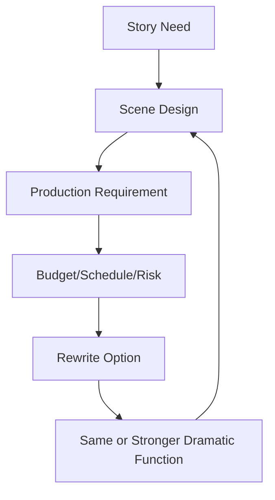
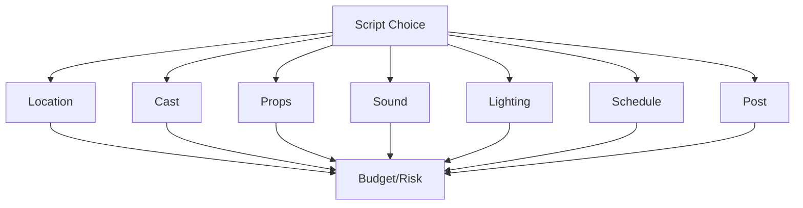
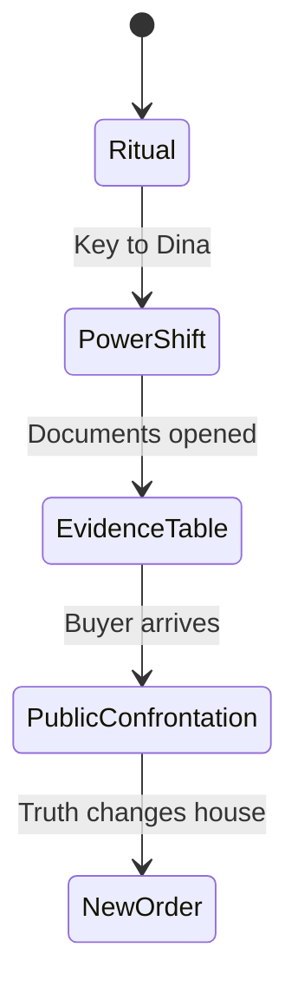
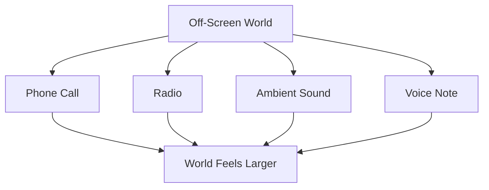
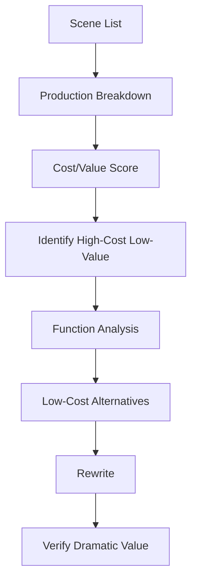
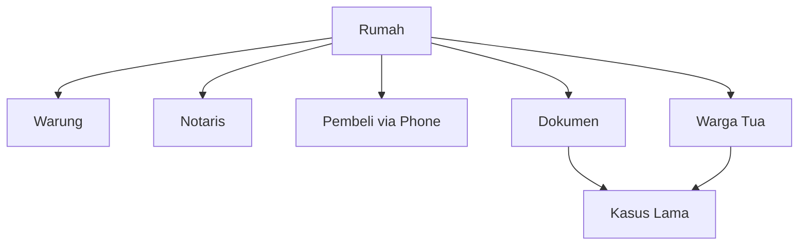

# learn-screenwriting-film-script-part-024.md

# Part 024 — Production-Aware Writing: Menulis untuk Bisa Diproduksi

> Seri: Learn Screenwriting for Film Project  
> Pendekatan: *The First 20 Hours* — Josh Kaufman  
> Fokus bagian ini: menulis naskah yang bukan hanya kuat di halaman, tetapi juga realistis untuk difilmkan dengan sumber daya nyata.  
> Target praktis: mampu mengevaluasi dan merevisi naskah dari sisi produksi tanpa mengorbankan karakter, konflik, tema, genre, dan kekuatan sinematik.

---

## 0. Posisi Part Ini dalam Roadmap

Pada Part 023 kita membahas feedback, table read, dan script diagnosis. Kita belajar bahwa naskah perlu diuji oleh pembaca, aktor, sutradara, produser, dan calon penonton.

Sekarang kita masuk ke pertanyaan yang sangat praktis:

> Apakah naskah ini bisa diproduksi?

Screenplay bukan novel. Screenplay adalah blueprint untuk produksi audiovisual.

Artinya, setiap pilihan penulisan punya konsekuensi produksi:

- lokasi,
- cast,
- jadwal,
- izin,
- properti,
- wardrobe,
- kamera,
- lighting,
- sound,
- art department,
- continuity,
- editing,
- VFX,
- stunt,
- safety,
- budget,
- waktu shooting,
- post-production,
- dan koordinasi kru.

Production-aware writing bukan berarti menulis naskah yang miskin imajinasi. Justru sebaliknya: ini adalah kemampuan menciptakan dampak dramatik besar dengan keputusan produksi yang cerdas.

Diagram posisi:



Prinsip utama:

```text
Jangan menulis mahal karena malas mencari bentuk dramatik yang lebih tepat.
Jangan menulis murah jika cerita benar-benar membutuhkan skala.
Tulis sesuai fungsi.
```

---

## 1. Prinsip Kaufman dalam Part Ini

Dalam pendekatan *The First 20 Hours*, production-aware writing adalah sub-skill yang harus dipisahkan dari ide kreatif mentah.

Sub-skill yang dilatih:

1. Mengidentifikasi kebutuhan produksi dari naskah.
2. Membaca scene dari sudut lokasi, cast, props, sound, dan schedule.
3. Membedakan high-cost high-value vs high-cost low-value.
4. Menyederhanakan scene tanpa melemahkan drama.
5. Mengubah spectacle mahal menjadi object conflict yang kuat.
6. Menulis contained scene yang tetap sinematik.
7. Mengelola jumlah lokasi dan karakter.
8. Menggunakan off-screen space.
9. Menulis sound-aware scenes.
10. Menulis prop dan object arc yang feasible.
11. Mengurangi crowd, vehicle, night, rain, VFX, stunt jika tidak perlu.
12. Membuat production pass setelah draft.
13. Berkolaborasi dengan produser/sutradara tanpa kehilangan story core.

Target praktis:

```text
Mampu membaca naskah sendiri dan membuat production scope audit: apa yang mahal, apa yang sulit, apa yang bisa disederhanakan, dan apa yang wajib dipertahankan karena nilai dramatiknya tinggi.
```

---

## 2. Apa Itu Production-Aware Writing?

Production-aware writing adalah cara menulis dengan memahami bahwa setiap elemen di halaman harus diwujudkan oleh tim produksi.

Kalimat sederhana seperti:

```text
Ribuan warga berlari di bawah hujan malam saat gedung tua terbakar di belakang mereka.
```

Mungkin membutuhkan:

- extras banyak,
- lokasi besar,
- izin,
- hujan buatan,
- night shoot,
- fire safety,
- stunt,
- VFX,
- insurance,
- lighting besar,
- sound cleanup,
- crowd control,
- emergency plan.

Bandingkan dengan:

```text
Seorang warga tua berdiri di teras rumah Raka, basah kuyup, membawa sertifikat lusuh yang tepinya hangus.
```

Dampak bisa sama-sama kuat, tetapi requirement jauh berbeda.

Production-aware writing bertanya:

```text
Apa fungsi dramatik scene ini?
Bisakah fungsi itu dicapai dengan cara yang lebih feasible?
Apakah skala mahal ini benar-benar memberi nilai cerita yang setara?
```

---

## 3. Production-Aware Bukan Anti-Ambisi

Ada kesalahpahaman:

```text
Sadar produksi = jangan menulis hal besar.
```

Bukan.

Sadar produksi berarti:

```text
Mengetahui harga dari pilihan besar dan memastikan harga itu layak secara dramatik.
```

Jika cerita Anda memang membutuhkan:

- perang,
- crowd,
- kota futuristik,
- kecelakaan,
- ledakan,
- perjalanan lintas negara,
- monster,
- dunia historis,

maka tulis dengan sadar. Jangan pura-pura semua mudah.

Namun untuk project awal, terutama film pendek atau indie feature, sering lebih kuat memilih:

```text
small scope, deep pressure
```

daripada:

```text
huge scope, shallow execution
```

---

## 4. Dramatic Function First

Sebelum memotong atau menyederhanakan, identifikasi fungsi dramatik.

Template:

```text
Scene:
Dramatic function:
Character function:
Plot function:
Theme function:
Genre function:
Visual/sound function:
Production cost:
Alternative:
```

Contoh:

```text
Scene:
Demo warga besar di depan kantor pemerintah.

Dramatic function:
Menunjukkan kasus ayah Raka berdampak luas dan belum selesai.

Character function:
Raka sadar keluarganya bukan satu-satunya korban.

Theme function:
Kebohongan keluarga punya konsekuensi publik.

Production cost:
Crowd, permit, exterior, sound, schedule.

Alternative:
Satu warga tua datang ke rumah membawa sertifikat lusuh dan tidak mau masuk.

Does alternative preserve function?
Ya, bahkan lebih personal.
```

Jangan mulai dari “murah dulu”. Mulai dari fungsi.

---

## 5. Production Scope

Production scope mencakup semua kebutuhan yang membuat naskah menjadi produksi nyata.

Komponen scope:

- jumlah lokasi,
- jumlah hari dalam cerita,
- jumlah cast,
- jumlah extras,
- day/night split,
- interior/exterior,
- company moves,
- props,
- vehicles,
- animals,
- children,
- stunt,
- intimacy,
- VFX,
- SFX,
- period setting,
- wardrobe,
- art direction,
- sound challenge,
- weather,
- crowd,
- legal/permit,
- post-production complexity.

Semakin banyak scope, semakin tinggi:

```text
cost + schedule + risk + coordination complexity
```

Diagram:



---

## 6. Production Cost Is Not Just Money

Biaya produksi bukan hanya uang. Biaya bisa berupa:

- waktu,
- energi kru,
- risiko safety,
- kompleksitas izin,
- stress aktor,
- continuity error,
- kualitas sound turun,
- jadwal molor,
- editing rumit,
- reshoot risk,
- kompromi visual,
- kualitas performa menurun karena lokasi sulit.

Scene murah di atas kertas bisa mahal secara energi.

Contoh:

```text
EXT. JALAN RAYA - SIANG
Dua orang bertengkar di pinggir jalan.
```

Mungkin butuh:

- izin,
- crowd noise,
- traffic control,
- sound sulit,
- safety,
- continuity kendaraan.

Versi lebih mudah:

```text
INT. MOBIL PARKIR - SIANG
Dua orang bertengkar saat suara jalan raya tertahan kaca.
```

Masih ada tension, lebih terkontrol.

---

## 7. High-Cost High-Value vs High-Cost Low-Value

Tidak semua scene mahal harus dipotong.

Tabel:

| Tipe | Definisi | Keputusan |
|---|---|---|
| High-cost high-value | Mahal tapi sangat penting untuk story/genre/climax | Pertahankan, rencanakan |
| High-cost low-value | Mahal tapi fungsi kecil/replaceable | Rewrite/sederhanakan |
| Low-cost high-value | Murah tapi dramatik kuat | Prioritaskan |
| Low-cost low-value | Murah tapi tidak berguna | Potong |

Contoh:

```text
High-cost high-value:
Climax thriller di lokasi publik jika entire premise tentang public exposure.

High-cost low-value:
Satu montage karakter pergi ke 7 lokasi hanya untuk menunjukkan ia sedih.

Low-cost high-value:
Kunci berpindah tangan di meja makan.

Low-cost low-value:
Scene karakter membuat kopi tanpa perubahan apa pun.
```

Production-aware writer mengejar low-cost high-value.

---

## 8. Production Value

Production value bukan sekadar mahal. Production value adalah rasa kualitas yang terlihat/terdengar di layar.

Production value bisa datang dari:

- lokasi spesifik,
- framing kuat,
- cahaya menarik,
- props bermakna,
- costume detail,
- sound motif,
- performance,
- blocking,
- final image,
- art direction minimal tapi tepat,
- scene yang punya tension jelas.

Scene satu meja bisa terasa sinematik jika:

- object conflict jelas,
- blocking berubah,
- silence bekerja,
- sound detail kuat,
- power shift terlihat,
- final image memorable.

Production value sering lahir dari spesifisitas, bukan skala.

---

## 9. Low-Budget Does Not Mean Low-Drama

Drama tidak membutuhkan biaya besar jika konflik kuat.

Contoh:

```text
Lokasi:
Ruang makan.

Cast:
3 orang.

Props:
Kunci, map, piring.

Conflict:
Anak ingin akses ke ruang kerja ayah; ibu menolak; adik menjadi gatekeeper baru.

Stakes:
Rumah, rahasia, trust, masa lalu, penjualan.

Production:
Contained, feasible, performative, object-driven.
```

Ini low-budget high-drama.

Formula:

```text
Character Want + Object + Relationship Pressure + Time Constraint = Low-Budget Drama Engine
```

---

## 10. Location Count

Jumlah lokasi adalah salah satu driver produksi terbesar.

Setiap lokasi baru bisa berarti:

- izin,
- transport,
- setup lighting,
- sound check,
- art dressing,
- continuity,
- schedule block,
- company move,
- crew fatigue,
- waktu hilang.

Untuk short pertama, target:

```text
1–3 lokasi.
```

Untuk indie feature awal:

```text
3–8 lokasi utama/sekunder, dengan 1–3 lokasi dominan.
```

Bukan aturan absolut, tetapi guideline.

---

## 11. Location Hierarchy

Buat hierarchy:

```text
Primary location:
Lokasi utama yang paling sering dipakai.

Secondary locations:
Lokasi pendukung yang punya fungsi jelas.

Tertiary/off-screen locations:
Disebut, terdengar, atau muncul singkat.
```

Contoh feature:

```text
Primary:
Rumah lama.

Secondary:
Warung depan rumah, kantor notaris.

Tertiary/off-screen:
Apartemen Raka, kantor pembeli, rumah korban, kota.
```

Ini membuat dunia terasa lebih luas tanpa produksi melebar terlalu jauh.

---

## 12. Location Function

Setiap lokasi harus punya fungsi dramatik.

Template:

```text
Location:
Story function:
Character function:
Conflict type:
Visual identity:
Sound identity:
Scene count:
Can merge:
Can be off-screen:
Production risk:
```

Contoh:

```text
Location:
Warung depan rumah.

Story function:
Public memory/social pressure.

Character function:
Raka sadar kasus ayah bukan luka privat.

Conflict type:
Shame, reputation, indirect accusation.

Visual identity:
Kursi plastik, foto yang diturunkan, papan harga kopi.

Sound identity:
Sendok gelas, radio, obrolan berhenti.

Scene count:
1–2.

Can merge:
Bisa digabung dengan scene pembeli lewat telepon setelah Raka keluar.

Production risk:
Noise/crowd.

Can be simplified:
Satu pemilik warung + satu warga tua.
```

---

## 13. Location Merge

Gabungkan lokasi jika fungsinya serupa.

Contoh lokasi terpisah:

- warung untuk social pressure,
- jalan depan rumah untuk warga melihat,
- balai warga untuk rumor.

Bisa digabung:

```text
Warung depan rumah menjadi tempat social pressure, rumor, dan warga tua.
```

Efek:

- produksi lebih hemat,
- lokasi jadi lebih bermakna,
- dunia lebih terkonsentrasi,
- motif sosial lebih kuat.

Pertanyaan:

```text
Apakah lokasi baru memberi fungsi baru, atau hanya variasi visual?
```

Jika hanya variasi visual, pertimbangkan merge.

---

## 14. Location Reuse with State Change

Menggunakan lokasi yang sama tidak membosankan jika state berubah.

Contoh ruang makan:

| Kemunculan | State |
|---|---|
| Scene 1 | Ritual makan menutupi konflik |
| Scene 2 | Kunci berpindah ke Dina |
| Scene 3 | Dokumen dibuka di meja |
| Scene 4 | Pembeli datang/open house |
| Final | Meja tanpa map, kunci di pintu |

Lokasi sama, makna berubah.

Diagram:



Ini production-aware dan dramatis.

---

## 15. Interior vs Exterior

Interior biasanya lebih mudah dikontrol:

- sound,
- lighting,
- crowd,
- weather,
- continuity,
- schedule.

Exterior bisa kuat, tetapi punya risiko:

- cuaca,
- noise,
- izin,
- crowd,
- daylight continuity,
- traffic,
- keamanan.

Jika scene tidak membutuhkan exterior, pertimbangkan interior.

Namun exterior bisa memberi:

- scale,
- isolation,
- public pressure,
- movement,
- realism.

Keputusan berdasarkan fungsi.

Contoh:

```text
Public shame lebih kuat di warung/teras exterior.
Private confrontation lebih kuat di ruang makan interior.
```

---

## 16. Day vs Night

Night shoot mahal/rumit karena:

- lighting,
- schedule kru,
- safety,
- fatigue,
- continuity,
- noise,
- transport,
- permit,
- actor energy.

Night bisa sangat kuat untuk genre/tone:

- horror,
- thriller,
- intimacy,
- secrecy,
- melancholy.

Gunakan night jika fungsinya jelas.

Alternatif:

- dusk/early morning,
- interior night with controlled lighting,
- sound motif malam tanpa exterior,
- satu malam contained bukan banyak lokasi malam.

Production-aware choice:

```text
Jika cerita terjadi satu malam di satu rumah, night shoot bisa justified.
Jika semua scene random dibuat malam hanya untuk “cinematic”, itu risk.
```

---

## 17. Weather

Hujan, kabut, angin, panas ekstrem, salju, asap: semua punya biaya/risiko.

Hujan buatan membutuhkan:

- water source,
- rig,
- safety,
- wet costume continuity,
- sound issue,
- lighting,
- cleanup,
- actor comfort.

Gunakan cuaca jika:

- memengaruhi plot,
- menekan karakter,
- punya motif,
- bisa dikontrol,
- memberi payoff.

Contoh fungsi hujan:

```text
Atap bocor mengenai map penjualan, memaksa Raka memindahkan dokumen.
```

Hujan bukan hanya mood. Hujan memicu action.

---

## 18. Crowd and Extras

Crowd mahal karena:

- casting extras,
- wardrobe,
- direction,
- continuity,
- food,
- location,
- release forms,
- sound,
- schedule.

Jika fungsi crowd adalah social pressure, bisa diganti dengan:

- 2–3 warga,
- suara off-screen,
- tatapan dari jendela,
- grup chat,
- radio/berita,
- satu representatif komunitas,
- papan pengumuman,
- empty chairs,
- object trace.

Contoh:

Mahal:

```text
Ratusan warga berteriak di depan rumah.
```

Contained:

```text
Tiga kursi plastik kosong menunggu di teras. Di atasnya, tiga sertifikat lusuh.
```

Kadang absence lebih kuat.

---

## 19. Vehicles

Kendaraan bisa menyulitkan:

- moving car shots,
- safety,
- permits,
- sound,
- camera rig,
- traffic,
- continuity,
- insurance.

Alternatif:

- mobil parkir,
- percakapan sebelum masuk kendaraan,
- percakapan setelah turun,
- interior kendaraan statis,
- sound off-screen,
- bus/train as background sound,
- ticket/object representing travel.

Contoh:

Mahal:

```text
Raka dan Dina bertengkar di mobil bergerak sepanjang jalan kota.
```

Lebih feasible:

```text
Mereka bertengkar di mobil parkir. Mesin menyala. Tidak ada yang memasang sabuk. Tidak ada yang benar-benar pergi.
```

Fungsi emosional bahkan lebih kuat.

---

## 20. Children and Animals

Anak-anak dan hewan menambah kompleksitas:

- jam kerja terbatas,
- consent/guardian,
- performance variability,
- safety,
- scheduling,
- patience,
- legal rules,
- multiple takes sulit.

Gunakan jika benar-benar perlu.

Alternatif untuk anak absent:

- mainan,
- suara dari kamar,
- foto,
- seragam,
- gambar,
- piring kecil,
- pesan suara.

Alternatif untuk hewan:

- suara,
- mangkuk makanan,
- collar,
- jejak,
- off-screen presence.

Jika anak/hewan penting secara story, tulis dengan sadar.

---

## 21. Stunts and Physical Risk

Action kecil pun bisa risk.

Contoh:

- karakter jatuh,
- berlari di tangga,
- tamparan,
- pecahan kaca,
- api,
- air,
- kendaraan,
- senjata,
- adegan kerumunan.

Jika ada physical action, pikirkan safety.

Production-aware rewrite:

Mahal/berisiko:

```text
Raka memecahkan pintu kaca dan tangannya berdarah.
```

Alternatif:

```text
Raka memukul pintu kayu sampai kunci di leher Ibu berdenting dari ruang makan.
```

Masih agresi, lebih aman.

---

## 22. Intimacy and Sensitive Scenes

Adegan intimacy atau kekerasan emosional/fisik butuh perhatian:

- consent,
- choreography,
- closed set,
- intimacy coordinator jika perlu,
- actor comfort,
- tone,
- necessity.

Jangan menulis adegan intimacy hanya sebagai shortcut emosi.

Tanya:

```text
Apa fungsi dramatik?
Apakah bisa disampaikan dengan gesture, distance, atau aftermath?
Apakah scene menghormati karakter dan aktor?
```

Untuk project kecil, sensitif bukan berarti dilarang, tetapi perlu dirancang.

---

## 23. VFX and SFX

VFX digital dan SFX practical bisa mahal.

Gunakan jika:

- genre membutuhkan,
- story tidak bekerja tanpanya,
- bisa dieksekusi dengan kualitas layak,
- budget/schedule mendukung.

Alternatif:

- off-screen threat,
- sound design,
- shadow,
- reaction,
- object aftermath,
- partial reveal,
- practical minimal.

Horror sering lebih kuat dengan apa yang tidak terlihat.

Thriller sering lebih kuat dengan konsekuensi, bukan ledakan.

---

## 24. Period Setting

Cerita masa lalu/period mahal karena:

- wardrobe,
- props,
- vehicles,
- locations,
- signage,
- technology,
- language,
- art direction,
- continuity.

Jika period tidak wajib, pertimbangkan modern setting.

Jika history penting, gunakan:

- object,
- old photo,
- recording,
- document,
- limited flashback,
- single period room,
- sound,
- archival style.

Contoh:

Mahal:

```text
Flashback penuh tahun 2003 di kantor pejabat.
```

Feasible:

```text
Raka mendengar kaset tahun 2003; kalender lama, foto, dan dokumen memberi trace.
```

---

## 25. Wardrobe and Makeup

Setiap karakter dan perubahan hari butuh wardrobe continuity.

Jika cerita berlangsung banyak hari, wardrobe lebih rumit.

Contained short satu malam:

```text
Wardrobe sederhana, continuity mudah.
```

Feature 3 bulan:

```text
Wardrobe banyak, hair/makeup continuity rumit.
```

Tidak masalah jika perlu, tetapi sadar.

Wardrobe juga bisa menjadi storytelling:

```text
Raka selalu berpakaian seperti tamu di rumah sendiri.
```

Production-aware detail:

- kostum sederhana,
- punya fungsi karakter,
- tidak terlalu banyak perubahan tanpa alasan,
- mudah continuity.

---

## 26. Props

Props adalah teman production-aware writing karena murah tapi kuat.

Namun props juga butuh tracking.

Props penting:

- kunci,
- map,
- sertifikat,
- piring,
- foto,
- telepon,
- obat,
- kaset,
- stempel,
- tiket,
- koper.

Setiap prop harus punya:

```text
owner
location
continuity
meaning
payoff
```

Prop yang kuat bisa menggantikan scene mahal.

Contoh:

```text
Satu sertifikat lusuh bisa mewakili kasus sosial besar.
```

---

## 27. Hero Props

Hero prop adalah prop yang penting secara cerita dan sering muncul.

Contoh:

```text
Kunci di leher Ibu.
```

Butuh:

- desain jelas,
- duplicate jika perlu,
- close-up friendly,
- continuity,
- movement track,
- safe handling,
- meaning jelas.

Template:

```text
Hero Prop:
First appearance:
Owner:
Scene movement:
Close-up needed:
Duplicate needed:
Final state:
Production notes:
```

---

## 28. Prop Continuity

Buat table.

| Prop | Scene 1 | Scene 2 | Scene 3 | Final |
|---|---|---|---|---|
| Kunci | Leher Ibu | Tangan Dina | Membuka ruang kerja | Pintu terbuka |
| Map | Tangan Raka | Di bawah piring | Notaris | Dokumen truth |
| Piring retak | Meja makan | Pecah/tergeser | Dibersihkan | Tetap ada/berubah |
| Obat Ibu | Rak dapur | Raka melihat | Raka memberi | Ibu tidak menyembunyikan |

Continuity prop yang kacau membuat produksi sulit dan cerita tidak jelas.

---

## 29. Sound Production

Sound sering dilupakan penulis, padahal sangat menentukan kualitas.

Lokasi sulit sound:

- jalan raya,
- warung ramai,
- pantai,
- terminal,
- hujan,
- pabrik,
- pasar,
- sekolah,
- bandara,
- kendaraan bergerak,
- exterior malam dengan generator/noise.

Jika dialog penting, pilih lokasi sound-friendly atau tulis dengan sadar.

Production-aware rewrite:

```text
Dialog emosional besar jangan ditempatkan di lokasi yang sound-nya mustahil kecuali ada alasan kuat.
```

Jika harus di lokasi bising, gunakan bising sebagai konflik:

```text
Mereka tidak bisa mendengar satu sama lain; itulah point scene.
```

---

## 30. Sound as Low-Cost Scale

Sound bisa memperluas dunia murah.

Contoh:

- suara warga off-screen,
- pengumuman bus,
- telepon pembeli,
- radio berita,
- hujan,
- sendok berhenti,
- stempel notaris,
- pintu berderit,
- kereta lewat,
- azan/gereja/lonceng jika relevan dan sensitif,
- grup chat notifikasi,
- tape recorder,
- voice note.

Sound bisa menunjukkan dunia tanpa visual mahal.

Diagram:



---

## 31. Off-Screen Space

Off-screen space adalah area di luar frame yang tetap terasa.

Gunakan untuk:

- threat,
- crowd,
- memory,
- world scale,
- absent character,
- approaching deadline,
- social pressure.

Contoh:

```text
Di ruang makan, Raka dan Ibu diam.

Dari luar, suara warga memasang papan “DIJUAL” yang jatuh tertiup angin.
```

Atau:

```text
Pembeli tidak muncul. Tapi teleponnya bergetar setiap kali Raka hampir jujur.
```

Off-screen bisa lebih kuat daripada on-screen.

---

## 32. Contained Writing

Contained writing adalah menulis cerita dengan scope lokasi terbatas.

Contained bukan berarti statis.

Agar contained tetap hidup:

1. Objective berubah.
2. Power berpindah.
3. Object bergerak.
4. Informasi terbuka.
5. Blocking berubah.
6. Ruang punya sub-lokasi.
7. Sound/off-screen memperluas dunia.
8. Time pressure meningkat.
9. Relationship state berubah.
10. Final image mengubah makna lokasi.

Contained feature/short bisa sangat kuat jika pressure sustain.

---

## 33. Sub-Locations

Satu rumah bisa punya banyak sub-lokasi:

- ruang makan,
- dapur,
- koridor,
- kamar,
- teras,
- ruang kerja,
- halaman,
- pintu belakang,
- kamar mandi,
- gudang,
- tangga.

Ini memberi variasi tanpa lokasi baru.

Setiap sub-lokasi harus punya fungsi.

Contoh:

| Sub-location | Function |
|---|---|
| Ruang makan | Ritual dan konflik keluarga |
| Dapur | Care, avoidance, obat |
| Koridor | Threshold, listening, transition |
| Ruang kerja | Forbidden truth |
| Teras | Public/private boundary |
| Kamar Raka | Absence/past |
| Halaman | Arrival/departure |

---

## 34. Blocking-Aware Writing

Blocking adalah pergerakan/posisi aktor dalam ruang.

Naskah tidak perlu mengarahkan semua blocking, tetapi bisa menulis action yang memberi power shift.

Contoh:

```text
Raka berdiri dekat pintu.
Ibu duduk di kepala meja.
Dina berada di antara mereka.
```

Saat scene berubah:

```text
Raka akhirnya duduk.
Dina berdiri.
Ibu melepas kunci.
```

Blocking menunjukkan state.

Production-aware karena memanfaatkan ruang yang ada, bukan menambah lokasi/action mahal.

---

## 35. Scene as Production Unit

Scene bukan hanya unit cerita, tetapi unit produksi.

Setiap scene berarti:

- lokasi,
- waktu,
- cast,
- props,
- wardrobe,
- lighting,
- sound,
- schedule.

Jika satu scene hanya memberi satu informasi kecil, mungkin mahal secara produksi.

Template scene production card:

```text
Scene:
Location:
Day/Night:
INT/EXT:
Characters:
Extras:
Props:
Wardrobe:
Sound risk:
Lighting risk:
Special requirements:
Dramatic function:
Can combine:
Can simplify:
```

---

## 36. Company Move

Company move adalah perpindahan seluruh kru dari satu lokasi ke lokasi lain.

Ini mahal secara waktu.

Jika naskah punya:

```text
Scene 1: rumah
Scene 2: warung
Scene 3: rumah
Scene 4: notaris
Scene 5: rumah
Scene 6: jalan
```

Produksi harus mengatur lokasi. Tidak selalu sesuai urutan cerita, tetapi banyak lokasi tetap rumit.

Penulis bisa membantu dengan:

- menggabungkan lokasi,
- membuat scene di lokasi yang bisa dijadwalkan bersama,
- mengurangi lokasi singkat,
- menggunakan off-screen info.

---

## 37. Page Count and Shoot Days

Estimasi sangat kasar:

```text
1 halaman screenplay ≈ 1 menit layar
```

Tetapi shoot days tergantung kompleksitas.

1 halaman dialog di ruang makan bisa difilmkan relatif cepat.  
1 halaman action crowd malam hujan bisa butuh jauh lebih lama.

Production-aware writing tidak hanya menghitung page, tetapi complexity per page.

---

## 38. Complexity per Page

Tabel:

| Page Type | Complexity |
|---|---|
| 2 orang bicara di interior controlled | Low-Medium |
| 3 orang konflik dengan prop penting | Medium |
| Exterior public dialogue | Medium-High |
| Night exterior rain | High |
| Crowd scene | High |
| Vehicle moving dialogue | High |
| Stunt/fight | High |
| VFX creature/action | Very High |
| Period crowd | Very High |

Satu halaman tidak sama dengan satu halaman lain.

---

## 39. Cast Count

Setiap speaking role berarti:

- casting,
- schedule,
- contract/release,
- costume,
- makeup,
- blocking,
- continuity,
- performance direction.

Untuk short:

```text
1–4 speaking roles ideal.
```

Untuk indie feature:

```text
3–8 core roles, minor roles limited.
```

Jika karakter hanya memberi satu informasi, pertimbangkan:

- gabung dengan karakter lain,
- jadikan off-screen,
- jadikan document/object,
- jadikan phone message,
- pindahkan fungsi ke existing character.

---

## 40. Character Merge

Gabungkan karakter jika fungsi overlap.

Contoh:

Karakter A:

```text
Pemilik warung memberi info reputasi ayah.
```

Karakter B:

```text
Warga tua memberi sertifikat korban.
```

Bisa digabung?

Mungkin tidak jika:

- warga tua punya moral stakes unik,
- pemilik warung hanya social observer.

Atau bisa:

```text
Pemilik warung adalah warga tua yang keluarganya terdampak.
```

Fungsi gabung:

- social pressure,
- moral consequence,
- setting identity,
- fewer cast.

Pertanyaan:

```text
Apakah dua karakter punya fungsi dramatik berbeda atau hanya informasi berbeda?
```

---

## 41. Extras vs Named Characters

Extras memberi dunia. Named characters memberi fungsi.

Jangan memberi nama pada karakter yang tidak perlu.

```text
WARGA 1
```

bisa cukup.

Jika karakter bernama, penonton mengira penting.

Production-aware script juga menghindari banyak karakter minor yang hanya satu line jika bisa digabung.

---

## 42. Phone Calls and Messages

Telepon/pesan bisa production-friendly, tetapi jangan overuse.

Kelebihan:

- off-screen character,
- external pressure,
- low cost,
- contained,
- time pressure.

Risiko:

- visual statis,
- exposition dump,
- terlalu mudah,
- kurang cinematic.

Gunakan dengan action:

```text
Telepon pembeli bergetar saat Ibu hampir bicara.
Raka membalik ponsel.
Dina melihat nama pembeli.
```

Telepon menjadi object conflict, bukan hanya info.

---

## 43. Documents and Screens

Dokumen, chat, layar laptop bisa memberi info murah.

Risiko:

- terlalu banyak text on screen,
- membosankan,
- sulit dibaca,
- exposition dump,
- legal detail kaku.

Gunakan:

- satu detail visual penting,
- reaction,
- conflict,
- partial view,
- object handling.

Contoh:

```text
Raka tidak membaca seluruh sertifikat.
Ia hanya melihat satu kolom.

PEMILIK: SARI WIDJAJA.
```

Satu detail cukup.

---

## 44. Montage

Montage bisa mempercepat, tetapi punya cost.

Montage 7 lokasi:

```text
Mahal.
```

Montage 1 lokasi dengan object changes:

```text
Lebih feasible.
```

Contoh contained montage:

```text
-- Raka membuka map demi map di ruang kerja.
-- Dina memotret dokumen saat pura-pura bosan.
-- Ibu menambah air panas ke termos, tidak masuk.
-- Jam dinding tetap mati.
```

Lokasi sama, waktu bergerak, tension naik.

---

## 45. Flashback Production

Flashback menambah:

- lokasi,
- aktor muda,
- wardrobe period,
- art direction,
- color/visual style,
- timeline clarity.

Gunakan jika:

- tidak bisa diganti,
- memberi emotional impact besar,
- punya visual yang kuat,
- tidak hanya menjelaskan.

Alternatif:

- sound memory,
- object trace,
- photo,
- repeated action,
- line fragment,
- room state,
- recording.

Jika flashback hanya untuk memberi informasi, cari bentuk present-tense.

---

## 46. Present Tense Advantage

Screenplay biasanya paling kuat saat konflik terjadi sekarang.

Daripada flashback panjang:

```text
Raka dulu menandatangani surat.
```

Gunakan present discovery:

```text
Raka menemukan tanda tangan remajanya sekarang.
```

Reaksi sekarang lebih murah dan lebih dramatik.

Backstory menjadi present conflict.

---

## 47. World Scale Without World Cost

Cara memperluas dunia tanpa biaya besar:

1. Off-screen phone.
2. Soundscape.
3. One representative character.
4. Documents.
5. Objects from outside.
6. News/radio.
7. Window/threshold.
8. Social media/chat.
9. Background signage.
10. Reaction of existing characters.

Contoh:

```text
Kita tidak melihat kantor pembeli.
Tapi pembeli mengirim foto pagar rumah dari luar saat Raka masih di dalam.
```

Dunia luar masuk tanpa lokasi baru.

---

## 48. Production-Aware Genre Writing

Setiap genre punya cost pattern.

### Drama

Cost rendah jika contained, tetapi butuh performance/dialog kuat.

### Horror

Bisa low-budget jika rule, sound, shadow, object, dan dread kuat.

### Thriller

Butuh tension/deadline; hindari action mahal jika tidak perlu.

### Comedy

Bisa murah tapi butuh timing, actors, escalation.

### Romance

Lokasi sederhana bisa kuat; chemistry dan obstacle penting.

### Mystery

Dokumen/object/clue murah, tetapi info architecture harus kuat.

### Action

Lebih mahal; jika low-budget, fokus pada suspense, aftermath, dan tactical choice.

### Sci-fi/Fantasy

Mahal jika world visual besar; bisa low-budget jika speculative rule contained.

---

## 49. Low-Budget Horror Strategy

Horror low-budget bekerja dengan:

- satu rule,
- satu lokasi,
- sound,
- off-screen threat,
- object,
- darkness,
- restricted vision,
- reaction,
- consequence.

Contoh:

```text
Ruang kerja tidak boleh dibuka setelah hujan berhenti.
```

Tidak perlu monster full CGI jika:

- pintu,
- suara,
- jejak,
- bekas tangan,
- silence,
- character fear

sudah bekerja.

---

## 50. Low-Budget Thriller Strategy

Thriller low-budget:

- deadline,
- secret,
- phone,
- one location,
- power shift,
- limited resource,
- moral pressure,
- hidden camera/audio,
- document,
- off-screen antagonist.

Contoh:

```text
Pembeli tidak muncul sampai climax, tetapi pesan/teleponnya membuat Raka mengambil pilihan buruk.
```

Threat terasa tanpa banyak lokasi.

---

## 51. Low-Budget Drama Strategy

Drama low-budget:

- relation,
- object,
- ritual,
- silence,
- contained space,
- emotional contradiction,
- one decision,
- strong final image.

Contoh:

```text
Ibu menyuapi Raka sambil menolak tanda tangan.
```

Care dan control dalam satu action.

---

## 52. Low-Budget Comedy Strategy

Comedy low-budget:

- premise absurd,
- status game,
- repetition with variation,
- one location,
- escalating lies,
- object callback,
- social awkwardness.

Contoh:

```text
Open house rumah keluarga berubah menjadi interogasi sejarah keluarga karena Ibu memperlakukan pembeli seperti calon menantu.
```

Tidak butuh banyak lokasi.

---

## 53. Budget as Creative Constraint

Constraint bisa memicu ide lebih kuat.

Contoh constraint:

```text
Hanya satu rumah, tiga aktor, satu malam.
```

Pertanyaan kreatif:

- Bagaimana membuat rumah terasa luas?
- Bagaimana membuat tiga aktor cukup?
- Bagaimana membuat satu malam sustain?
- Object apa yang membawa dunia luar?
- Off-screen pressure apa yang masuk?
- Bagaimana final image membayar semua?

Constraint menghasilkan fokus.

---

## 54. Scope Reduction Without Story Loss

Template:

```text
Original:
Dramatic function:
What audience must feel/learn:
Reduced version:
What is lost:
What is gained:
```

Contoh:

```text
Original:
Raka pergi ke kantor pembeli dan melihat jaringan besar.

Function:
Pembeli kuat dan terkait masa lalu.

Reduced:
Pembeli mengirim foto ruang kerja dari luar rumah dan menyebut detail yang hanya orang lama tahu.

Lost:
Visual kantor besar.

Gained:
Threat lebih intimate; rumah terasa diawasi.
```

---

## 55. Scene Value per Cost

Gunakan scoring.

| Scene | Dramatic Value 1–5 | Production Cost 1–5 | Keep? |
|---|---:|---:|---|
| Dinner key transfer | 5 | 1 | Keep |
| Crowd demo | 3 | 5 | Rewrite |
| Notary scene | 4 | 2 | Keep/simplify |
| Raka driving montage | 2 | 4 | Cut |
| Warga tua teras | 5 | 1 | Keep |
| Flashback office 2003 | 3 | 5 | Replace |

Cari:

```text
High value / low cost = gold
Low value / high cost = rewrite target
```

---

## 56. Production-Aware Rewrite Pass

Langkah:

1. Baca scene list.
2. Tandai lokasi.
3. Tandai cast.
4. Tandai props.
5. Tandai day/night.
6. Tandai special requirements.
7. Skor cost.
8. Skor dramatic value.
9. Cari high-cost low-value.
10. Cari lokasi/karakter yang bisa digabung.
11. Cari off-screen alternatives.
12. Rewrite sambil menjaga function.

Diagram:



---

## 57. Production Breakdown Table

Template:

| Scene | Location | INT/EXT | Day/Night | Cast | Extras | Props | Special | Cost | Value | Action |
|---|---|---|---|---|---:|---|---|---:|---:|---|
| 1 | Apartemen | INT | Day | Raka | 0 | Bills, phone | none | 1 | 4 | Keep |
| 2 | Rumah | INT | Night | Raka/Ibu/Dina | 0 | Map, key, plates | food continuity | 2 | 5 | Keep |
| 3 | Warung | EXT/INT | Day | Raka, owner, warga | 2 | coffee, photo | sound risk | 3 | 4 | Simplify |
| 4 | Demo | EXT | Day | Raka, crowd | 100 | banners | permit/crowd | 5 | 3 | Replace |

---

## 58. Scene Simplification Techniques

1. Move public conflict into private setting.
2. Replace crowd with representative character.
3. Replace travel with phone/object.
4. Replace flashback with present object.
5. Replace action with aftermath.
6. Replace expensive location with sub-location.
7. Merge two minor roles.
8. Use off-screen sound.
9. Use document detail instead of full event.
10. Use one strong image.

Example:

Mahal:

```text
Raka melihat video viral demo warga.
```

Lebih contained:

```text
Dina menunjukkan grup chat kampung: foto papan DIJUAL Raka sudah menyebar.
```

---

## 59. Action vs Aftermath

Kadang aftermath lebih murah dan lebih kuat daripada action.

Mahal:

```text
Kita melihat pembeli mengancam warga di jalan.
```

Aftermath:

```text
Warga tua datang dengan bibir pecah, membawa sertifikat yang sudah terlipat basah.
Ia tidak mau menyebut siapa yang datang.
```

Penonton mengisi kekerasan dengan imajinasi.

Aftermath juga menjaga tone restrained.

---

## 60. Representative Character

Daripada banyak orang, gunakan satu karakter yang mewakili sistem.

Contoh:

```text
Warga tua = korban sistem.
Notaris = legal system.
Pembeli = economic/political pressure.
Dina = next generation.
Ibu = family silence.
```

Satu karakter kuat bisa membawa dunia.

Jangan membuat representative character menjadi simbol kosong. Beri want, detail, dan behavior.

---

## 61. Production-Aware Exposition

Exposition yang murah tapi buruk tetap buruk.

Jangan mengganti scene mahal dengan monolog panjang.

Lebih baik:

```text
Scene mahal → object/conflict contained
```

Bukan:

```text
Scene mahal → karakter menjelaskan semua
```

Contoh:

Mahal:

```text
Flashback kasus sertifikat.
```

Buruk:

```text
Ibu menjelaskan kasus 5 menit.
```

Lebih baik:

```text
Warga tua meletakkan sertifikat di meja. Nama ayah Raka tertulis sebagai saksi. Nama warga itu dicoret.
```

---

## 62. Research and Production Realism

Jika menulis dunia legal/medis/polisi/teknis, lakukan research cukup agar tidak terlihat salah.

Namun jangan overtechnical.

Tujuan research:

- obstacle masuk akal,
- bahasa tidak konyol,
- detail spesifik,
- produksi tahu kebutuhan,
- actor bisa percaya.

Bukan tujuan:

- memasukkan semua prosedur,
- membuat scene seperti training manual.

Prinsip:

```text
Enough accuracy to support drama.
Not so much detail that drama dies.
```

---

## 63. Legal/Professional Scenes

Scene profesional sering jadi exposition dump.

Production-aware + dramatic writing:

- satu lokasi,
- satu objective,
- satu obstacle,
- satu document/object,
- satu line jargon cukup,
- consequence jelas.

Contoh notaris:

```text
Raka ingin proses jual.
Notaris menolak.
Object: sertifikat.
Turn: nama pemilik bukan yang Raka kira.
Output: Raka harus kembali ke Ibu.
```

Tidak perlu menjelaskan seluruh hukum properti.

---

## 64. Art Department Awareness

Art department mewujudkan dunia visual:

- set dressing,
- props,
- texture,
- signage,
- photos,
- documents,
- furniture,
- color palette.

Penulis membantu dengan detail yang berfungsi.

Buruk:

```text
Rumah penuh barang tua.
```

Lebih baik:

```text
Foto keluarga dibalik. Kalender berhenti di bulan yang sama dengan kasus ayah. Kunci ruang kerja tergantung di leher Ibu, bukan di paku.
```

Spesifik dan dramatik.

---

## 65. Costume as Story

Costume bisa memberi character/world dengan cost rendah.

Contoh:

```text
Raka memakai sepatu bersih di rumah berlumpur.
Ibu memakai kunci sebagai liontin.
Dina memakai kaos lama Raka.
Pembeli tidak melepas sepatu saat masuk.
```

Costume bukan hanya estetika; ia menunjukkan relasi dengan dunia.

Production note:

- jangan terlalu banyak costume changes,
- pastikan wardrobe punya continuity,
- pilih item yang story-rich.

---

## 66. Food and Production

Food di scene bisa rumit:

- continuity gigitan,
- suhu,
- jumlah take,
- prop replacement,
- actor eating,
- smell,
- mess.

Tapi food sangat kuat untuk family drama.

Gunakan dengan sadar.

Contoh:

```text
Ibu menaruh piring di atas map.
```

Food menjadi action dramatik.

Production note:

- pilih makanan mudah continuity,
- hindari terlalu banyak makan actual jika tidak perlu,
- gunakan piring/sendok sebagai object.

---

## 67. Documents as Props

Dokumen penting harus readable dan legal-looking.

Production notes:

- siapa membuat dokumen prop?
- apakah butuh close-up?
- apakah nama/tanggal terlihat?
- apakah perlu clearance?
- apakah harus konsisten antar scene?
- apakah ada duplicate?
- apakah terkena air/robek?

Dalam script, tulis detail penting saja.

```text
Kolom pemilik: SARI WIDJAJA.
```

Bukan seluruh isi dokumen.

---

## 68. Technology Props

Ponsel/laptop/chat harus dipikirkan:

- screen replacement,
- brightness,
- UI design,
- privacy,
- continuity,
- timestamp,
- battery,
- notification,
- readability,
- copyright/logo.

Jangan menulis banyak chat panjang jika visualnya akan sulit.

Gunakan phone as behavior:

```text
Raka membalik ponsel setiap nama Ibu muncul.
```

Lebih kuat daripada screenshot panjang.

---

## 69. Sound Design Notes in Script

Screenplay boleh memberi sound note jika penting.

Contoh:

```text
Kunci berdenting pelan setiap kali Ibu mengangkat sendok.
```

Atau:

```text
Dari luar, suara papan DIJUAL jatuh tertiup angin.
```

Jangan overdo:

```text
MUSIC SWELLS EMOTIONALLY WITH SAD VIOLINS...
```

Kecuali music diegetic/sangat penting.

Gunakan sound sebagai story element.

---

## 70. Music Awareness

Jangan bergantung pada musik untuk membuat scene emosional.

Buruk:

```text
Scene datar, lalu musik sedih membuat penonton menangis.
```

Lebih baik:

```text
Scene punya action dan conflict; musik jika ada memperkuat.
```

Jika musik diegetic:

- radio,
- kaset,
- lagu lama,
- piano,
- suara masjid/gereja/ritual,
- busker,

maka bisa ditulis sebagai object/sound story.

---

## 71. Editing Awareness

Penulis tidak mengedit film, tetapi bisa memberi editor material:

- clear scene turns,
- reaction moments,
- visual motif,
- sound bridge,
- button line,
- transitions,
- action continuity.

Scene tanpa turn sulit diedit.

Production-aware writing:

```text
Tulis momen yang bisa dipotong ke reaction.
```

Contoh:

```text
Raka melihat tanda tangannya.
Dina melihat Raka melihat.
Ibu tidak melihat siapa pun.
```

Editor punya material.

---

## 72. Coverage Awareness

Sutradara/DP butuh coverage, tetapi writer bisa memberi scene yang coverable.

Scene buruk untuk coverage:

```text
Empat karakter duduk tanpa action, semua exposition.
```

Scene lebih coverable:

```text
Kunci di leher Ibu, map di meja, Dina di ambang pintu, Raka berdiri dekat exit. Object dan blocking memberi visual units.
```

Writer tidak perlu menulis shot list, tetapi scene design membantu.

---

## 73. Safety Awareness

Tulisan bisa menciptakan risiko.

Risk categories:

- physical violence,
- self-harm depiction,
- fire,
- water,
- vehicles,
- heights,
- weapons,
- glass,
- animals,
- children,
- intimacy,
- crowd,
- night exterior,
- unsafe locations.

Jika tidak essential, cari alternatif aman.

Jika essential, tulis dengan jelas dan siapkan produksi yang tepat.

---

## 74. Ethical Production Awareness

Beberapa scene mungkin berat untuk aktor/kru:

- trauma,
- violence,
- humiliation,
- intimacy,
- grief,
- discrimination,
- political/religious sensitivity,
- family abuse.

Tulis dengan kesadaran:

- fungsi dramatik,
- tidak exploitative,
- tidak gratuitous,
- actor dignity,
- set safety,
- consent,
- specificity,
- aftermath.

Production-aware juga berarti manusia-aware.

---

## 75. Production-Aware Dialogue

Dialog panjang bisa murah secara budget tetapi mahal secara attention.

Jika scene dialog:

- objective kuat,
- conflict jelas,
- action beats,
- power shift,
- subtext,
- visual object,
- silence,
- turn.

Dialog “murah” yang buruk tetap mahal karena membuang waktu produksi dan penonton.

---

## 76. Long Takes and Complex Blocking

Menulis scene yang tampak sederhana bisa sulit jika membutuhkan:

- long take,
- complex movement,
- many timing cues,
- live sound,
- background action,
- choreography.

Writer biasanya tidak menentukan long take, tetapi jika scene butuh continuous action spesifik, production complexity naik.

Contoh:

```text
Raka mengikuti Ibu dari dapur ke koridor ke ruang kerja sambil membawa piring panas, Dina menghalangi, telepon berbunyi, lampu mati.
```

Bisa kuat, tapi kompleks. Pastikan nilainya layak.

---

## 77. Rehearsal Awareness

Dialog emosional dan blocking kompleks butuh rehearsal.

Naskah yang memberi actor playable objective membantu rehearsal.

Scene dengan:

- hidden agenda,
- prop handling,
- power shift,
- silence,

perlu waktu.

Production-aware writer menyediakan clarity:

```text
Apa yang karakter inginkan?
Apa yang berubah?
```

Aktor/sutradara bisa bekerja.

---

## 78. Schedule-Aware Story Time

Cerita yang berlangsung:

- satu malam,
- satu hari,
- satu akhir pekan,

bisa memudahkan continuity, tetapi bisa menambah night shoot.

Cerita yang berlangsung:

- beberapa bulan,

butuh wardrobe, hair, location changes, time indicators.

Pilih story time sesuai fungsi.

Contoh:

```text
48 jam sebelum pembeli datang.
```

Keuntungan:

- urgency,
- contained,
- limited wardrobe,
- clear deadline.

Risiko:

- banyak night scenes jika tidak dirancang.

---

## 79. Time Compression

Untuk production, time compression bisa membantu.

Daripada 10 hari:

```text
Satu malam dan satu pagi.
```

Daripada 5 lokasi proses legal:

```text
Satu pertemuan notaris yang mengungkap obstacle.
```

Time compression meningkatkan pressure dan menurunkan scope.

---

## 80. Calendar and Continuity

Jika feature multi-day, buat calendar.

```text
Day 1:
Raka arrives.

Night 1:
Dinner key transfer.

Day 2:
Notary/warung.

Night 2:
Locked room.

Day 3:
Buyer/climax.
```

Track:

- wardrobe,
- props,
- weather,
- emotional state,
- deadlines,
- character knowledge.

Calendar membantu produksi dan rewrite.

---

## 81. Production-Aware Worldbuilding

Worldbuilding harus terlihat dan feasible.

Daripada:

```text
Kota penuh sejarah kasus tanah dengan banyak institusi.
```

Gunakan:

- rumah,
- warung,
- notaris,
- dokumen,
- warga tua,
- pembeli via phone,
- radio,
- object.

Dunia terasa cukup luas lewat node kecil.



---

## 82. Production-Aware Climax

Climax sering jadi scene paling mahal/kompleks. Pastikan nilainya tinggi.

Climax contained bisa sangat kuat:

```text
Ruang makan.
Pembeli, Raka, Ibu, Dina, warga tua.
Dokumen di meja.
Kunci di pintu.
Keputusan membuka/menutup bukti.
```

Ini lebih feasible daripada:

```text
Konfrontasi di gedung pengadilan penuh wartawan.
```

Jika theme adalah keluarga dan kebohongan, climax di rumah mungkin lebih kuat.

Pilih lokasi climax berdasarkan meaning, bukan hanya spectacle.

---

## 83. Production-Aware Ending

Ending jangan membutuhkan produksi besar jika core payoff bisa visual kecil.

Contoh final image:

```text
Kunci tergantung di pintu ruang kerja yang terbuka.
```

Murah, kuat, membayar object arc.

Ending mahal:

```text
Rumah dihancurkan oleh alat berat di depan seluruh warga.
```

Bisa kuat jika cerita tentang penghancuran fisik rumah. Tapi jika cerita tentang membuka truth, kunci di pintu mungkin lebih tepat.

---

## 84. Script Breakdown Awareness

Dalam produksi, script akan di-breakdown menjadi elemen:

- cast,
- extras,
- stunts,
- vehicles,
- props,
- wardrobe,
- makeup,
- special equipment,
- sound,
- VFX,
- locations,
- animals,
- children,
- SFX,
- set dressing.

Penulis tidak harus menjadi line producer, tetapi memahami breakdown membuat keputusan lebih matang.

---

## 85. Mini Script Breakdown Example

Scene:

```text
INT. RUMAH LAMA - RUANG MAKAN - MALAM

Raka, Ibu, dan Dina duduk di meja. Map penjualan tertindih piring nasi. Kunci kecil di leher Ibu. Hujan terdengar dari luar. Telepon Raka bergetar: PEMBELI.
```

Breakdown:

```text
Cast:
Raka, Ibu, Dina.

Location:
Rumah lama / ruang makan.

Props:
Map, piring nasi, sendok, kunci liontin, phone.

Sound:
Rain ambience, phone buzz, cutlery.

Wardrobe:
Raka formal/city, Ibu home clothes, Dina casual.

Special:
Food continuity, key prop duplicate maybe.

Cost:
Low-medium.

Dramatic value:
High.
```

Ini production-aware scene bagus.

---

## 86. Production Risk Register

Template:

```text
# Production Risk Register

Risk:
Scene:
Severity:
Reason:
Story function:
Possible simplification:
Decision:
```

Contoh:

```text
Risk:
Warung exterior sound noisy.

Scene:
Raka hears public shame.

Severity:
Medium.

Story function:
Show community memory.

Simplification:
Shoot in quiet interior warung / use one owner / reduce extras / add off-screen radio.

Decision:
Keep but simplify.
```

---

## 87. Production Scope Audit Template

```text
# Production Scope Audit

Project:
Draft:
Date:

## Summary
Total pages:
Estimated duration:
Number of locations:
Primary locations:
Speaking roles:
Extras:
Day scenes:
Night scenes:
INT scenes:
EXT scenes:

## High-Risk Elements
Crowd:
Vehicles:
Stunts:
Children:
Animals:
Water/rain:
Fire:
VFX:
Period:
Sensitive scenes:

## Hero Props
1.
2.
3.

## High-Cost Scenes
Scene:
Function:
Cost reason:
Keep/rewrite:

## Low-Cost High-Value Scenes
Scene:
Why strong:

## Merge Opportunities
Location:
Character:
Scene:

## Off-Screen Opportunities
...

## Rewrite Actions
1.
2.
3.
```

---

## 88. Production-Aware Scene Audit Template

```text
# Scene Production Audit

Scene No:
Heading:
Pages:
Dramatic function:
Characters:
Extras:
Location:
INT/EXT:
Day/Night:
Props:
Wardrobe:
Sound risks:
Lighting risks:
Special requirements:
Estimated cost level 1-5:
Dramatic value 1-5:
Can simplify?:
Alternative:
Decision:
```

---

## 89. Production-Aware Rewrite Example: Crowd to Representative

Original:

```text
EXT. KANTOR KELURAHAN - SIANG

Ratusan warga membawa sertifikat dan meneriakkan nama ayah Raka. Polisi menahan kerumunan. Raka menerobos masuk.
```

Function:

```text
Kasus ayah punya dampak publik.
Raka dipermalukan.
Sistem lebih besar terasa.
```

Rewrite:

```text
INT. WARUNG DEPAN RUMAH - SIANG

Raka masuk.

Obrolan berhenti.

Di salah satu meja, seorang warga tua menata tiga sertifikat lusuh seperti kartu remi.

WARGA TUA
Bapaknya dulu juga suka map rapi.

Ia mendorong satu sertifikat ke arah Raka.

Nama ayah Raka tertulis di kolom saksi.
```

Keuntungan:

- contained,
- sound manageable,
- karakter personal,
- object kuat,
- moral stakes lebih intim,
- production cost rendah.

---

## 90. Production-Aware Rewrite Example: Flashback to Object

Original:

```text
FLASHBACK - 2003
Ayah Raka memaksa Raka remaja menandatangani surat di kantor penuh pejabat.
```

Function:

```text
Menunjukkan Raka digunakan dalam dokumen lama.
```

Rewrite:

```text
INT. RUANG KERJA AYAH - MALAM

Raka menemukan surat tua.

Kolom saksi:

RAKA PRADIPTA.

Tanda tangan remaja. Terlalu rapi.

Di sampingnya, ada pulpen sekolah dengan namanya yang pudar.
```

Keuntungan:

- present tense,
- no actor muda,
- no period set,
- lebih mystery,
- reaction Raka menjadi pusat.

---

## 91. Production-Aware Rewrite Example: Travel Montage to Decision Point

Original:

```text
MONTAGE:
Raka naik bus, ojek, kereta, berjalan di beberapa jalan kampung, melihat masa lalu.
```

Function:

```text
Menunjukkan perjalanan pulang dan emotional hesitation.
```

Rewrite:

```text
INT. TERMINAL - SORE

Raka berdiri di depan dua loket.

KOTA.
KAMPUNG.

Ponselnya bergetar: IBU.

Ia membeli tiket kampung tanpa menjawab telepon.
```

Keuntungan:

- satu lokasi,
- choice visual,
- phone motif,
- no montage,
- lebih dramatis.

---

## 92. Production-Aware Rewrite Example: Open House Climax

Original mahal:

```text
EXT. HALAMAN RUMAH - SIANG

Puluhan calon pembeli, warga, wartawan, polisi, dan keluarga berkumpul. Raka berpidato tentang kebenaran.
```

Rewrite contained:

```text
INT. RUANG MAKAN - PAGI

Pembeli duduk di kursi ayah.

Notaris membuka map.

Ibu diam di ujung meja.

Dina berdiri di dekat pintu ruang kerja.

Warga tua menunggu di teras, tidak masuk.

Raka meletakkan dokumen lama di atas surat jual beli.

RAKA
Sebelum rumah ini dijual, ada nama yang harus dibaca.
```

Keuntungan:

- lokasi core,
- object conflict,
- blocking meaningful,
- moral pressure tetap ada,
- less speech,
- more visual.

---

## 93. Writing for Available Resources

Jika Anda tahu resource nyata, tulis untuk itu.

Contoh resource:

- rumah keluarga teman,
- aktor 3 orang,
- satu mobil parkir,
- sound recorder terbatas,
- shooting 2 hari,
- tidak ada VFX,
- bisa akses warung,
- malam sulit.

Design:

```text
Short 8 menit.
Primary: rumah.
Cast: Raka, Ibu, Dina.
One exterior: teras/warung.
Props: key, map, plate, phone.
No night exterior.
```

Menulis untuk resource bukan merendahkan seni. Itu strategi.

---

## 94. Resource Inventory

Template:

```text
# Resource Inventory

Locations available:
Actors available:
Props available:
Vehicles:
Special skills:
Crew strengths:
Sound limitations:
Lighting limitations:
Shoot days:
Budget range:
Post-production capacity:
Things to avoid:
```

Lalu tulis premise yang cocok.

---

## 95. Reverse Production Design

Mulai dari resource:

```text
Saya punya:
- satu rumah tua,
- tiga aktor,
- satu malam,
- kunci tua,
- meja makan,
- hujan bisa sebagai sound only.
```

Pertanyaan:

```text
Konflik apa yang paling kuat bisa terjadi di sini?
```

Jawaban:

```text
Anak pulang untuk menjual rumah dan harus mendapatkan kunci ruang kerja dari ibu/adik.
```

Resource menjadi story engine.

---

## 96. Production-Aware Short Film Strategy

Untuk short project awal:

```text
1 location dominant
2–3 characters
1 object
1 conflict
1 deadline
1 final image
```

Production checklist:

- bisa shoot 1–2 hari,
- sound controlled,
- props sedikit,
- no crowd,
- no VFX,
- limited night if possible,
- clear performance moments,
- editing simple.

Short yang diproduksi bagus lebih berharga daripada short ambisius yang tidak selesai.

---

## 97. Production-Aware Feature Strategy

Untuk indie feature awal:

```text
Contained core + limited expansion
```

Guideline:

- 1 primary location,
- 2–4 secondary locations,
- 5–8 core speaking roles,
- limited extras,
- minimal stunts/VFX,
- present day,
- strong object/mystery/relationship,
- 90–105 pages,
- limited company moves.

Feature idea:

```text
48 jam di rumah lama sebelum dijual.
```

Bisa sustain jika:

- hidden truth,
- pressure buyer,
- family conflict,
- moral stakes,
- object arc,
- social world via few scenes.

---

## 98. Production Pass Timing

Jangan terlalu awal membatasi ide, tetapi jangan terlalu terlambat.

Timing:

1. Ide/logline: rough feasibility check.
2. Treatment: scope check.
3. Outline: location/cast count check.
4. Draft 1: production audit.
5. Draft 2: production-aware rewrite.
6. Pre-production: detailed breakdown.

Jika production pass dilakukan hanya setelah final draft, rewrite bisa mahal.

---

## 99. Creative vs Production Tension

Kadang writer dan producer tension:

Writer:

```text
Scene ini indah.
```

Producer:

```text
Scene ini mahal.
```

Pertanyaan tengah:

```text
Apa fungsi scene?
Apakah fungsi ini wajib dengan bentuk ini?
Apa alternatif yang mempertahankan emosi?
Apakah scene ini high-cost high-value?
```

Jangan langsung defensif. Jangan langsung menyerah.

---

## 100. Negotiating Changes

Saat diminta menyederhanakan:

1. Minta fungsi yang harus dipertahankan.
2. Jangan hanya memotong.
3. Usulkan alternatif.
4. Bandingkan dramatic value.
5. Jaga core.
6. Catat trade-off.

Contoh:

```text
Jika crowd demo dipotong, saya usulkan warga tua + sertifikat di teras. Kita kehilangan scale visual, tapi mendapat moral intimacy dan produksi lebih manageable.
```

Ini profesional.

---

## 101. Production-Aware Writing for Collaboration

Sutradara/produser akan lebih percaya jika penulis bisa berkata:

```text
Scene ini butuh exterior malam karena karakter harus terlihat di batas rumah dan dunia sosial.
```

atau:

```text
Scene ini bisa dipindah ke interior warung tanpa kehilangan fungsi.
```

Production-aware writer bukan hanya “orang ide”, tetapi partner problem-solving.

---

## 102. Script Notes for Production Without Overdirecting

Screenplay tidak perlu menulis semua camera direction, tetapi boleh menulis kebutuhan penting.

Buruk:

```text
CAMERA DOLLIES IN 35MM LENS SLOWLY TO A CLOSE-UP OF THE KEY.
```

Lebih baik:

```text
Kunci itu kini satu-satunya benda di tengah meja.
```

Sutradara tahu itu penting.

Tulislah image, bukan instruksi kamera, kecuali benar-benar perlu.

---

## 103. Writing What Must Be Seen

Jika sesuatu penting untuk plot, pastikan terlihat.

Contoh:

```text
Dina memotret dokumen.
```

Jika payoff bergantung pada itu, harus ada setup visual yang cukup.

Tulis:

```text
Dina mengangkat ponsel. Bukan selfie.

Di layar: sudut dokumen lama.
```

Cukup.

---

## 104. Writing What Can Be Implied

Tidak semua harus terlihat.

Bisa diimplikasikan:

- kekerasan off-screen,
- masa lalu,
- crowd,
- perjalanan,
- hubungan lama,
- sistem besar,
- ancaman,
- kerusakan.

Gunakan:

- sound,
- aftermath,
- object,
- reaction,
- absence.

Production-aware skill adalah tahu mana yang harus dilihat dan mana yang lebih kuat jika diimplikasikan.

---

## 105. Production-Aware Checklist per Draft

### 105.1 Draft 1

- [ ] Apakah ada ending?
- [ ] Apakah lokasi tidak meledak tanpa sadar?
- [ ] Apakah cast count masuk akal?
- [ ] Apakah major expensive scenes punya fungsi?

### 105.2 Draft 2

- [ ] High-cost low-value scenes direwrite?
- [ ] Lokasi digabung jika perlu?
- [ ] Character minor digabung?
- [ ] Props/key objects jelas?
- [ ] Off-screen opportunities dipakai?

### 105.3 Draft 3

- [ ] Scene production notes jelas?
- [ ] Sound risk diperhatikan?
- [ ] Action/intimacy/safety risk ditandai?
- [ ] Final image feasible?
- [ ] Production scope sesuai target?

---

## 106. Production-Aware Anti-Pattern

### 106.1 Expensive Because Vague

Penulis menulis skala besar karena tidak tahu konflik kecil yang tepat.

Fix:

```text
Cari object/relationship pressure.
```

### 106.2 Cheap but Dead

Scene murah tetapi tidak dramatis.

Fix:

```text
Tambah objective, opposition, turn.
```

### 106.3 Too Many Locations

Cerita melebar tanpa fungsi.

Fix:

```text
Location hierarchy + merge.
```

### 106.4 One-Line Characters Everywhere

Banyak karakter minor memberi info.

Fix:

```text
Merge / off-screen / document / existing character.
```

### 106.5 Dialogue as Budget Solution

Semua scene jadi orang menjelaskan.

Fix:

```text
Use object/action/conflict.
```

### 106.6 Ignoring Sound

Dialog penting ditempatkan di lokasi bising.

Fix:

```text
Move or make noise part of conflict.
```

### 106.7 Overusing Phone

Semua konflik via telepon.

Fix:

```text
Phone as object/pressure, not all-purpose exposition.
```

### 106.8 Fake Production Value

Menambah lokasi/crowd hanya agar terlihat besar.

Fix:

```text
Production value via specificity and meaning.
```

### 106.9 No Safety Awareness

Menulis physical risk tanpa sadar.

Fix:

```text
Safety/function audit.
```

### 106.10 Production Fear

Memotong semua ambisi hingga naskah hambar.

Fix:

```text
Keep high-value moments; simplify low-value cost.
```

---

## 107. Production-Aware Debugging

### 107.1 Jika naskah terasa terlalu mahal

Cek:

1. Berapa lokasi?
2. Berapa exterior?
3. Berapa night scenes?
4. Berapa cast/extras?
5. Ada crowd?
6. Ada vehicle moving?
7. Ada stunt?
8. Ada VFX?
9. Ada period?
10. Ada weather?

Lalu scoring value/cost.

### 107.2 Jika naskah terasa terlalu kecil

Cek:

1. Apakah conflict cukup besar?
2. Apakah stakes terasa?
3. Apakah off-screen world ada?
4. Apakah object arc kuat?
5. Apakah visual/sound motif ada?
6. Apakah lokasi berubah makna?
7. Apakah power shift terlihat?

Small scope tidak boleh berarti small emotion.

### 107.3 Jika scene contained terasa membosankan

Cek:

1. Apakah objective jelas?
2. Apakah opposition aktif?
3. Apakah blocking berubah?
4. Apakah object bergerak?
5. Apakah power shift?
6. Apakah scene exit terlambat?
7. Apakah terlalu banyak exposition?

---

## 108. Production-Aware Rewrite Exercise 1 — Cost/Value Audit

Ambil scene list.

Buat tabel:

```text
Scene | Cost 1-5 | Value 1-5 | Keep/Rewrite/Cut
```

Tandai semua:

```text
Cost >= 4 and Value <= 3
```

Itu rewrite target.

---

## 109. Exercise 2 — Expensive to Contained

Ambil satu scene mahal.

Isi:

```text
Expensive scene:
Dramatic function:
What must be seen:
What can be implied:
Contained alternative:
What is gained:
What is lost:
Decision:
```

---

## 110. Exercise 3 — Location Merge

Daftar semua lokasi.

```text
Location:
Function:
Scene count:
Can merge with:
Can become off-screen:
```

Kurangi minimal 20% lokasi jika possible.

---

## 111. Exercise 4 — Character Merge

Daftar semua karakter.

```text
Character:
Function:
Unique?:
Can merge with:
Can become off-screen:
Decision:
```

Gabung karakter minor yang hanya memberi informasi.

---

## 112. Exercise 5 — Prop Power Upgrade

Pilih satu scene yang mahal.

Cari prop yang bisa membawa fungsi scene.

Contoh:

```text
Scene mahal:
Demo warga.

Prop replacement:
Sertifikat lusuh dengan nama ayah.

Scene baru:
Warga tua meletakkan sertifikat di meja.
```

Tulis 1 halaman versi baru.

---

## 113. Exercise 6 — Off-Screen World

Tulis 5 cara menunjukkan dunia luar tanpa lokasi baru.

Template:

```text
World element:
Off-screen method:
Scene:
Effect:
```

Contoh:

```text
Pembeli powerful:
Phone photo of house gate:
Dinner scene:
Threat enters private space.
```

---

## 114. Exercise 7 — Sound-Aware Rewrite

Ambil scene dialog di lokasi bising.

Pilihan:

1. Pindahkan ke lokasi sound-friendly.
2. Jadikan kebisingan sebagai conflict.
3. Ubah dialog menjadi gesture/object.
4. Ubah menjadi phone/text dengan visual action.

Tulis versi baru.

---

## 115. Exercise 8 — Resource-First Short

Buat ide short dari resource nyata.

Isi:

```text
Available location:
Available actors:
Available props:
Shoot days:
Limitations:
Conflict idea:
Object:
Final image:
Logline:
```

---

## 116. Practice Plan 120 Menit

| Durasi | Aktivitas | Output |
|---:|---|---|
| 15 menit | Buat production scope audit | Scope summary |
| 15 menit | Buat location list + merge options | Location plan |
| 15 menit | Buat cast list + merge options | Cast plan |
| 20 menit | Cost/value score scene list | Score table |
| 20 menit | Pilih 3 high-cost low-value scene | Rewrite targets |
| 20 menit | Rewrite 1 scene mahal menjadi contained | Revised scene |
| 15 menit | Buat production risk register | Risk list |

Output:

```text
Production-aware rewrite plan.
```

---

## 117. Template: Cost/Value Table

```text
| Scene | Function | Cost 1-5 | Value 1-5 | Risk | Rewrite Option | Decision |
|---|---|---:|---:|---|---|---|
|  |  |  |  |  |  |  |
```

---

## 118. Template: Location Audit

```text
# Location Audit

Location:
Scenes:
Function:
INT/EXT:
Day/Night:
Sound risk:
Permit risk:
Art requirement:
Can merge:
Can simplify:
Must keep?:
Reason:
```

---

## 119. Template: Cast Audit

```text
# Cast Audit

Character:
Speaking lines:
Scenes:
Function:
Can merge:
Can be off-screen:
Casting difficulty:
Production notes:
Decision:
```

---

## 120. Template: Hero Props Tracker

```text
# Hero Props Tracker

Prop:
Story function:
First appearance:
Owner:
Scenes:
Movement:
Close-up:
Duplicate needed:
Damage/continuity:
Final state:
Production notes:
```

---

## 121. Template: Production Risk Register

```text
# Production Risk Register

Risk ID:
Scene:
Risk type:
Severity:
Why risky:
Story function:
Alternative:
Decision:
Owner/department:
```

---

## 122. Mini Assignment Sebelum Part 025

Pilih salah satu:

### Opsi A — Production Scope Audit

Ambil treatment/outline Anda dan isi:

- location count,
- cast count,
- hero props,
- night/exterior,
- high-risk elements,
- high-cost scenes.

### Opsi B — Rewrite Scene Mahal

Ambil satu scene mahal dan rewrite menjadi versi contained dengan dramatic function sama.

### Opsi C — Resource-First Short

Buat short logline berdasarkan resource nyata yang Anda miliki.

### Opsi D — Cost/Value Pass

Beri skor cost/value untuk 10 scene dan tentukan 3 rewrite priority.

---

## 123. Output yang Harus Dibawa ke Part Berikutnya

Part berikutnya adalah:

> **Part 025 — Kolaborasi dengan Sutradara, Produser, Aktor, dan Crew**

Sebelum lanjut, Anda sebaiknya punya:

1. Production scope audit.
2. Location list.
3. Cast list.
4. Hero props tracker.
5. High-cost scene list.
6. High-value low-cost scene list.
7. Production risk register.
8. Rewrite options untuk scene mahal.
9. Scene yang tetap harus mahal karena high-value.
10. Kesadaran fungsi dramatik setiap keputusan produksi.

Part 025 akan membahas bagaimana naskah berubah saat bertemu manusia lain: sutradara, produser, aktor, DP, art, sound, editor, dan kru produksi.

---

## 124. Ringkasan Part Ini

Production-aware writing adalah kemampuan menulis naskah yang kuat sekaligus sadar realitas produksi.

Hal paling penting:

1. Screenplay adalah blueprint produksi, bukan teks mandiri.
2. Setiap scene punya biaya: lokasi, cast, props, sound, lighting, schedule, risk.
3. Jangan mulai dari murah; mulai dari fungsi dramatik.
4. High-cost high-value boleh dipertahankan.
5. High-cost low-value harus direwrite.
6. Low-cost high-value adalah target terbaik.
7. Location count dan cast count sangat memengaruhi produksi.
8. Off-screen space, sound, object, dan representative character bisa memperluas dunia murah.
9. Contained tidak berarti statis jika power, object, dan relationship berubah.
10. Props dan sound bisa memberi production value besar.
11. Flashback, crowd, night, vehicle, VFX, period, rain, children, animals, stunt harus dipakai dengan sadar.
12. Production pass sebaiknya dilakukan sejak treatment/outline, bukan hanya menjelang shooting.
13. Production constraint bisa menjadi mesin kreativitas.
14. Production-aware writer adalah partner kolaborasi, bukan hanya pembuat ide.
15. Tujuan akhirnya: naskah yang bisa difilmkan tanpa kehilangan jiwa cerita.

Formula inti:

```text
Dramatic Function → Production Requirement → Cost/Value Decision → Rewrite Without Losing Core
```

Jika Part 023 adalah observability dari pembaca dan table read, Part 024 adalah observability dari dunia produksi: apakah cerita Anda bisa berdiri ketika bertemu waktu, uang, lokasi, manusia, dan kamera.

---

## 125. Status Seri

- Part 000: selesai.
- Part 001: selesai.
- Part 002: selesai.
- Part 003: selesai.
- Part 004: selesai.
- Part 005: selesai.
- Part 006: selesai.
- Part 007: selesai.
- Part 008: selesai.
- Part 009: selesai.
- Part 010: selesai.
- Part 011: selesai.
- Part 012: selesai.
- Part 013: selesai.
- Part 014: selesai.
- Part 015: selesai.
- Part 016: selesai.
- Part 017: selesai.
- Part 018: selesai.
- Part 019: selesai.
- Part 020: selesai.
- Part 021: selesai.
- Part 022: selesai.
- Part 023: selesai.
- Part 024: selesai.
- Part 025: berikutnya.

Seri **belum selesai**. Bagian berikutnya adalah:

> **Part 025 — Kolaborasi dengan Sutradara, Produser, Aktor, dan Crew**
