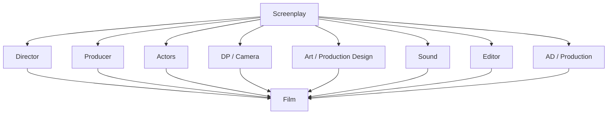
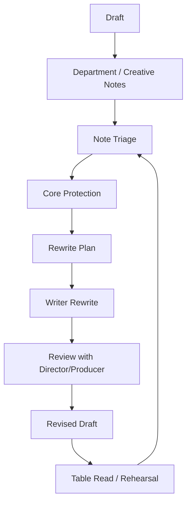

# learn-screenwriting-film-script-part-025.md

# Part 025 — Kolaborasi dengan Sutradara, Produser, Aktor, dan Crew

> Seri: Learn Screenwriting for Film Project  
> Pendekatan: *The First 20 Hours* — Josh Kaufman  
> Fokus bagian ini: memahami screenplay sebagai dokumen kolaboratif yang akan dibaca, ditafsirkan, diuji, dan diwujudkan oleh banyak role kreatif/produksi.  
> Target praktis: mampu berkomunikasi, menerima masukan, mempertahankan core story, dan merevisi naskah bersama tim tanpa menjadi defensif, pasif, atau kehilangan arah.

---

## 0. Posisi Part Ini dalam Roadmap

Pada Part 024 kita membahas **production-aware writing**: bagaimana menulis naskah yang kuat secara dramatik tetapi realistis untuk diproduksi.

Sekarang kita masuk ke tahap yang secara psikologis sering lebih sulit:

```text
Naskah bukan lagi hanya milik penulis.
Naskah menjadi titik temu banyak kepala.
```

Ketika screenplay masuk produksi, ia akan disentuh oleh:

- sutradara,
- produser,
- aktor,
- director of photography,
- production designer/art department,
- sound recordist/sound designer,
- editor,
- assistant director,
- script supervisor,
- wardrobe/makeup,
- composer,
- colorist,
- production manager,
- bahkan location owner dan budget reality.

Setiap orang melihat naskah dari sudut berbeda.

Penulis melihat:

```text
Cerita, karakter, tema, dialog, struktur.
```

Sutradara melihat:

```text
Visi audiovisual, blocking, performance, tone.
```

Produser melihat:

```text
Scope, budget, schedule, market, risk.
```

Aktor melihat:

```text
Objective, subtext, playable action, emotional transition.
```

DP melihat:

```text
Light, space, movement, visual grammar.
```

Art melihat:

```text
World, object, texture, prop, set dressing.
```

Sound melihat:

```text
Dialogue clarity, ambience, off-screen world, sonic motif.
```

Editor melihat:

```text
Scene turn, rhythm, transition, coverage, payoff.
```

Screenwriting untuk film adalah seni menulis blueprint yang cukup kuat untuk menjaga arah, tetapi cukup terbuka untuk diwujudkan oleh kolaborator.

Diagram:



---

## 1. Prinsip Kaufman dalam Part Ini

Dalam pendekatan *The First 20 Hours*, kolaborasi adalah skill yang perlu dipecah menjadi sub-skill kecil.

Sub-skill kolaborasi:

1. Menjelaskan core story.
2. Membedakan core vs fleksibel.
3. Mendengar notes tanpa defensif.
4. Memahami perspektif tiap role.
5. Menerjemahkan masukan menjadi rewrite action.
6. Menjaga continuity perubahan.
7. Menulis versi naskah untuk kebutuhan berbeda.
8. Melakukan script meeting.
9. Menjaga alignment tone/genre/theme.
10. Mengelola konflik kreatif.
11. Bernegosiasi dengan budget/schedule.
12. Memberi aktor playable material.
13. Memberi sutradara ruang interpretasi.
14. Memberi produser scope clarity.
15. Menulis untuk crew tanpa overdirecting.
16. Menjaga versioning dan decision log.

Target praktis:

```text
Mampu masuk ke diskusi naskah dengan collaborator, menjelaskan story core, menerima masukan, memilah mana yang perlu diubah, lalu membuat revisi yang mempertahankan fungsi dramatik.
```

---

## 2. Screenplay sebagai Dokumen Kolaboratif

Screenplay bukan novel yang selesai di tangan pembaca.

Screenplay adalah dokumen antara.

Ia harus cukup spesifik untuk:

- menyampaikan cerita,
- menunjukkan karakter,
- memberi action yang bisa difilmkan,
- memberi tone,
- memberi world,
- memberi rhythm,
- memberi clue produksi.

Tapi ia juga harus cukup terbuka agar:

- sutradara bisa mengarahkan,
- aktor bisa memainkan,
- DP bisa memvisualkan,
- art bisa mendesain,
- editor bisa membentuk,
- sound bisa membangun dunia,
- produser bisa menyesuaikan scope.

Jika screenplay terlalu kabur, semua orang bingung.

Jika screenplay terlalu mengontrol semua detail, kolaborator tidak punya ruang.

Keseimbangan:

```text
Write the dramatic necessity.
Do not micromanage every execution choice.
```

---

## 3. Core vs Flexible

Dalam kolaborasi, Anda harus tahu mana yang core dan mana yang fleksibel.

Core adalah hal yang jika berubah, film berubah identitas.

Flexible adalah hal yang bisa berubah selama fungsi dramatiknya tetap.

Contoh:

```text
Core:
Raka harus memilih membuka kebenaran meski dirinya ikut terseret.

Flexible:
Apakah climax terjadi pagi atau malam, selama pressure dan final image tetap bekerja.
```

```text
Core:
Kunci sebagai object arc yang berpindah dari kontrol Ibu ke ruang terbuka.

Flexible:
Bentuk kunci, warna tali, detail fisiknya.
```

```text
Core:
Dina memaksa Raka meminta, bukan memerintah.

Flexible:
Apakah line finalnya “Mau minta, atau mau nyuruh?” atau gesture lain yang memberi fungsi sama.
```

Template:

```text
Must preserve:
Can change:
Need discussion:
```

Ini sangat penting dalam meeting.

---

## 4. Core Story Brief

Sebelum kolaborasi, buat core story brief 1 halaman.

Isi:

```text
Title:
Format:
Genre:
Tone:
Logline:
Central dramatic question:
Theme question:
Protagonist want:
Protagonist need:
Ending answer:
Opening image:
Final image:
Core object/motif:
Non-negotiables:
Flexible elements:
Production assumptions:
```

Contoh:

```text
Title:
Kunci di Leher Ibu

Genre:
Family mystery drama.

Tone:
Melankolis, restrained, tegang, humor pahit.

CDQ:
Apakah Raka akan membuka kebenaran rumah keluarganya meski itu menghancurkan posisinya sebagai korban?

Theme:
Keluarga tidak bisa diselamatkan dengan mewariskan kebohongan.

Core object:
Kunci.

Non-negotiables:
- Raka awalnya melihat rumah sebagai aset.
- Ibu mengunci kebenaran sebagai bentuk perlindungan.
- Dina menjadi moral mirror.
- Midpoint harus membuat Raka ikut terseret.
- Ending harus menunjukkan ruang/kebenaran terbuka dengan cost.

Flexible:
- Lokasi notaris bisa diganti.
- Pembeli bisa muncul on-screen atau off-screen sampai climax.
- Detail legal bisa disesuaikan.
```

Core brief menjaga alignment.

---

## 5. Collaboration Mindset

Kolaborasi film tidak sama dengan menyerahkan semua keputusan.

Juga tidak sama dengan mempertahankan setiap kata.

Mindset sehat:

```text
Saya menjaga fungsi dramatik.
Saya terbuka pada bentuk eksekusi.
Saya mendengar masalah dengan serius.
Saya tidak mengikuti semua solusi literal.
Saya menghormati expertise role lain.
Saya menjaga naskah sebagai sistem, bukan ego.
```

Mindset buruk:

```text
Semua orang harus mengikuti draft saya persis.
```

Atau sebaliknya:

```text
Siapa pun boleh mengubah apa saja karena saya takut konflik.
```

Kolaborasi sehat membutuhkan backbone dan flexibility.

---

## 6. Role: Penulis

Tanggung jawab penulis:

- menjaga story spine,
- menjaga karakter,
- menjaga theme,
- menjaga struktur,
- menjaga dialog,
- menjaga continuity naskah,
- menerjemahkan notes menjadi revisi,
- mengetahui fungsi scene,
- membuat draft rapi,
- menjaga versioning,
- menjelaskan alasan dramatik,
- menerima masukan.

Penulis bukan:

- diktator semua shot,
- orang yang hanya “punya ide”,
- mesin mengetik produser,
- orang yang harus defensif atas semua line,
- orang yang lepas tangan setelah draft.

Penulis adalah penjaga logika dramatik.

---

## 7. Role: Sutradara

Sutradara bertanggung jawab menerjemahkan naskah menjadi pengalaman audiovisual.

Sutradara memikirkan:

- interpretasi cerita,
- tone,
- performance,
- blocking,
- visual grammar,
- pacing on set,
- shot strategy,
- collaboration dengan DP/art/sound/editor,
- emotional continuity,
- directing actors,
- final film experience.

Sutradara mungkin memberi notes seperti:

```text
Scene ini secara dramatik penting, tapi terlalu verbal. Bisa kita buat lebih visual?
```

```text
Raka seharusnya tidak mengatakan ini; biarkan aktor memainkannya lewat tindakan.
```

```text
Climax di ruang makan lebih kuat daripada di halaman karena ini soal keluarga, bukan publik.
```

Writer perlu mendengar dari perspektif audiovisual.

---

## 8. Writer–Director Relationship

Hubungan penulis dan sutradara adalah salah satu kolaborasi paling penting.

Masalah umum:

- penulis merasa sutradara mengubah terlalu banyak,
- sutradara merasa script terlalu mengunci visual,
- penulis mempertahankan dialog,
- sutradara ingin menghapus dialog,
- tone interpretation berbeda,
- ending ditafsirkan beda,
- karakter dipahami beda.

Solusi:

1. Sepakati core story.
2. Bahas theme dan ending.
3. Bahas tone references.
4. Bahas character arc.
5. Bahas scene function, bukan hanya line.
6. Gunakan language of function.
7. Dokumentasikan keputusan.

Pertanyaan untuk meeting:

```text
Apa yang harus penonton rasakan di scene ini?
Apa yang berubah setelah scene ini?
Apakah dialog ini membawa informasi, tactic, atau subtext?
Apa yang bisa dimainkan aktor tanpa line?
Apa image yang harus bertahan?
```

---

## 9. Jangan Overdirect di Script

Penulis pemula sering menulis:

```text
CAMERA PUSHES IN SLOWLY ON RAKA'S TEARY EYES AS THE LENS FLARES BEAUTIFULLY.
```

Dalam spec/working draft, lebih baik:

```text
Raka melihat tanda tangannya.

Ia menutup map.

Membukanya lagi.

Namanya tetap di sana.
```

Ini memberi kebutuhan dramatik dan visual, tanpa mengatur lensa.

Kapan camera direction boleh?

- jika informasi hanya bisa dipahami lewat framing tertentu,
- jika shot adalah bagian dari gag,
- jika visual reveal butuh timing spesifik,
- jika format/produksi mengizinkan.

Tetap hemat.

---

## 10. Menulis untuk Sutradara Tanpa Mengunci

Tulis:

- action penting,
- object penting,
- power shift,
- silence,
- threshold,
- final image,
- detail yang memengaruhi meaning.

Jangan tulis:

- semua angle,
- semua blocking mikro,
- semua ekspresi wajah,
- semua musik emosional,
- semua interpretation.

Contoh baik:

```text
Ibu melepas kunci dari lehernya.

Raka menahan napas.

Tapi Ibu meletakkannya di telapak tangan Dina.
```

Sutradara punya ruang untuk memutuskan framing, tetapi fungsi jelas.

---

## 11. Role: Produser

Produser memikirkan:

- apakah film bisa dibuat,
- budget,
- schedule,
- lokasi,
- cast,
- crew,
- market,
- audience,
- festival/platform,
- legal,
- risk,
- financing,
- resource,
- delivery.

Produser mungkin memberi notes:

```text
Kita tidak bisa punya 8 lokasi untuk short 10 menit.
```

```text
Scene demo mahal, apakah bisa diganti dengan satu karakter korban?
```

```text
Ending bagus, tapi butuh clarity agar pitch lebih kuat.
```

```text
Karakter pembeli bisa off-screen sampai climax untuk menghemat cast day.
```

Writer harus memahami bahwa produser bukan musuh kreativitas. Produser menjaga film bisa terjadi.

---

## 12. Writer–Producer Relationship

Hubungan sehat:

```text
Producer protects feasibility.
Writer protects dramatic function.
Together they find viable form.
```

Jika produser minta potong scene, jangan hanya berkata:

```text
Tidak bisa, itu penting.
```

Tanya:

```text
Apa constraint-nya?
Budget, lokasi, cast, waktu, izin, sound, atau market?
```

Lalu jawab dengan fungsi:

```text
Fungsi scene ini adalah membuat Raka sadar kasus ini punya korban di luar keluarga. Jika demo terlalu mahal, saya bisa ganti dengan warga tua membawa sertifikat ke rumah.
```

Ini profesional.

---

## 13. Budget Notes as Creative Input

Budget note bukan hanya pembatas.

Contoh note:

```text
Tidak bisa shooting di kantor notaris.
```

Solusi kreatif:

```text
Notaris datang ke rumah untuk open house.
```

Efek dramatik:

- legal pressure masuk ke ruang keluarga,
- contained,
- climax lebih kuat,
- rumah menjadi pusat.

Constraint bisa memperbaiki cerita.

---

## 14. Role: Aktor

Aktor membaca naskah dari dalam karakter.

Aktor butuh tahu:

- apa objective karakter di scene,
- apa yang karakter sembunyikan,
- apa hubungan dengan karakter lain,
- apa emotional transition,
- apa playable action,
- apa subtext,
- apa yang tidak dikatakan,
- kenapa line diucapkan sekarang,
- apa yang berubah setelah scene.

Aktor sering memberi masukan:

```text
Saya tidak tahu kenapa karakter saya tiba-tiba memaafkan.
```

```text
Line ini terlalu menjelaskan perasaan; bisa saya mainkan tanpa mengatakan itu?
```

```text
Apa yang karakter saya inginkan saat diam?
```

Ini masukan penting.

---

## 15. Writing Playable Action

Aktor tidak bisa memainkan konsep abstrak seperti:

```text
Raka merasa konflik batin tentang warisan keluarganya.
```

Aktor bisa memainkan action:

```text
Raka mencoba menandatangani surat baru, tetapi tangannya berhenti di bentuk tanda tangan lama.
```

Playable action punya:

- objective,
- obstacle,
- tactic,
- physical behavior,
- subtext,
- change.

Saat rewrite untuk aktor, ganti emosi abstrak dengan playable behavior.

---

## 16. Actor Objective

Setiap scene harus bisa dijawab:

```text
Karakter saya ingin apa dari siapa?
```

Contoh dinner:

```text
Raka wants:
Kunci dari Ibu.

Ibu wants:
Menjaga ruang kerja tetap tertutup sambil tetap merawat Raka sebagai anak.

Dina wants:
Mengetahui kenapa semua orang berbohong tanpa terlihat butuh mereka.
```

Jika aktor tidak tahu objective, scene terasa kabur.

---

## 17. Subtext untuk Aktor

Subtext adalah bahan bakar aktor.

Dialog:

```text
IBU
Makan dulu.
```

Subtext bisa:

```text
Jangan buka itu.
Aku belum siap.
Aku masih ibumu.
Aku tidak tahu cara menahanmu kecuali memberi makan.
```

Jika naskah terlalu on-the-nose, aktor kehilangan ruang.

Jika naskah terlalu samar tanpa objective, aktor bingung.

Balance:

```text
Clear objective, layered expression.
```

---

## 18. Actor Notes yang Perlu Didengar

Catatan aktor yang bernilai tinggi:

- “Saya tidak tahu objective.”
- “Transisi emosi terlalu cepat.”
- “Line ini tidak sesuai voice.”
- “Saya butuh action untuk memainkan diam.”
- “Scene ini mengatakan hal yang sama dua kali.”
- “Saya rasa karakter saya tahu lebih banyak/lebih sedikit dari yang tertulis.”
- “Kalau saya melakukan ini, saya terlihat seperti karakter lain.”

Jangan abaikan. Aktor menguji script di tubuh dan suara.

---

## 19. Actor Improvisation

Improvisasi bisa berguna, tetapi harus dijaga.

Boleh eksplorasi:

- alternative line,
- gesture,
- silence,
- interruption,
- reaction,
- blocking,
- subtext.

Harus menjaga:

- scene function,
- turn,
- information,
- continuity,
- tone,
- character arc,
- runtime,
- production need.

Rule:

```text
Improv can change expression.
Improv should not accidentally break story logic.
```

Catat improvisasi yang bekerja dan update script jika perlu.

---

## 20. Role: Director of Photography / DP

DP memikirkan:

- cahaya,
- komposisi,
- movement,
- exposure,
- mood visual,
- space,
- lens strategy,
- contrast,
- color,
- coverage,
- visual continuity.

Penulis tidak perlu menulis teknis DP, tetapi bisa membantu dengan:

- visual motif,
- meaningful object,
- clear space,
- time of day yang masuk akal,
- contrast antara lokasi,
- visual state changes,
- action yang bisa difilmkan.

DP mungkin bertanya:

```text
Apa image utama scene ini?
```

Jika penulis tidak tahu, scene mungkin terlalu verbal.

---

## 21. Writing Visual Anchors for DP

Berikan anchor:

- kunci di leher,
- map tertindih piring,
- pintu ruang kerja,
- jendela berdebu,
- sandal tamu,
- jam mati,
- sertifikat lusuh,
- tanda tangan,
- lampu dapur,
- kursi kosong.

Anchor membantu visual grammar.

Contoh:

```text
Raka selalu berada di dekat pintu sampai ia akhirnya duduk.
```

Ini memberi DP/sutradara kemungkinan visual tanpa instruksi kamera.

---

## 22. Light and Time Awareness

Penulis tidak harus mendesain lighting, tetapi time of day memengaruhi produksi dan tone.

Contoh:

```text
Dinner at night:
Intimacy, secrecy, controlled lighting, family ritual.

Morning open house:
Exposure, consequence, truth visible.

Late afternoon arrival:
Melancholy, return, transition.
```

Gunakan waktu sebagai storytelling, bukan random.

---

## 23. Role: Production Designer / Art Department

Production designer/art bertanggung jawab pada dunia fisik:

- set,
- props,
- texture,
- color,
- furniture,
- documents,
- wall detail,
- household objects,
- world history,
- visual continuity.

Penulis membantu dengan detail yang:

- spesifik,
- bermakna,
- tidak terlalu banyak,
- relevan dengan karakter/tema,
- punya payoff.

Buruk:

```text
Rumah tua penuh barang.
```

Lebih berguna:

```text
Foto ayah tidak dipajang, tetapi bekas kotaknya masih membentuk kotak bersih di dinding berdebu.
```

Art department bisa bekerja dari detail ini.

---

## 24. Writing for Art Without Overloading

Tulis detail yang penting.

Jangan menulis inventory panjang:

```text
Ada 28 jenis barang antik, warna dinding, motif taplak, semua buku...
```

Kecuali semua penting.

Lebih baik pilih 3–5 detail:

```text
Kalender lama berhenti di tahun kasus.
Kursi ayah tetap kosong.
Kunci ruang kerja dipakai Ibu sebagai liontin.
Map penjualan Raka terlalu baru untuk rumah itu.
Piring retak tetap dipakai untuk tamu.
```

Detail ini memberi world dan theme.

---

## 25. Role: Sound

Sound team memikirkan:

- dialog clarity,
- room tone,
- ambience,
- noise,
- foley,
- sound design,
- off-screen space,
- sonic motif,
- post-production cleanup,
- microphone feasibility.

Penulis membantu dengan:

- sound motif penting,
- lokasi sound-aware,
- off-screen sound,
- silence,
- notifikasi,
- object sound,
- avoiding unnecessary dialogue in impossible sound location.

Sound note yang berguna:

```text
Kunci berdenting setiap kali Ibu mengangkat sendok.
```

Sound note yang kurang berguna:

```text
Musik sedih membuat scene terasa emosional.
```

---

## 26. Sound as Story Partner

Sound bisa membawa cerita:

- telepon yang diabaikan,
- hujan yang berhenti,
- sendok yang berhenti,
- pintu yang tidak dibuka,
- radio berita,
- suara warga di luar,
- voice note ayah,
- stempel notaris,
- kereta/bus sebagai deadline.

Contoh:

```text
Saat Raka hampir meminta maaf, ponsel pembeli bergetar. Dunia transaksi masuk lagi.
```

Sound bukan ambience random. Sound adalah pressure.

---

## 27. Role: Editor

Editor membentuk rhythm final.

Editor membutuhkan:

- scene turns,
- reaction beats,
- visual transitions,
- sound bridges,
- clear cause-effect,
- coverage possibilities,
- object continuity,
- emotional aftermath,
- clean scene exits.

Penulis membantu dengan scene yang punya:

```text
input → conflict → turn → output
```

Scene tanpa turn sulit diedit.

Editor mungkin memberi masukan:

```text
Scene ini bisa dimulai 1 halaman lebih lambat.
```

```text
Kita butuh reaction Dina sebelum Raka mengambil dokumen.
```

```text
Ending bisa berhenti di kunci, tidak perlu dialog setelahnya.
```

Dengar dengan serius.

---

## 28. Writing for Edit

Penulis bisa menulis:

- button line/action,
- repeated motif with variation,
- transition object,
- sound bridge,
- reaction moment,
- aftermath beat.

Contoh:

```text
Kunci jatuh ke meja.

INT. KANTOR NOTARIS - SIANG

Stempel menghantam kertas.
```

Ini memberi transition.

Atau:

```text
Dina melihat Raka menyembunyikan map.
```

Ini memberi reaction yang nanti mungkin penting di edit.

---

## 29. Role: Assistant Director / AD

AD memikirkan:

- schedule,
- breakdown,
- timing,
- logistics,
- cast availability,
- scene order,
- set discipline,
- safety,
- call sheet.

AD akan melihat naskah sebagai daftar kebutuhan produksi.

Penulis membantu dengan:

- scene headings jelas,
- time of day konsisten,
- lokasi tidak random,
- cast per scene jelas,
- action tidak ambigu,
- special requirements terbaca.

Scene heading yang kacau menyulitkan breakdown.

---

## 30. Role: Script Supervisor

Script supervisor menjaga continuity:

- dialog,
- action,
- props,
- wardrobe,
- eyeline,
- screen direction,
- timing,
- scene coverage,
- continuity antar take.

Penulis membantu dengan continuity logis.

Jika naskah prop-heavy, track:

- kunci di siapa,
- map di mana,
- piring pecah/tidak,
- ponsel siapa,
- dokumen sudah diketahui siapa.

Script supervisor akan menemukan masalah di set jika script tidak jelas.

---

## 31. Role: Wardrobe/Makeup

Wardrobe/makeup memikirkan:

- character identity,
- timeline,
- continuity,
- class/status,
- weather,
- stains,
- injury,
- aging,
- scene order.

Penulis membantu dengan detail penting:

```text
Raka datang dengan sepatu kota yang terlalu bersih untuk halaman rumah.
```

Atau:

```text
Ibu tidak pernah melepas kunci dari lehernya.
```

Tidak perlu mendesain semua pakaian. Tulis yang punya fungsi.

---

## 32. Role: Composer

Composer masuk biasanya belakangan, tetapi penulis bisa membantu jika musik diegetic atau motif penting.

Jangan bergantung pada score untuk menyelamatkan scene.

Jika musik bagian cerita:

- kaset ayah,
- radio lama,
- lagu keluarga,
- piano,
- suara festival,
- ringtone khusus,

tulis sebagai story element.

Composer nanti memperkuat tone, tetapi emotion harus sudah ada di scene.

---

## 33. Role: Colorist / Post

Colorist dan post bukan fokus naskah, tetapi tone visual dipengaruhi oleh:

- time of day,
- location,
- color detail,
- motif,
- visual contrast,
- world texture.

Penulis bisa memberi palette lewat detail:

```text
Rumah didominasi kayu tua, putih pudar, dan karat.
Map Raka satu-satunya benda yang terlalu bersih.
```

Ini membantu visual direction, tetapi jangan overcontrol.

---

## 34. Script Meeting

Script meeting adalah diskusi untuk membahas naskah.

Jenis meeting:

1. Story meeting.
2. Rewrite meeting.
3. Director-writer meeting.
4. Producer feasibility meeting.
5. Actor rehearsal meeting.
6. Department heads meeting.
7. Pre-production script meeting.
8. Post-table-read meeting.

Setiap meeting harus punya tujuan.

Jangan masuk meeting tanpa agenda.

---

## 35. Script Meeting Agenda

Template:

```text
# Script Meeting Agenda

Project:
Draft:
Date:
Participants:

## Goal
Apa keputusan yang harus keluar dari meeting?

## Topics
1. Core story alignment
2. Character/arc issue
3. Structure/scene issue
4. Production constraints
5. Open questions
6. Decisions
7. Action items

## Materials
- Draft version
- Treatment/outline
- Scene list
- Production scope audit
- Feedback notes

## Output
- Decisions
- Rewrite tasks
- Owner
- Deadline
```

Meeting tanpa output akan mengulang diskusi yang sama.

---

## 36. Language of Function

Saat berdiskusi, gunakan bahasa fungsi.

Daripada:

```text
Saya suka scene ini.
```

Katakan:

```text
Scene ini membuat Raka kehilangan kontrol atas kunci dan memindahkan power ke Dina.
```

Daripada:

```text
Dialog ini bagus.
```

Katakan:

```text
Line ini membuat Dina menantang Raka untuk meminta, bukan memerintah.
```

Bahasa fungsi membuat diskusi objektif.

---

## 37. Function-Based Negotiation

Jika collaborator ingin mengubah scene, tanyakan:

```text
Fungsi scene ini apa?
Apakah versi baru mempertahankan fungsi itu?
Apakah versi baru menambah fungsi?
Apakah ada fungsi yang hilang?
```

Contoh:

Sutradara ingin memindahkan scene dinner ke teras.

Pertanyaan:

```text
Apakah teras masih memberi ritual makan?
Apakah kunci masih terlihat?
Apakah public/private boundary jadi lebih kuat?
Apakah intimacy keluarga berkurang?
```

Jika fungsi tetap atau lebih kuat, change bisa diterima.

---

## 38. Decision Log

Catat keputusan.

Template:

```text
Decision:
Reason:
Affected scenes:
Risks:
Owner:
Deadline:
```

Contoh:

```text
Decision:
Pembeli tidak muncul sampai climax; pressure via phone/photo.

Reason:
Mengurangi cast days dan membuat threat lebih intimate/off-screen.

Affected scenes:
S03 phone, S12 notary exit, S26 Act 2B threat, S40 climax.

Risks:
Pembeli kurang terasa nyata.

Mitigation:
Seed specific voice/text and one object/photo evidence earlier.
```

Decision log mencegah lupa.

---

## 39. Version Control in Collaboration

Gunakan versi jelas:

```text
draft-001
draft-002
draft-003-director-notes
draft-004-producer-pass
draft-005-table-read
```

Jangan punya file:

```text
final
final_new
final_bener
final_fix_latest_revisi_banget
```

Gunakan tanggal dan changelog.

Template changelog:

```text
Draft 003 changes:
- Cut demo scene.
- Added warga tua teras.
- Moved ownership reveal to notary.
- Strengthened Dina key scene.
- Simplified climax to ruang makan.
```

---

## 40. Handling Conflicting Notes

Sutradara:

```text
Kurangi dialog.
```

Produser:

```text
Tambah clarity agar audience paham.
```

Aktor:

```text
Saya butuh tahu motivasi.
```

Solusi bukan pilih satu mentah-mentah.

Diagnosis:

```text
Scene terlalu verbal tetapi clarity/motivation memang kurang.
```

Rewrite:

- kurangi penjelasan langsung,
- tambah action/object,
- beri actor playable objective,
- tambahkan satu line spesifik, bukan monolog.

Kolaborasi sering mencari solusi ketiga.

---

## 41. Creative Conflict

Konflik kreatif normal.

Sumber konflik:

- tone berbeda,
- ending berbeda,
- budget,
- actor interpretation,
- character morality,
- genre expectation,
- pacing,
- dialogue,
- production constraint,
- ego.

Cara menangani:

1. Kembali ke core story.
2. Definisikan masalah, bukan posisi.
3. Dengarkan alasan.
4. Tawarkan alternatif.
5. Uji dengan function.
6. Jika perlu, tulis dua versi scene.
7. Putuskan berdasarkan film, bukan ego.

---

## 42. Two-Version Strategy

Jika ada debat, tulis dua versi.

Contoh:

```text
Version A:
Raka mengatakan maaf secara eksplisit.

Version B:
Raka tidak mengatakan maaf; ia meletakkan dokumen dan duduk.

Test:
Table read / actor read / director discussion.
```

Kadang melihat versi tertulis menyelesaikan debat.

---

## 43. Protecting the Writer’s Voice

Kolaborasi bukan berarti semua voice hilang.

Cara menjaga voice:

- pahami tone palette,
- simpan core images,
- jaga character voice,
- jangan biarkan notes membuat semua dialog generic,
- pertahankan motif yang bekerja,
- dokumentasikan do-not-change list.

Namun voice bukan alasan menolak perbaikan.

```text
Voice should survive improvement.
Voice should not hide weakness.
```

---

## 44. Rewriting Under Constraint

Dalam produksi, rewrite sering dibatasi:

- lokasi hilang,
- aktor tidak tersedia,
- budget turun,
- cuaca berubah,
- durasi harus dipotong,
- scene tidak bisa di-shoot,
- jadwal mepet.

Writer harus bisa cepat bertanya:

```text
Apa fungsi scene yang hilang?
Bagaimana fungsi itu dipindah?
Apa object/line/action yang harus tetap?
Apa yang bisa dipotong?
Apa efek domino?
```

Ini skill praktis penting.

---

## 45. On-Set Rewrites

On-set rewrite bisa terjadi.

Penyebab:

- line tidak bekerja,
- lokasi berbeda,
- actor blocking sulit,
- waktu kurang,
- sound issue,
- prop hilang,
- scene harus dipotong,
- continuity berubah.

Prinsip on-set rewrite:

1. Jangan panik.
2. Identifikasi scene function.
3. Pertahankan turn.
4. Pertahankan information needed.
5. Potong yang tidak wajib.
6. Beri line playable.
7. Jaga continuity ke scene berikut.
8. Catat perubahan.

Template cepat:

```text
Scene function:
Must happen:
Can cut:
New version:
Continuity impact:
```

---

## 46. Example On-Set Rewrite

Original:

```text
Warung scene dengan 5 warga.
```

Problem:

```text
Extras tidak datang, lokasi bising.
```

Function:

```text
Raka sadar kasus ayah punya public memory.
```

New version:

```text
INT. RUMAH - TERAS - SIANG

Pemilik warung datang sendirian mengembalikan papan DIJUAL yang jatuh.

Di balik papan, ada tulisan lama yang pudar: RUMAH SEGEL.

Ia melihat Raka.

PEMILIK WARUNG
Dulu papan begini juga dipasang. Bedanya, yang baca lebih banyak.
```

Fungsi tetap, production problem solved.

---

## 47. Rehearsal Rewrite

Saat rehearsal, aktor/sutradara bisa menemukan:

- line tidak natural,
- blocking butuh perubahan,
- emotional transition kurang,
- scene terlalu panjang,
- action tidak playable.

Rehearsal rewrite sebaiknya dilakukan sebelum shooting jika memungkinkan.

Prinsip:

```text
Rehearsal is not just performance practice.
It is script testing with bodies.
```

Catat perubahan rehearsal dan update draft.

---

## 48. Improvisation Capture

Jika aktor improvisasi line bagus:

1. Catat.
2. Cek apakah sesuai tone.
3. Cek apakah informasi tetap benar.
4. Cek continuity.
5. Jika dipakai, masukkan ke revised pages.

Jangan hanya mengandalkan ingatan.

---

## 49. Rehearsal Questions for Actors

Tanya:

```text
Apa yang karaktermu mau di scene ini?
Apa yang dia sembunyikan?
Di line mana kamu merasa terlalu menjelaskan?
Di mana emosi berubah terlalu cepat?
Apa action yang membuat line ini playable?
Apa yang kamu butuh dari lawan main?
```

Jawaban bisa memperkuat scene.

---

## 50. Collaboration with Editor Before Shooting

Jika memungkinkan, editor membaca naskah sebelum shooting.

Editor bisa memberi notes:

- scene terlalu panjang,
- cut point,
- missing reaction,
- transition,
- sequence clarity,
- continuity,
- coverage need,
- ending rhythm.

Editor perspective sering menyelamatkan post-production.

Contoh note:

```text
Kita butuh satu beat Dina melihat Raka sebelum ia memberi salinan, agar edit punya emotional bridge.
```

Writer bisa menambahkan beat kecil.

---

## 51. Collaboration with Sound Before Shooting

Sound recordist/designer bisa memberi notes:

- lokasi dialog bising,
- hujan mengganggu,
- phone dialogue harus planned,
- off-screen sound bisa direkam,
- prop sound penting,
- silence matters,
- room tone.

Jika sound motif penting, diskusikan sebelum shooting.

Contoh:

```text
Kunci berdenting harus konsisten; prop jangan terlalu halus sampai tidak terdengar.
```

---

## 52. Collaboration with Art Before Shooting

Art department butuh waktu untuk props/documents.

Jika dokumen penting:

- tulis detail,
- beri nama/tanggal,
- tentukan apa yang harus close-up,
- minta clearance/avoid real brands,
- duplicate jika rusak.

Jika kunci penting:

- desain,
- chain,
- duplicate,
- aging,
- final placement.

Writer membantu jika tahu object arc.

---

## 53. Collaboration with DP/Sutradara on Visual Motif

Diskusikan motif:

```text
Kunci
Map
Pintu
Piring
Sepatu
Jam mati
```

Pertanyaan:

```text
Motif mana paling penting?
Bagaimana ia berubah?
Apa final image?
Apa yang harus terlihat jelas?
```

Jangan semua motif diperlakukan sama. Pilih yang utama.

---

## 54. Script Handoff

Script handoff adalah saat penulis menyerahkan draft ke tim untuk tahap berikutnya.

Paket ideal:

1. Script PDF.
2. Logline.
3. Synopsis/treatment.
4. Character notes.
5. Production scope audit.
6. Hero props tracker.
7. Scene list.
8. Core story brief.
9. Open questions.
10. Changelog.

Untuk short kecil, paket bisa lebih ringkas. Tetapi minimal:

```text
script + logline + core notes + props/location notes
```

---

## 55. Writer’s Notes Document

Writer’s notes membantu tim memahami tanpa membuat script penuh penjelasan.

Isi:

```text
Theme:
Tone:
Character notes:
Key objects:
World rules:
Important subtext:
Production assumptions:
Do-not-change core:
Open questions:
```

Ini bukan untuk menggantikan screenplay. Ini supplementary.

---

## 56. Character Notes for Actors

Template:

```text
Character:
Public mask:
Private wound:
Want:
Need:
Fear:
Relationship to other characters:
What they never say:
Key scene:
Change by end:
Voice:
Physical behavior:
```

Contoh:

```text
Raka:
Public mask:
Professional, controlled, transactional.

Private wound:
Takut rumah membuktikan ia bukan korban bersih.

Want:
Menjual rumah.

Need:
Mengambil accountability.

Fear:
Jika meminta bantuan, ia kehilangan kontrol dan harus mengakui butuh keluarga.

What he never says:
Aku takut pulang karena aku takut ternyata rumah ini benar tentangku.
```

Aktor bisa menggunakan ini.

---

## 57. Director’s Story Notes

Untuk sutradara, ringkas:

```text
What must audience feel by end:
Opening/final contrast:
Visual motifs:
Tone dangers:
Scene that defines film:
Scene that can be interpreted flexibly:
```

Contoh:

```text
Tone danger:
Jangan terlalu melodramatic. Emosi keluar lewat ritual rumah dan object, bukan pidato.
```

Ini membantu alignment.

---

## 58. Producer’s Scope Notes

Untuk produser:

```text
Primary location:
Secondary locations:
Cast:
Hero props:
High-risk scenes:
Simplification options:
Must keep:
Can cut if needed:
```

Penulis yang memberi ini menunjukkan profesionalisme.

---

## 59. Department-Aware Script Notes

Jangan memberi semua department catatan panjang yang sama. Sesuaikan.

Aktor butuh character notes.  
Art butuh props/world notes.  
Sound butuh motif/noise notes.  
Produser butuh scope/risk notes.  
Sutradara butuh story/tone/visual notes.

Ini seperti API berbeda untuk client berbeda.

---

## 60. Collaboration as API Design

Untuk software engineer, anggap naskah sebagai API.

Screenplay menyediakan interface:

```text
Scene heading
Action
Dialogue
Character
Object
Tone
Scene function
```

Collaborator mengimplementasikan:

```text
performance
visual
sound
production
edit
design
```

Jika interface ambigu, implementasi kacau.

Jika interface terlalu rigid, implementasi tidak fleksibel.

Good screenplay API:

- clear intent,
- clear constraints,
- minimal unnecessary implementation detail,
- extensible,
- consistent naming,
- versioned,
- documented where needed.

---

## 61. Communication Anti-Pattern

### 61.1 “Pokoknya Begitu”

Tidak menjelaskan fungsi.

Fix:

```text
Jelaskan dramatic purpose.
```

### 61.2 “Terserah Semua”

Tidak menjaga core.

Fix:

```text
Tentukan non-negotiables.
```

### 61.3 “Sutradara Pasti Ngerti”

Asumsi tanpa alignment.

Fix:

```text
Core story brief + meeting.
```

### 61.4 “Produser Musuh Seni”

Melihat feasibility sebagai ancaman.

Fix:

```text
Gunakan constraint untuk mencari bentuk kuat.
```

### 61.5 “Aktor Cuma Baca Dialog”

Mengabaikan performance insight.

Fix:

```text
Tanyakan objective/subtext.
```

### 61.6 “Semua Notes Harus Diikuti”

Naskah kehilangan identitas.

Fix:

```text
Triage dan root cause.
```

---

## 62. Collaboration Anti-Pattern in Script

### 62.1 Overwritten Action

Script penuh instruksi mikro.

Problem:

- sutradara/aktor tidak punya ruang,
- pacing baca lambat,
- terasa novelistik.

Fix:

```text
Tulis action yang mengubah scene.
```

### 62.2 Underwritten Scene

Script terlalu kosong.

Problem:

- collaborator tidak tahu tone/fungsi,
- scene terbaca generic.

Fix:

```text
Tambahkan specific object, action, conflict, tone clue.
```

### 62.3 Unclear Scene Function

Semua department bingung.

Fix:

```text
Pastikan scene punya objective/turn/output.
```

### 62.4 Dialogue as Only Story Carrier

Aktor terbebani exposition.

Fix:

```text
Object/action/visual/sound.
```

### 62.5 No Production Notes for Critical Props

Hero prop tidak jelas.

Fix:

```text
Hero props tracker.
```

---

## 63. Handling Notes from Authority

Produser/sutradara mungkin punya posisi lebih kuat.

Jika note terasa salah, jangan langsung menolak secara emosional.

Gunakan:

```text
Saya paham constraint/arahnya. Fungsi scene ini adalah X. Kalau kita ubah ke Y, fungsi Z hilang. Saya usulkan alternatif A yang menjaga fungsi X tetapi memenuhi constraint.
```

Contoh:

```text
Saya paham kita perlu mengurangi lokasi. Fungsi notaris adalah menunjukkan bahwa Raka tidak punya leverage legal. Jika kantor notaris dipotong, kita bisa membawa notaris ke rumah saat open house, sehingga pressure legal masuk ke ruang keluarga.
```

Ini constructive resistance.

---

## 64. When to Push Back

Push back jika perubahan:

- menghancurkan central dramatic question,
- membuat protagonist pasif,
- menghapus final choice,
- merusak theme,
- membuat ending tidak earned,
- membuat karakter tidak konsisten,
- menghapus setup/payoff penting,
- mengganti genre promise tanpa kesepakatan.

Tapi push back dengan fungsi, bukan ego.

```text
Jika Raka tidak membuka dokumen sendiri, arc accountability tidak terbayar. Bisa kita cari cara lebih visual/pendek, tetapi final action harus tetap dia lakukan.
```

---

## 65. When to Let Go

Let go jika perubahan:

- tidak mengubah core,
- memberi production benefit besar,
- memberi performance lebih kuat,
- membuat scene lebih visual,
- memperjelas motivation,
- mengurangi exposition,
- menjaga function walau line berubah,
- meningkatkan tone,
- mengurangi risk.

Contoh:

```text
Aktor mengubah line Dina tetapi fungsi challenge tetap: Raka harus meminta, bukan memerintah.
```

Let it go.

---

## 66. Table Read with Collaborators

Setelah draft mulai matang, lakukan table read dengan tim.

Tujuan:

- align tone,
- test dialogue,
- hear actor voices,
- find production issues,
- test pacing,
- see if departments understand story.

Setelah read, minta feedback per role:

```text
Director:
Apa scene paling visual dan paling verbal?

Actor:
Di mana objective tidak jelas?

Producer:
Scene mana high-cost low-value?

Sound:
Scene mana risk sound?

Art:
Props/world detail mana perlu clarity?

Editor:
Di mana rhythm turun?
```

---

## 67. Collaborative Rewrite Workflow

Workflow:



Jangan rewrite semua notes secara acak. Tetap triage.

---

## 68. Collaborative Rewrite Plan

Template:

```text
# Collaborative Rewrite Plan

Draft:
Meeting date:
Participants:

## Agreed Core
1.
2.
3.

## Major Notes
1.
2.
3.

## Decisions
1.
2.
3.

## Open Questions
1.
2.
3.

## Rewrite Tasks
Task:
Reason:
Owner:
Affected scenes:
Deadline:
Acceptance criteria:

## Risks
1.
2.

## Next Review
Date:
```

---

## 69. Scene Function Sheet for Team

Untuk scene penting, buat function sheet.

```text
Scene:
What happens:
Why it exists:
Character objective:
Scene turn:
Information revealed:
Object movement:
Tone:
Production concerns:
```

Ini membantu semua role.

Contoh:

```text
Scene:
Dinner key transfer.

Why it exists:
Memindahkan power dari Ibu ke Dina dan memaksa Raka menghadapi trust, bukan hanya dokumen.

Scene turn:
Kunci tidak diberikan ke Raka, tetapi ke Dina.

Object movement:
Key: Ibu's neck → Dina's hand.

Tone:
Restrained family tension with bitter humor.
```

---

## 70. Rehearsal Draft vs Shooting Draft

Rehearsal draft:

- cukup rapi untuk dibaca,
- masih bisa berubah,
- dialog bisa diuji,
- notes terbuka.

Shooting draft:

- lebih locked,
- scene numbers jika perlu,
- production breakdown,
- changes controlled,
- revisions tracked.

Jangan memperlakukan rehearsal draft seperti final. Jangan memperlakukan shooting draft seperti bebas berubah tanpa komunikasi.

---

## 71. Locked Pages and Revisions

Dalam produksi formal, perubahan script bisa memakai colored pages/revision tracking.

Untuk project kecil, minimal:

- version number,
- date,
- changelog,
- highlight changed scenes,
- notify affected team.

Jika dialog berubah setelah aktor hafal, beri tahu.

Jika prop berubah, beri tahu art.

Jika lokasi berubah, beri tahu producer/AD.

---

## 72. Communicating Script Changes

Template:

```text
Draft update v004:

Changed:
- Scene 08 notary moved to house.
- Scene 12 warung cut.
- Added warga tua in Scene 18.
- Dinner scene dialogue compressed.

Impact:
- Art: need sertifikat prop earlier.
- Actor Dina: new line in Scene 05.
- Sound: phone buzz motif appears Scene 03/09/18.
- AD: location count reduced by 1.

Please use v004 dated ...
```

Ini mengurangi chaos.

---

## 73. Collaboration and Continuity

Setiap perubahan harus dicek continuity.

Jika scene warung dipotong, apakah:

- public shame masih setup?
- warga tua masih introduced?
- Raka tahu social stakes?
- final climax masih earned?

Update:

- script,
- outline,
- prop tracker,
- knowledge matrix,
- schedule notes.

Kolaborasi sering merusak continuity jika tidak disiplin.

---

## 74. Knowledge Matrix for Team

Untuk mystery/drama, buat matrix.

```text
Character | Knows key matters | Knows Raka signature | Knows buyer threat | Knows Dina has copy
Raka      | yes               | midpoint             | yes                | no until climax
Ibu       | yes               | yes                  | partly             | no
Dina      | yes               | after midpoint       | later              | yes
Audience  | yes               | midpoint             | act 2              | late reveal
```

Aktor/sutradara perlu tahu who-knows-what agar performance benar.

---

## 75. Collaboration with Non-Professional Friends

Jika project kecil, kolaborator mungkin teman.

Tetap gunakan prinsip profesional sederhana:

- jelas role,
- jelas schedule,
- jelas draft version,
- jelas siapa memutuskan,
- jelas feedback focus,
- jelas boundaries.

Teman bisa sakit hati jika tidak ada struktur.

Contoh:

```text
Aku butuh kamu baca sebagai aktor Dina. Fokus pada objective dan dialog Dina, bukan struktur seluruh film dulu.
```

Ini membantu.

---

## 76. Collaboration Boundaries

Tentukan:

- siapa final decision maker,
- apakah aktor boleh improv,
- apakah produser bisa cut scene,
- apakah sutradara bisa ubah ending,
- kapan perubahan harus disetujui,
- bagaimana credit ditentukan,
- bagaimana file dibagikan,
- bagaimana feedback dikirim.

Untuk project serius, boundaries penting.

---

## 77. Credit Awareness

Jika kolaborator memberi masukan besar, credit bisa menjadi sensitif.

Catat kontribusi.

Perbedaan:

- feedback note,
- script edit,
- co-writing,
- story by,
- dialogue polish,
- director adaptation.

Jangan bahas credit sembarangan di akhir. Untuk project profesional, sepakati lebih awal.

Untuk belajar, minimal jujur dan rapi.

---

## 78. Writer in Pre-Production

Di pre-production, writer bisa membantu:

- revisi final,
- clarify scene function,
- adjust lokasi,
- rewrite line untuk aktor,
- simplify production,
- update prop details,
- support rehearsal,
- answer story questions.

Namun writer juga harus menghormati workflow sutradara/produser.

Jangan hadir di set/prep hanya untuk mengontrol semua.

---

## 79. Writer on Set

Jika penulis hadir di set:

Do:

- bantu jika diminta,
- jaga function scene,
- tawarkan solusi cepat,
- catat perubahan,
- hormati sutradara,
- jangan memberi arahan langsung ke aktor kecuali diminta,
- jangan mengganggu department.

Don't:

- mengoreksi setiap line,
- berdebat di depan crew,
- memberi direction paralel,
- panik saat line berubah,
- mengganggu schedule.

Set adalah tempat eksekusi, bukan seminar naskah panjang.

---

## 80. Writer in Post-Production

Di post, writer bisa membantu:

- melihat rough cut,
- memberi story notes,
- melihat clarity,
- mengevaluasi pacing,
- mengecek ending,
- memberi ide VO/ADR jika perlu,
- membantu pickup line,
- menjaga theme.

Namun film di edit bisa berubah.

Writer harus memahami:

```text
Cut is another rewrite.
```

Editor/sutradara mungkin menemukan versi yang lebih baik dari halaman.

---

## 81. Cut as Rewrite

Editing bisa memotong:

- dialog,
- scene,
- subplot,
- transition,
- exposition.

Jika scene dipotong tetapi fungsi hilang, cari cara lain:

- insert,
- reaction shot,
- ADR,
- object close-up,
- reorder,
- sound cue,
- text message,
- line in another scene.

Screenwriting mindset tetap berguna di post.

---

## 82. ADR / Pickup Writing

Kadang butuh line tambahan setelah shooting.

ADR/pickup line harus:

- natural,
- tidak terlalu obvious,
- sesuai character voice,
- memperbaiki clarity,
- tidak menjadi exposition patch buruk.

Contoh buruk:

```text
RAKA (V.O.)
Aku baru sadar bahwa rumah ini bukan sekadar aset, melainkan simbol kebohongan keluarga kami.
```

Lebih baik:

```text
DINA (O.S.)
Map itu masih Kakak bawa?
```

Jika ditempatkan tepat, satu line bisa memperjelas object/intent.

---

## 83. Collaboration Failure Modes

### 83.1 Everyone Writes Different Film

Tidak ada core alignment.

Fix:

```text
Core story brief.
```

### 83.2 Producer Cuts Function

Scene dipotong karena budget, fungsi hilang.

Fix:

```text
Function-based replacement.
```

### 83.3 Director Changes Tone

Tone bergeser tanpa disadari.

Fix:

```text
Tone references + tone danger notes.
```

### 83.4 Actor Improvises Plot Hole

Line bagus tapi merusak info flow.

Fix:

```text
Check continuity before locking.
```

### 83.5 Writer Overcontrols

Kolaborator kehilangan ruang.

Fix:

```text
Write necessity, not every execution.
```

### 83.6 No Version Discipline

Semua pakai draft berbeda.

Fix:

```text
Version naming + changelog.
```

---

## 84. Collaboration Checklist

Sebelum meeting:

- [ ] Draft version jelas.
- [ ] Agenda jelas.
- [ ] Core story brief siap.
- [ ] Questions siap.
- [ ] Production constraints diketahui.
- [ ] Feedback notes dikumpulkan.
- [ ] Anda tahu must preserve/flexible.

Saat meeting:

- [ ] Bahas function.
- [ ] Catat decisions.
- [ ] Catat open questions.
- [ ] Jangan defensif.
- [ ] Jangan setuju semua tanpa pikir.
- [ ] Tentukan next action.

Setelah meeting:

- [ ] Buat rewrite plan.
- [ ] Update version.
- [ ] Kirim changelog.
- [ ] Cek continuity.
- [ ] Konfirmasi keputusan penting.

---

## 85. Department Questions Cheat Sheet

### Untuk Sutradara

```text
Apa tone utama?
Apa image utama tiap sequence?
Scene mana terlalu verbal?
Apa final image yang harus kuat?
```

### Untuk Produser

```text
Scene mana paling berisiko?
Apa constraint utama?
Apa yang harus disederhanakan?
Apa yang masih feasible?
```

### Untuk Aktor

```text
Objective jelas?
Line mana tidak playable?
Emotional transition masuk akal?
Apa yang karakter sembunyikan?
```

### Untuk DP

```text
Apa visual anchor?
Lokasi mana paling menarik?
Apa contrast visual antar scene?
Apa yang perlu terlihat jelas?
```

### Untuk Art

```text
Hero props apa?
World detail apa yang penting?
Dokumen/objects apa perlu dibuat?
Apa final state prop?
```

### Untuk Sound

```text
Lokasi sound risk?
Sound motif apa?
Off-screen world apa?
Dialog mana sulit direkam?
```

### Untuk Editor

```text
Scene turn jelas?
Cut point ada?
Reaction beat cukup?
Sequence rhythm bekerja?
```

---

## 86. Exercise 1 — Core vs Flexible Map

Ambil project Anda.

Isi:

```text
Must preserve:
1.
2.
3.

Can change:
1.
2.
3.

Need discussion:
1.
2.
3.
```

Tujuan:

```text
Mencegah defensif terhadap hal fleksibel dan pasif terhadap hal core.
```

---

## 87. Exercise 2 — Role-Based Notes

Ambil satu scene.

Tulis bagaimana 5 role melihat scene itu:

```text
Writer:
Director:
Actor:
Producer:
Sound:
Art:
Editor:
```

Contoh dinner scene:

```text
Writer:
Power shift key to Dina.

Director:
Blocking from standing to sitting.

Actor:
Raka objective changes from control to request.

Producer:
One location, food continuity, key prop.

Sound:
Key ding, cutlery, phone buzz.

Art:
Map, plate, key, old dining room.

Editor:
Button line: "Mau minta, atau mau nyuruh?"
```

---

## 88. Exercise 3 — Function-Based Rewrite

Ambil note:

```text
Scene terlalu mahal.
```

Isi:

```text
Scene:
Function:
What must stay:
What can change:
Alternative 1:
Alternative 2:
Recommended:
```

---

## 89. Exercise 4 — Script Meeting Agenda

Buat agenda script meeting 45 menit.

Harus punya:

- goal,
- topics,
- questions,
- decisions needed,
- output.

---

## 90. Exercise 5 — Actor Objective Sheet

Pilih satu karakter.

Isi:

```text
Character:
Scene:
Objective:
Obstacle:
Tactic:
Subtext:
What changes:
Line/action that proves change:
```

Lakukan untuk 5 scene.

---

## 91. Exercise 6 — Department Handoff Notes

Buat handoff notes untuk:

1. Director.
2. Producer.
3. Actor.
4. Art.
5. Sound.

Maksimal 1 halaman total.

Tujuan:

```text
Melatih komunikasi berbeda untuk audience berbeda.
```

---

## 92. Exercise 7 — Decision Log Practice

Ambil 3 keputusan rewrite.

Isi:

```text
Decision:
Reason:
Affected scenes:
Risk:
Mitigation:
```

---

## 93. Exercise 8 — Two-Version Scene

Pilih satu konflik kreatif.

Tulis dua versi scene:

- versi writer original,
- versi berdasarkan note collaborator.

Bandingkan:

```text
Which preserves function better?
Which is more producible?
Which gives actor more playable action?
Which has stronger final beat?
```

---

## 94. Practice Plan 120 Menit

| Durasi | Aktivitas | Output |
|---:|---|---|
| 15 menit | Buat core story brief | 1-page brief |
| 15 menit | Buat core vs flexible map | Decision guardrail |
| 20 menit | Pilih 3 scene dan tulis function sheet | Scene function |
| 20 menit | Buat role-based notes untuk 1 scene | Collaboration view |
| 15 menit | Buat meeting agenda | Agenda |
| 20 menit | Simulasikan 3 notes dan triage | Note/action |
| 15 menit | Buat collaborative rewrite plan | Rewrite tasks |

Output:

```text
Collaboration package siap dipakai.
```

---

## 95. Template: Core Story Brief

```text
# Core Story Brief

Title:
Format:
Genre:
Tone:
Logline:
Central dramatic question:
Theme question:
Protagonist:
Want:
Need:
Lie/flaw:
Main opposition:
Opening image:
Final image:
Core object/motif:
Ending answer:

## Must Preserve
1.
2.
3.

## Flexible
1.
2.
3.

## Production Assumptions
1.
2.
3.

## Tone Dangers
1.
2.
3.
```

---

## 96. Template: Scene Function Sheet

```text
# Scene Function Sheet

Scene:
Pages:
Location:
Characters:

## Story Function
...

## Character Function
...

## Scene Objective
Character A wants:
Character B wants:

## Opposition
...

## Turn
...

## Output State
...

## Object / Visual
...

## Sound
...

## Tone
...

## Production Concern
...

## Can Change
...

## Must Preserve
...
```

---

## 97. Template: Collaboration Notes Triage

```text
# Collaboration Notes Triage

Note:
Source role:
Category:
Problem identified:
Suggested solution:
Underlying function:
Do we agree with problem?:
Do we agree with solution?:
Alternative:
Decision:
Affected scenes:
```

---

## 98. Template: Decision Log

```text
# Decision Log

Decision ID:
Date:
Decision:
Reason:
Who agreed:
Affected scenes:
Risks:
Mitigation:
Status:
```

---

## 99. Template: Draft Changelog

```text
# Draft Changelog

Project:
New draft:
Previous draft:
Date:

## Major Changes
1.
2.
3.

## Scene Changes
Added:
Cut:
Moved:
Rewritten:

## Character Changes
...

## Production Changes
...

## Department Notes
Director:
Producer:
Actors:
Art:
Sound:
Editor:

## Open Questions
1.
2.
3.
```

---

## 100. Template: Department Handoff

```text
# Department Handoff Notes

Project:
Draft:
Date:

## Director
Core tone:
Key images:
Scene concerns:

## Producer
Locations:
Cast:
High-risk scenes:
Simplification options:

## Actors
Character objectives:
Subtext notes:
Scenes needing rehearsal:

## Art
Hero props:
World details:
Documents/screens:

## Sound
Sound motifs:
Risk locations:
Off-screen sound:

## Editor
Scene turns:
Transitions:
Reaction beats:
```

---

## 101. Mini Assignment Sebelum Part 026

Pilih salah satu:

### Opsi A — Core Story Brief

Buat core story brief 1 halaman untuk project Anda.

### Opsi B — Scene Function Sheet

Pilih 3 scene dan isi scene function sheet.

### Opsi C — Collaboration Simulation

Ambil 5 notes dari role berbeda:
- sutradara,
- produser,
- aktor,
- sound,
- editor.

Lalu triage menjadi rewrite action.

### Opsi D — Handoff Package

Buat paket handoff kecil:
- script version,
- logline,
- core notes,
- hero props,
- production concerns,
- open questions.

---

## 102. Output yang Harus Dibawa ke Part Berikutnya

Part berikutnya adalah:

> **Part 026 — Tooling dan Workflow untuk Software Engineer**

Sebelum lanjut, Anda sebaiknya punya:

1. Core story brief.
2. Core vs flexible map.
3. Scene function sheets.
4. Decision log.
5. Collaboration notes triage.
6. Draft changelog.
7. Department handoff notes.
8. Role-specific questions.
9. Awareness tentang siapa butuh informasi apa.
10. Versi draft yang terorganisir.

Part 026 akan membahas tooling dan workflow yang cocok untuk software engineer: folder structure, versioning, markdown/fountain, git, issue tracker, scene database, template automation, dan AI-assisted workflow tanpa kehilangan taste kreatif.

---

## 103. Ringkasan Part Ini

Kolaborasi adalah inti filmmaking.

Hal paling penting:

1. Screenplay adalah dokumen kolaboratif.
2. Penulis menjaga story function, bukan mengontrol semua eksekusi.
3. Sutradara menerjemahkan naskah menjadi pengalaman audiovisual.
4. Produser menjaga feasibility.
5. Aktor menguji objective, subtext, dan playable action.
6. DP, art, sound, editor, AD, script supervisor, wardrobe, composer, dan post melihat naskah dari kebutuhan berbeda.
7. Penulis harus tahu core vs flexible.
8. Gunakan bahasa fungsi dalam meeting.
9. Catat keputusan dan versioning.
10. Jangan defensif terhadap notes, tetapi jangan kehilangan core.
11. Konflik kreatif diselesaikan dengan function-based negotiation.
12. Rehearsal, table read, dan on-set reality bisa memicu rewrite.
13. Setiap perubahan harus dicek continuity dan dependency.
14. Handoff notes membuat kolaborasi lebih rapi.
15. Kolaborasi sehat membutuhkan backbone dan flexibility.

Formula inti:

```text
Core Story + Role Awareness + Function-Based Communication + Version Discipline = Healthy Film Collaboration
```

Jika Part 024 membuat Anda sadar realitas produksi, Part 025 membuat Anda sadar realitas manusia: film lahir dari banyak interpretasi yang harus diarahkan oleh story core yang kuat.

---

## 104. Status Seri

- Part 000: selesai.
- Part 001: selesai.
- Part 002: selesai.
- Part 003: selesai.
- Part 004: selesai.
- Part 005: selesai.
- Part 006: selesai.
- Part 007: selesai.
- Part 008: selesai.
- Part 009: selesai.
- Part 010: selesai.
- Part 011: selesai.
- Part 012: selesai.
- Part 013: selesai.
- Part 014: selesai.
- Part 015: selesai.
- Part 016: selesai.
- Part 017: selesai.
- Part 018: selesai.
- Part 019: selesai.
- Part 020: selesai.
- Part 021: selesai.
- Part 022: selesai.
- Part 023: selesai.
- Part 024: selesai.
- Part 025: selesai.
- Part 026: berikutnya.

Seri **belum selesai**. Bagian berikutnya adalah:

> **Part 026 — Tooling dan Workflow untuk Software Engineer**
