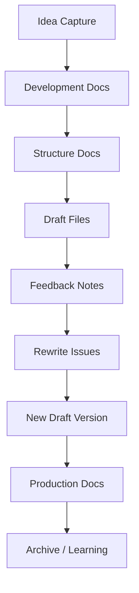
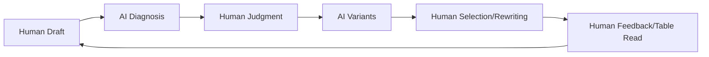
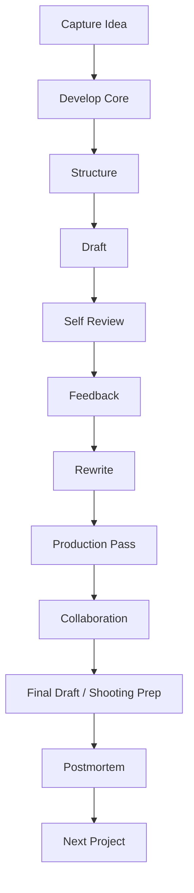
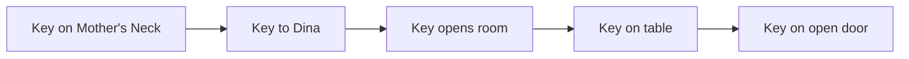
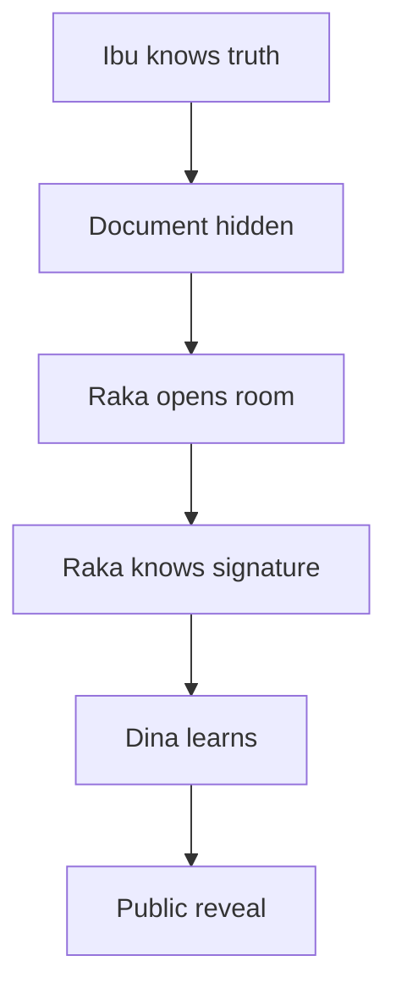
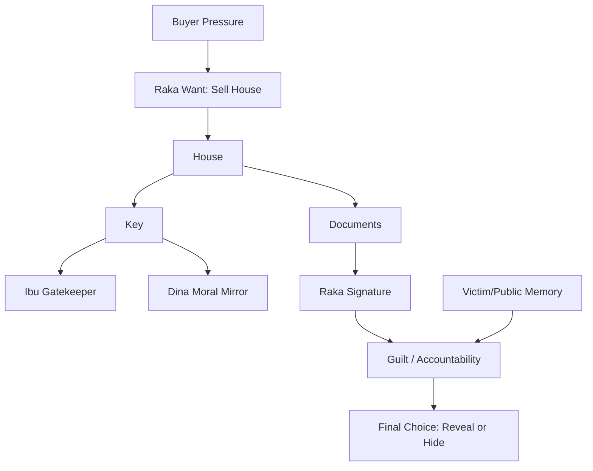
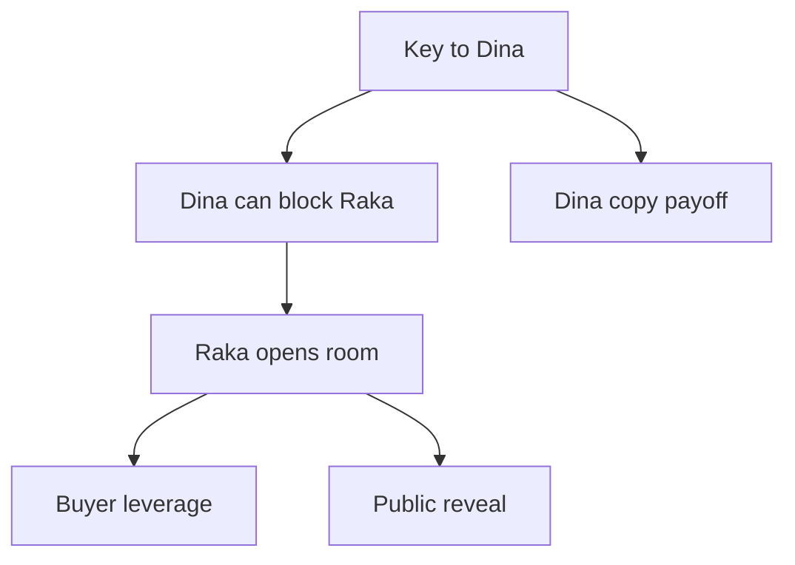

# learn-screenwriting-film-script-part-026.md

# Part 026 — Tooling dan Workflow untuk Software Engineer

> Seri: Learn Screenwriting for Film Project  
> Pendekatan: *The First 20 Hours* — Josh Kaufman  
> Fokus bagian ini: membangun sistem kerja screenwriting yang rapi, repeatable, versioned, dan cocok untuk cara berpikir software engineer tanpa membunuh intuisi kreatif.  
> Target praktis: mampu membuat workflow menulis naskah berbasis folder structure, Markdown/Fountain, versioning, scene database, issue tracker, feedback loop, production audit, dan AI-assisted diagnosis.

---

## 0. Posisi Part Ini dalam Roadmap

Pada Part 025 kita membahas kolaborasi: bagaimana screenplay menjadi dokumen yang dipakai banyak role. Sekarang kita masuk ke sisi workflow:

```text
Bagaimana cara mengelola semua ide, draft, notes, feedback, scene, rewrite, dan versi agar tidak kacau?
```

Sebagai software engineer, Anda punya keunggulan besar: terbiasa berpikir sistem, terbiasa versioning, terbiasa debugging, terbiasa memecah masalah, terbiasa membuat template, terbiasa membaca diff, dan terbiasa membuat workflow repeatable. Namun ada risiko yang sama besarnya: over-engineering, terlalu lama membuat sistem, menghindari menulis dengan merapikan folder, mengubah kreativitas menjadi birokrasi, dan terlalu percaya tool.

Prinsip utama:

```text
Tooling should reduce friction, not become the work.
```

Diagram besar:



---

## 1. Prinsip Kaufman dalam Part Ini

Dalam kerangka *The First 20 Hours*, tooling membantu empat prinsip utama.

### 1.1 Deconstruct

Tooling membantu memecah screenwriting menjadi file dan task kecil:

```text
premise.md
logline.md
character-raka.md
beat-sheet.md
scene-list.md
draft-001.fountain
rewrite-plan.md
```

### 1.2 Learn Enough to Self-Correct

Tooling membantu self-correction lewat feedback tracker, scene turn audit, rewrite checklist, version diff, table read notes, dan issue tracker.

### 1.3 Remove Barriers

Tooling mengurangi friction dengan template siap pakai, folder rapi, drafting queue, consistent naming, dan export workflow.

### 1.4 Practice Deliberately

Tooling membantu latihan fokus: dialogue rewrite, exposition conversion, scene turn audit, short draft sprint, dan rewrite issue per pass.

Target Part 026:

```text
Membuat workflow screenwriting yang cukup rapi untuk proyek nyata, tetapi cukup ringan agar Anda tetap menulis.
```

---

## 2. Tooling Philosophy

Tool terbaik adalah tool yang membuat Anda menulis lebih banyak dan berpikir lebih jelas. Tool buruk adalah tool yang membuat Anda merasa produktif padahal tidak menghasilkan halaman.

Pertanyaan memilih tool:

1. Apakah tool ini mengurangi friction?
2. Apakah tool ini membantu saya menyelesaikan draft?
3. Apakah tool ini membantu saya menemukan masalah?
4. Apakah tool ini mudah dipakai saat energi rendah?
5. Apakah tool ini portable?
6. Apakah saya bisa export/share dengan collaborator?
7. Apakah saya menggunakannya untuk menulis atau untuk procrastination?

Rule:

```text
If the tooling system takes more effort than the writing, simplify.
```

---

## 3. Minimal Viable Workflow

Untuk mulai, Anda tidak butuh sistem kompleks.

Minimal workflow:

```text
project/
  premise.md
  treatment.md
  outline.md
  scene-list.md
  draft-001.fountain
  rewrite-notes.md
```

Itu cukup untuk menulis. Jika Anda baru mulai, jangan langsung membangun database besar. Mulai dari capture ide, logline, treatment, scene list, draft, rewrite. Baru tambah tooling jika ada pain nyata.

---

## 4. Folder Structure

Struktur folder ideal:

```text
screenwriting-project/
  00-admin/
  01-idea/
  02-development/
  03-structure/
  04-drafts/
  05-feedback/
  06-rewrite/
  07-production/
  08-references/
  09-archive/
```

Penjelasan:

| Folder | Fungsi |
|---|---|
| 00-admin | project brief, core story brief, decision log, status |
| 01-idea | raw ideas, premise, inspiration, image bank |
| 02-development | character, theme, world, genre, opposition |
| 03-structure | synopsis, treatment, beat sheet, outline, scene list |
| 04-drafts | screenplay drafts dan exports |
| 05-feedback | reader notes, table read notes, feedback triage |
| 06-rewrite | rewrite plans, issue list, audits |
| 07-production | scope audit, props, locations, risk register, handoff |
| 08-references | research, mood, film/script notes |
| 09-archive | old versions, discarded scenes, parking lot |

Contoh detail:

```text
kunci-di-leher-ibu/
  00-admin/
    project-brief.md
    core-story-brief.md
    decision-log.md
    changelog.md
    status.md

  01-idea/
    raw-ideas.md
    premise.md
    logline-variants.md
    title-variants.md
    image-bank.md

  02-development/
    theme.md
    genre-tone.md
    character-raka.md
    character-ibu.md
    character-dina.md
    opposition.md
    worldbuilding.md
    object-motifs.md

  03-structure/
    synopsis.md
    treatment-v001.md
    treatment-v002.md
    eight-sequence-outline.md
    beat-sheet.md
    scene-list.md
    setup-payoff.md

  04-drafts/
    draft-001.fountain
    draft-002.fountain
    exports/
      draft-001.pdf
      draft-002.pdf

  05-feedback/
    feedback-brief.md
    reader-questionnaire.md
    table-read-001.md
    feedback-triage.md
    diagnosis-report.md

  06-rewrite/
    rewrite-plan-draft-002.md
    scene-turn-audit.md
    exposition-pass.md
    dialogue-pass.md
    rewrite-issues.md

  07-production/
    production-scope-audit.md
    location-audit.md
    cast-audit.md
    hero-props-tracker.md
    risk-register.md
    department-handoff.md
```

Anda tidak harus membuat semua file di awal. Buat sesuai kebutuhan.

---

## 5. Naming Convention

Gunakan nama file konsisten.

Prinsip:

- lowercase,
- kebab-case,
- ada versi jika berubah,
- tanggal jika perlu,
- jelas jenis dokumen.

Contoh:

```text
treatment-v001.md
treatment-v002.md
draft-001.fountain
draft-002.fountain
feedback-reader-nina-draft-002.md
table-read-2026-06-25.md
rewrite-plan-draft-003.md
```

Hindari:

```text
final.docx
finalfix.docx
final-bener.docx
fixbanget-last.docx
```

Naming adalah sanity.

---

## 6. Versioning Philosophy

Dalam screenwriting, versi penting karena:

- Anda bisa kembali ke draft lama,
- Anda bisa melihat perubahan,
- collaborator tahu file mana terbaru,
- feedback terkait versi tertentu,
- rewrite besar bisa dievaluasi,
- keputusan bisa dilacak.

Gunakan:

```text
draft-001
draft-002
draft-003
```

Bukan:

```text
draft-final
```

Karena “final” jarang final.

---

## 7. Git untuk Screenwriting

Sebagai software engineer, Git bisa sangat berguna.

Kelebihan:

- history,
- diff,
- backup,
- revert,
- compare versions,
- changelog discipline.

Risiko:

- over-engineering,
- terlalu sering branch,
- membaca dialog seperti code padahal writing fluid,
- menghabiskan waktu setup.

Workflow sederhana:

```bash
git init
git add .
git commit -m "init project structure"
git commit -am "draft: complete short treatment v001"
git commit -am "rewrite: move midpoint reveal to room scene"
git commit -am "draft: complete screenplay draft 001"
```

Commit message:

```text
type: summary
```

Types:

```text
idea
dev
outline
draft
rewrite
feedback
production
docs
archive
```

Contoh:

```text
idea: add 12 title variants
dev: define Raka want need lie
outline: complete eight sequence structure
draft: finish dinner key transfer scene
rewrite: replace demo scene with warga tua scene
feedback: add table read notes draft 002
production: add location audit
```

Rule:

```text
Gunakan Git jika membantu. Jangan gunakan jika membuat friction.
```

---

## 8. Branching untuk Alternatif Besar

Branching bisa berguna untuk eksperimen besar:

```bash
git checkout -b alt-ending-raka-leaves
git checkout -b midpoint-signature-reveal
git checkout -b contained-climax
```

Namun untuk writing solo, branch terlalu banyak bisa mengacaukan. Rule:

```text
Branch only for major alternatives.
Use separate files for small alternatives.
```

Untuk scene kecil, sering lebih mudah:

```text
scene-15-alt-a.md
scene-15-alt-b.md
```

---

## 9. Markdown sebagai Development Format

Markdown cocok untuk:

- logline,
- treatment,
- outline,
- character sheets,
- rewrite notes,
- feedback,
- checklists,
- production audit,
- Mermaid diagrams.

Kelebihan:

- plain text,
- readable,
- portable,
- mudah diff,
- mudah export,
- bisa masuk Git.

Contoh:

```markdown
# Character: Raka

## Want
Menjual rumah.

## Need
Menghadapi kebenaran tanpa kontrol.

## Lie
Jika dokumen selesai, masa lalu selesai.
```

Markdown adalah default bagus untuk development docs.

---

## 10. Fountain untuk Screenplay

Fountain adalah format plain-text untuk screenplay.

Contoh:

```text
INT. RUMAH LAMA - RUANG MAKAN - MALAM

Map penjualan rumah tergeletak di meja.

Ibu meletakkan piring nasi tepat di atasnya.

RAKA
Bu, itu dokumen.

IBU
Ini meja makan.

DINA
Kakak pulang bawa map. Aku kira bawa kangen.
```

Kelebihan:

- plain text,
- Git-friendly,
- tidak tergantung software mahal,
- mudah diedit,
- cocok dengan workflow engineer,
- bisa diekspor ke PDF screenplay dengan tools tertentu.

Basic elements:

```text
INT. LOCATION - DAY
Action line.

CHARACTER
Dialogue.
```

Workflow ideal:

```text
Development docs: Markdown
Screenplay draft: Fountain
Export: PDF
```

---

## 11. Screenwriting Software

Pilihan:

- Final Draft,
- Fade In,
- WriterDuet,
- Arc Studio,
- Highland,
- Scrivener,
- Celtx,
- Trelby,
- Kit Scenarist,
- Story Architect,
- VS Code + Fountain extension.

Kriteria memilih:

| Kriteria | Pertanyaan |
|---|---|
| Friction | Apakah mudah mulai menulis? |
| Export | Bisa PDF? |
| Collaboration | Butuh co-writing? |
| Cost | Terjangkau? |
| Offline | Bisa tanpa internet? |
| Versioning | Bisa backup/diff? |
| Cards | Ada scene cards? |
| Formatting | Otomatis? |

Untuk learning, tool sederhana cukup. Jangan habiskan energi memilih tool saat yang paling dibutuhkan adalah halaman.

---

## 12. VS Code / Obsidian / Notion Workflow

### VS Code

Cocok untuk:

- Markdown docs,
- Fountain draft,
- Git,
- search,
- templates,
- snippets,
- Mermaid preview.

Potential setup:

```text
VS Code
Markdown preview
Fountain syntax extension
Git integration
Spell checker
```

### Obsidian

Cocok untuk:

- local Markdown,
- backlinks,
- character/world wiki,
- idea capture,
- references.

### Notion

Cocok untuk:

- database scene,
- kanban board,
- feedback tracker,
- visual organization.

Rule:

```text
Use knowledge tools for development.
Use screenplay tool for drafting.
```

---

## 13. Spreadsheet untuk Scene Database

Spreadsheet sangat berguna untuk scene list.

Kolom dasar:

| Scene | Act | Seq | Heading | Function | Objective | Turn | Output | Characters | Props | Cost | Status |
|---:|---|---|---|---|---|---|---|---|---|---:|---|

Recommended fields:

```text
scene_id
act
sequence
order
heading
location
int_ext
day_night
characters
props
story_function
character_objective
opposition
turn
output_state
info_revealed
theme_function
genre_function
tone
estimated_pages
status
rewrite_priority
production_cost
dramatic_value
notes
```

Minimal:

```text
Scene | Function | Turn | Output | Status
```

Jangan mengisi metadata sampai lupa menulis scene.

---

## 14. Scene ID dan Status Tracking

Gunakan scene ID stabil.

Contoh:

```text
S01
S02
S03
```

Untuk feature:

```text
A1-S01
SEQ03-S14
```

Status:

```text
todo
outlined
drafted
needs-rewrite
revised
cut
locked
```

Rewrite priority:

```text
P0 critical
P1 high
P2 medium
P3 polish
```

Contoh:

| Scene | Status | Priority |
|---|---|---|
| S01 Apartment | drafted | P2 |
| S05 Dinner Key | needs-rewrite | P1 |
| S12 Warung | cut candidate | P1 |
| S20 Midpoint | drafted | P0 |
| S40 Climax | outlined | P0 |

---

## 15. Kanban Board

Kanban sederhana:

```text
Backlog
Ready
Drafting
Review
Rewrite
Done for Draft
Cut
```

Cards:

```text
S05 Dinner Key Transfer
S20 Midpoint Signature Reveal
S40 Open House Climax
```

Gunakan Trello, Notion, GitHub Projects, Linear, atau sticky notes. Kanban membantu jika feature panjang, tetapi untuk short jangan terlalu berat.

---

## 16. Issue Tracker untuk Rewrite

Rewrite bisa dikelola seperti bug/issue.

Issue contoh:

```text
# ISSUE-012: Raka empathy weak in Act 1

Severity: High
Affected scenes: S01, S05
Evidence: 3 readers dislike Raka before midpoint
Root cause: opening shows pressure but not vulnerability
Rewrite tasks:
- add moment Raka ignores Ibu call with visible guilt
- rewrite dinner escalation from technical to personal
Acceptance:
- reader understands Raka is flawed but followable
```

Issue categories:

```text
structure
character
scene
dialogue
exposition
tone
genre
production
continuity
format
research
feedback
```

Status:

```text
open
triaged
in-progress
done
verified
wontfix
```

“Wontfix” berguna untuk feedback yang tidak sesuai visi.

---

## 17. Rewrite Issue Template

```text
# Rewrite Issue

ID:
Title:
Draft:
Category:
Severity:
Status:

## Evidence
- 

## Root Cause Hypothesis
...

## Affected Scenes
- 

## Proposed Fix
...

## Acceptance Criteria
- 

## Notes / Risks
...
```

Acceptance criteria harus konkret. Contoh:

```text
- Raka still flawed but no longer reads as pure villain.
- Dinner scene escalates through tactics.
- Dina still has reason to distrust him.
```

---

## 18. Feedback Tracker

Feedback tracker menghubungkan reader notes ke rewrite issues.

Template:

```text
Reader:
Draft:
Date:
Note:
Scene/page:
Category:
Severity:
Pattern:
Issue linked:
Decision:
```

Contoh:

```text
Reader:
Nina

Draft:
002

Note:
"I don't understand why Dina gives Raka the copy."

Scene:
S38

Category:
character/relationship

Issue linked:
ISSUE-018 Dina trust payoff unearned

Decision:
Add earlier beat where Raka admits fault without asking for key.
```

Feedback harus menjadi data, bukan anxiety.

---

## 19. Decision Log dan Changelog

Decision log:

```text
00-admin/decision-log.md
```

Format:

```text
## 2026-06-25 — Midpoint changed

Decision:
Midpoint becomes Raka signature reveal.

Reason:
Ownership reveal was legal, not personal.

Affected:
Seq 2 notary reveal, Seq 4 room scene, Act 3 confession.

Risks:
Need setup for Raka being used as teenager.

Status:
Accepted.
```

Changelog:

```text
# Changelog

## draft-003
- Replaced demo scene with warga tua teras.
- Moved ownership reveal to notary.
- Added Dina photo setup.
- Compressed dinner dialogue by 30%.
- Changed final image from key on table to key on open door.

## draft-002
- Added midpoint signature reveal.
- Cut old friend subplot.
```

Decision log menjelaskan *kenapa*. Changelog menjelaskan *apa yang berubah*.

---

## 20. Research Notes dan Research Backlog

Research bisa menjadi lubang tanpa dasar. Buat file:

```text
08-references/research-notes.md
```

Struktur:

```text
# Research Notes

## Question
Apa detail legal minimal untuk menjual rumah warisan?

## Need for story
Raka tidak bisa menjual tanpa Ibu.

## Important facts
- ...
- ...

## Usable dramatic detail
Notaris menolak karena nama pemilik bukan yang Raka kira.

## Avoid
Menjelaskan prosedur panjang.
```

Research backlog:

```text
Research item:
Story need:
Priority:
Deadline:
Scene:
```

Priority:

```text
P0 = blocks draft
P1 = needed for rewrite
P2 = polish/detail
```

Jangan research P2 saat draft belum selesai.

---

## 21. Reference Watching Notes

Menonton film referensi harus aktif.

Template:

```text
Film:
Why watching:
Genre/tone:
Relevant scenes:
What works:
How scene handles exposition:
How scene handles object:
What to avoid:
Applicable lesson:
```

Script reading notes:

```text
Script:
Page count:
Opening image:
Inciting incident:
Scene style:
Action line style:
Dialogue style:
Midpoint:
Ending:
Lessons:
```

Satu referensi harus menghasilkan satu lesson dan satu aplikasi. Jika tidak, itu konsumsi pasif.

---

## 22. Idea Capture System

Ide datang random. Tangkap cepat.

File:

```text
01-idea/raw-ideas.md
```

Format:

```text
## Idea
Tanggal:
Spark:
Image:
Conflict:
Possible genre:
Possible format:
Why interesting:
Next action:
```

Contoh:

```text
## Kunci dipakai sebagai liontin
Spark:
Ibu memakai kunci bukan menyimpannya.

Image:
Kunci di leher Ibu jatuh ke tangan Dina.

Conflict:
Anak ingin akses; ibu menolak; adik jadi gatekeeper.

Format:
Short/feature family mystery drama.
```

Idea parking lot:

```text
# Idea Parking Lot

Idea:
Useful for current project? yes/no
If yes, where:
If no, save for:
```

Ini mencegah distraction.

---

## 23. Template Library

Buat template folder:

```text
templates/
  character-sheet.md
  scene-card.md
  rewrite-issue.md
  feedback-brief.md
  production-audit.md
  decision-log-entry.md
```

Template mengurangi friction. Tapi rule:

```text
Only create a template after repeating the task twice.
```

Jika belum pernah menulis scene, jangan menghabiskan sehari membuat 20 template scene.

---

## 24. Daily Writing Log

File:

```text
00-admin/writing-log.md
```

Format:

```text
## 2026-06-25

Goal:
Actual:
Scenes:
Words/pages:
Problems:
Next:
```

Contoh:

```text
Goal:
Draft S05 dinner.

Actual:
3 pages rough.

Problems:
Raka too harsh.

Next:
Draft S06 notary; note dinner rewrite later.
```

Writing log menjaga momentum dan membantu Anda melihat pola kerja.

---

## 25. Weekly Review

Setiap minggu, review:

```text
What progressed?
What is blocked?
What did I learn?
What should I cut?
What is next week's priority?
```

Template:

```text
# Weekly Review

Week:
Progress:
Completed:
Blocked:
Major decisions:
Feedback received:
Next priorities:
Risks:
```

Untuk feature, weekly review penting agar tidak tersesat.

---

## 26. Sprint Planning

Screenwriting sprint:

```text
Sprint duration: 1 week
Goal: complete short draft / finish sequence 1 / rewrite Act 1
Tasks:
- S01 draft
- S02 draft
- S03 draft
- read-through
Definition of done:
- rough pages complete, TODO marked
```

Definition of done:

### Scene Draft Done

```text
- scene has heading
- action/dialogue written
- input/turn/output present
- TODO marked
```

### Treatment Done

```text
- beginning/middle/end present
- major turns present
- ending written
- readable prose
```

### Rewrite Issue Done

```text
- change applied
- affected scenes updated
- continuity checked
- acceptance criteria met
```

Definition of done mencegah perfeksionisme dan premature done.

---

## 27. Project Dashboard

Buat dashboard sederhana.

```text
# Project Dashboard

Current phase:
Current draft:
Current focus:
Next milestone:
Open critical issues:
Scenes drafted:
Scenes remaining:
Last feedback:
Next session:
```

Contoh:

```text
Current phase:
Draft 1 short.

Current focus:
Complete rough draft.

Next milestone:
Full read-through.

Open critical:
Ending choice unclear.

Scenes drafted:
3/5.

Next session:
Draft S04 choice setup.
```

Dashboard mengurangi cognitive load.

---

## 28. Phase-Based Workflow dan Mode Switching

Fase:

1. Ideation.
2. Development.
3. Structure.
4. Drafting.
5. Rewrite.
6. Feedback.
7. Production pass.
8. Collaboration/prep.
9. Archive/learning.

Jangan mencampur semua.

Mode label:

```text
MODE: DRAFTING
Allowed: write pages, placeholders
Not allowed: major rewrite, deep research
```

```text
MODE: REWRITE
Allowed: diagnose, change structure
Not allowed: obsess over typo
```

Mode discipline sangat cocok untuk engineer.

---

## 29. Personal Workflow Stack

Contoh stack ringan:

```text
Editor:
VS Code / Obsidian

Docs:
Markdown

Screenplay:
Fountain

Versioning:
Git

Scene tracking:
CSV / Google Sheets / Notion

Tasks:
GitHub Issues / Trello / Notion

Export:
Fountain tool / screenwriting app

Feedback:
Google Docs comments / PDF notes / Markdown triage

Backup:
Cloud + local
```

No-code workflow juga valid:

```text
Google Drive/
  project/
    development/
    drafts/
    feedback/
```

Versioning:

```text
draft-001-2026-06-25.docx
draft-002-2026-07-01.docx
```

Tooling harus sesuai energi.

---

## 30. Paper Workflow

Kertas juga valid.

- index cards,
- sticky notes,
- corkboard,
- printed draft,
- colored pens,
- scene cards on wall.

Kelebihan:

- tactile,
- mudah melihat structure,
- tidak terdistraksi,
- bagus untuk sequence.

Kekurangan:

- sulit versioning,
- sulit backup,
- sulit share.

Hybrid bagus:

```text
Cards for structure, digital for draft.
```

---

## 31. AI-Assisted Workflow

AI bisa membantu:

- brainstorming alternatif,
- mengkritik logline,
- membuat checklist,
- menganalisis scene function,
- menemukan exposition dump,
- membuat feedback questionnaire,
- mengelompokkan raw feedback,
- membuat rewrite issue list,
- membuat production audit draft,
- membantu format template.

AI tidak boleh menggantikan:

- taste,
- final judgement,
- lived specificity,
- cultural authenticity,
- emotional truth,
- responsibility,
- actual drafting practice.

AI adalah assistant, bukan authorial conscience.

---

## 32. AI Use Cases by Phase

| Phase | AI Useful For |
|---|---|
| Idea | generate variants, ask what-if |
| Logline | critique clarity/stakes |
| Character | ask contradictions, flaw tests |
| Structure | diagnose missing turns |
| Drafting | unblock scene entry, alternate lines |
| Rewrite | classify issues, suggest passes |
| Feedback | summarize notes, pattern detection |
| Production | cost/value audit prompts |
| Collaboration | draft meeting agenda, decision log |

Use carefully.

---

## 33. AI Prompt: Logline Diagnosis

```text
Saya sedang mengembangkan naskah film.

Logline:
...

Tolong diagnosis, jangan rewrite dulu:
1. Apakah protagonist jelas?
2. Apakah goal eksternal jelas?
3. Apakah obstacle jelas?
4. Apakah stakes terasa?
5. Apakah genre/tone terasa?
6. Apakah scope cocok untuk short/feature?
7. Apa 5 masalah terbesar?
```

Setelah diagnosis, baru minta alternatif.

---

## 34. AI Prompt: Scene Diagnosis

```text
Berikut scene card/draft scene.

Tolong diagnosis:
1. Apa objective tiap karakter?
2. Apa opposition?
3. Apa turn scene?
4. Apa output state?
5. Apakah ada exposition dump?
6. Apakah dialog on-the-nose?
7. Bagian mana bisa dipotong?
8. Apa rewrite priority?

Jangan rewrite seluruh scene dulu.
```

Diagnosis dulu, solusi nanti.

---

## 35. AI Prompt: Rewrite Variants

```text
Saya ingin 5 alternatif untuk line ini dengan tone:
- restrained
- bitter humor
- family drama
- subtext-heavy

Context:
Raka ingin kunci, tapi tidak mau mengaku butuh bantuan.
Dina menantangnya.

Line sekarang:
"Mau minta, atau mau nyuruh?"

Buat alternatif pendek, natural, dalam bahasa Indonesia.
```

Gunakan AI untuk opsi, pilih dengan taste.

---

## 36. AI Prompt: Feedback Triage

```text
Berikut raw feedback dari 5 pembaca.

Tolong:
1. Kelompokkan berdasarkan kategori.
2. Cari pattern berulang.
3. Pisahkan raw reaction dan suggested solution.
4. Buat root cause hypothesis.
5. Buat rewrite issue list prioritas.

Jangan membuat ulang cerita.
```

---

## 37. AI Prompt: Production Audit

```text
Berikut scene list.

Tolong buat production-aware audit:
1. Location count.
2. Cast count.
3. High-cost elements.
4. High-cost low-value candidates.
5. Low-cost alternatives.
6. Props/hero props.
7. Sound risks.
8. Rewrite suggestions preserving dramatic function.
```

Tetap verifikasi dengan manusia produksi.

---

## 38. AI Anti-Pattern

### 38.1 Asking AI to Write Everything

Risiko: generic, kehilangan voice, tidak spesifik budaya, dan Anda tidak belajar.

Fix:

```text
Use AI for diagnosis/options, not full replacement.
```

### 38.2 Accepting First Output

AI output pertama sering rata-rata.

Fix:

```text
Ask for critique, constraints, variants.
```

### 38.3 Overprompting Instead of Writing

Banyak prompt, tidak ada draft.

Fix:

```text
Every AI session must end with human writing action.
```

### 38.4 Outsourcing Taste

AI tidak menentukan final.

Fix:

```text
You choose.
```

---

## 39. Human-in-the-Loop Workflow

AI workflow sehat:



Human tetap pusat.

---

## 40. Template Automation

Anda bisa membuat script sederhana untuk generate project structure.

Contoh bash:

```bash
mkdir -p 00-admin 01-idea 02-development 03-structure 04-drafts 05-feedback 06-rewrite 07-production 08-references 09-archive

touch 00-admin/project-brief.md
touch 00-admin/decision-log.md
touch 01-idea/raw-ideas.md
touch 02-development/theme.md
touch 03-structure/scene-list.md
touch 04-drafts/draft-001.fountain
```

Ini mengurangi setup friction. Tapi setelah generate, segera tulis sesuatu.

---

## 41. Data Files: CSV Scene Tracker

Contoh CSV:

```csv
scene_id,act,sequence,heading,function,turn,status,cost,value
S01,1,1,INT APARTMENT - DAY,opening state,Raka ignores mother call,drafted,1,4
S02,1,1,PHONE CALL,buyer pressure,Raka decides to go home,drafted,1,4
S03,1,1,EXT HOUSE - DUSK,arrival,house has social memory,todo,2,4
```

CSV bisa dibaca spreadsheet atau script.

---

## 42. Lightweight Metrics

Metrics yang berguna:

- pages drafted,
- scenes drafted,
- open P0/P1 issues,
- feedback patterns resolved,
- days since last writing,
- draft version,
- rewrite pass status.

Metrics yang kurang berguna:

- jumlah ide baru,
- jumlah tools dicoba,
- jumlah referensi ditonton tanpa notes,
- jumlah template dibuat tanpa draft.

Track output, bukan illusion.

---

## 43. Writing Analytics

Simple tracking:

```text
Date | Minutes | Pages | Scene | Mode | Notes
```

Contoh:

| Date | Min | Pages | Mode | Result |
|---|---:|---:|---|---|
| 2026-06-25 | 45 | 2 | Draft | S05 rough |
| 2026-06-26 | 30 | 0 | Rewrite | S05 diagnosis |
| 2026-06-27 | 60 | 3 | Draft | S06-S07 |

Gunakan untuk melihat habit, bukan menghukum diri.

---

## 44. Calendar Blocking dan Energy Mapping

Screenwriting mode butuh energi berbeda.

| Mode | Energy Type |
|---|---|
| Ideation | playful |
| Structure | analytical |
| Drafting | generative |
| Rewrite | diagnostic |
| Dialogue polish | auditory |
| Feedback processing | emotional regulation |
| Production audit | pragmatic |

Jika malam lelah, lakukan low-friction task:

- read aloud one scene,
- fill scene card,
- update tracker,
- cut 10 lines.

Jangan selalu memaksa high creativity saat low energy.

---

## 45. Avoiding Over-Engineering

Tanda over-engineering:

- folder lengkap, draft kosong,
- template banyak, scene tidak ditulis,
- database indah, karakter tidak hidup,
- Git branch banyak, ending belum ada,
- research panjang, logline belum kuat,
- AI prompt ribuan, tidak ada halaman.

Counter-rule:

```text
Every tooling session must produce or directly enable writing.
```

Valid:

```text
Membuat scene tracker karena besok akan draft 5 scene.
```

Tidak valid:

```text
Membuat database warna karakter selama 3 jam sebelum punya premise.
```

---

## 46. Tooling as Barrier Removal

Tooling harus menghilangkan barrier.

| Barrier | Tool |
|---|---|
| Tidak tahu mulai dari mana | Scene card template |
| Feedback kacau | Feedback triage table |
| Draft versi hilang | Versioning |
| Scene terlalu banyak | Scene database filter |
| Rewrite random | Issue tracker |
| Produksi mahal | Cost/value audit |

Jika tool tidak menghilangkan barrier nyata, jangan tambah.

---

## 47. Project Lifecycle

Lifecycle lengkap:



Workflow harus mendukung lifecycle ini.

---

## 48. Postmortem

Setelah project selesai, lakukan postmortem.

Template:

```text
# Project Postmortem

What was the project?
What did I finish?
What worked creatively?
What failed?
What did feedback reveal?
What tooling helped?
What tooling wasted time?
What craft skill improved?
What should I practice next?
What templates should I keep?
What would I do differently?
```

Ini deliberate learning.

---

## 49. Knowledge Base

Seiring waktu, buat knowledge base:

```text
screenwriting-knowledge/
  dialogue-lessons.md
  exposition-patterns.md
  scene-examples.md
  rewrite-mistakes.md
  production-lessons.md
  favorite-lines.md
  genre-notes.md
```

Ini bukan untuk menghindari menulis. Ini untuk mempercepat next project.

---

## 50. Mermaid Diagrams for Story

Anda bisa pakai Mermaid untuk memetakan character arc, sequence flow, object arc, knowledge flow, opposition network, dan production workflow.

Object arc:



Knowledge flow:



System map:



Visualisasi membantu engineer melihat dependency.

---

## 51. Knowledge Matrix

Untuk mystery/complex plot:

```text
Who knows what when?
```

Table:

| Info | Audience | Raka | Ibu | Dina | Buyer |
|---|---|---|---|---|---|
| Key matters | S05 | S05 | before story | S05 | maybe |
| Ownership Ibu | S08 | S08 | before story | later | yes |
| Raka signature | S20 | S20 | before story | S24 | yes |
| Dina copy | S38 | no | no | S28 | no |
| Buyer leverage | S26 | S26 | maybe | S30 | yes |

Ini mencegah bug karakter memakai informasi yang belum ia tahu.

---

## 52. Object Tracker

| Object | First | Moves | Meaning | Payoff |
|---|---|---|---|---|
| Key | Ibu neck | Ibu → Dina → room → door | control/truth | open door |
| Map | Raka hand | table/notary/climax | transaction/control | truth document |
| Plate | table | over map | care/control | meal after truth |
| Phone | Raka | ignored/answered | outside pressure | choice interruptions |

Object tracker membuat motif konsisten.

---

## 53. Character State Tracker

Track state per sequence:

| Seq | Raka State | Ibu State | Dina State |
|---|---|---|---|
| 1 | control/asset mindset | waiting/guarded | resentful |
| 2 | frustrated | defensive care | suspicious |
| 3 | technical strategy | evasive | watching |
| 4 | self-righteous → shocked | afraid | excluded |
| 5 | self-protective | confession pressure | distrust |
| 6 | collapsing | sick/guilty | betrayed |
| 7 | crisis/accountability | exposed | deciding trust |
| 8 | chooses truth | loses control | witness/partner |

Tracker membantu rewriting.

---

## 54. Scene Dependency Graph

Some scenes depend on others.



Jika cut S05, later scenes break. Dependency graph berguna untuk rewrite.

---

## 55. Setup/Payoff Tracker

| Setup | Scene | Payoff | Scene | Status |
|---|---|---|---|---|
| Dina photos documents | S14 | Dina has copy | S38 | needs setup |
| Key on neck | S05 | Key on open door | S45 | working |
| Raka ignores Ibu call | S01 | Raka answers/returns | S42 | maybe |
| Map under plate | S05 | document on table | S40 | working |

Status:

```text
working
needs setup
needs payoff
cut
```

---

## 56. Production Tracker

Production tracker fields:

```text
Scene
Location
INT/EXT
Day/Night
Cast
Extras
Props
Special
Cost
Value
Risk
Decision
```

Gunakan setelah Part 024 untuk cost/value audit.

---

## 57. Writing Prompts Library

Create prompt library:

```text
prompts/
  logline-diagnosis.md
  scene-diagnosis.md
  feedback-triage.md
  production-audit.md
  dialogue-variants.md
  rewrite-plan.md
```

Each prompt should have:

- context,
- task,
- constraints,
- output format,
- “do not rewrite unless asked”.

This keeps AI use intentional.

---

## 58. Prompt Hygiene

Good prompt:

```text
Here is the scene. Diagnose only. Do not rewrite. Use bullet list. Focus on objective, opposition, turn, exposition, and subtext.
```

Bad prompt:

```text
Make this better.
```

Good prompts reduce generic output.

---

## 59. Tooling for Feedback

Options:

- PDF comments,
- Google Docs comments,
- Markdown notes,
- spreadsheet tracker,
- form questionnaire,
- recorded table read,
- Notion database.

Feedback system should capture:

- source,
- draft version,
- scene/page,
- raw note,
- category,
- decision.

Do not rely on memory.

---

## 60. Tooling for Table Read

Materials:

```text
script PDF
role list
feedback form
observer sheet
timer
recording link
notes doc
```

After read:

```text
table-read-001-notes.md
feedback-triage.md
rewrite-plan.md
```

Record only with consent.

---

## 61. Tooling for Collaboration

Collaboration docs:

- core story brief,
- scene function sheets,
- decision log,
- changelog,
- department handoff,
- production audit,
- draft version.

Use shared folder with latest version clearly marked.

Example:

```text
_CURRENT/
  script-current.pdf
  script-current.fountain
  changelog-current.md
  core-story-brief.md
```

Archive old versions.

---

## 62. Avoiding Latest-Version Chaos

Workflow:

```text
04-drafts/draft-004.fountain
04-drafts/exports/draft-004.pdf
_CURRENT/script-current.pdf
```

Make sure everyone knows current.

When moving to new draft:

1. Keep old draft.
2. Write changelog.
3. Update current folder.
4. Close resolved issues.
5. Open new issues.

---

## 63. Backup Strategy

At least:

```text
local + cloud
```

Better:

```text
local + cloud + git remote
```

For important projects:

- periodic zip,
- export PDFs,
- backup raw notes,
- don't keep only in one app.

Writing loss is painful. Backup.

---

## 64. Security and Privacy

If story includes sensitive research, private notes, personal experiences, collaborator comments:

- control sharing,
- use permissions,
- avoid public links,
- remove private notes from shared draft,
- don't send raw feedback to all,
- anonymize if needed,
- separate private journal from project docs.

Especially if using AI tools or cloud platforms, be aware what you paste.

---

## 65. Export Workflow

Typical exports:

- PDF screenplay for reading/table read,
- PDF treatment for feedback,
- CSV scene list,
- Markdown package,
- production breakdown PDF.

Before sending:

- check title/date/version,
- check page numbers,
- remove internal TODO,
- ensure file name clear,
- include feedback brief.

Example:

```text
kunci-di-leher-ibu_draft-002_2026-06-25.pdf
```

---

## 66. Single Source of Truth

Define:

```text
What file is canonical?
```

For draft:

```text
04-drafts/draft-003.fountain
```

For outline:

```text
03-structure/scene-list.md
```

If collaborator comments on PDF, changes must be applied to source.

---

## 67. Discarded Scenes File

Cutting scene is emotionally easier if it is archived.

```text
# Discarded Scenes

## S12 Old Friend Scene
Reason cut:
Repeated social pressure already covered by warung.

Useful fragments:
Line: "Rumah itu masih hafal suara kamu."

Can reuse:
Maybe in Dina dialogue.
```

This reduces fear of cutting.

---

## 68. Style Guide

For longer project, create style guide.

```text
# Style Guide

Language:
Bahasa Indonesia natural, restrained, not literary overkill.

Dialogue:
Short, subtext-heavy, family-specific.

Tone:
Melancholic, tense, bitter humor.

Avoid:
Melodramatic speeches.
Over-explaining legal detail.
Modern meme-y jokes.
```

Style guide helps consistency.

---

## 69. Character Voice Guide

```text
# Character Voice Guide

Raka:
- technical vocabulary
- avoids apology
- uses process words
- short controlled sentences

Ibu:
- domestic language
- indirect
- uses food/house metaphors

Dina:
- sharp, informal
- bitter humor
- cuts through euphemism
```

Use during dialogue pass.

---

## 70. Pattern Library

Create library of patterns you discover:

```text
Exposition as object
Care as control
Object transfer as power shift
Off-screen pressure via phone
Public shame via representative character
```

Anti-pattern library:

```text
Raka explains theme.
Dina sarcasm overused.
Ibu too cryptic.
Legal exposition too long.
Scene starts too early.
Ending overexplained.
```

Use before rewriting.

---

## 71. Workflow for Short Film

Recommended short workflow:

```text
Day 1:
Idea, logline, character snapshot.

Day 2:
5-part treatment, 8 beats.

Day 3:
Scene list, production scope.

Day 4:
Draft 1.

Day 5:
Self read, rewrite.

Day 6:
Table read, feedback.

Day 7:
Draft 2, production pass.
```

Files:

```text
premise.md
short-treatment.md
scene-list.md
draft-001.fountain
feedback.md
draft-002.fountain
production-audit.md
```

Keep it lean.

---

## 72. Workflow for Feature

Feature workflow:

```text
Phase 1:
Logline + synopsis.

Phase 2:
Character/theme/world docs.

Phase 3:
8 sequence outline.

Phase 4:
40–60 beat sheet.

Phase 5:
Scene list.

Phase 6:
Draft sequence by sequence.

Phase 7:
Full read + diagnosis.

Phase 8:
Rewrite plan.

Phase 9:
Draft 2 structural rewrite.

Phase 10:
Feedback/table read.
```

Do not skip structure unless you knowingly choose discovery writing.

---

## 73. Feature Milestone Board

Milestones:

```text
M1: Logline approved by self/reader
M2: Treatment v001 complete
M3: 8 sequence outline complete
M4: Scene list complete
M5: Act 1 drafted
M6: Midpoint drafted
M7: Full draft 001 complete
M8: Diagnosis report complete
M9: Draft 002 complete
M10: Table read complete
```

Track progress. Feature tidak selesai karena semangat satu malam; feature selesai karena pipeline bertahan.

---

## 74. Workflow for Rewrite

Rewrite workflow:

```text
1. Read draft.
2. Create diagnosis report.
3. Create rewrite issues.
4. Prioritize P0/P1.
5. Make rewrite plan.
6. Apply structural changes.
7. Update scene list.
8. Rewrite affected scenes.
9. Run continuity check.
10. Export new draft.
11. Update changelog.
```

Do not edit randomly.

---

## 75. Workflow for Feedback

Feedback workflow:

```text
1. Prepare readable draft.
2. Write feedback brief.
3. Select readers.
4. Send with deadline.
5. Collect raw notes.
6. Triage.
7. Pattern detect.
8. Create diagnosis report.
9. Convert to rewrite issues.
10. Decide next draft goals.
```

---

## 76. Workflow for Production Pass

Production workflow:

```text
1. Export scene list.
2. Add production columns.
3. Count locations/cast/props.
4. Mark high-risk elements.
5. Cost/value score.
6. Rewrite high-cost low-value.
7. Create risk register.
8. Create department handoff.
```

---

## 77. Workflow for Collaboration

Collaboration workflow:

```text
1. Share current draft.
2. Share core story brief.
3. Hold script meeting.
4. Capture notes.
5. Triage by role.
6. Make decisions.
7. Update decision log.
8. Rewrite.
9. Send changelog.
10. Confirm current version.
```

---

## 78. Tooling Checklist

### Project Setup

- [ ] Folder structure created.
- [ ] Project brief created.
- [ ] Raw ideas captured.
- [ ] Core docs created.

### Development

- [ ] Logline variants.
- [ ] Character sheets.
- [ ] Theme.
- [ ] Genre/tone.
- [ ] Worldbuilding.
- [ ] Object/motif tracker.

### Structure

- [ ] Synopsis.
- [ ] Treatment.
- [ ] Beat sheet.
- [ ] Scene list.
- [ ] Setup/payoff tracker.

### Drafting

- [ ] Draft file.
- [ ] Writing log.
- [ ] Scene status.
- [ ] TODO list.

### Rewrite

- [ ] Diagnosis report.
- [ ] Rewrite issues.
- [ ] Rewrite plan.
- [ ] Changelog.

### Feedback

- [ ] Feedback brief.
- [ ] Reader questionnaire.
- [ ] Feedback tracker.
- [ ] Table read notes.

### Production

- [ ] Scope audit.
- [ ] Location audit.
- [ ] Cast audit.
- [ ] Hero props.
- [ ] Risk register.

### Collaboration

- [ ] Core story brief.
- [ ] Decision log.
- [ ] Department handoff.
- [ ] Current version.

---

## 79. Anti-Pattern: Tooling Edition

### 79.1 Folder Porn

Beautiful folder, no pages.

Fix:

```text
After setup, write one scene immediately.
```

### 79.2 Template Addiction

Endless templates.

Fix:

```text
Only create template after repeating task twice.
```

### 79.3 Git Gymnastics

Branching more than writing.

Fix:

```text
Simple commits only.
```

### 79.4 Spreadsheet Avoidance

Filling metadata instead of drafting.

Fix:

```text
Minimum fields: function, turn, status.
```

### 79.5 AI Rabbit Hole

Prompting endlessly.

Fix:

```text
Every AI session must end with human writing action.
```

### 79.6 Reference Hoarding

Watching films without notes.

Fix:

```text
One reference, one lesson, one application.
```

### 79.7 Version Chaos

Multiple “final” files.

Fix:

```text
draft-001, draft-002, current folder.
```

### 79.8 Over-Quantification

Trying to measure art too much.

Fix:

```text
Use metrics for progress, not for taste.
```

---

## 80. Debugging Workflow Problems

### 80.1 Saya stuck di outline

Likely:

- premise unclear,
- protagonist want unclear,
- midpoint unknown,
- ending unknown.

Tool:

- logline diagnosis,
- 8 sequence template,
- midpoint alternatives.

### 80.2 Saya stuck saat drafting

Likely:

- scene objective unclear,
- scene card missing,
- perfectionism.

Tool:

- scene card,
- placeholder,
- 25-minute sprint.

### 80.3 Rewrite kacau

Likely:

- no diagnosis,
- no priority,
- following random notes.

Tool:

- rewrite issues,
- severity matrix,
- rewrite plan.

### 80.4 Feedback membuat bingung

Likely:

- no triage,
- no pattern detection.

Tool:

- feedback tracker,
- diagnosis report.

### 80.5 Produksi terlihat mahal

Likely:

- too many locations/cast/specials.

Tool:

- cost/value table,
- production scope audit.

---

## 81. Example Project Workflow: “Kunci di Leher Ibu”

### Phase 1: Idea

Files:

```text
01-idea/raw-ideas.md
01-idea/logline-variants.md
```

Output:

```text
Premise: anak pulang menjual rumah; kunci di leher ibu membuka rahasia.
```

### Phase 2: Development

Files:

```text
02-development/character-raka.md
02-development/theme.md
02-development/object-motifs.md
```

Output:

```text
Want/Need/Lie, theme, key/map/plate motifs.
```

### Phase 3: Structure

Files:

```text
03-structure/treatment-v001.md
03-structure/eight-sequence-outline.md
03-structure/scene-list.csv
```

Output:

```text
8 sequence map.
```

### Phase 4: Draft

Files:

```text
04-drafts/draft-001.fountain
00-admin/writing-log.md
```

Output:

```text
full rough draft.
```

### Phase 5: Feedback

Files:

```text
05-feedback/table-read-001.md
05-feedback/feedback-triage.md
```

Output:

```text
patterns: Raka empathy, Act 2 repetition, notary exposition.
```

### Phase 6: Rewrite

Files:

```text
06-rewrite/rewrite-plan-draft-002.md
06-rewrite/issues.md
```

Output:

```text
Draft 002 structural changes.
```

### Phase 7: Production

Files:

```text
07-production/location-audit.md
07-production/hero-props.md
```

Output:

```text
contained climax, cut demo, use warga tua.
```

---

## 82. Minimal Templates Bundle

If overwhelmed, use only these 5.

### 82.1 Project Brief

```text
Title:
Format:
Genre:
Tone:
Logline:
Theme:
Protagonist:
Ending:
```

### 82.2 Scene Card

```text
Scene:
Heading:
Objective:
Opposition:
Turn:
Output:
```

### 82.3 Scene List

```text
Scene | Function | Turn | Status
```

### 82.4 Rewrite Issue

```text
Problem:
Root cause:
Affected scenes:
Fix:
Acceptance:
```

### 82.5 Feedback Triage

```text
Raw note:
Category:
Pattern:
Action:
```

This is enough to work.

---

## 83. Tooling Maturity Levels

### Level 0 — Chaos

- notes everywhere,
- no versions,
- draft lost,
- feedback random.

### Level 1 — Basic

- folder structure,
- draft versions,
- scene list,
- notes.

### Level 2 — Repeatable

- templates,
- feedback tracker,
- rewrite issues,
- production audit.

### Level 3 — Collaborative

- core brief,
- changelog,
- decision log,
- handoff docs.

### Level 4 — Over-engineered Risk

- too much system,
- slow writing.

Target:

```text
Level 2–3.
```

Avoid Level 4 unless project demands.

---

## 84. Personal Operating System

Your screenwriting OS:

```text
Capture fast.
Develop clearly.
Structure before drafting.
Draft forward.
Diagnose before rewriting.
Feedback with questions.
Rewrite by priority.
Track versions.
Produce consciously.
Reflect after.
```

This is more important than any app.

---

## 85. Exercise 1 — Setup Project Folder

Create folder structure:

```text
00-admin
01-idea
02-development
03-structure
04-drafts
05-feedback
06-rewrite
07-production
08-references
09-archive
```

Create at least:

```text
project-brief.md
raw-ideas.md
scene-list.md
draft-001.fountain
writing-log.md
```

---

## 86. Exercise 2 — Scene Database

Create table with 10 scenes.

Columns:

```text
Scene | Function | Turn | Output | Status | Cost | Value
```

Fill with your short/feature idea.

---

## 87. Exercise 3 — Rewrite Issue

Take one known problem and write issue.

```text
Title:
Evidence:
Root cause:
Affected scenes:
Fix:
Acceptance criteria:
```

---

## 88. Exercise 4 — Feedback Tracker

Take 5 feedback notes and enter:

```text
Source | Note | Category | Severity | Pattern | Action
```

---

## 89. Exercise 5 — AI Diagnosis Prompt

Write a prompt for one of your scenes asking for diagnosis only.

Then compare:

```text
What AI found:
What I agree with:
What I reject:
What I will rewrite:
```

---

## 90. Exercise 6 — Decision Log

Write 3 major decisions:

```text
Decision:
Reason:
Affected:
Risk:
```

---

## 91. Exercise 7 — Cost/Value Audit

Take scene list and score:

```text
Cost 1–5
Value 1–5
```

Identify 3 rewrite targets.

---

## 92. Exercise 8 — Weekly Review

After one week, write:

```text
Progress:
What worked:
What failed:
Tooling that helped:
Tooling that distracted:
Next week priority:
```

---

## 93. Practice Plan 120 Menit

| Durasi | Aktivitas | Output |
|---:|---|---|
| 10 menit | Buat folder project | Struktur |
| 10 menit | Buat project brief | Brief |
| 15 menit | Buat scene list table | Scene tracker |
| 15 menit | Buat writing log + dashboard | Tracking |
| 20 menit | Buat rewrite issue template dan 1 issue | Issue |
| 15 menit | Buat feedback tracker template | Feedback system |
| 15 menit | Buat production audit template | Production system |
| 20 menit | Draft 1 scene menggunakan scene card | Actual writing |

Perhatikan: practice plan sengaja diakhiri dengan menulis scene. Tooling harus menghasilkan writing.

---

## 94. Output yang Harus Dibawa ke Part Berikutnya

Part berikutnya adalah:

> **Part 027 — Latihan 20 Jam: Jadwal Praktik Terstruktur**

Sebelum lanjut, Anda sebaiknya punya:

1. Folder project.
2. Project brief.
3. Minimal satu logline.
4. Scene list atau beat list.
5. Draft file.
6. Writing log.
7. Rewrite issue template.
8. Feedback tracker.
9. Production audit template.
10. Satu scene card yang siap ditulis.

Part 027 akan mengubah seluruh seri ini menjadi jadwal latihan 20 jam yang konkret, terukur, dan realistis.

---

## 95. Ringkasan Part Ini

Tooling dan workflow membantu software engineer belajar screenwriting secara lebih terstruktur.

Hal paling penting:

1. Tooling harus mengurangi friction, bukan menjadi pekerjaan utama.
2. Folder structure membantu memisahkan ide, development, structure, draft, feedback, rewrite, production.
3. Markdown cocok untuk development docs.
4. Fountain cocok untuk screenplay plain text.
5. Git/versioning berguna jika sederhana.
6. Scene database membantu tracking function, turn, status, cost, value.
7. Issue tracker cocok untuk rewrite.
8. Feedback tracker mengubah opini menjadi data.
9. Decision log menjaga alignment.
10. Changelog menghindari version chaos.
11. AI bisa membantu diagnosis dan variasi, tetapi tidak menggantikan judgement.
12. Templates dan snippets mengurangi friction.
13. Metrics harus mengukur progress, bukan menggantikan taste.
14. Jangan over-engineer sampai tidak menulis.
15. Setiap tooling session harus menghasilkan atau langsung memampukan writing.

Formula inti:

```text
Capture → Develop → Structure → Draft → Diagnose → Rewrite → Feedback → Production Pass → Archive/Learn
```

Sebagai software engineer, kekuatan Anda bukan membuat seni menjadi deterministic sepenuhnya, tetapi membuat proses kreatif cukup terstruktur sehingga Anda bisa tetap bergerak ketika inspirasi tidak datang.

---

## 96. Status Seri

- Part 000: selesai.
- Part 001: selesai.
- Part 002: selesai.
- Part 003: selesai.
- Part 004: selesai.
- Part 005: selesai.
- Part 006: selesai.
- Part 007: selesai.
- Part 008: selesai.
- Part 009: selesai.
- Part 010: selesai.
- Part 011: selesai.
- Part 012: selesai.
- Part 013: selesai.
- Part 014: selesai.
- Part 015: selesai.
- Part 016: selesai.
- Part 017: selesai.
- Part 018: selesai.
- Part 019: selesai.
- Part 020: selesai.
- Part 021: selesai.
- Part 022: selesai.
- Part 023: selesai.
- Part 024: selesai.
- Part 025: selesai.
- Part 026: selesai.
- Part 027: berikutnya.

Seri **belum selesai**. Bagian berikutnya adalah:

> **Part 027 — Latihan 20 Jam: Jadwal Praktik Terstruktur**
