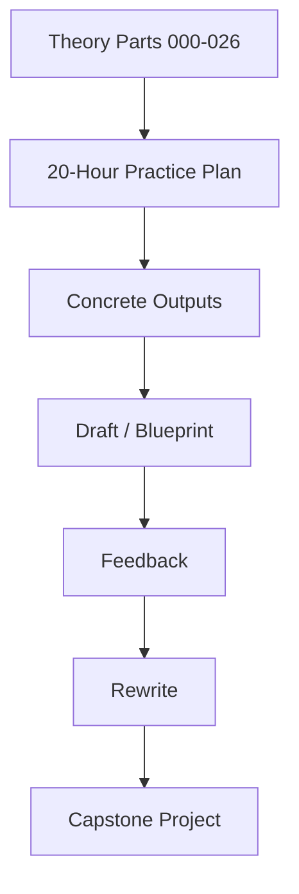
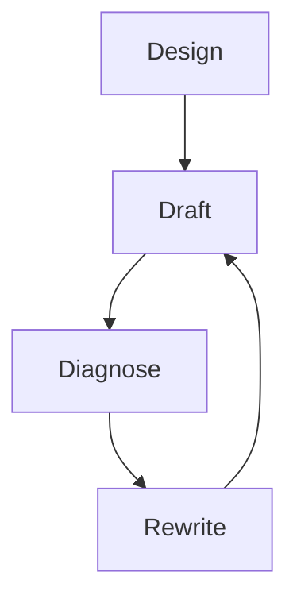

```mermaid
gantt
    title 20-Hour Screenwriting Practice
    dateFormat  X
    axisFormat %s
    section Phase 1 Core
    Idea/Logline/Theme/Character : 0, 4
    section Phase 2 Structure
    Beat/Scene/Visual : 4, 4
    section Phase 3 Draft
    Screenplay Pages : 8, 6
    section Phase 4 Rewrite
    Diagnosis/Rewrite : 14, 4
    section Phase 5 Feedback
    Feedback/Production/Next : 18, 2
```

# learn-screenwriting-film-script-part-027.md

# Part 027 — Latihan 20 Jam: Jadwal Praktik Terstruktur

> Seri: Learn Screenwriting for Film Project  
> Pendekatan: *The First 20 Hours* — Josh Kaufman  
> Fokus bagian ini: mengubah semua materi sebelumnya menjadi jadwal praktik 20 jam yang konkret, terukur, dan menghasilkan output nyata.  
> Target praktis: dalam 20 jam latihan sadar, Anda memiliki minimal satu paket naskah film pendek yang bisa dibaca/direvisi, atau satu blueprint feature film yang cukup kuat untuk menjadi treatment/outline lanjutan.

---

## 0. Posisi Part Ini dalam Roadmap

Dari Part 000 sampai Part 026, kita sudah membangun banyak komponen:

- mental model screenplay,
- framework Josh Kaufman,
- project definition,
- premis/logline,
- tema,
- karakter,
- antagonis/oposisi,
- konflik,
- struktur,
- beat sheet,
- scene design,
- visual storytelling,
- format screenplay,
- dialog,
- exposition,
- genre/tone,
- worldbuilding,
- film pendek,
- feature film,
- treatment/outline,
- drafting,
- rewrite,
- feedback/table read,
- production-aware writing,
- kolaborasi,
- tooling/workflow.

Sekarang kita perlu menjawab pertanyaan praktis:

```text
Kalau saya hanya punya 20 jam latihan serius, apa yang harus saya lakukan jam demi jam?
```

Bagian ini adalah operational plan.

Bukan lagi “apa itu screenwriting”, tetapi:

```text
Hari ini saya duduk 60 menit. Apa output yang harus selesai?
Besok saya lanjut. Apa yang saya ukur?
Kapan saya draft?
Kapan saya rewrite?
Kapan saya minta feedback?
Kapan saya berhenti polish?
```

Diagram transformasi:



Part ini adalah jembatan menuju Part 028 dan 029, yaitu capstone project.

---

## 1. Prinsip Kaufman: Apa yang Kita Ambil?

Dalam *The First 20 Hours*, Josh Kaufman menekankan bahwa belajar skill baru secara cepat bukan berarti menjadi master dalam 20 jam. Targetnya adalah mencapai level cukup kompeten untuk melakukan skill tersebut secara nyata.

Untuk screenwriting, target 20 jam bukan:

```text
Menjadi screenwriter profesional top-tier.
```

Target realistis:

```text
Mampu mengembangkan ide menjadi logline, karakter, struktur, scene list, draft kasar, rewrite awal, dan feedback loop sederhana.
```

Empat prinsip Kaufman yang kita pakai:

1. **Deconstruct the skill**  
   Pecah screenwriting menjadi sub-skill kecil.

2. **Learn enough to self-correct**  
   Pelajari cukup teori agar bisa melihat kesalahan sendiri.

3. **Remove practice barriers**  
   Siapkan tool, template, jadwal, dan environment agar tidak stuck.

4. **Practice at least 20 hours**  
   Latihan nyata, bukan hanya membaca materi.

Diagram:


---

## 2. Target 20 Jam Ini

Ada dua jalur utama.

### Jalur A — Film Pendek

Output akhir:

```text
1. Logline film pendek.
2. Treatment 5 paragraf.
3. Beat sheet 8-12 beat.
4. Scene list 5-10 scene.
5. Draft screenplay kasar 5-15 halaman.
6. Rewrite plan.
7. Minimal satu scene direwrite.
8. Production scope audit sederhana.
9. Feedback/table read plan.
```

Ini jalur paling direkomendasikan jika tujuan Anda adalah segera membuat project film.

### Jalur B — Feature Blueprint

Output akhir:

```text
1. Logline feature.
2. Synopsis 1 halaman.
3. 8-sequence outline.
4. 40-beat awal.
5. Scene list Act 1.
6. Character arc map.
7. Midpoint/all-is-lost/climax.
8. Production scope audit.
9. Rewrite/feedback plan.
```

Jalur ini cocok jika project film Anda adalah film panjang, tetapi dalam 20 jam kita belum menargetkan 100 halaman draft penuh.

Rekomendasi:

```text
Untuk 20 jam pertama, pilih Jalur A jika Anda ingin hasil cepat yang bisa diproduksi.
Pilih Jalur B jika project nyata Anda memang feature dan Anda butuh blueprint besar.
```

---

## 3. Skill yang Tidak Kita Kejar dalam 20 Jam Pertama

Agar fokus, kita sengaja tidak mengejar semuanya.

Belum menjadi target utama:

- polishing dialog sampai final,
- menulis feature 100 halaman lengkap,
- menguasai semua genre,
- menjadi ahli format industri,
- membuat shooting script lengkap,
- budgeting detail profesional,
- pitch deck lengkap,
- legal contract/rights,
- produksi fisik film,
- editing/post-production.

Kita fokus pada skill inti:

```text
Membuat cerita yang bisa menjadi screenplay.
```

Jika fondasi ini kuat, skill lain bisa dibangun setelahnya.

---

## 4. Definisi “Selesai” untuk 20 Jam

Untuk film pendek, 20 jam dianggap berhasil jika Anda punya:

```text
Draft kasar yang bisa dibaca dari awal sampai akhir.
```

Bukan draft sempurna. Draft yang:

- punya opening image,
- punya konflik,
- punya pilihan final,
- punya final image,
- punya format screenplay dasar,
- punya masalah yang bisa didiagnosis,
- bisa dibaca orang lain.

Untuk feature blueprint, 20 jam dianggap berhasil jika Anda punya:

```text
Blueprint struktur yang cukup kuat untuk masuk treatment/outline detail.
```

Bukan screenplay lengkap.

---

## 5. Jangan Mengukur dengan “Bagus atau Tidak”

Pada 20 jam pertama, metrik utama bukan:

```text
Apakah ini masterpiece?
```

Metrik utama:

```text
Apakah saya menghasilkan artifact nyata?
Apakah saya bisa melihat problem-nya?
Apakah saya tahu next rewrite?
Apakah saya bisa menjelaskan story core?
Apakah saya menyelesaikan loop practice?
```

Metrik 20 jam:

| Area | Metrik |
|---|---|
| Ide | minimal 10 logline variants |
| Struktur | beat sheet selesai |
| Scene | scene list selesai |
| Draft | minimal 5 halaman screenplay |
| Rewrite | minimal 1 scene direwrite |
| Feedback | minimal 1 feedback/self-diagnosis loop |
| Production | cost/value audit sederhana |
| Learning | postmortem singkat |

---

## 6. Mode Latihan

Ada empat mode yang akan bergantian:

### 6.1 Design Mode

Untuk:

- logline,
- tema,
- karakter,
- struktur,
- outline.

Output: dokumen rencana.

### 6.2 Drafting Mode

Untuk:

- menulis scene,
- menulis action/dialog,
- menyelesaikan halaman.

Output: screenplay pages.

### 6.3 Diagnostic Mode

Untuk:

- self-read,
- scene turn audit,
- rewrite issue,
- feedback triage.

Output: diagnosis dan task.

### 6.4 Rewrite Mode

Untuk:

- memperbaiki struktur/scene/dialog,
- production pass,
- polish dasar.

Output: versi lebih baik.

Diagram:



Jangan mencampur terlalu banyak mode dalam satu jam.

---

## 7. Struktur 20 Jam

20 jam dibagi menjadi 5 fase.

| Fase | Jam | Fokus |
|---|---:|---|
| 1 | 1–4 | Core story: ide, logline, tema, karakter |
| 2 | 5–8 | Struktur: genre, beat, scene list, visual core |
| 3 | 9–14 | Drafting: menulis scene/pages |
| 4 | 15–18 | Diagnosis dan rewrite |
| 5 | 19–20 | Feedback/production/final plan |

Diagram:



---

## 8. Persiapan Sebelum Jam Pertama

Jangan habiskan jam pertama untuk setup terlalu lama. Siapkan minimal:

```text
project-folder/
  project-brief.md
  logline.md
  character.md
  beat-sheet.md
  scene-list.md
  draft-001.fountain
  writing-log.md
```

Tool minimal:

- editor teks,
- timer,
- folder project,
- template scene card,
- tempat export/share jika perlu.

Waktu setup maksimal:

```text
30 menit di luar 20 jam, atau masukkan ke Hour 1 jika belum siap.
```

Barrier removal:

- pilih satu tool,
- matikan notifikasi,
- siapkan template,
- tentukan jadwal,
- tentukan track A atau B.

---

## 9. Jalur A vs Jalur B

Setiap jam akan punya dua opsi output:

- **Jalur A: Film Pendek**
- **Jalur B: Feature Blueprint**

Jika bingung, pilih Jalur A.

Film pendek lebih cocok untuk latihan cepat karena Anda akan mengalami full cycle:

```text
ide → draft → rewrite → feedback
```

Feature blueprint lebih cocok jika Anda ingin mengembangkan project panjang, tetapi feedback cycle-nya belum sampai full screenplay.

---

# FASE 1 — CORE STORY

---

## 10. Hour 1 — Project Brief dan Skill Contract

### Tujuan

Menentukan project yang akan dilatih selama 20 jam.

### Jangan Mulai dengan Cerita Besar

Mulai dengan constraint.

Pertanyaan:

```text
Saya ingin menulis film apa?
Durasi berapa?
Genre apa?
Emosi utama apa?
Resource apa yang mungkin tersedia?
Kenapa cerita ini penting bagi saya?
```

### Output Jalur A — Film Pendek

Isi project brief:

```text
Title working:
Format: short film
Target duration: 5–15 minutes
Genre:
Tone:
Core image:
Main character:
Main conflict:
Main object:
Location constraint:
Why this story:
```

Contoh:

```text
Title:
Kunci di Meja Makan

Format:
Short film, 10 minutes.

Genre:
Family mystery drama.

Tone:
Restrained, tense, melancholic, bitter humor.

Core image:
Kunci kecil diletakkan di tengah meja makan.

Main character:
Raka, anak yang pulang untuk menjual rumah.

Main conflict:
Ia harus meminta kunci ruang kerja dari keluarga yang tidak lagi percaya padanya.

Main object:
Kunci, map penjualan, piring.

Location:
Ruang makan rumah lama.
```

### Output Jalur B — Feature Blueprint

Isi project brief:

```text
Title working:
Format: feature film
Target duration:
Genre:
Tone:
Central world:
Protagonist:
Core conflict:
Scope center:
Why feature:
Production ambition:
```

### Latihan 60 Menit

| Menit | Aktivitas |
|---:|---|
| 0–10 | Setup file dan timer |
| 10–25 | Tulis 5 possible project ideas |
| 25–40 | Pilih 1 berdasarkan feasibility + emotional charge |
| 40–55 | Isi project brief |
| 55–60 | Tulis next question |

### Acceptance Criteria

- [ ] Format project jelas.
- [ ] Genre/tone awal jelas.
- [ ] Protagonist awal ada.
- [ ] Konflik awal ada.
- [ ] Constraint awal ada.
- [ ] Anda tahu kenapa cerita ini penting.

---

## 11. Hour 2 — Premis dan Logline Sprint

### Tujuan

Mengubah ide menjadi premis dan logline yang operasional.

### Target

Buat minimal:

```text
10 logline variants
```

Jangan cari satu kalimat sempurna terlalu cepat. Buat banyak versi.

### Formula

```text
Ketika [inciting event], seorang [protagonist spesifik] harus [goal eksternal] sebelum/meskipun [obstacle/pressure], tetapi [internal/moral cost] memaksanya [choice/change].
```

### Output Jalur A

Minimal 10 logline short.

Contoh:

```text
1. Malam sebelum rumah keluarganya dijual, seorang anak yang pulang membawa map penjualan harus mendapatkan kunci ruang kerja ayah dari ibunya, tetapi kunci itu justru diberikan kepada adiknya yang tidak lagi percaya padanya.

2. Seorang anak yang menganggap rumah warisan sebagai aset harus meminta kunci ruang kerja ayah dari keluarga yang ia tinggalkan, sebelum pembeli datang pagi hari dan rahasia rumah ikut terkunci selamanya.
```

Pilih 1 working logline.

### Output Jalur B

10 logline feature.

Pilih 1 dengan:

- protagonist jelas,
- goal sustain,
- opposition sustain,
- moral cost,
- feature scope.

### Latihan 60 Menit

| Menit | Aktivitas |
|---:|---|
| 0–10 | Tulis premise 1 kalimat |
| 10–35 | Tulis 10 logline variants |
| 35–45 | Skor dengan 1–5: clarity, conflict, stakes, visual, feasibility |
| 45–55 | Pilih 1–2 terbaik |
| 55–60 | Tulis masalah logline yang masih lemah |

### Logline Score

| Kriteria | Skor 1–5 |
|---|---:|
| Protagonist jelas |  |
| Goal eksternal jelas |  |
| Obstacle jelas |  |
| Stakes terasa |  |
| Visual/filmable |  |
| Genre terasa |  |
| Feasible |  |

### Acceptance Criteria

- [ ] Minimal 10 logline.
- [ ] 1 logline dipilih.
- [ ] Goal eksternal jelas.
- [ ] Obstacle jelas.
- [ ] Stakes/moral pressure ada.

---

## 12. Hour 3 — Theme, Genre, Tone

### Tujuan

Menentukan janji pengalaman dan pertanyaan moral film.

### Output Utama

```text
Theme question:
Genre contract:
Tone north star:
Audience expectation:
```

### Theme Formula

```text
Apakah [nilai A] lebih penting daripada [nilai B] ketika [situasi tekanan]?
```

Contoh:

```text
Apakah keluarga masih layak dilindungi jika perlindungan itu membutuhkan kebohongan?
```

### Genre Contract

```text
Penonton datang untuk merasakan:
Mereka berharap melihat:
Mandatory scene:
Forbidden move:
```

### Tone North Star

Gunakan axis:

```text
Light / Dark:
Sincere / Ironic:
Grounded / Stylized:
Hopeful / Bleak:
Intimate / Epic:
Restrained / Operatic:
```

### Output Jalur A

Untuk short:

```text
Theme as choice:
Genre:
Tone:
Mandatory scene:
Final emotional promise:
```

### Output Jalur B

Untuk feature:

```text
Theme progression:
Primary genre:
Secondary genre:
Tone palette:
Audience expectation matrix:
```

### Latihan 60 Menit

| Menit | Aktivitas |
|---:|---|
| 0–15 | Tulis 5 possible theme questions |
| 15–25 | Pilih 1 theme question |
| 25–35 | Tulis genre contract |
| 35–45 | Tulis tone axes |
| 45–55 | Tulis 5 audience expectations |
| 55–60 | Tulis tone danger |

### Acceptance Criteria

- [ ] Theme bukan slogan, tetapi pertanyaan.
- [ ] Genre jelas.
- [ ] Tone jelas.
- [ ] Ada forbidden tonal move.
- [ ] Ending emotional promise awal diketahui.

---

## 13. Hour 4 — Character Kernel dan Opposition

### Tujuan

Mendesain protagonist dan force yang menekannya.

### Character Kernel

```text
Name:
Want:
Need:
Lie:
Flaw:
Fear:
Mask:
Wound/absence:
Final choice:
```

### Opposition Kernel

```text
Main opposition:
What it wants:
How it blocks protagonist:
How it escalates:
Theme counter-position:
```

### Output Jalur A

Untuk short, cukup:

- protagonist,
- 1–2 supporting character,
- opposition in scene,
- object conflict.

Contoh:

```text
Raka:
Want: kunci.
Need: meminta trust, bukan mengambil kontrol.
Lie: akses dokumen sama dengan menyelesaikan keluarga.
Flaw: transactional control.

Ibu:
Opposition: menjaga rahasia sebagai perlindungan.
Tactic: domestic ritual, makan, silence.

Dina:
Moral mirror: menantang Raka untuk meminta, bukan memerintah.
```

### Output Jalur B

Untuk feature:

- protagonist arc phases,
- antagonist/opposition network,
- supporting character function table.

### Latihan 60 Menit

| Menit | Aktivitas |
|---:|---|
| 0–20 | Isi protagonist kernel |
| 20–35 | Isi opposition kernel |
| 35–45 | Isi supporting character function |
| 45–55 | Tulis final choice |
| 55–60 | Tulis character risk |

### Acceptance Criteria

- [ ] Protagonist punya want eksternal.
- [ ] Protagonist punya need internal.
- [ ] Opposition bukan hanya hambatan random.
- [ ] Final choice mulai terlihat.
- [ ] Supporting character punya fungsi.

---

# FASE 2 — STRUCTURE AND SCENE MAP

---

## 14. Hour 5 — Conflict Engine dan Stakes

### Tujuan

Membuat cerita punya tekanan yang bisa sustain.

### Conflict Engine Template

```text
Protagonist wants:
Opposition blocks:
Stakes if fail:
Time pressure:
Moral cost:
Relationship cost:
Object at center:
Escalation path:
```

### Output Jalur A

Short conflict map:

```text
Raka wants key tonight.
Ibu blocks.
Dina becomes gatekeeper.
Pembeli comes tomorrow morning.
If fail: house sale fails / truth remains locked.
Moral cost: Raka must ask, not control.
Object: key.
```

### Output Jalur B

Feature tension stack:

- economic,
- family,
- legal,
- social,
- moral,
- mystery,
- time,
- antagonist.

### Latihan 60 Menit

| Menit | Aktivitas |
|---:|---|
| 0–15 | Isi conflict engine |
| 15–30 | Buat 10 stakes/consequence |
| 30–45 | Buat escalation ladder 8 step |
| 45–55 | Pilih object/deadline central |
| 55–60 | Tulis weak conflict warning |

### Acceptance Criteria

- [ ] Conflict bukan hanya debat.
- [ ] Stakes lebih dari satu layer.
- [ ] Deadline/urgency ada.
- [ ] Escalation tidak repetitif.
- [ ] Object konflik jelas.

---

## 15. Hour 6 — Structure Choice

### Tujuan

Menentukan bentuk struktur.

### Jalur A — Short Film Structure

Pilih salah satu:

```text
5-Part Short:
1. Situation
2. Disruption
3. Escalation
4. Choice
5. Consequence / Final Image
```

Atau:

```text
8-Beat Short:
1. Opening image
2. Character current state
3. Disruption
4. First tactic
5. Complication
6. Crisis/choice
7. Consequence
8. Final image
```

### Jalur B — Feature Structure

Gunakan 8 sequence:

```text
Seq 1 Setup
Seq 2 Lock-in
Seq 3 First Strategy
Seq 4 Midpoint Build
Seq 5 New Game
Seq 6 Collapse
Seq 7 Crisis/Final Plan
Seq 8 Climax/Resolution
```

### Latihan 60 Menit

| Menit | Jalur A | Jalur B |
|---:|---|---|
| 0–15 | Isi 5-part short | Isi 8 sequence title |
| 15–35 | Tulis 8 beat | Tulis input/output tiap sequence |
| 35–50 | Tulis opening/final image | Tulis midpoint/all-is-lost/climax |
| 50–60 | Check causality | Check sequence escalation |

### Acceptance Criteria

- [ ] Opening image ada.
- [ ] Final image ada.
- [ ] Midpoint/choice jelas sesuai format.
- [ ] Struktur bukan “and then”.
- [ ] Causality awal terlihat.

---

## 16. Hour 7 — Beat Sheet

### Tujuan

Mengubah struktur menjadi beat yang bisa dieksekusi.

### Beat Template

```text
Beat:
Before:
Event:
Conflict:
Turn:
After:
Why next:
```

### Jalur A

Buat 8–12 beat short.

Contoh:

```text
1. Raka tiba dengan map.
2. Ibu menaruh piring di atas map.
3. Raka meminta tanda tangan.
4. Ia melihat kunci.
5. Dina menyadari ada rahasia.
6. Ibu melepas kunci.
7. Kunci diberikan ke Dina.
8. Raka harus memilih meminta atau memerintah.
9. Raka duduk dan meminta bantuan.
10. Kunci diletakkan di meja.
```

### Jalur B

Buat 40-beat awal feature:

- 5 beat per sequence,
- total 40 beat,
- belum harus detail scene.

### Latihan 60 Menit

| Menit | Aktivitas |
|---:|---|
| 0–20 | Tulis beat kasar |
| 20–35 | Tambahkan before/after |
| 35–45 | Tambahkan conflict/turn |
| 45–55 | Therefore/but test |
| 55–60 | Tandai weak beat |

### Acceptance Criteria

- [ ] Minimal 8 beat untuk short atau 40 beat feature.
- [ ] Setiap beat punya perubahan.
- [ ] Beat saling menyebabkan.
- [ ] Tidak terlalu banyak exposition beat.
- [ ] Final beat membayar opening.

---

## 17. Hour 8 — Scene List dan Visual Core

### Tujuan

Mengubah beat menjadi scene list.

### Scene Card Minimal

```text
Scene:
Heading:
Characters:
Input:
Objective:
Opposition:
Turn:
Output:
Key object:
Visual/Sound:
Estimated pages:
```

### Jalur A

Buat 5–10 scene list.

Untuk short 10 menit, target:

```text
5 scenes
```

### Jalur B

Buat scene list Act 1 atau Sequence 1–2.

Target:

```text
8–15 scenes
```

### Visual Core

Untuk setiap scene, tulis:

```text
Visual object:
Sound:
Power position:
Final beat:
```

### Latihan 60 Menit

| Menit | Aktivitas |
|---:|---|
| 0–20 | Pecah beat menjadi scene |
| 20–35 | Isi scene objective/turn/output |
| 35–45 | Tambahkan visual/sound core |
| 45–55 | Page estimate |
| 55–60 | Pilih scene pertama untuk draft |

### Acceptance Criteria

- [ ] Scene list selesai.
- [ ] Setiap scene punya turn.
- [ ] Scene output memicu scene berikutnya.
- [ ] Visual/object ada.
- [ ] Estimated page count realistis.

---

# FASE 3 — DRAFTING

---

## 18. Hour 9 — Format Setup dan Opening Scene

### Tujuan

Mulai menulis screenplay page, bukan lagi notes.

### Output

```text
Draft file dibuat.
Opening scene kasar selesai.
```

### Prinsip

```text
Readable first. Beautiful later.
```

### Jalur A

Tulis scene 1 short.

Target:

```text
1–2 halaman.
```

### Jalur B

Tulis opening scene feature.

Target:

```text
2–3 halaman.
```

### Latihan 60 Menit

| Menit | Aktivitas |
|---:|---|
| 0–10 | Buka draft file, tulis title/version |
| 10–15 | Baca scene card |
| 15–45 | Draft scene 1 |
| 45–55 | Mark TODO, jangan polish |
| 55–60 | Update writing log |

### Opening Checklist

- [ ] Ada image.
- [ ] Protagonist state terlihat.
- [ ] Tone/genre mulai terasa.
- [ ] Tidak terlalu banyak backstory.
- [ ] Scene punya turn.

---

## 19. Hour 10 — Draft Scene 2: Disruption

### Tujuan

Menulis scene yang mengganggu status quo.

### Jalur A

Tulis scene disruption.

Contoh:

```text
Raka meminta tanda tangan; Ibu mengalihkan dengan makan; kunci terlihat.
```

### Jalur B

Tulis inciting incident/pressure.

Contoh:

```text
Buyer call, deadline, decision to go home.
```

### Latihan 60 Menit

| Menit | Aktivitas |
|---:|---|
| 0–10 | Baca output scene 1 |
| 10–15 | Baca scene card scene 2 |
| 15–45 | Draft scene 2 |
| 45–55 | Mark TODO |
| 55–60 | Update tracker |

### Acceptance Criteria

- [ ] Status quo terganggu.
- [ ] Goal eksternal makin jelas.
- [ ] Opposition muncul.
- [ ] Scene mengarah ke konflik utama.
- [ ] Ada turn.

---

## 20. Hour 11 — Draft Scene 3: Escalation

### Tujuan

Menulis escalation, bukan repetisi.

### Jalur A

Scene escalation:

```text
Raka meminta kunci; Dina mulai masuk konflik; Ibu menolak.
```

### Jalur B

Scene Act 1 escalation:

```text
Raka sampai rumah / first family conflict / legal obstacle.
```

### Latihan 60 Menit

| Menit | Aktivitas |
|---:|---|
| 0–10 | Tulis objective/opposition ulang |
| 10–40 | Draft scene |
| 40–50 | Cari tactic shift |
| 50–60 | Mark TODO dan lanjut |

### Tactic Shift

Pastikan scene tidak hanya:

```text
minta → ditolak → minta → ditolak
```

Tetapi:

```text
technical request → domestic avoidance → moral accusation → object transfer
```

### Acceptance Criteria

- [ ] Pressure naik.
- [ ] Power berubah atau information berubah.
- [ ] Supporting character punya fungsi.
- [ ] Dialog tidak hanya exposition.
- [ ] Scene punya output baru.

---

## 21. Hour 12 — Draft Scene 4: Choice Setup / Midpoint Setup

### Tujuan

Mendekatkan protagonist pada pilihan atau reveal besar.

### Jalur A

Scene choice setup:

```text
Ibu melepas kunci, tetapi memberikannya ke Dina.
```

Atau jika ini sudah terjadi, tulis scene sebelum final choice.

### Jalur B

Tulis scene yang membangun midpoint/lock-in.

Target:

```text
Raka tidak bisa lagi menganggap problem teknis.
```

### Latihan 60 Menit

| Menit | Aktivitas |
|---:|---|
| 0–10 | Baca beat menuju choice/reveal |
| 10–40 | Draft scene |
| 40–50 | Pastikan object bergerak |
| 50–60 | Mark TODO |

### Acceptance Criteria

- [ ] Choice/reveal disiapkan.
- [ ] Object/motif aktif.
- [ ] Stakes naik.
- [ ] Protagonist kehilangan atau mendapat power.
- [ ] Scene membuat final scene/next sequence perlu.

---

## 22. Hour 13 — Draft Scene 5: Choice / Consequence

### Tujuan

Untuk short: menyelesaikan draft kasar.  
Untuk feature: menyelesaikan chunk/sequence awal.

### Jalur A

Tulis final scene short.

Harus ada:

- choice,
- consequence,
- final image.

Contoh:

```text
Raka duduk dan meminta bantuan. Dina tidak langsung memberi kunci. Ia meletakkan kunci di meja.
```

### Jalur B

Tulis scene yang menyelesaikan Sequence 1 atau Act 1 chunk.

### Latihan 60 Menit

| Menit | Aktivitas |
|---:|---|
| 0–10 | Tulis final image / sequence output |
| 10–45 | Draft final scene/chunk |
| 45–55 | Pastikan ending tidak overexplained |
| 55–60 | Update status |

### Acceptance Criteria Jalur A

- [ ] Draft short punya ending.
- [ ] Final image ada.
- [ ] Choice protagonist terlihat.
- [ ] Opening dibayar.
- [ ] Draft kasar selesai end-to-end.

### Acceptance Criteria Jalur B

- [ ] Sequence punya output.
- [ ] Story bergerak ke next sequence.
- [ ] Protagonist committed atau tekanan naik.

---

## 23. Hour 14 — Draft Completion Pass

### Tujuan

Menutup lubang draft agar bisa dibaca.

### Jalur A

Baca draft short cepat, isi placeholder besar yang menghalangi pemahaman.

Jangan polish semua.

Target:

```text
Draft 001 readable.
```

### Jalur B

Lengkapi scene sequence/Act 1 yang masih bolong.

Target:

```text
Sequence/Act chunk readable.
```

### Latihan 60 Menit

| Menit | Aktivitas |
|---:|---|
| 0–20 | Baca draft kasar |
| 20–40 | Isi placeholder blocker |
| 40–50 | Rapikan format dasar |
| 50–60 | Export/simpan draft v001 |

### Acceptance Criteria

- [ ] Draft/chunk bisa dibaca dari awal ke akhir.
- [ ] Placeholder critical berkurang.
- [ ] TODO masih boleh ada.
- [ ] Draft version tersimpan.
- [ ] Anda tidak rewrite besar dulu.

---

# FASE 4 — DIAGNOSIS AND REWRITE

---

## 24. Hour 15 — Self Read dan Diagnosis

### Tujuan

Membaca draft sebagai pembaca, bukan sebagai penulis defensif.

### Aturan

```text
Jangan rewrite saat membaca.
Catat reaksi.
```

### Diagnosis Template

```text
What works:
What fails:
Where boring:
Where confusing:
Strongest image:
Weakest scene:
Protagonist clarity:
Ending clarity:
Top 3 issues:
```

### Latihan 60 Menit

| Menit | Aktivitas |
|---:|---|
| 0–25 | Full read / chunk read |
| 25–40 | Isi diagnosis |
| 40–50 | Scene turn audit |
| 50–60 | Tentukan top 3 rewrite issues |

### Acceptance Criteria

- [ ] Draft dibaca end-to-end.
- [ ] Top 3 masalah ditulis.
- [ ] Hal yang bekerja ditulis.
- [ ] Tidak langsung polish.
- [ ] Rewrite priority jelas.

---

## 25. Hour 16 — Scene Turn Audit dan Rewrite Plan

### Tujuan

Mengubah diagnosis menjadi rewrite plan.

### Scene Turn Audit

```text
Scene | Input | Turn | Output | Decision
```

Decision:

```text
keep
cut
merge
rewrite
expand
compress
```

### Rewrite Plan

```text
P1:
P2:
P3:
Do not change:
```

### Latihan 60 Menit

| Menit | Aktivitas |
|---:|---|
| 0–25 | Scene turn audit |
| 25–40 | Buat rewrite issue untuk 3 masalah |
| 40–50 | Buat do-not-change list |
| 50–60 | Pilih 1 scene untuk rewrite |

### Acceptance Criteria

- [ ] Semua scene punya input/turn/output atau ditandai.
- [ ] Rewrite plan ada.
- [ ] Do-not-change list ada.
- [ ] Prioritas bukan typo.
- [ ] Satu scene dipilih untuk rewrite.

---

## 26. Hour 17 — Rewrite Scene Terlemah

### Tujuan

Melakukan revisi nyata, bukan hanya diagnosis.

### Pilih scene yang:

- tidak punya turn,
- terlalu exposition,
- protagonist pasif,
- dialogue on-the-nose,
- ending tidak earned,
- atau scene paling critical.

### Rewrite Card

```text
Current function:
Problem:
New objective:
New opposition:
New turn:
Keep:
Cut:
Add:
New final beat:
```

### Latihan 60 Menit

| Menit | Aktivitas |
|---:|---|
| 0–10 | Isi rewrite card |
| 10–45 | Rewrite scene |
| 45–55 | Compare old vs new |
| 55–60 | Update changelog |

### Acceptance Criteria

- [ ] Scene baru punya objective.
- [ ] Opposition lebih jelas.
- [ ] Turn lebih kuat.
- [ ] Exposition berkurang atau lebih dramatik.
- [ ] Output state jelas.

---

## 27. Hour 18 — Dialogue / Exposition / Visual Pass

### Tujuan

Melakukan craft pass ringan pada draft/chunk.

Pilih satu fokus utama, jangan semua.

### Opsi Fokus

1. Dialogue subtext.
2. Exposition conversion.
3. Visual/object pass.
4. Production-aware simplification.
5. Final image strengthening.

### Jalur A

Untuk short, lakukan pass pada seluruh draft.

### Jalur B

Untuk feature chunk, lakukan pass pada 3–5 scene.

### Latihan 60 Menit

| Menit | Aktivitas |
|---:|---|
| 0–10 | Pilih pass |
| 10–35 | Tandai line/beat bermasalah |
| 35–55 | Rewrite targeted |
| 55–60 | Update draft version |

### Acceptance Criteria

- [ ] Minimal 5 perbaikan konkret.
- [ ] Tidak merusak scene function.
- [ ] Draft lebih playable/visual.
- [ ] Perubahan dicatat.
- [ ] Siap untuk feedback awal.

---

# FASE 5 — FEEDBACK, PRODUCTION, NEXT LOOP

---

## 28. Hour 19 — Feedback / Table Read Preparation

### Tujuan

Menyiapkan draft untuk dibaca orang lain atau simulasi feedback.

### Output

```text
Feedback brief
Reader questions
Table read plan
```

### Feedback Brief

```text
Project:
Draft version:
Genre/tone:
Stage:
I want feedback on:
Please don't focus on:
Questions:
```

### Jalur A

Jika punya orang:

- kirim draft short,
- atau lakukan table read mini.

Jika belum punya orang:

- lakukan self table read keras,
- rekam suara sendiri,
- isi observer sheet.

### Jalur B

Untuk feature:

- minta feedback treatment/sequence,
- bukan seluruh screenplay jika belum ada.

### Latihan 60 Menit

| Menit | Aktivitas |
|---:|---|
| 0–15 | Buat feedback brief |
| 15–30 | Buat reader questionnaire |
| 30–45 | Read aloud / table read plan |
| 45–55 | Catat first reaction |
| 55–60 | Update feedback tracker |

### Acceptance Criteria

- [ ] Draft punya feedback brief.
- [ ] Pertanyaan spesifik.
- [ ] Level feedback sesuai stage.
- [ ] Minimal self read aloud dilakukan atau dijadwalkan.
- [ ] Next feedback action jelas.

---

## 29. Hour 20 — Production Pass, Retrospective, Next Plan

### Tujuan

Menutup 20 jam dengan audit produksi, pembelajaran, dan rencana berikutnya.

### Production Scope Audit Ringkas

```text
Locations:
Characters:
Props:
Night/Exterior:
High-risk:
High-cost low-value:
Low-cost high-value:
Rewrite option:
```

### Retrospective

```text
What I finished:
What improved:
What still weak:
Biggest lesson:
Next 5 hours:
```

### Jalur A

Output final 20 jam:

- short draft v001/v002,
- rewrite notes,
- feedback plan,
- production audit.

### Jalur B

Output final 20 jam:

- feature blueprint,
- sequence outline,
- scene list Act 1,
- rewrite/feedback plan,
- production audit.

### Latihan 60 Menit

| Menit | Aktivitas |
|---:|---|
| 0–20 | Production scope audit |
| 20–35 | Cost/value score |
| 35–50 | Retrospective |
| 50–60 | Next 5-hour plan |

### Acceptance Criteria

- [ ] Production audit selesai.
- [ ] Retrospective selesai.
- [ ] Output 20 jam terkumpul.
- [ ] Next plan jelas.
- [ ] Anda tahu apakah lanjut Part 028 atau Part 029.

---

# 30. Ringkasan 20 Jam dalam Satu Tabel

| Jam | Fokus | Jalur A Output | Jalur B Output |
|---:|---|---|---|
| 1 | Project brief | short brief | feature brief |
| 2 | Logline | 10 logline + 1 chosen | 10 logline + 1 chosen |
| 3 | Theme/genre/tone | theme + tone | theme progression |
| 4 | Character/opposition | 3-character kernel | arc + opposition network |
| 5 | Conflict/stakes | conflict engine | tension stack |
| 6 | Structure | 5-part/8-beat | 8 sequence |
| 7 | Beat sheet | 8–12 beats | 40 beats |
| 8 | Scene list | 5–10 scenes | Act 1/Seq scene list |
| 9 | Opening draft | scene 1 | opening scene |
| 10 | Disruption draft | scene 2 | inciting/arrival |
| 11 | Escalation draft | scene 3 | Act 1 escalation |
| 12 | Choice setup | scene 4 | midpoint/lock-in setup |
| 13 | Consequence | final scene | sequence output |
| 14 | Completion pass | readable draft | readable chunk |
| 15 | Self diagnosis | top 3 issues | top 3 issues |
| 16 | Rewrite plan | scene audit | scene/sequence audit |
| 17 | Rewrite | weakest scene | key scene |
| 18 | Craft pass | dialogue/exposition/visual | targeted pass |
| 19 | Feedback prep | brief/table read | treatment/sequence feedback |
| 20 | Production/retro | audit + next | audit + next |

---

## 31. Jadwal Kalender yang Direkomendasikan

### Opsi 1 — 20 Hari, 1 Jam per Hari

Paling sustainable.

```text
Hari 1 = Hour 1
Hari 2 = Hour 2
...
Hari 20 = Hour 20
```

Cocok jika Anda bekerja full-time.

### Opsi 2 — 10 Hari, 2 Jam per Hari

Lebih cepat.

```text
Hari 1: Hour 1–2
Hari 2: Hour 3–4
...
Hari 10: Hour 19–20
```

### Opsi 3 — 5 Hari, 4 Jam per Hari

Bootcamp mini.

```text
Hari 1: Core story
Hari 2: Structure
Hari 3: Drafting 1
Hari 4: Drafting 2 + diagnosis
Hari 5: Rewrite + feedback + production
```

### Opsi 4 — 2 Weekend

```text
Weekend 1:
Hours 1–10

Weekend 2:
Hours 11–20
```

Pilih yang paling realistis.

---

## 32. Rekomendasi untuk Software Engineer yang Cenderung Deterministic

Anda mungkin merasa tidak nyaman karena screenwriting tidak deterministic.

Gunakan mental model:

```text
Screenwriting bukan mencari satu jawaban benar.
Screenwriting adalah search problem dengan constraints, feedback, dan iterative refinement.
```

Mirip:

```text
heuristic search
design iteration
debugging ambiguous system
human-centered product design
```

Cara berpikir:

| Engineering | Screenwriting |
|---|---|
| Requirements | Genre/tone/theme/format |
| User stories | Audience expectation |
| System design | Structure |
| State machine | Character arc |
| Unit test | Scene turn test |
| Integration test | Full draft read |
| Logs | Feedback/table read |
| Refactor | Rewrite |
| Performance constraint | Production constraint |
| Regression test | Setup/payoff continuity |

Tetapi ingat:

```text
Tidak semua yang bernilai bisa diukur secara angka.
Taste tetap perlu dilatih.
```

---

## 33. Practice Barrier Removal Checklist

Sebelum setiap sesi:

- [ ] Timer siap.
- [ ] File yang dibutuhkan terbuka.
- [ ] Scene/task jelas.
- [ ] Notifikasi mati.
- [ ] Target output kecil.
- [ ] Tidak ada research rabbit hole.
- [ ] Tidak ada tool switching.
- [ ] Mode sesi jelas: design/draft/diagnose/rewrite.
- [ ] Definition of done jelas.

Jika tidak jelas, gunakan 5 menit pertama untuk menulis:

```text
Session goal:
Output:
Stop condition:
```

---

## 34. “Stop Condition” untuk Tiap Jam

Setiap jam harus punya stop condition.

Contoh:

```text
Hour 2 stop condition:
10 logline variants + 1 chosen.
```

```text
Hour 9 stop condition:
Opening scene rough complete, even if ugly.
```

```text
Hour 17 stop condition:
One weak scene rewritten with clearer turn.
```

Stop condition mencegah perfeksionisme.

---

## 35. Definition of Done per Artifact

### Logline Done

- protagonist,
- goal,
- obstacle,
- stakes,
- genre hint.

### Character Kernel Done

- want,
- need,
- lie,
- flaw,
- final choice.

### Beat Sheet Done

- 8–12 beats short or 40 beats feature,
- before/after,
- causality.

### Scene List Done

- heading,
- objective,
- turn,
- output.

### Draft Done

- readable,
- complete,
- TODO marked,
- not polished.

### Rewrite Done

- issue addressed,
- acceptance criteria checked,
- changelog updated.

---

## 36. Self-Correction Questions per Session

Setelah sesi, jawab:

```text
Apa yang saya hasilkan?
Apa yang masih kabur?
Apa masalah terbesar?
Apa next action paling kecil?
Apa yang tidak boleh saya lakukan besok?
```

Contoh:

```text
Saya menghasilkan scene dinner 3 halaman.
Masih kabur: Ibu terlalu cryptic.
Masalah: Raka terlalu agresif.
Next: rewrite tactic ladder.
Don't: polish typo dulu.
```

---

## 37. Metrics Board

Track:

```text
Hours completed:
Artifacts completed:
Scenes drafted:
Pages drafted:
Open P1 issues:
Feedback received:
Next session:
```

Contoh:

```text
Hours completed: 13/20
Scenes drafted: 5/5
Pages: 9
Open P1: Raka empathy, ending clarity
Next: full read
```

Progress terlihat.

---

## 38. Common Failure Modes dalam 20 Jam

### 38.1 Terlalu Lama di Ide

Gejala:

```text
Hour 8 tapi masih memilih ide.
```

Fix:

```text
Pick one. 20-hour practice is for learning, not choosing perfect idea.
```

### 38.2 Over-Structuring

Gejala:

```text
Beat sheet rapi, draft tidak mulai.
```

Fix:

```text
Hour 9 wajib draft.
```

### 38.3 Drafting Loop

Gejala:

```text
Scene 1 dipoles terus.
```

Fix:

```text
Write forward until complete.
```

### 38.4 Feedback Too Early

Gejala:

```text
Kirim logline dan minta feedback dialog.
```

Fix:

```text
Match feedback to artifact.
```

### 38.5 Rewrite Without Diagnosis

Gejala:

```text
Mengubah semua karena satu catatan.
```

Fix:

```text
Top 3 issues first.
```

### 38.6 Tooling Escape

Gejala:

```text
Folder, template, Git, Notion bagus; draft kosong.
```

Fix:

```text
Every tool session ends with writing.
```

### 38.7 No Ending

Gejala:

```text
Draft punya setup tapi tidak selesai.
```

Fix:

```text
Write bad ending. Rewrite later.
```

---

## 39. Troubleshooting Table

| Problem | Likely Cause | Fix |
|---|---|---|
| Tidak tahu cerita tentang apa | theme/logline kabur | Hour 2–3 ulang 30 menit |
| Character pasif | want/agency lemah | Hour 4 revisit |
| Scene datar | objective/opposition tidak jelas | scene card rewrite |
| Dialog buruk | terlalu literal | tulis dulu, subtext pass Hour 18 |
| Act/short middle repetitif | escalation lemah | conflict ladder |
| Ending tidak earned | final choice tidak disiapkan | add setup beat |
| Draft mahal | scope tidak diaudit | production pass Hour 20 |
| Feedback bikin bingung | no triage | pattern table |
| Tidak selesai | perfeksionisme | complete before perfect |

---

## 40. 20-Hour Practice Log Template

```text
# 20-Hour Practice Log

Project:
Track: Short / Feature
Start date:
Target end date:

## Hour 1
Goal:
Output:
Notes:
Next:

## Hour 2
...

## Summary
Total hours:
Artifacts:
Draft pages:
Top lessons:
Next 5 hours:
```

---

## 41. Hour Log Entry Template

```text
## Hour X — [Title]

Date:
Start:
End:
Mode:
Goal:
Output:
What worked:
Problem:
Decision:
Next:
```

Contoh:

```text
## Hour 11 — Escalation Scene

Mode:
Drafting.

Goal:
Draft scene where Raka asks for key and Dina enters conflict.

Output:
2.5 pages rough.

What worked:
Dina voice.

Problem:
Ibu too cryptic.

Decision:
Keep key transfer but rewrite Ibu line later.

Next:
Draft choice scene.
```

---

## 42. Deliverable Checklist Jalur A

Setelah 20 jam, film pendek harus punya:

- [ ] Project brief.
- [ ] Working title.
- [ ] Logline.
- [ ] Theme question.
- [ ] Genre/tone.
- [ ] Character kernel.
- [ ] Conflict engine.
- [ ] 8–12 beat sheet.
- [ ] 5–10 scene list.
- [ ] Draft screenplay 5–15 pages.
- [ ] Self diagnosis.
- [ ] Rewrite plan.
- [ ] 1 rewritten scene.
- [ ] Feedback brief.
- [ ] Production scope audit.
- [ ] Next action.

Jika semua ada, Anda berhasil.

---

## 43. Deliverable Checklist Jalur B

Setelah 20 jam, feature blueprint harus punya:

- [ ] Project brief.
- [ ] Working title.
- [ ] Logline.
- [ ] Theme question.
- [ ] Genre/tone.
- [ ] Protagonist arc.
- [ ] Opposition network.
- [ ] Tension stack.
- [ ] 8 sequence outline.
- [ ] 40-beat sheet.
- [ ] Scene list Act 1 atau Sequence 1–2.
- [ ] Draft beberapa opening pages atau key scene.
- [ ] Midpoint/all-is-lost/climax notes.
- [ ] Production scope audit.
- [ ] Feedback plan.
- [ ] Next 20-hour plan.

---

## 44. Apa yang Dilakukan Setelah 20 Jam?

Setelah 20 jam, jangan langsung mulai ide baru kecuali memang latihan selesai.

Tentukan next path:

### Jika Jalur A

Lanjut Part 028:

```text
Capstone Project: Menulis Naskah Film Pendek dari Nol
```

Anda akan membuat versi yang lebih serius dari short, dari ide sampai draft siap table read/produksi awal.

### Jika Jalur B

Lanjut Part 029:

```text
Capstone Lanjutan: Blueprint Feature Film / Film Panjang
```

Anda akan memperluas blueprint feature menjadi treatment/outline yang lebih matang.

### Jika Draft Masih Lemah

Ulangi sebagian jam:

- Hour 2–4 jika core lemah.
- Hour 6–8 jika struktur lemah.
- Hour 9–14 jika draft belum selesai.
- Hour 15–18 jika rewrite belum jelas.
- Hour 19–20 jika feedback/production belum ada.

20 jam bukan sekali seumur hidup. Ini loop.

---

## 45. Next 5-Hour Extension

Jika ingin lanjut setelah 20 jam, gunakan 5 jam tambahan.

### Untuk Short

| Jam | Fokus |
|---:|---|
| 21 | Table read |
| 22 | Feedback triage |
| 23 | Rewrite structure/scene |
| 24 | Dialogue/visual polish |
| 25 | Production draft prep |

### Untuk Feature

| Jam | Fokus |
|---:|---|
| 21 | Treatment expansion |
| 22 | Full sequence audit |
| 23 | Act 1 draft |
| 24 | Act 2A beat refinement |
| 25 | Feedback on treatment |

---

## 46. 20-Hour Loop untuk Skill Lain

Setelah screenwriting core, Anda bisa membuat 20-hour loop lanjutan:

- 20 jam dialog,
- 20 jam film pendek production,
- 20 jam directing actors,
- 20 jam cinematography basics,
- 20 jam editing short film,
- 20 jam sound design,
- 20 jam comedy writing,
- 20 jam horror writing,
- 20 jam feature outlining,
- 20 jam rewrite mastery.

Skill film adalah ekosistem. Jangan semua sekaligus.

---

## 47. Mental Model Akhir untuk 20 Jam

20 jam pertama bukan tentang menjadi ahli.

20 jam pertama adalah tentang membuktikan:

```text
Saya bisa bergerak dari ide ke artifact.
Saya bisa menulis meski belum sempurna.
Saya bisa melihat masalah.
Saya bisa merevisi.
Saya bisa meminta feedback.
Saya bisa membuat cerita lebih filmik.
```

Ini sangat besar.

Banyak orang berhenti di ide.  
Anda harus sampai artifact.

---

## 48. Ringkasan Part Ini

Latihan 20 jam harus menghasilkan output nyata, bukan hanya pemahaman.

Hal paling penting:

1. Pilih jalur: film pendek atau feature blueprint.
2. Fokus pada artifact, bukan kesempurnaan.
3. Jam 1–4 membangun core story.
4. Jam 5–8 membangun struktur dan scene list.
5. Jam 9–14 menulis draft.
6. Jam 15–18 melakukan diagnosis dan rewrite.
7. Jam 19–20 menyiapkan feedback, production audit, dan next plan.
8. Gunakan stop condition tiap jam.
9. Gunakan definition of done.
10. Jangan polish terlalu awal.
11. Jangan over-tooling.
12. Jangan menghindari ending.
13. Feedback harus spesifik.
14. Production awareness masuk sebelum terlalu terlambat.
15. Setelah 20 jam, lanjut ke capstone, bukan kembali ke teori tanpa praktik.

Formula inti:

```text
20 Hours = Core + Structure + Draft + Diagnose + Rewrite + Feedback + Production Awareness
```

Jika dilakukan dengan disiplin, 20 jam ini cukup untuk mengubah screenwriting dari sesuatu yang abstrak menjadi proses yang bisa Anda jalankan.

---

## 49. Status Seri

- Part 000: selesai.
- Part 001: selesai.
- Part 002: selesai.
- Part 003: selesai.
- Part 004: selesai.
- Part 005: selesai.
- Part 006: selesai.
- Part 007: selesai.
- Part 008: selesai.
- Part 009: selesai.
- Part 010: selesai.
- Part 011: selesai.
- Part 012: selesai.
- Part 013: selesai.
- Part 014: selesai.
- Part 015: selesai.
- Part 016: selesai.
- Part 017: selesai.
- Part 018: selesai.
- Part 019: selesai.
- Part 020: selesai.
- Part 021: selesai.
- Part 022: selesai.
- Part 023: selesai.
- Part 024: selesai.
- Part 025: selesai.
- Part 026: selesai.
- Part 027: selesai.
- Part 028: berikutnya.

Seri **belum selesai**. Bagian berikutnya adalah:

> **Part 028 — Capstone Project: Menulis Naskah Film Pendek dari Nol**
