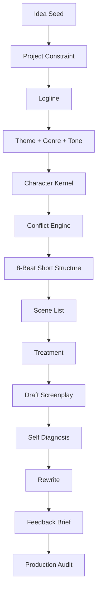

# learn-screenwriting-film-script-part-028.md

# Part 028 — Capstone Project: Menulis Naskah Film Pendek dari Nol

> Seri: Learn Screenwriting for Film Project  
> Pendekatan: *The First 20 Hours* — Josh Kaufman  
> Fokus bagian ini: menerapkan semua materi Part 000–027 ke satu proyek film pendek dari nol sampai draft yang bisa dibaca, direwrite, dan dipersiapkan untuk produksi awal.  
> Target praktis: menghasilkan paket lengkap film pendek: ide, logline, theme, karakter, beat sheet, scene list, treatment, draft screenplay, rewrite plan, feedback brief, dan production scope audit.

---

## 0. Posisi Part Ini dalam Roadmap

Part 027 memberi jadwal latihan 20 jam.

Part 028 adalah implementasi capstone untuk **film pendek**.

Di sini kita tidak lagi membahas teori secara terpisah. Kita akan mengerjakan satu proyek end-to-end:

```text
Ide → Premis → Logline → Theme → Character → Conflict → Beat → Scene List → Treatment → Draft → Diagnosis → Rewrite → Feedback Prep → Production Audit
```

Film pendek adalah format terbaik untuk capstone awal karena:

- scope kecil,
- bisa selesai,
- bisa difilmkan,
- feedback loop cepat,
- semua skill inti screenwriting muncul dalam bentuk terkonsentrasi,
- kesalahan terlihat jelas,
- rewrite bisa dilakukan tanpa tenggelam 100 halaman.

Tujuan bagian ini bukan membuat “naskah sempurna”, tetapi membuat **naskah film pendek yang nyata, selesai, dan bisa diperbaiki**.

Diagram besar:



---

## 1. Capstone Mindset

Capstone berarti Anda harus membuat artifact.

Bukan hanya:

```text
Saya paham konsep screenplay.
```

Tetapi:

```text
Saya punya file naskah.
Saya punya scene list.
Saya punya draft.
Saya tahu masalahnya.
Saya tahu rewrite berikutnya.
```

Capstone film pendek harus memaksa Anda membuat keputusan nyata:

- siapa protagonist,
- apa goal,
- apa conflict,
- di mana scene terjadi,
- object apa penting,
- bagaimana ending,
- dialog apa yang diucapkan,
- apa yang terlihat,
- apa yang tidak dijelaskan,
- apa yang bisa diproduksi.

Keputusan yang salah masih lebih berguna daripada tidak membuat keputusan.

Prinsip:

```text
A finished small script teaches more than an imagined perfect feature.
```

---

## 2. Target Output Capstone

Di akhir Part 028, Anda seharusnya punya paket:

```text
short-film-capstone/
  00-admin/
    project-brief.md
    writing-log.md
  01-development/
    premise.md
    logline.md
    theme-genre-tone.md
    characters.md
    conflict-engine.md
  02-structure/
    beat-sheet.md
    scene-list.md
    treatment.md
  03-draft/
    draft-001.fountain
    draft-001-notes.md
  04-rewrite/
    self-diagnosis.md
    rewrite-plan.md
    revised-scene.md
  05-feedback/
    feedback-brief.md
    reader-questionnaire.md
  06-production/
    production-scope-audit.md
    hero-props.md
```

Jika Anda tidak memakai folder, minimal file/dokumen:

1. Project brief.
2. Logline.
3. Theme/genre/tone.
4. Character kernel.
5. Conflict engine.
6. Beat sheet.
7. Scene list.
8. Treatment.
9. Draft screenplay.
10. Rewrite plan.
11. Feedback brief.
12. Production audit.

Ini output konkret.

---

## 3. Batasan Capstone

Untuk capstone awal, gunakan constraint.

Rekomendasi:

| Elemen | Constraint |
|---|---|
| Durasi | 5–12 menit |
| Halaman | 5–12 halaman |
| Karakter utama | 2–3 |
| Speaking roles | maksimal 4 |
| Lokasi utama | 1 |
| Lokasi tambahan | maksimal 1–2 |
| Waktu cerita | satu momen, satu malam, satu hari, atau satu event |
| Object utama | 1 |
| Theme | 1 pertanyaan moral |
| Genre | 1 primary genre |
| Ending | final image konkret |
| Budget assumption | low-budget feasible |

Kenapa constraint penting?

Karena film pendek pemula sering gagal bukan karena ide kurang besar, tetapi karena scope terlalu besar.

Capstone ini bukan tempat membuktikan semua dunia bisa Anda tulis. Ini tempat membuktikan bahwa Anda bisa menyelesaikan satu cerita kecil dengan tekanan dramatik yang jelas.

---

## 4. Prinsip Film Pendek Capstone

Film pendek yang kuat biasanya punya:

1. Satu protagonist.
2. Satu situasi tekanan.
3. Satu goal konkret.
4. Satu obstacle utama.
5. Satu object atau image yang membawa makna.
6. Satu perubahan besar.
7. Satu final choice.
8. Satu final image.
9. Sedikit exposition.
10. Scope produksi terkendali.

Formula dasar:

```text
A character wants something specific, in a constrained situation, but getting it forces a meaningful choice.
```

Contoh:

```text
Seorang anak ingin mendapatkan kunci ruang kerja ayah dari ibunya malam sebelum rumah dijual, tetapi kunci itu diberikan kepada adiknya, memaksanya memilih antara merebut kontrol atau meminta kepercayaan.
```

---

## 5. Apa yang Tidak Perlu Ada dalam Short Capstone

Tidak wajib:

- worldbuilding luas,
- backstory panjang,
- subplot,
- banyak karakter,
- twist bertingkat,
- action besar,
- flashback panjang,
- banyak lokasi,
- voice-over penjelas,
- montage panjang,
- ending sangat kompleks,
- semua pertanyaan terjawab.

Film pendek boleh meninggalkan rasa misteri. Tetapi ia harus menyelesaikan **dramatic unit**.

Dramatic unit:

```text
Satu tekanan dimulai, meningkat, memaksa pilihan, dan meninggalkan perubahan.
```

---

## 6. Capstone Project Options

Anda bisa memilih salah satu tipe short.

### 6.1 Contained Family Drama

```text
Satu keluarga, satu meja, satu rahasia.
```

Cocok untuk latihan dialog, subtext, object, dan relationship.

### 6.2 One-Location Thriller

```text
Satu karakter ditekan deadline/ancaman lewat phone/object.
```

Cocok untuk tension, off-screen antagonist, dan pacing.

### 6.3 Mystery Object Short

```text
Satu object membuka relasi/rahasia.
```

Cocok untuk visual storytelling dan reveal.

### 6.4 Dark Comedy / Satire

```text
Satu sistem absurd terlihat melalui ritual kecil.
```

Cocok untuk status, irony, dan social critique.

### 6.5 Romance Moment

```text
Dua orang harus memutuskan apakah mereka jujur atau tetap aman.
```

Cocok untuk subtext dan vulnerability.

### 6.6 Horror Rule Short

```text
Satu aturan dilanggar dalam satu ruang.
```

Cocok untuk sound, object, dread, dan consequence.

Rekomendasi untuk software engineer pemula:

```text
Pilih contained drama/mystery/thriller karena struktur dan constraint lebih mudah dilacak.
```

---

## 7. Step 1 — Resource-First Project Brief

Sebelum ide melebar, tulis resource dan batasan.

Template:

```text
# Project Brief

Working Title:
Format:
Target Duration:
Target Page Count:
Primary Genre:
Tone:
Primary Location:
Available Actors:
Main Object:
Production Constraint:
Core Emotional Target:
Why I want to make this:
```

Contoh:

```text
Working Title:
Kunci di Meja Makan

Format:
Short film.

Target Duration:
8–10 minutes.

Target Page Count:
8–10 pages.

Primary Genre:
Family mystery drama.

Tone:
Restrained, intimate, tense, bitter humor.

Primary Location:
Ruang makan rumah lama.

Available Actors:
Raka, Ibu, Dina.

Main Object:
Kunci kecil, map penjualan, piring.

Production Constraint:
One main location, one night, no extras, no VFX.

Core Emotional Target:
Penonton merasakan bahwa meminta kepercayaan lebih sulit daripada mengambil akses.

Why:
Saya ingin menulis konflik keluarga yang tidak perlu ledakan besar, tetapi tetap tajam.
```

Acceptance criteria:

- [ ] Format jelas.
- [ ] Durasi target jelas.
- [ ] Lokasi utama jelas.
- [ ] Jumlah karakter jelas.
- [ ] Object utama ada.
- [ ] Emotional target ada.

---

## 8. Step 2 — Ide Seed: Image, Object, or Situation

Film pendek sering lebih kuat jika dimulai dari image/object/situation.

Tiga pintu masuk:

### 8.1 Image

```text
Kunci berada di tengah meja, tetapi tidak ada yang berani mengambilnya.
```

### 8.2 Object

```text
Sebuah map penjualan rumah tertindih piring makan.
```

### 8.3 Situation

```text
Seorang anak pulang untuk menjual rumah, tetapi keluarganya memperlakukannya seperti tamu.
```

Template ide seed:

```text
Image:
Object:
Situation:
Question:
Emotion:
```

Contoh:

```text
Image:
Kunci di meja makan.

Object:
Kunci ruang kerja ayah.

Situation:
Raka butuh kunci malam ini agar rumah bisa dijual.

Question:
Apakah ia bisa meminta, bukan memaksa?

Emotion:
Malu, rindu, marah, dan kehilangan kontrol.
```

Acceptance criteria:

- [ ] Ada image konkret.
- [ ] Ada object atau action.
- [ ] Ada situasi tekanan.
- [ ] Ada pertanyaan dramatik.

---

## 9. Step 3 — Premis

Premis adalah bentuk paling sederhana dari cerita.

Template:

```text
Seorang [protagonist] ingin [goal], tetapi [obstacle], sehingga ia harus [choice/change].
```

Contoh:

```text
Seorang anak yang pulang untuk menjual rumah ingin mendapatkan kunci ruang kerja ayah dari ibunya, tetapi kunci itu diberikan kepada adiknya, sehingga ia harus memilih antara memerintah seperti dulu atau meminta bantuan dengan jujur.
```

Premis bagus untuk short jika:

- ada protagonist,
- ada goal,
- ada obstacle,
- ada choice,
- bisa difilmkan,
- tidak terlalu abstrak.

Premis buruk:

```text
Seorang anak menghadapi masa lalu dan belajar tentang keluarga.
```

Terlalu umum.

---

## 10. Step 4 — Logline Short

Logline short harus lebih sempit daripada feature.

Template:

```text
Ketika [event/situation], seorang [protagonist spesifik] harus [goal konkret] sebelum [deadline/pressure], tetapi [opposition/irony] memaksanya [choice].
```

Contoh:

```text
Malam sebelum rumah keluarganya dijual, seorang anak yang pulang membawa map penjualan harus mendapatkan kunci ruang kerja ayah dari ibunya, tetapi ketika kunci itu diberikan kepada adiknya, ia harus memilih antara merebut kontrol atau meminta kepercayaan yang sudah ia buang.
```

Checklist logline:

- [ ] Protagonist spesifik.
- [ ] Goal konkret.
- [ ] Deadline/pressure ada.
- [ ] Obstacle jelas.
- [ ] Choice terlihat.
- [ ] Bisa dibayangkan sebagai film pendek.
- [ ] Tidak membutuhkan 10 lokasi.
- [ ] Tidak membutuhkan banyak backstory.

Latihan:

Tulis 10 versi logline dan pilih yang paling:

- jelas,
- visual,
- konflik,
- feasible,
- emosional.

---

## 11. Step 5 — Theme as Choice

Tema dalam short harus menjadi pilihan, bukan ceramah.

Template:

```text
Theme question:
Apakah [value A] lebih penting daripada [value B] ketika [pressure]?
```

Contoh:

```text
Apakah keluarga bisa dijaga dengan kontrol, atau hanya bisa dipulihkan dengan kepercayaan?
```

Theme as choice:

```text
Raka bisa:
A. Memerintah/merebut kunci.
B. Meminta bantuan dan menerima bahwa ia tidak berhak mengontrol.
```

Theme terlihat saat final choice.

Jangan tulis karakter berkata:

```text
Keluarga itu tentang kepercayaan, bukan kontrol.
```

Tunjukkan melalui action:

```text
Raka akhirnya duduk, melepas map dari tangannya, dan meminta Dina menaruh kunci di tengah meja.
```

Acceptance criteria:

- [ ] Theme berupa pertanyaan.
- [ ] Theme muncul dalam pilihan protagonist.
- [ ] Ending menjawab theme lewat action.
- [ ] Tidak butuh pidato.

---

## 12. Step 6 — Genre and Tone

Film pendek tetap butuh genre/tone.

Template:

```text
Primary genre:
Secondary flavor:
Tone:
Audience promise:
Tone danger:
```

Contoh:

```text
Primary genre:
Family drama.

Secondary flavor:
Mystery object.

Tone:
Restrained, intimate, tense, with bitter humor.

Audience promise:
Penonton akan merasakan ketegangan keluarga melalui object kecil dan dialog subtext.

Tone danger:
Jangan menjadi melodrama penuh teriakan. Jangan terlalu cryptic sampai penonton bingung.
```

Genre function:

```text
Family drama:
- relationship wound
- unsaid history
- ritual
- confrontation
- emotional choice

Mystery:
- key object
- locked room
- withheld information
- reveal through behavior
```

Acceptance criteria:

- [ ] Genre utama jelas.
- [ ] Tone jelas.
- [ ] Ada tone danger.
- [ ] Scene mandatory genre diketahui.

---

## 13. Step 7 — Character Kernel

Untuk short, karakter harus cepat terbaca.

Template protagonist:

```text
Name:
Age/role:
Current state:
Want:
Need:
Lie:
Flaw:
Fear:
Mask:
Tactic:
Final choice:
Visual behavior:
Voice:
```

Contoh Raka:

```text
Name:
Raka.

Current state:
Pulang sebagai anak yang merasa rumah adalah aset, bukan luka.

Want:
Mendapatkan kunci ruang kerja ayah.

Need:
Meminta kepercayaan dan mengakui ia tidak bisa mengontrol semua.

Lie:
Jika ia mendapatkan akses, semua bisa selesai.

Flaw:
Transactional control.

Fear:
Jika ia meminta dengan jujur, ia terlihat butuh dan bersalah.

Mask:
Profesional, teknis, formal.

Tactic:
Deadline, dokumen, logika, tekanan.

Final choice:
Melepas posisi kontrol dan meminta bantuan Dina.

Visual behavior:
Berdiri dekat pintu, memegang map, tidak duduk sampai akhir.

Voice:
Kalimat pendek, teknis, menghindari emosi.
```

Supporting character template:

```text
Name:
Function:
Want in scene:
Opposition:
Secret/withheld info:
Tactic:
Relationship to protagonist:
Voice:
```

Acceptance criteria:

- [ ] Protagonist punya want dan need.
- [ ] Supporting character punya fungsi.
- [ ] Setiap karakter punya tactic.
- [ ] Tidak ada karakter hanya untuk exposition.

---

## 14. Step 8 — Opposition Design

Short tetap butuh opposition kuat.

Opposition bisa berupa:

- orang,
- sistem,
- waktu,
- ruang,
- rahasia,
- object,
- norma,
- hubungan,
- internal fear.

Untuk capstone:

```text
Opposition utama = Ibu + Dina + kunci + history keluarga + deadline pembeli.
```

Template:

```text
Opposition:
What blocks protagonist:
Why it is justified:
How it escalates:
What it reveals:
```

Contoh:

```text
Opposition:
Ibu menolak memberi kunci.

Why justified:
Ia percaya ruang kerja menyimpan sesuatu yang akan merusak keluarga.

Escalation:
Awalnya menghindar lewat makan, lalu menolak, lalu memberi kunci kepada Dina.

Reveals:
Raka tidak lagi punya moral authority di rumah.
```

Acceptance criteria:

- [ ] Opposition punya alasan, bukan random.
- [ ] Opposition menekan flaw protagonist.
- [ ] Opposition meningkat.
- [ ] Opposition memaksa final choice.

---

## 15. Step 9 — Conflict Engine

Template:

```text
Protagonist wants:
Opposition wants:
Object at center:
Deadline:
Stakes:
Tactic 1:
Counter:
Tactic 2:
Counter:
Tactic 3:
Turn:
Final choice:
```

Contoh:

```text
Protagonist wants:
Kunci ruang kerja.

Opposition wants:
Kunci tidak jatuh ke Raka.

Object:
Kunci.

Deadline:
Pembeli datang besok pagi.

Stakes:
Penjualan, trust, rahasia, posisi Raka di keluarga.

Tactic 1:
Raka membingkai sebagai urusan dokumen.

Counter:
Ibu membingkai sebagai urusan rumah/makan.

Tactic 2:
Raka memakai deadline.

Counter:
Ibu menanyakan pulang karena dokumen atau keluarga.

Tactic 3:
Raka menyebut ayah.

Counter/Turn:
Ibu melepas kunci dan memberikannya ke Dina.

Final choice:
Raka harus meminta Dina, bukan memerintah.
```

Acceptance criteria:

- [ ] Konflik punya object.
- [ ] Ada tactic/counter-tactic.
- [ ] Ada deadline.
- [ ] Final choice muncul dari konflik.

---

## 16. Step 10 — World and Production Boundary

Short tidak perlu worldbuilding luas, tetapi perlu dunia terasa hidup.

Template:

```text
Location:
Rules:
Ritual:
Object:
Sound:
Power hierarchy:
What audience infers:
```

Contoh:

```text
Location:
Ruang makan rumah lama.

Rules:
Yang pulang harus makan dulu; pembicaraan besar tidak boleh langsung.

Ritual:
Ibu menyiapkan piring, menaruh makanan, mengontrol meja.

Object:
Kunci, map, piring.

Sound:
Sendok, kunci berdenting, hujan, phone buzz.

Power hierarchy:
Ibu mengontrol rumah; Raka membawa dokumen tapi tidak punya tempat; Dina mengontrol moral access.

Audience infers:
Rumah ini punya sejarah yang tidak dibicarakan langsung.
```

Production boundary:

```text
1 main location.
3 speaking roles.
No extras.
No VFX.
No exterior night.
Food continuity minimal.
```

Acceptance criteria:

- [ ] Dunia terasa lewat behavior/object.
- [ ] Tidak ada lore dump.
- [ ] Production boundary jelas.
- [ ] Location punya rules.

---

## 17. Step 11 — 8-Beat Short Structure

Gunakan struktur 8 beat.

Template:

```text
1. Opening Image
2. Current State
3. Disruption
4. First Tactic
5. Complication / Power Shift
6. Crisis / Choice
7. Consequence
8. Final Image
```

Contoh:

```text
1. Opening Image
Map penjualan rumah di meja, tertindih piring makan.

2. Current State
Raka ingin tanda tangan dan kunci; Ibu memperlakukannya seperti anak/tamu.

3. Disruption
Raka melihat kunci ruang kerja di leher Ibu.

4. First Tactic
Raka meminta kunci sebagai urusan dokumen.

5. Complication / Power Shift
Ibu melepas kunci tetapi memberikannya kepada Dina.

6. Crisis / Choice
Dina menantang Raka: mau meminta atau memerintah?

7. Consequence
Raka duduk, melepas map, dan meminta bantuan.

8. Final Image
Kunci berada di tengah meja, tidak di leher Ibu atau tangan Raka.
```

Checklist:

- [ ] Setiap beat mengubah keadaan.
- [ ] Tidak ada beat hanya exposition.
- [ ] Object bergerak.
- [ ] Ending membayar opening.
- [ ] Protagonist membuat choice.

---

## 18. Step 12 — Scene List

Untuk short, scene list bisa 3–7 scene.

Model 5 scene:

```text
Scene 1 — Arrival / Situation
Scene 2 — Request / Disruption
Scene 3 — Key Conflict / Escalation
Scene 4 — Power Shift / Crisis
Scene 5 — Choice / Consequence
```

Contoh scene list:

```text
Scene 1 — INT. RUMAH LAMA - RUANG MAKAN - MALAM
Function: Establish Raka returns with map and Ibu controls table.
Turn: Ibu puts plate on map.
Output: Transaction becomes family conflict.

Scene 2 — RUANG MAKAN - BERLANJUT
Function: Raka asks for signature/key.
Turn: Raka notices key on Ibu's neck.
Output: Goal shifts from signature to key.

Scene 3 — RUANG MAKAN - BERLANJUT
Function: Escalate key conflict and bring Dina into secret.
Turn: Dina asks what the key opens.
Output: Secret becomes shared pressure.

Scene 4 — RUANG MAKAN - BERLANJUT
Function: Power shift.
Turn: Ibu gives key to Dina.
Output: Raka loses direct access and must face Dina.

Scene 5 — RUANG MAKAN - BERLANJUT
Function: Choice and consequence.
Turn: Raka asks instead of commands.
Output: Key placed on table; trust not restored but control broken.
```

Acceptance criteria:

- [ ] Scene list punya input/turn/output.
- [ ] Tidak ada scene tanpa perubahan.
- [ ] Page estimate realistis.
- [ ] Location/cast feasible.

---

## 19. Step 13 — Treatment Short

Treatment short 5 paragraf.

Template:

```text
Paragraph 1 — Situation
Paragraph 2 — Disruption
Paragraph 3 — Escalation
Paragraph 4 — Choice
Paragraph 5 — Consequence / Final Image
```

Contoh treatment:

```text
Raka pulang ke rumah lama membawa map penjualan. Di ruang makan, Ibu sudah menyiapkan piring untuknya seolah ia tidak pernah pergi, tetapi kursinya masih berdebu. Ketika Raka meletakkan map di meja, Ibu menaruh piring nasi tepat di atasnya. Bagi Raka, malam itu urusan tanda tangan. Bagi Ibu, malam itu urusan pulang.

Raka menjelaskan bahwa pembeli datang besok pagi dan semua dokumen harus selesai. Ibu tidak menjawab langsung. Dina, adiknya, menyindir bahwa Raka pulang membawa map, bukan kangen. Saat Raka melihat kunci kecil tergantung di leher Ibu, ia menyadari ruang kerja ayah masih terkunci dan mungkin menyimpan dokumen yang ia butuhkan.

Raka meminta kunci itu dengan nada teknis. Ibu mengalihkan dengan makan. Raka memakai deadline pembeli. Ibu membalas dengan menyebut rumah bukan loket. Dina mulai sadar bahwa kunci itu bukan sekadar akses ruangan, tetapi akses ke sesuatu yang selama ini disembunyikan darinya juga.

Akhirnya Ibu melepas kunci. Raka mengira ia menang. Namun Ibu menjatuhkan kunci itu ke telapak tangan Dina dan memintanya menjaga dari orang yang selalu pulang dengan alasan. Raka kehilangan kontrol. Dina menggenggam kunci dan menantang kakaknya: ia mau meminta atau memerintah?

Raka duduk untuk pertama kalinya. Ia melepas map dari tangannya dan meminta bantuan Dina. Dina tidak langsung memberinya kunci. Ia meletakkannya di tengah meja, di antara piring, map, dan tangan mereka. Kunci itu tidak lagi menjadi milik Ibu, belum menjadi milik Raka. Film berakhir pada kunci di meja makan, dengan suara hujan dan piring yang belum disentuh.
```

Acceptance criteria:

- [ ] Treatment bisa dibaca sebagai cerita lengkap.
- [ ] Tidak terlalu novelistik.
- [ ] Ada visual/action.
- [ ] Ending jelas.
- [ ] Scope terkendali.

---

## 20. Step 14 — Drafting Strategy

Sebelum menulis draft, tentukan strategy.

Untuk capstone short:

```text
Draft linear dari Scene 1 sampai Scene 5.
Jangan polish dulu.
Gunakan placeholder.
Setiap scene harus selesai kasar.
```

Drafting rules:

1. Write forward.
2. Complete before perfect.
3. Mark TODO.
4. No deep research.
5. No major rewrite until first full draft.
6. Use scene card.
7. Enter late, exit early.
8. Keep object active.
9. Dialogue can be rough.
10. Final image must exist.

Draft target:

```text
5–12 halaman.
```

---

## 21. Step 15 — Fountain Draft Skeleton

Gunakan skeleton Fountain:

```text
Title: KUNCI DI MEJA MAKAN
Credit: Written by
Author: [Nama Anda]
Draft date: [Tanggal]

INT. RUMAH LAMA - RUANG MAKAN - MALAM

[Opening action...]

RAKA
...

IBU
...

DINA
...
```

Scene headings:

```text
INT. RUMAH LAMA - RUANG MAKAN - MALAM
```

Jika semua satu lokasi/waktu, Anda bisa menggunakan:

```text
RUANG MAKAN - BERLANJUT
```

atau tetap scene heading lengkap jika perlu.

---

## 22. Step 16 — Draft Scene 1

Scene 1 function:

```text
Establish situation and conflict language.
```

Scene 1 must show:

- Raka datang membawa map,
- Ibu mengontrol meja/ritual,
- tone,
- object map/piring,
- tension without explanation.

Draft example:

```text
INT. RUMAH LAMA - RUANG MAKAN - MALAM

Map penjualan rumah tergeletak di tengah meja.

Terlalu baru untuk meja kayu yang sudah penuh bekas panas gelas.

Raka, 30-an, berdiri di sebelah kursi yang belum ia tarik. Kemejanya rapi. Sepatunya masih dipakai.

Ibu meletakkan piring nasi tepat di atas map.

Raka menatap piring itu.

RAKA
Bu, itu dokumen.

IBU
Ini meja makan.

Dari ambang pintu, Dina menahan senyum.

DINA
Kakak pulang bawa map.
Aku kira bawa kangen.
```

Scene 1 checklist:

- [ ] Image kuat.
- [ ] Object conflict.
- [ ] Character voice muncul.
- [ ] Exposition minimal.
- [ ] Scene punya turn.

---

## 23. Step 17 — Draft Scene 2

Scene 2 function:

```text
Goal shift: tanda tangan → kunci.
```

Elements:

- pembeli/deadline disebut singkat,
- Ibu menghindar,
- Raka melihat kunci,
- Dina memperhatikan.

Example:

```text
RAKA
Pembeli datang besok pagi.
Kalau malam ini belum tanda tangan—

IBU
Nasinya dingin lebih cepat dari pembeli.

RAKA
Ini bukan soal makan.

Ibu mengambil sendok. Kunci kecil di lehernya berdenting.

Raka melihatnya.

Terlalu lama.

Ibu sadar. Tangan Ibu naik menutup kunci.

DINA
Apa?

RAKA
Kunci ruang kerja masih Ibu pakai?
```

Checklist:

- [ ] Goal bergeser.
- [ ] Kunci diperkenalkan visual.
- [ ] Dina mulai curiga.
- [ ] Ibu tidak exposition.
- [ ] Pressure meningkat.

---

## 24. Step 18 — Draft Scene 3

Scene 3 function:

```text
Escalation and tactic/counter-tactic.
```

Tactic ladder:

1. Raka teknis.
2. Ibu domestik/moral.
3. Raka deadline.
4. Ibu history/silence.
5. Dina cuts through.

Example:

```text
RAKA
Aku cuma perlu lihat dokumen Ayah.

IBU
Orang yang cuma lihat biasanya sudah menyiapkan tangan untuk ambil.

RAKA
Bu, jangan bikin rumit.

IBU
Rumah ini rumit karena kamu membawanya pulang dalam map.

Dina melihat map. Melihat kunci. Melihat Raka.

DINA
Kunci itu buka ruang kerja,
atau buka alasan kenapa semua orang jadi sopan?
```

Checklist:

- [ ] Conflict naik.
- [ ] Setiap karakter punya tactic.
- [ ] Dina bukan pajangan.
- [ ] Dialog membawa subtext.
- [ ] Tidak terlalu banyak backstory.

---

## 25. Step 19 — Draft Scene 4

Scene 4 function:

```text
Power shift: key to Dina.
```

Example:

```text
Ibu melepas kunci dari lehernya.

Raka menahan napas.

Untuk pertama kalinya malam itu, ia terlihat seperti anak.

Ibu tidak memberikannya kepada Raka.

Ia membuka telapak tangan Dina dan menjatuhkan kunci di sana.

IBU
Jaga.

RAKA
Bu.

IBU
Kalau dia minta seperti kakak,
pikirkan.

Kalau dia nyuruh seperti pembeli,
simpan.
```

Checklist:

- [ ] Object berpindah.
- [ ] Power berubah.
- [ ] Raka kalah secara moral.
- [ ] Dina mendapat agency.
- [ ] Scene exit punya pressure.

---

## 26. Step 20 — Draft Scene 5

Scene 5 function:

```text
Final choice and final image.
```

Choice:

```text
Raka can command or ask.
```

Example:

```text
Dina menggenggam kunci.

RAKA
Dina.

DINA
Jangan pakai suara kantor.

Raka hampir menjawab.

Tidak jadi.

Ia menarik kursi.

Duduk.

Map penjualan masih tertindih piring.

Raka melepaskan tangannya dari map.

RAKA
Aku butuh bantuanmu.

Dina menatapnya. Lama.

Ia tidak memberikan kunci.

Ia meletakkannya di tengah meja.

Di antara piring, map, dan tangan mereka.

Tidak ada yang mengambilnya.

Suara hujan memenuhi rumah.
```

Checklist:

- [ ] Protagonist membuat action berbeda.
- [ ] Theme terjawab lewat choice.
- [ ] Object final state kuat.
- [ ] Tidak overexplain.
- [ ] Final image jelas.

---

## 27. Step 21 — Self Diagnosis

Setelah draft selesai, lakukan self diagnosis.

Template:

```text
# Self Diagnosis

Draft:
Date:

## What Works
1.
2.
3.

## What Fails
1.
2.
3.

## Scene Audit
Scene 1:
Scene 2:
Scene 3:
Scene 4:
Scene 5:

## Top 3 Rewrite Issues
1.
2.
3.

## Do Not Change
1.
2.
3.

## Questions for Feedback
1.
2.
3.
```

Common issues dalam short capstone:

- Raka terlalu tidak simpatik.
- Ibu terlalu cryptic.
- Dina terlalu sarcastic tanpa vulnerability.
- Kunci terlalu literal.
- Ending kurang clear.
- Exposition kurang/cukup terlalu sedikit.
- Dialog terlalu formal.
- Scene 3 terlalu panjang.
- Final image bagus tapi choice kurang terlihat.

---

## 28. Step 22 — Scene Turn Audit

Tabel:

| Scene | Input | Turn | Output | Diagnosis |
|---|---|---|---|---|
| 1 | Raka datang membawa map | Ibu taruh piring di atas map | Konflik dokumen jadi konflik rumah | keep |
| 2 | Raka butuh tanda tangan | Raka melihat kunci | Goal bergeser ke kunci | keep |
| 3 | Raka minta kunci | Dina sadar rahasia | Konflik jadi 3 arah | rewrite if too long |
| 4 | Ibu pegang kunci | Kunci ke Dina | Power pindah | keep |
| 5 | Dina pegang kunci | Raka meminta | Kunci di meja | strengthen final action |

Jika scene tidak punya turn, rewrite.

---

## 29. Step 23 — Rewrite Plan

Template:

```text
# Rewrite Plan

## Main Diagnosis
...

## Rewrite Priorities
P1:
P2:
P3:

## Scene Operations
Cut:
Merge:
Expand:
Compress:
Rewrite:

## Dialogue Pass
...

## Visual/Object Pass
...

## Production Pass
...

## Acceptance Criteria for Draft 2
...
```

Contoh:

```text
Main Diagnosis:
Core object and conflict work, but Raka becomes too aggressive too early, making final request less moving.

P1:
Rewrite Scene 1–2 so Raka begins technical/polite, not cruel.

P2:
Give Dina one moment of hurt behind sarcasm.

P3:
Compress Scene 3 by 30%.

Acceptance:
Reader should understand Raka is flawed but not pure villain; final request should feel like a real shift.
```

---

## 30. Step 24 — Rewrite Scene Terlemah

Biasanya scene terlemah adalah scene tengah yang terlalu menjelaskan.

Rewrite method:

1. Tulis current function.
2. Tulis problem.
3. Tulis new objective/opposition/turn.
4. Potong exposition.
5. Tambah object/action.
6. Rewrite.

Example problem:

```text
Scene 3 terlalu panjang dan semua orang menjelaskan ruang kerja.
```

Rewrite approach:

```text
Jangan jelaskan isi ruang kerja.
Biarkan kunci dan reaksi Ibu cukup.
Dina bertanya lebih tajam.
Raka makin personal.
```

Before:

```text
RAKA
Ruang kerja Ayah pasti menyimpan dokumen yang membuktikan kenapa rumah ini tidak bisa dijual selama ini.
```

After:

```text
RAKA
Kalau di dalam cuma debu,
kenapa kuncinya Ibu bawa tidur?
```

Lebih subtext dan object-driven.

---

## 31. Step 25 — Dialogue Pass

Untuk setiap line, tanya:

```text
Apakah karakter menginginkan sesuatu?
Apakah line ini tactic?
Apakah terlalu menjelaskan?
Bisakah diganti action?
Apakah voice karakter khas?
```

Voice guide:

```text
Raka:
teknis, pendek, menghindari emosi.

Ibu:
domestik, indirect, memakai rumah/makan/pintu.

Dina:
tajam, informal, humor pahit.
```

Rewrite examples:

On-the-nose:

```text
DINA
Kakak sudah lama meninggalkan kami.
```

Subtext:

```text
DINA
Kakak masih ingat gelas yang mana punya Kakak?
```

On-the-nose:

```text
IBU
Ibu tidak percaya kamu karena kamu hanya pulang saat butuh.
```

Subtext:

```text
IBU
Orang yang pulang lapar biasanya tidak bawa map.
```

---

## 32. Step 26 — Visual/Object Pass

Pastikan object arc jelas.

Object tracker:

| Object | Start | Middle | End |
|---|---|---|---|
| Map | tangan Raka / meja | tertindih piring | dilepas dari tangan |
| Kunci | leher Ibu | tangan Dina | tengah meja |
| Piring | care/control | menghalangi map | tetap belum disentuh |
| Kursi | Raka tidak duduk | tekanan | Raka duduk |

Visual pass checklist:

- [ ] Opening image punya object.
- [ ] Kunci terlihat sebelum dibicarakan.
- [ ] Object berpindah tangan.
- [ ] Final image membayar object arc.
- [ ] Tidak semua emosi dijelaskan verbal.

---

## 33. Step 27 — Exposition Pass

Short capstone harus hemat exposition.

Informasi minimum:

- Raka pulang setelah lama pergi.
- Ia ingin menjual rumah.
- Pembeli datang besok.
- Ruang kerja ayah terkunci.
- Kunci ada di Ibu.
- Dina tidak percaya Raka.
- Ada sesuatu yang tidak dibicarakan.

Tidak harus dijelaskan:

- semua sejarah rumah,
- detail legal,
- semua alasan Raka pergi,
- isi ruang kerja,
- masa lalu ayah lengkap,
- apa pembeli lakukan,
- semua trauma keluarga.

Exposition delivery:

| Info | Delivery |
|---|---|
| Raka lama pergi | sandal/kursi/debu/Dina line |
| Rumah mau dijual | map, pembeli, line pendek |
| Kunci penting | visual kunci + reaction |
| Dina terluka | sarcasm + detail rumah |
| Ibu menjaga rahasia | menutup kunci + memberi ke Dina |
| Raka butuh berubah | duduk/meminta |

---

## 34. Step 28 — Production Scope Audit

Template:

```text
# Production Scope Audit

Title:
Pages:
Estimated duration:
Locations:
Speaking roles:
Extras:
Props:
Day/Night:
INT/EXT:
High-risk elements:
Sound risks:
Food continuity:
Hero props:
Cost/value notes:
Simplification:
```

Contoh:

```text
Locations:
1 main location: dining room.

Speaking roles:
3.

Extras:
0.

Props:
key, map, plate, phone optional.

Day/Night:
Night interior.

Risk:
Food continuity, key close-up, sound of rain if used.

Simplification:
Use food as prop not active eating. Rain sound can be post/ambience.
```

Cost/value score:

| Element | Cost | Value | Decision |
|---|---:|---:|---|
| Dining room | 1 | 5 | keep |
| Key | 1 | 5 | keep |
| Food/plate | 2 | 4 | keep with continuity control |
| Rain | 2 | 3 | optional sound only |
| Phone buyer | 1 | 3 | use if deadline unclear |

---

## 35. Step 29 — Feedback Brief

Template:

```text
Halo, saya minta feedback untuk naskah film pendek [judul].

Genre/tone:
...

Stage:
Draft 1/2, masih mencari structure/dialog.

Saya ingin feedback tentang:
1.
2.
3.

Mohon jangan fokus dulu pada:
...

Pertanyaan:
1. Apakah konfliknya jelas?
2. Apakah protagonist terasa aktif?
3. Apakah final choice terasa earned?
4. Apakah dialog terlalu menjelaskan?
5. Apa image yang paling diingat?
```

Contoh:

```text
Saya terutama ingin tahu apakah perubahan Raka dari memerintah menjadi meminta terasa earned, dan apakah kunci sebagai object bekerja.
```

---

## 36. Step 30 — Reader Questionnaire

Gunakan 10 pertanyaan.

```text
1. Dalam satu kalimat, film ini tentang apa menurutmu?
2. Apa yang Raka inginkan?
3. Apakah kamu memahami kenapa Ibu menolak?
4. Apakah Dina terasa punya fungsi?
5. Kapan kamu paling tertarik?
6. Kapan kamu bosan/bingung?
7. Apakah ending terasa selesai?
8. Apakah dialog terasa natural atau terlalu menjelaskan?
9. Apa image/line yang paling kamu ingat?
10. Apa satu hal yang harus diperbaiki?
```

Jika table read:

- catat line sulit,
- catat timing,
- catat reaction.

---

## 37. Step 31 — Table Read Mini

Untuk capstone short, lakukan table read sederhana.

Roles:

```text
Raka
Ibu
Dina
Action Reader
Observer/Note taker
```

Jika hanya 2 orang, gabungkan role.

Process:

1. Kirim draft.
2. Baca keras.
3. Jangan berhenti.
4. Catat reaksi.
5. Diskusi 20–30 menit.
6. Isi feedback triage.

Observer sheet:

```text
Strong moment:
Weak moment:
Confusing moment:
Line that works:
Line that fails:
Ending reaction:
Rewrite priority:
```

---

## 38. Step 32 — Feedback Triage

Setelah feedback, jangan langsung rewrite semua.

Tabel:

| Raw Note | Category | Pattern | Root Cause | Action |
|---|---|---|---|---|
| Raka terlalu jahat | character | repeated | empathy setup weak | soften entry tactic |
| Dina lucu tapi terlalu tajam | voice | maybe | sarcasm overused | add one hurt beat |
| Ending bagus tapi kurang jelas | structure | repeated | final action too subtle | make Raka ask clearly |
| Ibu terlalu misterius | clarity | repeated | withholding too vague | add one grounded line |

Prioritaskan top 3.

---

## 39. Step 33 — Draft 2 Target

Draft 2 capstone tidak perlu memperbaiki semua.

Target Draft 2:

```text
1. Fix protagonist calibration.
2. Clarify final choice.
3. Compress middle scene.
4. Keep object arc.
```

Acceptance criteria Draft 2:

- [ ] Pembaca tahu Raka ingin apa.
- [ ] Raka flawed tapi followable.
- [ ] Ibu tidak terlalu cryptic.
- [ ] Dina punya hurt, bukan hanya punchline.
- [ ] Final choice terlihat.
- [ ] Kunci final image kuat.
- [ ] Durasi tetap feasible.

---

## 40. Capstone File Structure

Buat folder:

```text
short-capstone-kunci/
  00-admin/
    project-brief.md
    writing-log.md
    capstone-checklist.md
  01-development/
    premise.md
    logline.md
    theme-genre-tone.md
    characters.md
    conflict-engine.md
  02-structure/
    beat-sheet.md
    scene-list.md
    treatment.md
  03-draft/
    draft-001.fountain
    draft-002.fountain
  04-rewrite/
    self-diagnosis.md
    rewrite-plan.md
    scene-turn-audit.md
  05-feedback/
    feedback-brief.md
    reader-questionnaire.md
    feedback-triage.md
    table-read-notes.md
  06-production/
    production-scope-audit.md
    hero-props-tracker.md
    risk-register.md
```

Jika terlalu berat, buat satu file Markdown besar dengan section.

---

## 41. Single-File Capstone Template

Jika ingin sederhana:

```markdown
# Short Film Capstone

## Project Brief
...

## Logline
...

## Theme / Genre / Tone
...

## Characters
...

## Conflict Engine
...

## Beat Sheet
...

## Scene List
...

## Treatment
...

## Draft
...

## Self Diagnosis
...

## Rewrite Plan
...

## Feedback Brief
...

## Production Audit
...
```

Single file lebih mudah untuk latihan awal.

---

## 42. Capstone Checklist

Checklist lengkap:

### Development

- [ ] Working title.
- [ ] Project brief.
- [ ] Premise.
- [ ] 10 logline variants.
- [ ] Chosen logline.
- [ ] Theme question.
- [ ] Genre/tone.
- [ ] Character kernels.
- [ ] Conflict engine.
- [ ] Production boundary.

### Structure

- [ ] 8-beat short structure.
- [ ] Scene list.
- [ ] Scene cards.
- [ ] Opening image.
- [ ] Final image.
- [ ] Object arc.
- [ ] Treatment.

### Draft

- [ ] Draft file.
- [ ] Scene 1 drafted.
- [ ] Scene 2 drafted.
- [ ] Scene 3 drafted.
- [ ] Scene 4 drafted.
- [ ] Scene 5 drafted.
- [ ] Full draft readable.
- [ ] TODO marked.

### Rewrite

- [ ] Self diagnosis.
- [ ] Scene turn audit.
- [ ] Rewrite plan.
- [ ] One weak scene rewritten.
- [ ] Dialogue/exposition pass.
- [ ] Draft 2 target.

### Feedback/Production

- [ ] Feedback brief.
- [ ] Reader questionnaire.
- [ ] Table read plan.
- [ ] Production scope audit.
- [ ] Hero props tracker.
- [ ] Risk register.
- [ ] Next action.

---

## 43. Common Capstone Problems and Fixes

### Problem 1 — Terlalu Banyak Backstory

Gejala:

```text
Karakter menjelaskan masa lalu lebih banyak daripada melakukan action sekarang.
```

Fix:

```text
Backstory harus muncul lewat object, behavior, atau conflict.
```

### Problem 2 — Ending Tidak Berubah

Gejala:

```text
Final state sama dengan opening.
```

Fix:

```text
Pastikan object/relationship/power berubah.
```

### Problem 3 — Protagonist Pasif

Gejala:

```text
Hal terjadi kepada protagonist, tapi ia tidak memilih.
```

Fix:

```text
Buat final action protagonist jelas.
```

### Problem 4 — Scene Tengah Berulang

Gejala:

```text
Minta, ditolak, minta, ditolak.
```

Fix:

```text
Gunakan tactic shift dan power shift.
```

### Problem 5 — Dialog Terlalu Literal

Gejala:

```text
Karakter mengatakan tema dan perasaan langsung.
```

Fix:

```text
Subtext + object + action beat.
```

### Problem 6 — Scope Terlalu Besar

Gejala:

```text
Short 10 menit punya 8 lokasi dan 12 karakter.
```

Fix:

```text
Contained rewrite: 1 location, 3 characters, 1 object.
```

### Problem 7 — Terlalu Ambigu

Gejala:

```text
Penonton tidak paham apa yang karakter inginkan.
```

Fix:

```text
Clarity of want, not explanation of all history.
```

---

## 44. Quality Bar untuk Capstone Short

Naskah capstone layak disebut berhasil jika:

```text
A reader can understand what the protagonist wants, what blocks them, what choice they make, and what has changed by the final image.
```

Checklist quality:

- [ ] Dramatic question jelas.
- [ ] Scene pertama menarik.
- [ ] Object central berfungsi.
- [ ] Conflict meningkat.
- [ ] Karakter berbeda voice.
- [ ] Exposition minimal.
- [ ] Ending punya action.
- [ ] Final image memorable.
- [ ] Scope bisa diproduksi.
- [ ] Ada rewrite plan.

Tidak harus sempurna.

---

## 45. Rubric Penilaian Capstone

Skor 1–5.

| Area | Pertanyaan | Skor |
|---|---|---:|
| Premise | Apakah ide jelas dan filmable? |  |
| Logline | Protagonist/goal/obstacle/stakes jelas? |  |
| Character | Want/need/flaw terlihat? |  |
| Conflict | Tekanan nyata dan meningkat? |  |
| Structure | Beginning-middle-end bekerja? |  |
| Scene | Setiap scene punya turn? |  |
| Visual | Ada object/image kuat? |  |
| Dialogue | Tactic/subtext/voice terasa? |  |
| Exposition | Info tidak dumping? |  |
| Ending | Choice dan final image earned? |  |
| Production | Scope feasible? |  |
| Rewrite | Diagnosis jelas? |  |

Target awal:

```text
Rata-rata 3/5 sudah bagus untuk capstone pertama.
```

Area 1–2 menjadi prioritas belajar berikutnya.

---

## 46. Capstone Timeline 7 Hari

Jika ingin dijalankan dalam seminggu:

| Hari | Fokus | Output |
|---:|---|---|
| 1 | Ide, logline, brief | project brief + logline |
| 2 | Character, theme, conflict | character/conflict docs |
| 3 | Beat, scene list, treatment | structure package |
| 4 | Draft scenes 1–3 | rough pages |
| 5 | Draft scenes 4–5, completion | draft 001 |
| 6 | Self diagnosis + rewrite | draft 002 partial |
| 7 | Feedback/table read + production audit | feedback plan + audit |

Ini realistis untuk short.

---

## 47. Capstone Timeline 2 Hari

Jika ingin weekend sprint:

### Hari 1

| Waktu | Fokus |
|---|---|
| 09:00–10:00 | Project brief/logline |
| 10:00–11:00 | Character/conflict |
| 11:00–12:00 | Beat sheet |
| 13:00–14:00 | Scene list/treatment |
| 14:00–17:00 | Draft scenes |
| 17:00–18:00 | Complete rough |

### Hari 2

| Waktu | Fokus |
|---|---|
| 09:00–10:00 | Self read |
| 10:00–11:00 | Rewrite plan |
| 11:00–13:00 | Rewrite key scenes |
| 14:00–15:00 | Read aloud/table read |
| 15:00–16:00 | Feedback triage |
| 16:00–17:00 | Production audit |
| 17:00–18:00 | Next rewrite plan |

---

## 48. Capstone Timeline 20 Hari

Jika 1 jam per hari:

| Hari | Output |
|---:|---|
| 1 | Project brief |
| 2 | Logline |
| 3 | Theme/genre/tone |
| 4 | Character |
| 5 | Conflict |
| 6 | Beat |
| 7 | Scene list |
| 8 | Treatment |
| 9 | Draft scene 1 |
| 10 | Draft scene 2 |
| 11 | Draft scene 3 |
| 12 | Draft scene 4 |
| 13 | Draft scene 5 |
| 14 | Completion pass |
| 15 | Self read |
| 16 | Rewrite plan |
| 17 | Rewrite weak scene |
| 18 | Dialogue/visual pass |
| 19 | Feedback prep |
| 20 | Production audit + retrospective |

Ini mengikuti Part 027.

---

## 49. Capstone Retrospective

Setelah selesai, tulis postmortem.

Template:

```text
# Capstone Retrospective

Project:
Duration:
Pages:
Draft version:

## What I completed
...

## What works
1.
2.
3.

## What does not work yet
1.
2.
3.

## Biggest craft lesson
...

## Biggest process lesson
...

## Most useful tool/template
...

## Biggest overthinking trap
...

## Next rewrite priority
1.
2.
3.

## Next project / next practice
...
```

Ini penting agar capstone menjadi pembelajaran, bukan hanya file.

---

## 50. Capstone Example Summary: “Kunci di Meja Makan”

Sebagai contoh, output ringkas proyek capstone bisa seperti ini:

```text
Title:
Kunci di Meja Makan

Format:
Short film, 8–10 minutes.

Logline:
Malam sebelum rumah keluarganya dijual, seorang anak yang pulang membawa map penjualan harus mendapatkan kunci ruang kerja ayah dari ibunya, tetapi ketika kunci itu diberikan kepada adiknya, ia harus memilih antara merebut kontrol atau meminta kepercayaan yang sudah ia buang.

Theme:
Apakah keluarga bisa dipulihkan lewat kontrol, atau hanya lewat kepercayaan?

Characters:
Raka — wants key, needs trust.
Ibu — gatekeeper through care.
Dina — moral mirror and new gatekeeper.

Object:
Key, map, plate.

Structure:
Opening: map under plate.
Disruption: key noticed.
Escalation: Raka asks, Ibu refuses.
Power shift: key to Dina.
Choice: Raka asks.
Final image: key on table.

Production:
One location, three actors, one night, low-budget feasible.
```

Ini sudah menjadi project package yang bisa dikembangkan.

---

## 51. Next Step setelah Capstone Short

Setelah capstone short selesai, pilih:

### Opsi 1 — Rewrite sampai siap table read

Fokus:

- dialog,
- scene compression,
- final image,
- feedback.

### Opsi 2 — Production prep

Fokus:

- location,
- cast,
- schedule,
- props,
- rehearsal,
- shot planning dengan sutradara.

### Opsi 3 — Expand menjadi feature

Gunakan short sebagai:

- proof of concept,
- opening scene,
- midpoint scene,
- thematic seed,
- character relationship core.

### Opsi 4 — Buat short kedua

Skill meningkat cepat jika membuat beberapa short kecil daripada satu script besar yang tidak selesai.

---

## 52. Dari Short ke Feature

Jika short bekerja, Anda bisa bertanya:

```text
Apa yang terjadi sebelum scene ini?
Apa yang terjadi setelah?
Apa rahasia di ruang kerja?
Siapa pembeli?
Apa konsekuensi dokumen?
Apa yang Raka lakukan setelah meminta kunci?
```

Short bisa menjadi nucleus feature.

Namun jangan otomatis memanjangkan short.

Feature membutuhkan:

- sustained dramatic question,
- larger structure,
- midpoint,
- antagonist movement,
- subplot,
- expanded world,
- deeper arc.

Itu akan dibahas di Part 029.

---

## 53. Practice Variations

Setelah capstone pertama, ulangi dengan variasi.

### Variation 1 — No Dialogue Short

Tulis versi tanpa dialog atau minimal dialog.

Tujuan:

```text
Visual storytelling.
```

### Variation 2 — Same Premise, Different Genre

Ubah menjadi:

- thriller,
- horror,
- dark comedy,
- romance,
- satire.

Tujuan:

```text
Genre understanding.
```

### Variation 3 — Different Final Choice

Buat ending alternatif:

- Raka merebut kunci,
- Raka pergi,
- Dina membuka pintu sendiri,
- Ibu membakar map,
- kunci hilang.

Tujuan:

```text
Theme through choice.
```

### Variation 4 — One Actor Version

Bagaimana jika hanya Raka di rumah dan Ibu/Dina off-screen lewat phone/sound?

Tujuan:

```text
Production constraint creativity.
```

---

## 54. Capstone Anti-Pattern

### 54.1 Terlalu Besar

Short menjadi feature mini.

Fix:

```text
Satu event, satu choice.
```

### 54.2 Tidak Ada Pilihan

Ending hanya suasana.

Fix:

```text
Protagonist harus melakukan action yang berbeda dari awal.
```

### 54.3 Semua Dijelaskan

Backstory mengalahkan drama.

Fix:

```text
Object/action/consequence.
```

### 54.4 Terlalu Subtle

Penonton tidak tahu konflik.

Fix:

```text
Clarify want and obstacle.
```

### 54.5 Scene Tidak Berubah

Semua scene sama emosinya.

Fix:

```text
Input-turn-output per scene.
```

### 54.6 Dialog Satu Suara

Semua karakter terdengar seperti penulis.

Fix:

```text
Voice sheet.
```

### 54.7 Production Ignored

Naskah short tidak bisa difilmkan.

Fix:

```text
Scope audit.
```

### 54.8 Tidak Minta Feedback

Penulis hanya menilai sendiri.

Fix:

```text
Reader/table read brief.
```

---

## 55. Debugging Capstone

### Jika ide tidak menarik

Tanya:

```text
Apa object/image paling kuat?
Apa pilihan yang menyakitkan?
Apa yang dipertaruhkan sekarang?
```

### Jika logline lemah

Perkuat:

- protagonist,
- goal,
- obstacle,
- deadline,
- choice.

### Jika scene list lemah

Pastikan tiap scene punya:

```text
input → conflict → turn → output
```

### Jika draft terlalu panjang

Potong:

- setup,
- repeated argument,
- exposition,
- post-ending explanation.

### Jika ending lemah

Perkuat:

- final action,
- object payoff,
- opening/final contrast.

### Jika dialog buruk

Tentukan:

- objective,
- tactic,
- subtext,
- voice.

### Jika terlalu mahal

Cari:

- contained location,
- representative character,
- off-screen pressure,
- object replacement.

---

## 56. Capstone Success Definition

Capstone sukses jika Anda bisa berkata:

```text
Saya punya naskah short yang selesai.
Saya tahu apa yang bekerja.
Saya tahu apa yang belum.
Saya punya rencana rewrite.
Saya bisa meminta feedback spesifik.
Saya tahu apa yang perlu diproduksi.
```

Capstone tidak harus menang festival.  
Capstone harus membuat Anda melewati seluruh loop.

---

## 57. Deliverable Final Part 028

Setelah mengerjakan Part 028, hasil ideal:

```text
learn-screenwriting-capstone-short/
  project-brief.md
  logline.md
  theme-genre-tone.md
  characters.md
  conflict-engine.md
  beat-sheet.md
  scene-list.md
  treatment.md
  draft-001.fountain
  self-diagnosis.md
  rewrite-plan.md
  feedback-brief.md
  production-scope-audit.md
```

Jika Anda hanya membuat satu file, pastikan semua section ada.

---

## 58. Mini Assignment Sebelum Part 029

Sebelum lanjut ke Part 029, pilih:

### Opsi A — Selesaikan Short Capstone

Kerjakan semua step dan hasilkan draft 001.

### Opsi B — Buat Capstone Package tanpa Draft

Jika belum siap draft, minimal hasilkan:

- logline,
- beat sheet,
- scene list,
- treatment,
- production audit.

### Opsi C — Ubah Short Jadi Feature Seed

Tulis 10 pertanyaan ekspansi:

```text
Apa yang ada di ruang kerja?
Siapa pembeli?
Apa konsekuensi dokumen?
Apa luka Raka?
Apa agenda Dina?
Apa yang Ibu lindungi?
Apa public stakes?
Apa midpoint feature?
Apa climax feature?
Apa final image feature?
```

Part 029 akan memakai short sebagai kemungkinan seed feature.

---

## 59. Output yang Harus Dibawa ke Part Berikutnya

Part berikutnya adalah:

> **Part 029 — Capstone Lanjutan: Blueprint Feature Film / Film Panjang**

Sebelum lanjut, sebaiknya Anda punya salah satu:

### Jika lanjut dari short

- logline short,
- treatment short,
- draft atau scene list,
- object/theme core,
- pertanyaan ekspansi.

### Jika langsung feature

- feature logline,
- protagonist,
- theme,
- central dramatic question,
- 8 sequence skeleton.

Part 029 akan memperluas cara berpikir dari short sebagai satu unit dramatik menjadi feature sebagai sistem panjang yang sustain.

---

## 60. Ringkasan Part Ini

Capstone film pendek adalah latihan end-to-end paling penting untuk screenwriting awal.

Hal paling penting:

1. Pilih scope kecil.
2. Mulai dari image/object/situation.
3. Buat logline yang konkret.
4. Theme harus menjadi choice.
5. Karakter harus punya want/need/flaw.
6. Conflict harus punya object, opposition, dan deadline.
7. Gunakan 8-beat short structure.
8. Buat scene list dengan input-turn-output.
9. Tulis treatment 5 paragraf.
10. Draft sampai selesai sebelum polish.
11. Diagnosis sebelum rewrite.
12. Rewrite scene terlemah.
13. Siapkan feedback brief.
14. Audit production scope.
15. Capstone sukses jika menghasilkan artifact nyata dan feedback loop.

Formula inti:

```text
Small Scope + Clear Want + Object Conflict + Meaningful Choice + Final Image = Strong Short Film Capstone
```

Film pendek yang baik bukan film panjang yang dipotong. Ia adalah satu ledakan kecil yang presisi: satu situasi, satu tekanan, satu pilihan, satu perubahan.

---

## 61. Status Seri

- Part 000: selesai.
- Part 001: selesai.
- Part 002: selesai.
- Part 003: selesai.
- Part 004: selesai.
- Part 005: selesai.
- Part 006: selesai.
- Part 007: selesai.
- Part 008: selesai.
- Part 009: selesai.
- Part 010: selesai.
- Part 011: selesai.
- Part 012: selesai.
- Part 013: selesai.
- Part 014: selesai.
- Part 015: selesai.
- Part 016: selesai.
- Part 017: selesai.
- Part 018: selesai.
- Part 019: selesai.
- Part 020: selesai.
- Part 021: selesai.
- Part 022: selesai.
- Part 023: selesai.
- Part 024: selesai.
- Part 025: selesai.
- Part 026: selesai.
- Part 027: selesai.
- Part 028: selesai.
- Part 029: berikutnya.

Seri **belum selesai**. Bagian berikutnya adalah:

> **Part 029 — Capstone Lanjutan: Blueprint Feature Film / Film Panjang**
