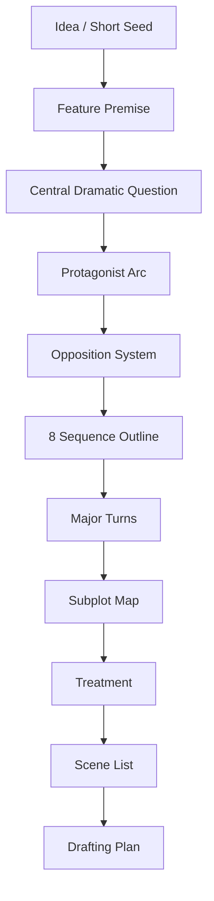
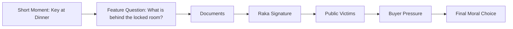
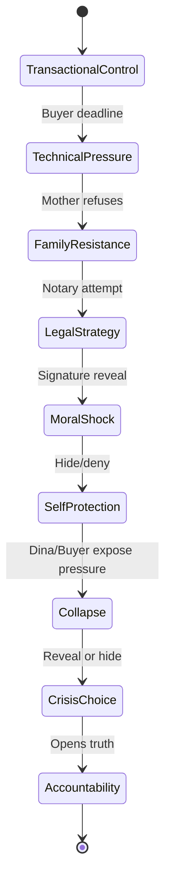
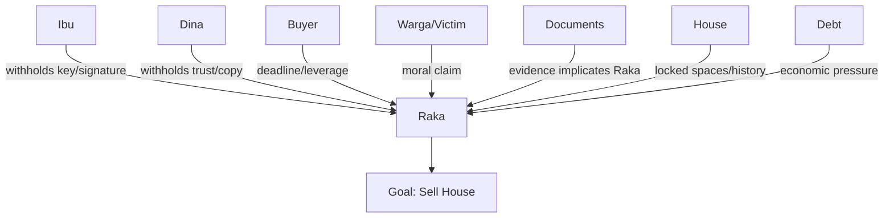
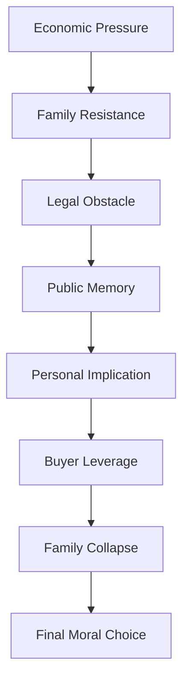
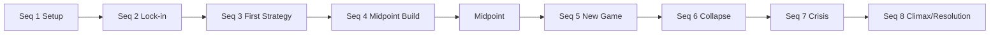
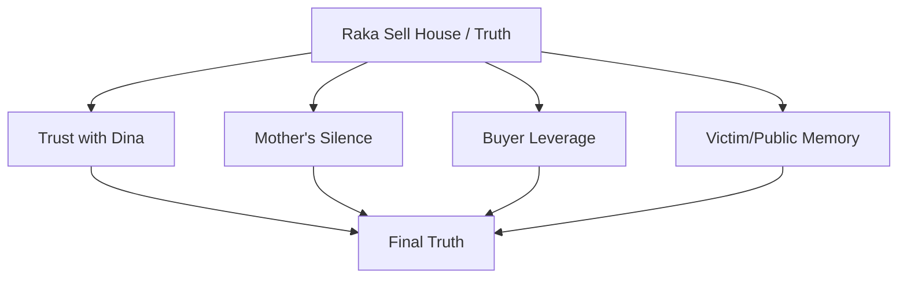

# learn-screenwriting-film-script-part-029.md

# Part 029 — Capstone Lanjutan: Blueprint Feature Film / Film Panjang

> Seri: Learn Screenwriting for Film Project  
> Pendekatan: *The First 20 Hours* — Josh Kaufman  
> Fokus bagian ini: mengembangkan blueprint film panjang dari ide, short seed, atau premis utama menjadi struktur feature yang sustain.  
> Target praktis: menghasilkan paket blueprint feature film: logline, theme, character arc, opposition network, 8-sequence outline, midpoint/all-is-lost/climax, subplot map, treatment, scene list awal, dan production-aware strategy.

---

## 0. Posisi Part Ini dalam Roadmap

Pada Part 028 kita membuat capstone film pendek: satu situasi, satu tekanan, satu pilihan, satu final image.

Sekarang kita naik level ke **film panjang / feature film**.

Perubahan paling besar:

```text
Short film = concentrated pressure.
Feature film = sustained pressure.
```

Film pendek bisa hidup dari satu momen.  
Feature harus hidup dari sistem cerita yang terus menghasilkan perubahan selama 80–120 menit.

Short bertanya:

```text
Apa satu momen perubahan paling tajam?
```

Feature bertanya:

```text
Bagaimana satu masalah utama terus berkembang, berubah bentuk, memperdalam karakter, menaikkan stakes, dan membayar ending?
```

Part ini bukan menargetkan draft feature 100 halaman selesai dalam satu chat. Targetnya adalah **blueprint feature** yang cukup kuat sehingga draft bisa ditulis dengan arah yang jelas.

Diagram:



---

## 1. Apa Itu Blueprint Feature?

Blueprint feature adalah dokumen desain cerita sebelum screenplay penuh.

Ia menjawab:

- film ini tentang apa?
- siapa protagonist?
- apa want eksternal yang sustain?
- apa need internal?
- apa central dramatic question?
- apa opposition system?
- apa midpoint?
- apa all-is-lost?
- apa final choice?
- apa ending?
- apa subplot?
- apa sequence flow?
- apa scope produksinya?
- apa risiko story?
- apa draft plan?

Blueprint feature bukan:

- naskah final,
- treatment pendek yang terlalu kabur,
- kumpulan scene random,
- moodboard tanpa struktur,
- worldbuilding bible tanpa drama.

Blueprint feature adalah peta yang cukup spesifik untuk menulis 80–120 halaman tanpa tersesat.

---

## 2. Perbedaan Short Capstone dan Feature Blueprint

| Elemen | Short Film | Feature Film |
|---|---|---|
| Durasi | 1–20 menit | 80–120 menit |
| Fokus | satu momen | perjalanan panjang |
| Struktur | 5–8 beat | 8 sequence / 3 act / 40–80 beat |
| Karakter | sedikit | lebih banyak, tetapi tetap fokus |
| Arc | pivot kecil | transformasi bertahap |
| World | implied micro-world | world lebih luas dan berkembang |
| Conflict | concentrated | escalating and evolving |
| Stakes | satu tekanan utama | multi-layer stakes |
| Subplot | minimal/hampir tidak ada | supporting arcs/subplots |
| Ending | satu final image | payoff jaringan setup/arc/theme |
| Production | contained ideal | perlu scope strategy |

Kesalahan umum:

```text
Mengira feature = short yang dipanjangkan.
```

Salah.

Feature membutuhkan engine yang bisa berjalan lama.

---

## 3. Sustained Tension

Sustained tension adalah kemampuan cerita mempertahankan perhatian penonton dalam waktu panjang.

Tension tidak harus selalu action. Tension bisa berupa:

- pertanyaan dramatik,
- mystery,
- relationship pressure,
- moral dilemma,
- ticking clock,
- social pressure,
- internal contradiction,
- shifting power,
- antagonist movement,
- increasing cost,
- irreversible choices,
- reveal ladder,
- emotional investment.

Feature harus terus memberi:

```text
new pressure + new information + new choice + new consequence
```

Jika feature hanya mengulang konflik yang sama, Act 2 mati.

Formula:

```text
Tension = Want + Obstacle + Stakes + Uncertainty + Escalation + Consequence
```

---

## 4. Feature Engine

Feature engine adalah mekanisme yang membuat cerita terus bergerak.

Template:

```text
Protagonist wants:
Opposition blocks:
Every attempt causes:
New information reveals:
Stakes increase by:
Relationship changes through:
Final choice requires:
```

Contoh untuk “Kunci di Leher Ibu” versi feature:

```text
Protagonist wants:
Menjual rumah lama untuk menyelesaikan tekanan finansial dan meninggalkan masa lalu.

Opposition blocks:
Ibu mengunci ruang kerja, Dina tidak percaya, pembeli punya agenda, dokumen lama menunjukkan Raka ikut terlibat, korban lama menuntut pengakuan.

Every attempt causes:
Raka makin dekat pada kebenaran yang merusak posisinya sendiri.

New information reveals:
Rumah bukan hanya aset keluarga, tetapi bukti kasus lama.

Stakes increase by:
Penjualan, keluarga, reputasi, hukum, moral accountability.

Relationship changes through:
Raka dari mengontrol Ibu/Dina menjadi meminta trust dan akhirnya mengakui kesalahan.

Final choice requires:
Menutup dokumen demi menyelamatkan diri atau membuka kebenaran dengan cost personal.
```

Engine seperti ini bisa sustain.

---

## 5. Dari Short Seed ke Feature

Short capstone bisa menjadi feature seed.

Short:

```text
Raka meminta kunci dari Ibu/Dina di meja makan.
```

Feature expansion questions:

1. Kenapa rumah harus dijual?
2. Siapa pembeli?
3. Apa isi ruang kerja?
4. Apa yang Raka pikir ia tahu?
5. Apa yang Ibu sembunyikan?
6. Apa yang Dina tahu/inginkan?
7. Apa sejarah ayah?
8. Apa konsekuensi publik?
9. Siapa korban atau pihak luar?
10. Apa final cost jika kebenaran dibuka?
11. Apa midpoint yang mengubah seluruh makna?
12. Apa climax yang memaksa pilihan irreversible?

Feature bukan menambah adegan filler sebelum/after short. Feature mengembangkan sistem konflik yang lebih besar.

Diagram:



---

## 6. Feature Premise

Feature premise harus punya scope lebih besar daripada short.

Template:

```text
Seorang [protagonist] berusaha [goal eksternal besar], tetapi [opposition/system] memaksanya menghadapi [internal/moral truth], hingga ia harus memilih antara [option A] dan [option B] dengan konsekuensi irreversible.
```

Contoh:

```text
Seorang anak yang pulang untuk menjual rumah keluarganya demi melunasi utang menemukan bahwa ruang kerja ayahnya menyimpan bukti kasus tanah lama yang juga memuat tanda tangannya sendiri, memaksanya memilih antara menutup kebenaran demi menyelamatkan hidup barunya atau membuka dokumen yang menghancurkan citra dirinya sebagai korban.
```

Checklist premise feature:

- [ ] Protagonist jelas.
- [ ] Goal eksternal sustain.
- [ ] Opposition cukup besar.
- [ ] Moral/internal conflict kuat.
- [ ] Ada escalation.
- [ ] Ada irreversible final choice.
- [ ] Bisa berjalan 90 menit.
- [ ] Tidak bergantung pada satu twist saja.

---

## 7. Feature Logline

Template feature logline:

```text
Ketika [inciting incident], seorang [protagonist dengan flaw/role] harus [goal eksternal] sebelum [deadline/stakes], tetapi [opposition/reveal] memaksanya menghadapi [moral/internal cost] dan memilih antara [two costly options].
```

Contoh:

```text
Ketika pembeli memberi waktu 48 jam untuk menyelesaikan penjualan rumah keluarganya, Raka, seorang konsultan properti yang lama meninggalkan rumah, pulang untuk mendapatkan tanda tangan ibunya; tetapi kunci ruang kerja ayahnya membuka dokumen kasus tanah lama yang memuat tanda tangannya sendiri, memaksanya memilih antara menutup kebenaran demi menyelamatkan hidup barunya atau mengakui perannya dalam kebohongan keluarga yang menghancurkan orang lain.
```

Logline harus memberi:

- hook,
- genre,
- protagonist,
- goal,
- stakes,
- moral tension.

---

## 8. Central Dramatic Question

Central Dramatic Question / CDQ adalah pertanyaan utama yang membuat penonton bertahan.

Contoh:

```text
Apakah Raka akan menjual rumah dan menutup masa lalu, atau membuka kebenaran meski dirinya ikut terseret?
```

CDQ feature harus sustain dari awal sampai akhir.

CDQ buruk:

```text
Apa isi ruang kerja?
```

Ini hanya mystery question. Setelah terjawab, tension bisa mati.

CDQ lebih kuat:

```text
Apa yang akan Raka lakukan setelah tahu isi ruang kerja juga menuduh dirinya?
```

Feature biasanya butuh beberapa question layer:

| Layer | Question |
|---|---|
| Plot | Apakah rumah akan terjual? |
| Mystery | Apa isi ruang kerja? |
| Character | Apakah Raka bisa berhenti mengontrol? |
| Moral | Apakah ia membuka kebenaran jika dirinya ikut bersalah? |
| Relationship | Apakah Ibu/Dina bisa mempercayainya lagi? |
| Social | Apakah korban lama mendapat pengakuan? |

CDQ utama mengikat semua layer.

---

## 9. Theme Question Feature

Feature theme harus bisa diuji berulang dalam banyak scene.

Contoh theme:

```text
Apakah keluarga boleh dilindungi dengan kebohongan jika kebenaran menghancurkan semua orang?
```

Atau:

```text
Apakah seseorang tetap bisa menyebut dirinya korban jika ia juga pernah diuntungkan oleh kebohongan?
```

Feature membutuhkan theme progression.

Template:

```text
Theme question:
Opening thesis:
Counter-thesis:
Midpoint complication:
All-is-lost answer:
Final synthesis:
```

Contoh:

```text
Theme question:
Apakah kebenaran selalu menyelamatkan keluarga?

Opening thesis:
Raka percaya menyelesaikan dokumen akan menyelesaikan masa lalu.

Counter-thesis:
Ibu percaya kebenaran akan menghancurkan keluarga.

Midpoint complication:
Kebenaran menunjukkan Raka bukan outsider bersih.

All-is-lost answer:
Menutup kebenaran mungkin menyelamatkan Raka tetapi mengulang dosa.

Final synthesis:
Keluarga tidak diselamatkan oleh dokumen atau diam, tetapi oleh accountability yang berbiaya.
```

---

## 10. Protagonist Arc Feature

Arc feature harus bertahap.

Template:

```text
Start:
Lie:
Want:
Need:
Pressure 1:
Pressure 2:
Midpoint shock:
Act 2B collapse:
Crisis:
Final choice:
Proof of change:
```

Contoh Raka:

```text
Start:
Raka melihat rumah sebagai aset dan keluarga sebagai administrasi.

Lie:
Jika dokumen selesai, masa lalu selesai.

Want:
Menjual rumah dalam 48 jam.

Need:
Mengakui bahwa ia tidak bisa membeli/mengurus trust seperti transaksi.

Pressure 1:
Ibu menolak tanda tangan/kunci.

Pressure 2:
Dina menjadi gatekeeper dan warga mengingat kasus lama.

Midpoint shock:
Raka menemukan tanda tangannya sendiri di dokumen.

Act 2B collapse:
Pembeli memakai dokumen sebagai leverage; Dina tahu Raka berbohong; Ibu jatuh sakit/pecah.

Crisis:
Raka bisa menyerahkan dokumen ke pembeli/menutup kasus atau membukanya.

Final choice:
Ia membuka dokumen dan mengakui perannya.

Proof of change:
Ia meletakkan map penjualan di bawah dokumen korban, bukan di atasnya; kunci tergantung di pintu terbuka.
```

Arc harus terlihat melalui action.

---

## 11. Character State Machine

Untuk software engineer, karakter feature bisa dipandang sebagai state machine.



Setiap major sequence harus mengubah state.

Jika character state tidak berubah selama 30 halaman, feature terasa flat.

---

## 12. Supporting Characters Feature

Supporting characters dalam feature punya fungsi lebih luas daripada short.

Template:

```text
Character:
Plot function:
Theme function:
Protagonist arc function:
Own want:
Secret/pressure:
Relationship change:
Payoff:
```

Contoh:

### Ibu

```text
Plot function:
Gatekeeper rumah/ruang kerja/dokumen.

Theme function:
Perlindungan melalui silence.

Arc function:
Memaksa Raka menghadapi care yang bercampur kontrol.

Own want:
Menjaga keluarga dari kehancuran kedua.

Secret:
Ia tahu Raka pernah menandatangani dokumen.

Relationship change:
Dari menahan Raka lewat ritual menjadi membiarkan ia memilih.

Payoff:
Melepas kunci secara permanen.
```

### Dina

```text
Plot function:
Moral witness, holder of key/copy.

Theme function:
Generasi yang tidak mau mewarisi silence.

Arc function:
Memaksa Raka meminta trust.

Own want:
Mendapat kebenaran dan tidak lagi diperlakukan anak kecil.

Payoff:
Memberi salinan dokumen setelah Raka berhenti mengontrol.
```

### Pembeli

```text
Plot function:
External deadline/economic pressure.

Theme function:
Transaksi yang ingin mengubah luka menjadi aset.

Arc function:
Menggoda Raka untuk menutup kebenaran.

Own want:
Mendapat rumah/dokumen/akses dengan harga murah atau agenda tersembunyi.

Payoff:
Menjadi force yang membuat final choice public/irreversible.
```

---

## 13. Opposition Network

Feature membutuhkan opposition system, bukan hanya satu orang.

Opposition network:



Setiap opposition layer harus aktif di sequence tertentu.

Tabel:

| Opposition | Act 1 | Act 2A | Midpoint | Act 2B | Act 3 |
|---|---|---|---|---|---|
| Ibu | menolak | menghindar | truth pressure | breakdown/confession | melepas control |
| Dina | sarcasm | investigates | excluded/hurt | holds copy | witness/partner |
| Buyer | deadline | legal/economic pressure | leverage grows | threat/deal | confrontation |
| Victim/Public | rumor | representative appears | moral context | demand recognition | receives truth |
| Documents | hidden | partial reveal | signature reveal | weaponized | public evidence |
| House | asset | maze | archive | trap | open space |

---

## 14. Stakes Ladder

Feature stakes harus naik.

Stakes layers:

1. Economic: Raka butuh uang/penjualan.
2. Family: Ibu/Dina tidak percaya.
3. Legal: dokumen bermasalah.
4. Social: warga/korban lama muncul.
5. Moral: Raka ikut diuntungkan/terlibat.
6. Identity: Raka bukan korban bersih.
7. Irreversible: membuka truth menghancurkan deal/hidup baru.
8. Final: memilih accountability atau self-preservation.

Diagram:



Jika stakes tidak naik, feature terasa berhenti.

---

## 15. Feature Structure: 8 Sequence Approach

8 sequence membantu feature terasa manageable.

Estimasi:

| Sequence | Pages | Function |
|---|---:|---|
| Seq 1 | 1–12 | Setup + inciting |
| Seq 2 | 13–25 | Lock-in / Act 1 break |
| Seq 3 | 26–37 | First strategy |
| Seq 4 | 38–50 | Midpoint build |
| Seq 5 | 51–62 | New game |
| Seq 6 | 63–75 | Collapse / all is lost |
| Seq 7 | 76–88 | Crisis / final plan |
| Seq 8 | 89–105 | Climax / resolution |

Ini bukan aturan saklek. Ini scaffolding.

Diagram:



---

## 16. Sequence Template

Untuk setiap sequence:

```text
Sequence Number:
Title:
Page Range:
Input State:
Sequence Goal:
Main Opposition:
Key Scenes:
Escalation:
Reveal/Turn:
Output State:
Character State Change:
Production Scope:
```

Example:

```text
Sequence 1:
Title: The House as Asset

Input:
Raka hidup jauh dari rumah, pressure finansial.

Goal:
Menyelesaikan deal cepat dan menghubungi Ibu.

Opposition:
Ibu menghindari telepon; buyer deadline.

Turn:
Raka memutuskan pulang setelah buyer memberi ultimatum.

Output:
Raka masuk kembali ke rumah yang ia pikir hanya aset.
```

---

## 17. Sequence 1 — Setup

Function:

- memperkenalkan protagonist,
- memperkenalkan flaw,
- memperkenalkan world/tone,
- memicu inciting incident,
- memberi promise genre,
- memberi economic/personal pressure.

Untuk “Kunci di Leher Ibu”:

```text
Opening image:
Apartemen Raka rapi tanpa foto keluarga; dokumen tertata, hidup terkontrol.

Raka:
konsultan/profesional yang menangani properti seperti sistem.

Inciting:
Buyer memberi deadline 48 jam dan uang muka tergantung tanda tangan/kunci akses rumah.

Emotional hook:
Ibu menelepon, Raka mengabaikan. Lalu melihat tagihan/utang.
```

Output Sequence 1:

```text
Raka memutuskan pulang.
```

Scene candidates:

1. Raka's apartment / financial pressure.
2. Buyer call.
3. Mother missed call.
4. Raka chooses ticket/car.
5. Arrival at house gate.

---

## 18. Sequence 2 — Lock-In

Function:

- protagonist masuk world utama,
- konflik keluarga dimulai,
- object central diperkenalkan,
- protagonist locked into story,
- Act 1 break.

Events:

```text
Raka tiba di rumah.
Ibu memperlakukannya seperti anak/tamu.
Dina muncul dengan sarcasm.
Map penjualan mengganggu ritual rumah.
Kunci di leher Ibu terlihat.
Raka meminta tanda tangan/kunci.
Ibu menolak.
Pembeli mempercepat deadline.
Raka tidak bisa pergi tanpa menyelesaikan rumah.
```

Act 1 break:

```text
Raka memutuskan tinggal 48 jam dan membuka ruang kerja/dokumen apa pun caranya.
```

Output:

```text
Goal berubah dari “ambil tanda tangan” menjadi “akses kebenaran rumah”.
```

---

## 19. Sequence 3 — First Strategy

Function:

- protagonist mencoba strategi awal sesuai flaw,
- biasanya teknis/rasional,
- opposition menunjukkan problem lebih besar.

Raka's strategy:

```text
Legal/technical bypass.
```

Scenes:

1. Notary/legal consultation.
2. Ownership reveal: rumah atas nama Ibu / dokumen tidak lengkap.
3. Warung/public memory clue.
4. Dina melihat Raka menyembunyikan info.
5. Buyer pressure via phone/photo.

Turn:

```text
Raka sadar masalah bukan hanya tanda tangan; rumah punya sejarah publik dan Ibu punya legal/moral control.
```

Output:

```text
Raka harus masuk ruang kerja ayah.
```

---

## 20. Sequence 4 — Midpoint Build

Function:

- protagonist mendekati truth,
- opposition intensifies,
- false theory terbentuk,
- midpoint shock.

Events:

```text
Raka mencoba mendapatkan kunci dari Dina.
Dina menolak kecuali Raka jujur.
Ibu memberi warning tanpa menjelaskan.
Raka memakai cara manipulatif/diam-diam.
Ruang kerja akhirnya terbuka.
```

Midpoint:

```text
Raka menemukan dokumen lama dengan tanda tangannya sendiri.
```

Why strong?

- bukan hanya plot reveal,
- mengubah identitas Raka,
- ia tidak lagi outsider,
- stakes menjadi personal,
- Act 2B punya new game.

Output:

```text
Raka sekarang tahu ia ikut terlibat/diuntungkan.
```

---

## 21. Midpoint Design

Midpoint feature harus:

- mengubah makna goal,
- membuat protagonist tidak bisa kembali,
- memberi informasi besar,
- menaikkan stakes,
- mengubah strategy,
- menekan flaw.

Template:

```text
Before midpoint, protagonist thinks:
At midpoint, protagonist discovers:
After midpoint, protagonist must:
New stakes:
New lie/defense:
```

Contoh:

```text
Before:
Raka pikir ruang kerja berisi dokumen yang akan mempermudah penjualan atau membuktikan kesalahan ayah/Ibu.

Discovers:
Dokumen itu memuat tanda tangannya sendiri sebagai saksi/penerima/beneficiary.

After:
Ia harus memutuskan menyembunyikan atau mengakui.

New stakes:
Legal/moral identity.

New defense:
Self-protection, denial, blaming age/father/mother.
```

---

## 22. Sequence 5 — New Game

Function:

- aftermath midpoint,
- protagonist mencoba mengontrol damage,
- opposition berubah,
- relationships rusak.

Events:

```text
Raka menyembunyikan dokumen dari Dina.
Dina curiga dan mulai menyelidiki.
Buyer tahu lebih banyak dari seharusnya.
Ibu mencoba menjelaskan masa lalu sebagian.
Warga/korban lama muncul lebih personal.
```

New game:

```text
Cerita bukan lagi “jual rumah”, tetapi “siapa yang akan menguasai kebenaran”.
```

Output:

```text
Raka semakin menyerupai pola lama yang ia benci.
```

---

## 23. Sequence 6 — Collapse / All Is Lost

Function:

- protagonist's strategy fails,
- external and internal stakes crash,
- relationships break,
- moral self-image collapses.

Events:

```text
Pembeli menawarkan deal: tutup dokumen dan jual cepat.
Dina menemukan Raka menyembunyikan salinan.
Ibu jatuh/pecah/confesses partial truth.
Korban lama menuntut pengakuan.
Raka menyadari ia bisa menyelamatkan dirinya hanya dengan mengulang kebohongan.
```

All Is Lost:

```text
Raka kehilangan trust Dina, Ibu tidak lagi bisa melindungi, pembeli punya leverage, dan korban lama akan kembali dikorbankan jika ia diam.
```

Output:

```text
Raka sendirian dengan pilihan moral.
```

---

## 24. Sequence 7 — Crisis / Final Plan

Function:

- protagonist menghadapi pilihan,
- false solution ditawarkan,
- final plan dibentuk,
- theme crystallizes.

Crisis question:

```text
Apakah Raka akan menutup dokumen demi menjual rumah dan membayar utangnya, atau membuka kebenaran meski dirinya ikut jatuh?
```

Events:

```text
Raka hampir menyerahkan dokumen ke pembeli.
Dina menolak membantu kecuali ia mengakui.
Ibu akhirnya melepas kunci/control.
Raka melihat korban/ruang/anak kecil/object yang membuat moral cost nyata.
```

Final plan:

```text
Raka mengatur pertemuan open house/legal signing di rumah, tetapi menggunakannya untuk membuka dokumen.
```

Output:

```text
Raka memilih accountability, tetapi cost belum dibayar.
```

---

## 25. Sequence 8 — Climax and Resolution

Function:

- final confrontation,
- protagonist acts differently,
- theme answered,
- central dramatic question resolved,
- final image pays opening.

Climax contained version:

```text
Ruang makan.
Pembeli datang untuk tanda tangan.
Notaris/representative hadir.
Ibu, Dina, Raka, warga tua/korban.
Map penjualan di meja.
Dokumen lama dibuka.
Raka mengakui tanda tangannya.
Penjualan batal/berubah.
Pembeli kehilangan leverage atau membuka conflict baru.
```

Resolution:

```text
Rumah belum tentu selamat secara legal/ekonomi, tetapi ruang kerja terbuka.
Kunci tidak lagi di leher Ibu.
Raka tidak membawa map sebagai senjata.
Dina menyimpan salinan bukan untuk melawan keluarga, tetapi untuk memastikan truth tidak dikunci lagi.
```

Final image:

```text
Kunci tergantung di pintu ruang kerja yang terbuka.
Meja makan kosong dari map penjualan.
Atau piring retak tetap ada, tetapi kini dipakai tanpa menutupi dokumen.
```

---

## 26. 8 Sequence Outline Example

Ringkas:

```text
Seq 1 — The House as Asset
Raka hidup jauh, butuh uang, buyer memberi deadline.

Seq 2 — The Locked House
Raka pulang; Ibu/Dina menolak; kunci ruang kerja menjadi object konflik.

Seq 3 — Legal Bypass
Raka mencoba jalur teknis; notaris/public memory menunjukkan masalah lebih besar.

Seq 4 — The Room Opens
Raka akhirnya membuka ruang kerja dan menemukan tanda tangannya sendiri.

Seq 5 — Damage Control
Raka mencoba menyembunyikan; Dina curiga; buyer punya leverage.

Seq 6 — The Lie Repeats
Trust runtuh; korban lama muncul; Raka hampir mengulang kebohongan.

Seq 7 — The Cost of Truth
Raka memilih membuka dokumen meski merusak deal dan dirinya.

Seq 8 — The Open Door
Climax di ruang makan; truth dibuka; rumah berubah makna.
```

---

## 27. 40-Beat Feature Sheet

Feature blueprint minimal: 5 beat per sequence.

### Sequence 1

1. Opening image: Raka's clean apartment, no family photos.
2. Raka handles property deal professionally.
3. Buyer calls: 48-hour deadline.
4. Ibu's missed call / Raka avoids.
5. Raka decides to go home.

### Sequence 2

6. Raka arrives at old house.
7. Dinner ritual: map vs plate.
8. Key on Ibu's neck introduced.
9. Dina challenges Raka.
10. Raka decides to stay/open room.

### Sequence 3

11. Raka visits notary/legal route.
12. Ownership reveal/technical obstacle.
13. Warung/public memory clue.
14. Buyer pressure increases.
15. Raka realizes room is necessary.

### Sequence 4

16. Raka tries to get key from Dina.
17. Ibu gives partial warning.
18. Raka manipulates/steals/forces access.
19. Room opens.
20. Midpoint: Raka signature reveal.

### Sequence 5

21. Raka hides document.
22. Dina sees inconsistency.
23. Buyer hints he knows.
24. Ibu confesses partial past.
25. Raka chooses self-protection.

### Sequence 6

26. Dina finds copy/evidence.
27. Victim/warga confronts family.
28. Buyer offers deal to bury truth.
29. Ibu collapses/relationship breaks.
30. All is lost: Raka alone, no trust.

### Sequence 7

31. Raka almost signs/sells.
32. Dina refuses unless he tells truth.
33. Raka sees final moral cost.
34. Ibu releases key/control.
35. Raka forms final plan.

### Sequence 8

36. Open house/signing begins.
37. Raka reveals document.
38. Buyer fights/leverage exposed.
39. Raka admits his signature/role.
40. Final image: key on open door.

This is a working 40-beat skeleton.

---

## 28. Beat Quality Check

Setiap beat harus punya fungsi.

Checklist:

- [ ] Apakah beat mengubah state?
- [ ] Apakah beat menyebabkan beat berikutnya?
- [ ] Apakah beat mengandung conflict/reveal/choice?
- [ ] Apakah beat menaikkan stakes?
- [ ] Apakah beat menggerakkan character arc?
- [ ] Apakah beat tidak hanya “suasana”?
- [ ] Apakah beat bisa menjadi scene atau bagian scene?

Jika beat hanya:

```text
Raka merasa sedih.
```

Ubah menjadi action:

```text
Raka menandatangani surat baru, berhenti saat melihat bentuk tanda tangannya sama dengan dokumen lama.
```

---

## 29. Subplot Design

Feature butuh subplot, tetapi jangan terlalu banyak.

Subplot harus:

- memperkuat theme,
- menekan protagonist,
- memberi contrast,
- punya arc,
- punya payoff,
- tidak berdiri sendiri tanpa hubungan.

Possible subplots:

### 29.1 Raka-Dina Relationship

Function:

```text
Trust arc.
```

Arc:

```text
Dina melihat Raka sebagai orang yang hanya pulang saat butuh → menolak memberi akses → menyimpan salinan → akhirnya menjadi witness setelah Raka jujur.
```

### 29.2 Ibu's Protection

Function:

```text
Theme counter-position: silence as care.
```

Arc:

```text
Ibu mengunci truth → kehilangan kontrol → melepas kunci.
```

### 29.3 Buyer Pressure

Function:

```text
External temptation to repeat lie.
```

Arc:

```text
Buyer sebagai deal → leverage → moral antagonist.
```

### 29.4 Victim/Public Memory

Function:

```text
Moral stakes beyond family.
```

Arc:

```text
Rumor → representative → direct demand → final recognition.
```

Subplot map:



---

## 30. Subplot Tracker

Template:

```text
Subplot:
Function:
Start:
Development:
Complication:
Payoff:
Scenes:
Risk:
```

Example:

```text
Subplot:
Raka-Dina trust.

Function:
Menguji apakah Raka bisa meminta trust, bukan kontrol.

Start:
Dina sarcastic and closed.

Development:
Dina holds key; observes Raka hiding truth.

Complication:
Dina finds copy/signature and feels betrayed.

Payoff:
Dina gives/withholds copy depending on Raka's honesty; becomes witness in climax.

Scenes:
Dinner, key handoff, room aftermath, document copy, crisis, climax.

Risk:
Dina becomes only sarcasm machine.

Fix:
Give her own hurt and agency.
```

---

## 31. Relationship Arcs

Feature sering hidup dari relationship arcs.

Raka-Ibu:

```text
From administrative demand → moral confrontation → mutual exposure → release of control.
```

Raka-Dina:

```text
From distance/sarcasm → gatekeeping → betrayal → conditional trust.
```

Raka-Buyer:

```text
From business partner → pressure source → tempter/antagonist.
```

Raka-Victim:

```text
From abstract public problem → personal moral claim.
```

Track relationship state per sequence:

| Seq | Raka-Ibu | Raka-Dina | Raka-Buyer | Raka-Victim |
|---|---|---|---|---|
| 1 | avoided | absent | transactional | absent |
| 2 | polite conflict | sarcasm | deadline | absent |
| 3 | technical pressure | suspicion | pressure | rumor |
| 4 | breach/truth | gatekeeper | off-screen threat | clue |
| 5 | damage control | distrust | leverage | appears |
| 6 | collapse | betrayal | deal/temptation | direct |
| 7 | reckoning | conditional trust | antagonist | moral mirror |
| 8 | release | witness | confronted | recognized |

---

## 32. Feature Treatment

Feature treatment bisa 5–15 halaman tergantung kebutuhan.

Untuk blueprint, mulai dengan 2–4 halaman.

Structure:

```text
Paragraph 1 — Opening / Setup
Paragraph 2 — Inciting / Return
Paragraph 3 — Act 1 Lock-in
Paragraph 4 — Act 2A Strategy
Paragraph 5 — Midpoint
Paragraph 6 — Act 2B New Game
Paragraph 7 — All Is Lost
Paragraph 8 — Crisis / Final Plan
Paragraph 9 — Climax
Paragraph 10 — Resolution / Final Image
```

Treatment harus prosa present tense, cinematic, dan causal.

Jangan menulis:

```text
Lalu terjadi ini, lalu terjadi itu.
```

Gunakan:

```text
Karena ini, Raka melakukan itu; tetapi akibatnya...
```

---

## 33. Treatment Example Condensed

```text
Raka hidup jauh dari rumah lamanya, mengurus properti orang lain dengan ketelitian nyaris dingin. Apartemennya bersih, dokumennya rapi, tetapi tidak ada satu pun foto keluarga. Ketika seorang pembeli memberi waktu 48 jam untuk menyelesaikan penjualan rumah keluarganya, Raka mengabaikan telepon ibunya sampai tagihan dan utang membuatnya tidak punya pilihan selain pulang.

Di rumah lama, Raka menemukan bahwa pulang tidak semudah membawa map. Ibu menaruh piring makan di atas dokumen penjualan, Dina menyambutnya dengan humor pahit, dan kunci kecil di leher Ibu menjadi tanda bahwa ruang kerja ayah masih tertutup. Raka mengira ia hanya butuh tanda tangan dan akses, tetapi Ibu menolak, seolah ruang itu bukan tempat dokumen melainkan luka.

Raka mencoba jalur teknis. Ia mendatangi notaris dan menemukan bahwa status rumah tidak sesederhana yang ia pikirkan. Di warung depan rumah, obrolan warga berhenti saat ia masuk; nama ayahnya masih menyisakan jejak pada sertifikat lama yang dibawa seorang warga tua. Pembeli terus menekan lewat telepon, menawarkan uang cepat jika Raka bisa “membersihkan” semua masalah.

Semakin Raka menekan, semakin Dina menjauh. Ketika ia akhirnya membuka ruang kerja ayah, ia tidak menemukan jawaban yang membebaskannya. Di antara dokumen lama, ia menemukan tanda tangannya sendiri sebagai saksi/penerima dalam transaksi yang dulu menghancurkan orang lain. Untuk pertama kalinya, Raka tidak bisa menyalahkan rumah, ayah, atau Ibu sepenuhnya.

Setelah midpoint itu, Raka mencoba mengontrol kerusakan. Ia menyembunyikan dokumen, berbohong pada Dina, dan hampir menerima tawaran pembeli untuk menyelesaikan penjualan secara diam-diam. Tetapi Dina menemukan salinan, Ibu tidak lagi sanggup menjaga kebohongan, dan korban lama datang bukan dengan kemarahan besar, tetapi dengan sertifikat lusuh yang belum pernah diakui.

Di titik terendah, Raka kehilangan semua: deal hampir runtuh, Dina tidak percaya, Ibu pecah, dan pembeli menggunakan dokumen sebagai leverage. Ia bisa menyelamatkan dirinya dengan menutup kebenaran sekali lagi, atau menghancurkan hidup barunya dengan membuka dokumen yang juga menuduhnya.

Pada hari penandatanganan, Raka membawa semua pihak ke ruang makan. Map penjualan berada di meja, tetapi kali ini ia menaruh dokumen lama di atasnya. Di depan pembeli, Ibu, Dina, dan warga tua, Raka membaca tanda tangannya sendiri dan mengakui bahwa rumah tidak bisa dijual seolah tidak pernah menyimpan korban. Penjualan batal atau berubah menjadi proses hukum, tetapi kebohongan berhenti menjadi warisan.

Film berakhir bukan dengan rumah yang sepenuhnya selamat, tetapi dengan ruang kerja yang terbuka. Kunci tidak lagi menggantung di leher Ibu. Ia tergantung di pintu yang tidak dikunci. Di meja makan, piring retak tetap ada, tetapi tidak lagi menutupi map.
```

---

## 34. Treatment Checklist

- [ ] Present tense.
- [ ] Protagonist active.
- [ ] Cause-effect jelas.
- [ ] Major turns ada.
- [ ] Midpoint kuat.
- [ ] Stakes meningkat.
- [ ] Relationship arcs terlihat.
- [ ] Ending menjawab CDQ.
- [ ] Tidak terlalu banyak lore.
- [ ] Tone sesuai.
- [ ] Scope produksi masih masuk akal.

---

## 35. Scene List Feature

Scene list feature tidak harus 100% lengkap di blueprint awal, tetapi minimal Act 1 dan key scenes.

Scene list columns:

```text
Scene ID
Sequence
Heading
Function
Characters
Input
Turn
Output
Key object/info
Estimated pages
Production cost
Status
```

Example first 10 scenes:

| ID | Seq | Heading | Function | Turn |
|---|---|---|---|---|
| S01 | 1 | INT. RAKA APT - PAGI | opening state | Raka ignores Ibu call |
| S02 | 1 | INT. OFFICE/CALL - SIANG | buyer pressure | 48-hour deadline |
| S03 | 1 | INT. APT - MALAM | decision pressure | Raka buys ticket/goes |
| S04 | 2 | EXT. RUMAH - SENJA | return | house rejects him visually |
| S05 | 2 | INT. RUANG MAKAN - MALAM | family conflict | plate on map |
| S06 | 2 | RUANG MAKAN - CONT | key introduced | key noticed |
| S07 | 2 | RUANG MAKAN - CONT | power conflict | key to Dina |
| S08 | 2 | INT. KAMAR RAKA - MALAM | absence | he sees room unchanged/alien |
| S09 | 2 | PHONE/BUYER | external pressure | buyer knows house details |
| S10 | 2 | INT. KORIDOR - MALAM | lock-in | Raka decides to open room |

---

## 36. Key Scene List

Feature blueprint harus punya key scenes:

1. Opening image.
2. Inciting incident.
3. First family dinner.
4. Key transfer.
5. Notary/legal obstacle.
6. Public memory / warga scene.
7. Locked room entry.
8. Midpoint signature reveal.
9. Raka hides truth.
10. Dina discovers lie.
11. Buyer offer/threat.
12. Ibu partial confession.
13. Victim confrontation.
14. All is lost.
15. Crisis choice.
16. Final signing/open house.
17. Public truth reveal.
18. Final image.

Jika key scenes ini jelas, draft lebih mudah.

---

## 37. Opening and Final Image Pair

Feature harus punya opening/final contrast.

Opening:

```text
Raka di apartemen rapi tanpa foto keluarga, menyusun dokumen orang lain.
```

Meaning:

```text
Control, distance, transaction, no memory.
```

Final:

```text
Ruang kerja rumah terbuka, kunci di pintu, meja makan tanpa map menutupi.
```

Meaning:

```text
Truth open, control released, memory acknowledged.
```

Pair:

| Opening | Final |
|---|---|
| Raka controls documents | Raka exposes document |
| No family photos | Family history visible |
| Clean apartment | Messy open house |
| Avoids Ibu call | Faces Ibu/Dina/witness |
| Transactional | Accountable |
| Closed emotional space | Open door |

---

## 38. Object Arc Feature

Objects in feature:

### Key

```text
Control → Gatekeeping → Access → Truth → Release
```

### Map

```text
Transaction → Pressure → Cover-up → Evidence conflict → Surrender
```

### Plate/Food

```text
Care as avoidance → control ritual → interruption → genuine care or empty ritual
```

### Document/Signature

```text
Hidden archive → legal obstacle → personal guilt → weapon → confession evidence
```

Object tracker:

| Object | Seq 1 | Seq 2 | Seq 3–4 | Seq 5–6 | Seq 7–8 |
|---|---|---|---|---|---|
| Key | absent | Ibu neck → Dina | opens room | contested | open door |
| Map | Raka work | table conflict | notary | cover-up | under truth docs |
| Plate | absent | on map | repeated ritual | breaks/empty | no longer covering |
| Document | absent | mentioned | partial | weaponized | revealed |

---

## 39. Information Reveal Schedule

Mystery feature needs reveal schedule.

Template:

```text
Info:
When audience learns:
When protagonist learns:
Who already knows:
How revealed:
Why now:
```

Example:

| Info | Audience | Raka | Who Knows | Reveal Method |
|---|---|---|---|---|
| House sale deadline | Seq 1 | Seq 1 | Buyer/Raka | phone |
| Ibu has key | Seq 2 | Seq 2 | Ibu | visual |
| Room has documents | Seq 2/3 | Seq 3 | Ibu | conflict |
| Ownership issue | Seq 3 | Seq 3 | Ibu/Notary | document |
| Public victims | Seq 3 | Seq 3 | warga/Ibu | warung/sertifikat |
| Raka signature | Midpoint | Midpoint | Ibu/Buyer? | document |
| Buyer knows truth | Seq 5 | Seq 5/6 | Buyer | leverage |
| Dina has copy | Late Seq 6/7 | later | Dina | reveal |
| Final truth | Climax | public | all | table reveal |

Information flow must be fair.

---

## 40. Feature Worldbuilding

Feature world larger than short, but still focused.

World nodes:

1. Raka's city/apartment.
2. Old house.
3. Dining room.
4. Locked study.
5. Warung/community edge.
6. Notary/legal world.
7. Buyer/off-screen business world.
8. Victim/public memory.

Worldbuilding principle:

```text
Each world node must pressure Raka differently.
```

| World Node | Pressure |
|---|---|
| Apartment | control/no memory |
| House | family memory |
| Dining room | ritual/conflict |
| Study | hidden truth |
| Warung | public shame |
| Notary | legal obstacle |
| Buyer world | transaction/leverage |
| Victim | moral consequence |

---

## 41. Production-Aware Feature Scope

Feature scope can explode. Keep contained core.

Strategy:

```text
Primary location:
Old house.

Secondary:
Warung, notary, Raka apartment.

Off-screen:
Buyer office, wider legal system, old case.

Characters:
Raka, Ibu, Dina, Buyer, Notary, Warga tua, maybe one friend/assistant.

Extras:
Minimal.

Special:
Documents, key, food, rain sound optional.

VFX/Stunt:
None.
```

Cost/value:

| Element | Cost | Value | Strategy |
|---|---:|---:|---|
| Old house | 3 | 5 | primary location |
| Warung | 2 | 4 | 1–2 scenes |
| Notary | 2 | 4 | could move to house |
| Raka apartment | 1 | 3 | opening only |
| Crowd demo | 5 | 3 | avoid/replace |
| Flashback 2003 | 5 | 3 | replace with documents |
| Buyer office | 3 | 2 | off-screen |
| Climax in dining room | 2 | 5 | keep |

---

## 42. Feature Production Constraint as Strength

Constraint:

```text
Most story happens in and around one house over 48 hours.
```

Benefits:

- pressure cooker,
- continuity manageable,
- emotional intensity,
- house becomes character,
- low-budget feasible,
- theme stronger.

Risks:

- static,
- repetitive,
- too talky.

Solutions:

- sub-locations,
- object movement,
- power shifts,
- off-screen pressure,
- time-of-day changes,
- visitors entering house,
- room reveal,
- social boundary at terrace/warung,
- sound motif.

---

## 43. Feature Treatment vs Outline vs Scene List

| Document | Purpose |
|---|---|
| Treatment | emotional/casual story flow |
| Outline | structural map |
| Beat sheet | units of change |
| Scene list | execution queue |
| Draft | screenplay pages |

Workflow:

```text
Logline → Synopsis → 8 Sequence Outline → Treatment → Beat Sheet → Scene List → Draft
```

Sometimes treatment before beat sheet. Choose whichever helps.

For engineer:

```text
Treatment = narrative spec.
Outline = architecture.
Beat sheet = execution plan.
Scene list = task queue.
Draft = implementation.
```

---

## 44. Feature Synopsis

One-page synopsis structure:

```text
Paragraph 1:
Setup + inciting.

Paragraph 2:
Act 1 break and early Act 2.

Paragraph 3:
Midpoint.

Paragraph 4:
Act 2B collapse.

Paragraph 5:
Climax and resolution.
```

Synopsis should include ending. Do not hide ending in development docs.

---

## 45. Feature Blueprint Package

Final package should include:

```text
feature-blueprint/
  logline.md
  synopsis.md
  theme.md
  character-arcs.md
  opposition-network.md
  eight-sequence-outline.md
  forty-beat-sheet.md
  treatment.md
  key-scenes.md
  subplot-map.md
  reveal-schedule.md
  object-tracker.md
  production-scope.md
  draft-plan.md
```

Minimal package:

- logline,
- synopsis,
- 8 sequence outline,
- protagonist arc,
- midpoint/all-is-lost/climax,
- production scope.

---

## 46. Drafting Plan for Feature

After blueprint, do not start random.

Draft plan:

```text
Phase 1:
Draft Sequence 1.

Phase 2:
Review Seq 1 for protagonist setup and inciting.

Phase 3:
Draft Sequence 2.

Phase 4:
Confirm Act 1 lock-in.

Phase 5:
Draft Seq 3–4 to midpoint.

Phase 6:
Midpoint check.

Phase 7:
Draft Seq 5–6.

Phase 8:
All-is-lost check.

Phase 9:
Draft Seq 7–8.

Phase 10:
Full read and diagnosis.
```

Track by sequence, not by “100 pages”.

---

## 47. Feature Milestones

Milestone table:

| Milestone | Done When |
|---|---|
| M1 Logline | CDQ, protagonist, goal, stakes clear |
| M2 Synopsis | ending included |
| M3 8 Sequence | each sequence input/output clear |
| M4 Midpoint | changes story meaning |
| M5 Ending | final choice/image clear |
| M6 Beat Sheet | 40+ beats with causality |
| M7 Scene List Act 1 | executable scene cards |
| M8 Draft Seq 1 | pages written |
| M9 Draft Act 1 | lock-in written |
| M10 Draft Full | 80–120 pages readable |

---

## 48. Feature Risk Register

Template:

```text
Risk:
Severity:
Evidence:
Mitigation:
```

Example:

| Risk | Severity | Mitigation |
|---|---|---|
| Act 2 repetitive | High | define distinct sequence goals |
| Raka unlikeable | High | vulnerability + pressure setup |
| Legal exposition heavy | Medium | document/object reveal |
| Dina only sarcastic | Medium | own want/hurt arc |
| Buyer generic villain | Medium | give specific leverage/logic |
| Scope too big | High | contained house core |
| Ending too speechy | High | final action + document/object |

---

## 49. Feature Anti-Patterns

### 49.1 One Twist Feature

Feature depends only on one reveal.

Fix:

```text
Use reveal ladder + moral consequences.
```

### 49.2 Act 2 Repetition

Same conflict repeats.

Fix:

```text
Different sequence goals and stakes.
```

### 49.3 Passive Protagonist

Raka only receives reveals.

Fix:

```text
Each sequence driven by his strategy.
```

### 49.4 Subplot Drift

Subplots unrelated to main theme.

Fix:

```text
Every subplot must pressure central question.
```

### 49.5 Overworldbuilding

Too much history before drama.

Fix:

```text
World only through pressure/action.
```

### 49.6 Climax Speech

Ending becomes explanation.

Fix:

```text
Final action, document, object, choice.
```

### 49.7 Scope Explosion

Too many locations/cast/events.

Fix:

```text
House as hub, off-screen world.
```

### 49.8 Midpoint Too Small

Midpoint is just another clue.

Fix:

```text
Midpoint must change protagonist's identity/strategy/stakes.
```

---

## 50. Feature Debugging

### If premise feels short-sized

Ask:

```text
What changes after midpoint?
What new game begins?
What moral cost deepens?
Who actively opposes?
Can this question last 90 minutes?
```

If no, maybe keep as short.

### If Act 2 feels empty

Add:

- strategy shift,
- public pressure,
- relationship betrayal,
- false victory,
- midpoint identity shock,
- antagonist counter-move.

### If ending unclear

Define:

```text
What does protagonist choose?
What does it cost?
What image proves change?
What CDQ answer?
```

### If too many characters

Merge by function.

### If exposition heavy

Use object/document/conflict.

---

## 51. Exercise 1 — Expand Short into Feature Questions

Take your short.

Write 20 questions:

```text
Before short:
1.
2.

After short:
1.
2.

Hidden history:
1.
2.

Opposition:
1.
2.

Midpoint:
1.
2.

Ending:
1.
2.
```

Choose the 5 most promising.

---

## 52. Exercise 2 — Feature Logline Variants

Write 10 feature loglines.

Score:

| Criteria | Score |
|---|---:|
| Sustains 90 min |  |
| Protagonist active |  |
| Goal clear |  |
| Opposition strong |  |
| Moral stakes |  |
| Genre promise |  |
| Production feasible |  |

Choose 1.

---

## 53. Exercise 3 — 8 Sequence Skeleton

Fill:

```text
Seq 1:
Input:
Goal:
Turn:
Output:

Seq 2:
...
```

Do not write prose yet. Just structure.

---

## 54. Exercise 4 — Midpoint Alternatives

Write 5 midpoint options.

Template:

```text
Midpoint:
What protagonist believed before:
What changes:
New stakes:
Why stronger/weaker:
```

Choose one that most changes protagonist identity.

---

## 55. Exercise 5 — Opposition Network

Draw or list:

```text
Who blocks protagonist?
What do they want?
How do they escalate?
What sequence are they strongest?
```

Make sure opposition is active.

---

## 56. Exercise 6 — Subplot Map

List 3 possible subplots.

For each:

```text
Function:
Start:
Payoff:
How it pressures main plot:
Can cut?:
```

Cut any subplot without function.

---

## 57. Exercise 7 — 40-Beat Sheet

Write 5 beats per sequence.

Then mark each beat:

```text
P = plot
C = character
T = theme
R = relationship
I = information
```

Healthy feature has mix, not only plot information.

---

## 58. Exercise 8 — Production Scope Audit

Score each sequence:

```text
Location count:
Cast count:
Night/exterior:
Special needs:
Cost 1–5:
Value 1–5:
```

Find high-cost low-value sequences.

---

## 59. Practice Plan 180 Menit — Feature Blueprint Sprint

| Durasi | Aktivitas | Output |
|---:|---|---|
| 20 menit | Feature premise/logline | chosen logline |
| 20 menit | CDQ/theme | theme progression |
| 25 menit | Protagonist arc | arc map |
| 25 menit | Opposition network | opposition map |
| 40 menit | 8 sequence outline | sequence skeleton |
| 25 menit | Midpoint/all-is-lost/climax | major turns |
| 25 menit | Production scope audit | feasibility notes |

Output:

```text
Feature blueprint v001.
```

---

## 60. Practice Plan 5 Hari

| Hari | Fokus | Output |
|---:|---|---|
| 1 | Logline, theme, protagonist | core docs |
| 2 | Opposition, stakes, world | engine |
| 3 | 8 sequence + major turns | structure |
| 4 | 40 beats + subplot map | beat sheet |
| 5 | Treatment + production audit | blueprint |

---

## 61. Practice Plan 20 Jam Feature

| Jam | Fokus |
|---:|---|
| 1 | Project brief |
| 2 | Feature logline |
| 3 | CDQ/theme |
| 4 | Protagonist arc |
| 5 | Supporting characters |
| 6 | Opposition network |
| 7 | Stakes ladder |
| 8 | 8 sequence outline |
| 9 | Sequence 1–2 detail |
| 10 | Sequence 3–4 detail |
| 11 | Midpoint design |
| 12 | Sequence 5–6 detail |
| 13 | All-is-lost design |
| 14 | Sequence 7–8 detail |
| 15 | Subplot map |
| 16 | 40-beat sheet |
| 17 | Treatment draft |
| 18 | Scene list Act 1 |
| 19 | Production scope audit |
| 20 | Diagnosis + next draft plan |

---

## 62. Feature Blueprint Checklist

- [ ] Working title.
- [ ] Feature logline.
- [ ] One-page synopsis.
- [ ] Central dramatic question.
- [ ] Theme question.
- [ ] Protagonist want/need/lie.
- [ ] Character arc.
- [ ] Supporting character function.
- [ ] Opposition network.
- [ ] Stakes ladder.
- [ ] 8 sequence outline.
- [ ] Midpoint.
- [ ] All is lost.
- [ ] Crisis choice.
- [ ] Climax.
- [ ] Final image.
- [ ] Subplot map.
- [ ] Reveal schedule.
- [ ] Object tracker.
- [ ] Production scope.
- [ ] Drafting plan.

If most are done, blueprint is viable.

---

## 63. Feature Blueprint Rubric

Score 1–5.

| Area | Question | Score |
|---|---|---:|
| Premise | Can it sustain feature length? |  |
| CDQ | Does it remain alive until end? |  |
| Protagonist | Active, flawed, changing? |  |
| Opposition | Active system, not random obstacles? |  |
| Stakes | Escalating and personal? |  |
| Midpoint | Changes story meaning? |  |
| Act 2 | Distinct sequence goals? |  |
| Subplots | Integrated and thematic? |  |
| Ending | Earned final choice/image? |  |
| Production | Feasible scope strategy? |  |
| Treatment | Clear causal flow? |  |

Target first blueprint:

```text
Average 3/5 or above, no critical 1 in premise/CDQ/protagonist/ending.
```

---

## 64. When to Keep It Short

Do not force feature if:

- only one moment is interesting,
- no sustained goal,
- no active opposition beyond one scene,
- no midpoint that changes meaning,
- no consequences after reveal,
- world does not need expansion,
- stakes do not escalate,
- ending is already complete in short.

It may be better as a strong short.

Question:

```text
Does expansion reveal deeper truth, or just add filler?
```

If filler, keep short.

---

## 65. When It Can Become Feature

Short can become feature if:

- there is a bigger hidden system,
- protagonist's identity can be challenged,
- opposition can escalate,
- stakes can widen,
- relationships can evolve,
- midpoint changes meaning,
- ending requires cost,
- world can expand functionally,
- audience would want to know before/after.

“Kunci di Meja Makan” can become feature because:

- locked room creates mystery,
- documents create plot,
- Raka signature creates identity shock,
- buyer creates external pressure,
- victims create moral stakes,
- house creates contained world,
- family relationships can arc.

---

## 66. Next Step after Blueprint

After Part 029, choose:

### Option A — Write Feature Treatment v002

Expand treatment to 5–10 pages.

### Option B — Draft Act 1

Turn Sequence 1–2 into 20–25 pages.

### Option C — Rewrite Blueprint

If weak, revise logline/CDQ/midpoint before drafting.

### Option D — Return to Short

If feature feels forced, make the short stronger.

Do not draft 100 pages if blueprint has fatal issues.

---

## 67. Mini Assignment Sebelum Part 030

Before final review, create one of:

### A. Feature Blueprint Package

- logline,
- CDQ,
- protagonist arc,
- 8 sequence outline,
- midpoint,
- ending,
- production scope.

### B. Short-to-Feature Expansion

- short logline,
- feature logline,
- 20 expansion questions,
- 8 sequence outline.

### C. Act 1 Draft Plan

- scene list for Sequence 1–2,
- opening image,
- inciting incident,
- Act 1 break,
- drafting schedule.

Part 030 will review the entire series and give final checklist, anti-patterns, and next learning path.

---

## 68. Output yang Harus Dibawa ke Part Berikutnya

Part berikutnya adalah:

> **Part 030 — Final Review: Checklist, Anti-Pattern, dan Next Learning Path**

Sebelum lanjut, sebaiknya Anda punya:

1. Short capstone package from Part 028, or
2. Feature blueprint from Part 029, or
3. At least logline + 8 sequence outline + protagonist arc.

Part 030 akan menutup seri dengan:

- master checklist,
- diagnosis framework,
- anti-pattern besar,
- next learning path,
- rekomendasi latihan lanjutan,
- cara melanjutkan project film nyata.

---

## 69. Ringkasan Part Ini

Feature film bukan short yang dipanjangkan. Feature membutuhkan engine panjang.

Hal paling penting:

1. Feature harus punya sustained tension.
2. Central dramatic question harus hidup sampai akhir.
3. Protagonist arc harus bertahap.
4. Opposition harus menjadi system, bukan obstacle tunggal.
5. Stakes harus meningkat dan makin personal.
6. Midpoint harus mengubah makna cerita.
7. Act 2 harus punya sequence goals berbeda.
8. Subplots harus memperkuat main plot/theme.
9. Object/reveal schedule harus ditrack.
10. Ending harus membayar opening, theme, arc, dan CDQ.
11. Production scope harus dikontrol sejak blueprint.
12. Treatment harus causal, bukan rangkaian “lalu”.
13. Feature blueprint adalah peta sebelum draft 100 halaman.
14. Jangan memaksa short menjadi feature jika tidak punya engine.
15. Draft feature sebaiknya ditulis sequence by sequence.

Formula inti:

```text
Feature Blueprint = CDQ + Protagonist Arc + Opposition System + 8 Sequences + Midpoint + Escalating Stakes + Earned Ending
```

Jika short adalah satu momen yang tajam, feature adalah mesin perubahan yang terus menekan karakter sampai ia tidak bisa lagi menjadi orang yang sama.

---

## 70. Status Seri

- Part 000: selesai.
- Part 001: selesai.
- Part 002: selesai.
- Part 003: selesai.
- Part 004: selesai.
- Part 005: selesai.
- Part 006: selesai.
- Part 007: selesai.
- Part 008: selesai.
- Part 009: selesai.
- Part 010: selesai.
- Part 011: selesai.
- Part 012: selesai.
- Part 013: selesai.
- Part 014: selesai.
- Part 015: selesai.
- Part 016: selesai.
- Part 017: selesai.
- Part 018: selesai.
- Part 019: selesai.
- Part 020: selesai.
- Part 021: selesai.
- Part 022: selesai.
- Part 023: selesai.
- Part 024: selesai.
- Part 025: selesai.
- Part 026: selesai.
- Part 027: selesai.
- Part 028: selesai.
- Part 029: selesai.
- Part 030: berikutnya.

Seri **belum selesai**. Bagian berikutnya adalah:

> **Part 030 — Final Review: Checklist, Anti-Pattern, dan Next Learning Path**
