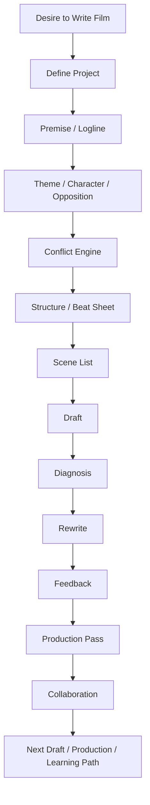
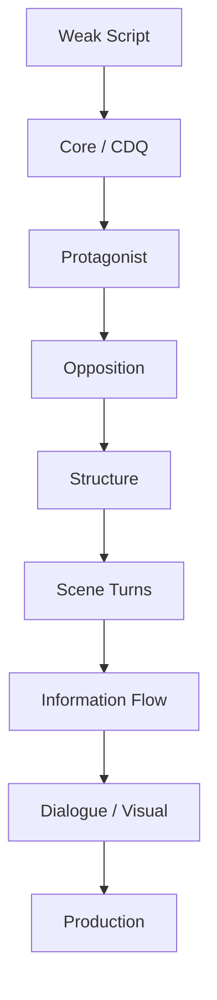
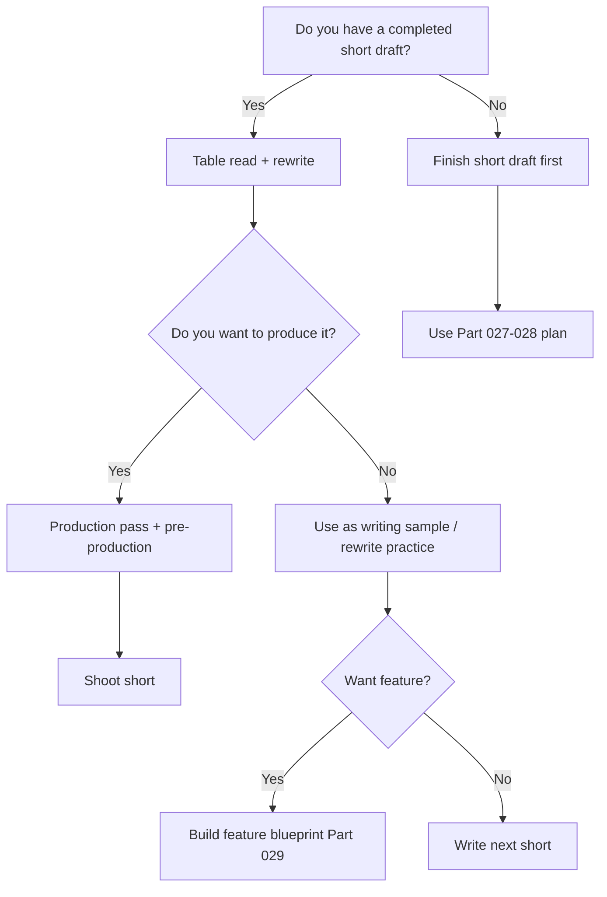
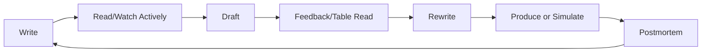

# learn-screenwriting-film-script-part-030.md

# Part 030 — Final Review: Checklist, Anti-Pattern, dan Next Learning Path

> Seri: Learn Screenwriting for Film Project  
> Pendekatan: *The First 20 Hours* — Josh Kaufman  
> Fokus bagian ini: menutup seluruh seri dengan review menyeluruh, master checklist, anti-pattern utama, diagnosis framework, dan roadmap lanjutan setelah 20 jam pertama.  
> Target praktis: mampu mengevaluasi project naskah sendiri, mengetahui titik lemah prioritas, memilih jalur lanjutan, dan membawa proses belajar screenwriting ke project film nyata.

---

## 0. Posisi Part Ini dalam Roadmap

Ini adalah bagian terakhir dari seri.

Dari Part 000 sampai Part 029, kita sudah membangun sistem lengkap untuk belajar screenwriting dari nol dengan pendekatan *The First 20 Hours*.

Kita mulai dari:

```text
Saya ingin belajar menulis naskah film.
```

Lalu kita pecah menjadi:

- mental model screenplay,
- skill decomposition,
- project definition,
- premise/logline,
- theme,
- character,
- opposition,
- conflict,
- structure,
- beat sheet,
- scene design,
- visual storytelling,
- format,
- dialogue,
- exposition,
- genre/tone,
- worldbuilding,
- short film,
- feature film,
- treatment/outline,
- drafting,
- rewrite,
- feedback,
- production-aware writing,
- collaboration,
- tooling,
- 20-hour practice,
- short capstone,
- feature blueprint.

Part 030 berfungsi sebagai:

```text
Final integration layer.
```

Bukan materi baru yang benar-benar terpisah, tetapi penggabungan semua konsep menjadi sistem evaluasi dan tindakan.

Diagram keseluruhan:



---

## 1. Apa yang Seharusnya Anda Bisa Setelah Seri Ini?

Setelah menyelesaikan seri ini, Anda belum otomatis menjadi screenwriter profesional.

Namun Anda seharusnya sudah punya kemampuan dasar yang jauh lebih operasional:

1. Menjelaskan apa itu screenplay sebagai blueprint audiovisual.
2. Mengubah ide mentah menjadi premis/logline.
3. Menentukan tema sebagai pertanyaan dramatik.
4. Mendesain karakter dengan want, need, flaw, lie, fear, mask.
5. Mendesain opposition system.
6. Membuat conflict engine.
7. Memilih struktur short/feature.
8. Membuat beat sheet.
9. Mengubah beat menjadi scene list.
10. Mendesain scene dengan objective, opposition, turn, output.
11. Menulis action line dan dialog dasar.
12. Menghindari exposition dump.
13. Menggunakan genre/tone secara sadar.
14. Menulis short film dengan scope feasible.
15. Membuat blueprint feature.
16. Menyelesaikan first draft kasar.
17. Membuat rewrite plan.
18. Menerima feedback tanpa panik.
19. Melakukan production scope audit.
20. Berkolaborasi dengan role film lain.
21. Mengelola workflow dengan tooling yang rapi.
22. Menjalankan latihan 20 jam.
23. Membuat capstone short atau feature blueprint.

Skill paling penting:

```text
Anda sekarang punya proses.
```

Screenwriting tidak lagi hanya “menunggu inspirasi”.

---

## 2. Ringkasan Super-Padat Seluruh Seri

Jika seluruh seri harus diringkas dalam satu kalimat:

> Screenplay adalah blueprint pengalaman audiovisual yang dibangun dari karakter yang menginginkan sesuatu, ditekan oleh opposition, dipaksa berubah melalui conflict yang meningkat, diwujudkan dalam scene yang mengubah state, lalu diuji melalui draft, rewrite, feedback, dan produksi.

Jika diringkas sebagai pipeline:

```text
Idea
→ Premise
→ Logline
→ Theme
→ Character
→ Opposition
→ Conflict Engine
→ Structure
→ Beat Sheet
→ Scene List
→ Treatment
→ Draft
→ Rewrite
→ Feedback
→ Production Pass
→ Collaboration
→ Next Draft / Production
```

Jika diringkas sebagai prinsip:

```text
Every scene must change something.
Every character must want something.
Every conflict must cost something.
Every choice must reveal something.
Every ending must pay something.
```

---

## 3. Master Mental Model

Untuk software engineer, mental model lengkapnya:

| Software Engineering | Screenwriting |
|---|---|
| Product vision | Core story |
| Requirements | Genre, tone, format, audience |
| Domain model | World, character, opposition |
| State machine | Character arc |
| Architecture | Structure |
| Module | Sequence |
| Function | Scene |
| Statement | Beat/action/dialogue |
| Input state | Scene start state |
| Output state | Scene end state |
| Runtime error | Reader confusion |
| Logs | Feedback/table read |
| Unit test | Scene turn test |
| Integration test | Full draft read |
| Refactor | Rewrite |
| Performance constraints | Production constraints |
| Version control | Draft versioning |
| Code review | Feedback |
| Deployment | Production/shooting |
| Postmortem | Learning review |

Namun ada perbedaan besar:

```text
Screenwriting tidak deterministic.
```

Anda tidak mencari jawaban tunggal yang benar. Anda mencari pilihan dramatik yang paling kuat, paling jujur, paling filmik, dan paling sesuai constraint.

---

## 4. Master Checklist: Ide

Sebelum menulis terlalu jauh, cek ide.

- [ ] Apakah ada image konkret?
- [ ] Apakah ada protagonist?
- [ ] Apakah ada goal eksternal?
- [ ] Apakah ada obstacle/opposition?
- [ ] Apakah ada stakes?
- [ ] Apakah ada choice?
- [ ] Apakah ada perubahan?
- [ ] Apakah bisa difilmkan?
- [ ] Apakah scope sesuai format?
- [ ] Apakah ide ini punya emotional charge untuk Anda?
- [ ] Apakah ada sesuatu yang spesifik, bukan generik?
- [ ] Apakah ada reason to watch?

Pertanyaan paling penting:

```text
Apa yang membuat ide ini film, bukan hanya konsep?
```

Jawaban harus berupa:

- image,
- action,
- conflict,
- sound,
- object,
- relationship,
- choice.

---

## 5. Master Checklist: Logline

Logline harus jelas.

- [ ] Protagonist spesifik.
- [ ] Inciting event ada.
- [ ] Goal eksternal jelas.
- [ ] Opposition jelas.
- [ ] Stakes terasa.
- [ ] Genre/tone tercium.
- [ ] Irony atau contradiction ada.
- [ ] Scope sesuai short/feature.
- [ ] Bisa dibayangkan secara visual.
- [ ] Tidak hanya “seseorang belajar sesuatu”.
- [ ] Tidak terlalu abstrak.
- [ ] Tidak terlalu panjang sampai seperti synopsis.

Formula:

```text
Ketika [event], seorang [protagonist] harus [goal] sebelum/meskipun [opposition/pressure], tetapi [moral/internal cost] memaksanya [choice/change].
```

Jika logline tidak bekerja, draft biasanya akan kabur.

---

## 6. Master Checklist: Theme

Tema bukan pesan moral yang ditempel.

- [ ] Theme berupa pertanyaan, bukan slogan.
- [ ] Theme diuji lewat conflict.
- [ ] Protagonist punya posisi awal terhadap tema.
- [ ] Opposition punya counter-position.
- [ ] Supporting characters memberi variasi posisi.
- [ ] Midpoint memperumit tema.
- [ ] Crisis memaksa pilihan tematik.
- [ ] Ending menjawab tema lewat action.
- [ ] Dialog tidak berubah menjadi ceramah.
- [ ] Theme terlihat dalam object/visual/choice.

Template:

```text
Apakah [value A] lebih penting daripada [value B] ketika [pressure]?
```

Contoh:

```text
Apakah keluarga boleh dilindungi dengan kebohongan jika kebenaran menghancurkan semua orang?
```

---

## 7. Master Checklist: Character

Karakter utama harus bisa diuji.

- [ ] Want eksternal jelas.
- [ ] Need internal jelas.
- [ ] Lie/flaw jelas.
- [ ] Fear jelas.
- [ ] Mask/public behavior jelas.
- [ ] Wound/absence diketahui cukup.
- [ ] Tactic khas.
- [ ] Voice khas.
- [ ] Visual behavior khas.
- [ ] Final choice berbeda dari initial strategy.
- [ ] Change terlihat lewat action.
- [ ] Protagonist aktif, bukan hanya menerima plot.
- [ ] Supporting characters punya fungsi.
- [ ] Antagonist/opposition punya alasan.

Character kernel:

```text
Want:
Need:
Lie:
Flaw:
Fear:
Mask:
Tactic:
Final choice:
Proof of change:
```

Jika karakter tidak punya want, scene akan mati.

---

## 8. Master Checklist: Opposition

Opposition bukan sekadar “orang jahat”.

- [ ] Opposition punya goal.
- [ ] Opposition punya worldview.
- [ ] Opposition menekan flaw protagonist.
- [ ] Opposition aktif, bukan pasif.
- [ ] Opposition meningkat.
- [ ] Opposition punya tactic.
- [ ] Opposition bisa benar dari sudut pandangnya.
- [ ] Opposition menciptakan cost.
- [ ] Opposition punya bentuk eksternal dan internal.
- [ ] Dalam feature, opposition menjadi system.

Opposition layer:

```text
Direct person
System/institution
Relationship pressure
Time/resource pressure
Internal flaw
Moral consequence
World rule
```

Semakin kuat opposition, semakin kuat character arc.

---

## 9. Master Checklist: Conflict

Konflik bukan hanya pertengkaran.

- [ ] Ada want vs obstacle.
- [ ] Ada tactic vs counter-tactic.
- [ ] Ada stakes.
- [ ] Ada cost.
- [ ] Ada urgency.
- [ ] Ada power shift.
- [ ] Ada hidden information/subtext.
- [ ] Ada moral or emotional pressure.
- [ ] Ada output state baru.
- [ ] Konflik meningkat, bukan berulang.

Scene conflict template:

```text
A wants:
B wants:
A tactic:
B counter:
Hidden agenda:
Turn:
Cost:
Output:
```

Jika konflik hanya “dua orang menjelaskan posisi”, cari action/object/deadline.

---

## 10. Master Checklist: Structure

Struktur adalah perubahan, bukan template mati.

### Untuk short

- [ ] Situation jelas.
- [ ] Disruption jelas.
- [ ] Escalation ada.
- [ ] Choice ada.
- [ ] Consequence/final image ada.
- [ ] Satu dramatic unit selesai.

### Untuk feature

- [ ] Setup.
- [ ] Inciting incident.
- [ ] Lock-in / Act 1 break.
- [ ] First strategy.
- [ ] Midpoint reframe.
- [ ] Act 2B consequences.
- [ ] All is lost.
- [ ] Crisis choice.
- [ ] Climax.
- [ ] Resolution/final image.

Structure test:

```text
Apakah setiap major turn mengubah goal, strategy, stakes, power, truth, atau identity?
```

Jika tidak, turn mungkin hanya event.

---

## 11. Master Checklist: Beat Sheet

Beat adalah unit perubahan.

- [ ] Setiap beat punya before/after.
- [ ] Setiap beat punya conflict/reveal/choice.
- [ ] Beat saling menyebabkan.
- [ ] Tidak terlalu banyak “and then”.
- [ ] Ada “but/therefore”.
- [ ] Beat tidak hanya mood.
- [ ] Beat menggerakkan character atau plot.
- [ ] Beat punya escalation.
- [ ] Setup/payoff dilacak.
- [ ] Beat bisa diterjemahkan menjadi scene/action.

Beat template:

```text
Before:
Event:
Conflict:
Turn:
After:
Therefore / But:
```

---

## 12. Master Checklist: Scene

Scene adalah unit eksekusi dramatik.

- [ ] Scene heading jelas.
- [ ] Input state jelas.
- [ ] Objective jelas.
- [ ] Opposition jelas.
- [ ] Tactic/counter-tactic ada.
- [ ] Turn ada.
- [ ] Output state berbeda dari input.
- [ ] Scene masuk terlambat.
- [ ] Scene keluar cepat setelah turn.
- [ ] Ada visual/object/action.
- [ ] Dialog bukan hanya informasi.
- [ ] Scene memicu scene berikutnya.
- [ ] Jika scene dihapus, ada fungsi yang hilang.

Scene function formula:

```text
Scene(input state + pressure) → changed output state
```

Jika input dan output sama, scene harus dipotong, digabung, atau direwrite.

---

## 13. Master Checklist: Visual Storytelling

Screenplay harus bisa dilihat dan didengar.

- [ ] Internal state diterjemahkan menjadi behavior.
- [ ] Object/motif punya fungsi.
- [ ] Action line filmable.
- [ ] Tidak terlalu novelistik.
- [ ] Sound digunakan sebagai story element.
- [ ] Off-screen space digunakan.
- [ ] Opening image kuat.
- [ ] Final image membayar opening.
- [ ] Relationship terlihat lewat blocking/distance/object.
- [ ] Theme terlihat dalam action/image.
- [ ] Exposition bisa muncul lewat object, bukan hanya dialog.

Conversion test:

```text
Jika saya menghapus dialog, apakah penonton masih bisa merasakan sebagian conflict?
```

Tidak harus semua, tetapi sebagian.

---

## 14. Master Checklist: Dialogue

Dialog adalah action verbal.

- [ ] Karakter menginginkan sesuatu saat bicara.
- [ ] Dialog punya target.
- [ ] Dialog punya tactic.
- [ ] Ada subtext.
- [ ] Ada power movement.
- [ ] Character voice berbeda.
- [ ] Line tidak terlalu panjang.
- [ ] Exposition tidak terlalu telanjang.
- [ ] Silence/action bisa mengganti sebagian line.
- [ ] Dialog bisa dibaca keras.
- [ ] Humor sesuai tone.
- [ ] Momen jujur muncul dengan sengaja, bukan semua line on-the-nose.

Dialogue diagnostic:

```text
What character says:
What character means:
What character wants:
What character hides:
```

Jika semua karakter terdengar sama, buat voice sheet.

---

## 15. Master Checklist: Exposition

Informasi harus didramatisasi.

- [ ] Audience tahu cukup untuk peduli.
- [ ] Audience tidak terlalu cepat diberi semua.
- [ ] Info muncul saat dibutuhkan.
- [ ] Info punya cost.
- [ ] Info mengubah action.
- [ ] Exposition muncul lewat conflict/object/action/reaction.
- [ ] Tidak ada “as you know”.
- [ ] Tidak ada monolog history tanpa pressure.
- [ ] Reveal schedule jelas.
- [ ] Who-knows-what konsisten.
- [ ] Mystery membingungkan secara baik, bukan membingungkan basic.

Good confusion:

```text
Apa isi ruang kerja?
```

Bad confusion:

```text
Kenapa karakter ini ada di rumah?
```

---

## 16. Master Checklist: Genre and Tone

Genre adalah kontrak pengalaman.

- [ ] Primary genre jelas.
- [ ] Audience promise jelas.
- [ ] Mandatory scenes diketahui.
- [ ] Cliché dikenali.
- [ ] Subversion jika ada earned.
- [ ] Tone palette jelas.
- [ ] Tone danger jelas.
- [ ] Opening memberi sinyal genre/tone.
- [ ] Ending membayar genre/tone.
- [ ] Humor/gelap/sentimentalitas tidak random.
- [ ] Violence/intimacy/ambiguity level sadar.

Tone question:

```text
Apakah scene ini terasa berasal dari film yang sama?
```

Jika tidak, cek dialogue, pacing, visual, dan stakes.

---

## 17. Master Checklist: Worldbuilding

Worldbuilding film harus cukup, terlihat, berfungsi.

- [ ] World menekan karakter.
- [ ] World punya rules.
- [ ] Rules punya consequence.
- [ ] World terlihat lewat behavior/object/location.
- [ ] Tidak ada lore dump.
- [ ] Detail spesifik, bukan generic.
- [ ] Location punya fungsi dramatik.
- [ ] Social/power/economic layer terlihat jika relevan.
- [ ] World scope sesuai format.
- [ ] Off-screen world memperluas tanpa mempermahal.
- [ ] Production-aware.

Prinsip:

```text
Enough. Visible. Functional.
```

---

## 18. Master Checklist: Short Film

Short film sukses jika:

- [ ] Satu dramatic question.
- [ ] Satu protagonist.
- [ ] Satu core conflict.
- [ ] Satu major choice.
- [ ] Satu final image.
- [ ] Scope kecil.
- [ ] Exposition minimal.
- [ ] Scene count terkendali.
- [ ] Object/image kuat.
- [ ] Ending tidak overexplained.
- [ ] Bisa diproduksi.

Short formula:

```text
Situation → Disruption → Escalation → Choice → Consequence
```

Short bukan feature yang dipotong. Short adalah satu momen yang presisi.

---

## 19. Master Checklist: Feature Film

Feature sukses jika:

- [ ] CDQ sustain sampai akhir.
- [ ] Protagonist active.
- [ ] Want kuat.
- [ ] Need/flaw diuji berkali-kali.
- [ ] Opposition system aktif.
- [ ] Stakes meningkat.
- [ ] Sequence goals berbeda.
- [ ] Midpoint mengubah makna.
- [ ] Act 2 tidak repetitif.
- [ ] Subplots berfungsi.
- [ ] Ending earned.
- [ ] Final image membayar opening.
- [ ] Production scope dikontrol.

Feature formula:

```text
CDQ + Protagonist Arc + Opposition System + 8 Sequences + Midpoint + Escalating Stakes + Earned Ending
```

---

## 20. Master Checklist: Drafting

Saat drafting:

- [ ] Tulis maju.
- [ ] Jangan rewrite besar terlalu dini.
- [ ] Gunakan scene card.
- [ ] Gunakan placeholder.
- [ ] Tulis action/dialog kasar.
- [ ] Jaga objective/turn/output.
- [ ] Catat TODO.
- [ ] Selesaikan draft.
- [ ] Jangan menilai terlalu cepat.
- [ ] Simpan versi.

Prinsip:

```text
Complete before perfect.
```

Draft yang buruk bisa direwrite. Draft yang tidak selesai tidak bisa diuji.

---

## 21. Master Checklist: Rewrite

Rewrite harus terdiagnosis.

- [ ] Cooling period.
- [ ] Full read.
- [ ] Reaction notes.
- [ ] Top 3 issues.
- [ ] Story spine check.
- [ ] Structure pass.
- [ ] Character pass.
- [ ] Scene turn audit.
- [ ] Exposition pass.
- [ ] Dialogue pass.
- [ ] Production pass.
- [ ] Rewrite plan.
- [ ] Do-not-change list.
- [ ] Changelog.

Urutan:

```text
Structure → Character → Scene → Exposition → Dialogue → Polish
```

Jangan polish dialog sebelum ending bekerja.

---

## 22. Master Checklist: Feedback

Feedback harus diarahkan.

- [ ] Draft cukup readable.
- [ ] Feedback brief jelas.
- [ ] Questions spesifik.
- [ ] Reader sesuai stage.
- [ ] Anda tidak defensif.
- [ ] Raw notes dicatat.
- [ ] Notes dikategorikan.
- [ ] Pattern dicari.
- [ ] Root cause ditemukan.
- [ ] Feedback menjadi rewrite issue.
- [ ] Positive feedback juga dicatat.
- [ ] Core story dilindungi.

Jangan hanya tanya:

```text
Bagus nggak?
```

Tanya:

```text
Di mana kamu bosan?
Apa yang kamu pikir protagonist inginkan?
Apakah ending terasa earned?
```

---

## 23. Master Checklist: Table Read

Untuk table read:

- [ ] Script readable.
- [ ] Role list.
- [ ] Action reader.
- [ ] Ground rules.
- [ ] Timer.
- [ ] Note taker.
- [ ] Feedback form.
- [ ] No stopping during read.
- [ ] Post-read discussion.
- [ ] Notes categorized.
- [ ] Dialogue/pacing/character issues marked.

Table read sangat penting untuk:

- dialog,
- pacing,
- playable action,
- actor objective,
- emotional transitions.

Jika line terdengar buruk saat dibaca, itu data.

---

## 24. Master Checklist: Production-Aware Writing

Naskah harus bisa difilmkan.

- [ ] Location count diketahui.
- [ ] Cast count diketahui.
- [ ] Hero props jelas.
- [ ] Day/night split sadar.
- [ ] INT/EXT sadar.
- [ ] Sound risks diketahui.
- [ ] High-cost scenes diidentifikasi.
- [ ] High-cost low-value direwrite.
- [ ] Low-cost high-value dipertahankan.
- [ ] Scope sesuai resource.
- [ ] Safety/sensitivity risk dipertimbangkan.
- [ ] Production audit ada.

Pertanyaan utama:

```text
Apa fungsi dramatik scene mahal ini?
Bisakah fungsi itu dicapai lebih feasible tanpa kehilangan core?
```

---

## 25. Master Checklist: Collaboration

Film adalah kolaborasi.

- [ ] Core story brief ada.
- [ ] Core vs flexible map ada.
- [ ] Scene function bisa dijelaskan.
- [ ] Meeting agenda ada.
- [ ] Notes dicatat.
- [ ] Decision log ada.
- [ ] Changelog ada.
- [ ] Department handoff jika perlu.
- [ ] Writer tidak overcontrol.
- [ ] Writer tidak pasif.
- [ ] Function-based negotiation dipakai.
- [ ] Continuity dicek setelah perubahan.

Prinsip:

```text
Protect function. Be flexible on form.
```

---

## 26. Master Checklist: Tooling

Tooling harus ringan dan membantu.

- [ ] Folder project rapi.
- [ ] Naming konsisten.
- [ ] Draft version jelas.
- [ ] Scene list ada.
- [ ] Writing log ada.
- [ ] Feedback tracker ada.
- [ ] Rewrite issues ada.
- [ ] Production audit ada.
- [ ] Decision log ada.
- [ ] Backup ada.
- [ ] Tidak over-engineering.

Jika tooling menghambat menulis, sederhanakan.

Minimal workflow:

```text
project-brief.md
scene-list.md
draft-001.fountain
rewrite-notes.md
feedback.md
```

---

## 27. The 12 Biggest Anti-Patterns

### 27.1 Ide Besar, Konflik Kecil

Cerita punya konsep menarik, tetapi scene tidak punya conflict.

Fix:

```text
Character want + opposition + cost.
```

### 27.2 Karakter Pasif

Plot terjadi kepada protagonist.

Fix:

```text
Protagonist must choose and cause consequences.
```

### 27.3 Exposition Dump

Karakter menjelaskan masa lalu.

Fix:

```text
Reveal through object, conflict, behavior, consequence.
```

### 27.4 Scene Tanpa Turn

Scene terasa indah tapi tidak mengubah apa pun.

Fix:

```text
Input-output audit.
```

### 27.5 Dialog Terlalu Literal

Karakter mengatakan semua maksud.

Fix:

```text
Subtext + tactic + action beat.
```

### 27.6 Struktur “And Then”

Event hanya berurutan, tidak saling menyebabkan.

Fix:

```text
But/therefore chain.
```

### 27.7 Midpoint Lemah

Midpoint hanya event biasa.

Fix:

```text
Midpoint must reframe goal/stakes/identity.
```

### 27.8 Ending Tidak Earned

Karakter berubah tiba-tiba.

Fix:

```text
Setup pressure and final choice earlier.
```

### 27.9 Scope Explosion

Too many locations/characters/events.

Fix:

```text
Contained core + off-screen world.
```

### 27.10 Rewrite Tanpa Diagnosis

Mengubah random.

Fix:

```text
Read → diagnose → prioritize → rewrite.
```

### 27.11 Feedback Defensive

Menolak semua notes.

Fix:

```text
Find pattern and note behind the note.
```

### 27.12 Tooling Escape

Sistem rapi, draft tidak ada.

Fix:

```text
Every tooling session ends with writing.
```

---

## 28. Diagnostic Framework: Jika Naskah Terasa Lemah

Gunakan urutan diagnosis berikut.

### Step 1 — Core

```text
Apakah saya bisa menjelaskan film ini dalam satu logline?
Apakah CDQ jelas?
Apakah ending menjawab CDQ?
```

Jika tidak, jangan polish.

### Step 2 — Protagonist

```text
Apa want protagonist?
Apa need?
Apa flaw?
Apa final choice?
Apakah ia aktif?
```

### Step 3 — Opposition

```text
Siapa/apa yang menghalangi?
Apakah opposition aktif?
Apakah pressure meningkat?
```

### Step 4 — Structure

```text
Apa inciting?
Apa midpoint?
Apa all is lost?
Apa climax?
```

### Step 5 — Scene

```text
Scene mana tidak punya turn?
Scene mana bisa dipotong?
Scene mana mengulang?
```

### Step 6 — Information

```text
Apa yang audience tahu?
Kapan?
Siapa yang tahu apa?
```

### Step 7 — Dialogue/Visual

```text
Apakah dialog tactic?
Apakah action filmable?
Apakah object/sound bekerja?
```

### Step 8 — Production

```text
Apakah scope masuk akal?
Scene mahal mana yang low-value?
```

Diagram:



---

## 29. Script Health Scorecard

Skor 1–5.

| Area | Score | Notes |
|---|---:|---|
| Logline clarity |  |  |
| Theme as question |  |  |
| Protagonist want |  |  |
| Protagonist agency |  |  |
| Character arc |  |  |
| Opposition strength |  |  |
| Stakes escalation |  |  |
| Structure |  |  |
| Midpoint / choice |  |  |
| Scene turns |  |  |
| Visual storytelling |  |  |
| Dialogue/subtext |  |  |
| Exposition |  |  |
| Genre/tone |  |  |
| Ending/final image |  |  |
| Production feasibility |  |  |
| Feedback readiness |  |  |

Interpretasi:

```text
1 = broken
2 = weak
3 = workable
4 = strong
5 = excellent
```

Prioritaskan area 1–2 yang berada di core/structure/character.

---

## 30. Rewrite Priority Matrix

| Severity | Layer | Action |
|---|---|---|
| Critical | Premise/CDQ/ending | redesign before polish |
| High | Structure/protagonist/opposition | rewrite plan |
| Medium | Scene/exposition/relationship | targeted rewrite |
| Low | Dialogue/action line | polish pass |
| Minor | typo/format | final polish |

Contoh:

```text
Jika protagonist tidak punya goal, itu Critical/High.
Jika scene heading kurang konsisten, itu Minor.
```

Jangan terbalik.

---

## 31. Next Learning Path: Pilihan Besar

Setelah seri ini, ada beberapa jalur.

### Path A — Short Film Production

Tujuan:

```text
Mengubah naskah short menjadi film jadi.
```

Belajar:

- directing basics,
- shot planning,
- casting,
- rehearsal,
- production management,
- editing,
- sound,
- festival/submission.

Cocok jika Anda ingin membuat project nyata cepat.

### Path B — Feature Writing

Tujuan:

```text
Menulis draft feature penuh.
```

Belajar:

- deeper outlining,
- act 2 mastery,
- subplot,
- rewrite multi-draft,
- coverage,
- pitch package.

Cocok jika project utama Anda film panjang.

### Path C — Dialogue Mastery

Tujuan:

```text
Dialog lebih natural, tajam, subtextual.
```

Belajar:

- voice,
- rhythm,
- interruption,
- status,
- silence,
- table read.

### Path D — Genre Specialization

Pilih satu genre:

- drama,
- thriller,
- horror,
- comedy,
- romance,
- satire,
- mystery,
- action.

Tujuan:

```text
Memahami genre promise dan convention secara dalam.
```

### Path E — Directing for Writers

Tujuan:

```text
Memahami bagaimana script diwujudkan.
```

Belajar:

- blocking,
- actor direction,
- coverage,
- visual grammar,
- tone.

### Path F — Producing/Production-Aware Filmmaking

Tujuan:

```text
Membuat project feasible.
```

Belajar:

- budgeting,
- scheduling,
- location,
- casting,
- crew,
- risk.

### Path G — Script Doctoring / Rewrite

Tujuan:

```text
Mendiagnosis dan memperbaiki naskah.
```

Belajar:

- coverage,
- rewrite passes,
- feedback synthesis,
- structure surgery.

---

## 32. Rekomendasi Jalur untuk Anda

Karena Anda seorang software engineer dengan cara pikir deterministic, jalur terbaik biasanya:

```text
1. Buat film pendek nyata.
2. Gunakan short sebagai feedback loop produksi.
3. Baru expand ke feature.
```

Kenapa?

Karena screenwriting tidak lengkap tanpa melihat:

- aktor membaca dialog,
- scene terasa panjang/pendek,
- lokasi sulit,
- sound bermasalah,
- editing memotong scene,
- final image bekerja/tidak,
- penonton bereaksi.

Project kecil yang selesai akan mengajarkan lebih banyak daripada blueprint besar yang tidak pernah diuji.

Recommended sequence:

```text
Short Capstone → Table Read → Rewrite → Shoot Simple Version → Edit → Postmortem → Next Short / Feature Blueprint
```

---

## 33. 90-Day Roadmap Setelah Seri

### Bulan 1 — Short Script

- Week 1: choose idea + logline.
- Week 2: beat sheet + scene list + treatment.
- Week 3: draft + rewrite.
- Week 4: table read + rewrite + production audit.

Output:

```text
Short draft v002.
```

### Bulan 2 — Pre-Production

- Week 5: cast/crew/resource.
- Week 6: rehearsal + shot planning.
- Week 7: location/props/schedule.
- Week 8: shoot.

Output:

```text
Footage.
```

### Bulan 3 — Post and Learning

- Week 9: rough cut.
- Week 10: sound/edit feedback.
- Week 11: final cut.
- Week 12: postmortem + next project plan.

Output:

```text
Completed short film + lessons.
```

This roadmap turns writing into filmmaking.

---

## 34. 12-Month Roadmap

### Quarter 1 — Short Film Skill Loop

- Write 2–3 short scripts.
- Shoot 1 simple short.
- Do table reads.
- Learn rewrite.

### Quarter 2 — Genre and Dialogue

- Pick one genre.
- Study 10 films.
- Read 5 scripts.
- Write 10 scenes.
- Table read dialogue.

### Quarter 3 — Feature Blueprint

- Develop 1 feature logline.
- Write synopsis.
- Build 8 sequence outline.
- Write treatment.
- Get feedback.

### Quarter 4 — Feature Draft or Second Short

Option A:

```text
Draft Act 1 and midpoint sequence of feature.
```

Option B:

```text
Shoot a stronger short using lessons.
```

By year end, ideal outputs:

- 2–3 short scripts,
- 1 finished short film,
- 1 feature blueprint,
- 1 Act 1 draft or feature treatment,
- clearer taste.

---

## 35. 20-Hour Loops Lanjutan

Gunakan framework Kaufman lagi.

### 35.1 20 Jam Dialog

Output:

- 20 dialogue scenes,
- voice sheets,
- table read,
- subtext rewrites.

### 35.2 20 Jam Rewrite

Output:

- one draft diagnosed,
- rewrite issues,
- draft 2,
- feedback triage.

### 35.3 20 Jam Horror Short

Output:

- 5 horror loglines,
- 1 short script,
- sound/dread pass.

### 35.4 20 Jam Comedy Scene

Output:

- status games,
- callbacks,
- escalation,
- table read laughter data.

### 35.5 20 Jam Feature Outline

Output:

- 8 sequence,
- 60 beats,
- treatment,
- Act 1 scene list.

### 35.6 20 Jam Production

Output:

- resource inventory,
- shot list,
- schedule,
- shoot 1 scene.

The same method applies.

---

## 36. Reading and Watching Practice

Untuk belajar lanjutan, jangan hanya menonton.

Gunakan active viewing.

### Film Watch Template

```text
Film:
Genre:
Why watching:
Opening image:
Protagonist want:
Inciting:
Midpoint:
All is lost:
Climax:
Final image:
Best scene:
What I can steal as technique:
What to avoid:
```

### Script Reading Template

```text
Script:
Page count:
Action line style:
Dialogue style:
Scene length:
How exposition handled:
How character introduced:
How scenes turn:
Favorite page:
Lesson:
```

Target:

```text
10 films + 5 scripts per genre focus.
```

---

## 37. Practice: Scene Library

Bangun library scene.

Tulis 1 scene per minggu:

- interrogation without police,
- apology without saying sorry,
- breakup without mentioning relationship,
- horror rule violation,
- family dinner conflict,
- character hiding guilt,
- character asking for help badly,
- object handover,
- final image scene,
- silent scene.

Each scene should have:

```text
Objective
Opposition
Turn
Subtext
Visual core
```

Scene reps build skill.

---

## 38. Practice: Rewrite Library

Ambil scene yang sama dan rewrite 5 kali:

1. On-the-nose version.
2. Subtext version.
3. No-dialogue version.
4. Comedy version.
5. Thriller version.

Ini melatih flexibility.

Untuk software engineer, ini seperti kata:

```text
same requirement, different implementation strategy.
```

---

## 39. Practice: Table Read Habit

Minimal satu kali per bulan:

- baca scene keras,
- minta 2 orang membaca,
- catat line yang gagal,
- rewrite.

Jika tidak ada orang:

- rekam diri membaca,
- dengarkan,
- tandai cringe,
- rewrite.

Dialog harus melewati telinga.

---

## 40. Practice: Production Reality Check

Setiap naskah short harus punya:

```text
Location count
Cast count
Props
Sound risk
Shoot days estimate
High-risk scenes
```

Ini melatih penulis berpikir sebagai filmmaker.

---

## 41. Building Taste

Taste dibangun dari:

- membaca script bagus,
- menonton aktif,
- menulis,
- feedback,
- rewrite,
- melihat film selesai,
- membandingkan draft dengan final cut,
- mengulang.

Taste bukan hanya opini. Taste adalah kemampuan membedakan:

```text
ini kuat
ini palsu
ini terlalu jelas
ini membingungkan
ini earned
ini manipulatif
ini cinematic
ini cuma kata-kata
```

Taste berkembang lambat. Jangan frustrasi.

---

## 42. Balancing Deterministic Thinking and Creative Ambiguity

Sebagai engineer, Anda mungkin ingin semua pasti.

Screenwriting butuh toleransi terhadap:

- ambiguity,
- contradiction,
- emotional truth,
- incomplete information,
- iteration,
- taste,
- audience interpretation,
- collaboration.

Gunakan engineering untuk proses, bukan untuk mengunci hasil.

Good use of deterministic thinking:

- tracking scene turns,
- versioning,
- diagnosis,
- production scope,
- feedback triage,
- structure mapping.

Bad use:

- mencari formula final,
- menilai semua secara angka,
- takut menulis tanpa solusi sempurna,
- overfitting template,
- menghapus ambiguitas yang justru membuat scene hidup.

Balance:

```text
Process can be structured.
Art must remain alive.
```

---

## 43. Final Project Decision Tree

Gunakan decision tree ini.



Do not jump to feature if you cannot finish short, unless feature is your immediate project and you accept long timeline.

---

## 44. If You Are Starting a Real Film Project Now

Recommended steps:

1. Write project brief.
2. Define format: short or feature.
3. Write logline.
4. Write one-page synopsis.
5. Write character kernels.
6. Build beat sheet.
7. Build scene list.
8. Do production scope audit.
9. Draft.
10. Self diagnose.
11. Table read.
12. Rewrite.
13. Production pass.
14. Collaborator meeting.
15. Lock development draft.

Do not skip logline/theme/character just because you are excited.

---

## 45. If You Are Stuck Right Now

### Stuck at idea

Write 10 loglines. Pick one for practice.

### Stuck at structure

Use 5-part short or 8 sequence feature.

### Stuck at scene

Fill scene card: objective, opposition, turn, output.

### Stuck at dialogue

Write literal version first, then subtext version.

### Stuck at rewrite

Do full read and top 3 issues.

### Stuck because everything feels bad

Finish draft anyway.

### Stuck because too many options

Choose constraint: one location, three characters, one object, one night.

### Stuck because not confident

Confidence comes after artifact, not before.

---

## 46. Final Templates Pack

Keep these templates as permanent toolkit.

### 46.1 Project Brief

```text
Title:
Format:
Genre:
Tone:
Duration/page target:
Primary location:
Main character:
Core conflict:
Theme question:
Production constraint:
Why this story:
```

### 46.2 Logline

```text
When:
Protagonist:
Goal:
Obstacle:
Stakes:
Choice:
Logline:
```

### 46.3 Character Kernel

```text
Name:
Want:
Need:
Lie:
Flaw:
Fear:
Mask:
Tactic:
Final choice:
Proof of change:
```

### 46.4 Scene Card

```text
Scene:
Heading:
Characters:
Input:
Objective:
Opposition:
Turn:
Output:
Visual/object:
Sound:
Notes:
```

### 46.5 Rewrite Issue

```text
Problem:
Evidence:
Root cause:
Affected scenes:
Fix:
Acceptance criteria:
```

### 46.6 Feedback Brief

```text
Draft:
Stage:
I want feedback on:
Please don't focus on:
Questions:
Deadline:
```

### 46.7 Production Audit

```text
Locations:
Cast:
Props:
Day/night:
INT/EXT:
High-risk:
High-cost low-value:
Low-cost high-value:
Rewrite options:
```

---

## 47. Final Anti-Pattern Checklist Before Sending Draft

Before sending draft to anyone, check:

- [ ] Is this draft readable?
- [ ] Did I read it myself?
- [ ] Does it have an ending?
- [ ] Are major placeholders removed?
- [ ] Do I know what feedback I want?
- [ ] Is version/date clear?
- [ ] Am I emotionally ready to hear notes?
- [ ] Did I include feedback brief?
- [ ] Did I backup the draft?
- [ ] Did I note what should not change?

If not, prepare first.

---

## 48. Final Anti-Pattern Checklist Before Production

Before production planning:

- [ ] Is story core clear?
- [ ] Is script scope feasible?
- [ ] Are locations known?
- [ ] Are cast requirements realistic?
- [ ] Are hero props tracked?
- [ ] Are sound risks known?
- [ ] Are safety/sensitivity issues considered?
- [ ] Has there been a table read?
- [ ] Are rewrite issues resolved enough?
- [ ] Does the ending work?
- [ ] Is the director/producer aligned?
- [ ] Is the current draft version locked?

Do not shoot a draft whose core nobody understands, unless it is an experiment and everyone knows.

---

## 49. What “Done” Means at Different Levels

### Done as Exercise

```text
Artifact exists and I learned something.
```

### Done as Draft

```text
Complete readable script with beginning, middle, end.
```

### Done as Feedback Draft

```text
Clean enough for readers, questions specific.
```

### Done as Rewrite Draft

```text
Top issues addressed, version updated.
```

### Done as Production Draft

```text
Feasible, aligned, readable, current, with production concerns known.
```

### Done as Learning Loop

```text
Postmortem written and next practice chosen.
```

Define done before starting.

---

## 50. Recommended Immediate Next Action

Setelah membaca Part 030, jangan hanya menyimpan file.

Pilih satu tindakan dalam 24 jam:

### Option 1

```text
Buat project brief untuk short film.
```

### Option 2

```text
Tulis 10 logline.
```

### Option 3

```text
Ambil ide existing dan buat 8-beat short.
```

### Option 4

```text
Draft satu scene 2 halaman.
```

### Option 5

```text
Audit draft lama dengan scene turn table.
```

### Option 6

```text
Buat folder project dan mulai writing log.
```

Tindakan kecil lebih penting daripada rencana besar yang tidak dimulai.

---

## 51. Suggested Next Series

Setelah seri ini, rekomendasi materi lanjutan:

### 51.1 Directing for Writers

- shot as story,
- blocking,
- actor objective,
- staging,
- visual grammar,
- coverage,
- directing dialogue scenes.

### 51.2 Film Production Pipeline

- pre-production,
- casting,
- location,
- scheduling,
- budget,
- shooting,
- post-production.

### 51.3 Editing for Screenwriters

- scene rhythm,
- cut points,
- reaction,
- montage,
- structure in edit,
- fixing script problems in post.

### 51.4 Dialogue Masterclass

- subtext,
- voice,
- rhythm,
- status,
- silence,
- comedy,
- table read.

### 51.5 Genre Deep Dive

Pick one:

- horror,
- thriller,
- drama,
- comedy,
- romance,
- satire,
- mystery.

### 51.6 Feature Screenwriting Advanced

- Act 2,
- subplots,
- ensemble,
- nonlinear structure,
- sequence rewrite,
- coverage,
- pitch package.

### 51.7 Producing Indie Short Film

- making a film with low budget,
- resource-first writing,
- crew,
- shooting plan,
- release/festival.

---

## 52. Final Learning Loop

The learning loop:



Do not stay forever in “read/watch”.

Write. Test. Rewrite. Repeat.

---

## 53. Final Words: What Matters Most

If you remember only 10 things:

1. Screenplay is not a story essay; it is an audiovisual blueprint.
2. Character wants something.
3. Opposition makes it costly.
4. Conflict reveals character.
5. Scene must change state.
6. Visual action beats explanation.
7. First draft should be completed, not worshipped.
8. Rewrite is where the script is born.
9. Feedback is data, not a verdict.
10. Production reality is a creative partner, not an enemy.

And one more:

```text
Write small enough to finish, deep enough to matter.
```

---

## 54. Final Series Completion Status

- Part 000 — Daftar Isi, Target Performa, dan Kontrak Belajar 20 Jam: selesai.
- Part 001 — Mental Model Naskah Film: Bukan Cerita, tapi Blueprint Pengalaman Audiovisual: selesai.
- Part 002 — Framework Josh Kaufman untuk Screenwriting: Deconstruct, Self-Correct, Remove Barrier, Practice: selesai.
- Part 003 — Definisi Project: Film Apa yang Sebenarnya Mau Ditulis?: selesai.
- Part 004 — Premis, Logline, dan Dramatic Question: selesai.
- Part 005 — Tema: Apa yang Sebenarnya Diperdebatkan Film Ini?: selesai.
- Part 006 — Karakter sebagai State Machine: Desire, Need, Flaw, Wound, Mask: selesai.
- Part 007 — Antagonis, Oposisi, dan Sistem Tekanan: selesai.
- Part 008 — Konflik: Engine Utama Naskah Film: selesai.
- Part 009 — Struktur Cerita: Dari Three-Act sampai Sequence Approach: selesai.
- Part 010 — Beat Sheet: Mengubah Cerita Menjadi Rangkaian Perubahan: selesai.
- Part 011 — Scene Design: Setiap Scene Harus Mengubah Sesuatu: selesai.
- Part 012 — Visual Storytelling: Menulis yang Bisa Dilihat dan Didengar: selesai.
- Part 013 — Format Screenplay: Scene Heading, Action, Character, Dialogue, Parenthetical: selesai.
- Part 014 — Dialog: Bukan Percakapan Realistis, tapi Percakapan Dramatis: selesai.
- Part 015 — Exposition: Cara Memberi Informasi Tanpa Membunuh Drama: selesai.
- Part 016 — Genre, Tone, dan Audience Expectation: selesai.
- Part 017 — Worldbuilding untuk Film: Secukupnya, Terlihat, dan Berfungsi: selesai.
- Part 018 — Film Pendek: Struktur, Scope, dan Kekuatan Satu Momen: selesai.
- Part 019 — Feature Film: Scope, Arc, Sequence, dan Sustained Tension: selesai.
- Part 020 — Treatment dan Outline: Jembatan antara Ide dan Draft: selesai.
- Part 021 — Drafting Workflow: Dari Blank Page ke First Draft: selesai.
- Part 022 — Rewrite: Naskah Sebenarnya Lahir di Revisi: selesai.
- Part 023 — Feedback, Table Read, dan Script Diagnosis: selesai.
- Part 024 — Production-Aware Writing: Menulis untuk Bisa Diproduksi: selesai.
- Part 025 — Kolaborasi dengan Sutradara, Produser, Aktor, dan Crew: selesai.
- Part 026 — Tooling dan Workflow untuk Software Engineer: selesai.
- Part 027 — Latihan 20 Jam: Jadwal Praktik Terstruktur: selesai.
- Part 028 — Capstone Project: Menulis Naskah Film Pendek dari Nol: selesai.
- Part 029 — Capstone Lanjutan: Blueprint Feature Film / Film Panjang: selesai.
- Part 030 — Final Review: Checklist, Anti-Pattern, dan Next Learning Path: selesai.

Seri **Learn Screenwriting Film Script** sudah mencapai bagian terakhir dan dinyatakan **selesai**.

---

## 55. Penutup

Anda sekarang memiliki roadmap lengkap untuk belajar menulis naskah film dengan pendekatan 20 jam pertama.

Langkah paling penting setelah ini bukan membaca ulang semua part secara pasif.

Langkah paling penting adalah:

```text
Pilih satu ide.
Buat logline.
Buat scene list.
Tulis draft.
Baca ulang.
Rewrite.
Minta feedback.
Ulangi.
```

Screenwriting tidak akan menjadi jelas hanya karena dipikirkan. Ia menjadi jelas ketika halaman ditulis, dibaca, diuji, dan direvisi.

Mulai kecil. Selesaikan. Perbaiki.

Itulah jalan penulis film.
