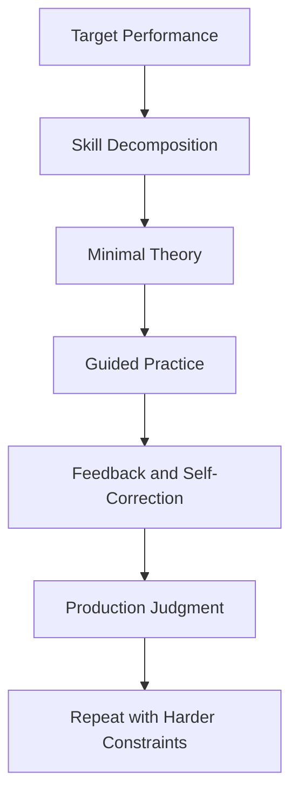
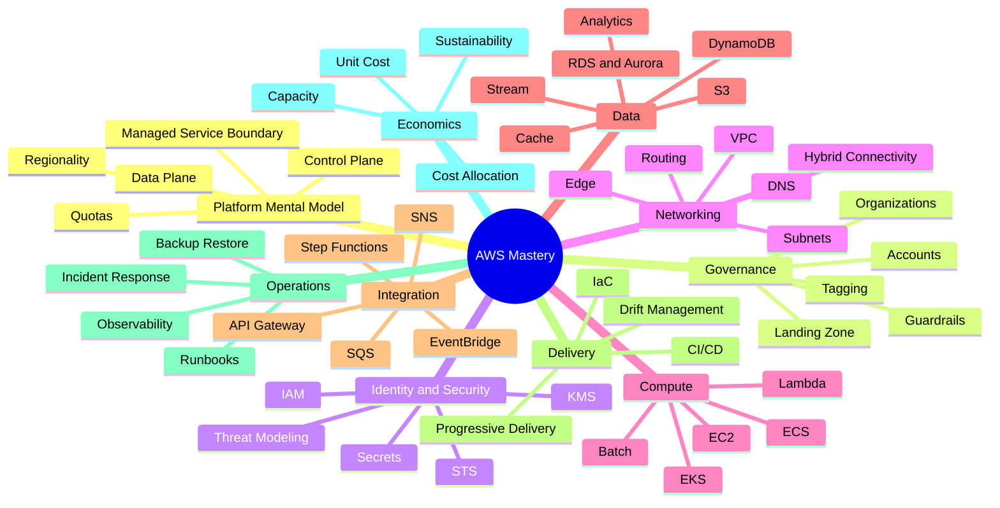
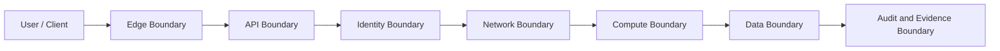
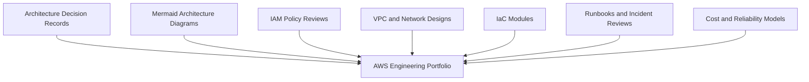

------
title: Learn AWS Engineering Mastery - Part 001
description: Skill map, target performance, learning constraints, deliberate practice loop, and engineering standards for mastering AWS as a senior software engineer.
series: learn-aws
seriesTitle: Learn AWS Engineering Mastery
order: 1
partTitle: Kaufman Skill Map and Target Performance
tags:
- aws
- cloud
- architecture
- platform-engineering
- kaufman
- skill-map
date: 2026-06-30
---

# Learn AWS Engineering Mastery - Part 001

## Kaufman Skill Map and Target Performance

Part ini adalah fondasi cara belajar seluruh seri. Kita belum membahas EC2, Lambda, VPC, IAM, EKS, RDS, DynamoDB, atau layanan AWS lain secara mendalam. Kita mulai dari pertanyaan yang lebih penting:

> Skill AWS seperti apa yang sebenarnya harus dimiliki software engineer top-tier?

Jawaban pendeknya: bukan sekadar tahu nama layanan, bukan sekadar bisa klik console, dan bukan sekadar lulus sertifikasi. Skill yang kita incar adalah kemampuan untuk **mendesain, membangun, mengamankan, mengoperasikan, mengobservasi, mengendalikan biaya, dan mempertanggungjawabkan workload AWS production-grade**.

Dalam pendekatan Josh Kaufman di *The First 20 Hours*, skill kompleks harus dipecah menjadi sub-skill yang lebih kecil, dipelajari cukup untuk bisa mengoreksi diri, friction latihan harus dikurangi, lalu latihan dilakukan secara sengaja. Untuk AWS, ini berarti kita tidak mulai dari daftar layanan, tetapi dari peta kemampuan.

Referensi utama seri ini:

- AWS Well-Architected Framework: <https://docs.aws.amazon.com/wellarchitected/latest/framework/welcome.html>
- Six pillars of AWS Well-Architected: <https://docs.aws.amazon.com/wellarchitected/latest/framework/the-pillars-of-the-framework.html>
- AWS Shared Responsibility Model: <https://aws.amazon.com/compliance/shared-responsibility-model/>
- AWS Global Infrastructure: <https://docs.aws.amazon.com/global-infrastructure/latest/regions/aws-regions-availability-zones.html>
- AWS Control Planes and Data Planes: <https://docs.aws.amazon.com/whitepapers/latest/aws-fault-isolation-boundaries/control-planes-and-data-planes.html>

---

## 1. Target Akhir Seri Ini

Target kita bukan “bisa memakai AWS”. Target kita adalah **cloud engineering judgment**.

Cloud engineering judgment berarti mampu menjawab pertanyaan seperti:

- Boundary apa yang harus dipakai: account, VPC, subnet, IAM role, queue, cluster, region, atau tenant cell?
- Failure apa yang paling mungkin terjadi, dan bagaimana sistem tetap aman saat failure itu terjadi?
- Mana yang lebih tepat: EC2, ECS, EKS, Lambda, Batch, atau managed service lain?
- Data ini harus berada di RDS, DynamoDB, S3, OpenSearch, Redis, Kinesis, MSK, atau kombinasi?
- Apa konsekuensi IAM policy, network route, encryption key, backup policy, dan deployment strategy terhadap compliance?
- Bagaimana kita tahu sistem sehat sebelum user atau auditor menemukan masalah?
- Bagaimana menghitung biaya per tenant, per workflow, per API call, atau per business transaction?
- Bagaimana melakukan rollback, failover, incident response, dan forensic review secara defensible?

Top 1% engineer di AWS bukan yang hafal semua service. Mereka yang mampu **mengurangi ketidakpastian arsitektural**.

---

## 2. Adaptasi Framework Kaufman untuk AWS

Kaufman memberikan cara belajar skill secara cepat melalui beberapa prinsip: tentukan performa target, pecah skill, pelajari secukupnya untuk self-correct, hilangkan friction latihan, dan lakukan deliberate practice.

Untuk AWS, penerapannya seperti ini:

| Prinsip Kaufman | Adaptasi untuk AWS |
|---|---|
| Define target performance | Tentukan kemampuan arsitektur dan operasi yang harus bisa dilakukan secara nyata. |
| Deconstruct the skill | Pecah AWS menjadi identity, network, compute, data, integration, operations, security, cost, dan governance. |
| Learn enough to self-correct | Pelajari mental model dan failure mode agar bisa tahu desain sendiri salah sebelum production gagal. |
| Remove practice barriers | Siapkan akun/lab, budget guardrail, IaC template, naming, tagging, dan sandbox workflow. |
| Practice deliberately | Latihan desain, deploy, observe, break, recover, review, dan improve workload secara berulang. |

AWS terlalu luas untuk dipelajari secara linear dari A sampai Z. Maka kita gunakan pola:



---

## 3. Apa yang Tidak Kita Kejar

Agar pembelajaran efisien, kita perlu membuang target yang salah.

Kita tidak mengejar:

- hafalan semua nama layanan AWS;
- tutorial klik console tanpa reasoning;
- arsitektur diagram yang terlihat bagus tapi tidak bisa dioperasikan;
- penggunaan managed service tanpa memahami responsibility boundary;
- desain “serverless/container/microservice everywhere” tanpa alasan;
- security checklist yang tidak terhubung ke threat model;
- reliability claim tanpa RTO, RPO, dependency map, dan failover test;
- cost optimization yang hanya mematikan resource, bukan memahami unit economics.

Kita juga tidak akan mengulang materi Java, networking, persistence, API contract, serialization, concurrency, cryptography, atau database internals yang sudah dipelajari di seri lain. Di seri AWS, topik itu hanya muncul saat menyentuh boundary cloud: network placement, managed database behavior, IAM, queue semantics, deployment topology, observability, security posture, dan operational ownership.

---

## 4. AWS Skill Decomposition

AWS sebagai skill bukan satu kemampuan. Ia adalah gabungan beberapa sub-skill yang saling mengunci.



Setiap sub-skill harus dipahami dalam lima dimensi:

1. **Design** — kapan dipakai, kapan tidak dipakai, dan boundary apa yang dibuat.
2. **Security** — siapa boleh melakukan apa, data apa yang dilindungi, dan kontrol apa yang dibutuhkan.
3. **Reliability** — apa yang gagal, seberapa besar blast radius, dan bagaimana recovery dilakukan.
4. **Operations** — bagaimana deploy, observe, debug, patch, rotate, audit, dan rollback.
5. **Cost** — apa cost driver-nya dan bagaimana biaya dikaitkan ke workload/business value.

---

## 5. Target Performance Level

Kita gunakan level performa berikut sebagai alat ukur.

| Level | Nama | Deskripsi |
|---:|---|---|
| L0 | Service Consumer | Bisa mengikuti tutorial dan membuat resource sederhana. |
| L1 | Working Builder | Bisa membangun workload kecil yang berjalan, tetapi belum kuat dalam failure/security/cost. |
| L2 | Production Contributor | Bisa menerapkan pattern production dengan review dari engineer senior. |
| L3 | Production Owner | Bisa bertanggung jawab atas workload end-to-end: deploy, monitor, secure, recover, dan optimize. |
| L4 | Platform Architect | Bisa membuat reusable platform, guardrail, standard, dan golden path untuk banyak tim. |
| L5 | Enterprise Cloud Strategist | Bisa menghubungkan arsitektur AWS ke risk, compliance, cost model, organization design, migration, dan operating model. |

Seri ini menargetkan minimal **L3 kuat**, lalu membuka jalan ke **L4-L5**.

Untuk software engineer yang ingin berada di level top-tier, L3 belum cukup. Anda harus bisa menjelaskan:

- kenapa desain ini aman;
- kenapa desain ini bisa recover;
- kenapa cost-nya masuk akal;
- kenapa boundary-nya tepat;
- kenapa operasionalnya bisa dijalankan manusia;
- kenapa auditor bisa mempercayai evidence-nya;
- kenapa failure tertentu sengaja diterima, bukan terlupakan.

---

## 6. Skill yang Paling Mahal Jika Salah

Tidak semua sub-skill punya bobot sama. Dalam AWS, kesalahan paling mahal biasanya bukan syntax. Kesalahan paling mahal adalah boundary dan assumption.

| Area | Kesalahan Umum | Dampak |
|---|---|---|
| Account strategy | Semua workload ditaruh dalam satu account besar. | Blast radius besar, audit sulit, permission kacau. |
| IAM | Policy terlalu luas karena ingin cepat. | Privilege escalation, data exposure, compliance failure. |
| VPC/network | CIDR, routing, endpoint, dan egress tidak dirancang. | Konflik network, downtime, biaya NAT tinggi, data path tidak jelas. |
| Data | Memilih database sebelum memahami access pattern. | Latency buruk, scale gagal, migration mahal. |
| Eventing | Retry dan idempotency diabaikan. | Duplicate processing, data corruption, stuck workflow. |
| Observability | Alarm dibuat setelah incident. | MTTR tinggi, root cause lemah. |
| Deployment | Tidak ada rollback dan progressive delivery. | Release kecil bisa menjadi outage besar. |
| Cost | Tidak ada tag dan unit cost. | Pemborosan tidak terlihat sampai terlambat. |
| Compliance | Evidence tidak otomatis. | Audit menjadi manual, defensibility rendah. |

Maka seri ini akan sering bertanya: **apa failure mode-nya?**

---

## 7. Mental Model “AWS sebagai Boundary Machine”

Cara paling berguna melihat AWS adalah sebagai mesin pembuat boundary.

Boundary membatasi:

- siapa boleh mengakses apa;
- resource mana bisa berbicara dengan resource mana;
- failure mana yang berhenti di mana;
- data mana berada di region mana;
- cost mana milik workload mana;
- log/audit mana membuktikan aksi mana;
- deployment mana berdampak ke user mana;
- tenant mana terisolasi dari tenant lain.



Jika Anda hanya menghafal layanan, Anda akan bertanya: “pakai service apa?”

Jika Anda berpikir sebagai cloud architect, Anda akan bertanya:

> Boundary apa yang saya butuhkan, dan service mana yang paling tepat untuk membuat boundary itu?

---

## 8. Six Pillars sebagai Rubrik Self-Correction

AWS Well-Architected Framework memiliki enam pilar: operational excellence, security, reliability, performance efficiency, cost optimization, dan sustainability. Dalam seri ini, enam pilar tersebut bukan teori terpisah. Kita gunakan sebagai rubrik review untuk setiap keputusan.

| Pilar | Pertanyaan Self-Correction |
|---|---|
| Operational Excellence | Bagaimana workload dioperasikan, diamati, diubah, dan dipulihkan? |
| Security | Bagaimana identity, data, network, secrets, encryption, dan detection dikendalikan? |
| Reliability | Apa yang gagal, bagaimana failover, bagaimana recovery, dan apa RTO/RPO-nya? |
| Performance Efficiency | Apakah resource dan service sesuai pola traffic, latency, dan throughput? |
| Cost Optimization | Apa cost driver, cost owner, dan unit economics workload ini? |
| Sustainability | Apakah resource idle, over-provisioned, atau bisa dioptimalkan tanpa menurunkan reliability? |

Self-correction berarti setiap desain harus bisa direview dari enam sisi itu sebelum production.

---

## 9. Practice Loop 20 Jam untuk AWS

Kaufman menekankan 20 jam latihan awal untuk melewati frustration barrier. Untuk AWS advance, 20 jam bukan berarti menjadi master. Artinya: 20 jam pertama dipakai untuk membangun fondasi mental model dan feedback loop.

Berikut rancangan 20 jam pertama:

| Sesi | Durasi | Fokus | Output |
|---:|---:|---|---|
| 1 | 2 jam | Platform mental model | Diagram control plane/data plane untuk 1 workload sederhana. |
| 2 | 2 jam | Account and IAM | Role, policy, permission boundary, dan least privilege sketch. |
| 3 | 2 jam | VPC basics | Diagram VPC, subnet, route table, endpoint, ingress/egress. |
| 4 | 2 jam | Compute choice | Decision matrix EC2 vs ECS vs EKS vs Lambda. |
| 5 | 2 jam | Data choice | Decision matrix RDS vs DynamoDB vs S3 vs cache/stream. |
| 6 | 2 jam | Event workflow | SQS/SNS/EventBridge/Step Functions failure-mode model. |
| 7 | 2 jam | IaC | Resource lifecycle, drift, promotion, and rollback strategy. |
| 8 | 2 jam | Observability | Metrics, logs, traces, alarm, dashboard, and SLO draft. |
| 9 | 2 jam | Reliability | RTO/RPO, backup/restore, failover path, dependency map. |
| 10 | 2 jam | Architecture review | Review satu workload dengan six pillars. |

Setiap sesi menghasilkan artifact kecil. Bukan sekadar membaca.

---

## 10. Minimum Lab Environment

Agar latihan tidak menjadi friction, siapkan baseline ini sebelum part teknis dimulai:

- akun AWS sandbox atau training account terpisah dari production;
- budget alarm rendah;
- MFA aktif untuk root user dan admin identity;
- tidak menggunakan root user untuk aktivitas harian;
- IAM Identity Center atau role-based access untuk latihan serius;
- naming convention sederhana;
- tagging minimum: `Application`, `Environment`, `Owner`, `CostCenter`, `DataClassification`;
- repository IaC;
- folder `notes/architecture-decisions` untuk ADR;
- folder `diagrams/` untuk Mermaid atau diagram lain;
- template runbook;
- template incident review;
- checklist delete/cleanup resource.

Contoh naming:

```txt
<org>-<app>-<env>-<component>-<region-short>
acme-case-prod-api-ap1
acme-case-dev-events-ap1
acme-case-shared-network-ap1
```

Tagging bukan kosmetik. Tagging adalah basis cost allocation, ownership, automation, policy, dan audit.

---

## 11. Architecture Decision Record Template

Setiap keputusan besar harus bisa dijelaskan singkat. Gunakan format ADR berikut:

```md
# ADR-0001: Use SQS Between Intake API and Case Processor

## Status
Accepted

## Context
The intake API receives bursts of case submissions. Processing requires validation,
enrichment, deduplication, and persistence. Direct synchronous processing increases
latency and creates tight coupling.

## Decision
Use SQS as an asynchronous buffer between API and processor.

## Consequences
Positive:
- absorbs bursts
- allows retry
- reduces coupling

Negative:
- introduces eventual consistency
- requires idempotency
- requires DLQ monitoring

## Failure Modes
- duplicate message
- poison message
- queue backlog
- consumer throttling
- lost observability across async boundary

## Review Signals
- queue age
- DLQ count
- consumer error rate
- processing latency
```

ADR memaksa kita menghubungkan keputusan teknis ke konsekuensi operasional.

---

## 12. Decision Quality Checklist

Sebelum memilih service AWS, jawab ini:

1. Apa workload boundary-nya?
2. Apa data classification-nya?
3. Siapa principal yang mengakses resource?
4. Apakah resource global, regional, zonal, atau edge?
5. Apa control plane action yang dibutuhkan?
6. Apa data plane path-nya?
7. Apa failure paling mungkin?
8. Apa failure paling mahal?
9. Apa RTO dan RPO?
10. Apa scaling dimension: request, connection, partition, storage, message, tenant, atau region?
11. Apa quota yang relevan?
12. Apa observability signal minimum?
13. Apa rollback plan?
14. Apa cost driver?
15. Apa evidence audit yang harus tersedia?

Jika Anda tidak bisa menjawab 15 pertanyaan ini, keputusan belum matang.

---

## 13. Latihan: Review Desain Naif

Desain awal:

> Aplikasi case management berjalan di satu EC2 instance public subnet. Database PostgreSQL berjalan di instance yang sama. File upload disimpan di local disk. Admin login memakai username/password lokal. Backup manual setiap Jumat. Log hanya berada di file lokal.

Review cepat:

| Dimensi | Masalah |
|---|---|
| Availability | Single instance menjadi single point of failure. |
| Security | Public subnet, local auth, dan local database memperbesar exposure. |
| Durability | File upload di local disk rawan hilang. |
| Operations | Backup manual dan log lokal menyulitkan recovery. |
| Compliance | Audit trail lemah dan evidence tidak reliable. |
| Scalability | Compute, storage, dan database tidak bisa scale independen. |
| Cost | Murah di awal, mahal saat incident atau migration. |

Desain ini mungkin cukup untuk demo, tetapi tidak cukup untuk production.

Tugas Anda: ubah desain ini menjadi arsitektur AWS minimal yang defensible. Jangan langsung memakai semua layanan. Mulai dari boundary: account, network, identity, compute, data, storage, observability, backup.

---

## 14. Anti-Pattern Belajar AWS

### 14.1 Service-First Learning

Belajar dari daftar service membuat Anda tahu banyak nama, tetapi sulit mengambil keputusan.

Lebih baik:

> Problem → constraint → boundary → failure mode → service choice.

### 14.2 Console-Only Learning

Console bagus untuk eksplorasi, buruk sebagai sumber kebenaran production. Production harus bisa direproduksi melalui IaC, pipeline, dan review.

### 14.3 Certification-Only Thinking

Sertifikasi bisa membantu struktur belajar, tetapi production judgment terbentuk dari desain, incident, trade-off, dan review.

### 14.4 Ignoring Cost Until Later

Di cloud, biaya adalah sinyal arsitektur. Cost spike sering menunjukkan desain, scaling, observability, atau lifecycle yang tidak terkendali.

### 14.5 Security as Final Checklist

Security harus menjadi bagian dari desain sejak awal: identity, data classification, network path, encryption, logging, detection, dan response.

---

## 15. Output yang Harus Dikumpulkan Selama Seri

Sepanjang seri, Anda akan membangun kumpulan artifact:



Portfolio ini lebih penting daripada catatan pasif. Engineer top-tier bisa menunjukkan reasoning, bukan hanya opini.

---

## 16. Rubrik “Top 1% AWS Software Engineer”

Gunakan rubrik berikut untuk menilai diri.

| Capability | Beginner | Strong Engineer | Top-Tier Engineer |
|---|---|---|---|
| Service selection | Memilih service populer. | Memilih berdasarkan requirement. | Menjelaskan trade-off, failure, cost, dan exit strategy. |
| IAM | Membuat role/policy sederhana. | Menerapkan least privilege. | Mendesain identity boundary lintas account, workload, dan automation. |
| Network | Membuat VPC default-like. | Mendesain subnet/routing. | Mendesain segmentation, private access, inspection, DNS, dan hybrid boundary. |
| Data | Memilih database familiar. | Memilih berdasarkan access pattern. | Mendesain lifecycle, consistency, replication, recovery, dan governance. |
| Deployment | Deploy manual atau CI sederhana. | Pipeline otomatis. | Progressive delivery, rollback, policy gates, artifact integrity. |
| Observability | Melihat logs saat error. | Metrics/logs/alarms tersedia. | SLO, traceability, incident signals, runbook-linked alerts. |
| Reliability | Backup ada. | HA dan restore diuji. | RTO/RPO eksplisit, chaos/failover drill, dependency risk tracked. |
| Cost | Melihat tagihan total. | Budget dan tagging. | Unit economics, tenant/workload attribution, capacity strategy. |
| Compliance | Menyimpan dokumen audit. | Evidence sebagian otomatis. | Evidence-by-design melalui logs, config, policy, and workflow trail. |

---

## 17. Ringkasan Part 001

AWS mastery bukan perjalanan menghafal layanan. Ini adalah kemampuan membuat sistem yang aman, reliable, observable, cost-aware, dan defensible di atas platform cloud.

Framework Kaufman membantu kita memotong kompleksitas:

1. Tentukan performa target.
2. Pecah skill AWS menjadi sub-skill.
3. Pelajari secukupnya untuk self-correct.
4. Hilangkan friction latihan.
5. Latih sub-skill dengan feedback nyata.

Mental model utama part ini:

> AWS adalah platform untuk membuat dan mengoperasikan boundary. Engineer yang kuat tahu boundary apa yang dibutuhkan sebelum memilih service.

Di Part 002, kita akan membangun mental model AWS sebagai platform: API plane, control plane, data plane, resource lifecycle, regionality, quotas, managed service abstraction, dan blast radius.
