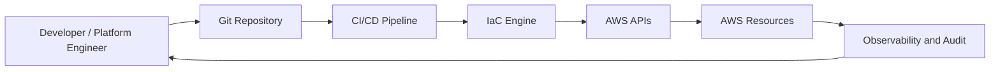
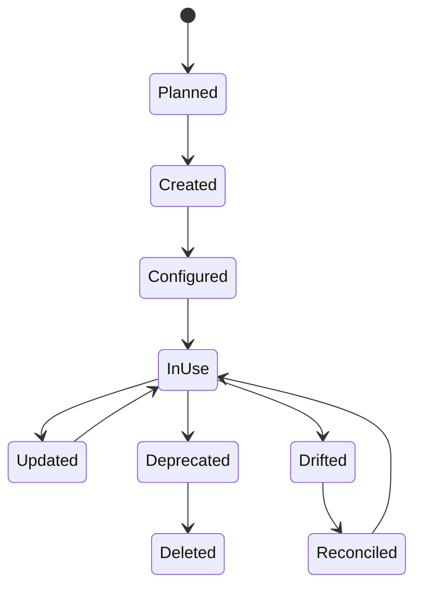
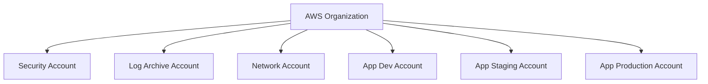
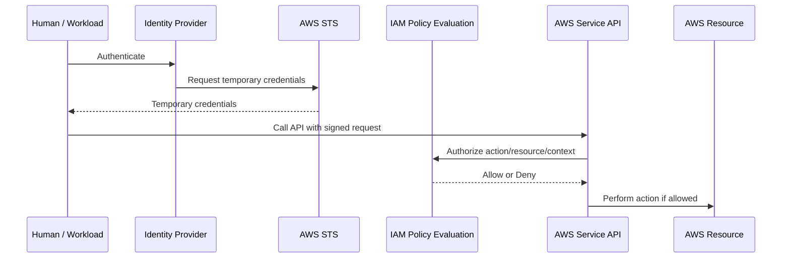
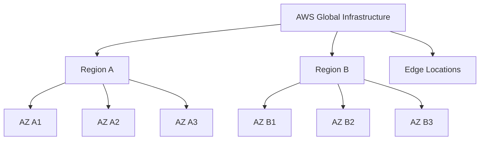
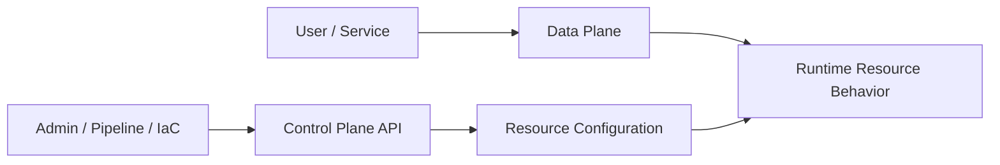
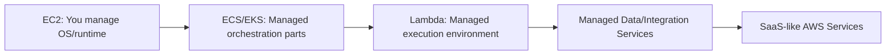
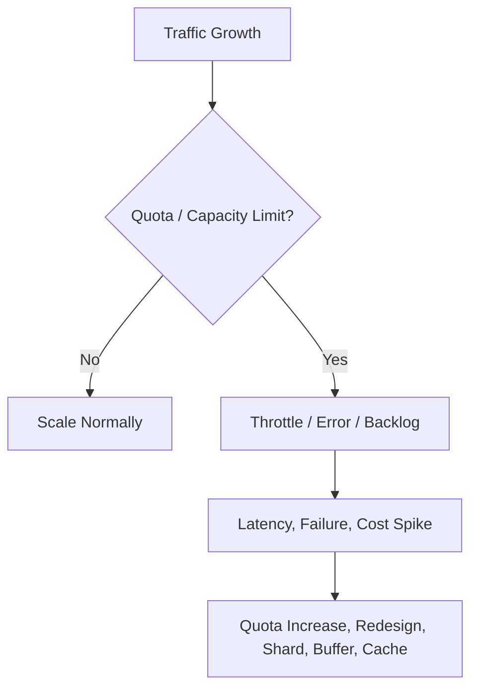
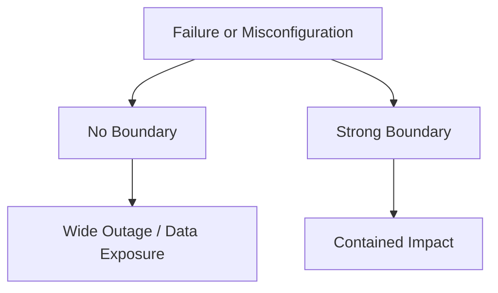
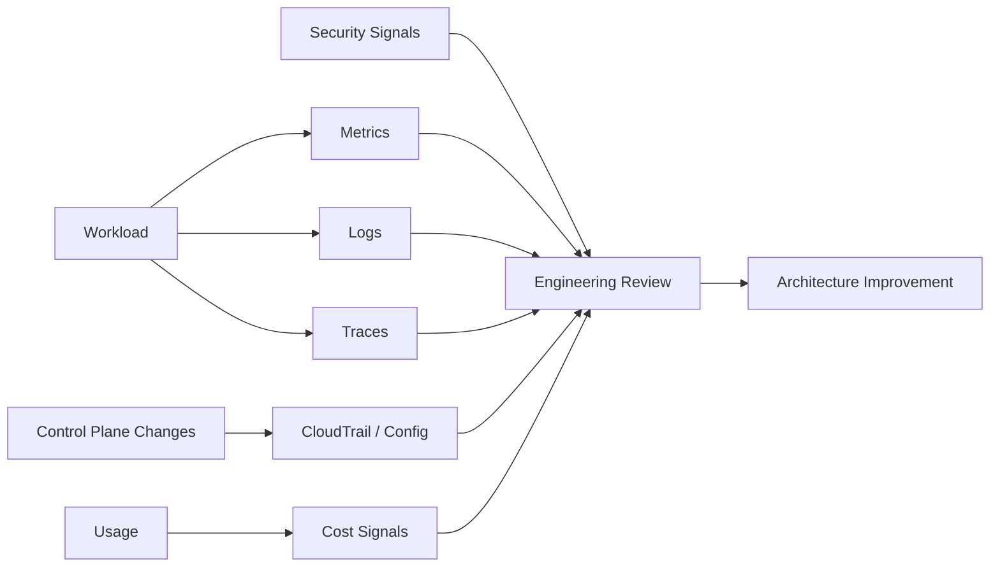

------
title: Learn AWS Engineering Mastery - Part 002
description: Deep mental model of AWS as an API-driven platform: resources, accounts, regions, control planes, data planes, quotas, managed services, and blast-radius boundaries.
series: learn-aws
seriesTitle: Learn AWS Engineering Mastery
order: 2
partTitle: AWS Platform Mental Model
tags:
- aws
- cloud
- architecture
- platform-engineering
- control-plane
- data-plane
date: 2026-06-30
---

# Learn AWS Engineering Mastery - Part 002

## AWS Platform Mental Model

Part ini membangun mental model paling penting untuk belajar AWS secara serius:

> AWS bukan sekadar kumpulan layanan. AWS adalah platform API global-regional untuk membuat, mengubah, menghubungkan, mengamankan, mengobservasi, dan menghapus resource cloud.

Ketika mental model ini kuat, Anda tidak mudah bingung oleh banyaknya service. Anda akan melihat pola yang sama berulang:

- ada **account** sebagai administrative/security boundary;
- ada **principal** yang melakukan aksi;
- ada **API** yang mengubah resource;
- ada **region/AZ/edge** sebagai lokasi dan failure boundary;
- ada **control plane** untuk administrasi resource;
- ada **data plane** untuk traffic/runtime workload;
- ada **policy** untuk authorization;
- ada **quota** yang membatasi skala;
- ada **log/audit trail** untuk evidence;
- ada **cost meter** yang menghitung konsumsi.

Referensi utama:

- AWS Global Infrastructure: <https://docs.aws.amazon.com/global-infrastructure/latest/regions/aws-regions-availability-zones.html>
- AWS Control Planes and Data Planes: <https://docs.aws.amazon.com/whitepapers/latest/aws-fault-isolation-boundaries/control-planes-and-data-planes.html>
- AWS Shared Responsibility Model: <https://aws.amazon.com/compliance/shared-responsibility-model/>
- AWS Well-Architected Framework: <https://docs.aws.amazon.com/wellarchitected/latest/framework/welcome.html>
- AWS Service Quotas: <https://docs.aws.amazon.com/servicequotas/latest/userguide/intro.html>

---

## 1. AWS sebagai Programmable Infrastructure

Di data center tradisional, infrastruktur sering diperlakukan sebagai perangkat fisik: server, rack, firewall, switch, storage appliance. Di AWS, sebagian besar infrastruktur diekspos sebagai API.

Artinya, resource bisa:

- dibuat melalui API;
- dikonfigurasi melalui API;
- diberi permission melalui API;
- diamati melalui API;
- dihapus melalui API;
- direplikasi melalui konfigurasi;
- ditag untuk ownership dan cost;
- dimasukkan ke pipeline;
- diperiksa oleh policy engine;
- dibandingkan dengan desired state.

Ini mengubah cara software engineer berpikir. Infrastruktur bukan lagi “tempat aplikasi berjalan”. Infrastruktur menjadi bagian dari software system.



Implikasi:

- perubahan infrastruktur harus direview seperti perubahan kode;
- konfigurasi harus bisa dipromosikan antar environment;
- drift adalah bug;
- permission adalah bagian dari desain;
- cost adalah runtime signal;
- audit trail adalah artifact sistem.

---

## 2. Resource, API, dan State

Hampir semua yang Anda buat di AWS adalah resource:

- VPC;
- subnet;
- route table;
- security group;
- IAM role;
- S3 bucket;
- Lambda function;
- ECS service;
- EKS cluster;
- RDS instance;
- DynamoDB table;
- CloudWatch alarm;
- KMS key;
- EventBridge rule;
- SQS queue.

Setiap resource memiliki lifecycle:



Engineer yang baik tidak hanya tahu cara membuat resource. Ia tahu:

- siapa owner resource;
- environment resource;
- data classification resource;
- dependency resource;
- backup/restore strategy;
- deletion protection;
- tagging;
- monitoring;
- cost attribution;
- lifecycle policy;
- audit trail.

Resource tanpa owner adalah operational debt.

---

## 3. Account sebagai Boundary Pertama

AWS account bukan hanya billing container. Dalam arsitektur serius, account adalah salah satu boundary paling penting.

Account dapat memisahkan:

- environment: dev, test, staging, prod;
- workload: platform, shared services, application;
- risk: regulated vs non-regulated;
- team ownership;
- blast radius;
- billing allocation;
- permission boundary;
- audit evidence;
- deployment pipeline boundary.



Kesalahan umum: semua resource ditaruh di satu account karena “masih kecil”. Masalahnya, boundary yang salah di awal akan menjadi migration besar saat workload tumbuh.

Pertanyaan desain:

- Apakah workload ini perlu isolation dari workload lain?
- Apakah environment production harus benar-benar terpisah?
- Apakah tim berbeda butuh permission berbeda?
- Apakah log audit harus berada di account yang tidak bisa dimodifikasi tim aplikasi?
- Apakah network shared atau per-workload?
- Apakah biaya perlu dipisah secara jelas?

Account strategy akan dibahas detail di Part 005.

---

## 4. Principal, Permission, dan Authorization

Setiap aksi di AWS dilakukan oleh principal. Principal bisa berupa:

- IAM user;
- IAM role;
- federated identity;
- AWS service principal;
- workload identity;
- assumed role melalui STS.

Model mentalnya:



AWS security sering gagal bukan karena encryption tidak ada, tetapi karena authorization terlalu longgar.

Pertanyaan yang harus selalu muncul:

- Principal apa yang melakukan aksi?
- Action apa yang dibutuhkan?
- Resource mana yang boleh disentuh?
- Condition apa yang membatasi aksi?
- Apakah permission ini temporary atau long-lived?
- Apakah ada permission boundary?
- Apakah ada service control policy di tingkat organization?
- Apakah akses ini terekam di CloudTrail?

IAM akan dibahas detail di Part 006.

---

## 5. Region, Availability Zone, Edge, dan Failure Domain

AWS Global Infrastructure tersusun dari Region dan Availability Zone. Region adalah lokasi geografis terpisah. Availability Zone adalah lokasi terisolasi di dalam Region yang saling terhubung dengan jaringan low-latency dan high-bandwidth.

Mental model:



Region dan AZ bukan sekadar lokasi. Mereka adalah **failure domain** dan **data residency boundary**.

Contoh keputusan:

| Requirement | Implikasi AWS |
|---|---|
| Low latency untuk user Asia Tenggara | Pilih region dekat user atau gunakan edge/CDN untuk static/API acceleration. |
| High availability dalam satu region | Gunakan multi-AZ architecture. |
| Disaster recovery terhadap region outage | Desain multi-region atau backup cross-region. |
| Data residency | Pastikan data disimpan dan diproses di region yang sesuai regulasi. |
| Global user base | Kombinasikan edge, regional services, dan traffic routing. |

Kesalahan umum: menganggap multi-AZ sama dengan multi-region. Multi-AZ melindungi dari kegagalan lokasi dalam satu region. Multi-region melindungi dari kegagalan regional atau kebutuhan geographic separation, tetapi jauh lebih kompleks.

---

## 6. Control Plane vs Data Plane

Ini salah satu mental model paling penting di AWS.

**Control plane** adalah jalur administrasi resource: create, read/describe, update, delete, list. Contoh: membuat EC2 instance, membuat S3 bucket, mengubah IAM policy, membuat queue.

**Data plane** adalah jalur runtime workload: membaca object S3, mengirim message ke SQS, melakukan query database, melayani request aplikasi.



Mengapa ini penting?

Karena failure control plane dan failure data plane punya dampak berbeda.

Contoh:

- Jika control plane terganggu, Anda mungkin tidak bisa membuat resource baru atau mengubah konfigurasi.
- Jika data plane tetap sehat, aplikasi yang sudah berjalan mungkin tetap melayani traffic.
- Jika data plane terganggu, user-facing workload bisa langsung terdampak.
- Jika deployment bergantung pada control plane saat incident, recovery bisa terhambat.

Prinsip desain:

- Jangan membuat recovery bergantung pada resource creation mendadak jika bisa dihindari.
- Pre-provision kapasitas kritikal untuk skenario tertentu.
- Bedakan alarm untuk deployment/control-plane failure dan runtime/data-plane failure.
- Pastikan runbook tahu apakah masalah ada di control plane atau data plane.

---

## 7. Managed Service Abstraction Gradient

AWS menyediakan level abstraksi berbeda. Semakin tinggi abstraksi, semakin banyak tanggung jawab operasional dipindahkan ke AWS, tetapi semakin banyak juga constraint layanan yang harus diterima.



| Level | Contoh | Anda Mengontrol | AWS Mengelola | Trade-off |
|---|---|---|---|---|
| IaaS | EC2, EBS | OS, runtime, patching, capacity | Physical infra, virtualization | Fleksibel, tetapi operational burden tinggi. |
| Container Platform | ECS, EKS | Container image, service config, scaling policy | Sebagian orchestration/control plane | Balance antara portability dan managed ops. |
| Serverless Compute | Lambda | Function code, config, IAM, event source | Runtime provisioning, execution fleet | Cepat dan elastic, tetapi ada limit/concurrency/cold start. |
| Managed Data | RDS, DynamoDB, S3 | Schema/model/config/access | Banyak operasi storage/availability | Constraint model dan cost pattern harus dipahami. |
| Managed Integration | SQS, SNS, EventBridge | Message/event contract, policy, retry | Broker infrastructure | Semantics harus benar: ordering, duplicate, retry. |

Semakin managed sebuah service, semakin penting memahami responsibility boundary. AWS mengelola lebih banyak lapisan, tetapi customer tetap bertanggung jawab atas konfigurasi, data, identity, network exposure, access policy, workload behavior, dan compliance requirement yang relevan.

---

## 8. Shared Responsibility sebagai Model Desain

Shared responsibility bukan slogan security. Ini adalah model desain.

Secara umum:

- AWS bertanggung jawab atas security **of** the cloud: fasilitas, hardware, jaringan fisik, virtualization layer, dan managed infrastructure.
- Customer bertanggung jawab atas security **in** the cloud: identity, data, konfigurasi, workload, network access, encryption choices, logging, dan governance sesuai layanan yang dipakai.

Namun detailnya berubah berdasarkan jenis layanan.

| Service Type | Customer Responsibility Lebih Besar | Customer Responsibility Lebih Kecil |
|---|---|---|
| EC2 | OS patching, host firewall, runtime hardening, app security. | Physical host dan virtualization layer. |
| RDS | Schema, query, access, parameter, backup setting, data classification. | Database engine infrastructure tertentu. |
| S3 | Bucket policy, object access, encryption config, lifecycle, data governance. | Storage fleet durability infrastructure. |
| Lambda | Code, IAM, event config, secrets, dependency security. | Server provisioning dan runtime execution fleet. |

Pertanyaan desain:

- Apa yang masih tanggung jawab tim aplikasi?
- Apa yang sudah dikelola AWS?
- Apa yang perlu dikontrol oleh platform team?
- Apa yang harus dibuktikan ke auditor?
- Apa yang harus diuji sendiri, bukan diasumsikan?

---

## 9. Quotas, Throttling, dan Scale Reality

AWS bukan infinite cloud. Setiap layanan punya quota, rate limit, concurrency limit, capacity behavior, dan regional availability.

Quota dapat berupa:

- jumlah resource per account/region;
- request rate;
- concurrent execution;
- throughput;
- storage size;
- connection count;
- API control-plane rate;
- per-partition capacity;
- per-target limit;
- per-load-balancer rule/listener/target group limit.



Kesalahan umum: baru mencari quota saat production sudah throttle.

Engineering practice:

- identifikasi quota saat desain;
- load test sebelum launch;
- buat alarm untuk utilization limit;
- minta quota increase sebelum dibutuhkan;
- desain fallback/backpressure;
- hindari arsitektur yang bergantung pada scale mendadak tanpa warm-up atau pre-provisioning;
- catat quota dalam ADR.

---

## 10. Eventual Consistency dan Idempotency

Banyak operasi cloud bersifat distributed. Setelah resource dibuat atau policy diubah, efeknya mungkin tidak langsung terlihat di seluruh sistem. Selain itu, event-driven system sering menghasilkan retry dan duplicate delivery.

Maka dua konsep ini wajib:

### 10.1 Eventual Consistency

Jangan selalu mengasumsikan perubahan konfigurasi langsung konsisten di semua tempat. Pipeline dan automation harus punya retry, wait condition, dan verification step.

### 10.2 Idempotency

Operasi idempotent dapat dipanggil lebih dari sekali tanpa menghasilkan efek ganda yang salah.

Contoh buruk:

```txt
Process payment message -> insert charge -> send receipt
```

Jika message diproses dua kali, customer bisa tertagih dua kali.

Contoh lebih aman:

```txt
Process payment message with idempotency key
Check if transaction already processed
If not processed: insert charge and mark key as processed
If processed: return success without duplicate charge
```

AWS architecture yang kuat menganggap retry dan duplicate sebagai normal, bukan edge case aneh.

---

## 11. Blast Radius Boundary

Blast radius adalah seberapa besar dampak jika sesuatu gagal atau salah konfigurasi.

Boundary yang bisa mengurangi blast radius:

| Boundary | Contoh Penggunaan |
|---|---|
| Account | Pisahkan prod dari non-prod, security logs dari workload team. |
| Region | Pisahkan disaster domain atau data residency. |
| Availability Zone | Tahan kegagalan satu lokasi dalam region. |
| VPC | Pisahkan network routing dan connectivity domain. |
| Subnet | Pisahkan public/private/data tier. |
| Security Group | Batasi network access antar workload. |
| IAM Role | Batasi permission satu aplikasi/job/function. |
| KMS Key | Pisahkan encryption control dan blast radius decrypt. |
| Queue/Event Bus | Pisahkan producer dan consumer failure. |
| Tenant Cell | Batasi dampak noisy tenant atau deployment rusak. |
| Deployment Ring | Batasi dampak release baru. |



Engineer yang matang tidak hanya bertanya “apakah ini bisa jalan?”, tetapi “kalau salah, seberapa besar dampaknya?”

---

## 12. Service Selection Mental Model

Jangan mulai dari service. Mulai dari workload property.

Pertanyaan awal:

1. Apakah workload synchronous atau asynchronous?
2. Apakah stateful atau stateless?
3. Apakah latency-sensitive?
4. Apakah throughput predictable atau bursty?
5. Apakah data relational, document, key-value, object, stream, graph, atau search-oriented?
6. Apakah ordering penting?
7. Apakah duplicate event bisa terjadi?
8. Apakah human approval ada dalam workflow?
9. Apakah tenant isolation ketat?
10. Apakah workload regulated?

Contoh mapping awal:

| Workload Property | Kandidat AWS Service |
|---|---|
| Stateless web API | ALB + ECS/EKS/EC2, API Gateway + Lambda. |
| Burst async job | SQS + Lambda/ECS worker. |
| Scheduled batch | EventBridge Scheduler + Batch/ECS/Lambda. |
| Relational transaction | RDS/Aurora. |
| Massive key-value access | DynamoDB. |
| Object/file storage | S3. |
| Workflow orchestration | Step Functions. |
| Pub/sub fanout | SNS or EventBridge depending event semantics. |
| Stream processing | Kinesis or MSK. |
| Search | OpenSearch. |
| Cache/session/low-latency lookup | ElastiCache/MemoryDB. |

Tabel ini bukan aturan final. Ia hanya starting point. Keputusan final harus mempertimbangkan failure, cost, team skill, compliance, migration, dan operations.

---

## 13. AWS Architecture as Feedback System

Sistem AWS yang baik memberi feedback:

- CloudTrail memberi tahu siapa melakukan apa;
- CloudWatch memberi metrics/logs/alarms;
- X-Ray/OpenTelemetry memberi trace;
- Config memberi configuration history/compliance state;
- Cost Explorer/CUR memberi cost signal;
- Security Hub/GuardDuty memberi security finding;
- pipeline memberi deployment signal;
- SLO memberi user-impact signal.



Tanpa feedback, tidak ada self-correction. Tanpa self-correction, tidak ada engineering mastery.

---

## 14. Common Platform-Level Failure Modes

Berikut failure mode lintas layanan yang harus Anda hafal sebagai pola:

| Failure Mode | Contoh | Pencegahan / Mitigasi |
|---|---|---|
| IAM deny unexpected | Role tidak punya action baru setelah deployment. | Policy test, least privilege review, staged rollout. |
| IAM allow too broad | Wildcard permission memberi akses data sensitif. | Permission boundary, SCP, access analyzer, review. |
| Control plane throttling | Pipeline membuat terlalu banyak perubahan sekaligus. | Backoff, batching, staged deployment, quota awareness. |
| Data plane saturation | API/database/queue tidak kuat traffic. | Autoscaling, buffering, caching, load test. |
| Regional dependency | Semua workload bergantung pada satu region tanpa DR. | Backup cross-region, multi-region plan, RTO/RPO. |
| AZ imbalance | Semua traffic/resource terkonsentrasi di satu AZ. | Multi-AZ placement, load balancer, capacity review. |
| DNS misconfiguration | Traffic mengarah ke target salah. | Change review, low-risk rollout, health checks. |
| Secret leakage | Secret tersimpan di env/log/repo. | Secrets Manager, rotation, scanning, logging discipline. |
| Missing tags | Cost dan ownership tidak bisa ditelusuri. | Tag policy, IaC enforcement, config rule. |
| No deletion protection | Database penting terhapus. | Deletion protection, backup, restricted IAM. |
| No audit trail | Tidak bisa membuktikan perubahan. | CloudTrail, Config, centralized logs. |

---

## 15. Practical Exercise: Model Satu Workload

Gunakan workload sederhana:

> Case intake API menerima laporan, menyimpan metadata, menyimpan dokumen pendukung, memicu proses validasi async, lalu menampilkan status ke user.

Buat model berikut:

### 15.1 Resource Sketch

```txt
Client
  -> API ingress
  -> AuthN/AuthZ
  -> Compute/API handler
  -> Metadata store
  -> Object storage
  -> Queue/event bus
  -> Worker/validator
  -> Audit log
  -> Monitoring
```

### 15.2 Control Plane Actions

Tuliskan aksi administratif:

- create API endpoint;
- create compute service/function;
- create database/table/bucket;
- create IAM role;
- attach policy;
- create queue;
- configure alarm;
- deploy new version;
- rotate secret;
- update scaling config.

### 15.3 Data Plane Actions

Tuliskan aksi runtime:

- user submit request;
- API validates token;
- API writes metadata;
- API stores document;
- API sends validation message;
- worker consumes message;
- worker updates status;
- user reads status.

### 15.4 Failure Boundary

Tentukan:

- apa yang terjadi jika worker down?
- apa yang terjadi jika object storage gagal diakses?
- apa yang terjadi jika database throttling?
- apa yang terjadi jika IAM policy salah?
- apa yang terjadi jika queue backlog naik?
- apa yang terjadi jika region unavailable?

Latihan ini akan dipakai berulang di part berikutnya.

---

## 16. Baeldung-Style Rule of Thumb

Gunakan rule of thumb berikut saat membaca part selanjutnya:

- Jika resource memiliki permission, pikirkan IAM.
- Jika resource menerima traffic, pikirkan network path.
- Jika resource menyimpan data, pikirkan classification, encryption, backup, lifecycle, dan access pattern.
- Jika resource memproses event, pikirkan retry, ordering, duplicate, idempotency, and DLQ.
- Jika resource melayani user, pikirkan latency, availability, scaling, and SLO.
- Jika resource dibuat manual, pikirkan IaC.
- Jika resource tidak punya tag, pikirkan ownership failure.
- Jika resource tidak punya log/metric/alarm, pikirkan blind spot.
- Jika resource tidak punya deletion/recovery strategy, pikirkan irreversible failure.

---

## 17. Ringkasan Part 002

Mental model AWS yang kuat terdiri dari beberapa ide inti:

1. AWS adalah programmable infrastructure.
2. Resource memiliki lifecycle dan harus dikelola seperti bagian dari software system.
3. Account adalah security, governance, blast-radius, dan billing boundary.
4. Principal dan permission menentukan siapa boleh melakukan apa.
5. Region, AZ, dan edge adalah location sekaligus failure domain.
6. Control plane berbeda dari data plane.
7. Managed service mengurangi sebagian operational burden tetapi tidak menghapus customer responsibility.
8. Quota dan throttling adalah bagian normal dari desain cloud.
9. Eventual consistency, retry, dan duplicate harus dianggap normal.
10. Blast radius harus sengaja dirancang, bukan muncul kebetulan.

Mental model utama part ini:

> AWS architecture adalah seni menghubungkan resource melalui API, identity, network, data path, dan policy dengan blast radius yang terkendali.

Di Part 003, kita akan masuk ke AWS Well-Architected dan Shared Responsibility secara lebih tajam: bagaimana enam pilar dipakai sebagai alat review desain, bukan sekadar dokumen teoritis.
