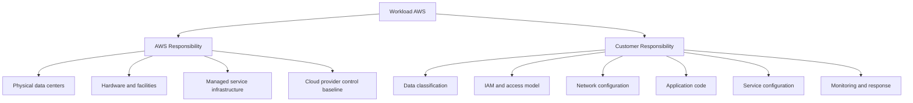
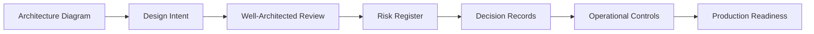
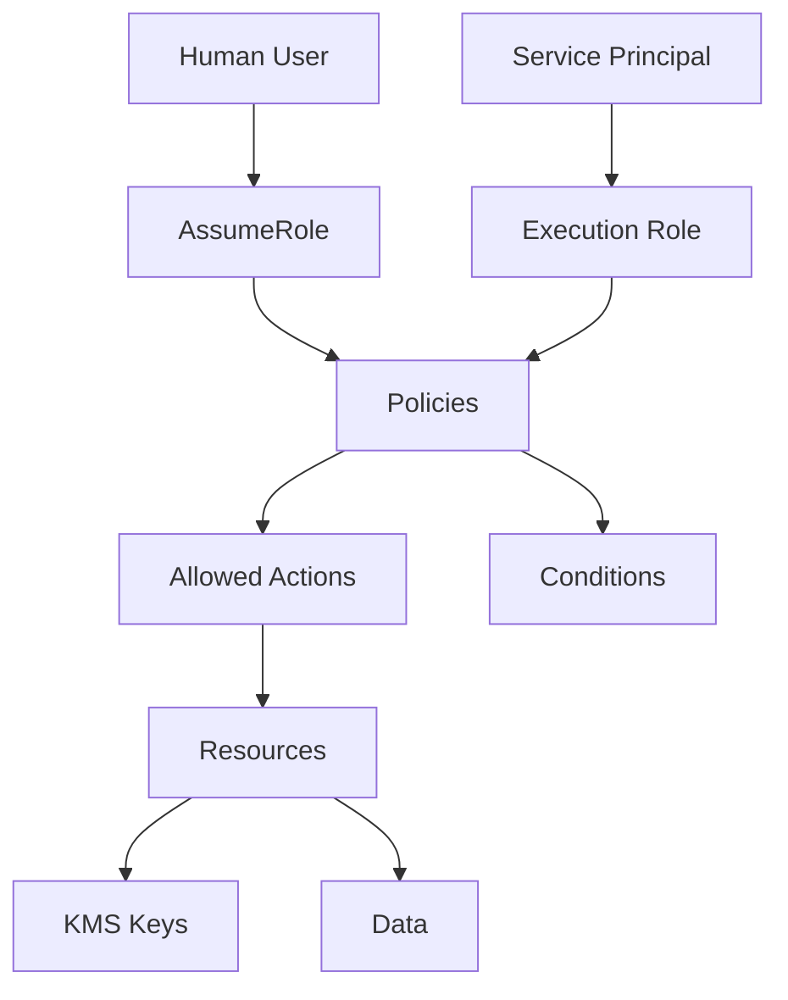
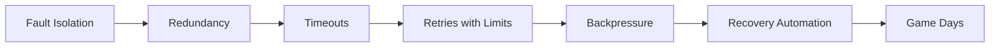
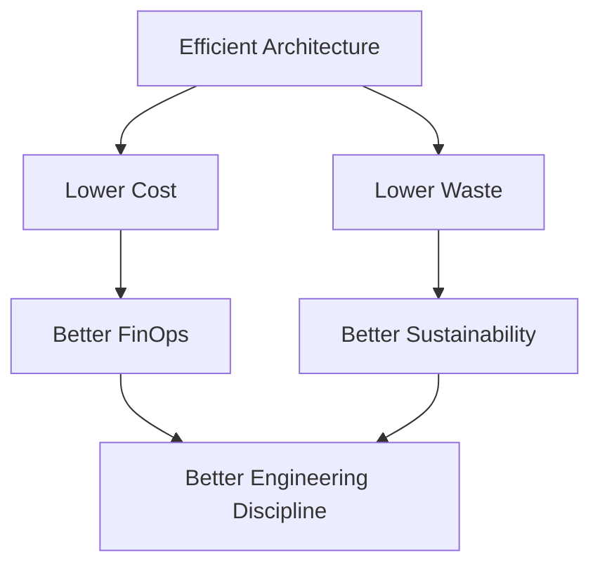
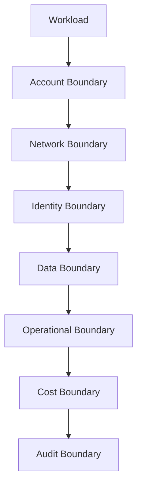
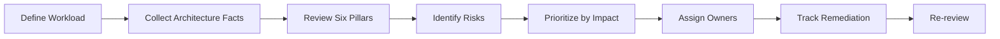

------
title: Learn AWS Engineering Mastery - Part 003
description: Deep mental model of AWS Well-Architected and Shared Responsibility as production engineering governance, not checklist compliance.
series: learn-aws
seriesTitle: Learn AWS Engineering Mastery
order: 3
partTitle: Well-Architected and Shared Responsibility
tags:
- aws
- cloud
- architecture
- well-architected
- shared-responsibility
- governance
- security
- reliability
date: 2026-06-30
---

# Learn AWS Engineering Mastery - Part 003

## Well-Architected and Shared Responsibility

Part ini membahas dua konsep yang sering terlihat sederhana tetapi sebenarnya menentukan kualitas seluruh desain AWS production-grade:

1. **AWS Well-Architected Framework**
2. **AWS Shared Responsibility Model**

Keduanya bukan hafalan sertifikasi. Keduanya adalah cara berpikir untuk menjawab pertanyaan paling penting dalam cloud engineering:

> Ketika sistem berjalan di AWS, risiko apa yang masih menjadi tanggung jawab kita, risiko apa yang sudah dikurangi oleh AWS, dan bagaimana kita membuktikan bahwa desain kita masuk akal?

Referensi utama:

- AWS Well-Architected Framework: <https://docs.aws.amazon.com/wellarchitected/latest/framework/welcome.html>
- The pillars of the AWS Well-Architected Framework: <https://docs.aws.amazon.com/wellarchitected/latest/framework/the-pillars-of-the-framework.html>
- AWS Shared Responsibility Model: <https://aws.amazon.com/compliance/shared-responsibility-model/>
- Shared responsibility in AWS Security Pillar: <https://docs.aws.amazon.com/wellarchitected/latest/security-pillar/shared-responsibility.html>
- Operational Excellence Pillar: <https://docs.aws.amazon.com/wellarchitected/latest/operational-excellence-pillar/welcome.html>

---

## 1. Target Skill Part Ini

Setelah menyelesaikan part ini, targetnya bukan sekadar bisa menyebut enam pilar Well-Architected. Targetnya adalah bisa memakai framework tersebut untuk:

- menilai desain AWS sebelum production;
- menemukan risiko tersembunyi dalam architecture review;
- membedakan tanggung jawab AWS dan customer;
- menjelaskan konsekuensi pilihan layanan terhadap security, reliability, operation, cost, performance, dan sustainability;
- membuat keputusan arsitektural yang defensible;
- membangun checklist review yang tidak berubah menjadi ritual kosong;
- menyusun evidence yang bisa dipakai untuk audit, incident review, dan postmortem.

Top-tier engineer tidak bertanya, “Apakah kita sudah pakai managed service?” Mereka bertanya:

> Managed service ini memindahkan tanggung jawab apa ke AWS, dan tanggung jawab apa yang tetap melekat pada tim kita?

---

## 2. Mental Model Utama

### 2.1 Well-Architected adalah taxonomy risiko

Banyak engineer memperlakukan Well-Architected sebagai checklist. Itu kurang tepat.

Mental model yang lebih kuat:

> Well-Architected adalah taxonomy untuk mengelompokkan risiko engineering agar desain bisa dievaluasi secara konsisten.

Enam pilar AWS Well-Architected adalah:

| Pilar | Pertanyaan Inti |
|---|---|
| Operational Excellence | Apakah kita bisa menjalankan, mengubah, mengamati, dan memperbaiki sistem secara aman? |
| Security | Apakah akses, data, identitas, dan boundary sistem terlindungi? |
| Reliability | Apakah sistem tetap memenuhi fungsi saat terjadi gangguan? |
| Performance Efficiency | Apakah workload memakai resource yang tepat sesuai kebutuhan latency, throughput, dan scaling? |
| Cost Optimization | Apakah biaya proporsional terhadap value dan dapat dikendalikan? |
| Sustainability | Apakah penggunaan resource efisien dan mengurangi waste komputasi/energi? |

Jika satu pilar diabaikan, sistem mungkin tetap berjalan, tetapi desainnya rapuh.

Contoh:

- Sistem aman tetapi tidak observable: incident menjadi gelap.
- Sistem scalable tetapi cost tidak dikontrol: sukses bisnis berubah menjadi ledakan biaya.
- Sistem murah tetapi tidak reliable: outage menjadi biaya tersembunyi.
- Sistem highly available tetapi deployment tidak aman: perubahan kecil bisa menjatuhkan seluruh platform.

### 2.2 Shared Responsibility adalah contract of ownership

Shared Responsibility Model bukan hanya konsep security. Ia adalah model ownership.

AWS bertanggung jawab atas **security of the cloud**: infrastruktur fisik, hardware, fasilitas data center, dan lapisan bawah platform. Customer bertanggung jawab atas **security in the cloud**: konfigurasi layanan, identitas, data, aplikasi, network rule, patching tertentu, dan kontrol akses sesuai layanan yang dipilih.

Cara berpikirnya:



AWS dapat mengurangi operational burden, tetapi tidak menghapus engineering accountability.

---

## 3. Adaptasi Kaufman untuk Part Ini

Kaufman menyarankan skill kompleks dipecah menjadi sub-skill kecil. Untuk Well-Architected dan Shared Responsibility, sub-skill-nya adalah:

| Sub-skill | Latihan |
|---|---|
| Risk classification | Ambil satu arsitektur, klasifikasikan risiko ke enam pilar. |
| Responsibility boundary mapping | Untuk setiap layanan, tentukan apa yang dikelola AWS dan apa yang tetap dikelola customer. |
| Review questioning | Ubah checklist menjadi pertanyaan desain yang tajam. |
| Trade-off reasoning | Jelaskan konflik antar-pilar dan keputusan yang dipilih. |
| Evidence design | Tentukan log, metric, policy, backup, dan config evidence yang membuktikan kontrol berjalan. |
| Failure anticipation | Buat daftar failure mode untuk tiap boundary. |

Tujuan latihan bukan menghasilkan dokumen indah. Tujuannya membuat engineer bisa mengoreksi desainnya sendiri sebelum sistem dipakai user.

---

## 4. Well-Architected sebagai Operating System Arsitektur

Well-Architected membantu kita menghindari desain yang hanya bagus di diagram.

Sebuah diagram arsitektur biasanya memperlihatkan komponen:

- API Gateway
- Lambda
- VPC
- RDS
- S3
- SQS
- EventBridge
- CloudWatch

Tetapi diagram sering tidak menjawab:

- Siapa yang boleh memanggil API?
- Apa yang terjadi jika dependency lambat?
- Bagaimana retry dikendalikan?
- Bagaimana data terenkripsi?
- Apakah backup pernah diuji restore?
- Apa alarm yang benar-benar actionable?
- Berapa biaya per request?
- Apa deployment rollback path?
- Apa evidence untuk auditor?

Well-Architected memaksa kita mengisi ruang kosong antara diagram dan production reality.



---

## 5. Pilar 1: Operational Excellence

Operational Excellence adalah kemampuan untuk menjalankan dan meningkatkan sistem secara aman.

Banyak sistem gagal bukan karena desain awal buruk, tetapi karena perubahan, incident, dan operasi harian tidak terkendali.

### 5.1 Pertanyaan inti

- Bagaimana workload dideploy?
- Bagaimana perubahan divalidasi sebelum production?
- Bagaimana rollback dilakukan?
- Bagaimana tim tahu sistem sedang degradasi?
- Bagaimana incident ditangani?
- Bagaimana runbook diuji?
- Bagaimana pelajaran dari incident masuk ke backlog?

### 5.2 Kesalahan umum

| Anti-pattern | Dampak |
|---|---|
| Manual console changes | Drift, sulit audit, sulit rollback. |
| Alarm terlalu banyak | Alert fatigue, sinyal penting tenggelam. |
| Runbook tidak diuji | Saat incident, prosedur tidak dipercaya. |
| Deployment tanpa canary/rollback | Perubahan kecil bisa menjadi outage besar. |
| Tidak ada owner jelas | Incident menjadi debat, bukan eksekusi. |

### 5.3 Operational excellence bukan sekadar monitoring

Monitoring menjawab “apa yang terjadi”. Operational excellence menjawab “apa yang harus dilakukan ketika itu terjadi”.

Contoh perbedaan:

| Monitoring-only | Operationally excellent |
|---|---|
| Ada alarm CPU tinggi. | Ada alarm CPU tinggi dengan threshold berbasis SLO, runbook, owner, dan rollback path. |
| Log dikirim ke CloudWatch. | Log punya correlation ID, retention, query pattern, dan redaction policy. |
| Deployment via CI/CD. | Deployment punya progressive rollout, automated checks, approval gate, dan rollback test. |

### 5.4 Latihan deliberate practice

Ambil workload sederhana: API + database.

Buat operational readiness checklist:

- Bagaimana deploy dilakukan?
- Bagaimana rollback dilakukan?
- Metric apa yang menunjukkan user impact?
- Alarm mana yang paging dan mana yang ticket?
- Bagaimana dependency failure ditangani?
- Apa runbook untuk database connection exhaustion?
- Siapa owner tiap alarm?

Jika checklist tidak menghasilkan tindakan konkret, checklist itu belum operational.

---

## 6. Pilar 2: Security

Security dalam AWS bukan satu fitur. Security adalah property dari boundary.

Boundary utama:

- account;
- organization unit;
- IAM principal;
- IAM policy;
- VPC;
- subnet;
- security group;
- route table;
- KMS key;
- S3 bucket policy;
- API authorization;
- workload identity;
- tenant boundary;
- data classification.

### 6.1 Pertanyaan inti

- Siapa bisa melakukan apa, terhadap resource apa, dari kondisi apa?
- Apakah akses bersifat least privilege?
- Apakah privilege bisa dieskalasi secara tidak sengaja?
- Apakah data dienkripsi saat transit dan at rest?
- Siapa bisa membaca ciphertext dan siapa bisa menggunakan key?
- Apakah secret disimpan dan dirotasi dengan benar?
- Apakah aktivitas penting terekam di CloudTrail?
- Apakah kontrol bersifat preventive, detective, atau responsive?

### 6.2 Security adalah graph problem

IAM bukan hanya daftar policy. IAM adalah graph hubungan antar-principal, action, resource, dan condition.



Security review yang matang akan mencari path seperti:

- developer role dapat pass role ke service;
- service role dapat membaca secret;
- secret memberi credential ke database;
- database memiliki data regulated;
- CloudTrail logging tidak mencakup event tertentu;
- KMS key policy terlalu luas;
- SCP tidak membatasi destructive action.

### 6.3 Preventive, detective, responsive

| Control type | Contoh AWS | Tujuan |
|---|---|---|
| Preventive | IAM least privilege, SCP, security group, bucket public access block | Mencegah aksi berisiko. |
| Detective | CloudTrail, Config, GuardDuty, Security Hub | Menemukan pelanggaran atau anomali. |
| Responsive | Incident runbook, automated remediation, key rotation, quarantine role | Mengurangi dampak setelah event. |

Top-tier engineer tidak hanya membuat preventive control. Mereka juga memastikan detective dan responsive controls tersedia karena preventive control tidak pernah sempurna.

---

## 7. Pilar 3: Reliability

Reliability adalah kemampuan workload melakukan fungsi yang diharapkan saat terjadi gangguan.

Di AWS, reliability bukan berarti “AWS tidak pernah down”. Reliability berarti desain kita mampu menoleransi failure sesuai target bisnis.

### 7.1 Pertanyaan inti

- Apa SLO workload?
- Apa RTO dan RPO?
- Failure domain apa yang bisa ditoleransi: instance, node, AZ, Region, dependency, queue, database, deployment?
- Apakah retry memperbaiki failure atau memperparah overload?
- Apakah data bisa dipulihkan?
- Apakah failover pernah diuji?
- Apakah sistem degraded mode tetap aman?

### 7.2 Reliability membutuhkan failure model

Contoh failure model untuk API order processing:

| Failure | Expected behavior |
|---|---|
| One instance down | Load balancer mengalihkan traffic. |
| One AZ degraded | Service tetap berjalan di AZ lain. |
| Database primary failover | Error sementara, client retry terkendali, recovery terukur. |
| Downstream payment lambat | Timeout, circuit breaker, async retry, user mendapat status pending. |
| Queue backlog naik | Autoscaling consumer, alarm backlog age, backpressure. |
| Bad deployment | Canary gagal, rollback otomatis/manual cepat. |
| Region unavailable | DR plan sesuai RTO/RPO, bukan improvisasi. |

### 7.3 Reliability bukan hanya redundancy

Redundancy tanpa kontrol bisa memperbesar kerusakan.

Contoh:

- Multi-AZ tanpa health check benar tetap bisa mengirim traffic ke node rusak.
- Retry agresif bisa membuat database semakin overloaded.
- Multi-region tanpa conflict resolution bisa merusak data.
- Backup tanpa restore test hanya memberi rasa aman palsu.

Reliability yang baik selalu menggabungkan:



---

## 8. Pilar 4: Performance Efficiency

Performance Efficiency adalah kemampuan menggunakan resource komputasi secara efisien untuk memenuhi kebutuhan sistem.

Ini bukan sekadar “sistem cepat”. Ini tentang memilih arsitektur yang tepat untuk workload.

### 8.1 Pertanyaan inti

- Bottleneck utama workload ada di CPU, memory, disk IO, network, database lock, queue, cold start, atau dependency latency?
- Apakah resource scalable secara horizontal?
- Apakah ada cache yang tepat?
- Apakah p95/p99 latency diketahui?
- Apakah quota AWS diketahui?
- Apakah workload menggunakan managed service yang cocok?
- Apakah data placement memengaruhi latency?

### 8.2 Performance harus diukur sebagai distribusi

Rata-rata latency sering menipu.

| Metric | Makna |
|---|---|
| p50 | Pengalaman user median. |
| p90 | Banyak user mulai merasakan lambat. |
| p95 | Sinyal umum untuk SLO API. |
| p99 | Tail latency, penting untuk sistem high-volume. |
| max | Bisa sangat noisy, tetapi berguna untuk forensic. |

Top-tier engineer akan bertanya:

> Apakah arsitektur ini menjaga tail latency saat traffic naik dan dependency mulai lambat?

### 8.3 Performance trade-off contoh

| Keputusan | Benefit | Risk |
|---|---|---|
| Lambda untuk API sederhana | Operasi ringan, scaling mudah | Cold start, limit runtime, concurrency burst. |
| EKS untuk platform kompleks | Fleksibel, portable, ecosystem luas | Operational burden tinggi. |
| DynamoDB untuk akses key-value | Latency rendah, scale tinggi | Data modeling ketat, query fleksibilitas rendah. |
| RDS untuk relational consistency | SQL kuat, transaction familiar | Connection scaling, failover impact, vertical bottleneck. |
| CloudFront caching | Latency rendah, origin offload | Cache invalidation, stale data. |

---

## 9. Pilar 5: Cost Optimization

Cost Optimization bukan “murah”. Cost Optimization adalah kemampuan menghasilkan business value dengan biaya proporsional, transparan, dan terkendali.

### 9.1 Pertanyaan inti

- Apa unit ekonomi workload?
- Biaya dihitung per request, tenant, user, workflow, transaction, GB, message, atau document?
- Resource apa yang idle?
- Apakah autoscaling benar-benar menurunkan biaya?
- Apakah data transfer cost dipahami?
- Apakah log retention terlalu mahal?
- Apakah overprovisioning dipakai untuk menutupi observability buruk?
- Siapa owner cost anomaly?

### 9.2 Unit economics

Untuk sistem enterprise, cost harus bisa ditelusuri ke aktivitas bisnis.

Contoh:

| Workload | Unit cost yang berguna |
|---|---|
| Case management | Cost per case lifecycle. |
| Enforcement workflow | Cost per investigation step. |
| Document processing | Cost per document processed. |
| SaaS platform | Cost per tenant per month. |
| API platform | Cost per 1,000 API calls. |
| Analytics | Cost per TB scanned / query. |

Tanpa unit economics, cost optimization berubah menjadi pemotongan acak.

### 9.3 Cost failure mode

Cost juga punya failure mode:

- infinite retry menghasilkan request storm;
- debug log terlalu verbose di production;
- NAT Gateway data processing membengkak;
- cross-AZ traffic tidak disadari;
- S3 lifecycle tidak dikonfigurasi;
- OpenSearch cluster oversized;
- RDS instance dipilih berdasarkan feeling;
- EKS node idle karena request/limit tidak realistis;
- Athena query scan seluruh bucket karena partisi buruk.

---

## 10. Pilar 6: Sustainability

Sustainability sering dianggap sekunder. Untuk engineer senior, sustainability adalah extension dari efficiency.

Pertanyaannya:

- Apakah resource idle dikurangi?
- Apakah workload scale down saat tidak dibutuhkan?
- Apakah data lifecycle menghapus atau mengarsipkan data yang tidak aktif?
- Apakah query dan batch job menghindari pemrosesan ulang yang tidak perlu?
- Apakah compute architecture terlalu berat untuk kebutuhan sebenarnya?

Sustainability tidak berdiri sendiri. Ia terkait performance dan cost.



---

## 11. Konflik Antar-Pilar

Real architecture selalu punya trade-off. Well-Architected bukan aturan absolut.

### 11.1 Contoh konflik

| Konflik | Contoh | Cara berpikir |
|---|---|---|
| Security vs usability | MFA ketat untuk semua operasi | Pisahkan human admin, break-glass, dan workload role. |
| Reliability vs cost | Multi-region active-active | Sesuaikan dengan RTO/RPO, bukan ego arsitektur. |
| Performance vs cost | Provisioned high-capacity database | Gunakan load test dan rightsizing, bukan tebakan. |
| Operational simplicity vs flexibility | Lambda vs EKS | Pilih berdasarkan complexity workload, bukan tren. |
| Compliance vs delivery speed | Approval gate terlalu banyak | Automate evidence dan policy checks. |
| Sustainability vs latency | Edge cache di banyak lokasi | Pakai berdasarkan user geography dan cache hit ratio. |

### 11.2 Decision record wajib menjelaskan trade-off

Architecture Decision Record minimal harus menjawab:

```mdx
## Decision
Apa keputusan yang diambil?

## Context
Masalah apa yang sedang diselesaikan?

## Options Considered
Opsi apa saja yang dipertimbangkan?

## Trade-offs
Pilar Well-Architected mana yang terdampak?

## Risks Accepted
Risiko apa yang sengaja diterima?

## Mitigations
Kontrol apa yang mengurangi risiko?

## Review Trigger
Kapan keputusan ini harus dievaluasi ulang?
```

Top-tier engineer tidak menghindari trade-off. Mereka membuat trade-off eksplisit.

---

## 12. Shared Responsibility by Service Abstraction

Tanggung jawab customer berubah sesuai jenis layanan.

Semakin managed sebuah layanan, semakin banyak lapisan teknis dipindahkan ke AWS. Tetapi tanggung jawab konfigurasi, data, identitas, dan penggunaan tetap ada pada customer.

### 12.1 Model umum

| Layer | EC2 | ECS/Fargate | Lambda | RDS/Aurora | DynamoDB/S3 |
|---|---|---|---|---|---|
| Physical facility | AWS | AWS | AWS | AWS | AWS |
| Hardware | AWS | AWS | AWS | AWS | AWS |
| Hypervisor / platform | AWS | AWS | AWS | AWS | AWS |
| Host OS | Customer for EC2 guest OS | AWS for Fargate host | AWS | AWS for DB host | AWS |
| Runtime patching | Customer | Mixed, depends on image | Customer for code/dependencies, AWS for runtime platform | AWS for engine patch controls with customer config choices | AWS |
| Application code | Customer | Customer | Customer | Customer for app/query usage | Customer for data access patterns |
| IAM | Customer | Customer | Customer | Customer | Customer |
| Network config | Customer | Customer | Customer | Customer | Customer |
| Data classification | Customer | Customer | Customer | Customer | Customer |
| Backup/retention config | Customer | Customer | Customer | Customer | Customer |
| Monitoring/response | Customer | Customer | Customer | Customer | Customer |

Catatan: tabel ini adalah mental model. Detail persis selalu harus dicek ke dokumentasi layanan terkait karena setiap layanan punya model tanggung jawab dan opsi konfigurasi berbeda.

### 12.2 EC2: tanggung jawab customer paling luas

Dengan EC2, kita punya kontrol besar dan tanggung jawab besar.

Customer biasanya bertanggung jawab atas:

- guest OS patching;
- package updates;
- host-based firewall config;
- SSH/SSM access model;
- disk encryption selection;
- AMI lifecycle;
- vulnerability management;
- application runtime;
- backup configuration;
- scaling group design;
- log/metric agents.

EC2 cocok saat kita butuh kontrol instance-level, tetapi operational burden tinggi.

### 12.3 Lambda: tanggung jawab bergeser ke code dan event semantics

Dengan Lambda, AWS mengelola banyak aspek compute platform. Tetapi customer tetap bertanggung jawab atas:

- function code;
- dependency vulnerability;
- IAM execution role;
- event source configuration;
- timeout;
- memory sizing;
- concurrency control;
- idempotency;
- retry behavior;
- secret access;
- logging redaction;
- data handling.

Lambda mengurangi server management, bukan menghapus system design.

### 12.4 RDS/Aurora: database platform dikelola, data design tetap customer

AWS mengelola banyak aspek database infrastructure. Namun customer tetap bertanggung jawab atas:

- schema design;
- query performance;
- connection management;
- backup retention configuration;
- parameter group choices;
- encryption settings;
- access control;
- failover testing;
- data classification;
- deletion/retention compliance.

Managed database tidak memperbaiki query buruk atau domain model yang salah.

### 12.5 S3/DynamoDB: managed service tinggi, konfigurasi tetap kritikal

S3 dan DynamoDB menghilangkan banyak operasi server, tetapi risiko tetap ada:

- bucket/table policy terlalu luas;
- public access tidak disengaja;
- KMS key policy salah;
- lifecycle tidak dikonfigurasi;
- data model tidak sesuai access pattern;
- partition hot key;
- retention policy tidak memenuhi regulasi;
- logging tidak cukup;
- cross-account access tidak diaudit.

Managed service memindahkan failure mode, bukan menghapusnya.

---

## 13. Boundary Mapping: Cara Review Tanggung Jawab

Untuk setiap komponen AWS, buat boundary map.

Contoh untuk API service:

| Boundary | Pertanyaan |
|---|---|
| Account | Apakah workload dipisah dari workload lain? |
| VPC | Apakah network path sesuai trust boundary? |
| IAM role | Apakah service hanya punya action yang dibutuhkan? |
| KMS key | Siapa bisa decrypt data? |
| Data store | Apa backup dan retention policy? |
| API auth | Bagaimana user/principal diotorisasi? |
| Logging | Event apa yang terekam? |
| Monitoring | Failure apa yang terlihat? |
| Deployment | Bagaimana rollback? |
| Cost | Apa unit cost? |

Boundary map membuat tanggung jawab terlihat.



---

## 14. Well-Architected Review yang Benar

Review yang buruk:

- dilakukan hanya menjelang audit;
- dipakai sebagai checklist ya/tidak;
- menghasilkan dokumen panjang tanpa action;
- tidak punya owner;
- tidak dihubungkan dengan backlog;
- tidak diulang setelah perubahan besar.

Review yang baik:

- dilakukan sebelum dan sesudah production;
- fokus pada risiko paling material;
- menghasilkan action yang jelas;
- punya severity dan owner;
- dihubungkan ke architecture decision records;
- diulang saat workload berubah;
- menggunakan evidence, bukan opini.

### 14.1 Struktur review



### 14.2 Input review

Sebelum review, kumpulkan:

- architecture diagram;
- workload purpose;
- RTO/RPO;
- SLO/SLA target;
- data classification;
- account and VPC topology;
- IAM model;
- deployment pipeline;
- backup strategy;
- observability dashboard;
- incident history;
- cost report;
- compliance requirements;
- known risks.

Tanpa input ini, review akan menjadi diskusi abstrak.

### 14.3 Output review

Output yang berguna:

| Output | Isi |
|---|---|
| Risk register | Risiko, severity, likelihood, impact, owner. |
| Decision records | Keputusan dan trade-off penting. |
| Remediation backlog | Action konkret dan prioritas. |
| Evidence map | Log, config, metric, policy, report yang membuktikan kontrol. |
| Review trigger | Kondisi kapan review perlu diulang. |

---

## 15. Evidence Engineering

Di environment regulated, “kami sudah aman” tidak cukup. Kita perlu evidence.

Evidence adalah bukti yang menunjukkan kontrol benar-benar ada dan berjalan.

### 15.1 Contoh evidence per pilar

| Pilar | Evidence |
|---|---|
| Operational Excellence | Deployment logs, rollback records, runbook execution, incident postmortem. |
| Security | IAM Access Analyzer result, CloudTrail logs, Config compliance, KMS key policy, vulnerability reports. |
| Reliability | Backup restore test, failover drill, chaos experiment result, SLO report. |
| Performance Efficiency | Load test result, p95/p99 dashboard, capacity plan, quota review. |
| Cost Optimization | Cost allocation tags, Cost Explorer report, budget alert, anomaly detection record. |
| Sustainability | Resource utilization trends, lifecycle policies, idle resource cleanup report. |

### 15.2 Evidence harus otomatis jika memungkinkan

Manual screenshot dari console adalah evidence lemah.

Evidence yang lebih kuat:

- IaC template;
- policy-as-code evaluation;
- CloudTrail event;
- AWS Config rule result;
- CloudWatch metric/alarm history;
- CI/CD deployment record;
- automated test report;
- backup restore job result;
- access review export.

Automation membuat evidence repeatable.

---

## 16. Risk Register untuk AWS Workload

Risk register adalah alat sederhana tetapi sangat kuat.

Contoh format:

| ID | Risk | Pillar | Severity | Owner | Mitigation | Review Date |
|---|---|---|---|---|---|---|
| R-001 | RDS restore belum pernah diuji | Reliability | High | Platform team | Monthly restore drill | 2026-07-30 |
| R-002 | Lambda role terlalu luas | Security | High | App team | Reduce IAM actions and add condition | 2026-07-10 |
| R-003 | NAT data processing cost naik | Cost | Medium | Cloud team | Add VPC endpoints and cost alarm | 2026-07-15 |
| R-004 | Tidak ada runbook queue backlog | Operational Excellence | Medium | SRE | Add runbook and alarm | 2026-07-20 |

Risk register yang baik tidak menyalahkan orang. Ia memperjelas sistem kontrol.

---

## 17. Cara Berpikir Top-Tier saat Melihat Desain AWS

Saat melihat diagram, engineer kuat tidak langsung berkata “pakai Lambda” atau “pakai EKS”. Mereka melakukan review layer demi layer.

### 17.1 Pertanyaan layer-by-layer

#### Business and workload

- Apa fungsi bisnis sistem ini?
- Apa dampak jika sistem gagal?
- Apa target availability?
- Apa data paling sensitif?
- Apa compliance requirement?

#### Account and governance

- Workload ini berada di account apa?
- Apakah environment dipisah?
- Apakah SCP dan guardrail diterapkan?
- Apakah tagging dan cost allocation konsisten?

#### Identity and access

- Principal apa yang bisa mengakses resource?
- Apakah ada human access ke production?
- Apakah service role scoped dengan benar?
- Apakah ada privilege escalation path?

#### Network

- Traffic masuk dari mana?
- Traffic keluar ke mana?
- Apakah resource private benar-benar private?
- Apakah ada dependency internet yang tidak disadari?

#### Data

- Data disimpan di mana?
- Siapa bisa membaca dan menghapus?
- Bagaimana backup, restore, retention, dan deletion?
- Bagaimana data berpindah lintas Region/account?

#### Operations

- Bagaimana deploy?
- Bagaimana rollback?
- Bagaimana alarm?
- Bagaimana incident response?
- Bagaimana perubahan config dilacak?

#### Cost and performance

- Apa scaling unit?
- Apa bottleneck?
- Apa unit cost?
- Quota apa yang bisa membatasi sistem?

### 17.2 Engineering intuition

Intuition bukan feeling. Intuition berasal dari pola failure yang pernah dipahami.

Contoh intuition AWS:

- “Role ini terlalu luas karena bisa `iam:PassRole`.”
- “SQS retry ini bisa menyebabkan duplicate processing.”
- “RDS connection pool ini tidak akan survive traffic burst.”
- “NAT cost bisa membengkak jika semua private subnet keluar ke internet.”
- “Multi-AZ tidak cukup jika dependency global menjadi single point of failure.”
- “Backup tidak berarti apa-apa sebelum restore diuji.”

---

## 18. Review Template: Workload Readiness

Gunakan template ini saat menilai workload AWS.

### 18.1 Workload context

```mdx
## Workload Context

Name:
Owner:
Business capability:
Criticality:
Users:
Data classification:
Compliance scope:
RTO:
RPO:
SLO/SLA:
Primary Region:
Secondary Region:
```

### 18.2 Pillar review

```mdx
## Operational Excellence
- Deployment method:
- Rollback method:
- Runbooks:
- On-call ownership:
- Known operational risks:

## Security
- IAM model:
- Network trust boundary:
- Encryption:
- Secret management:
- Audit logging:
- Known security risks:

## Reliability
- Failure domains:
- HA design:
- Backup/restore:
- DR plan:
- Known reliability risks:

## Performance Efficiency
- Expected traffic:
- Scaling model:
- Bottlenecks:
- Quotas:
- Known performance risks:

## Cost Optimization
- Unit economics:
- Cost allocation:
- Budget/alarm:
- Known cost risks:

## Sustainability
- Idle resource handling:
- Lifecycle policies:
- Resource efficiency:
- Known sustainability risks:
```

---

## 19. Common Anti-Patterns

### 19.1 “AWS manages it, so we do not need to worry”

Managed service mengurangi tanggung jawab infrastruktur, bukan tanggung jawab desain.

Contoh:

- RDS dikelola AWS, tetapi query buruk tetap tanggung jawab customer.
- Lambda dikelola AWS, tetapi idempotency tetap tanggung jawab customer.
- S3 dikelola AWS, tetapi bucket policy tetap tanggung jawab customer.
- DynamoDB dikelola AWS, tetapi hot partition tetap tanggung jawab customer.

### 19.2 “Well-Architected dilakukan setelah go-live”

Terlambat. Review setelah go-live tetap berguna, tetapi risiko mahal sudah tertanam.

Gunakan Well-Architected pada tiga momen:

1. sebelum build besar;
2. sebelum production;
3. setelah incident atau perubahan signifikan.

### 19.3 “Security team yang bertanggung jawab atas security”

Security team menyediakan guardrail, review, dan expertise. Tetapi tim workload tetap bertanggung jawab atas konfigurasi dan perilaku aplikasi.

### 19.4 “Checklist berarti aman”

Checklist tanpa evidence bukan kontrol. Checklist tanpa owner bukan sistem operasi. Checklist tanpa re-review menjadi artefak mati.

### 19.5 “Multi-AZ berarti reliable”

Multi-AZ membantu, tetapi reliability juga membutuhkan health checks, retry control, timeout, backup restore, dependency isolation, and operational readiness.

---

## 20. Decision Matrix: Service Responsibility Impact

Ketika memilih layanan, gunakan matrix ini.

| Option | Operational burden | Control | Failure model complexity | Cost predictability | Best fit |
|---|---:|---:|---:|---:|---|
| EC2 | High | High | Medium | Medium | Legacy workload, custom runtime, strong host control. |
| ECS Fargate | Medium-low | Medium | Medium | Medium | Containerized apps tanpa full Kubernetes overhead. |
| EKS | High | Very high | High | Medium-low | Platform kompleks, Kubernetes ecosystem, multi-team platform. |
| Lambda | Low infra, medium design | Low-medium | Event semantics high | Usage-based | Event-driven compute, bursty jobs, glue logic, serverless APIs. |
| RDS/Aurora | Medium | Medium | Medium | Medium | Relational transactional workloads. |
| DynamoDB | Low infra, high modeling | Low-medium | Partition/access pattern high | High if modeled well | Massive scale key-value/document access patterns. |
| S3 | Very low infra | Medium config | Low-medium | High | Durable object storage, data lake, static assets, archive. |

Tidak ada pilihan universal. Yang ada adalah alignment antara workload requirement dan operational model.

---

## 21. Mini Case Study: Case Management API

Bayangkan sistem case management untuk regulatory enforcement.

Komponen awal:

- API Gateway;
- Lambda service;
- RDS Aurora PostgreSQL;
- S3 document bucket;
- EventBridge;
- SQS worker queue;
- CloudWatch logs;
- KMS;
- IAM roles.

### 21.1 Well-Architected questions

#### Operational Excellence

- Apakah schema migration aman?
- Apakah deployment Lambda bisa rollback?
- Apakah worker queue punya DLQ?
- Apakah runbook ada untuk backlog tinggi?

#### Security

- Apakah case document dienkripsi dengan KMS key sesuai domain?
- Apakah role Lambda bisa membaca semua bucket atau hanya prefix tertentu?
- Apakah CloudTrail aktif untuk data event S3?
- Apakah akses investigator diaudit?

#### Reliability

- Apakah RDS Multi-AZ?
- Apakah restore diuji?
- Apakah EventBridge/SQS processing idempotent?
- Apakah API bisa mengembalikan status pending saat downstream lambat?

#### Performance Efficiency

- Apakah database connection pool cocok untuk Lambda concurrency?
- Apakah query case search perlu OpenSearch atau cukup RDS index?
- Apakah document download perlu CloudFront?

#### Cost Optimization

- Berapa biaya per case lifecycle?
- Apakah log retention sesuai kebutuhan audit?
- Apakah S3 lifecycle memindahkan dokumen lama ke storage class yang lebih murah?

#### Sustainability

- Apakah batch processor scale down?
- Apakah data sementara dibersihkan?
- Apakah dokumen duplikat dihindari?

### 21.2 Responsibility mapping

| Component | AWS manages | Customer remains responsible |
|---|---|---|
| API Gateway | API service infrastructure | Auth config, throttling, request validation, logging, usage plan. |
| Lambda | Compute fleet and execution platform | Code, IAM role, timeout, idempotency, dependency security. |
| Aurora | Database infrastructure layer | Schema, query, credentials, parameter choices, backup retention, restore test. |
| S3 | Object storage infrastructure | Bucket policy, encryption config, lifecycle, retention, access logging. |
| EventBridge/SQS | Messaging infrastructure | Event schema, retry handling, DLQ policy, idempotent consumer. |
| KMS | Key management service infrastructure | Key policy, grants, rotation decisions, separation of duties. |

---

## 22. Checklist Self-Correction

Gunakan checklist ini untuk mengevaluasi pemahaman.

### 22.1 Conceptual

- Bisa jelaskan enam pilar Well-Architected tanpa menghafal definisi?
- Bisa beri contoh konflik antar-pilar?
- Bisa jelaskan mengapa shared responsibility berubah per layanan?
- Bisa membedakan preventive, detective, dan responsive control?
- Bisa menjelaskan mengapa managed service tidak menghapus customer responsibility?

### 22.2 Practical

- Bisa membuat risk register workload AWS?
- Bisa membuat boundary map untuk service sederhana?
- Bisa menulis ADR yang menjelaskan trade-off?
- Bisa menentukan evidence untuk kontrol security dan reliability?
- Bisa mengubah checklist menjadi backlog remediation?

### 22.3 Review quality

- Apakah setiap risk punya owner?
- Apakah setiap control punya evidence?
- Apakah setiap decision punya review trigger?
- Apakah setiap alarm punya action?
- Apakah setiap backup punya restore test?

---

## 23. Latihan Deliberate Practice

### Latihan 1: Six Pillar Risk Classification

Ambil arsitektur sederhana:

- user request masuk ke ALB;
- service berjalan di ECS;
- data disimpan di RDS;
- file disimpan di S3;
- async job memakai SQS.

Tulis minimal 3 risiko untuk tiap pilar.

### Latihan 2: Responsibility Boundary

Pilih tiga layanan:

- EC2;
- Lambda;
- DynamoDB.

Untuk masing-masing, tulis:

- AWS responsibility;
- customer responsibility;
- security risk;
- reliability risk;
- operational burden;
- cost risk.

### Latihan 3: Evidence Map

Untuk workload regulated, tentukan evidence untuk:

- access control;
- data encryption;
- audit trail;
- backup restore;
- deployment approval;
- incident response;
- cost anomaly.

### Latihan 4: Architecture Review Simulation

Ambil desain lama atau fiktif. Lakukan review 60 menit:

1. 10 menit: workload context.
2. 20 menit: six pillar review.
3. 15 menit: top risks.
4. 10 menit: mitigation.
5. 5 menit: owner dan next review.

Output harus berupa risk register, bukan catatan diskusi longgar.

---

## 24. Ringkasan Engineering Judgment

Well-Architected bukan ritual. Ia adalah bahasa untuk membicarakan risiko.

Shared Responsibility bukan slogan. Ia adalah kontrak ownership.

Engineer yang kuat memahami bahwa AWS mengelola banyak lapisan infrastruktur, tetapi tidak mengambil alih tanggung jawab desain aplikasi, data, identitas, konfigurasi, biaya, observability, dan recovery.

Prinsip praktis:

- Jangan desain hanya berdasarkan layanan. Desain berdasarkan responsibility boundary.
- Jangan menganggap managed service berarti bebas risiko.
- Jangan memakai Well-Architected hanya setelah sistem selesai.
- Jangan menerima risk tanpa owner dan mitigation.
- Jangan percaya backup sampai restore diuji.
- Jangan percaya security control tanpa evidence.
- Jangan percaya availability claim tanpa failure model.
- Jangan percaya cost estimate tanpa unit economics.

Di part berikutnya, kita masuk ke fondasi fisik dan logis AWS: **global infrastructure, Regions, Availability Zones, dan failure domains**. Ini penting karena semua keputusan reliability, latency, data residency, network topology, disaster recovery, dan cost akan bertumpu pada peta failure domain tersebut.
