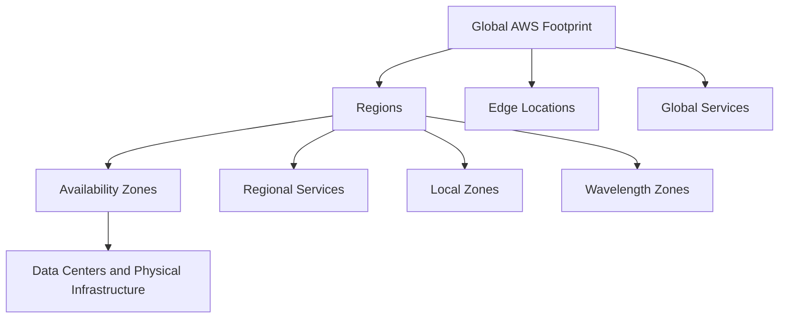
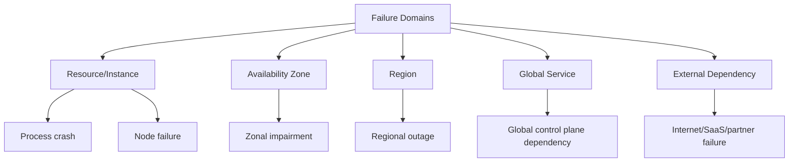
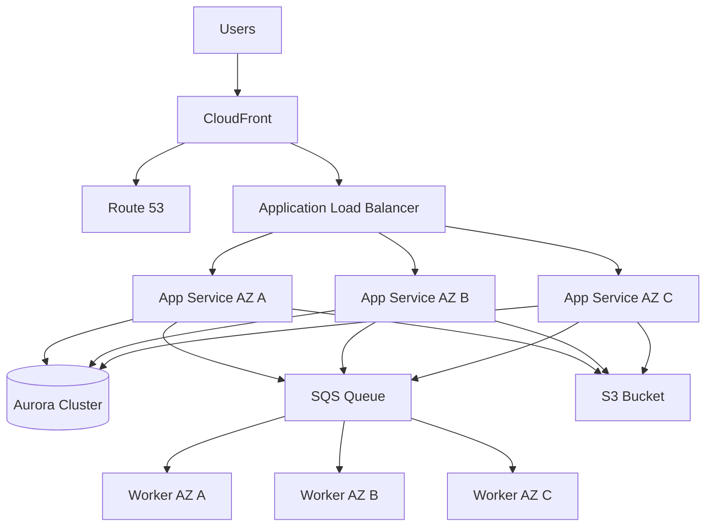
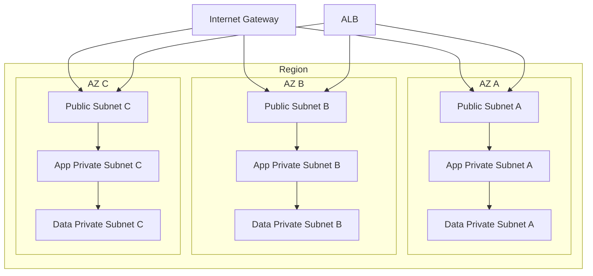
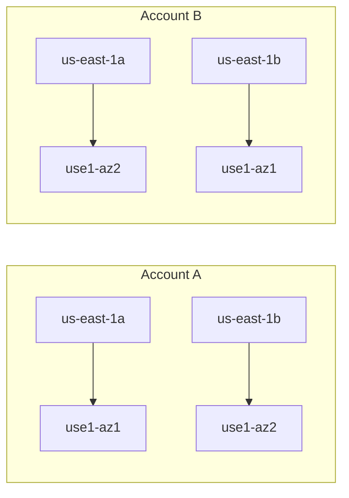
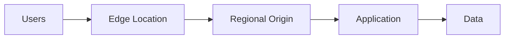
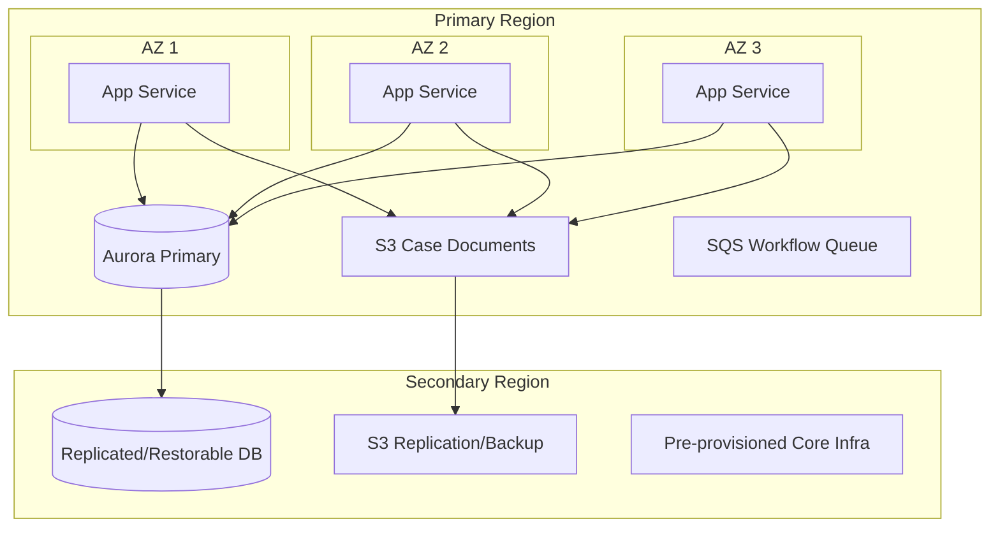
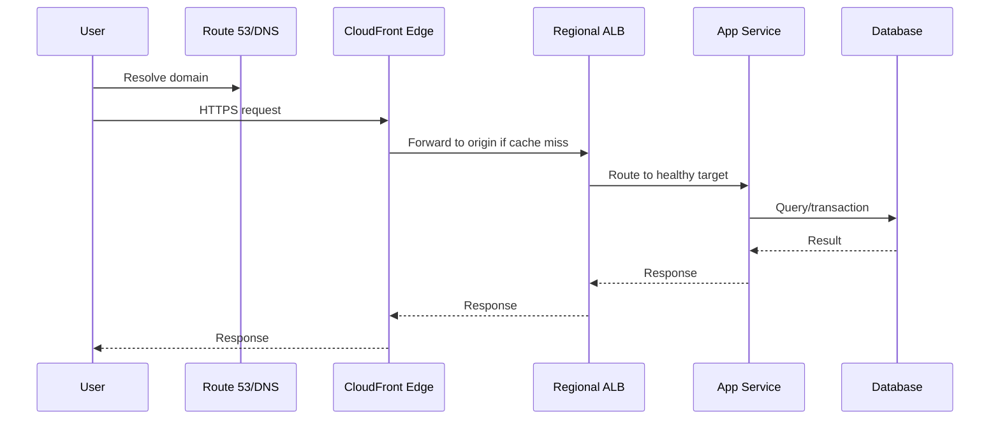
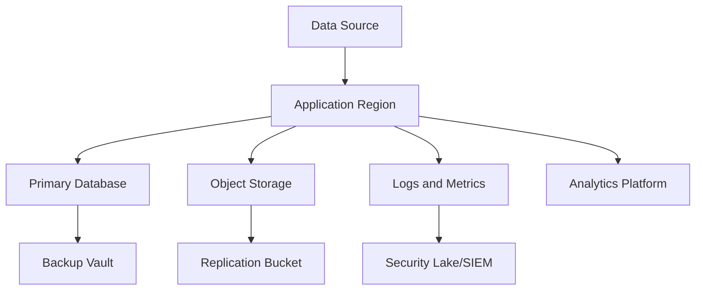

------
title: Learn AWS Engineering Mastery - Part 004
description: Deep guide to AWS global infrastructure, Regions, Availability Zones, Local Zones, Wavelength Zones, edge locations, and failure domain reasoning.
series: learn-aws
seriesTitle: Learn AWS Engineering Mastery
order: 4
partTitle: Global Infrastructure, Regions, AZ, and Failure Domains
tags:
- aws
- cloud
- architecture
- global-infrastructure
- availability-zones
- reliability
- disaster-recovery
- latency
date: 2026-06-30
---

# Learn AWS Engineering Mastery - Part 004

## Global Infrastructure, Regions, AZ, and Failure Domains

Part ini membahas AWS global infrastructure bukan sebagai daftar lokasi, tetapi sebagai **peta failure domain**.

Jika Part 003 memberi kita bahasa untuk menilai risiko, Part 004 memberi kita peta fisik/logis untuk memahami di mana risiko itu terjadi.

Pertanyaan utamanya:

> Ketika kita menaruh workload di AWS, failure domain apa yang sedang kita pilih: instance, rack, data center, Availability Zone, Region, edge, network path, control plane, atau dependency global?

Referensi utama:

- AWS Regions and Availability Zones: <https://docs.aws.amazon.com/global-infrastructure/latest/regions/aws-regions-availability-zones.html>
- AWS Availability Zones: <https://docs.aws.amazon.com/global-infrastructure/latest/regions/aws-availability-zones.html>
- AWS Fault Isolation Boundaries - Availability Zones: <https://docs.aws.amazon.com/whitepapers/latest/aws-fault-isolation-boundaries/availability-zones.html>
- AWS Fault Isolation Boundaries: <https://docs.aws.amazon.com/whitepapers/latest/aws-fault-isolation-boundaries/abstract-and-introduction.html>
- AWS AZ IDs: <https://docs.aws.amazon.com/global-infrastructure/latest/regions/az-ids.html>
- AWS Local Zones: <https://aws.amazon.com/about-aws/global-infrastructure/localzones/>

---

## 1. Target Skill Part Ini

Setelah menyelesaikan part ini, kamu harus bisa:

- menjelaskan perbedaan Region, Availability Zone, Local Zone, Wavelength Zone, edge location, dan Outposts secara arsitektural;
- memilih Region berdasarkan latency, compliance, service availability, cost, ecosystem, dan DR;
- mendesain workload Multi-AZ dengan benar;
- memahami kapan Multi-Region dibutuhkan dan kapan terlalu mahal/kompleks;
- membaca AZ sebagai failure isolation boundary;
- menghindari kesalahan cross-account AZ mapping;
- membedakan zonal, regional, dan global dependency;
- membuat failure model berbasis topology;
- menjelaskan trade-off antara locality, resilience, cost, dan operational complexity.

Top-tier engineer tidak sekadar berkata “pakai 3 AZ”. Mereka bisa menjawab:

> Dependency mana yang zonal, regional, global, dan bagaimana sistem tetap aman ketika salah satu boundary gagal?

---

## 2. Mental Model Utama

AWS global infrastructure dapat dilihat sebagai beberapa lapisan:



Tetapi untuk engineer senior, model yang lebih penting adalah:



AWS infrastructure choices menentukan failure domain. Failure domain menentukan reliability pattern. Reliability pattern menentukan cost dan complexity.

---

## 3. Adaptasi Kaufman untuk Part Ini

Sub-skill yang perlu dilatih:

| Sub-skill | Latihan |
|---|---|
| Region selection | Pilih Region untuk workload dengan constraint latency, data residency, service availability, dan cost. |
| AZ topology design | Desain subnet/app/data tier di minimal 3 AZ. |
| Failure domain mapping | Tandai komponen zonal, regional, global, external. |
| Cross-account AZ consistency | Pakai AZ ID untuk menyelaraskan placement antar-account. |
| DR reasoning | Pilih backup/restore, pilot light, warm standby, active-active. |
| Latency reasoning | Jelaskan efek jarak user, Region, edge, dan data placement. |
| Cost reasoning | Identifikasi cross-AZ, cross-Region, NAT, replication, dan data transfer cost risk. |

Kaufman-style self-correction untuk topik ini sederhana:

> Jika kamu tidak bisa menggambar failure domain, kamu belum memahami arsitektur.

---

## 4. AWS Region

### 4.1 Definisi praktis

AWS Region adalah area geografis terpisah tempat AWS menyediakan layanan. Region biasanya berisi beberapa Availability Zone.

Tetapi secara engineering, Region adalah gabungan dari beberapa keputusan:

- lokasi deployment;
- data residency boundary;
- latency boundary;
- disaster recovery boundary;
- service availability boundary;
- pricing boundary;
- quota boundary;
- compliance boundary;
- operational dependency boundary.

Jangan memilih Region hanya karena “dekat” atau “default”.

### 4.2 Pertanyaan saat memilih Region

| Dimension | Pertanyaan |
|---|---|
| Latency | Di mana user utama berada? Berapa target p95/p99 latency? |
| Data residency | Apakah data harus tetap di negara atau area tertentu? |
| Compliance | Apakah Region tersebut masuk scope compliance internal/regulator? |
| Service availability | Apakah layanan AWS yang dibutuhkan tersedia di Region tersebut? |
| Cost | Apakah pricing layanan/data transfer berbeda signifikan? |
| Talent/operation | Apakah tim dan support process familiar dengan Region ini? |
| DR | Region kedua mana yang cocok untuk recovery? |
| Partner ecosystem | Apakah partner/SaaS/direct connectivity tersedia dekat Region ini? |
| Quota/capacity | Apakah kapasitas layanan cukup untuk workload? |

### 4.3 Region decision record

Gunakan template ini:

```mdx
## Region Decision

Primary Region:
Secondary Region:
Workload criticality:
User geography:
Data classification:
Residency requirement:
Required AWS services:
Latency target:
RTO:
RPO:
Cost consideration:
Compliance consideration:
Known risks:
Review trigger:
```

### 4.4 Region bukan hanya lokasi data

Banyak keputusan mengikuti Region:

- service endpoint;
- CloudWatch metrics/logs;
- KMS keys;
- VPCs;
- subnets;
- RDS clusters;
- EKS clusters;
- Lambda functions;
- S3 buckets dengan Regional placement;
- IAM global interactions;
- quotas;
- backup vaults;
- compliance evidence.

Memindahkan workload antar-Region sering bukan copy-paste. Ada dependency identitas, jaringan, DNS, data, deployment, observability, dan runbook.

---

## 5. Availability Zone

### 5.1 Definisi praktis

Availability Zone adalah satu atau lebih data center diskrit di dalam Region, dengan infrastruktur power, networking, dan connectivity yang terpisah dan redundant.

AWS mendesain AZ agar terisolasi dari failure di AZ lain, tetapi cukup dekat untuk low-latency regional networking.

Dalam mental model reliability:

> AZ adalah unit paling penting untuk high availability dalam satu Region.

### 5.2 Apa yang diberikan AZ

AZ memberi kita:

- physical fault isolation;
- independent infrastructure boundary;
- low-latency network antar-AZ dalam Region;
- tempat untuk menaruh replica;
- tempat untuk menghindari single data center failure;
- basis Multi-AZ architecture.

### 5.3 Apa yang tidak diberikan AZ

AZ tidak otomatis memberi:

- aplikasi yang stateless;
- database failover yang benar;
- health check yang benar;
- capacity planning;
- retry control;
- backup restore;
- disaster recovery lintas Region;
- perlindungan dari bug deployment global;
- perlindungan dari kesalahan konfigurasi IAM;
- perlindungan dari dependency regional/global.

Multi-AZ adalah bahan baku reliability, bukan reliability itu sendiri.

---

## 6. Zonal, Regional, Global: Service Scope Thinking

Setiap dependency perlu dipahami scope-nya.

| Scope | Contoh mental model | Failure implication |
|---|---|---|
| Zonal | Resource berada di satu AZ | Bisa terdampak jika AZ terganggu. |
| Regional | Service tersedia sebagai layanan Region | Biasanya survive AZ failure, tetapi tidak survive full Region failure. |
| Global | Dependency lintas Region/global | Bisa menjadi hidden single point if used on critical path. |
| External | SaaS, partner API, internet dependency | Di luar kontrol AWS/customer langsung. |

Contoh kasar:

| Resource/service pattern | Scope thinking |
|---|---|
| EC2 instance | Zonal. Instance berada di satu AZ. |
| EBS volume | Zonal. Attached ke instance dalam AZ yang sama. |
| Subnet | Zonal. Satu subnet berada dalam satu AZ. |
| ALB | Regional construct yang menaruh node di beberapa AZ. |
| RDS Multi-AZ | Regional deployment pattern dengan standby/replica lintas AZ. |
| S3 bucket | Regional service. |
| DynamoDB table | Regional service, dengan opsi global tables untuk multi-Region. |
| IAM | Global service. |
| Route 53 | Global DNS service. |
| CloudFront | Global edge network. |

Catatan: scope teknis persis harus diverifikasi per layanan karena implementasi, SLA, control plane, data plane, dan failure mode berbeda.

---

## 7. Failure Domain Mapping

Failure domain mapping adalah latihan inti.

Ambil arsitektur berikut:



Mapping:

| Component | Failure domain |
|---|---|
| CloudFront | Global edge dependency. |
| Route 53 | Global DNS dependency. |
| ALB | Regional, uses multiple AZs. |
| App service task/instance | Zonal. |
| Aurora cluster | Regional deployment pattern, underlying instances zonal. |
| SQS | Regional service. |
| Worker | Zonal compute consuming regional queue. |
| S3 bucket | Regional object storage. |

Pertanyaan review:

- Jika AZ A gagal, apakah service tetap menerima traffic?
- Jika Aurora writer failover, bagaimana app menangani error sementara?
- Jika SQS backlog naik, apakah worker autoscale?
- Jika Region gagal, apakah ada DR?
- Jika Route 53/CloudFront dependency terganggu, apakah user path punya fallback?
- Jika deployment buruk masuk ke semua AZ, apakah Multi-AZ membantu? Tidak. Itu bug correlated.

---

## 8. Multi-AZ Architecture

### 8.1 Prinsip dasar

Multi-AZ architecture bertujuan agar workload tetap berjalan ketika satu AZ terganggu.

Prinsipnya:

- compute tersebar di minimal dua atau tiga AZ;
- load balancer aktif di beberapa AZ;
- database punya HA configuration;
- subnet dirancang per tier per AZ;
- route table dan NAT dipertimbangkan per AZ;
- health check benar;
- capacity cukup saat satu AZ hilang;
- state tidak terkunci di satu AZ;
- deployment tidak membuat semua AZ gagal bersamaan.

### 8.2 Subnet topology umum



### 8.3 N+1 capacity thinking

Jika workload tersebar di 3 AZ, jangan hanya membagi kapasitas rata 33/33/33 tanpa berpikir.

Pertanyaan:

- Jika satu AZ hilang, apakah dua AZ lain bisa menampung 100% traffic?
- Apakah autoscaling cukup cepat?
- Apakah quota cukup?
- Apakah database bisa menanggung reconnection storm?
- Apakah cache warm di AZ lain?

Multi-AZ tanpa spare capacity bisa tetap outage saat zonal failure.

### 8.4 Cross-AZ traffic

Cross-AZ traffic bisa berdampak pada:

- latency;
- data transfer cost;
- dependency path;
- overload saat salah satu AZ terganggu.

Contoh:

- App di AZ A memanggil database reader di AZ B karena connection routing tidak diperhatikan.
- Service di account A dan account B tampak sama-sama memakai `us-east-1a`, tetapi ternyata physical AZ berbeda.
- NAT Gateway hanya ada di satu AZ sehingga private subnet AZ lain keluar lintas AZ.

---

## 9. AZ Names vs AZ IDs

Ini detail yang sering dilupakan dan bisa mahal dalam multi-account environment.

Availability Zone name seperti `us-east-1a` tidak selalu menunjuk physical AZ yang sama di semua AWS account, terutama pada beberapa Region/account lama. AWS menyediakan **AZ ID** seperti `use1-az1` sebagai identifier yang konsisten lintas account.

### 9.1 Mental model



Dalam diagram di atas, `us-east-1a` di Account A dan `us-east-1a` di Account B dapat berbeda physical location. Untuk koordinasi placement lintas account, gunakan AZ ID.

### 9.2 Kenapa ini penting

| Scenario | Risiko jika pakai AZ name saja |
|---|---|
| Shared VPC | Subnet placement tidak sesuai physical AZ yang diharapkan. |
| Multi-account service mesh | Traffic lintas AZ tanpa disadari. |
| Data platform terpisah account | Latency/cost meningkat karena placement salah. |
| Regulated workload | Evidence lokasi fisik/operasional lebih sulit. |
| Cell architecture | Cell yang dikira aligned ternyata tersebar berbeda. |

### 9.3 Praktik baik

- Simpan mapping AZ ID dalam parameter/config platform.
- Untuk multi-account networking, standardisasi AZ ID, bukan hanya AZ name.
- Saat membuat VPC factory, pastikan subnet placement konsisten.
- Review cross-AZ traffic dan cost secara berkala.
- Dokumentasikan mapping di landing zone/platform repo.

Contoh CLI untuk melihat AZ name dan ID:

```bash
aws ec2 describe-availability-zones \
  --query "AvailabilityZones[].{Name:ZoneName,ID:ZoneId,State:State}" \
  --output table
```

---

## 10. Local Zones

AWS Local Zones adalah deployment infrastruktur AWS yang membawa sebagian layanan lebih dekat ke area metropolitan tertentu.

Gunakan mental model ini:

> Local Zone adalah extension dari Region untuk workload yang membutuhkan latency sangat rendah ke lokasi tertentu, tetapi tidak ingin membangun data center sendiri.

### 10.1 Use case

- low-latency media processing;
- real-time gaming;
- VDI/graphics workloads;
- industrial/metro applications;
- latency-sensitive enterprise apps dekat user tertentu;
- data processing dekat source tertentu.

### 10.2 Trade-off

| Benefit | Cost/Risk |
|---|---|
| Latency lebih rendah ke metro tertentu | Service availability tidak seluas parent Region. |
| Tetap memakai sebagian AWS primitives | Topology lebih kompleks. |
| Dekat user/workload tertentu | Operational model harus memahami parent Region dependency. |
| Bisa menghindari full on-prem | Tidak sama dengan Region penuh. |

Local Zone bukan pengganti Region. Ia adalah placement option untuk latency-sensitive workloads.

---

## 11. Wavelength Zones

Wavelength Zones dirancang untuk membawa AWS compute/storage tertentu ke edge jaringan 5G provider.

Mental model:

> Wavelength cocok untuk ultra-low-latency workload yang harus dekat dengan mobile/5G network edge.

Contoh use case:

- AR/VR;
- connected vehicles;
- smart manufacturing;
- real-time video analytics;
- mobile gaming;
- telco edge workloads.

Trade-off:

- sangat use-case specific;
- service availability terbatas;
- dependency ke telco/provider path;
- operational complexity lebih tinggi;
- perlu desain data flow yang sadar edge-to-region latency.

Untuk kebanyakan enterprise backend, Wavelength bukan default choice.

---

## 12. Edge Locations and CloudFront

Edge location berbeda dari Region/AZ. Edge dipakai untuk mendekatkan konten, TLS termination, DNS, WAF, dan request routing tertentu ke user.

CloudFront, Route 53, AWS Global Accelerator, dan WAF sering muncul di layer edge/global.

### 12.1 Mental model edge



Edge membantu:

- mengurangi latency;
- cache static/dynamic content tertentu;
- offload origin;
- proteksi DDoS/WAF dekat user;
- global request routing.

Tetapi edge juga menambah keputusan:

- cache policy;
- invalidation;
- header/cookie/query forwarding;
- TLS certificate management;
- origin failover;
- data privacy;
- logging;
- debugging path.

### 12.2 Edge failure thinking

Jika user tidak bisa akses aplikasi, failure bisa berada di:

- DNS resolution;
- edge POP;
- TLS certificate;
- WAF rule;
- CloudFront cache behavior;
- origin health;
- regional ALB;
- application;
- database.

Troubleshooting edge system membutuhkan request path mental model.

---

## 13. Outposts

AWS Outposts membawa AWS infrastructure ke on-premises/customer location.

Mental model:

> Outposts dipakai ketika workload membutuhkan AWS-like operating model tetapi harus berada di lokasi customer karena latency, data residency, atau local processing constraint.

Use case:

- low-latency on-prem integration;
- regulated local data processing;
- factory/hospital/branch workloads;
- migration bridge;
- local compute with AWS management plane.

Trade-off:

- physical capacity harus direncanakan;
- hardware lifecycle berbeda dari cloud Region;
- connectivity ke parent Region penting;
- tidak semua layanan tersedia;
- operational responsibility lebih dekat ke hybrid model.

Outposts bukan default. Ia solusi spesifik untuk hybrid constraints.

---

## 14. Control Plane vs Data Plane dalam Failure Domain

Ini konsep yang sangat penting.

- **Control plane**: operasi untuk membuat, mengubah, mengonfigurasi resource.
- **Data plane**: operasi runtime utama yang melayani workload/user traffic.

Contoh:

| Service | Control plane action | Data plane action |
|---|---|---|
| EC2 | RunInstances, CreateSecurityGroup | Instance melayani request aplikasi. |
| S3 | CreateBucket, PutBucketPolicy | GetObject, PutObject. |
| DynamoDB | CreateTable, UpdateTable | GetItem, PutItem, Query. |
| Lambda | UpdateFunctionCode | Invoke function. |
| IAM | CreateRole, UpdatePolicy | Role digunakan untuk authorization. |

Reliability implication:

> Jangan membuat recovery plan yang bergantung pada control plane yang mungkin sedang bermasalah saat incident.

Contoh buruk:

- Saat Region terganggu, rencana recovery adalah membuat semua resource baru secara manual dari console.
- Saat incident, tim harus mengubah IAM policy dulu agar service bisa failover.
- Saat outage, deployment pipeline harus membuat ulang network critical path.

Contoh lebih baik:

- resource DR sudah diprovision sebagian;
- failover path sudah diuji;
- IAM role dan KMS key sudah tersedia;
- Route 53/traffic policy sudah disiapkan;
- runbook tidak bergantung pada perubahan besar di control plane saat krisis.

---

## 15. Choosing Primary and Secondary Region

Memilih secondary Region untuk DR tidak hanya “pilih Region terdekat kedua”.

### 15.1 Decision factors

| Factor | Pertanyaan |
|---|---|
| Distance | Apakah cukup jauh untuk menghindari correlated disaster? |
| Latency | Apakah masih bisa melayani user saat failover? |
| Compliance | Apakah data boleh direplikasi ke Region itu? |
| Service parity | Apakah semua layanan yang dibutuhkan tersedia? |
| Cost | Berapa biaya replication, standby, data transfer, dan testing? |
| Operations | Apakah pipeline dan runbook support Region kedua? |
| Data model | Apakah data bisa direplikasi tanpa conflict? |
| DNS/traffic control | Bagaimana user diarahkan saat failover? |
| Testing | Apakah failover bisa diuji tanpa merusak production? |

### 15.2 DR pattern overview

| Pattern | RTO/RPO | Cost | Complexity | Use case |
|---|---:|---:|---:|---|
| Backup and restore | High | Low | Low-medium | Non-critical or cost-sensitive workloads. |
| Pilot light | Medium | Medium-low | Medium | Core infra minimal hidup di secondary Region. |
| Warm standby | Lower | Medium-high | Medium-high | Reduced-size environment ready to scale. |
| Active-active | Lowest | High | Very high | Mission-critical global workloads with conflict-aware data design. |

DR pattern tidak bisa dipilih tanpa RTO/RPO. Jika tidak ada target, semua desain DR adalah tebakan.

---

## 16. Region and AZ Design for Regulatory Systems

Untuk regulatory systems, Region/AZ bukan hanya masalah uptime.

Pertimbangkan:

- data residency;
- audit trail locality;
- encryption key residency;
- cross-border transfer rules;
- disaster recovery approval;
- retention and deletion;
- investigation evidence integrity;
- privileged access logging;
- chain of custody;
- external dependency risk;
- regulator-facing reporting.

Contoh desain untuk case management:



Design review questions:

- Apakah secondary Region legal untuk data tersebut?
- Apakah KMS key strategy mendukung recovery?
- Apakah audit evidence ikut direplikasi?
- Apakah RPO memenuhi kebutuhan hukum?
- Apakah failover bisa dilakukan tanpa kehilangan chain-of-custody?
- Apakah akses investigator di secondary Region sudah siap?

---

## 17. Common Infrastructure Failure Modes

### 17.1 Single-AZ compute

Gejala:

- semua instance di satu subnet/AZ;
- ALB hanya enable satu AZ;
- Auto Scaling Group hanya punya satu subnet;
- database single-AZ.

Risiko:

- AZ impairment menjadi outage penuh.

Mitigasi:

- minimal dua AZ, idealnya tiga untuk production critical;
- test failover;
- capacity planning untuk AZ loss.

### 17.2 Centralized NAT Gateway in one AZ

Gejala:

- private subnet di semua AZ route ke satu NAT Gateway di satu AZ.

Risiko:

- AZ NAT terganggu, semua outbound terganggu;
- cross-AZ data processing cost;
- latency/path tidak optimal.

Mitigasi:

- NAT Gateway per AZ untuk workload yang membutuhkan high availability;
- VPC endpoints untuk AWS services;
- egress inspection design yang sadar AZ.

### 17.3 Misaligned cross-account AZ placement

Gejala:

- Account A dan Account B sama-sama memakai `ap-southeast-1a`, diasumsikan sama physical AZ.

Risiko:

- traffic sebenarnya cross-AZ;
- latency/cost naik;
- zonal blast radius tidak sesuai desain.

Mitigasi:

- gunakan AZ ID;
- standardisasi mapping di landing zone;
- audit subnet placement.

### 17.4 Regional dependency disguised as local dependency

Gejala:

- aplikasi Multi-AZ tetapi bergantung pada satu regional service tanpa degraded mode.

Risiko:

- regional service impairment mengalahkan Multi-AZ design.

Mitigasi:

- pahami scope dependency;
- gunakan queue/cache/fallback jika sesuai;
- siapkan DR jika risk critical.

### 17.5 Global service on critical recovery path

Gejala:

- failover membutuhkan perubahan IAM besar, provisioning baru, atau perubahan global config saat incident.

Risiko:

- recovery gagal jika global/control plane dependency terganggu.

Mitigasi:

- pre-provision recovery environment;
- minimalkan perubahan saat incident;
- test failover.

### 17.6 Multi-Region without data conflict strategy

Gejala:

- active-active dibuat tanpa aturan conflict resolution.

Risiko:

- data corruption, lost updates, inconsistent workflow state.

Mitigasi:

- tentukan single-writer, partitioned writer, CRDT/event sourcing, atau conflict resolution policy;
- uji failback, bukan hanya failover.

---

## 18. Latency Reasoning

Latency bukan hanya jarak geografis. Latency dipengaruhi oleh:

- user-to-edge;
- edge-to-origin;
- origin-to-app;
- app-to-database;
- app-to-cache;
- app-to-external API;
- cross-AZ traffic;
- cross-Region replication;
- TLS handshake;
- DNS resolution;
- cold start;
- queue delay.

### 18.1 Latency path example



Optimization harus melihat path, bukan satu komponen.

### 18.2 Common latency mistakes

| Mistake | Consequence |
|---|---|
| Memilih Region jauh dari user | High baseline latency. |
| Cross-AZ database access tidak dikontrol | Latency/cost naik. |
| Cache tanpa hit ratio measurement | Kompleksitas tanpa benefit. |
| API synchronous ke dependency jauh | Tail latency tinggi. |
| Tidak memakai edge untuk static/global content | Origin overload dan user latency tinggi. |
| Tidak mengukur p95/p99 | Tail latency tersembunyi. |

---

## 19. Data Residency and Sovereignty

Data residency adalah batas lokasi penyimpanan/pemrosesan data. Data sovereignty berkaitan dengan hukum/yurisdiksi yang berlaku atas data.

AWS Region selection harus memasukkan:

- jenis data;
- lokasi user/subjek data;
- lokasi regulator;
- contractual requirement;
- backup location;
- log location;
- analytics replication;
- key management;
- support access;
- incident evidence.

Kesalahan umum:

- hanya memikirkan database, lupa log dan backup;
- data sudah di Region benar, tetapi analytics copy dikirim ke Region lain;
- encryption key berada di boundary yang tidak disetujui;
- object replication tidak dikaji compliance;
- third-party SaaS menerima data lintas yurisdiksi.

Untuk sistem regulated, buat data location map.



Setiap panah harus punya alasan legal/operasional.

---

## 20. Cost Implications of Infrastructure Topology

Topology memengaruhi biaya.

Cost risks:

- cross-AZ data transfer;
- cross-Region replication;
- NAT Gateway processing;
- CloudFront origin fetch;
- inter-VPC traffic;
- Transit Gateway data processing;
- Direct Connect/VPN bandwidth;
- multi-region standby infrastructure;
- log replication;
- backup storage;
- data lake query scan.

### 20.1 Design questions

- Apakah traffic antar-AZ disengaja atau accidental?
- Apakah NAT Gateway dipakai untuk akses AWS services yang bisa lewat VPC endpoint?
- Apakah replication frequency sesuai RPO atau terlalu agresif?
- Apakah active-active benar-benar dibutuhkan?
- Apakah observability data terlalu banyak direplikasi?
- Apakah egress ke internet/partner dihitung?

Cost engineering dimulai dari topology awareness.

---

## 21. Infrastructure Decision Matrix

### 21.1 Region count

| Design | Benefit | Risk | Cocok untuk |
|---|---|---|---|
| Single Region, Multi-AZ | Simpler, cost lower, good HA within Region | Tidak tahan full Region outage | Banyak production workload dengan DR backup. |
| Single Region + backup to second Region | Cost moderate, DR possible | RTO lebih tinggi | Regulated workload dengan recovery requirement sedang. |
| Warm standby second Region | Recovery lebih cepat | Cost/ops lebih tinggi | Critical workload dengan RTO rendah. |
| Active-active Multi-Region | Availability/latency tinggi | Data conflict, ops, cost sangat kompleks | Global critical system dengan maturity tinggi. |

### 21.2 Placement option

| Option | Use when | Avoid when |
|---|---|---|
| Standard Region | General workloads | Ultra-low-latency local constraint. |
| Multi-AZ | Production HA | Workload disposable/dev only. |
| Local Zone | Metro latency critical | Need broad service availability. |
| Wavelength Zone | 5G edge latency critical | Normal enterprise backend. |
| Outposts | Must run on-prem with AWS model | No strict local/hybrid requirement. |
| CloudFront edge | Global user content/API acceleration | Highly dynamic uncachable data without clear edge benefit. |

---

## 22. Architecture Review Checklist

### 22.1 Region

- Primary Region dipilih berdasarkan apa?
- Apakah semua required service tersedia?
- Apakah compliance mengizinkan Region tersebut?
- Apakah quota cukup?
- Apakah secondary Region sudah dipilih?
- Apakah runbook mencakup Region-specific operations?

### 22.2 AZ

- Berapa AZ digunakan?
- Apakah app tier tersebar?
- Apakah data tier HA?
- Apakah NAT/egress per AZ?
- Apakah kapasitas cukup saat satu AZ hilang?
- Apakah cross-account AZ menggunakan AZ ID?

### 22.3 Dependency scope

- Dependency mana yang zonal?
- Dependency mana yang regional?
- Dependency mana yang global?
- Dependency mana yang external?
- Apakah critical path punya hidden global dependency?

### 22.4 DR

- Apa RTO/RPO?
- Apa DR pattern?
- Apakah data replication sesuai compliance?
- Apakah failover diuji?
- Apakah failback dirancang?
- Apakah DR bergantung pada control plane saat outage?

### 22.5 Cost and latency

- Apakah cross-AZ traffic diketahui?
- Apakah cross-Region data transfer dihitung?
- Apakah user latency diukur dari lokasi nyata?
- Apakah edge caching/acceleration punya hit ratio?
- Apakah topology sesuai unit economics?

---

## 23. Deliberate Practice

### Latihan 1: Region Selection

Pilih Region untuk workload berikut:

- user utama di Indonesia dan Singapura;
- data mengandung informasi investigasi sensitif;
- RTO 4 jam;
- RPO 15 menit;
- sistem harus punya audit trail kuat;
- workload memakai API, relational DB, object storage, queue, dan analytics.

Tulis:

- primary Region;
- secondary Region;
- alasan latency;
- alasan compliance;
- service availability concerns;
- DR pattern;
- known risks.

### Latihan 2: Failure Domain Map

Gambar arsitektur API + worker + database + object storage. Tandai:

- zonal resource;
- regional service;
- global dependency;
- external dependency.

Lalu jawab:

- apa yang terjadi jika satu instance mati?
- apa yang terjadi jika satu AZ degraded?
- apa yang terjadi jika database writer failover?
- apa yang terjadi jika Region unavailable?
- apa yang terjadi jika DNS/global edge bermasalah?

### Latihan 3: Cross-Account AZ Mapping

Bayangkan ada 3 account:

- networking account;
- application account;
- data account.

Tugas:

- tentukan kenapa AZ ID diperlukan;
- tulis mapping strategy;
- jelaskan risiko jika hanya memakai AZ name;
- buat checklist untuk VPC factory.

### Latihan 4: DR Pattern Decision

Untuk workload berbeda, pilih pattern:

| Workload | Requirement |
|---|---|
| Internal reporting | RTO 24 jam, RPO 24 jam |
| Customer-facing API | RTO 1 jam, RPO 5 menit |
| Payment authorization | RTO menit, RPO near-zero |
| Regulatory evidence archive | RTO 8 jam, RPO near-zero for write durability |

Jelaskan trade-off cost, complexity, and data integrity.

---

## 24. Common Anti-Patterns

- Menganggap semua Region sama.
- Memilih Region hanya berdasarkan default console.
- Menggunakan satu AZ untuk production critical workload.
- Mengaktifkan Multi-AZ tetapi tidak punya capacity untuk AZ loss.
- Menyimpan app di Multi-AZ tetapi database single-AZ.
- Tidak memahami cross-AZ cost.
- Menggunakan NAT Gateway tunggal untuk semua AZ.
- Menganggap `us-east-1a` sama di semua account tanpa memeriksa AZ ID.
- Membuat active-active multi-region tanpa conflict strategy.
- Menulis DR plan yang belum pernah diuji.
- Melupakan log, backup, dan analytics dalam data residency analysis.
- Mengandalkan control plane provisioning saat recovery critical.

---

## 25. Ringkasan Engineering Judgment

AWS global infrastructure harus dipahami sebagai peta failure domain.

Region adalah boundary geografis, operasional, compliance, service availability, cost, quota, latency, dan DR.

Availability Zone adalah boundary fault isolation paling penting untuk high availability dalam satu Region.

Local Zone, Wavelength Zone, edge location, dan Outposts bukan “versi kecil Region”. Masing-masing adalah placement pattern untuk constraint khusus.

Prinsip praktis:

- Pilih Region berdasarkan constraint, bukan kebiasaan.
- Desain Multi-AZ dengan capacity dan health check, bukan hanya subnet banyak.
- Pakai AZ ID untuk multi-account placement.
- Tandai semua dependency sebagai zonal, regional, global, atau external.
- Jangan samakan HA dengan DR.
- Jangan membuat DR yang bergantung pada provisioning besar saat outage.
- Jangan lupa data residency untuk log, backup, replica, analytics, dan evidence.
- Jangan membangun active-active jika belum punya data conflict model.

Part berikutnya akan masuk ke fondasi governance: **account strategy, AWS Organizations, Control Tower, landing zone, OU design, guardrails, dan multi-account operating model**.
