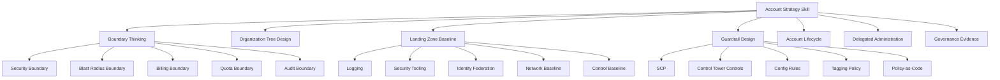
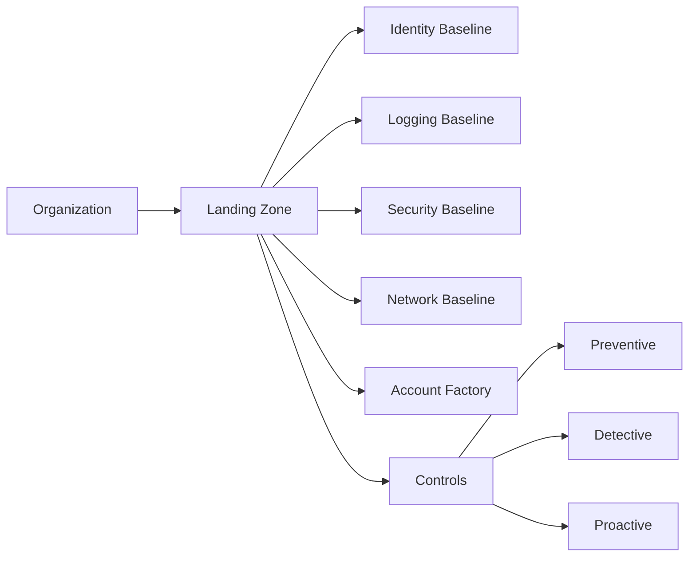
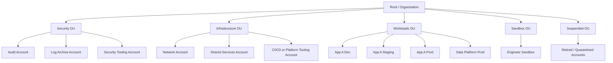
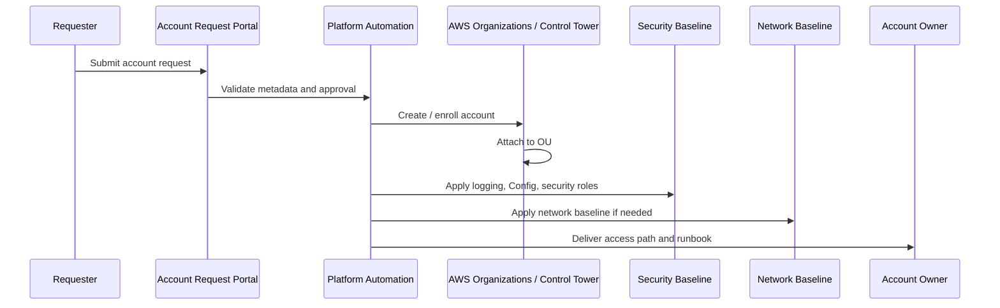
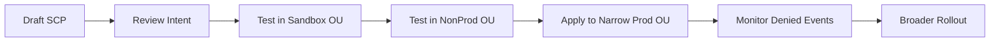
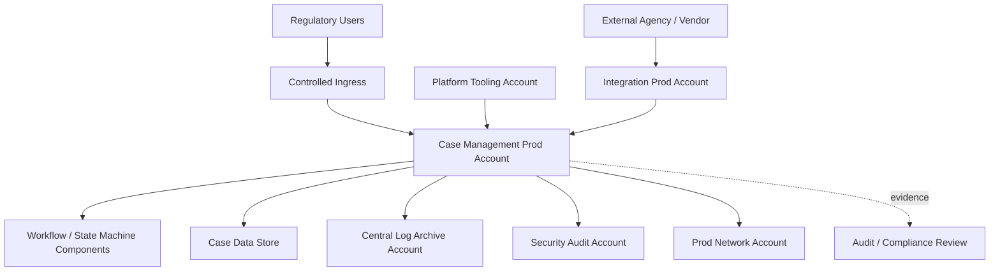

------
title: Learn AWS Engineering Mastery - Part 005
description: Account strategy, AWS Organizations, landing zones, organizational units, account vending, guardrails, and governance baseline for production-grade AWS environments.
series: learn-aws
seriesTitle: Learn AWS Engineering Mastery
order: 5
partTitle: Account Strategy, Organizations, and Landing Zone
tags:
- aws
- cloud
- architecture
- organizations
- control-tower
- landing-zone
- governance
- platform-engineering
date: 2026-06-30
---

# Part 005 — Account Strategy, Organizations, and Landing Zone

## 1. Target Skill

Setelah part ini, targetnya bukan sekadar tahu bahwa AWS punya **Organizations** atau **Control Tower**. Targetnya adalah mampu menjawab pertanyaan arsitektural seperti ini:

> “Berapa banyak AWS account yang kita butuhkan, kenapa dipisah seperti itu, siapa yang boleh masuk, kontrol apa yang enforced, bagaimana akun baru dibuat, bagaimana audit trail dikumpulkan, dan bagaimana kita mencegah satu tim merusak seluruh estate?”

Skill yang ingin dibangun:

1. Mendesain **multi-account architecture** berdasarkan security, blast radius, SDLC, compliance, dan ownership.
2. Memahami AWS account sebagai boundary penting: identity boundary, billing boundary, quota boundary, deployment boundary, risk boundary, dan audit boundary.
3. Mendesain **AWS Organizations** dengan OU, SCP, delegated administration, dan lifecycle akun.
4. Memahami **AWS Control Tower** sebagai landing zone orchestration layer, bukan magic governance tool.
5. Membuat decision framework untuk memilih struktur akun, OU, shared services, network, logging, audit, sandbox, dan workload accounts.
6. Menghindari anti-pattern seperti “satu akun untuk semua”, “OU berdasarkan tim saja”, “prod/dev di akun yang sama”, atau “SCP terlalu agresif tanpa test”.

Referensi resmi yang relevan:

- AWS Organizations: https://docs.aws.amazon.com/organizations/latest/userguide/orgs_introduction.html
- AWS Service Control Policies: https://docs.aws.amazon.com/organizations/latest/userguide/orgs_manage_policies_scps.html
- AWS Control Tower landing zone: https://docs.aws.amazon.com/controltower/latest/userguide/what-is-control-tower.html
- AWS multi-account strategy with Control Tower: https://docs.aws.amazon.com/controltower/latest/userguide/aws-multi-account-landing-zone.html
- AWS Control Tower Account Factory: https://docs.aws.amazon.com/controltower/latest/userguide/account-factory.html
- AWS Prescriptive Guidance — Designing an AWS Control Tower landing zone: https://docs.aws.amazon.com/prescriptive-guidance/latest/designing-control-tower-landing-zone/introduction.html

---

## 2. Kaufman Framing: Deconstruct the Skill

Kaufman menyarankan kita memecah skill menjadi sub-skill yang bisa dilatih secara eksplisit. Untuk AWS account strategy, sub-skill-nya seperti ini:



Yang harus dilatih bukan hafalan nama layanan, tetapi kebiasaan bertanya:

- Apa boundary yang sedang kita butuhkan?
- Apa dampak kegagalan jika boundary ini tidak ada?
- Siapa owner teknis dan owner risiko?
- Apa yang harus dicegah secara preventive?
- Apa yang cukup dideteksi dan diperbaiki?
- Bagaimana bukti kepatuhan dikumpulkan?
- Bagaimana akun baru dibuat tanpa manual snowflake?

---

## 3. Mental Model: AWS Account Is a Hard Boundary

AWS account sering diperlakukan seperti “folder project”. Itu framing yang terlalu lemah.

Mental model yang lebih tepat:

> AWS account adalah unit isolasi administratif, keamanan, audit, biaya, quota, dan blast radius.

Sebuah account bisa menjadi boundary untuk:

| Boundary | Artinya | Contoh keputusan |
|---|---|---|
| Security boundary | IAM principal, resource policy, trust relationship, KMS key, dan access path bisa dipisah | Prod dan dev dipisah account supaya kredensial dev tidak bisa langsung menyentuh prod |
| Blast radius boundary | Kesalahan konfigurasi atau compromise dibatasi pada account tertentu | Experiment sandbox tidak berada di account yang sama dengan workload regulated |
| Billing boundary | Cost bisa diatribusikan lebih jelas | Product A dan Product B punya akun berbeda jika ownership dan P&L berbeda |
| Quota boundary | Banyak AWS service quota berlaku per account per Region | High-throughput workload bisa dipisah account agar tidak memakan quota workload lain |
| Audit boundary | CloudTrail, Config, access review, dan evidence bisa dikaitkan ke environment/owner | Akun prod regulated memiliki kontrol audit lebih ketat |
| Deployment boundary | Pipeline, role, dan environment promotion bisa dirancang lebih aman | Dev → staging → prod memakai account berbeda |
| Data boundary | Data classification dan residency bisa dipisah | PII workload berada di account dengan kontrol khusus |

### 3.1 Account Bukan Hanya Environment

Account bisa merepresentasikan environment, tetapi tidak selalu hanya environment.

Contoh:

```text
bad:
  one-account-for-everything

better:
  shared-services-account
  security-tooling-account
  log-archive-account
  network-account
  workload-a-dev-account
  workload-a-staging-account
  workload-a-prod-account
  workload-b-dev-account
  workload-b-prod-account
```

Environment separation penting, tetapi ada boundary lain yang juga penting:

- security operations,
- centralized logging,
- network hub,
- audit evidence,
- shared CI/CD,
- data lake,
- tenant isolation,
- sandbox experimentation,
- break-glass operations.

---

## 4. Core AWS Organization Primitives

AWS Organizations menyediakan struktur untuk mengelola banyak AWS account secara terpusat.

### 4.1 Organization

Organization adalah container tertinggi untuk kumpulan AWS account. Di dalamnya ada:

- management account,
- member accounts,
- organizational units,
- organization policies,
- consolidated billing,
- delegated administrator untuk beberapa layanan.

### 4.2 Management Account

Management account adalah akun yang membuat dan mengelola organization. Akun ini sangat sensitif.

Prinsip engineering:

> Jangan gunakan management account sebagai workload account.

Management account sebaiknya dipakai untuk fungsi organisasi yang benar-benar harus berada di management account, misalnya:

- pengelolaan Organizations,
- billing utama,
- beberapa konfigurasi organization-level,
- account lifecycle tertentu,
- delegation setup.

Hindari:

- menjalankan aplikasi bisnis di management account,
- membuat pipeline umum di management account,
- memberi akses banyak engineer ke management account,
- menyimpan data aplikasi di management account.

### 4.3 Member Account

Member account adalah akun tempat workload, shared service, log archive, audit, network, sandbox, dan platform capability berada.

Akun member sebaiknya:

- punya owner yang jelas,
- punya purpose yang jelas,
- masuk OU yang sesuai,
- punya baseline kontrol,
- punya tag/metadata ownership,
- punya lifecycle: create, enroll, operate, review, retire.

### 4.4 Organizational Unit atau OU

OU adalah grouping account untuk menerapkan policy dan governance.

OU sering disalahgunakan sebagai folder organisasi perusahaan. Padahal OU di AWS adalah governance grouping.

Pertanyaan desain OU:

1. Apakah account dalam OU ini perlu policy yang sama?
2. Apakah risk profile account dalam OU ini mirip?
3. Apakah lifecycle dan compliance posture-nya mirip?
4. Apakah delegated admin atau control baseline-nya sama?
5. Apakah OU ini membantu automation atau malah mencerminkan politik organisasi?

### 4.5 Service Control Policy atau SCP

SCP menentukan **maximum available permissions** untuk IAM users dan roles di account dalam organization. SCP tidak memberikan permission. SCP hanya membatasi permission maksimum.

Rule penting:

```text
Effective permission = IAM allows AND not denied by SCP AND not denied by other applicable controls
```

Contoh penggunaan SCP:

- mencegah member account menonaktifkan CloudTrail,
- mencegah keluar dari organization,
- membatasi Region tertentu,
- mencegah perubahan security baseline,
- mencegah root user melakukan aksi tertentu,
- membatasi akses layanan yang tidak disetujui.

SCP yang buruk:

- terlalu luas tanpa testing,
- langsung diterapkan ke seluruh organization,
- tidak punya exception model,
- tidak punya owner,
- tidak didokumentasikan alasannya,
- tidak punya rollback plan.

AWS secara eksplisit menyarankan agar SCP diuji sebelum diterapkan luas karena dampaknya bisa memblokir operasi account.

### 4.6 Delegated Administrator

Banyak AWS service bisa didelegasikan ke member account tertentu supaya management account tidak menjadi tempat semua operasi.

Contoh delegated/admin-style account:

- security tooling account,
- audit account,
- log archive account,
- network account,
- backup administrator account,
- identity/security operations account.

Mental model:

> Management account should govern. Delegated admin accounts should operate.

---

## 5. Landing Zone: Baseline Before Workload

Landing zone adalah environment multi-account yang sudah disiapkan berdasarkan security dan compliance best practices. AWS Control Tower mendefinisikan landing zone sebagai multi-account environment yang well-architected dan berbasis best practices keamanan/kepatuhan.

Dalam praktik engineering, landing zone adalah **minimum viable cloud operating environment**.

Landing zone harus menjawab:

1. Di mana workload boleh dibuat?
2. Siapa yang boleh membuat account baru?
3. Bagaimana akun baru dibaseline?
4. Di mana log security dikumpulkan?
5. Bagaimana identitas manusia masuk?
6. Bagaimana network baseline dibuat?
7. Region mana yang boleh dipakai?
8. Controls apa yang preventive?
9. Controls apa yang detective?
10. Bagaimana drift ditemukan?
11. Bagaimana bukti audit dikumpulkan?
12. Bagaimana exception ditangani?



---

## 6. AWS Control Tower Mental Model

AWS Control Tower bukan pengganti pemahaman AWS Organizations. Control Tower adalah orchestration layer untuk setup dan governance multi-account environment.

Fungsi konseptual Control Tower:

| Capability | Makna engineering |
|---|---|
| Landing zone setup | Membuat baseline multi-account environment dengan struktur prescriptive |
| Account Factory | Provision account baru secara lebih standardized |
| Controls/guardrails | Menerapkan preventive/detective/proactive controls |
| Dashboard/governance visibility | Menunjukkan status compliance dan drift tertentu |
| Integration with Organizations | Memakai Organizations sebagai substrate multi-account |
| Shared accounts | Membantu setup akun seperti log archive dan audit sesuai pattern |

### 6.1 Apa yang Tidak Dilakukan Control Tower

Control Tower tidak otomatis membuat organisasi Anda well-architected.

Ia tidak otomatis:

- mendesain domain boundary aplikasi,
- memilih strategy account-per-team vs account-per-workload,
- mengamankan semua resource yang dibuat tim,
- memastikan IAM policy least privilege,
- membuat network architecture cocok untuk semua workload,
- menyelesaikan data governance,
- membangun incident response maturity,
- mencegah semua bentuk privilege escalation,
- menggantikan platform engineering discipline.

Control Tower memberi baseline. Engineering maturity tetap harus dibangun.

---

## 7. Recommended Baseline Account Types

Struktur akun berbeda-beda antar organisasi. Tetapi untuk enterprise AWS, pola berikut umum dan rasional.



### 7.1 Management Account

Purpose:

- organization management,
- billing root,
- top-level governance,
- delegated admin configuration.

Access:

- extremely limited,
- MFA enforced,
- break-glass monitored,
- no day-to-day workload access.

Failure if misused:

- compromise can affect entire organization,
- billing/control plane manipulation,
- centralized policy tampering.

### 7.2 Log Archive Account

Purpose:

- central immutable-ish log storage,
- organization CloudTrail storage,
- service logs,
- evidence preservation.

Design concerns:

- S3 Object Lock where appropriate,
- restrictive bucket policies,
- KMS key protection,
- lifecycle and retention,
- cross-account write, limited read,
- separation from security investigation account.

Failure if mixed with workload:

- attacker can delete or tamper with logs after compromising workload account,
- audit evidence loses credibility.

### 7.3 Audit / Security Account

Purpose:

- security read access,
- investigation tooling,
- centralized detective controls,
- delegated admin for security services where appropriate.

Design concerns:

- read-only cross-account role patterns,
- Security Hub/GuardDuty/Detective style aggregation,
- incident response role,
- strict change control.

### 7.4 Network Account

Purpose:

- shared networking components,
- transit gateway,
- centralized egress,
- inspection VPC,
- DNS resolver endpoints,
- shared private connectivity.

Design concerns:

- do not centralize everything blindly,
- consider regional isolation,
- avoid single inspection choke point without HA,
- model route propagation carefully,
- separate prod/non-prod routing where needed.

### 7.5 Shared Services Account

Purpose:

- shared tools that many workloads consume.

Examples:

- artifact repositories,
- directory integration,
- shared observability tooling,
- internal DNS services,
- license servers,
- base image factories.

Risk:

- shared services can become hidden production dependencies.
- availability of this account can affect many workloads.

### 7.6 Platform Tooling / CI-CD Account

Purpose:

- centralized CI/CD services,
- deployment orchestration,
- artifact promotion,
- environment automation.

Security concern:

> CI/CD account often has the ability to deploy into many accounts. Treat it like a privileged production system.

Controls:

- deploy role scoping,
- artifact signing or integrity verification,
- branch/environment protection,
- approvals for prod,
- session tagging,
- strong audit trail.

### 7.7 Workload Accounts

Purpose:

- host application workloads.

Common split:

```text
app-a-dev
app-a-test
app-a-staging
app-a-prod
```

or for larger platforms:

```text
domain-payments-dev
 domain-payments-prod
 domain-case-management-dev
 domain-case-management-prod
 data-platform-dev
 data-platform-prod
```

Decision rule:

> Split account when risk, lifecycle, owner, data classification, quota, or operational model differs materially.

### 7.8 Sandbox Accounts

Purpose:

- experimentation,
- training,
- proof-of-concept,
- temporary research.

Controls:

- budget limit,
- no production data,
- restricted Regions,
- automatic cleanup,
- no external persistent exposure by default,
- lower trust with organization-wide resources.

### 7.9 Suspended / Quarantine OU

Purpose:

- move retired, compromised, or non-compliant accounts into stricter control posture.

Controls:

- deny most actions,
- preserve logs/data for investigation,
- prevent new resource creation,
- allow limited break-glass remediation.

---

## 8. OU Design Patterns

### 8.1 OU by Environment

```text
Root
  Prod
  NonProd
  Sandbox
```

Pros:

- simple,
- easy to apply stricter controls to prod,
- works for small organizations.

Cons:

- may not represent security function accounts cleanly,
- can become too coarse,
- cross-cutting data classification is hard.

### 8.2 OU by Function

```text
Root
  Security
  Infrastructure
  Workloads
  Sandbox
```

Pros:

- aligns control baseline with account purpose,
- clean separation of security/network/workload,
- common enterprise landing zone pattern.

Cons:

- workload prod/non-prod controls need sub-OUs or tags/policies,
- requires stronger account metadata.

### 8.3 OU by Business Unit

```text
Root
  Retail
  Finance
  Risk
  Platform
```

Pros:

- aligns ownership and budget,
- useful for decentralized enterprises.

Cons:

- governance may diverge,
- inconsistent security baselines,
- harder central platform support.

### 8.4 Hybrid OU

```text
Root
  Security
  Infrastructure
  Workloads
    Prod
    NonProd
    Regulated
    Data
  Sandbox
  Suspended
```

Pros:

- more precise governance,
- scales better,
- supports regulated workloads.

Cons:

- can become complex,
- requires OU change management,
- SCP inheritance must be understood.

### 8.5 Practical Recommendation

For serious engineering organizations, start from function + risk, not org chart.

Good initial pattern:

```text
Root
  Security
    LogArchive
    Audit
    SecurityTooling
  Infrastructure
    Network
    SharedServices
    PlatformTooling
  Workloads
    Prod
    NonProd
    Regulated
  Sandbox
  Suspended
```

Then evolve based on real constraints.

---

## 9. Account Vending and Lifecycle

A production organization should not create accounts casually from the console with inconsistent setup.

Account creation should be a productized workflow.

### 9.1 Account Request Data

An account request should capture:

| Field | Why it matters |
|---|---|
| Account name | Human-readable identity |
| Business owner | Budget/accountability |
| Technical owner | Operations/accountability |
| Environment | dev/test/staging/prod/sandbox |
| Workload/domain | Domain ownership |
| Data classification | Control baseline |
| Cost center | Billing allocation |
| Required Regions | SCP/Region allowlist |
| Network model | Isolated/shared/hybrid |
| Compliance profile | Audit controls |
| Expiration date | Sandbox/temporary lifecycle |
| Support tier | Operational expectation |

### 9.2 Account Provisioning Flow



### 9.3 Minimum Baseline for New Accounts

Every new account should have:

- organization membership,
- OU placement,
- owner metadata,
- cost allocation tags where applicable,
- identity federation access,
- no long-lived root usage,
- CloudTrail/account activity logging,
- Config or equivalent configuration visibility where required,
- security service enrollment,
- baseline IAM roles,
- networking model,
- budget/alarm configuration,
- support/contact metadata,
- documented exception status.

### 9.4 Account Retirement

Account lifecycle must include retirement.

Retirement checklist:

1. Confirm workload decommission.
2. Export or archive required data.
3. Preserve logs/evidence per retention policy.
4. Remove external DNS/traffic paths.
5. Remove cross-account trust relationships.
6. Disable deployment roles.
7. Delete or snapshot resources.
8. Move to Suspended OU if retention is required.
9. Close account only after legal/compliance/billing approval.

---

## 10. Guardrail Design

Guardrails should be designed like product controls, not random policies.

### 10.1 Preventive vs Detective vs Proactive

| Control type | What it does | Example |
|---|---|---|
| Preventive | Blocks undesired action | SCP denies disabling CloudTrail |
| Detective | Detects undesired state/action | AWS Config detects public S3 bucket |
| Proactive | Checks before provisioning | IaC policy check blocks noncompliant template |
| Corrective | Fixes or remediates | Automation re-enables required setting |

### 10.2 Guardrail Decision Rule

Use preventive guardrail when:

- the action is almost never legitimate,
- damage is severe,
- false positives are low,
- exception process is clear,
- rollback is possible.

Use detective guardrail when:

- context matters,
- false positives are likely,
- remediation requires judgment,
- blocking would harm delivery,
- the risk can tolerate short detection window.

Use proactive guardrail when:

- change flows through IaC or service catalog,
- policy can be checked before deployment,
- developer feedback loop matters,
- prevention in runtime is too blunt.

### 10.3 SCP Examples by Intent

This is not copy-paste policy advice. It is intent modeling.

| Intent | SCP shape |
|---|---|
| Prevent disabling audit trail | Deny CloudTrail stop/delete/update actions except security roles |
| Restrict Regions | Deny actions outside approved Regions with service exceptions |
| Protect organization membership | Deny LeaveOrganization |
| Protect security baseline | Deny disabling GuardDuty/SecurityHub/Config where mandated |
| Prevent root usage | Deny sensitive actions when principal is root |
| Prevent public exposure | Deny risky network/security group actions, but often better with detective/proactive controls |

### 10.4 SCP Testing Strategy

Never roll out broad SCP directly to production OUs.

Safer rollout:



Testing checklist:

- Can platform automation still operate?
- Can break-glass roles still remediate?
- Are AWS service-linked roles affected?
- Are CloudFormation/CDK/Terraform deployments blocked unexpectedly?
- Are global services handled correctly?
- Are required Regions excluded/allowed correctly?
- Is there a rollback path?

---

## 11. Identity Baseline in Landing Zone

A landing zone must standardize human access.

Recommended mental model:

> Humans authenticate through centralized federation; workloads authenticate through roles; long-lived IAM users are exceptional, not default.

Identity baseline should include:

- IAM Identity Center or federated identity provider integration,
- permission sets per job function,
- separate access for prod and non-prod,
- MFA enforcement,
- session duration rules,
- break-glass process,
- privileged access logging,
- periodic access review,
- no shared users,
- minimal direct IAM user use.

This part intentionally does not go deep into IAM mechanics. That is Part 006.

---

## 12. Logging and Audit Baseline

Audit logging is foundational. It cannot be an afterthought added after incident or regulatory review.

Baseline questions:

1. Are API calls logged organization-wide?
2. Are logs centralized outside workload accounts?
3. Can workload admins delete their own audit logs?
4. Are logs encrypted?
5. Are logs retained long enough?
6. Can security team query logs quickly?
7. Is log delivery failure monitored?
8. Are high-risk events alerted?

Common log categories:

- CloudTrail management events,
- CloudTrail data events for sensitive resources,
- VPC Flow Logs where needed,
- load balancer access logs,
- WAF logs,
- DNS query logs,
- service-specific audit logs,
- application security logs,
- deployment logs,
- identity provider logs.

Key design principle:

> Logs used as evidence should be stored in an account separate from the workload and protected from workload administrators.

---

## 13. Network Baseline

Account strategy and network strategy are coupled.

Questions:

- Does each account own its own VPC?
- Is there a central network account?
- Is egress centralized or decentralized?
- Is ingress centralized or workload-owned?
- Is DNS centralized?
- Are prod and non-prod networks connected?
- How is inspection done?
- How is hybrid connectivity exposed?
- Are IP ranges allocated centrally?

Common models:

| Model | Description | When useful |
|---|---|---|
| Isolated VPC per workload account | Each account owns VPC and ingress/egress | Smaller orgs, autonomous teams |
| Shared network hub | Transit Gateway/shared services in network account | Enterprise connectivity |
| Centralized egress | Egress inspected through network account | Regulated environments |
| Decentralized egress | Each workload controls egress | High autonomy, simpler blast radius |
| Shared VPC/subnet | Central VPC shared to accounts | Specific enterprise controls, but can couple teams |

Deep networking starts in Part 007–009.

---

## 14. Cost and Ownership Baseline

Multi-account strategy directly affects cost visibility.

Minimum cost baseline:

- account owner,
- cost center,
- workload name,
- environment,
- product/domain,
- tagging standard,
- budget alarms,
- anomaly detection,
- chargeback/showback model,
- cleanup lifecycle for sandbox.

Anti-pattern:

```text
“We will tag things later.”
```

In practice, if ownership and tags are not enforced early, cloud estate becomes a cost archaeology project.

---

## 15. Decision Matrix: When to Create a Separate Account

| Signal | Separate account likely? | Reason |
|---|---:|---|
| Production vs development | Yes | Strong SDLC and blast radius separation |
| Different data classification | Yes | Compliance/security control separation |
| Different business owner | Often | Cost and accountability |
| Different operational team | Often | Access and ownership boundary |
| High quota usage | Often | Prevent quota contention |
| Different network trust zone | Often | Route/security separation |
| Temporary experiment | Yes, sandbox | Cost and cleanup control |
| Same app, same env, same owner, small scope | Maybe not | Avoid unnecessary fragmentation |
| Need hard tenant isolation | Often | Tenant blast radius and compliance |
| Shared platform dependency | Separate shared account | Protect from workload-level churn |

Rule of thumb:

> Create an account when the cost of isolation is lower than the cost of shared failure.

---

## 16. Common Enterprise Account Topologies

### 16.1 Small but Serious Startup

```text
management
log-archive
security
network-shared
platform-tooling
app-dev
app-staging
app-prod
sandbox
```

Good for:

- early production maturity,
- minimal but real separation,
- manageable overhead.

### 16.2 Product Organization

```text
security/logging/network/platform
product-a-dev
product-a-stage
product-a-prod
product-b-dev
product-b-stage
product-b-prod
data-platform-dev
data-platform-prod
sandbox-per-team
```

Good for:

- multiple product teams,
- clear ownership,
- separate release lifecycle.

### 16.3 Regulated Enterprise

```text
security-ou
  audit
  log-archive
  security-tooling
infrastructure-ou
  network-prod
  network-nonprod
  shared-services
  platform-tooling
workloads-ou
  regulated-prod
  regulated-nonprod
  standard-prod
  standard-nonprod
data-ou
  data-lake-prod
  data-lake-nonprod
sandbox-ou
suspended-ou
```

Good for:

- audit evidence,
- environment segregation,
- regulated controls,
- centralized operations.

---

## 17. Failure Modes

### 17.1 One Account for Everything

Symptoms:

- prod/dev share IAM surface,
- difficult cost attribution,
- noisy CloudTrail,
- blast radius too large,
- compliance boundary weak,
- engineers fear changing anything.

Root cause:

- account treated as convenience container, not risk boundary.

Fix:

- introduce multi-account landing zone,
- migrate workloads gradually,
- separate prod first,
- centralize logging before migration.

### 17.2 OU Mirrors Org Chart Too Literally

Symptoms:

- each department has its own inconsistent controls,
- security baseline varies,
- policy inheritance becomes political,
- shared platform cannot reason about risk.

Fix:

- design OU based on governance and risk first,
- encode business owner in metadata/tags,
- keep security baseline consistent.

### 17.3 SCP Breaks Production Automation

Symptoms:

- CloudFormation/CDK/Terraform fails mysteriously,
- service-linked roles cannot operate,
- emergency remediation blocked,
- teams bypass platform.

Fix:

- test SCP in sandbox OU,
- monitor denied events,
- use exception roles carefully,
- document policy intent,
- apply incrementally.

### 17.4 No Account Lifecycle

Symptoms:

- orphaned accounts,
- unknown owners,
- abandoned resources,
- unmanaged cost,
- stale cross-account roles.

Fix:

- account registry,
- owner review,
- automated suspension path,
- expiry for sandbox,
- periodic access and cost review.

### 17.5 Log Archive Is Not Protected

Symptoms:

- workload admins can delete logs,
- evidence cannot be trusted,
- security investigations rely on incomplete data.

Fix:

- separate log archive account,
- restrictive bucket/KMS policy,
- immutability where required,
- monitor log delivery.

---

## 18. Account Strategy for Regulated Case Management Platform

For a regulatory/enforcement lifecycle platform, the account strategy should reflect risk and evidence requirements.

Possible topology:

```text
management
security-audit
log-archive
network-prod
network-nonprod
platform-tooling
case-management-dev
case-management-test
case-management-staging
case-management-prod
workflow-prod
integration-prod
data-analytics-prod
sandbox
```

Additional considerations:

- production case data isolated from non-prod,
- audit logs preserved separately,
- evidence chain protected from workload admins,
- integration accounts separated if external agencies/vendors connect,
- analytics account separated if access model differs,
- break-glass access requires strong logging and approval,
- policy exceptions tracked as risk decisions.

Architecture sketch:



---

## 19. Practical Design Process

Use this process when designing account strategy.

### Step 1: Identify Workload Classes

Examples:

- regulated production,
- standard production,
- non-production,
- sandbox,
- data platform,
- shared services,
- security/audit,
- network,
- CI/CD.

### Step 2: Identify Boundaries

For each workload class, ask:

- data sensitivity,
- operational criticality,
- access model,
- failure blast radius,
- quota profile,
- network trust,
- compliance obligation,
- release lifecycle.

### Step 3: Define OUs

Group by control baseline, not only team ownership.

### Step 4: Define Accounts

For each account:

```yaml
accountName: case-management-prod
purpose: Production case management workload
owner: Case Platform Team
businessOwner: Enforcement Operations
environment: prod
dataClassification: regulated-sensitive
ou: Workloads/Regulated/Prod
regions:
  - ap-southeast-1
networkModel: shared-prod-network
requiredControls:
  - organization-cloudtrail
  - config-enabled
  - guardduty-enabled
  - restricted-regions
  - no-public-s3
  - prod-change-approval
```

### Step 5: Define Baseline Controls

Controls should map to risk.

```yaml
control: deny-cloudtrail-disable
controlType: preventive
implementedBy: SCP
scope: all-workload-accounts
exception: security-breakglass-role
riskAddressed: audit-log-tampering
owner: cloud-security
```

### Step 6: Define Account Vending Workflow

No account should be manually created without baseline enrollment.

### Step 7: Define Review Cadence

Review:

- account owner quarterly,
- privileged access monthly/quarterly depending risk,
- SCP exceptions monthly,
- cost anomaly weekly/monthly,
- sandbox expiration continuously,
- compliance evidence per audit cycle.

---

## 20. Anti-Patterns

### 20.1 “We’ll Start with One Account and Split Later”

Splitting later is often more expensive than starting with a small but correct multi-account baseline.

Why:

- IAM policies become entangled,
- resources reference each other casually,
- data migration becomes risky,
- DNS and certificates get mixed,
- logs are not separated,
- teams normalize unsafe access.

### 20.2 “Control Tower Means We Are Secure”

Control Tower gives baseline controls, not workload security.

You still need:

- IAM design,
- network design,
- app security,
- data protection,
- CI/CD integrity,
- incident response,
- monitoring,
- cost governance.

### 20.3 “SCP Everything”

Too many preventive controls can break delivery and produce bypass culture.

Use preventive controls for high-certainty risks. Use detective/proactive controls when context matters.

### 20.4 “OU per Team”

Teams change. Risk classes are more stable.

Prefer account metadata for org ownership, OU for policy posture.

### 20.5 “Shared Services Account as Junk Drawer”

Shared services account easily becomes the place for anything that does not fit elsewhere.

Keep purpose explicit:

- what service is shared,
- who owns it,
- who depends on it,
- what is its availability target,
- how is access granted,
- how is cost allocated.

---

## 21. Checklist: Self-Correction

Use this checklist to evaluate your account strategy.

### Boundary Checklist

- [ ] Prod and non-prod are separated where risk requires it.
- [ ] Security/logging accounts are separated from workload accounts.
- [ ] Management account is not used for workloads.
- [ ] Network/shared services accounts have explicit purpose.
- [ ] Sandbox accounts cannot reach production data.
- [ ] Account owner and cost owner are known.
- [ ] Data classification is known per account.
- [ ] Quota-heavy workloads are isolated where needed.

### Governance Checklist

- [ ] OU structure reflects control posture.
- [ ] SCPs have documented intent.
- [ ] SCPs have been tested before broad rollout.
- [ ] Account vending applies baseline automatically.
- [ ] Logging is centralized.
- [ ] Security services are delegated/aggregated where needed.
- [ ] Exceptions have expiry and owner.
- [ ] Account decommission process exists.

### Operational Checklist

- [ ] Platform team knows how to create accounts safely.
- [ ] Security team can investigate across accounts.
- [ ] Finance can attribute spend.
- [ ] Developers have clear access path.
- [ ] Break-glass process is documented and monitored.
- [ ] Drift detection exists.
- [ ] Landing zone updates are planned and tested.

---

## 22. Deliberate Practice

### Exercise 1 — Account Boundary Justification

Take an existing system and produce a table:

| Component | Proposed account | Reason for separation | Risk if shared |
|---|---|---|---|
| API service prod | app-prod | prod blast radius | dev credential can affect prod |
| Data warehouse | data-prod | different access model | analysts may access app infra |
| CI/CD | platform-tooling | privileged deployment | compromise deploys everywhere |

Goal: force explicit boundary reasoning.

### Exercise 2 — OU Tree Design

Design OU tree for:

- 3 product teams,
- 1 regulated workload,
- 1 data platform,
- 1 sandbox program,
- centralized network,
- centralized logging/security.

Then explain:

- why each OU exists,
- what policy applies,
- what account belongs there,
- what exception exists.

### Exercise 3 — SCP Intent Review

Write five SCP intents, not policies:

```yaml
- intent: Prevent workload accounts from disabling CloudTrail
  risk: Audit log tampering
  scope: All workload OUs
  exception: Security break-glass role
  rollout: sandbox -> nonprod -> prod narrow -> prod broad
```

Goal: learn to design controls before writing JSON.

### Exercise 4 — Account Vending Contract

Define the request schema for account creation. Include required fields, approval rules, and resulting baseline.

### Exercise 5 — Incident Simulation

Simulate compromise of a dev workload account. Answer:

- Can attacker reach prod?
- Can attacker delete central logs?
- Can attacker modify SCP?
- Can attacker assume CI/CD prod role?
- Can security team investigate?
- What alarms fire?

---

## 23. Key Takeaways

1. AWS account is a hard engineering boundary, not just a project folder.
2. Multi-account strategy is about limiting blast radius, clarifying ownership, and making governance enforceable.
3. OU should group accounts by control posture and risk, not blindly by org chart.
4. SCP limits maximum permissions. It does not grant permissions.
5. Control Tower provides landing zone orchestration and controls, but it does not replace architecture judgment.
6. Account vending is a platform product. Manual account creation creates cloud sprawl.
7. Centralized logging and security accounts are foundational for credible audit and incident response.
8. Guardrails must be designed by risk: preventive, detective, proactive, and corrective.
9. The best account strategy is the one whose boundaries remain understandable during incident, audit, migration, and scaling.

---

## 24. Bridge to Part 006

Account strategy defines **where** permissions and boundaries exist.

IAM defines **who** can do **what**, **where**, **under which conditions**, and **through which trust path**.

Next part:

```text
learn-aws-part-006-iam-deep-dive-identity-permissions-and-boundaries.mdx
```

We will go deep into IAM identity, role assumption, trust policy, permission policy, resource policy, SCP, permissions boundary, ABAC, cross-account access, PassRole, and troubleshooting effective permissions.
