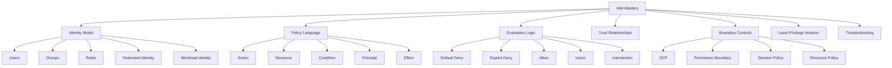
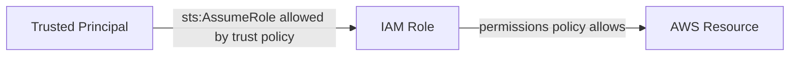
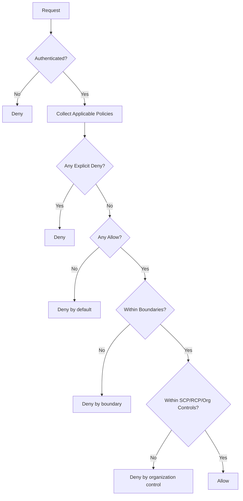
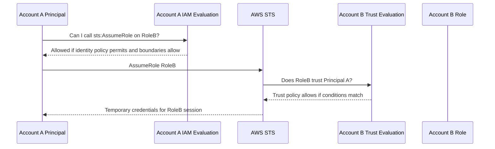
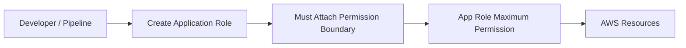
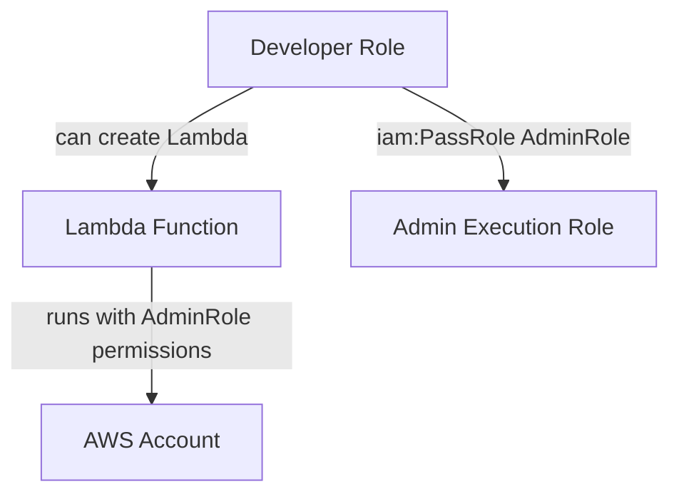
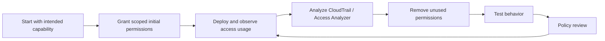
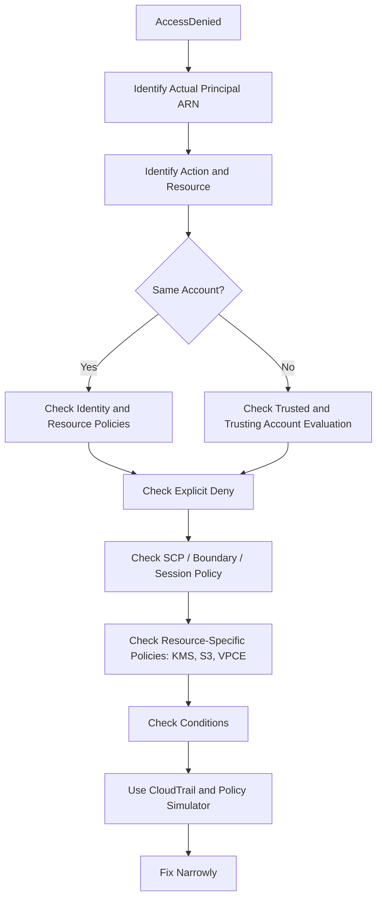
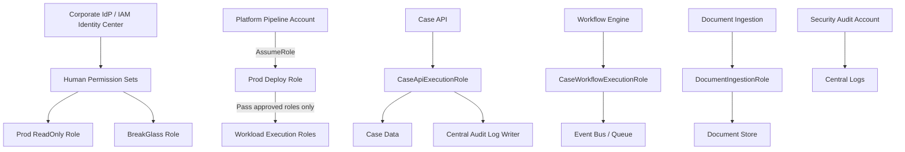

------
title: Learn AWS Engineering Mastery - Part 006
description: Deep dive into AWS IAM identity, permissions, roles, trust policies, resource policies, STS, permission boundaries, SCPs, ABAC, cross-account access, PassRole, and least-privilege engineering.
series: learn-aws
seriesTitle: Learn AWS Engineering Mastery
order: 6
partTitle: IAM Deep Dive: Identity, Permissions, and Boundaries
tags:
- aws
- iam
- security
- identity
- authorization
- least-privilege
- platform-engineering
- cloud-security
date: 2026-06-30
---

# Part 006 — IAM Deep Dive: Identity, Permissions, and Boundaries

## 1. Target Skill

IAM adalah salah satu area AWS yang paling sering terlihat sederhana di awal, tetapi menjadi sumber risiko terbesar di production.

Target part ini:

> Mampu membaca, mendesain, membatasi, dan men-debug effective permissions di AWS secara sistematis.

Setelah part ini, Anda harus mampu:

1. Membedakan identity, principal, role, policy, session, trust relationship, dan resource-based permission.
2. Menjelaskan IAM evaluation logic: default deny, explicit deny, allow, union, intersection, SCP, permission boundary, session policy, dan resource policy.
3. Mendesain role untuk manusia, workload, CI/CD, dan cross-account access.
4. Menggunakan IAM sebagai authorization system berbasis kondisi, bukan sekadar daftar action.
5. Menghindari privilege escalation umum, terutama melalui `iam:PassRole`, overly broad trust policy, wildcard resource, dan admin-like managed policies.
6. Menerapkan least privilege secara realistis: start broad for discovery, observe usage, reduce permissions, verify with Access Analyzer/policy simulation, and repeat.
7. Membuat mental model yang bisa dipakai saat incident: “siapa bisa assume role apa, lalu melakukan action apa pada resource mana?”

Referensi resmi yang relevan:

- IAM policy evaluation logic: https://docs.aws.amazon.com/IAM/latest/UserGuide/reference_policies_evaluation-logic.html
- IAM cross-account policy evaluation: https://docs.aws.amazon.com/IAM/latest/UserGuide/reference_policies_evaluation-logic-cross-account.html
- IAM best practices: https://docs.aws.amazon.com/IAM/latest/UserGuide/best-practices.html
- IAM policies and permissions: https://docs.aws.amazon.com/IAM/latest/UserGuide/access_policies.html
- Permissions boundaries: https://docs.aws.amazon.com/IAM/latest/UserGuide/access_policies_boundaries.html
- IAM roles: https://docs.aws.amazon.com/IAM/latest/UserGuide/id_roles.html
- PassRole: https://docs.aws.amazon.com/IAM/latest/UserGuide/id_roles_use_passrole.html
- IAM policy simulator: https://docs.aws.amazon.com/IAM/latest/UserGuide/access_policies_testing-policies.html

---

## 2. Kaufman Framing: Deconstruct IAM

IAM harus dipelajari sebagai beberapa sub-skill kecil.



The skill is not writing JSON. The skill is reasoning about authorization outcomes.

---

## 3. Mental Model: IAM Is a Distributed Authorization System

IAM is not merely a user management screen.

Mental model:

> IAM is the authorization layer that evaluates whether a principal can perform an action on a resource under a specific request context.

A request has this shape:

```text
principal -> action -> resource -> context -> decision
```

Example:

```text
arn:aws:sts::111122223333:assumed-role/AppDeployRole/session-123
wants to perform:
s3:PutObject
on:
arn:aws:s3:::regulated-evidence-bucket/cases/CASE-123/document.pdf
with context:
source account, source IP, MFA, session tags, encryption headers, VPC endpoint, requested region
```

IAM evaluation answers:

```text
Allow or Deny
```

But the reasoning path can involve many policies.

---

## 4. Core Vocabulary

### 4.1 Principal

A principal is an entity that makes a request.

Examples:

- IAM user,
- IAM role session,
- federated user session,
- AWS service principal,
- root user,
- account principal,
- assumed role principal.

In most production designs, the principal should usually be a **role session**, not a long-lived IAM user.

### 4.2 Identity

Identity is an IAM object that can be authenticated or used to obtain credentials.

Common identities:

- IAM user,
- IAM group,
- IAM role.

Modern AWS design should favor:

- federated human access through IAM Identity Center or external IdP,
- IAM roles for workloads,
- short-lived credentials via STS,
- minimal long-lived IAM users.

### 4.3 Role

A role is an identity with permissions that can be assumed by trusted principals.

A role has two key sides:

| Side | Policy type | Question answered |
|---|---|---|
| Trust side | Trust policy | Who can assume this role? |
| Permission side | Permission policy | What can this role do after it is assumed? |

This separation is central.



### 4.4 Policy

A policy is a JSON document that expresses permission intent.

Main policy types:

| Policy type | Attached to | Purpose |
|---|---|---|
| Identity-based policy | User/group/role | Grants what identity can do |
| Resource-based policy | Resource | Grants who can access resource |
| Trust policy | Role | Controls who can assume role |
| Permissions boundary | User/role | Limits maximum identity-based permissions |
| SCP | AWS account/OU/root | Limits maximum available permissions in organization |
| Session policy | STS session | Further limits temporary session permissions |
| VPC endpoint policy | Endpoint | Limits what can be accessed through endpoint |
| KMS key policy | KMS key | Authoritative control for KMS key access |

### 4.5 Credential

Credential is the secret or temporary material used to sign requests.

Examples:

- access key + secret key,
- temporary STS credentials,
- instance profile credentials,
- ECS task role credentials,
- Lambda execution role credentials,
- federated session credentials.

Security principle:

> Prefer short-lived credentials. Long-lived access keys are operational debt.

---

## 5. IAM Request Evaluation Logic

AWS IAM evaluation has several simple rules that combine into complex outcomes.

AWS documentation defines these core ideas:

- by default, requests are denied,
- explicit deny overrides allow,
- identity-based and resource-based policies can combine,
- permission boundaries and SCPs limit effective permissions,
- cross-account access requires evaluation in both accounts.

### 5.1 Simplified Decision Algorithm



This diagram is simplified. Real evaluation can vary by policy type, resource type, and cross-account path, but the mental model holds.

### 5.2 Default Deny

If there is no applicable allow, the request is denied.

Implication:

```text
No policy needed to deny by default.
```

### 5.3 Explicit Deny

Any explicit deny wins over allow.

Implication:

```text
One explicit deny anywhere applicable can override many allows.
```

Use explicit deny carefully. It is powerful for guardrails, but painful when applied without exception design.

### 5.4 Allow

An allow permits an action only if no boundary or explicit deny blocks it.

A common mistake:

```text
“This role has AdministratorAccess, so it can do everything.”
```

Not necessarily. It may still be blocked by:

- SCP,
- permission boundary,
- session policy,
- resource policy,
- KMS key policy,
- VPC endpoint policy,
- service-specific condition,
- explicit deny.

---

## 6. Identity-Based vs Resource-Based Policies

### 6.1 Identity-Based Policy

Attached to IAM identity.

Example intent:

```text
This role can read objects from bucket X.
```

Example:

```json
{
  "Version": "2012-10-17",
  "Statement": [
    {
      "Effect": "Allow",
      "Action": ["s3:GetObject"],
      "Resource": "arn:aws:s3:::case-documents-prod/*"
    }
  ]
}
```

### 6.2 Resource-Based Policy

Attached to resource.

Example intent:

```text
This bucket allows role Y from account Z to read objects.
```

Example:

```json
{
  "Version": "2012-10-17",
  "Statement": [
    {
      "Effect": "Allow",
      "Principal": {
        "AWS": "arn:aws:iam::111122223333:role/CaseReadRole"
      },
      "Action": "s3:GetObject",
      "Resource": "arn:aws:s3:::case-documents-prod/*"
    }
  ]
}
```

### 6.3 Union in Same Account

In same-account scenarios, identity-based and resource-based allows can combine. If either grants access and no explicit deny/boundary blocks it, the action may be allowed.

Engineering implication:

> Do not review only the role policy. Review resource policies too.

### 6.4 Resource Policy Risk

Resource policies can quietly create access paths.

High-risk examples:

- S3 bucket policy allowing broad principal,
- KMS key policy granting external account,
- SQS queue policy allowing cross-account send/receive,
- SNS topic policy allowing cross-account publish,
- Lambda function resource policy allowing external invoke,
- ECR repository policy allowing external pull,
- Secrets Manager resource policy allowing cross-account read.

---

## 7. Role Assumption and Trust Policies

A role has a trust policy that controls who can assume it.

### 7.1 Trust Policy Example

```json
{
  "Version": "2012-10-17",
  "Statement": [
    {
      "Effect": "Allow",
      "Principal": {
        "AWS": "arn:aws:iam::111122223333:role/DeployPipelineRole"
      },
      "Action": "sts:AssumeRole"
    }
  ]
}
```

This means `DeployPipelineRole` from account `111122223333` can assume this role.

### 7.2 Trust Policy Is Not Permission Policy

Trust policy answers:

```text
Who can enter the role?
```

Permission policy answers:

```text
What can the role do after entry?
```

Both matter.

### 7.3 Cross-Account Role Assumption

For account A principal to assume account B role:

1. Account B role trust policy must trust account A principal.
2. Account A principal must have identity permission for `sts:AssumeRole` on the account B role.
3. SCPs/boundaries/session policies must not block the action.
4. Conditions must match.



### 7.4 External ID

For third-party cross-account access, use `sts:ExternalId` to reduce confused deputy risk.

Example condition:

```json
{
  "Effect": "Allow",
  "Principal": {
    "AWS": "arn:aws:iam::999988887777:role/VendorAccessRole"
  },
  "Action": "sts:AssumeRole",
  "Condition": {
    "StringEquals": {
      "sts:ExternalId": "vendor-specific-random-value"
    }
  }
}
```

### 7.5 Trust Policy Anti-Patterns

Avoid:

```json
"Principal": "*"
```

unless paired with extremely strong conditions and a clear reason.

Avoid trusting an entire external account casually:

```json
"Principal": { "AWS": "arn:aws:iam::111122223333:root" }
```

This does not mean only the root user. It means the account principal; identities in that account may be delegated to assume the role depending on their permissions.

---

## 8. STS and Temporary Sessions

STS provides temporary credentials.

Common APIs:

- `AssumeRole`,
- `AssumeRoleWithSAML`,
- `AssumeRoleWithWebIdentity`,
- `GetSessionToken`,
- `GetFederationToken`.

Temporary sessions can include:

- session name,
- session duration,
- session tags,
- transitive tags,
- external ID,
- source identity,
- session policy.

### 8.1 Why Session Identity Matters

CloudTrail often records assumed-role ARN like:

```text
arn:aws:sts::123456789012:assumed-role/AdminRole/alice@example.com
```

Good session naming and source identity improves auditability.

Bad:

```text
assumed-role/AdminRole/session
```

Better:

```text
assumed-role/AdminRole/alice@example.com-ticket-INC1234
```

where supported by the access workflow.

---

## 9. Permission Boundaries

A permissions boundary limits the maximum permissions that identity-based policies can grant to a user or role.

Mental model:

```text
effective identity permission = identity policy ∩ permissions boundary
```

If identity policy allows `s3:*` but boundary allows only `s3:GetObject`, effective permission is only `s3:GetObject`.

### 9.1 Why Boundaries Exist

Useful when you allow teams or automation to create roles, but you need to prevent them from creating overpowered roles.

Example use case:

- platform team lets application teams create IAM roles for their services,
- but every created role must attach a boundary,
- boundary prevents IAM admin actions, organization changes, KMS admin, or cross-account trust outside approved patterns.

### 9.2 Boundary Pattern



### 9.3 Boundary Anti-Pattern

A boundary is not a substitute for good identity policy.

Bad thinking:

```text
“Give broad policy; boundary will save us.”
```

Better:

```text
Use narrow identity policy and boundary as guardrail against privilege expansion.
```

---

## 10. Service Control Policies and IAM

SCPs limit maximum available permissions for accounts in AWS Organizations.

Mental model:

```text
effective permission = IAM permission ∩ SCP allowance
```

SCP does not grant permission.

If IAM allows `ec2:RunInstances` but SCP denies it, denied.

If SCP allows `ec2:RunInstances` but IAM does not allow it, denied.

### 10.1 SCP vs Permission Boundary

| Dimension | SCP | Permission boundary |
|---|---|---|
| Scope | Account/OU/root in Organizations | Specific IAM user/role |
| Purpose | Organization-level maximum permission | Identity-level maximum permission |
| Grants permission? | No | No |
| Common owner | Cloud governance/security | Platform/security/app platform |
| Useful for | Region deny, protecting baseline, org-wide restrictions | Delegated IAM creation, role safety |

---

## 11. Session Policies

Session policies further restrict permissions for a temporary session.

Use cases:

- broker grants temporary narrowed access,
- CI job assumes deploy role but receives session policy only for one stack,
- just-in-time access grants limited action/resource.

Mental model:

```text
session effective permission = role permission ∩ session policy
```

---

## 12. IAM Conditions

Conditions are where IAM becomes powerful.

A policy without conditions is often too blunt.

Common condition keys:

| Condition key | Use |
|---|---|
| `aws:RequestedRegion` | restrict Regions |
| `aws:PrincipalArn` | restrict caller identity |
| `aws:PrincipalTag/...` | ABAC based on principal tags |
| `aws:ResourceTag/...` | ABAC based on resource tags |
| `aws:RequestTag/...` | require tags during creation |
| `aws:TagKeys` | restrict allowed tag keys |
| `aws:MultiFactorAuthPresent` | require MFA in eligible flows |
| `aws:SourceIp` | restrict source IP, with caveats |
| `aws:SourceVpce` | require VPC endpoint path |
| `kms:ViaService` | limit KMS use through specific AWS service |
| `s3:x-amz-server-side-encryption` | require encryption header |

### 12.1 Condition Example: Require Object Encryption

```json
{
  "Effect": "Deny",
  "Principal": "*",
  "Action": "s3:PutObject",
  "Resource": "arn:aws:s3:::regulated-documents/*",
  "Condition": {
    "StringNotEquals": {
      "s3:x-amz-server-side-encryption": "aws:kms"
    }
  }
}
```

This explicitly denies object upload unless KMS encryption is requested.

### 12.2 Condition Caveat

Conditions can be service-specific. Do not assume a condition key works for all services/actions. Verify against AWS service authorization reference for the target service.

---

## 13. ABAC: Attribute-Based Access Control

ABAC grants access based on attributes such as tags.

Example mental model:

```text
Principal tag project=case-management
can access resources with tag project=case-management
```

### 13.1 ABAC Example

```json
{
  "Version": "2012-10-17",
  "Statement": [
    {
      "Effect": "Allow",
      "Action": ["s3:GetObject", "s3:PutObject"],
      "Resource": "arn:aws:s3:::project-data-*/*",
      "Condition": {
        "StringEquals": {
          "aws:ResourceTag/project": "${aws:PrincipalTag/project}"
        }
      }
    }
  ]
}
```

### 13.2 ABAC Works Only If Tags Are Governed

ABAC becomes dangerous if principals can freely tag themselves or resources.

Required controls:

- restrict who can set principal tags,
- restrict who can tag sensitive resources,
- require immutable or controlled tags,
- validate tags at provisioning,
- monitor tag drift,
- prevent tag escalation.

### 13.3 ABAC vs RBAC

| Model | Strength | Weakness |
|---|---|---|
| RBAC | Simple, explicit roles | Role explosion |
| ABAC | Scales with attributes | Requires strong tag governance |
| Hybrid | Practical enterprise model | More complex evaluation |

Use RBAC for coarse job functions. Use ABAC for scalable resource scoping when attributes are trustworthy.

---

## 14. `iam:PassRole`

`iam:PassRole` is one of the most important IAM permissions to understand.

Many AWS services need an IAM role to operate. Passing a role lets a user configure a service to use that role.

Example:

- user creates Lambda function,
- user passes `LambdaExecutionRole`,
- Lambda later uses that role permissions.

If a user can pass an overpowered role to a service they control, they may indirectly gain its permissions.

### 14.1 PassRole Risk Scenario



Even if the user cannot directly call admin APIs, they may create a Lambda that can.

### 14.2 Safer PassRole Pattern

Limit PassRole by:

- specific role ARN pattern,
- specific service via `iam:PassedToService`,
- permission boundary on passable roles,
- naming conventions,
- deployment pipeline ownership,
- deny passing admin/security roles.

Example shape:

```json
{
  "Effect": "Allow",
  "Action": "iam:PassRole",
  "Resource": "arn:aws:iam::123456789012:role/app/case-management-*",
  "Condition": {
    "StringEquals": {
      "iam:PassedToService": "lambda.amazonaws.com"
    }
  }
}
```

---

## 15. Workload Identity Patterns

### 15.1 EC2 Instance Profile

EC2 should use instance profiles, not stored access keys.

Pattern:

```text
EC2 instance -> instance profile -> IAM role -> temporary credentials from metadata service
```

Security concerns:

- protect metadata service,
- prefer IMDSv2,
- scope role narrowly,
- avoid sharing same role across unrelated workloads.

### 15.2 Lambda Execution Role

Lambda assumes an execution role.

Design:

- one role per function or per tightly related function group,
- minimum log permissions,
- specific data/service permissions,
- avoid wildcard resource where service supports resource scoping,
- use separate role for prod/non-prod.

### 15.3 ECS Task Role

ECS has task role and task execution role.

| Role | Purpose |
|---|---|
| Task execution role | ECS agent pulls image, writes logs, retrieves secrets for task startup |
| Task role | Application container calls AWS APIs |

Do not mix them casually.

### 15.4 EKS Workload Identity

For EKS, workload identity is commonly handled through IAM integration patterns such as IAM Roles for Service Accounts or newer AWS-supported pod identity mechanisms.

Design goal:

```text
Kubernetes service account -> AWS IAM role -> narrowly scoped AWS permission
```

Avoid node role being the universal permission source for pods.

### 15.5 CI/CD Deployment Role

CI/CD roles are highly sensitive.

Controls:

- separate deploy role per environment/account,
- restrict assumers,
- require branch/environment gates,
- use session tags,
- scope CloudFormation/CDK/Terraform actions,
- restrict PassRole,
- protect artifact integrity,
- log every assume/deploy event.

---

## 16. Human Access Patterns

### 16.1 Avoid Long-Lived IAM Users

IAM users with access keys are durable secrets. They tend to leak, get copied, and outlive people or systems.

Prefer:

- federation,
- IAM Identity Center,
- short-lived sessions,
- role-based access,
- MFA,
- approval/JIT for privilege.

### 16.2 Permission Sets

For human access, define job-function permission sets.

Example:

| Permission set | Intended use |
|---|---|
| ReadOnly | investigation, browsing, support |
| DeveloperNonProd | development changes in non-prod |
| OperatorProdRead | prod investigation without mutation |
| ProdBreakGlass | emergency privileged access |
| SecurityAudit | security investigation |
| BillingRead | finance/cost review |

### 16.3 Production Access Principle

Production write access should be:

- rare,
- justified,
- time-bound,
- logged,
- reviewable,
- preferably mediated by automation.

---

## 17. Least Privilege Engineering

Least privilege is not a one-time policy-writing activity. It is an iterative process.

### 17.1 Practical Least Privilege Loop



### 17.2 Discovery vs Production

During exploration, you may temporarily use broader permissions in a sandbox. But production permissions should be narrowed.

Good maturity signal:

```text
Broad permissions are time-boxed and isolated.
Production permissions are reviewed and justified.
```

### 17.3 Policy Design Heuristics

Prefer:

- specific actions over `service:*`,
- specific resources where service supports it,
- conditions for context,
- separate read/write/admin roles,
- separate prod/non-prod roles,
- explicit deny only for high-confidence guardrails,
- managed customer policies over many inline one-offs,
- policy naming that reveals intent.

Avoid:

- `Action: "*"`,
- `Resource: "*"` without reason,
- broad `iam:*`,
- broad `kms:*`,
- broad `sts:AssumeRole`,
- broad `iam:PassRole`,
- trusting `*`,
- using AWS managed AdministratorAccess for application roles.

---

## 18. Effective Permission Troubleshooting

When access is denied, do not guess. Use a structured path.

### 18.1 Troubleshooting Questions

1. Who is the actual principal?
2. Is it an IAM role session, user, service principal, or federated session?
3. What exact action is denied?
4. What exact resource ARN is targeted?
5. Which account owns the principal?
6. Which account owns the resource?
7. Is this cross-account?
8. Is there identity-based allow?
9. Is there resource-based allow needed?
10. Is there explicit deny?
11. Is there SCP deny?
12. Is there permission boundary?
13. Is there session policy?
14. Is there KMS key policy involved?
15. Is access through VPC endpoint with endpoint policy?
16. Is condition context matching?
17. Is service-linked role involved?
18. Is Region restricted?

### 18.2 Debugging Flow



### 18.3 Actual Principal Problem

Many debugging errors happen because engineer checks the wrong role.

Example:

- You think Lambda uses `AppRole`.
- Actually function uses `OldAppRole`.
- Or CodeBuild assumes `BuildRole`, then assumes `DeployRole`.
- Or user is federated into `AWSReservedSSO_Admin_xxx` role.

Always start from CloudTrail or caller identity:

```bash
aws sts get-caller-identity
```

---

## 19. KMS Key Policy Special Case

KMS often surprises engineers because KMS key policies are central to access.

Even if IAM allows `kms:Decrypt`, key policy or grants must permit the path.

Common failure:

```text
IAM role can read S3 object, but cannot decrypt the KMS key used for the object.
```

Required access may include:

- S3 permission,
- KMS decrypt permission,
- key policy allowing role/account path,
- condition such as `kms:ViaService`,
- same Region consideration.

Design principle:

> For encrypted resources, authorization is often two-step: resource access plus key access.

---

## 20. S3 Bucket Policy Special Case

S3 commonly combines:

- IAM identity policy,
- bucket policy,
- object ownership settings,
- block public access,
- KMS policy,
- VPC endpoint policy,
- ACL legacy behavior in older setups.

For modern setups, prefer:

- block public access,
- bucket owner enforced object ownership where appropriate,
- narrow bucket policies,
- explicit deny for insecure transport,
- explicit deny for missing encryption where required,
- access points for complex access patterns.

Example deny insecure transport:

```json
{
  "Effect": "Deny",
  "Principal": "*",
  "Action": "s3:*",
  "Resource": [
    "arn:aws:s3:::regulated-documents",
    "arn:aws:s3:::regulated-documents/*"
  ],
  "Condition": {
    "Bool": {
      "aws:SecureTransport": "false"
    }
  }
}
```

---

## 21. Privilege Escalation Patterns to Recognize

### 21.1 Broad IAM Permissions

Dangerous actions:

- `iam:CreatePolicyVersion`,
- `iam:SetDefaultPolicyVersion`,
- `iam:AttachRolePolicy`,
- `iam:PutRolePolicy`,
- `iam:UpdateAssumeRolePolicy`,
- `iam:CreateAccessKey`,
- `iam:PassRole`,
- `sts:AssumeRole` broad.

### 21.2 Deployment Role Escalation

A role that can update CloudFormation stacks and pass arbitrary roles may escalate through infrastructure deployment.

Mitigation:

- restrict PassRole,
- permission boundaries for created roles,
- stack policies where useful,
- pipeline review gates,
- service control guardrails,
- deny modifying security baseline roles.

### 21.3 Resource Policy Backdoor

A principal might not have direct access, but can modify a resource policy to grant access.

Examples:

- bucket policy,
- KMS key policy,
- Lambda permission,
- SQS queue policy,
- Secrets Manager resource policy.

Mitigation:

- restrict policy modification actions,
- monitor resource policy changes,
- use Access Analyzer,
- require IaC review.

### 21.4 Trust Policy Expansion

If a principal can update a role trust policy, it may let itself or another principal assume the role.

Mitigation:

- tightly restrict `iam:UpdateAssumeRolePolicy`,
- protect privileged roles with SCP or permission boundary,
- monitor trust policy changes.

---

## 22. IAM Design Patterns

### 22.1 Role Per Workload Capability

Bad:

```text
one AppRole for all services
```

Better:

```text
case-api-role
case-worker-role
document-ingestion-role
notification-publisher-role
report-generator-role
```

Each role maps to a capability boundary.

### 22.2 Read/Write/Admin Separation

```text
CaseReadRole
CaseWriteRole
CaseAdminRole
```

Useful for:

- support,
- analytics,
- incident investigation,
- operational automation.

### 22.3 Environment-Separated Roles

```text
case-api-dev-role
case-api-staging-role
case-api-prod-role
```

Avoid reusing prod roles in non-prod.

### 22.4 Cross-Account Deploy Role

In workload account:

```text
DeployRole trusts PlatformPipelineRole
DeployRole can update only approved stacks/resources
DeployRole can pass only approved execution roles
```

In platform tooling account:

```text
PlatformPipelineRole can assume DeployRole in target accounts based on environment rules
```

### 22.5 Break-Glass Role

Break-glass role should be:

- highly privileged but strongly controlled,
- MFA/approval protected,
- time-bound where tooling supports it,
- alerting on assume role,
- reviewed after use,
- not used for routine operations.

---

## 23. IAM Policy Review Framework

When reviewing a policy, ask:

### 23.1 Intent

- What capability is this policy granting?
- Is the policy named by intent?
- Is this human, workload, or automation access?

### 23.2 Scope

- Are actions specific?
- Are resources specific?
- Are conditions used where appropriate?
- Is wildcard justified?

### 23.3 Boundary

- Is this role limited by permission boundary?
- Is account limited by SCP?
- Is session policy used?
- Is resource policy also granting access?

### 23.4 Trust

- Who can assume this role?
- Is external ID required?
- Is MFA required for human assumption?
- Is trust limited to account/role/service?
- Could trust be expanded by someone else?

### 23.5 Escalation

- Can this policy modify IAM?
- Can it pass roles?
- Can it update resource policies?
- Can it disable logging/security?
- Can it create access keys?
- Can it modify KMS key policy?

### 23.6 Operations

- Is access logged?
- Can access be traced to human/workload?
- Is there a review process?
- Is there an owner?
- Is there an expiry for temporary access?

---

## 24. Example: Regulated Case Platform IAM Model

Assume a regulatory case management platform.

### 24.1 Role Classes

```text
Human roles:
  CaseSupportReadOnly
  CaseOpsApprover
  CaseProdBreakGlass
  SecurityAuditReadOnly

Workload roles:
  CaseApiExecutionRole
  CaseWorkflowExecutionRole
  DocumentIngestionRole
  NotificationPublisherRole
  AuditEventWriterRole

Automation roles:
  NonProdDeployRole
  ProdDeployRole
  EvidenceExportRole
  BackupValidationRole
```

### 24.2 Access Principles

- Case workers do not access AWS console for normal case operations.
- Production data mutation happens through application workflows, not human direct AWS access.
- Security audit can read logs but cannot alter application data.
- Application workloads can write audit events but cannot delete audit logs.
- CI/CD can deploy but cannot modify security baseline roles.
- Break-glass is monitored and reviewed.

### 24.3 Architecture Sketch



### 24.4 Policy Intent Examples

```yaml
- role: CaseApiExecutionRole
  intent: Allow API service to read/write case records and publish domain events
  denyIntent: Cannot delete audit logs, cannot manage IAM, cannot read unrelated buckets

- role: AuditEventWriterRole
  intent: Allow append-style audit event writes
  denyIntent: Cannot delete or overwrite audit evidence

- role: ProdDeployRole
  intent: Allow approved pipeline to deploy production stacks
  denyIntent: Cannot pass arbitrary roles, cannot modify security baseline roles
```

---

## 25. Anti-Patterns

### 25.1 “Just Give Admin for Now”

Temporary admin often becomes permanent admin.

Better:

- sandbox admin for exploration,
- time-boxed elevated access,
- production scoped roles,
- review access after use.

### 25.2 One Role for All Workloads

Symptoms:

- impossible to know which component needs which permission,
- any compromised workload gets all permissions,
- audit trail lacks precision.

Fix:

- role per workload capability,
- separate read/write/admin,
- observe usage and reduce.

### 25.3 Wildcard Trust

Bad:

```json
"Principal": "*"
```

Fix:

- explicit principal,
- external ID for third parties,
- conditions,
- organization ID condition where appropriate,
- continuous access analysis.

### 25.4 Broad PassRole

Bad:

```json
{
  "Effect": "Allow",
  "Action": "iam:PassRole",
  "Resource": "*"
}
```

Fix:

- specific passable roles,
- service condition,
- permission boundaries,
- deployment role controls.

### 25.5 Ignoring Resource Policies

Access may be granted outside identity policy.

Fix:

- review resource policies,
- use Access Analyzer,
- monitor policy changes,
- encode resource policies in IaC.

### 25.6 IAM User Access Keys for Applications

Bad:

- access keys stored in app config,
- keys copied into CI variables,
- no automatic rotation,
- no workload identity.

Fix:

- use roles,
- use OIDC/federation for CI where available,
- use service-native workload identity.

---

## 26. Checklist: Self-Correction

### Identity Checklist

- [ ] Humans use federation or IAM Identity Center where possible.
- [ ] Workloads use roles, not access keys.
- [ ] IAM users are exceptional and reviewed.
- [ ] Root user is protected and not used for daily tasks.
- [ ] Session names/source identity support auditability.

### Role Checklist

- [ ] Role has clear purpose.
- [ ] Trust policy is narrow.
- [ ] Permission policy matches intended capability.
- [ ] Role is environment-specific where needed.
- [ ] Role does not combine unrelated workloads.
- [ ] Role cannot escalate through broad IAM/PassRole.

### Policy Checklist

- [ ] Actions are narrow.
- [ ] Resources are narrow where supported.
- [ ] Conditions are used for context.
- [ ] Wildcards are justified.
- [ ] Explicit denies are intentional and tested.
- [ ] Resource policies are reviewed.
- [ ] KMS policies are included in access reasoning.

### Boundary Checklist

- [ ] SCPs are understood for target account.
- [ ] Permission boundary is used for delegated role creation.
- [ ] Session policy is considered for temporary access.
- [ ] VPC endpoint policy is considered where access path matters.
- [ ] Organization-level controls do not break required service roles.

### Review Checklist

- [ ] Access has owner.
- [ ] Privileged access has review cadence.
- [ ] CloudTrail can answer who did what.
- [ ] Policy changes are reviewed.
- [ ] Access Analyzer or equivalent review is used.
- [ ] Unused permissions are reduced over time.

---

## 27. Deliberate Practice

### Exercise 1 — Effective Permission Trace

Given this scenario:

```text
User Alice federates into RoleA in account 1111.
RoleA can assume RoleB in account 2222.
RoleB has s3:GetObject on bucket X.
Bucket X policy allows RoleB.
KMS key policy does not mention RoleB.
```

Question:

- Can Alice read encrypted object in bucket X?
- Which policy blocks access?
- What minimum change would fix it?

Expected reasoning:

- S3 may allow read.
- KMS decrypt may fail.
- Need key policy/grant/IAM path allowing decrypt.

### Exercise 2 — PassRole Threat Model

Take a deployment role and answer:

- What roles can it pass?
- To which services?
- Can it create Lambda/EC2/ECS tasks with a more privileged role?
- Can it update its own policy?
- Can it update trust policy?
- Is there a permission boundary?

### Exercise 3 — Write Policy Intent Before JSON

Before writing policy, write:

```yaml
principal: CaseApiExecutionRole
capability: read/write active case records and publish case events
resources:
  - case table
  - case event bus
conditions:
  - environment=prod
  - encryption required
explicitDenies:
  - no audit log delete
  - no IAM mutation
reviewCadence: quarterly
```

Then write JSON.

### Exercise 4 — Trust Policy Review

Review 10 roles in an AWS account. For each:

| Role | Trusted principal | Condition | Risk | Fix |
|---|---|---|---|---|
| ProdDeployRole | platform pipeline role | none | acceptable if principal narrow | add session tag condition |
| VendorReadRole | vendor account root | external ID missing | confused deputy risk | require external ID |

### Exercise 5 — Least Privilege Reduction

For a non-production workload:

1. Capture CloudTrail activity for a representative period.
2. Generate or manually infer used actions.
3. Remove unused actions.
4. Test deployment and runtime.
5. Repeat.

---

## 28. Key Takeaways

1. IAM is a distributed authorization system: principal, action, resource, context, decision.
2. A role has two sides: trust policy controls who can assume it; permission policy controls what it can do.
3. Default deny is baseline. Explicit deny wins.
4. Identity policies and resource policies can combine; boundaries and SCPs limit.
5. Cross-account access requires both sides to allow the path.
6. `iam:PassRole` is a common privilege escalation path and must be tightly controlled.
7. KMS and S3 often require multi-policy reasoning.
8. ABAC scales only when tags are governed.
9. Least privilege is iterative, not a single JSON writing exercise.
10. Good IAM design is visible during incident: you can trace who assumed what and what they could do.

---

## 29. Bridge to Part 007

IAM defines identity and permission boundaries.

Next, we move to network boundaries:

```text
learn-aws-part-007-networking-foundations-vpc-subnets-routing-and-endpoints.mdx
```

Part 007 will build the VPC mental model: CIDR, subnet tiers, route tables, internet gateway, NAT, endpoint, security group, NACL, private connectivity, and network blast radius.
