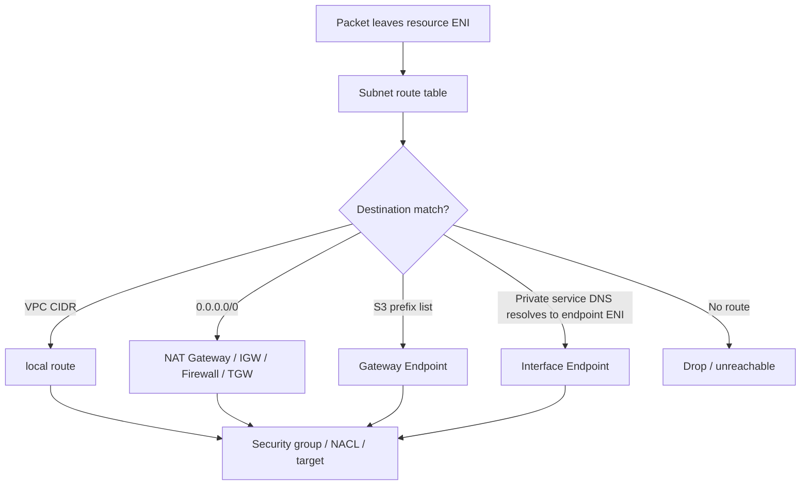
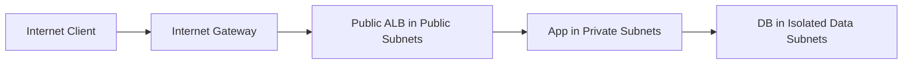
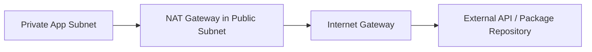
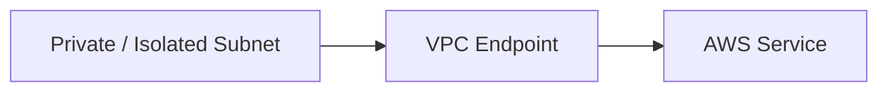
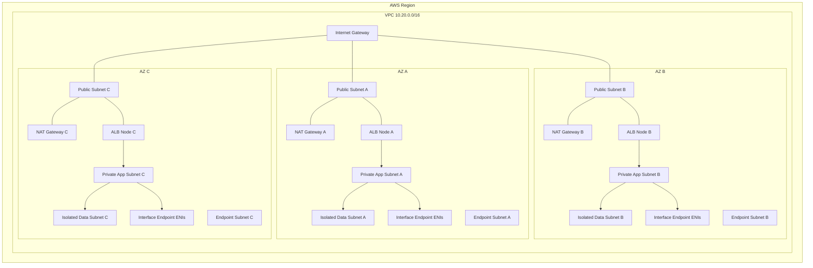
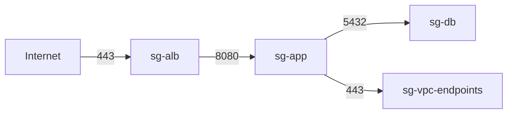
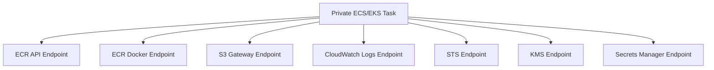
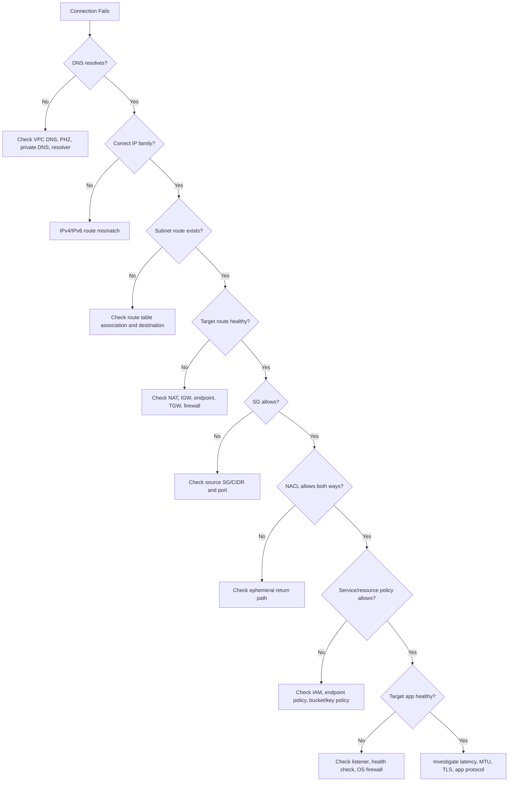

------
title: Learn AWS Engineering Mastery - Part 007
description: Deep dive into AWS VPC networking foundations: VPCs, CIDR planning, subnets, route tables, internet gateways, NAT gateways, security groups, NACLs, VPC endpoints, DNS, and failure-domain-aware network design.
series: learn-aws
seriesTitle: Learn AWS Engineering Mastery
order: 7
partTitle: Networking Foundations: VPC, Subnets, Routing, and Endpoints
tags:
- aws
- vpc
- networking
- subnets
- routing
- private-networking
- platform-engineering
- cloud-architecture
date: 2026-06-30
---

# Part 007 — Networking Foundations: VPC, Subnets, Routing, and Endpoints

## 1. Target Skill

AWS networking terlihat seperti “membuat VPC, subnet, route table, security group”. Itu benar untuk tutorial, tetapi tidak cukup untuk production engineering.

Target part ini:

> Mampu mendesain VPC sebagai private network substrate yang aman, tersegmentasi, quota-aware, mudah dioperasikan, dan tidak memperbesar blast radius saat sistem berkembang.

Setelah part ini, Anda harus mampu:

1. Menjelaskan VPC sebagai boundary jaringan logis, bukan sekadar container untuk EC2.
2. Mendesain CIDR, subnet, route table, dan Availability Zone layout dengan growth dan failure domain sebagai pertimbangan utama.
3. Membedakan public subnet, private subnet, isolated subnet, dan subnet khusus endpoint/inspection.
4. Mendesain routing untuk internet access, private service access, egress-only IPv6, dan VPC endpoints.
5. Menjelaskan interaksi antara route table, internet gateway, NAT gateway, endpoint, security group, NACL, dan DNS.
6. Menghindari anti-pattern umum: one route table for everything, public database subnet, NAT dependency tersembunyi, endpoint tidak lengkap, CIDR overlap, dan flat network.
7. Men-debug konektivitas dengan alur sistematis: name resolution → route → security group → NACL → endpoint/gateway → target health → service policy.
8. Menyusun network baseline yang reusable untuk banyak workload dan account.

Referensi resmi yang relevan:

- VPC route tables: https://docs.aws.amazon.com/vpc/latest/userguide/VPC_Route_Tables.html
- Subnet route table association: https://docs.aws.amazon.com/vpc/latest/userguide/subnet-route-tables.html
- Route table options: https://docs.aws.amazon.com/vpc/latest/userguide/route-table-options.html
- VPC subnets: https://docs.aws.amazon.com/vpc/latest/userguide/configure-subnets.html
- VPC security groups: https://docs.aws.amazon.com/vpc/latest/userguide/vpc-security-groups.html
- Network ACLs: https://docs.aws.amazon.com/vpc/latest/userguide/vpc-network-acls.html
- Internet gateways: https://docs.aws.amazon.com/vpc/latest/userguide/VPC_Internet_Gateway.html
- NAT gateways: https://docs.aws.amazon.com/vpc/latest/userguide/vpc-nat-gateway.html
- Gateway VPC endpoints: https://docs.aws.amazon.com/vpc/latest/privatelink/gateway-endpoints.html
- Interface VPC endpoints: https://docs.aws.amazon.com/vpc/latest/privatelink/create-interface-endpoint.html
- AWS PrivateLink concepts: https://docs.aws.amazon.com/vpc/latest/privatelink/concepts.html
- VPC DNS attributes: https://docs.aws.amazon.com/vpc/latest/userguide/vpc-dns.html

---

## 2. Kaufman Framing: Deconstruct AWS Networking

AWS networking tidak perlu dipelajari dengan menghafal semua fitur sekaligus. Deconstruct menjadi sub-skill berikut.

```mermaid
flowchart TD
    A[AWS Networking Foundations] --> B[Addressing]
    A --> C[Subnet Topology]
    A --> D[Routing]
    A --> E[Security Filtering]
    A --> F[Private Service Access]
    A --> G[DNS]
    A --> H[Troubleshooting]

    B --> B1[VPC CIDR]
    B --> B2[Subnet CIDR]
    B --> B3[IPv4]
    B --> B4[IPv6]
    B --> B5[Overlap Avoidance]

    C --> C1[AZ Layout]
    C --> C2[Public Subnet]
    C --> C3[Private Subnet]
    C --> C4[Isolated Subnet]
    C --> C5[Endpoint Subnet]

    D --> D1[Local Route]
    D --> D2[Internet Gateway]
    D --> D3[NAT Gateway]
    D --> D4[VPC Endpoint]
    D --> D5[Route Priority]

    E --> E1[Security Group]
    E --> E2[NACL]
    E --> E3[Endpoint Policy]
    E --> E4[Resource Policy]

    F --> F1[Gateway Endpoint]
    F --> F2[Interface Endpoint]
    F --> F3[Private DNS]
    F --> F4[Endpoint Policy]

    G --> G1[VPC DNS Attributes]
    G --> G2[AmazonProvidedDNS]
    G --> G3[Private Hosted Zone]
    G --> G4[Resolver]

    H --> H1[DNS]
    H --> H2[Route]
    H --> H3[SG]
    H --> H4[NACL]
    H --> H5[Service Policy]
```



Minimum useful knowledge untuk mulai praktik:

1. VPC memiliki CIDR.
2. Subnet berada di satu AZ.
3. Route table menentukan next hop outbound dari subnet.
4. Security group stateful dan melekat ke ENI/resource.
5. NACL stateless dan melekat ke subnet.
6. Internet Gateway memberi jalan ke internet untuk resource yang punya public addressing dan route yang sesuai.
7. NAT Gateway memberi private subnet jalan keluar ke internet IPv4 tanpa menerima koneksi inbound dari internet.
8. VPC endpoint memungkinkan private access ke AWS services tanpa melewati internet path.

Deliberate practice-nya: bangun satu VPC kecil, rusak satu komponen, prediksi efeknya, lalu buktikan dengan test konektivitas.

---

## 3. Mental Model: VPC sebagai Private Network Substrate

VPC adalah private network logis di dalam satu Region AWS. Dalam VPC, Anda mengatur address space, subnet, routing, security filtering, dan beberapa integrasi DNS/connectivity.

Cara berpikir yang lebih berguna:

> VPC adalah boundary tempat workload network identity, routeability, dan blast radius mulai dibentuk.

Bukan:

> VPC adalah tempat menaruh EC2.

VPC dipakai oleh banyak layanan AWS:

- EC2
- RDS
- ElastiCache
- EKS worker node dan pod networking
- ECS tasks dengan `awsvpc` mode
- Lambda dalam VPC
- Interface VPC endpoints
- Load balancer
- Directory Service
- OpenSearch VPC domain
- MSK
- Private API Gateway integration melalui VPC Link

Konsekuensinya:

1. Kesalahan VPC bukan hanya memengaruhi instance.
2. Kesalahan CIDR bisa menghambat merger, hybrid connectivity, multi-account expansion, dan shared service architecture.
3. Kesalahan route table bisa menjadi outage total walaupun aplikasi dan database sehat.
4. Kesalahan endpoint bisa menyebabkan traffic private diam-diam keluar lewat NAT dan menambah biaya/risiko.
5. Kesalahan security group/NACL bisa menciptakan false confidence: route sudah benar, tetapi traffic tetap gagal.

---

## 4. Network Invariants yang Harus Selalu Benar

Gunakan invariants sebagai cara berpikir. Jika invariant dilanggar, desain network mulai rapuh.

| Invariant | Penjelasan | Risiko Jika Dilanggar |
|---|---|---|
| Setiap subnet hanya berada di satu AZ | Subnet adalah unit AZ-local | Salah memahami HA; menaruh semua workload efektif di satu failure domain |
| Setiap subnet harus punya route table association | Explicit atau implicit ke main route table | Route tidak jelas, perubahan main table berdampak luas |
| Main route table tidak boleh menjadi production catch-all | Gunakan custom route table eksplisit per tier | Perubahan tidak sengaja bisa mengubah banyak subnet |
| Public subnet hanya untuk edge resources | Load balancer, NAT gateway, bastion khusus jika benar-benar perlu | EC2/app/database terekspos internet |
| Private app subnet tidak menerima direct inbound dari internet | Ingress harus lewat ALB/NLB/API gateway/CloudFront | Attack surface melebar |
| Database/cache subnet isolated atau private-restricted | Hanya menerima dari app/security group tertentu | Data plane terekspos lebih luas dari kebutuhan |
| NAT bukan security boundary | NAT memberi outbound path, bukan policy engine komprehensif | Egress tidak terkontrol |
| Endpoint harus diperlakukan sebagai access path | Endpoint policy dan resource policy tetap penting | Private path tanpa authorization constraint |
| CIDR tidak boleh overlap dengan network masa depan | Hybrid, peering, TGW, shared services perlu non-overlap | Migration mahal dan terkunci |

---

## 5. Core Building Blocks

### 5.1 VPC

VPC memiliki satu atau lebih CIDR block IPv4 dan bisa memiliki IPv6 CIDR. CIDR adalah alokasi address space yang akan dibagi menjadi subnet.

Desain VPC bukan sekadar memilih `10.0.0.0/16`. Pilihan CIDR harus mempertimbangkan:

1. Jumlah subnet per AZ.
2. Jumlah AZ yang dipakai.
3. Jumlah resource dengan ENI.
4. Pertumbuhan EKS/ECS/Lambda VPC networking.
5. Kebutuhan VPC endpoints.
6. Shared service account dan inspection VPC.
7. On-premises CIDR.
8. Partner/vendor/private connectivity.
9. Merger/acquisition/network federation.
10. Multi-region expansion.

### 5.2 Subnet

Subnet adalah potongan CIDR VPC yang berada di satu AZ. Anda biasanya membuat subnet berdasarkan dua dimensi:

1. **AZ**: `az-a`, `az-b`, `az-c`
2. **Tier**: public, private-app, private-data, endpoint, inspection

Contoh matrix:

| Tier | AZ A | AZ B | AZ C |
|---|---|---|---|
| Public edge | `10.20.0.0/24` | `10.20.1.0/24` | `10.20.2.0/24` |
| Private app | `10.20.10.0/23` | `10.20.12.0/23` | `10.20.14.0/23` |
| Private data | `10.20.30.0/24` | `10.20.31.0/24` | `10.20.32.0/24` |
| Endpoint | `10.20.40.0/24` | `10.20.41.0/24` | `10.20.42.0/24` |

Rule of thumb:

- App subnet biasanya butuh IP lebih banyak daripada database subnet.
- EKS subnet sering butuh kapasitas IP jauh lebih besar karena pod networking dapat mengonsumsi IP VPC.
- Interface endpoint membutuhkan ENI per subnet/AZ yang dipilih.
- Lambda dalam VPC dapat membuat kebutuhan ENI/IP yang perlu dirancang, meskipun model Lambda Hyperplane sudah jauh lebih efisien dibanding model historis.

### 5.3 Route Table

Route table mengontrol kemana traffic dari subnet diarahkan. AWS VPC memiliki implicit router, dan route table berisi rules.

Contoh route table public subnet:

| Destination | Target | Makna |
|---|---|---|
| `10.20.0.0/16` | local | Traffic internal VPC |
| `0.0.0.0/0` | `igw-...` | Default route IPv4 ke internet gateway |
| `::/0` | `igw-...` | Default route IPv6 ke internet gateway jika subnet IPv6 public |

Contoh route table private app subnet:

| Destination | Target | Makna |
|---|---|---|
| `10.20.0.0/16` | local | Traffic internal VPC |
| `0.0.0.0/0` | `nat-...` | Outbound IPv4 lewat NAT gateway |
| S3 prefix list | `vpce-...` | Traffic S3 lewat gateway endpoint |

Contoh route table isolated data subnet:

| Destination | Target | Makna |
|---|---|---|
| `10.20.0.0/16` | local | Hanya internal VPC |
| S3 prefix list | `vpce-...` | Optional backup/export ke S3 private path |

### 5.4 Internet Gateway

Internet Gateway memungkinkan komunikasi antara VPC dan internet. Untuk resource IPv4 bisa reachable dari internet, biasanya dibutuhkan:

1. Route table subnet memiliki `0.0.0.0/0` menuju IGW.
2. Resource memiliki public IPv4 atau Elastic IP.
3. Security group mengizinkan inbound.
4. NACL mengizinkan inbound dan ephemeral return traffic.
5. OS firewall tidak memblokir.
6. Aplikasi listen pada interface/port yang tepat.

Public subnet bukan berarti semua resource otomatis public. Public subnet berarti subnet memiliki route ke IGW. Resource tetap perlu public address dan izin security.

### 5.5 NAT Gateway

NAT Gateway memberikan outbound IPv4 untuk resource di private subnet tanpa membuat resource tersebut menerima inbound connection dari internet.

Kegunaan umum:

- Patch package dari internet repository.
- Pull image dari public registry.
- Call API pihak ketiga.
- Download dependency sementara.

Batas penting:

- NAT Gateway bukan firewall aplikasi.
- NAT Gateway bukan allowlist domain-aware.
- NAT Gateway bisa menjadi cost hotspot karena data processing charge.
- NAT Gateway harus didesain per-AZ untuk mengurangi cross-AZ dependency dan biaya data transfer.
- NAT failure dapat memutus outbound dependency aplikasi walaupun service internal sehat.

### 5.6 Security Group

Security group adalah virtual firewall stateful yang melekat ke ENI/resource.

Ciri penting:

- Stateful: return traffic otomatis diizinkan.
- Rule adalah allow rules; tidak ada explicit deny di security group.
- Bisa refer ke security group lain sebagai source/destination.
- Cocok untuk application-level segmentation: ALB → app → database.

Pattern yang baik:

```text
sg-alb-public
  inbound: 443 from internet/client CIDR
  outbound: 8080 to sg-app

sg-app
  inbound: 8080 from sg-alb-public
  outbound: 5432 to sg-db
  outbound: 443 to vpce/aws-services

sg-db
  inbound: 5432 from sg-app
  outbound: minimal, often default removed when feasible
```

### 5.7 Network ACL

NACL adalah stateless firewall di subnet boundary.

Ciri penting:

- Stateless: inbound dan outbound harus eksplisit.
- Rule dievaluasi berdasarkan nomor rule dari kecil ke besar.
- Bisa allow dan deny.
- Berlaku untuk seluruh subnet.
- Sering dipakai sebagai coarse-grained subnet boundary, bukan primary app segmentation.

Jangan pakai NACL sebagai pengganti security group untuk policy detail. NACL cocok untuk:

1. Deny subnet-level terhadap CIDR tertentu.
2. Guardrail tambahan pada subnet sensitif.
3. Membatasi traffic dari/to range besar.
4. Emergency block sederhana.

### 5.8 Elastic Network Interface

ENI adalah network attachment. Banyak resource AWS membuat/menggunakan ENI:

- EC2 instance.
- Load balancer nodes.
- RDS ENI.
- Lambda VPC networking.
- ECS task `awsvpc` mode.
- EKS worker nodes dan pods.
- Interface VPC endpoints.

Kenapa penting? Karena security group melekat ke ENI/resource, IP capacity habis karena ENI/IP allocation, dan troubleshooting sering berhenti di ENI attachment.

---

## 6. Public, Private, dan Isolated Subnet

### 6.1 Public Subnet

Subnet disebut public jika route table-nya memiliki route ke Internet Gateway.

Resource yang cocok:

- NAT Gateway.
- Internet-facing ALB/NLB.
- Bastion/management host khusus jika tidak bisa memakai Session Manager.
- Edge inspection appliance jika arsitektur mengharuskan.

Resource yang biasanya tidak cocok:

- Application server.
- Database.
- Cache.
- Internal queue processor.
- Internal API.
- EKS node umum.

### 6.2 Private Subnet

Subnet disebut private jika tidak memiliki direct route ke IGW, tetapi mungkin memiliki outbound route lewat NAT Gateway atau private connectivity.

Resource yang cocok:

- Application workload.
- ECS tasks.
- EKS nodes/private pods.
- Internal service.
- Worker/consumer.
- Lambda VPC integration.

Private subnet sering masih punya outbound internet via NAT. Itu berarti private dari sisi inbound internet, bukan berarti tidak ada egress internet.

### 6.3 Isolated Subnet

Subnet isolated tidak memiliki route default ke IGW atau NAT. Hanya local VPC route, endpoint route tertentu, atau private network route tertentu.

Resource yang cocok:

- Database.
- Cache.
- Internal control data store.
- Compliance-sensitive workload.
- Internal-only service yang tidak perlu internet.

Isolated subnet adalah cara baik untuk memaksa dependency dipikirkan eksplisit. Jika workload butuh S3, tambahkan S3 endpoint. Jika butuh Secrets Manager, tambahkan interface endpoint. Jika butuh internet umum, pertanyakan ulang.

---

## 7. CIDR Planning: Jangan Merancang untuk Hari Pertama Saja

CIDR planning adalah salah satu keputusan AWS yang sulit diubah setelah workload besar berjalan.

### 7.1 Kesalahan Umum

| Kesalahan | Efek Jangka Panjang |
|---|---|
| Semua account memakai `10.0.0.0/16` | Tidak bisa peering/TGW tanpa overlap |
| Subnet terlalu kecil untuk EKS | Pod scheduling gagal karena IP exhaustion |
| Tidak menyisakan ruang untuk endpoint subnet | Endpoint bercampur dengan app subnet, capacity dan policy menjadi kabur |
| Menggunakan range yang konflik dengan on-prem | Hybrid connectivity jadi mahal/rumit |
| Tidak mendesain per-Region allocation | Multi-region sulit distandardisasi |

### 7.2 Contoh Alokasi CIDR Multi-Account

Misalnya organisasi memilih `10.0.0.0/8` sebagai private super-range internal. Jangan langsung berikan `/16` acak. Buat registry.

```text
10.10.0.0/16   shared-network-prod-ap-southeast-1
10.11.0.0/16   shared-network-nonprod-ap-southeast-1
10.20.0.0/16   workload-payments-prod-ap-southeast-1
10.21.0.0/16   workload-payments-nonprod-ap-southeast-1
10.30.0.0/16   workload-case-prod-ap-southeast-1
10.31.0.0/16   workload-case-nonprod-ap-southeast-1
10.80.0.0/16   inspection-prod-ap-southeast-1
10.90.0.0/16   sandbox-pool
```

Prinsip:

1. Pisahkan prod dan non-prod.
2. Pisahkan shared network dan workload network.
3. Sisakan range untuk future Regions.
4. Dokumentasikan ownership CIDR seperti Anda mendokumentasikan DNS domain.
5. Hindari overlap dengan on-prem, VPN partner, dan SaaS private connectivity.

### 7.3 Subnet Sizing

Contoh satu VPC `/16`:

```text
VPC: 10.20.0.0/16

Public edge:
  AZ A: 10.20.0.0/24
  AZ B: 10.20.1.0/24
  AZ C: 10.20.2.0/24

Private app:
  AZ A: 10.20.10.0/22
  AZ B: 10.20.14.0/22
  AZ C: 10.20.18.0/22

Private data:
  AZ A: 10.20.40.0/24
  AZ B: 10.20.41.0/24
  AZ C: 10.20.42.0/24

Endpoint:
  AZ A: 10.20.60.0/24
  AZ B: 10.20.61.0/24
  AZ C: 10.20.62.0/24

Reserved:
  10.20.100.0/22 and above
```

Ini hanya contoh. Jangan copy tanpa capacity model.

---

## 8. Routing Mental Model

Routing di VPC menjawab pertanyaan:

> Untuk destination CIDR/prefix ini, next hop-nya siapa?

Alur mental:



### 8.1 Local Route

Setiap route table memiliki route local untuk VPC CIDR. Ini memungkinkan traffic antar subnet dalam VPC selama security group/NACL/resource policy mengizinkan.

Implikasi:

- Memisahkan subnet tidak otomatis memblokir traffic antar subnet.
- Segmentasi utama tetap perlu security group, NACL, route appliance, atau service-level auth.
- Database di subnet berbeda dari app subnet tetap reachable jika SG membuka port.

### 8.2 Default Route

Default route `0.0.0.0/0` menangkap semua IPv4 destination yang tidak lebih spesifik.

Target umum:

- Internet Gateway untuk public subnet.
- NAT Gateway untuk private subnet.
- Transit Gateway untuk centralized egress/hybrid route.
- Gateway Load Balancer endpoint atau firewall endpoint untuk inspection pattern.

### 8.3 Route Table per Tier

Jangan gunakan satu route table untuk semua subnet. Minimal production baseline:

| Route Table | Associated Subnet | Default Route |
|---|---|---|
| `rtb-public-a` | public AZ A | IGW |
| `rtb-public-b` | public AZ B | IGW |
| `rtb-public-c` | public AZ C | IGW |
| `rtb-app-a` | app AZ A | NAT GW AZ A atau firewall path |
| `rtb-app-b` | app AZ B | NAT GW AZ B atau firewall path |
| `rtb-app-c` | app AZ C | NAT GW AZ C atau firewall path |
| `rtb-data-a` | data AZ A | no default route |
| `rtb-data-b` | data AZ B | no default route |
| `rtb-data-c` | data AZ C | no default route |

Route table per-AZ memberi kontrol lebih saat ada failure atau cutover.

---

## 9. Internet Access Pattern

### 9.1 Direct Public Ingress

Pattern:



Use case:

- Web application.
- Public API.
- Service yang memerlukan client internet.

Guardrail:

1. Hanya load balancer/edge resource di public subnet.
2. App tetap private.
3. Database isolated.
4. WAF di layer yang sesuai.
5. Security group chain harus eksplisit.
6. Access log aktif.

### 9.2 Private Outbound via NAT

Pattern:



Use case:

- Call third-party API.
- Pull public dependencies.
- OS package update.

Trade-off:

| Aspek | NAT Gateway |
|---|---|
| Simplicity | Tinggi |
| Security policy | Terbatas |
| Cost | Bisa tinggi pada data volume besar |
| Availability | Per-AZ design disarankan |
| Domain allowlist | Butuh tambahan proxy/firewall/DNS policy |

### 9.3 No Internet, Private AWS Service Access

Pattern:



Use case:

- Workload compliance-sensitive.
- Access S3, DynamoDB, Secrets Manager, SSM, ECR, CloudWatch, STS, KMS, etc.
- Mengurangi dependency ke NAT.
- Membatasi service access melalui endpoint policy.

---

## 10. VPC Endpoints

VPC endpoint adalah salah satu fitur paling penting untuk production AWS networking.

Tanpa endpoint, private workload sering membutuhkan NAT hanya untuk memanggil AWS service public endpoints. Dengan endpoint, traffic dapat memakai private path dalam AWS network.

### 10.1 Gateway Endpoint

Gateway endpoint digunakan untuk S3 dan DynamoDB.

Karakteristik:

- Target route table.
- Menambahkan route ke prefix list service.
- Tidak menggunakan ENI di subnet.
- Tidak ada hourly charge untuk gateway endpoint S3/DynamoDB.
- Bisa memakai endpoint policy.

Contoh use case:

- Private app upload/download ke S3.
- Database backup/export ke S3.
- Lambda/ECS/EKS workload membaca config dari S3.
- DynamoDB access dari private subnet tanpa NAT.

### 10.2 Interface Endpoint

Interface endpoint menggunakan AWS PrivateLink dan membuat ENI dengan private IP di subnet yang dipilih.

Karakteristik:

- Ada ENI per subnet/AZ.
- Menggunakan security group.
- Bisa mengaktifkan private DNS untuk service AWS tertentu.
- Ada hourly dan data processing cost.
- Cocok untuk banyak AWS services dan private endpoint services.

Service umum yang sering dibutuhkan workload private:

- STS.
- ECR API dan ECR Docker.
- CloudWatch Logs.
- Secrets Manager.
- Systems Manager.
- KMS.
- SQS.
- SNS.
- EventBridge.
- API Gateway private endpoint.

### 10.3 Gateway Load Balancer Endpoint

Gateway Load Balancer endpoint digunakan untuk menyisipkan virtual appliance seperti firewall/inspection appliance dalam traffic path.

Ini biasanya bukan baseline awal untuk semua workload. Gunakan saat ada kebutuhan inspection terpusat, third-party firewall, atau network appliance architecture.

### 10.4 Endpoint Policy

Endpoint policy menjawab:

> Request apa yang boleh melewati endpoint ini?

Jangan salah memahami:

- Endpoint policy bukan pengganti IAM identity policy.
- Endpoint policy bukan pengganti S3 bucket policy/KMS key policy.
- Effective access tetap hasil kombinasi identity policy, endpoint policy, resource policy, SCP, permission boundary, dan condition.

Contoh konsep policy:

```json
{
  "Statement": [
    {
      "Effect": "Allow",
      "Principal": "*",
      "Action": ["s3:GetObject", "s3:PutObject"],
      "Resource": ["arn:aws:s3:::company-prod-artifacts/*"]
    }
  ]
}
```

Production pattern lebih ketat biasanya memakai condition seperti `aws:PrincipalOrgID`, `aws:SourceVpce`, `aws:SourceVpc`, atau principal tertentu pada resource policy.

---

## 11. DNS dalam VPC

Banyak masalah network AWS sebenarnya masalah DNS.

### 11.1 VPC DNS Attributes

Dua attribute penting:

- `enableDnsSupport`
- `enableDnsHostnames`

Untuk kebanyakan workload modern, keduanya biasanya diaktifkan.

### 11.2 AmazonProvidedDNS

AWS menyediakan DNS resolver di VPC. Workload dalam VPC dapat resolve:

- Public DNS names.
- Private hosted zone records.
- AWS service endpoints.
- Private DNS dari interface endpoints jika enabled.

### 11.3 Private DNS untuk Interface Endpoint

Saat private DNS diaktifkan untuk interface endpoint, hostname service publik seperti:

```text
secretsmanager.ap-southeast-1.amazonaws.com
```

bisa resolve ke private IP endpoint di VPC, bukan public endpoint.

Ini membuat aplikasi tidak perlu mengubah endpoint URL, tetapi traffic path berubah menjadi private.

Failure mode:

1. Endpoint dibuat tetapi private DNS tidak aktif.
2. Security group endpoint menolak inbound dari app subnet.
3. App memakai custom DNS resolver yang tidak forward query ke Route 53 Resolver.
4. Private hosted zone konflik dengan public domain.
5. Conditional forwarding salah saat hybrid DNS.

---

## 12. Reference Architecture: Three-Tier VPC Baseline



Design notes:

1. Public subnet menampung ALB node dan NAT Gateway.
2. App subnet private, tidak punya direct route ke IGW.
3. Data subnet isolated, tidak punya default route.
4. Endpoint subnet menampung interface endpoint ENI agar capacity dan policy lebih jelas.
5. NAT per AZ menghindari dependency lintas AZ untuk egress.
6. Route table per tier dan per AZ memudahkan failure isolation.

---

## 13. Security Group Chain Pattern

Gunakan security group sebagai service-to-service contract.



Contoh rule:

| SG | Inbound | Outbound |
|---|---|---|
| `sg-alb` | `443` from `0.0.0.0/0` atau allowed CIDR | `8080` to `sg-app` |
| `sg-app` | `8080` from `sg-alb` | `5432` to `sg-db`, `443` to `sg-vpc-endpoints` |
| `sg-db` | `5432` from `sg-app` | minimal |
| `sg-vpc-endpoints` | `443` from `sg-app` | default atau restricted |

Keuntungan:

1. Rule mengikuti logical service, bukan hardcoded IP.
2. Scaling instance/task tidak perlu ubah rules.
3. Audit lebih mudah: “siapa boleh bicara ke siapa”.
4. Port exposure terlihat sebagai contract.

---

## 14. NACL: Kapan Dipakai?

Security group cukup untuk sebagian besar workload segmentation. NACL dipakai saat butuh subnet-level coarse control.

Contoh use case masuk akal:

1. Deny semua traffic dari CIDR partner yang sedang incident.
2. Blok subnet tertentu dari mengakses data subnet.
3. Menambahkan guardrail stateless pada subnet public.
4. Membatasi traffic ephemeral pada desain yang sangat regulated, dengan konsekuensi kompleksitas.

Anti-pattern:

- Membuat rule NACL terlalu granular sampai sulit dioperasikan.
- Lupa ephemeral ports untuk return traffic.
- Menggunakan NACL sebagai satu-satunya security layer.
- Menduplikasi semua security group rules ke NACL.

---

## 15. AWS Service Access from Private Subnets

Workload private biasanya perlu bicara ke AWS services.

Contoh ECS/EKS workload yang pull image dari ECR dan menulis log ke CloudWatch:



Jika endpoint tidak tersedia, traffic mungkin mencoba keluar lewat NAT. Jika NAT juga tidak ada, task gagal dengan error yang terlihat seperti aplikasi bermasalah:

- Cannot pull container image.
- Cannot retrieve secret.
- Timeout writing logs.
- Credential resolution timeout.
- TLS handshake timeout.
- Name resolution works, but connection timeout.

Troubleshooting harus melihat dependency platform, bukan hanya app logs.

---

## 16. Route and Security Troubleshooting Algorithm

Gunakan algoritma berikut saat konektivitas gagal.



Checklist cepat:

1. Resolve hostname dari resource yang sama.
2. Catat IP yang dikembalikan.
3. Lihat subnet route table resource source.
4. Lihat target route.
5. Validasi security group source dan target.
6. Validasi NACL subnet source dan target.
7. Validasi endpoint policy/resource policy.
8. Test port dengan tool minimal.
9. Periksa flow logs jika tersedia.
10. Periksa target health jika lewat load balancer.

---

## 17. VPC Flow Logs

VPC Flow Logs merekam metadata traffic pada VPC, subnet, atau ENI. Ini bukan packet capture penuh, tetapi sangat berguna untuk melihat accepted/rejected traffic.

Gunakan untuk:

- Membuktikan traffic sampai ENI atau tidak.
- Melihat reject karena SG/NACL.
- Melacak source/destination IP dan port.
- Audit traffic antar subnet.
- Menemukan unexpected egress.

Batas:

- Tidak berisi payload.
- Tidak menjelaskan DNS resolution.
- Tidak selalu cukup untuk troubleshooting application-layer.
- Harus dikorelasikan dengan logs aplikasi, ALB logs, Route 53 Resolver logs, dan CloudTrail.

---

## 18. Design Decision Matrix

### 18.1 Public vs Private vs Isolated

| Workload | Recommended Subnet | Alasan |
|---|---|---|
| Internet-facing ALB | Public | Harus menerima traffic internet via IGW |
| App service | Private | Ingress lewat ALB/API layer, outbound terbatas |
| Database | Isolated/private data | Tidak butuh direct internet |
| Cache | Isolated/private data | Internal-only latency-sensitive dependency |
| NAT Gateway | Public | Butuh EIP dan IGW path |
| Interface endpoint | Dedicated endpoint/private subnet | Clear capacity dan SG boundary |
| EKS nodes | Private app/subnet besar | Hindari public nodes; butuh IP capacity |
| Lambda VPC | Private/isolated sesuai dependency | Pilih subnet berdasarkan access path |

### 18.2 NAT vs Endpoint

| Need | NAT Gateway | VPC Endpoint |
|---|---|---|
| Call arbitrary internet API | Cocok | Tidak cocok |
| Access S3 privately | Bisa, tapi kurang ideal | Gateway endpoint ideal |
| Access AWS API privately | Bisa via public endpoint | Interface endpoint ideal |
| Domain-level egress filtering | Butuh tambahan | Tidak untuk arbitrary internet |
| Cost data besar ke S3 | Bisa mahal | Gateway endpoint lebih cocok |
| Strict private-only workload | Kurang cocok | Cocok |

### 18.3 SG vs NACL

| Need | Security Group | NACL |
|---|---|---|
| Service-to-service access | Sangat cocok | Kurang cocok |
| Stateful filtering | Ya | Tidak |
| Explicit deny | Tidak | Ya |
| Subnet-level guardrail | Terbatas | Cocok |
| Referensi SG lain | Ya | Tidak |
| Emergency CIDR block | Bisa terbatas | Cocok |

---

## 19. Common Failure Modes

### 19.1 Private Subnet Tidak Bisa Akses Internet

Kemungkinan:

1. Route table tidak punya `0.0.0.0/0` ke NAT.
2. Subnet associated ke route table yang salah.
3. NAT Gateway tidak available.
4. NAT berada di public subnet yang tidak punya route ke IGW.
5. Security group outbound terlalu ketat.
6. NACL tidak mengizinkan ephemeral return traffic.
7. DNS gagal resolve external hostname.

### 19.2 App Tidak Bisa Akses S3

Kemungkinan:

1. Tidak ada NAT dan tidak ada S3 gateway endpoint.
2. S3 endpoint tidak associated ke route table app subnet.
3. Endpoint policy menolak action/bucket.
4. Bucket policy membutuhkan `aws:SourceVpce` yang berbeda.
5. IAM role tidak punya permission S3/KMS.
6. Object encrypted dengan KMS key yang tidak mengizinkan principal.

### 19.3 Interface Endpoint Dibuat tetapi Timeout

Kemungkinan:

1. Private DNS tidak aktif, app masih resolve public endpoint.
2. Endpoint SG tidak mengizinkan inbound `443` dari app SG/subnet.
3. App subnet route tidak relevan untuk interface endpoint, tetapi DNS harus resolve ke endpoint ENI.
4. Endpoint dibuat hanya di AZ tertentu dan workload ada di AZ lain; cross-AZ masih bisa tetapi bisa menambah dependency/cost.
5. Endpoint policy menolak request.
6. NACL endpoint subnet menolak traffic.

### 19.4 Database Terlihat Private tetapi Terlalu Terbuka

Kemungkinan:

1. DB subnet tidak public, tetapi SG mengizinkan `0.0.0.0/0` dari VPC atau internet path lain.
2. Route local memungkinkan semua subnet dalam VPC reach DB jika SG/NACL membuka.
3. Shared VPC/subnet memberi akses ke account lain yang tidak diantisipasi.
4. Peering/TGW memperluas routeability tanpa update SG model.
5. Credentials lemah atau secret leakage membuat network private tidak cukup.

### 19.5 CIDR Overlap Saat Integrasi Hybrid

Efek:

1. Route tidak bisa dibuat atau ambiguous.
2. Peering/TGW design gagal.
3. Butuh NAT translation kompleks.
4. Migration subnet/renumbering mahal.
5. Partner integration delay.

Preventif:

- Central CIDR registry.
- Account vending dengan IPAM.
- Review sebelum VPC creation.
- Reservasi per Region/environment.

---

## 20. Production Baseline Checklist

Gunakan checklist ini sebelum VPC digunakan workload production.

### 20.1 Addressing

- [ ] CIDR tidak overlap dengan account/region/on-prem/partner.
- [ ] Subnet sizing memperhitungkan EKS/ECS/Lambda/endpoint growth.
- [ ] Ada reserved CIDR untuk future expansion.
- [ ] Ada dokumentasi ownership CIDR.

### 20.2 Subnet Layout

- [ ] Minimal 2 AZ untuk production, sering 3 AZ jika service dan cost mendukung.
- [ ] Public subnet hanya untuk edge/NAT resources.
- [ ] App subnet private.
- [ ] Data subnet isolated atau restricted.
- [ ] Endpoint subnet dipisah jika endpoint banyak.
- [ ] Route table eksplisit per tier/AZ.

### 20.3 Routing

- [ ] Public subnet route ke IGW.
- [ ] Private subnet route ke NAT/firewall/private path sesuai kebutuhan.
- [ ] Data subnet tidak punya default route kecuali justified.
- [ ] S3/DynamoDB gateway endpoint associated ke route table yang benar.
- [ ] Route table main tidak menjadi catch-all production.

### 20.4 Security

- [ ] Security group chain berbasis service, bukan IP random.
- [ ] Tidak ada database/cache inbound dari `0.0.0.0/0`.
- [ ] NACL tidak terlalu kompleks tanpa alasan kuat.
- [ ] Endpoint policy diterapkan untuk endpoint sensitif.
- [ ] VPC Flow Logs aktif untuk environment penting.

### 20.5 DNS

- [ ] VPC DNS support dan hostnames sesuai kebutuhan.
- [ ] Private hosted zone association terdokumentasi.
- [ ] Interface endpoint private DNS diverifikasi.
- [ ] Hybrid DNS forwarding diuji jika ada on-prem.

### 20.6 Operations

- [ ] Runbook connectivity tersedia.
- [ ] NAT/endpoint metrics dan logs dipantau.
- [ ] Route changes melalui IaC/review.
- [ ] Diagram network selalu diupdate dari source of truth.
- [ ] Flow Logs retention dan query mechanism tersedia.

---

## 21. IaC Skeleton: VPC Module Interface

Jangan mulai dari resource detail. Mulai dari interface module.

```hcl
module "vpc" {
  source = "../modules/network/vpc"

  name        = "case-prod-ap-southeast-1"
  cidr_block  = "10.30.0.0/16"
  az_count    = 3

  public_subnets = {
    "az-a" = "10.30.0.0/24"
    "az-b" = "10.30.1.0/24"
    "az-c" = "10.30.2.0/24"
  }

  private_app_subnets = {
    "az-a" = "10.30.10.0/22"
    "az-b" = "10.30.14.0/22"
    "az-c" = "10.30.18.0/22"
  }

  private_data_subnets = {
    "az-a" = "10.30.40.0/24"
    "az-b" = "10.30.41.0/24"
    "az-c" = "10.30.42.0/24"
  }

  endpoint_subnets = {
    "az-a" = "10.30.60.0/24"
    "az-b" = "10.30.61.0/24"
    "az-c" = "10.30.62.0/24"
  }

  enable_nat_gateway_per_az = true
  enable_s3_endpoint        = true
  enable_dynamodb_endpoint  = true

  interface_endpoints = [
    "com.amazonaws.ap-southeast-1.ecr.api",
    "com.amazonaws.ap-southeast-1.ecr.dkr",
    "com.amazonaws.ap-southeast-1.logs",
    "com.amazonaws.ap-southeast-1.secretsmanager",
    "com.amazonaws.ap-southeast-1.kms",
    "com.amazonaws.ap-southeast-1.sts",
    "com.amazonaws.ap-southeast-1.ssm",
    "com.amazonaws.ap-southeast-1.ssmmessages",
    "com.amazonaws.ap-southeast-1.ec2messages"
  ]

  tags = {
    Environment = "prod"
    Workload    = "case-management"
    ManagedBy   = "terraform"
  }
}
```

Module harus expose outputs:

- VPC ID.
- Subnet IDs per tier/AZ.
- Route table IDs per tier/AZ.
- Security group IDs untuk endpoints.
- CIDR metadata.
- Endpoint IDs.

Jangan biarkan consumer module memilih subnet berdasarkan urutan list acak. Expose map by AZ/tier agar eksplisit.

---

## 22. Deliberate Practice

### Exercise 1 — Build and Break Routing

Bangun VPC dengan:

- 2 public subnets.
- 2 private app subnets.
- 2 isolated data subnets.
- 1 NAT Gateway per AZ.
- S3 gateway endpoint.

Lalu lakukan:

1. Deploy test instance/container di private subnet.
2. Test akses internet.
3. Hapus route NAT.
4. Prediksi error.
5. Restore route.
6. Tambahkan S3 endpoint.
7. Paksa akses S3 lewat endpoint dengan bucket policy `aws:SourceVpce`.

Target belajar: membedakan route failure, endpoint policy failure, dan IAM failure.

### Exercise 2 — Endpoint Dependency Mapping

Ambil satu workload container private. Daftar semua AWS API yang dipakai:

- Pull image.
- Fetch secret.
- Decrypt KMS.
- Write logs.
- Assume role/call STS.
- Publish event.

Untuk setiap dependency, tentukan:

| Dependency | Endpoint Needed | Fallback via NAT? | Policy Constraint |
|---|---|---|---|
| ECR API | Interface endpoint | Ya | IAM role |
| ECR Docker | Interface endpoint | Ya | IAM role |
| S3 layer storage | Gateway endpoint | Ya | bucket policy/source endpoint |
| Logs | Interface endpoint | Ya | log group IAM |
| Secrets Manager | Interface endpoint | Ya | secret resource policy/KMS |

Target belajar: network dependency tersembunyi.

### Exercise 3 — Connectivity Debug Drill

Buat app private tidak bisa akses database. Pecahkan dengan hipotesis berurutan:

1. DNS salah.
2. Route salah.
3. SG app outbound salah.
4. SG DB inbound salah.
5. NACL return traffic salah.
6. DB listener salah.
7. Credential salah.

Catat sinyal yang membedakan masing-masing.

---

## 23. Anti-Patterns

### 23.1 Flat VPC

Semua resource di subnet yang sama, route table sama, SG longgar.

Efek:

- Sulit audit.
- Blast radius besar.
- Tidak ada tier boundary.
- Migration ke multi-account sulit.

### 23.2 Public App Subnet by Convenience

App server diberi public IP agar “mudah SSH/debug”.

Efek:

- Attack surface meningkat.
- Security bergantung pada SG/patching host.
- Access path sulit dikontrol.
- Melanggar operational access model modern.

Gunakan Systems Manager Session Manager, private access, atau controlled bastion bila benar-benar perlu.

### 23.3 NAT Everything

Semua private AWS service call keluar via NAT.

Efek:

- Cost tinggi.
- Private path tidak dimanfaatkan.
- Endpoint policy tidak ada.
- Sulit menegakkan data perimeter.

### 23.4 One Route Table to Rule Them All

Semua subnet memakai main route table.

Efek:

- Perubahan kecil berdampak luas.
- Public/private/data boundary tidak jelas.
- Sulit isolate subnet.

### 23.5 Overusing NACL

NACL menjadi ratusan rule detail.

Efek:

- Troubleshooting lambat.
- Ephemeral port sering salah.
- Rule ordering rawan.
- Security intent tidak terbaca.

### 23.6 CIDR Without Registry

Setiap tim memilih CIDR sendiri.

Efek:

- Overlap.
- Peering/TGW gagal.
- Hybrid complexity.
- Renumbering mahal.

---

## 24. Self-Correction Checklist ala Kaufman

Setelah belajar part ini, uji diri dengan pertanyaan berikut.

1. Bisa menjelaskan kenapa subnet public bukan berarti instance pasti public?
2. Bisa menggambar route path dari private app ke S3 lewat gateway endpoint?
3. Bisa menjelaskan kenapa database subnet berbeda belum tentu aman?
4. Bisa membedakan security group dan NACL dalam satu menit?
5. Bisa menjelaskan kenapa NAT Gateway bukan firewall?
6. Bisa menyebut minimal endpoint untuk private ECS/EKS workload yang pull ECR dan write CloudWatch Logs?
7. Bisa men-debug timeout ke Secrets Manager dari private subnet?
8. Bisa membaca route table dan memprediksi path traffic?
9. Bisa menjelaskan dampak CIDR overlap terhadap Transit Gateway/peering?
10. Bisa membuat subnet layout 3 AZ untuk workload regulated?

Jika belum, ulangi bagian terkait dan lakukan deliberate practice.

---

## 25. Engineering Judgment Summary

AWS VPC networking yang baik bukan yang paling kompleks. Yang baik adalah yang:

1. Memiliki boundary jelas.
2. Mempunyai CIDR yang bisa tumbuh.
3. Memakai subnet sebagai failure/tier layout, bukan dekorasi.
4. Memisahkan public edge, private app, dan data tier.
5. Mengurangi internet dependency melalui VPC endpoints.
6. Menjadikan route table eksplisit dan reviewable.
7. Memakai security group sebagai service contract.
8. Memakai NACL secukupnya sebagai coarse guardrail.
9. Memiliki DNS model yang dipahami.
10. Mudah di-debug saat incident.

Mental model akhir:

> Network design di AWS adalah pengelolaan routeability, identity, policy, DNS, dan failure domain. VPC hanya permukaannya; engineering judgment ada pada boundary dan consequences.

Part berikutnya akan membawa network ini ke boundary yang menghadap user dan internet: DNS, edge, ingress, load balancer, CloudFront, WAF, dan egress control.
