------
title: Learn AWS Engineering Mastery - Part 008
description: Deep dive into AWS network edge architecture: Route 53, CloudFront, load balancers, API ingress, TLS, WAF, Shield, DNS failover, ingress patterns, egress control, and edge operational failure modes.
series: learn-aws
seriesTitle: Learn AWS Engineering Mastery
order: 8
partTitle: Network Edge, DNS, Ingress, and Egress Control
tags:
- aws
- networking
- route-53
- cloudfront
- load-balancing
- waf
- ingress
- egress
- dns
- platform-engineering
date: 2026-06-30
---

# Part 008 — Network Edge, DNS, Ingress, and Egress Control

## 1. Target Skill

Di Part 007, kita membangun network substrate: VPC, subnet, route table, security group, NACL, NAT, dan endpoint. Di part ini, kita naik ke boundary traffic: bagaimana user, partner, service eksternal, dan workload internal masuk/keluar dengan aman, cepat, observable, dan recoverable.

Target part ini:

> Mampu mendesain edge, DNS, ingress, dan egress AWS sebagai traffic control plane yang aman, resilient, dan bisa dioperasikan saat incident.

Setelah part ini, Anda harus mampu:

1. Menjelaskan peran Route 53, CloudFront, Elastic Load Balancing, API Gateway, WAF, Shield, dan NAT/Firewall dalam traffic architecture.
2. Memilih antara CloudFront, ALB, NLB, API Gateway, AppSync, dan PrivateLink untuk ingress use case yang berbeda.
3. Mendesain DNS records, alias, TTL, routing policy, dan health-check-aware failover.
4. Menentukan lokasi TLS termination dan certificate ownership.
5. Menempatkan WAF di layer yang benar dan memahami limitasinya.
6. Mendesain egress control yang lebih baik dari “semua private subnet pakai NAT”.
7. Membedakan internet-facing ingress, private ingress, service-to-service ingress, partner ingress, dan administrative ingress.
8. Men-debug edge incident: DNS, CDN cache, WAF block, load balancer health, TLS, route, target, dan application response.

Referensi resmi yang relevan:

- Route 53 routing to ELB alias: https://docs.aws.amazon.com/Route53/latest/DeveloperGuide/routing-to-elb-load-balancer.html
- Route 53 health checks and DNS failover: https://docs.aws.amazon.com/Route53/latest/DeveloperGuide/dns-failover.html
- CloudFront Developer Guide: https://docs.aws.amazon.com/AmazonCloudFront/latest/DeveloperGuide/Introduction.html
- CloudFront origin access control: https://docs.aws.amazon.com/AmazonCloudFront/latest/DeveloperGuide/private-content-restricting-access-to-s3.html
- Elastic Load Balancing overview: https://docs.aws.amazon.com/elasticloadbalancing/latest/userguide/what-is-load-balancing.html
- Application Load Balancer: https://docs.aws.amazon.com/elasticloadbalancing/latest/application/introduction.html
- Network Load Balancer: https://docs.aws.amazon.com/elasticloadbalancing/latest/network/introduction.html
- AWS WAF: https://docs.aws.amazon.com/waf/latest/developerguide/waf-chapter.html
- AWS Shield and Shield Advanced: https://docs.aws.amazon.com/waf/latest/developerguide/ddos-overview.html
- Centralized egress: https://docs.aws.amazon.com/prescriptive-guidance/latest/transitioning-to-multiple-aws-accounts/centralized-egress.html
- Centralized network firewall: https://docs.aws.amazon.com/prescriptive-guidance/latest/robust-network-design-control-tower/firewall.html

---

## 2. Kaufman Framing: Deconstruct the Edge

Edge architecture bisa terlihat luas. Pecah menjadi sub-skill berikut.

```mermaid
flowchart TD
    A[AWS Edge and Traffic Control] --> B[DNS]
    A --> C[CDN]
    A --> D[Ingress]
    A --> E[TLS]
    A --> F[WAF and DDoS]
    A --> G[Egress]
    A --> H[Observability]
    A --> I[Failure Handling]

    B --> B1[Hosted Zone]
    B --> B2[Alias Record]
    B --> B3[TTL]
    B --> B4[Routing Policy]
    B --> B5[Health Checks]

    C --> C1[CloudFront Distribution]
    C --> C2[Cache Behavior]
    C --> C3[Origin]
    C --> C4[OAC/OAI]
    C --> C5[Invalidation]

    D --> D1[ALB]
    D --> D2[NLB]
    D --> D3[API Gateway]
    D --> D4[AppSync]
    D --> D5[PrivateLink]

    E --> E1[ACM]
    E --> E2[Termination Layer]
    E --> E3[End-to-End TLS]
    E --> E4[mTLS]

    F --> F1[AWS WAF]
    F --> F2[Managed Rules]
    F --> F3[Rate Limit]
    F --> F4[Shield]

    G --> G1[NAT]
    G --> G2[VPC Endpoint]
    G --> G3[Proxy]
    G --> G4[Network Firewall]
    G --> G5[Centralized Egress]

    H --> H1[Access Logs]
    H --> H2[Metrics]
    H --> H3[Traces]
    H --> H4[DNS Query Logs]

    I --> I1[DNS Failover]
    I --> I2[Origin Failover]
    I --> I3[Health Check]
    I --> I4[Rollback]
```

Minimum useful knowledge:

1. DNS mengarahkan nama ke endpoint, tetapi bukan load balancer cerdas untuk semua kondisi.
2. CloudFront adalah edge distribution/cache/security layer di depan origin.
3. ALB cocok untuk HTTP/HTTPS L7 routing.
4. NLB cocok untuk TCP/UDP/TLS L4, high performance, static IP-style use cases, dan preserving source IP untuk beberapa pattern.
5. API Gateway cocok untuk managed API front door dengan auth, throttling, usage plan, transformation, dan serverless integration.
6. WAF memfilter HTTP(S), bukan semua traffic jaringan.
7. Egress harus dianggap data exfiltration path, bukan sekadar “outbound internet”.

---

## 3. Mental Model: Traffic Boundary as a System

Traffic boundary menjawab empat pertanyaan:

1. **Siapa boleh masuk?**
2. **Lewat jalur apa?**
3. **Diperiksa oleh kontrol apa?**
4. **Jika gagal, bagaimana traffic dialihkan atau dihentikan dengan aman?**

Diagram konseptual:

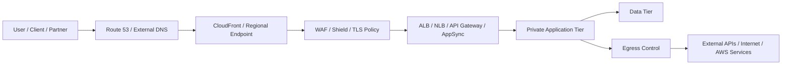

Edge architecture bukan hanya inbound. Sistem production juga harus mengontrol outbound, karena banyak incident besar terjadi melalui:

- dependency eksternal yang down;
- egress yang tidak diaudit;
- data exfiltration;
- malware callback;
- package supply-chain callout;
- third-party API latency;
- NAT cost spike;
- DNS poisoning/misconfiguration;
- expired certificate;
- CDN cache menyajikan content stale/salah.

---

## 4. Route 53: DNS sebagai First Control Point

Amazon Route 53 adalah authoritative DNS service AWS, juga menyediakan health checks dan routing policies. Dalam architecture, DNS adalah layer pertama yang sering disentuh user.

### 4.1 Hosted Zone

Hosted zone adalah container record untuk domain.

Jenis:

| Hosted Zone | Kegunaan |
|---|---|
| Public hosted zone | Record resolvable dari internet |
| Private hosted zone | Record resolvable dari VPC yang associated |

Private hosted zone berguna untuk internal service discovery seperti:

```text
api.internal.company.local
orders.service.internal
postgres.case.prod.internal
```

Tetapi hati-hati:

- Private hosted zone dapat konflik dengan public domain.
- Association ke VPC harus jelas.
- Hybrid DNS perlu conditional forwarding.
- Split-horizon DNS bisa membingungkan incident response jika tidak terdokumentasi.

### 4.2 Record Types and Alias

Record umum:

| Record | Kegunaan |
|---|---|
| A | Name ke IPv4 |
| AAAA | Name ke IPv6 |
| CNAME | Alias ke DNS name lain, bukan zone apex |
| TXT | Verifikasi domain, SPF/DKIM, metadata |
| MX | Email routing |
| NS | Delegasi nameserver |
| SRV | Service discovery tertentu |

Route 53 alias record adalah extension yang dapat menunjuk ke AWS resources seperti ELB dan CloudFront. Alias dapat digunakan di zone apex, sedangkan CNAME biasa tidak bisa untuk root domain.

Contoh:

```text
example.com      A/AAAA Alias -> CloudFront distribution
api.example.com  A/AAAA Alias -> ALB
internal.example.com Private Hosted Zone -> internal ALB
```

### 4.3 TTL

TTL menentukan berapa lama resolver/cache menyimpan jawaban DNS.

Trade-off:

| TTL | Kelebihan | Kekurangan |
|---|---|---|
| Rendah | Failover/cutover lebih cepat | Query volume lebih tinggi, resolver behavior tetap tidak selalu instan |
| Tinggi | Query lebih sedikit, stabil | Cutover/failover lebih lambat |

TTL bukan tombol real-time. Banyak client, resolver, SDK, atau OS punya caching behavior sendiri. Untuk failover kritikal, jangan hanya mengandalkan TTL; desain health check, regional failover, client retry, dan data replication.

### 4.4 Routing Policies

Route 53 menyediakan beberapa routing policy. Gunakan berdasarkan intent.

| Policy | Intent |
|---|---|
| Simple | Satu endpoint sederhana |
| Weighted | Gradual shift, canary DNS, traffic split kasar |
| Latency-based | Arahkan ke region dengan latency rendah |
| Failover | Primary/secondary berdasarkan health check |
| Geolocation | Routing berdasarkan lokasi user |
| Geoproximity | Routing berbasis lokasi dan bias traffic |
| Multivalue answer | Beberapa healthy records sebagai simple load distribution |
| IP-based | Routing berdasarkan CIDR source resolver/client context tertentu |

DNS routing policy bukan pengganti service discovery internal yang butuh low-latency, per-request load balancing, atau circuit breaking. DNS bekerja pada level resolver/cache, bukan setiap request aplikasi.

---

## 5. CloudFront: Edge Distribution, Cache, and Security Layer

CloudFront adalah CDN dan edge front door yang dapat diletakkan di depan origin seperti S3, ALB, API Gateway, custom HTTP origin, atau origin lain.

### 5.1 Apa yang CloudFront Berikan

1. Edge caching.
2. Global request termination dekat user.
3. TLS termination di edge.
4. HTTP/2 dan HTTP/3 support tergantung konfigurasi/fitur saat digunakan.
5. Origin shielding dan origin request reduction.
6. Integration dengan AWS WAF.
7. Signed URL/cookie untuk private content.
8. Origin Access Control untuk S3 private origin.
9. Functions/Lambda@Edge untuk lightweight edge logic.
10. Standard/real-time logs untuk observability.

### 5.2 CloudFront Is Not Just for Static Content

CloudFront bisa berguna untuk:

- Static website.
- Public API acceleration.
- Global read-heavy content.
- File download.
- Media delivery.
- Security perimeter di depan ALB/API Gateway.
- Reducing origin load.
- Header normalization.
- Bot/rate control bersama WAF.

Tetapi jangan cache dynamic API response sembarangan. Cache key harus sengaja dirancang.

### 5.3 Cache Behavior

Cache behavior menentukan:

- Path pattern.
- Origin target.
- Viewer protocol policy.
- Allowed HTTP methods.
- Cache policy.
- Origin request policy.
- Response headers policy.
- Function association.

Contoh behavior:

| Path | Origin | Cache Strategy |
|---|---|---|
| `/assets/*` | S3 | Long TTL, versioned filenames |
| `/api/public/*` | ALB/API Gateway | Short TTL atau no cache sesuai semantics |
| `/api/private/*` | ALB/API Gateway | No cache, forward auth headers |
| `/downloads/*` | S3 | Signed URL/cookie |

### 5.4 Cache Key Discipline

Cache key harus mencakup hanya dimensi yang benar-benar memengaruhi response.

Dimensi umum:

- Path.
- Query string tertentu.
- Header tertentu.
- Cookie tertentu.
- Accept-Encoding.

Anti-pattern:

- Forward semua headers, cookies, dan query strings tanpa alasan.
- Cache response personalized.
- Tidak versioning static assets.
- Invalidation terlalu sering karena release process buruk.
- TTL terlalu panjang untuk content yang tidak immutable.

### 5.5 Origin Access Control for S3

Untuk S3 private origin, gunakan Origin Access Control agar object tidak public langsung dari S3. Request harus lewat CloudFront.

Security intent:

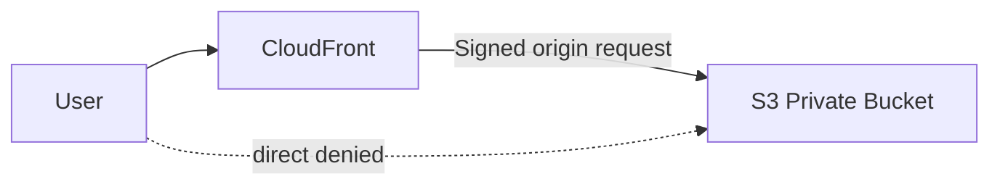

Bucket policy dapat membatasi akses hanya dari CloudFront distribution tertentu.

---

## 6. Elastic Load Balancing

Elastic Load Balancing mendistribusikan traffic ke beberapa target dan melakukan health check.

Jenis utama yang sering dipakai:

| Load Balancer | Layer | Cocok Untuk |
|---|---|---|
| Application Load Balancer | L7 HTTP/HTTPS/gRPC | Web app, API, host/path routing, auth integration |
| Network Load Balancer | L4 TCP/UDP/TLS | High throughput, low latency, static IP pattern, non-HTTP protocols |
| Gateway Load Balancer | Network appliance insertion | Firewall/inspection appliance architecture |
| Classic Load Balancer | Legacy | Hindari untuk desain baru jika tidak ada alasan historis |

### 6.1 Application Load Balancer

ALB cocok untuk HTTP-aware routing.

Fitur penting:

- Host-based routing.
- Path-based routing.
- HTTP header/method/query routing.
- Weighted target groups.
- Health checks.
- TLS termination.
- Redirect HTTP → HTTPS.
- Fixed response.
- Integration dengan WAF.
- Target types: instance, IP, Lambda untuk beberapa use case.

Pattern:

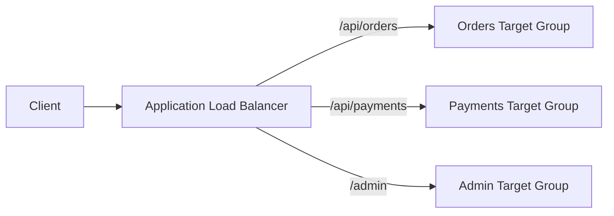

ALB adalah pilihan default yang baik untuk web/API workload berbasis HTTP jika tidak memerlukan API Gateway features khusus.

### 6.2 Network Load Balancer

NLB cocok untuk L4 traffic.

Use case:

- TCP service.
- UDP service.
- TLS pass-through/termination tertentu.
- Very high throughput.
- Static IP per AZ use case.
- PrivateLink endpoint service provider.
- Preserving source IP pada pattern tertentu.

NLB tidak memahami path HTTP seperti ALB. Jangan memilih NLB hanya karena “lebih cepat” jika Anda butuh routing L7, WAF di ALB, atau HTTP behavior.

### 6.3 Internal vs Internet-Facing

Load balancer bisa:

- Internet-facing.
- Internal.

Internet-facing LB ditempatkan di public subnets dan memiliki public DNS endpoint. Internal LB ditempatkan untuk private access dalam VPC/private network.

Rule of thumb:

| Need | Suggested LB |
|---|---|
| Public web app | CloudFront + public ALB |
| Internal HTTP service | Internal ALB |
| TCP internal service | Internal NLB |
| Partner private TCP endpoint | NLB + PrivateLink |
| Multi-service HTTP ingress | ALB host/path routing |
| API with managed auth/throttle | API Gateway |

---

## 7. API Gateway, AppSync, and Managed API Ingress

### 7.1 API Gateway

API Gateway adalah managed API front door. Cocok saat Anda butuh:

- Serverless API dengan Lambda.
- Managed throttling.
- Usage plan/API keys untuk beberapa model.
- JWT/Cognito/Lambda authorizer/IAM auth.
- Request/response transformation.
- Private API.
- WebSocket API.
- Stage/deployment model.
- Access logs dan execution metrics.

Trade-off:

- Ada quota dan pricing per request.
- Latency overhead dibanding direct ALB bisa relevan untuk workload tertentu.
- Debugging authorizer/integration mapping butuh disiplin observability.
- Untuk simple container HTTP service internal, ALB mungkin lebih sederhana.

### 7.2 AppSync

AppSync cocok untuk GraphQL API, realtime subscription, dan data aggregation pattern yang cocok dengan GraphQL mental model.

Pilih AppSync jika:

- Client butuh GraphQL API.
- Resolver/data source model cocok.
- Realtime subscription berguna.
- Anda ingin managed API layer dengan auth integration.

Jangan pilih hanya karena “modern”. GraphQL menambah contract dan caching complexity.

### 7.3 Private API and VPC Link

Private API Gateway endpoint dapat diakses dari VPC melalui interface endpoint. VPC Link dapat menghubungkan API Gateway dengan private resources seperti NLB/ALB tergantung jenis API dan supported integration.

Pattern:

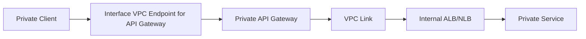

Gunakan untuk API private lintas account/VPC/enterprise boundary dengan kontrol IAM/resource policy yang jelas.

---

## 8. TLS and Certificate Ownership

TLS termination adalah keputusan arsitektural, bukan checkbox.

Pertanyaan desain:

1. Termination di CloudFront, ALB, API Gateway, NLB, atau service?
2. Apakah perlu end-to-end TLS sampai target?
3. Siapa owner certificate?
4. Bagaimana rotasi certificate?
5. Apakah perlu mTLS?
6. Bagaimana cipher/security policy dikontrol?
7. Apakah domain public atau private?

### 8.1 Common TLS Termination Patterns

| Pattern | Kapan Cocok | Catatan |
|---|---|---|
| CloudFront terminates TLS, origin HTTP | Static/simple origin | Origin tetap harus protected; jangan untuk sensitive path tanpa threat review |
| CloudFront terminates TLS, origin HTTPS | Public production umum | Lebih baik untuk confidentiality ke origin |
| ALB terminates TLS | Regional web/API | Sederhana, cocok untuk HTTP apps |
| NLB TLS termination/pass-through | TCP/TLS workloads | Cocok saat L4 diperlukan |
| End-to-end TLS to pod/service | Regulated/internal zero-trust leaning | Perlu cert lifecycle dan observability matang |

### 8.2 ACM

AWS Certificate Manager memudahkan provisioning dan renewal certificate untuk banyak AWS integrations. Namun scope region penting:

- Certificate untuk CloudFront umumnya harus berada di Region yang ditentukan AWS untuk CloudFront certificate management.
- Certificate untuk ALB/API Gateway regional harus berada di Region resource tersebut.

Pastikan runbook certificate renewal dan DNS validation jelas. Expired certificate adalah outage yang sangat dapat dicegah.

### 8.3 mTLS

Mutual TLS berguna untuk:

- Partner API.
- Internal service boundary dengan client cert.
- B2B integration.
- Administrative endpoint.

Tetapi mTLS bukan pengganti authorization bisnis. mTLS membuktikan client certificate, bukan apakah user/action/resource di domain aplikasi diizinkan.

---

## 9. AWS WAF and Shield

### 9.1 AWS WAF

AWS WAF adalah web application firewall untuk HTTP(S) requests yang diteruskan ke resource yang didukung seperti CloudFront, ALB, API Gateway REST API, dan AppSync GraphQL API.

WAF dapat melakukan:

- IP allow/block.
- Rate-based rules.
- Managed rule groups.
- SQL injection/XSS pattern detection.
- Header/cookie/query inspection.
- Bot control dengan fitur tertentu.
- Geo match.
- Custom rules.

WAF tidak melakukan:

- Authorization bisnis.
- Full DLP.
- Protection untuk arbitrary TCP traffic.
- Menjamin aplikasi bebas vulnerability.
- Menggantikan secure coding dan input validation.

### 9.2 WAF Placement

| Placement | Kapan Cocok |
|---|---|
| CloudFront WAF | Global public apps, CDN, edge protection |
| ALB WAF | Regional app tanpa CloudFront atau internal-ish HTTP perimeter |
| API Gateway WAF | Managed API perimeter untuk REST API use case |
| AppSync WAF | GraphQL endpoint protection |

Jika aplikasi public global, CloudFront + WAF sering menjadi front door yang kuat. Jika aplikasi hanya regional/private, ALB/API Gateway WAF mungkin cukup.

### 9.3 Rule Strategy

Mulai dari mode observasi/count untuk rule baru jika risiko false positive tinggi.

Pattern:

1. Enable managed baseline in count mode.
2. Observe sampled requests dan logs.
3. Exclude noisy rule jika justified.
4. Move to block.
5. Add custom rate limits.
6. Add allowlist for admin/partner only if lifecycle jelas.
7. Review regularly.

### 9.4 Shield

AWS Shield Standard memberikan proteksi DDoS dasar untuk semua AWS customers tanpa konfigurasi tambahan. Shield Advanced memberikan proteksi tambahan, visibility, dan response/support features untuk workload yang membutuhkan DDoS posture lebih matang.

DDoS defense bukan hanya membeli Shield Advanced. Desain harus mencakup:

- CloudFront/edge absorption.
- WAF rate rules.
- Scalable origin.
- Health checks.
- Origin protection.
- Runbook DDoS.
- Logging dan escalation.

---

## 10. Ingress Architecture Patterns

### 10.1 Public Web Application

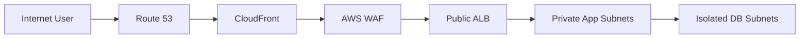

Decision notes:

- CloudFront handles global edge/TLS/cache.
- WAF filters HTTP requests.
- ALB performs L7 routing and target health.
- App stays private.
- DB isolated.
- Origin should restrict direct access where possible.

### 10.2 Regional API with Managed Auth

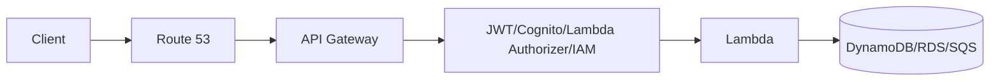

Decision notes:

- Use API Gateway if API features matter.
- Use Lambda/serverless integration if workload fits event/request model.
- Throttling and auth are first-class concerns.
- Observe authorizer latency and integration errors.

### 10.3 Public API to Container Service

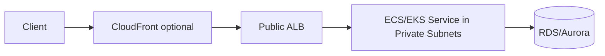

Decision notes:

- ALB is often simpler than API Gateway for container HTTP apps.
- Add CloudFront if global edge, WAF-at-edge, caching, or origin protection matters.
- Use target group health checks aligned with app readiness.

### 10.4 Private Partner Connectivity

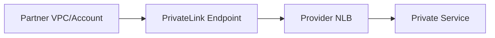

Decision notes:

- PrivateLink avoids full network routing between VPCs.
- Provider exposes service, not network.
- NLB commonly sits behind endpoint service.
- Auth still required at app/API layer.

### 10.5 Internal Service Ingress

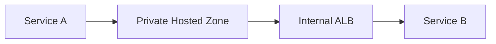

Decision notes:

- Internal ALB for HTTP routing.
- Private hosted zone for stable names.
- SG chain defines service contract.
- Service mesh may be introduced later only if complexity justified.

---

## 11. Egress Control: Outbound Is a Security Boundary

Egress is often under-designed. Many teams focus on inbound protection and leave outbound as `0.0.0.0/0` through NAT.

That is risky because outbound path enables:

- data exfiltration;
- malware callback;
- accidental calls to wrong endpoint;
- dependency drift;
- cost spikes;
- supply-chain downloads;
- compliance violations.

### 11.1 Egress Options

| Option | Use Case | Limitation |
|---|---|---|
| NAT Gateway per VPC/AZ | Simple outbound internet | Limited policy; cost can grow |
| VPC endpoints | Private AWS service access | Only supported services/private endpoint services |
| Centralized egress VPC | Enterprise inspection and control | More routing complexity |
| AWS Network Firewall | Stateful inspection/domain/SNI rules depending design | Requires careful route insertion/logging |
| Proxy | HTTP/S domain-aware control | Apps must support proxy or routing pattern |
| No default route | Highly isolated workloads | Dependencies must be explicit |

### 11.2 Simple NAT Egress Pattern

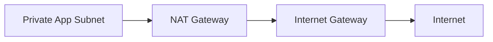

Good for:

- Small/simple workloads.
- Non-sensitive egress.
- Low traffic volume.
- Early stage with clear monitoring.

Not enough for:

- Regulated workloads.
- Strong exfiltration control.
- Central domain allowlist.
- Large multi-account estates.

### 11.3 Endpoint-First Egress Pattern

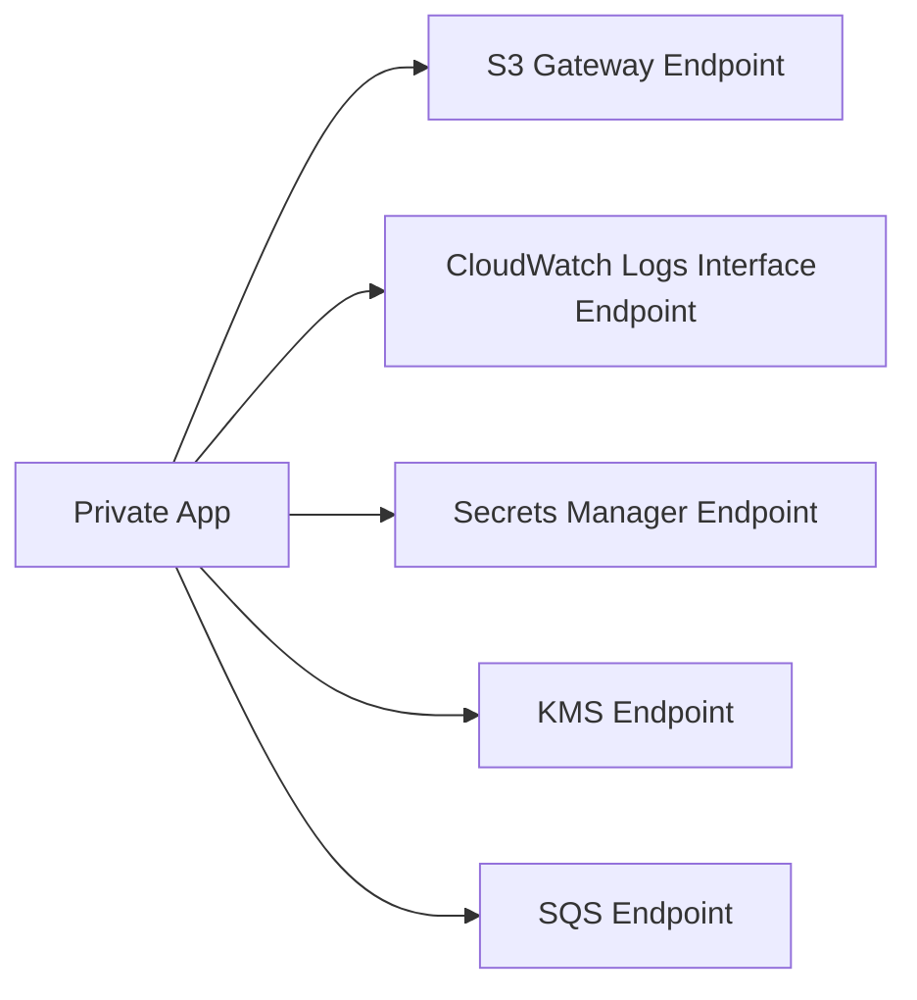

Principle:

> AWS service traffic should not need general internet egress by default.

Benefits:

- Reduces NAT dependency.
- Enables endpoint policy.
- Helps data perimeter strategy.
- Improves compliance evidence.
- Often reduces data processing path cost for high-volume S3/DynamoDB use cases.

### 11.4 Centralized Egress Pattern

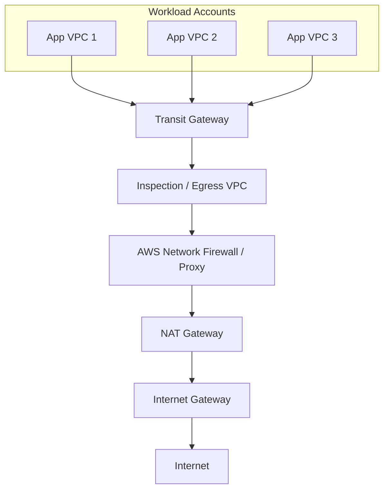

Benefits:

- Centralized inspection.
- Centralized allowlist/blocklist.
- Fewer NAT deployments in workload VPCs.
- Better audit and logging.
- Consistent egress governance.

Trade-off:

- More complex routing.
- Potential shared dependency/blast radius.
- Needs high availability per AZ.
- Needs clear ownership between platform and workload teams.
- Route asymmetry can break flows if badly designed.

### 11.5 Egress Decision Heuristic

Ask these questions:

1. Is destination an AWS service? Prefer VPC endpoint.
2. Is destination a fixed partner API? Consider proxy/domain allowlist/private connectivity.
3. Is egress high-volume? Analyze NAT vs endpoint cost.
4. Is workload regulated? Avoid broad NAT without inspection.
5. Is egress required at runtime or only build time? Move build-time dependency to CI/artifact pipeline.
6. Can dependency be mirrored internally? Use artifact repositories and private package mirrors.
7. Is DNS logging required? Enable Route 53 Resolver query logging where appropriate.
8. Is centralized control worth routing complexity? Decide based on estate scale and risk.

---

## 12. DNS Failover and Multi-Region Traffic Control

Multi-region architecture will be covered deeper later. Here we focus on edge/DNS implications.

### 12.1 DNS Failover Pattern

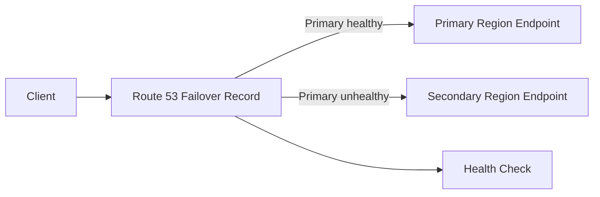

Key points:

- Health check must represent user-impacting health, not just “load balancer responds”.
- TTL affects switchover behavior but cannot force every client to refresh instantly.
- Data replication readiness matters more than DNS cutover speed.
- Failback is a separate process, not simply undoing failover.

### 12.2 Weighted Routing for Progressive Cutover

Use weighted records for coarse traffic shift:

```text
api.example.com -> ALB old region weight 90
api.example.com -> ALB new region weight 10
```

Good for:

- Regional migration.
- Canary at DNS level.
- Blue/green coarse cutover.

Limitations:

- Resolver caching can skew distribution.
- Not per-request precise.
- Client retry can distort traffic.
- State/data compatibility still required.

### 12.3 CloudFront Origin Failover

CloudFront can route to secondary origin under configured conditions. This helps for origin-level resilience but does not solve data consistency or application state by itself.

Use when:

- Static origin failover.
- API origin fallback for specific HTTP error conditions.
- Origin maintenance.

Be careful with:

- Non-idempotent writes.
- Stateful sessions.
- Authentication callback URLs.
- Cache poisoning during partial failures.

---

## 13. Observability at the Edge

Edge incident diagnosis requires logs from multiple layers.

| Layer | Signal |
|---|---|
| Route 53 | Query logs, health check status, DNS change audit |
| CloudFront | Standard logs, real-time logs, cache hit ratio, origin latency, 4xx/5xx |
| WAF | Sampled requests, blocked count, rule labels, terminating rule |
| ALB/NLB | Access logs, target health, target response time, ELB 4xx/5xx, target 4xx/5xx |
| API Gateway | Access logs, execution logs, integration latency, authorizer latency |
| VPC | Flow Logs, NAT metrics, endpoint metrics where available |
| App | Structured logs, traces, business error codes |

### 13.1 ALB 5xx vs Target 5xx

Do not treat all 5xx the same.

- `ELB 5xx`: load balancer could not successfully process/proxy.
- `Target 5xx`: target application returned 5xx.

This distinction changes owner and debugging path.

### 13.2 CloudFront 4xx/5xx

CloudFront errors can come from:

1. Viewer request rejected.
2. WAF block.
3. Cache behavior mismatch.
4. Origin unreachable.
5. TLS handshake to origin failed.
6. Origin returned error.
7. Signed URL/cookie invalid.
8. Header too large or method not allowed.

### 13.3 WAF Logging

For WAF, log the decision. During rollout, use count mode for risky rules and inspect sampled requests. Without WAF logs, “WAF blocked it” becomes guesswork.

---

## 14. Edge Incident Troubleshooting Algorithm

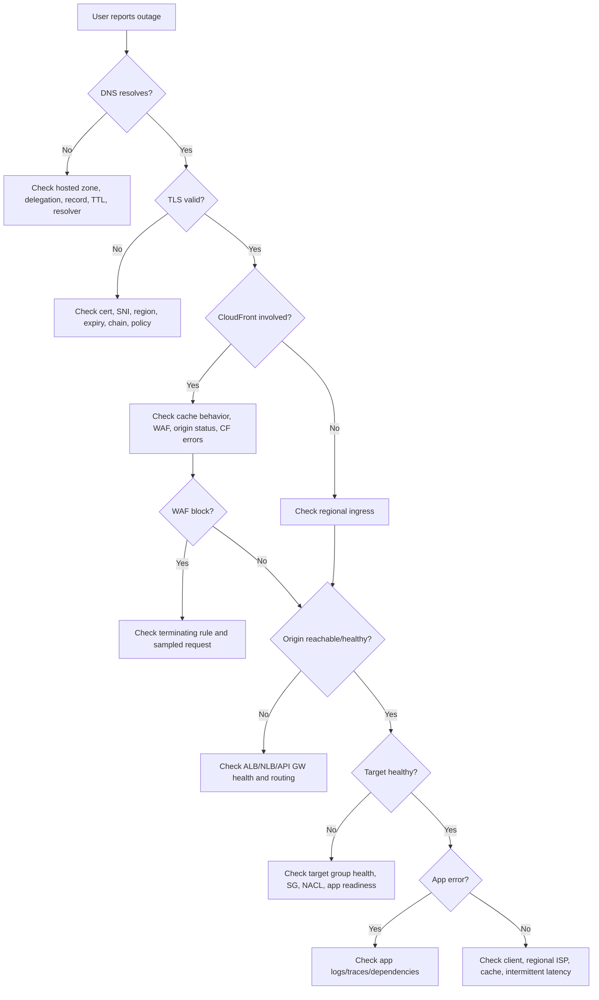

Operational rule:

> Always identify the layer generating the error before changing configuration.

Changing WAF, DNS, CloudFront, and ALB at the same time during incident can create second-order failures.

---

## 15. Design Decision Matrix

### 15.1 CloudFront vs ALB vs API Gateway

| Requirement | CloudFront | ALB | API Gateway |
|---|---|---|---|
| Global edge caching | Excellent | No | Limited/Not primary |
| L7 routing to containers | Can front origin | Excellent | Possible but not always ideal |
| Managed API auth/throttle | Limited | Limited | Excellent |
| Static content from S3 | Excellent | Not relevant | Not ideal |
| WAF integration | Yes | Yes | Yes for supported API types |
| WebSocket | Not primary | Limited depending design | Supported for WebSocket API |
| Private internal HTTP service | Not typical | Excellent | Possible private API |
| Cost per high-volume simple HTTP | Depends cache hit | Often efficient | Per-request can matter |
| Request transformation | Limited edge logic | Limited | Stronger |

### 15.2 ALB vs NLB

| Requirement | ALB | NLB |
|---|---|---|
| HTTP path/host routing | Yes | No |
| TCP/UDP | No | Yes |
| WAF | Yes | Not directly like ALB HTTP WAF |
| Static IP-style need | Not direct | Stronger |
| gRPC | Yes with configuration/support | TCP pass-through possible |
| PrivateLink provider | Not typical direct | Common |
| L7 auth integration | Better | No |
| Extreme L4 throughput | Not primary | Strong |

### 15.3 NAT vs Centralized Egress vs Endpoint

| Requirement | NAT per VPC | Centralized Egress | Endpoint-first |
|---|---|---|---|
| Simplicity | High | Medium/Low | Medium |
| Central policy | Low | High | Medium/High for AWS services |
| AWS service private access | Indirect | Indirect | Strong |
| Arbitrary internet | Strong | Strong with inspection | No |
| Cost control | Medium | Can improve at scale | Strong for some AWS services |
| Blast radius | Per VPC | Shared dependency risk | Per endpoint/VPC |
| Compliance evidence | Weak/medium | Strong | Strong for AWS service access |

---

## 16. Security Patterns

### 16.1 Origin Protection

If CloudFront is the intended entry point, origin should not be casually reachable directly.

For S3:

- Use private bucket.
- Use Origin Access Control.
- Bucket policy restricts access from distribution.

For ALB origin:

- Restrict ALB security group inbound to CloudFront managed prefix list where appropriate.
- Use custom header from CloudFront to origin as additional weak signal, not sole auth.
- Consider WAF at CloudFront.
- Ensure app auth remains mandatory.

### 16.2 Admin Endpoint Isolation

Admin interfaces should not be exposed through same broad public path as user traffic unless intentionally protected.

Options:

- Separate admin domain.
- VPN/private access.
- Verified Access or identity-aware access pattern where appropriate.
- IP allowlist with lifecycle governance.
- Strong auth and MFA.
- Separate WAF rules.
- Separate ALB listener/target group.

### 16.3 Rate Limiting

Layered rate limiting:

1. CloudFront/WAF rate-based rules.
2. API Gateway throttling.
3. ALB/application-level throttling.
4. Business-level quota per tenant/user/API key.
5. Downstream protection with queue/bulkhead.

WAF rate limit by IP is useful but not enough for authenticated abuse. Application/business quota is still needed.

### 16.4 Data Perimeter

For egress and AWS service access:

- Prefer VPC endpoints.
- Use endpoint policies.
- Use resource policies with `aws:SourceVpce` or organization conditions where appropriate.
- Use SCPs to prevent public exposure patterns.
- Log CloudTrail data events for sensitive resources where justified.
- Monitor unexpected regions/endpoints.

---

## 17. Cost and Performance Considerations

### 17.1 CloudFront

Cost drivers:

- Data transfer out.
- Requests.
- Invalidation volume.
- Real-time logs.
- Functions/Lambda@Edge invocation.

Performance drivers:

- Cache hit ratio.
- Origin latency.
- Cache key cardinality.
- Compression.
- Object size.
- Origin Shield where applicable.

### 17.2 Load Balancer

Cost/performance drivers:

- Load balancer hours.
- LCU/NLCU usage dimensions.
- Cross-zone load balancing behavior.
- Target health and scaling.
- TLS negotiation.
- Connection patterns.

### 17.3 NAT Gateway

Cost drivers:

- Hourly NAT gateway.
- Data processed.
- Cross-AZ data if private subnet in AZ A routes to NAT in AZ B.

Optimization:

- NAT per AZ for resilience and avoiding unnecessary cross-AZ path.
- Move AWS service traffic to VPC endpoints.
- Mirror dependencies into private artifact repositories.
- Avoid runtime package downloads.

### 17.4 WAF

Cost drivers:

- Web ACLs.
- Rules/rule groups.
- Requests inspected.
- Bot/fraud control features if used.
- Logging volume.

WAF cost should be evaluated against risk reduction and operational signal, not treated as arbitrary overhead.

---

## 18. Common Failure Modes

### 18.1 DNS Record Points to Wrong Endpoint

Symptoms:

- Some users reach old system.
- Regional cutover incomplete.
- Certificate mismatch.
- 404/host header mismatch.

Causes:

- Wrong hosted zone.
- Duplicate public/private zone confusion.
- Stale resolver cache.
- Alias record to wrong ALB/CloudFront.
- Weighted records not reset after migration.

### 18.2 CloudFront Serves Stale or Wrong Content

Causes:

- Static assets not content-hashed.
- TTL too long for mutable content.
- Cache key missing header/query/cookie dimension.
- Invalidation not run or wrong path.
- Origin returns cacheable error.

Fix discipline:

1. Prefer immutable asset names.
2. Use explicit cache-control headers.
3. Keep API/private responses no-cache unless designed.
4. Use invalidation as exception, not primary release mechanism.

### 18.3 WAF Blocks Legitimate Traffic

Causes:

- Managed rule false positive.
- Body size/encoding unexpected.
- Admin/partner flow not modeled.
- Rate rule too aggressive.
- Bot rule impacts automation.

Mitigation:

- Count mode before block.
- Sampled requests.
- Rule labels.
- Scoped-down statements.
- Separate admin/partner path/domain if needed.

### 18.4 ALB Target Unhealthy

Causes:

- Health check path wrong.
- App listens on different port.
- SG target blocks ALB SG.
- NACL blocks ephemeral response.
- App startup slow.
- Dependency check too strict in readiness endpoint.

Good readiness endpoint should indicate whether target can safely receive traffic, but should avoid flapping because of optional downstream dependency.

### 18.5 NAT Cost Spike

Causes:

- Large S3 traffic via NAT instead of gateway endpoint.
- Container image pulls from public internet.
- Log/export path through NAT.
- Cross-AZ NAT routing.
- Unexpected data exfiltration or retry storm.

Response:

1. Analyze NAT metrics and VPC Flow Logs.
2. Identify top talkers/destinations.
3. Add endpoints or private mirrors.
4. Fix route table cross-AZ path.
5. Add egress monitoring/alerting.

### 18.6 Certificate Expiry

Causes:

- DNS validation record removed.
- Manual imported cert not rotated.
- Cert in wrong Region.
- Domain validation ownership unclear.

Prevent:

- Prefer ACM-managed renewal where supported.
- Monitor certificate expiry.
- Keep DNS validation records as code.
- Clear domain/cert ownership.

---

## 19. Production Design Checklist

### 19.1 DNS

- [ ] Public/private hosted zones are documented.
- [ ] Alias records used for AWS resources where appropriate.
- [ ] TTL chosen based on recovery/cutover needs.
- [ ] Health checks reflect real user path, not shallow ping only.
- [ ] Split-horizon DNS behavior documented.
- [ ] DNS changes go through IaC/review.

### 19.2 CloudFront

- [ ] Cache behaviors are path-specific.
- [ ] Cache key is minimal and correct.
- [ ] Static assets are immutable/versioned.
- [ ] Sensitive/private API responses are not cached accidentally.
- [ ] Origin protected from direct bypass where feasible.
- [ ] Access logs/metrics enabled for critical apps.
- [ ] WAF attached if public risk warrants.

### 19.3 Load Balancer

- [ ] Internet-facing vs internal is intentional.
- [ ] ALB/NLB selected based on protocol and routing needs.
- [ ] Target groups separated by service/version where useful.
- [ ] Health checks reflect readiness.
- [ ] SG chain from LB to target is explicit.
- [ ] Access logs enabled for production.
- [ ] TLS policy and certificate ownership defined.

### 19.4 WAF/Shield

- [ ] WAF placement chosen intentionally.
- [ ] Managed rules tested in count mode if needed.
- [ ] Rate limits match real traffic patterns.
- [ ] WAF logs/sampled requests available.
- [ ] DDoS runbook exists for public critical apps.
- [ ] Shield Advanced evaluated for critical internet-facing workloads.

### 19.5 Egress

- [ ] AWS service access uses VPC endpoints where practical.
- [ ] NAT usage is measured and justified.
- [ ] Centralized egress considered for multi-account regulated estate.
- [ ] Egress logs/flow logs available.
- [ ] Runtime dependencies do not download arbitrary build artifacts.
- [ ] Data exfiltration path has detective/preventive controls.

---

## 20. IaC Design Interface

A network edge module should not expose random low-level knobs only. It should encode intent.

Example pseudo-interface:

```hcl
module "public_web_edge" {
  source = "../modules/network/public-web-edge"

  domain_name = "case.example.com"

  route53_zone_id = var.public_zone_id

  cloudfront = {
    enabled             = true
    price_class         = "PriceClass_200"
    waf_web_acl_arn     = module.waf.web_acl_arn
    enable_access_logs  = true
    origin_type         = "alb"
  }

  alb = {
    name               = "case-prod-public"
    subnets            = module.vpc.public_subnet_ids
    security_group_ids = [module.security_groups.alb_sg_id]
    certificate_arn    = module.certificates.regional_cert_arn
    enable_access_logs = true
  }

  target_groups = {
    app = {
      protocol          = "HTTP"
      port              = 8080
      health_check_path = "/health/ready"
      target_type       = "ip"
    }
  }

  dns = {
    create_alias = true
    record_name  = "case.example.com"
  }

  tags = {
    Environment = "prod"
    Workload    = "case-management"
    ManagedBy   = "terraform"
  }
}
```

Good module outputs:

- CloudFront distribution ID/domain.
- ALB DNS name/ARN.
- Target group ARNs.
- WAF Web ACL ARN.
- DNS record names.
- Log bucket/prefix.

Bad module behavior:

- Creates public endpoints by default.
- Hides security group rules.
- Mixes DNS, cert, LB, WAF, app deployment in untestable blob.
- No explicit logging flags.
- No support for staged rollout.

---

## 21. Deliberate Practice

### Exercise 1 — Build a Public Web Edge

Build:

- Route 53 record.
- CloudFront distribution.
- WAF Web ACL with managed baseline in count mode.
- Public ALB.
- Private app target.
- S3/CloudWatch logs.

Test:

1. Normal request.
2. HTTP to HTTPS redirect.
3. WAF sampled request.
4. ALB target health.
5. CloudFront cache hit/miss.
6. Direct ALB bypass behavior.

Target belajar: request path end-to-end.

### Exercise 2 — Create a DNS Cutover Simulation

Create two endpoints:

- `blue` ALB.
- `green` ALB.

Use weighted Route 53 records:

```text
blue weight 90
green weight 10
```

Then shift:

```text
blue weight 50
green weight 50
```

Then:

```text
blue weight 0
green weight 100
```

Observe resolver behavior, access logs, and actual distribution. Compare expectation vs reality.

Target belajar: DNS traffic split is approximate, not exact per request.

### Exercise 3 — Egress Reduction Drill

Take private workload using NAT. Identify AWS service calls and replace with endpoints:

1. S3 gateway endpoint.
2. CloudWatch Logs interface endpoint.
3. Secrets Manager endpoint.
4. KMS endpoint.
5. STS endpoint.
6. ECR endpoints if container workload.

Measure:

- NAT bytes before/after.
- Endpoint bytes.
- Failure behavior if NAT route removed.
- Policy behavior with `aws:SourceVpce`.

Target belajar: endpoint-first architecture.

### Exercise 4 — WAF False Positive Drill

Enable managed rule in count mode. Send:

- Normal request.
- Suspicious query pattern.
- Large body.
- Admin request.

Read WAF logs and identify terminating/counting rule. Then design scoped-down rule.

Target belajar: WAF is an operational system, not one-time checkbox.

---

## 22. Anti-Patterns

### 22.1 DNS as Deployment System Without Rollback

Changing DNS manually during release without IaC, health checks, or rollback plan.

Consequence:

- Stale records.
- Inconsistent resolver cache.
- Hard-to-debug partial traffic.
- No audit trail.

### 22.2 CloudFront Cache Everything

Forwarding/caching personalized API responses accidentally.

Consequence:

- Data leakage.
- Wrong user response.
- Stale authorization.
- Incident severity high.

### 22.3 WAF as Security Theater

Attach WAF with managed rules but no logs, no tuning, no owner.

Consequence:

- False confidence.
- False positives discovered during incident.
- No evidence of protection.
- Rules drift.

### 22.4 Public ALB Directly Exposed Behind CloudFront

CloudFront intended as front door, but ALB accepts traffic from anywhere.

Consequence:

- WAF/cache/origin policy bypass.
- Attackers hit origin directly.
- Logs split and confusing.

### 22.5 NAT as Universal Egress

Every private subnet sends all traffic to NAT.

Consequence:

- Cost spike.
- Weak exfiltration control.
- Hidden dependency on internet.
- No endpoint/resource perimeter.

### 22.6 Health Check That Lies

Health endpoint returns OK even if app cannot serve real traffic, or fails because optional dependency is down.

Consequence:

- Bad targets receive traffic.
- Good targets removed unnecessarily.
- Cascading failures.

### 22.7 One Edge for All Risk Profiles

User traffic, admin traffic, partner traffic, and webhook traffic share same domain/path/protection.

Consequence:

- No tailored security.
- Difficult rate limiting.
- Hard incident isolation.
- Partner issue impacts user path.

---

## 23. Self-Correction Checklist ala Kaufman

Uji diri dengan pertanyaan berikut.

1. Bisa menjelaskan kapan memakai CloudFront di depan ALB?
2. Bisa membedakan ALB dan NLB berdasarkan protocol dan routing need?
3. Bisa menjelaskan kenapa Route 53 weighted routing bukan exact per-request split?
4. Bisa menggambar request path dari user ke CloudFront ke ALB ke private app?
5. Bisa menjelaskan apa yang harus dilog saat WAF memblokir request?
6. Bisa menjelaskan kenapa NAT bukan egress governance yang cukup?
7. Bisa memilih antara API Gateway dan ALB untuk containerized HTTP API?
8. Bisa menjelaskan origin protection untuk S3 private content?
9. Bisa membuat checklist certificate ownership dan expiry prevention?
10. Bisa men-debug user-facing 502 dari CloudFront/ALB sampai target app?

Jika belum, ulangi bagian terkait dan lakukan drill.

---

## 24. Engineering Judgment Summary

Edge architecture production-grade bukan sekadar membuat domain mengarah ke load balancer.

Yang harus benar:

1. DNS jelas, reviewable, dan punya ownership.
2. CloudFront/cache behavior tidak membocorkan data.
3. TLS termination dipilih sadar risiko.
4. WAF punya logs, tuning, dan owner.
5. Load balancer health check merepresentasikan readiness.
6. Public origin tidak mudah dibypass.
7. Egress dianggap security boundary.
8. AWS service calls private memakai endpoint jika feasible.
9. Failover diuji, bukan hanya digambar.
10. Observability tersedia di setiap traffic layer.

Mental model akhir:

> Edge, ingress, dan egress adalah sistem kontrol traffic. DNS mengarahkan, edge mengamankan/mempercepat, load balancer memilih target, WAF memfilter request, dan egress mengontrol apa yang boleh keluar. Kualitas desain terlihat saat incident: apakah kita tahu layer mana yang gagal, siapa owner-nya, dan bagaimana memulihkan tanpa memperbesar blast radius.

Part berikutnya akan membahas hybrid networking: Transit Gateway, VPN, Direct Connect, routing domain, shared services, DNS resolver, segmentation, dan inspection VPC.
