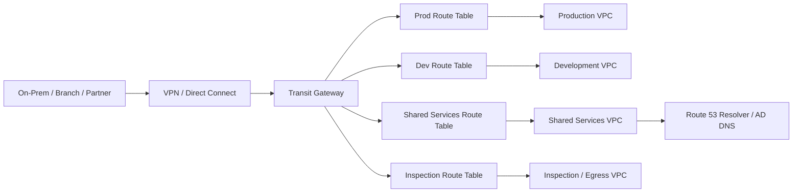
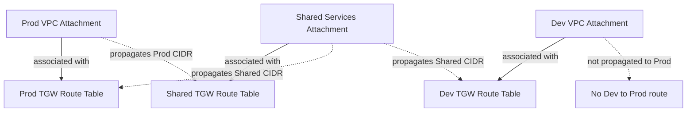
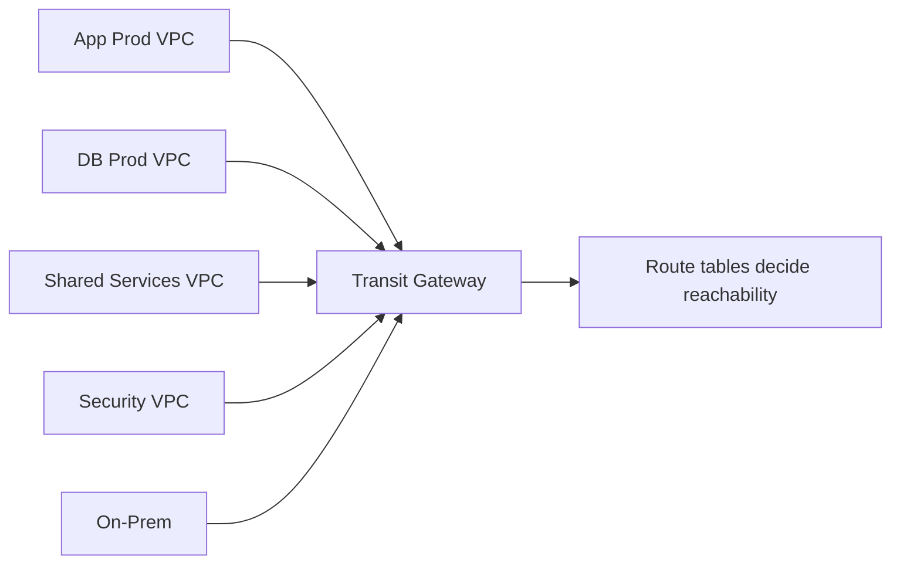
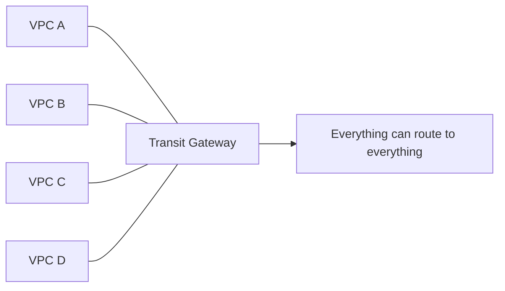
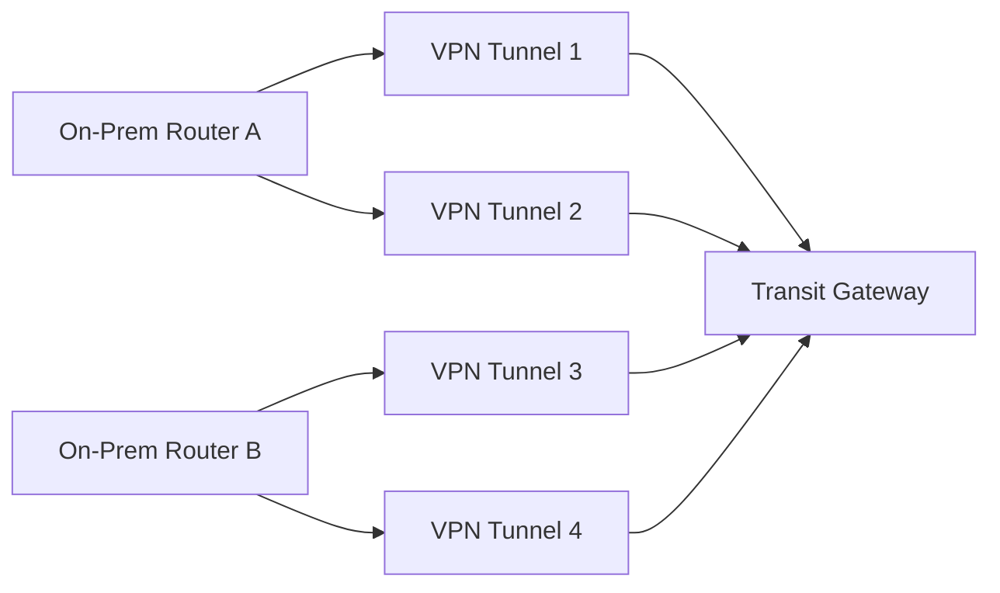
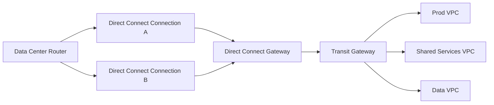
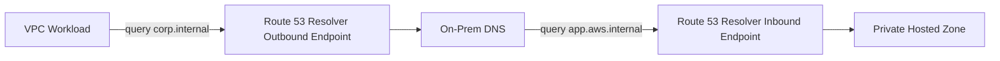
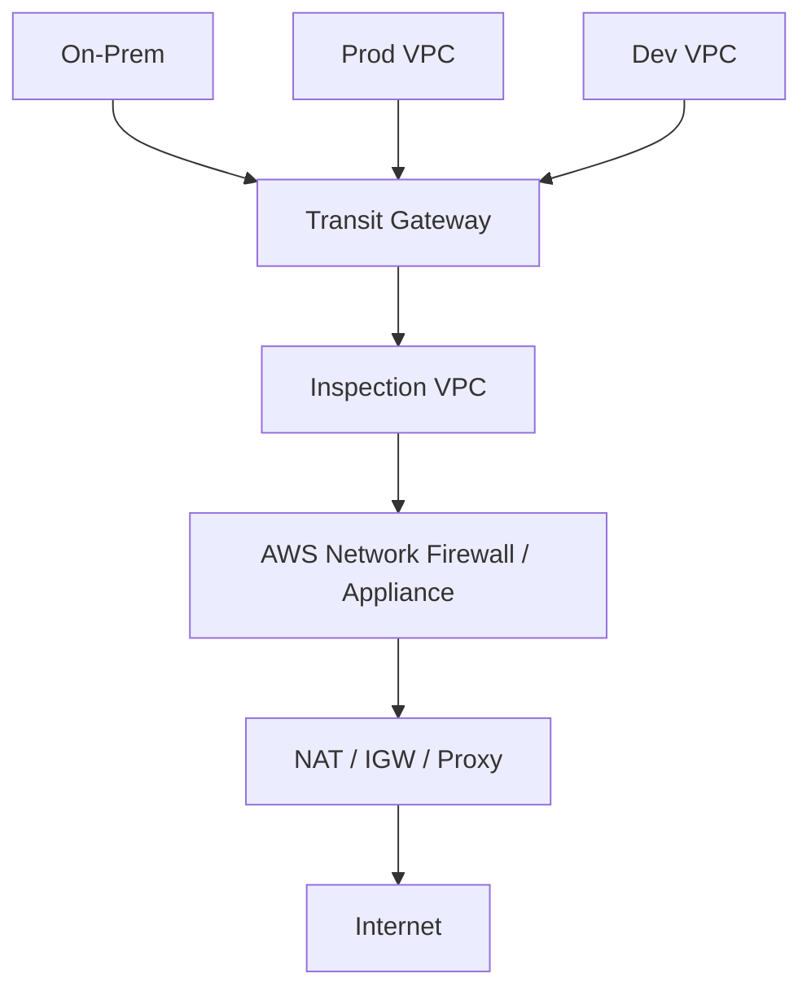
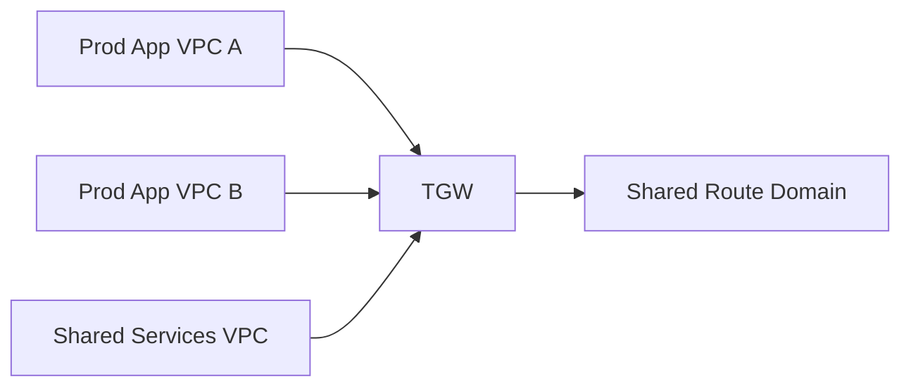
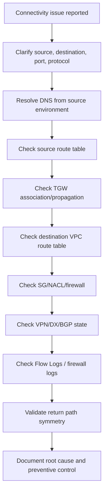

------
title: Learn AWS Engineering Mastery - Part 009
description: Hybrid networking architecture with Transit Gateway, Site-to-Site VPN, Direct Connect, DNS resolver, segmentation, inspection, route domains, and enterprise connectivity failure modeling.
series: learn-aws
seriesTitle: Learn AWS Engineering Mastery
order: 9
partTitle: Hybrid Networking: Transit Gateway, VPN, and Direct Connect
tags:
- aws
- networking
- transit-gateway
- direct-connect
- vpn
- hybrid-cloud
- enterprise-architecture
- platform-engineering
date: 2026-06-30
---

# Learn AWS Engineering Mastery - Part 009

## Hybrid Networking: Transit Gateway, VPN, and Direct Connect

Part ini membahas **hybrid networking**: bagaimana menghubungkan banyak VPC, banyak account, data center, branch office, partner network, dan multi-region topology secara aman, scalable, auditable, dan operable.

Tujuannya bukan sekadar tahu bahwa AWS punya **Transit Gateway**, **Site-to-Site VPN**, dan **Direct Connect**. Targetnya adalah mampu menjawab pertanyaan production seperti:

- Bagaimana membagi route domain agar workload dev tidak bisa berbicara ke workload regulated production?
- Bagaimana memastikan koneksi data center ke AWS tidak menjadi single point of failure?
- Kapan memakai VPC peering, Transit Gateway, PrivateLink, VPN, atau Direct Connect?
- Bagaimana mengontrol routing agar shared services reachable tetapi lateral movement tetap dibatasi?
- Bagaimana DNS hybrid bekerja saat aplikasi on-prem harus resolve private name di AWS dan sebaliknya?
- Bagaimana melakukan cutover migrasi tanpa route leak, asymmetric routing, atau outage?
- Bagaimana membuktikan konektivitas sesuai desain saat audit atau insiden?

Hybrid networking adalah area yang sering gagal bukan karena service-nya sulit, tetapi karena tim tidak punya model mental tentang **routing domain**, **failure domain**, **ownership boundary**, dan **operational evidence**.

---

## 1. Target Skill ala Kaufman

Dalam pendekatan Josh Kaufman, skill besar harus dipecah menjadi sub-skill kecil yang bisa dilatih dan dikoreksi. Untuk hybrid networking AWS, sub-skill bernilai tinggi adalah:

| Sub-skill | Target performa |
|---|---|
| Route-domain modeling | Bisa menggambar siapa boleh route ke siapa, lewat attachment apa, dan route table mana. |
| CIDR governance | Bisa mencegah overlapping CIDR sebelum menjadi masalah migrasi dan routing. |
| Transit Gateway design | Bisa mendesain hub-and-spoke, segmented routing, inspection, shared services, dan multi-account attachment. |
| VPN design | Bisa memilih static/BGP routing, redundancy model, failover expectation, dan tunnel monitoring. |
| Direct Connect design | Bisa memilih dedicated/hosted connection, VIF, Direct Connect gateway, redundancy, dan fallback. |
| Hybrid DNS | Bisa mendesain Route 53 Resolver inbound/outbound endpoint, private hosted zone sharing, conditional forwarding, dan split-horizon DNS. |
| Security segmentation | Bisa membatasi east-west traffic, central inspection, route propagation, dan egress path. |
| Troubleshooting | Bisa membaca route table, BGP state, tunnel state, Flow Logs, TGW route analysis, DNS logs, dan packet path. |
| Operational readiness | Bisa menulis runbook failover, maintenance, certificate/key rotation, route change, dan audit evidence. |

**Performance target:** setelah part ini, Anda harus mampu menggambar hybrid topology enterprise dan menjelaskan route decision untuk minimal 5 traffic flow penting: on-prem to app VPC, app VPC to database VPC, app VPC to shared services, branch to AWS, dan AWS to internet via inspection/egress VPC.

---

## 2. Mental Model: Hybrid Network sebagai Sistem Routing Terkelola

AWS hybrid networking bukan "kabel dari kantor ke cloud". Secara arsitektural, ia adalah komposisi dari:

1. **Address space**: CIDR VPC, CIDR on-prem, branch CIDR, partner CIDR, service CIDR.
2. **Attachment**: titik koneksi antara network domain dan backbone/hub.
3. **Route table**: aturan pemilihan next hop.
4. **Propagation**: mekanisme memasukkan route dari attachment ke route table.
5. **Association**: hubungan satu attachment dengan satu route table yang dipakai untuk lookup traffic keluar dari attachment tersebut.
6. **Inspection point**: tempat traffic melewati firewall, IDS/IPS, Network Firewall, appliance, atau proxy.
7. **DNS path**: resolver mana yang menjawab nama private dan bagaimana forwarding dilakukan.
8. **Operational evidence**: log, metric, alarm, trace, config history, dan change record.

Kunci berpikirnya:

> Jangan mulai dari layanan. Mulai dari **traffic flow**, **trust boundary**, dan **failure boundary**.

Pertanyaan pertama bukan “pakai Transit Gateway atau peering?”, tetapi:

- Network domain apa saja yang ada?
- Apakah domain itu harus fully connected atau segmented?
- Apakah route perlu dinamis atau statis?
- Siapa pemilik perubahan route?
- Apa yang terjadi jika link primer mati?
- Bagaimana membuktikan traffic melewati inspection point?
- Apa konsekuensi jika CIDR overlap?

---

## 3. Pilihan Konektivitas: Kapan Memakai Apa?

| Pattern | Cocok untuk | Tidak cocok untuk |
|---|---|---|
| VPC Peering | Koneksi sederhana antar dua VPC, latency rendah, tidak perlu transitive routing. | Topologi besar, many-to-many, centralized inspection, transitive routing. |
| Transit Gateway | Hub-and-spoke multi-VPC, multi-account, hybrid connectivity, segmentation route table. | Koneksi sangat sederhana yang tidak butuh hub; use case yang lebih cocok PrivateLink. |
| PrivateLink | Consumer-provider service access private tanpa membuka full network routing. | Full mesh network, broad subnet-to-subnet communication, routing umum. |
| Site-to-Site VPN | Koneksi cepat dibuat, encrypted over internet, branch connectivity, backup, dev/test. | Throughput sangat besar, latency konsisten, strict private connectivity requirement. |
| Direct Connect | Dedicated private connectivity, predictable latency, high bandwidth, enterprise backbone. | Setup cepat tanpa carrier/partner, small temporary environment. |
| Direct Connect + VPN | Dedicated path plus encrypted overlay atau fallback tertentu. | Menganggap VPN selalu cukup sebagai backup untuk DX berkapasitas besar tanpa analisis throughput. |
| Transit Gateway Peering | Inter-region TGW-to-TGW routing dan separation antar backbone regional. | Menganggap route propagation selalu otomatis seperti intra-region; desain harus eksplisit. |
| Cloud WAN | Global network policy-driven untuk organisasi besar lintas region/location. | Organisasi kecil yang cukup dengan TGW regional sederhana. |

**Rule of thumb:**

- Gunakan **PrivateLink** saat Anda ingin expose service, bukan expose network.
- Gunakan **Transit Gateway** saat Anda butuh routing hub untuk banyak VPC/domain.
- Gunakan **Direct Connect** saat bandwidth/latency/predictability lebih penting daripada kecepatan setup.
- Gunakan **VPN** untuk encrypted internet tunnel, branch, bootstrap, backup, atau koneksi sementara.
- Gunakan **peering** hanya saat hubungan benar-benar sederhana dan non-transitive.

---

## 4. Transit Gateway Deep Dive

### 4.1 Apa itu Transit Gateway?

**AWS Transit Gateway (TGW)** adalah hub regional untuk menghubungkan VPC dan on-premises network. Ia bertindak sebagai router cloud-managed yang menerima attachment dan melakukan lookup route berdasarkan transit gateway route table.

Attachment yang umum:

- **VPC attachment**: menghubungkan VPC ke TGW.
- **VPN attachment**: menghubungkan Site-to-Site VPN ke TGW.
- **Direct Connect gateway attachment**: menghubungkan Direct Connect gateway ke TGW.
- **Peering attachment**: menghubungkan TGW ke TGW lain, termasuk antar-region.
- **Connect attachment**: menghubungkan third-party SD-WAN/network appliance menggunakan GRE/BGP di atas transport attachment.

Yang harus dipahami:

> Transit Gateway bukan hanya “hub”. TGW adalah **routing policy engine**. Desain route table-nya menentukan segmentation, reachability, dan blast radius.

AWS mendokumentasikan bahwa Transit Gateway route table dapat diasosiasikan dengan attachment, dan route dari attachment dapat dipropagasikan ke satu atau lebih route table. Inilah dasar desain segmentation TGW.

### 4.2 Association vs Propagation

Dua konsep ini sering tertukar.

| Konsep | Arti | Analogi |
|---|---|---|
| Association | Route table yang dipakai attachment untuk mencari next hop saat traffic masuk dari attachment itu. | “Saat saya datang dari VPC ini, saya membaca peta yang mana?” |
| Propagation | Route dari attachment tersebut otomatis ditambahkan ke route table tertentu. | “Network saya diumumkan ke peta siapa?” |

Contoh:

- `Prod VPC attachment` diasosiasikan ke `ProdRouteTable`.
- `Prod VPC CIDR` dipropagasikan ke `SharedServicesRouteTable`.
- `Dev VPC CIDR` tidak dipropagasikan ke `ProdRouteTable`.

Hasilnya:

- Prod bisa diarahkan ke shared services.
- Shared services bisa reach Prod jika route ada.
- Dev tidak otomatis bisa reach Prod.

### 4.3 Route Table Segmentation Pattern

Untuk enterprise, jangan mulai dengan satu TGW route table untuk semua attachment. Itu cepat, tetapi riskan.

Baseline route table:

| TGW route table | Attachment yang diasosiasikan | Route yang diterima |
|---|---|---|
| `rt-prod` | Prod workload VPC | Shared services, inspection/egress, on-prem allowed prefix. |
| `rt-nonprod` | Dev/test/staging VPC | Shared services nonprod, egress, limited on-prem prefix. |
| `rt-shared` | Shared services VPC | Prod/nonprod prefix yang memang perlu akses shared service. |
| `rt-inspection` | Inspection/egress VPC | Workload prefixes dan default route keluar. |
| `rt-onprem` | VPN/DX attachment | Allowed AWS prefixes, biasanya tidak semua VPC. |
| `rt-security` | Security tooling VPC | Logging, scanning, SIEM, controlled reachability. |

**Prinsip:** route table adalah policy boundary. Semakin sensitif domainnya, semakin eksplisit route propagation-nya.

### 4.4 Hub-and-Spoke bukan Berarti Semua Bicara ke Semua

Hub-and-spoke sering disalahartikan menjadi full mesh.

Benar:

Salah:

Hub-and-spoke yang baik membuat network lebih mudah dikendalikan. Hub-and-spoke yang buruk menciptakan **enterprise-scale lateral movement surface**.

---

## 5. CIDR Governance dan IPAM

Hybrid networking gagal paling mahal ketika CIDR overlap.

Contoh masalah:

- Data center memakai `10.0.0.0/8` tanpa segmentasi jelas.
- VPC prod memakai `10.20.0.0/16`.
- Akuisisi perusahaan baru juga memakai `10.20.0.0/16`.
- VPN/TGW tidak bisa route dua destination identik secara benar tanpa NAT/renumbering/complex translation.

### 5.1 Prinsip CIDR Enterprise

| Prinsip | Penjelasan |
|---|---|
| Non-overlap by design | Semua VPC, branch, on-prem, partner harus masuk registry IPAM. |
| Allocate by domain | Pisahkan range prod, nonprod, shared, security, sandbox, data, partner. |
| Leave expansion room | Jangan terlalu rapat. Cloud grows faster than expected. |
| Encode region/account carefully | CIDR bisa membantu reasoning, tetapi jangan terlalu rigid. |
| Avoid giant VPC by default | VPC terlalu besar memperbesar blast radius dan menyulitkan segmentation. |
| Plan IPv6 deliberately | IPv6 mengurangi scarcity, tetapi security/routing/egress posture harus siap. |

### 5.2 Contoh CIDR Plan

| Domain | Example allocation | Catatan |
|---|---:|---|
| AWS prod workloads | `10.64.0.0/12` | Dipecah per region dan account. |
| AWS nonprod workloads | `10.80.0.0/12` | Isolasi dari prod. |
| Shared services | `10.96.0.0/14` | DNS, AD, CI/CD, tools. |
| Security/inspection | `10.100.0.0/14` | Firewall, SIEM collectors, scanning. |
| On-prem DC | `10.0.0.0/12` | Existing. Perlu registry. |
| Branch | `10.16.0.0/12` | Branch segments. |
| Partner | `172.20.0.0/16` | Prefer small, controlled, often NAT/PrivateLink. |

Ini hanya contoh. Jangan copy-paste angka CIDR; gunakan sesuai enterprise address plan.

### 5.3 AWS VPC IPAM

Untuk organisasi besar, pertimbangkan **Amazon VPC IP Address Manager (IPAM)** agar alokasi IP address bisa dilacak, diaudit, dan direncanakan. IPAM membantu:

- mengelola pool CIDR per OU/region/environment,
- mendeteksi overlap,
- mendukung governance multi-account,
- memberi visibility pemakaian IP,
- mengurangi alokasi manual liar.

---

## 6. Site-to-Site VPN

### 6.1 Mental Model VPN

**AWS Site-to-Site VPN** membuat koneksi IPsec antara customer gateway di sisi Anda dan virtual private gateway atau transit gateway di sisi AWS.

Komponen:

| Komponen | Arti |
|---|---|
| Customer Gateway | Representasi perangkat/router pihak customer di AWS. |
| Customer Gateway Device | Perangkat fisik/virtual aktual di on-prem/branch. |
| Virtual Private Gateway | Gateway VPC lama/tradisional untuk VPN ke satu VPC. |
| Transit Gateway | Hub modern untuk VPN ke banyak VPC/domain. |
| VPN connection | Pasangan tunnel IPsec. |
| Tunnel | Jalur IPsec individual. Umumnya dua tunnel per VPN connection. |
| Routing | Static route atau dynamic route via BGP. |

Untuk enterprise multi-VPC, biasanya VPN terminate ke **Transit Gateway**, bukan ke Virtual Private Gateway, karena TGW memudahkan hub-and-spoke dan segmentation.

### 6.2 Static Routing vs BGP

| Mode | Kelebihan | Kekurangan | Cocok untuk |
|---|---|---|---|
| Static | Sederhana, mudah diprediksi, tidak butuh BGP expertise. | Failover/route update lebih manual, kurang scalable. | Small branch, temporary connection, low complexity. |
| BGP | Dynamic route exchange, lebih baik untuk failover dan scale. | Butuh routing discipline, ASN, filtering, monitoring. | Enterprise, multi-prefix, redundant path, DX/VPN hybrid. |

Gunakan BGP jika:

- ada banyak prefix,
- ada lebih dari satu path,
- butuh failover yang lebih otomatis,
- route harus dikontrol dengan advertisement/filtering,
- Anda mengintegrasikan VPN dengan Direct Connect atau backbone enterprise.

### 6.3 VPN Redundancy

Satu VPN connection menyediakan dua tunnel. Namun enterprise resilience tidak cukup berhenti di situ.

Layer resilience:

1. **Dua tunnel dalam satu VPN connection.**
2. **Dua customer gateway devices** di lokasi yang sama.
3. **Dua VPN connections** ke perangkat berbeda.
4. **Dua lokasi on-prem/branch** jika site failure harus ditangani.
5. **Direct Connect + VPN** jika dedicated connectivity perlu fallback/encrypted overlay.

AWS Site-to-Site VPN documentation highlights redundancy through two tunnels per VPN connection and recommends additional redundancy patterns when customer gateway availability matters.

### 6.4 VPN Throughput Expectations

VPN is easy to create, but do not treat it as unlimited bandwidth.

AWS Direct Connect resiliency guidance states that AWS Site-to-Site VPN supports up to **1.25 Gbps throughput per VPN tunnel** and warns against assuming VPN is an adequate backup for Direct Connect connections above 1 Gbps without proper design.

Practical implication:

- For small branch traffic, VPN may be enough.
- For data migration, analytics, replication, or backup, VPN may bottleneck.
- For critical enterprise workloads, test throughput under realistic packet size, encryption, routing, and failover scenarios.

### 6.5 Common VPN Failure Modes

| Failure mode | Symptom | Root cause | Mitigation |
|---|---|---|---|
| Tunnel up, app unreachable | Ping or TCP fails | Missing route, SG/NACL, firewall policy, asymmetric return path. | Trace route both directions; validate TGW route table and VPC route table. |
| Intermittent failover | Traffic drops during tunnel switch | BGP timer, device config, static route priority. | Tune BGP, test failover, document expected convergence. |
| One-way traffic | AWS to on-prem works, reverse fails, or vice versa | Firewall state, NAT, route asymmetry. | Enforce symmetric routing or stateful appliance design. |
| CIDR conflict | Route impossible or wrong target | Overlapping on-prem/VPC CIDR. | IPAM, NAT, renumbering, partner isolation. |
| Tunnel flapping | CloudWatch tunnel state changes | ISP instability, customer gateway issue, crypto mismatch. | Alarm tunnel state, inspect device logs, redundant ISP/router. |
| Slow throughput | High latency/low bandwidth | VPN encryption overhead, single tunnel limit, internet path. | Direct Connect, multiple flows, architecture redesign. |

---

## 7. AWS Direct Connect

### 7.1 Mental Model Direct Connect

**AWS Direct Connect (DX)** provides dedicated network connectivity from your network to AWS. It is not the same as “a private VPC cable.” It is a physical/logical connectivity service with virtual interfaces and gateway integration.

Core components:

| Component | Meaning |
|---|---|
| Direct Connect location | Physical location where DX connectivity is established. |
| Dedicated connection | Physical Ethernet connection requested through AWS. |
| Hosted connection | Connection provisioned through AWS Direct Connect Partner. |
| Virtual interface / VIF | Logical interface over DX connection. |
| Private VIF | Access private resources in VPC via VGW or DX gateway. |
| Public VIF | Access public AWS services over DX public address space. |
| Transit VIF | Connect Direct Connect gateway to Transit Gateway. |
| Direct Connect gateway | Global construct that connects DX to VPCs/TGWs across supported regions. |
| BGP session | Dynamic route exchange between customer router and AWS. |

### 7.2 Private VIF vs Transit VIF vs Public VIF

| VIF type | Use case | Common mistake |
|---|---|---|
| Private VIF | Direct private connectivity to VPC through virtual private gateway or DX gateway. | Using many private VIFs for many VPCs when TGW would be cleaner. |
| Transit VIF | Connect DX gateway to Transit Gateway for multi-VPC connectivity. | Forgetting segmentation is still controlled by TGW route tables. |
| Public VIF | Access public AWS service endpoints over DX. | Thinking public VIF means internet exposure; it is public IP routing over DX. |

For large multi-account AWS environments, **Transit VIF + Direct Connect gateway + Transit Gateway** is usually the cleaner design than one-off private VIFs per VPC.

### 7.3 Direct Connect Gateway and Transit Gateway

The common enterprise pattern:

Notes:

- Direct Connect gateway connects Direct Connect to VPC/TGW attachments.
- Transit Gateway still controls VPC-to-VPC/on-prem reachability through TGW route tables.
- ASN planning matters. AWS documentation notes that ASN values for Direct Connect gateway and Transit Gateway must be different in relevant configurations.
- Route advertisement must be intentionally filtered. Do not advertise all enterprise prefixes by default.

### 7.4 Resiliency Models

Direct Connect resilience should account for:

- connection failure,
- router failure,
- Direct Connect location failure,
- data center failure,
- region-level dependency,
- carrier/provider failure,
- BGP misconfiguration,
- planned maintenance.

Baseline patterns:

| Model | Description | Use case |
|---|---|---|
| Single DX | One connection, one location. | Non-critical, dev/test, not recommended for production critical path. |
| Two DX same location | Device/connection redundancy, but location can still fail. | Moderate resilience, not enough for strict critical systems. |
| Two DX different locations | Better location-level resilience. | Production baseline for important workloads. |
| Multiple data centers + multiple DX locations | Protects against site and DX location failure. | Critical enterprise workloads. |
| DX + VPN fallback | Dedicated primary plus encrypted internet fallback. | Useful, but must validate throughput and failover expectation. |

AWS Direct Connect resiliency recommendations emphasize using multiple locations/connections depending on workload criticality. AWS documentation also recommends using at least two transit virtual interfaces from different Direct Connect locations for greater connectivity resiliency in TGW-connected designs.

### 7.5 Direct Connect + VPN

Patterns:

1. **VPN as backup to DX**
   - DX primary.
   - VPN fallback over internet.
   - Must validate VPN throughput and convergence.

2. **VPN over public VIF**
   - Dedicated DX path to public AWS VPN endpoint.
   - IPsec overlay over DX public VIF.
   - Useful when encryption over dedicated path is required.

3. **DX + TGW + VPN branch**
   - Data center via DX.
   - Branches via VPN to TGW.
   - TGW route tables segment branch access.

### 7.6 Common Direct Connect Failure Modes

| Failure mode | Symptom | Root cause | Mitigation |
|---|---|---|---|
| BGP down | No route exchange | ASN mismatch, MD5/auth mismatch, VIF config, router issue. | BGP monitoring, pre-change validation, rollback config. |
| Partial route visibility | Some VPCs reachable, others not | TGW route table propagation/association error. | Route table diff, reachability tests, IaC managed routes. |
| Blackhole route | Traffic sent to unavailable path | Stale static route or failed attachment. | Prefer dynamic routing where appropriate, monitor attachment state. |
| DX location outage | All traffic drops | Single DX location dependency. | Multi-location DX. |
| VPN backup overload | Failover works but app unusable | Backup path insufficient bandwidth. | Capacity test backup path, workload prioritization. |
| Route leak | Unexpected network reachability | Over-broad propagation or advertisement. | Prefix filtering, segmentation route tables, change approval. |

---

## 8. Hybrid DNS Architecture

Routing solves IP reachability. Production systems also need name resolution.

Hybrid DNS questions:

- How does on-prem resolve `service.internal.example.com` hosted in AWS?
- How does AWS resolve `corp.example.com` hosted in on-prem Active Directory DNS?
- Which account owns private hosted zones?
- Which VPCs associate to which private hosted zones?
- How do you prevent dev DNS names from resolving in prod?
- How do you log and troubleshoot DNS queries?

### 8.1 Route 53 Resolver Components

| Component | Use |
|---|---|
| Route 53 Private Hosted Zone | Private DNS records associated with VPCs. |
| Resolver inbound endpoint | Allows on-prem DNS to query AWS Resolver for private names. |
| Resolver outbound endpoint | Allows AWS VPC resolver to forward selected domains to on-prem DNS. |
| Resolver rule | Conditional forwarding rule, such as `corp.example.com -> on-prem DNS`. |
| Rule sharing | Share resolver rules across accounts via AWS RAM. |
| Query logging | Log DNS queries for observability/security. |

### 8.2 DNS Design Rules

| Rule | Why |
|---|---|
| Treat DNS as part of network architecture | Route exists but app still fails if DNS path fails. |
| Separate prod/nonprod private zones | Prevent accidental discovery and coupling. |
| Centralize shared DNS carefully | Centralization helps governance but can create shared dependency. |
| Use conditional forwarding explicitly | Avoid forwarding all DNS to on-prem by habit. |
| Log DNS queries for sensitive domains | DNS often reveals data exfiltration and lateral movement attempts. |
| Test failover with DNS TTL | Traffic control depends on resolver caching behavior. |

### 8.3 Hybrid DNS Failure Modes

| Failure | Symptom | Cause | Mitigation |
|---|---|---|---|
| Name resolves on-prem but not AWS | AWS app cannot reach corporate service | Missing outbound rule or resolver endpoint route/SG. | Validate resolver rule, SG, route, NACL, on-prem firewall. |
| Name resolves AWS but not on-prem | On-prem client cannot resolve private hosted zone | Missing inbound endpoint or forwarding rule. | Configure on-prem conditional forwarder to inbound endpoint IPs. |
| Split-horizon confusion | Different answers for same name | Public/private zone overlap without discipline. | Document zone ownership, test from every domain. |
| DNS outage becomes app outage | Many services fail at once | Central DNS endpoint dependency. | Multi-AZ endpoints, monitoring, caching, fallback plan. |
| Wrong environment resolution | Dev points to prod or vice versa | Shared zone or wildcard abuse. | Environment-specific zones and explicit association. |

---

## 9. Centralized Inspection and Egress

Hybrid enterprise networks often need traffic inspection:

- inbound from on-prem to AWS,
- outbound from AWS to internet,
- east-west between VPCs,
- partner connectivity,
- regulated workload boundaries.

### 9.1 Inspection VPC Pattern

Design choices:

- Centralized egress VPC for internet-bound traffic.
- Centralized inspection for cross-domain traffic.
- AWS Network Firewall or third-party appliance depending on control requirements.
- Gateway Load Balancer for appliance fleet insertion.
- TGW route tables to force traffic through inspection.

### 9.2 The Hard Part: Symmetry

Stateful firewalls need symmetric routing: request and response must pass through the same inspection path.

Asymmetric routing symptoms:

- TCP SYN reaches service but response bypasses firewall.
- Firewall drops return packets as invalid state.
- Some flows work, others fail depending on AZ/path.

Mitigation:

- Design route tables for symmetric path.
- Use appliance mode where relevant for TGW attachments with stateful appliances.
- Validate flow both directions.
- Test AZ failover.
- Use logs from firewall, VPC Flow Logs, and TGW Flow Logs.

### 9.3 Inspection Decision Matrix

| Requirement | Pattern |
|---|---|
| Basic security group isolation enough | No centralized inspection; use VPC endpoints, SG, NACL, IAM. |
| Internet egress audit | Central egress VPC with NAT/proxy/firewall. |
| East-west regulated inspection | TGW inspection route table + Network Firewall/GWLB appliance. |
| Partner network isolation | Dedicated partner VPC/domain, NAT/PrivateLink, strict route propagation. |
| High throughput packet inspection | Scale-out firewall endpoints/appliances, AZ-aware routing, load test. |
| Deep L7 proxy controls | Explicit proxy or service mesh style control, not just L3 route inspection. |

---

## 10. Multi-Account Hybrid Networking

In serious AWS environments, networking is rarely owned by every application team independently.

Common account model:

| Account | Responsibility |
|---|---|
| Network account | TGW, shared VPC endpoints, network firewall, egress, resolver endpoints. |
| Security account | Security tooling, logs, detection, investigation. |
| Shared services account | AD, DNS, CI/CD, artifact repository, license servers. |
| Workload accounts | Application VPCs, service-specific endpoints, app-level security groups. |
| Logging account | Central log archive, immutable/audited storage. |

### 10.1 Attachment Ownership

TGW may live in the network account. Workload accounts create VPC attachments using AWS Resource Access Manager sharing or centralized automation.

Controls:

- Only approved VPC CIDR can attach.
- Attachment must be tagged with owner/environment/data classification.
- Association/propagation selected by environment and risk tier.
- Route table changes require review.
- Logs enabled by default.
- Deleting attachment requires decommission workflow.

### 10.2 Network Change Governance

A route change can be equivalent to a firewall rule change. Treat it with the same discipline.

Change record should include:

- source domain,
- destination domain,
- port/protocol if inspection/firewall involved,
- route table association/propagation change,
- expected traffic flow,
- rollback plan,
- owner approval,
- validation command/output,
- expiration date if temporary.

---

## 11. Route Design Patterns

### 11.1 Shared Services Access

Goal: workloads can reach shared services, but not each other.

Rules:

- Workload VPC route tables have route to shared services CIDR via TGW.
- Shared route table has return routes to approved workload CIDRs.
- Workload-to-workload route propagation disabled unless explicitly needed.
- Security groups/firewalls still enforce service-level access.

### 11.2 On-Prem to AWS Production Only

Goal: on-prem can reach approved production services, not all AWS networks.

Rules:

- On-prem attachment associated with `rt-onprem`.
- Only prod service CIDRs or load balancer endpoint CIDRs are advertised/propagated.
- Nonprod CIDRs not propagated to on-prem route table unless required.
- Use DNS names for service entry points where possible.
- Use NLB/ALB/private endpoint patterns instead of exposing broad subnet ranges.

### 11.3 Partner Connectivity

Goal: partner can access one integration service, not the enterprise network.

Prefer:

- PrivateLink if service-provider model fits.
- Dedicated partner VPC with NAT/inspection if routing required.
- Small allowed prefix list.
- No propagation into core route tables.
- Explicit logging and contract-bound access.

Avoid:

- Partner VPN directly into core TGW route table.
- Advertising broad enterprise prefixes.
- Reusing production shared services DNS zone.

### 11.4 Migration Coexistence

Goal: legacy on-prem system and AWS replacement coexist during migration.

Design concerns:

- route priority during cutover,
- DNS TTL and alias switch,
- dual-write or data replication path,
- firewall openings for temporary sync,
- rollback route plan,
- monitoring traffic drain,
- avoiding overlapping CIDR from lifted-and-shifted legacy networks.

---

## 12. Observability and Troubleshooting

Hybrid networking needs evidence. “It should route” is not evidence.

### 12.1 Signals to Collect

| Layer | Signals |
|---|---|
| VPN | Tunnel state, BGP status, tunnel data in/out, packet drops, device logs. |
| Direct Connect | Connection state, BGP peer state, VIF metrics, light levels if available from provider, router logs. |
| Transit Gateway | Attachment state, route tables, propagated routes, TGW Flow Logs, Network Manager. |
| VPC | Route tables, security groups, NACL, VPC Flow Logs, Reachability Analyzer. |
| DNS | Resolver query logs, inbound/outbound endpoint metrics, conditional forwarding config. |
| Firewall | Allow/deny logs, threat logs, NAT translations, session state. |
| App | Connection timeout, TLS errors, DNS errors, p95/p99 latency, dependency health. |

### 12.2 Troubleshooting Flow

### 12.3 Minimum Runbook Command Set

For each critical hybrid flow, document how to retrieve:

- source subnet route table,
- destination subnet route table,
- TGW attachment association,
- TGW route table entries,
- propagated route sources,
- VPN tunnel state,
- BGP neighbor state,
- Direct Connect VIF status,
- security group rules,
- NACL rules,
- DNS resolver result,
- Flow Log evidence.

Do not rely on console screenshots. Prefer scriptable AWS CLI/API checks that can be attached to incident record.

---

## 13. Security Model

Hybrid networking expands blast radius. The default mental model must be zero trust-ish, even if the network is private.

### 13.1 Security Boundaries

| Boundary | Control |
|---|---|
| Account boundary | SCP, IAM, RAM sharing, centralized ownership. |
| Network domain boundary | TGW route tables, VPC route tables, firewall, security group. |
| Workload boundary | SG, IAM, service auth, mTLS, app-level authorization. |
| Data boundary | KMS, database auth, row/tenant authorization, backup isolation. |
| Operations boundary | SSM Session Manager, break-glass, audit log, change approval. |

### 13.2 Private Network Is Not Authorization

Bad assumption:

> “It is on the private network, so it is trusted.”

Better assumption:

> “Private reachability only reduces exposure. Authorization, identity, encryption, and audit are still required.”

For regulated systems, network controls are evidence, not a substitute for application-level authorization.

### 13.3 Route Leak Threat Model

Route leak scenarios:

- Nonprod propagated into prod route table.
- Partner prefix advertised into shared route table.
- On-prem default route sent to TGW unexpectedly.
- AWS default route sent to on-prem by mistake.
- Inspection route bypassed by more-specific route.

Controls:

- Prefix filters.
- Explicit propagation policy.
- IaC-managed route tables.
- Automated diff review.
- AWS Config/custom checks.
- Network Access Analyzer/Reachability Analyzer where suitable.
- Periodic route inventory review.

---

## 14. Cost Model

Hybrid networking has direct and indirect cost.

Cost drivers:

- Transit Gateway attachment hours.
- Transit Gateway data processing.
- Inter-AZ and inter-region transfer.
- VPN connection hours.
- Direct Connect port hours and provider charges.
- Data transfer out.
- NAT Gateway processing if centralized egress uses NAT.
- Firewall endpoint/appliance cost.
- Resolver endpoint ENI hours.
- Logging volume.

Engineering judgment:

- Centralized inspection may improve governance but increase data processing and cross-AZ charges.
- Direct Connect may reduce internet variability but adds fixed recurring connectivity cost.
- TGW simplifies topology but can become expensive for chatty east-west traffic.
- PrivateLink can reduce blast radius but changes provider/consumer service model.
- DNS logging is valuable but high-volume; design retention and filtering.

Cost should not be optimized by bypassing security controls blindly. Optimize by reducing unnecessary cross-domain traffic, using local endpoints, avoiding hairpinning, and shaping architecture around actual communication patterns.

---

## 15. Decision Framework

When designing hybrid connectivity, answer in this order:

1. **Business criticality**: what breaks if the link fails?
2. **Traffic profile**: bandwidth, latency, packet size, protocol, directionality.
3. **Security boundary**: who can reach what, and what must be inspected?
4. **Routing model**: static vs BGP, propagation, association, prefix filtering.
5. **DNS model**: where names live and who resolves them.
6. **Resilience model**: link, device, location, region, carrier, route failover.
7. **Operational model**: who owns alarms, changes, runbooks, and incident response?
8. **Cost model**: fixed connection cost, data processing, NAT/firewall/logging.
9. **Migration path**: can the design be evolved without renumbering or downtime?
10. **Audit evidence**: how do we prove the design is implemented as intended?

---

## 16. Anti-Patterns

| Anti-pattern | Why it hurts |
|---|---|
| One TGW route table for everything | Creates accidental full mesh and large lateral movement surface. |
| Treating TGW as firewall | TGW routes traffic; it does not inspect application intent. |
| CIDR allocation per team without IPAM | Creates overlap and future migration failure. |
| VPN as untested DX backup | Backup may not handle production throughput. |
| Direct Connect without multi-location resilience | Dedicated link still has physical and provider failure modes. |
| Central inspection without symmetric routing | Stateful firewall drops legitimate return traffic. |
| Forwarding all DNS to on-prem | Adds latency, dependency, and failure coupling. |
| Route changes outside IaC | Audit and rollback become weak. |
| Partner network attached to core route domain | Expands third-party blast radius. |
| No flow-level observability | Troubleshooting devolves into guessing. |

---

## 17. Deliberate Practice

### Exercise 1: Draw a Three-Domain TGW

Design a TGW with:

- prod workload VPC,
- nonprod workload VPC,
- shared services VPC,
- on-prem VPN,
- inspection VPC.

Rules:

- Prod can reach shared services.
- Nonprod can reach nonprod shared services only.
- On-prem can reach prod app endpoint only.
- Prod and nonprod cannot route to each other.
- Internet egress must pass through inspection VPC.

Deliverables:

- Mermaid diagram.
- TGW route table list.
- Attachment association table.
- Propagation table.
- VPC route table entries.
- Security assumptions.
- Failure modes.

### Exercise 2: VPN Failover Runbook

Write a runbook for one VPN tunnel down.

Include:

- detection signal,
- expected impact,
- how to confirm active tunnel,
- how to verify BGP route,
- how to test application flow,
- when to escalate to network provider,
- rollback/restore steps,
- evidence to attach to incident.

### Exercise 3: Direct Connect Resiliency Review

Given a workload with RTO 30 minutes and high data replication traffic:

- propose DX redundancy model,
- decide whether VPN backup is enough,
- identify monitoring,
- describe failover test,
- explain cost/resilience trade-off.

### Exercise 4: Hybrid DNS Failure Debug

Scenario: EC2 in prod VPC cannot resolve `db.corp.internal`, but on-prem machines can.

Investigate:

- outbound resolver endpoint,
- resolver rule association,
- VPC DNS settings,
- route to on-prem DNS,
- SG/NACL/firewall,
- query logs,
- on-prem DNS ACL.

---

## 18. Self-Correction Checklist

Before calling your hybrid network design production-ready, verify:

- [ ] Every VPC and on-prem CIDR is registered and non-overlapping.
- [ ] Every TGW attachment has an intentional route table association.
- [ ] Every TGW propagation is justified.
- [ ] No nonprod route leaks into prod.
- [ ] Partner and third-party networks are isolated.
- [ ] On-prem advertised prefixes are filtered.
- [ ] AWS advertised prefixes are minimal.
- [ ] VPN tunnel state and BGP state are monitored.
- [ ] Direct Connect has workload-appropriate redundancy.
- [ ] Backup path throughput is tested.
- [ ] DNS inbound/outbound resolution is tested from each domain.
- [ ] Flow Logs/firewall logs are enabled where needed.
- [ ] Central inspection preserves symmetric routing.
- [ ] Route changes are IaC-managed or at least change-controlled.
- [ ] Runbooks exist for tunnel down, BGP down, DX down, DNS failure, and route leak.
- [ ] A diagram exists and matches deployed state.

---

## 19. Engineering Judgment Summary

Hybrid networking is not an AWS service checklist. It is a control system for reachability.

Strong AWS engineers reason in this order:

1. **Who needs to talk to whom?**
2. **What trust boundary exists between them?**
3. **What route table makes that possible?**
4. **What prevents everyone else from using that path?**
5. **What happens when a link, tunnel, route, resolver, firewall, AZ, or location fails?**
6. **What evidence proves the design is correct?**

Transit Gateway gives scale. VPN gives fast encrypted connectivity. Direct Connect gives predictable dedicated connectivity. None of them automatically gives a secure or reliable architecture. The architecture emerges from route-domain design, DNS design, resilience planning, and disciplined operations.

---

## References

- AWS Transit Gateway: How transit gateways work — https://docs.aws.amazon.com/vpc/latest/tgw/how-transit-gateways-work.html
- AWS Transit Gateway route tables — https://docs.aws.amazon.com/vpc/latest/tgw/tgw-route-tables.html
- AWS Transit Gateway quotas — https://docs.aws.amazon.com/vpc/latest/tgw/transit-gateway-quotas.html
- AWS Site-to-Site VPN documentation — https://docs.aws.amazon.com/vpn/latest/s2svpn/VPC_VPN.html
- Resilience in AWS Site-to-Site VPN — https://docs.aws.amazon.com/vpn/latest/s2svpn/disaster-recovery-resiliency.html
- AWS Direct Connect resiliency recommendations — https://aws.amazon.com/directconnect/resiliency-recommendation/
- AWS Direct Connect gateways — https://docs.aws.amazon.com/directconnect/latest/UserGuide/direct-connect-gateways-intro.html
- Resilience in AWS Direct Connect — https://docs.aws.amazon.com/directconnect/latest/UserGuide/disaster-recovery-resiliency.html
- Building a Scalable and Secure Multi-VPC AWS Network Infrastructure — Direct Connect — https://docs.aws.amazon.com/whitepapers/latest/building-scalable-secure-multi-vpc-network-infrastructure/direct-connect.html
