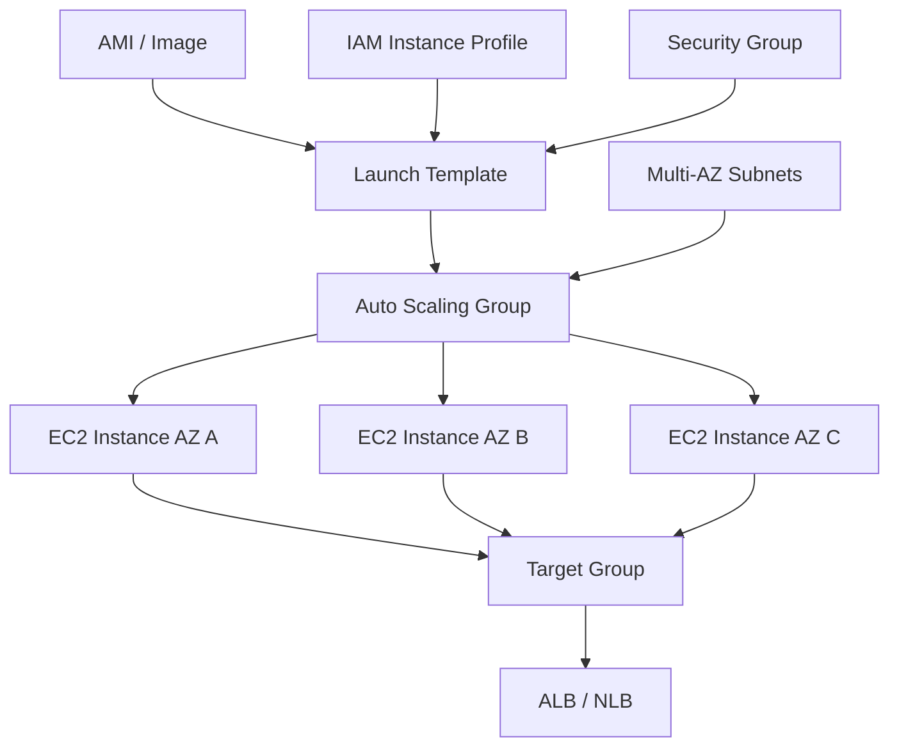
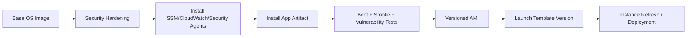
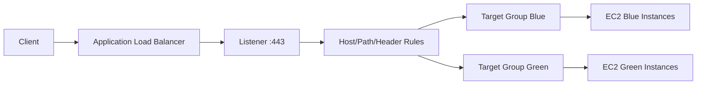
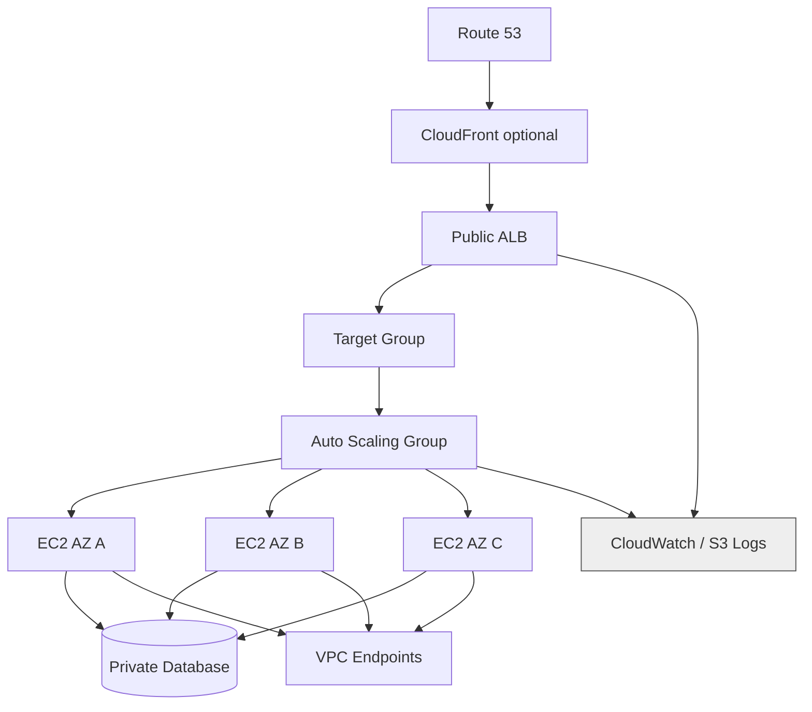
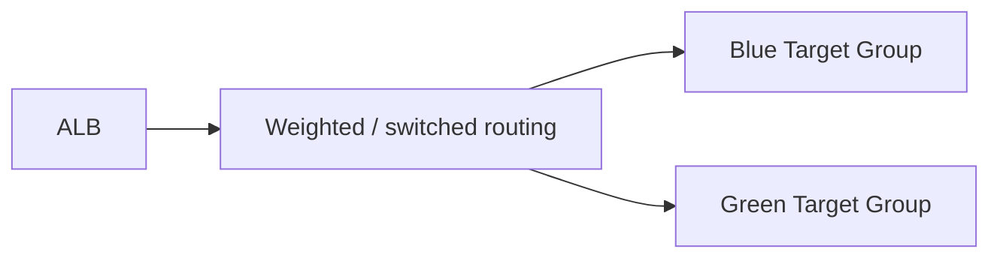

------
title: Learn AWS Engineering Mastery - Part 010
description: Production compute foundations with EC2, AMI strategy, launch templates, Auto Scaling Groups, lifecycle hooks, mixed instances, load balancing, health checks, deployment safety, cost, and failure modeling.
series: learn-aws
seriesTitle: Learn AWS Engineering Mastery
order: 10
partTitle: Compute Foundations: EC2, AMI, ASG, and Load Balancing
tags:
- aws
- ec2
- auto-scaling
- load-balancing
- compute
- operations
- reliability
- platform-engineering
date: 2026-06-30
---

# Learn AWS Engineering Mastery - Part 010

## Compute Foundations: EC2, AMI, ASG, and Load Balancing

Part ini membahas fondasi compute klasik di AWS: **EC2**, **AMI**, **Launch Template**, **Auto Scaling Group**, dan **Elastic Load Balancing**.

Walaupun serverless dan container semakin dominan, EC2 tetap penting untuk:

- workload legacy,
- stateful middleware,
- high-performance workloads,
- custom networking/security agent,
- regulated environments,
- migration lift-and-shift,
- Kubernetes/EKS worker nodes,
- batch processing,
- appliance/vendor software,
- specialized hardware seperti GPU, high memory, high network, dan local NVMe.

Target part ini bukan hanya “bisa launch EC2”. Targetnya adalah mampu mendesain **compute fleet** yang immutable, self-healing, observable, secure, cost-aware, dan predictable saat failure.

---

## 1. Target Skill ala Kaufman

Sub-skill compute yang harus dikuasai:

| Sub-skill | Target performa |
|---|---|
| EC2 mental model | Memahami EC2 sebagai instance lifecycle + network identity + storage attachment + IAM identity. |
| AMI strategy | Bisa memilih golden AMI, baked AMI, user-data bootstrap, patching, image pipeline, rollback. |
| Launch Template | Bisa mendefinisikan konfigurasi instance yang repeatable dan versioned. |
| Auto Scaling Group | Bisa mendesain desired/min/max capacity, health check, scaling policy, replacement, AZ balancing. |
| Load balancing | Bisa memilih ALB/NLB/GWLB, target group, listener, health check, TLS, deregistration, stickiness. |
| Deployment safety | Bisa melakukan rolling, instance refresh, blue/green, canary, lifecycle hook, rollback. |
| Capacity engineering | Bisa memilih instance family, purchase option, Spot, mixed instances, warm pool, scaling signal. |
| Security hardening | Bisa memakai IAM role, IMDSv2, SSM, SG, EBS encryption, patching, least privilege. |
| Observability | Bisa membaca EC2/ASG/ELB metrics, logs, health reason, scaling event, and instance boot diagnostics. |
| Failure modeling | Bisa menjelaskan apa yang terjadi saat instance, AZ, target group, AMI, or scaling policy gagal. |

**Performance target:** Anda harus bisa mendesain satu web/service compute layer dengan minimal 3 AZ, ALB/NLB, ASG, immutable AMI, scaling policy, health check, deployment strategy, logging, rollback, dan runbook incident.

---

## 2. Mental Model: EC2 bukan VM Tunggal, Tetapi Fleet Primitive

EC2 sering dipelajari sebagai “server virtual”. Itu terlalu sempit.

Dalam production AWS, EC2 harus dipahami sebagai:



Core model:

- **AMI** defines base machine image.
- **Launch Template** defines how instances are launched.
- **ASG** defines fleet desired state.
- **Load Balancer** defines traffic distribution and health gating.
- **Health check** determines whether instance is safe to receive traffic.
- **Scaling policy** changes capacity based on signal.
- **Lifecycle hooks** allow custom actions before in-service or termination.
- **Observability** tells whether the fleet is actually healthy.

A top-tier engineer rarely reasons about a single EC2 instance. They reason about **fleet behavior under change and failure**.

---

## 3. EC2 Core Concepts

### 3.1 EC2 Instance Identity

An EC2 instance has several identities:

| Identity | Meaning |
|---|---|
| Instance ID | AWS resource identity, e.g. `i-...`. |
| Private IP | Network identity inside VPC. |
| ENI | Elastic Network Interface attached to subnet/security group. |
| IAM role / instance profile | AWS API identity used by software running on instance. |
| Hostname | OS/DNS-level identity. |
| AMI lineage | Image identity and provenance. |
| Tags | Operational ownership identity. |

Do not use instance identity incorrectly:

- Do not hardcode instance private IP for service discovery.
- Do not use long-lived AWS keys on instance.
- Do not treat hostname as stable identity in autoscaled fleets.
- Do not assume instance replacement preserves local disk state.

### 3.2 Instance Lifecycle

EC2 lifecycle matters because automation depends on state transitions.

Common states:

- `pending`
- `running`
- `stopping`
- `stopped`
- `shutting-down`
- `terminated`

For ASG-managed instances, lifecycle includes additional fleet states such as launch, in service, terminating, standby, warm pool, and lifecycle hook wait states.

AWS EC2 Auto Scaling documentation describes the ASG instance lifecycle as starting when the group launches an instance and puts it into service, and ending when the group takes it out of service and terminates it.

### 3.3 Instance Families

Instance family choice is a performance and cost decision.

| Family style | Example use |
|---|---|
| General purpose | Web/API app, moderate CPU/memory. |
| Compute optimized | CPU-heavy services, encoding, high-throughput processing. |
| Memory optimized | In-memory caches, analytics, JVM heaps, databases. |
| Storage optimized | Local NVMe, high IOPS, log processing. |
| Accelerated computing | GPU/ML/HPC/video workloads. |
| Burstable | Low baseline with occasional bursts, dev/test, small services. |

Practical advice:

- Benchmark with real workload.
- Watch p95/p99 latency, not only average CPU.
- Consider Graviton/ARM if software stack supports it.
- Avoid overfitting to one instance type; use mixed instance policies where possible.
- Understand network bandwidth and EBS bandwidth limits, not just vCPU/RAM.

---

## 4. AMI Strategy

### 4.1 AMI as Supply Chain Artifact

An AMI is not just an OS snapshot. In mature organizations, AMI is part of the software supply chain.

It should answer:

- What OS base is used?
- What packages are installed?
- What hardening baseline is applied?
- What agents are installed?
- What vulnerabilities are known?
- Who approved it?
- Can it be reproduced?
- Can it be rolled back?
- Is it signed or provenance-tracked?

### 4.2 Golden AMI vs Baked App AMI vs Bootstrap

| Strategy | Description | Pros | Cons |
|---|---|---|---|
| Golden AMI | Common hardened base image. App installed at boot/deploy time. | Consistent baseline, reusable. | Boot time may be longer; app install failure at launch. |
| Baked App AMI | AMI includes app artifact and dependencies. | Fast launch, immutable, predictable rollback. | More image builds; artifact/image version coupling. |
| Thin AMI + User Data | Minimal image; bootstrap pulls everything. | Flexible, simple early stage. | Slow/fragile boot, external dependency at scale. |
| Container-on-EC2 | EC2 runs container runtime; app packaged as image. | App portability, simpler deploy. | Need container orchestration or custom process management. |

For critical production fleets, prefer **immutable deployment**: build artifact, bake image or container, promote version, replace instances. Avoid manually patching snowflake servers.

### 4.3 Image Pipeline



Quality gates:

- boot test,
- SSM connectivity,
- CloudWatch agent running,
- vulnerability scan,
- CIS/hardening check where applicable,
- app health endpoint,
- disk layout validation,
- IMDSv2 enforcement,
- no embedded secrets,
- rollback AMI retained.

### 4.4 User Data Boundary

User data is useful for light bootstrap, but dangerous as full deployment system.

Good user data:

- register instance with config service,
- fetch environment config,
- start agent,
- perform small finalization step,
- signal readiness.

Bad user data:

- installing hundreds of packages from internet,
- downloading unpinned artifacts,
- embedding secrets,
- doing database migrations implicitly,
- long unpredictable boot logic,
- hiding deployment failure.

---

## 5. Launch Templates

A **Launch Template** defines instance configuration that an Auto Scaling Group or EC2 launch uses.

Typical fields:

- AMI ID,
- instance type,
- key pair if still used,
- security groups,
- subnet/network interface options,
- IAM instance profile,
- block device mapping,
- EBS encryption,
- user data,
- metadata options,
- monitoring,
- tags,
- purchase option,
- placement settings.

AWS EC2 Auto Scaling documentation recommends launch templates for ASG instance configuration and provides launch-template-based ASG creation workflows.

### 5.1 Launch Template Versioning

Treat launch template versions as release artifacts.

Bad pattern:

- mutate default version manually,
- no changelog,
- ASG points to `$Latest`,
- deployment happens accidentally when template changes.

Better pattern:

- create explicit version per release,
- ASG points to approved version,
- deployment through instance refresh/blue-green,
- rollback by pointing to previous known-good version,
- version metadata includes AMI/app/build ID.

### 5.2 Metadata Options and IMDSv2

Instance Metadata Service provides metadata and temporary credentials to software on the instance. Enforce **IMDSv2** where possible to reduce SSRF-style metadata credential theft risk.

Launch template should set metadata options intentionally:

- `HttpTokens=required`,
- hop limit appropriate for workload,
- metadata endpoint enabled only if needed,
- no application dependency on metadata unless designed.

### 5.3 IAM Instance Profile

Software on EC2 should access AWS APIs through IAM role attached via instance profile.

Rules:

- no static AWS access keys on disk,
- one role per workload class,
- least privilege policy,
- permission boundary where appropriate,
- CloudTrail monitoring for sensitive actions,
- do not reuse broad admin instance profile for debugging.

---

## 6. Auto Scaling Group Deep Dive

### 6.1 ASG as Desired State Controller

Auto Scaling Group is a controller that tries to maintain desired capacity.

Important parameters:

| Parameter | Meaning |
|---|---|
| Minimum capacity | Lower bound of instances. |
| Maximum capacity | Upper bound of instances. |
| Desired capacity | Current target number of instances. |
| Subnets/AZs | Where instances are launched. |
| Launch template | How instances are launched. |
| Health check type | EC2 and/or ELB health signal. |
| Health check grace period | Time before judging new instance unhealthy. |
| Scaling policy | How desired capacity changes. |
| Termination policy | Which instances are terminated first. |

Mental model:

> ASG does not know your business semantics. It only reacts to configured health and scaling signals.

If the health signal is wrong, ASG will confidently do the wrong thing.

### 6.2 Health Checks

Health checks are the safety gate between infrastructure and traffic.

Types:

| Health check | Meaning |
|---|---|
| EC2 status checks | Instance/system-level AWS health. |
| ELB target health | Load balancer can reach target and health endpoint passes. |
| Custom app health | Application-specific readiness/liveness semantics. |

For web/API fleets behind load balancer, ASG should usually use ELB health checks so instances that cannot serve traffic are replaced.

AWS Elastic Load Balancing documentation describes target group health checks: targets must be registered with a target group, listener rules must reference the target group, relevant AZs must be enabled, and targets must pass initial checks before receiving traffic.

### 6.3 Health Endpoint Design

A health endpoint must be honest but not self-destructive.

Bad health endpoint:

- returns `200 OK` if process is alive but dependencies are broken,
- performs expensive database query every second,
- fails if optional dependency is down,
- requires auth token that load balancer does not have,
- returns random transient failures during startup,
- shares endpoint with human debug page.

Better design:

| Endpoint | Purpose |
|---|---|
| `/live` | Process is alive; used for restart/liveness. |
| `/ready` | Instance is ready to receive traffic. |
| `/health/deep` | Deep dependency check for diagnostics, not high-frequency LB health. |

For ALB target groups, configure path, matcher, interval, timeout, healthy/unhealthy threshold deliberately.

### 6.4 Scaling Policies

Common scaling types:

| Policy | Use case |
|---|---|
| Target tracking | Keep metric around target value, such as CPU 50% or ALB request count per target. |
| Step scaling | Scale by different amounts based on alarm breach size. |
| Simple scaling | Basic scale action; less commonly preferred for advanced fleets. |
| Scheduled scaling | Known predictable patterns. |
| Predictive scaling | Forecast-based capacity for regular patterns. |

AWS target tracking scaling policies automatically adjust ASG capacity based on a target metric value.

### 6.5 Choosing Scaling Signals

| Workload | Better signal | Weak signal |
|---|---|---|
| CPU-bound service | CPU utilization, queue backlog per instance. | Request count alone. |
| IO-bound service | Latency, disk/network saturation, queue depth. | CPU only. |
| Web API | ALB request count per target, p95 latency, CPU. | Average CPU only. |
| Worker fleet | Queue depth per instance, age of oldest message. | Instance count. |
| JVM service | CPU + heap/GC + latency + request count. | Memory average alone. |

For production, scaling should be linked to user-visible saturation, not only machine metrics.

### 6.6 Warmup, Cooldown, and Grace Period

Important timing controls:

| Control | Purpose |
|---|---|
| Health check grace period | Avoid terminating new instances before boot/app warmup finishes. |
| Default instance warmup | Time before new capacity contributes to scaling calculations. |
| Cooldown | Avoid oscillation in older/simple policies. |
| Deregistration delay | Allow in-flight requests to drain from target before termination. |
| Lifecycle hook timeout | Time for custom launch/termination action. |

Wrong timing causes:

- scale-out too slow,
- scale-in kills active requests,
- boot loops,
- false unhealthy replacement,
- capacity oscillation,
- cascading failure during deployment.

### 6.7 Lifecycle Hooks

AWS EC2 Auto Scaling lifecycle hooks let you run custom actions when instances launch or terminate. AWS documentation notes that lifecycle hooks provide a time window, one hour by default, before the instance transitions to the next state.

Use launch hooks for:

- configuration registration,
- warm cache,
- join cluster,
- run smoke check,
- notify deployment system,
- attach secondary resources.

Use terminate hooks for:

- drain connection,
- deregister from external system,
- upload logs,
- flush telemetry,
- graceful shutdown.

Do not abuse lifecycle hooks for slow, unreliable workflows. If hook logic fails often, the fleet becomes fragile.

### 6.8 Instance Refresh

Instance Refresh replaces instances in an ASG with instances using newer configuration.

Use for:

- new AMI rollout,
- launch template version change,
- security patch fleet replacement,
- controlled rolling deployment.

Design considerations:

- minimum healthy percentage,
- instance warmup,
- checkpoints,
- rollback strategy,
- alarm-based stop condition,
- compatibility with lifecycle hooks,
- capacity buffer during rollout.

### 6.9 Mixed Instances and Purchase Options

Mixed instances allow ASG to use multiple instance types and purchase options.

Benefits:

- better capacity availability,
- reduced Spot interruption risk,
- cost optimization,
- flexibility across generations/families.

Risks:

- performance variance,
- licensing constraints,
- architecture mismatch such as x86 vs ARM,
- memory/CPU imbalance,
- inconsistent local storage/network performance.

For Spot:

- make workload interruption-tolerant,
- handle two-minute interruption notice,
- checkpoint work,
- avoid single Spot pool dependency,
- use capacity-optimized allocation where suitable,
- do not run non-interruptible stateful critical service on Spot without architecture support.

---

## 7. Elastic Load Balancing

### 7.1 Load Balancer Types

| Type | Layer | Best for | Notes |
|---|---|---|---|
| Application Load Balancer | L7 HTTP/HTTPS/gRPC | Web apps, APIs, path/host routing, auth integration. | Rich request routing and HTTP features. |
| Network Load Balancer | L4 TCP/UDP/TLS | High throughput, static IP, low latency, TCP/UDP workloads. | Preserves source IP in many patterns; ideal for non-HTTP. |
| Gateway Load Balancer | L3 appliance insertion | Firewalls, IDS/IPS, virtual appliances. | Used for transparent network appliance scaling. |
| Classic Load Balancer | Legacy | Existing old workloads. | Avoid for new architectures unless legacy reason. |

Decision:

- Use **ALB** for most HTTP/HTTPS apps.
- Use **NLB** for TCP/UDP, static IP, very high performance, or preserving source behavior.
- Use **GWLB** for inspection appliance fleet.

### 7.2 ALB Mental Model



Components:

| Component | Meaning |
|---|---|
| Listener | Port/protocol entry point. |
| Listener rule | Routing decision by host/path/header/method/query/source IP. |
| Target group | Set of targets and health check config. |
| Target | EC2 instance, IP, Lambda, or another supported target type depending on LB. |
| Health check | Determines target readiness. |
| Security group | For ALB, controls inbound/outbound traffic. |
| Access logs | Request-level evidence in S3. |

### 7.3 NLB Mental Model

NLB is lower-level and optimized for L4 traffic.

Use NLB when:

- protocol is TCP/UDP/TLS not HTTP,
- static IP/EIP requirement exists,
- ultra-high throughput/low latency is needed,
- client source IP preservation matters,
- private service endpoint pattern needs NLB with PrivateLink.

Be careful:

- L7 routing is not available like ALB.
- Health checks differ by protocol.
- Security group behavior historically differed; always verify current NLB SG support and target architecture.
- TLS termination at NLB is possible but lacks ALB HTTP routing features.

### 7.4 Target Groups

Target group is the bridge between load balancer and compute fleet.

Design target groups per:

- application version,
- protocol/port,
- health check semantics,
- deployment color,
- service boundary,
- autoscaling relationship.

Avoid dumping unrelated apps into one target group. It destroys health isolation and deployment safety.

### 7.5 Deregistration Delay and Connection Draining

When an instance is removed from a target group, load balancer should stop sending new requests while allowing in-flight requests to complete.

Configure:

- deregistration delay,
- app graceful shutdown timeout,
- ASG lifecycle hook,
- systemd/container stop timeout,
- request timeout at ALB/app/proxy.

These values must be coherent.

Example:

| Setting | Value |
|---|---:|
| ALB deregistration delay | 60s |
| App graceful shutdown | 45s |
| ASG termination hook | 90s |
| Max request duration | 30s |

If app shutdown is 10s but deregistration delay is 300s, termination may still cut active requests. If request max duration is 5 minutes but termination hook is 60s, long requests will fail.

---

## 8. Production Web Fleet Reference Architecture



Baseline:

- ALB across at least two, preferably three, AZs.
- ASG across private subnets in multiple AZs.
- Instances have no public IP.
- Admin access via SSM Session Manager, not SSH bastion by default.
- Egress via NAT or private VPC endpoints.
- Health check targets readiness endpoint.
- Logs and metrics centralized.
- AMI deployment through launch template version + instance refresh.
- Security groups restrict ALB-to-instance and instance-to-dependency flows.
- IAM instance profile is least privilege.

---

## 9. Deployment Strategies on EC2/ASG

### 9.1 In-Place Deployment

Install new app version on existing instances.

Pros:

- simple mental model,
- less capacity overhead,
- can work with legacy tooling.

Cons:

- snowflake risk,
- rollback can be messy,
- instance state may differ,
- failure can poison existing capacity.

Use only when constraints demand it, and pair with strong deployment automation.

### 9.2 Rolling Replacement with Instance Refresh

Build new AMI/launch template version and gradually replace instances.

Pros:

- immutable,
- predictable rollback,
- works well with ASG,
- aligns with fleet model.

Cons:

- requires image pipeline,
- rollout timing needs careful health checks,
- capacity buffer may be needed.

### 9.3 Blue/Green with Target Groups

Maintain two fleets or target groups.



Pros:

- fast rollback,
- clear version boundary,
- supports pre-production smoke test.

Cons:

- higher temporary cost,
- database backward compatibility required,
- traffic/session handling needs design.

### 9.4 Canary

Send small percentage to new version.

Best when:

- observability is strong,
- app supports version coexistence,
- metrics are sensitive enough,
- rollback is automated or fast.

Do not do canary if you cannot detect failure quickly.

---

## 10. Security Hardening

### 10.1 Baseline Controls

| Control | Recommendation |
|---|---|
| Network placement | Instances in private subnets unless public exposure is required. |
| Access | Prefer SSM Session Manager over SSH. |
| IAM | Use least-privilege instance profile; no static AWS keys. |
| Metadata | Enforce IMDSv2. |
| Disk | Encrypt EBS volumes by default. |
| Secrets | Use Secrets Manager/Parameter Store, not user data or AMI. |
| Patch | Image pipeline or SSM Patch Manager strategy. |
| Logging | CloudWatch agent, system logs, app logs, audit logs. |
| Egress | Restrict with SG/NACL/proxy/NAT/firewall/VPC endpoints. |
| Tags | Owner, app, env, data classification, cost center, patch group. |

### 10.2 SSH and Bastion Anti-Pattern

Traditional pattern:

- public bastion,
- SSH key distribution,
- manual debugging,
- long-lived access,
- weak audit.

Better pattern:

- Session Manager,
- IAM-authenticated access,
- CloudTrail audit,
- no inbound SSH,
- temporary break-glass role,
- command logging where appropriate.

### 10.3 Secrets Boundary

Do not put secrets in:

- AMI,
- user data,
- environment variables without lifecycle control,
- launch template plaintext,
- logs,
- baked config files.

Use:

- Secrets Manager,
- Parameter Store SecureString,
- KMS encryption,
- short-lived tokens,
- IAM role-based retrieval,
- rotation workflow.

---

## 11. Observability

### 11.1 EC2 Metrics

Default EC2 metrics include CPU, network, disk status checks, and some host-level signals. For memory and disk filesystem usage, install CloudWatch Agent or another telemetry agent.

Track:

- CPU utilization,
- memory utilization,
- disk usage,
- disk I/O,
- network in/out,
- status check failed,
- process health,
- app latency,
- error rate,
- GC if JVM,
- dependency latency.

### 11.2 ASG Signals

Monitor:

- desired/min/max capacity,
- group in-service instances,
- pending instances,
- terminating instances,
- lifecycle hook timeout,
- scaling activities,
- failed launch reason,
- capacity rebalance events,
- instance refresh status.

### 11.3 ELB Signals

For ALB:

- request count,
- target response time,
- HTTP 4xx/5xx by LB and target,
- healthy/unhealthy host count,
- rejected connection count,
- target connection errors,
- TLS negotiation errors,
- access logs.

For NLB:

- active flow count,
- new flow count,
- processed bytes,
- healthy host count,
- TCP reset count,
- TLS metrics if termination is used.

### 11.4 Alerting Principles

Alert on user-impacting symptoms and capacity risk:

- no healthy targets,
- unhealthy host count > threshold,
- high 5xx from target,
- p95/p99 latency breach,
- scaling unable to add capacity,
- repeated instance launch failure,
- ASG at max capacity with saturation,
- status check failure spike,
- disk full soon,
- memory pressure,
- dependency outage.

Avoid alerting only on CPU > 80% without workload context.

---

## 12. Failure Modes

### 12.1 Instance Failure

Scenario: one instance dies.

Expected behavior:

- EC2/ELB health detects failure.
- Load balancer stops routing to target.
- ASG replaces instance.
- New instance boots from known launch template/AMI.
- Health check passes.
- Capacity returns to desired.

Failure if:

- health check is too shallow,
- ASG uses EC2 health only while app is broken,
- launch template points to bad AMI,
- user data fails,
- subnet lacks IP capacity,
- IAM role missing permission,
- target group health check misconfigured.

### 12.2 AZ Failure

Scenario: one AZ unavailable.

Expected behavior:

- Load balancer routes to healthy targets in remaining AZs.
- ASG launches replacement in healthy AZs if configured.
- Capacity remains enough for load.

Design requirement:

- ASG spans multiple AZs.
- Remaining AZ capacity can absorb traffic.
- Dependencies are multi-AZ too.
- App does not pin state to one AZ.

### 12.3 Bad AMI Rollout

Symptoms:

- new instances fail health check,
- instance refresh stalls,
- ASG repeatedly launches/terminates,
- capacity drops if minimum healthy percentage misconfigured.

Mitigation:

- bake validation,
- canary ASG,
- instance refresh checkpoints,
- automatic rollback/manual rollback to previous launch template version,
- alarms stop deployment,
- retain previous AMI.

### 12.4 Scaling Policy Failure

| Problem | Result | Mitigation |
|---|---|---|
| Metric too delayed | Scaling lags demand. | Use better metric/high-resolution where valuable. |
| CPU not correlated with saturation | Over/under scaling. | Use request count per target, queue depth, latency. |
| Max capacity too low | Fleet saturates. | Capacity planning and quota review. |
| Health grace too short | Booting instances killed. | Match grace period to real startup. |
| Scale-in too aggressive | User requests dropped. | Conservative scale-in, deregistration delay, lifecycle hook. |

### 12.5 Load Balancer Misconfiguration

Common failures:

- target group uses wrong port,
- health path requires authentication,
- ALB SG cannot reach instance SG,
- instance SG allows wrong source,
- listener certificate expired/wrong domain,
- target type mismatch,
- disabled AZ,
- sticky sessions hide uneven load,
- deregistration delay too short.

---

## 13. Capacity Engineering

### 13.1 Baseline Capacity Formula

A simple starting point:

```text
required_instances = ceil(peak_rps / safe_rps_per_instance)
```

But production planning must include:

- AZ failure headroom,
- deployment surge capacity,
- warmup time,
- traffic burstiness,
- dependency bottlenecks,
- p99 latency target,
- memory/GC behavior,
- CPU steal/noisy patterns,
- EBS/network limits,
- quota limits.

### 13.2 N+1 and AZ Loss

For three AZs, if you need to survive one AZ loss:

- do not run exactly 1/3 capacity per AZ with no headroom,
- ensure remaining 2 AZs can absorb load,
- check ASG max capacity,
- check subnet IP capacity,
- check regional EC2 capacity risk,
- consider capacity reservations for strict workloads.

### 13.3 Warm Pools

Warm pools keep pre-initialized instances ready to enter service faster.

Useful when:

- boot time is long,
- app warmup is expensive,
- scale-out latency matters,
- fleet has predictable spikes.

Trade-off:

- higher cost than cold launch,
- more lifecycle complexity,
- must ensure warm state does not go stale.

---

## 14. Cost Engineering

Cost levers:

| Lever | Notes |
|---|---|
| Instance family/right sizing | Avoid paying for unused CPU/memory/network. |
| Graviton | Often strong price/performance if app supports ARM. |
| Savings Plans | Good for steady compute usage. |
| Reserved Instances | Still relevant for certain EC2/RDS patterns, but understand commitment. |
| Spot | Great for interruptible/batch/worker workloads. |
| Schedule | Scale down nonprod outside working hours. |
| Mixed instances | Improve capacity and cost flexibility. |
| EBS sizing | gp3 tuning, avoid oversized io1/io2 unless needed. |
| Data transfer | Cross-AZ traffic and NAT can dominate compute savings. |
| Logs | Verbose logs at high traffic become real cost. |

Cost anti-pattern:

> Optimizing instance size while ignoring cross-AZ data transfer, NAT processing, and over-retained logs.

For real FinOps, calculate **unit cost**:

```text
cost_per_request = total_service_cost / successful_business_requests
cost_per_case = total_platform_cost / completed_cases
cost_per_job = compute_and_storage_cost / completed_jobs
```

---

## 15. Operational Runbooks

### 15.1 No Healthy Targets

Steps:

1. Check ALB target group health reason.
2. Confirm instance status checks.
3. Check app logs for startup/health endpoint errors.
4. Check security group from ALB to instance.
5. Check NACL and subnet route table.
6. Validate health check path/port/matcher.
7. Check recent deployment/launch template/AMI change.
8. Roll back launch template or deployment if correlated.
9. Increase capacity only if healthy version exists.
10. Document root cause.

### 15.2 ASG Cannot Launch Instances

Possible causes:

- invalid AMI,
- instance type unavailable,
- subnet IP exhaustion,
- IAM permission issue,
- launch template error,
- EBS/KMS permission issue,
- EC2 quota exceeded,
- capacity shortage,
- invalid security group/subnet.

Runbook should retrieve ASG scaling activities and failed launch reason first.

### 15.3 High Latency

Investigate:

- ALB target response time,
- request count per target,
- CPU/memory/GC,
- downstream DB/cache latency,
- network errors,
- connection pool saturation,
- target imbalance,
- AZ-specific degradation,
- recent deployment,
- scaling lag.

### 15.4 Spot Interruption

Runbook:

- receive interruption notice,
- stop accepting new work,
- checkpoint active job,
- drain target if serving traffic,
- complete lifecycle hook if used,
- ASG replaces capacity,
- observe backlog and latency.

---

## 16. Decision Matrix

### 16.1 EC2 vs ECS/Fargate vs Lambda

| Criterion | EC2 | ECS/Fargate | Lambda |
|---|---|---|---|
| OS control | High | Medium/low | Very low |
| Runtime flexibility | High | High within container model | Runtime limits apply |
| Operational burden | High | Medium | Low |
| Startup latency | Medium | Medium | Low to variable/cold start |
| Long-running process | Good | Good | Limited by max duration |
| Custom agents/kernel | Good | Limited | Not suitable |
| Scaling granularity | Instance | Task | Function invocation/concurrency |
| Cost efficiency | High if tuned | Good | Good for spiky/event workloads |
| Legacy migration | Strong | Medium | Weak unless refactored |

This part focuses EC2 because it remains the most explicit compute primitive. Later parts cover ECS/Fargate, EKS, and Lambda separately.

### 16.2 ALB vs NLB

| Need | Prefer |
|---|---|
| HTTP path/host routing | ALB |
| WebSocket/gRPC HTTP-aware routing | ALB |
| Static IP | NLB |
| TCP/UDP service | NLB |
| TLS offload with HTTP features | ALB |
| Very high L4 throughput | NLB |
| PrivateLink provider endpoint | NLB |
| WAF integration | ALB/CloudFront/API Gateway, not generic NLB pattern |

---

## 17. Anti-Patterns

| Anti-pattern | Why it hurts |
|---|---|
| Manually managed EC2 pets | No repeatability, weak recovery, high ops burden. |
| ASG with desired=1 for critical service | No instance failure tolerance. |
| Single-AZ fleet | AZ failure becomes service outage. |
| User data installs the world | Slow, fragile, non-reproducible launches. |
| ASG points to `$Latest` launch template | Accidental rollout. |
| Health check returns OK before app ready | Load balancer sends traffic too early. |
| Health check depends on optional service | Optional outage kills whole fleet. |
| No deregistration delay | In-flight requests fail during scale-in/deploy. |
| Static AWS keys on instance | Credential leakage and rotation problem. |
| Public SSH to instances | Larger attack surface and weak audit. |
| CPU-only autoscaling for IO-bound workload | Scaling does not match saturation. |
| Spot for non-interruptible stateful primary | Data loss/outage risk. |
| No rollback AMI | Failed rollout becomes emergency rebuild. |
| No subnet IP capacity planning | ASG cannot scale during incident. |

---

## 18. Deliberate Practice

### Exercise 1: Build a Production Web Fleet Design

Design:

- public ALB,
- private EC2 ASG across 3 AZs,
- golden AMI,
- launch template versioning,
- target tracking scaling,
- `/ready` health check,
- SSM access,
- CloudWatch logs/metrics,
- least-privilege instance profile,
- rollback plan.

Deliver:

- architecture diagram,
- ASG settings,
- launch template fields,
- target group health check config,
- scaling metric and threshold,
- failure mode table,
- runbook for no healthy targets.

### Exercise 2: Bad AMI Rollout Simulation

Scenario: new AMI causes app startup failure.

Explain:

- what ALB sees,
- what ASG sees,
- what instance refresh does,
- what alarms fire,
- how rollback happens,
- what evidence confirms root cause.

### Exercise 3: Scaling Signal Design

Given a queue worker fleet:

- average job duration 30s,
- target max queue age 2 minutes,
- each instance handles 4 concurrent jobs,
- traffic spike 10x at 09:00.

Design:

- scaling metric,
- min/max/desired,
- scheduled or predictive scaling,
- scale-in protection if jobs cannot be interrupted,
- Spot suitability.

### Exercise 4: ALB Health Check Debug

Given target unhealthy reason:

- validate listener rule,
- target group port,
- health path,
- matcher,
- instance SG,
- ALB SG,
- app binding address,
- route table/NACL,
- app logs.

---

## 19. Self-Correction Checklist

Before calling EC2 compute design production-ready:

- [ ] Fleet spans at least two AZs; critical workloads preferably three.
- [ ] Instances are managed by ASG, not manual pets.
- [ ] Launch template is versioned and not blindly using `$Latest`.
- [ ] AMI has provenance, test, patching, and rollback path.
- [ ] User data is minimal and deterministic.
- [ ] ASG health check uses appropriate EC2/ELB signal.
- [ ] Health endpoint reflects readiness accurately.
- [ ] Scaling metric correlates with saturation.
- [ ] Max capacity and EC2 quota support incident scale-out.
- [ ] Subnets have enough IP capacity.
- [ ] Load balancer target groups are separated by service/version as needed.
- [ ] Deregistration delay and app shutdown are aligned.
- [ ] IAM instance profile is least privilege.
- [ ] IMDSv2 is required where possible.
- [ ] No inbound SSH is required for normal operation.
- [ ] Logs/metrics are centralized.
- [ ] Alarms detect user impact and fleet degradation.
- [ ] Deployment rollback is tested.
- [ ] AZ failure capacity has been modeled.
- [ ] Cost model includes instance, EBS, data transfer, NAT, and logs.

---

## 20. Engineering Judgment Summary

EC2 is simple to start and easy to operate badly.

The mature mental model is:

> EC2 production architecture is not about launching servers. It is about controlling fleet replacement, traffic admission, scaling, security identity, and failure recovery.

Strong design has these properties:

- immutable or at least reproducible instances,
- ASG-controlled desired state,
- health checks that represent real readiness,
- load balancer as traffic safety gate,
- multi-AZ capacity and failure tolerance,
- least privilege instance identity,
- no manual access dependency,
- observable scaling and health transitions,
- rollbackable launch template/AMI versions,
- cost model tied to unit economics.

When EC2 is treated as a fleet primitive, it remains a powerful foundation. When treated as manually maintained servers, it becomes cloud-hosted legacy infrastructure.

---

## References

- Amazon EC2 Auto Scaling lifecycle — https://docs.aws.amazon.com/autoscaling/ec2/userguide/ec2-auto-scaling-lifecycle.html
- Auto Scaling launch templates — https://docs.aws.amazon.com/autoscaling/ec2/userguide/launch-templates.html
- Create an Auto Scaling group using a launch template — https://docs.aws.amazon.com/autoscaling/ec2/userguide/create-asg-launch-template.html
- Target tracking scaling policies for Amazon EC2 Auto Scaling — https://docs.aws.amazon.com/autoscaling/ec2/userguide/as-scaling-target-tracking.html
- Amazon EC2 Auto Scaling lifecycle hooks — https://docs.aws.amazon.com/autoscaling/ec2/userguide/lifecycle-hooks.html
- Application Load Balancer target groups — https://docs.aws.amazon.com/elasticloadbalancing/latest/application/load-balancer-target-groups.html
- Health checks for Application Load Balancer target groups — https://docs.aws.amazon.com/elasticloadbalancing/latest/application/target-group-health-checks.html
- Health checks for Network Load Balancer target groups — https://docs.aws.amazon.com/elasticloadbalancing/latest/network/target-group-health-checks.html
