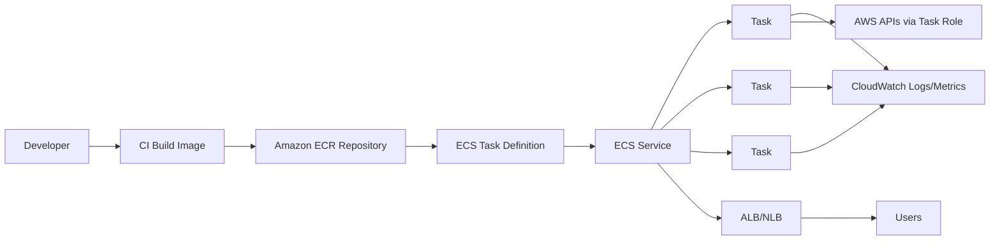
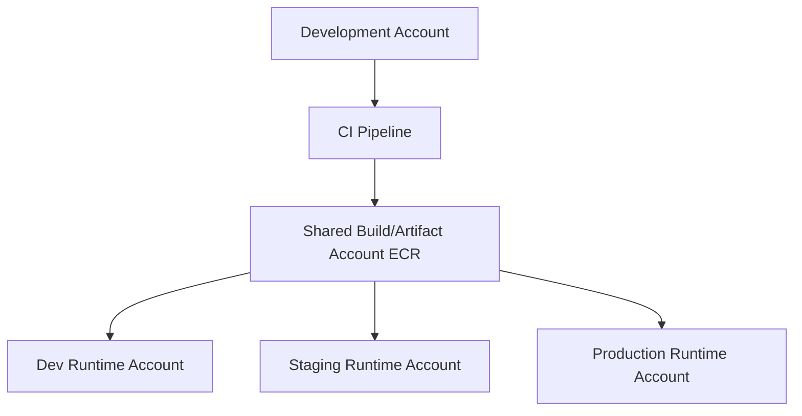
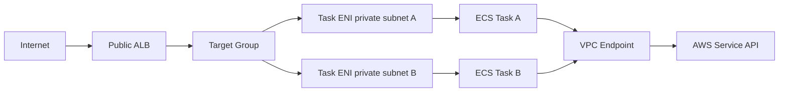
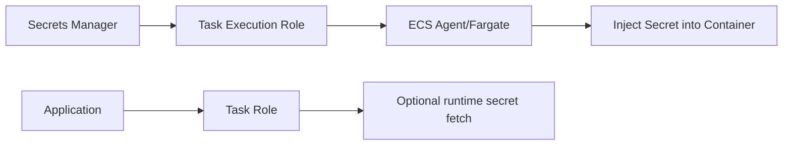
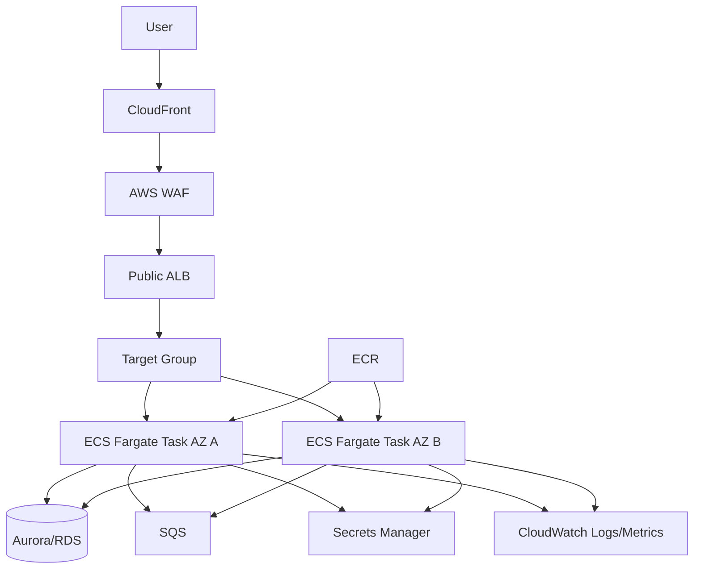
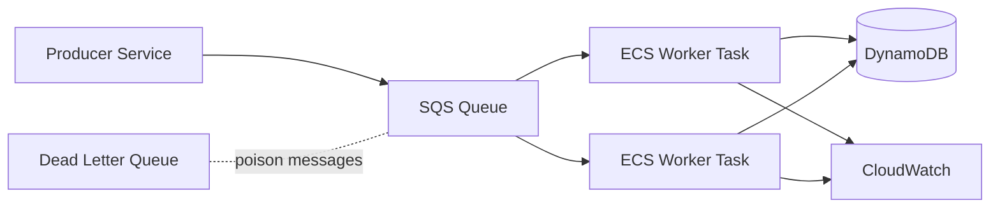

------
title: Learn AWS Engineering Mastery - Part 011
description: Container platform engineering with Amazon ECR, Amazon ECS, and AWS Fargate for production-grade services, batch workers, event consumers, and internal platform golden paths.
series: learn-aws
seriesTitle: Learn AWS Engineering Mastery
order: 11
partTitle: Container Platform Engineering with ECR, ECS, and Fargate
tags:
- aws
- ecs
- ecr
- fargate
- containers
- platform-engineering
date: 2026-06-30
---

# Part 011 — Container Platform Engineering with ECR, ECS, and Fargate

## 1. Target Skill

Setelah menyelesaikan bagian ini, targetnya bukan hanya bisa menjalankan container di AWS. Target yang lebih tinggi adalah mampu mendesain **container platform yang predictable, secure, cost-aware, observable, dan mudah dipakai oleh tim aplikasi**.

Seorang engineer yang kuat di area ini harus bisa menjawab pertanyaan seperti:

- Kapan ECS/Fargate lebih tepat dibanding EC2, EKS, Lambda, atau App Runner?
- Bagaimana memisahkan image build concern, runtime concern, IAM concern, deployment concern, dan traffic concern?
- Bagaimana mendesain ECS service yang bisa rollout aman, rollback cepat, dan tidak menurunkan availability saat deployment?
- Bagaimana mengelola registry, tag, image immutability, lifecycle policy, scanning, dan cross-account image pull?
- Bagaimana membaca failure ECS: task pending, image pull error, task unhealthy, target group unhealthy, CPU throttling, memory kill, secret access denied, atau subnet IP exhaustion?
- Bagaimana membuat golden path agar developer hanya perlu membawa image dan service contract, bukan mengerti seluruh detail VPC/IAM/load balancer?

Part ini adalah jembatan antara compute foundation Part 010 dan container orchestration yang lebih kompleks di Part 012.

## 2. Kaufman Frame: Pecah Skill ECS/Fargate Menjadi Sub-Skill

Josh Kaufman menekankan deconstruction: pecah skill besar menjadi sub-skill kecil yang bisa dilatih. Untuk ECS/Fargate, sub-skill pentingnya adalah:

| Sub-skill | Yang Harus Dikuasai | Bukti Penguasaan |
|---|---|---|
| Container artifact discipline | Image tagging, digest pinning, ECR policy, lifecycle, vulnerability posture | Bisa menjelaskan image mana yang sedang running, siapa yang boleh pull/push, dan bagaimana cleanup bekerja |
| ECS runtime model | Cluster, task definition, task, service, scheduler, deployment, capacity provider | Bisa membaca mapping dari kode aplikasi ke task yang berjalan |
| Fargate capacity model | CPU/memory sizing, task-level isolation, platform version, ephemeral storage, Fargate Spot | Bisa menghitung cost/performance dan memilih workload yang cocok |
| Networking model | `awsvpc`, ENI, subnet, security group, ALB/NLB, Cloud Map/Service Connect | Bisa menjelaskan jalur traffic ingress, east-west, dan egress |
| IAM model | Task execution role, task role, service-linked role, cross-account ECR | Bisa membedakan permission untuk agent dan permission untuk application code |
| Release safety | Rolling deployment, circuit breaker, blue/green, health check, rollback | Bisa mendesain deployment tanpa downtime unnecessary |
| Observability | Logs, metrics, traces, events, Container Insights, service alarms | Bisa menemukan penyebab task gagal tanpa SSH ke host |
| Operations | Runbook, scaling, drain, secrets rotation, deployment freeze, incident handling | Bisa mengoperasikan service saat pressure production |

Prinsip efisiennya: jangan mulai dari semua fitur ECS. Mulai dari invariants yang menentukan benar/salahnya desain.

## 3. Mental Model: ECS Bukan Kubernetes Lite

Kesalahan umum adalah melihat ECS sebagai “Kubernetes yang lebih sederhana”. Itu kurang tepat.

ECS adalah **AWS-native container scheduler**. Ia sangat terintegrasi dengan IAM, VPC, CloudWatch, ALB/NLB, EventBridge, Cloud Map, ECR, Secrets Manager, Systems Manager Parameter Store, Auto Scaling, dan Fargate.

EKS memberi Kubernetes API dan ecosystem. ECS memberi **container orchestration yang lebih opinionated, lebih sedikit moving parts, dan lebih AWS-native**.



Core mental model:

```text
Image is the deployable artifact.
Task definition is the runtime contract.
Task is the running unit.
Service is the desired-state controller.
Cluster is the scheduling boundary.
Capacity provider is the compute supply strategy.
Load balancer/service discovery is the traffic boundary.
IAM role is the privilege boundary.
```

Amazon ECS documentation mendefinisikan task definition sebagai blueprint aplikasi dalam format JSON yang mendeskripsikan container dan parameter runtime seperti image, resources, port, dan logging. Amazon ECR private repository menyimpan Docker image, OCI image, dan OCI-compatible artifact. AWS Fargate untuk ECS memungkinkan menjalankan container tanpa mengelola server atau cluster EC2 instance.

## 4. ECS Primitive yang Wajib Dipahami

### 4.1 Cluster

Cluster adalah grouping logical tempat ECS menjalankan task dan service. Untuk Fargate, cluster bukan kumpulan host yang Anda kelola; cluster lebih merupakan scheduling namespace dan management boundary.

Gunakan cluster boundary untuk:

- environment boundary: dev, staging, prod;
- workload boundary: public app, internal worker, regulated workload;
- operational boundary: team ownership, lifecycle, observability, alarm routing;
- blast radius boundary: deployment dan quota isolation.

Jangan memakai satu cluster raksasa hanya karena “ECS bisa”. Cluster yang terlalu besar dan campur-aduk membuat ownership, IAM, logging, dan incident response kabur.

### 4.2 Task Definition

Task definition adalah kontrak runtime. Isinya biasanya:

- container image;
- CPU dan memory;
- port mappings;
- environment variables;
- secrets;
- task role;
- execution role;
- log configuration;
- health check;
- volume;
- runtime platform;
- network mode;
- ephemeral storage configuration;
- sidecar container bila diperlukan.

Mental model penting:

```text
Dockerfile says how the artifact is built.
Task definition says how the artifact is run in AWS.
Service says how many copies should stay alive.
```

Task definition harus diperlakukan sebagai versioned deployment contract. Jangan diedit manual di console untuk production. Gunakan IaC atau pipeline-generated revision.

### 4.3 Task

Task adalah instansiasi task definition. Ia bisa dijalankan sebagai:

- service task: long-running process yang dipertahankan scheduler;
- run task: one-off job;
- scheduled task: job berbasis EventBridge;
- event consumer: long-running worker yang membaca SQS/Kinesis/kafka-like source;
- migration task: database migration, sebaiknya dengan guardrail kuat.

Task adalah unit failure. Bila task mati, scheduler service dapat menggantinya. Tetapi task replacement bukan jaminan application correctness. Jika aplikasi crash-loop karena config salah, scheduler hanya membuat crash-loop lebih konsisten.

### 4.4 Service

Service adalah desired-state controller untuk task. Ia menjaga `desiredCount`, mengatur deployment, melakukan replacement ketika task unhealthy, dan terintegrasi dengan load balancer atau service discovery.

Service cocok untuk:

- HTTP API;
- gRPC service;
- background worker long-running;
- websocket gateway;
- consumer yang harus selalu hidup;
- internal service yang ditemukan melalui DNS/service mesh-ish boundary.

Jangan gunakan ECS service untuk workload yang seharusnya batch finite tanpa daemon semantics. Untuk batch, pertimbangkan ECS RunTask, EventBridge Scheduler, AWS Batch, Step Functions, atau Lambda tergantung kasus.

### 4.5 Capacity Provider

Capacity provider mendefinisikan sumber compute. ECS mendukung Fargate/Fargate Spot untuk serverless container capacity, dan Auto Scaling group capacity provider untuk EC2-backed cluster.

Untuk Fargate:

- tidak mengelola host;
- satu task mendapat resource Fargate sesuai CPU/memory task-level;
- cocok untuk workload dengan isolation dan operasional sederhana;
- cost lebih mudah dipahami per task;
- kurang cocok bila butuh host-level tuning ekstrem, daemon host, custom kernel, GPU khusus tertentu, atau bin-packing cost optimization yang sangat agresif.

Untuk EC2 capacity provider:

- Anda mengelola instance family, AMI, patching, scaling, placement, dan bin packing;
- lebih fleksibel;
- bisa lebih murah pada utilisasi tinggi;
- lebih besar beban day-2 operations.

## 5. ECR sebagai Artifact Boundary

ECR bukan hanya tempat “taruh image”. Ia adalah boundary antara build system dan runtime system.

### 5.1 Artifact Discipline

Praktik yang kuat:

- gunakan immutable image tag untuk production;
- simpan metadata commit SHA, build ID, SBOM reference, dan provenance;
- deploy berdasarkan image digest untuk environment kritis;
- hindari tag floating seperti `latest` pada production;
- pisahkan repository berdasarkan service, bukan satu repo campur semua image;
- gunakan lifecycle policy agar repository tidak menjadi dumping ground;
- gunakan repository policy/IAM untuk cross-account pull;
- aktifkan scanning sesuai risk posture organisasi;
- kelola base image update sebagai planned maintenance, bukan kebetulan.

### 5.2 Tag vs Digest

Tag adalah label mutable kecuali repository diset immutable. Digest adalah content-addressed identity.

```text
Tag answers: what name did we give this image?
Digest answers: exactly what bytes are being run?
```

Untuk production regulated workload, digest lebih defensible karena menjawab pertanyaan audit: “artifact persis mana yang berjalan saat insiden?”

### 5.3 Lifecycle Policy

ECR lifecycle policy mengontrol lifecycle image di private repository. AWS menjelaskan bahwa lifecycle policy berisi satu atau lebih rule yang menentukan action berdasarkan expiration criteria, dan action lifecycle dicatat sebagai event CloudTrail.

Contoh policy praktis:

```json
{
  "rules": [
    {
      "rulePriority": 1,
      "description": "Keep last 30 production images",
      "selection": {
        "tagStatus": "tagged",
        "tagPrefixList": ["prod-"],
        "countType": "imageCountMoreThan",
        "countNumber": 30
      },
      "action": {
        "type": "expire"
      }
    },
    {
      "rulePriority": 2,
      "description": "Expire untagged images after 7 days",
      "selection": {
        "tagStatus": "untagged",
        "countType": "sinceImagePushed",
        "countUnit": "days",
        "countNumber": 7
      },
      "action": {
        "type": "expire"
      }
    }
  ]
}
```

Gunakan lifecycle policy preview sebelum apply pada repository penting.

### 5.4 Cross-Account Registry Pattern

Enterprise pattern umum:



Keuntungannya:

- artifact promotion lebih jelas;
- production tidak perlu build image;
- CI permission tidak terlalu luas ke runtime account;
- audit chain lebih bersih.

Risikonya:

- repository policy harus benar;
- KMS key untuk encrypted repository harus kompatibel dengan cross-account access;
- image pull failure bisa terjadi saat execution role tidak punya akses;
- regional replication perlu dipikirkan untuk multi-region.

## 6. Task Role vs Execution Role

Ini salah satu source bug ECS paling sering.

| Role | Dipakai Oleh | Untuk Apa | Contoh Permission |
|---|---|---|---|
| Task execution role | ECS/Fargate agent | Pull image, write logs, fetch secrets at task startup | `ecr:GetAuthorizationToken`, `logs:PutLogEvents`, access secret for injection |
| Task role | Application code di dalam container | Akses AWS API sebagai aplikasi | `s3:GetObject`, `dynamodb:PutItem`, `sqs:ReceiveMessage` |
| Service-linked role | ECS service | ECS mengelola resource AWS terkait | Load balancer integration, service operations |
| Container instance role | EC2 host bila ECS on EC2 | Register host ke cluster dan agent operation | ECS agent permissions |

AWS ECS documentation membedakan task execution role yang memberi agent izin memanggil AWS API atas nama Anda, dan task IAM role yang memberi container application permission untuk mengakses AWS service.

Invariant:

```text
Application permissions belong in task role.
Platform bootstrap permissions belong in execution role.
```

Anti-pattern:

```text
Put broad S3/DynamoDB permission in execution role.
```

Konsekuensinya: aplikasi mungkin tampak “bekerja” saat testing, tetapi privilege boundary salah. Saat ada container compromise, audit akan sulit menjelaskan permission mana yang memang milik aplikasi.

## 7. Fargate Runtime Model

Fargate membuat developer tidak perlu mengelola EC2 host. Tetapi “tidak mengelola host” bukan berarti “tidak ada constraint”.

Constraint yang harus dipikirkan:

- CPU/memory harus sesuai kombinasi yang didukung;
- setiap task memiliki network attachment dengan `awsvpc` mode;
- subnet IP capacity menjadi constraint nyata;
- startup time lebih lambat dari process biasa;
- tidak bisa mengandalkan host-level daemon sembarangan;
- ephemeral storage terbatas dan harus diperlakukan sebagai temporary;
- Spot interruption harus ditangani bila memakai Fargate Spot;
- runtime platform harus konsisten untuk architecture seperti `X86_64` atau `ARM64`.

AWS menyatakan Fargate untuk ECS memungkinkan menjalankan container tanpa provision/configure/scale cluster EC2; untuk Fargate task definition, CPU dan memory ditentukan di level task.

### 7.1 Kapan Fargate Sangat Cocok

Fargate cocok ketika:

- tim ingin mengurangi beban host operations;
- workload stateless;
- traffic bervariasi;
- isolation per task penting;
- compliance ingin mengurangi surface area patching host;
- service ownership tersebar ke banyak tim;
- platform team ingin golden path sederhana.

### 7.2 Kapan Fargate Kurang Cocok

Fargate kurang cocok ketika:

- workload sangat besar dan steady dengan cost sensitivity ekstrem;
- perlu privileged container atau host-level customization;
- perlu daemonset-like node agent kompleks;
- perlu GPU/accelerator spesifik yang lebih cocok di EC2/EKS atau service lain;
- workload butuh local disk besar dan long-lived;
- latency startup sangat kritis;
- perlu kontrol kernel/network stack granular.

## 8. Networking ECS/Fargate

Untuk Fargate, network mode yang umum adalah `awsvpc`. Setiap task mendapatkan elastic network interface dan IP dari subnet.



Implication:

- task security group menjadi application firewall boundary;
- subnet IP exhaustion bisa mencegah task start;
- route table subnet menentukan egress path;
- VPC endpoint mengurangi kebutuhan internet/NAT untuk AWS API tertentu;
- ALB target type untuk Fargate biasanya `ip`, bukan `instance`;
- private service bisa hidup tanpa public IP.

### 8.1 Subnet Choice

Pattern umum:

| Workload | Subnet | Public IP? | Egress |
|---|---|---|---|
| Public-facing web behind ALB | Task di private subnet; ALB di public subnet | Tidak untuk task | NAT atau VPC endpoint |
| Internal service | Private subnet | Tidak | VPC endpoint/NAT/internal |
| Batch worker | Private subnet | Tidak | Endpoint ke SQS/S3/ECR/CloudWatch bila mungkin |
| Temporary dev service | Private atau public sesuai guardrail | Hindari public task | Minimal egress |

Jangan letakkan task production langsung public hanya karena ingin cepat. Public ingress seharusnya dikendalikan oleh ALB/NLB/API Gateway/CloudFront/WAF boundary.

### 8.2 Security Group Design

Good baseline:

- ALB SG menerima 443 dari internet atau CloudFront prefix/origin boundary;
- task SG menerima traffic hanya dari ALB SG pada port aplikasi;
- task SG egress dibatasi sesuai kebutuhan jika organisasi sudah punya egress control maturity;
- database SG menerima dari task SG, bukan CIDR luas;
- worker SG menerima tidak ada inbound kecuali perlu health/admin internal.

```text
User -> CloudFront/WAF -> ALB SG -> Task SG -> DB SG
```

## 9. Ingress Patterns

### 9.1 ALB + ECS Service

Cocok untuk HTTP/HTTPS:

- path-based routing;
- host-based routing;
- TLS termination;
- target group health check;
- weighted/rule-based traffic;
- integration dengan WAF.

### 9.2 NLB + ECS Service

Cocok untuk:

- TCP/UDP;
- very high throughput;
- static IP-like needs;
- private link provider pattern;
- gRPC tertentu bila membutuhkan L4 characteristics.

### 9.3 API Gateway + VPC Link + ECS

Cocok ketika butuh:

- API management;
- auth/throttling/usage plan;
- public API edge;
- request validation;
- integration boundary ke private service.

Trade-off: API Gateway menambah latency dan cost per request. Jangan gunakan bila hanya butuh simple internal routing.

### 9.4 CloudFront + ALB

Cocok untuk:

- global edge cache;
- TLS dan WAF edge;
- static/dynamic acceleration;
- origin shielding;
- security header dan path routing edge.

## 10. Service Discovery dan East-West Traffic

Ada beberapa pendekatan:

| Approach | Cocok Untuk | Catatan |
|---|---|---|
| ALB internal | HTTP service internal dengan rule routing | Mudah diamati, lebih mahal dari DNS sederhana |
| Cloud Map | DNS-based discovery | Cocok service-to-service sederhana |
| ECS Service Connect | Service discovery + traffic telemetry/proxy capabilities | Baik untuk platform standardization |
| Private API Gateway | API governance internal | Cocok bila perlu auth/throttle/api lifecycle |
| Event-driven | Decoupled async communication | Cocok untuk reduce temporal coupling |

Golden rule:

```text
Do not make every internal call synchronous just because service discovery is available.
```

Jika komunikasi tidak membutuhkan immediate response, gunakan SQS/SNS/EventBridge/Step Functions.

## 11. Deployment Model

### 11.1 Rolling Deployment

Rolling deployment adalah default yang sering cukup. ECS mengganti task lama dengan task baru sambil menjaga availability berdasarkan konfigurasi seperti minimum healthy percent dan maximum percent.

AWS menjelaskan bahwa saat rolling deployment, ECS mengganti task unhealthy untuk menjaga `minimumHealthyPercent`, dan scheduler dapat meluncurkan replacement task sebelum menghentikan task lama bila `maximumPercent` memungkinkan.

Contoh reasoning:

```text
Desired count = 4
minimumHealthyPercent = 100
maximumPercent = 200

During deploy:
- ECS may run up to 8 tasks temporarily.
- It should keep at least 4 healthy tasks.
- Capacity/subnet/IP/quota must support temporary surge.
```

Jika subnet IP atau quota tidak cukup untuk surge, deployment bisa stuck.

### 11.2 Deployment Circuit Breaker

Deployment circuit breaker mendeteksi service deployment yang gagal mencapai steady state dan dapat rollback ke deployment terakhir yang sukses.

Gunakan untuk:

- menghindari deployment stuck terlalu lama;
- mengurangi waktu recovery dari bad revision;
- memberi signal jelas ke pipeline.

Tetapi circuit breaker bukan pengganti observability. Ia memberi tahu “deployment gagal”, bukan selalu menjelaskan root cause.

### 11.3 Blue/Green Deployment

ECS blue/green deployment dengan CodeDeploy memungkinkan validasi service revision sebelum production traffic dialihkan.

Cocok untuk:

- API kritikal;
- perubahan runtime risk tinggi;
- butuh canary/traffic shifting;
- rollback harus sangat cepat;
- regulated workload dengan approval gate.

Trade-off:

- lebih banyak resource sementara;
- lebih kompleks setup listener/target group;
- health check harus benar;
- database schema compatibility harus dijaga.

## 12. Health Check Design

Health check yang buruk lebih berbahaya dari tidak ada health check karena memberi sinyal palsu.

### 12.1 Container Health Check

Container health check menjawab:

```text
Is the process inside the container healthy enough to keep running?
```

Jangan terlalu berat. Health check yang melakukan query besar ke DB setiap beberapa detik bisa menjadi self-inflicted DDoS.

### 12.2 Load Balancer Health Check

Load balancer health check menjawab:

```text
Can this task serve traffic from this load balancer path?
```

Endpoint `/health` sebaiknya mengembalikan:

- liveness minimal;
- readiness untuk dependency critical;
- tidak membocorkan detail internal;
- timeout pendek;
- behavior jelas saat dependency degraded.

### 12.3 Readiness vs Liveness

ECS tidak memiliki primitive readiness/liveness seperti Kubernetes, tetapi Anda tetap harus memisahkan konsepnya secara aplikasi:

- liveness: process masih bisa berjalan;
- readiness: process siap menerima traffic;
- dependency readiness: dependency yang diperlukan untuk request path utama tersedia.

## 13. Autoscaling

ECS service autoscaling biasanya memakai Application Auto Scaling.

Metric umum:

- CPU utilization;
- memory utilization;
- ALB request count per target;
- SQS queue depth per task;
- custom metric seperti active connection, consumer lag, p95 latency.

### 13.1 Scaling API Service

Untuk HTTP API, scaling berbasis CPU saja sering terlambat. Request count per target atau latency-based custom metric lebih dekat ke user experience.

```text
If p95 latency grows before CPU grows,
CPU target tracking is not enough.
```

### 13.2 Scaling Worker

Untuk SQS worker, gunakan backlog-per-task:

```text
backlog_per_task = visible_messages / running_tasks
```

Scaling decision:

- scale out ketika backlog_per_task di atas threshold;
- scale in hati-hati agar tidak menghentikan task yang sedang memproses message;
- visibility timeout harus lebih besar dari processing time;
- idempotency wajib.

### 13.3 Fargate Spot

Fargate Spot cocok untuk interruption-tolerant workload. AWS menyatakan Fargate Spot berjalan di spare capacity dan task dapat diinterupsi dengan peringatan dua menit saat capacity dibutuhkan kembali.

Gunakan untuk:

- batch processing idempotent;
- async worker dengan checkpoint;
- dev/test workload;
- stateless non-critical worker.

Hindari untuk:

- primary low-latency API tanpa fallback;
- stateful task yang tidak bisa checkpoint;
- workload regulated yang tidak punya recovery semantics jelas.

## 14. Secrets dan Configuration

Gunakan Secrets Manager atau Systems Manager Parameter Store untuk secret/config sensitive. Jangan bake secret ke image. Jangan taruh plaintext secret di environment variable biasa melalui IaC repository.

Pattern:



Ada dua model:

| Model | Cara Kerja | Trade-off |
|---|---|---|
| Startup injection | ECS inject secret saat task start | Sederhana, rotation butuh task restart agar value baru dipakai |
| Runtime fetch | App fetch secret via SDK | Lebih fleksibel, app harus implement caching/error handling |

Untuk production, dokumentasikan:

- siapa owner secret;
- rotation interval;
- blast radius bila secret bocor;
- service yang menggunakan secret;
- prosedur restart/rollout setelah rotation;
- alarm untuk access denied atau unusual access.

## 15. Logging, Metrics, Tracing

### 15.1 Logs

Baseline:

- stdout/stderr ke CloudWatch Logs;
- JSON structured logs;
- correlation ID;
- request ID;
- tenant ID bila aman dan tidak melanggar privacy;
- deployment version/image digest;
- log retention policy;
- sensitive data redaction.

### 15.2 Metrics

Metric penting:

- running task count;
- desired task count;
- CPU/memory;
- deployment failure;
- target group healthy host count;
- 4xx/5xx;
- latency p50/p95/p99;
- queue backlog;
- task restart count;
- image pull failures;
- OOM count bila dapat dideteksi dari stop reason.

### 15.3 Tracing

Untuk service mesh ringan atau distributed tracing:

- gunakan OpenTelemetry collector sidecar bila perlu;
- propagate trace context;
- jangan trace semua request high-volume tanpa sampling strategy;
- tandai AWS dependency call;
- masukkan deployment version sebagai resource attribute.

## 16. Common Failure Modes

| Symptom | Kemungkinan Penyebab | Cara Berpikir |
|---|---|---|
| Task stuck `PENDING` | Subnet IP habis, capacity unavailable, invalid platform config | Cek ECS event, subnet free IP, quota, capacity provider |
| `CannotPullContainerError` | ECR permission, network ke ECR, image tag tidak ada, KMS access | Cek execution role, VPC endpoint/NAT, repo policy, digest/tag |
| Task starts then stops | App crash, env missing, secret denied, command salah | Cek stopped reason dan logs awal container |
| ALB target unhealthy | Wrong port, health path salah, security group, app belum ready | Cek target health reason, SG, container port mapping |
| Deployment stuck | Health check terlalu strict, capacity surge kurang, bad revision | Cek service events, min/max percent, target group health |
| AccessDenied dari app | Task role salah, policy boundary/SCP, region/resource ARN salah | Bedakan task role vs execution role |
| High 5xx during deploy | Graceful shutdown buruk, deregistration delay salah, readiness buruk | Review signal handling dan LB drain |
| Cost naik tiba-tiba | Desired count/autoscaling salah, logs verbose, NAT data processing | Cek Cost Explorer, metrics, log ingestion |
| Worker duplicate processing | SQS visibility timeout, non-idempotent handler | Fix idempotency dan timeout |

## 17. Graceful Shutdown

Container production harus menangani termination signal.

Untuk API service:

1. terima SIGTERM;
2. berhenti menerima request baru;
3. selesaikan in-flight request dalam batas waktu;
4. flush logs/metrics;
5. exit cleanly.

Untuk worker:

1. terima SIGTERM;
2. jangan ambil message baru;
3. selesaikan atau checkpoint message aktif;
4. extend visibility timeout bila aman;
5. exit tanpa menghilangkan work.

Jika aplikasi mengabaikan SIGTERM, deployment dan scale-in akan menghasilkan error sporadis.

## 18. Platform Golden Path untuk ECS/Fargate

Platform team sebaiknya tidak meminta setiap tim aplikasi memahami seluruh detail AWS. Buat abstraction yang aman.

### 18.1 Input dari Developer

Developer cukup memberikan:

```yaml
serviceName: payment-api
image: 123456789012.dkr.ecr.ap-southeast-1.amazonaws.com/payment-api@sha256:...
port: 8080
cpu: 512
memory: 1024
replicas:
  min: 2
  max: 10
healthCheck:
  path: /health
  intervalSeconds: 15
routes:
  - host: payment.internal.example.com
secrets:
  - PAYMENT_DB_PASSWORD
permissions:
  - dynamodb:payment-table:readwrite
observability:
  slo: 99.9
```

### 18.2 Platform Menghasilkan

Platform automation menghasilkan:

- ECR repository policy;
- ECS task definition;
- ECS service;
- ALB rule/target group;
- security group;
- IAM task role;
- execution role;
- log group;
- alarms;
- autoscaling;
- dashboard;
- runbook stub;
- deployment policy;
- tags/cost allocation.

### 18.3 Guardrail

Guardrail yang baik:

- image harus digest-pinned untuk prod;
- CPU/memory harus dari allowed class;
- secret harus dari approved store;
- public exposure butuh explicit approval;
- task role generated least privilege;
- log retention default;
- WAF wajib untuk public service;
- min replica prod minimal 2 across AZ;
- health check wajib;
- circuit breaker wajib;
- tags wajib.

## 19. Design Decision Matrix

| Requirement | ECS/Fargate | ECS on EC2 | EKS | Lambda |
|---|---|---|---|---|
| Minimal host ops | Sangat baik | Sedang | Rendah-sedang | Sangat baik |
| Kubernetes ecosystem | Tidak | Tidak | Sangat baik | Tidak |
| AWS-native IAM/VPC simplicity | Baik | Baik | Sedang | Baik |
| Cost at high steady utilization | Sedang | Baik | Baik bila mature | Bisa mahal |
| Long-running service | Baik | Baik | Baik | Terbatas oleh model Lambda |
| Batch/event worker | Baik | Baik | Baik | Baik untuk durasi pendek/sedang |
| Operational complexity | Rendah-sedang | Sedang | Tinggi | Rendah |
| Portability | Sedang | Sedang | Tinggi secara Kubernetes API | Rendah-sedang |
| Fine-grained host tuning | Rendah | Tinggi | Tinggi | Rendah |

Kesimpulan praktis:

```text
Choose ECS/Fargate when you want containers without becoming a Kubernetes platform team.
Choose EKS when Kubernetes itself is a strategic platform requirement.
Choose Lambda when function/event semantics fit naturally.
Choose EC2/ECS-on-EC2 when host economics or control dominate.
```

## 20. Reference Architecture: Public API on ECS/Fargate



Baseline decisions:

- ALB public, task private;
- task role least privilege;
- execution role scoped to pull image/log/secrets;
- min 2 tasks across AZ;
- circuit breaker enabled;
- WAF for public edge;
- structured logging;
- autoscaling on request count per target plus CPU/memory guardrail;
- DB connection pool bounded;
- graceful shutdown implemented.

## 21. Reference Architecture: Async Worker on ECS/Fargate



Baseline decisions:

- worker idempotent;
- visibility timeout > processing p99;
- DLQ configured;
- autoscale by backlog per task;
- graceful shutdown stops polling;
- Fargate Spot possible if handler supports retry/checkpoint;
- alarm on oldest message age and DLQ depth.

## 22. Operational Runbook Template

### 22.1 Service Not Healthy

Check order:

1. ECS service events;
2. deployment status;
3. stopped task reason;
4. target group health reason;
5. latest task logs;
6. security group and port mapping;
7. image digest/tag availability;
8. secret/config access;
9. subnet IP availability;
10. recent deployment/change event.

### 22.2 Rollback

Rollback rule:

```text
Rollback application revision first.
Do not mutate infrastructure randomly during incident unless infra is root cause.
```

Steps:

1. identify last known good task definition revision;
2. update service to previous revision;
3. monitor target health and 5xx;
4. freeze further deployments;
5. capture evidence;
6. open post-incident review.

### 22.3 Scale Out Emergency

Steps:

1. confirm bottleneck is task capacity, not DB/dependency;
2. increase desired count or max capacity;
3. confirm subnet IP and service quota;
4. watch downstream saturation;
5. revert or right-size after incident.

## 23. Cost Model

Cost drivers:

- Fargate vCPU/memory duration;
- Fargate Spot mix;
- ALB/NLB hourly and LCU/NLCU;
- CloudWatch Logs ingestion and retention;
- NAT Gateway data processing;
- inter-AZ data transfer;
- ECR storage and transfer;
- Secrets Manager secret/month and API calls;
- X-Ray/tracing volume;
- idle desired count.

Common cost bug:

```text
Task egresses to AWS public endpoint through NAT even though VPC endpoint exists.
```

For high-volume services, NAT data processing can surprise teams. VPC endpoints for ECR, CloudWatch Logs, S3, SQS, Secrets Manager, and other AWS APIs may reduce both exposure and cost depending on pattern.

## 24. Security Baseline

Production ECS/Fargate service baseline:

- task in private subnet;
- no public IP for tasks;
- task role least privilege;
- execution role minimal;
- image from controlled ECR repository;
- immutable/provenanced production image;
- secrets from Secrets Manager/Parameter Store;
- encryption at rest where applicable;
- ALB/WAF for public ingress;
- security group source-to-destination scoped;
- log redaction;
- no shell/SSH dependency;
- deploy via pipeline;
- CloudTrail and ECR events retained;
- vulnerability scanning process defined.

## 25. Anti-Patterns

### 25.1 Console-Driven Production Service

Manual console changes destroy reproducibility. Use IaC and pipeline.

### 25.2 `latest` in Production

`latest` makes artifact identity ambiguous. Use digest or immutable release tag.

### 25.3 One Giant Task Role

A task role reused by many services creates privilege sprawl.

### 25.4 Public Task IP for Convenience

Bypasses designed ingress boundary. Use ALB/NLB/API Gateway.

### 25.5 Health Check Coupled to Every Dependency

If `/health` fails whenever an optional dependency is degraded, load balancer can remove all tasks and create total outage.

### 25.6 Autoscaling Without Downstream Awareness

Scaling worker count can overload database, third-party API, or downstream queue consumer.

### 25.7 No Shutdown Handling

Causes deployment 5xx, duplicate processing, and inconsistent work.

### 25.8 Logs as Debug Dump

Verbose logs with sensitive data create cost and compliance problems.

## 26. Deliberate Practice

### Exercise 1 — Build a Minimal Production API

Design an ECS/Fargate service with:

- private tasks;
- public ALB;
- two AZs;
- ECR image;
- task role and execution role;
- CloudWatch Logs;
- health check;
- autoscaling;
- deployment circuit breaker.

Self-correction:

- Can you explain every permission in task role?
- Can you identify exact image digest running?
- Can deployment rollback automatically?
- Can task pull image without NAT?
- Can you debug failed health check from target group reason?

### Exercise 2 — Worker with SQS

Design a worker service:

- SQS source;
- DLQ;
- idempotent processing;
- backlog-based autoscaling;
- graceful shutdown;
- optional Fargate Spot.

Self-correction:

- What happens if task is killed mid-message?
- What is the visibility timeout?
- What is the max receive count?
- How do you prevent duplicate side effects?
- What alarms indicate stuck processing?

### Exercise 3 — Artifact Governance

Create ECR governance:

- immutable tags;
- lifecycle policy;
- cross-account pull;
- vulnerability scanning workflow;
- deployment by digest.

Self-correction:

- Can prod pull but not push?
- Can dev mutate prod tag?
- Can you reconstruct what image ran yesterday?
- Can cleanup accidentally delete rollback image?

## 27. Engineering Judgment Checklist

Before approving an ECS/Fargate design, ask:

- Is ECS/Fargate the right abstraction, or is this really Lambda/EKS/EC2?
- Are tasks private by default?
- Is image identity immutable and auditable?
- Are task role and execution role separated correctly?
- Is deployment failure automatically detected?
- Are health checks meaningful but not fragile?
- Is graceful shutdown implemented?
- Is autoscaling tied to user/workload pressure, not only CPU?
- Are subnet IPs sufficient for surge deployments?
- Are logs structured and retention controlled?
- Are secrets injected/fetched safely?
- Is cost model understood, especially NAT/logging/LB/Fargate duration?
- Does the team have a rollback runbook?

## 28. Key Takeaways

ECS/Fargate is powerful because it removes a large part of host orchestration burden while staying deeply integrated with AWS primitives.

The top-tier skill is not remembering every ECS option. The top-tier skill is knowing the boundary:

```text
ECR owns artifact distribution.
Task definition owns runtime contract.
ECS service owns desired state.
Fargate owns server capacity abstraction.
IAM owns privilege boundary.
VPC owns network boundary.
ALB/NLB/API Gateway owns traffic boundary.
CloudWatch/EventBridge owns operational signal.
```

Jika boundary itu jelas, ECS/Fargate menjadi platform yang sederhana, aman, dan scalable. Jika boundary itu kabur, ECS hanya menjadi tempat menjalankan container yang sulit diaudit dan sulit dioperasikan.

## 29. References

- AWS Documentation — Amazon ECS task definitions: https://docs.aws.amazon.com/AmazonECS/latest/developerguide/task_definitions.html
- AWS Documentation — AWS Fargate for Amazon ECS: https://docs.aws.amazon.com/AmazonECS/latest/developerguide/AWS_Fargate.html
- AWS Documentation — Amazon ECS task execution IAM role: https://docs.aws.amazon.com/AmazonECS/latest/developerguide/task_execution_IAM_role.html
- AWS Documentation — Amazon ECS task IAM role: https://docs.aws.amazon.com/AmazonECS/latest/developerguide/task-iam-roles.html
- AWS Documentation — Amazon ECS rolling deployment: https://docs.aws.amazon.com/AmazonECS/latest/developerguide/deployment-type-ecs.html
- AWS Documentation — Amazon ECS deployment circuit breaker: https://docs.aws.amazon.com/AmazonECS/latest/developerguide/deployment-circuit-breaker.html
- AWS Documentation — Amazon ECS blue/green deployments: https://docs.aws.amazon.com/AmazonECS/latest/developerguide/deployment-type-blue-green.html
- AWS Documentation — Amazon ECR private repositories: https://docs.aws.amazon.com/AmazonECR/latest/userguide/Repositories.html
- AWS Documentation — Amazon ECR lifecycle policies: https://docs.aws.amazon.com/AmazonECR/latest/userguide/LifecyclePolicies.html
