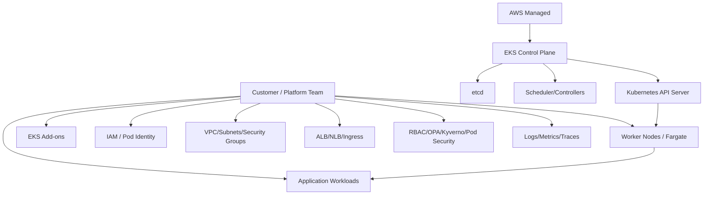
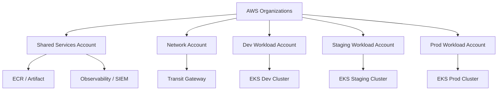
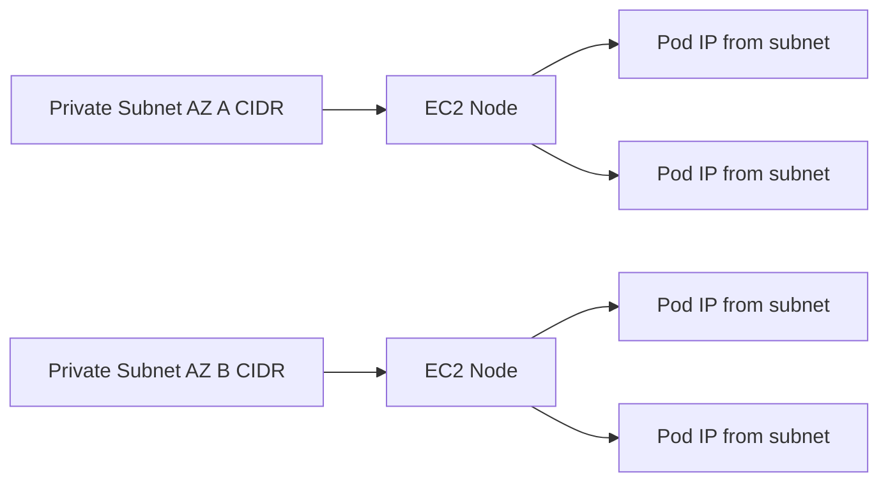
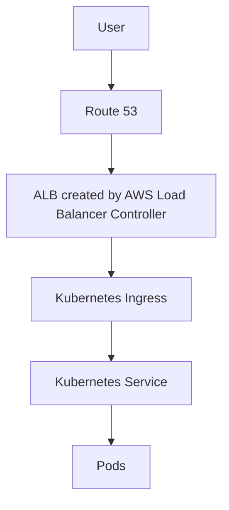
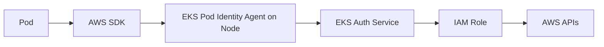
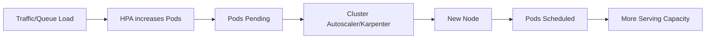
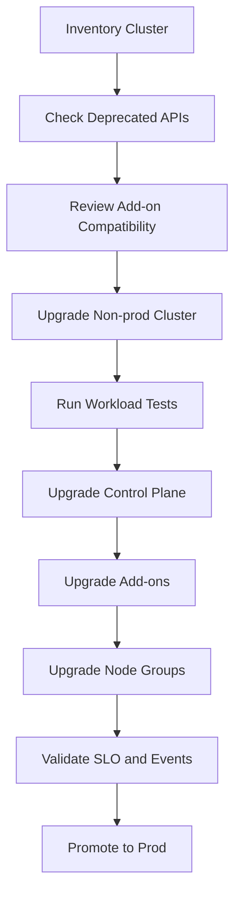
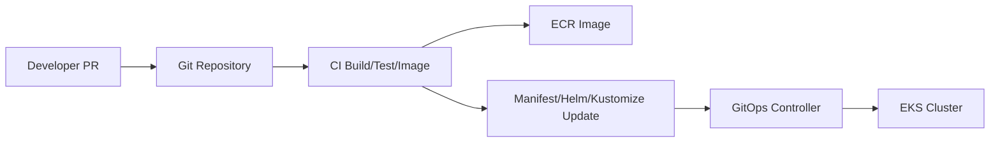

------
title: Learn AWS Engineering Mastery - Part 012
description: Production Amazon EKS architecture and day-2 operations: cluster boundaries, node strategy, networking, identity, add-ons, autoscaling, upgrades, observability, security, reliability, and platform operating model.
series: learn-aws
seriesTitle: Learn AWS Engineering Mastery
order: 12
partTitle: EKS Production Architecture and Day-2 Operations
tags:
- aws
- eks
- kubernetes
- containers
- platform-engineering
- day-2-operations
date: 2026-06-30
---

# Part 012 — EKS Production Architecture and Day-2 Operations

## 1. Target Skill

Target bagian ini adalah memahami Amazon EKS sebagai **managed Kubernetes control plane plus AWS-native operating environment**, bukan sekadar “cara membuat cluster”.

Seorang engineer yang kuat di EKS harus bisa:

- menjelaskan mana yang dikelola AWS dan mana yang tetap tanggung jawab platform team;
- menentukan apakah workload memang butuh Kubernetes atau cukup ECS/Fargate/Lambda;
- mendesain cluster boundary, node strategy, namespace strategy, IAM model, network model, ingress model, dan upgrade model;
- membaca failure EKS dari perspektif Kubernetes, AWS, dan aplikasi sekaligus;
- menjalankan day-2 operations: upgrade, patch, scaling, observability, incident response, cost, security, policy, dan tenant isolation;
- membangun golden path agar tim aplikasi tidak harus menjadi Kubernetes expert untuk deploy service dengan benar.

EKS adalah platform yang kuat, tetapi ia membawa complexity tax. Complexity itu layak hanya jika organisasi benar-benar memanfaatkan Kubernetes sebagai platform abstraction.

## 2. Kaufman Frame: Sub-Skill EKS yang Harus Dilatih

EKS terlalu besar jika dipelajari sebagai daftar fitur. Pecah menjadi sub-skill berikut:

| Sub-skill | Yang Harus Dikuasai | Bukti Penguasaan |
|---|---|---|
| Kubernetes mental model | Pod, Deployment, Service, Ingress, ConfigMap, Secret, Namespace, RBAC, controller reconciliation | Bisa menjelaskan desired state dan actual state |
| EKS responsibility boundary | Managed control plane, node responsibility, add-ons, IAM, VPC CNI, upgrades | Bisa membedakan masalah AWS-managed vs customer-managed |
| Cluster boundary design | Account/region/tenant/environment/workload separation | Bisa membenarkan jumlah cluster dan boundary-nya |
| Node strategy | Managed node group, self-managed node, Fargate profile, Karpenter, Bottlerocket/AMI | Bisa memilih capacity strategy sesuai workload |
| Pod networking | VPC CNI, subnet IP, security group, ingress/egress, NetworkPolicy | Bisa debug pod IP exhaustion dan traffic failure |
| Workload identity | IRSA, EKS Pod Identity, service account, IAM role mapping | Bisa memberi AWS permission least privilege per workload |
| Ingress and service exposure | AWS Load Balancer Controller, ALB/NLB, internal/public routing, TLS | Bisa mendesain safe ingress boundary |
| Autoscaling | HPA, VPA, Cluster Autoscaler, Karpenter, overprovisioning | Bisa scaling tanpa menciptakan cost explosion |
| Day-2 operations | upgrades, add-ons, observability, policy, incident, backup, DR | Bisa menjaga cluster tetap aman dan supportable |

Belajar EKS secara efisien berarti memprioritaskan invariants production, bukan semua plugin Kubernetes.

## 3. Mental Model: EKS adalah Managed Control Plane, Bukan Managed Platform Lengkap

Amazon EKS menyediakan Kubernetes control plane yang dikelola AWS. Namun workload, node, add-ons, policy, observability, security posture, dan release discipline tetap harus dirancang.



Critical statement:

```text
EKS reduces the burden of operating Kubernetes control plane.
It does not remove the burden of operating a Kubernetes platform.
```

AWS EKS Best Practices Guide menyatakan tujuannya adalah memberi best practices untuk day-2 operations EKS. Ini sinyal penting: nilai EKS bukan hanya cluster creation, tetapi kemampuan mengoperasikannya secara berkelanjutan.

## 4. Kapan Memilih EKS

EKS cocok ketika:

- organisasi sudah memilih Kubernetes sebagai standard platform;
- perlu Kubernetes ecosystem: operators, CRDs, service mesh, GitOps, policy controller, platform APIs;
- workload butuh portability pada Kubernetes API;
- banyak tim membutuhkan shared platform dengan namespace/golden path;
- ada kebutuhan advanced scheduling, sidecar, daemonset, custom controllers;
- platform team cukup matang untuk day-2 operations.

EKS kurang cocok ketika:

- hanya ingin menjalankan container sederhana;
- tim belum punya kapasitas mengoperasikan Kubernetes;
- workload sebagian besar stateless API sederhana dan worker;
- complexity Kubernetes tidak memberikan leverage;
- security/tenant isolation diharapkan “otomatis” hanya dengan namespace;
- upgrade discipline belum siap.

Decision rule:

```text
Choose EKS when Kubernetes is the platform product.
Do not choose EKS just because containers are involved.
```

## 5. EKS Responsibility Boundary

| Layer | AWS EKS Mengelola | Anda Tetap Mengelola |
|---|---|---|
| Kubernetes control plane | API server availability, etcd, control plane components | Version upgrade decision, API usage, access config |
| Nodes | Managed node group lifecycle membantu provisioning node | AMI/version strategy, capacity, security, workloads, disruption |
| Fargate | Pod-level serverless compute capacity | Fargate profile, pod compatibility, networking, cost |
| Networking | Integration dengan VPC CNI | CIDR/subnet/IP capacity, SG, ingress/egress, DNS |
| Add-ons | EKS add-on packaging/management untuk add-ons tertentu | Version compatibility, config, rollout, conflicts |
| IAM | EKS integrates with IAM | Role design, permission scoping, Pod Identity/IRSA mapping |
| Security | Managed service controls | RBAC, Pod Security, NetworkPolicy, image policy, secrets, runtime posture |
| Observability | Emits AWS/K8s signals | Dashboards, alarms, logs, traces, SLO, incident workflow |

## 6. Cluster Boundary Design

Cluster adalah blast radius boundary, operational boundary, dan sometimes tenant boundary. Tetapi namespace bukan security boundary yang cukup untuk semua kasus.

### 6.1 Boundary Options

| Strategy | Kelebihan | Kekurangan | Cocok Untuk |
|---|---|---|---|
| One cluster per environment | Simple separation dev/stage/prod | Prod cluster bisa besar | Banyak organisasi awal |
| One cluster per team/domain | Ownership jelas | Lebih banyak cluster ops | Platform mature, domain ownership kuat |
| One cluster per tenant | Isolation kuat | Biaya dan ops tinggi | Regulated/SaaS high isolation |
| Shared multi-tenant cluster | Utilisasi baik | Security/governance kompleks | Internal platform matang |
| Cell-based clusters | Blast radius terkontrol | Routing dan operations lebih kompleks | Large-scale SaaS/platform |

### 6.2 Questions Sebelum Membuat Cluster

- Apa blast radius yang dapat diterima?
- Siapa owner cluster?
- Workload apa yang boleh masuk?
- Apakah cluster public/private endpoint?
- Bagaimana upgrade dilakukan?
- Apakah tenant isolation cukup dengan namespace?
- Bagaimana audit akses Kubernetes API?
- Apakah subnet IP cukup untuk pod growth?
- Apakah observability per cluster atau centralized?
- Bagaimana cluster dipensiunkan?

## 7. Account dan Network Placement

Pattern enterprise umum:



Untuk production regulated workload, EKS cluster biasanya berada di workload account, bukan shared services account, agar blast radius dan IAM boundary lebih jelas.

## 8. Kubernetes Primitive yang Harus Stabil

EKS engineer harus tetap memahami Kubernetes dasar.

| Primitive | Mental Model | AWS/EKS Concern |
|---|---|---|
| Pod | Unit scheduling terkecil | Mendapat IP dari VPC CNI pada EC2 nodes; lifecycle ephemeral |
| Deployment | Desired state controller untuk ReplicaSet/Pod | Rolling update, readiness, surge, rollback |
| Service | Stable virtual endpoint untuk pods | ClusterIP/NodePort/LoadBalancer mapping ke AWS LB |
| Ingress | HTTP routing abstraction | Biasanya diproses AWS Load Balancer Controller untuk ALB |
| Namespace | Logical grouping | Bukan isolation boundary kuat tanpa policy tambahan |
| ServiceAccount | Identity Kubernetes workload | Diikat ke IAM via IRSA/Pod Identity |
| ConfigMap | Non-secret config | Versioning/rollout discipline diperlukan |
| Secret | Secret object | Perlu encryption, RBAC, external secret pattern |
| RBAC | Kubernetes authorization | Harus dipetakan dengan human/platform roles |
| DaemonSet | Pod per node | Tidak jalan pada Fargate; penting untuk agents |
| StatefulSet | Stateful workload identity | Perlu storage/failover plan serius |

## 9. Node Strategy

### 9.1 Managed Node Groups

Amazon EKS managed node groups mengotomasi provisioning dan lifecycle management EC2 node untuk cluster EKS.

Cocok untuk:

- general-purpose workloads;
- cluster yang butuh EC2 node tetapi ingin mengurangi ops;
- standard AMI/node lifecycle;
- kapasitas predictable;
- integrasi dengan Kubernetes upgrade flow.

Perhatikan:

- pilih instance family sesuai workload;
- gunakan multiple AZ;
- pisahkan node group berdasarkan workload class;
- gunakan taint/toleration untuk dedicated workload;
- pikirkan max pods dan IP capacity;
- lakukan node rotation saat AMI/security update.

### 9.2 Self-Managed Node Groups

Cocok ketika butuh:

- custom AMI sangat spesifik;
- bootstrap kompleks;
- kontrol lifecycle penuh;
- requirement yang belum cocok dengan managed node group.

Trade-off: operational burden lebih tinggi.

### 9.3 EKS Fargate

EKS Fargate menjalankan pod tanpa provisioning node group sendiri. AWS menyatakan Fargate menyediakan on-demand, right-sized compute capacity untuk container dan menghilangkan kebutuhan memilih server type atau scaling node group sendiri.

Cocok untuk:

- isolasi pod sederhana;
- low-ops workload;
- batch/control-plane-ish internal apps tertentu;
- tenant/workload kecil yang tidak butuh daemonset;
- platform yang ingin mengurangi node management.

Batasan umum:

- tidak cocok untuk DaemonSet-dependent workloads;
- tidak semua storage/network/plugin pattern cocok;
- cost bisa lebih tinggi untuk steady high-utilization;
- observability/security agents harus dipikirkan ulang.

### 9.4 Karpenter

Karpenter adalah autoscaling/provisioning layer yang dapat menyediakan node sesuai kebutuhan workload. Ia sangat kuat untuk capacity optimization, tetapi harus diperlakukan sebagai platform component critical.

Karpenter cocok ketika:

- workload beragam dan dynamic;
- butuh instance selection otomatis;
- cost optimization penting;
- scale-up latency ingin dikurangi;
- cluster besar dengan scheduling needs kompleks.

Risiko:

- misconfiguration bisa menyebabkan cost spike;
- disruption policy harus matang;
- workload PDB/topology spread harus benar;
- IAM dan node role harus secure;
- observability provisioning harus jelas.

## 10. Node Group Segmentation

Jangan campur semua workload di satu node pool.

Segmentasi umum:

| Node Pool | Workload | Karakteristik |
|---|---|---|
| system | Core add-ons | Taint agar aplikasi biasa tidak masuk |
| general | Stateless services | On-demand baseline |
| spot | Interruption-tolerant workers | Spot capacity, checkpoint/idempotency |
| memory | Memory-heavy workload | Instance memory optimized |
| compute | CPU-heavy workload | Compute optimized |
| gpu | ML/inference/training | GPU drivers, device plugin |
| regulated | Sensitive workload | Hardening, dedicated nodes, stricter policy |

Gunakan:

- labels;
- taints/tolerations;
- node affinity;
- topology spread constraints;
- PodDisruptionBudget;
- resource requests/limits.

## 11. VPC CNI dan Pod Networking

Amazon VPC CNI plugin untuk Kubernetes adalah plugin networking untuk pod networking di EKS. AWS documentation menjelaskan plugin ini bertanggung jawab mengalokasikan VPC IP address ke Kubernetes Pods dan mengonfigurasi networking yang diperlukan pada node.

Mental model:

```text
In default EKS VPC CNI mode, pods use VPC-routable IP addresses.
This makes AWS network integration natural, but makes subnet IP capacity a first-class scaling limit.
```



### 11.1 IP Exhaustion

EKS scaling failure sering bukan karena CPU habis, tetapi IP habis.

Gejala:

- pods stuck pending;
- CNI allocation error;
- node has CPU/memory but cannot schedule pods;
- autoscaler menambah node tetapi pod tetap gagal karena subnet kecil;
- upgrade atau surge deployment gagal.

Pencegahan:

- CIDR planning sejak awal;
- subnet dedicated untuk cluster;
- monitor available IP;
- gunakan prefix delegation bila sesuai;
- tune CNI warm IP/ENI target secara hati-hati;
- hindari subnet terlalu kecil untuk high-density clusters;
- bedakan node subnet dan LB subnet bila perlu.

### 11.2 Security Groups for Pods

Security Groups for Pods memungkinkan security group lebih granular untuk pod tertentu pada EC2 nodes, dengan konfigurasi VPC CNI yang sesuai.

Gunakan ketika:

- workload tertentu butuh akses database sangat spesifik;
- namespace-level policy tidak cukup;
- compliance membutuhkan AWS-native SG boundary per workload.

Trade-off:

- kompleksitas networking meningkat;
- tidak semua pattern cocok;
- perlu observability dan troubleshooting yang matang.

## 12. Ingress Architecture

### 12.1 AWS Load Balancer Controller

Dalam EKS, AWS Load Balancer Controller sering digunakan untuk membuat ALB/NLB dari Kubernetes Ingress atau Service annotations.

Pattern:



Design concern:

- public vs internal ALB;
- TLS certificate via ACM;
- WAF association;
- path/host routing;
- health check path;
- target type `ip` vs `instance`;
- security group management;
- ownership of ingress resource;
- multi-tenant rule conflict.

### 12.2 Public Endpoint Pattern

For public service:

```text
CloudFront/WAF -> ALB Ingress -> Service -> Pods
```

Do not expose NodePort directly to internet.

### 12.3 Internal Service Pattern

For internal service:

```text
Internal ALB/NLB -> Service -> Pods
```

Atau gunakan Kubernetes service DNS untuk in-cluster calls.

### 12.4 Service Mesh

Service mesh bisa berguna untuk mTLS, traffic splitting, retries, telemetry, dan policy. Tetapi service mesh juga menambah:

- sidecar cost;
- latency;
- operational complexity;
- upgrade burden;
- debugging layers;
- failure modes baru.

Jangan memakai service mesh hanya karena populer. Gunakan jika problem traffic management dan identity antar service memang membutuhkan mesh.

## 13. Workload Identity: IRSA dan EKS Pod Identity

Kubernetes service account bukan otomatis IAM role. Untuk akses AWS API dari pod, gunakan workload identity.

### 13.1 IRSA

IAM Roles for Service Accounts memakai OIDC dan `AssumeRoleWithWebIdentity`. Pod yang memakai service account tertentu bisa mendapatkan IAM role tertentu.

Cocok dan matang untuk banyak deployment.

### 13.2 EKS Pod Identity

AWS documentation menjelaskan EKS Pod Identity memberikan temporary credentials ke Kubernetes workloads melalui EKS Auth service dan Pod Identity Agent yang berjalan pada node. Dibanding IRSA, credential assumption dilakukan oleh EKS Auth service dan agent memberi credential ke SDK, sehingga load STS tidak diduplikasi per pod.

Mental model:



### 13.3 Identity Invariant

```text
One workload identity should map to one clear application permission boundary.
```

Anti-pattern:

- satu IAM role untuk seluruh namespace;
- node instance role memberi permission aplikasi;
- wildcard permission untuk mempercepat development;
- secret static AWS keys di Kubernetes Secret;
- tidak ada audit mapping service account ke IAM role.

## 14. RBAC dan Human Access

Human access ke cluster harus eksplisit.

Pisahkan role:

| Role | Permission |
|---|---|
| viewer | Read-only workload/resource |
| developer | Deploy ke namespace tertentu |
| operator | Restart/scale/debug workload tertentu |
| platform-admin | Manage cluster resources/add-ons |
| security-auditor | Read policy/audit/security resources |
| break-glass | Emergency privileged access dengan audit ketat |

Guideline:

- hindari cluster-admin permanen;
- gunakan group mapping, bukan user individual acak;
- audit Kubernetes API access;
- break-glass harus time-bound;
- production write access harus minim;
- namespace ownership harus jelas.

## 15. EKS Add-ons

EKS add-ons membantu mengelola operational software seperti networking, storage, observability, dan security add-ons. AWS documentation menyatakan EKS add-ons berjalan pada node yang Anda provision/configure, termasuk EC2 nodes, Fargate, dan hybrid nodes.

Add-ons umum:

- VPC CNI;
- CoreDNS;
- kube-proxy;
- EBS CSI driver;
- EFS CSI driver;
- AWS Load Balancer Controller;
- ADOT/OpenTelemetry collector;
- CloudWatch agents;
- External Secrets operator;
- cert-manager;
- metrics-server;
- cluster-autoscaler/Karpenter components;
- policy controllers.

Add-on governance:

- owner jelas;
- version compatibility matrix;
- rollout plan;
- rollback plan;
- configuration drift detection;
- security review;
- observability;
- dependency on Kubernetes version understood.

## 16. Workload Scheduling dan Resource Discipline

Kubernetes scheduler hanya bisa membuat keputusan baik jika workload memberi signal yang benar.

### 16.1 Requests and Limits

- CPU request: kapasitas minimal yang scheduler pakai untuk placement;
- memory request: kapasitas minimal untuk placement;
- CPU limit: throttling boundary;
- memory limit: OOM kill boundary.

Anti-pattern:

```yaml
resources: {}
```

Tanpa request/limit, platform tidak bisa capacity planning.

### 16.2 Quality of Service

Pod QoS dipengaruhi request/limit. Untuk workload kritikal, jangan biarkan resource config random.

### 16.3 PodDisruptionBudget

PDB melindungi availability saat voluntary disruption seperti node drain atau upgrade.

Tetapi PDB salah bisa memblokir node maintenance.

### 16.4 Topology Spread

Gunakan topology spread constraints agar replicas tersebar antar node/AZ.

Tanpa ini, tiga replica bisa berada di node/AZ yang sama dan availability hanya ilusi.

## 17. Autoscaling Model

### 17.1 Horizontal Pod Autoscaler

HPA mengubah replica count berdasarkan metric.

Cocok untuk:

- API service;
- workers;
- stateless workloads.

Metric:

- CPU;
- memory;
- request rate;
- queue depth;
- custom business metric;
- p95 latency dengan hati-hati.

### 17.2 Vertical Pod Autoscaler

VPA memberi rekomendasi atau mengubah request/limit. Cocok untuk rightsizing, tetapi hati-hati untuk workload yang tidak boleh sering restart.

### 17.3 Cluster Autoscaler

Cluster Autoscaler menambah/mengurangi node group berdasarkan pending pods dan utilisasi.

### 17.4 Karpenter

Karpenter bisa provision node lebih fleksibel berdasarkan scheduling requirements. Cocok untuk cluster besar dan dynamic, tetapi perlu guardrail.

### 17.5 Scaling Chain



Failure point:

- HPA metric missing;
- pod request too high;
- node quota exceeded;
- subnet IP exhausted;
- instance capacity unavailable;
- PDB blocks disruption;
- image pull slow;
- readiness probe delays capacity.

## 18. Upgrade Strategy

EKS upgrade bukan satu tombol. Ia adalah lifecycle process.

AWS EKS upgrade guidance menyarankan sebelum update, pastikan `kubelet` pada node berada pada versi Kubernetes yang sama dengan control plane, dan memperhatikan update komponen cluster serta add-ons.

Typical flow:



### 18.1 Upgrade Checklist

- Kubernetes version support window checked;
- deprecated APIs scanned;
- CRD/controller compatibility checked;
- add-ons version matrix checked;
- node AMI strategy defined;
- PDB reviewed;
- cluster autoscaler/Karpenter compatibility checked;
- ingress controller compatibility checked;
- observability agent compatibility checked;
- backup/restore strategy checked;
- non-prod upgrade rehearsed;
- rollback/mitigation documented.

### 18.2 Common Upgrade Failure

| Failure | Root Cause |
|---|---|
| Workload fails after upgrade | Deprecated API removed |
| Nodes not joining | AMI/bootstrap/IAM/security group issue |
| Pods pending | PDB, resource request, node taint, IP shortage |
| Ingress broken | Controller version mismatch |
| Metrics missing | metrics-server/agent compatibility |
| Autoscaling broken | autoscaler version mismatch |
| DNS issue | CoreDNS config/resource pressure |

## 19. Security Engineering Baseline

### 19.1 Cluster Endpoint

Decide:

- public endpoint restricted by CIDR;
- private endpoint only;
- hybrid access via VPN/Direct Connect/bastion/SSM pattern.

For production sensitive cluster, unrestricted public API endpoint is weak posture.

### 19.2 RBAC

- least privilege per namespace;
- no broad cluster-admin;
- separate deployer from operator;
- audit access;
- break-glass path.

### 19.3 Pod Security

Use Pod Security Standards or policy controller to restrict:

- privileged pods;
- hostNetwork;
- hostPID/hostIPC;
- hostPath mounts;
- running as root;
- privilege escalation;
- unsafe capabilities;
- untrusted images.

### 19.4 Network Policy

Kubernetes NetworkPolicy requires compatible implementation. Do not assume namespace isolation blocks traffic by default.

Define:

- default deny per namespace where feasible;
- allow ingress only from expected sources;
- allow egress only where mature tooling exists;
- monitor before enforcing broadly.

### 19.5 Image Security

- trusted registry;
- image scanning;
- digest pinning;
- base image lifecycle;
- SBOM/provenance;
- admission policy;
- no privileged debug images in prod.

### 19.6 Secrets

Options:

- Kubernetes Secret with encryption and RBAC;
- Secrets Store CSI Driver;
- External Secrets Operator;
- direct AWS Secrets Manager fetch via SDK.

Avoid long-lived AWS access keys in Kubernetes Secrets.

## 20. Observability

EKS observability harus menggabungkan Kubernetes dan AWS views.

### 20.1 Signals

| Signal | Examples |
|---|---|
| Kubernetes events | FailedScheduling, BackOff, Unhealthy, Killing |
| Pod metrics | CPU, memory, restart count, OOMKilled |
| Node metrics | CPU, memory, disk, network, pod capacity |
| Control plane logs | API, audit, authenticator, controller manager, scheduler |
| Ingress metrics | ALB 5xx, target response time, healthy targets |
| App metrics | request rate, latency, errors, saturation |
| Traces | service dependency path |
| AWS events | node group update, EKS add-on update, EC2 interruption |

### 20.2 Minimum Dashboard

For each cluster:

- API server errors/latency;
- node readiness;
- pod pending count;
- pod restart/OOM;
- namespace resource usage;
- ingress 4xx/5xx/latency;
- DNS error/latency;
- CNI IP allocation pressure;
- autoscaler activity;
- add-on health;
- cost by namespace/team if possible.

### 20.3 Debugging Order

For broken service:

```text
Ingress -> Service -> EndpointSlice -> Pod readiness -> Pod logs -> Events -> Node -> CNI -> IAM -> AWS dependency
```

For pending pod:

```text
kubectl describe pod
Check events:
- insufficient cpu/memory?
- taint not tolerated?
- node selector mismatch?
- PVC pending?
- IP exhaustion?
- quota exceeded?
```

## 21. Reliability and Disruption Management

### 21.1 Multi-AZ

EKS cluster worker nodes should span at least two AZs for production. AWS EKS networking best practices recommend specifying subnets in at least two Availability Zones when creating a cluster.

### 21.2 Pod Spread

Use:

- multiple replicas;
- topology spread constraints;
- anti-affinity when appropriate;
- PDB;
- readiness probes;
- graceful shutdown;
- preStop hooks where useful.

### 21.3 Node Drain

Node drain occurs during:

- upgrades;
- scale-in;
- spot interruption;
- maintenance;
- security patching.

Workload must tolerate eviction:

- stateless replicas;
- PDB;
- graceful termination;
- idempotent workers;
- externalized state.

### 21.4 Stateful Workloads

Running stateful workloads on Kubernetes is possible, but do not treat it lightly.

Consider managed AWS data services first:

- RDS/Aurora;
- DynamoDB;
- ElastiCache;
- OpenSearch;
- MSK;
- EFS/FSx for file patterns.

If using StatefulSet:

- storage class;
- backup/restore;
- zone affinity;
- failover behavior;
- data corruption risk;
- operator maturity;
- upgrade runbook.

## 22. Cost Engineering

Cost drivers:

- EC2 node idle capacity;
- over-requested pods;
- DaemonSet overhead per node;
- load balancers per ingress;
- NAT traffic;
- inter-AZ traffic;
- logs/metrics/traces volume;
- EBS/EFS volumes;
- EKS cluster hourly cost;
- add-on managed services;
- Spot interruption handling;
- GPU node underutilization.

Cost anti-pattern:

```text
Every team creates its own ALB for every small service.
```

Better:

- shared ingress where safe;
- namespace/team cost allocation;
- rightsizing via VPA recommendations;
- Karpenter/Cluster Autoscaler guardrails;
- log retention policy;
- avoid over-instrumentation without sampling;
- use Graviton where compatible;
- separate batch/spot from critical/on-demand.

## 23. Multi-Tenancy

Namespace-based multi-tenancy needs controls:

- RBAC per namespace;
- ResourceQuota;
- LimitRange;
- NetworkPolicy;
- Pod Security admission/policy;
- separate service accounts;
- separate IAM roles;
- image policy;
- logging segregation;
- cost allocation tags/labels;
- admission controller guardrails.

For strong tenant isolation, use separate clusters or accounts.

```text
Namespace is a management boundary.
Account/cluster is closer to a blast-radius/security boundary.
```

## 24. Platform Golden Path for EKS

Platform team should expose a simple developer contract.

### 24.1 Developer Input

```yaml
service:
  name: case-api
  image: 123456789012.dkr.ecr.ap-southeast-1.amazonaws.com/case-api@sha256:...
  port: 8080
  replicas:
    min: 3
    max: 20
  resources:
    cpu: 500m
    memory: 1Gi
  ingress:
    type: internal
    host: case-api.internal.example.com
  health:
    readiness: /ready
    liveness: /live
  permissions:
    awsRole: case-api-prod
  secrets:
    - case-db-password
  slo:
    availability: 99.9
```

### 24.2 Platform Output

- namespace;
- service account;
- IAM Pod Identity/IRSA binding;
- Deployment;
- Service;
- Ingress;
- HPA;
- PDB;
- NetworkPolicy;
- ResourceQuota;
- alerts;
- dashboard;
- log routing;
- runbook;
- deployment pipeline;
- policy validation.

### 24.3 Guardrails

- no privileged pods by default;
- image must come from trusted registry;
- resources required;
- readiness/liveness required;
- PDB required for prod service;
- min replicas >= 2 or explicit exception;
- no public ingress without approval;
- IAM role per workload;
- namespace quota enforced;
- deployment labels mandatory;
- owner label mandatory.

## 25. GitOps and Delivery

GitOps fits Kubernetes well because Kubernetes is declarative.

Pattern:



Decision points:

- Helm vs Kustomize vs CDK8s vs raw manifests;
- environment promotion model;
- secret management;
- policy checks pre-merge;
- drift detection;
- rollback strategy;
- who can approve production deploy.

Anti-pattern:

```text
kubectl apply from laptop to production.
```

## 26. Incident Runbooks

### 26.1 Pods Pending

Check:

1. `kubectl describe pod` events;
2. node capacity;
3. resource requests;
4. taints/tolerations;
5. node selector/affinity;
6. PVC status;
7. subnet IP availability;
8. autoscaler/Karpenter logs;
9. EC2 quota/capacity;
10. recent node group changes.

### 26.2 Ingress Down

Check:

1. DNS record;
2. ALB/NLB status;
3. target group health;
4. ingress resource events;
5. AWS Load Balancer Controller logs;
6. service selector;
7. EndpointSlice endpoints;
8. pod readiness;
9. security groups;
10. WAF/CloudFront if present.

### 26.3 AccessDenied from Pod

Check:

1. service account;
2. Pod Identity/IRSA association;
3. IAM role trust policy;
4. IAM permission policy;
5. SCP/permission boundary;
6. AWS SDK credential provider chain;
7. region/resource ARN;
8. CloudTrail event.

### 26.4 CrashLoopBackOff

Check:

1. previous container logs;
2. exit code;
3. config/secret mount;
4. command/args;
5. dependency availability;
6. memory OOM;
7. liveness probe too aggressive;
8. image version;
9. recent rollout.

### 26.5 DNS Failure

Check:

1. CoreDNS pods healthy;
2. CoreDNS CPU throttling;
3. node local DNS cache if used;
4. network policy;
5. VPC resolver;
6. service name/namespace;
7. upstream DNS dependency.

## 27. Common Anti-Patterns

### 27.1 EKS for Every Container

Kubernetes is not free. ECS/Fargate may be better for simple workloads.

### 27.2 Namespace as Strong Security Boundary

Namespace alone is insufficient for strong tenant isolation.

### 27.3 No Resource Requests

Autoscaling and scheduling become guesswork.

### 27.4 Node Role with Broad App Permissions

Application AWS permissions should be per workload identity, not inherited from node role.

### 27.5 Add-ons Installed Manually Without Ownership

Unowned controllers become hidden production dependencies.

### 27.6 No Upgrade Calendar

EKS/Kubernetes versions age. Upgrade debt accumulates until it becomes emergency work.

### 27.7 Overusing Service Mesh

Mesh adds power and complexity. Use it for real requirements.

### 27.8 Public Cluster Endpoint Wide Open

Convenient but weak. Restrict or use private access path.

### 27.9 Every Service Owns Its Own Load Balancer

Can become cost and governance problem.

### 27.10 No PDB, No Graceful Shutdown

Upgrades and node disruptions become outages.

## 28. Design Review Checklist

Before approving EKS production architecture:

- Why EKS instead of ECS/Fargate/Lambda?
- What is the cluster boundary and blast radius?
- Which account owns the cluster?
- Are subnets large enough for pod IP growth?
- Is the API endpoint exposure acceptable?
- Are node groups segmented by workload class?
- Are system add-ons isolated from application workloads?
- Is workload identity per service account configured?
- Are node roles free from broad application permissions?
- Are resource requests/limits mandatory?
- Are PDB and topology spread constraints used for critical services?
- Is ingress public/internal intentionally designed?
- Are RBAC and human access auditable?
- Are Pod Security controls enforced?
- Is NetworkPolicy supported and used where required?
- Are logs/metrics/traces standardized?
- Is cluster upgrade runbook tested in non-prod?
- Are add-ons versioned and owned?
- Is cost allocation visible by team/namespace?
- Is incident response documented?

## 29. Deliberate Practice

### Exercise 1 — Cluster Boundary ADR

Write an Architecture Decision Record for:

- one prod cluster per domain;
- shared prod cluster;
- one cluster per tenant;
- cell-based clusters.

Include:

- blast radius;
- cost;
- operational burden;
- compliance;
- upgrade strategy;
- tenant isolation;
- incident response.

### Exercise 2 — Debug Pending Pod

Create a pod that cannot schedule due to one of:

- resource request too high;
- missing toleration;
- wrong node selector;
- PVC pending;
- IP exhaustion simulation in design review.

Practice reading events and explaining root cause.

### Exercise 3 — Workload Identity

Deploy two workloads:

- one can read S3 bucket A;
- one can read DynamoDB table B;
- neither can access the other resource.

Use Pod Identity or IRSA. Verify through CloudTrail.

### Exercise 4 — Safe Upgrade Simulation

In non-prod:

- identify deprecated APIs;
- upgrade control plane;
- upgrade add-ons;
- rotate node group;
- confirm workload availability;
- document failure and rollback path.

### Exercise 5 — Platform Golden Path

Build a template that generates:

- namespace;
- deployment;
- service;
- ingress;
- HPA;
- PDB;
- service account;
- IAM mapping;
- NetworkPolicy;
- alarms.

Then require developers to supply only service-level intent.

## 30. Key Takeaways

EKS is not just “managed Kubernetes”. It is a platform operating model.

The durable mental model:

```text
EKS manages the Kubernetes control plane.
Platform teams manage the Kubernetes platform.
Application teams manage workload behavior.
AWS primitives manage infrastructure boundaries.
```

Top-tier EKS engineering is the ability to connect these layers:

```text
Kubernetes desired state
+ AWS network/IAM/capacity boundaries
+ platform guardrails
+ day-2 operations
+ developer experience
= production-grade EKS platform
```

EKS becomes powerful when the organization treats it as an internal platform product. It becomes dangerous when treated as a container hosting shortcut.

## 31. References

- AWS Documentation — Amazon EKS Best Practices Guide: https://docs.aws.amazon.com/eks/latest/best-practices/introduction.html
- AWS Documentation — Amazon EKS managed node groups: https://docs.aws.amazon.com/eks/latest/userguide/managed-node-groups.html
- AWS Documentation — Amazon EKS Fargate: https://docs.aws.amazon.com/eks/latest/userguide/fargate.html
- AWS Documentation — Amazon VPC CNI plugin for Kubernetes: https://docs.aws.amazon.com/eks/latest/userguide/managing-vpc-cni.html
- AWS Documentation — VPC CNI IAM role / IRSA: https://docs.aws.amazon.com/eks/latest/userguide/cni-iam-role.html
- AWS Documentation — EKS Pod Identity: https://docs.aws.amazon.com/eks/latest/userguide/pod-identities.html
- AWS Documentation — How EKS Pod Identity works: https://docs.aws.amazon.com/eks/latest/userguide/pod-id-how-it-works.html
- AWS Documentation — EKS add-ons: https://docs.aws.amazon.com/eks/latest/userguide/eks-add-ons.html
- AWS Documentation — EKS cluster upgrades best practices: https://docs.aws.amazon.com/eks/latest/best-practices/cluster-upgrades.html
- AWS Documentation — Update existing EKS cluster Kubernetes version: https://docs.aws.amazon.com/eks/latest/userguide/update-cluster.html
- AWS Documentation — EKS networking best practices: https://docs.aws.amazon.com/eks/latest/best-practices/networking.html
- AWS Documentation — EKS security best practices: https://docs.aws.amazon.com/eks/latest/best-practices/security.html
