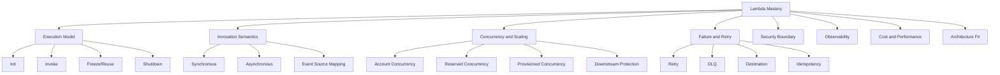
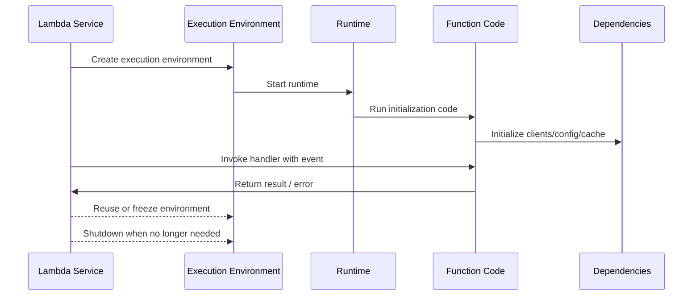
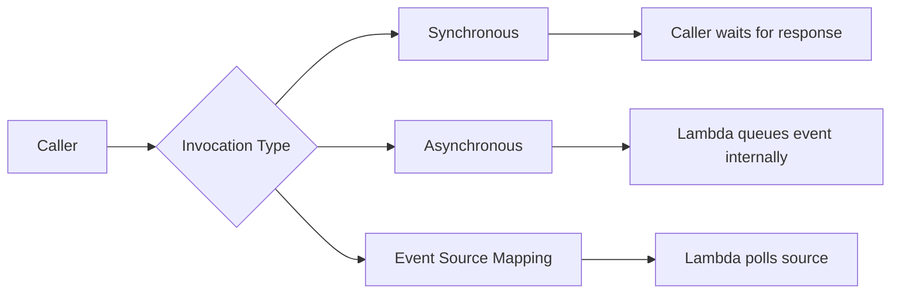
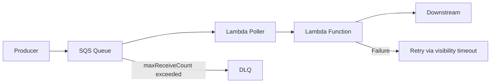
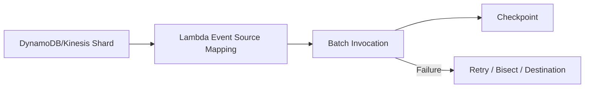
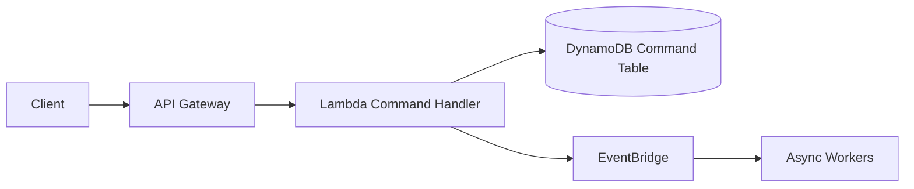
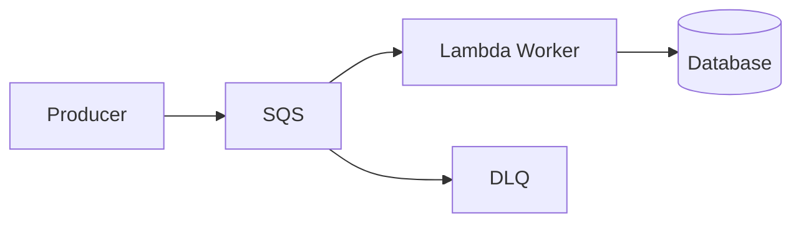
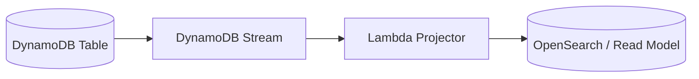
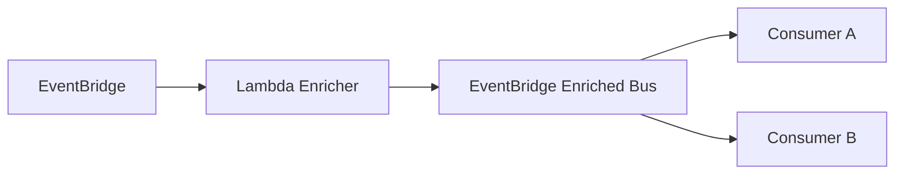
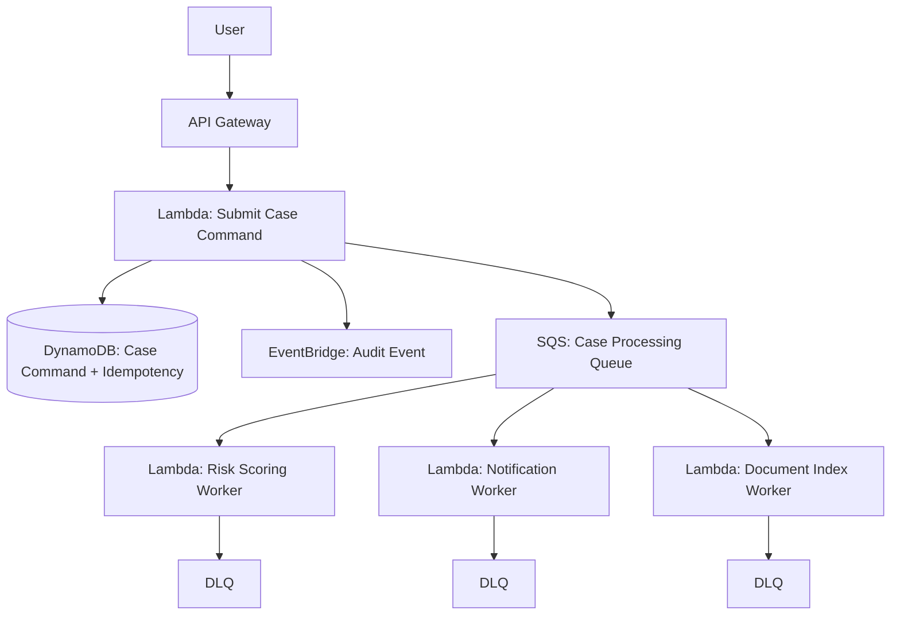

------
title: Learn AWS Engineering Mastery - Part 013
description: Serverless compute deep dive: AWS Lambda execution model, lifecycle, concurrency, cold start, event sources, retries, idempotency, limits, security, cost, observability, and production engineering judgment.
series: learn-aws
seriesTitle: Learn AWS Engineering Mastery
order: 13
partTitle: Serverless Compute: Lambda Execution Model and Limits
tags:
- aws
- lambda
- serverless
- compute
- architecture
- reliability
- observability
- security
- finops
date: 2026-06-30
---

# Learn AWS Engineering Mastery - Part 013

## Serverless Compute: Lambda Execution Model and Limits

> Tujuan bagian ini: membuat kita mampu mendesain, mengoperasikan, dan men-debug AWS Lambda sebagai **production compute substrate**, bukan sekadar tempat menjalankan function kecil.

Lambda adalah salah satu layanan AWS yang paling sering disalahpahami. Banyak engineer melihat Lambda sebagai "function yang jalan kalau ada event". Itu benar, tetapi terlalu dangkal untuk sistem besar. Dalam production, Lambda adalah kombinasi dari:

- compute runtime yang dikelola AWS,
- event dispatch boundary,
- concurrency allocator,
- IAM execution boundary,
- retry and failure-delivery mechanism,
- cost meter,
- operational isolation unit,
- dan scaling surface yang bisa melindungi atau menghancurkan dependency di belakangnya.

Mental model yang benar: **Lambda bukan mini-EC2. Lambda adalah managed, event-driven, concurrency-metered compute unit dengan lifecycle dan limits yang harus didesain secara eksplisit.**

---

## 1. Kaufman Skill Target

Dalam kerangka Josh Kaufman, kita tidak belajar Lambda dengan menghafal semua fitur. Kita pecah skill menjadi sub-skill yang langsung menentukan kualitas engineering decision.

### Target performa setelah part ini

Setelah menyelesaikan bagian ini, kita harus mampu:

1. Menjelaskan perbedaan synchronous, asynchronous, dan poll-based invocation.
2. Mendesain function boundary yang kecil tetapi tidak terlalu granular.
3. Menghitung dampak concurrency terhadap downstream database, API, queue, dan cost.
4. Membaca cold start sebagai konsekuensi lifecycle, bukan bug.
5. Memilih reserved concurrency, provisioned concurrency, atau SnapStart secara rasional.
6. Mendesain retry, DLQ, destination, dan idempotency untuk event-driven workload.
7. Membuat observability yang cukup untuk menjawab: "event mana gagal, kenapa, berapa kali, dan apakah aman diretry?"
8. Menentukan kapan Lambda bukan pilihan tepat.

### Sub-skill map



---

## 2. Lambda sebagai Compute Boundary

Lambda function adalah unit deployment, execution, permission, scaling, dan observability.

Setiap function memiliki beberapa boundary:

| Boundary | Makna Engineering | Risiko Jika Salah |
|---|---|---|
| Code boundary | Logic yang dibundle bersama | Function terlalu besar menjadi mini-monolith; terlalu kecil menciptakan orchestration overhead |
| IAM boundary | Execution role function | Permission terlalu luas atau role reuse lintas domain |
| Scaling boundary | Function concurrency | Spike function menghabiskan account concurrency atau menjatuhkan downstream |
| Failure boundary | Retry, DLQ, destination | Event hilang, retry storm, poison message, duplicate side effect |
| Observability boundary | Metrics, logs, traces | Tidak bisa membedakan cold start, dependency latency, throttling, timeout, atau bug logic |
| Cost boundary | Request count, duration, memory, concurrency feature | Cost meledak karena fan-out, retry, large payload, atau over-provisioning |

### Rule of thumb

Satu Lambda function sebaiknya merepresentasikan **satu operational responsibility**, bukan satu baris use case dan bukan seluruh bounded context.

Contoh buruk:

```text
processEverythingFunction
```

Masalah:

- IAM terlalu luas.
- Deployment risk terlalu besar.
- Observability sulit dibaca.
- Timeout/cost tidak terisolasi.
- Perubahan kecil memaksa redeploy logic besar.

Contoh juga buruk:

```text
validateInputFunction -> checkUserFunction -> checkAccountFunction -> saveFunction -> notifyFunction
```

Masalah:

- Latency orchestration naik.
- Failure path kompleks.
- Debugging sulit.
- Setiap hop menambah serialization, IAM, retry, log, tracing, dan cost.

Contoh lebih sehat:

```text
case-submission-command-handler
case-risk-score-event-handler
case-notification-dispatcher
case-document-indexer
```

Boundary-nya berbasis responsibility dan failure semantics.

---

## 3. Lifecycle Lambda

Secara operasional, Lambda function berjalan di execution environment yang dikelola AWS. Kita tidak mengelola servernya, tetapi kita tetap harus memahami lifecycle-nya.

Lifecycle sederhana:



### Init phase

Init adalah fase sebelum handler menerima event. Di sinilah runtime boot, dependency dimuat, static/global object dibuat, configuration dibaca, SDK client dibuat, connection pool mungkin disiapkan, dan framework melakukan bootstrap.

Prinsip penting:

- Inisialisasi di luar handler dapat mengurangi latency invocation berikutnya karena environment bisa direuse.
- Tetapi init yang terlalu berat memperbesar cold start.
- Untuk Java dan framework besar, init path bisa signifikan.
- Untuk SnapStart atau provisioned concurrency, init behavior menjadi bagian desain performa.

Contoh pola sehat:

```java
public class Handler implements RequestHandler<ApiGatewayRequest, ApiGatewayResponse> {
    private static final ObjectMapper MAPPER = new ObjectMapper();
    private static final DynamoDbClient DYNAMODB = DynamoDbClient.create();
    private static final CaseService SERVICE = new CaseService(DYNAMODB, MAPPER);

    @Override
    public ApiGatewayResponse handleRequest(ApiGatewayRequest event, Context context) {
        return SERVICE.handle(event);
    }
}
```

Pola ini menghindari membuat client berat berulang-ulang di setiap request. Tetapi jangan menyimpan request-specific state di static variable.

### Invoke phase

Invoke adalah fase handler menerima event. Handler harus:

- cepat membaca event,
- validasi input,
- menjalankan business action,
- memanggil dependency eksternal dengan timeout yang masuk akal,
- menghasilkan response atau error yang sesuai invocation semantics.

Handler bukan tempat untuk melakukan bootstrap aplikasi penuh setiap kali dipanggil.

### Reuse dan freeze

Execution environment dapat digunakan ulang. Ini berarti state global bisa bertahan antar-invocation. Ini peluang dan risiko.

Peluang:

- reuse SDK client,
- reuse connection,
- cache config read-only,
- cache compiled regex/schema,
- warm memory path.

Risiko:

- data tenant bocor lewat static mutable state,
- cache stale,
- thread background tidak dikelola,
- request context tersisa,
- temporary file reuse tanpa cleanup.

Invariant penting:

> Lambda code harus benar walaupun environment direuse, dan juga benar walaupun environment tidak pernah direuse.

### Shutdown phase

Shutdown tidak boleh menjadi satu-satunya mekanisme untuk menyelesaikan side effect penting. Jangan mengandalkan shutdown hook untuk flush data kritikal. Handler harus menyelesaikan commit/ack semantics secara eksplisit.

---

## 4. Invocation Semantics

Lambda invocation bukan satu model. Ada tiga model utama yang harus dibedakan.



### 4.1 Synchronous invocation

Synchronous invocation berarti caller menunggu response dari Lambda. Contoh umum:

- API Gateway ke Lambda,
- ALB ke Lambda,
- Lambda Invoke API dengan request-response,
- beberapa direct SDK call.

Karakteristik:

- Caller menerima success/error langsung.
- Latency function menjadi latency user/API.
- Timeout caller dan timeout Lambda harus selaras.
- Retry biasanya tanggung jawab caller atau service integrator.

Failure modes:

| Failure | Dampak |
|---|---|
| Lambda timeout | Caller menerima error/timeout |
| Dependency lambat | User-facing latency naik |
| Cold start | p95/p99 bisa naik |
| Throttling | Caller menerima 429/5xx tergantung integrasi |
| Payload terlalu besar | Request gagal sebelum logic berjalan |

Synchronous Lambda cocok untuk:

- lightweight API handler,
- request validation,
- command acceptance,
- backend-for-frontend logic,
- low-to-moderate latency workflows.

Tidak cocok untuk:

- proses panjang,
- heavy batch,
- workflow multi-step tanpa checkpoint,
- pekerjaan yang butuh exactly-once side effect,
- workload yang memerlukan koneksi lama.

### 4.2 Asynchronous invocation

Asynchronous invocation berarti caller menyerahkan event ke Lambda dan tidak menunggu hasil business processing. Lambda menerima event, menaruhnya ke internal queue, lalu menjalankan function.

Contoh umum:

- S3 event notification ke Lambda,
- EventBridge ke Lambda,
- SNS ke Lambda,
- direct async invocation.

Karakteristik:

- Caller hanya tahu event diterima, bukan berhasil diproses.
- Lambda dapat melakukan retry untuk error.
- Event dapat dikirim ke destination atau DLQ sesuai konfigurasi.
- Duplicate delivery harus diasumsikan mungkin.

Design implication:

> Async Lambda wajib idempotent atau punya deduplication guard.

### 4.3 Event source mapping

Event source mapping adalah resource Lambda yang membaca dari source seperti SQS, DynamoDB Streams, Kinesis, atau MSK, lalu menginvoke function dengan batch records.

Karakteristik:

- Lambda melakukan polling source.
- Handler menerima batch.
- Success/failure batch menentukan checkpoint atau delete semantics.
- Untuk SQS, pesan dihapus jika batch berhasil diproses.
- Untuk stream, checkpoint maju jika batch berhasil.

Ini bukan sekadar async. Ini adalah **poller + batch + checkpoint model**.

Failure modes yang sering muncul:

- satu poison record membuat batch gagal berulang,
- batch terlalu besar menyebabkan timeout,
- partial failure tidak ditangani,
- iterator age naik pada stream,
- concurrency terlalu tinggi menghabiskan downstream capacity,
- visibility timeout SQS tidak selaras dengan Lambda timeout.

---

## 5. Concurrency sebagai Capacity Contract

Concurrency adalah jumlah invocation yang sedang berjalan pada waktu yang sama. Ini adalah konsep paling penting dalam Lambda production architecture.

Rumus mental sederhana:

```text
concurrency ≈ request rate per second × average duration in seconds
```

Contoh:

```text
500 requests/second × 0.2 second = 100 concurrent executions
```

Jika duration naik karena dependency melambat:

```text
500 requests/second × 2 seconds = 1000 concurrent executions
```

Artinya, dependency latency bisa menaikkan concurrency tanpa traffic bertambah.

### Why top-tier engineers care

Concurrency bukan hanya performa Lambda. Concurrency adalah tekanan ke downstream:

- database connection,
- third-party API rate limit,
- internal service capacity,
- NAT gateway port exhaustion,
- VPC endpoint throughput,
- SQS in-flight messages,
- KMS request rate,
- account concurrency pool,
- cost per second.

### Reserved concurrency

Reserved concurrency menetapkan kapasitas concurrency yang didedikasikan untuk function sekaligus membatasi maksimum concurrency function tersebut.

Gunakan reserved concurrency untuk:

- melindungi critical function dari noisy neighbor function,
- membatasi function agar tidak menjatuhkan database,
- menetapkan kill switch dengan nilai `0`,
- mengalokasikan kapasitas untuk high-priority event path.

Contoh decision:

```text
Database can tolerate 300 concurrent writes.
Each Lambda invocation uses at most 1 database connection.
Reserve max 200 concurrency for writer function.
Leave 100 buffer for admin, migration, and emergency traffic.
```

### Provisioned concurrency

Provisioned concurrency menyediakan execution environment yang sudah diinisialisasi. Ini digunakan untuk mengurangi cold start pada workload latency-sensitive.

Gunakan untuk:

- user-facing APIs dengan p95/p99 ketat,
- Java/.NET framework-heavy functions,
- traffic predictable,
- workload dengan business value lebih tinggi daripada biaya pre-warming.

Jangan gunakan otomatis untuk semua function. Provisioned concurrency punya biaya dan operational complexity.

### SnapStart

SnapStart mengurangi startup latency dengan membuat snapshot execution environment setelah init saat version dipublish, lalu me-restore snapshot saat diperlukan. Ini sangat relevan untuk Java workload tertentu.

Namun SnapStart membawa konsekuensi:

- unique value yang dibuat saat init dapat tersnapshot,
- secret/token/randomness harus diperhatikan,
- connection yang tidak valid setelah restore harus direinisialisasi,
- perlu pengujian lifecycle khusus.

Invariant:

> Semua state yang harus unik per invocation atau per environment harus dibuat setelah restore/invocation, bukan dibekukan di snapshot.

### Concurrency decision matrix

| Kebutuhan | Mekanisme | Catatan |
|---|---|---|
| Membatasi function agar tidak overload dependency | Reserved concurrency | Menjadi max concurrency function |
| Menjamin critical function punya kapasitas | Reserved concurrency | Mengurangi pool concurrency umum |
| Mengurangi cold start p99 | Provisioned concurrency | Cocok untuk traffic predictable |
| Mengurangi Java startup tanpa always-on capacity | SnapStart | Perlu validasi compatibility dan uniqueness |
| Mengontrol poller SQS/Kinesis | Event source mapping config | Desain batch, concurrency, retry, visibility timeout |
| Mengurangi latency karena dependency | Bukan concurrency feature | Optimasi dependency, cache, connection, architecture |

---

## 6. Timeouts, Memory, CPU, dan Payload

Lambda punya limit. Limit bukan detail administratif; limit adalah bagian dari desain arsitektur.

### Timeout

Timeout function harus lebih pendek dari timeout caller atau integration boundary.

Contoh buruk:

```text
API Gateway timeout: 29s
Lambda timeout: 60s
```

Jika backend API Gateway sudah timeout pada client, Lambda masih bisa terus berjalan. Ini dapat menghasilkan side effect setelah user mengira request gagal.

Contoh lebih sehat:

```text
Client timeout: 10s
API Gateway/integration timeout: 8s
Lambda timeout: 7s
Downstream HTTP timeout: 2s with bounded retries
```

### Memory dan CPU

Di Lambda, memory allocation memengaruhi CPU/network allocation. Menaikkan memory dapat menurunkan duration sehingga biaya total bisa turun walaupun memory lebih besar.

Optimasi sehat:

1. Ukur duration dan memory used.
2. Uji beberapa konfigurasi memory.
3. Bandingkan cost per successful operation, bukan hanya cost per invocation.
4. Pastikan dependency latency dipisahkan dari CPU-bound latency.

### Payload

Payload besar adalah smell. Jika event membawa file besar atau dokumen besar, gunakan pointer ke S3, bukan seluruh payload.

Pola sehat:

```json
{
  "bucket": "case-documents-prod",
  "key": "tenant-a/case-123/evidence.pdf",
  "versionId": "...",
  "correlationId": "..."
}
```

Bukan:

```json
{
  "base64File": "...huge payload..."
}
```

---

## 7. Event Source Mapping: Batch, Checkpoint, dan Backpressure

Event source mapping harus dirancang seperti pipeline, bukan trigger ajaib.

### SQS to Lambda



Key concepts:

- Batch size menentukan jumlah message per invocation.
- Visibility timeout harus lebih besar dari waktu processing maksimal plus retry buffer.
- DLQ harus dikonfigurasi pada SQS redrive policy.
- Partial batch response membantu mencegah seluruh batch diulang karena satu pesan gagal.
- Idempotency tetap wajib karena duplicate delivery mungkin terjadi.

### DynamoDB Streams / Kinesis to Lambda



Key concepts:

- Ordering biasanya terkait shard/partition.
- Satu record bermasalah bisa menahan progress shard.
- Iterator age adalah sinyal backlog.
- Parallelization factor meningkatkan concurrency per shard, tetapi memengaruhi ordering model.
- Batch failure harus diperlakukan sebagai data-quality atau downstream-failure event, bukan sekadar error log.

### Backpressure principle

Queue/stream bukan hanya integrasi; ia adalah **pressure absorber**.

Namun absorber tanpa drain capacity hanya menunda kegagalan. Kita harus mengamati:

- queue depth,
- age of oldest message,
- iterator age,
- Lambda throttles,
- function errors,
- DLQ rate,
- downstream latency.

---

## 8. Retry, DLQ, Destination, dan Idempotency

### Retry adalah fitur berbahaya jika side effect tidak idempotent

Contoh function:

```text
chargeCreditCard(orderId)
sendReceiptEmail(orderId)
markOrderPaid(orderId)
```

Jika function gagal setelah charge tetapi sebelum mark paid, retry bisa melakukan double charge.

Pola benar:

```text
idempotencyKey = orderId + operationType
if alreadyProcessed(idempotencyKey): return previousResult
recordProcessing(idempotencyKey)
callPaymentProvider(idempotencyKey)
markSuccess(idempotencyKey)
```

### Idempotency design

Idempotency bukan hanya `try/catch`. Idempotency butuh storage atau natural key.

| Pola | Cocok Untuk | Risiko |
|---|---|---|
| Natural unique key | Command dengan ID stabil | Key harus benar-benar unik |
| DynamoDB conditional write | Event processing | TTL dan payload hash harus dirancang |
| External provider idempotency key | Payment/third-party operation | Provider semantics harus dipahami |
| Outbox/inbox table | Enterprise workflow | Butuh cleanup dan observability |
| Deduplication window | Event duplicate jangka pendek | Tidak menyelesaikan duplicate jangka panjang |

### DLQ vs Destination

DLQ biasanya digunakan untuk menyimpan event gagal agar bisa dianalisis dan diproses ulang. Destination memberi target untuk success/failure async invocation dengan metadata lebih kaya.

Decision:

| Kebutuhan | Pilihan |
|---|---|
| Simpan event gagal untuk replay manual | DLQ |
| Routing event berhasil/gagal ke workflow lain | Destination |
| Audit failure dengan metadata invocation | Destination |
| Queue-based redrive control | SQS DLQ |
| Alerting operasional | DLQ metric + alarm + runbook |

### Poison message handling

Poison message adalah event yang selalu gagal karena data invalid, schema incompatible, atau bug deterministic.

Runbook minimal:

1. Deteksi kenaikan DLQ atau iterator age.
2. Ambil sample event gagal.
3. Klasifikasi: transient, deterministic data issue, schema issue, permission issue, dependency issue.
4. Putuskan: replay, patch handler, transform event, quarantine, atau mark permanently failed.
5. Catat event ID dan correlation ID.
6. Tambahkan regression test.

---

## 9. Lambda Security Model

Setiap function memiliki execution role. Role ini adalah identitas yang digunakan function untuk memanggil AWS services.

### Principal separation

Bedakan:

| Identity | Digunakan Oleh | Contoh |
|---|---|---|
| Caller principal | Entitas yang memanggil function | API Gateway, EventBridge, user IAM, another Lambda |
| Execution role | Identitas function saat berjalan | Role dengan permission ke DynamoDB/S3/SQS |
| Resource policy | Policy di function untuk menentukan siapa boleh invoke | Allow EventBridge rule atau S3 invoke |

### Least privilege untuk Lambda

Pola sehat:

- satu role per function responsibility,
- permission resource-scoped,
- gunakan condition jika relevan,
- jangan reuse role `lambda-execution-role-prod-all`,
- jangan taruh secret plaintext di env var tanpa KMS/Secrets Manager design,
- audit `iam:PassRole`, `lambda:UpdateFunctionCode`, dan `lambda:AddPermission`,
- batasi deployment actor yang bisa mengubah function dan role sekaligus.

### Environment variables

Environment variable cocok untuk configuration ringan:

- table name,
- queue URL,
- feature flag sederhana,
- log level,
- region.

Jangan gunakan env var sebagai primary secret store untuk secret rotatable yang sensitif. Gunakan Secrets Manager atau SSM Parameter Store dengan caching dan rotation policy yang jelas.

### VPC-enabled Lambda

Lambda dapat berjalan dalam VPC untuk mengakses private resources. Tetapi VPC attachment membawa design concerns:

- subnet selection,
- security group,
- route to dependency,
- NAT dependency untuk outbound internet,
- VPC endpoint untuk AWS services,
- cold start/network initialization implications,
- IP capacity/subnet planning.

Prinsip:

> Masukkan Lambda ke VPC hanya jika function perlu private network access. Jangan gunakan VPC sebagai default tanpa alasan.

Jika function hanya perlu S3, DynamoDB, SQS, Secrets Manager, atau KMS, pertimbangkan public Lambda path plus IAM atau VPC endpoint sesuai threat model dan governance.

---

## 10. Observability

Lambda observability harus menjawab empat pertanyaan:

1. Apakah function dipanggil?
2. Apakah function berhasil?
3. Jika gagal, event mana dan dependency mana penyebabnya?
4. Apakah failure aman diretry atau butuh intervensi manusia?

### Metrics wajib

| Metric | Makna |
|---|---|
| Invocations | Volume panggilan |
| Errors | Handler error atau runtime error |
| Duration | Waktu eksekusi |
| Throttles | Invocation ditolak karena concurrency |
| ConcurrentExecutions | Kapasitas berjalan |
| IteratorAge | Backlog stream |
| DeadLetterErrors | Lambda gagal mengirim event ke DLQ |
| DestinationDeliveryFailures | Lambda gagal mengirim destination |

### Structured logging

Minimal setiap log event harus punya:

- `timestamp`,
- `level`,
- `service`,
- `functionName`,
- `functionVersion`,
- `awsRequestId`,
- `correlationId`,
- `tenantId` jika multi-tenant,
- `eventId`,
- `operation`,
- `outcome`,
- `errorType`,
- `durationMs`.

Contoh log:

```json
{
  "level": "ERROR",
  "service": "case-submission",
  "operation": "SubmitCaseCommand",
  "awsRequestId": "...",
  "correlationId": "case-req-7f1",
  "tenantId": "tenant-a",
  "eventId": "evt-123",
  "outcome": "FAILED",
  "errorType": "ConditionalCheckFailed",
  "safeToRetry": true
}
```

### Tracing

Gunakan tracing untuk memisahkan:

- time in handler,
- time in DynamoDB/RDS/S3/API call,
- cold start/init latency,
- downstream error,
- retry path,
- queue delay.

Tanpa tracing, engineer sering salah menyimpulkan bahwa Lambda lambat, padahal dependency atau NAT path yang lambat.

### Alarm design

Alarm yang baik tidak sekadar `Errors > 0`.

Contoh alarm lebih berguna:

| Alarm | Reason |
|---|---|
| Error rate > threshold for 5 minutes | Menghindari noise single failure |
| Throttles > 0 on critical function | Sinyal kapasitas atau reserved concurrency salah |
| p95 duration near timeout | Risiko timeout storm |
| DLQ messages visible > 0 | Ada event gagal yang butuh triage |
| Iterator age rising | Stream consumer tidak mengejar backlog |
| Age of oldest SQS message rising | Queue drain capacity kurang |

---

## 11. Cost Engineering Lambda

Lambda cost biasanya tampak murah sampai workload menjadi high-volume atau retry-heavy.

Driver cost utama:

- jumlah invocation,
- duration,
- memory allocation,
- provisioned concurrency,
- SnapStart cache/restore jika berlaku,
- log volume,
- VPC NAT data processing,
- downstream request cost,
- orchestration cost jika function terlalu granular.

### Unit economics

Jangan hitung hanya cost per function. Hitung:

```text
cost per accepted command
cost per processed event
cost per successful document conversion
cost per indexed record
cost per tenant per month
```

Contoh analisis:

```text
A function costs $0.000002 per invocation.
But each invocation writes 5 logs, calls KMS, reads Secrets Manager, writes DynamoDB twice, and emits EventBridge event.
Real unit cost is function + logs + KMS + Secrets + DynamoDB + EventBridge + retries.
```

### Cost anti-patterns

| Anti-pattern | Dampak |
|---|---|
| Function terlalu granular | Banyak invocation dan orchestration overhead |
| Log payload besar | CloudWatch Logs cost tinggi dan risiko data leakage |
| Retry tanpa batas sehat | Cost storm |
| Provisioned concurrency untuk semua function | Idle cost |
| VPC Lambda keluar internet via NAT untuk AWS API | NAT processing cost tidak perlu |
| Polling external API dengan Lambda schedule terlalu sering | Cost dan rate-limit pressure |

---

## 12. Lambda Architecture Patterns

### Pattern 1: API command acceptance



Gunakan untuk API yang perlu cepat menerima command, menyimpan state awal, lalu memproses async.

Keuntungan:

- user-facing latency rendah,
- retry async lebih terkendali,
- command ID menjadi idempotency key,
- audit trail jelas.

### Pattern 2: SQS buffered worker



Gunakan untuk memproses workload yang bursty dan bisa diasinkronkan.

Kunci desain:

- batch size,
- reserved concurrency,
- visibility timeout,
- DLQ redrive,
- idempotency.

### Pattern 3: Stream materializer



Gunakan untuk membangun read model, index, audit projection, atau integration feed.

Kunci desain:

- ordering per partition,
- poison record handling,
- replay strategy,
- target idempotency,
- lag monitoring.

### Pattern 4: Event router enrichment



Gunakan secara hati-hati. Jangan membuat enrichment Lambda menjadi bottleneck domain. Jika enrichment memanggil banyak dependency, ia bisa menjadi hidden coupling.

---

## 13. When Not to Use Lambda

Lambda bukan jawaban universal.

Hindari Lambda jika:

1. Workload berjalan lebih lama dari Lambda timeout.
2. Butuh long-lived connection/stateful session kompleks.
3. Butuh predictable ultra-low latency tanpa cold start dan tanpa provisioned cost.
4. Workload CPU/GPU-heavy long-running.
5. Butuh local disk besar atau specialized runtime environment.
6. Traffic sangat tinggi dan always-on sehingga container/EC2 lebih murah.
7. Workflow punya banyak step dan checkpoint; gunakan Step Functions atau orchestrator lain.
8. Database connection model tidak cocok dan tidak bisa memakai proxy/pooling.
9. Debugging dan local parity menjadi hambatan besar untuk tim.
10. Compliance membutuhkan runtime control tertentu yang tidak cocok dengan managed abstraction.

Decision matrix:

| Workload | Lambda Fit | Alternatif |
|---|---:|---|
| Short async event processing | Tinggi | ECS jika heavy runtime |
| REST API thin handler | Tinggi | ECS/EKS untuk complex service |
| Batch ETL 3 jam | Rendah | Glue, ECS, Batch, EMR |
| WebSocket connection manager | Sedang | API Gateway WebSocket + Lambda atau ECS |
| High-throughput low-latency service | Sedang/Rendah | ECS/EKS/EC2 |
| Scheduled cleanup | Tinggi | EventBridge Scheduler + Lambda |
| ML inference heavy | Rendah/Sedang | SageMaker, ECS GPU, Bedrock |

---

## 14. Production Design Checklist

### Function boundary

- [ ] Function punya satu operational responsibility.
- [ ] Function name mencerminkan domain action.
- [ ] Function tidak menjadi mini-monolith.
- [ ] Function tidak terlalu granular sampai orchestration overhead dominan.

### Invocation

- [ ] Invocation type dipilih secara eksplisit.
- [ ] Caller timeout dan Lambda timeout selaras.
- [ ] Async retry behavior dipahami.
- [ ] Event source mapping batch semantics dipahami.

### Reliability

- [ ] Idempotency key tersedia.
- [ ] DLQ/destination dikonfigurasi jika sesuai.
- [ ] Poison message runbook tersedia.
- [ ] Partial batch failure dipakai jika relevan.
- [ ] Timeout dependency lebih pendek dari timeout function.

### Scaling

- [ ] Concurrency dihitung dari traffic dan duration.
- [ ] Reserved concurrency digunakan untuk critical/protective boundary.
- [ ] Downstream capacity dipetakan.
- [ ] Queue depth dan iterator age dimonitor.
- [ ] Throttling behavior diketahui.

### Security

- [ ] Execution role least privilege.
- [ ] Resource policy function dibatasi.
- [ ] Secret tidak disimpan sembarangan.
- [ ] Deployment actor tidak bisa diam-diam menaikkan privilege.
- [ ] Environment variable tidak membocorkan data sensitif.

### Observability

- [ ] Structured logs dengan correlation ID.
- [ ] Metrics wajib dimonitor.
- [ ] Alarm berbasis failure symptom, bukan noise.
- [ ] Trace dependency call.
- [ ] DLQ replay punya audit trail.

### Cost

- [ ] Unit economics dihitung.
- [ ] Log volume dikendalikan.
- [ ] Provisioned concurrency dipakai hanya jika justified.
- [ ] Retry storm dicegah.
- [ ] Payload besar diganti pointer S3.

---

## 15. Common Anti-Patterns

### Anti-pattern 1: Lambda sebagai controller gemuk

Gejala:

- satu function menangani semua route,
- IAM role terlalu luas,
- deployment risk besar,
- log campur semua operation.

Perbaikan:

- pecah berdasarkan bounded operational responsibility,
- gunakan routing yang jelas,
- role per responsibility,
- dashboard per operation.

### Anti-pattern 2: Lambda chaining berlebihan

Gejala:

```text
Lambda A -> Lambda B -> Lambda C -> Lambda D
```

Dampak:

- latency naik,
- error propagation kompleks,
- observability sulit,
- cost bertambah,
- retry semantics tidak jelas.

Perbaikan:

- gunakan Step Functions untuk workflow,
- gunakan EventBridge untuk pub/sub decoupling,
- gabungkan step yang memang satu transactional responsibility.

### Anti-pattern 3: Tidak ada idempotency

Gejala:

- duplicate event menghasilkan duplicate side effect,
- retry menyebabkan double write,
- replay DLQ berbahaya.

Perbaikan:

- gunakan idempotency key,
- conditional write,
- operation log,
- external idempotency token.

### Anti-pattern 4: Timeout terlalu panjang

Gejala:

- function menggantung,
- concurrency naik,
- caller sudah timeout tapi Lambda masih jalan,
- cost naik.

Perbaikan:

- timeout bertingkat,
- dependency timeout pendek,
- async handoff untuk proses panjang,
- circuit breaker di caller/dependency layer.

### Anti-pattern 5: Semua function masuk VPC

Gejala:

- network complexity naik,
- NAT dependency besar,
- subnet IP pressure,
- troubleshooting sulit.

Perbaikan:

- hanya VPC jika perlu private resource,
- gunakan VPC endpoint untuk AWS service,
- pisahkan security group per function responsibility.

---

## 16. Deliberate Practice

### Latihan 1: Hitung concurrency

Diberikan workload:

```text
Peak traffic: 800 requests/second
Average duration normal: 150 ms
Average duration when downstream slows: 1.5 s
Database max safe concurrent connections: 250
```

Tugas:

1. Hitung normal concurrency.
2. Hitung degraded concurrency.
3. Tentukan reserved concurrency aman.
4. Tentukan apakah perlu async buffer.
5. Buat alarm yang mendeteksi degraded mode.

Jawaban arah:

```text
Normal: 800 × 0.15 = 120 concurrency
Degraded: 800 × 1.5 = 1200 concurrency
DB safe: 250, but leave buffer.
Reserved concurrency writer maybe 180-220 depending connection usage.
If API cannot tolerate throttling, accept command then queue.
```

### Latihan 2: Desain SQS worker

Diberikan:

```text
Queue receives 100k messages during nightly batch.
Each message takes 200 ms normally.
Downstream API limit: 300 RPS.
Message can be retried safely only with idempotency key.
```

Tugas:

- pilih batch size,
- pilih reserved concurrency,
- tentukan visibility timeout,
- desain DLQ,
- tentukan metrics/alarm.

### Latihan 3: API handler refactor

Diberikan function lama:

```text
case-api-prod-handler
- handles 78 endpoints
- role has dynamodb:*, s3:*, sqs:*, kms:*
- timeout 60s
- no correlation ID
- no idempotency
```

Tugas:

- kelompokkan endpoint menjadi operational responsibilities,
- pecah role,
- desain timeout,
- tentukan async handoff,
- buat observability baseline.

---

## 17. Self-Correction Questions

Gunakan pertanyaan ini saat review desain Lambda:

1. Apa invocation semantics function ini?
2. Jika event diproses dua kali, apa yang terjadi?
3. Jika downstream melambat 10x, apa yang terjadi pada concurrency?
4. Apa function ini punya reserved concurrency? Mengapa?
5. Apa caller timeout lebih panjang atau lebih pendek dari Lambda timeout?
6. Apa payload membawa data besar yang seharusnya menjadi pointer?
7. Bagaimana kita tahu event gagal yang mana?
8. Bagaimana event dari DLQ direplay dengan aman?
9. Apa role function bisa menulis resource di luar domainnya?
10. Apa log mengandung data sensitif?
11. Apa cold start benar-benar problem bisnis atau hanya asumsi?
12. Apa Lambda masih pilihan tepat dibanding ECS/Fargate/Step Functions?

---

## 18. Mini Case Study: Regulated Case Intake

Bayangkan sistem case management regulasi. User mengirim case submission lewat API. Submission harus:

- tervalidasi,
- dicatat sebagai audit event,
- disimpan sebagai command,
- memicu risk scoring,
- mengirim notifikasi,
- mengindeks dokumen,
- tidak boleh double-submit,
- dan harus bisa dipertanggungjawabkan.

Desain Lambda yang sehat:



Key design:

- API handler hanya menerima command dan membuat durable record.
- Idempotency key: tenant ID + client request ID.
- Risk scoring async agar user tidak menunggu dependency berat.
- Setiap worker punya role dan concurrency sendiri.
- Setiap DLQ punya runbook berbeda.
- Audit event tidak bergantung pada log teks.
- Correlation ID dibawa lintas event.

---

## 19. Reference Notes

Rujukan resmi yang harus diverifikasi ulang saat implementasi production karena AWS limit dan fitur dapat berubah:

- AWS Lambda Developer Guide — execution environment, scaling, concurrency, event source mapping, async invocation, DLQ, destinations, quotas.
- AWS Lambda quotas.
- AWS Lambda reserved concurrency dan provisioned concurrency.
- AWS Lambda SnapStart documentation, terutama compatibility dan uniqueness.
- AWS Lambda with Amazon SQS documentation.
- AWS Lambda monitoring metrics documentation.
- AWS Well-Architected Serverless Lens.

---

## 20. Ringkasan Engineering Judgment

Lambda production mastery bukan soal tahu cara membuat function. Yang membedakan engineer matang adalah kemampuan membaca Lambda sebagai **unit failure, capacity, permission, cost, dan auditability**.

Prinsip akhir:

1. Invocation semantics menentukan failure semantics.
2. Concurrency adalah pressure contract ke downstream.
3. Retry tanpa idempotency adalah bug yang menunggu terjadi.
4. Cold start harus diukur, bukan diasumsikan.
5. Reserved concurrency adalah alat reliability, bukan hanya tuning.
6. DLQ tanpa runbook hanya memindahkan masalah.
7. Observability harus event-aware dan correlation-aware.
8. Lambda cocok untuk short-lived, event-driven, operationally isolated compute.
9. Lambda tidak cocok untuk semua workload.
10. Serverless bukan berarti tanpa arsitektur; serverless berarti arsitektur berpindah dari server management ke boundary management.

