------
title: Learn AWS Engineering Mastery - Part 014
description: API architecture on AWS with API Gateway, AppSync, Cognito, IAM/JWT/Lambda authorizers, throttling, usage plans, request validation, schema boundaries, private APIs, real-time APIs, and production failure models.
series: learn-aws
seriesTitle: Learn AWS Engineering Mastery
order: 14
partTitle: API Architecture: API Gateway, AppSync, Auth, and Throttling
tags:
- aws
- api-gateway
- appsync
- cognito
- api-architecture
- security
- throttling
- serverless
date: 2026-06-30
---

# Learn AWS Engineering Mastery - Part 014

## API Architecture: API Gateway, AppSync, Auth, and Throttling

> Tujuan bagian ini: membuat kita mampu mendesain API boundary di AWS sebagai **contract, security boundary, traffic control point, dan operational interface**, bukan sekadar endpoint yang meneruskan request ke backend.

API adalah pintu masuk sistem. Di sistem enterprise, API bukan hanya route HTTP. API menentukan:

- siapa boleh mengakses,
- kontrak apa yang stabil,
- traffic berapa yang diterima,
- error apa yang terlihat ke client,
- telemetry apa yang tercatat,
- data apa yang boleh keluar,
- dan bagaimana backend dilindungi dari caller yang salah, rusak, lambat, atau jahat.

AWS menyediakan beberapa building block utama:

- **Amazon API Gateway** untuk REST, HTTP, dan WebSocket APIs.
- **AWS AppSync** untuk managed GraphQL dan Pub/Sub style APIs.
- **Amazon Cognito** untuk user pool, token, federation, dan app auth use cases.
- **IAM/JWT/Lambda authorizer** sebagai enforcement model.
- **AWS WAF, CloudFront, Route 53, ALB/NLB** sebagai edge dan ingress layer yang sudah dibahas di Part 008.

Mental model utama:

> API Gateway/AppSync bukan hanya router. Ia adalah **policy enforcement and traffic shaping layer** di depan workload.

---

## 1. Kaufman Skill Target

Dalam kerangka Kaufman, skill API architecture di AWS dipecah menjadi sub-skill yang paling menentukan performa nyata.

### Target performa setelah part ini

Kita harus mampu:

1. Memilih API Gateway REST API, HTTP API, WebSocket API, AppSync, ALB, atau direct service integration secara rasional.
2. Mendesain API sebagai contract boundary, bukan sekadar transport.
3. Menentukan auth model: IAM, Cognito/JWT, Lambda authorizer, API key, mTLS, atau kombinasi.
4. Mendesain throttling dan quota untuk melindungi backend.
5. Menentukan request validation dan schema governance.
6. Mendesain private API dan internal API boundary.
7. Membaca failure modes: timeout, throttling, authorizer cache bug, CORS, mapping error, backend error, payload limit, dan retry amplification.
8. Menyusun observability API: request ID, correlation ID, access logs, execution logs, metrics, trace.
9. Memisahkan API public, partner, internal, admin, dan machine-to-machine.

### Skill map

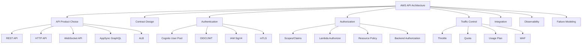

---

## 2. API Boundary Mental Model

Sebuah API production-grade memiliki lima boundary:

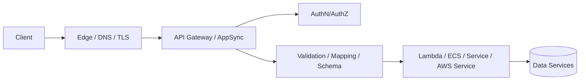

| Boundary | Pertanyaan Utama |
|---|---|
| Edge boundary | Domain, TLS, WAF, caching, regional/edge/private endpoint? |
| Identity boundary | Siapa caller? User, service, partner, device, admin? |
| Authorization boundary | Apa caller boleh melakukan action spesifik pada resource spesifik? |
| Contract boundary | Payload, schema, version, error model, compatibility? |
| Traffic boundary | Berapa RPS, burst, quota, timeout, payload, retry? |
| Integration boundary | Backend apa, timeout berapa, transform apa, error mapping apa? |
| Observability boundary | Bagaimana request ditelusuri lintas edge, API, backend, dan data? |

API yang matang tidak membiarkan semua keputusan ini jatuh ke backend service. Gateway harus mengambil peran yang tepat tanpa menjadi tempat business logic berat.

---

## 3. Choosing API Gateway REST, HTTP, WebSocket, AppSync, atau ALB

### Decision matrix

| Kebutuhan | Pilihan Umum | Alasan |
|---|---|---|
| RESTful public API dengan fitur lengkap | API Gateway REST API | Mature features: API keys, usage plans, request validation, private endpoint, WAF integration, canary/stage features |
| RESTful API sederhana, low latency, lower cost | API Gateway HTTP API | Lebih sederhana dan murah, fitur lebih minimal |
| Bidirectional realtime connection | API Gateway WebSocket API | Stateful frontend untuk client connection dan backend callback |
| GraphQL API, real-time subscription, data aggregation | AWS AppSync | Managed GraphQL, resolvers, auth modes, subscriptions, caching |
| Internal HTTP service di VPC/container | ALB | Cocok untuk service routing ke ECS/EKS/EC2; bukan API management layer penuh |
| Direct AWS service operation tanpa custom compute | API Gateway service integration / AppSync resolver | Mengurangi Lambda glue code jika mapping sederhana |
| Machine-to-machine AWS-native API | IAM-authenticated API / Private API | SigV4 dan resource policy cocok untuk AWS principal |

### REST API vs HTTP API

API Gateway REST API dan HTTP API sama-sama dapat mengekspos RESTful interface, tetapi trade-off-nya berbeda.

REST API biasanya dipilih jika butuh fitur lebih lengkap seperti:

- API keys dan usage plans,
- request validation,
- private REST API endpoint,
- per-client throttling,
- fitur mature yang lebih banyak,
- sebagian integrasi/transformasi yang lebih kaya.

HTTP API biasanya dipilih jika:

- API lebih sederhana,
- ingin cost dan latency lebih rendah,
- auth JWT sederhana cukup,
- tidak butuh feature set REST API penuh.

Rule:

> Jangan memilih REST API hanya karena lebih tua. Jangan memilih HTTP API hanya karena lebih murah. Pilih berdasarkan control surface yang dibutuhkan.

### WebSocket API

WebSocket API bukan REST API yang lebih cepat. Ia adalah model koneksi dua arah.

Cocok untuk:

- notification realtime,
- collaborative dashboard,
- case workflow updates,
- command progress updates,
- lightweight bidirectional messaging.

Tidak cocok jika:

- client hanya butuh polling sederhana,
- event tidak perlu realtime,
- backend tidak punya model connection management,
- authorization per message tidak jelas.

### AppSync

AppSync cocok ketika client membutuhkan GraphQL contract, data aggregation, subscription, dan resolver model.

Cocok untuk:

- frontend yang perlu query fleksibel,
- multiple data source aggregation,
- realtime subscription,
- mobile/offline-ish application patterns,
- domain API yang stabil di schema GraphQL.

Risiko:

- GraphQL schema bisa menjadi coupling point besar,
- resolver logic tersebar,
- query flexibility dapat menekan backend,
- authorization field-level bisa kompleks,
- caching dan N+1 problem harus dirancang.

---

## 4. API sebagai Contract, Bukan Endpoint

API contract adalah janji antara provider dan consumer.

Contract mencakup:

- resource/action model,
- request schema,
- response schema,
- error schema,
- status code semantics,
- pagination,
- filtering,
- sorting,
- idempotency,
- versioning,
- deprecation policy,
- rate limit behavior,
- authentication/authorization expectations.

### REST contract baseline

Contoh command endpoint:

```http
POST /v1/cases
Idempotency-Key: req-tenant-a-000123
Authorization: Bearer <token>
Content-Type: application/json
```

Request:

```json
{
  "subjectId": "subj-123",
  "caseType": "ENFORCEMENT_REVIEW",
  "description": "...",
  "submittedBy": "user-789"
}
```

Response accepted:

```json
{
  "caseId": "case-456",
  "status": "ACCEPTED",
  "correlationId": "corr-abc",
  "links": {
    "self": "/v1/cases/case-456"
  }
}
```

### Error model

Jangan expose stack trace atau raw backend exception.

Pola sehat:

```json
{
  "error": {
    "code": "CASE_SUBMISSION_INVALID",
    "message": "The submitted case payload is invalid.",
    "correlationId": "corr-abc",
    "details": [
      {
        "field": "caseType",
        "reason": "Unsupported value"
      }
    ]
  }
}
```

Mapping status code:

| Status | Makna |
|---:|---|
| 400 | Request invalid secara sintaks/shape |
| 401 | Tidak authenticated |
| 403 | Authenticated tetapi tidak authorized |
| 404 | Resource tidak ditemukan atau tidak visible untuk caller |
| 409 | Conflict/idempotency/resource state conflict |
| 422 | Semantik request valid JSON tetapi domain-invalid |
| 429 | Rate limited/throttled |
| 500 | Bug/internal failure |
| 502 | Bad gateway/integration failure |
| 503 | Service unavailable/dependency unavailable |
| 504 | Timeout |

### Idempotency pada API command

Untuk `POST` command yang punya side effect, gunakan idempotency key.

Pattern:

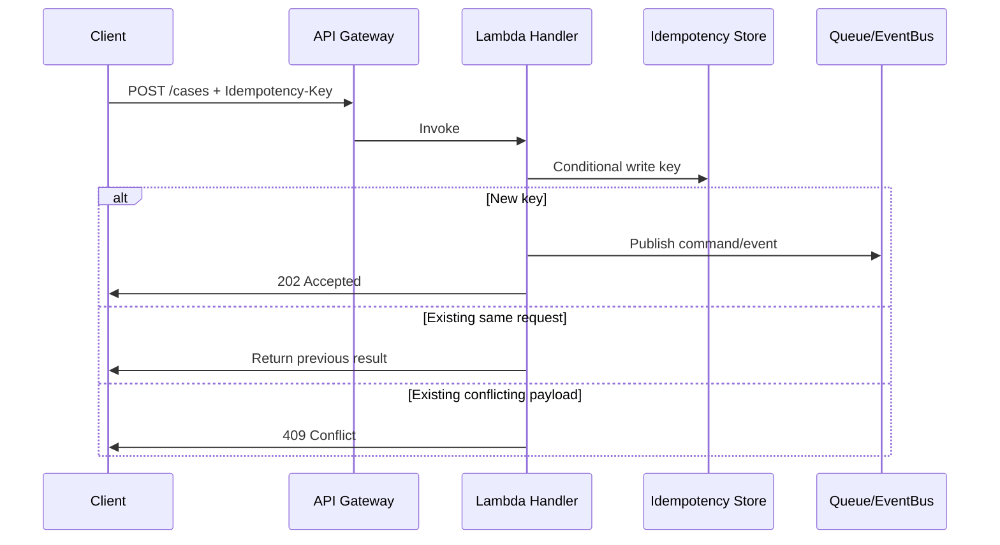

---

## 5. Authentication vs Authorization

Authentication menjawab: **siapa caller?**

Authorization menjawab: **apa caller boleh melakukan action ini terhadap resource ini?**

Banyak sistem gagal karena berhenti di authentication.

### Common auth models di AWS API

| Model | Cocok Untuk | Catatan |
|---|---|---|
| IAM/SigV4 | AWS-native machine-to-machine | Strong untuk AWS principals, private/internal automation |
| Cognito User Pool/JWT | User-facing web/mobile apps | Token claims, scopes, federation, hosted UI/app clients |
| JWT authorizer | OIDC provider external | API Gateway validates issuer/audience/scopes |
| Lambda authorizer | Custom policy/auth logic | Fleksibel tetapi menambah latency dan failure surface |
| API key | Identification/metering ringan | Bukan authentication kuat; jangan dipakai sebagai satu-satunya security untuk sensitive API |
| mTLS | Partner/service client identity | Cocok untuk high-trust client certificate model |
| Resource policy | Membatasi caller/source/VPC/account | Bagus untuk private/cross-account restrictions |

### Cognito mental model

Cognito User Pool adalah user directory dan token issuer untuk aplikasi. User pool dapat menerima token/assertion dari IdP eksternal lalu mengeluarkan JWT untuk aplikasi.

Token umum:

- ID token: identity claims untuk client.
- Access token: authorization scopes/claims untuk API.
- Refresh token: memperpanjang session sesuai policy.

API backend seharusnya memvalidasi access token, bukan mempercayai data user yang dikirim client di body.

Bad pattern:

```json
{
  "userId": "admin-123",
  "role": "SUPER_ADMIN",
  "action": "approve"
}
```

Good pattern:

```text
Caller identity and scopes come from validated token/authorizer context.
Request body contains business input only.
```

### JWT authorizer

JWT authorizer cocok untuk HTTP API ketika:

- issuer dan audience jelas,
- scopes cukup untuk route-level authorization,
- tidak butuh custom policy kompleks per resource,
- ingin menghindari Lambda authorizer latency.

Namun route-level scope bukan pengganti object-level authorization.

Contoh:

```text
scope: cases:read
request: GET /cases/case-123
```

Scope membuktikan caller boleh membaca case secara umum. Backend masih harus memeriksa apakah caller boleh membaca `case-123`.

### Lambda authorizer

Lambda authorizer cocok ketika authorization membutuhkan logic custom:

- custom token format,
- tenant-aware policy,
- partner entitlement lookup,
- mTLS + token hybrid,
- dynamic allow/deny berdasarkan external policy service.

Risiko:

- authorizer menjadi dependency kritikal semua request,
- caching salah bisa memberi akses salah,
- latency bertambah,
- failure authorizer memutus API,
- policy document terlalu permisif.

Checklist Lambda authorizer:

- [ ] Cache key mencakup semua atribut yang memengaruhi authorization.
- [ ] TTL cache sesuai sensitivity policy.
- [ ] Deny-by-default.
- [ ] Log tidak menyimpan token penuh.
- [ ] Failure mode jelas: fail closed untuk API sensitif.
- [ ] Backend tetap melakukan resource-level authorization.

---

## 6. Authorization Layers

Authorization yang matang biasanya berlapis.

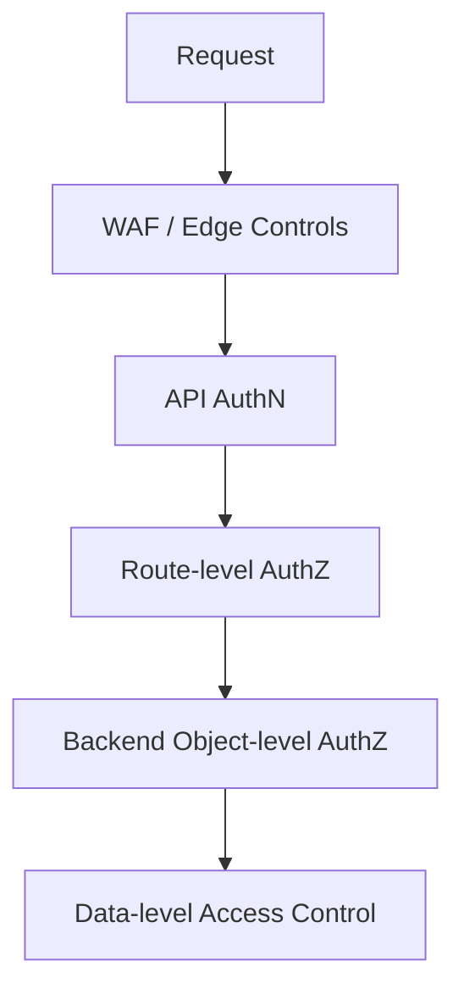

### Route-level authorization

Contoh:

```text
GET /v1/cases requires cases:read
POST /v1/cases requires cases:create
POST /v1/cases/{id}/approve requires cases:approve
```

Ini baik, tetapi belum cukup.

### Object-level authorization

Backend harus menjawab:

```text
Can principal user-789 perform APPROVE on case-456 in tenant-a at current case state?
```

Ini biasanya domain-level policy, bukan gateway-level policy.

Contoh regulatory case management:

- investigator boleh membaca case assigned ke unitnya,
- supervisor boleh approve hanya jika case state `PENDING_SUPERVISOR_REVIEW`,
- auditor boleh read-only lintas unit tetapi tidak melihat sealed evidence,
- external respondent hanya melihat case yang linked ke respondent ID-nya.

Gateway tidak seharusnya memuat semua state machine rule ini. Gateway menegakkan coarse route policy; backend menegakkan domain authorization.

---

## 7. Throttling, Quota, dan Backend Protection

Traffic control adalah alasan besar memakai API Gateway.

### Throttling mental model

Throttling bukan hukuman untuk client. Throttling adalah kontrak kapasitas.

Pertanyaan desain:

- Berapa RPS normal per client?
- Berapa burst yang masih aman?
- Apakah limit per API, per route, per stage, per usage plan, per tenant, atau per user?
- Apa response 429 menjelaskan retry policy?
- Apakah client punya exponential backoff?
- Apakah backend punya kapasitas lebih rendah daripada gateway throttle?

### Token bucket intuition

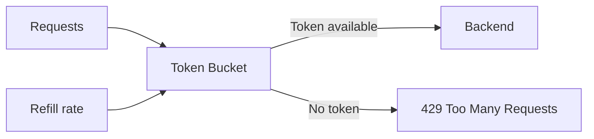

Burst capacity mengizinkan spike pendek. Rate mengatur aliran jangka panjang.

### Usage plans dan API keys

Usage plan/API key berguna untuk:

- partner API metering,
- client-specific quota,
- product tier,
- throttling per customer,
- operational visibility per consumer.

Namun API key bukan authentication kuat. Treat API key as client identifier/metering key unless combined with stronger auth.

### Backend protection

Gateway throttling harus diselaraskan dengan backend capacity.

Contoh:

```text
API Gateway throttle: 5000 RPS
Lambda reserved concurrency: 200
Average Lambda duration: 300 ms
Effective Lambda throughput ≈ 200 / 0.3 = 666 RPS
```

Jika gateway menerima 5000 RPS tetapi Lambda hanya aman 666 RPS, sisanya akan menjadi throttling/latency/error. Lebih baik limit upstream lebih realistis atau ubah arsitektur dengan queue.

### Per-route throttling

Route `GET /cases/{id}` dan `POST /cases/{id}/approve` tidak punya risk profile sama.

- Read route mungkin cacheable dan high volume.
- Approve route punya side effect dan harus low volume dengan strict idempotency.
- Search route bisa mahal dan perlu limit lebih ketat.
- Export route mungkin harus async.

Jangan memakai satu throttle global tanpa memahami route economics.

---

## 8. Request Validation, Transformation, dan Mapping

API Gateway bisa melakukan validation dan mapping. Tetapi gunakan secara proporsional.

### Apa yang cocok divalidasi di gateway

- required headers,
- content type,
- basic JSON schema shape,
- path/query parameter format,
- request body size,
- API key/usage plan,
- auth token presence/validity,
- WAF/rate/known bad traffic.

### Apa yang harus tetap di backend

- domain invariant,
- object-level authorization,
- state transition validity,
- business rule,
- data consistency,
- side effect idempotency.

Contoh:

Gateway boleh menolak:

```text
caseType missing
Content-Type not application/json
Authorization header missing
```

Backend harus memutuskan:

```text
Can this user submit this type of case for this subject?
Can this case transition from REVIEW to ENFORCEMENT_RECOMMENDED?
Is this evidence sealed by a privilege rule?
```

### Mapping complexity smell

Jika mapping template menjadi ratusan baris dan berisi business logic, ada smell. Gateway mapping sebaiknya untuk protocol adaptation, bukan domain decision.

---

## 9. Integration Patterns

### Lambda proxy integration

Paling umum untuk serverless API.

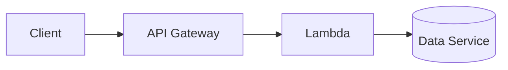

Keuntungan:

- sederhana,
- developer control tinggi,
- cocok untuk API command handler,
- mudah test dengan event contract.

Risiko:

- backend code harus handle HTTP details,
- cold start memengaruhi p95/p99,
- Lambda timeout harus sesuai API timeout,
- function bisa menjadi monolith jika semua route digabung.

### Direct AWS service integration

API Gateway/AppSync dapat memanggil AWS service tanpa Lambda untuk kasus tertentu.

Cocok jika:

- mapping sederhana,
- tidak perlu business logic kompleks,
- ingin mengurangi latency/cost Lambda,
- action mudah diaudit dan diamankan dengan IAM.

Contoh:

- API Gateway to SQS untuk command ingestion.
- API Gateway to EventBridge untuk event submission.
- AppSync resolver to DynamoDB untuk simple query/mutation.

Risiko:

- mapping/debugging lebih sulit bagi sebagian tim,
- business rule bisa tersebar di template/resolver,
- permission harus sangat teliti,
- error mapping harus dikendalikan.

### VPC Link integration

Gunakan untuk menghubungkan API Gateway ke private resource di VPC seperti NLB/private service.

Cocok untuk:

- service di ECS/EKS/EC2 yang tidak public,
- API facade di depan internal microservice,
- gradual migration dari monolith/private service.

Perhatikan:

- NLB/ALB topology,
- health check,
- timeout,
- security group/routing,
- DNS,
- cross-AZ cost/latency,
- backend scaling.

### AppSync resolver pattern

AppSync resolver bisa:

- langsung ke DynamoDB,
- Lambda resolver,
- HTTP resolver,
- pipeline resolver,
- multiple auth mode.

Pattern sehat:

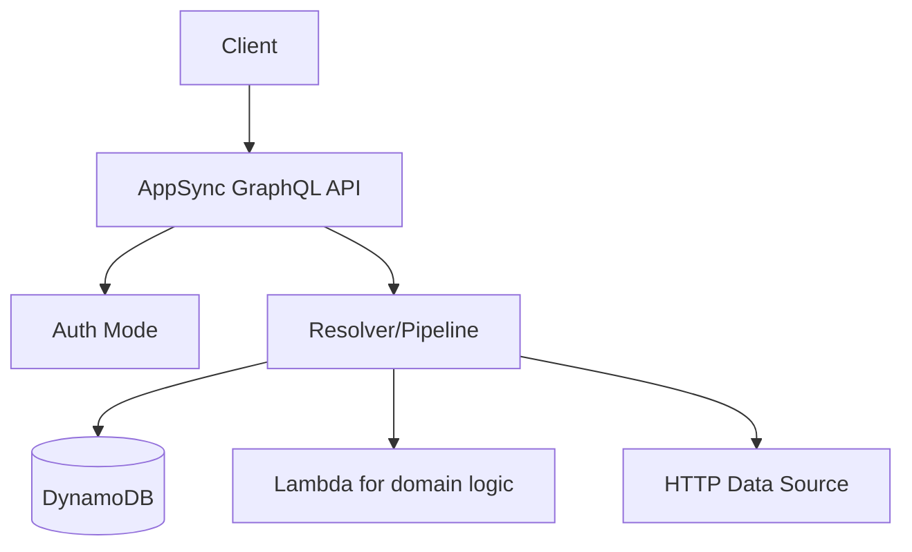

Rule:

- Resolver langsung ke DynamoDB cocok untuk simple access pattern.
- Lambda resolver cocok untuk business logic kompleks.
- Pipeline resolver cocok untuk composition ringan.
- Jangan taruh domain logic besar di mapping layer yang sulit dites.

---

## 10. AppSync and GraphQL Architecture

GraphQL mengubah API dari fixed endpoint menjadi schema-driven graph.

### Kekuatan GraphQL

- client bisa meminta field yang diperlukan,
- satu API dapat menggabungkan banyak data source,
- schema menjadi contract eksplisit,
- subscription mendukung realtime use case,
- type system membantu evolusi contract.

### Risiko GraphQL

- query terlalu mahal,
- N+1 resolver problem,
- authorization per field kompleks,
- schema menjadi shared monolith,
- caching tidak sesederhana REST,
- error partial response harus dipahami client.

### Schema boundary

Contoh schema:

```graphql
type Case {
  id: ID!
  tenantId: ID!
  status: CaseStatus!
  title: String!
  riskScore: Int
  createdAt: AWSDateTime!
}

type Query {
  getCase(id: ID!): Case
  listCases(filter: CaseFilter, limit: Int, nextToken: String): CaseConnection!
}

type Mutation {
  submitCase(input: SubmitCaseInput!): SubmitCaseResult!
  approveCase(input: ApproveCaseInput!): ApproveCaseResult!
}

type Subscription {
  onCaseStatusChanged(tenantId: ID!): CaseStatusChangedEvent
}
```

Schema harus mencerminkan domain language, bukan tabel database mentah.

Bad GraphQL smell:

```graphql
type Query {
  queryDynamoTable(tableName: String!, key: String!): AWSJSON
}
```

Ini membocorkan implementation detail dan menghancurkan contract.

### AppSync authorization

AppSync mendukung beberapa authorization type. Pilihan umum:

- API key untuk development/public low-risk use case dengan expiry.
- IAM untuk AWS principal atau service-to-service.
- Cognito User Pools untuk user auth.
- OIDC untuk external identity provider.
- Lambda authorizer untuk custom authorization.

Multi-auth bisa kuat, tetapi juga kompleks. Dokumentasikan field mana memakai auth apa.

### GraphQL cost control

Checklist:

- [ ] Batasi query depth jika perlu.
- [ ] Batasi `limit` pagination.
- [ ] Hindari resolver N+1.
- [ ] Gunakan caching untuk read-heavy resolver.
- [ ] Monitor resolver latency dan error.
- [ ] Jangan expose field sensitif tanpa field-level authorization.
- [ ] Gunakan subscription filter agar event tidak bocor antar tenant.

---

## 11. Private APIs and Internal APIs

Tidak semua API harus public.

### Private REST API

Private API cocok untuk:

- API hanya dari VPC,
- internal platform API,
- regulated backend integration,
- cross-account private access,
- service-to-service yang tidak boleh terekspos internet.

Pattern:

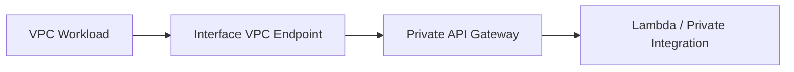

Pertimbangan:

- resource policy API,
- VPC endpoint policy,
- DNS private resolution,
- account boundary,
- logging/audit,
- security group/routing.

### Internal API != insecure API

Internal API tetap butuh:

- authentication,
- authorization,
- throttling,
- schema validation,
- observability,
- versioning,
- deprecation.

Jangan berpikir "internal berarti trusted". Di enterprise besar, internal API adalah salah satu sumber lateral movement dan accidental overload.

---

## 12. CORS, Browser Clients, dan Edge Concerns

CORS adalah browser security mechanism, bukan API authentication.

CORS salah konfigurasi sering menghasilkan problem:

- browser gagal meski API backend sehat,
- wildcard origin untuk sensitive API,
- credentials allowed dengan origin terlalu luas,
- preflight tidak mendukung header auth/custom,
- cache preflight tidak dikendalikan.

Guideline:

- specify allowed origins, jangan asal `*` untuk credentialed requests,
- specify allowed headers,
- specify methods,
- handle OPTIONS preflight,
- pisahkan browser API dari machine API jika policy berbeda.

---

## 13. API Observability

API observability harus melihat request dari edge sampai backend.

### Access log fields minimal

- request ID,
- correlation ID,
- source IP / client identifier,
- principal/user/tenant jika aman,
- route,
- method,
- status,
- integration status,
- latency total,
- integration latency,
- response size,
- error type,
- user agent,
- API key/usage plan identifier jika relevan.

Contoh structured access log:

```json
{
  "requestId": "$context.requestId",
  "correlationId": "$context.requestOverride.header.x-correlation-id",
  "routeKey": "$context.routeKey",
  "status": "$context.status",
  "integrationStatus": "$context.integrationStatus",
  "responseLatency": "$context.responseLatency",
  "integrationLatency": "$context.integrationLatency",
  "principalId": "$context.authorizer.principalId"
}
```

### Metrics wajib

| Metric | Makna |
|---|---|
| Count/request count | Traffic volume |
| 4xx | Client/auth/validation/throttle problem |
| 5xx | Gateway/backend/integration problem |
| Latency | Total API latency |
| IntegrationLatency | Backend latency |
| CacheHit/CacheMiss jika caching | Cache effectiveness |
| ThrottledRequests | Traffic melebihi limit |
| AuthorizerLatency | Authorizer bottleneck |

### Trace propagation

Semua request harus membawa correlation ID.

Pattern:

```text
Client -> x-correlation-id -> API Gateway -> Lambda/ECS -> downstream -> logs/traces/events
```

Jika client tidak mengirim correlation ID, gateway/backend membuat satu dan mengembalikannya di response.

---

## 14. Failure Modes

### Failure mode table

| Failure | Gejala | Root Cause Umum | Mitigasi |
|---|---|---|---|
| 401 spike | Banyak request unauthenticated | Token expired, Cognito/IdP issue, client bug | Monitor auth errors, clear client message, IdP health |
| 403 spike | Caller authenticated tapi denied | Scope/policy change, authorizer bug | Policy test, staged rollout, audit decision logs |
| 429 spike | Throttling | Traffic spike, bad client retry, quota rendah | Backoff guidance, usage plan, WAF/bot control |
| 502 | Bad gateway | Lambda malformed response, backend reset | Contract tests, integration logs |
| 503 | Unavailable | Backend capacity/dependency outage | Circuit breaker, queue, autoscaling |
| 504 | Timeout | Backend slow, Lambda timeout mismatch | Timeout budget, async design |
| CORS error | Browser blocked request | Preflight/header/origin config | Explicit CORS config and tests |
| Authorizer cache leak | User gets wrong access | Cache key missing tenant/scope/resource | Include all policy inputs in identity source/cache key |
| Payload too large | Request rejected | Upload via API body | S3 pre-signed URL pattern |
| Mapping error | Request fails before backend | Template/schema mismatch | Contract tests and deployment validation |

### Retry amplification

Client retries can amplify outage.

Bad pattern:

```text
API starts returning 503.
10k clients retry immediately 3 times.
Backend receives 30k extra requests.
```

Mitigation:

- return `Retry-After` if appropriate,
- require exponential backoff with jitter,
- enforce throttling,
- use queue for accepted async work,
- use circuit breaker in clients/services,
- do not make expensive operation synchronous if not necessary.

---

## 15. Versioning and Evolution

API yang bagus dirancang untuk berubah.

### REST versioning

Pilihan umum:

```text
/v1/cases
/v2/cases
```

atau header-based versioning. Untuk banyak enterprise, path versioning lebih eksplisit dan mudah dioperasikan.

Backward-compatible changes:

- tambah optional field,
- tambah response field yang client boleh ignore,
- tambah endpoint baru,
- tambah enum hanya jika client tolerant.

Breaking changes:

- hapus field,
- ubah meaning field,
- ubah required field,
- ubah status code semantics,
- ubah pagination behavior,
- ubah auth requirement tanpa migration.

### GraphQL evolution

GraphQL umumnya menggunakan deprecation field, bukan path versioning.

Pattern:

```graphql
type Case {
  id: ID!
  status: CaseStatus!
  legacyRiskBand: String @deprecated(reason: "Use risk.score and risk.band instead")
  risk: RiskAssessment
}
```

Jangan hapus field sebelum consumer benar-benar migrasi.

### Consumer-driven governance

Untuk API internal besar:

- catat consumer,
- publikasikan OpenAPI/GraphQL schema,
- contract test,
- breaking-change review,
- deprecation window,
- changelog,
- SDK/client generation jika relevan.

---

## 16. Security Hardening

### Edge security checklist

- [ ] TLS enforced.
- [ ] Custom domain dikelola dengan ACM.
- [ ] WAF dipakai untuk public high-risk API.
- [ ] Rate-based rules untuk bot/abuse pattern.
- [ ] Request body size dikendalikan.
- [ ] Sensitive admin API tidak public tanpa alasan kuat.

### Auth checklist

- [ ] Token issuer/audience/scope divalidasi.
- [ ] API key tidak dianggap authentication kuat.
- [ ] Lambda authorizer fail closed untuk API sensitif.
- [ ] Authorizer cache key aman.
- [ ] Backend tetap object-level auth.
- [ ] Tenant isolation tidak hanya berdasarkan body/header dari client.

### Data leakage checklist

- [ ] Error response tidak expose stack trace.
- [ ] Logs tidak menyimpan token penuh.
- [ ] PII/regulated data dimasking atau tidak dilog.
- [ ] Access log retention sesuai policy.
- [ ] Response schema tidak expose internal IDs yang sensitif jika tidak perlu.

### Deployment security

- [ ] API changes melalui IaC.
- [ ] Stage/prod deployment dipisah.
- [ ] Authorizer/policy changes direview.
- [ ] WAF/rate-limit changes punya rollback.
- [ ] Custom domain/certificate ownership jelas.

---

## 17. Cost Engineering API

Cost API tidak hanya API Gateway/AppSync request cost.

Unit cost API:

```text
API request cost
+ authorizer cost
+ Lambda/backend cost
+ data service cost
+ logs/traces cost
+ WAF cost
+ data transfer cost
+ cache cost
+ retry cost
```

### Cost drivers

| Driver | Dampak |
|---|---|
| High request volume | API Gateway/AppSync request cost |
| Lambda authorizer per request | Extra Lambda invocation/latency/cost |
| Verbose access/execution logs | CloudWatch cost |
| Large payload response | Data transfer and latency |
| Retry storm | Multiplies all downstream costs |
| GraphQL expensive queries | Backend read amplification |
| AppSync resolver fanout | Multiple downstream calls per GraphQL query |
| WAF on high traffic | Security cost but often justified |

### Cost controls

- gunakan HTTP API jika feature set cukup,
- cache read-heavy safe responses,
- limit query complexity/pagination,
- hindari logging full payload,
- gunakan direct integration jika Lambda glue tidak perlu,
- pakai throttling untuk mencegah abuse,
- ukur cost per route/tenant/consumer jika possible.

---

## 18. Production Reference Architectures

### 18.1 Public command API with async processing

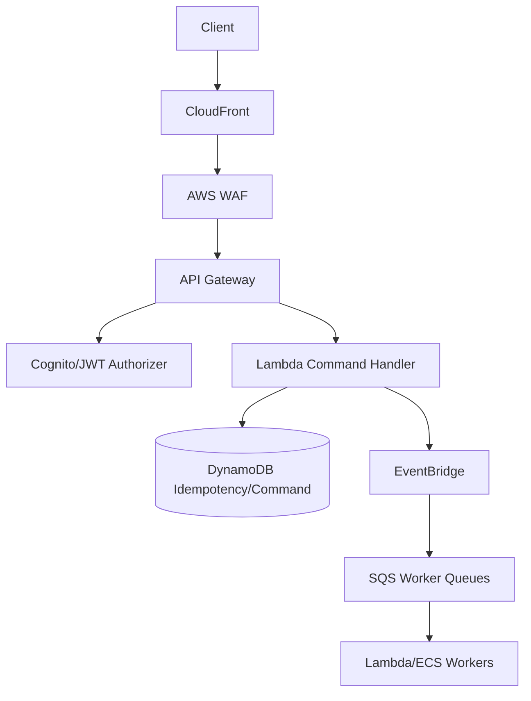

Cocok untuk:

- regulated command intake,
- submission workflow,
- long-running processing,
- audit-heavy systems.

Key decisions:

- return `202 Accepted`, bukan menunggu semua processing,
- idempotency key wajib,
- EventBridge/SQS memisahkan processing,
- API Gateway throttle melindungi command handler,
- WAF melindungi public boundary.

### 18.2 Partner API with usage plans

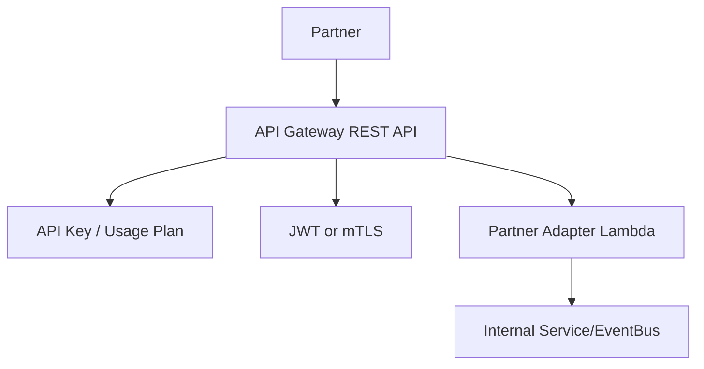

Cocok untuk:

- external partner integration,
- tiered quota,
- metering,
- partner-specific contract.

Important:

- API key bukan satu-satunya security.
- Usage plan untuk quota/metering.
- Contract per partner harus terdokumentasi.
- Partner adapter menjaga internal model tidak bocor.

### 18.3 Internal private API

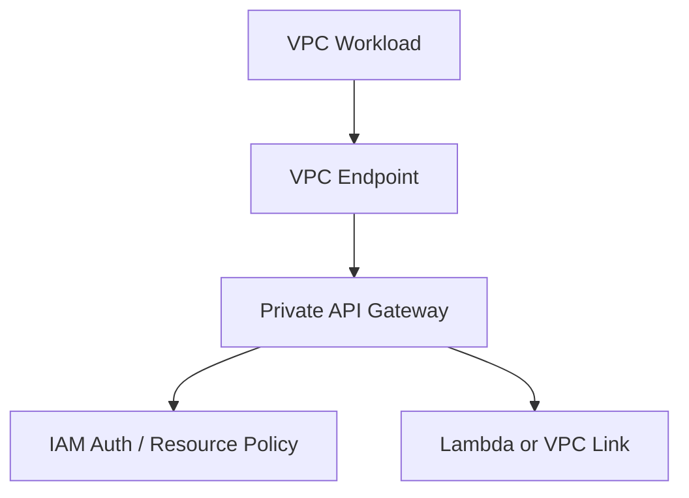

Cocok untuk:

- internal platform API,
- cross-account service access,
- regulated private operation,
- admin automation.

### 18.4 GraphQL frontend aggregation

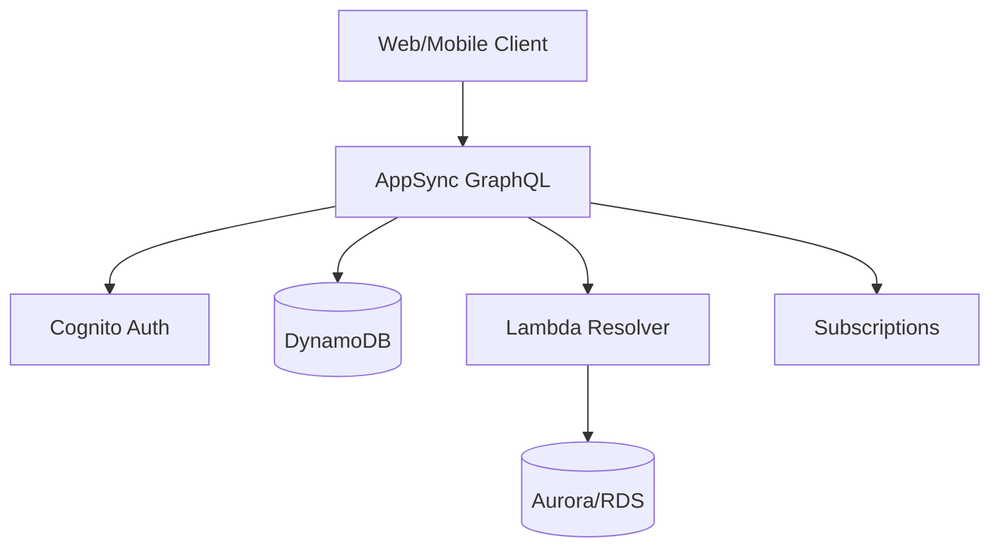

Cocok untuk:

- frontend-heavy applications,
- multi-source reads,
- realtime updates,
- schema-first API.

Key concerns:

- field-level auth,
- query complexity,
- resolver latency,
- pagination,
- subscription tenant isolation.

---

## 19. API Review Checklist

### Product choice

- [ ] API Gateway REST/HTTP/WebSocket/AppSync/ALB dipilih dengan alasan eksplisit.
- [ ] Fitur yang dibutuhkan tersedia di pilihan tersebut.
- [ ] Cost/latency/control trade-off dipahami.

### Contract

- [ ] Request/response schema terdokumentasi.
- [ ] Error model konsisten.
- [ ] Idempotency untuk command side effect.
- [ ] Pagination/filtering/sorting jelas.
- [ ] Versioning/deprecation policy ada.

### Auth and security

- [ ] Authentication model jelas.
- [ ] Authorization route-level dan object-level jelas.
- [ ] Token issuer/audience/scope divalidasi.
- [ ] API key tidak dijadikan auth utama.
- [ ] WAF/rate controls untuk public API.
- [ ] Sensitive logs dimasking.

### Traffic and resilience

- [ ] Throttling dan quota selaras dengan backend capacity.
- [ ] Timeout budget jelas.
- [ ] Retry guidance untuk client jelas.
- [ ] 429/503 response contract jelas.
- [ ] Backend punya reserved concurrency/capacity control jika perlu.

### Observability

- [ ] Access logs aktif dengan field berguna.
- [ ] Correlation ID propagated.
- [ ] 4xx/5xx/latency/throttle alarms ada.
- [ ] Integration latency dipisahkan dari total latency.
- [ ] Authorizer decision dapat diaudit tanpa membocorkan token.

### Operations

- [ ] API deployed via IaC.
- [ ] Stage/prod separation jelas.
- [ ] Custom domain/certificate lifecycle jelas.
- [ ] Runbook untuk 401/403/429/5xx spike tersedia.
- [ ] Rollback plan tersedia.

---

## 20. Common Anti-Patterns

### Anti-pattern 1: API Gateway hanya sebagai pass-through tanpa policy

Gejala:

- tidak ada throttling,
- tidak ada validation,
- auth semua di backend,
- access log minim,
- semua route sama risk treatment.

Perbaikan:

- enforce auth di gateway jika sesuai,
- route-level throttling,
- basic request validation,
- structured access log,
- WAF untuk public API.

### Anti-pattern 2: Semua authorization ditaruh di JWT scope

Gejala:

```text
Token has cases:approve, therefore user can approve any case.
```

Perbaikan:

- scope untuk coarse capability,
- backend untuk object/state-level authorization,
- policy decision log.

### Anti-pattern 3: API key dianggap secure

API key bisa bocor, dicopy, dan sering tidak merepresentasikan identity user. Gunakan API key untuk metering/usage plan, bukan sebagai satu-satunya auth untuk API sensitif.

### Anti-pattern 4: GraphQL expose database schema

Gejala:

- schema sama dengan table,
- field internal bocor,
- client tahu partition key,
- resolver hanya thin wrapper database.

Perbaikan:

- schema berdasarkan domain language,
- resolver menyembunyikan storage detail,
- field-level auth,
- pagination dan query cost control.

### Anti-pattern 5: Tidak ada timeout budget

Gejala:

- client timeout 5s,
- API Gateway timeout 29s,
- Lambda timeout 60s,
- DB timeout default panjang.

Perbaikan:

- desain timeout dari client ke dependency,
- dependency timeout lebih pendek dari handler,
- async untuk proses panjang,
- return accepted jika work belum selesai.

### Anti-pattern 6: Full payload logging

Gejala:

- request/response lengkap masuk CloudWatch,
- token/PII/regulatory data terekam,
- cost log tinggi,
- audit risk.

Perbaikan:

- log metadata dan IDs,
- mask sensitive fields,
- sampling untuk debug,
- retention policy.

---

## 21. Deliberate Practice

### Latihan 1: Pilih API product

Diberikan kebutuhan:

```text
- Public API untuk partner
- Per-partner quota
- API key untuk metering
- JWT untuk authentication
- Request validation
- WAF
- Usage tier bronze/silver/gold
```

Tugas:

1. Pilih REST API atau HTTP API.
2. Jelaskan alasannya.
3. Tentukan auth model.
4. Tentukan throttle/quota.
5. Buat observability baseline.

Arah jawaban:

- REST API lebih mungkin karena usage plan/API key/per-client throttling/request validation mature.
- API key untuk metering, JWT/mTLS untuk auth.
- WAF di public boundary.
- Access log per partner/client ID.

### Latihan 2: Refactor API synchronous menjadi async

Diberikan endpoint:

```text
POST /reports/export
Takes 45-180 seconds.
Sometimes times out.
User retries causing duplicate export jobs.
```

Tugas:

- ubah contract,
- desain idempotency,
- pilih backend integration,
- desain status polling/realtime notification,
- tentukan error model.

Arah:

```text
POST /reports/export -> 202 Accepted + jobId
GET /reports/export/{jobId}
Optional WebSocket/AppSync subscription for completion.
Use SQS/Step Functions/ECS depending workload.
Idempotency-Key prevents duplicate jobs.
```

### Latihan 3: Multi-tenant authorization

Diberikan:

```text
GET /cases/{caseId}
JWT contains tenantId and scopes.
Some auditors can access multiple tenants.
Some cases are sealed.
```

Tugas:

- tentukan gateway-level auth,
- tentukan backend object-level policy,
- tentukan log/audit decision,
- tentukan failure response.

Arah:

- JWT verifies identity and coarse scopes.
- Backend policy checks tenant membership, auditor role, sealed case rule.
- 404 vs 403 decision harus konsisten untuk data hiding.

---

## 22. Self-Correction Questions

Saat review API architecture, tanyakan:

1. API ini public, partner, internal, admin, atau machine-to-machine?
2. Mengapa memilih REST API/HTTP API/WebSocket/AppSync/ALB?
3. Apa contract request/response/error sudah stabil?
4. Apa side effect command idempotent?
5. Apa authentication dan authorization dipisah jelas?
6. Apa object-level authorization dilakukan?
7. Apa throttling selaras dengan backend capacity?
8. Apa response 429/503 memberi guidance yang benar?
9. Apa timeout budget dari client sampai dependency sudah jelas?
10. Apa logs cukup untuk audit tanpa membocorkan data sensitif?
11. Apa API bisa evolved tanpa breaking consumer?
12. Apa GraphQL query bisa menekan backend secara tidak terkendali?
13. Apa authorizer cache key aman?
14. Apa private API tetap punya auth dan audit?
15. Apa API key digunakan sesuai fungsi, bukan sebagai security palsu?

---

## 23. Mini Case Study: Enforcement Lifecycle API

Sistem enforcement lifecycle membutuhkan beberapa API:

- public/portal API untuk submission,
- internal API untuk investigator,
- admin API untuk supervisor,
- partner API untuk external agency,
- realtime update untuk case status,
- machine API untuk scheduled integration.

Desain API boundary:

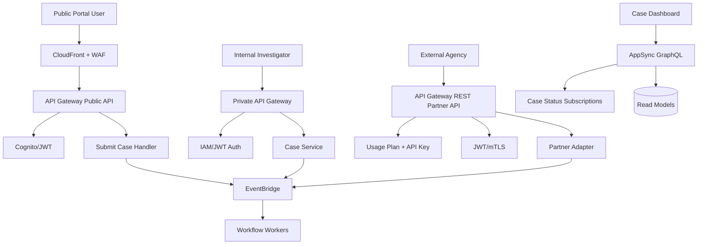

Key decisions:

- Public submission API memakai strict WAF, Cognito/JWT jika user authenticated, idempotency key, dan async command acceptance.
- Partner API memakai usage plan untuk quota/metering, tetapi auth tetap JWT/mTLS.
- Internal API private tidak otomatis trusted; tetap punya IAM/JWT dan audit.
- AppSync digunakan untuk dashboard read model dan realtime subscription, bukan untuk semua command kompleks.
- Object-level authorization tetap di backend case service.
- Semua API membawa correlation ID ke EventBridge dan downstream workers.

---

## 24. Reference Notes

Rujukan resmi yang harus diverifikasi ulang saat implementasi production karena fitur, quota, dan rekomendasi dapat berubah:

- Amazon API Gateway Developer Guide — REST APIs, HTTP APIs, WebSocket APIs, Lambda authorizers, JWT authorizers, throttling, usage plans, quotas, private APIs, integration types.
- AWS AppSync Developer Guide — GraphQL APIs, authorization modes, resolvers, caching, subscriptions, monitoring.
- Amazon Cognito Developer Guide — user pools, JWT tokens, app clients, federation, token claims.
- AWS WAF Developer Guide — managed rules, rate-based rules, logging.
- AWS Well-Architected Framework — security, reliability, operational excellence.

---

## 25. Ringkasan Engineering Judgment

API architecture di AWS adalah desain boundary. Engineer yang matang tidak hanya bertanya "endpoint-nya apa?" tetapi:

1. Siapa caller-nya?
2. Apa contract-nya?
3. Apa policy-nya?
4. Apa limit-nya?
5. Apa failure behavior-nya?
6. Apa audit evidence-nya?
7. Apa cost per request-nya?
8. Apa blast radius jika client salah atau jahat?

Prinsip akhir:

- API Gateway/AppSync adalah enforcement layer, bukan sekadar reverse proxy.
- Authentication bukan authorization.
- JWT scope bukan object-level policy.
- API key bukan security utama.
- Throttling harus mengikuti backend capacity, bukan angka default.
- Command API harus idempotent.
- Timeout budget harus didesain dari client sampai dependency.
- GraphQL schema harus domain-oriented, bukan database mirror.
- Private API tetap perlu auth, audit, dan limit.
- API yang bagus bisa berubah tanpa menghancurkan consumer.

