------
title: Learn AWS Engineering Mastery - Part 015
description: Event-driven integration on AWS using SQS, SNS, EventBridge, and Step Functions with production-grade semantics, failure handling, idempotency, observability, and architectural trade-offs.
series: learn-aws
seriesTitle: Learn AWS Engineering Mastery
order: 15
partTitle: Event-Driven Integration: SQS, SNS, EventBridge, and Step Functions
tags:
- aws
- event-driven-architecture
- sqs
- sns
- eventbridge
- step-functions
- integration
- reliability
date: 2026-06-30
---

# Learn AWS Engineering Mastery - Part 015

# Event-Driven Integration: SQS, SNS, EventBridge, and Step Functions

## 1. Target Skill

Setelah bagian ini, target skill Anda bukan sekadar tahu bahwa AWS punya SQS, SNS, EventBridge, dan Step Functions. Targetnya adalah mampu mendesain **integration boundary** yang benar untuk workload production:

1. Memilih antara queue, topic, event bus, workflow, stream, dan direct API call.
2. Menjelaskan konsekuensi delivery semantics: at-least-once, ordering, retry, deduplication, timeout, poison message, dan replay.
3. Mendesain consumer yang idempotent, observable, secure, dan recoverable.
4. Memisahkan business event, command, notification, dan workflow state.
5. Menentukan kapan choreography cukup dan kapan orchestration diperlukan.
6. Membuat failure mode eksplisit: downstream unavailable, consumer crash, duplicate delivery, partial completion, retry storm, dead-letter buildup, dan replay hazard.
7. Mengaitkan desain integrasi dengan governance: ownership, schema, audit trail, least privilege, cost, dan operational runbook.

Dalam konteks Kaufman, bagian ini adalah deconstruction terhadap skill “mendesain sistem terdistribusi di AWS”. Banyak engineer berhenti di template: `API Gateway -> Lambda -> SQS`. Top-tier engineer harus bisa menjawab: **apa yang terjadi ketika retry, reorder, duplicate, deploy baru, schema berubah, consumer lambat, data sudah sebagian diproses, dan auditor meminta bukti alur transaksi?**

---

## 2. Mental Model Inti

Event-driven architecture bukan berarti “semua hal harus event”. Event-driven architecture berarti **state change dan work request dipisahkan dari eksekusi langsung**, sehingga sistem bisa lebih resilient terhadap delay, failure, dan variasi throughput.

Model mentalnya:

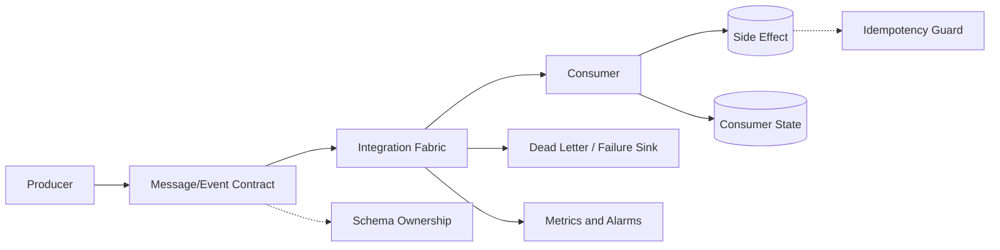

Ada lima boundary utama:

| Boundary | Pertanyaan Engineering |
|---|---|
| Producer boundary | Apakah producer hanya memberitahu perubahan, atau memerintah consumer melakukan sesuatu? |
| Contract boundary | Apakah payload stabil, versioned, backward compatible, dan punya semantic identity? |
| Broker boundary | Apakah kita butuh buffering, fanout, filtering, routing, replay, atau orchestration? |
| Consumer boundary | Apakah consumer aman terhadap duplicate, reorder, retry, dan partial failure? |
| Recovery boundary | Apakah event/message yang gagal bisa ditemukan, dipahami, diperbaiki, dan diproses ulang? |

AWS menyediakan beberapa primitive berbeda:

| Primitive | Layanan | Model Pikir |
|---|---|---|
| Queue | SQS | Work buffer antara producer dan consumer. Cocok untuk load leveling dan asynchronous task processing. |
| Topic | SNS | Fanout notification. Producer tidak tahu jumlah subscriber. |
| Event bus | EventBridge | Event routing berbasis pattern, source, detail-type, target, archive/replay, dan integrasi SaaS/AWS services. |
| Workflow | Step Functions | State machine eksplisit untuk proses multi-step, branching, retry, compensation, dan audit alur. |

Hal yang sering salah: memilih layanan berdasarkan “mana yang populer”, bukan berdasarkan **semantic contract**.

---

## 3. Kaufman Deconstruction: Sub-Skill yang Harus Dikuasai

Untuk menguasai event-driven integration di AWS, pecah skill menjadi sub-skill berikut:

| Sub-Skill | Output yang Harus Bisa Dibuat |
|---|---|
| Delivery semantics | Menjelaskan apa yang dijamin dan tidak dijamin oleh SQS/SNS/EventBridge/Step Functions. |
| Queue design | Mendesain SQS standard/FIFO, visibility timeout, DLQ, redrive, consumer concurrency. |
| Fanout design | Mendesain SNS topic, subscription filtering, per-subscriber failure isolation. |
| Event routing | Mendesain EventBridge event bus, rule, target, archive, replay, cross-account routing. |
| Workflow orchestration | Mendesain Step Functions state machine dengan retry, catch, timeout, compensation, dan human boundary. |
| Idempotency | Mendesain idempotency key, dedupe store, conditional write, and safe side-effect. |
| Schema governance | Mendesain versioning, required/optional fields, envelope, event identity, compatibility policy. |
| Observability | Mendesain metrics, logs, traces, correlation ID, DLQ alarms, replay audit. |
| Security | Mendesain IAM permissions, resource policies, encryption, tenant isolation, and PII control. |
| Cost control | Memahami cost driver: request count, transitions, payload, fanout multiplier, idle polling, replay. |

Deliberate practice untuk bagian ini bukan membuat demo “hello queue”, tetapi membuat skenario gagal dan membuktikan sistem tetap benar.

---

## 4. Taxonomy: Event, Command, Message, Notification, Workflow

Sebelum memilih layanan, bedakan jenis komunikasi.

### 4.1 Event

Event adalah fakta yang sudah terjadi.

Contoh:

```json
{
  "source": "case-management.case",
  "detailType": "CaseEscalated",
  "detail": {
    "caseId": "CASE-10291",
    "escalationLevel": "REGULATORY_REVIEW",
    "occurredAt": "2026-06-30T08:21:00Z"
  }
}
```

Ciri event:

- Past tense: `CaseEscalated`, `PaymentCaptured`, `DocumentApproved`.
- Producer tidak memerintah consumer.
- Consumer bebas bereaksi atau mengabaikan.
- Cocok untuk EventBridge/SNS.
- Harus immutable secara semantic.

### 4.2 Command

Command adalah instruksi agar sesuatu dilakukan.

Contoh:

```json
{
  "commandType": "GenerateComplianceReport",
  "caseId": "CASE-10291",
  "requestedBy": "workflow/escalation-state-machine",
  "idempotencyKey": "CASE-10291:REPORT:2026-06-30"
}
```

Ciri command:

- Imperative: `GenerateReport`, `SendNotice`, `CloseCase`.
- Biasanya punya satu logical owner.
- Cocok untuk SQS jika asynchronous dan satu consumer group.
- Harus punya idempotency key.

### 4.3 Notification

Notification adalah sinyal bahwa penerima mungkin perlu tahu sesuatu.

Contoh:

- “Case updated.”
- “File uploaded.”
- “Policy changed.”

Notification sering lebih ringan daripada event domain. Cocok untuk SNS atau EventBridge tergantung kebutuhan routing/filtering.

### 4.4 Workflow State

Workflow state adalah posisi eksplisit proses multi-step.

Contoh:

- `ValidateInput`
- `CheckEntitlement`
- `RequestSupervisorApproval`
- `GenerateNotice`
- `SendNotice`
- `WaitForResponse`
- `EscalateIfTimeout`

Cocok untuk Step Functions, bukan queue biasa, jika proses membutuhkan branching, timeout, compensation, atau audit state.

---

## 5. Decision Matrix: Kapan Pakai Apa?

| Kebutuhan | Gunakan | Kenapa |
|---|---|---|
| Satu pekerjaan asynchronous untuk diproses worker | SQS | Queue mem-buffer pekerjaan dan mendukung retry/visibility timeout. |
| Banyak subscriber perlu diberi sinyal sama | SNS | Topic fanout sederhana dan efisien. |
| Event perlu diroute berdasarkan pattern ke banyak target | EventBridge | Rule pattern, event bus, SaaS/AWS integration, archive/replay. |
| Proses multi-step dengan branching dan retry per step | Step Functions | State machine eksplisit dan observable. |
| Butuh ordering strict per entity | SQS FIFO | Message group bisa menjaga urutan per group. |
| Butuh stream analytics atau replay jangka panjang dengan offset | Kinesis/MSK | Bukan fokus part ini; gunakan stream jika replay/consumer offset/throughput stream adalah requirement inti. |
| Request harus selesai saat itu juga | Direct API call | Asynchronous integration menambah latency dan eventual consistency. |

Rule of thumb:

- **SQS** untuk work queue.
- **SNS** untuk fanout notification.
- **EventBridge** untuk event routing dan integration fabric.
- **Step Functions** untuk workflow state.
- **Kinesis/MSK** untuk stream log dan ordered high-throughput event stream.

---

## 6. SQS Deep Dive: Queue sebagai Work Buffer

Amazon SQS adalah managed message queue. SQS sangat berguna saat producer dan consumer punya throughput, availability, atau latency profile berbeda.

### 6.1 Mental Model SQS

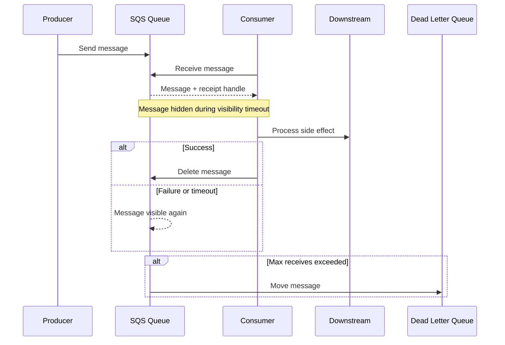

SQS bukan database transaksi. SQS bukan scheduler utama. SQS bukan event log permanen. SQS adalah **buffer kerja**.

### 6.2 Standard Queue vs FIFO Queue

| Dimensi | Standard Queue | FIFO Queue |
|---|---|---|
| Throughput | Lebih tinggi dan fleksibel | Lebih terkendali, bergantung desain group dan quota saat itu |
| Ordering | Best-effort ordering | Ordering per message group |
| Delivery | At-least-once; duplicate possible | FIFO mengurangi duplicate melalui deduplication window, tetapi consumer tetap harus idempotent |
| Use case | Background job, email worker, image processing, async task | Entity-specific ordered processing: per account, per case, per tenant, per order |
| Risk | Reordering dan duplicate | Hot message group menjadi bottleneck |

Top-tier reasoning: FIFO tidak memberi “exactly-once business effect” end-to-end. Deduplication membantu pada queue boundary, tetapi side-effect ke database, email, payment, search index, atau external API tetap harus idempotent.

### 6.3 Visibility Timeout

Visibility timeout adalah periode setelah consumer menerima message ketika message tersebut tidak terlihat oleh consumer lain. Jika consumer tidak menghapus message sebelum timeout habis, message bisa terlihat lagi dan diproses ulang.

Design rule:

```txt
visibilityTimeout > p99_processing_time + downstream_jitter + safety_margin
```

Namun jangan terlalu besar. Visibility timeout yang terlalu besar memperlambat recovery ketika consumer mati.

Pattern yang sehat:

- Set visibility timeout berdasarkan p99 processing time.
- Gunakan heartbeat/extend visibility untuk job panjang.
- Hindari job sangat panjang di SQS tanpa checkpoint.
- Message harus punya `idempotencyKey`.
- Consumer harus bisa resume atau safely retry.

### 6.4 Dead-Letter Queue

DLQ adalah tempat isolasi message yang gagal diproses berulang kali.

DLQ bukan tempat sampah. DLQ adalah **operational evidence**.

DLQ message harus bisa menjawab:

- Message apa yang gagal?
- Consumer mana yang gagal?
- Kapan mulai gagal?
- Error apa?
- Apakah bisa di-redrive?
- Apakah schema berubah?
- Apakah downstream unavailable?
- Apakah data corrupt?

DLQ baseline:

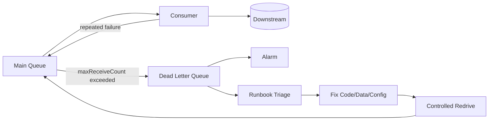

Anti-pattern besar: DLQ ada, tetapi tidak ada alarm, tidak ada owner, dan tidak ada redrive procedure.

### 6.5 Consumer Concurrency

Consumer concurrency menentukan seberapa cepat queue terkuras.

Untuk Lambda consumer, concurrency dipengaruhi oleh event source mapping, batch size, queue depth, reserved concurrency, failure rate, dan downstream capacity.

Untuk ECS/EC2 worker, concurrency dipengaruhi jumlah task/instance, thread pool, long polling, batch size, dan downstream rate limit.

Gunakan prinsip berikut:

```txt
safeConcurrency <= min(
  downstream_safe_capacity,
  database_connection_capacity,
  external_api_rate_limit,
  idempotency_store_capacity,
  queue_processing_budget
)
```

Queue depth tinggi bukan selalu berarti “scale up”. Bisa berarti:

- Consumer error.
- Downstream lambat.
- Hot partition/entity.
- Poison message menyebabkan retry storm.
- Producer mengirim terlalu cepat.
- Visibility timeout terlalu pendek.
- Batch failure mengulang semua item.

### 6.6 Idempotent Consumer

Consumer idempotent adalah consumer yang aman jika message yang sama diproses lebih dari sekali.

Basic pattern:

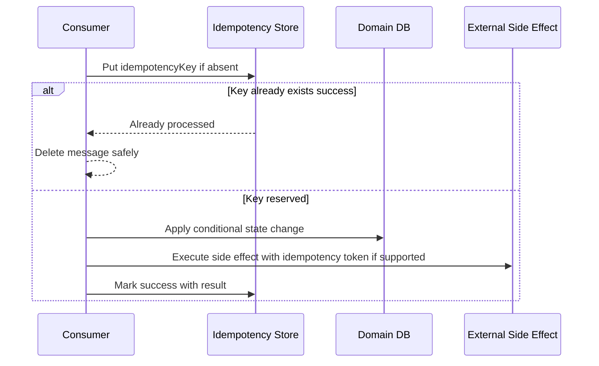

Idempotency key bisa berupa:

- Event ID dari producer.
- Business entity + transition version.
- Command ID.
- Workflow execution ID + step name.
- Outbox message ID.

Jangan memakai timestamp acak sebagai idempotency key jika retry harus dianggap message yang sama.

### 6.7 SQS Message Shape

Gunakan envelope yang eksplisit:

```json
{
  "messageId": "msg-01J...",
  "messageType": "GenerateNoticeCommand",
  "schemaVersion": "1.0",
  "correlationId": "corr-01J...",
  "causationId": "evt-01J...",
  "idempotencyKey": "CASE-10291:NOTICE:FINAL_WARNING:v3",
  "tenantId": "tenant-a",
  "occurredAt": "2026-06-30T08:21:00Z",
  "payload": {
    "caseId": "CASE-10291",
    "noticeType": "FINAL_WARNING"
  }
}
```

Minimal fields untuk production:

| Field | Fungsi |
|---|---|
| `messageId` | Unique identity message. |
| `messageType` | Routing/logging/debugging. |
| `schemaVersion` | Compatibility. |
| `correlationId` | Trace across services. |
| `causationId` | Event/command penyebab. |
| `idempotencyKey` | Deduplication at business effect. |
| `tenantId` | Isolation, authorization, observability. |
| `occurredAt` | Time semantics. |
| `payload` | Domain data. |

---

## 7. SNS Deep Dive: Topic sebagai Fanout Primitive

SNS adalah pub/sub topic. Producer publish ke topic; subscriber menerima notification melalui protocol yang didukung.

### 7.1 Mental Model SNS

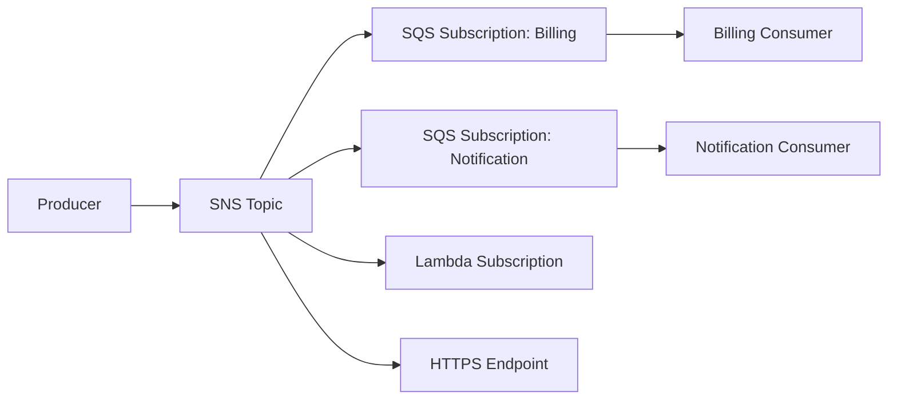

SNS cocok ketika:

- Satu event perlu dikirim ke banyak subscriber.
- Producer tidak boleh tahu subscriber.
- Fanout harus cepat.
- Subscriber punya failure isolation sendiri.

Pola sehat: SNS topic fanout ke SQS queue per subscriber. Jangan langsung publish ke Lambda jika subscriber membutuhkan buffer, retry terkontrol, backpressure, dan DLQ yang mudah ditriage.

### 7.2 SNS + SQS Fanout

Pattern umum:

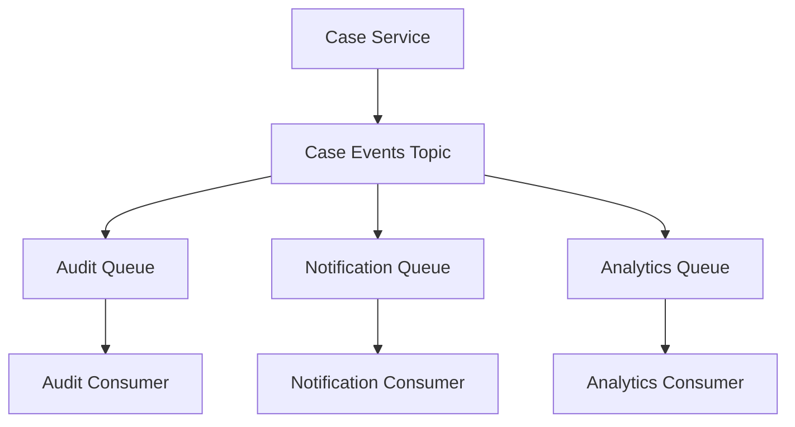

Keuntungan:

- Setiap subscriber punya queue, retry, DLQ, dan scaling sendiri.
- Consumer lambat tidak menahan subscriber lain.
- Owner subscriber bisa deploy independen.
- Backpressure terlokalisasi.

### 7.3 Subscription Filtering

SNS subscription filter policy memungkinkan subscriber hanya menerima subset message.

Contoh:

```json
{
  "eventType": ["CaseEscalated", "CaseClosed"],
  "tenantTier": ["regulated", "enterprise"]
}
```

Gunakan filter untuk mengurangi noise, tetapi jangan membuat domain rule kritikal tersembunyi di filter policy tanpa observability. Filter policy adalah routing logic; harus versioned dan reviewed seperti kode.

### 7.4 SNS Failure Modes

| Failure | Dampak | Mitigasi |
|---|---|---|
| Subscriber endpoint down | Delivery gagal/retry | Gunakan SQS subscription atau DLQ. |
| Filter policy salah | Event tidak sampai | Test routing, observability per subscription. |
| Topic terlalu generik | Subscriber memproses noise | Pecah topic atau gunakan event type/filter jelas. |
| Payload terlalu besar | Publish gagal/arsitektur buruk | Simpan payload besar di S3, kirim pointer + checksum. |
| Sensitive data broadcast | Data leak | Minimalkan payload, tenant-aware topic, encryption, IAM. |

---

## 8. EventBridge Deep Dive: Event Bus sebagai Routing Fabric

EventBridge adalah event bus dan routing engine. EventBridge kuat ketika Anda butuh event pattern matching, integrasi AWS/SaaS, cross-account routing, archive/replay, schema governance, dan target yang beragam.

### 8.1 Mental Model EventBridge

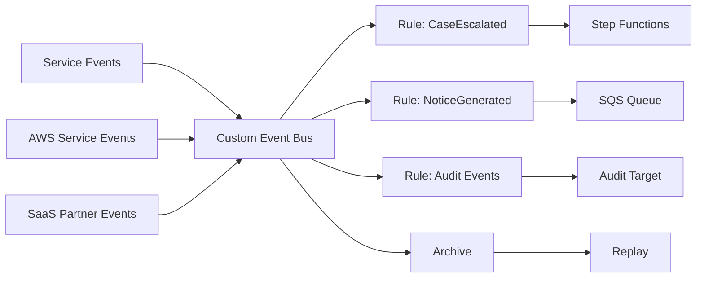

EventBridge event biasanya punya envelope seperti:

```json
{
  "source": "com.company.case-management",
  "detail-type": "CaseEscalated",
  "detail": {
    "caseId": "CASE-10291",
    "newStatus": "REGULATORY_REVIEW"
  }
}
```

### 8.2 EventBridge vs SNS

| Dimensi | SNS | EventBridge |
|---|---|---|
| Mental model | Topic fanout | Event bus routing |
| Filtering | Subscription filter | Rule event pattern |
| Archive/replay | Bukan fitur utama | Native archive/replay di event bus |
| SaaS/AWS integration | Ada sebagian | Lebih kuat sebagai integration fabric |
| Schema/routing governance | Lebih sederhana | Lebih cocok untuk enterprise event routing |
| Latency/cost | Sering lebih sederhana untuk fanout | Lebih ekspresif, tetapi perlu governance lebih kuat |

Gunakan SNS jika kebutuhan utama adalah simple fanout. Gunakan EventBridge jika kebutuhan utama adalah event routing, cross-domain integration, archive/replay, dan pattern matching.

### 8.3 Event Pattern Design

Contoh rule pattern:

```json
{
  "source": ["com.company.case-management"],
  "detail-type": ["CaseEscalated"],
  "detail": {
    "escalationLevel": ["REGULATORY_REVIEW"]
  }
}
```

Rule design principles:

- `source` harus stabil dan owned oleh domain/service.
- `detail-type` harus semantic, bukan teknis internal.
- `detail` harus mengandung field routing yang stabil.
- Jangan routing berdasarkan field yang sering berubah tanpa compatibility strategy.
- Buat test untuk event pattern.

### 8.4 Archive and Replay

Archive/replay sangat kuat, tetapi berbahaya jika consumer tidak idempotent.

Replay bisa dipakai untuk:

- Recovery dari target failure.
- Backfill consumer baru.
- Validasi rule baru.
- Reprocessing setelah bug fix.

Replay hazard:

- Email terkirim ulang.
- Payment/charge diproses ulang.
- Case state mundur karena event lama.
- Analytics double-count.
- Consumer baru belum kompatibel dengan event lama.

Safe replay checklist:

1. Semua consumer idempotent.
2. Event punya event ID dan occurredAt.
3. Consumer bisa membedakan processing time vs event time.
4. Side-effect external punya dedupe token.
5. Ada dry-run target jika perlu.
6. Ada replay window sempit.
7. Ada approval untuk replay production.
8. Ada alarm selama replay.

### 8.5 EventBridge Retry and DLQ

Event delivery ke target bisa gagal. EventBridge mendukung retry policy dan DLQ pada target rule. Jangan anggap “event bus berhasil menerima event” berarti target berhasil memproses event.

Operational metrics penting:

- Invocations.
- FailedInvocations.
- ThrottledRules.
- Dead-letter queue message count.
- Target-specific errors.
- Rule match count.

### 8.6 Cross-Account Event Routing

Dalam enterprise AWS, EventBridge sering digunakan untuk routing cross-account:

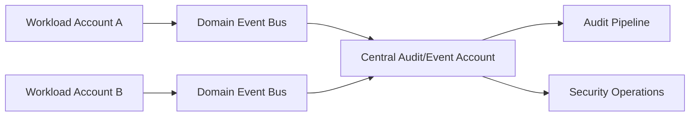

Prinsip:

- Jangan semua event masuk satu bus global tanpa domain boundary.
- Gunakan resource policy/event bus policy untuk kontrol cross-account.
- Pisahkan operational/security/audit events dari domain events jika lifecycle dan owner berbeda.
- Pastikan tenant data dan PII tidak bocor ke central bus yang terlalu luas.

---

## 9. Step Functions Deep Dive: Workflow sebagai Explicit State Machine

Step Functions digunakan ketika proses memiliki beberapa step, branching, retry, timeout, waiting, parallelism, atau human/system boundary.

### 9.1 Mental Model Step Functions

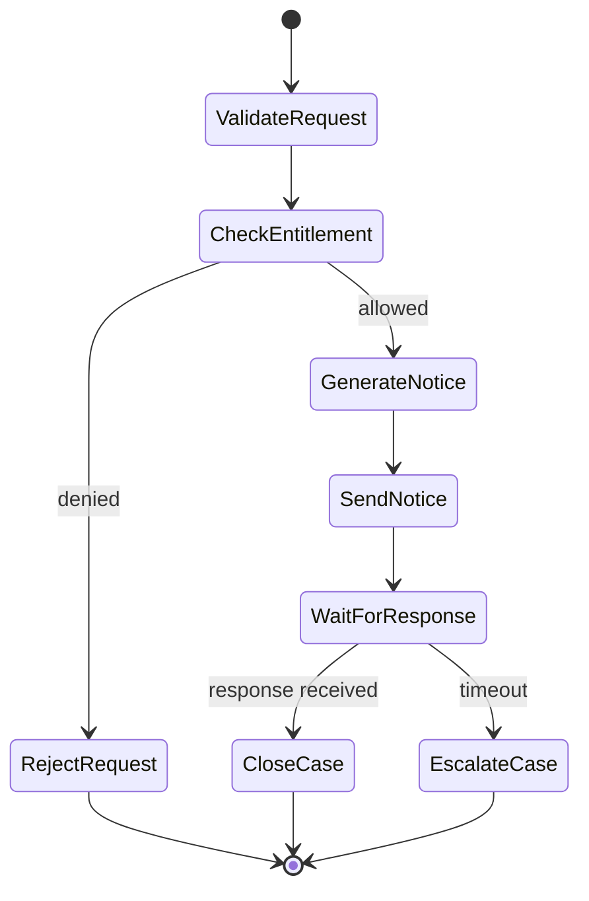

Queue menyembunyikan state proses di message dan consumer code. Step Functions membuat state proses terlihat.

### 9.2 Kapan Step Functions Lebih Baik daripada SQS Worker?

Gunakan Step Functions jika:

- Ada branching yang jelas.
- Ada retry berbeda per step.
- Ada timeout/wait/human approval.
- Ada compensation atau saga.
- Audit butuh melihat step mana gagal.
- Banyak layanan AWS harus diorkestrasi.
- Proses penting secara bisnis dan harus terlihat.

Gunakan SQS worker jika:

- Satu pekerjaan sederhana.
- Worker bisa memproses secara stateless.
- Workflow state tidak perlu diekspos.
- Retry global cukup.

### 9.3 Standard vs Express Workflows

| Dimensi | Standard | Express |
|---|---|---|
| Durasi | Cocok untuk workflow lebih lama | Cocok untuk high-volume short-duration workflow |
| Observability/audit | Lebih kuat untuk execution history detail | Lebih agregatif/log-based |
| Cost driver | State transition | Request/duration model |
| Use case | Business process, approval, compensation | High-throughput event processing, short orchestration |

Pastikan selalu memeriksa quota dan pricing terbaru sebelum menetapkan desain final.

### 9.4 Retry, Catch, Timeout

Contoh potongan state:

```json
{
  "SendNotice": {
    "Type": "Task",
    "Resource": "arn:aws:states:::lambda:invoke",
    "TimeoutSeconds": 30,
    "Retry": [
      {
        "ErrorEquals": ["States.Timeout", "Lambda.ServiceException"],
        "IntervalSeconds": 2,
        "MaxAttempts": 3,
        "BackoffRate": 2.0
      }
    ],
    "Catch": [
      {
        "ErrorEquals": ["States.ALL"],
        "Next": "RecordFailure"
      }
    ],
    "Next": "WaitForResponse"
  }
}
```

Top-tier design bukan hanya menambahkan retry. Harus jelas:

- Error mana transient?
- Error mana permanent?
- Step mana aman diulang?
- Step mana harus compensation?
- Timeout dihitung dari SLA atau default asal?
- Apakah retry bisa menimbulkan side-effect ganda?

### 9.5 Saga and Compensation

Step Functions cocok untuk saga orchestration:

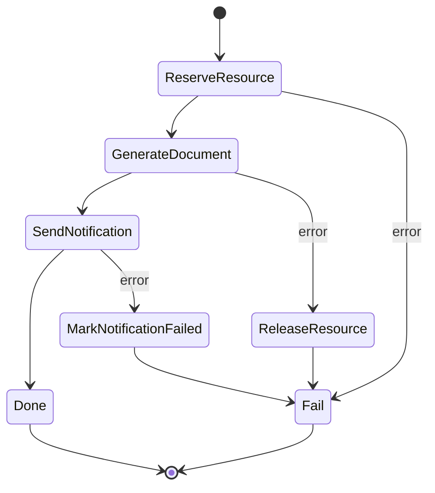

Compensation bukan rollback database transaction. Compensation adalah **business action** untuk memperbaiki state setelah partial completion.

Contoh:

- Jika document generation gagal setelah case locked, release lock.
- Jika notification gagal setelah notice dibuat, mark notice as pending delivery.
- Jika external submission gagal setelah internal approval, create remediation task.

---

## 10. Choreography vs Orchestration

### 10.1 Choreography

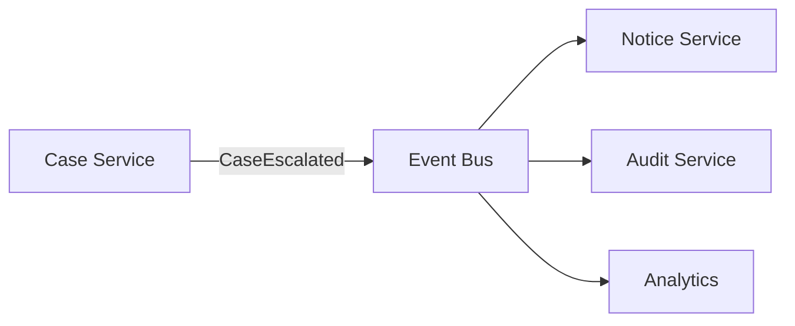

Choreography cocok jika:

- Domain services bereaksi secara independen.
- Tidak ada satu proses yang perlu mengendalikan semua step.
- Event facts cukup untuk koordinasi.
- Failure di satu consumer tidak boleh menghentikan consumer lain.

Risiko choreography:

- Alur bisnis tersebar.
- Sulit menjawab “case ini sedang di step mana?”
- Hidden coupling melalui event schema.
- Debugging butuh tracing kuat.

### 10.2 Orchestration

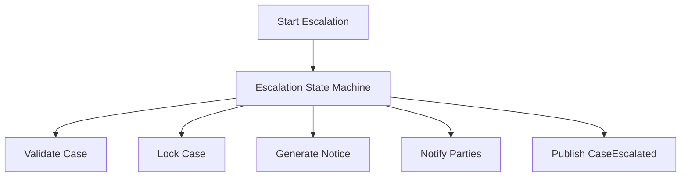

Orchestration cocok jika:

- Ada proses bisnis end-to-end yang harus accountable.
- Ada conditional path dan compensation.
- Ada audit trail step-by-step.
- Ada SLA per step.
- Ada human approval atau waiting state.

Risiko orchestration:

- Orchestrator menjadi terlalu tahu internal service.
- Central workflow menjadi bottleneck perubahan.
- Terlalu banyak business logic pindah ke state machine.

### 10.3 Hybrid Pattern

Sering kali desain terbaik adalah hybrid:

1. Step Functions mengorkestrasi command penting.
2. Setelah state transition berhasil, service publish domain event.
3. EventBridge/SNS mendistribusikan event ke subscriber independen.
4. Subscriber memproses via SQS agar failure terisolasi.

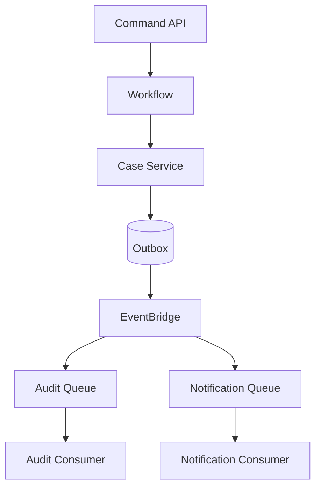

---

## 11. Outbox Pattern di AWS

Problem klasik: service mengubah database lalu publish event. Jika DB commit sukses tetapi publish gagal, event hilang. Jika publish sukses tetapi DB commit gagal, event palsu.

Outbox pattern:

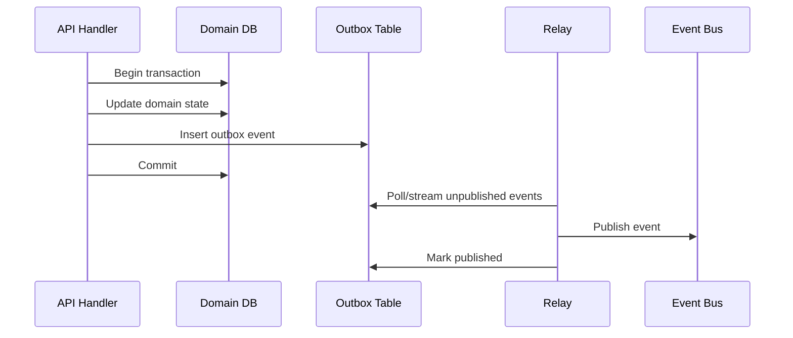

Di AWS, relay bisa dibuat dengan:

- DynamoDB Streams + Lambda.
- RDS polling worker.
- DMS/CDC pipeline.
- Application outbox publisher.

Outbox event harus punya:

- Stable event ID.
- Aggregate ID.
- Aggregate version.
- Event type.
- Schema version.
- Payload.
- Created timestamp.
- Publish status/attempt count.

Outbox tidak menghapus kebutuhan idempotent consumer. Outbox mengurangi event loss; consumer tetap harus aman terhadap duplicate.

---

## 12. Schema Governance for Events and Messages

Event-driven system gagal bukan hanya karena infrastructure, tetapi karena schema berubah tanpa kontrak.

### 12.1 Envelope vs Payload

Envelope field stabil untuk platform concern:

```json
{
  "eventId": "evt-01J...",
  "eventType": "CaseEscalated",
  "schemaVersion": "1.1",
  "source": "case-management.case-service",
  "tenantId": "tenant-a",
  "correlationId": "corr-01J...",
  "causationId": "cmd-01J...",
  "occurredAt": "2026-06-30T08:21:00Z",
  "payload": {}
}
```

Payload field milik domain.

### 12.2 Compatibility Rules

Rules yang aman:

- Tambah optional field: biasanya backward compatible.
- Hapus field: breaking change.
- Ubah meaning field: breaking change meskipun tipe sama.
- Ubah enum dengan value baru: bisa breaking jika consumer strict.
- Ubah timestamp semantics: breaking.
- Ubah identity field: sangat berisiko.

### 12.3 Event Naming

Gunakan nama event yang merepresentasikan business fact:

Baik:

- `CaseEscalated`
- `NoticeGenerated`
- `EvidenceAttached`
- `ReviewDecisionRecorded`

Buruk:

- `CaseUpdated`
- `DataChanged`
- `ProcessDone`
- `LambdaFinished`

Event terlalu generik menyebabkan consumer harus mengerti internal diff dan meningkatkan coupling.

---

## 13. Security Model

Event-driven integration memperluas permukaan akses. Jangan hanya “beri Lambda permission publish ke semua topic”.

### 13.1 IAM Principles

| Actor | Permission Minimal |
|---|---|
| Producer ke SQS | `sqs:SendMessage` ke queue tertentu. |
| Consumer dari SQS | `sqs:ReceiveMessage`, `sqs:DeleteMessage`, `sqs:ChangeMessageVisibility` ke queue tertentu. |
| Producer ke SNS | `sns:Publish` ke topic tertentu. |
| EventBridge producer | `events:PutEvents` ke bus tertentu. |
| Step Functions executor | Hanya invoke target services yang diperlukan. |
| DLQ operator | Read/redrive terbatas, audited. |

### 13.2 Resource Policies

Beberapa layanan memakai resource policy untuk cross-account access, misalnya SNS topic policy, SQS queue policy, EventBridge event bus policy.

Cross-account baseline:

- Batasi principal by account/role.
- Batasi action by exact need.
- Batasi resource by exact ARN.
- Gunakan condition jika relevan.
- Hindari wildcard account.
- Audit CloudTrail untuk publish/consume/admin actions.

### 13.3 Encryption and PII

Jangan kirim payload sensitif penuh jika tidak perlu.

Pattern:

- Kirim reference ID, bukan data lengkap.
- Simpan data sensitif di service owner atau S3 encrypted bucket.
- Gunakan KMS CMK jika perlu kontrol key policy/audit.
- Pastikan DLQ juga terenkripsi dan aksesnya terbatas.
- Jangan logging payload PII tanpa redaction.

---

## 14. Observability Model

Event-driven system sering sulit di-debug karena call stack linear hilang. Gantinya Anda butuh correlation.

### 14.1 Correlation Fields

| Field | Arti |
|---|---|
| `correlationId` | Menghubungkan request/event/message sepanjang flow. |
| `causationId` | Menjelaskan event/message penyebab message saat ini. |
| `eventId/messageId` | Unique identity dari unit komunikasi. |
| `tenantId` | Segmentasi tenant. |
| `aggregateId` | Entity/domain object utama. |
| `workflowExecutionId` | Jika dipicu state machine. |

### 14.2 Metrics per Primitive

SQS:

- ApproximateNumberOfMessagesVisible.
- ApproximateAgeOfOldestMessage.
- NumberOfMessagesSent/Received/Deleted.
- DLQ visible messages.
- Consumer error rate.
- Processing duration.

SNS:

- NumberOfMessagesPublished.
- NumberOfNotificationsDelivered.
- NumberOfNotificationsFailed.
- Per-subscription failure.

EventBridge:

- MatchedEvents.
- Invocations.
- FailedInvocations.
- ThrottledRules.
- DLQ count.
- Archive/replay metrics.

Step Functions:

- ExecutionsStarted/Succeeded/Failed/TimedOut/Aborted.
- Execution duration.
- State transition count.
- Per-state failure.

### 14.3 Alerting Philosophy

Alert pada symptom yang actionable:

| Alarm | Kenapa Actionable |
|---|---|
| DLQ message count > 0 for critical flow | Ada data yang tidak terproses. |
| SQS oldest message age > SLA | Consumer tertinggal atau gagal. |
| EventBridge failed invocations | Target delivery failure. |
| Step Functions failed/timed out | Workflow bisnis gagal. |
| Consumer error rate spike | Deploy/schema/downstream issue. |
| Replay started in production | Operasi berisiko butuh awareness. |

Jangan hanya alarm pada queue depth tanpa konteks. Queue depth bisa normal jika ada batch load yang memang dirancang.

---

## 15. Cost Model

Event-driven architecture bisa murah, tetapi cost bisa naik karena fanout, retry, payload besar, polling buruk, dan workflow transition berlebihan.

### 15.1 Cost Drivers

| Layanan | Cost Driver Umum |
|---|---|
| SQS | Request count, payload size chunks, FIFO/high throughput mode, long polling efficiency. |
| SNS | Publish count, delivery count, data transfer, SMS/mobile jika digunakan. |
| EventBridge | Events ingested, events matched/delivered, archive/replay, custom event bus usage. |
| Step Functions | State transitions atau request/duration tergantung workflow type. |
| Lambda consumers | Invocation count, duration, memory, retries. |
| NAT Gateway | Jika private consumers call public AWS endpoints tanpa VPC endpoint. |

### 15.2 Cost Anti-Patterns

- Polling SQS terlalu sering tanpa long polling.
- Fanout event besar ke banyak subscriber.
- EventBridge rule terlalu luas sehingga target dipanggil tidak perlu.
- Step Functions digunakan untuk loop high-volume granular tanpa cost review.
- Payload besar dikirim berulang, bukan pointer ke object.
- Semua traffic AWS service keluar lewat NAT, bukan VPC endpoints.
- Retry storm menambah request dan downstream cost.

---

## 16. Failure Mode Catalog

| Failure Mode | Gejala | Root Cause Umum | Mitigasi |
|---|---|---|---|
| Duplicate processing | Email double, row duplicate | At-least-once delivery, retry | Idempotency key, conditional write. |
| Message stuck | Queue age naik | Consumer error/downstream down | DLQ, alarm, runbook. |
| Poison message | Message gagal berulang | Bad payload/schema bug | DLQ with triage metadata. |
| Retry storm | Downstream makin down | Aggressive retry without backoff | Exponential backoff, circuit breaker, concurrency cap. |
| Lost event | State changed but event absent | No outbox/transaction gap | Outbox pattern. |
| Replay damage | Side-effect repeated | Consumer not idempotent | Replay approval, idempotency, dry-run. |
| Ordering violation | State overwritten by older event | Standard queue/event bus reorder | Version check, FIFO per entity, monotonic update. |
| Hot FIFO group | Throughput rendah | Single message group too broad | Partition by entity/group. |
| Fanout data leak | Subscriber receives sensitive payload | Topic too broad/payload too rich | Payload minimization, tenant isolation. |
| Workflow stuck | Execution waiting forever | No timeout/human boundary | Timeout, escalation, compensation. |

---

## 17. Reference Architectures

### 17.1 Asynchronous Command Processing

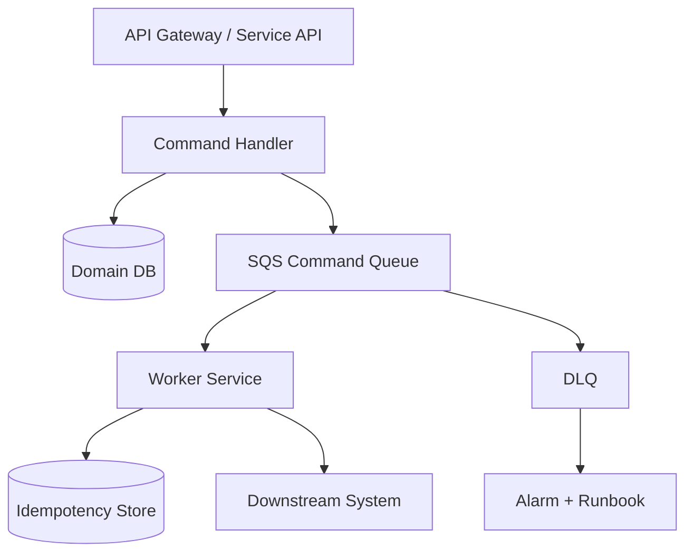

Use case:

- Generate document.
- Send notice.
- Process uploaded file.
- Perform long-running validation.

Design details:

- API returns accepted status and tracking ID.
- Worker idempotent.
- DLQ has owner and alarm.
- Downstream has rate limit control.

### 17.2 Domain Event Fanout

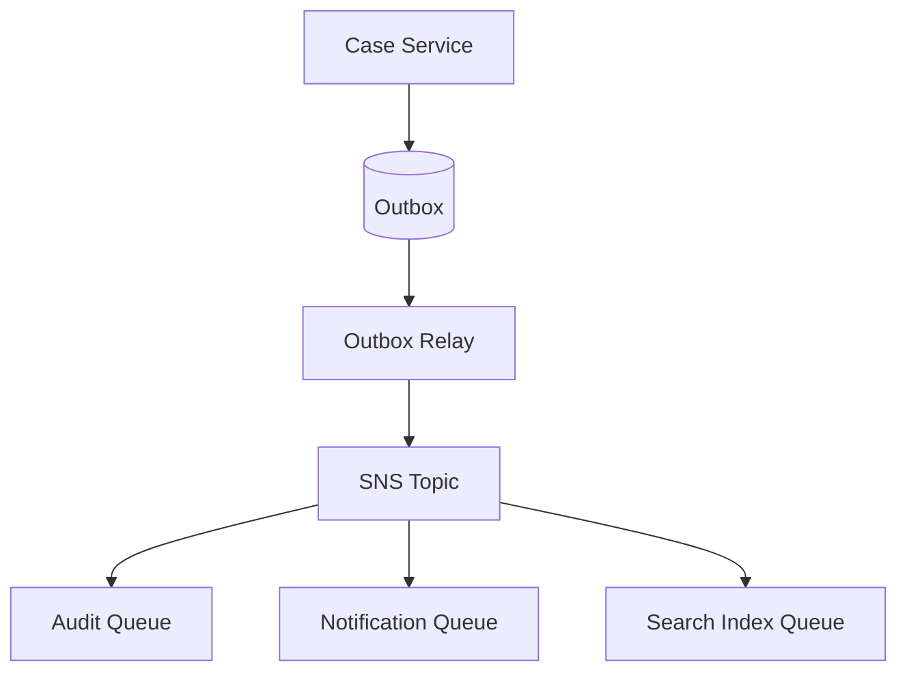

Use case:

- Domain event needs multiple independent reactions.
- Producer should not know subscribers.
- Each subscriber needs independent retry/backpressure.

### 17.3 Enterprise Event Bus

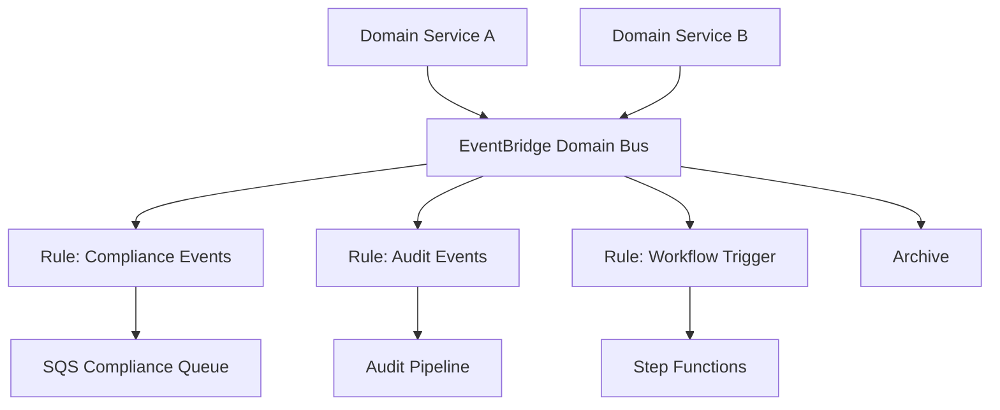

Use case:

- Multiple domains.
- Cross-account routing.
- Event replay required.
- Rule-based target selection.

### 17.4 Regulated Workflow Orchestration

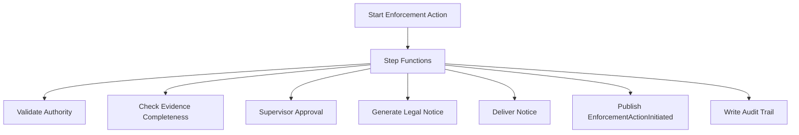

Use case:

- Process must be defensible.
- Step-level evidence matters.
- Human/system decisions need traceability.
- Failure handling must be explicit.

---

## 18. Engineering Checklist

### 18.1 Before Choosing a Service

- Is this communication synchronous or asynchronous?
- Is it a command, event, notification, or workflow step?
- How many consumers are expected?
- Is ordering required globally, per tenant, per entity, or not at all?
- Is replay required?
- Is fanout required?
- Is backpressure required?
- Is per-step audit required?
- What happens if consumer is down for 1 hour?
- What happens if message is processed twice?
- What happens if event arrives late?
- What happens if schema changes?

### 18.2 Queue Checklist

- Queue type chosen intentionally: standard or FIFO.
- Visibility timeout based on processing time.
- DLQ configured with sane maxReceiveCount.
- Alarm on DLQ and age of oldest message.
- Consumer idempotent.
- Batch processing handles partial failure.
- Concurrency capped by downstream capacity.
- Message retention matches recovery window.
- Redrive procedure documented.
- Payload does not contain unnecessary sensitive data.

### 18.3 Event Bus Checklist

- Event source and detail-type naming stable.
- Event schema versioned.
- Rules tested.
- Archive/replay policy defined.
- Replay safety reviewed.
- Failed target delivery observed.
- Cross-account policy constrained.
- Sensitive data minimized.
- Owner per event type known.

### 18.4 Workflow Checklist

- State machine represents business process, not random glue code.
- Every task has timeout.
- Retry only for transient errors.
- Catch path exists for expected failure.
- Compensation designed for partial side-effect.
- Execution ID correlated with domain entity.
- Human wait has timeout/escalation.
- Workflow history is usable for audit.
- Cost reviewed for high-volume path.

---

## 19. Deliberate Practice

### Exercise 1: SQS Worker with Failure Injection

Build:

- Producer sends command to SQS.
- Consumer processes command and writes status.
- Add idempotency table.
- Add DLQ.
- Add alarm condition.

Inject:

1. Consumer crashes after side-effect but before delete.
2. Visibility timeout too short.
3. Downstream returns 500 for 10 minutes.
4. Message payload has unknown schema version.
5. Redrive DLQ after bug fix.

Success criteria:

- No duplicate business effect.
- DLQ contains useful evidence.
- Queue recovers after downstream returns.
- Metrics show failure clearly.

### Exercise 2: SNS Fanout with Subscriber Isolation

Build:

- Domain event topic.
- Three SQS subscriptions.
- Different filter policies.
- One subscriber intentionally fails.

Success criteria:

- Failing subscriber does not block others.
- Filter policies route correctly.
- DLQ only for failing subscriber.
- Correlation ID visible in all logs.

### Exercise 3: EventBridge Archive Replay

Build:

- Custom event bus.
- Event rules to two targets.
- Archive enabled.
- Replay selected window.

Inject:

- Bug in target for 15 minutes.
- Fix target.
- Replay only failed window.

Success criteria:

- Consumer idempotent during replay.
- Replay is observable.
- No duplicate external side-effect.

### Exercise 4: Step Functions Saga

Build state machine:

1. Validate request.
2. Reserve resource.
3. Generate artifact.
4. Send notification.
5. Publish event.

Inject failure at each step.

Success criteria:

- Retry transient errors.
- Catch permanent errors.
- Compensation path executes.
- Execution history explains outcome.

---

## 20. Common Anti-Patterns

| Anti-Pattern | Kenapa Buruk | Alternatif |
|---|---|---|
| Queue as database | Message retention terbatas dan query buruk | Persist domain state di database. |
| No idempotency | Duplicate delivery menyebabkan side-effect ganda | Idempotency key + conditional write. |
| One giant event type | Coupling dan ambiguity | Specific business event types. |
| Event contains whole aggregate | Data leak, large payload, compatibility risk | Minimal payload + reference. |
| DLQ without owner | Failure tersembunyi | DLQ alarm + runbook + owner. |
| Retry everything | Retry permanent error memperparah | Classify transient/permanent. |
| Step Functions for every tiny call | Cost/complexity naik | Use direct call or queue for simple async. |
| Choreography for regulated process | Audit flow tersebar | Use orchestration for accountable process. |
| SNS direct to fragile HTTP | Delivery brittle | SNS -> SQS -> consumer. |
| Replay without idempotency | Duplicate side-effect | Replay gate + idempotent consumer. |

---

## 21. Self-Correction Questions

Gunakan pertanyaan ini untuk menguji apakah desain Anda matang:

1. Apakah saya bisa menjelaskan perbedaan event, command, notification, dan workflow dalam desain ini?
2. Jika message diproses dua kali, apa yang terjadi?
3. Jika message datang terlambat 30 menit, apa yang terjadi?
4. Jika consumer down selama 2 jam, apakah data hilang atau hanya tertunda?
5. Apakah DLQ memiliki alarm, owner, dan runbook?
6. Apakah payload event mengandung PII yang tidak perlu?
7. Apakah replay aman?
8. Apakah ordering benar-benar dibutuhkan, atau hanya asumsi?
9. Apakah failure path sama jelasnya dengan success path?
10. Apakah operator bisa menjawab “apa status proses ini?” tanpa membaca kode?

---

## 22. Ringkasan Engineering Judgment

Event-driven architecture yang baik bukan tentang memakai semua layanan messaging AWS. Desain yang baik adalah desain yang membuat **waktu, failure, ownership, retry, duplicate, dan recovery** menjadi eksplisit.

Gunakan SQS ketika Anda butuh buffer kerja. Gunakan SNS ketika Anda butuh fanout sederhana. Gunakan EventBridge ketika Anda butuh routing event yang lebih kaya, archive/replay, dan integration fabric. Gunakan Step Functions ketika proses bisnis perlu state machine eksplisit.

Top-tier AWS engineer selalu menanyakan:

- Apa semantic unit komunikasi ini?
- Apa guarantee yang diberikan layanan?
- Apa guarantee yang tidak diberikan?
- Apa yang terjadi saat duplicate, delay, retry, dan partial failure?
- Bagaimana kita membuktikan sistem benar saat audit atau incident review?

Kalau jawaban desain hanya “pakai SQS biar async”, desain itu belum cukup matang.

---

## References

- AWS Documentation — Amazon SQS visibility timeout: https://docs.aws.amazon.com/AWSSimpleQueueService/latest/SQSDeveloperGuide/sqs-visibility-timeout.html
- AWS Documentation — Amazon SQS dead-letter queues: https://docs.aws.amazon.com/AWSSimpleQueueService/latest/SQSDeveloperGuide/sqs-dead-letter-queues.html
- AWS Documentation — Amazon SQS FIFO delivery logic: https://docs.aws.amazon.com/AWSSimpleQueueService/latest/SQSDeveloperGuide/FIFO-queues-understanding-logic.html
- AWS Documentation — Message deduplication ID in SQS FIFO queues: https://docs.aws.amazon.com/AWSSimpleQueueService/latest/SQSDeveloperGuide/using-messagededuplicationid-property.html
- AWS Documentation — EventBridge archive and replay: https://docs.aws.amazon.com/eventbridge/latest/userguide/eb-archive.html
- AWS Documentation — EventBridge retry policy: https://docs.aws.amazon.com/eventbridge/latest/userguide/eb-rule-retry-policy.html
- AWS Documentation — EventBridge DLQ for rule targets: https://docs.aws.amazon.com/eventbridge/latest/userguide/eb-rule-dlq.html
- AWS Documentation — EventBridge rules: https://docs.aws.amazon.com/eventbridge/latest/userguide/eb-rules.html
