------
title: Learn AWS Engineering Mastery - Part 016
description: Production storage architecture on AWS covering S3, EBS, EFS, FSx, AWS Backup, lifecycle, replication, retention, restore, and operational failure modes.
series: learn-aws
seriesTitle: Learn AWS Engineering Mastery
order: 16
partTitle: Storage Architecture: S3, EBS, EFS, FSx, and Backup
tags:
- aws
- storage
- s3
- ebs
- efs
- fsx
- backup
- disaster-recovery
- reliability
date: 2026-06-30
---

# Learn AWS Engineering Mastery - Part 016

# Storage Architecture: S3, EBS, EFS, FSx, and Backup

## 1. Target Skill

Setelah bagian ini, target skill Anda adalah mampu memilih, mendesain, mengamankan, mengoperasikan, dan memulihkan storage AWS untuk workload production-grade.

Anda harus bisa menjawab:

1. Apakah data ini object, block, file, shared file system, archive, atau backup?
2. Apa access pattern: random read/write, sequential, shared POSIX, immutable object, throughput-heavy, low-latency, atau archival?
3. Apa durability, availability, RPO, RTO, retention, legal hold, dan compliance requirement?
4. Apa failure domain: AZ, Region, account, key, permission, lifecycle, accidental deletion, ransomware, corrupt write, atau operator error?
5. Apakah replication menggantikan backup? Jawaban singkat: tidak selalu.
6. Bagaimana restore diuji, bukan hanya backup dikonfigurasi?
7. Siapa owner data, siapa boleh baca, siapa boleh hapus, dan siapa boleh restore?

Storage architecture adalah salah satu area yang membedakan engineer senior biasa dan top-tier engineer. Banyak outage dan insiden data bukan terjadi karena storage “rusak”, tetapi karena lifecycle salah, permission terlalu luas, backup tidak pernah dites, restore terlalu lambat, encryption key tidak bisa diakses, replication ikut mereplikasi delete/corruption, atau data ditempatkan pada primitive yang salah.

---

## 2. Mental Model Inti

AWS storage bukan satu kategori. AWS storage adalah kumpulan primitive dengan semantic yang berbeda.

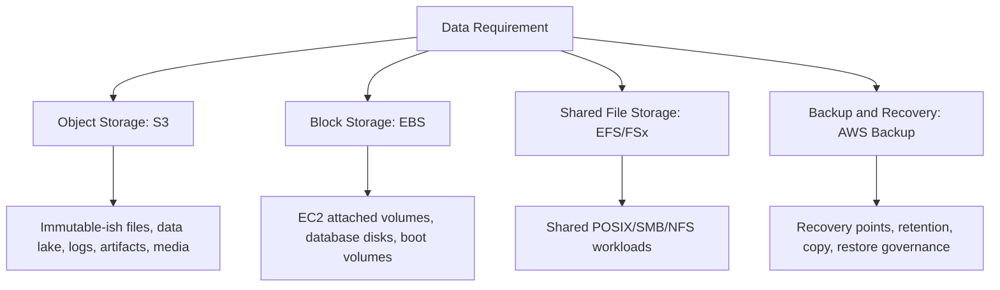

Storage decision tidak boleh dimulai dari layanan. Mulai dari data contract:

| Data Question | Kenapa Penting |
|---|---|
| Apa unit data? | Object, file, block, record, snapshot. |
| Siapa writer? | Single writer, multi-writer, distributed writers. |
| Siapa reader? | Private service, tenant, public, analytics, audit. |
| Mutability? | Immutable, append-only, overwrite, transactional. |
| Consistency expectation? | Read-after-write, version-aware, eventually replicated. |
| Lifecycle? | Hot, warm, cold, archive, delete, legal hold. |
| Recovery? | Restore object, volume, file system, entire application, or point-in-time. |
| Compliance? | Retention, WORM, audit, encryption, geographic boundary. |

---

## 3. Kaufman Deconstruction: Sub-Skill Storage Architecture

| Sub-Skill | Output yang Harus Bisa Dibuat |
|---|---|
| Storage classification | Memetakan data ke object/block/file/backup dengan alasan. |
| S3 architecture | Bucket, key design, versioning, lifecycle, replication, Object Lock, encryption, access boundary. |
| EBS architecture | Volume type selection, attachment, snapshot, encryption, performance, failure/recovery model. |
| EFS architecture | Shared POSIX design, mount targets, access points, throughput/performance, lifecycle. |
| FSx architecture | Memilih Windows/Lustre/ONTAP/OpenZFS berdasarkan workload. |
| Backup strategy | Backup plan, vault, recovery point, copy, retention, restore test, vault lock. |
| Data protection | Encryption, KMS policy, deletion protection, retention, immutable backup, access audit. |
| Restore engineering | RPO/RTO validation, restore runbook, dependency order, restore account/Region. |
| Cost engineering | Storage class, lifecycle, request cost, snapshot growth, data transfer, retrieval cost. |
| Failure modeling | Accidental delete, corrupt write, ransomware, key loss, Region outage, permission drift. |

Deliberate practice untuk storage bukan upload file ke S3. Praktik yang bernilai adalah **hapus data, corrupt data, revoke key, break permission, simulate Region loss, lalu buktikan restore berjalan sesuai RPO/RTO**.

---

## 4. Storage Decision Matrix

| Requirement | Primary Candidate | Reasoning |
|---|---|---|
| Static assets, logs, artifacts, data lake | S3 | Object storage durable, scalable, lifecycle-friendly. |
| EC2 boot/data disk | EBS | Block storage attached to EC2. |
| Shared Linux file system for many compute nodes | EFS | Managed NFS/POSIX-like shared file system. |
| Windows SMB file shares | FSx for Windows File Server | Managed Windows-compatible file storage. |
| High-performance parallel file system for HPC/ML | FSx for Lustre | Designed for high-performance compute workloads. |
| Enterprise NAS features, snapshots, multiprotocol | FSx for NetApp ONTAP | ONTAP feature set in managed AWS form. |
| Application-consistent restore across services | AWS Backup + service-native backup | Centralized policy plus restore process. |
| Legal retention / WORM object storage | S3 Object Lock | Prevent delete/overwrite for retention period or legal hold. |
| Cross-region object copy | S3 Replication | Asynchronous copy for durability/location/latency/compliance, not a full backup substitute. |

---

## 5. S3 Deep Dive: Object Storage as a Platform Primitive

S3 is often the default durable storage layer in AWS architectures. But “put it in S3” is not a design. A production S3 design covers bucket boundary, key design, access, encryption, versioning, lifecycle, replication, events, observability, and restore.

### 5.1 Mental Model S3

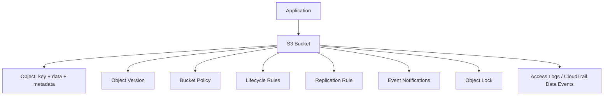

Core concepts:

| Concept | Meaning |
|---|---|
| Bucket | Top-level container with Region, policy, lifecycle, encryption, versioning settings. |
| Object | Data blob plus metadata addressed by key. |
| Key | Object name/path-like identifier; not a real folder. |
| Version | Variant of object when versioning enabled. |
| Prefix | Key prefix used for organization, lifecycle, IAM conditions, analytics, and mental grouping. |
| Storage class | Cost/performance/retrieval trade-off. |
| Lifecycle | Automated transition/expiration actions. |
| Replication | Async copy to same/different Region/account. |
| Object Lock | WORM-style protection for retention/legal hold. |

### 5.2 Bucket Boundary Design

Do not create buckets randomly per feature. Bucket boundary affects:

- IAM policy complexity.
- Data lifecycle.
- Encryption/KMS key policy.
- Replication.
- Access logging.
- Public access controls.
- Object ownership.
- Compliance retention.
- Operational blast radius.

Common bucket strategies:

| Strategy | Use Case | Trade-Off |
|---|---|---|
| Bucket per environment | `dev`, `staging`, `prod` separation | Simple isolation, more resources. |
| Bucket per domain | Case documents, audit logs, exports | Clear ownership, lifecycle alignment. |
| Bucket per tenant | Strong tenant isolation | Operational overhead, quota/design complexity. |
| Shared bucket with prefixes | Many small tenants/data classes | Requires strict IAM/prefix discipline. |
| Central audit bucket | Organization-wide logs | Needs write-once controls and restricted read. |

For regulated systems, avoid mixing data with different retention, sensitivity, or ownership in the same bucket unless you have a very strong reason.

### 5.3 Key Design

S3 key design is a data modeling decision.

Example:

```txt
s3://case-documents-prod/tenant=tenant-a/caseId=CASE-10291/documentType=evidence/documentId=DOC-883/version=3/file.pdf
```

Good key design supports:

- Human debugging.
- Lifecycle rules by prefix/tag.
- Partitioning for analytics.
- Access control by prefix.
- Replication filters.
- Cost allocation.
- Bulk operations.

Avoid keys that encode unstable internal implementation details. Use domain identity and lifecycle grouping.

### 5.4 Versioning

S3 Versioning keeps multiple variants of an object in a bucket. It helps recover from accidental overwrite/delete and application bugs.

Important nuance:

- Versioning is not the same as backup governance.
- Delete marker can hide current object while previous versions remain.
- Lifecycle must account for noncurrent versions, or cost grows unexpectedly.
- Applications must understand whether they read latest version or specific version.

Use versioning for:

- Critical documents.
- Configuration artifacts.
- Audit exports.
- Data lake raw zone.
- Any object where accidental overwrite is material.

### 5.5 Lifecycle Management

Lifecycle rules transition or expire objects automatically.

Example policy logic:

| Data Class | Hot Retention | Warm/Cold Transition | Expiration |
|---|---:|---:|---:|
| Application logs | 30 days | Archive after 90 days | Delete after 365 days |
| Audit logs | 1 year | Archive after 1 year | Retain 7+ years or per policy |
| Temporary exports | 7 days | None | Delete after 14 days |
| Evidence documents | Active case lifetime | Archive after closure | Retain per legal policy |

Lifecycle must be aligned with legal/compliance policy. Do not let engineers invent retention in code.

### 5.6 Storage Classes

S3 storage classes trade access latency, retrieval cost, availability characteristics, and storage price. Do not choose based only on per-GB storage price.

Decision dimensions:

- Access frequency.
- Retrieval latency requirement.
- Minimum storage duration.
- Retrieval fee.
- Data criticality.
- Object size and count.
- Compliance retention.

Common guidance:

- Unknown/changing access pattern: consider Intelligent-Tiering.
- Frequently accessed production objects: Standard or appropriate low-latency class.
- Infrequent but fast retrieval: infrequent-access class may fit.
- Archival data: Glacier-family classes may fit, but restore time and retrieval cost must be accepted.

Always validate current pricing and storage class behavior before final design.

### 5.7 Encryption

S3 encryption options include service-managed and KMS-backed approaches. Production decision depends on audit, key control, cross-account access, and blast radius.

| Option | Use Case | Trade-Off |
|---|---|---|
| SSE-S3 | Simple default encryption | Less key-level audit/control. |
| SSE-KMS | Key policy control and audit | KMS permissions, request cost, throttling considerations. |
| DSSE-KMS | Higher assurance use cases | More complexity/cost; verify service compatibility. |
| Client-side encryption | Extreme control | Key management burden shifts to application. |

KMS failure mode matters. If key policy is wrong, key disabled, or cross-account principal lacks decrypt, your data can become unreadable even though S3 is healthy.

### 5.8 Access Control

Modern S3 security baseline:

- Block Public Access unless explicitly public workload.
- Prefer IAM and bucket policies over object ACLs.
- Use bucket owner enforced object ownership where appropriate.
- Use least privilege by prefix/tag/access point if needed.
- Use VPC endpoint policies for private access paths.
- Enable CloudTrail data events for sensitive buckets where audit requires object-level API trace.
- Separate write roles from read roles and admin roles.
- Restrict delete permissions strongly.

Example conceptual policy boundary:

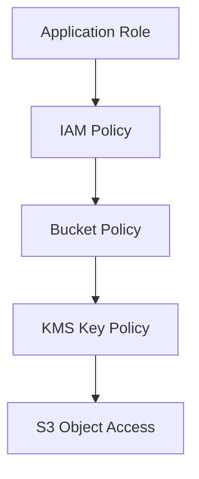

Access succeeds only if IAM/resource/KMS policies allow the required path and no explicit deny applies.

### 5.9 Replication

S3 Replication can copy objects asynchronously to another bucket, Region, or account.

Use replication for:

- Regional resilience.
- Account isolation.
- Data locality.
- Compliance copy.
- Analytics copy.

But replication is not automatically a complete backup strategy.

Replication may also replicate bad data if configured that way. If application overwrites object with corrupted content, replication may copy the corrupted version. If delete marker replication is enabled, deletion semantics may propagate. You still need retention, versioning, Object Lock, backup, or recovery plan depending on risk.

### 5.10 Object Lock

S3 Object Lock can prevent objects from being deleted or overwritten for a fixed time or indefinitely under legal hold/retention models.

Use cases:

- Audit logs.
- Regulatory evidence.
- Legal records.
- Immutable backups.

Governance principle:

- Decide retention mode and duration with legal/compliance stakeholders.
- Restrict who can bypass governance mode if used.
- Use separate bucket for immutable records.
- Test operational procedures before production.

### 5.11 S3 Event Notifications

S3 can emit notifications for object events to targets such as Lambda, SQS, SNS, or EventBridge depending on design.

Use cases:

- Trigger virus scan on upload.
- Start document processing pipeline.
- Update metadata index.
- Ingest data lake files.

Failure consideration:

- Event notification is not the same as database transaction.
- Consumer must handle duplicate/out-of-order events.
- Large workflows should use SQS/EventBridge/Step Functions rather than embedding everything in a Lambda trigger.

---

## 6. EBS Deep Dive: Block Storage for EC2 Workloads

EBS provides block storage volumes for EC2 instances. Think of EBS as network-attached block device with volume lifecycle, snapshot capability, encryption, and performance characteristics.

### 6.1 Mental Model EBS

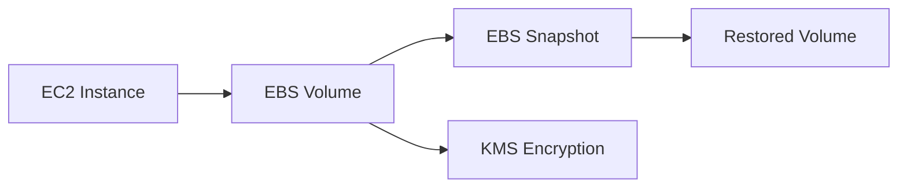

EBS is appropriate for:

- EC2 boot volumes.
- Application data volumes.
- Self-managed database disks.
- Low-latency block access for a single instance or specialized multi-attach cases.

EBS is not shared file storage by default. If many compute nodes need shared POSIX/SMB access, evaluate EFS or FSx.

### 6.2 Volume Type Selection

Do not select volume type by guess. Use workload metrics:

| Workload Need | Consideration |
|---|---|
| General purpose app disk | General purpose SSD class often fits. |
| High IOPS database | Provisioned IOPS class may be needed. |
| Throughput-heavy sequential workload | Throughput-optimized class may fit. |
| Cold infrequent HDD workload | Cold HDD class may fit, with trade-offs. |
| Boot volume | SSD-based classes usually appropriate. |

Always verify current volume type limits, IOPS/throughput, and pricing at design time.

### 6.3 Snapshot Strategy

EBS snapshots are point-in-time backups of volumes. They are useful, but restore design matters.

Questions:

- Are snapshots crash-consistent or application-consistent?
- Is the filesystem flushed/frozen?
- Is the database in a safe state?
- Are multiple volumes snapshotted consistently?
- How often are snapshots taken?
- How long retained?
- Are snapshots copied cross-Region/account?
- Who can delete snapshots?
- Has restore time been measured?

For self-managed databases, service/application-aware backup is often needed. Snapshot alone may not meet consistency requirements.

### 6.4 EBS Failure Modes

| Failure | Impact | Mitigation |
|---|---|---|
| Instance failure | Volume may survive but app down | ASG, reattach/restore automation, managed DB if possible. |
| AZ failure | Volume in affected AZ unavailable | Multi-AZ app design, snapshot/replica strategy. |
| Accidental delete | Data loss | Delete protection, snapshots, IAM deny, AWS Backup. |
| Corrupt write | Snapshot may contain corruption | PITR/app backup, versioned backups, validation. |
| KMS key disabled | Volume unreadable | Key governance, alarm, break-glass process. |
| Performance saturation | Latency spike | Monitor IOPS/throughput/queue length, choose correct volume. |

---

## 7. EFS Deep Dive: Shared File Storage

EFS is managed elastic file storage for Linux-style workloads that need shared file access.

### 7.1 Mental Model EFS

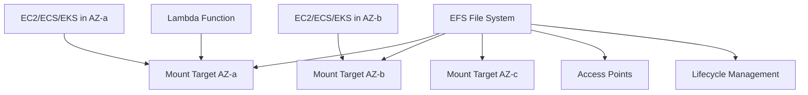

EFS is useful for:

- Shared content repositories.
- Lift-and-shift apps expecting NFS.
- Shared config/data for multiple nodes.
- Container workloads needing shared filesystem.
- Serverless workloads needing shared file access.

EFS is not automatically the best solution for high-performance database storage. Choose based on latency, throughput, metadata operations, and consistency needs.

### 7.2 Mount Targets and Network Boundary

EFS mount targets live in VPC subnets. Design implications:

- Put mount targets in each AZ where clients run.
- Security groups control NFS access.
- Network path matters for latency and availability.
- Cross-AZ access can add cost and dependency.

### 7.3 Access Points

EFS Access Points help enforce application-specific entry points and POSIX identity. They are useful for multi-application or containerized environments.

Use access points to:

- Restrict root directory per app.
- Enforce UID/GID.
- Reduce application-level permission drift.
- Standardize EKS/ECS integration.

### 7.4 EFS Lifecycle and Cost

EFS can become expensive if used as dumping ground. Use lifecycle policies for infrequently accessed files where retrieval pattern allows it.

Cost anti-patterns:

- Treating EFS as infinite temporary folder.
- Storing build artifacts forever.
- No cleanup for per-tenant generated files.
- High metadata churn workload placed blindly on EFS.
- Cross-AZ mount path due to missing mount target.

---

## 8. FSx Deep Dive: Managed File Systems for Specialized Workloads

FSx is a family of managed file systems. It is not “one service”; each FSx variant targets different workload semantics.

| FSx Variant | Best Fit |
|---|---|
| FSx for Windows File Server | Windows-native SMB shares, Active Directory integration, enterprise Windows workloads. |
| FSx for Lustre | HPC, ML, analytics workloads needing high-performance parallel file system, often integrated with S3. |
| FSx for NetApp ONTAP | Enterprise NAS features, multiprotocol access, snapshots, cloning, ONTAP compatibility. |
| FSx for OpenZFS | Workloads needing OpenZFS features and low-latency file access. |

Decision principle:

- If app expects NFS-like shared Linux file system and elastic simplicity, evaluate EFS.
- If app expects Windows SMB/AD, evaluate FSx for Windows.
- If workload is HPC/ML with parallel file semantics, evaluate FSx for Lustre.
- If enterprise storage team needs ONTAP features, evaluate FSx for ONTAP.

---

## 9. AWS Backup: Centralized Data Protection

AWS Backup is a managed service for centralizing and automating backup across supported AWS services. It helps define backup plans, vaults, recovery points, lifecycle, copy, and monitoring in one place.

### 9.1 Mental Model AWS Backup

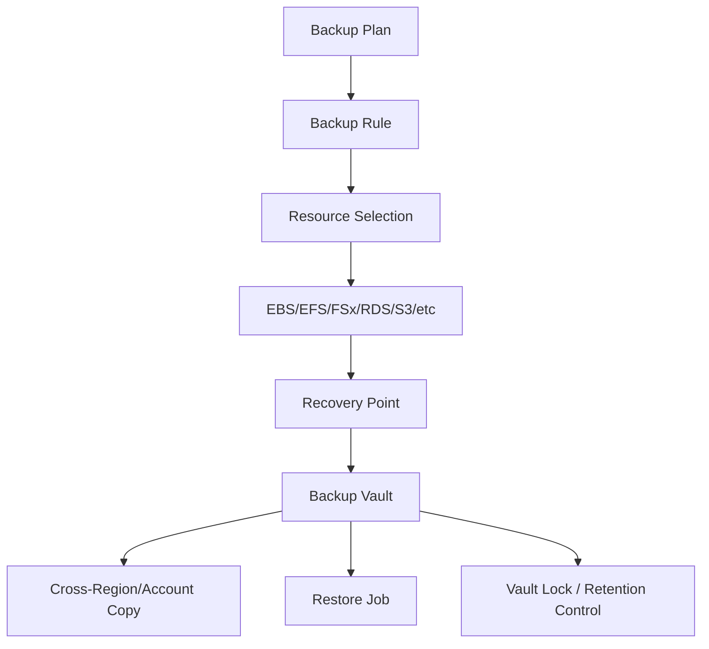

Core concepts:

| Concept | Meaning |
|---|---|
| Backup plan | Defines frequency, window, lifecycle, copy rules. |
| Backup rule | Specific schedule and lifecycle rule inside plan. |
| Resource selection | Which resources are protected. |
| Backup vault | Container for recovery points with access policy/encryption. |
| Recovery point | Restorable backup instance. |
| Copy job | Copy recovery point to another Region/account. |
| Restore job | Operation that creates restored resource. |
| Vault Lock | Helps enforce retention controls against deletion/changes. |

### 9.2 Backup Is Not Restore

This is a critical mental model:

```txt
backup configured != recovery capability proven
```

A real backup strategy includes:

- Backup schedule.
- Retention policy.
- Encryption/key access.
- Cross-account/Region copy if required.
- Immutable retention where needed.
- Restore runbook.
- Restore test.
- RPO/RTO measurement.
- Evidence of successful restore.
- Ownership and escalation.

### 9.3 Backup vs Replication vs Versioning

| Mechanism | Protects Against | Does Not Fully Protect Against |
|---|---|---|
| Versioning | Accidental overwrite/delete in object storage | Account compromise, poor retention, untested restore. |
| Replication | Regional/account copy, locality | Corruption/delete replicated, unless configured/protected carefully. |
| Snapshot | Point-in-time volume/file-system recovery | Application consistency unless coordinated. |
| Backup vault | Centralized retention/recovery governance | Bad RPO/RTO if plan/test poor. |
| Object Lock/Vault Lock | Deletion/overwrite tampering | Wrong retention design, inaccessible keys, bad restore process. |

### 9.4 Restore Order Matters

Complex systems require dependency-aware restore.

Example regulated case platform restore order:

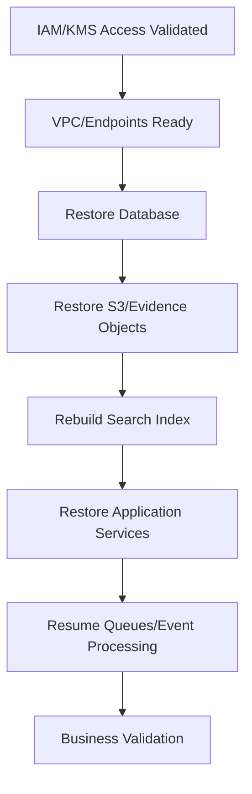

Restoring app before keys/network/database may waste time. Restoring queues before idempotency/domain state may replay unsafe work.

### 9.5 Backup Security

Backup often contains the most sensitive data because it aggregates production data over time.

Security baseline:

- Separate backup admin from workload admin.
- Use backup vault access policies.
- Encrypt backups with controlled KMS keys.
- Restrict delete recovery point permission.
- Consider cross-account copy for ransomware/operator error boundary.
- Monitor backup job failure.
- Monitor restore job creation.
- Log administrative actions via CloudTrail.
- Test break-glass access.

---

## 10. Data Lifecycle Architecture

Data lifecycle should be designed as policy, not scattered code.


Lifecycle fields to define per data class:

| Field | Example |
|---|---|
| Data class | Evidence document, audit log, temp export, ML feature file. |
| Owner | Case service, audit platform, analytics team. |
| Sensitivity | Public/internal/confidential/regulated. |
| Creation source | User upload, system generated, third-party feed. |
| Access pattern | Hot for 30 days, rare after case closure. |
| Retention | 7 years after closure. |
| Legal hold | Possible. |
| Delete authority | Compliance officer/system policy. |
| Backup requirement | Daily, PITR, immutable copy. |
| Restore SLA | 4 hours for active case evidence. |

### 10.1 Defensible Deletion

Defensible deletion means deletion follows policy and is auditable.

Do not let engineers implement ad hoc cleanup scripts for regulated data. Use lifecycle policies, retention metadata, approvals, and audit trails.

Questions:

- Who approved deletion policy?
- What records are exempt due to legal hold?
- Is deletion logged?
- Can deletion be bypassed?
- Are backups also subject to retention/deletion rules?
- Does replicated copy follow same policy?

---

## 11. Multi-Tenant Storage Design

Storage isolation is central in SaaS/enterprise systems.

### 11.1 Isolation Options

| Model | Isolation | Operational Cost | Use Case |
|---|---|---|---|
| Bucket per tenant | Strong | Higher | Highly regulated/large tenants. |
| Prefix per tenant | Medium | Lower | Many tenants with shared controls. |
| Account per tenant | Very strong | High | Enterprise isolation, strict compliance. |
| KMS key per tenant | Strong crypto boundary | Medium/high | Tenant-managed or strong audit needs. |
| Access point per tenant/app | Good policy boundary | Medium | Large shared bucket with controlled access. |

### 11.2 Prefix-per-Tenant Example

```txt
s3://tenant-documents-prod/tenantId=tenant-a/cases/CASE-10291/evidence/DOC-01.pdf
s3://tenant-documents-prod/tenantId=tenant-b/cases/CASE-77821/evidence/DOC-91.pdf
```

Requirements:

- IAM policy must constrain prefix.
- Application authorization must verify tenant context.
- Logs must include tenant ID.
- Lifecycle must handle tenant-specific retention if needed.
- Batch jobs must not accidentally scan all tenants without authorization.

---

## 12. Observability and Audit

Storage observability includes more than bytes used.

### 12.1 Metrics and Signals

S3:

- Bucket size and object count.
- Request metrics for critical buckets.
- 4xx/5xx request errors.
- Replication latency/failure.
- Lifecycle transitions.
- CloudTrail data events for sensitive access.
- S3 Storage Lens for organization-level visibility.

EBS:

- Volume read/write ops.
- Throughput.
- Queue length.
- Burst balance where relevant.
- Snapshot completion/failure.
- Instance-level disk metrics.

EFS:

- Throughput utilization.
- Percent IO limit.
- Client connections.
- Storage bytes by class.

AWS Backup:

- Backup job success/failure.
- Copy job success/failure.
- Restore job events.
- Recovery point age.
- Protected resource coverage.

### 12.2 Audit Questions

For regulated systems, storage audit should answer:

1. Who accessed object X?
2. Who changed bucket policy?
3. Who disabled key or changed key policy?
4. Who deleted object/version/recovery point?
5. Was object under retention/legal hold?
6. Was backup successful for resource Y on date Z?
7. Was restore tested in the last period?
8. Are all required resources covered by backup plan?
9. Are replicated copies encrypted and access controlled?
10. Are public access controls enforced?

---

## 13. Cost Engineering

Storage cost is not just GB-month.

### 13.1 Cost Drivers

| Area | Cost Driver |
|---|---|
| S3 | Storage class, object count, requests, retrieval, lifecycle transitions, replication, data transfer, analytics. |
| EBS | Provisioned volume size, IOPS/throughput, snapshots, Fast Snapshot Restore if used. |
| EFS | Stored data, throughput/performance mode, storage classes, cross-AZ access. |
| FSx | File system capacity, throughput, backups, deployment type. |
| AWS Backup | Warm/cold backup storage, copy, restore, protected services. |
| KMS | Request count for encrypted operations. |

### 13.2 Common Cost Anti-Patterns

| Anti-Pattern | Consequence | Fix |
|---|---|---|
| Versioning enabled without noncurrent lifecycle | Silent storage growth | Add lifecycle for noncurrent versions. |
| Logs retained forever in hot class | High cost | Define log retention and archive. |
| EBS volumes oversized | Paying for unused capacity | Rightsize, monitor utilization. |
| Snapshots never expired | Snapshot sprawl | Lifecycle via DLM/AWS Backup. |
| EFS used for temporary files | High shared FS cost | Use ephemeral storage/S3/lifecycle cleanup. |
| Glacier retrieval not modeled | Surprise retrieval cost/time | Model restore scenarios. |
| Replicating everything | Cross-region/account cost | Replicate by data class and requirement. |

---

## 14. Failure Mode Catalog

| Failure Mode | Example | Mitigation |
|---|---|---|
| Accidental object delete | Operator deletes active evidence | Versioning, Object Lock, restricted delete, backup. |
| Bad lifecycle rule | Critical data archived/deleted too early | Policy review, staged rollout, lifecycle simulation, tags. |
| KMS key inaccessible | App cannot read encrypted objects | Key policy governance, alarms, break-glass. |
| Replicated corruption | Bad object copied to DR bucket | Versioning, retention, validation, backup snapshots. |
| Snapshot not application-consistent | Restored DB corrupt | App-aware backup, quiesce, managed DB. |
| Backup job silently failing | No valid recovery point | Backup alarms, coverage reports. |
| Restore too slow | RTO missed | Restore drills, pre-warmed strategy, runbooks. |
| Public bucket exposure | Data leak | Block Public Access, policy guardrails, Access Analyzer. |
| Cross-tenant access | Tenant data breach | Prefix/account/key isolation, auth checks, tests. |
| Archive retrieval delay | Critical data unavailable | Match storage class to RTO. |

---

## 15. Reference Architectures

### 15.1 Regulated Document Storage

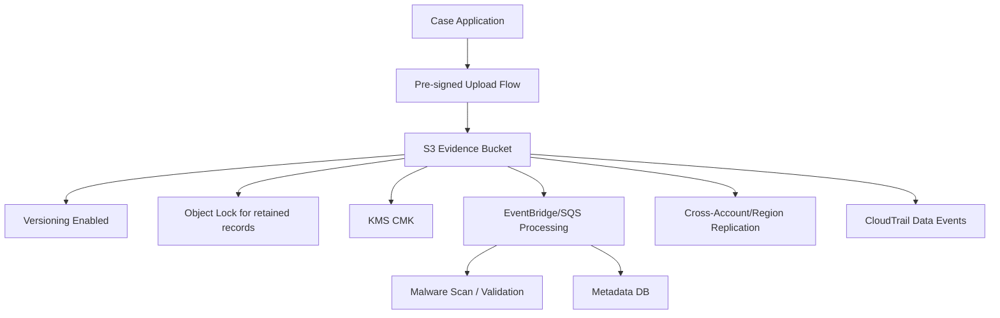

Design notes:

- Application controls authorization before issuing upload URL.
- Object key includes tenant/case/document identity.
- Metadata DB is source for business state, not S3 listing.
- Object Lock used only where retention policy requires it.
- Replication does not replace restore testing.

### 15.2 EC2 Stateful Workload with EBS Backup

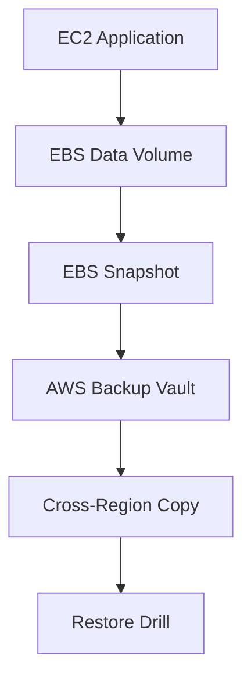

Design notes:

- Prefer managed database services if possible.
- If self-managed, define application-consistent backup.
- Monitor volume performance and snapshot success.
- Test restore to isolated environment.

### 15.3 Shared File Platform

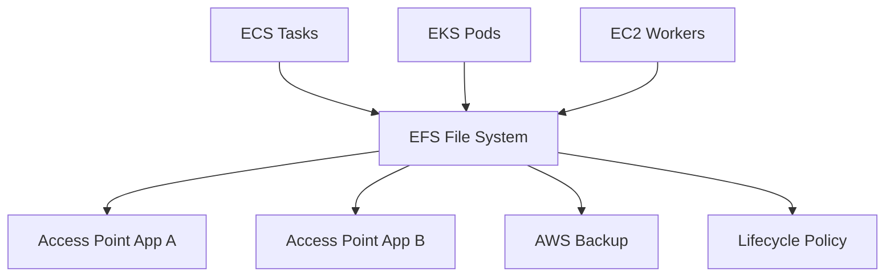

Design notes:

- Use access points for application isolation.
- Use security groups for network access.
- Monitor throughput and IO limits.
- Avoid using shared FS as unbounded temp storage.

### 15.4 Centralized Backup Account

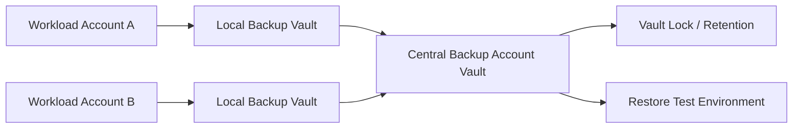

Design notes:

- Cross-account copy protects against account-level compromise/operator error.
- Restore permissions must be controlled.
- KMS keys and policies must support restore path.
- Backup coverage should be reported organization-wide.

---

## 16. Engineering Checklist

### 16.1 Storage Selection Checklist

- Is the data object, block, file, or backup?
- What is the write/read pattern?
- Is shared access required?
- Is strong consistency at app level needed?
- What is RPO/RTO?
- What is retention period?
- Is legal hold/WORM required?
- Is cross-Region/account copy required?
- Who can delete?
- Who can restore?
- What happens if encryption key is unavailable?
- What happens if lifecycle rule is wrong?

### 16.2 S3 Checklist

- Bucket ownership and purpose defined.
- Block Public Access enabled unless explicitly justified.
- Versioning decision documented.
- Lifecycle for current and noncurrent versions defined.
- Encryption default set.
- KMS key policy reviewed if using SSE-KMS.
- Bucket policy least-privilege.
- Access logging/CloudTrail data events configured for sensitive buckets.
- Replication requirement documented.
- Object Lock requirement reviewed with compliance/legal.
- Delete permission restricted.
- Restore procedure tested.

### 16.3 EBS Checklist

- Volume type selected based on workload metrics.
- Encryption enabled.
- Snapshot plan defined.
- Application consistency addressed.
- Delete protection/IAM guardrails applied where needed.
- Performance metrics monitored.
- Restore drill performed.

### 16.4 EFS/FSx Checklist

- File system chosen based on protocol/workload.
- Mount targets/subnets/security groups designed.
- Access points/share permissions defined.
- Backup plan enabled.
- Performance/throughput monitored.
- Lifecycle policy reviewed.
- Cost model reviewed.

### 16.5 AWS Backup Checklist

- Backup plan covers required resources.
- Backup vault access policy restricted.
- Retention matches policy.
- Cross-account/Region copy configured if required.
- Backup job alarms enabled.
- Restore job monitored.
- Restore test scheduled and evidenced.
- KMS restore path validated.
- Vault Lock considered for immutable retention.

---

## 17. Deliberate Practice

### Exercise 1: S3 Regulated Bucket

Build:

- S3 bucket for case evidence.
- Versioning enabled.
- Default encryption.
- Bucket policy denies non-TLS access.
- Lifecycle for noncurrent versions.
- CloudTrail data events.
- Event notification to SQS for processing.

Inject:

1. Upload object.
2. Overwrite object accidentally.
3. Delete object.
4. Restore previous version.
5. Try access from unauthorized role.
6. Trigger lifecycle simulation/review.

Success criteria:

- Unauthorized access denied.
- Previous version recoverable.
- Object access audited.
- Lifecycle does not delete required data.

### Exercise 2: EBS Restore Drill

Build:

- EC2 instance with EBS data volume.
- Write sample application data.
- Create snapshot through backup plan.
- Delete/corrupt local data.
- Restore volume from recovery point.

Success criteria:

- Restore runbook works.
- RTO measured.
- Data integrity verified.
- KMS permissions validated.

### Exercise 3: EFS Shared Access

Build:

- EFS file system with mount targets.
- Access point for one app.
- ECS/EKS/EC2 client mounting file system.
- Backup plan.

Inject:

1. Wrong security group.
2. Wrong UID/GID.
3. High file count.
4. Restore from backup.

Success criteria:

- Failure is diagnosable.
- Access point enforces expected path/user.
- Backup restore is verified.

### Exercise 4: Backup Coverage Report

Build:

- Tag-based AWS Backup selection.
- Two protected resources.
- One intentionally untagged resource.
- Backup job alarm.
- Restore test evidence.

Success criteria:

- Untagged resource detected as non-compliant.
- Backup job failure alarms.
- Restore evidence captured.
- Retention policy visible.

---

## 18. Common Anti-Patterns

| Anti-Pattern | Kenapa Buruk | Alternatif |
|---|---|---|
| Using S3 as relational database | No transactional query model | Use database, store blobs in S3. |
| Disabling versioning on critical objects | Accidental overwrite unrecoverable | Enable versioning + lifecycle. |
| Lifecycle rule without review | Data deleted/archived too early | Policy review and staged deployment. |
| Replication treated as backup | Corruption/delete can propagate | Backup/retention/versioning/Object Lock. |
| Backup never restored | False sense of safety | Scheduled restore drills. |
| One bucket for all data | Mixed policy and blast radius | Bucket/domain/data-class boundary. |
| Broad KMS key admin | Key misuse/deletion risk | Separation of duties and key policy. |
| Public access exception undocumented | Data exposure risk | Explicit approval, monitoring, guardrails. |
| EFS for high-churn temp data | Cost/performance issue | Ephemeral storage/S3/job-local disk. |
| Snapshots without app consistency | Restore may fail | Application-aware backup. |

---

## 19. Self-Correction Questions

1. Can I explain why this data belongs in S3/EBS/EFS/FSx instead of another primitive?
2. What is the data owner and deletion authority?
3. What is the exact RPO/RTO and has it been tested?
4. What happens if object is overwritten, deleted, or corrupted?
5. What happens if the KMS key is disabled?
6. Does replication copy both good and bad changes?
7. Can an operator delete recovery points?
8. Is backup copied outside the workload account if required?
9. Does lifecycle match legal retention?
10. Can we prove who accessed sensitive objects?
11. Can we restore one object, one tenant, one volume, one file system, and the full application?
12. Is cost driven by storage, requests, retrieval, replication, snapshots, or idle provisioned capacity?

---

## 20. Ringkasan Engineering Judgment

Storage architecture di AWS adalah kombinasi antara data semantics, access pattern, protection model, recovery engineering, dan cost control.

Gunakan S3 untuk object storage, tetapi desain bucket/key/access/lifecycle/retention dengan serius. Gunakan EBS untuk block storage yang melekat pada EC2, tetapi jangan lupa snapshot consistency dan AZ boundary. Gunakan EFS/FSx ketika workload benar-benar membutuhkan shared file semantics. Gunakan AWS Backup untuk centralized backup governance, tetapi jangan berhenti di konfigurasi backup: restore harus diuji.

Top-tier AWS engineer tidak bertanya “pakai S3 atau EBS?” secara dangkal. Mereka bertanya:

- Apa data contract-nya?
- Apa failure yang paling mungkin menghancurkan bisnis?
- Apakah restore sudah dibuktikan?
- Apakah retention defensible?
- Apakah access dan key policy mendukung operasi normal dan break-glass?
- Apakah lifecycle menghemat biaya tanpa menciptakan risiko data loss?

Data yang tidak bisa dipulihkan pada saat dibutuhkan pada dasarnya belum dilindungi.

---

## References

- AWS Documentation — S3 Lifecycle management: https://docs.aws.amazon.com/AmazonS3/latest/userguide/object-lifecycle-mgmt.html
- AWS Documentation — S3 Lifecycle transitions: https://docs.aws.amazon.com/AmazonS3/latest/userguide/lifecycle-transition-general-considerations.html
- AWS Documentation — S3 Versioning: https://docs.aws.amazon.com/AmazonS3/latest/userguide/Versioning.html
- AWS Documentation — S3 Object Lock: https://docs.aws.amazon.com/AmazonS3/latest/userguide/object-lock.html
- AWS Documentation — S3 Object Lock considerations with replication: https://docs.aws.amazon.com/AmazonS3/latest/userguide/object-lock-managing.html
- AWS Documentation — S3 replication requirements: https://docs.aws.amazon.com/AmazonS3/latest/userguide/replication-requirements.html
- AWS Documentation — What is AWS Backup: https://docs.aws.amazon.com/aws-backup/latest/devguide/whatisbackup.html
- AWS Documentation — AWS Backup supported services: https://docs.aws.amazon.com/aws-backup/latest/devguide/working-with-supported-services.html
- AWS Documentation — EFS backup and restore with AWS Backup: https://docs.aws.amazon.com/efs/latest/ug/awsbackup.html
- AWS Documentation — Restore EC2 with AWS Backup: https://docs.aws.amazon.com/aws-backup/latest/devguide/restoring-ec2.html
- AWS Documentation — Restore FSx with AWS Backup: https://docs.aws.amazon.com/aws-backup/latest/devguide/restoring-fsx.html
