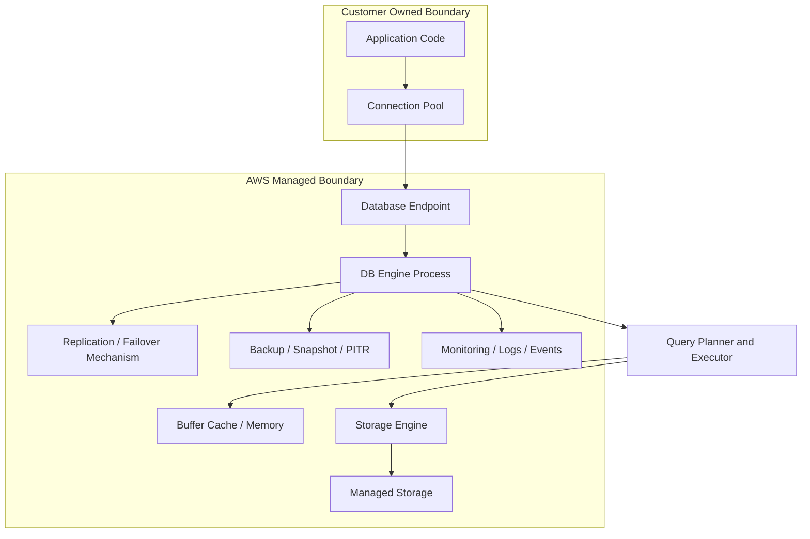
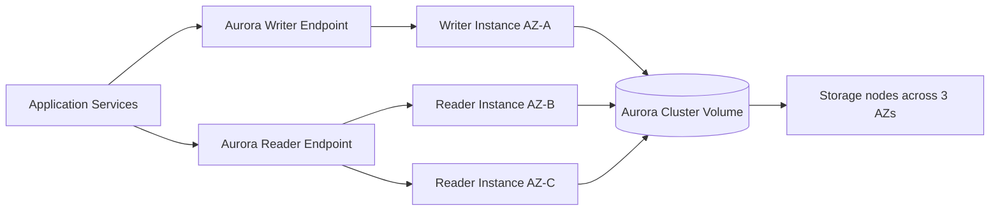
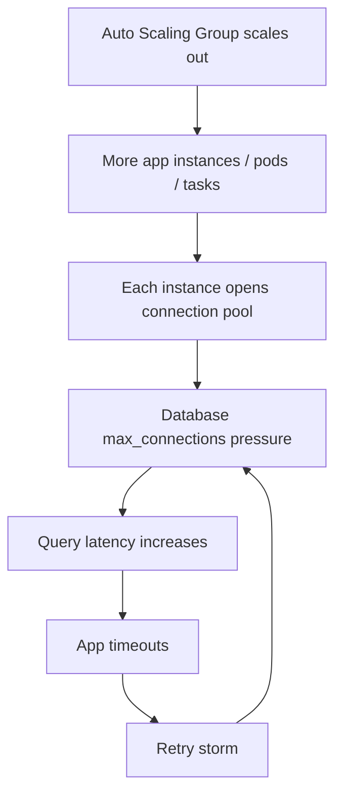
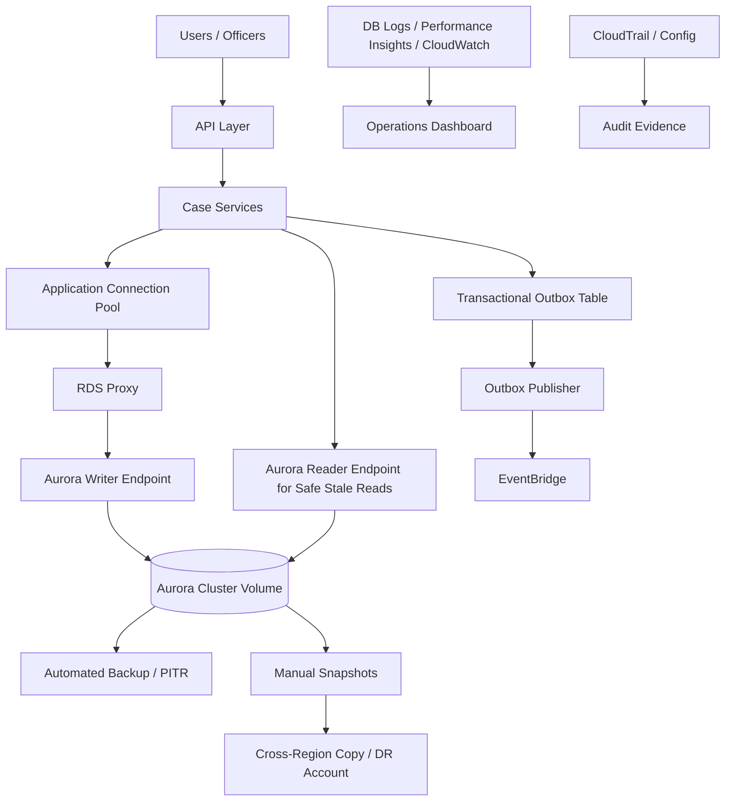

------
title: Learn AWS Engineering Mastery - Part 017
description: Relational data engineering on AWS using Amazon RDS, Amazon Aurora, Multi-AZ, replicas, failover, RDS Proxy, connection scaling, backup, restore, migration, observability, and production ownership boundaries.
series: learn-aws
seriesTitle: Learn AWS Engineering Mastery
order: 17
partTitle: Relational Data on AWS: RDS, Aurora, and Connection Scaling
tags:
- aws
- rds
- aurora
- database
- reliability
- platform-engineering
date: 2026-06-30
---

# Relational Data on AWS: RDS, Aurora, and Connection Scaling

Relational databases are not just storage engines. In production systems, they are **consistency boundaries**, **transaction coordinators**, **query execution engines**, **operational risk centers**, and often the hardest component to scale safely.

The goal of this part is not to memorize every Amazon RDS and Aurora feature. The goal is to build the judgment required to answer questions like:

- Should this workload use RDS, Aurora, DynamoDB, or something else?
- Is the bottleneck CPU, memory, I/O, lock contention, connection pressure, query shape, transaction design, or replication lag?
- Is Multi-AZ enough, or do we need cross-Region disaster recovery?
- Are read replicas solving the problem, or hiding a write-path design issue?
- Is the application safe during failover?
- Is our backup strategy meaningful if restore has never been tested?
- Who owns query performance: application team, platform team, DBA, or service team?

In a top-tier engineering environment, relational database design is not a database-only concern. It touches API latency, transaction semantics, deployment safety, cost, incident response, auditability, and product correctness.

---

## 1. Kaufman Skill Target

Following Josh Kaufman's approach, we deconstruct the broad skill "run relational databases on AWS" into sub-skills that can be deliberately practiced.

By the end of this part, you should be able to:

1. Explain the difference between **RDS DB instance**, **RDS Multi-AZ DB instance**, **RDS Multi-AZ DB cluster**, **Aurora cluster**, **Aurora replica**, and **Aurora Global Database**.
2. Design relational topology for a workload with explicit assumptions about consistency, latency, RTO, RPO, cost, and operational complexity.
3. Reason about connection scaling and decide when to use **RDS Proxy**, application pooling, pgbouncer, HikariCP, or direct connections.
4. Recognize when read replicas help and when they create stale-read correctness bugs.
5. Build a backup and restore strategy that distinguishes backup existence from restore confidence.
6. Define observability signals for relational workload health.
7. Identify common failure modes: connection storms, failover DNS lag, lock contention, runaway queries, storage saturation, replica lag, transaction pileups, and untested restore paths.

The important output is **engineering judgment**: given an unknown workload, you can ask the right questions, design a plausible first architecture, and correct course from evidence.

---

## 2. Mental Model: Managed Relational Database Boundary

A relational database on AWS has several layers:



AWS manages infrastructure, automation, patching workflows, backups mechanics, monitoring integrations, failover primitives, and managed storage behavior. But AWS does not automatically fix:

- bad schema design,
- unbounded queries,
- missing indexes,
- transaction misuse,
- excessive connection creation,
- ORM N+1 queries,
- incorrect isolation assumptions,
- stale-read bugs,
- poor data lifecycle,
- failed migration planning,
- weak restore testing.

The boundary is crucial. A managed database reduces operational burden, but does not remove database engineering responsibility.

---

## 3. RDS vs Aurora: First-Principles Comparison

### 3.1 RDS

Amazon RDS provides managed relational database instances for engines such as PostgreSQL, MySQL, MariaDB, Oracle, SQL Server, and Db2. The practical mental model is:

> RDS is closer to a managed version of familiar relational engines, with AWS handling instance lifecycle, backups, patching, monitoring integration, storage provisioning, and HA options.

Use RDS when:

- you need engine compatibility,
- you rely on existing PostgreSQL/MySQL/Oracle/SQL Server features,
- team skills map to traditional database operations,
- workload does not require Aurora-specific architecture,
- licensing or compatibility drives selection,
- you want a relatively direct migration path from self-managed databases.

### 3.2 Aurora

Amazon Aurora is AWS's cloud-native relational database compatible with MySQL and PostgreSQL. Its most important architectural distinction is the separation of compute from a distributed storage layer. Aurora stores cluster volume data across multiple storage nodes in multiple Availability Zones. AWS documentation describes Aurora high availability as synchronously replicating data across Availability Zones to six storage nodes associated with the cluster volume.

Aurora is not simply "faster RDS." It changes the failure and scaling model:

- cluster has a writer and optional replicas,
- storage is distributed and replicated,
- replicas share the same cluster volume,
- replicas can be used for read scaling,
- failover can promote a replica,
- storage grows automatically up to service limits,
- features such as Aurora Serverless v2 and Global Database introduce additional topology choices.

Use Aurora when:

- you want MySQL/PostgreSQL compatibility but cloud-native HA/scaling behavior,
- read scaling and faster replica promotion matter,
- you want distributed storage semantics,
- cross-Region Aurora Global Database fits DR requirements,
- storage autoscaling and cluster-level topology are beneficial,
- you accept Aurora-specific operational semantics.

### 3.3 Decision Heuristic

| Question | Bias Toward RDS | Bias Toward Aurora |
|---|---|---|
| Need broad engine support? | Yes | No, Aurora supports MySQL/PostgreSQL compatibility only |
| Need Oracle/SQL Server/Db2? | Yes | No |
| Need cloud-native cluster storage? | No | Yes |
| Need up to many low-lag readers on same cluster volume? | Maybe | Yes |
| Migrating legacy DB with minimal engine behavior changes? | Often | Sometimes |
| Want managed PostgreSQL/MySQL with strong HA and AWS-native options? | Maybe | Often |
| Very cost-sensitive small workload? | Often | Depends |
| Need Aurora Global Database? | No | Yes |

The correct answer is workload-specific. Do not choose Aurora because it sounds more modern. Choose it because its topology solves a real constraint.

---

## 4. Topology Patterns

### 4.1 Single-AZ RDS

Single-AZ RDS is useful for:

- development,
- test,
- low-criticality workloads,
- temporary migration targets,
- small internal systems with acceptable downtime.

It is not a default for production systems requiring meaningful availability.

Failure model:

- instance failure can cause downtime,
- AZ disruption can make the database unavailable,
- maintenance can be more disruptive,
- backup restore may be the primary recovery path.

### 4.2 RDS Multi-AZ DB Instance

Classic RDS Multi-AZ DB instance deployment maintains a standby replica in another Availability Zone. On infrastructure failure, RDS can automatically fail over to the standby.

This pattern is for high availability, not read scaling. The standby in classic Multi-AZ DB instance deployment is not normally used for application read traffic.

Use it when:

- you need higher availability,
- a single writer is enough,
- read scaling is not the main driver,
- operational simplicity matters.

### 4.3 RDS Multi-AZ DB Cluster

RDS Multi-AZ DB cluster has a writer and two readable DB instances in three separate Availability Zones. AWS documentation describes it as semisynchronous HA with two readable replicas.

This pattern gives:

- one writer,
- two readable replicas,
- three-AZ placement,
- better read capacity than classic Multi-AZ,
- different failover and endpoint behavior.

Use it when:

- you need HA and read scaling but not Aurora,
- supported engine/version fits,
- you want a managed cluster topology for MySQL/PostgreSQL workloads.

### 4.4 Aurora Single-Region Cluster

A common Aurora production topology:



Important properties:

- one writer at a time,
- multiple readers,
- writer endpoint follows current writer,
- reader endpoint load-balances/read-distributes across replicas,
- replicas share cluster volume,
- failover promotes a replica.

### 4.5 Aurora Global Database

Aurora Global Database is for cross-Region disaster recovery and low-latency global reads. It is not a magic replacement for application-level multi-Region correctness.

Use it when:

- Region-level failure must be planned,
- RTO/RPO requirements exceed backup/restore capability,
- read traffic is globally distributed,
- the application can handle failover semantics,
- operations team can run cross-Region drills.

Questions to ask:

- What is the write Region?
- What happens to writes during primary Region failure?
- Who decides failover?
- How is DNS/traffic shifted?
- How are application caches invalidated?
- How is data conflict handled if split-brain risk exists?
- How often is failover tested?

---

## 5. Connection Scaling: The Hidden Production Bottleneck

Many teams scale compute horizontally and then accidentally DDoS their own database with connections.

A database connection is not a cheap stateless HTTP request. It consumes server-side memory, process/thread resources, transaction state, locks, buffers, authentication overhead, TLS overhead, and sometimes prepared statement/cache state.

### 5.1 Connection Pressure Pattern



This is one of the most common database incidents in cloud systems.

Symptoms:

- database CPU not always maxed, but connection count is high,
- many idle connections,
- sudden spikes during deployment or autoscaling,
- connection acquisition timeout in app logs,
- database rejects new connections,
- failover recovery takes longer because clients reconnect aggressively,
- Lambda or serverless workloads create bursts.

### 5.2 Application Connection Pooling

Application-level pooling is usually the first line of defense.

For Java services, this often means HikariCP. For Node.js, Go, .NET, and Python, equivalent driver or ORM pooling exists.

Guidelines:

- pool size must be designed, not copied from defaults,
- total possible connections = instances × pool size,
- max pool size should align with database capacity,
- minimum idle should be conservative,
- connection lifetime should avoid synchronized reconnect waves,
- validation query/health check should not overload DB,
- deployment rollouts should avoid doubling live connections too long.

### 5.3 RDS Proxy

Amazon RDS Proxy sits between application and database to pool and share connections. It is especially useful for:

- serverless applications with bursty connection creation,
- applications with many short-lived connections,
- failover handling improvement,
- secret rotation integration,
- reducing connection storm impact.

RDS Proxy is not a universal performance booster. It helps most when connection management is the problem. It does not fix:

- bad queries,
- missing indexes,
- long transactions,
- lock contention,
- overloaded database CPU,
- incorrect isolation semantics,
- application-level transaction abuse.

### 5.4 Connection Scaling Checklist

Before increasing database size, answer:

1. How many application instances can exist at max scale?
2. What is max pool size per instance?
3. What is theoretical max concurrent DB connections?
4. How many are active vs idle?
5. Is the workload transaction-heavy or query-heavy?
6. Are connections held while calling external services?
7. Are transactions short?
8. Does failover cause reconnect storm?
9. Is Lambda or bursty compute involved?
10. Would RDS Proxy reduce connection churn?

---

## 6. Read Scaling and Replica Correctness

Read replicas are often used too casually.

A read replica can reduce read pressure on the writer, but it introduces an important semantic issue: **replica lag**.

### 6.1 Safe Read Replica Use Cases

Good candidates:

- dashboards tolerant of slight staleness,
- reporting queries,
- export jobs,
- search indexing pipelines,
- background reconciliation,
- non-critical browsing flows,
- read-heavy pages where stale data is acceptable.

### 6.2 Dangerous Read Replica Use Cases

Risky candidates:

- read-after-write flows,
- payment state verification,
- fraud decisioning,
- entitlement checks immediately after change,
- compliance status transitions,
- workflow state machines,
- idempotency key validation,
- user-visible confirmation after mutation.

If a user submits a case action and immediately sees old state because the read hit a lagging replica, the system is not just slow; it is semantically wrong.

### 6.3 Read Routing Rule

Use a simple rule:

> If correctness requires the latest committed write, read from the writer or use a consistency strategy that explicitly guarantees freshness.

Do not route all reads to replicas by default.

### 6.4 Replica Lag Operational Signals

Monitor:

- replica lag metric,
- read query latency,
- long-running transactions on writer,
- replication apply delays,
- reader CPU/memory pressure,
- storage I/O pressure,
- application stale-read incidents.

---

## 7. Transaction Design and Database Load

Relational databases are powerful because they support transactions. They become fragile when transaction boundaries are abused.

### 7.1 Good Transaction Boundary

A good transaction is:

- short,
- bounded,
- local to necessary rows,
- deterministic,
- not waiting on external systems,
- not holding locks while doing network calls,
- designed around business invariant.

Example:

```text
Begin transaction
  Check case is still in allowed state
  Insert transition event
  Update case state
  Insert audit row
Commit
```

### 7.2 Bad Transaction Boundary

```text
Begin transaction
  Load case
  Call external policy service
  Call document service
  Send email
  Update case state
Commit
```

This holds database resources while waiting on unrelated systems. In failure, it creates lock contention, latency pileup, deadlocks, and unpredictable rollback behavior.

### 7.3 Invariant-Centered Design

For complex case management or regulatory systems, the database transaction should protect invariants:

- a case cannot move from `CLOSED` to `UNDER_REVIEW`,
- only one active escalation per case exists,
- evidence cannot be deleted after enforcement decision,
- audit sequence is append-only,
- a transition must be causally linked to an actor and policy basis.

Relational databases are excellent for this, but only if schema constraints, indexes, isolation, and transaction boundaries are intentionally designed.

---

## 8. Schema and Index Engineering

AWS does not remove the need for schema design.

### 8.1 Schema Principles

A production relational schema should encode:

- stable entity identity,
- constraints that protect core invariants,
- foreign key strategy where appropriate,
- explicit lifecycle status,
- auditability,
- temporal semantics,
- data retention requirements,
- tenancy boundary if multi-tenant,
- migration compatibility.

### 8.2 Index Principles

Indexes are not free. They speed reads and slow writes.

A good index exists because of an observed or expected access path:

- filter columns,
- join columns,
- order-by columns,
- uniqueness constraints,
- foreign key support,
- high-cardinality lookup.

Bad index patterns:

- indexing every column,
- ignoring write amplification,
- creating overlapping indexes,
- missing composite index order,
- relying on ORM-generated queries without query plans,
- never pruning unused indexes.

### 8.3 Query Plan Ownership

Top-tier teams treat query plans as production artifacts.

For critical queries, know:

- expected cardinality,
- index used,
- join strategy,
- estimated vs actual rows,
- sort/hash memory behavior,
- p95/p99 latency,
- lock impact,
- execution changes after data growth.

---

## 9. Backup, Restore, and Recovery

Backups are not the goal. Restore is the goal.

### 9.1 Backup Types

Common AWS relational backup mechanisms:

- automated backups,
- point-in-time recovery,
- manual snapshots,
- cross-Region snapshot copy,
- AWS Backup policies,
- engine-native logical backups for some migration/recovery scenarios.

### 9.2 Restore Questions

For every production database, answer:

1. What is the RPO?
2. What is the RTO?
3. What is the largest database size expected in one year?
4. How long does restore actually take at that size?
5. What dependent services must be restored first?
6. How are secrets/endpoints updated?
7. How is application traffic shifted?
8. How is restored data validated?
9. How is partial data corruption handled?
10. When was the last successful restore drill?

### 9.3 PITR Is Not Full Incident Response

Point-in-time restore helps with accidental deletion, corruption, and operator error. But it often restores into a new database resource. The application cutover still needs:

- endpoint strategy,
- DNS or secret update,
- migration window,
- validation process,
- rollback plan,
- data reconciliation.

### 9.4 Backup vs Replication

| Mechanism | Helps With | Does Not Fully Solve |
|---|---|---|
| Automated backup | Restore to earlier time | Very low RTO |
| Manual snapshot | Known recovery checkpoint | Continuous data loss prevention |
| Read replica | Read scaling, some promotion scenarios | Data corruption copied from primary |
| Multi-AZ | AZ/instance availability | Region disaster |
| Cross-Region replica/global database | Regional resilience | Application failover complexity |
| Logical export | Portability, selective restore | Fast full recovery at large scale |

---

## 10. Migration Patterns

### 10.1 Rehost / Lift-and-Shift

Move existing database to RDS with minimal changes.

Pros:

- faster migration,
- lower initial app change,
- familiar engine behavior.

Cons:

- legacy schema and query issues remain,
- connection behavior may not be cloud-ready,
- failover behavior may surprise app,
- operational model changes but app assumptions do not.

### 10.2 Replatform

Move to managed RDS/Aurora and adjust operational patterns:

- change connection pooling,
- tune indexes,
- split readers/writers,
- improve backup/restore,
- update deployment/failover runbooks,
- introduce observability.

### 10.3 Refactor

Change data model or split workload:

- move append-only events to event store/stream,
- move cacheable read model to ElastiCache/OpenSearch,
- move high-scale key-value access to DynamoDB,
- split transactional core from analytical/reporting workloads,
- introduce outbox/event publishing.

### 10.4 Migration Safety Checklist

- schema diff reviewed,
- data volume profiled,
- indexes validated under production-like data,
- cutover and rollback tested,
- DMS/logical replication lag monitored if used,
- application dual-write avoided unless strongly controlled,
- write freeze plan defined if necessary,
- post-cutover validation automated,
- old system read-only retention decided.

---

## 11. Observability for Relational Databases

### 11.1 Core Metrics

Monitor at minimum:

- CPU utilization,
- freeable memory,
- database connections,
- read/write IOPS,
- read/write latency,
- storage space,
- transaction logs/binlogs/WAL behavior,
- replica lag,
- deadlocks,
- lock waits,
- slow queries,
- commit latency,
- network throughput,
- failover events.

### 11.2 Enhanced Signals

Use where appropriate:

- Performance Insights,
- Enhanced Monitoring,
- CloudWatch alarms,
- database engine logs,
- slow query logs,
- audit logs,
- RDS events,
- CloudTrail for control-plane changes.

### 11.3 Actionable Alarms

Bad alarm:

```text
CPU > 80%
```

Better alarm:

```text
Database CPU > 80% for 10 minutes AND active connections > baseline AND p95 application DB latency > SLO budget.
```

The second alarm maps infrastructure symptoms to user-impacting risk.

---

## 12. Security Model

### 12.1 Network Security

Prefer private database subnets. Database should not be public unless there is a very strong reason and compensating controls.

Baseline:

- no public accessibility for production DB,
- security group allows only application/service security groups,
- no broad CIDR ingress,
- separate admin access path through SSM/bastion/controlled network,
- VPC Flow Logs for suspicious traffic analysis,
- subnet route table reviewed.

### 12.2 Identity and Secrets

Use:

- Secrets Manager for credentials,
- IAM authentication where appropriate,
- rotation strategy,
- least privilege users,
- separate migration/admin/runtime users,
- no shared root/master credential in app runtime.

### 12.3 Encryption

Use encryption at rest and in transit.

Operational concerns:

- KMS key ownership,
- cross-account access,
- cross-Region replication key strategy,
- TLS enforcement,
- certificate rotation,
- client trust stores.

### 12.4 Auditability

For regulated workloads, collect evidence for:

- who changed parameter groups,
- who restored snapshots,
- who modified security groups,
- who accessed admin credentials,
- which schema migrations ran,
- when failover occurred,
- whether backups succeeded,
- whether restore drills passed.

---

## 13. Cost Engineering

Database cost is often dominated by:

- instance class,
- storage type and size,
- provisioned IOPS,
- backup retention,
- snapshot accumulation,
- cross-Region replication,
- data transfer,
- read replicas,
- Aurora I/O charges depending on configuration,
- idle non-production environments.

Cost questions:

1. Is the workload CPU, memory, I/O, or connection bound?
2. Are read replicas actually used?
3. Are snapshots lifecycle-managed?
4. Are non-prod databases stopped or right-sized?
5. Is provisioned IOPS justified by measured latency?
6. Are reports running on production writer?
7. Can heavy analytical workload be moved to a warehouse/lake?
8. Are indexes increasing storage and write cost unnecessarily?
9. Is Aurora worth the operational benefit for this workload?

Cost optimization must not violate availability, durability, or compliance requirements.

---

## 14. Failure Modes and How to Reason About Them

### 14.1 Connection Storm

Cause:

- deployment restart,
- autoscaling burst,
- Lambda concurrency spike,
- failover reconnect,
- pool misconfiguration.

Mitigation:

- conservative pool sizing,
- RDS Proxy where appropriate,
- jittered reconnect,
- deployment rollout limits,
- reserved concurrency for Lambda,
- circuit breaker for DB saturation.

### 14.2 Lock Contention

Cause:

- long transactions,
- missing indexes,
- batch updates,
- hot rows,
- sequential state machine updates.

Mitigation:

- shorten transactions,
- add proper indexes,
- split hot aggregates,
- optimistic locking,
- queue writes where appropriate,
- review isolation level.

### 14.3 Replica Lag

Cause:

- write spike,
- long transaction,
- reader under-provisioning,
- replication bottleneck,
- DDL/migration impact.

Mitigation:

- route correctness-sensitive reads to writer,
- monitor lag,
- throttle write jobs,
- scale readers,
- design read model semantics.

### 14.4 Failover Surprise

Cause:

- application caches DNS too long,
- connection pool does not recover,
- transactions not retried safely,
- read/write endpoints confused,
- failover never tested.

Mitigation:

- failover drills,
- retry only idempotent operations,
- shorter DNS cache where appropriate,
- connection validation,
- RDS Proxy where appropriate,
- runbooks.

### 14.5 Restore Failure

Cause:

- backup exists but restore untested,
- missing KMS key access,
- subnet/security group mismatch,
- app config tied to old endpoint,
- snapshot too large for RTO,
- dependent services not restored.

Mitigation:

- scheduled restore drills,
- automated validation,
- restore runbook,
- cross-account/cross-Region backup access checks,
- RTO measurement with realistic data size.

---

## 15. Design Decision Matrix

| Requirement | Recommended Direction |
|---|---|
| Small non-critical app | Single-AZ RDS may be acceptable |
| Production transactional app | Multi-AZ RDS or Aurora cluster |
| Strong PostgreSQL/MySQL compatibility and cloud-native HA | Aurora PostgreSQL/MySQL |
| Oracle/SQL Server requirement | RDS engine-specific deployment |
| Heavy read scaling with stale-read tolerance | Aurora replicas or RDS read replicas |
| Read-after-write correctness | Writer endpoint or explicit consistency strategy |
| Bursty serverless connections | RDS Proxy strongly considered |
| Regional disaster recovery | Cross-Region replica/Aurora Global Database plus failover runbook |
| Strict audit/compliance | CloudTrail, Config, logs, backups, restore evidence, access review |
| Analytical workload | Separate analytics platform; do not overload OLTP writer |

---

## 16. Example Architecture: Regulated Case Management Core



Design decisions:

- write path uses writer endpoint,
- correctness-sensitive reads use writer,
- stale-tolerant lists/search/reporting can use reader/read model,
- connection pressure reduced via pool plus RDS Proxy if workload pattern justifies,
- transactional outbox ensures domain events are emitted after durable state change,
- backups and snapshots are tested with restore drills,
- audit trail includes database control-plane and schema migration events.

---

## 17. Practice: 20-Hour Deliberate Learning Block

### Hour 1-2: Topology Recognition

Draw five topologies:

1. Single-AZ RDS.
2. Multi-AZ DB instance.
3. Multi-AZ DB cluster.
4. Aurora cluster with writer/readers.
5. Aurora Global Database.

For each, write failure behavior and expected recovery path.

### Hour 3-5: Connection Budgeting

Given:

- 40 ECS tasks,
- HikariCP max pool size 20,
- two deployment waves overlapping,
- RDS max connections 600,

calculate worst-case connection pressure and propose a safer pool/deployment configuration.

### Hour 6-8: Read Replica Correctness

Take a case-management workflow. Mark each read as:

- must be strongly fresh,
- can tolerate seconds of staleness,
- can run asynchronously,
- should be moved to reporting/read model.

### Hour 9-11: Failover Drill Design

Write a failover runbook:

- preconditions,
- impact window,
- monitoring dashboard,
- application behavior expectation,
- rollback,
- evidence captured.

### Hour 12-14: Restore Drill

Design a restore drill from automated backup:

- restore to isolated subnet,
- validate schema,
- validate row counts,
- run application smoke tests,
- measure RTO,
- document gaps.

### Hour 15-17: Query Plan Review

Choose three critical queries and record:

- input cardinality,
- indexes,
- query plan,
- p95 latency,
- failure threshold.

### Hour 18-20: Architecture Review

Review an existing workload using this checklist:

- topology,
- connection model,
- read routing,
- backup/restore,
- failover,
- security,
- cost,
- observability.

---

## 18. Self-Correction Checklist

You understand this part if you can answer without notes:

- Why is Multi-AZ not the same as read scaling?
- Why can read replicas create correctness bugs?
- Why is restore testing more important than backup configuration screenshots?
- Why can autoscaling application instances break the database?
- When does RDS Proxy help?
- Why can a database be connection-bound but not CPU-bound?
- What are the application responsibilities during database failover?
- What is the difference between HA and DR?
- Why should OLTP reporting workloads often be separated?
- What evidence would an auditor ask for around database access and recovery?

---

## 19. Anti-Patterns

Avoid:

- public production RDS with broad ingress,
- one giant database shared by unrelated bounded contexts,
- routing all reads to replicas regardless of consistency needs,
- using default connection pool sizes blindly,
- no failover drills,
- backup retention without restore testing,
- analytical queries on production writer,
- schema migrations without rollback/forward-fix strategy,
- unbounded ORM queries,
- no slow query monitoring,
- no ownership of query plans,
- treating Aurora as automatically solving all database scalability problems.

---

## 20. Summary Judgment

Relational databases on AWS are managed infrastructure, not managed correctness.

A strong AWS engineer thinks in layers:

- **engine semantics**: SQL, transactions, isolation, indexing,
- **AWS topology**: RDS/Aurora, Multi-AZ, replicas, clusters,
- **connection model**: pools, proxies, bursts, failover,
- **recovery model**: backup, restore, RTO, RPO, DR,
- **operational model**: metrics, logs, events, runbooks,
- **security model**: network, secrets, encryption, audit,
- **cost model**: instance, I/O, storage, replicas, backups,
- **application correctness**: stale reads, idempotency, state transitions.

The top 1% skill is not knowing that RDS has Multi-AZ. It is knowing exactly what Multi-AZ does, what it does not do, what the application must still handle, how it fails, how to test it, and how to prove it works under pressure.

---

## References

- AWS Documentation: Amazon RDS Multi-AZ DB cluster deployments — https://docs.aws.amazon.com/AmazonRDS/latest/UserGuide/multi-az-db-clusters-concepts.html
- AWS Documentation: Amazon RDS Multi-AZ failover — https://docs.aws.amazon.com/AmazonRDS/latest/UserGuide/Concepts.MultiAZ.Failover.html
- AWS Documentation: Aurora high availability — https://docs.aws.amazon.com/AmazonRDS/latest/AuroraUserGuide/Concepts.AuroraHighAvailability.html
- AWS Documentation: Aurora replication — https://docs.aws.amazon.com/AmazonRDS/latest/AuroraUserGuide/Aurora.Replication.html
- AWS Documentation: RDS Proxy with Multi-AZ DB clusters — https://docs.aws.amazon.com/AmazonRDS/latest/UserGuide/multi-az-db-clusters-concepts.html
- AWS Documentation: Restore Multi-AZ DB cluster to point in time — https://docs.aws.amazon.com/AmazonRDS/latest/UserGuide/USER_PIT.MultiAZDBCluster.html
