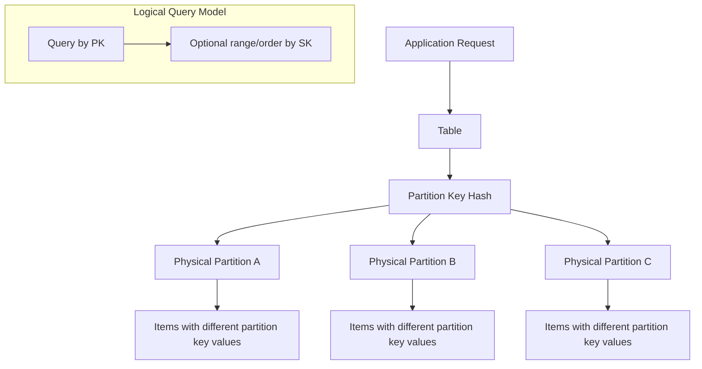

------
title: Learn AWS Engineering Mastery - Part 018
description: DynamoDB data modeling from first principles, including access patterns, partition keys, sort keys, GSIs, LSIs, single-table design, hot partitions, throughput, streams, TTL, transactions, global tables, correctness, observability, and production failure modes.
series: learn-aws
seriesTitle: Learn AWS Engineering Mastery
order: 18
partTitle: DynamoDB Data Modeling, Partitions, and Global Tables
tags:
- aws
- dynamodb
- nosql
- data-modeling
- serverless
- reliability
date: 2026-06-30
---

# DynamoDB Data Modeling, Partitions, and Global Tables

DynamoDB is not a relational database without joins. It is a managed, partitioned, low-latency key-value and document database that rewards access-pattern-first design and punishes vague modeling.

The most common DynamoDB failure is not choosing the wrong capacity mode. It is designing the table before understanding the access patterns.

A relational engineer often asks:

> What entities do I have, and how are they related?

A DynamoDB engineer asks:

> What questions must the application answer, at what scale, with what latency, consistency, ordering, and isolation requirements?

This part builds the mental model needed to use DynamoDB correctly in production.

---

## 1. Kaufman Skill Target

By the end of this part, you should be able to:

1. Explain DynamoDB's table, item, attribute, partition key, sort key, LSI, GSI, stream, TTL, transaction, and global table concepts.
2. Design a table from access patterns rather than entity diagrams.
3. Identify hot partition risks before production.
4. Use sort keys to encode hierarchy, ordering, versioning, and range queries.
5. Decide when single-table design is useful and when it is harmful.
6. Model consistency requirements explicitly: eventual, strongly consistent, transactional, and global multi-Region semantics.
7. Design for idempotency, conditional writes, optimistic concurrency, and state-machine correctness.
8. Evaluate on-demand vs provisioned capacity and understand throttling signals.
9. Use DynamoDB Streams, TTL, and global tables without assuming they behave like synchronous relational triggers.
10. Build observability and operational runbooks for DynamoDB workloads.

---

## 2. DynamoDB Mental Model

DynamoDB stores items in tables. Each item is identified by a primary key. A primary key can be:

- **simple key**: partition key only,
- **composite key**: partition key + sort key.

The partition key is hashed to determine physical placement. The sort key orders items with the same partition key.



You do not manage physical partitions directly. But your key design controls whether load spreads well or concentrates into hot partitions.

---

## 3. The Most Important Rule: Access Patterns First

DynamoDB design starts with a list of access patterns.

Bad starting point:

```text
Tables:
- users
- cases
- evidence
- decisions
- escalations
```

Better starting point:

```text
Access patterns:
1. Get case by caseId.
2. List all open cases assigned to officerId by priority.
3. List all evidence for caseId ordered by submission time.
4. Get latest decision for caseId.
5. Check if idempotency key already exists for commandId.
6. List case transition history by caseId.
7. Find cases due for SLA breach before timestamp.
8. List tenant cases by status and createdAt.
```

Only after access patterns are clear should you design keys and indexes.

---

## 4. DynamoDB Core Concepts

### 4.1 Table

A table is a collection of items. Unlike relational tables, items in a DynamoDB table do not need identical attributes.

### 4.2 Item

An item is similar to a row/document. It is a map of attributes.

### 4.3 Partition Key

The partition key determines item distribution and equality lookup. It is the most important design choice.

A good partition key:

- has high cardinality,
- distributes load,
- aligns with dominant access patterns,
- avoids single hot values,
- supports tenant isolation strategy where needed.

### 4.4 Sort Key

The sort key orders items within the same partition key and enables range queries.

Useful for:

- time ordering,
- hierarchical paths,
- entity grouping,
- version history,
- state transitions,
- prefix queries,
- one-to-many relationships.

Example sort keys:

```text
PROFILE
CASE#2026-0001
EVIDENCE#2026-06-30T10:15:00Z#ev-123
TRANSITION#2026-06-30T10:20:00Z#tr-456
DECISION#v0001
```

### 4.5 Query vs Scan

`Query` uses key conditions and is the normal production access path.

`Scan` reads across table/index data and is usually dangerous for online request paths.

Scans are acceptable for:

- controlled backfills,
- admin tools with limits,
- offline jobs,
- small bounded tables,
- one-time migration tasks.

They are not acceptable as default user-facing query strategy.

---

## 5. Sort Key Design Patterns

### 5.1 Hierarchical Sort Key

```text
PK = TENANT#t1
SK = CASE#c1
SK = CASE#c1#EVIDENCE#e1
SK = CASE#c1#EVIDENCE#e2
SK = CASE#c1#TRANSITION#2026-06-30T10:00:00Z
```

This supports `begins_with(SK, 'CASE#c1#EVIDENCE#')`.

### 5.2 Time-Ordered Events

```text
PK = CASE#c1
SK = EVENT#2026-06-30T10:00:00Z#eventId
```

This supports chronological case timeline queries.

### 5.3 Versioning

```text
PK = POLICY#p1
SK = VERSION#000001
SK = VERSION#000002
SK = CURRENT
```

One item can point to current version while historical versions remain immutable.

### 5.4 Inverted Timestamp

For latest-first queries:

```text
SK = EVENT#9999999999-minus-epoch#eventId
```

or use descending query where appropriate. The precise encoding depends on SDK/query behavior and readability trade-off.

---

## 6. Secondary Indexes

### 6.1 Local Secondary Index

An LSI has the same partition key as the base table but a different sort key. It must be defined at table creation time.

Use when:

- you need alternate ordering/range query within same partition key,
- access stays within the same entity group,
- you know the pattern early.

### 6.2 Global Secondary Index

A GSI has its own partition key and optional sort key. It enables alternate access patterns across the table.

Use when:

- you need lookup by a different key,
- you need list by status, owner, tenant, SLA date, or external reference,
- you need an inverted relationship.

Example:

```text
Base table:
PK = CASE#c1
SK = METADATA

GSI1:
GSI1PK = OFFICER#u123#STATUS#OPEN
GSI1SK = PRIORITY#HIGH#CREATED#2026-06-30T10:00:00Z#CASE#c1
```

### 6.3 Index Cost and Risk

Every GSI is a write amplification path. It can have its own throughput and throttling behavior.

Index questions:

- Which exact access pattern does this index serve?
- What is the expected cardinality of the GSI partition key?
- Can one GSI key become hot?
- What attributes are projected?
- Is the index eventually consistent enough for the use case?
- What happens if GSI backfill or update lags?

---

## 7. Single-Table Design

Single-table design stores multiple entity types in one table using generic key names like `PK` and `SK` plus typed attributes.

### 7.1 Why It Exists

DynamoDB performs best when queries map directly to key lookups and range queries. Single-table design can colocate related items under the same partition key and reduce multi-request composition.

Example:

```text
PK              SK
CASE#c1         METADATA
CASE#c1         EVIDENCE#2026-06-30T10:00:00Z#e1
CASE#c1         EVIDENCE#2026-06-30T10:05:00Z#e2
CASE#c1         TRANSITION#2026-06-30T10:10:00Z#tr1
CASE#c1         DECISION#2026-06-30T10:20:00Z#d1
```

A single query on `PK = CASE#c1` can retrieve a case aggregate or timeline.

### 7.2 Benefits

- fewer network round trips,
- predictable access patterns,
- aggregate-oriented modeling,
- efficient one-to-many retrieval,
- easier transactional writes within item groups in some cases,
- fewer tables to manage.

### 7.3 Costs

- harder mental model,
- generic attribute names,
- index overload complexity,
- migration complexity,
- harder ad hoc queries,
- less intuitive for analysts,
- bad if access patterns are unstable.

### 7.4 When Not to Use It

Avoid aggressive single-table design when:

- domain access patterns are still unknown,
- team lacks DynamoDB modeling skill,
- analytics/ad hoc exploration dominates,
- entity lifecycles are unrelated,
- regulatory reporting needs relational-style queries,
- overloading indexes would reduce maintainability,
- the workload is small and simplicity matters more.

Single-table design is a technique, not a religion.

---

## 8. Hot Partitions

A hot partition occurs when too much traffic targets the same partition key or small set of keys.

### 8.1 Hot Key Example

Bad key:

```text
PK = TENANT#large-tenant
SK = CASE#...
```

If one tenant is huge, all writes for that tenant may concentrate on one logical partition key.

Better design may include sharding or access-pattern-specific keys:

```text
PK = TENANT#large-tenant#SHARD#03
SK = CASE#...
```

But sharding has query complexity costs. Use it only when needed.

### 8.2 Hot Partition Symptoms

- throttled requests,
- high latency on specific access pattern,
- uneven key distribution,
- one tenant/user/status dominates,
- high retry rate,
- adaptive capacity helps but does not fix bad design forever.

AWS documentation notes that adaptive capacity is enabled automatically and can increase capacity for hot partitions, but key design still matters because a partition key that does not distribute I/O effectively can create hot partitions and throttling.

### 8.3 Prevention

- high-cardinality partition keys,
- avoid low-cardinality keys like `STATUS#OPEN` alone,
- include tenant + bucket/shard where needed,
- distribute writes across time buckets,
- separate write-heavy counters,
- use streams for aggregation instead of hot counters,
- model top tenants explicitly.

---

## 9. Capacity Modes

### 9.1 On-Demand

On-demand capacity adapts automatically to traffic volume and is useful when:

- traffic is unpredictable,
- workload is new,
- operational simplicity matters,
- cost predictability is less important than elasticity.

AWS documentation describes on-demand tables as automatically adapting to traffic and being able to handle up to double the previous peak immediately, subject to documented behavior and limits.

### 9.2 Provisioned

Provisioned capacity is useful when:

- traffic is predictable,
- cost optimization matters,
- auto scaling policies are tuned,
- reserved capacity may be beneficial,
- workload has stable throughput.

### 9.3 Capacity Decision Matrix

| Situation | Bias |
|---|---|
| Unknown workload | On-demand |
| Spiky traffic | On-demand |
| Stable high-volume workload | Provisioned with auto scaling |
| Strict cost planning | Provisioned |
| Early product iteration | On-demand |
| Massive predictable traffic | Provisioned plus careful partition design |

---

## 10. Consistency and Correctness

DynamoDB supports eventually consistent reads and strongly consistent reads for base table and LSI reads within a Region. GSIs are eventually consistent.

### 10.1 Eventual Consistency

Acceptable for:

- browsing,
- dashboards,
- non-critical status lists,
- background views,
- search-like experiences.

Risky for:

- entitlement checks,
- financial state,
- workflow transitions,
- idempotency checks,
- read-after-write confirmation.

### 10.2 Conditional Writes

Conditional writes are one of DynamoDB's most important correctness tools.

Examples:

- create only if item does not exist,
- update only if version equals expected version,
- transition case only if current status is allowed,
- accept command only if idempotency key absent.

Pseudo-condition:

```text
Update CASE#c1
SET status = 'APPROVED', version = version + 1
WHERE status = 'UNDER_REVIEW' AND version = 7
```

This maps naturally to state-machine correctness.

### 10.3 Optimistic Concurrency

Store a version attribute:

```json
{
  "PK": "CASE#c1",
  "SK": "METADATA",
  "status": "UNDER_REVIEW",
  "version": 7
}
```

Update with condition:

```text
condition: version = 7
```

If another writer changed the item, the condition fails.

### 10.4 Transactions

DynamoDB transactions support all-or-nothing writes/reads across multiple items, subject to service limits. Use them for real invariants, not as a replacement for relational modeling.

Good use cases:

- create case + idempotency record,
- update aggregate metadata + append transition item,
- reserve unique external reference,
- enforce state transition and audit event together.

Avoid transactions for:

- large batch jobs,
- high-frequency hot keys,
- read patterns better served by single item design,
- trying to simulate arbitrary relational joins.

---

## 11. Streams, TTL, and Event-Driven Patterns

### 11.1 DynamoDB Streams

DynamoDB Streams capture item-level modifications and can trigger downstream processing.

Use cases:

- update read models,
- emit domain events,
- maintain search index,
- audit pipeline,
- async projection,
- cache invalidation.

Important: streams are asynchronous. Do not treat a stream consumer as part of the same transaction unless the product can tolerate eventual propagation.

### 11.2 TTL

TTL marks items for expiration. It is useful for:

- idempotency keys,
- session records,
- temporary locks,
- ephemeral workflow tokens,
- cache-like data.

TTL deletion is not immediate. Do not use TTL when exact deletion time is a hard business invariant.

### 11.3 Outbox-Like Pattern

DynamoDB can model outbox items:

```text
PK = CASE#c1
SK = OUTBOX#2026-06-30T10:00:00Z#eventId
```

A stream consumer or poller publishes these to EventBridge/SNS/Kinesis.

Design concern:

- avoid duplicate publishing,
- make consumers idempotent,
- track event version,
- handle poison events,
- preserve ordering only where explicitly designed.

---

## 12. Global Tables

DynamoDB global tables provide multi-Region, multi-active replication. Any replica can serve reads and writes.

This is powerful but semantically different from a single-writer relational database.

### 12.1 Use Cases

- global low-latency reads/writes,
- multi-Region business continuity,
- active-active serverless applications,
- regional isolation,
- globally distributed user sessions/preferences,
- workloads tolerant of conflict semantics.

### 12.2 Critical Correctness Questions

Before using global tables, answer:

1. Can two Regions update the same logical item concurrently?
2. What is the conflict resolution behavior?
3. Is last-writer-wins acceptable?
4. Are writes naturally Region-scoped?
5. Can item ownership be partitioned by Region?
6. What happens during network partition?
7. How do downstream stream processors behave in each Region?
8. How is user traffic routed?
9. How is failback performed?
10. What evidence proves multi-Region recovery works?

### 12.3 Safer Global Table Patterns

Good pattern:

```text
PK = REGION#ap-southeast-1#USER#u1
```

or:

```text
PK = TENANT#t1#HOME_REGION#ap-southeast-1#CASE#c1
```

This avoids multi-Region concurrent writes to the same logical record by assigning ownership.

Risky pattern:

```text
PK = CASE#c1
```

with writes allowed from all Regions and no conflict-aware design.

### 12.4 Global Tables Are Not Free DR

Global tables replicate data, but DR still requires:

- application deployment in secondary Region,
- identity/auth dependency planning,
- API routing,
- event integration behavior,
- monitoring in each Region,
- operational failover/failback runbooks,
- data reconciliation strategy,
- chaos/failover drills.

---

## 13. Modeling Example: Regulated Case Management

### 13.1 Access Patterns

Assume these access patterns:

1. Get case metadata by caseId.
2. List evidence for a case ordered by time.
3. Append transition event if current state allows it.
4. Get case timeline.
5. List open cases assigned to officer.
6. List tenant cases by status and creation date.
7. Check idempotency key for command.
8. Find cases approaching SLA deadline.

### 13.2 Table Design

Base table:

```text
Table: CasePlatform
PK: pk
SK: sk
```

Items:

```text
pk = CASE#c1
sk = METADATA

pk = CASE#c1
sk = EVIDENCE#2026-06-30T09:30:00Z#e1

pk = CASE#c1
sk = TRANSITION#2026-06-30T10:00:00Z#tr1

pk = IDEMPOTENCY#cmd-123
sk = RESULT

pk = OFFICER#u123
sk = CASE#STATUS#OPEN#PRIORITY#HIGH#CREATED#2026-06-30T09:00:00Z#c1
```

This is one possible design, not universal truth.

### 13.3 GSI for SLA

```text
GSI1PK = SLA#DUE
GSI1SK = 2026-07-01T00:00:00Z#CASE#c1
```

A worker queries due items by time range.

### 13.4 State Transition with Condition

Transition command:

```text
Approve case c1 if status = UNDER_REVIEW and version = 7.
```

Write set:

1. Update `CASE#c1 / METADATA` with new status/version.
2. Put `CASE#c1 / TRANSITION#timestamp#transitionId`.
3. Put/update idempotency record.

Use transaction or conditional writes depending on invariant needs.

---

## 14. Observability

Monitor:

- consumed read/write capacity,
- throttled requests,
- system errors,
- user errors,
- successful request latency,
- conditional check failures,
- transaction conflicts,
- stream iterator age,
- GSI throttling,
- replication latency for global tables,
- TTL deletion behavior where relevant,
- hot key symptoms at application level.

Application-level metrics are essential:

- per-access-pattern latency,
- per-access-pattern error rate,
- retry count,
- conditional failure count by business reason,
- item size distribution,
- tenant/request-key distribution,
- stale-read incidents,
- idempotency duplicate rate.

DynamoDB service metrics alone may not reveal which access pattern is flawed.

---

## 15. Security

### 15.1 IAM

Use least privilege IAM policies. Avoid giving generic applications broad table access if they only need specific operations.

Common actions:

- `dynamodb:GetItem`,
- `dynamodb:Query`,
- `dynamodb:PutItem`,
- `dynamodb:UpdateItem`,
- `dynamodb:DeleteItem`,
- `dynamodb:TransactWriteItems`,
- `dynamodb:DescribeTable`,
- `dynamodb:ConditionCheckItem`.

### 15.2 Encryption

DynamoDB encrypts data at rest. For sensitive workloads, design KMS key ownership and access boundaries explicitly.

### 15.3 Network Boundary

Use VPC endpoints where workloads in private subnets access DynamoDB without public internet routing.

### 15.4 Data Boundary

For multi-tenant systems, model tenant boundary explicitly:

- tenant prefix in keys,
- IAM condition strategy if applicable,
- application authorization checks,
- separate table/account for strict isolation if needed,
- audit logs for sensitive item access.

---

## 16. Cost Engineering

Cost drivers:

- read request units,
- write request units,
- item size,
- GSI write/read amplification,
- streams,
- global table replication,
- backups/PITR,
- export/import,
- storage,
- on-demand vs provisioned choice.

Cost questions:

1. What are the top five access patterns by request volume?
2. Which attributes are projected into GSIs?
3. Are large blobs stored in DynamoDB instead of S3?
4. Are writes amplified across multiple GSIs?
5. Are global tables replicating unnecessary data?
6. Are TTL and lifecycle policies used for ephemeral data?
7. Is on-demand still justified after traffic stabilizes?
8. Are scans causing hidden cost?

---

## 17. Failure Modes

### 17.1 Hot Partition

Cause:

- low-cardinality partition key,
- one tenant dominates,
- all writes target same key,
- status-based key like `STATUS#OPEN`.

Mitigation:

- redesign key,
- write sharding,
- time buckets,
- tenant-aware distribution,
- async aggregation,
- monitor key distribution.

### 17.2 GSI Hot Key

A base table can be well-distributed while a GSI is hot.

Example bad GSI key:

```text
GSI1PK = STATUS#OPEN
```

All open cases hit one logical key.

Better:

```text
GSI1PK = TENANT#t1#STATUS#OPEN#BUCKET#03
```

or design an access path that partitions by officer/team/time.

### 17.3 Conditional Failure Misinterpreted as Error

Conditional check failure may be expected business behavior:

- duplicate command,
- stale version,
- invalid state transition,
- already processed event.

Do not alert as infrastructure failure unless abnormal rate indicates issue.

### 17.4 Stream Consumer Lag

Cause:

- downstream service slow,
- poison record,
- insufficient Lambda concurrency,
- large records,
- external API dependency.

Mitigation:

- DLQ/on-failure handling,
- idempotent consumers,
- batch size tuning,
- bisect-on-error where supported,
- replay strategy,
- monitor iterator age.

### 17.5 Global Table Conflict

Cause:

- multi-Region writes to same item,
- no item ownership model,
- user routed to different Regions,
- retry after regional partition.

Mitigation:

- single-writer-per-item ownership,
- Region-scoped keys,
- conflict-aware application logic,
- failover discipline,
- reconciliation jobs.

---

## 18. DynamoDB vs Relational Decision Matrix

| Requirement | DynamoDB Fit | Relational Fit |
|---|---|---|
| Known key-value access patterns | Strong | Acceptable |
| Complex ad hoc joins | Weak | Strong |
| Strict relational constraints | Weak/Manual | Strong |
| Massive scale with predictable access | Strong | Depends |
| Transactional aggregate updates | Good if modeled | Strong |
| Analytics/reporting | Usually weak | Better, but warehouse/lake may fit |
| Multi-Region active-active | Strong feature, complex semantics | Possible but harder |
| Rapidly changing query patterns | Risky | More flexible |
| Low-latency serverless backend | Strong | Depends on connections/pooling |
| State machine with conditional transitions | Strong | Strong |

---

## 19. Deliberate Practice Plan

### Hour 1-2: Access Pattern Inventory

Take an existing app and write all read/write patterns. Do not draw tables yet.

For each pattern, specify:

- request input,
- result shape,
- cardinality,
- sort order,
- freshness requirement,
- latency target,
- expected QPS,
- tenant distribution.

### Hour 3-5: Key Design

Design `PK`/`SK` for each access pattern. Mark which patterns require GSI.

### Hour 6-8: Hot Key Review

Find low-cardinality keys. Estimate worst-case top tenant/user/status distribution.

### Hour 9-11: Correctness Design

For each write, decide:

- conditional write,
- transaction,
- idempotency record,
- optimistic version,
- stream side effect.

### Hour 12-14: GSI Cost Review

For each GSI:

- exact pattern served,
- projected attributes,
- write amplification,
- hot key risk,
- deletion/lifecycle behavior.

### Hour 15-17: Global Table Thought Experiment

Assume Region A and Region B both accept writes. Identify every item type that could conflict.

### Hour 18-20: Runbook and Alarms

Write runbooks for:

- throttling,
- hot partition,
- stream lag,
- GSI backfill issue,
- global table conflict suspicion.

---

## 20. Self-Correction Checklist

You understand this part if you can answer:

- Why does DynamoDB design start from access patterns?
- Why is a low-cardinality partition key dangerous?
- Why can a GSI be hot even if the base table is healthy?
- Why is `Scan` usually not an online access pattern?
- When is single-table design valuable?
- When is single-table design over-engineering?
- How do conditional writes protect state transitions?
- Why are streams not synchronous triggers?
- Why is TTL not exact scheduling?
- Why are global tables not automatically safe active-active architecture?

---

## 21. Anti-Patterns

Avoid:

- designing DynamoDB from ERD first,
- one table per entity by default without access pattern analysis,
- using `Scan` for user-facing requests,
- GSI partition key like `STATUS#OPEN` for high-volume systems,
- storing large blobs instead of S3 object references,
- assuming adaptive capacity fixes bad key design,
- assuming global tables solve all DR without app failover design,
- treating conditional check failures as infrastructure errors,
- using TTL for exact legal deletion timing,
- ignoring item size growth,
- modeling analytics workloads directly in DynamoDB,
- blindly applying single-table design without team comprehension.

---

## 22. Summary Judgment

DynamoDB is excellent when the application can express its needs as predictable access patterns. It is dangerous when used as a vague schemaless store.

A strong AWS engineer understands:

- keys are architecture,
- access patterns are requirements,
- GSIs are alternate materialized access paths,
- hot partitions are design failures, not random AWS behavior,
- conditional writes are correctness tools,
- streams are asynchronous integration tools,
- global tables replicate data but do not remove conflict design,
- observability must be per access pattern, not only per table.

The top-tier skill is not knowing that DynamoDB is serverless. It is being able to predict how a data model behaves under real tenant skew, retry storms, global writes, stale reads, and operational incidents.

---

## References

- AWS Documentation: DynamoDB core components — https://docs.aws.amazon.com/amazondynamodb/latest/developerguide/HowItWorks.CoreComponents.html
- AWS Documentation: Best practices for partition keys — https://docs.aws.amazon.com/amazondynamodb/latest/developerguide/bp-partition-key-design.html
- AWS Documentation: Designing partition keys to distribute workload — https://docs.aws.amazon.com/amazondynamodb/latest/developerguide/bp-partition-key-uniform-load.html
- AWS Documentation: Sort key best practices — https://docs.aws.amazon.com/amazondynamodb/latest/developerguide/bp-sort-keys.html
- AWS Documentation: Secondary index best practices — https://docs.aws.amazon.com/amazondynamodb/latest/developerguide/bp-indexes-general.html
- AWS Documentation: Burst and adaptive capacity — https://docs.aws.amazon.com/amazondynamodb/latest/developerguide/burst-adaptive-capacity.html
- AWS Documentation: On-demand capacity mode — https://docs.aws.amazon.com/amazondynamodb/latest/developerguide/on-demand-capacity-mode.html
- AWS Documentation: DynamoDB global tables — https://docs.aws.amazon.com/amazondynamodb/latest/developerguide/GlobalTables.html
