------
title: Learn AWS Engineering Mastery - Part 019
description: Cache, search, streaming, and realtime data architecture on AWS: ElastiCache, OpenSearch, Kinesis, MSK, low-latency read paths, replayable streams, backpressure, indexing, and production failure modes.
series: learn-aws
seriesTitle: Learn AWS Engineering Mastery
order: 19
partTitle: Cache, Search, Streaming, and Realtime Data
tags:
- aws
- cloud
- architecture
- data
- streaming
- realtime
- elasticache
- opensearch
- kinesis
- msk
date: 2026-07-01
---

# Part 019 — Cache, Search, Streaming, and Realtime Data

> Target part ini: kamu mampu mendesain jalur data berlatensi rendah dan realtime di AWS tanpa mencampuradukkan cache, search index, stream, queue, database utama, dan analytical lake.

Part sebelumnya membahas relational data dan DynamoDB. Part ini membahas komponen yang sering disalahgunakan sebagai “database tambahan”: cache, search, stream, dan realtime processing.

Kesalahan umum engineer menengah adalah melihat ElastiCache, OpenSearch, Kinesis, dan MSK sebagai pilihan teknologi yang berdiri sendiri. Engineer kuat melihatnya sebagai **specialized data access paths** dengan semantics berbeda:

- cache mempercepat read atau menyerap repeated computation;
- search index mengoptimalkan query retrieval yang tidak cocok untuk OLTP;
- stream membawa fakta perubahan secara append-only dan replayable;
- broker/event log menghubungkan producer dan consumer dengan isolation tertentu;
- realtime pipeline mengubah event menjadi state/materialized view/alert dalam batas latency tertentu.

Di AWS production architecture, komponen-komponen ini harus diputuskan berdasarkan invariants, bukan hype.

---

## 1. Skill Map ala Kaufman

Josh Kaufman menekankan deconstruction: pecah skill besar menjadi sub-skill kecil yang bisa dilatih. Untuk topik ini, skill “menguasai realtime data architecture” kita pecah menjadi delapan sub-skill.

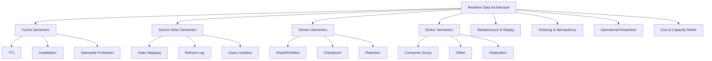

Target performa setelah part ini:

1. Kamu bisa membedakan kapan memakai cache, search, stream, queue, atau database.
2. Kamu bisa menjelaskan consistency semantics setiap jalur data.
3. Kamu bisa mendesain invalidation, replay, retry, deduplication, dan backpressure.
4. Kamu bisa membaca bottleneck dari metric, bukan dari intuisi semata.
5. Kamu bisa menghindari anti-pattern: “pakai Redis untuk semua”, “pakai OpenSearch sebagai database utama”, atau “pakai Kafka/Kinesis tanpa retention/replay plan”.

---

## 2. Mental Model: Realtime Bukan Berarti Instant

Realtime dalam sistem enterprise hampir selalu berarti:

> Data diproses cukup cepat untuk kebutuhan bisnis, dengan semantics eksplisit untuk delay, duplicate, out-of-order, partial failure, dan recovery.

Realtime bukan berarti semua operasi synchronous. Justru arsitektur realtime yang kuat sering menggunakan asynchronous pipeline agar sistem utama tetap stabil.

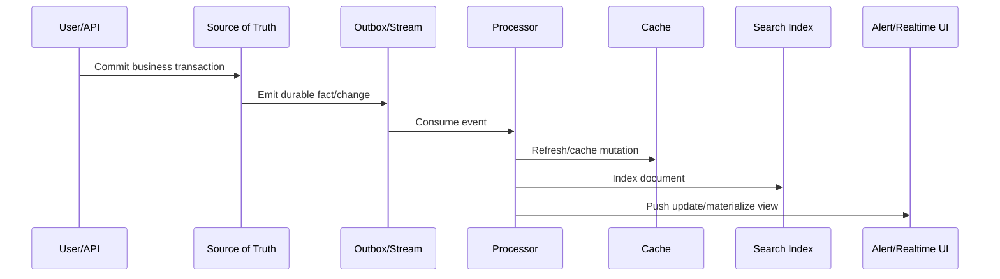

Kunci mental model:

- **Database** menyimpan truth.
- **Cache** menyimpan shortcut.
- **Search index** menyimpan retrieval view.
- **Stream** menyimpan ordered fact log dalam retention tertentu.
- **Realtime processor** mengubah fact menjadi derived state.

Jika derived state rusak, sistem harus bisa rebuild dari source of truth atau stream retention. Jika tidak bisa rebuild, derived state diam-diam sudah menjadi source of truth baru. Itu biasanya berbahaya.

---

## 3. Taxonomy: Cache vs Search vs Stream vs Queue vs Broker

| Komponen | Tujuan | Contoh AWS | Data Ownership | Failure Concern |
|---|---|---|---|---|
| Cache | Mempercepat read/repeated computation | ElastiCache for Valkey/Redis OSS/Memcached | Derived/temporary | stale data, eviction, stampede |
| Search index | Full-text/filter/faceted retrieval | Amazon OpenSearch Service | Derived/indexed | refresh lag, mapping explosion, shard pressure |
| Stream | Append-only event/fact movement | Kinesis Data Streams | Durable for retention window | shard hot spot, iterator age, replay storm |
| Kafka-compatible broker | Event log dengan ecosystem Kafka | Amazon MSK | Durable topic log | partition imbalance, consumer lag, rebalance, broker health |
| Queue | Work buffering and decoupling | SQS | Work item until consumed | poison message, retry storm, visibility timeout |
| Workflow | State machine orchestration | Step Functions | Workflow execution state | compensation, timeout, fanout limit |

Part ini fokus pada ElastiCache, OpenSearch, Kinesis, dan MSK. SQS/SNS/EventBridge/Step Functions sudah dibahas di Part 015.

---

## 4. Cache Architecture dengan Amazon ElastiCache

Amazon ElastiCache adalah managed in-memory data store/cache yang mendukung Valkey, Redis OSS, dan Memcached. Cara berpikirnya bukan “database cepat”, tetapi **ephemeral performance layer**.

### 4.1 Kapan Cache Dibenarkan

Cache layak dipakai jika minimal satu kondisi benar:

1. Data sering dibaca dan jarang berubah.
2. Query mahal di database utama.
3. Latency p95/p99 read path tidak memenuhi target.
4. Ada repeated computation yang bisa disimpan sementara.
5. Ada session/token/rate-limit state yang cocok TTL.
6. Ada fanout read tinggi yang membebani datastore utama.

Cache tidak layak jika:

- data harus selalu strongly consistent;
- invalidation lebih kompleks daripada query aslinya;
- miss penalty terlalu mahal dan tidak ada stampede control;
- data sensitif disimpan tanpa boundary jelas;
- cache dipakai untuk menyembunyikan schema/query design yang buruk.

### 4.2 Pattern Cache Utama

#### Cache-Aside / Lazy Loading

Aplikasi membaca cache dulu. Jika miss, aplikasi membaca database lalu mengisi cache.

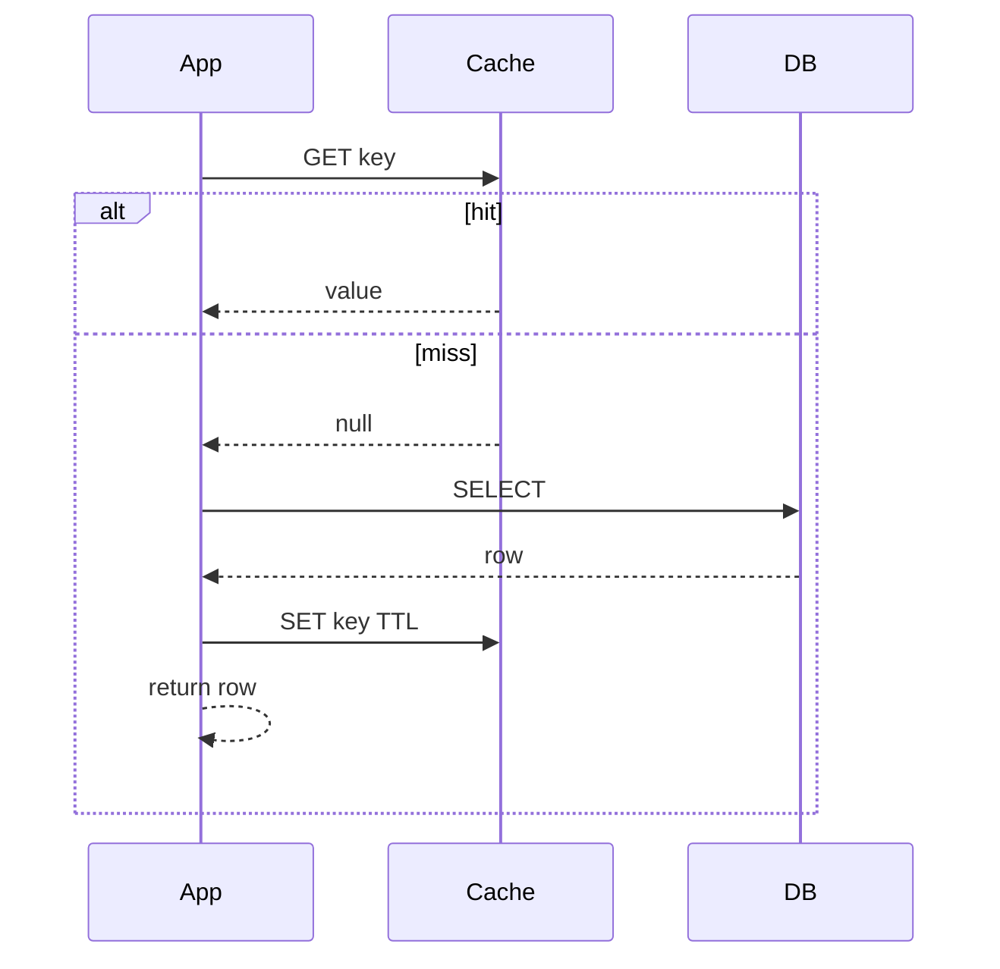

Kelebihan:

- sederhana;
- cache hanya berisi data yang dibaca;
- cache outage bisa fallback ke database.

Risiko:

- cache stampede saat key populer expire;
- stale data jika update tidak menghapus/memperbarui cache;
- miss burst bisa menekan database.

Mitigasi:

- TTL jitter;
- single-flight request coalescing;
- stale-while-revalidate;
- negative caching untuk miss valid;
- request rate limiting ke database.

#### Write-Through

Aplikasi menulis cache dan database dalam path yang sama.

Kelebihan:

- cache lebih sering hangat;
- read-after-write lebih mudah.

Risiko:

- write latency naik;
- partial failure perlu kompensasi;
- cache mulai terasa seperti source of truth.

#### Write-Behind / Async Refresh

Write masuk ke queue/stream, processor memperbarui cache setelah commit.

Cocok untuk derived view. Tidak cocok untuk transaksi yang membutuhkan immediate consistency.

---

## 5. Redis/Valkey vs Memcached Mental Model

| Aspek | Valkey/Redis OSS via ElastiCache | Memcached via ElastiCache |
|---|---|---|
| Struktur data | rich structures: string, hash, set, sorted set, stream, etc. | simple key-value object cache |
| Persistence-style capability | ada fitur snapshot/replication tergantung mode | bukan fokus utama |
| Use case | cache kompleks, leaderboard, distributed lock hati-hati, rate limit, pub/sub ringan | simple object cache skala horizontal |
| Operasional | lebih banyak fitur berarti lebih banyak semantics | lebih sederhana |
| Risiko | misuse sebagai database | key distribution dan eviction simplicity |

Untuk AWS engineer, keputusan bukan “Redis lebih bagus”. Pertanyaannya:

- Apakah struktur data Redis/Valkey memang dibutuhkan?
- Apakah organisasi mampu mengoperasikan semantics-nya?
- Apakah data boleh hilang?
- Apa yang terjadi saat failover?
- Bagaimana aplikasi bereaksi terhadap stale/missing value?

---

## 6. Cache Failure Modes

### 6.1 Stale Data

Penyebab:

- TTL terlalu panjang;
- update path lupa invalidate;
- event refresh gagal;
- processor lag.

Solusi:

- TTL berdasarkan business tolerance;
- versioned key;
- event-driven invalidation;
- cache entry berisi `lastUpdatedAt` atau version;
- fallback ke source of truth untuk operasi kritis.

### 6.2 Cache Stampede

Banyak request miss bersamaan pada key populer.

Mitigasi:

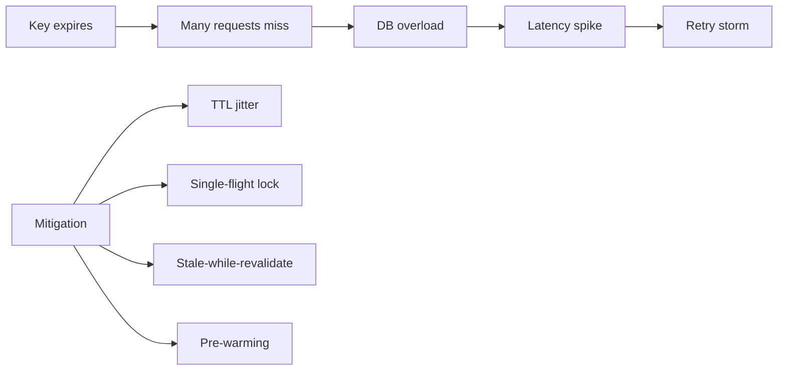

### 6.3 Hot Key

Satu key terlalu sering diakses dan membebani node/partition tertentu.

Mitigasi:

- local in-process cache untuk ultra-hot key;
- key sharding untuk counter/read hotspot;
- CloudFront/API cache jika data publik;
- redesign object granularity.

### 6.4 Eviction Surprise

Cache menghapus data karena memory pressure.

Mitigasi:

- treat cache as optional;
- monitor memory, evictions, hit ratio;
- TTL dan maxmemory policy dipahami;
- jangan menyimpan state yang tidak bisa direkonstruksi.

---

## 7. Search Architecture dengan Amazon OpenSearch Service

Search index bukan database utama. Search index adalah **query-optimized projection**.

OpenSearch cocok untuk:

- full-text search;
- faceted search/filtering;
- log analytics;
- approximate search experience;
- event/log exploration;
- search over denormalized documents.

OpenSearch tidak cocok sebagai:

- source of truth transaksi;
- sistem primary write untuk data bisnis penting;
- relational query engine;
- replacement untuk database consistency.

### 7.1 Index sebagai Materialized View

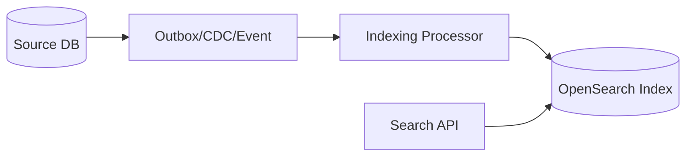

Konsekuensi:

- hasil search bisa tertinggal dari database;
- document harus bisa di-reindex;
- schema/index mapping harus dikelola seperti contract;
- delete/update harus punya event semantics jelas.

### 7.2 Document Modeling

Relational model menormalisasi. Search model sering men-denormalisasi.

Contoh domain case management:

```json
{
  "caseId": "CASE-2026-0001",
  "subjectName": "PT Example",
  "status": "UNDER_INVESTIGATION",
  "riskScore": 87,
  "assignedUnit": "Enforcement A",
  "violations": ["DISCLOSURE", "REPORTING"],
  "createdAt": "2026-07-01T08:10:00Z",
  "lastActivityAt": "2026-07-01T09:15:00Z"
}
```

Pertanyaan modeling:

- Query apa yang harus cepat?
- Field mana yang full-text, keyword, numeric, date?
- Apakah nested object diperlukan?
- Bagaimana sort by recent activity?
- Bagaimana authorization diterapkan: pre-filter, post-filter, index-per-tenant, field-level filtering?

### 7.3 Refresh Lag dan Consistency

Search index biasanya near-real-time, bukan immediate transactional read.

Design rule:

- Untuk “lihat detail setelah submit”, baca source database.
- Untuk “temukan kasus berdasarkan kata kunci”, baca OpenSearch.
- Untuk “status final yang legal/audit critical”, jangan bergantung pada index search.

### 7.4 OpenSearch Failure Modes

| Failure | Penyebab | Dampak | Mitigasi |
|---|---|---|---|
| Mapping explosion | dynamic field tidak dikontrol | memory/index pressure | explicit mapping, schema governance |
| Hot shard | routing/key tidak seimbang | latency naik | shard planning, routing review |
| Index bloat | retention buruk | cost/storage pressure | lifecycle policy, rollover |
| Slow query | wildcard/aggs berat | CPU/memory pressure | query guardrail, pagination limit |
| Stale result | indexing lag | user melihat data lama | expose freshness, fallback source DB |
| Partial indexing | processor gagal | missing documents | DLQ, replay, reindex job |

---

## 8. Streaming dengan Amazon Kinesis Data Streams

Kinesis Data Streams adalah service untuk ingest dan memproses data stream. Mental model utamanya:

> Stream adalah append-only sequence of records dengan partition key, shard, retention, consumer, checkpoint, dan replay.

### 8.1 Core Concepts

| Concept | Meaning |
|---|---|
| Stream | logical container untuk records |
| Record | data blob + partition key + sequence number |
| Partition key | menentukan shard placement |
| Shard | unit throughput dan ordering boundary |
| Retention | berapa lama record tersedia untuk dibaca ulang |
| Consumer | aplikasi yang membaca stream |
| Checkpoint | posisi baca consumer |
| Enhanced fan-out | dedicated read throughput per registered consumer |

### 8.2 Ordering Boundary

Kinesis memberikan ordering dalam shard, bukan global stream.

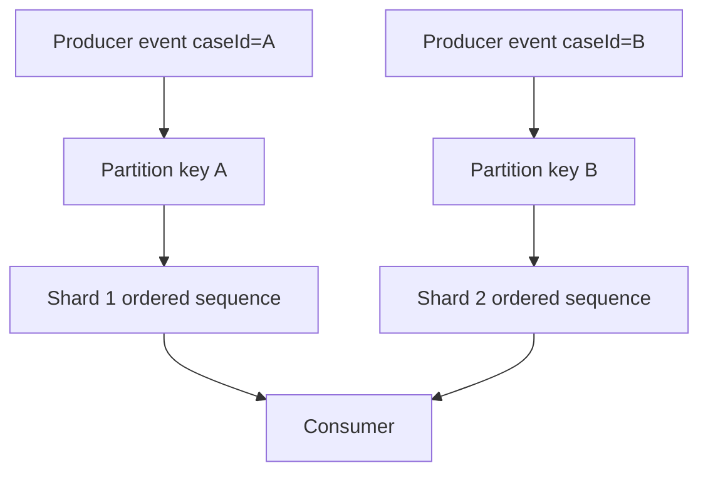

Jika ordering per case penting, gunakan `caseId` sebagai partition key. Jika throughput sangat tinggi pada satu case, key tersebut bisa jadi hot partition. Ini trade-off fundamental: **ordering vs distribution**.

### 8.3 Throughput dan Capacity

Kinesis design harus menjawab:

- ingest records per second;
- average/max record size;
- number of consumers;
- acceptable consumer lag;
- retention duration;
- replay strategy;
- shard scaling mode;
- poison record behavior.

Anti-pattern: membuat stream tanpa menghitung consumer lag dan replay capacity. Ketika consumer down 6 jam, apakah bisa mengejar backlog sebelum retention habis?

### 8.4 Consumer Lag dan Iterator Age

Consumer lag menunjukkan jarak antara record terbaru dan record yang sedang diproses. Dalam Kinesis, metric seperti iterator age sangat penting.

Interpretasi:

- iterator age naik pelan: consumer sedikit lebih lambat dari producer;
- iterator age naik cepat: consumer overwhelmed atau stuck;
- iterator age turun setelah scaling: backlog sedang dikejar;
- iterator age mendekati retention: risiko data hilang dari window baca.

### 8.5 Kinesis Failure Modes

| Failure | Penyebab | Mitigasi |
|---|---|---|
| Hot shard | partition key skew | key design, aggregation, salting hati-hati |
| Consumer lag | processing lambat | scale consumer, optimize batch, enhanced fan-out |
| Replay storm | consumer reset offset besar | rate-limited replay, isolate replay stream |
| Poison record | satu record selalu gagal | DLQ/manual quarantine |
| Duplicate processing | retry/checkpoint semantics | idempotent sink, deterministic event ID |
| Retention miss | consumer down terlalu lama | retention sizing, alert iterator age |

---

## 9. Streaming dengan Amazon MSK

Amazon MSK adalah managed Apache Kafka-compatible service. Pilih MSK jika kamu membutuhkan Kafka semantics/ecosystem, bukan hanya “streaming”.

MSK biasanya cocok jika:

- organisasi sudah punya Kafka clients/connectors;
- membutuhkan Kafka topic/partition/consumer group semantics;
- butuh ecosystem Kafka Streams, Kafka Connect, MirrorMaker-style patterns;
- banyak producer/consumer lintas domain;
- event log adalah strategic platform primitive.

Kinesis sering lebih sederhana untuk AWS-native ingestion dan Lambda/serverless integration. MSK memberi kontrol dan ecosystem lebih luas, tetapi operational surface lebih besar.

### 9.1 Kafka/MSK Mental Model

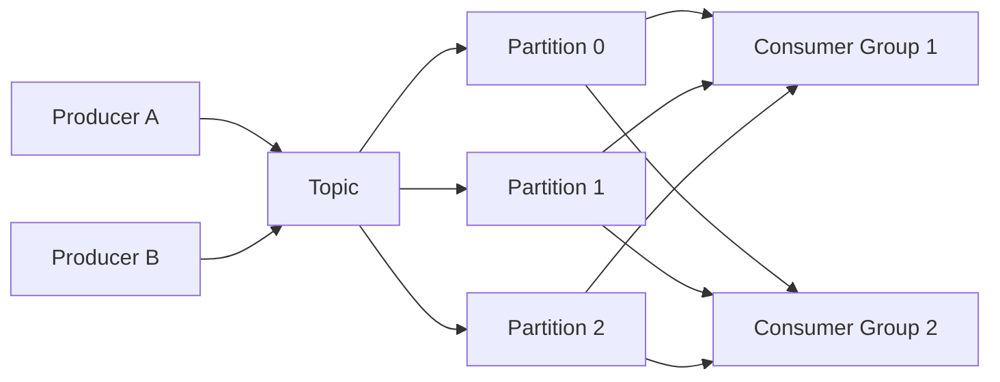

Core idea:

- topic adalah logical event log;
- partition adalah ordering dan parallelism unit;
- consumer group membagi partition antar consumer;
- offset menentukan posisi baca;
- retention menentukan replay window;
- replication menjaga durability/availability;
- schema registry/contract governance menjaga evolusi event.

### 9.2 Kinesis vs MSK Decision Matrix

| Pertanyaan | Condong ke Kinesis | Condong ke MSK |
|---|---|---|
| AWS-native serverless integration penting? | Ya | Bisa, tapi lebih banyak plumbing |
| Team ingin operational surface minimal? | Ya | Tidak selalu |
| Kafka ecosystem wajib? | Tidak | Ya |
| Banyak existing Kafka client? | Tidak | Ya |
| Need custom Kafka semantics/tools? | Tidak | Ya |
| Simpler stream ingestion cukup? | Ya | Mungkin overkill |
| Platform event backbone enterprise? | Mungkin | Sering ya |

### 9.3 MSK Failure Modes

| Failure | Penyebab | Dampak | Mitigasi |
|---|---|---|---|
| Consumer lag | consumer lambat/rebalance sering | delayed downstream state | lag alert, scale, partition count review |
| Partition imbalance | key skew | hot broker/partition | partition key design |
| Under-replication | broker/storage/network issue | durability/availability risk | broker health alarms |
| Rebalance storm | unstable consumer group | processing delay | session config, graceful shutdown |
| Retention overflow | backlog lebih lama dari retention | data tidak bisa replay | retention sizing, lag alerts |
| Schema break | incompatible event change | consumer failure | schema governance, compatibility checks |

---

## 10. Backpressure: Sinyal Bahwa Sistem Tidak Stabil

Backpressure adalah kondisi ketika downstream tidak mampu mengikuti upstream.

Top-tier engineer tidak hanya menambah worker. Ia bertanya:

1. Apakah bottleneck di CPU, IO, network, lock, dependency, atau quota?
2. Apakah workload bisa diparalelkan tanpa merusak ordering?
3. Apakah sink idempotent?
4. Apakah retry memperburuk beban?
5. Apakah perlu drop, sample, degrade, atau buffer?
6. Apakah backlog masih dalam retention window?

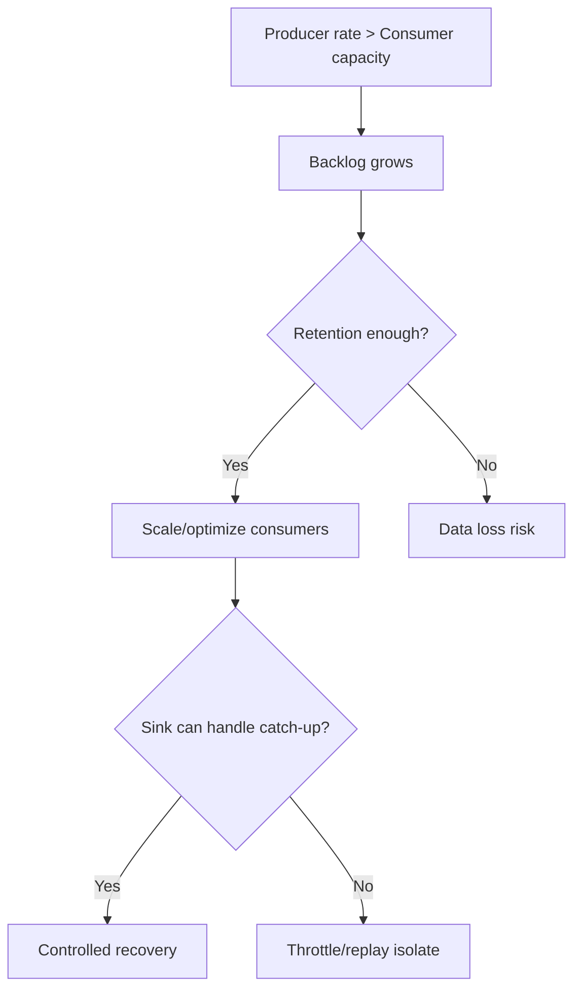

Backpressure harus punya explicit policy:

- throttle producer;
- buffer temporarily;
- shed non-critical load;
- route to DLQ/quarantine;
- degrade UI freshness;
- split stream/topic;
- scale consumer;
- increase retention.

---

## 11. Idempotency dan Deduplication

Realtime pipeline harus menganggap duplicate mungkin terjadi.

Idempotency strategy:

- setiap event punya stable `eventId`;
- sink menyimpan processed event ID atau version;
- update memakai conditional write;
- derived state dihitung deterministic;
- command dan event dibedakan;
- replay tidak menggandakan side effect.

Contoh event envelope:

```json
{
  "eventId": "01J0ABCDEF123456789",
  "eventType": "CaseStatusChanged",
  "aggregateType": "Case",
  "aggregateId": "CASE-2026-0001",
  "aggregateVersion": 17,
  "occurredAt": "2026-07-01T09:10:00Z",
  "producer": "case-service",
  "schemaVersion": 3,
  "payload": {
    "from": "OPEN",
    "to": "UNDER_INVESTIGATION"
  }
}
```

Rules:

- `eventId` untuk dedupe;
- `aggregateId + aggregateVersion` untuk ordering per aggregate;
- `schemaVersion` untuk compatibility;
- `occurredAt` untuk event time;
- ingestion timestamp untuk processing time.

---

## 12. Rebuild dan Replay Strategy

Derived systems harus bisa direbuild.

| Derived System | Rebuild Source | Common Strategy |
|---|---|---|
| Cache | DB/source API | warm lazily atau bulk prewarm |
| Search index | DB + event stream | full reindex + delta catch-up |
| Realtime materialized view | event log | replay from checkpoint |
| Aggregates | raw event stream/lake | batch recompute + switch alias |

OpenSearch rebuild pattern:

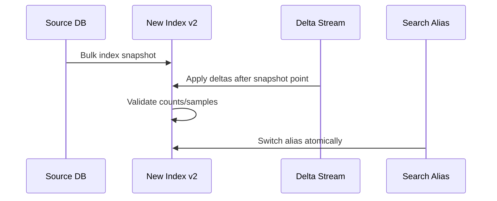

Cache rebuild pattern:

- jangan rebuild semua jika tidak perlu;
- prioritaskan hot keys;
- gunakan traffic-driven warming;
- jangan membanjiri DB saat cache kosong;
- siapkan degraded mode.

Stream replay pattern:

- replay di consumer group terpisah;
- throttle replay;
- pastikan sink idempotent;
- bedakan replay side effect dan live side effect;
- audit offset dan checkpoint.

---

## 13. Security Design

### 13.1 Cache Security

Checklist:

- gunakan private subnet;
- batasi security group ke aplikasi yang perlu;
- enkripsi in transit/at rest sesuai service capability;
- jangan simpan secret mentah tanpa alasan kuat;
- TTL untuk session/rate-limit state;
- pisahkan cache domain sensitif;
- audit akses administratif.

### 13.2 OpenSearch Security

Checklist:

- VPC access untuk domain internal;
- fine-grained access control jika perlu;
- IAM/domain policy jelas;
- encrypt at rest dan node-to-node encryption;
- index-level/field-level security sesuai kebutuhan;
- jangan expose dashboard publik;
- sanitasi query user untuk mencegah query abuse.

### 13.3 Stream Security

Checklist:

- IAM producer/consumer least privilege;
- encryption at rest;
- private connectivity jika workload internal;
- schema tidak membawa data sensitif yang tidak perlu;
- audit read access karena stream sering membawa raw event;
- retention sesuai data classification.

---

## 14. Observability Model

### 14.1 Cache Metrics

Monitor:

- hit ratio;
- miss count;
- evictions;
- memory usage;
- CPU;
- connection count;
- replication lag;
- command latency;
- failover events.

Interpretasi:

- hit ratio tinggi belum tentu sehat jika data stale;
- evictions naik berarti capacity/TTL/key design perlu dievaluasi;
- connection spike bisa berarti client pooling buruk;
- failover harus diuji dari sisi client behavior.

### 14.2 OpenSearch Metrics

Monitor:

- cluster health;
- JVM/memory pressure;
- CPU;
- search latency;
- indexing latency;
- rejected requests;
- shard count/size;
- storage usage;
- refresh/indexing pressure.

Interpretasi:

- shard terlalu banyak memperberat cluster;
- query lambat bisa berasal dari mapping/query design;
- indexing lag berarti search freshness turun;
- rejected requests adalah sinyal overload nyata.

### 14.3 Stream Metrics

Monitor:

- incoming records/bytes;
- write throttles;
- read throttles;
- iterator age/consumer lag;
- processing errors;
- retry count;
- DLQ/quarantine volume;
- checkpoint age.

Interpretasi:

- consumer lag adalah alarm bisnis, bukan hanya teknis;
- throttling producer berarti partition/capacity salah;
- DLQ naik berarti data contract atau dependency downstream bermasalah.

---

## 15. Cost Model

| Component | Cost Driver | Cost Mistake |
|---|---|---|
| ElastiCache | node/serverless usage, memory, data transfer, backup | cache terlalu besar karena TTL buruk |
| OpenSearch | instance/node, storage, UltraWarm/cold tier, query/index load | shard/index tidak dikelola |
| Kinesis | shard/provisioned or on-demand throughput, retention, enhanced fan-out | retention dan consumers tidak dihitung |
| MSK | broker, storage, data transfer, connector, monitoring | memilih Kafka padahal workload simple |

Cost rule:

> Cost realtime system harus dihitung per business event, bukan hanya per service.

Contoh unit economics:

```txt
cost_per_case_event =
  stream_ingest_cost
+ consumer_compute_cost
+ search_index_write_cost
+ cache_refresh_cost
+ observability_cost
+ replay/storage_retention_cost
```

---

## 16. Decision Framework

Gunakan pertanyaan ini sebelum memilih service:

1. Apakah data ini source of truth atau projection?
2. Apakah kehilangan data dapat diterima?
3. Apakah ordering diperlukan? Global atau per aggregate?
4. Berapa freshness SLA?
5. Apakah duplicate event bisa terjadi?
6. Apakah replay diperlukan? Berapa lama retention?
7. Apa sink downstream, dan apakah sink idempotent?
8. Apakah query pattern read-heavy, search-heavy, atau stream-heavy?
9. Apakah team mampu mengoperasikan Kafka/OpenSearch/cache semantics?
10. Bagaimana data sensitif dikontrol?
11. Bagaimana sistem degrade jika komponen unavailable?
12. Bagaimana biaya tumbuh saat event volume 10x?

---

## 17. Reference Architectures

### 17.1 Case Management Search Projection

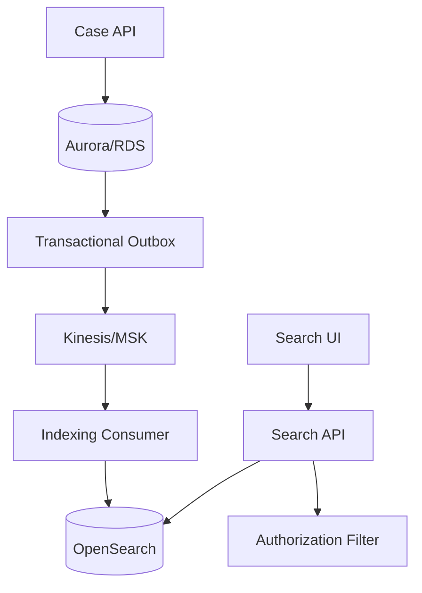

Engineering notes:

- detail page tetap baca DB;
- search page baca OpenSearch;
- event outbox menjaga consistency antara commit dan indexing;
- reindex job bisa rebuild dari DB;
- authorization jangan hanya mengandalkan UI.

### 17.2 Realtime Dashboard

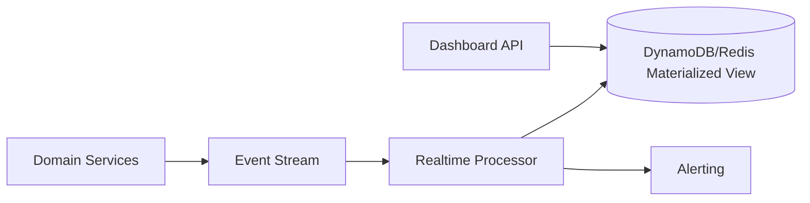

Engineering notes:

- dashboard freshness harus eksplisit;
- processor harus idempotent;
- materialized view harus rebuildable;
- alert harus punya dedupe dan suppression.

### 17.3 Cache-Accelerated Read Path

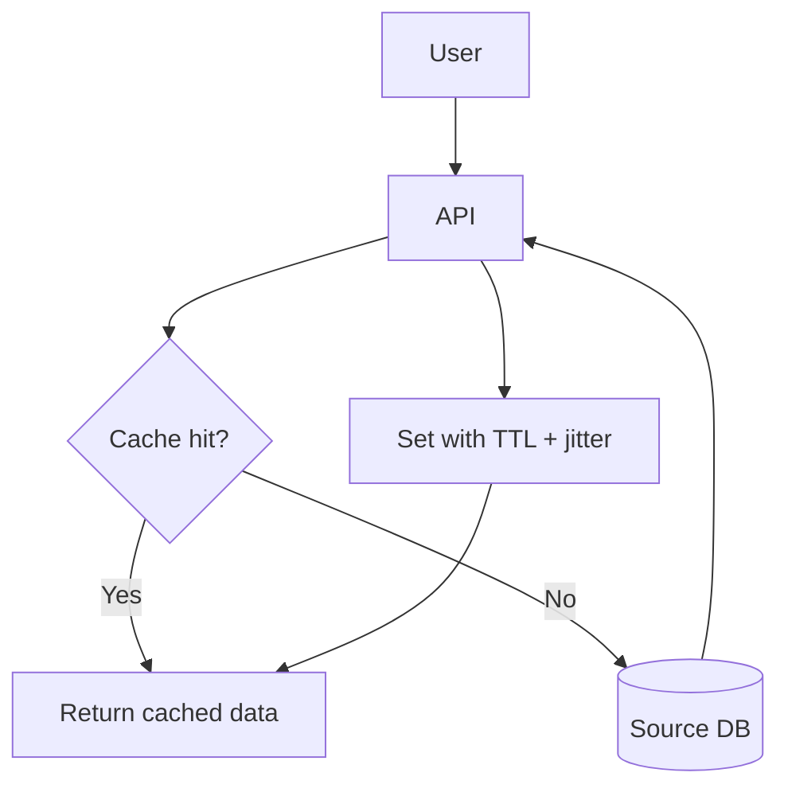

Engineering notes:

- cache miss tidak boleh menjatuhkan database;
- TTL harus sesuai business tolerance;
- hot key perlu protection;
- stale data harus diterima atau dicegah eksplisit.

---

## 18. Anti-Pattern

### 18.1 OpenSearch sebagai Database Utama

Gejala:

- business transaction ditulis langsung ke OpenSearch;
- tidak ada source of truth lain;
- update/delete semantics tidak audit-friendly;
- hasil search dianggap legal truth.

Akibat:

- consistency rapuh;
- recovery sulit;
- auditability buruk;
- schema evolution menyakitkan.

### 18.2 Redis sebagai Distributed Database Tanpa Recovery Plan

Gejala:

- cache menyimpan state penting;
- TTL tidak jelas;
- backup/rebuild tidak diuji;
- aplikasi gagal total saat cache hilang.

### 18.3 Stream Tanpa Idempotency

Gejala:

- consumer update database tanpa dedupe;
- retry menggandakan side effect;
- replay mustahil dilakukan aman.

### 18.4 Kafka/MSK karena “Enterprise Standard”

Gejala:

- volume kecil;
- consumer sedikit;
- tidak butuh Kafka ecosystem;
- team tidak punya operational skill.

Akibat:

- platform mahal;
- failure mode kompleks;
- delivery lambat.

---

## 19. Deliberate Practice

### Latihan 1 — Cache Read Path

Desain cache untuk endpoint:

```txt
GET /cases/{caseId}/summary
p95 target: 80ms
source DB p95: 180ms
update frequency: low-medium
staleness tolerance: 30 seconds
```

Deliverable:

- key design;
- TTL;
- invalidation strategy;
- stampede protection;
- fallback behavior;
- metrics dan alarm.

### Latihan 2 — Search Projection

Desain OpenSearch projection untuk regulatory case search:

- filter by status, risk score, assigned unit;
- full-text search by subject name and allegation summary;
- result freshness target < 60 seconds;
- authorization by unit and role;
- reindex capability required.

Deliverable:

- document model;
- indexing pipeline;
- reindex strategy;
- auth filtering;
- failure handling.

### Latihan 3 — Stream Processor

Desain stream untuk event `CaseStatusChanged`:

- 2,000 events/sec peak;
- ordering required per case;
- dashboard freshness < 10 seconds;
- replay 7 days;
- downstream DynamoDB view.

Deliverable:

- partition key;
- capacity assumptions;
- consumer model;
- idempotency strategy;
- DLQ/quarantine;
- lag alarms.

---

## 20. Checklist Self-Correction

Sebelum menyatakan desain realtime-mu production-ready, jawab:

- [ ] Apa source of truth?
- [ ] Apa yang derived/rebuildable?
- [ ] Apa consistency promise ke user?
- [ ] Apa ordering boundary?
- [ ] Apakah duplicate event aman?
- [ ] Apakah replay aman?
- [ ] Apakah retention cukup untuk recovery?
- [ ] Apa yang terjadi saat cache kosong?
- [ ] Apa yang terjadi saat OpenSearch tertinggal?
- [ ] Apa yang terjadi saat consumer down 6 jam?
- [ ] Apa yang terjadi saat downstream lambat?
- [ ] Apa data sensitif yang melewati stream/index/cache?
- [ ] Apa metric utama untuk freshness?
- [ ] Apa unit cost per event/query?

---

## 21. Ringkasan Engineering Judgment

Cache, search, dan streaming adalah accelerator dan projection layer. Mereka membuat sistem cepat dan responsif, tetapi juga menambah consistency surface.

Engineer top-tier tidak bertanya “pakai Redis atau OpenSearch atau Kafka?”. Ia bertanya:

- invariant apa yang harus dijaga?
- read/write pattern mana yang perlu dioptimalkan?
- data mana yang source of truth?
- apakah derived state bisa direbuild?
- apakah duplicate/out-of-order/stale data aman?
- bagaimana sistem pulih saat backlog, failover, atau reindex?

Keputusan AWS yang kuat bukan sekadar memilih managed service. Keputusan yang kuat adalah memilih semantics yang benar, lalu mendesain failure handling, observability, security, dan cost model sejak awal.

---

## 22. Referensi Resmi

- Amazon ElastiCache Documentation: https://docs.aws.amazon.com/AmazonElastiCache/latest/dg/WhatIs.html
- Amazon ElastiCache use cases: https://docs.aws.amazon.com/AmazonElastiCache/latest/dg/elasticache-use-cases.html
- Amazon OpenSearch Service Developer Guide: https://docs.aws.amazon.com/opensearch-service/latest/developerguide/what-is.html
- Amazon Kinesis Data Streams Developer Guide: https://docs.aws.amazon.com/streams/latest/dev/introduction.html
- Kinesis Data Streams concepts: https://docs.aws.amazon.com/streams/latest/dev/key-concepts.html
- Kinesis enhanced fan-out consumers: https://docs.aws.amazon.com/streams/latest/dev/enhanced-consumers.html
- Kinesis retention: https://docs.aws.amazon.com/streams/latest/dev/kinesis-extended-retention.html
- Amazon MSK Developer Guide: https://docs.aws.amazon.com/msk/latest/developerguide/what-is-msk.html
