------
title: Learn AWS Engineering Mastery - Part 020
description: Data lake, analytics, and governance architecture on AWS: S3 lake foundation, Glue Data Catalog, Athena, Redshift, Lake Formation, table formats, partitioning, access control, lineage, quality, and regulatory defensibility.
series: learn-aws
seriesTitle: Learn AWS Engineering Mastery
order: 20
partTitle: Data Lake, Analytics, and Governance on AWS
tags:
- aws
- cloud
- architecture
- data-lake
- analytics
- governance
- s3
- glue
- athena
- redshift
- lake-formation
date: 2026-07-01
---

# Part 020 — Data Lake, Analytics, and Governance on AWS

> Target part ini: kamu mampu mendesain data lake dan analytical platform di AWS yang bukan hanya “taruh file di S3”, tetapi punya ingestion boundary, catalog, partitioning, quality control, governance, auditability, access model, dan cost discipline.

Part 019 membahas jalur realtime dan low-latency. Part ini membahas sisi analytical: data lake, query engine, warehouse, catalog, dan governance.

Banyak organisasi gagal membangun data lake karena salah mental model. Mereka membuat “data swamp”: bucket S3 besar berisi file tidak jelas, ownership tidak jelas, schema tidak jelas, permission tidak jelas, dan query mahal.

AWS engineer yang kuat melihat data lake sebagai **governed analytical operating system**:

- S3 sebagai durable storage layer;
- Glue Data Catalog sebagai metadata layer;
- Lake Formation sebagai governance/access layer;
- Athena/Redshift/EMR/Glue sebagai compute/query layer;
- ingestion pipeline sebagai data contract boundary;
- quality/lineage/audit sebagai defensibility layer.

---

## 1. Skill Map ala Kaufman

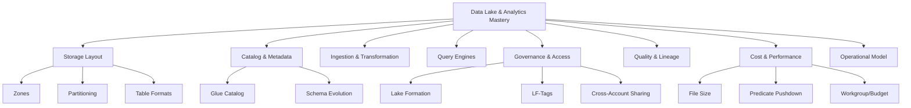

Target performa setelah part ini:

1. Kamu bisa membedakan data lake, data warehouse, lakehouse, dan operational datastore.
2. Kamu bisa mendesain S3 zone layout yang stabil.
3. Kamu bisa menjelaskan kenapa catalog dan governance sama pentingnya dengan storage.
4. Kamu bisa memilih Athena, Redshift, Glue, EMR, atau service lain berdasarkan workload.
5. Kamu bisa mendesain permission model yang audit-friendly.
6. Kamu bisa menghindari data swamp.

---

## 2. Mental Model: Data Lake Bukan Bucket, Melainkan Contracted Analytical System

Data lake yang benar memiliki minimal enam layer:

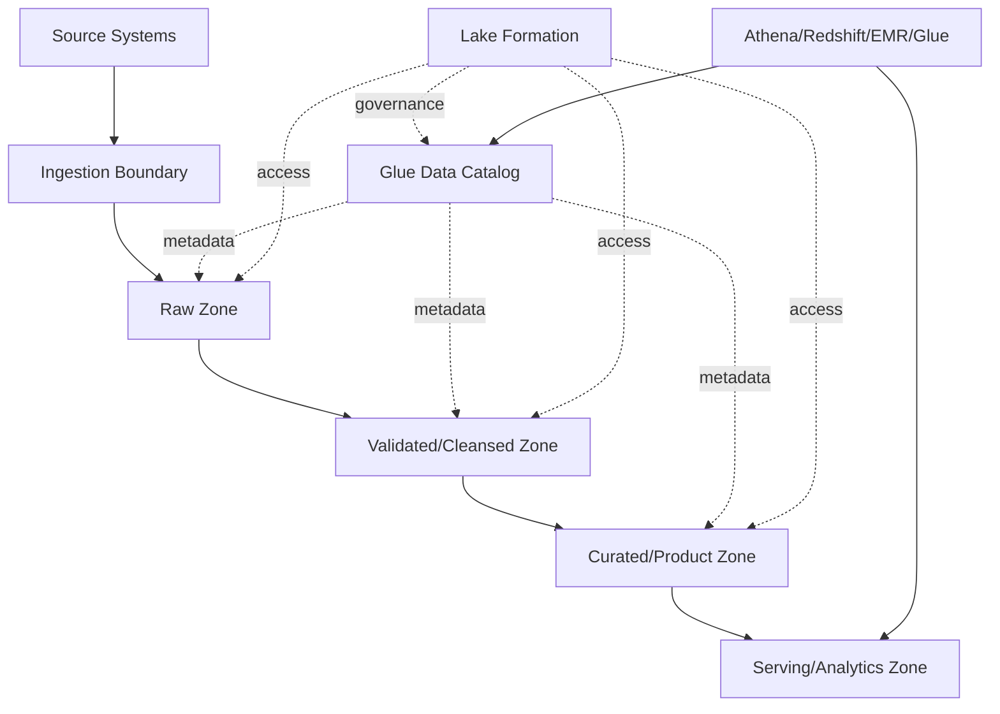

Jika hanya ada S3 bucket tanpa catalog, owner, quality, dan access control, itu bukan data lake production. Itu hanya object storage.

---

## 3. Data Lake vs Data Warehouse vs Lakehouse

| Model | Kekuatan | Kelemahan | AWS Building Blocks |
|---|---|---|---|
| Data lake | murah, fleksibel, raw + curated, banyak format | governance dan quality harus disiplin | S3, Glue, Lake Formation, Athena, EMR |
| Data warehouse | SQL analytics kuat, performance predictable | lebih rigid, cost untuk loaded/managed data | Redshift, Redshift Serverless |
| Lakehouse | table semantics di lake, ACID-style table ops tergantung format | lebih kompleks secara governance/ops | S3 + Glue Catalog + table formats + Athena/EMR/Glue/Redshift Spectrum |
| Operational datastore | transaksi aplikasi | bukan untuk broad analytics | RDS/Aurora/DynamoDB |

Rule penting:

> Jangan memaksa operational database menjadi analytical platform. Jangan juga memaksa data lake menjadi transactional system aplikasi.

---

## 4. S3 sebagai Foundation Data Lake

S3 cocok sebagai foundation karena durability, scale, lifecycle, eventing, encryption, dan ecosystem analytics. Namun S3 bukan database: key layout, file size, partitioning, consistency expectations, permission, dan lifecycle tetap harus dirancang.

### 4.1 Zone Layout

Contoh struktur:

```txt
s3://org-data-lake-prod/
  raw/
    source=case-service/
      entity=case/
        ingestion_date=2026-07-01/
  validated/
    domain=enforcement/
      entity=case/
        dt=2026-07-01/
  curated/
    product=case360/
      table=case_summary/
        dt=2026-07-01/
  sandbox/
    team=risk-analytics/
  quarantine/
    source=case-service/
      reason=schema-invalid/
```

Zone semantics:

| Zone | Purpose | Mutability | Access |
|---|---|---|---|
| raw | immutable source capture | append-only preferred | restricted |
| validated | parsed, schema-checked, normalized | controlled overwrite/append | data engineering |
| curated | business-ready data products | managed lifecycle | analysts/apps |
| sandbox | experimentation | time-limited | limited |
| quarantine | invalid/suspicious data | restricted | platform/data quality team |

### 4.2 Bucket vs Prefix Strategy

Jangan otomatis membuat bucket per dataset. Pertimbangkan:

- account boundary;
- data classification;
- lifecycle policy;
- replication requirement;
- access model;
- ownership;
- operational blast radius.

Pattern umum enterprise:

- separate account untuk data lake foundation;
- separate bucket untuk environment/classification besar;
- prefix untuk domain/source/entity;
- Lake Formation untuk table-level governance;
- S3 bucket policy untuk coarse-grained boundary.

---

## 5. File Format dan Partitioning

### 5.1 File Format

| Format | Cocok Untuk | Catatan |
|---|---|---|
| JSON | raw event capture, interoperability | mahal untuk scan besar, schema loose |
| CSV | simple exports | tidak ideal untuk nested/schema evolution |
| Parquet | analytical columnar query | umum untuk Athena/Redshift Spectrum/Glue |
| ORC | columnar analytics | juga kuat, tergantung ecosystem |
| Avro | row-oriented with schema | cocok untuk streaming/serialization tertentu |

Untuk analytics skala besar, Parquet/ORC sering lebih efisien karena columnar storage dan predicate pushdown.

### 5.2 Partitioning

Partitioning mempercepat query jika sesuai filter pattern. Partitioning buruk memperbanyak small files dan metadata overhead.

Contoh baik:

```txt
s3://lake/curated/product=case360/table=case_events/dt=2026-07-01/hour=09/
```

Contoh berisiko:

```txt
s3://lake/table=case_events/caseId=CASE-2026-0000001/
```

Kenapa berisiko? Karena high-cardinality partition seperti `caseId` bisa membuat partition explosion.

### 5.3 Small Files Problem

Small files membuat query engine membuka terlalu banyak object kecil. Ini meningkatkan overhead dan cost.

Mitigasi:

- compact files;
- target file size sesuai engine/workload;
- batch micro-files dari streaming ingestion;
- gunakan table maintenance job;
- hindari partition terlalu granular.

---

## 6. AWS Glue Data Catalog

AWS Glue Data Catalog adalah metadata catalog untuk database/table/schema/location yang digunakan oleh banyak layanan analytics AWS.

Tanpa catalog yang baik, data lake sulit ditemukan, sulit dikontrol, dan sulit diaudit.

### 6.1 Catalog as Contract

Table metadata harus menjawab:

- data ini milik domain siapa?
- schema apa yang berlaku?
- lokasi S3 mana yang menjadi table location?
- partition key apa?
- format file apa?
- freshness berapa?
- classification apa?
- retention berapa?
- siapa boleh query?
- data quality rule apa?

Contoh metadata contract:

```yaml
name: case_summary
owner: enforcement-platform
classification: confidential
grain: one row per case
freshness_sla: 15 minutes
format: parquet
partitioning:
  - dt
primary_filters:
  - status
  - assigned_unit
  - risk_score
pii_fields:
  - subject_name
  - officer_notes
retention: 7 years
```

### 6.2 Crawler vs Explicit Schema

Glue crawler berguna untuk discovery, tetapi production table sering lebih aman memakai schema eksplisit.

| Approach | Kelebihan | Risiko |
|---|---|---|
| Crawler | cepat discovery | schema drift tidak terkontrol |
| Explicit schema | contract jelas | butuh discipline IaC/pipeline |
| Hybrid | crawler untuk raw, explicit untuk curated | governance lebih kompleks |

Rule:

> Raw zone boleh lebih fleksibel. Curated zone harus contract-driven.

---

## 7. AWS Lake Formation Governance

AWS Lake Formation memberi governance layer untuk data lake: registration lokasi S3, permission pada Data Catalog resources, fine-grained access, dan integrasi dengan layanan analytics seperti Athena, Glue, Redshift Spectrum, dan EMR.

### 7.1 Why Lake Formation Exists

Tanpa Lake Formation, kontrol akses data lake sering tersebar:

- IAM policy;
- S3 bucket policy;
- KMS key policy;
- Glue Catalog policy;
- query engine permission;
- application-level filtering.

Akibatnya permission menjadi sulit dipahami dan sulit diaudit. Lake Formation membantu memusatkan permission pada database/table/column/tag layer untuk integrated analytics services.

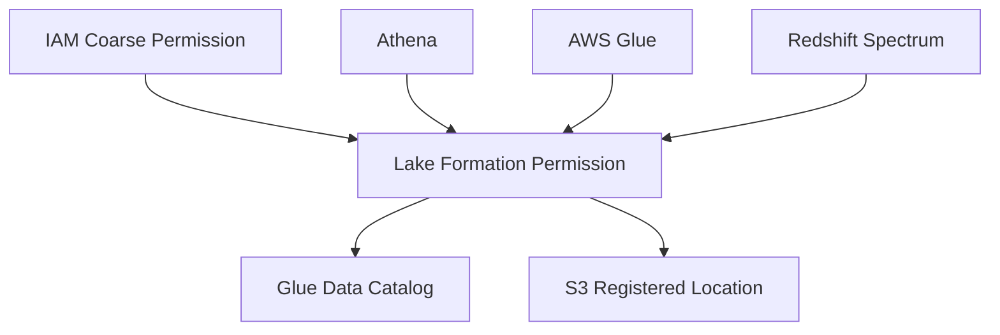

### 7.2 Permission Layers

Akses data lake biasanya perlu beberapa layer:

1. IAM permission untuk memanggil service/API.
2. Lake Formation permission untuk database/table/column/tag.
3. S3/KMS access sesuai integration model.
4. Network/private endpoint control jika private analytics path.
5. Query workgroup/resource control.

Jangan menganggap satu permission layer cukup untuk seluruh risiko.

### 7.3 LF-Tags

LF-Tag Based Access Control berguna saat dataset banyak dan permission berbasis classification/domain.

Contoh:

```txt
LF-Tag: classification=public|internal|confidential|restricted
LF-Tag: domain=enforcement|licensing|risk|finance
LF-Tag: pii=true|false
```

Policy style:

- analyst risk boleh baca `domain=risk` dan `classification<=confidential`;
- investigator hanya boleh baca curated enforcement tables tertentu;
- sandbox tidak boleh mengakses restricted PII;
- service account hanya boleh menulis ke curated table miliknya.

---

## 8. Athena Query Architecture

Amazon Athena adalah query service serverless untuk menganalisis data menggunakan SQL, umumnya terhadap data di S3 dan metadata di Glue Data Catalog.

Athena cocok untuk:

- ad-hoc SQL atas S3;
- exploratory analytics;
- validation query;
- lightweight BI;
- data lake query tanpa mengelola cluster.

Athena kurang cocok untuk:

- high-concurrency low-latency app serving;
- transactional updates;
- query tanpa partitioning/file design;
- workload yang butuh warehouse performance predictable.

### 8.1 Athena Workgroup

Gunakan workgroup untuk:

- memisahkan team/workload;
- mengatur query result location;
- membatasi data scanned;
- tracking cost;
- enforcing settings.

### 8.2 Query Cost Discipline

Athena sering dikenakan biaya berdasarkan data scanned. Cost turun jika:

- format columnar;
- compression;
- partition pruning;
- projection/predicate pushdown;
- hanya select kolom yang dibutuhkan;
- file size sehat;
- query result reuse jika sesuai.

Anti-pattern:

```sql
SELECT * FROM raw_events;
```

Lebih baik:

```sql
SELECT case_id, status, risk_score
FROM curated_case_summary
WHERE dt = DATE '2026-07-01'
  AND assigned_unit = 'Enforcement A'
  AND risk_score >= 80;
```

---

## 9. Redshift Architecture

Amazon Redshift adalah data warehouse service untuk analytical query yang lebih terstruktur dan sering dipakai untuk BI/reporting dengan performance lebih predictable.

Pilih Redshift jika:

- workload SQL analytics berat;
- banyak dashboard/BI query;
- perlu data warehouse modeling;
- concurrency dan performance lebih penting;
- query berulang dan curated.

Pilih Athena jika:

- ad-hoc query langsung ke lake;
- workload sporadis;
- tidak ingin mengelola warehouse capacity;
- data masih banyak di S3.

### 9.1 Redshift Spectrum

Redshift Spectrum memungkinkan query data di S3 tanpa memuatnya ke table lokal Redshift. Ini berguna untuk menggabungkan warehouse data dan lake data, tetapi tetap perlu partitioning, format, dan governance yang benar.

### 9.2 Warehouse vs Lake Boundary

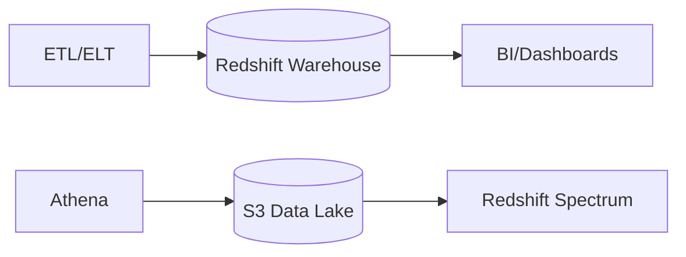

Rule:

- data lake menyimpan breadth dan raw/curated history;
- warehouse menyimpan optimized analytical model;
- jangan semua data otomatis diload ke warehouse;
- jangan semua dashboard berat dipaksa scan raw lake.

---

## 10. AWS Glue ETL dan Data Integration

AWS Glue adalah serverless data integration service untuk discovery, preparation, movement, dan integration data dari berbagai sumber. Di data lake, Glue sering dipakai untuk:

- ETL/ELT job;
- schema discovery;
- Data Catalog management;
- Spark-based transformations;
- workflow orchestration sederhana;
- quality/data ops tooling.

### 10.1 Transformation Boundary

Pisahkan transformasi:

| Stage | Responsibility |
|---|---|
| Ingest | capture data as-is dengan minimal mutation |
| Validate | schema check, type conversion, quarantine invalid |
| Cleanse | normalization, deduplication, standardization |
| Curate | business model, joins, enrichment, data product |
| Serve | optimized layout untuk BI/API/ML |

### 10.2 Quarantine Pattern

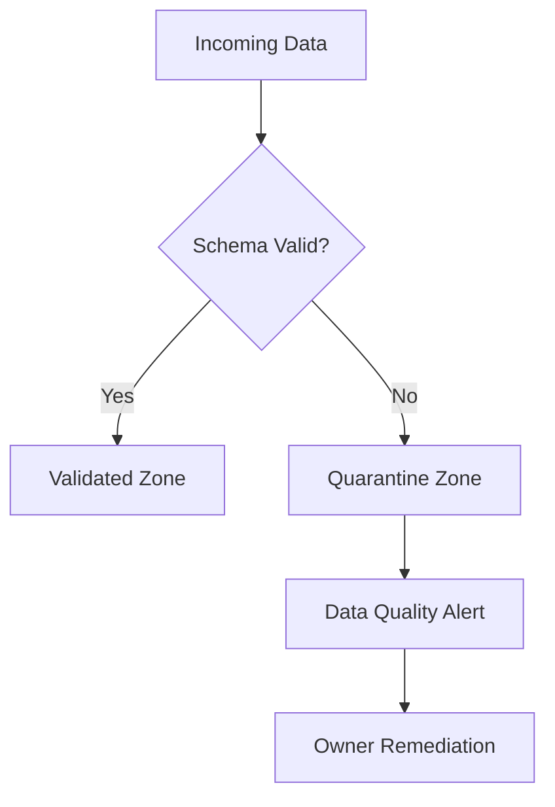

Quarantine bukan tempat sampah. Quarantine adalah controlled recovery path agar invalid data tidak merusak curated datasets.

---

## 11. Ingestion Patterns

### 11.1 Batch Ingestion

Cocok untuk:

- daily exports;
- historical loads;
- report snapshots;
- low-frequency source.

Risiko:

- late arriving data;
- duplicate files;
- partial delivery;
- schema drift;
- rerun idempotency.

### 11.2 Streaming Ingestion

Cocok untuk:

- event logs;
- audit events;
- near-realtime dashboard;
- CDC pipeline.

Risiko:

- small files;
- ordering assumptions;
- duplicate events;
- consumer lag;
- schema evolution.

### 11.3 CDC Ingestion

CDC dari operational database perlu hati-hati:

- transaction ordering;
- schema changes;
- delete semantics;
- replay;
- snapshot + log position;
- PII handling;
- load on source DB.

Pattern umum:

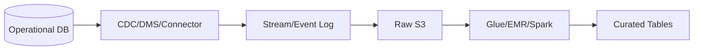

---

## 12. Table Formats dan Lakehouse Concern

Modern lake sering memakai table format untuk memberi metadata, schema evolution, partition evolution, snapshot, dan transactional table operations tergantung engine/support.

Contoh table format yang umum di ecosystem data lake:

- Apache Iceberg;
- Apache Hudi;
- Delta Lake.

Dalam AWS design, pertanyaan penting bukan hanya “format mana populer”, tetapi:

- engine AWS mana yang mendukung format tersebut untuk operasi yang kamu butuhkan?
- bagaimana permission Lake Formation berlaku?
- bagaimana compaction dilakukan?
- bagaimana snapshot cleanup dilakukan?
- bagaimana schema evolution dikontrol?
- bagaimana rollback dilakukan?
- bagaimana cross-account sharing bekerja?

---

## 13. Data Quality

Data quality harus menjadi pipeline invariant, bukan pekerjaan manual analyst.

Quality dimensions:

| Dimension | Contoh Rule |
|---|---|
| Completeness | `case_id` tidak null |
| Validity | `status` dalam enum valid |
| Uniqueness | satu `case_id` per snapshot |
| Consistency | `closed_at >= opened_at` |
| Timeliness | partition hari ini tersedia sebelum 07:00 |
| Accuracy | nilai cocok dengan source reconciliation |

Quality gate:

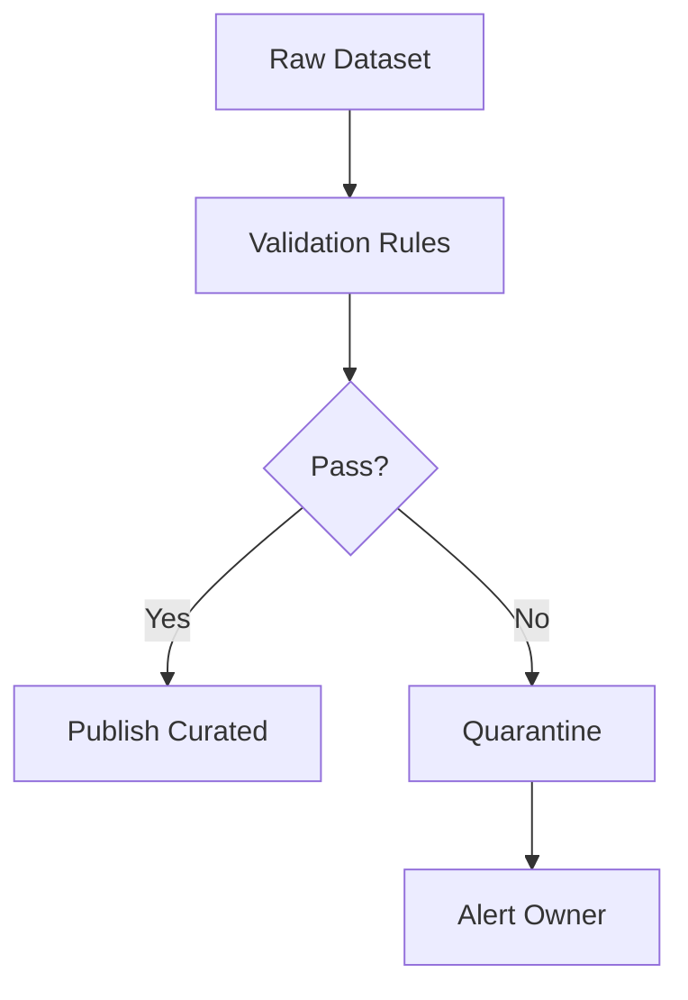

Rule praktis:

- raw boleh menerima data buruk;
- curated tidak boleh publish tanpa quality threshold;
- quality failure harus terlihat di dashboard;
- owner dataset harus jelas.

---

## 14. Lineage dan Auditability

Untuk sistem regulated, lineage bukan nice-to-have. Lineage menjawab:

- data berasal dari mana?
- diproses oleh job apa?
- versi logic mana yang menghasilkan output?
- kapan diproses?
- siapa yang mengakses?
- data apa yang berubah?
- evidence mana yang dipakai dalam keputusan?

Minimal lineage metadata:

```json
{
  "dataset": "curated.case_summary",
  "runId": "glue-run-20260701-091500",
  "sourceDatasets": ["raw.case_events", "raw.case_master"],
  "transformVersion": "case-summary-etl:1.8.3",
  "inputPartitions": ["dt=2026-07-01"],
  "outputPartition": "dt=2026-07-01",
  "recordCount": 182931,
  "qualityStatus": "PASSED"
}
```

Audit logs yang perlu:

- data access;
- permission grant/revoke;
- job execution;
- schema change;
- table publish;
- data deletion/retention action;
- cross-account share.

---

## 15. Governance Operating Model

Data governance gagal jika hanya tool, tanpa operating model.

Roles:

| Role | Responsibility |
|---|---|
| Data owner | business accountability atas dataset |
| Data steward | definisi, quality, classification |
| Data platform team | infrastructure, guardrails, self-service |
| Data engineer | pipeline dan transformation |
| Security/compliance | policy, audit, evidence |
| Analyst/consumer | penggunaan data sesuai purpose |

Workflow publish dataset:

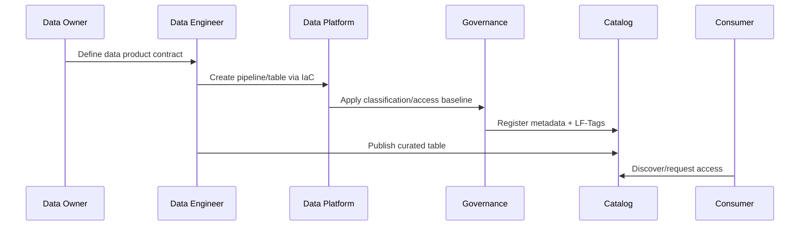

---

## 16. Cross-Account Data Architecture

Enterprise AWS hampir selalu multi-account. Data lake design harus mendukung:

- producer accounts;
- central data lake account;
- consumer accounts;
- security/audit account;
- shared services account.

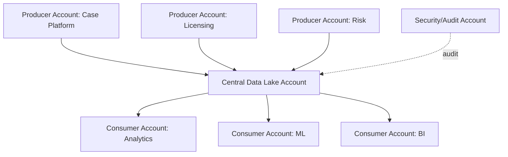

Decision points:

- push data to central lake vs share in place;
- bucket/account ownership;
- KMS key ownership;
- Lake Formation cross-account sharing;
- data egress/copy cost;
- compliance boundary;
- blast radius.

---

## 17. Security and Privacy

### 17.1 Data Classification

Minimal classification:

- public;
- internal;
- confidential;
- restricted;
- regulated/PII/secrets.

Classification harus memengaruhi:

- bucket/account placement;
- encryption key;
- Lake Formation tags;
- retention;
- sharing approval;
- masking/tokenization;
- audit requirement.

### 17.2 Encryption

Gunakan encryption at rest dan in transit sesuai baseline. Untuk data sensitif:

- KMS key ownership jelas;
- key policy tidak terlalu luas;
- separation of duties;
- audit key usage;
- cross-account decrypt dikontrol.

### 17.3 PII Handling

Controls:

- minimization;
- masking/tokenization;
- column-level permission;
- row-level filtering jika sesuai;
- purpose-based access;
- retention dan deletion workflow;
- audit query access.

---

## 18. Performance Engineering

### 18.1 Query Performance Levers

| Lever | Dampak |
|---|---|
| Columnar format | scan lebih sedikit |
| Compression | storage dan scan lebih hemat |
| Partitioning | pruning data |
| File compaction | overhead turun |
| Statistics | optimizer lebih baik jika didukung |
| Materialized table | query berat diprecompute |
| Workload isolation | team/query tidak saling ganggu |

### 18.2 Partition Design Example

Untuk event case:

- query utama filter by date range dan domain;
- volume besar per hari;
- domain cardinality kecil.

Maka:

```txt
s3://lake/curated/table=case_events/domain=enforcement/dt=2026-07-01/
```

Jangan partition by `case_id` jika query tidak selalu mencari satu case dan cardinality sangat tinggi.

### 18.3 Materialization Strategy

Daripada BI query melakukan join raw besar setiap kali, buat curated/materialized tables:

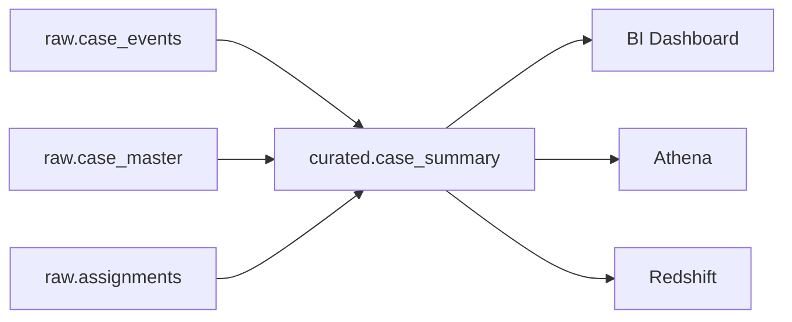

---

## 19. Cost Engineering

Cost data lake datang dari:

- S3 storage;
- S3 request;
- data transfer;
- Athena data scanned;
- Glue job runtime;
- Redshift compute/storage;
- Lake Formation/governance-related operations where applicable;
- CloudWatch logs/metrics;
- replication;
- small files overhead;
- repeated bad queries.

Cost controls:

- lifecycle policy;
- compression;
- columnar format;
- partitioning;
- workgroup query limits;
- curated datasets;
- compaction;
- dataset owner chargeback;
- tag-based allocation;
- delete obsolete data safely.

Unit economics:

```txt
cost_per_report =
  data_scanned_cost
+ warehouse_compute_cost
+ transformation_cost
+ storage_cost_allocated
+ governance/audit overhead
```

---

## 20. Reliability and Recovery

Data lake reliability bukan hanya durability S3. Pertanyaan recovery:

- Apakah pipeline idempotent?
- Apakah job bisa rerun untuk partition tertentu?
- Apakah output publish atomic atau bisa partial?
- Apakah corrupt partition bisa rollback?
- Apakah catalog update sinkron dengan data write?
- Apakah late-arriving data diproses ulang?
- Apakah access grants bisa dipulihkan?
- Apakah KMS key policy change bisa memblokir data?

### 20.1 Atomic Publish Pattern

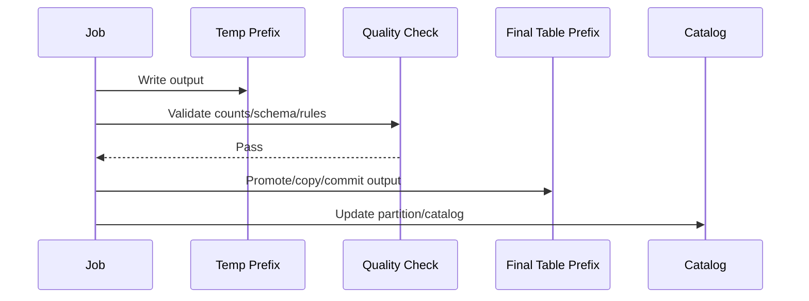

Jangan publish partial output ke curated path sebelum validasi selesai.

---

## 21. Regulated Enterprise Pattern: Evidence Lake

Untuk domain enforcement/regulatory, data lake sering menjadi evidence platform.

Requirements tambahan:

- immutability untuk raw evidence;
- retention sesuai regulasi;
- chain of custody;
- access audit;
- legal hold;
- classification;
- reproducibility of reports;
- versioned transformation;
- explainable derived metrics.

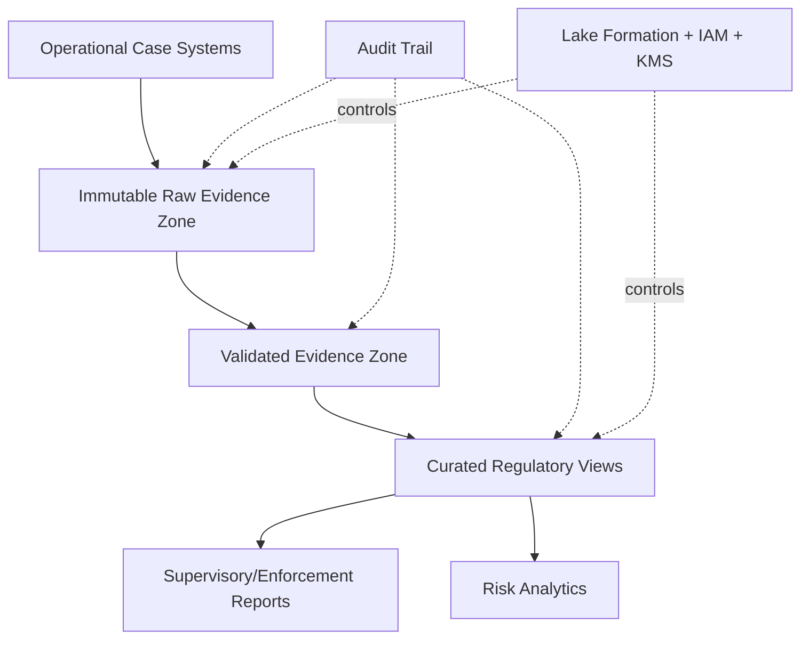

Engineering judgment:

- raw evidence jangan diubah;
- correction dilakukan sebagai new event/version;
- derived report harus reproducible;
- access harus purpose-based;
- deletion/retention harus policy-driven, bukan manual ad hoc.

---

## 22. Anti-Pattern

### 22.1 Data Swamp

Gejala:

- file tanpa owner;
- schema tidak jelas;
- partition tidak konsisten;
- data duplikat;
- permission manual;
- tidak ada quality check;
- query mahal dan lambat;
- analyst tidak tahu dataset mana benar.

### 22.2 Raw Zone Langsung Dipakai BI

BI langsung query raw events besar tanpa curated model.

Akibat:

- query lambat;
- cost tinggi;
- definisi metric tidak konsisten;
- laporan berbeda antar team.

### 22.3 Governance Hanya di S3 Policy

S3 policy penting, tetapi table/column/domain governance lebih sulit jika hanya bucket/prefix policy. Untuk analytics integrated, gunakan governance layer yang sesuai.

### 22.4 Tidak Ada Reprocessing Strategy

Pipeline hanya jalan forward. Ketika bug transform ditemukan, tidak bisa memperbaiki data historis dengan aman.

### 22.5 Semua Data Diload ke Warehouse

Warehouse menjadi mahal dan penuh data yang jarang dipakai. Data lake dan warehouse harus punya boundary.

---

## 23. Decision Framework

Sebelum membangun dataset baru, jawab:

1. Apa business question yang dataset ini jawab?
2. Siapa owner bisnis dan teknisnya?
3. Apa source system dan contract-nya?
4. Apa grain table?
5. Apa freshness SLA?
6. Apa classification dan PII status?
7. Apa retention policy?
8. Apa access model?
9. Apa partition strategy?
10. Apa file format?
11. Apa quality gates?
12. Bagaimana late data diproses?
13. Bagaimana backfill dan reprocessing?
14. Apakah Athena cukup atau butuh Redshift?
15. Bagaimana cost dialokasikan?
16. Bagaimana audit evidence dikumpulkan?

---

## 24. Deliberate Practice

### Latihan 1 — Data Lake Zone Design

Desain data lake untuk case management platform:

- operational source: case-service, assignment-service, document-service;
- data classification: confidential + PII;
- retention: 7 tahun;
- consumers: analytics team, enforcement dashboard, audit team;
- freshness curated: 15 menit.

Deliverable:

- account/bucket/prefix layout;
- zone semantics;
- catalog structure;
- LF-Tag model;
- ingestion pattern;
- curated tables;
- access control matrix.

### Latihan 2 — Athena Cost Optimization

Sebuah query dashboard scan 8 TB per run dan dijalankan 30 kali/hari.

Tugas:

- identifikasi penyebab cost;
- desain partitioning;
- ubah file format;
- buat curated aggregate;
- gunakan workgroup control;
- definisikan alarm/budget.

### Latihan 3 — Reprocessing Incident

Bug ditemukan di transformasi `case_risk_score` selama 45 hari terakhir.

Tugas:

- isolasi impacted partitions;
- rerun transform version baru;
- validate output;
- publish secara aman;
- preserve old version untuk audit;
- komunikasikan data freshness dan correction.

---

## 25. Checklist Self-Correction

- [ ] Apakah ini benar-benar data lake, bukan hanya bucket?
- [ ] Apakah setiap dataset punya owner?
- [ ] Apakah raw, validated, curated dipisahkan?
- [ ] Apakah schema curated eksplisit?
- [ ] Apakah catalog menjadi contract?
- [ ] Apakah Lake Formation/IAM/S3/KMS boundary jelas?
- [ ] Apakah PII diklasifikasi?
- [ ] Apakah partition strategy sesuai query pattern?
- [ ] Apakah small files dikontrol?
- [ ] Apakah quality gates ada?
- [ ] Apakah late-arriving data ditangani?
- [ ] Apakah reprocessing aman?
- [ ] Apakah query cost dibatasi?
- [ ] Apakah lineage cukup untuk audit?
- [ ] Apakah reports bisa direproduksi?

---

## 26. Ringkasan Engineering Judgment

Data lake production-grade bukan tentang menyimpan data sebanyak mungkin. Data lake yang baik membuat data:

- discoverable;
- governed;
- queryable;
- cost-efficient;
- secure;
- auditable;
- reproducible;
- useful untuk keputusan bisnis.

S3 memberi fondasi storage. Glue memberi metadata. Lake Formation memberi governance. Athena dan Redshift memberi query/analytics capability. Glue/EMR/pipeline tools memberi transformation. Tetapi value sebenarnya muncul saat semua ini disusun sebagai operating model dengan ownership, contract, quality, access, dan recovery.

Engineer top-tier tidak hanya bertanya “pakai Athena atau Redshift?”. Ia bertanya:

- data ini punya owner siapa?
- definisi metric mana yang authoritative?
- siapa boleh akses kolom apa?
- apakah laporan bisa direproduksi 2 tahun lagi?
- bagaimana membuktikan data tidak dimanipulasi?
- bagaimana mencegah data lake menjadi data swamp?

Itulah perbedaan antara cloud storage dan governed analytical platform.

---

## 27. Referensi Resmi

- AWS Glue Developer Guide: https://docs.aws.amazon.com/glue/latest/dg/what-is-glue.html
- AWS Glue Data Catalog: https://docs.aws.amazon.com/glue/latest/dg/catalog-and-crawler.html
- AWS Lake Formation Developer Guide: https://docs.aws.amazon.com/lake-formation/latest/dg/what-is-lake-formation.html
- Lake Formation permissions reference: https://docs.aws.amazon.com/lake-formation/latest/dg/lf-permissions-reference.html
- Lake Formation service integrations: https://docs.aws.amazon.com/lake-formation/latest/dg/service-integrations.html
- Using Lake Formation with Athena: https://docs.aws.amazon.com/lake-formation/latest/dg/athena-lf.html
- Amazon Athena User Guide: https://docs.aws.amazon.com/athena/latest/ug/what-is.html
- Amazon Redshift Management Guide: https://docs.aws.amazon.com/redshift/latest/mgmt/welcome.html
- Redshift Spectrum with Lake Formation: https://docs.aws.amazon.com/lake-formation/latest/dg/RSPC-lf.html
- Amazon S3 User Guide: https://docs.aws.amazon.com/AmazonS3/latest/userguide/Welcome.html
